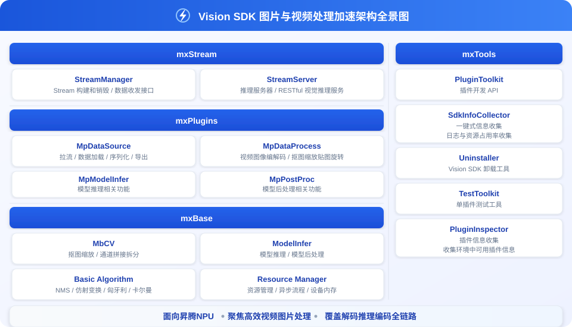

<h1 align="center">Vision SDK</h1>

[![Zread](https://img.shields.io/badge/Zread-Ask_AI-_.svg?style=flat&color=0052D9&labelColor=000000&logo=data%3Aimage%2Fsvg%2Bxml%3Bbase64%2CPHN2ZyB3aWR0aD0iMTYiIGhlaWdodD0iMTYiIHZpZXdCb3g9IjAgMCAxNiAxNiIgZmlsbD0ibm9uZSIgeG1sbnM9Imh0dHA6Ly93d3cudzMub3JnLzIwMDAvc3ZnIj4KPHBhdGggZD0iTTQuOTYxNTYgMS42MDAxSDIuMjQxNTZDMS44ODgxIDEuNjAwMSAxLjYwMTU2IDEuODg2NjQgMS42MDE1NiAyLjI0MDFWNC45NjAxQzEuNjAxNTYgNS4zMTM1NiAxLjg4ODEgNS42MDAxIDIuMjQxNTYgNS42MDAxSDQuOTYxNTZDNS4zMTUwMiA1LjYwMDEgNS42MDE1NiA1LjMxMzU2IDUuNjAxNTYgNC45NjAxVjIuMjQwMUM1LjYwMTU2IDEuODg2NjQgNS4zMTUwMiAxLjYwMDEgNC45NjE1NiAxLjYwMDFaIiBmaWxsPSIjZmZmIi8%2BCjxwYXRoIGQ9Ik00Ljk2MTU2IDEwLjM5OTlIMi4yNDE1NkMxLjg4ODEgMTAuMzk5OSAxLjYwMTU2IDEwLjY4NjQgMS42MDE1NiAxMS4wMzk5VjEzLjc1OTlDMS42MDE1NiAxNC4xMTM0IDEuODg4MSAxNC4zOTk5IDIuMjQxNTYgMTQuMzk5OUg0Ljk2MTU2QzUuMzE1MDIgMTQuMzk5OSA1LjYwMTU2IDE0LjExMzQgNS42MDE1NiAxMy43NTk5VjExLjAzOTlDNS42MDE1NiAxMC42ODY0IDUuMzE1MDIgMTAuMzk5OSA0Ljk2MTU2IDEwLjM5OTlaIiBmaWxsPSIjZmZmIi8%2BCjxwYXRoIGQ9Ik0xMy43NTg0IDEuNjAwMUgxMS4wMzg0QzEwLjY4NSAxLjYwMDEgMTAuMzk4NCAxLjg4NjY0IDEwLjM5ODQgMi4yNDAxVjQuOTYwMUMxMC4zOTg0IDUuMzEzNTYgMTAuNjg1IDUuNjAwMSAxMS4wMzg0IDUuNjAwMUgxMy43NTg0QzE0LjExMTkgNS42MDAxIDE0LjM5ODQgNS4zMTM1NiAxNC4zOTg0IDQuOTYwMVYyLjI0MDFDMTQuMzk4NCAxLjg4NjY0IDE0LjExMTkgMS42MDAxIDEzLjc1ODQgMS42MDAxWiIgZmlsbD0iI2ZmZiIvPgo8cGF0aCBkPSJNNCAxMkwxMiA0TDQgMTJaIiBmaWxsPSIjZmZmIi8%2BCjxwYXRoIGQ9Ik00IDEyTDEyIDQiIHN0cm9rZT0iI2ZmZiIgc3Ryb2tlLXdpZHRoPSIxLjUiIHN0cm9rZS1saW5lY2FwPSJyb3VuZCIvPgo8L3N2Zz4K&logoColor=ffffff)](https://zread.ai/Ascend/VisionSDK)
[![DeepWiki](https://img.shields.io/badge/DeepWiki-Ask_AI-_.svg?style=flat&color=0052D9&labelColor=000000&logo=data:image/png;base64,iVBORw0KGgoAAAANSUhEUgAAACwAAAAyCAYAAAAnWDnqAAAAAXNSR0IArs4c6QAAA05JREFUaEPtmUtyEzEQhtWTQyQLHNak2AB7ZnyXZMEjXMGeK/AIi+QuHrMnbChYY7MIh8g01fJoopFb0uhhEqqcbWTp06/uv1saEDv4O3n3dV60RfP947Mm9/SQc0ICFQgzfc4CYZoTPAswgSJCCUJUnAAoRHOAUOcATwbmVLWdGoH//PB8mnKqScAhsD0kYP3j/Yt5LPQe2KvcXmGvRHcDnpxfL2zOYJ1mFwrryWTz0advv1Ut4CJgf5uhDuDj5eUcAUoahrdY/56ebRWeraTjMt/00Sh3UDtjgHtQNHwcRGOC98BJEAEymycmYcWwOprTgcB6VZ5JK5TAJ+fXGLBm3FDAmn6oPPjR4rKCAoJCal2eAiQp2x0vxTPB3ALO2CRkwmDy5WohzBDwSEFKRwPbknEggCPB/imwrycgxX2NzoMCHhPkDwqYMr9tRcP5qNrMZHkVnOjRMWwLCcr8ohBVb1OMjxLwGCvjTikrsBOiA6fNyCrm8V1rP93iVPpwaE+gO0SsWmPiXB+jikdf6SizrT5qKasx5j8ABbHpFTx+vFXp9EnYQmLx02h1QTTrl6eDqxLnGjporxl3NL3agEvXdT0WmEost648sQOYAeJS9Q7bfUVoMGnjo4AZdUMQku50McDcMWcBPvr0SzbTAFDfvJqwLzgxwATnCgnp4wDl6Aa+Ax283gghmj+vj7feE2KBBRMW3FzOpLOADl0Isb5587h/U4gGvkt5v60Z1VLG8BhYjbzRwyQZemwAd6cCR5/XFWLYZRIMpX39AR0tjaGGiGzLVyhse5C9RKC6ai42ppWPKiBagOvaYk8lO7DajerabOZP46Lby5wKjw1HCRx7p9sVMOWGzb/vA1hwiWc6jm3MvQDTogQkiqIhJV0nBQBTU+3okKCFDy9WwferkHjtxib7t3xIUQtHxnIwtx4mpg26/HfwVNVDb4oI9RHmx5WGelRVlrtiw43zboCLaxv46AZeB3IlTkwouebTr1y2NjSpHz68WNFjHvupy3q8TFn3Hos2IAk4Ju5dCo8B3wP7VPr/FGaKiG+T+v+TQqIrOqMTL1VdWV1DdmcbO8KXBz6esmYWYKPwDL5b5FA1a0hwapHiom0r/cKaoqr+27/XcrS5UwSMbQAAAABJRU5ErkJggg==)](https://deepwiki.com/Ascend/VisionSDK)

## ✨ 最新消息

🔹 **[2026.04.25]**: [VisionSDK 26.0.0 Release 版本发布](https://gitcode.com/Ascend/VisionSDK/releases/v26.0.0) 
🔹 **[2025.12.30]**: 🚀 VISIONSDK 开源发布 

## ℹ️ 简介

Vision SDK是面向图片和视频视觉分析的SDK，提供了基本的视频、图像智能分析能力及编程框架。 
通过API接口方式开发，提供原生的推理API以及算子加速库，用户可通过调用API接口的方式开发应用。对于有固定应用开发流程的用户，建议采用此方式，借用Vision SDK提供算法加速能力构建CV应用。 
通过流程编排方式开发，采用模块化的设计理念，将业务流程中的各个功能单元封装成独立的插件。用户可以用流程编排的方式，通过插件的串接快速构建业务，进行应用开发。此方式提供常用功能插件，具备流程编排能力，提供插件自定义开发功能。

## 🚀 快速入门

请参见[安装指南](./docs/zh/installation_guide.md)自行选择物理机、容器或者pip wheel安装方式。通过源码构建时，`build_all.sh`会同时生成run包和用于pip安装的`visionsdk` wheel包。

面向 C++ 与 Python 场景，也可以通过 流程编排方式 ，助力用户快速上手图片或视频处理。

| 训练框架      | 快速入门指南 |
|-----------|----------------|
| C++   | 《[C++开发样例](./docs/zh/quick_start.md#21-api接口开发方式c)》 |
| Python | 《[Python开发样例](./docs/zh/quick_start.md#22-api接口开发方式python)》 |
| 流程编排 | 《[流程编排开发样例](./docs/zh/quick_start.md#23-流程编排开发方式)》 |

## 📦 安装部署

请参见《[安装部署](./docs/zh/installation_guide.md)》自行选择物理机或者容器的部署方式。

## 📘 API参考

| 文档 | 说明 |
| - | - |
|[C++接口说明文档](./docs/zh/api/cpp/README.md)| C++API目录与数据类型枚举 |
|[Python接口说明文档](./docs/zh/api/python/README.md)| PythonAPI目录与数据类型枚举 |
|[插件接口说明文档](./docs/zh/api/plugins/README.md)| 插件说明 |

## 🛠️ 贡献指南

欢迎参与项目贡献，请参见《[贡献指南](./CONTRIBUTING.md)》

## ⚖️ 相关说明

🔹 《[版本说明](./docs/zh/release_notes_vision.md) 
🔹 《[木兰许可证](LICENSE.md)》 
🔹 《[CC BY 4.0许可证](./docs/LICENSE)》 
🔹 《[安全加固](./docs/zh/security_hardening.md)》 
🔹 《[免责声明](./docs/zh/disclaimer.md)》 
🔹 《[第三方开源软件声明](./Third_Party_Open_Source_Software_Notice)》

## 🤝 建议与交流

如您在使用或参与过程中有任何问题与想法，可通过以下渠道与我们沟通、提交反馈或加入社区交流。

| 资源 | 链接 |
|:--|:--|
| [FAQ](./docs/zh/faq.md) | 常见问题解答与使用答疑 |
| [创建Issue](https://gitcode.com/Ascend/VisionSDK/issues) | 提交 Bug、需求或建议 |
| [社区任务](https://gitcode.com/Ascend/VisionSDK/issues/13) | 查看和认领社区任务 |
| [会议日历](https://meeting.ascend.osinfra.cn/?sig=sig-MindSeriesSDK) | 社区定期例会与活动日程 |
