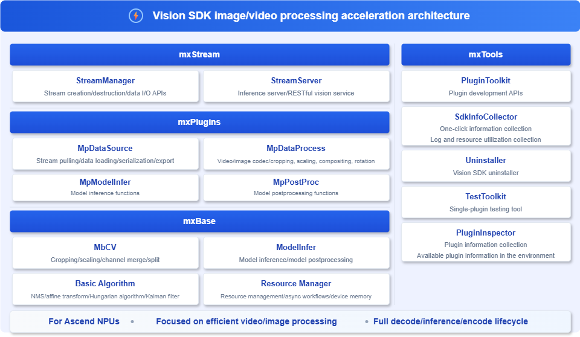

<h1 align="center">Vision SDK</h1>

[![Zread](https://img.shields.io/badge/Zread-Ask_AI-_.svg?style=flat&color=0052D9&labelColor=000000&logo=data%3Aimage%2Fsvg%2Bxml%3Bbase64%2CPHN2ZyB3aWR0aD0iMTYiIGhlaWdodD0iMTYiIHZpZXdCb3g9IjAgMCAxNiAxNiIgZmlsbD0ibm9uZSIgeG1sbnM9Imh0dHA6Ly93d3cudzMub3JnLzIwMDAvc3ZnIj4KPHBhdGggZD0iTTQuOTYxNTYgMS42MDAxSDIuMjQxNTZDMS44ODgxIDEuNjAwMSAxLjYwMTU2IDEuODg2NjQgMS42MDE1NiAyLjI0MDFWNC45NjAxQzEuNjAxNTYgNS4zMTM1NiAxLjg4ODEgNS42MDAxIDIuMjQxNTYgNS42MDAxSDQuOTYxNTZDNS4zMTUwMiA1LjYwMDEgNS42MDE1NiA1LjMxMzU2IDUuNjAxNTYgNC45NjAxVjIuMjQwMUM1LjYwMTU2IDEuODg2NjQgNS4zMTUwMiAxLjYwMDEgNC45NjE1NiAxLjYwMDFaIiBmaWxsPSIjZmZmIi8%2BCjxwYXRoIGQ9Ik00Ljk2MTU2IDEwLjM5OTlIMi4yNDE1NkMxLjg4ODEgMTAuMzk5OSAxLjYwMTU2IDEwLjY4NjQgMS42MDE1NiAxMS4wMzk5VjEzLjc1OTlDMS42MDE1NiAxNC4xMTM0IDEuODg4MSAxNC4zOTk5IDIuMjQxNTYgMTQuMzk5OUg0Ljk2MTU2QzUuMzE1MDIgMTQuMzk5OSA1LjYwMTU2IDE0LjExMzQgNS42MDE1NiAxMy43NTk5VjExLjAzOTlDNS42MDE1NiAxMC42ODY0IDUuMzE1MDIgMTAuMzk5OSA0Ljk2MTU2IDEwLjM5OTlaIiBmaWxsPSIjZmZmIi8%2BCjxwYXRoIGQ9Ik0xMy43NTg0IDEuNjAwMUgxMS4wMzg0QzEwLjY4NSAxLjYwMDEgMTAuMzk4NCAxLjg4NjY0IDEwLjM5ODQgMi4yNDAxVjQuOTYwMUMxMC4zOTg0IDUuMzEzNTYgMTAuNjg1IDUuNjAwMSAxMS4wMzg0IDUuNjAwMUgxMy43NTg0QzE0LjExMTkgNS42MDAxIDE0LjM5ODQgNS4zMTM1NiAxNC4zOTg0IDQuOTYwMVYyLjI0MDFDMTQuMzk4NCAxLjg4NjY0IDE0LjExMTkgMS42MDAxIDEzLjc1ODQgMS42MDAxWiIgZmlsbD0iI2ZmZiIvPgo8cGF0aCBkPSJNNCAxMkwxMiA0TDQgMTJaIiBmaWxsPSIjZmZmIi8%2BCjxwYXRoIGQ9Ik00IDEyTDEyIDQiIHN0cm9rZT0iI2ZmZiIgc3Ryb2tlLXdpZHRoPSIxLjUiIHN0cm9rZS1saW5lY2FwPSJyb3VuZCIvPgo8L3N2Zz4K&logoColor=ffffff)](https://zread.ai/Ascend/VisionSDK)
[![DeepWiki](https://img.shields.io/badge/DeepWiki-Ask_AI-_.svg?style=flat&color=0052D9&labelColor=000000&logo=data:image/png;base64,iVBORw0KGgoAAAANSUhEUgAAACwAAAAyCAYAAAAnWDnqAAAAAXNSR0IArs4c6QAAA05JREFUaEPtmUtyEzEQhtWTQyQLHNak2AB7ZnyXZMEjXMGeK/AIi+QuHrMnbChYY7MIh8g01fJoopFb0uhhEqqcbWTp06/uv1saEDv4O3n3dV60RfP947Mm9/SQc0ICFQgzfc4CYZoTPAswgSJCCUJUnAAoRHOAUOcATwbmVLWdGoH//PB8mnKqScAhsD0kYP3j/Yt5LPQe2KvcXmGvRHcDnpxfL2zOYJ1mFwrryWTz0advv1Ut4CJgf5uhDuDj5eUcAUoahrdY/56ebRWeraTjMt/00Sh3UDtjgHtQNHwcRGOC98BJEAEymycmYcWwOprTgcB6VZ5JK5TAJ+fXGLBm3FDAmn6oPPjR4rKCAoJCal2eAiQp2x0vxTPB3ALO2CRkwmDy5WohzBDwSEFKRwPbknEggCPB/imwrycgxX2NzoMCHhPkDwqYMr9tRcP5qNrMZHkVnOjRMWwLCcr8ohBVb1OMjxLwGCvjTikrsBOiA6fNyCrm8V1rP93iVPpwaE+gO0SsWmPiXB+jikdf6SizrT5qKasx5j8ABbHpFTx+vFXp9EnYQmLx02h1QTTrl6eDqxLnGjporxl3NL3agEvXdT0WmEost648sQOYAeJS9Q7bfUVoMGnjo4AZdUMQku50McDcMWcBPvr0SzbTAFDfvJqwLzgxwATnCgnp4wDl6Aa+Ax283gghmj+vj7feE2KBBRMW3FzOpLOADl0Isb5587h/U4gGvkt5v60Z1VLG8BhYjbzRwyQZemwAd6cCR5/XFWLYZRIMpX39AR0tjaGGiGzLVyhse5C9RKC6ai42ppWPKiBagOvaYk8lO7DajerabOZP46Lby5wKjw1HCRx7p9sVMOWGzb/vA1hwiWc6jm3MvQDTogQkiqIhJV0nBQBTU+3okKCFDy9WwferkHjtxib7t3xIUQtHxnIwtx4mpg26/HfwVNVDb4oI9RHmx5WGelRVlrtiw43zboCLaxv46AZeB3IlTkwouebTr1y2NjSpHz68WNFjHvupy3q8TFn3Hos2IAk4Ju5dCo8B3wP7VPr/FGaKiG+T+v+TQqIrOqMTL1VdWV1DdmcbO8KXBz6esmYWYKPwDL5b5FA1a0hwapHiom0r/cKaoqr+27/XcrS5UwSMbQAAAABJRU5ErkJggg==)](https://deepwiki.com/Ascend/VisionSDK)

## ✨ Latest News

🔹 **[Apr. 25, 2026]**: [Vision SDK 26.0.0 Release Version](https://atomgit.com/Ascend/VisionSDK/releases/v26.0.0) released. 
🔹 **[Dec. 30, 2025]**: 🚀 Vision SDK is released as open source. 

## ℹ️ Introduction

Vision SDK is an SDK for visual analysis of images and videos. It provides basic video and image intelligence analysis capabilities and a programming framework. 
For API-based development, Vision SDK provides native inference APIs and an operator acceleration library. You can develop applications by calling the APIs. If your application follows a fixed development workflow, you are advised to use this approach to build computer vision applications with the algorithm acceleration capabilities provided by Vision SDK. 
For workflow orchestration development, Vision SDK uses a modular design philosophy to package each functional unit in a business process as an independent plugin. You can quickly build a business solution by connecting plugins through workflow orchestration and use it for application development. This approach provides commonly used function plugins, orchestration capabilities, and support for custom plugin development.

## 🚀 Quick Start

See the [Installation Guide](./docs/en/installation_guide.md) to choose an installation method: a physical machine, a container, or pip wheel. When building from source, `build_all.sh` generates both the run package and the `visionsdk` wheel package for pip installation.

For C++ and Python scenarios, you can also use the workflow orchestration method to quickly get started with image or video processing.

| Training Framework | Quick Start Guide |
|-----------|----------------|
| C++ | [C++ Development Example](./docs/en/quick_start.md#21-api-development-c) |
| Python | [Python Development Example](./docs/en/quick_start.md#22-api-development-python) |
| Workflow Orchestration | [Workflow Orchestration Development Example](./docs/en/quick_start.md#23-pipeline-based-development) |

## 📦 Installation and Deployment

See [Installation and Deployment](./docs/en/installation_guide.md) to choose the deployment method for a physical machine or a container.

## 📘 API Reference

| Document | Description |
| - | - |
| [C++ Interface Documentation](./docs/en/api/cpp/README.md) | C++ API directory and data type enumeration |
| [Python Interface Documentation](./docs/en/api/python/README.md) | Python API directory and data type enumeration |
| [Plugin Interface Documentation](./docs/en/api/plugins/README.md) | Plugin description |

## 🛠️ Contribution Guide

You are welcome to contribute to the project. See the [Contribution Guide](./CONTRIBUTING.md).

## ⚖️ Related Notes

🔹 [Release Notes](./docs/en/release_notes_vision.md) 
🔹 [Mulan License](LICENSE.md) 
🔹 [CC BY 4.0 License](./docs/LICENSE) 
🔹 [Security Hardening](./docs/en/security_hardening.md) 
🔹 [Disclaimer](./docs/en/disclaimer.md) 

## 🤝 Feedback and Communication

If you have any questions or ideas during use or participation, you can communicate with us, submit feedback, or join the community through the following channels.

| Resource | Link |
|:--|:--|
| [FAQ](./docs/en/faq.md) | Frequently asked questions and answers |
| [Create an Issue](https://atomgit.com/Ascend/VisionSDK/issues) | Submit bugs, requirements, or suggestions |
| [Community Tasks](https://atomgit.com/Ascend/VisionSDK/issues/13) | View and claim community tasks |
| [Meeting Calendar](https://meeting.ascend.osinfra.cn/?sig=sig-MindSeriesSDK) | Regular community meetings and event schedule |
