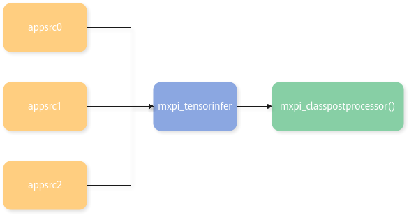

# Inference Plugins 

## `mxpi_modelinfer` 

> [!NOTE] 
>This plugin is deprecated from the current version onward. Use the mxpi_tensorinfer plugin instead.

<table><tbody><tr><th class="firstcol" valign="top" width="20%"><p>Function Description</p>
</th>
<td class="cellrowborder" valign="top" width="80%" headers="mcps1.1.3.1.1 "><p>Target classification or detection.</p>
</td>
</tr>
<tr><th class="firstcol" valign="top" width="20%"><p>Constraints</p>
</th>
<td class="cellrowborder" valign="top" width="80%" headers="mcps1.1.3.2.1 "><p>Currently, it supports only inference models with a single tensor input (image data).</p>
</td>
</tr>
<tr><th class="firstcol" valign="top" width="20%"><p>Plugin Base Class (factory)</p>
</th>
<td class="cellrowborder" valign="top" width="80%" headers="mcps1.1.3.3.1 "><p>mxpi_modelinfer</p>
</td>
</tr>
<tr><th class="firstcol" valign="top" width="20%"><p>Input and Output</p>
</th>
<td class="cellrowborder" valign="top" width="80%" headers="mcps1.1.3.4.1 "><ul><li>Input: buffer (data type "MxpiBuffer")、metadata (data type "MxpiVisionList").</li><li>Output: buffer (data type "MxpiBuffer")、metadata (data type "MxpiObjectList", "MxpiClassList", "MxpiAttributeList", "MxpiFeatureVectorList", or "MxpiTensorPackageList" (when post-processing is not used)).</li></ul>
</td>
</tr>
<tr><th class="firstcol" valign="top" width="20%"><p>Port Format (caps)</p>
</th>
<td class="cellrowborder" valign="top" width="80%" headers="mcps1.1.3.5.1 "><ul><li>Static input: {"image/yuv"}.</li><li>Static output: {"metadata/object", "metadata/class", "metadata/attribute", "metadata/feature-vector", "metadata/tensor"}.</li></ul>
</td>
</tr>
<tr><th class="firstcol" valign="top" width="20%"><p>Parameters</p>
</th>
<td class="cellrowborder" valign="top" width="80%" headers="mcps1.1.3.6.1 "><p>See <a href="#table59552521422116">Table 1</a>.</p>
</td>
</tr>
</tbody>
</table>

**Table 1** Properties of the mxpi_modelinfer plugin<a id="table59552521422116"></a>

|Property|Description|Required|Modifiable|
|--|--|--|--|
|modelPath|Path of the inference model `.om` file. The model size can be up to 4 GB. The model owner must be the current user and the permissions must not exceed 640.|Yes|Yes|
|postProcessConfigPath|Path of the post-processing configuration file.|No|Yes|
|postProcessConfigContent|Post-processing configuration content.|No|Yes|
|labelPath|Path of the post-processing category label file.|No|Yes|
|parentName|The index that corresponds to the input data, usually an upstream element name. Its function is the same as `dataSource`. Use `dataSource` instead. This property will be removed in a later version.|Do not use|Yes|
|dataSource|The index that corresponds to the input data, usually an upstream element name. The default value is the metadata key of the corresponding output port of the upstream plugin.|Yes|Yes|
|postProcessLibPath|Path of the post-processing dynamic-link library `.so` file. If you do not specify it, the plugin does not perform post-processing. It writes the model inference result directly into metadata `MxpiTensorPackageList` and copies memory to the location specified by `outputDeviceId`.|No|Yes|
|deviceId|Chip ID of the Ascend device in use. No configuration is required. It is set uniformly by the `deviceId` property in the `stream_config` field.|No|Yes|
|tensorFormat|`0` for NHWC, `1` for NCHW. The default value is 0.|No|Yes|
|pictureCropName|Indicates whether the plugin needs to map inference coordinates back to the original image before cropping. By default, if you do not set this property, mapping is not performed. If you need mapping, enter the corresponding cropping plugin name.|No|Yes|
|waitingTime|Wait time that a multi-batch model can tolerate for a batch group. After this time elapses, the plugin stops waiting and completes inference automatically. The default value is 5000 ms.|No|Yes|
|outputDeviceId|When you do not use a post-processing `.so` file, memory is copied to the location specified by `outputDeviceId`. Set this to `-1` to copy to Host. To copy to Device, set it to the `deviceId` in the `stream_config` field.|No|Yes|
|dynamicStrategy|Strategy for choosing an appropriate batch size in dynamic batch inference. The default value is `Nearest`. `Nearest`: chooses the batch size whose absolute difference from the cached image count is closest (if equal, the larger one is chosen). `Upper`: chooses the smallest batch size greater than or equal to the cached image count. `Lower`: chooses the largest batch size less than or equal to the cached image count. The upper limit is 128. Set the number of images to infer based on the model batch size. Images exceeding the maximum batch size are not inferred.|No|Yes|
|checkImageAlignInfo|Image alignment width and height check. The type is `string`. The default value is `on` (validation enabled). Set to `off` to disable.|No|Yes|

> [!NOTE] 
>
>- `parentName` exists for backward compatibility. Use `dataSource` instead. The two properties work in the same way. Use only one of them at a time.
>- Both `postProcessConfigContent` and `postProcessConfigPath` are used to obtain the post-processing configuration. The difference is that one specifies the content directly, and the other specifies a file path. In practice, you need to use only one of them.

**Model Post-processing Introduction**

For details, see [Model Post-processing Class Reference (modelinfer framework)](../cpp/model_postprocessing.md#model-postprocessing-class-reference-modelinfer-framework).

## `mxpi_tensorinfer` 

<table><tbody><tr><th class="firstcol" valign="top" width="20%"><p>Function Description</p>
</th>
<td class="cellrowborder" valign="top" width="80%" headers="mcps1.1.3.1.1 "><p>Performs inference on the input tensors.</p>
</td>
</tr>
<tr><th class="firstcol" valign="top" width="20%"><p>Synchronous/Asynchronous (status)</p>
</th>
<td class="cellrowborder" valign="top" width="80%" headers="mcps1.1.3.2.1 "><p>Synchronous</p>
</td>
</tr>
<tr><th class="firstcol" valign="top" width="20%"><p>Constraints</p>
</th>
<td class="cellrowborder" valign="top" width="80%" headers="mcps1.1.3.3.1 "><p>None</p>
</td>
</tr>
<tr><th class="firstcol" valign="top" width="20%"><p>Plugin Base Class (factory)</p>
</th>
<td class="cellrowborder" valign="top" width="80%" headers="mcps1.1.3.4.1 "><p>mxpi_tensorinfer</p>
</td>
</tr>
<tr><th class="firstcol" valign="top" width="20%"><p>Input and Output</p>
</th>
<td class="cellrowborder" valign="top" width="80%" headers="mcps1.1.3.5.1 "><ul><li>Input: data type "MxpiTensorPackageList" (when compatible with "MxpiVisionList", it is automatically converted to "MxpiTensorPackageList" with three channels).</li><li>Output: data type "MxpiTensorPackageList".</li></ul>
</td>
</tr>
<tr><th class="firstcol" valign="top" width="20%"><p>Port Format (caps)</p>
</th>
<td class="cellrowborder" valign="top" width="80%" headers="mcps1.1.3.6.1 "><ul><li>Static input: {"metadata/tensor"}, Dynamic input: {"image/yuv"}. At least one port is required, and multiple ports are allowed.</li><li>Static output: {"metadata/tensor"}.</li></ul>
</td>
</tr>
<tr><th class="firstcol" valign="top" width="20%"><p>Parameters</p>
</th>
<td class="cellrowborder" valign="top" width="80%" headers="mcps1.1.3.7.1 "><p>See <a href="#table59552521422117">Table 1</a>.</p>
</td>
</tr>
</tbody>
</table>

**Table 1** Properties of the mxpi_tensorinfer plugin<a id="table59552521422117"></a>

|Property|Description|Required|Modifiable|
|--|--|--|--|
|modelPath|Path of the inference model `.om` file. The model size can be up to 4 GB. The model owner must be the current user and the permissions must not exceed 640.|Yes|Yes|
|outputDeviceId|When you do not use a post-processing `.so` file, memory is copied to the location specified by `outputDeviceId`. Set to `-1` to copy to Host. To copy to Device, set it to the `deviceId` in the `stream_config` field.|No|Yes|
|waitingTime|Wait time that a multi-batch model can tolerate for a batch group. After this time elapses, the plugin stops waiting and completes inference automatically. The default value is 5000 ms.|No|Yes|
|dynamicStrategy|Strategy for choosing an appropriate batch size in dynamic batch inference. The default value is `Nearest`. `Nearest`: chooses the batch size whose absolute difference from the cached image count is closest (if equal, the larger one is chosen). `Upper`: chooses the smallest batch size greater than or equal to the cached image count. `Lower`: chooses the largest batch size less than or equal to the cached image count.|No|Yes|
|singleBatchInfer|Single-batch inference switch. Boolean. Default value: `0`. `0`: automatically chooses single-batch or multi-batch inference based on the first dimension of the model. `1`: performs only single-batch inference, regardless of whether the first dimension is 1.|No|Yes|
|outputHasBatchDim|Whether the model output dimension has a batch dimension. If it does not, the inference plugin automatically adds a batch dimension to the output tensor. Boolean. Default value: `1`. `0`: no. `1`: yes.|No|Yes|
|skipModelCheck|Skip model data input validation.|No|No|

**Example**

The plugin waits until data from all preceding plugins arrives, then enters the `Process` interface (synchronous mode SYNC). It assembles the `MxpiTensorPackageList` (or `MxpiVisionList`). If the assembled tensor matches the model input tensor, the plugin starts inference and outputs the result to the output port.



Pipeline example: 

```json
"mxpi_tensorinfer0": {
 "props": {
 "dataSource": "appsrc0,appsrc1,appsrc2",
 "modelPath": "../models/bert/bert.om"
 },
 "factory": "mxpi_tensorinfer",
 "next": "mxpi_classpostprocessor0"
},
```

> [!NOTE] 
>When you use inference results for accuracy testing, the preprocessing method before model inference should match the preprocessing method used when the model was trained, including but not limited to the resizing method, interpolation method, cropping method, and alignment method.
