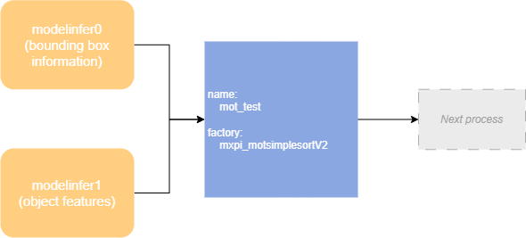

# Intelligent Video Analysis (IVA) Plugins 

## `mxpi_motsimplesort` 

> [!NOTE]
>This plugin is scheduled for deprecation. Use the mxpi_motsimplesortV2 plugin instead.

<table><tbody><tr><th class="firstcol" valign="top" width="20%">
Function Description

</th>
<td class="cellrowborder" valign="top" width="80%" headers="mcps1.1.3.1.1 ">
Implements multi-object (including vehicles, non-human targets, and people) track recording functionality.

</td>
</tr>
<tr><th class="firstcol" valign="top" width="20%">
<strong>Constraints</strong>

</th>
<td class="cellrowborder" valign="top" width="80%" headers="mcps1.1.3.2.1 ">
None

</td>
</tr>
<tr><th class="firstcol" valign="top" width="20%">
<strong>Plugin Base Class (factory)</strong>

</th>
<td class="cellrowborder" valign="top" width="80%" headers="mcps1.1.3.3.1 ">
mxpi_motsimplesort

</td>
</tr>
<tr><th class="firstcol" valign="top" width="20%">
<strong>Input and Output</strong>

</th>
<td class="cellrowborder" valign="top" width="80%" headers="mcps1.1.3.4.1 "><ul><li>Static input: buffer (data type "MxpiBuffer")、Dynamic input: metadata (data type "MxpiObjectList").</li><li>Static output: buffer (data type "MxpiBuffer")、metadata (data type "MxpiTrackLetList").</li></ul>
</td>
</tr>
<tr><th class="firstcol" valign="top" width="20%">
<strong>Parameters</strong>

</th>
<td class="cellrowborder" valign="top" width="80%" headers="mcps1.1.3.5.1 ">
See <a href="#table20974551943811">Table 1</a>.

</td>
</tr>
</tbody>
</table>

**Table 1** Properties of the mxpi_motsimplesort plugin

|Property|Description|Required|Modifiable|
|--|--|--|--|
|dataSourceDetection|Index of the detected bounding-box data after model inference. In most cases, this is the upstream element name.|Yes|Yes|
|dataSourceFeature|Index of the detected feature data after feature extraction. In most cases, this is the upstream element name.|No|Yes|
|trackThreshold|Probability threshold that determines whether a tracking object belongs to the same target. A value greater than this threshold means the same object. Default value: 0.5. Range: [0, 1.0].|No|Yes|
|lostThreshold|Frame threshold for a lost tracking target. When the frame count is greater than this threshold, the moving target is considered lost. Default value: 5. Range: [0, 10].|No|Yes|

## `mxpi_motsimplesortV2` 

<table><tbody><tr><th class="firstcol" valign="top" width="20%">
Function Description

</th>
<td class="cellrowborder" valign="top" width="80%" headers="mcps1.1.3.1.1 ">
Implements multi-object (including vehicles, non-human targets, and people) track recording functionality.Compared with the previous version, the differences are: 

<ul><li>Version 2 adjusts the plugin input ports: when only object bounding box information is used for MOT, only one input port needs to be connected. If object feature information is also used for MOT, two input ports need to be connected.</li><li>The dataSource property is automatically configured.</li></ul>
</td>
</tr>
<tr><th class="firstcol" valign="top" width="20%">
Synchronous/Asynchronous (status)

</th>
<td class="cellrowborder" valign="top" width="80%" headers="mcps1.1.3.2.1 ">
Synchronous

</td>
</tr>
<tr><th class="firstcol" valign="top" width="20%">
<strong>Constraints</strong>

</th>
<td class="cellrowborder" valign="top" width="80%" headers="mcps1.1.3.3.1 ">
None

</td>
</tr>
<tr><th class="firstcol" valign="top" width="20%">
<strong>Plugin Base Class (factory)</strong>

</th>
<td class="cellrowborder" valign="top" width="80%" headers="mcps1.1.3.4.1 ">
mxpi_motsimplesortV2

</td>
</tr>
<tr><th class="firstcol" valign="top" width="20%">
<strong>Input and Output</strong>

</th>
<td class="cellrowborder" valign="top" width="80%" headers="mcps1.1.3.5.1 "><ul><li>Input: buffer (data type "MxpiBuffer")、metadata (data type "MxpiObjectList").</li><li>Output: buffer (data type "MxpiBuffer")、metadata (data type "MxpiTrackLetList").</li></ul>
</td>
</tr>
<tr><th class="firstcol" valign="top" width="20%">
Port Format (caps)

</th>
<td class="cellrowborder" valign="top" width="80%" headers="mcps1.1.3.6.1 "><ul><li>Static input: {"ANY"}、Dynamic input: {"ANY"}.</li><li>Static output: {"ANY"}.</li></ul>
</td>
</tr>
<tr><th class="firstcol" valign="top" width="20%">
<strong>Parameters</strong>

</th>
<td class="cellrowborder" valign="top" width="80%" headers="mcps1.1.3.7.1 ">
See <a href="#table20974551943812">Table 1</a>.

</td>
</tr>
</tbody>
</table>

**Table 1** Properties of the mxpi_motsimplesortV2 plugin

|Property|Description|Required|Modifiable|
|--|--|--|--|
|dataSourceDetection|Index of the detected bounding-box data after model inference. The default value is the key of the corresponding output port of the upstream plugin.|No|Yes|
|dataSourceFeature|Index of the detected feature data after feature extraction. The default value is the key of the corresponding output port of the upstream plugin.|No|Yes|
|trackThreshold|Probability threshold that determines whether a tracking object belongs to the same target. A value greater than this threshold means the same object. Default value: 0.5. Range: [0, 1.0].|No|Yes|
|lostThreshold|Frame threshold for a lost tracking target. When the frame count is greater than this threshold, the moving target is considered lost. Default value: 5. Range: [0, 10].|No|Yes|

**Example**

- Use only the bounding box of objects for MOT. Common scenario: tracking vehicle movement in video.

- Use both the bounding box and features of objects for MOT. Common scenario: tracking people or targets in video.

## `mxpi_facealignment` 

<table><tbody><tr><th class="firstcol" valign="top" width="20%">
Function Description

</th>
<td class="cellrowborder" valign="top" width="80%" headers="mcps1.1.3.1.1 ">
Target alignment plugin. It can be used to correct detected target images. It takes keypoint information and the target image to be aligned, and outputs the aligned target image.

</td>
</tr>
<tr><th class="firstcol" valign="top" width="20%">
Synchronous/Asynchronous (status)

</th>
<td class="cellrowborder" valign="top" width="80%" headers="mcps1.1.3.2.1 ">
Synchronous

</td>
</tr>
<tr><th class="firstcol" valign="top" width="20%">
<strong>Constraints</strong>

</th>
<td class="cellrowborder" valign="top" width="80%" headers="mcps1.1.3.3.1 "><ul><li>Input port 0 receives target image data.</li><li>Input port 1 receives target keypoint data.</li></ul>
</td>
</tr>
<tr><th class="firstcol" valign="top" width="20%">
<strong>Plugin Base Class (factory)</strong>

</th>
<td class="cellrowborder" valign="top" width="80%" headers="mcps1.1.3.4.1 ">
mxpi_facealignment

</td>
</tr>
<tr><th class="firstcol" valign="top" width="20%">
<strong>Input and Output</strong>

</th>
<td class="cellrowborder" valign="top" width="80%" headers="mcps1.1.3.5.1 "><ul><li>Input: buffer (data type "MxpiBuffer").</li><li>Output: buffer (data type "MxpiBuffer").</li></ul>
</td>
</tr>
<tr><th class="firstcol" valign="top" width="20%">
<strong>Parameters</strong>

</th>
<td class="cellrowborder" valign="top" width="80%" headers="mcps1.1.3.6.1 ">
See <a href="#table20974551943813">Table 1</a>.

</td>
</tr>
</tbody>
</table>

**Table 1** Properties of the mxpi_facealignment plugin

|Property|Description|Required|Modifiable|
|--|--|--|--|
|deviceId|Chip ID of the Ascend AI processor in use. No configuration is required. It is set uniformly by the `deviceId` property in the `stream_config` field.|No|Yes|
|dataSourceImage|Index that corresponds to the target image input data. The default value is the metadata key of the corresponding output port of the upstream plugin.|No|Yes|
|dataSourceKeyPoint|Index that corresponds to the target keypoint input data. The default value is the metadata key of the corresponding output port of the upstream plugin.|No|Yes|
|afterFaceAlignmentHeight|Height of the aligned target image. Default value: 112. Range: [32, 8192].|No|Yes|
|afterFaceAlignmentWidth|Width of the aligned target image. Default value: 112. Range: [32, 8192].|No|Yes|

> [!NOTE] 
>Ensure that the values of `afterFaceAlignmentHeight` and `afterFaceAlignmentWidth` are consistent with the metadata of the input image. Otherwise, inconsistent parameters cause an error message and the alignment result fails to load. OpenCV also requires the height and width to be multiples of **2**.

## `mxpi_qualitydetection` 

<table><tbody><tr><th class="firstcol" valign="top" width="20%">
Function Description

</th>
<td class="cellrowborder" valign="top" width="80%" headers="mcps1.1.3.1.1 ">
Video quality diagnosis plugin. It analyzes and detects the quality of decoded video images and generates log alerts for abnormal scenes.

Supported detection scenarios include:

<ul><li>Abnormal video brightness detection</li><li>Video occlusion detection</li><li>Video blur detection</li><li>Video snow noise detection</li><li>Video color cast detection</li><li>Video stripe noise detection</li><li>Video signal loss detection</li><li>Video freeze detection</li><li>Video shake detection</li><li>Video scene cut detection</li><li>PTZ movement detection</li></ul>
</td>
</tr>
<tr><th class="firstcol" valign="top" width="20%">
<strong>Constraints</strong>

</th>
<td class="cellrowborder" valign="top" width="80%" headers="mcps1.1.3.2.1 ">
This plugin can only be configured after a video decoder plugin (mxpi_videodecoder).

</td>
</tr>
<tr><th class="firstcol" valign="top" width="20%">
<strong>Plugin Base Class (factory)</strong>

</th>
<td class="cellrowborder" valign="top" width="80%" headers="mcps1.1.3.3.1 ">
mxpi_qualitydetection

</td>
</tr>
<tr><th class="firstcol" valign="top" width="20%">
<strong>Input and Output</strong>

</th>
<td class="cellrowborder" valign="top" width="80%" headers="mcps1.1.3.4.1 "><ul><li>Input: buffer (data type "MxpiBuffer")、metadata (data type "MxpiVisionList").</li><li>Output: buffer (data type "MxpiBuffer")、metadata (data type "MxpiVisionList").</li></ul>
</td>
</tr>
<tr><th class="firstcol" valign="top" width="20%">
Port Format (caps)

</th>
<td class="cellrowborder" valign="top" width="80%" headers="mcps1.1.3.5.1 "><ul><li>Static input: { "image/yuv", "metadata/object" }.</li><li>Static output: { "ANY" }.</li></ul>
</td>
</tr>
<tr><th class="firstcol" valign="top" width="20%">
<strong>Parameters</strong>

</th>
<td class="cellrowborder" valign="top" width="80%" headers="mcps1.1.3.6.1 ">
See <a href="#table20974551943814">Table 1</a>.

</td>
</tr>
</tbody>
</table>

**Table 1** Properties of the mxpi_qualitydetection plugin

|Property|Description|Required|Modifiable|
|--|--|--|--|
|dataSource|The index that corresponds to the input data. In most cases, this is the upstream element name. The default value is the metadata key of the corresponding output port of the upstream plugin.|No|Yes|
|qualityDetectionConfigContent|Configuration content of the quality-detection algorithm properties. For details, see [Table 2](#table209745519).|No|Yes|
|qualityDetectionConfigPath|Path of the quality-detection algorithm property configuration file. You must configure at least one of `qualityDetectionConfigContent` and `qualityDetectionConfigPath`. `qualityDetectionConfigContent` takes priority over this property. For details, see [Table 2](#table209745519).|No|Yes|

**Table 2** Introduction to quality-detection algorithm parameters

|Property|Description|Default Value|
|--|--|--|
|FRAME_LIST_LEN|Length of the video-frame queue maintained by the plugin.|20|
|BRIGHTNESS_SWITCH|Video brightness detection switch.|false|
|BRIGHTNESS_FRAME_INTERVAL|Frame interval for video brightness detection. The input must be a positive integer that is less than `FRAME_LIST_LEN`. If you enter a decimal number, it is rounded down automatically.|10|
|BRIGHTNESS_THRESHOLD|Threshold for the video brightness detection algorithm.|1|
|OCCLUSION_SWITCH|Video occlusion detection switch.|false|
|OCCLUSION_FRAME_INTERVAL|Frame interval for video occlusion detection. The input must be a positive integer that is less than `FRAME_LIST_LEN`. If you enter a decimal number, it is rounded down automatically.|10|
|OCCLUSION_THRESHOLD|Threshold for the video occlusion detection algorithm.|0.32|
|BLUR_SWITCH|Video blur detection switch.|false|
|BLUR_FRAME_INTERVAL|Frame interval for video blur detection. The input must be a positive integer that is less than `FRAME_LIST_LEN`. If you enter a decimal number, it is rounded down automatically.|10|
|BLUR_THRESHOLD|Threshold for the video blur detection algorithm.|2000|
|NOISE_SWITCH|Video noise detection switch.|false|
|NOISE_FRAME_INTERVAL|Frame interval for video noise detection. The input must be a positive integer that is less than `FRAME_LIST_LEN`. If you enter a decimal number, it is rounded down automatically.|10|
|NOISE_THRESHOLD|Threshold for the video noise detection algorithm.|0.005|
|COLOR_CAST_SWITCH|Video color-cast detection switch.|false|
|COLOR_CAST_FRAME_INTERVAL|Frame interval for video color-cast detection. The input must be a positive integer that is less than `FRAME_LIST_LEN`. If you enter a decimal number, it is rounded down automatically.|10|
|COLOR_CAST_THRESHOLD|Threshold for the video color-cast detection algorithm.|1.5|
|STRIPE_SWITCH|Video stripe detection switch.|false|
|STRIPE_FRAME_INTERVAL|Frame interval for video stripe detection. The input must be a positive integer that is less than `FRAME_LIST_LEN`. If you enter a decimal number, it is rounded down automatically.|10|
|STRIPE_THRESHOLD|Threshold for the video stripe detection algorithm.|0.0015|
|DARK_SWITCH|Video black-screen detection switch.|false|
|DARK_FRAME_INTERVAL|Frame interval for video black-screen detection. The input must be a positive integer that is less than `FRAME_LIST_LEN`. If you enter a decimal number, it is rounded down automatically.|10|
|DARK_THRESHOLD|Threshold for the video black-screen detection algorithm.|0.72|
|VIDEO_FREEZE_SWITCH|Video freeze detection switch.|false|
|VIDEO_FREEZE_FRAME_INTERVAL|Frame interval for video freeze detection. The input must be a positive integer that is less than `FRAME_LIST_LEN`. If you enter a decimal number, it is rounded down automatically.|10|
|VIDEO_FREEZE_THRESHOLD|Threshold for the video freeze detection algorithm.|0.1|
|VIEW_SHAKE_SWITCH|Video shake detection switch.|false|
|VIEW_SHAKE_FRAME_INTERVAL|Frame interval for video shake detection. The input must be a positive integer that is less than `FRAME_LIST_LEN`. If you enter a decimal number, it is rounded down automatically.|10|
|VIEW_SHAKE_THRESHOLD|Threshold for the video shake detection algorithm.|20|
|SCENE_MUTATION_SWITCH|Video scene-mutation detection switch.|false|
|SCENE_MUTATION_FRAME_INTERVAL|Frame interval for video scene-mutation detection. The input must be a positive integer that is less than `FRAME_LIST_LEN`. If you enter a decimal number, it is rounded down automatically.|10|
|SCENE_MUTATION_THRESHOLD|Threshold for the video scene-mutation detection algorithm.|0.5|
|PTZ_MOVEMENT_SWITCH|PTZ movement detection switch.|false|
|PTZ_MOVEMENT_FRAME_INTERVAL|Frame interval for PTZ movement detection. The input must be a positive integer greater than 1 and less than `FRAME_LIST_LEN`. If you enter a decimal number, it is rounded down automatically.|10|
|PTZ_MOVEMENT_THRESHOLD|Threshold for the PTZ movement detection algorithm.|0.95|
