# Appendix

## Model Support Reference

### Supported Models

**Table 1**  Supported models

|Model Type|Model Framework|Postprocessing Shared Library|How to Obtain|
|--|--|--|--|
|YOLOv3|TensorFlow|<li>(tensorinfer framework) `modelpostprocessors/libyolov3postprocess.so`</li><li>(modelinfer framework) `libMpYOLOv3PostProcessor.so`</li>|<li>[Download](https://ascend-repo-modelzoo.obs.cn-east-2.myhuaweicloud.com/c-version/YoloV3_for_TensorFlow/zh/1.6/s/YoloV3_for_TensorFlow_1.6_code.zip)</li><li>[Download](https://ascend-repo-modelzoo.obs.cn-east-2.myhuaweicloud.com/c-version/YoloV3_for_TensorFlow/zh/1.6/m/YOLOv3_TensorFlow_1.6_model.zip)</li>|
|ResNet-50|TensorFlow|<li>(tensorinfer framework) `modelpostprocessors/libresnet50postprocess.so`</li><li>(modelinfer framework) `libresnet50postprocessor.so`</li>|<li>[Download](https://ascend-repo-modelzoo.obs.cn-east-2.myhuaweicloud.com/c-version/ResNet50_for_TensorFlow/zh/1.7/s/ResNet50_for_TensorFlow_1.7_code.zip)</li><li>[Download](https://ascend-repo-modelzoo.obs.cn-east-2.myhuaweicloud.com/c-version/ResNet50_for_TensorFlow/zh/1.7/m/ResNet50_for_TensorFlow_1.7_model.zip)</li>|
|Faster R-CNN|TensorFlow|<li>(tensorinfer framework) `modelpostprocessors/libfasterrcnnpostprocess.so`</li><li>(modelinfer framework) `libfasterrcnnpostprocessor.so`</li>|<li><a href="https://obs-9be7.obs.cn-east-2.myhuaweicloud.com/turing/resourcecenter/model/ATC Faster R-CNN ResNet 50(FP16) from TensorFlow - Ascend 310/zh/1.1/fasterrcnn-resnet50-fpn_fp16.zip">Model file download link</a></li>|
|Faster R-CNN|MindSpore|<li>(tensorinfer framework) `modelpostprocessors/libfasterrcnnpostprocess.so`</li>|<li>[Download](https://ascend-repo-modelzoo.obs.cn-east-2.myhuaweicloud.com/c-version/Faster%20R-CNN%20for%20MindSpore/zh/1.6/s/FasterRCNN_for_MindSpore_1.6_code.zip)</li><li>[Download](https://ascend-repo-modelzoo.obs.cn-east-2.myhuaweicloud.com/c-version/Faster%20R-CNN%20for%20MindSpore/zh/1.6/m/FasterRCNN_for_MindSpore_1.6_model.zip)</li>|
|YOLOv4|PyTorch|<li>(tensorinfer framework) `modelpostprocessors/libyolov3postprocess.so`</li>|<li>[Download](https://ascend-repo-modelzoo.obs.cn-east-2.myhuaweicloud.com/script/Yolov4_for_PyTorch/zh/1.1/Yolov4_for_PyTorch.zip)</li>|
|SSD-VGG16|Caffe|<li>(tensorinfer framework) `modelpostprocessors/libssdvgg16postprocess.so`</li><li>(modelinfer framework) `libssdvggpostprocessor.so`</li>|None|
|SSD MobileNet v1 FPN|TensorFlow|<li>(tensorinfer framework) `modelpostprocessors/libssdmobilenetv1fpnpostprocess.so`</li><li>(modelinfer framework) `libssdmobilenetfpnpostprocessor.so`</li>|None|
|CRNN|TensorFlow|<li>(tensorinfer framework) `modelpostprocessors/libcrnnpostprocess.so`</li><li>(modelinfer framework) `libcrnnpostprocessor.so`</li>|None|
|YOLOv5|PyTorch|<li>(tensorinfer framework) `modelpostprocessors/libyolov3postprocess.so`</li><li>(modelinfer framework) `libMpYOLOv5PostProcessor.so`</li>|None|
|FasterRCNN-FPN/CascadeRCNN-FPN|PyTorch|<li>(tensorinfer framework) `modelpostprocessors/libfasterrcnnpostprocess.so`</li>|None|
|ResNet-18|TensorFlow|<li>(tensorinfer framework) `modelpostprocessors/libresnet50postprocess.so`</li>|None|
|CTPN|TensorFlow|<li>(tensorinfer framework) `modelpostprocessors/libctpnpostprocess.so`</li><li>(modelinfer framework) `libMpCtpnPostProcessor.so`</li>|<li>[Download](https://ascend-repo-modelzoo.obs.myhuaweicloud.com/model/ATC%20CTPN(FP16)%20from%20TensorFlow%20-%20Ascend310/zh/1.1/ATC%20CTPN(FP16)%20from%20TensorFlow%20-%20Ascend310.zip)</li>|
|CTPN|MindSpore|<li>(tensorinfer framework) `modelpostprocessors/libctpnpostprocess.so`</li><li>(modelinfer framework) `libMpCtpnPostProcessor.so`</li>|<li>[Download](https://obs-9be7.obs.cn-east-2.myhuaweicloud.com/turing/resourcecenter/modelCVersion/CTPN%20for%20MindSpore/zh/1.1/s/CTPN_for_MindSpore_1.1_code.zip)</li><li>[Download](https://obs-9be7.obs.cn-east-2.myhuaweicloud.com/turing/resourcecenter/modelCVersion/CTPN%20for%20MindSpore/zh/1.1/m/CTPN_for_MindSpore_1.1_model.zip)</li>|
|DeepLabv3|MindSpore|<li>(tensorinfer framework) `modelpostprocessors/libdeeplabv3post.so`</li>|<li>[Download](https://ascend-repo-modelzoo.obs.cn-east-2.myhuaweicloud.com/c-version/DeepLabv3_for_MindSpore/zh/1.5/s/DeepLabv3_for_MindSpore_1.5_code.zip)</li><li>[Download](https://ascend-repo-modelzoo.obs.cn-east-2.myhuaweicloud.com/c-version/DeepLabv3_for_MindSpore/zh/1.5/m/DeepLabv3_for_MindSpore_1.5_model.zip)</li>|
|BERT-Base (Uncased)|TensorFlow|<li>(tensorinfer framework) `modelpostprocessors/libresnet50postprocess.so`</li>|<li>[Download](https://obs-9be7.obs.cn-east-2.myhuaweicloud.com/turing/resourcecenter/model/BERT-Base(Uncased)/zh/1.1/ATC_BERT_Base_Uncased_from_Tensorflow_Ascend310.zip)</li>|
|DeepLabv3+|PyTorch|<li>(tensorinfer framework) `modelpostprocessors/libdeeplabv3post.so`</li>|<li>[Download](https://ascend-repo-modelzoo.obs.cn-east-2.myhuaweicloud.com/c-version/DeepLabv3%2B_for_Pytorch/zh/1.2/m/DeepLabv3plus_for_Pytorch_1.2_model.zip)</li>|
|U-Net|MindSpore|<li>(tensorinfer framework) `modelpostprocessors/libunetmindsporepostprocess.so`</li>|<li>[Download](https://obs-9be7.obs.cn-east-2.myhuaweicloud.com/turing/resourcecenter/modelCVersion/U-Net%20Medical%20for%20MindSpore/zh/1.3/m/UNet_Medical_for_MindSpore_1.3_model.zip)</li>|
|Mask R-CNN|PyTorch|<li>(tensorinfer framework) `modelpostprocessors/libmaskrcnnmindsporepost.so`</li>|<li>[Download](https://obs-9be7.obs.cn-east-2.myhuaweicloud.com/turing/resourcecenter/model/ATC%20Mask%20R-CNN%20(FP16)%20from%20Pytorch%20-%20Ascend310/zh/1.1/Mask_RCNN.zip)</li>|
|FaceNet|TensorFlow|No postprocessing is required.|<li>[Download](https://ascend-repo-modelzoo.obs.myhuaweicloud.com/model/ATC%20Facenet(FP16)%20from%20TensorFlow%20-%20Ascend310/zh/1.1/ATC%20Facenet(FP16)%20from%20TensorFlow%20-%20Ascend310.zip)</li>|
|SSD MobileNet v1 FPN|MindSpore|<li>(tensorinfer framework) `modelpostprocessors/libSsdMobilenetFpn_MindsporePost.so`</li>|<li>[Download](https://ascend-repo-modelzoo.obs.cn-east-2.myhuaweicloud.com/c-version/SSD_MobilenetV1_FPN_for_MindSpore/zh/1.2/s/SSD_MobilenetV1_FPN_for_MindSpore_1.2_code.zip)</li><li>[Download](https://ascend-repo-modelzoo.obs.cn-east-2.myhuaweicloud.com/c-version/SSD_MobilenetV1_FPN_for_MindSpore/zh/1.2/m/SSD_MobilenetV1_FPN_for_MindSpore_1.2_model.zip)</li>|
|OpenPose|TensorFlow|<li>(tensorinfer framework) `modelpostprocessors/libopenposepostprocess.so`</li>|None|
|UNet++|MindSpore|<li>(tensorinfer framework) `modelpostprocessors/libunetmindsporepostprocess.so`</li>|None|
|RetinaNet|TensorFlow|<li>(tensorinfer framework) `modelpostprocessors/libretinanetpostprocess.so`</li>|<li>[Download](https://ascend-repo-modelzoo.obs.cn-east-2.myhuaweicloud.com/model/ATC%20RetinaNet(FP16)%20from%20TensorFlow%20-%20Ascend310/zh/1.1/ATC%20RetinaNet(FP16)%20from%20TensorFlow%20-%20Ascend310.zip)</li>|
|HigherHRnet|PyTorch|<li>(tensorinfer framework) `modelpostprocessors/libhigherhrnetpostprocess.so`</li>|<li>[Download](https://ascend-repo-modelzoo.obs.cn-east-2.myhuaweicloud.com/model/22.1.30/ATC%20HigherHRNet%28FP16%29%20from%20Pytorch%20-%20Ascend310.zip)</li>|
|YoloV7Detection|PyTorch|None|None|
|PPYOLOEPlusDetection|Paddle|None|None|

### Model Postprocessing Configuration Parameters

This section describes the configuration parameters required by each model.

**Table 1**  YOLOv3 model postprocessing parameters (`yolov3_tf_bs1_fp16.cfg`)

|Parameter|Description|Default|Value Range|
|--|--|--|--|
|CLASS_NUM|Number of classes.|80|None|
|BIASES_NUM|Number of anchor box widths and heights. `18` means 9 anchors, each with one width-height pair.|18|[0, 100]|
|BIASES|The width and height values of each anchor, with two values per anchor. For example, `10, 13` means the width and height of the first anchor.|10, 13, 16, 30, 33, 23, 30, 61, 62, 45, 59, 119, 116, 90, 156, 198, 373, 326|None|
|SCORE_THRESH|Threshold for whether the result belongs to a certain class. A value greater than the threshold indicates that the target belongs to that class.|0.3|[0.0, 1.0]|
|OBJECTNESS_THRESH|Threshold for whether the result is an object. A value greater than the threshold indicates an object.|0.3|[0.0, 1.0]|
|IOU_THRESH|Intersection over Union (IOU) threshold for two boxes. A value greater than the threshold indicates the same box.|0.45|[0.0, 1.0]|
|YOLO_TYPE|Number of output tensors. `3` means three feature map outputs.|3|[0, 16]|
|ANCHOR_DIM|Number of anchor boxes corresponding to each feature map.|3|[0, 16]|
|MODEL_TYPE|Data layout format. `0` means NHWC, `1` means NCHW, and `2` means NCHWC.|0|None|
|FRAMEWORK|String type. Valid values are `MindSpore`, `PyTorch`, `TensorFlow`, and `Caffe`.|TensorFlow|None|
|SEPARATE_SCORE_THRESH|Threshold for each class.|`CLASS_NUM` thresholds of `SCORE_THRESH`, separated by commas. The number of thresholds equals `CLASS_NUM`.|None|

**Table 2**  ResNet-50 model postprocessing parameters (`resnet50_aipp_tf.cfg`)

|Parameter|Description|Default|Value Range|
|--|--|--|--|
|CLASS_NUM|Number of classes.|1001|[0, 2000]|
|SOFTMAX|Boolean. Specifies whether to perform softmax in postprocessing.|false|None|
|TOP_K|Top `K` classes with the highest probability.|1|[0, 16]|

**Table 3**  FasterRcnn model postprocessing parameters (`faster_rcnn_uncut.cfg`)

|Parameter|Description|Default|Value Range|
|--|--|--|--|
|CLASS_NUM|Number of classes.|91|[0, 1000]|
|SCORE_THRESH|Threshold for whether the result belongs to a certain class. A value greater than the threshold indicates that the target belongs to that class.|0.5|[0.0, 1.0]|
|IOU_THRESH|IOU threshold for two boxes. A value greater than the threshold indicates the same box.|0.45|[0.0, 1.0]|
|SEPARATE_SCORE_THRESH|Threshold for each class.|`CLASS_NUM` thresholds of `SCORE_THRESH`, separated by commas. The number of thresholds equals `CLASS_NUM`.|None|
|MODEL_TYPE|Valid values are:<br>`0`: original<br>`1`: `nms_cut` (the model does not perform non-maximum suppression)<br>`2`: FPN|0|None|
|FRAMEWORK|Valid values are:<br>`TensorFlow`<br>`MindSpore`<br>`PyTorch`|TensorFlow|None|
|NMS_FINISHED|A modelinfer-framework-specific boolean attribute. `false`: the model itself does not contain an NMS operator, so postprocessing must perform NMS. `true`: the model itself contains an NMS operator, so postprocessing does not need to perform NMS.|true|None|

**Note**: The `MODEL_TYPE` and `FRAMEWORK` parameters match as follows: <li>`original` matches the TensorFlow framework.</li><li>`nms_cut` matches the TensorFlow or MindSpore framework.</li><li>`FPN` matches the PyTorch framework.</li>

**Table 4**  ssd_vgg model postprocessing parameters (`ssd_vgg16_caffe_release.cfg`)

|Parameter|Description|Default|
|--|--|--|
|CLASS_NUM|Number of classes.|5|
|SCORE_THRESH|Target threshold.|0.4|
|SEPARATE_SCORE_THRESH|Threshold for each class.|`CLASS_NUM` thresholds of `SCORE_THRESH`, separated by commas. The number of thresholds equals `CLASS_NUM`.|

**Table 5**  Ssd-Mobilenet-v1-Fpn model postprocessing parameters (`ssd_mobilenetv1_fpn.cfg`)

|Parameter|Description|Default|
|--|--|--|
|CLASS_NUM|Number of classes.|3|
|SCORE_THRESH|Threshold for whether the result belongs to a certain class. A value greater than the threshold indicates that the target belongs to that class.|0.5|
|SEPARATE_SCORE_THRESH|Threshold for each class.|`CLASS_NUM` thresholds of `SCORE_THRESH`, separated by commas. The number of thresholds equals `CLASS_NUM`.|

**Table 6**  CRNN model postprocessing parameters (`crnn_ssh_2.cfg`)

|Parameter|Description|Default|Value Range|
|--|--|--|--|
|CLASS_NUM|Number of classes.|0|[0, 10000]|
|OBJECT_NUM|Maximum number of detectable characters.|0|[0, 1000]|
|BLANK_INDEX|Index value of the blank symbol.|0|[0, 10000]|
|WITH_ARGMAX|Whether the model backbone has already performed argmax.|false|None|

**Table 7**  modelinfer framework ResNet feature model postprocessing parameters (`resnet_feature_caffe_release.cfg`)

|Parameter|Description|Default|
|--|--|--|
|ACTIVATION_FUNCTION|Activation function used to activate the model output data.|None|

**Table 8**  modelinfer framework ResNet multi-class attribute model postprocessing parameters (`resnet_attribute_caffe_release.cfg`)

|Parameter|Description|Default|
|--|--|--|
|ATTRIBUTE_NUM|Number of output attributes of the model.|5|
|ACTIVATION_FUNCTION|Type of activation function. Currently only the sigmoid function is supported.|None|
|ATTRIBUTE_INDEX|Indexes of the output attributes. Ensure that the number of indexes equals `ATTRIBUTE_NUM`.|None|

**Table 9**  modelinfer framework ResNet binary attribute model postprocessing parameters (`resnet_attribute_caffe_release.cfg`)

|Parameter|Description|Default|
|--|--|--|
|CLASS_NUM|Number of classes.|5|

**Table 10**  modelinfer framework YOLOv4 model postprocessing parameters (`yolov4_pt_bs1_fp16.cfg`)

|Parameter|Description|Default|
|--|--|--|
|CLASS_NUM|Number of classes.|80|
|BIASES_NUM|Number of anchor box widths and heights. `18` means 9 anchors, each with one width-height pair.|18|
|BIASES|The width and height values of each anchor, with two values per anchor. For example, `10, 13` means the width and height of the first anchor.|10, 13, 16, 30, 33, 23, 30, 61, 62, 45, 59, 119, 116, 90, 156, 198, 373, 326|
|SCORE_THRESH|Threshold for whether the result belongs to a certain class. A value greater than the threshold indicates that the target belongs to that class.|0.3|
|OBJECTNESS_THRESH|Threshold for whether the result is an object. A value greater than the threshold indicates an object.|0.3|
|IOU_THRESH|IOU threshold for two boxes. A value greater than the threshold indicates the same box.|0.45|
|YOLO_TYPE|Number of output tensors. `3` means three feature map outputs.|3|
|ANCHOR_DIM|Number of anchor boxes corresponding to each feature map.|3|
|MODEL_TYPE|Data layout format. `0` means NHWC, and `1` means NCHW.|0|
|FRAMEWORK_TYPE|Model framework. `0` means PyTorch, and `1` means MindSpore.|0|
|SEPARATE_SCORE_THRESH|Threshold for each class.|`CLASS_NUM` thresholds of `SCORE_THRESH`, separated by commas. The number of thresholds equals `CLASS_NUM`.|

**Table 11**  YOLOv4 model postprocessing parameters (`yolov4_pt_bs1_fp16.cfg`)

|Parameter|Description|Default|
|--|--|--|
|CLASS_NUM|Number of classes.|80|
|BIASES_NUM|Number of anchor box widths and heights. `18` means 9 anchors, each with one width-height pair.|18|
|BIASES|The width and height values of each anchor, with two values per anchor. For example, `10, 13` means the width and height of the first anchor.|10, 13, 16, 30, 33, 23, 30, 61, 62, 45, 59, 119, 116, 90, 156, 198, 373, 326|
|SCORE_THRESH|Threshold for whether the result belongs to a certain class. A value greater than the threshold indicates that the target belongs to that class.|0.3|
|OBJECTNESS_THRESH|Threshold for whether the result is an object. A value greater than the threshold indicates an object.|0.3|
|IOU_THRESH|IOU threshold for two boxes. A value greater than the threshold indicates the same box.|0.45|
|YOLO_TYPE|Number of output tensors. `3` means three feature map outputs.|3|
|ANCHOR_DIM|Number of anchor boxes corresponding to each feature map.|3|
|MODEL_TYPE|Data layout format. `0` means NHWC, `1` means NCHW, and `2` means NCHWC.|0|
|FRAMEWORK|String type. Valid values are `MindSpore`, `PyTorch`, `TensorFlow`, and `Caffe`.|MindSpore|
|SEPARATE_SCORE_THRESH|Threshold for each class.|`CLASS_NUM` thresholds of `SCORE_THRESH`, separated by commas. The number of thresholds equals `CLASS_NUM`.|
|YOLO_VERSION|Version of the YOLO model used.|(Required) `YOLO_VERSION=4`|

**Table 12**  YOLOv5 model postprocessing parameters (`yolov5_pt_bs1_fp32.cfg`)

|Parameter|Description|Default|Value Range|
|--|--|--|--|
|CLASS_NUM|Number of classes.|80|[0, 1000]|
|BIASES_NUM|Number of anchor box widths and heights. `18` means 9 anchors, each with one width-height pair.|18|[0, 1000]|
|BIASES|The width and height values of each anchor, with two values per anchor. For example, `10, 13` means the width and height of the first anchor.|10, 13, 16, 30, 33, 23, 30, 61, 62, 45, 59, 119, 116, 90, 156, 198, 373, 326|None|
|SCORE_THRESH|Threshold for whether the result belongs to a certain class. A value greater than the threshold indicates that the target belongs to that class.|0.3|[0.0, 1.0]|
|OBJECTNESS_THRESH|Threshold for whether the result is an object. A value greater than the threshold indicates an object.|0.3|[0.0, 1.0]|
|IOU_THRESH|IOU threshold for two boxes. A value greater than the threshold indicates the same box.|0.45|[0.0, 1.0]|
|YOLO_TYPE|Number of output tensors. `3` means three feature map outputs.|3|[0, 1000]|
|ANCHOR_DIM|Number of anchor boxes corresponding to each feature map.|3|[0, 1000]|
|MODEL_TYPE|Data layout format. `0` means NHWC, `1` means NCHW, and `2` means NCHWC. Currently, only the PyTorch framework model is supported.|2|[0, 1000]|
|FRAMEWORK|String type. Valid values are `MindSpore`, `PyTorch`, `TensorFlow`, and `Caffe`.|PyTorch|None|
|SEPARATE_SCORE_THRESH|Threshold for each class.|`CLASS_NUM` thresholds of `SCORE_THRESH`, separated by commas. The number of thresholds equals `CLASS_NUM`.|None|
|YOLO_VERSION|Version of the YOLO model used.|(Required) `YOLO_VERSION=5`|None|

**Table 13**  modelinfer framework FasterRCNN-Fpn/CascadeRCNN-Fpn model postprocessing parameters (`fasterrcnn.cfg` or `cascadercnn.cfg`)

|Parameter|Description|Default|
|--|--|--|
|SCORE_THRESH|Threshold for whether the result belongs to a certain class. A value greater than the threshold indicates that the target belongs to that class. The experimental value is 0.3.|0.5|
|FPN_SWITCH|FPN switch. Set this parameter to true for both models.|false|

**Table 14**  DeepLabV3+ (TensorFlow) model postprocessing parameters (`deeplabv3.cfg`)

|Parameter|Description|Default|
|--|--|--|
|CLASS_NUM|Number of classes.|21|
|FRAMEWORK_TYPE|Choice of deep learning framework type.|0 for the TensorFlow framework|

**Table 15**  CTPN model postprocessing parameters (`ctpn_tf.cfg`)

|Parameter|Description|Default|Value Range|
|--|--|--|--|
|IS_ORIENTED|Whether to detect rotated boxes.|false|None|
|BOX_IOU_THRESH|IOU threshold for detection boxes.|0.7|[0.0, 1.0]|
|TEXT_IOU_THRESH|IOU threshold for final text boxes.|0.2|[0.0, 1.0]|
|TEXT_PROPOSALS_MIN_SCORE|Minimum score filter for detection boxes.|0.7|[0.0, 1.0]|
|LINE_MIN_SCORE|Minimum score filter for final text boxes.|0.9|[0.0, 1.0]|
|IS_MINDSPORE|Whether this is the MindSpore framework.|false|None|

**Table 16**  CTPN model postprocessing parameters (`ctpn_mindspore.cfg`)

|Parameter|Description|Default|Value Range|
|--|--|--|--|
|IS_ORIENTED|Whether to detect rotated boxes.|false|None|
|BOX_IOU_THRESH|IOU threshold for detection boxes.|0.7|[0.0, 1.0]|
|TEXT_IOU_THRESH|IOU threshold for final text boxes.|0.2|[0.0, 1.0]|
|TEXT_PROPOSALS_MIN_SCORE|Minimum score filter for detection boxes.|0.7|[0.0, 1.0]|
|LINE_MIN_SCORE|Minimum score filter for final text boxes.|0.9|[0.0, 1.0]|
|IS_MINDSPORE|Whether this is the MindSpore framework.|true|None|

**Table 17**  ResNet-18 model postprocessing parameters (`resnet18_aipp_tf.cfg`)

|Parameter|Description|Default|
|--|--|--|
|CLASS_NUM|Number of classes.|2|

**Table 18**  DeepLabV3 (MindSpore) model postprocessing parameters (`deeplabv3.cfg`)

|Parameter|Description|Default|
|--|--|--|
|CLASS_NUM|Number of classes.|21|
|MODEL_TYPE|Data layout format of model inference output. `0` means NHWC, and `1` means NCHW.|1|
|FRAMEWORK_TYPE|Choice of deep learning framework type.|`2` for the MindSpore framework|

**Table 19**  BERT-Base (Uncased) model postprocessing parameters (`bert.cfg`)

|Parameter|Description|Default|
|--|--|--|
|CLASS_NUM|Number of classes.|2|
|CHECK_MODEL|Check model compatibility.|false|

**Table 20**  DeepLabV3+ (PyTorch) model postprocessing parameters (`deeplabv3.cfg`)

|Parameter|Description|Default|
|--|--|--|
|CLASS_NUM|Number of classes.|21|
|CHECK_MODEL|Check model compatibility.|true|
|MODEL_TYPE|Data layout format of model inference output. `0` means NHWC, and `1` means NCHW.|1|
|FRAMEWORK_TYPE|Choice of deep learning framework type.|`1` for the PyTorch framework|

**Table 21**  U-Net model postprocessing parameters (`unet_simple.cfg`)

|Parameter|Description|Default|
|--|--|--|
|CLASS_NUM|Number of classes.|2|
|POST_TYPE|Model postprocessing method. `0` means that argmax is performed on the model logits output in the NHWC format, and `1` means that the model argmax output in the NHW format is passed through directly.|1|
|RESIZE_TYPE|Interpolation restoration method for pixel images. Currently, only two methods are supported: `0`: no interpolation restoration. `1`: nearest-neighbor interpolation restoration.|1|

**Table 22**  Mask R-CNN model postprocessing parameters (`mask_rcnn_2017.cfg`)

|Parameter|Description|Default|Value Range|
|--|--|--|--|
|CLASS_NUM|Total number of inference classes. Background is not counted.|80|[0, 100]|
|SCORE_THRESH|Confidence score threshold. You can adjust it based on the service scenario.|0.7|[0.0, 1.0]|
|IOU_THRESH|IOU threshold. You can adjust it based on the service scenario.|0.5|[0.0, 1.0]|
|RPN_MAX_NUM|Maximum number of Region Proposal Network outputs.|1000|[0, 1000]|
|MAX_PER_IMG|Maximum number of predicted boxes per image, sorted by confidence.|128|[0, 150]|
|MASK_THREAD_BINARY|Mask threshold passed to RCNN.|0.5|[0.0, 1.0]|
|MASK_SHAPE_SIZE|Mask shape in `mask_rcnn`. Only a single parameter for a square is supported.|28|[0, 100]|
|MODEL_TYPE|The following two values are available.<br>0: MindSpore<br>1: PyTorch|0|None|
|SEPARATE_SCORE_THRESH|Threshold for each class.|`CLASS_NUM` thresholds of `SCORE_THRESH`, separated by commas. The number of thresholds equals `CLASS_NUM`.|None|

**Table 23**  Ssd_Mobilenet_v1_Fpn_for_MindSpore model postprocessing parameters (`ssd_mobilenetv1_fpn.cfg`)

|Parameter|Description|Default|Value Range|
|--|--|--|--|
|CLASS_NUM|Number of classes.|81|[0, 100]|
|SCORE_THRESH|Threshold for whether the result belongs to a certain class. A value greater than the threshold indicates that the target belongs to that class.|0.5|[0.0, 1.0]|
|IOU_THRESH|Threshold for target overlap. A value greater than the threshold indicates that the two target boxes correspond to the same target.|0.6|[0.0, 1.0]|
|SEPARATE_SCORE_THRESH|Threshold for each class.|`CLASS_NUM` thresholds of `SCORE_THRESH`, separated by commas. The number of thresholds equals `CLASS_NUM`.|None|

**Table 24**  OpenPose model postprocessing parameters (`openpose.cfg`)

|Parameter|Description|Default|Value Range|
|--|--|--|--|
|KEYPOINT_NUM|Number of keypoints, including the background. The background counts as one.|19|[0, 100]|
|FILTER_SIZE|Length or width of the Gaussian filter kernel.|25|[0, 100]|
|SIGMA|Variance of the Gaussian filter kernel.|3|[0, 10]|

**Table 25**  HigherHRnet model postprocessing parameters (`higherhrnet.cfg`)

|Parameter|Description|Default|Value Range|
|--|--|--|--|
|KEYPOINT_NUM|Number of keypoints.|17|[0, 20]|
|SCORE_THRESH|Keypoint threshold.|0.1|[0.0, 1.0]|

**Table 26**  Unet++ model postprocessing parameters (`unet_nested.cfg`)

|Parameter|Description|Default|Value Range|
|--|--|--|--|
|CLASS_NUM|Number of classes.|3|None|
|POST_TYPE|Model postprocessing method. `0` means that argmax is performed on the model logits output in the NHWC format, and `1` means that the model argmax output in the NHW format is passed through directly.|1|[0, 16]|
|RESIZE_TYPE|Interpolation restoration method for pixel images. Currently, only two methods are supported: `0`: no interpolation restoration. `1`: nearest-neighbor interpolation restoration.|1|[0, 16]|

**Table 27**  RetinaNet model postprocessing parameters (`retinanet_tf.cfg`)

|Parameter|Description|Default|Value Range|
|--|--|--|--|
|CLASS_NUM|Number of dataset classes. By default, the COCO dataset has 80 classes.|80|[0, 100]|
|MODEL_TYPE|Model category. Currently, only TensorFlow models are supported.|0|[0, 100]|
|SCORE_THRESH|Score threshold.|0.5|[0.0, 1.0]|

### Model Architecture

**YOLOv3**

- Acceptable models have output tensors similar to YOLOv3. In general, there are three output tensors. YOLOv3-Tiny has only two, and the `YOLO_TYPE` parameter must be set to `2`. They are feature layers after 8x, 16x, and 32x downsampling.
- The first dimension of each output tensor is the same as the maximum batch size supported by the model. The output tensor shape differs slightly depending on NHWC or NCHW. `W` and `H` are equal to the model input width and height divided by 8, 16, or 32. `C` is equal to the number of prior boxes, `anchorDim = 3 * (bounding_box_coordinates 4 + bounding_box_confidence 1 + number_of_classes 80)`.
- When the configuration parameter `MODEL_TYPE = 0`, NHWC is used. When `MODEL_TYPE = 1`, NCHW is used.

**Figure 1**  NHWC layout

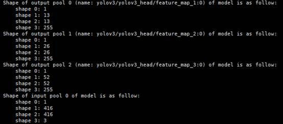

**Figure 2**  NCHW layout

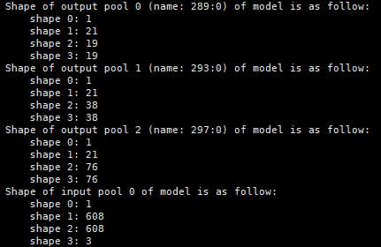

**FasterRCNN**

- Two model structures are supported. One is the native FasterRCNN model, and the other is the model after NMS, or non-maximum suppression, is removed.
- When the configuration parameter `NMS_FINISHED = 0`, the latter is used. When `NMS_FINISHED = 1`, the former is used.

- Native model:

    It has four output tensors, which are the target count, confidence, bounding box, and class ID.

    **Figure 3**  Native FasterRCNN model

    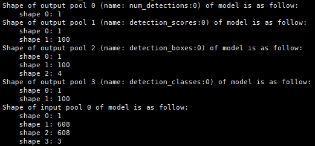

- After NMS removal:

    It has three output tensors, which are the target count, the possible bounding boxes of each class, and the confidence of each class box.

    **Figure 4**  FasterRCNN after NMS removal

    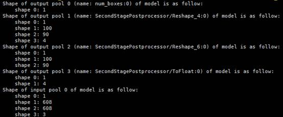

**SSD MobileNet v1 FPN**

SSD MobileNet v1 FPN is similar to the native FasterRCNN model. It has four output tensors, which are the target count, confidence, bounding box, and class ID.

**Figure 5**  SSD MobileNet v1 FPN

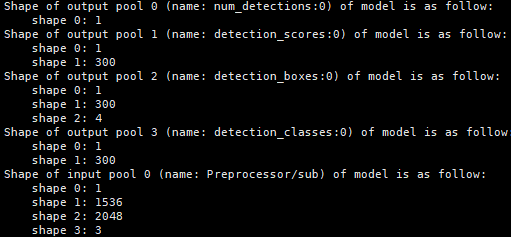

**SSD-VGG16**

SSD-VGG16 has two output tensors. The first output tensor is the target count. The second output tensor contains target box information in the format `[batch, keep_top_k, 8]`, where `8` indicates `batchID`, `label` (`classID`), `score` (class probability), `xmin`, `ymin`, `xmax`, `ymax`, and `null`.

**Figure 6**  SSD-VGG16

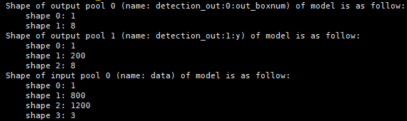

**CRNN**

CRNN has only one output tensor. The first dimension is the batch size, and the second dimension is the maximum number of targets it can detect. It represents the class ID of each recognized target, including placeholders.

**Figure 7**  CRNN

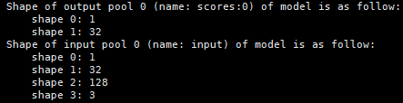

**ResNet-50**

ResNet-50 requires only one output tensor. The first dimension is the batch size, and the second dimension matches the number of classes. It contains the result after softmax on the model feature layer. The output tensor contains the class ID corresponding to the class with the highest probability.

**Figure 8**  ResNet-50

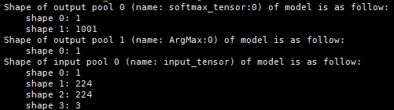

**YOLOv4**

YOLOv4 is similar to the YOLOv3 model. It has three output tensors, which are the feature layers after 8x, 16x, and 32x downsampling.

**Figure 9**  YOLOv4

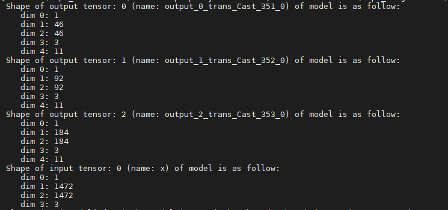

**YOLOv5**

- YOLOv5 has three output tensors, which are the feature layers after 8x, 16x, and 32x downsampling.
- The output tensors are arranged in the form `N(C0)HW(C1)`. `W` and `H` are equal to the model input width and height divided by 8, 16, or 32. `C` is equal to the number of prior boxes, `anchorDim = 3 * (bounding_box_coordinates 4 + bounding_box_confidence 1 + number_of_classes 80)`.

**Figure 10**  YOLOv5

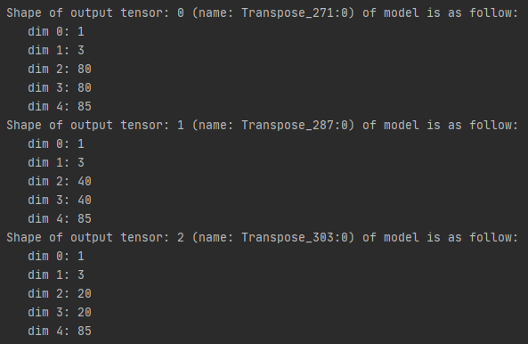

**FasterRCNN-Fpn/CascadeRCNN-Fpn**

The model has two output tensors: a `5 * 100` tensor of predicted boxes and confidence `(x0, y0, x1, y1, confidence)`, where coordinates are the top-left and bottom-right corners of the detection box; and a `1 * 100` tensor of class scores. The input is a fixed-size RGB image: `3 * 1216 * 1216`.

**Figure 11**  FasterRCNN-Fpn/CascadeRCNN-Fpn

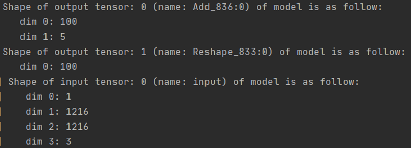

**CTPN (TensorFlow)**

The CTPN (TensorFlow) model has two output tensors. One is a prediction of small boxes in the form `38 * 67 * 40`, which is equivalent to 10 small boxes generated for each pixel point in `38 * 67 * 4`. The other is the prediction score in the form `38 * 67 * 20`, which is equivalent to 10 prediction scores generated for each pixel point in `38 * 67 * 2`. The input is a fixed-size RGB image: `3 * 608 * 1072`.

**Figure 12**  CTPN (TensorFlow)

")

**CTPN (MindSpore)**

The CTPN (MindSpore) model has two output tensors. One contains 1000 predicted small boxes, each with 5 dimensions for four coordinates and a score. The other contains 1000 class labels for each small box, with values `1` and `0` indicating foreground or background. The input is a fixed-size RGB image: `3 * 576 * 960`.

**Figure 13**  CTPN (MindSpore)

")

**ResNet-18+**

The input of the ResNet-18+ model is a tensor of size `1 * 408 * 64 * 3`. The output is a tensor of size `1 * 2`, which represents the classification probability of each sample.

**Figure 14**  ResNet-18+

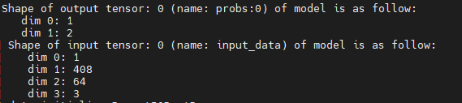

**BERT-Base (Uncased)**

The BERT-Base (Uncased) model has three input tensors, and all shapes are `1 * 128`. `1` indicates the batch size, and `128` indicates the sentence length.

The model output contains one tensor of `1 * 2`, which represents the probability of each classification category.

**Figure 15**  BERT-Base (Uncased)

")

**DeepLabV3+ (TensorFlow)**

The output of the DeepLabV3+ (TensorFlow) model contains one tensor in the NHWC format, `1 * 513 * 513 * 21`. Its physical meaning is equivalent to the classification probability of each pixel. The original input image is an RGB image with dynamic shape. The model input is a tensor of `1 * 513 * 513 * 3`.

**Figure 16**  DeepLabV3+ (TensorFlow)

")

**DeepLabV3 (MindSpore)**

The DeepLabV3 (MindSpore) model uses NHWC layout for input and NCHW layout for output.

**Figure 17**  DeepLabV3 (MindSpore)

")

**DeepLabV3 (PyTorch)**

The DeepLabV3 (PyTorch) model uses NHWC layout for input and NCHW layout for output.

**Figure 18**  DeepLabV3 (PyTorch)

")

**Unet (MindSpore)**

The output tensor of the Unet (MindSpore) model is NCHW, where `N` is 1 and `C` is 2. It serves as the input to Vision SDK postprocessing module.

1. Perform argmax on the `C` channel to obtain the index of the maximum probability value and generate a two-dimensional array with values 0 and 1.
2. Check whether the `HW` of the model output tensor is the same as the input image size. If it is the same, directly output the argmax result as a two-dimensional array. Otherwise, perform nearest-neighbor interpolation to the input image size.

**Figure 19**  Unet (MindSpore)

")

**Mask R-CNN (TensorFlow)**

The input tensor of the Mask R-CNN (TensorFlow) model uses the 4D NHWC format (`1 * 480 * 640 * 3`).

- `N` is the batch count.
- `H` is the height of the input image (`480`).
- `W` is the width of the input image (`640`).

The Mask R-CNN (TensorFlow) model has five output tensors (`tensor[0]` to `tensor[4]`).

- `tensor[0]` is 1-dimensional (`1`). Its first dimension length is 1 and represents the number of targets detected by the model.
- `tensor[1]` is 2-dimensional (`1 * 100`). Its first dimension length is 1 and represents the batch count. Its second dimension length is 100 and represents the confidence scores of the top 100 targets.
- `tensor[2]` is 3-dimensional (`1 * 100 * 4`). Its first dimension length is 1 and represents the batch count. Its second dimension length is 100 and represents the top 100 target boxes. Its third dimension length is 4 and represents the four corner coordinates of the target box, `(x0, y0, x1, y1)`.
- `tensor[3]` is 4-dimensional (`1 * 100 * 33 * 33`). Its first dimension length is 1 and represents the batch count. Its second dimension length is 100 and represents the top 100 target boxes. Its third and fourth dimensions represent a 33 * 33 mask image.
- `tensor[4]` is 2-dimensional (`1 * 100`). Its first dimension length is 1 and represents the batch count. Its second dimension length is 100 and represents the classification category of the top 100 targets.

**Figure 20**  Mask R-CNN (TensorFlow)

")

**FaceNet (TensorFlow)**

The input tensor of FaceNet (TensorFlow) is in the NHWC format (`1 * 160 * 160 * 3`) and uses the `UINT8` data type.

- `N` is the batch count.
- `H` is the input image height, `160`.
- `W` is the input image width, `160`.
- `C` is the number of image channels.

The output tensor is the feature vector corresponding to the target image. Its shape is `1 * 512`. The first dimension represents the batch count, and the second dimension is the feature vector length, `512`. The data type is `FLOAT32`.

**Figure 21**  FaceNet (TensorFlow)

")

**SSD MobileNet v1 FPN (MindSpore)**

SSD MobileNet v1 FPN (MindSpore) has two output tensors, which are the bounding box and confidence.

**Figure 22**  SSD MobileNet v1 FPN (MindSpore)

")

**OpenPose**

The OpenPose output tensor uses the format `[batch, outputHeight, outputWidth, channel]`. `outputHeight` indicates the height of the output image, `outputWidth` indicates the width of the output image, and `channel` contains two parts. The first third is the heat map, and the last two thirds are the PAF map. The model output is `[1, 54, 46, 57]`.

**Figure 23**  OpenPose

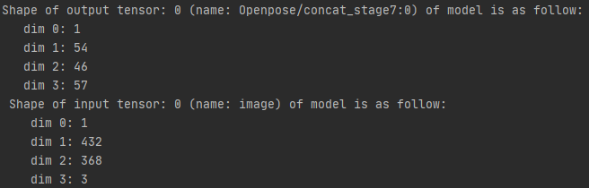

**Unet++ (MindSpore)**

The Unet++ (MindSpore) model postprocessing has one NCHW input tensor. It is fed to the postprocessing module after the model performs argmax and then AIPP processing. It also has one NHW output tensor. Because the model has already performed argmax, the `C` channel is already calculated in the value corresponding to `HW` of the tensor.

**Figure 24**  Unet++ (MindSpore)

")

## Dependency Installation Reference

### Installing GCC 7.3.0

Because GCC is a basic tool, multi-user installation can easily cause conflicts. Therefore, the following steps are recommended for the `root` user.

1. Download `gcc-7.3.0.tar.gz` from [https://mirrors.tuna.tsinghua.edu.cn/gnu/gcc/gcc-7.3.0/gcc-7.3.0.tar.gz](https://mirrors.tuna.tsinghua.edu.cn/gnu/gcc/gcc-7.3.0/gcc-7.3.0.tar.gz).
2. Installing GCC consumes a large amount of temporary space, so run the following command first to clear the `/tmp` directory.

    ```bash
    rm -rf /tmp/*
    ```

3. Install dependencies. This example uses CentOS and Ubuntu systems.
    - Run the following command on CentOS.

        ```bash
        yum install bzip2
        ```

    - Run the following command on Ubuntu.

        ```bash
        apt-get install bzip2
        ```

4. Compile and install GCC.
    1. Go to the directory that contains the `gcc-7.3.0.tar.gz` source package, decompress the source package, and run:

        ```bash
        tar -zxvf gcc-7.3.0.tar.gz --no-same-owner
        ```

    2. Go to the decompressed directory and run the following command to download GCC dependency packages:

        ```bash
        cd gcc-7.3.0
        ./contrib/download_prerequisites
        ```

        If the preceding command fails, run the following commands in the `gcc-7.3.0/` directory to download the following dependency packages:

        ```bash
        wget http://gcc.gnu.org/pub/gcc/infrastructure/gmp-6.1.0.tar.bz2
        wget http://gcc.gnu.org/pub/gcc/infrastructure/mpfr-3.1.4.tar.bz2
        wget http://gcc.gnu.org/pub/gcc/infrastructure/mpc-1.0.3.tar.gz
        wget http://gcc.gnu.org/pub/gcc/infrastructure/isl-0.16.1.tar.bz2
        ```

        After you download the preceding dependency packages, run the following command again:

        ```bash
        ./contrib/download_prerequisites
        ```

        If the validation command above fails, ensure that the dependency packages are downloaded successfully in a single attempt and are not downloaded repeatedly.

    3. Run the configuration command.

        ```bash
        ./configure --enable-languages=c,c++ --disable-multilib --with-system-zlib --prefix=/usr/local/gcc7.3.0
        ```

        >[!NOTE]
        >The `--prefix` parameter specifies the GCC 7.3.0 installation path. You can configure it as needed, but do not set it to `/usr/local` or `/usr`, because that conflicts with the GCC version installed by the system package source and may damage the original system GCC build environment. In this example, the path is set to `/usr/local/gcc7.3.0`.

    4. Compile the source.

        ```bash
        make -j15    # Use `grep -w processor /proc/cpuinfo|wc -l` to check the CPU count. The example uses 15, and you can adjust the parameter as needed.
        ```

    5. Install the source.

        ```bash
        make install
        ```

5. Configure environment variables. Do this only when needed.

    ```bash
    export LD_LIBRARY_PATH=/usr/local/gcc7.3.0/lib64:${LD_LIBRARY_PATH}
    export CC=/usr/local/gcc7.3.0/bin/gcc
    export CXX=/usr/local/gcc7.3.0/bin/g++
    export PATH=/usr/local/gcc7.3.0/bin:${PATH}
    ```

    `/usr/local/gcc7.3.0` is the GCC 7.3.0 installation path configured in step 4.3 above. Replace it based on the actual environment.

### Installing Python Dependencies

**Introduction**

The current Vision SDK development package depends on Python. If the environment is not configured, follow the steps in this section to install the dependencies. This example uses `root` to install Python 3.9.2.

**Procedure**

1. Install the Python 3.9.2 dependency libraries. This example uses Ubuntu:

    ```bash
    apt-get install -y build-essential gcc g++ make cmake zlib1g zlib1g-dev libsqlite3-dev openssl libssl-dev libffi-dev unzip pciutils net-tools libblas-dev gfortran libblas3 libopenblas-dev
    ```

2. Download the Python 3.9.2 source package.

    ```bash
    wget https://www.python.org/ftp/python/3.9.2/Python-3.9.2.tgz
    ```

3. Decompress the Python 3.9.2 installation package.

    ```bash
    tar -zxvf Python-3.9.2.tgz --no-same-owner
    ```

4. Compile and install Python 3.9.2.

    ```bash
    cd Python-3.9.2 && ./configure --prefix=/usr/local/python3.9.2 --enable-shared && make -j8 && make install
    ```

5. Copy `libpython3.9.so.1.0` to the system path.

    ```bash
    cp /usr/local/python3.9.2/lib/libpython3.9.so.1.0 /usr/lib
    ```

6. Set environment variables.

    ```bash
    export LD_LIBRARY_PATH=/usr/local/python3.9.2/lib:$LD_LIBRARY_PATH
    export PATH=/usr/local/python3.9.2/bin:$PATH
    ```

>[!NOTE]
>If you use Yum after installing Python 3.9.2 from source and encounter the error `No module named 'dnf'`, remove the Python path from the `LD_LIBRARY_PATH` environment variable and use the system Python path.

## File Examples

### Example of an Initialization Operator Preload File

The initialization operator preload file must be used together with the `MxInitFromConfig` interface.

```json
{
  "Operations": [
    {
      "name": "Multiply",
      "preload_list": [
        {
          "input_shape": "1,3,16,16;1,3,16,16",
          "input_type": "float;float",
          "output_shape": "1,3,16,16",
          "output_type": "float"
        },
        {
          "input_shape": "1,3,16,16;1,3,16,16",
          "input_type": "float16;float16",
          "output_shape": "1,3,16,16",
          "output_type": "float16"
        },
        {
          "input_shape": "1,3,16,16;1,3,16,16",
          "input_type": "uint8;uint8",
          "output_shape": "1,3,16,16",
          "output_type": "uint8"
        },
        {
          "input_shape": "1, 3, 16, 16; 1, 3, 16, 16",
          "input_type": "float;uint8",
          "output_shape": "1, 3, 16, 16",
          "output_type": "float",
          "attr_name": "scale",
          "attr_type": "double",
          "attr_val": "1.5f"
        }
      ]
    },
    {
      "name": "Divide",
      "preload_list": [
        {
          "input_shape": "1,3,16,16;1,3,16,16",
          "input_type": "float;float",
          "output_shape": "1,3,16,16",
          "output_type": "float"
        },
        {
          "input_shape": "1,3,16,16;1,3,16,16",
          "input_type": "float16;float16",
          "output_shape": "1,3,16,16",
          "output_type": "float16"
        },
        {
          "input_shape": "1,3,16,16;1,3,16,16",
          "input_type": "uint8;uint8",
          "output_shape": "1,3,16,16",
          "output_type": "uint8"
        }
      ]
    },
    {
      "name": "Tile",
      "preload_list": [
        {
          "input_shape": "1,16,16,1",
          "input_type": "float",
          "output_shape": "1,16,16,3",
          "output_type": "float"
        }
      ]
    },
    {
      "name": "Abs",
      "preload_list": [
        {
          "input_shape": "1,3,16,16",
          "input_type": "float",
          "output_shape": "1,3,16,16",
          "output_type": "float"
        },
        {
          "input_shape": "1,3,16,16",
          "input_type": "float16",
          "output_shape": "1,3,16,16",
          "output_type": "float16"
        },
        {
          "input_shape": "1,3,16,16",
          "input_type": "uint8",
          "output_shape": "1,3,16,16",
          "output_type": "uint8"
        }
      ]
    },
    {
      "name": "AbsDiff",
      "preload_list": [
        {
          "input_shape": "480, 640;480, 640",
          "input_type": "float;float",
          "output_shape": "480, 640",
          "output_type": "float"
        }
      ]
    },
    {
      "name": "Log",
      "preload_list": [
        {
          "input_shape": "480, 640",
          "input_type": "float",
          "output_shape": "480, 640",
          "output_type": "float"
        }
      ]
    },
    {
      "name": "Pow",
      "preload_list": [
        {
          "input_shape": "1,3,16,16;1,3,16,16",
          "input_type": "float;float",
          "output_shape": "1,3,16,16",
          "output_type": "float"
        }
      ]
    },
    {
      "name": "Sqrt",
      "preload_list": [
        {
          "input_shape": "1,3,16,16",
          "input_type": "float",
          "output_shape": "1,3,16,16",
          "output_type": "float"
        }
      ]
    },
    {
      "name": "Hstack",
      "preload_list": [
        {
          "input_shape": "10, 10;10, 10",
          "input_type": "uint8;uint8",
          "output_shape": "10, 20",
          "output_type": "uint8"
        }
      ]
    },
    {
      "name": "Vstack",
      "preload_list": [
        {
          "input_shape": "10, 10;10, 10",
          "input_type": "uint8;uint8",
          "output_shape": "20, 10",
          "output_type": "uint8"
        }
      ]
    },
    {
      "name": "ScaleAdd",
      "preload_list": [
        {
          "input_shape": "1,3,16,16;1,3,16,16",
          "input_type": "float;float",
          "output_shape": "1,3,16,16",
          "output_type": "float",
          "attr_name": "scale",
          "attr_type": "float",
          "attr_val": "2.0"
        }
      ]
    },
    {
      "name": "Min",
      "preload_list": [
        {
          "input_shape": "480, 640;480, 640",
          "input_type": "float;float",
          "output_shape": "480, 640",
          "output_type": "float"
        }
      ]
    },
    {
      "name": "Max",
      "preload_list": [
        {
          "input_shape": "480, 640;480, 640",
          "input_type": "float;float",
          "output_shape": "480, 640",
          "output_type": "float"
        }
      ]
    },
    {
      "name": "Sort",
      "preload_list": [
        {
          "input_shape": "2,3",
          "input_type": "float",
          "output_shape": "2,3",
          "output_type": "float",
          "attr_name": "axis;descending",
          "attr_type": "int;bool",
          "attr_val": "0;true"
        },
        {
          "input_shape": "2,3",
          "input_type": "float16",
          "output_shape": "2,3",
          "output_type": "float16",
          "attr_name": "axis;descending",
          "attr_type": "int;bool",
          "attr_val": "0;true"
        },
        {
          "input_shape": "2,3",
          "input_type": "uint8",
          "output_shape": "2,3",
          "output_type": "uint8",
          "attr_name": "axis;descending",
          "attr_type": "int;bool",
          "attr_val": "0;true"
        }
      ]
    },
    {
      "name": "SortIdx",
      "preload_list": [
        {
          "input_shape": "2,3",
          "input_type": "float",
          "output_shape": "2,3",
          "output_type": "int32",
          "attr_name": "axis;descending",
          "attr_type": "int;bool",
          "attr_val": "0;true"
        },
        {
          "input_shape": "2,3",
          "input_type": "float16",
          "output_shape": "2,3",
          "output_type": "int32",
          "attr_name": "axis;descending",
          "attr_type": "int;bool",
          "attr_val": "0;true"
        },
        {
          "input_shape": "2,3",
          "input_type": "uint8",
          "output_shape": "2,3",
          "output_type": "int32",
          "attr_name": "axis;descending",
          "attr_type": "int;bool",
          "attr_val": "0;true"
        }
      ]
    },
    {
      "name": "Split",
      "preload_list": [
        {
          "input_shape": "16,16,3",
          "input_type": "float",
          "output_shape": "16,16,1;16,16,1;16,16,1",
          "output_type": "float;float;float"
        }
      ]
    },
    {
      "name": "Merge",
      "preload_list": [
        {
          "input_shape": "16,16,1;16,16,2",
          "input_type": "float;float",
          "output_shape": "16,16,3",
          "output_type": "float"
        }
      ]
    },
    {
      "name": "Transpose",
      "preload_list": [
        {
          "input_shape": "2,3,2",
          "input_type": "uint8",
          "output_shape": "2,3,2",
          "output_type": "uint8"
        }
      ]
    },
    {
      "name": "Add",
      "preload_list": [
        {
          "input_shape": "1,3,16,16;1,3,16,16",
          "input_type": "float;float",
          "output_shape": "1,3,16,16",
          "output_type": "float"
        },
        {
          "input_shape": "1,3,16,16;1,3,16,16",
          "input_type": "float16;float16",
          "output_shape": "1,3,16,16",
          "output_type": "float16"
        },
        {
          "input_shape": "1,3,16,16;1,3,16,16",
          "input_type": "uint8;uint8",
          "output_shape": "1,3,16,16",
          "output_type": "uint8"
        }
      ]
    },
    {
      "name": "BitwiseAnd",
      "preload_list": [
        {
          "input_shape": "1,3,16,16;1,3,16,16",
          "input_type": "uint8;uint8",
          "output_shape": "1,3,16,16",
          "output_type": "uint8"
        }
      ]
    },
    {
      "name": "Reduce",
      "preload_list": [
        {
          "input_shape": "1, 640, 480, 1",
          "input_type": "uint8",
          "output_shape": "1, 480, 1",
          "output_type": "uint8"
        }
      ]
    },
    {
      "name": "BitwiseXor",
      "preload_list": [
        {
          "input_shape": "1,3,16,16;1,3,16,16",
          "input_type": "uint8;uint8",
          "output_shape": "1,3,16,16",
          "output_type": "uint8"
        }
      ]
    },
    {
      "name": "BitwiseOr",
      "preload_list": [
        {
          "input_shape": "1,3,16,16;1,3,16,16",
          "input_type": "uint8;uint8",
          "output_shape": "1,3,16,16",
          "output_type": "uint8"
        }
      ]
    },
    {
      "name": "Clip",
      "preload_list": [
        {
          "input_shape": "1,16,16,3",
          "input_type": "float",
          "output_shape": "1,16,16,3",
          "output_type": "float"
        },
        {
          "input_shape": "1,16,16,3",
          "input_type": "float16",
          "output_shape": "1,16,16,3",
          "output_type": "float16"
        },
        {
          "input_shape": "1,16,16,3",
          "input_type": "uint8",
          "output_shape": "1,16,16,3",
          "output_type": "uint8"
        }
      ]
    },
    {
      "name": "ConvertTo",
      "preload_list": [
        {
          "input_shape": "3, 3, 1",
          "input_type": "uint8",
          "output_shape": "3, 3, 1",
          "output_type": "uint32"
        }
      ]
    },
    {
      "name": "Exp",
      "preload_list": [
        {
          "input_shape": "2,3,2",
          "input_type": "float",
          "output_shape": "2,3,2",
          "output_type": "float"
        },
        {
          "input_shape": "2,3,2",
          "input_type": "float16",
          "output_shape": "2,3,2",
          "output_type": "float16"
        }
      ]
    },
    {
      "name": "Subtract",
      "preload_list": [
        {
          "input_shape": "1,3,16,16;1,3,16,16",
          "input_type": "float;float",
          "output_shape": "1,3,16,16",
          "output_type": "float"
        },
        {
          "input_shape": "1,3,16,16;1,3,16,16",
          "input_type": "float16;float16",
          "output_shape": "1,3,16,16",
          "output_type": "float16"
        },
        {
          "input_shape": "1,3,16,16;1,3,16,16",
          "input_type": "uint8;uint8",
          "output_shape": "1,3,16,16",
          "output_type": "uint8"
        }
      ]
    },
    {
      "name": "Sqr",
      "preload_list": [
        {
          "input_shape": "2,16,16,4",
          "input_type": "uint8",
          "output_shape": "2,16,16,4",
          "output_type": "uint8"
        }
      ]
    },
    {
      "name": "Compare",
      "preload_list": [
        {
          "input_shape": "1,3,16,16;1,3,16,16",
          "input_type": "uint8;uint8",
          "output_shape": "1,3,16,16",
          "output_type": "uint8",
          "attr_name": "operation",
          "attr_type": "string",
          "attr_val": "eq"
        },
        {
          "input_shape": "1,3,16,16;1,3,16,16",
          "input_type": "float16;float16",
          "output_shape": "1,3,16,16",
          "output_type": "float16",
          "attr_name": "operation",
          "attr_type": "string",
          "attr_val": "eq"
        },
        {
          "input_shape": "1,3,16,16;1,3,16,16",
          "input_type": "float;float",
          "output_shape": "1,3,16,16",
          "output_type": "float",
          "attr_name": "operation",
          "attr_type": "string",
          "attr_val": "eq"
        }
      ]
    },
    {
      "name": "AddWeighted",
      "preload_list": [
        {
          "input_shape": "1,3,16,16;1,3,16,16",
          "input_type": "uint8;uint8",
          "output_shape": "1,3,16,16",
          "output_type": "uint8",
          "attr_name": "alpha;beta;gamma",
          "attr_type": "float;float;float",
          "attr_val": "1.2;1.0;1.1"
        },
        {
          "input_shape": "1,3,16,16;1,3,16,16",
          "input_type": "float16;float16",
          "output_shape": "1,3,16,16",
          "output_type": "float16",
          "attr_name": "alpha;beta;gamma",
          "attr_type": "float;float;float",
          "attr_val": "1.2;1.0;1.1"
        },
        {
          "input_shape": "1,3,16,16;1,3,16,16",
          "input_type": "float;float",
          "output_shape": "1,3,16,16",
          "output_type": "float",
          "attr_name": "alpha;beta;gamma",
          "attr_type": "float;float;float",
          "attr_val": "1.2;1.0;1.1"
        }
      ]
    },
    {
      "name": "ThresholdBinary",
      "preload_list": [
        {
          "input_shape": "1,3,16,16",
          "input_type": "uint8",
          "output_shape": "1,3,16,16",
          "output_type": "uint8",
          "attr_name": "thresh;maxVal",
          "attr_type": "float;float",
          "attr_val": "20.0;30.0"
        },
        {
          "input_shape": "1,3,16,16",
          "input_type": "float16",
          "output_shape": "1,3,16,16",
          "output_type": "float16",
          "attr_name": "thresh;maxVal",
          "attr_type": "float;float",
          "attr_val": "20.0;30.0"
        },
        {
          "input_shape": "1,3,16,16",
          "input_type": "float",
          "output_shape": "1,3,16,16",
          "output_type": "float",
          "attr_name": "thresh;maxVal",
          "attr_type": "float;float",
          "attr_val": "20.0;30.0"
        }
      ]
    }
  ]}
```

### Metadata Proto Files

>[!NOTE]
>The `protoc` binary in the `opensource/bin/` directory is the Google Protobuf compiler. If a user uses custom data structures in a plugin, `protoc` can generate the corresponding interface code from the `.proto` file.

**Google Protobuf Data Structure Definition File (`MxpiDumpData.proto`)**

```proto
syntax = "proto3";

package MxTools;

message MxpiDumpData
{
    Buffer buffer = 1;
    repeated MetaData metaData = 2;
}

message Buffer
{
    bytes bufferData = 1;
}

message MetaData
{
    string key = 1;
    string content = 2;
    string protoDataType = 3;
}
```

**Google Protobuf Data Structure Definition File (`MxpiDataType.proto`)**

```proto
syntax = "proto3";

package MxTools;

// Used to store video and image frames, including frame information and data information.
message MxpiFrame
{
    MxpiFrameInfo frameInfo = 1;
    MxpiVisionList visionList = 2;   // A list is used for consistency with VPC.
}

message MxpiFrameInfo                // Frame information
{
    uint32 channelId = 1;
    uint32 frameId = 2;
    bool isEos = 3;
}

message MxpiVisionList               // Video and image data list
{
    repeated MxpiVision visionVec = 1;
}

message MxpiVision                         // Video and image data structure
{
    repeated MxpiMetaHeader headerVec = 1; // Vector that stores plugin information
    MxpiVisionInfo visionInfo = 2;
    MxpiVisionData visionData = 3;
}

message MxpiMetaHeader               // Data structure header used for serialization
{
    string parentName = 1;           // This variable will be deprecated in a later version. Use `dataSource` instead.
    int32 memberId = 2;              // Index of the corresponding MxpiVision in MxpiVisionList
    string dataSource = 3;           // Index name of the dependent data. Use this index to obtain the dependent metadata.
}

enum MxpiMemoryType {
    MXPI_MEMORY_HOST = 0;
    MXPI_MEMORY_DEVICE = 1;
    MXPI_MEMORY_DVPP = 2;
    MXPI_MEMORY_HOST_MALLOC = 3;
    MXPI_MEMORY_HOST_NEW = 4;
}

enum MxpiDataType {                   // Data types, including 8-bit unsigned integer and 32-bit floating point
    MXPI_DATA_TYPE_UINT8 = 0;
    MXPI_DATA_TYPE_FLOAT32 = 1;
}
message MxpiVisionInfo                // Video and image description information
{
    uint32 format = 1;                // Image format. For details, see MxbasePixelFormat in DvppWrapper.h.
    uint32 width = 2;
    uint32 height = 3;
    uint32 widthAligned = 4;
    uint32 heightAligned = 5;
    uint32 resizeType = 6;            // Resize type. For details, see RESIZETYPE in MxPluginsUtils.h.
    float keepAspectRatioScaling = 7; // Scaling ratio, in the range [1/32, 16]
    repeated MxpiVisionPreProcess preprocessInfo = 8;
}

message MxpiVisionPreProcess          // Image preprocessing information, such as image width and height, crop coordinates, and paste coordinates
{
    uint32 widthSrc = 1;
    uint32 heightSrc = 2;
    uint32 cropLeft = 3;
    uint32 cropRight = 4;
    uint32 cropTop = 5;
    uint32 cropBottom = 6;

    uint32 pasteLeft = 7;
    uint32 pasteRight = 8;
    uint32 pasteTop = 9;
    uint32 pasteBottom = 10;

    uint32 interpolation = 11;
    string elementName = 12;
}
message MxpiVisionData              // Video and image data content
{
    uint64 dataPtr = 1;             // Video and image memory pointer
    int32 dataSize = 2;
    uint32 deviceId = 3;
    MxpiMemoryType memType = 4;
    uint64 freeFunc = 5;            // Video and image memory release function
    bytes dataStr = 6;              // The bytes data type is automatically base64-encoded when serialized to JSON.
    MxpiDataType dataType = 7;
    uint64 matPtr = 8;
}
message MxpiObjectList               // Target list
{
    repeated MxpiObject objectVec = 1;
}

message MxpiObject                  // Target data structure
{
    repeated MxpiMetaHeader headerVec = 1;
    float x0 = 2;
    float y0 = 3;
    float x1 = 4;
    float y1 = 5;
    repeated MxpiClass classVec = 6; // Class information data structure. `MxpiMetaHeader` is invalid here.
    MxpiImageMask imageMask = 7;    // Image semantic segmentation data information
}

message MxpiImageMaskList            // Image semantic segmentation data list
{
    repeated MxpiImageMask imageMaskVec = 1;
}

message MxpiImageMask                // Image semantic segmentation data information, such as class, shape, and data type
{
    repeated MxpiMetaHeader headerVec = 1;
    repeated string className = 2;
    repeated int32 shape = 3;
    int32 dataType = 4;
    bytes dataStr = 5;
}
message MxpiClass                   // Class information data structure
{
    repeated MxpiMetaHeader headerVec = 1;
    int32 classId = 2;
    string className = 3;
    float confidence = 4;
}

message MxpiClassList              // Class information list
{
    repeated MxpiClass classVec = 1;
}

message MxpiAttributeList         // Attribute information list
{
    repeated MxpiAttribute attributeVec = 1;
}

message MxpiAttribute            // Attribute information data structure
{
    repeated MxpiMetaHeader headerVec = 1;
    int32 attrId = 2;
    string attrName = 3;
    string attrValue = 4;
    float confidence = 5;
}

message MxpiTrackLetList
{
    repeated MxpiTrackLet trackLetVec = 1;
}

message MxpiTrackLet
{
    repeated MxpiMetaHeader headerVec = 1;
    uint32 trackId = 2;
    uint32 age = 3;                 // Number of frames the target has remained "alive"
    uint32 hits = 4;                // Number of frames the target has matched successfully
    int32 trackFlag = 5;            // Status
}

message MxpiTensorPackageList  // Model tensor package list
{
    repeated MxpiTensorPackage tensorPackageVec = 1;
}

message MxpiTensorPackage   // Model tensor package data structure
{
    repeated MxpiMetaHeader headerVec = 1;
    repeated MxpiTensor tensorVec = 2;
}

message MxpiTensor       // Model tensor data structure
{
    uint64 tensorDataPtr = 1;             // Tensor memory pointer
    int32 tensorDataSize = 2;
    uint32 deviceId = 3;
    MxpiMemoryType memType = 4;
    uint64 freeFunc = 5;            // Tensor memory release function
    repeated int32 tensorShape = 6;       // Tensor dimensions
    bytes dataStr = 7;
    int32 tensorDataType = 8;
}

message MxpiFeatureVectorList   // Feature vector list
{
    repeated MxpiFeatureVector featureVec = 1;
}

message MxpiFeatureVector    // Feature vector data structure
{
    repeated MxpiMetaHeader headerVec = 1;
    repeated float featureValues = 2;
}

message MxpiPoseList                        // Human pose estimation data list
{
    repeated MxpiPose poseVec = 1;
}

message MxpiPose                            // Human pose estimation data information
{
    repeated MxpiMetaHeader headerVec = 1;
    repeated MxpiKeyPoint keyPointVec = 2;
    float score = 3;
}

message MxpiKeyPoint                       // Human keypoint data information
{
    float x = 1;
    float y = 2;
    int32 name = 3;
    float score = 4;
}
message MxpiKeyPointAndAngleList          // Keypoint and angle information list
{
    repeated MxpiKeyPointAndAngle keyPointAndAngleVec = 1;
}

message MxpiKeyPointAndAngle
{
    repeated MxpiMetaHeader headerVec = 1;
    repeated float keyPointsVec = 2;        // Five keypoint values corresponding to the target
    float angleYaw = 3;                     // Yaw angle
    float anglePitch = 4;                   // Pitch angle
    float angleRoll = 5;                    // Roll angle
}
message MxpiTextObjectList                                 // Text object data list
{
    repeated MxpiTextObject objectVec = 1;
}

message MxpiTextObject                                     // Text object data information, such as text box coordinates, confidence, and detected text
{
    repeated MxpiMetaHeader headerVec = 1;
    float x0 = 2;
    float y0 = 3;
    float x1 = 4;
    float y1 = 5;
    float x2 = 6;
    float y2 = 7;
    float x3 = 8;
    float y3 = 9;
    float confidence = 10;
    string text = 11;
}

message MxpiTextsInfoList                                    // Text generation data list
{
    repeated MxpiTextsInfo textsInfoVec = 1;
}

message MxpiTextsInfo                                         // Text generation data information
{
    repeated MxpiMetaHeader headerVec = 1;
    repeated string text = 2;
}
message MxpiCustomDataList
{
    repeated MxpiCustomData dataVec = 1;
}
message MxpiCustomData
{
    repeated MxpiMetaHeader headerVec = 1;
    map<string, string> map = 2;
}
```

**OSD Protobuf Data Structure Definition File (`MxpiOSDType.proto`)**

```proto
syntax = "proto3";

package MxTools;

import "MxpiDataType.proto";

message MxpiOsdInstancesList                    // OSD list for targets or classification information
{
    repeated MxpiOsdInstances osdInstancesVec = 1;
}

message MxpiOsdInstances                       // OSD attribute description data structure
{
    repeated MxpiMetaHeader headerVec = 1;
    repeated MxpiOsdText osdTextVec = 2;        // Text description
    repeated MxpiOsdLine osdLineVec = 3;        // Line description
    repeated MxpiOsdRect osdRectVec = 4;        // Rectangle description
    repeated MxpiOsdCircle osdCircleVec = 5;      // Circle description
}

message MxpiOsdText                          // Text attribute data structure
{
    repeated MxpiMetaHeader headerVec = 1;
    string text = 2;                             // Text to add
    int32 x0 = 3;                               // X coordinate of the text origin
    int32 y0 = 4;                               // Y coordinate of the text origin
    int32 fontFace = 5;                          // Font type of the text
    double fontScale = 6;                        // Font size of the text
    bool bottomLeftOrigin = 7;          // When true, the origin is the top-left corner of the text. When false, the origin is the bottom-left corner.
    MxpiOsdParams osdParams = 8;     // Common OSD attribute instance object
    bool fixedArea = 9;                // After scaling, whether the OSD attribute description is scaled in proportion to the original image
}

message MxpiOsdLine                             // Line attribute data structure
{
    repeated MxpiMetaHeader headerVec = 1;
    int32 x0 = 2;                      // X coordinate of the top-left corner of the line
    int32 y0 = 3;                       // Y coordinate of the top-left corner of the line
    int32 x1 = 4;                      // X coordinate of the bottom-right corner of the line
    int32 y1 = 5;                      // Y coordinate of the bottom-right corner of the line
    MxpiOsdParams osdParams = 6;     // Common OSD attribute instance object
}

message MxpiOsdRect                   // Rectangle attribute data structure
{
    repeated MxpiMetaHeader headerVec = 1;
    int32 x0 = 2;                        // X coordinate of the top-left corner of the rectangle
    int32 y0 = 3;                        // Y coordinate of the top-left corner of the rectangle
    int32 x1 = 4;                        // X coordinate of the bottom-right corner of the rectangle
    int32 y1 = 5;                        // Y coordinate of the bottom-right corner of the rectangle
    MxpiOsdParams osdParams = 6;       // Common OSD attribute instance object
    bool fixedArea = 7;                  // After scaling, whether the OSD attribute description is scaled in proportion to the original image
}

message MxpiOsdCircle                           // Circle-drawing attribute data structure
{
    repeated MxpiMetaHeader headerVec = 1;
    int32 x0 = 2;                       // X coordinate of the top-left corner of the circle
    int32 y0 = 3;                       // Y coordinate of the top-left corner of the circle
    int32 radius = 4;                    // Radius of the circle
    MxpiOsdParams osdParams = 5;      // Common OSD attribute instance object
}

message MxpiOsdParams               // Common OSD attribute data structure
{
    uint32 scalorB = 1;                // B channel value of the color, in the range 0-255
    uint32 scalorG = 2;                // G channel value of the color, in the range 0-255
    uint32 scalorR = 3;                // R channel value of the color, in the range 0-255
    int32 thickness = 4;               // Thickness
    int32 lineType = 5;                // Line type
    int32 shift = 6;                    // Scaling parameter
}
```

## Public Network Addresses Included in the Software

The `support.huawei.com` and `www.huawei.com` websites in Vision SDK installation package will be cleared and will not be accessed after installation, posing no security risks.

The open-source software compiled by Vision SDK contains public URLs and email addresses. The SDK does not access these addresses.

The `libcust_aicpu_kernels.so` file generated by compiling the OSD operator links open-source third-party libraries that contain public URLs (`https://github.com` and `https://developers.google.com`). The SDK itself does not access them, posing no security risks.

For more public network addresses, see [MindSDK 7.3.0 Vision SDK Public Network Addresses.xlsx](./resource/MindSDK%207.3.0%20Vision%20SDK%20Public%20Network%20Addresses.xlsx).

## Environment Variables

The following environment variables are used when the program is installed or running. Ensure that they are valid.

**Table 1**  Environment variables

|Environment Variable|Description|
|--|--|
|PATH|Path to executables.|
|LD_LIBRARY_PATH|Path to dynamic libraries.|
|PYTHONPATH|Default search path for Python module files.|
|HOME|Current user's home directory.|
|PWD|Current working directory.|
|TMPDIR|Temporary directory.|
|GST_PLUGIN_PATH|GStreamer plugin library search path.|
|MX_SDK_HOME|Vision SDK installation directory.|
|ASCEND_HOME_PATH|Path to CANN resources.|
|ASCEND_HOME|CANN installation directory.|
|ASCEND_VERSION|CANN version number.|
|ASCEND_CUSTOM_OPP_PATH|AscendC operator deployment path.|
|GIO_MODULE_DIR|Path to the folder that contains `libgiognutls.so`. Used when the streaming plugin starts encrypted transmission.|
|GST_PLUGIN_SCANNER|Path to the GStreamer plugin scanner (`gst-plugin-scanner`).|

## Revision History

|Release Date|Revision Record|
|--|--|
|2024-12-30|First official release|
