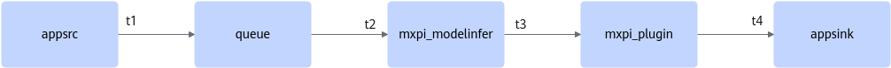
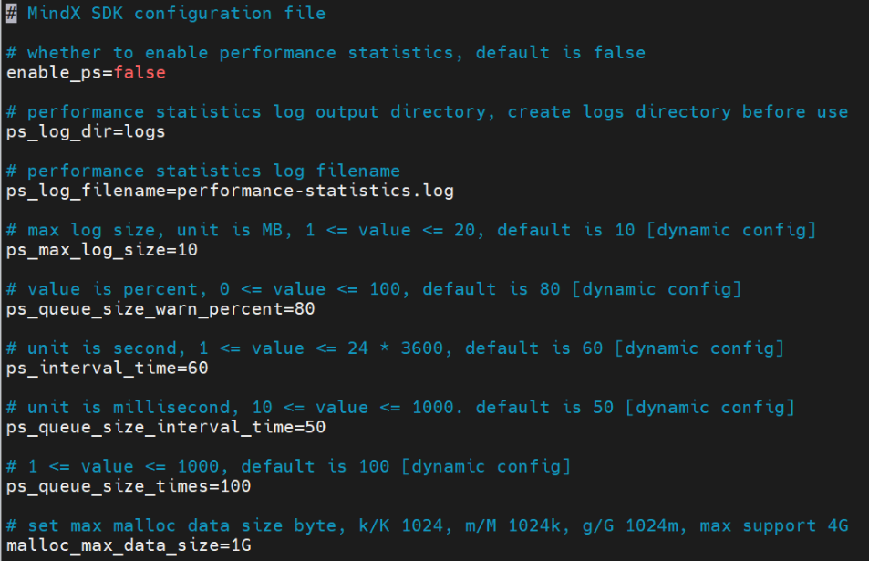
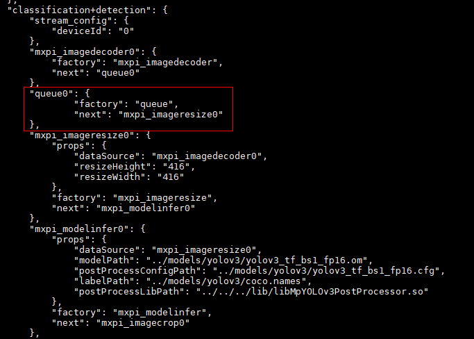
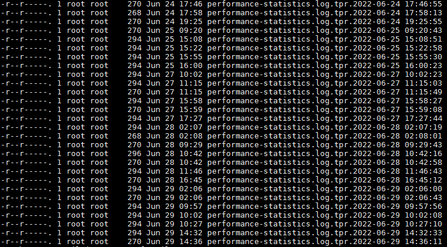
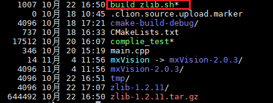
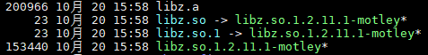
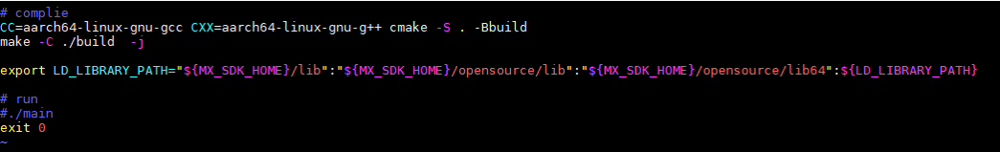
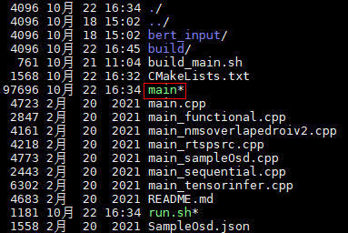

# Common Operations

## Auxiliary Tools

### One-Click Information Collection Tool

#### Tool Overview

The one-click information collection tool quickly collects information related to Vision SDK issues and related dependency information. Therefore, it helps users avoid repeated log collection and verification. The tool mainly collects chip information, including version and logs, OS version information, environment variables, network information, and Vision SDK information, including the version, configuration files, logs, and third-party library versions.

The one-click information collection tool consists of two files, `sdk_info_collector.sh` and `sdk_info_collector.py`. It provides configurable parameters for collecting chip logs and Vision SDK logs. For details, see [Table 1](#table017215513195). Other information is collected by default.

**Table 1**  Parameters
<a id="table017215513195"></a>

|Parameter|Description|
|--|--|
|`--help \| -h \| -H`|View help information.|
|`--version \| -v \| -V`|View version information.|
|`-p \| -P`|The required Vision SDK log directory. The number of log files in this directory cannot exceed 1500.<br>`-p logs_path \| -P logs_path`: `logs_path` must be an absolute path.|
|`-x \| -X`|Configurable chip log collection parameters.<li>Chip information is not collected by default.</li><li>`-x n \| -X n`: Collect logs for chip number `n`. `n` must be an integer.</li><li>`-x n1,n2,n3 \| -X n1,n2,n3`: Collect logs for chips number `n1`, `n2`, and `n3`. `n1`, `n2`, and `n3` must be integers.</li><li>`-x -1 \| -X -1`: Collect logs for all chips.</li>|
|`-r \| -R`|Configurable Vision SDK log-day collection parameters.<li>All logs are collected by default.</li><li>`-r xd \| -R xd`: Collect logs from the past `x` days. `x` must be an integer with no more than three digits, and the value range is [1, 365].</li><li>`-r full \| -R full`: Collect logs for every day.</li>|
|`-t \| -T`|Configurable Vision SDK log-level collection parameters.<li>All logs are collected by default.</li><li>`-t d \| -T d`: Collect logs at the debug level and above.</li><li>`-t i \| -T i`: Collect logs at the info level and above.</li><li>`-t w \| -T w`: Collect logs at the warning level and above.</li><li>`-t e \| -T e`: Collect logs at the error level and above.</li><li>`-t f \| -T f`: Collect fatal logs.</li><li>`-t full \| -T full`: Collect logs of all levels.</li>|

#### Using the Tool

1. Go to the directory where the information collection tool is stored.

    ```bash
    cd ${MX_SDK_HOME}/bin
    ```

    `MX_SDK_HOME` is the installation directory of Vision SDK software package. Ensure that `MX_SDK_HOME` is a valid environment variable.

2. Run `sdk_info_collector.sh`.

    There are three one-click information collection methods. You can choose one based on actual conditions.

    - Use the default parameters. By default, the tool collects all Vision SDK logs and does not collect chip logs.

        ```bash
        bash sdk_info_collector.sh -p logs_path
        ```

        **Table 1**  Command parameters with default parameters

        |Parameter|Description|
        |--|--|
        |`-p logs_path`|Collect Vision SDK logs stored in the specified `logs_path` directory.<br>`logs_path` supports only an absolute path, and the path cannot end with `/`.|

    - Collect data with specified parameters. For details about the parameters, see [Table 2](#table169243573344).

        ```bash
        bash sdk_info_collector.sh -p logs_path -r 3d -t w -x 6
        ```

        **Table 2**  Command parameters for collection with specified parameters
        <a id="table169243573344"></a>

        |Parameter|Description|
        |--|--|
        |`-p logs_path`|Collect Vision SDK logs stored in the specified `logs_path` directory.|
        |`-r 3d`|Collect Vision SDK logs from the past 3 days.|
        |`-t w`|Collect Vision SDK logs at the warning level and above.|
        |`-r 3d -t w`|Collect Vision SDK logs at the warning level and above from the past 3 days.|
        |`-x 6`|Collect chip logs for chip number `6`.|
        |`-x 0,2,5`|Collect chip logs for chip numbers `0`, `2`, and `5`.|

        Command example:

        ```bash
        bash sdk_info_collector.sh -p logs_path -r 3d -t w -x 0,2,5
        ```

    - Collect all data.

        ```bash
        bash sdk_info_collector.sh -p logs_path -r full -t full -x -1
        ```

        **Table 3**  Command parameters

        |Parameter|Description|
        |--|--|
        |`-p logs_path`|Collect Vision SDK logs stored in the specified `logs_path` directory.|
        |`-r full`|Collect Vision SDK logs for every day.|
        |`-t full`|Collect Vision SDK logs of all levels.|
        |`-r full -t full`|Collect all Vision SDK logs.|
        |`-x -1`|Collect logs for all chips.|

3. Obtain the result.

    The result of running the one-click information collection tool is stored in the `${MX_SDK_HOME}/bin` directory in a file named in the format `mindx_sdk_info_yyyyMMdd_HHmmss.tar.gz`.

### Single-Plugin Test Tool

#### Using the Tool

**Tool Overview**

The single-plugin test tool automatically adds Load and Dump data according to the configuration of the plugin to be tested, generates the pipeline file for the plugin, and performs stream tests on the plugin.

**How to Use**

1. Configure the properties of the plugin to be tested in `${MX_SDK_HOME}/toolkit/TestPlugin/config/config.py`.

    The size of `config.py` cannot exceed 100 MB. For details, see `${MX_SDK_HOME}/toolkit/TestPlugin/config/__init__.py`.

    ```bash
        "factory": "mxpi_pluginname",       # plugin type
        "plugin_name": "mxpi_pluginname0",  # plugin name
        "props": {                          # plugin properties
            "dataSource": "mxpi_parentName0",
            "resizeHeight": "416",
            "resizeWidth": "416"
        }
    ```

2. Configure the plugin data input file in the `load` parameter of `${MX_SDK_HOME}/toolkit/TestPlugin/config/config.py`. If the plugin has multiple inputs, you can configure multiple data input files.

    The content in the data input file must be the input data of the plugin to be tested.

    ```bash
        "load": [                           # input file name of the load plugin. One input file corresponds to one load plugin.
            "input/pluginname0.json"
        ]
    ```

3. Configure the data output file in the `dump` parameter of `${MX_SDK_HOME}/toolkit/TestPlugin/config/config.py`. If the plugin has multiple outputs, you can configure multiple data output files.

    ```bash
        "dump": [                           # output file name of the dump plugin. One output file corresponds to one dump plugin.
            "pluginname0-output.json"
        ]
    ```

4. Run the single-plugin test tool to generate the pipeline file for the plugin to be tested and perform stream tests on it.

    Running the `run.sh` script generates the pipeline file for the plugin to be tested in the `pipeline` directory and performs stream tests on the plugin to be tested. It also generates the data output file configured in the `dump` parameter. The final executable file is `main.py`.

    ```bash
    chmod +x run.sh && ./run.sh
    ```

#### Single-Plugin Test Example

1. Configure the plugin information for `mxpi_imageresize` in `${MX_SDK_HOME}/toolkit/TestPlugin/config/config.py`.

    The configuration information is as follows:

    - If the plugin to be tested is a multi-input plugin, the `load` configuration item can be set to multiple input files.
    - If the plugin to be tested is a multi-output plugin, the `dump` configuration item can be set to multiple output files.

    ```python
    PipelineConfig = {
        "stream_config": {
            "deviceId": "0"
        },
        "factory": "mxpi_imageresize",      # plugin name
        "props": {                          # plugin properties
            "dataSource": "mxpi_imagedecoder0",
            "resizeHeight": "416",
            "resizeWidth": "416"
        },
        "load": [                           # input file name of the load plugin. One input file corresponds to one load plugin.
            "input/imageresize0.json"
        ],
        "dump": [                           # output file name of the dump plugin. One output file corresponds to one dump plugin.
            "imageresize0-output.json"
        ]
    }
    ```

2. Create the data input file for the plugin to be tested, `input/imageresize0.json`.

    ```json
    {
        "buffer": {
        },
        "metaData": [{
            "key": "ExternalObjects",
            "protoDataType": "MxpiObjectList"
        },
        {
            "key": "ReservedFrameInfo",
            "protoDataType": "MxpiFrameInfo"
        },
        {
            "key": "ReservedVisionList",
            "content": "mxpi_imagedecoder0"
        },
        {
            "key": "mxpi_imagedecoder0",
            "content": "{\"visionVec\":[{\"visionInfo\":{\"format\":1,\"width\":512,\"height\":512,\"widthAligned\":512,\"heightAligned\":512},\"visionData\":{\"dataPtr\":\"17695267880960\",\"dataSize\":393216,\"memType\":\"MXPI_MEMORY_DVPP\"}}]}",
            "visionData": [{
                "dataPtr": "17695267880960",  // Address of dataPtr in MxpiVisionData
                "content": "vLu6ury9vr68vLy8" // Image data stored on the device side, value after base64 encoding
            }],
            "protoDataType": "MxpiVisionList"
        }]
    }
    ```

3. Run the single-plugin test tool to generate the pipeline file for the plugin to be tested and perform stream tests on it. The command is as follows:

    ```bash
    chmod +x run.sh && ./run.sh
    ```

4. Check the pipeline file generated by the single-plugin test tool. Run the following command:

    ```bash
    cat pipeline/mxpi_imageresize0.pipeline
    ```

    ```bash
    {
        "TestPlugin": {
            "stream_config": {
                "deviceId": "0"
            },
            "mxpi_imageresize0": {
                "factory": "mxpi_imageresize",
                "next": [
                    "mxpi_dumpdata0"
                ],
                "props": {
                    "dataSource": "mxpi_imagedecoder0",
                    "resizeHeight": "416",
                    "resizeWidth": "416"
                }
            },
            "filesrc0": {
                "factory": "filesrc",
                "next": "mxpi_loaddata0",
                "props": {
                    "location": "input/imageresize0.json",
                    "blocksize": "40960000"
                }
            },
            "mxpi_loaddata0": {
                "factory": "mxpi_loaddata",
                "next": "mxpi_imageresize0:0"
            },
            "mxpi_dumpdata0": {
                "factory": "mxpi_dumpdata",
                "next": "fakesink0",
                "props": {
                    "location": "imageresize0-output.json"
                }
            },
            "fakesink0": {
                "factory": "fakesink"
            }
        }
    }
    ```

5. Verify that the single-plugin test tool generates the output file `imageresize0-output.json`.
6. Check the stream result. After the stream succeeds, a success log such as the one shown in [Figure 1](#fig19206155665719) appears.

    **Figure 1**  Success log<a id="fig19206155665719"></a>

### Plugin Information Collection Tool

#### Using the Tool

**Tool Overview**

The plugin information collection tool is used to quickly collect information about all plugins.

The plugins collected by this tool include GStreamer native plugins, such as `clocksync`, `rtpisacdepay`, `rtpisacpay`, `rtpldacpay`, `av1parse`, `vp9parse`, `rtpst2022-1-fecenc`, and `rtpst2022-1-fecdec`. The available GStreamer native plugins vary with the GStreamer version.

**How to Use**

1. Set the environment variables required by the program.

    ```bash
    . ${MX_SDK_HOME}/set_env.sh
    ```

2. Run the program.

    Go to the `bin` directory where the executable is stored, and run the following command.

    ```bash
    ./InspectAllPlugins
    ```

3. Obtain the result.

    The program output is stored in the `AllPluginsInfo.json` file.

### Plugin Performance Statistics Tool

#### Tool Overview

The plugin performance statistics tool quickly tests and analyzes the inference performance of Vision SDK. All time units used in the performance statistics data are microseconds. For performance statistics metrics, see [Table 1](#table59867101265).

**Figure 1**  Simplified flowchart of Vision SDK inference



**Table 1**  Performance statistics metrics
<a id="table59867101265"></a>

|Performance|Description|
|--|--|
|End-to-end latency|Starts timing when the input plugin of `appsrc` outputs data at time `t1`, and stops timing when the output plugin of `appsink` receives data at time `t4`.<br>End-to-end latency = End time (`t4`) - Start time (`t1`)|
|Single-plugin latency|Measures the latency of a single plugin, which involves only SDK-developed plugins. These are plugins whose names start with `mxpi_` and do not include GStreamer plugins.<br>For example, the latency of the `mxpi_modelinfer` plugin starts timing when the `sinkpad` of the `mxpi_modelinfer` plugin receives data at time `t2` and stops timing when the `srcpad` of the `mxpi_modelinfer` plugin outputs data at time `t3`.<br>Single-plugin latency = End time (`t3`) - Start time (`t2`)|
|Model inference latency|Model inference exists only in model plugins. Therefore, the model inference latency is measured inside model inference plugins.|
|Post-processing latency|Post-processing exists only in `modelinfer` framework model inference plugins. Therefore, the post-processing latency is measured inside `modelinfer` framework model inference plugins.|
|Throughput rate|The `appsink` output plugin records one statistic each time it receives data from the `sinkpad`.|
|Queue length|The current queue length is collected every `ps_queue_size_interval_time` interval. After `ps_queue_size_times` collections, queue length statistics are generated.|

#### Configuration Items

The plugin performance statistics feature adds Vision SDK configuration file `${MX_SDK_HOME}/config/sdk.conf`. As shown in [Figure 1](#fig1570512818326), if the comments for a configuration item include `[dynamic config]`, the configuration item is dynamically configurable. If a configuration item value is smaller than the minimum value, it is set to the minimum value. If the value is greater than the maximum value, it is set to the maximum value. For details about the configuration items, see [Table 1](#table1181963343413).

>[!NOTICE]
>The product of the queue length statistics interval and the queue length statistics count must be less than the total inference time. If no `.queue` log is generated, you can lower the interval (`ps_queue_size_interval_time`) or the statistics count (`ps_queue_size_times`) for debugging.

**Figure 1**  Example SDK configuration file<a id="fig1570512818326"></a>



**Table 1**  Configuration items
<a id="table1181963343413"></a>

|Configuration Item|Description|
|--|--|
|`enable_ps`|Performance statistics switch. The default value is `false`.|
|`ps_log_dir`|Directory for performance statistics logs. Configure it to a specific directory before using the tool.|
|`ps_log_filename`|Performance statistics log file name. End-to-end log files use the `.e2e` suffix. Single-plugin, model inference, and post-processing log files use the `.plugin` suffix. Throughput rate log files use the `.tpr` suffix. Queue length log files use the `.queue` suffix.|
|`ps_max_log_size`|Maximum length of the performance statistics log file. When the log file size exceeds this value, a new log file is created. The unit is MB. The default value is 10. The value range is [1, 20].|
|`ps_queue_size_warn_percent`|Percentage threshold for queue length warnings. When the current queue length reaches the warning threshold for the total queue length, a warning log is printed. The default value is 80. The value range is [1, 100].|
|`ps_interval_time`|Performance statistics interval. This is the interval for end-to-end, single-plugin, model inference, and post-processing statistics. The default value is 60. The value range is [1, 24*3600].|
|`ps_queue_size_interval_time`|Queue length statistics interval. The default value is 50. The value range is [10, 1000].|
|`ps_queue_size_times`|Queue length statistics count. The default value is 100. The value range is [1, 1000].|
|`malloc_max_data_size`|Upper limit of the allocated memory size in bytes. The default value is 1 GB, and the maximum supported value is 4 GB.|

#### Steps

1. Turn on the performance statistics switch. In the `${MX_SDK_HOME}/config/sdk.conf` configuration file, set `enable_ps` to `true` to turn on the performance statistics switch.
2. Adjust the performance statistics interval. The default value is 60 seconds, which is too long for statistics. Set `ps_interval_time` to `6` to generate performance statistics every 6 seconds.
3. Add a queue plugin to the pipeline file. If no queue plugin is used in the pipeline, queue length statistics will not be generated.

    **Figure 1**  Add a queue plugin to the pipeline file

    

4. Start Vision SDK service.

#### Observed Results

1. Check whether the performance statistics log file is generated.

    Check whether a plugin performance statistics log is generated in the directory set by the `ps_log_dir` configuration item.

    When `ps_interval_time=6`, the program generates the end-to-end log file, single-plugin log file, and throughput rate log file 6 seconds after startup.

    When `ps_queue_size_interval_time=50` and `ps_queue_size_times=100`, the program generates the queue length log file 50 × 100 milliseconds later, that is, after 5 seconds. See the following figure:

    

    **Table 1**  File types

    |File|Type|
    |--|--|
    |performance—statistics.log.e2e.20210329-183958.877032|End-to-end log file.|
    |performance—statistics.log.plugin.20210329-183958.877905|Single-plugin log file.|
    |performance—statistics.log.queue.20210329-183957.893092|Queue length log file.|
    |performance—statistics.log.tpr.20210329-183958.883263|Throughput rate log file.|

2. Check the end-to-end log file.

    The following is an example of the end-to-end log file content.

    ```bash
    {"average":"45138","frequency":"3","maxTime":"73058","minTime":"30511","streamName":"classification+detection","totalTime":"135416","type":"e2e","updateTime":"2021-03-29 20:13:59.717927"}
    ```

    **Table 2**  Log parameters

    |Parameter|Description|
    |--|--|
    |average|Average end-to-end latency. Unit: microseconds.|
    |frequency|End-to-end statistics count.|
    |maxTime|Maximum end-to-end latency. Unit: microseconds.|
    |minTime|Minimum end-to-end latency. Unit: microseconds.|
    |streamName|`streamName` in the pipeline.|
    |totalTime|Total end-to-end latency. Unit: microseconds.|
    |type|Statistics type. The end-to-end type is `e2e`.|
    |updateTime|Current time of this statistic.|

3. Check the single-plugin log file.

    The following is an example of the single-plugin log file content.

    ```bash
    {"average":"18546","elementName":"mxpi_modelinfer0","factory":"mxpi_modelinfer","frequency":"3","maxTime":"18608","minTime":"18493","streamName":"classification+detection","totalTime":"55638","type":"plugin","updateTime":"2021-03-29 20:13:59.720010"}
    ```

    **Table 3**  Log parameters

    |Parameter|Description|
    |--|--|
    |average|Average latency of the collected single plugin. Unit: microseconds.|
    |elementName|Plugin element name.|
    |factory|Plugin type.|
    |frequency|Number of inferences processed by the plugin.|
    |maxTime|Maximum latency. Unit: microseconds.|
    |minTime|Minimum latency. Unit: microseconds.|
    |streamName|`streamName` in the pipeline.|
    |totalTime|Total latency of the single plugin. Unit: microseconds.|
    |type|Statistics type. The single-plugin statistics type is `plugin`, the model inference statistics type is `modelInference`, and the post-processing statistics type is `postProcessor`.|
    |updateTime|Current time of this statistic.|

4. Check the throughput rate log file.

    The following is an example of the throughput rate log file content.

    ```bash
    {"streamName":"classification+detection","throughput":3,"throughputRate":0.5,"type":"throughputRate","updateTime":"2021-03-29 20:13:59.721819"}
    ```

    **Table 4**  Log parameters

    |Parameter|Description|
    |--|--|
    |streamName|`streamName` in the pipeline.|
    |throughput|Throughput.|
    |throughputRate|Throughput rate.|
    |type|Statistics type. The throughput rate statistics type is `throughputRate`.|
    |updateTime|Current time of this statistic.|

5. Check the queue length log file.

    The following is an example of the queue length log file content.

    The queue length always stays at 0. Even during inference, the measured queue length remains 0. This indicates that data stays in the queue only for a very short time during inference and is quickly taken by downstream plugins. Therefore, the collected queue length is 0. A non-zero queue length appears only when inference is blocked and data remains in the queue.

    ```bash
    {"curSize":0,"elementName":"queue0","intervalTime":50000,"maxSize":0,"maxSizeBuffers":200,"recentSize":[0,0,0,0,0,0,0,0,0,0,0,0,0,0,0,0,0,0,0,0,0,0,0,0,0,0,0,0,0,0,0,0,0,0,0,0,0,0,0,0,0,0,0,0,0,0,0,0,0,0,0,0,0,0,0,0,0,0,0,0,0,0,0,0,0,0,0,0,0,0,0,0,0,0,0,0,0,0,0,0,0,0,0,0,0,0,0,0,0,0,0],"streamName":"classification+detection","type":"queueSize","updateTime":"2021-03-29 20:14:45.953312"}
    ```

    **Table 5**  Log parameters

    |Parameter|Description|
    |--|--|
    |curSize|Current queue length, that is, the last value in the `recentSize` list.|
    |elementName|Plugin element name.|
    |intervalTime|Statistics interval. This is the same as the `ps_queue_size_interval_time` configuration item.|
    |maxSize|Maximum queue length within the statistics period, that is, the maximum value in the `recentSize` list.|
    |maxSizeBuffers|Total queue length.|
    |recentSize|Queue length data list collected every `ps_queue_size_interval_time` milliseconds for `ps_queue_size_times` times.|
    |streamName|`streamName` in the pipeline.|
    |type|Statistics type. The queue length statistics type is `queueSize`.|
    |updateTime|Current time of this statistic.|

## StreamServer Inference Service

### Introduction

StreamServer is an inference server implemented based on Vision SDK. It provides visual inference services through RESTful interfaces.

StreamServer depends on the Flask framework. Before starting StreamServer, you must install Flask manually.

The StreamServer inference service is not a complete system and cannot be used for production deployment. It must be integrated with other user systems to form a complete inference service. You need to consider the security, reliability, and availability of the deployment environment. You are advised to refer to common industry web deployment solutions for integrated deployment of the StreamServer inference service. Do not use the inference service by itself. You are also advised to deploy Nginx in front of the HTTPS server to enhance network service functions such as traffic control and to defend against network attacks such as flooding. For the recommended settings, see [StreamServer Security Hardening](security_hardening.md#streamserver-security-hardening).

>[!NOTE]
>
>- Flask 2.2.5 is recommended. You are advised to install it with the `pip3` package manager. The installation command is `pip3 install Flask==2.2.5`.
>- After Nginx is configured, StreamServer records only network service information related to the Nginx reverse proxy port. Therefore, you need to analyze service-related issues by combining StreamServer logs and Nginx logs.

**Version Features**

- Supports pipeline inference services.
- Supports single-model inference services and automatic batching.
- Supports request flow control.

### Service Configuration

#### Service Configuration Items

>[!NOTICE]
>
>- It is recommended that OS users with low privileges use this inference service. The `root` user is not recommended.
>- The listening IP address is fixed to `127.0.0.1`.

|Configuration Item|Description|Required|Modifiable|
|--|--|--|--|
|`server_name`|Name of the inference service. After the run package is installed, the default value in the original configuration file is `StreamServer`. Do not include sensitive information.<br>If this configuration item is empty, the default value is used.|No|Yes|
|`infer_config_repo`|Storage directory for the inference configuration repository. After the run package is installed, the default value in the original configuration file is the `inferConfigRepository` folder in the current directory. The inference service recursively scans all inference configuration files in this directory in JSON format. For each configuration file, the inference service tries to start the service. If hardware resources are exhausted, service startup fails.<br>The inference service limits the depth of the `inferConfigRepository` folder hierarchy. Including the folder itself, the maximum depth is 10 levels, and the maximum number of files and folders is 100. If the preceding conditions are not met, the inference server cannot be started.<br>If this configuration item is empty, the default value is used.|No|Yes|
|`request_cache_size`|Size of the request buffer for each inference service. After the run package is installed, the default value in the original configuration file is `120`. The value range is [1,1000].<br>If the configured value exceeds the upper or lower bound, the upper or lower bound value is used.<br>If this configuration item is empty, the default value is used.|No|Yes|
|`max_request_rate`|Client request rate limit. After the run package is installed, the default value in the original configuration file is 20 requests per second. The value range is [1,30].<br>If the configured value exceeds the upper or lower bound, the upper or lower bound value is used.<br>If this configuration item is empty, the default value is used.|No|Yes|
|`max_content_length`|Client request message size limit. After the run package is installed, the sum of the default message size and header size in the original configuration file is less than 20480 KB = 20 MB. The value is set in KB, and the value range is [1,51200].<br>If the configured value exceeds the upper or lower bound, the upper or lower bound value is used. You are advised to deploy Nginx in front of the HTTPS server to enhance traffic control.<br>If this configuration item is empty, the default value is used.|No|Yes|
|`port`|Port number on which the inference service listens. The value range is [1025, 65535]. After the run package is installed, the default value in the original configuration file is `8080`. If the configured value exceeds the upper or lower bound, the upper or lower bound value is used.<br>If this configuration item is empty, the default value is used.|No|Yes|
|`log_dir`|Log path of the StreamServer inference service. This path is a relative path, and the default value is `logs`. Its absolute path is the concatenation of `/log/mindxsdk` in the user's home directory and `log_dir`. This configuration item cannot be empty.|No|Yes|
|`max_log_size`|Maximum size of the log file, in MB. After the run package is installed, the default value in the original configuration file is `10`. The value range is [1,20]. If the configured value exceeds the upper or lower bound, the upper or lower bound value is used. This configuration item cannot be empty.|No|Yes|
|`rotate_file_number`|Number of log file rollbacks. After the run package is installed, the default value in the original configuration file is `50`. The value range is [1, 500]. If the configured value exceeds the upper or lower bound, the upper or lower bound value is used. This configuration item cannot be empty.|No|Yes|

#### Sample Configuration File

The sample configuration file is stored in `${MX_SDK_HOME}/config/streamserver.conf`. The configuration items are as follows:

>[!NOTE]
>
>- If the paths of `streamserver.conf`, the `configRepository` directory, pipeline files, OM model files, and model configuration files are set to relative paths, all these relative paths must be set relative to the startup path of the inference service process.
>- Each line in the `streamserver.conf` configuration file must be shorter than 1000 characters, and the entire file must contain fewer than 100 lines. Otherwise, the file cannot be read.
>- Do not set multiple identical configuration items in one configuration file. If multiple identical configuration items exist, the configuration file fails to parse.
>- `log_dir`, `max_log_size`, and `rotate_file_number` are new configuration items. Because version upgrades do not overwrite the original configuration file, these items may be missing from the configuration file. In that case, the default values are used.

```bash
# Inference server name, default StreamServer
server_name=StreamServer

# Inference configuration repository directory path, default ./inferConfigRepository
infer_config_repo=./inferConfigRepository

# Request cache size, default 120, range [1,1000]
request_cache_size=120

# The maximum request rate of the client per second, the default is 20 requests per second, range [1,30]
max_request_rate=20

# The maximum sum length of content with its request head, set this number in KB. The default is 20MB = 20480KB, range [1, 51200](KB)
max_content_length=20480

# The port that the service is listening on, range [1025, 65535], default is 8080
port=8080

# Log output directory for streamserver, create logs directory before use
log_dir=logs

# Max log size, unit is MB, max_log_size must be an integer, default is 10. 1 <= value <= 20
max_log_size=10

# Rotate file number of log switch: 50 (default, For each log level). 1 <= value <= 500
rotate_file_number=50
```

### Inference Configuration File

#### Inference Configuration Items

>[!NOTICE]
> In an inference configuration file, only one configuration of each item is supported. If an item is configured multiple times, only the last configuration takes effect.

**Table 1**  Inference service configuration items

|Inference Service Item|Description|Data Type|Required|Modifiable|
|--|--|--|--|--|
|`inferType`|Inference type. The available values are `{streams, models}`, where `streams` indicates a pipeline inference service and `models` indicates a model inference service.|String|Yes|Yes|
|`name`|Stream name or model name. The stream name is the name of the inference stream specified in the pipeline file.<br>The allowed character set is `{0-9, a-z, A-Z, +, -, _}`. Do not use characters outside the allowed set. The `name` string is used to construct the URI of the inference service RESTful interface. The inference service limits the URI length. For details, see [RESTful Interfaces](#restful-interfaces). Set the length of the `name` string appropriately.<br>Note that if this item is set to a stream name, ensure that the name of this configuration item in the file matches the name in the actual pipeline file. Otherwise, even if the service starts successfully, the corresponding inference stream cannot be found when a request is processed.|String|Yes|Yes|
|`path`|Path of the pipeline file or OM model file. The path can be relative or absolute. If it is relative, it must be relative to the startup path of StreamServer. Note that the inference service process must have access permission for this path. The maximum OM model size is 4096 MB. You are advised to allocate memory resources properly.|String|Yes|Yes|
|`deviceId`|Device ID on which the inference service runs. You need to confirm the hardware resources in advance and run the `npu-smi info` command on a system with Ascend devices installed to check the hardware resources.<br>The value range is [0, 1024], and it cannot exceed the range of the configured set ID in the current environment. When the current configuration file is a stream-type configuration file, this item does not take effect. The actual `deviceId` value is determined by the `deviceId` in the pipeline specified in this configuration file.|Integer|Yes|Yes|
|`timeoutMs`|Inference timeout, in milliseconds. The default value is 3000 ms. The value range is [1, 100000] ms.|Positive integer|No|Yes|
|`inputs`|Input tensor configuration item. When the current configuration file is a stream-type configuration file, this item does not take effect. The actual input tensor configuration is determined by the input configuration in the pipeline specified in this configuration file.|Tensor|Yes|Yes|
|`outputs`|Output tensor configuration item. When the current configuration file is a stream-type configuration file, this item does not take effect. The actual output tensor configuration is determined by the output configuration in the pipeline specified in this configuration file.|Tensor|Yes|Yes|
|`dynamicBatching`|Configuration that specifies whether single-model inference supports dynamic batching.|dynamicBatching|No|Yes|

**Table 2**  Tensor configuration items
<a id="table28738108720"></a>

|Tensor Configuration Item|Description|Data Type|Required|Modifiable|
|--|--|--|--|--|
|`name`|Tensor name. The allowed character set is `{0-9,a-z,A-Z,+,-,_}`. Characters outside the allowed set are not permitted. The length of the `name` string is in the range [1, 100].|String|Yes|Yes|
|`id`|Tensor ID, counted from 0. For the stream inference type, this corresponds to the ID of the pipeline input or output plugin, that is, `appsrcX` or `appsinkX`. The range is [0, 10000].|Integer|Yes|Yes|
|`dataType`|Tensor data type. This must be one of the data types defined in [Table 3](#table71671981883).|String|Yes|Yes|
|`format`|Tensor data format. This must be one of the data formats defined in [Table 4](#table189742104109).|String|Yes|Yes|
|`shape`|Tensor shape, that is, dimensions. Each dimension must be in the range (0, 10000]. The product of all dimensions must be in the range (0, *max_content_length*), where `max_content_length` is the maximum request body length defined in the `streamserver.conf` configuration file.|Integer array|Yes|Yes|
|`data`|Base64-encoded data string to be inferred. This field is required only in an inference request and is not filled in the configuration file.|String|No|Yes|

**Table 3**  Tensor data types
<a id="table71671981883"></a>

|Tensor Data Type|Description|
|--|--|
|`FLOAT32`|32-bit floating-point type.|
|`FLOAT16`|16-bit floating-point type.|
|`INT8`|8-bit signed integer type.|
|`INT32`|32-bit signed integer type.|
|`UINT8`|8-bit unsigned integer type.|
|`UINT16`|16-bit unsigned integer type.|
|`UINT32`|32-bit unsigned integer type.|
|`INT64`|64-bit signed integer type.|
|`UINT64`|64-bit unsigned integer type.|
|`DOUBLE64`|64-bit double-precision floating-point type.|
|`BOOL`|Boolean type.|
|`STRING`|String type.|
|`BINARY`|Binary type.|

**Table 4**  Tensor data formats
<a id="table189742104109"></a>

|Tensor Data Format|Description|
|--|--|
|`FORMAT_NONE`|No format.|
|`FORMAT_NHWC`|NHWC format.|
|`FORMAT_NCHW`|NCHW format.|

**Table 5**  Dynamic batch configuration items

|Dynamic Batch Configuration Item|Data Type|Required|Modifiable|Description|
|--|--|--|--|--|
|`preferredBatchSize`|Integer array|Yes|Yes|Batch sizes supported by the OM model.|
|`waitingTime`|Integer|No|Yes|Maximum waiting time for forming a batch in multi-batch model scenarios. If this time is exceeded, the wait ends and inference completes automatically. The default value is 5000 ms, and the range is [1, 50000].|
|`dynamicStrategy`|String|No|Yes|Strategy used to select an appropriate batch size in dynamic batch inference scenarios. The default value is `Nearest`.<li>`Nearest`: Select the batch size whose absolute difference from the cached image count is the smallest. If the absolute differences are equal, choose the larger one.</li><li>`Upper`: Select the smallest batch size that is greater than or equal to the cached image count.</li><li>`Lower`: Select the largest batch size that is less than or equal to the cached image count.</li>|
|`singleBatchInfer`|Integer|No|Yes|Single-batch inference switch, Boolean type.<li>`0`: Automatically choose single-batch or multi-batch inference based on the first dimension of the model. The default value is `0`.</li><li>`1`: Perform only single-batch inference, regardless of whether the first dimension of the model is `1`.</li>|

> Note: The `waitingTime`, `dynamicStrategy`, and `singleBatchInfer` fields have the same meaning as the corresponding configuration items of the `mxpi_tensorinfer` plugin.

#### Stream Inference Configuration File

>[!NOTICE]
>The current version of the inference service uses the `SendMultiDataWithUniqueId` and `GetMultiResultWithUniqueId` interfaces of the `MxStreamManager` class to send and obtain data for stream inference. Refer to the descriptions of these two interfaces in the relevant sections of this document. This interface set does not currently support inputting data from intermediate plugins or obtaining results from them. Configure the pipeline file according to the preceding requirements. You are advised to use the `SendMultiDataWithUniqueId` and `GetMultiResultWithUniqueId` interfaces in C++ and Python to debug and test the pipeline file first. After you confirm that the result meets expectations, deploy the pipeline file to the inference service.

Refer to `${MX_SDK_HOME}/samples/mxVision/streamserver/inferConfigRepository/PipelineSample/PipelineConfig.json` and modify the following template file according to the specific pipeline information. `${MX_SDK_HOME}` is the installation directory of Vision SDK.

>[!NOTE]
>For the shape vector in the inference configuration item, if a dimension is `-1`, it only means that the dimension is variable. The actual request sent by the client must specify the actual value of each dimension. Do not use `-1` as a substitute.

```bash
{
    "PipelineSample": {
        "inferType": "streams",
        "name": "classification+detection",
        "path": "../pipeline/Sample.pipeline",
        "deviceId": 1,
        "timeoutMs": 3000,
        "inputs": [{
            "name": "appsrc0",
            "id": 0,
            "dataType": "BINARY",
            "format": "FORMAT_NONE",
            "shape": [-1]
        }],
        "outputs": [{
            "name": "appsink0",
            "id": 0,
            "dataType": "STRING",
            "format": "FORMAT_NONE",
            "shape": [-1]
        }]
    }
}
```

#### Model Inference Configuration File

Refer to `./inferConfigRepository/ModelSample/ModelConfig.json` and modify the following template file according to the specific model information.

```bash
{
    "ModelSample": {
        "inferType": "models",
        "name": "resnet50",
        "path": "../models/resnet50/resnet50.om",
        "deviceId": 1,
                "timeoutMs": 3000,
        "dynamicBatching": {
            "preferredBatchSize": [1, 2, 4, 8],
            "waitingTime": 100,
            "dynamicStrategy": "Nearest",
            "singleBatchInfer": 0
        },
        "inputs": [{
            "name": "Placeholder",
            "id": 0,
            "dataType": "UINT8",
            "format": "FORMAT_NHWC",
            "shape": [-1, 224, 224, 3]
        }],
        "outputs": [{
            "name": "fp32_vars/dense/BiasAdd:0",
            "id": 0,
            "dataType": "FLOAT32",
            "format": "FORMAT_NONE",
            "shape": [-1, 1001]
        }]
    }
}
```

### Preparing Models and Corresponding Inference Configuration Files

#### Stream Inference

**Preparing the Pipeline and Models**

**Obtaining Models**

1. Download the models by taking [**YOLOv3**](https://ascend-repo-modelzoo.obs.cn-east-2.myhuaweicloud.com/c-version/YoloV3_for_TensorFlow/zh/1.6/m/YOLOv3_TensorFlow_1.6_model.zip) (version 1.6 for TensorFlow) and [**ResNet-50**](https://ascend-repo-modelzoo.obs.cn-east-2.myhuaweicloud.com/c-version/ResNet50_for_TensorFlow/zh/1.7/m/ResNet50_for_TensorFlow_1.7_model.zip) (version 1.7 for TensorFlow) as examples.
2. Decompress the models and place the pb models in the `${MX_SDK_HOME}/sample/mxVision/models/yolov3` and `${MX_SDK_HOME}/sample/mxVision/models/resnet50` directories.
3. Refer to the *CANN ATC Offline Model Compilation Tool User Guide* to convert the models and obtain OM models. Set the permissions on the model files and related files to no more than `640`.

**Preparing the Pipeline**

The sample pipeline is located in `${MX_SDK_HOME}/sample/mxVision/pipeline/`. When you need to modify the properties of components in the service flow in the pipeline configuration file, or create a completely new service flow, refer to the pipeline configuration files in the preceding path. Take image processing `Sample.pipeline` as an example and see [Table pipeline configuration file description](./user_guide.md#table429384316313).

**Preparing the Stream Inference Configuration File**

Refer to the sample inference configuration file stored in `${MX_SDK_HOME}/sample/mxVision/streamserver/inferConfigRepository/PipelineSample/PipelineConfig.json` to prepare the inference configuration file for Stream.

#### Single-Model Inference

**Preparing the OM Model**

Obtain the model and perform model conversion to get the OM offline model. For the detailed model conversion procedure, see the *CANN ATC Offline Model Compilation Tool User Guide*.

**Preparing the Model Inference Configuration File**

Refer to the sample inference configuration file stored in `./inferConfigRepository/ModelSample/ModelConfig.json` to prepare the inference configuration file for the model.

>[!NOTE]
>Before starting the service, check all single-model and Streams inference configuration files under the `./inferConfigRepository` directory of the inference service. Ensure that the models, parameters, and other files required by all configuration files and their included pipeline files have been placed in the corresponding paths. If the default inference configuration files are not required for actual services, remove the default configuration files.

### StreamServer Start and Stop Commands

1. Set the environment variables for Vision SDK and CANN.
    1. Run the CANN environment variable configuration script to make the environment variables take effect. For the actual path, use the installation path in your environment.

        ```bash
        . /usr/local/Ascend/cann/set_env.sh
        ```

    2. Set the environment variables for Vision SDK.

        ```bash
        source ${MX_SDK_HOME}/set_env.sh
        ```

2. Start the service. When the service starts, it calls `main.py` in the `${MX_SDK_HOME}/samples/mxVision/streamserver/streamserverSourceCode` directory.

    ```bash
    bash run.sh
    ```

    >[!NOTE]
    >- The script is located in `$MX_SDK_HOME/samples/mxVision/streamserver`.

3. Stop the service.

    The StreamServer process registers the `SIGINT` signal. Therefore, you can stop the StreamServer process in one of the following ways.

    - Press `Ctrl+C` in the CLI.
    - Run the `kill -SIGINT ${PID}` command in the CLI, where `${PID}` is the StreamServer process ID. If you have suspended the process, restore it first and then run `kill -SIGINT ${PID}` to terminate the process.

    >[!NOTE]
    >- The StreamServer inference service is only a component, not a complete system. It must be integrated into the user's system for use. The user must control service startup, shutdown, and restart after exceptions. StreamServer does not provide a restart mechanism. The restart function must be controlled by the user's system.
    >- You can obtain the StreamServer process ID by running `netstat -tlnp` in the CLI and finding the `${PID}` of the `python3` process that uses the same port as the `port` parameter in the StreamServer configuration file.

### RESTful Interfaces

#### Inference Request URI

>[!NOTICE]
>
>- The URI path of the inference service is limited to the character set of letters, digits, and the symbols `+`, `-`, `_`, and `/`. The URI path length must be in the range [3, 255]. URIs that do not meet the preceding conditions are identified as invalid URIs. The server returns the error code for an invalid URI to the client.
>- Do not concatenate parameters or invalid characters in the entire URI. Otherwise, the URI may be treated as invalid and an error is returned to the client.
>- Do not write sensitive information into the URI.
>- The `OPTIONS` and `HEAD` requests are supported. These requests use the default functionality provided by the Flask framework.

- Inference stream inference request: POST v2/streams/_${STREAM_NAME}_/infer

    `${STREAM_NAME}` indicates the inference stream name.

- Single model inference request: POST v2/models/_${MODEL_NAME}_/infer

    `${MODEL_NAME}` indicates the model name.

    The inference request body must contain the key `inputs`, whose value must be a list. For details about inference request JSON fields, see [Request Configuration Items](#request-parameters). For details about the tensor configuration of a single item in the `inputs` list, see [Table Tensor Configuration Items](#table28738108720) in [Inference Configuration Items](#inference-configuration-items). In an inference request, the last parameter `data` in the table must be filled in.

    For the inference response, see the inference response JSON fields in [Request Configuration Items](#request-parameters). The parameters are described as follows:

    **Table 1** Inference request response fields

    |Field|Description|Data Type|
    |--|--|--|
    |isSuccess|Whether the inference is successful.|Boolean|
    |errorCode|Error code.|Integer|
    |errorMsg|Error message.|String|
    |outputs|Output tensor.|Tensor|

    >[!NOTE]
    >- `${MODEL_NAME}` and `${STREAM_NAME}` are strings limited to combinations of letters, digits, and the symbols `+`, `-`, and `_`.
    >- The `content_type` of a POST request must be set to `application/json`.

#### Information Query URI

>[!NOTE]
>The `OPTIONS` and `HEAD` requests are supported. These requests use the default functionality provided by the Flask framework.

- Query the inference server information.

    ```bash
    GET /v2
    ```

    or

    ```bash
    GET /v2/
    ```

    |Response Field|Description|Data Type|
    |--|--|--|
    |serverName|Inference service name.|String|

    Example response:

    ```bash
    {'errorCode': 0, 'errorMsg': 'Succeeded!', 'isSuccess': true, 'outputs': [{'server_name': 'StreamServer'}]}
    ```

- Query whether the inference server is running.

    ```bash
    GET /v2/live
    ```

    or

    ```bash
    GET /v2/live/
    ```

    |Response Field|Description|Data Type|
    |--|--|--|
    |isLive|Whether the inference service is running.|Boolean|

    Example response:

    ```bash
    {'errorCode': 0, 'errorMsg': 'Succeeded!', 'isSuccess': true, 'outputs': [{'isLive': True}]}
    ```

- Query whether the inference server is ready to accept inference requests.

    ```bash
    GET /v2/ready
    ```

    or

    ```bash
    GET /v2/ready/
    ```

    |Response Field|Description|Data Type|
    |--|--|--|
    |isReady|Whether the inference service is ready to accept inference requests.|Boolean|

- Query whether a model or Stream is ready to accept inference requests.

    ```bash
    GET v2/streams/${STREAM_NAME}/ready

    GET v2/models/${MODEL_NAME}/ready
    ```

    |Response Field|Description|Data Type|
    |--|--|--|
    |isReady|Whether the model or Stream is ready to accept inference requests.|Boolean|

    Example response:

    ```bash
    {'errorCode': 0, 'errorMsg': 'Succeeded!', 'isSuccess': true, 'outputs': [{'isReady': True}]}
    ```

    >[!NOTE]
    >`${MODEL_NAME}` and `${STREAM_NAME}` are string values limited to combinations of letters, digits, and the symbols `+`, `-`, and `_`.

- Query the configuration information of a model or Stream.

    ```bash
    GET v2/streams/${STREAM_NAME}/config

    GET v2/models/${MODEL_NAME}/config
    ```

    |Response Field|Description|Data Type|
    |--|--|--|
    |streamsConfig/modelsConfig|Inference configuration information of the model or Stream.|JSON string|

    Example response:

    ```bash
    {'errorCode': 0, 'errorMsg': 'Succeeded!', 'isSuccess': true, 'outputs': [{'ModelSample': {'deviceId': 1, 'dynamicBatching': {'dynamicStrategy': 'Nearest', 'preferredBatchSize': [1, 2, 4, 8], 'singleBatchInfer': 0, 'waitingTime': 100}, 'inferType': 'models', 'inputs': [{'dataType': 'UINT8', 'format': 'FORMAT_NHWC', 'id': 0, 'name': 'Placeholder', 'shape': [-1, 224, 224, 3]}], 'name': 'resnet50', 'outputs': [{'dataType': 'FLOAT32', 'format': 'FORMAT_NONE', 'id': 0, 'name': 'fp32_vars/dense/BiasAdd:0', 'shape': [-1, 1001]}], 'timeoutMs': 3000}}]}
    ```

    >[!NOTE]
    >`${MODEL_NAME}` and `${STREAM_NAME}` are string values limited to combinations of letters, digits, and the symbols `+`, `-`, and `_`.

#### Request Parameters

>[!NOTE]
>The `OPTIONS` and `HEAD` requests are supported. These requests use the default functionality provided by the Flask framework.

- Example JSON fields for an inference request. Fill in the values according to the actual model or pipeline configuration file. In this example, the input data type is `BINARY`, and the input format is `FORMAT_NONE`. The `binary_data` field contains the binary image data read by the client.

    ```bash
    {
        "inputs": [{
            "name": "appsrc0",
            "id": 0,
            "dataType": "BINARY",
            "format": "FORMAT_NONE",
            "shape": [len(binary_data)],
            "data": base64.b64encode(binary_data).decode()
        }]
    }
    ```

- Example JSON fields for an inference response. In this example, the data output format is `STRING`. `result` is the binary output result returned by the server. A length of `-1` indicates a variable dimension. `data` is the base64-encoded inference result string.

    ```bash
    {
        "isSuccess": true,
        "errorCode": 0,
        "errorMsg": "Succeeded!",
        "outputs": [{
            "name": "appsink0",
            "dataType": "STRING",
            "format": "FORMAT_NONE",
            "shape": [len(result)],
            "data": base64.b64encode(result).decode()
        }]
    }
    ```

#### Response Error Codes and Error Messages

**HTTP error codes**

|HTTP Error Code|Meaning|
|--|--|
|200|Request successful|
|201|Resource created successfully|
|202|Task created and executed successfully|
|206|Partially successful|
|400|Invalid request. Client-side error occurred and error message returned|
|401|Invalid user request|
|403|Server rejects the request|
|404|Requested resource does not exist|
|405|Unsupported operation|
|408|Request timeout|
|409|Conflict between requested resource states|
|413|Request entity too large|
|500|Internal server error|
|501|Requested function not implemented|
|502|Gateway error|
|503|Service unavailable|
|504|Gateway timeout|

**Inference service error codes and error messages**

|Error Code|Error Code Variable Name|Error Message|
|--|--|--|
|0|SUCCESS|Inference succeeded!|
|1|INFER_FAILED|Inference failed!|
|2|INVALID_URI|Invalid URI. The format is incorrect!|
|3|TARGET_NOT_EXISTS|Illegal request. The requested stream or model does not exist!|
|4|INVALID_BODY|Illegal request. The request body is invalid!|
|5|CACHE_FULL|Request cache is full!|
|6|MODEL_INPUT_FAILED|Failed to send input to the model!|
|7|MODEL_OUTPUT_FAILED|Failed to get output from the model!|
|8|RATE_EXCEEDED|Maximum request rate exceeded!|
|9|ILLEGAL_CONTENT|Illegal content type! Expected `application/json`.|
|10|LARGE_CONTENT|The length of the content plus its request header has exceeded the limit!|
|11|INTERNAL_ERROR|The server has encountered an internal error!|
|12|UNSUPPORTED_METHOD|`OPTIONS` requests or `HEAD` requests are not allowed!|

## Cross-Compilation Instructions

### Preparations

- Install the ARM version of the CANN development kit package on an Ubuntu 18.04 x86_64 system. For details, see [Installing the NPU Driver and Firmware and CANN](installation_guide.md#installing-the-npu-driver-firmware-and-cann).
- Install the ARM version of Vision SDK software package on an Ubuntu 18.04 x86_64 system. For details, see [Installing Vision SDK](installation_guide.md#installing-vision-sdk).
- Run the following command to install the cross-compilation toolchain:

    ```bash
    sudo apt-get install g++-aarch64-linux-gnu
    ```

- Download the zlib source code and compile it.
    1. Download the zlib gz package. This uses version 1.2.11 as an example. Download link: [Link](https://github.com/madler/zlib/releases).
    2. Decompress and compile the zlib source code.

        ```bash
        tar -zxvf zlib-1.2.11.tar.gz --no-same-owner
        ```

        Copy the `build_zlib.sh` script to the same directory level and run the following command to compile. For details about the `build_zlib.sh` script, see [build_zlib Script Code](#build_zlib-script-code).

        ```bash
        bash build_zlib.sh
        ```

        

    3. After compilation, copy the generated files to the `opensource` directory in Vision SDK installation directory.

        ```bash
        cp -r tmp/zlib/* ${MX_SDK_HOME}/opensource
        ll ${MX_SDK_HOME}/opensource/lib
        ```

        

### Cross-Compiling the Sample Program

1. Go to the `${MX_SDK_HOME}/samples/mxVision/C++` directory.

    ```bash
    cd ${MX_SDK_HOME}/samples/mxVision/C++
    ```

    Modify the `CMakeLists.txt` file in the current directory and add the CANN library path under `link_directories`.

    >[!NOTE]
    >`MX_SDK_HOME` is the installation directory of Vision SDK. Run the command according to the actual path.

2. Modify the `run.sh` file in the current directory. Add the cross-compilation tool before `cmake` and delete the execution statement below it, as shown in the following figure.

    

3. Run the script to perform cross-compilation. If the `main` executable is generated, the compilation is successful.

    ```bash
    bash run.sh
    ```

    

### `build_zlib` Script Code

```bash
#!/bin/bash
# Simple log helper functions
info() { echo -e "\033[1;34m[INFO ][Depend  ] $1\033[1;37m" ; }
warn() { echo >&2 -e "\033[1;31m[WARN ][Depend  ] $1\033[1;37m" ; }
# Build
fileName="zlib-1.2.11"
packageFQDN="zlib@1.2.11-h2"
packageName="zlib"
cd "$fileName" || {
  warn "cd to ./opensource/$fileName failed"
  exit 254
}
info "Building dependency $packageFQDN."
chmod u+x configure
export LDFLAGS="-Wl,-z,noexecstack,-z,relro,-z,now,-s"
export CFLAGS="-fPIE -fstack-protector-all -fPIC -Wall -D_GLIBCXX_USE_CXX11_ABI=0"
export CPPFLAGS="-fPIE -fstack-protector-all -fPIC -Wall -D_GLIBCXX_USE_CXX11_ABI=0"
export CC=aarch64-linux-gnu-gcc
./configure \
  --prefix="$(pwd)/../tmp/$packageName" \
  --shared || {
  warn "Building $packageFQDN failed during autogen"
  exit 254
}
make -s -j || {
  warn "Building $packageFQDN failed during make"
  exit 254
}
make install -j || {
  warn "Building $packageFQDN failed during make install"
  exit 254
}
cd ..
info "Build $packageFQDN done."
```

## Log Configuration File

The logging framework is implemented based on `glog` and provides a configuration file for setting basic log parameters.

The log configuration file, `logging.conf`, is stored in the `${MX_SDK_HOME}/config` path. `MX_SDK_HOME` is the installation directory of Vision SDK software package. Ensure that `MX_SDK_HOME` is a valid environment variable.

**Log configuration file (`logging.conf`)**

```bash
# MindX SDK configuration file

# Program name
# Project name. Set it as needed
program_name=mindx_sdk

# Log output directory, create logs directory before use
# Log output directory. If this is an absolute path, logs are output to that path. The absolute path can be set only under the user's home directory. If this is not an absolute path, logs are output to the concatenated path of /log/mindxsdk in the user's home directory and log_dir
log_dir=logs

# Log file basefile
# Log file prefix
base_filename=mxsdk.log.

# Time to buffer the log in seconds, 0 means write to file immediately
# Log output interval in seconds. 0 means write immediately
logbufsecs=0

# Will output to file, where level >= global_level,default is 0
# Log level: -1-debug, 0-info
# Logs whose level is greater than or equal to this value are written to the file. The default value is 0
global_level=0

# Will output to stderr, where level >= console_level,default is 2
# Log level: -1-debug, 0-info, 1-warn, 2-error, 3-fatal
# Logs whose level is greater than or equal to this value are written to stderr. The default value is 2
console_level=2

# Max log size, unit is MB, max_log_size must be an integer, default is 10. 1 <= value <= 20
# Maximum size of the log file, in MB. The value of max_log_size must be a positive integer greater than or equal to 1. The default value is 10
max_log_size=10

# Rotate time of log switch: 7 days(default), 1<= value <= 1000
# Log file rotation by day. The default value is 7 days
# Day-based log rotation is counted for a single process only
rotate_day=7

# Rotate file number of log switch: 50 (default, For each log level). 1 <= value <= 500
# Log file rotation by count. The default value is 50 files for each log level
# File-count-based log rotation is counted for a single process only
# The number of log files is guaranteed to match rotate_file_number only when the program exits normally. If the user exits abnormally, the actual number of log files may exceed rotate_file_number
rotate_file_number=50

# Frequency of printing each log, frequency value must be an integer, default value is 1. 1 <= value <= 10000
# The print frequency of each log. The value must be an integer. The default value is 1, and the value range is 1 to 10000
flow_control_frequency=1
```
