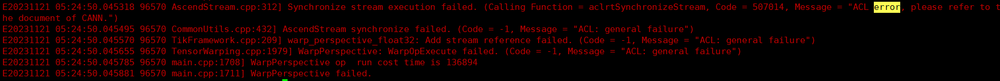

# FAQ

## Runtime Issues

### `can not find the element factory : mxpi_xxxpostprocessor` Error Occurs When Vision SDK Is Used

**Symptom**

When you use Vision SDK, the error `can not find the element factory : mxpi_xxxpostprocessor` occurs.

In `/mxVision-{version}/opensource/bin`, run `./gst-inspect-1.0 mxpi_xxxpostprocessor` to check the plugin. The plugin loads normally, but the same error still occurs when you run the program.

**Cause Analysis**

The GStreamer cache has not been cleared.

**Solution**

1. Ensure that Python 3.9 is installed in the environment.
2. Run `rm ~/.cache/gstreamer-1.0/registry.{arch}.bin` to clear the GStreamer registry cache, where `{arch}` is `x86_64` or `aarch64` depending on the actual runtime environment. Then rerun the program.

### `coredump` Occurs When an Attempt Is Made to Print `Tensor` or `Image` Memory Data on the Device Side

**Symptom**

When `Tensor` or `Image` data resides on the device side, calling the `GetData()` interface to return a pointer and print the data pointed to by that pointer causes a coredump.

**Cause Analysis**

The device-side address space and the host-side address space are independent. The host side cannot directly access device-side data. For details, see *CANN Application Development Guide (C&C++)*.

**Solution**

First use `Tensor.ToHost()` or `Image.ToHost()` to move the `Tensor` or `Image` data from the device side to the host side. Then try printing the data again.

### `Synchronize stream execution failed` Error Occurs When the `WarpAffineHiper` or `WarpPerspective` Interface Is Run

**Symptom**

When you run the `WarpAffineHiper` or `WarpPerspective` interface, the error `Synchronize stream execution failed. (Calling Function = aclrtSynchronizeStream, Code = 507014, Message = "ACL error, please refer to the document of CANN.")` occurs. The error code is `507014`.



**Cause Analysis**

The input shape is too large, or the computation for the transformation matrix is too heavy, which causes the `aicore` execution to time out.

**Solution**

Use data slicing to split the input shape or change the transformation matrix to reduce the data volume.

## Dependency Conflicts

### System Commands `yum` and `cmake` Become Unavailable

**Symptom**

After you import the environment variables for Vision SDK package, the system commands `yum` and `cmake` become unavailable, and the error message mentions OpenSSL.

The error message for the `yum` command is as follows:

```text
ImportError: /lib64/libcurl.so.4: symbol SSLv3_client_method version OPENSSL_1_1_0 not defined in file libssl.so.1.1 with link time reference
ModuleNotFoundError: No module named '_conf'
```

The error message for the `cmake` command is as follows:

```text
symbol lookup error: /usr/lib64/libldap.so.2: undefined symbol: EVP_md2, version OPENSSL_3.0.0
```

**Cause Analysis**

After you import Vision SDK environment variables, `libssl.so` or `libcrypto.so` in `/mxVision-{version}/opensource/lib` conflicts with the `libssl.so` and `libcrypto.so` required by `yum` and `cmake`. `{version}` is the actual Vision SDK version that is installed.

**Solution**

When you need to run the `yum` or `cmake` commands, temporarily remove Vision SDK `opensource/lib` path from the `LD_LIBRARY_PATH` environment variable. When you build Vision SDK-related programs, add `add_link_options(-Wl,-rpath-link,${MX_SDK_HOME}/opensource/lib)` to `CMakeLists.txt` to specify the link path. When you run Vision SDK-related programs, add the `opensource/lib` path back to the `LD_LIBRARY_PATH` environment variable.

### Running the `TensorOperations` Interface on `x86_64` Causes a Coredump and the Stack Trace Ends in `libffi.so`

**Symptom**

On `x86_64` architecture devices, running the `TensorOperations` interface causes a coredump. The stack trace shows that the last execution occurs in `libffi.so`.

**Cause Analysis**

The user program links to `libstreammanager.so`, so at runtime it loads the higher-version `libffi` from the software package first. Some `TensorOperations` interfaces call the Python C API at runtime, but the Python installation in the environment depends on the lower-version `libffi` that comes with the system. The two `libffi` versions conflict on `x86_64` architecture devices and cause a coredump.

**Solution**

1. Check which Python the current environment uses, and run the following command in the corresponding `lib` directory:

    ```bash
    find /path/to/python -name "_ctypes.cpython*so"
    ```

2. Use `ldd` to view the path of the `libffi.so` on which the found `.so` file depends:

    ```bash
    ldd /path/to/_ctypes.cpython*so
    ```

3. Run the following command to give priority to the `libffi` shared library that Python depends on:

    ```bash
    export LD_PRELOAD=/path/to/libffi.so
    ```
