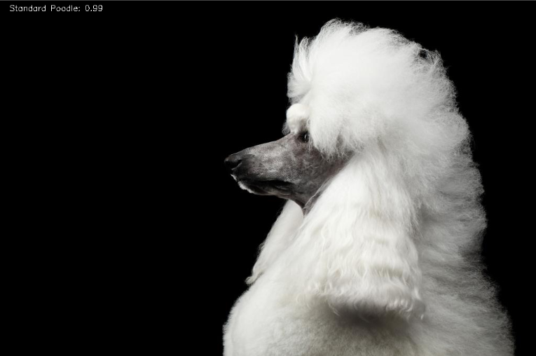

# Quick Start

Vision SDK provides image and video processing acceleration capabilities, including image encoding, decoding, and processing. It can also use the NPU for model inference to build end-to-end video solutions. This document helps you quickly get started with the Vision SDK development and usage by deploying a container environment and running three samples.

For installation on the host machine, see the [Installation Guide](./installation_guide.md).

## Prerequisites

Before you begin, confirm that the following requirements are met:

- **Hardware**: The supported hardware is as follows:
  - Atlas 300I Inference Card
  - Atlas 500 A2 Intelligent Edge Server
  - Atlas 300I Pro Inference Card
  - Atlas 300I Duo Inference Card
  - Atlas 300V Video Analytics Card
  - Atlas 300V Pro Video Analytics Card
  - Atlas 200I SoC A1 Core Board
  - Atlas 800I A2 Inference Product
- **Docker**: Docker is installed, and the current user can run containers.

## Step 1: Starting the Container

1. **Selecting a matching version**
   - Visit the Ascend community [Vision SDK image](https://www.hiascend.com/developer/ascendhub/detail/9e0edaf9488b447b951072c5c61ce8f1).
   - Select the image version that matches the current hardware model (for example, the Atlas 800I A2 inference server). The image is built on the CANN base image. Therefore, you do not need to install CANN separately.
   - Note the difference between CPU architectures (x86_64/aarch64) and Ascend chip models (Ascend310/910, and so on).
2. **Prechecking the environment**
   - Use the `npu-smi info` command to verify the NPU driver status.
   - Check that the driver version matches the CANN version in the image (see the [Firmware and Drivers](https://www.hiascend.com/hardware/firmware-drivers/community) document).
3. **Image pulling example**

   ```shell
   docker pull swr.cn-south-1.myhuaweicloud.com/ascendhub/visionsdk:26.0.0-310p-ubuntu22.04-py3.11
   docker tag swr.cn-south-1.myhuaweicloud.com/ascendhub/visionsdk:26.0.0-310p-ubuntu22.04-py3.11 visionsdk:26.0.0-310p-ubuntu22.04-py3.11
   ```

4. **Starting the container**

  ```shell
  docker run \
      --name vision_container \
      --device /dev/davinci0 \
      --device /dev/davinci_manager \
      --device /dev/devmm_svm \
      --device /dev/hisi_hdc \
      -v /usr/local/dcmi:/usr/local/dcmi \
      -v /usr/local/bin/npu-smi:/usr/local/bin/npu-smi \
      -v /usr/local/Ascend/driver/lib64/:/usr/local/Ascend/driver/lib64/ \
      -v /usr/local/Ascend/driver/version.info:/usr/local/Ascend/driver/version.info \
      -v /etc/ascend_install.info:/etc/ascend_install.info \
      -it visionsdk:26.0.0-310p-ubuntu22.04-py3.11 bash
  ```

## Step 2: Running the Samples

### 2.1 API Development (C++)

The samples described in this section apply to Atlas inference series products and Atlas 200I/500 A2 inference products.

**Sample Introduction**

The following sample uses an Atlas inference series product to demonstrate how to develop an object detection application with the Vision SDK C++ interface. [Figure 1](#pic-infer-stream) shows the inference flowchart of the object detection model. The sample uses a YoloV3 model based on the TensorFlow framework. Key steps include initializing resources, preprocessing the input image (for example, resizing and converting it to the Tensor format), running inference with the YoloV3 model, and post-processing the model output to identify objects and visualize them with OpenCV. After inference completes, the output displays the detected object bounding boxes and their class labels.

**Figure 1**  Inference process flowchart of the object detection model<a id="pic-infer-stream"></a>


**Prerequisites**

1. Obtain the sample code.

   - Visit the [download link](https://gitcode.com/printSSS/visionsdk-sample/blob/main/YoloV3Infer.zip) to obtain the sample code package.

   - Or visit the complete link `https://gitcode.com/printSSS/visionsdk-sample/blob/main/YoloV3Infer.zip` to obtain it.

   - You can also run the following commands on the server to obtain the sample code package:

      ```bash
      wget "https://gitcode.com/printSSS/visionsdk-sample/blob/main/YoloV3Infer.zip"
      ```

     Or use the `curl` command:

      ```bash
      curl -O "https://gitcode.com/printSSS/visionsdk-sample/blob/main/YoloV3Infer.zip"
      ```

2. Decompress the sample code package and enter the extracted directory. Use the following commands as a reference.

    ```bash
    unzip YoloV3Infer.zip
    cd YoloV3Infer
    ```

   The sample code directory structure is as follows.

    ```text
    YoloV3Infer
    ├── model
    │ ├── yolov3.names                        # yolov3 post-processing label file
    │ ├── yolov3_tf_bs1_fp16.cfg            # yolov3 post-processing configuration file
    │ ├── aipp_yolov3_416_416.aippconfig  # AIPP conversion file for the yolov3 om model
    ├── main.cpp                  # Main program file
    ├── CMakeLists.txt
    ├── run.sh               # Script for running the program. Before you run it, you are advised to use the dos2unix tool to run the dos2unix run.sh command and format the script
    ├── README.md
    ├── test.jpg                  # Test image that you need to prepare yourself
    ```

3. Prepare the `yolov3_tf_bs1_fp16.om` model for inference.<a id="transfer-yolov3-tf"></a>

   Download [yolov3_tf.pb](https://gitee.com/link?target=https%3A%2F%2Fobs-9be7.obs.cn-east-2.myhuaweicloud.com%2F003_Atc_Models%2Fmodelzoo%2Fyolov3_tf.pb) and place it in the `./model` directory of the sample code. You can use the `wget` command:

    ```bash
    cd model
    wget "https://obs-9be7.obs.cn-east-2.myhuaweicloud.com/003_Atc_Models/modelzoo/yolov3_tf.pb"
    cd ..
    ```

   Or use the `curl` command:

    ```bash
    cd model
    curl -O "https://obs-9be7.obs.cn-east-2.myhuaweicloud.com/003_Atc_Models/modelzoo/yolov3_tf.pb"
    cd ..
    ```

   Run the following commands to complete the model weight conversion:

    ```bash
    export TE_PARALLEL_COMPILER=1

    soc="Ascend"
    chip_version=$(npu-smi info | awk '{print $3}' | grep -m 1 310)

    # Execute, transform YOLOv3 model
    atc --model=model/yolov3_tf.pb --framework=3 --output=model/yolov3_tf_bs1_fp16 --soc_version="$soc$chip_version" --insert_op_conf=./model/aipp_yolov3_416_416.aippconfig --input_shape="input:1,416,416,3" --out_nodes="yolov3/yolov3_head/Conv_6/BiasAdd:0;yolov3/yolov3_head/Conv_14/BiasAdd:0;yolov3/yolov3_head/Conv_22/BiasAdd:0"
    ```

4. Prepare the image data for inference.

   You need to use your own images for testing. Rename the image to `test.jpg`. The following image is for demonstration only.

   **Figure 2**  test.jpg
   

>[!NOTE]
>If `cmake` is unavailable on the openEuler system, see [System Commands `yum` and `cmake` Become Unavailable](faq.md#system-commands-yum-and-cmake-become-unavailable) for a solution.

**Code Walkthrough**

The following sections describe the key steps and code for this sample. Do not copy the code directly for compilation and execution. Refer to the sample files for the complete sample code.

1. Initialize resources and configure model-related variables, such as the model path, configuration file path, and label path.

    ```cpp
    // Initialize resources and variables
    const uint32_t YOLOV3_RESIZE = 416; // Image resize dimension

    std::string yolov3ModelPath = "./model/yolov3_tf_bs1_fp16.om"; // Model path. The .om model file is generated automatically after you run the run.sh script and is located in the ./model directory
    std::string yolov3ConfigPath = "./model/yolov3_tf_bs1_fp16.cfg"; // Post-processing configuration file path
    std::string yolov3LabelPath = "./model/yolov3.names"; // Post-processing label file path

    v2Param.deviceId = 0; // Configuration
    v2Param.labelPath = yolov3LabelPath;
    v2Param.configPath = yolov3ConfigPath;
    v2Param.modelPath = yolov3ModelPath;
    APP_ERROR ret = MxBase::MxInit();
    ```

2. Preprocess the input data. After you call `MxInit` to initialize resources and create an `ImageProcessor` object, decode the image to obtain an `Image` object. Then resize the image and convert it to the data format required for inference, which is the `Tensor` type.

    ```cpp
    // Preprocessing
    // Create the image processing class
    MxBase::ImageProcessor imageProcessor(deviceId);

    // Create the decoded image class
    MxBase::Image decodedImage;
    // Decode the image by path
    ret = imageProcessor.Decode(imgPath, decodedImage, ImageFormat::YUV_SP_420);

    MxBase::Image resizeImage;
    // Set the resize dimensions
    MxBase::Size resizeConfig(YOLOV3_RESIZE, YOLOV3_RESIZE);
    // Perform resizing
    ret = imageProcessor.Resize(decodedImage, resizeConfig, resizeImage, MxBase::Interpolation::HUAWEI_HIGH_ORDER_FILTER);

    std::string path = "./resized_yolov3_416.jpg";
    // Encode the resized image and output it to the specified path
    ret = imageProcessor.Encode(resizeImage, path);

    // Convert the Image object to a Tensor
    MxBase::Tensor tensorImg = resizeImage.ConvertToTensor();
    // Set the device ID that hosts the Tensor
    ret = tensorImg.ToDevice(deviceId);
    ```

3. Build the model class, pass in the `Tensor` object created in preprocessing, call the `Infer` interface, and obtain the model output `yoloV3Outputs`.

    ```cpp
    // Model inference
    // Build the model class
    MxBase::Model yoloV3(modelPath, deviceId);

    // Construct the input batch Tensor for the Infer interface
    std::vector<MxBase::Tensor> yoloV3Inputs = {tensorImg};
    // Run model inference
    std::vector<MxBase::Tensor> yoloV3Outputs = yoloV3.Infer(yoloV3Inputs);
    ```

4. Postprocess the model output. Use the post-processing module provided by Vision SDK, or develop your own module, to obtain the object detection boxes and object classes, and draw them on the original image with OpenCV.

    ```cpp
    // Post-processing
    // Post-process original image information
    MxBase::ImageInfo imageInfo;
    imageInfo.oriImagePath = argv[1];
    imageInfo.oriImage = decodedImage;
    // Run the post-processing function
    ret = YoloV3PostProcess(imageInfo, v2Param.configPath, v2Param.labelPath, yoloV3Outputs);

    // Main logic of the YoloV3PostProcess function
    // Create post-processing configuration information
    std::map<std::string, std::string> postConfig;
    postConfig.insert(pair<std::string, std::string>("postProcessConfigPath", yoloV3ConfigPath));
    postConfig.insert(pair<std::string, std::string>("labelPath", yoloV3LabelPath));

    // Initialize the post-processing class
    MxBase::Yolov3PostProcess yolov3PostProcess;
    APP_ERROR ret = yolov3PostProcess.Init(postConfig);

    // Post-processing
    vector<MxBase::TensorBase> tensors;
    // Build object detection information based on the model inference result. This information is required by the post-processing function implemented by Vision SDK
    // If the post-processing function is user-defined, construct it according to the actual situation
    vector<vector<MxBase::ObjectInfo>> objectInfos;
    auto shape = yoloV3Outputs[0].GetShape();
    MxBase::ResizedImageInfo imgInfo;
    // Image width before resizing
    imgInfo.widthOriginal = imageInfo.oriImage.GetOriginalSize().width;
    // Image height before resizing
    imgInfo.heightOriginal = imageInfo.oriImage.GetOriginalSize().height;
    // Image width after resizing
    imgInfo.widthResize = YOLOV3_RESIZE;
    // Image height after resizing
    imgInfo.heightResize = YOLOV3_RESIZE;
    // Image resize type
    imgInfo.resizeType = MxBase::RESIZER_STRETCHING;
    std::vector<MxBase::ResizedImageInfo> imageInfoVec = {};
    imageInfoVec.push_back(imgInfo);
    // Run post-processing
    ret = yolov3PostProcess.Process(tensors, objectInfos, imageInfoVec);
    // Use OpenCV to visualize the object detection boxes
    cv::putText(imgBgr, objectInfos[i][j].className, cv::Point(x0 + 10, y0 + 10), cv::FONT_HERSHEY_SIMPLEX, 1.0, cv::Scalar(0, 255,0), 4, 8);
       cv::rectangle(imgBgr, cv::Rect(x0, y0, x1 - x0, y1 - y0), cv::Scalar(0, 255, 0), 4);
    // Deinitialize model post-processing
    ret = yolov3PostProcess.DeInit();
    ```

5. Deinitialize and release resources.

    ```cpp
    // Deinitialize
    ret = MxBase::MxDeInit();
    if (ret != APP_ERR_OK) {
        LogError << "MxDeInit failed, ret=" << ret << ".";
        return ret;
    }
    ```

**Running Inference**

1. Run inference.

    ```bash
    mkdir build
    cd build
    cmake ..
    make -j4
    cd ..
    ./mxbaseV2_sample test.jpg
    ```

   If the following information is returned, the run succeeds.

    ```text
    yoloV3Outputs len=3
    ******YoloV3PostProcess******
    Size of objectInfos is 1
    objectInfo-0 ,Size:1
    *****objectInfo-0:0
    x0 is 410.738
    y0 is 27.4772
    x1 is 948.388
    y1 is 645.941
    confidence is 0.758505
    classId is 16
    className is dog
    ******YoloV3PostProcess end******
    ```

   After inference completes, the `result.jpg` file is generated in the current folder. The image result is shown in [Figure 3](#pic-cpp-infer-result). It displays the coordinate boxes and classes of the detected objects.

   **Figure 3**  result.jpg file<a id="pic-cpp-infer-result"></a>
   

### 2.2 API Development (Python)

The samples described in this section apply to Atlas inference series products and Atlas 200I/500 A2 inference products.

**Sample Introduction**

The following sample uses an Atlas inference series product to demonstrate how to develop an image classification application with the Vision SDK Python interface. [Figure 1](#pic-infer-python) shows the inference flowchart of the image classification model. The sample uses a ResNet-50 model from the Caffe framework. The workflow includes initializing resources, preprocessing the input image (for example, resizing and converting it to the format required by the model), running inference with the ResNet-50 model, and post-processing the inference result to obtain the predicted class label and confidence. The result is displayed on the image, and the image with the predicted label and confidence is saved.

**Figure 1**  Inference process of the classification model<a id="pic-infer-python"></a>


**Prerequisites**

1. Complete the Vision SDK installation and deployment before you use the quick start sample.

   **Table 1**  Software dependencies for the environment

   |Software Dependency|Recommended Version|Download Link|
   |--|--|--|
   |`numpy`|1.26.4|`pip3 install numpy==1.26.4`|
   |`opencv-python`|4.9.0.80|`pip3 install opencv-python==4.9.0.80`|
   |`libgl1-meta-glx`|-|Ubuntu: `apt-get update && apt-get install libgl1-mesa-glx`, or CentOS: `yum install mesa-libGL`|

2. Obtain the sample code.

   - Visit the [download link](https://gitcode.com/printSSS/visionsdk-sample/blob/main/resnet50_sdk_python_sample.zip) to obtain the sample code package.

   - Or visit the complete link `https://gitcode.com/printSSS/visionsdk-sample/blob/main/resnet50_sdk_python_sample.zip` to obtain it.

   - You can also run the following commands on the server to obtain the sample code package:

      ```bash
      wget "https://gitcode.com/printSSS/visionsdk-sample/blob/main/resnet50_sdk_python_sample.zip"
      ```

     Or use the `curl` command:

      ```bash
      curl -O "https://gitcode.com/printSSS/visionsdk-sample/blob/main/resnet50_sdk_python_sample.zip"
      ```

3. Decompress the sample code package and enter the extracted directory. Use the following commands as a reference.

    ```bash
    unzip resnet50_sdk_python_sample.zip
    cd resnet50_sdk_python_sample
    ```

   The sample code directory structure is as follows.

    ```text
    |-- resnet50_sdk_python_sample
    |   |-- main.py         # Python entry code
    |   |-- README.md
    |   |-- run.sh          # Script for running the program
    |   |-- data
    |   |   |-- test.jpg    # Test image used for testing
    |   |-- model
    |   |   |-- resnet50.caffemodel
    |   |   |-- resnet50.prototxt
    |   |-- utils
    |   |   |-- resnet50.cfg
    |   |   |-- resnet50_clsidx_to_labels.names
    ```

4. Complete the model conversion.

   Run the following commands to convert the caffemodel to an om model:

    ```bash
    export TE_PARALLEL_COMPILER=1

    soc="Ascend"
    chip_version=$(npu-smi info | awk '{print $3}' | grep -m 1 310)

    # Execute, transform model
    atc --model=model/resnet50.prototxt --weight=model/resnet50.caffemodel --framework=0 --output=model/resnet50 --soc_version="$soc$chip_version"
    ```

5. Prepare the image data for inference.

   You can use the `test.jpg` image in the sample for testing, or obtain another image for testing. Rename the image to `test.jpg`.

   **Figure 2**  test.jpg
   

**Code Walkthrough**

The following sections describe the key steps and code for this sample. Do not copy the code directly for compilation and execution. Refer to the sample files for the complete sample code.

1. In `main.py`, import the third-party libraries required by the sample and the files required for Vision SDK model inference.

    ```python
    import numpy as np  # Used for calculations on multidimensional arrays
    import cv2  # Third-party image processing library used for image preprocessing and post-processing

    from mindx.sdk import Tensor  # Tensor data structure in Vision SDK
    from mindx.sdk import base  # Vision SDK inference interface
    from mindx.sdk.base import post  # post.Resnet50PostProcess is the ResNet-50 post-processing interface
    ```

   The main program flow is as follows:

    ```python
    if __name__ == "__main__":
        base.mx_init()   # Initialize Vision SDK resources
        process()        # Main program logic
        base.mx_deinit() # Deinitialize Vision SDK resources
    ```

2. Configure model-related variables, such as the image path, model path, configuration file path, and label path.

    ```python
    '''Configure model-related variables'''
    pic_path = 'data/test.jpg'  # Single image
    model_path = "model/resnet50.om"  # Model path
    device_id = 0  # Specify the device for computation
    config_path='utils/resnet50.cfg'  # Post-processing configuration file
    label_path='utils/resnet50_clsidx_to_labels.names'  # Class label file
    img_size = 256
    ```

3. Preprocess the input data. First, use OpenCV to read the image and obtain a three-dimensional array. Then crop, resize, and convert the color space as needed, and convert the result to the data format required for inference, which is the `Tensor` type.

    ```python
    '''Preprocess the input data'''
    img_bgr = cv2.imread(pic_path)
    img_rgb = img_bgr[:,:,::-1]
    img = cv2.resize(img_rgb, (img_size, img_size))  # Resize to the target size
    hw_off = (img_size - 224) // 2  # Crop the image to take the central region
    crop_img = img[hw_off:img_size - hw_off, hw_off:img_size - hw_off, :]
    img = crop_img.astype("float32")  # Convert to float32
    img[:, :, 0] -= 104  # The constants 104, 117, and 123 convert the image to the color space required by the Caffe model
    img[:, :, 1] -= 117
    img[:, :, 2] -= 123
    img = np.expand_dims(img, axis=0)  # Expand the first dimension to match the model input
    img = img.transpose([0, 3, 1, 2])  # Convert (batch,height,width,channels) to (batch,channels,height,width)
    img = np.ascontiguousarray(img)  # Store the data contiguously in memory
    img = Tensor(img) # Convert numpy to a Tensor class
    ```

4. Use the `model.infer()` interface for model inference and obtain the model output.

    ```python
    '''Model inference'''
    model = base.model(modelPath=model_path, deviceId=device_id)  # Initialize the base.model class
    output = model.infer([img])[0]  # Run inference. Input data type: List[base.Tensor]. Return value: List[base.Tensor] of model inference outputs
    ```

5. Postprocess the model output. Use the post-processing module provided by Vision SDK to obtain the predicted class and its confidence, and present the result on the original image.

    ```python
    '''Postprocess the model output'''
    postprocessor = post.Resnet50PostProcess(config_path=config_path, label_path=label_path)  # Get the post-processing object
    pred = postprocessor.process([output])[0][0]  # Use the Vision SDK interface for post-processing. pred: <ClassInfo classId=... confidence=... className=...>
    confidence = pred.confidence  # Get the class confidence
    className = pred.className  # Get the class name
    print('{}: {}'.format(className, confidence))  # Print the result

    '''Save the inference image'''
    img_res = cv2.putText(img_bgr, f'{className}: {confidence:.2f}', (20, 20), cv2.FONT_HERSHEY_SIMPLEX, 1, (255, 255, 255), 1)  # Add the predicted class and confidence to the image
    cv2.imwrite('result.png', img_res)
    print('save infer result success')
    ```

**Running Inference**

1. Run inference.

    ```bash
    python main.py
    ```

   If the following information is returned, the run succeeds.

    ```text
    Standard Poodle: 0.98583984375
    save infer result success
    ```

   After inference completes, the `result.png` file is generated in the current folder. The image result is shown in [Figure 3](#pic-python-result). It displays the image class label and the corresponding confidence.

   **Figure 3**  result.png file<a id="pic-python-result"></a>

   

### 2.3 Pipeline-Based Development

The samples described in this section apply to Atlas inference series products and Atlas 200I/500 A2 inference products.

**Sample Introduction**

The following sample uses an Atlas inference series product and the Vision SDK image classification sample to describe how to develop an inference application using the Vision SDK process orchestration method. The sample uses a YoloV3 model to classify images. The process includes creating a pipeline configuration file and defining the order of tasks such as image decoding, resizing, inference, and post-processing. Use `MxStreamManager` to manage the process, and data is sent to the stream for processing. The pipeline outputs the classification result, which can be further processed or displayed.

**Prerequisites**

1. Obtain the sample code.

   - Visit the [download link](https://gitcode.com/printSSS/visionsdk-sample/blob/main/pipelineSample.zip) to obtain the sample code package.

   - Or visit the complete link `https://gitcode.com/printSSS/visionsdk-sample/blob/main/pipelineSample.zip` to obtain it.

   - You can also run the following commands on the server to obtain the sample code package:

      ```bash
      wget "https://gitcode.com/printSSS/visionsdk-sample/blob/main/pipelineSample.zip"
      ```

     Or use the `curl` command:

      ```bash
      curl -O "https://gitcode.com/printSSS/visionsdk-sample/blob/main/pipelineSample.zip"
      ```

2. Decompress the sample code package and enter the extracted directory. Use the following commands as a reference.

    ```bash
    unzip pipelineSample.zip
    cd pipelineSample
    ```

   The sample code directory structure is as follows.

    ```text
    |-- pipelineSample
    |   |-- data
    |   |   |-- dog1_1024_683.jpg            // Test image
    |   |-- models                        // Directory that stores models
    |   |   |-- yolov3_tf_bs1_fp16.cfg     // Model configuration file
    |   |   |-- aipp_yolov3_416_416.aippconfig  // AIPP conversion file for the yolov3 om model
    |   |   |-- yolov3.names   // Model output class name file
    |   |-- pipeline                     // Directory that stores pipeline files
    |   |   |-- Sample.pipeline        // Pipeline file
    |   |-- src
    |   |   |-- CMakeLists.txt              // CMakeLists file
    |   |   |-- main.cpp                    // Main function. Implementation file of the image classification feature
    |   |-- README.md
    |   |-- run.sh                   // Script for running the program. Before you run it, you are advised to use the dos2unix tool to run the dos2unix run.sh command and format the script
    ```

3. Prepare the `yolov3_tf_bs1_fp16.om` model for inference.

   Download [yolov3_tf.pb](https://gitee.com/link?target=https%3A%2F%2Fobs-9be7.obs.cn-east-2.myhuaweicloud.com%2F003_Atc_Models%2Fmodelzoo%2Fyolov3_tf.pb) and place it in the `./models` directory of the sample code. You can use the `wget` command:

    ```bash
    cd models
    wget "https://obs-9be7.obs.cn-east-2.myhuaweicloud.com/003_Atc_Models/modelzoo/yolov3_tf.pb"
    cd ..
    ```

   Or use the `curl` command:

    ```bash
    cd models
    curl -O "https://obs-9be7.obs.cn-east-2.myhuaweicloud.com/003_Atc_Models/modelzoo/yolov3_tf.pb"
    cd ..
    ```

   Run the following commands to complete the model weight conversion:

    ```bash
    export TE_PARALLEL_COMPILER=1

    soc="Ascend"
    chip_version=$(npu-smi info | awk '{print $3}' | grep -m 1 310)

    # Execute, transform YOLOv3 model
    atc --model=models/yolov3_tf.pb --framework=3 --output=models/yolov3_tf_bs1_fp16 --soc_version="$soc$chip_version" --insert_op_conf=./models/aipp_yolov3_416_416.aippconfig --input_shape="input:1,416,416,3" --out_nodes="yolov3/yolov3_head/Conv_6/BiasAdd:0;yolov3/yolov3_head/Conv_14/BiasAdd:0;yolov3/yolov3_head/Conv_22/BiasAdd:0"
    ```

4. Prepare the image data for inference.

   You need to use your own images for testing. Rename the image to match the image name in the sample code, such as `dog1_1024_683.jpg`. The following image is for demonstration only.

   **Figure 1**  Typical sample image<a id="pic-infer-stream"></a>
   

**Pipeline File Orchestration**

Pipeline file orchestration is the most critical task in developing applications with Vision SDK. You can decompose an image classification application into a series of service processes. By editing the pipeline file, you can call the Vision SDK plugin library to complete the inference service. The content of the pipeline file in this topic uses the service process shown in [Figure 2](#pic-stream-workflow) as the sample for orchestration.

**Figure 2**  Service process orchestration<a id="pic-stream-workflow"></a>


The sample is as follows.

```json
{
  "objectdetection": {                // Modify "objectdetection" to the name of the current service inference process
    "stream_config": {
      "deviceId": "0"                // "deviceId" indicates the ID of the chip to use
    },
    "appsrc0": {                     // "appsrc0" indicates the name of the input element
      "props": {                     // "props" indicates element properties
        "blocksize": "409600"        // Size of data read by each buffer
      },
      "factory": "appsrc",           // "factory" defines the element type
      "next": "mxpi_imagedecoder0"   // "next" specifies the connected downstream element, which is the image decoding element
    },
    "mxpi_imagedecoder0": {          // Name of the image decoding element. 0 indicates the index. If you need to use multiple image decoding elements in one process, name them in sequence as 0, 1, 2, and so on
      "props": {
        "handleMethod": "ascend"     // The decoding method is ascend
      },
      "factory": "mxpi_imagedecoder",    // Use the image decoding plugin
      "next": "mxpi_imageresize0"    // "next" specifies the connected downstream element, which is the image resizing element
    },
    "mxpi_imageresize0": {           // Name of the image resizing element
      "props": {
        "handleMethod": "ascend",    // The decoding method is ascend
        "resizeHeight": "416",       // Specify the resized height
        "resizeWidth": "416",        // Specify the resized width
        "resizeType": "Resizer_Stretch"      // The resize mode is stretch
      },
      "factory": "mxpi_imageresize",     // Use the image resizing plugin
      "next": "mxpi_tensorinfer0"     // "next" specifies the connected downstream element, which is the model inference element
    },
    "mxpi_tensorinfer0": {                                   // Name of the model inference element
      "props": {                                             // "props" indicates element properties and can load files from the specified directory
        "dataSource": "mxpi_imageresize0",              // "dataSource" specifies the connected upstream element, which is the image resizing element
        "modelPath": "../models/yolov3_tf_bs1_fp16.om",    // The "modelPath" property defines the model used by the inference service. You need to modify the file name based on the model you obtain
        "waitingTime": "2000",                               // Waiting time for a batch that a multi-batch model can tolerate
        "outputDeviceId": "-1"                               // Copy memory to the specified location. Set it to -1 to copy to the host side
      },
      "factory": "mxpi_tensorinfer",                         // Use the model inference plugin
      "next": "mxpi_objectdetection0"                     // "next" specifies the connected downstream element, which is the model post-processing element
    },
    "mxpi_objectdetection0": {                            // Name of the model post-processing element
      "props": {                                             // "props" indicates element properties and can load files from the specified directory
        "dataSource": "mxpi_tensorinfer0",                   // "dataSource" specifies the connected upstream element, which is the model inference element
        "postProcessConfigPath": "../models/yolov3_tf_bs1_fp16.cfg",// "postProcessConfigPath" specifies the model post-processing configuration file
        "labelPath": "../models/yolov3.names",    // "labelPath" specifies the model output class name file
        "postProcessLibPath": "libyolov3postprocess.so"    // "postProcessLibPath" specifies the dynamic library on which model post-processing depends
      },
      "factory": "mxpi_objectpostprocessor",                  // Use the model post-processing plugin
      "next": "mxpi_dataserialize0"                          // "next" specifies the connected downstream element, which is the serialization element
    },
    "mxpi_dataserialize0": {                                 // Name of the serialization element
      "props": {
        "outputDataKeys": "mxpi_objectdetection0"         // "outputDataKeys" specifies the index of the data to be output
      },
      "factory": "mxpi_dataserialize",                       // Use the serialization plugin
      "next": "appsink0"                                     // "next" specifies the connected downstream element, which is the output element
    },
    "appsink0": {                                            // Name of the output element
      "props": {
        "blocksize": "4096000"                               // Size of data read by each buffer
      },
      "factory": "appsink"                                   // Use the output plugin
    }
  }
}
```

>[!NOTE]
>The comments in the pipeline file are for reference only. Remove the comments when you write the pipeline file. Otherwise, parsing fails.

The pipeline has the following key concepts:

- The value of the `next` attribute indicates the connection relationship between elements.
- You send data to the Stream through the `appsrc0` element and obtain inference results from the Stream through the `appsink0` element.
- The `mxpi_objectdetection0` element is used to post-process the output tensor of model inference. For example, in the preceding sample, the model post-processing element processes the one-dimensional tensor output by the upstream model inference element and returns the model recognition result, including the coordinates, class, and corresponding confidence of the object.
- The `mxpi_dataserialize0` element packages the inference result into a JSON string for output.

**Code Walkthrough**

The `pipelineSample/src` directory contains the `main.cpp` source file of the application.

In this sample, the key steps and code are as follows. Do not copy the code directly for compilation and execution. You need to modify the pipeline file path, input image path, and Stream name according to the actual situation. The Stream name must match the name of the service inference process in the pipeline file. For example, the name of the service inference process in the preceding pipeline file is `objectdetection`. Refer to the sample files for the complete sample code.

```cpp
int main(int argc, char* argv[])
 {
    // 1. Parse the pipeline file
    std::string pipelineConfigPath = "../pipeline/Sample.pipeline";  // Modify the pipeline file path
    std::string pipelineConfig = ReadPipeline(pipelineConfigPath);
    if (pipelineConfig == "") {
        LogError << "Read pipeline failed.";
        return APP_ERR_COMM_INIT_FAIL;
    }
    // 2. Initialize the stream manager
    MxStream::MxStreamManager mxStreamManager;
    APP_ERROR ret = mxStreamManager.InitManager();
    if (ret != APP_ERR_OK) {
        LogError << GetErrorInfo(ret) << "Failed to init Stream manager.";
        return ret;
    }
    // 3. Create the stream
    ret = mxStreamManager.CreateMultipleStreams(pipelineConfig);
    if (ret != APP_ERR_OK) {
        LogError << GetErrorInfo(ret) << "Failed to create Stream.";
        mxStreamManager.DestroyAllStreams();
        return ret;
    }
    // 4. Read the image to be inferred
    MxStream::MxstDataInput dataBuffer;
    ret = ReadFile("../data/dog1_1024_683.jpg", dataBuffer);    // Modify the input image path
    if (ret != APP_ERR_OK) {
        LogError << GetErrorInfo(ret) << "Failed to read image file.";
        mxStreamManager.DestroyAllStreams();
        return ret;
    }
    std::string streamName = "objectdetection";    // Modify the name of the service inference process
    int inPluginId = 0;
    // 5. Send the image to the stream for inference
    ret = mxStreamManager.SendData(streamName, inPluginId, dataBuffer);
    if (ret != APP_ERR_OK) {
        LogError << GetErrorInfo(ret) << "Failed to send data to stream.";
        delete dataBuffer.dataPtr;
        dataBuffer.dataPtr = nullptr;
        mxStreamManager.DestroyAllStreams();
        return ret;
    }
    // 6. Obtain the inference result
    MxStream::MxstDataOutput* output = mxStreamManager.GetResult(streamName, inPluginId);
    if (output == nullptr) {
        LogError << "Failed to get pipeline output.";
        delete dataBuffer.dataPtr;
        dataBuffer.dataPtr = nullptr;
        mxStreamManager.DestroyAllStreams();
        return ret;
    }
    std::string result = std::string((char *)output->dataPtr, output->dataSize);
    std::cout << "Results:" << result << std::endl;
    // 7. Destroy the stream and release resources
    mxStreamManager.DestroyAllStreams();
    delete dataBuffer.dataPtr;
    dataBuffer.dataPtr = nullptr;
    delete output;
    return 0;
 }
```

**Building and Running the Application**

1. Run the application by running the build script.

    ```bash
    cd src
    mkdir build
    cd build
    cmake ..
    make -j4
    cd ..
    ./main
    ```

   The terminal output is as follows. `classId` indicates the class number, `className` indicates the class name, and `confidence` indicates the maximum confidence of the classification:

    ```text
    Results:{
        "MxpiObject":[{"classVec":[{
            "classId":16,
            "className":"dog",
            "confidence":0.994434595,
            "headerVec":[]}],
        "x0":113.476166,
        "x1":882.497559,
        "y0":127.61911,
        "y1":595.543884
        }]
    }
    ```
