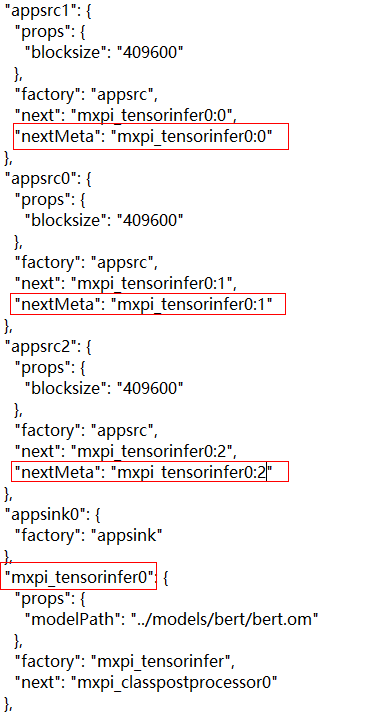
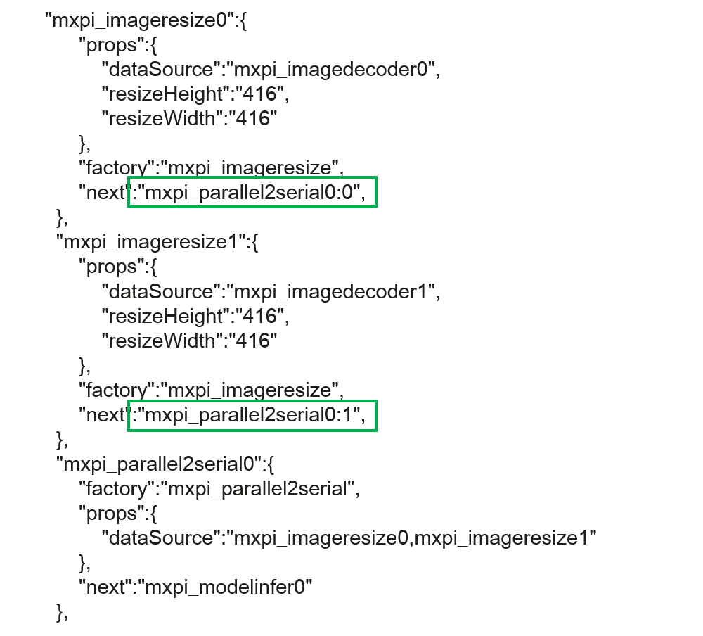
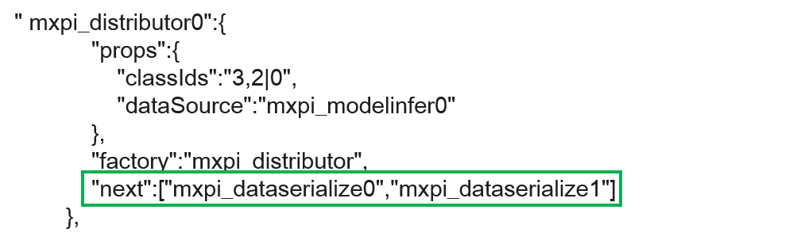
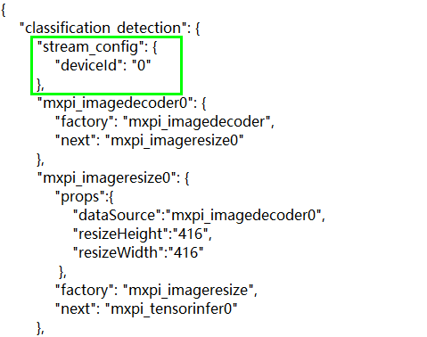
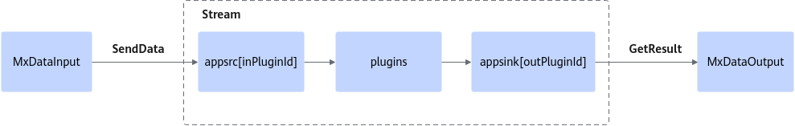
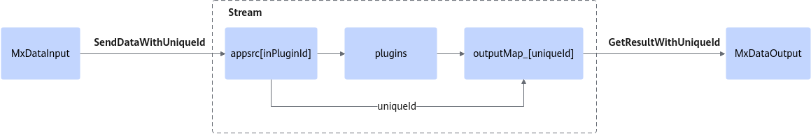
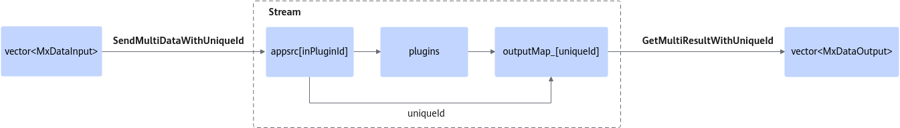
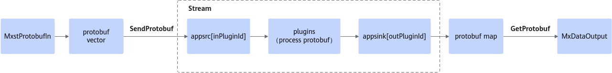

# Application Development

## Development Using APIs (C++)

### Development Process

**Process overview**

**Figure 1**  API development process


**Key steps**

1. Use Vision SDK APIs to develop the application. You must initialize the application before you perform any subsequent operations.
2. Process media data or run model inference.
    - Media data processing includes image encoding and decoding, cropping, resizing, padding, and color space conversion.
    - Model inference supports applications such as object recognition and image classification. The process is as follows:
        1. Before model inference, prepare an appropriate OM model or MindIR model. You can also convert other pretrained models to an OM model by using model conversion.
        2. Load the prepared model into the system from a file or from memory.
        3. Optional: Before model inference, process the input media data, such as decoding images, performing cropping, resizing, and padding.
        4. Run the model to implement image classification, object recognition, and other functions.
        5. Optional: Postprocess the model inference output. Process the inference result according to actual user requirements, for example, organize it into a readable final result. Model postprocessing supports the following three methods:
            - Recommended: Choose a model postprocessing method yourself.
            - Call Vision SDK APIs.
            - Perform secondary development based on an existing model.

3. Call the `MxDeInit()` API to deinitialize the system. After the overall application process ends, you must also deinitialize the system. Otherwise, subsequent system resource initialization may fail, which can cause service exceptions.

### Initialization and Deinitialization

**Function overview**

- For Vision SDK application initialization, call the global initialization function [MxInit()](../zh/api/cpp/initialization_and_deinitialization.md#mxinit) before you call any related APIs. This function allocates device resources and log resources.
- If your application involves operator APIs, you can use [MxInitFromConfig()](../zh/api/cpp/initialization_and_deinitialization.md#mxinitfromconfig) for global initialization. This function loads device and log resources from the operator configuration file and preloads the related operators at the same time, which improves API execution efficiency.
- If you need to configure global variables, such as adjusting the VPC channel resource pool size, call [MxInit(const AppGlobalCfg &globalCfg)](../zh/api/cpp/initialization_and_deinitialization.md#mxinit) and pass in configuration parameters.

**After all Vision SDK APIs finish running**, call `MxDeInit()` to deinitialize the global resources that were initialized.

For details about the APIs, see [API Reference (C++)](../zh/api/cpp/README.md).

**Example code**

The following examples show the initialization methods. They are for reference only and cannot be copied and compiled directly.

- Global initialization. This loads device resources and log resources.

    ```cpp
    APP_ERROR ret = MxInit();
    {
    // You can call Vision SDK APIs after global initialization
    ...
    // After all Vision SDK APIs finish running, call deinitialization to release global resources
    }
    ret = MxDeInit();
    ```

- Global initialization with operator preloading. This loads device resources and log resources while preloading the related operators.

    ```cpp
    // Configure the operator preload file based on user requirements
    std::string ConfigPath = "op.json";
    // Pass the file path to the API for global initialization
    APP_ERROR ret = MxInitFromConfig(ConfigPath);
    {
    // You can call Vision SDK APIs after global initialization
    ...
    // After all Vision SDK APIs finish running, call deinitialization to release global resources
    }
    ret = MxDeInit();
    ```

- Global initialization. This loads global variables.

    ```cpp
    AppGlobalCfg globalCfg;

    APP_ERROR ret = MxInit(globalCfg);
    {
    // You can call Vision SDK APIs after global initialization
    ...
    // After all Vision SDK APIs finish running, call deinitialization to release global resources
    }
    ret = MxDeInit();
    ```

### Custom Memory Resource Pool Management

**Function overview**

Vision SDK supports user-managed memory resources on both the DVPP side and the device side. Before you call APIs that involve memory resources, you can register custom memory allocation and release functions through the hook APIs. After registration, you can allocate and release resources from your custom memory pool through the custom APIs. This function is supported only on Atlas inference series products.

The registration functions must be used in pairs. If you register only one of the allocation or release functions, Vision SDK uses the default behavior and allocates or releases memory directly.

For details about the related APIs, see [Custom Memory Resource Pool Management](../zh/api/cpp/customized_memory_resource_pool_management.md#自定义内存资源池管理).

**Example code**

The following examples show how to register functions on the DVPP and device sides. They are for reference only and cannot be copied and compiled directly.

DVPP

```cpp
APP_ERROR userCustomizedDVPPMallocFunc(unsigned int deviceID, void** buffer, unsigned long long size) {
     LogInfo << "user customized DVPP Malloc func called" ;
     // Add the user-defined DVPP resource allocation function here
     return APP_ERR_OK;
}

APP_ERROR userCustomizedDVPPFreeFunc(void* buffer) {
     LogInfo << "user customized DVPP Free func called" ;
     // Add the user-defined DVPP resource release function here
     return APP_ERR_OK;
 }
int main(){
     MxBase::MxInit();
    {
     APP_ERROR ret = MxBase::DVPPMallocFuncHookReg(userCustomizedDVPPMallocFunc);
     if (ret != APP_ERR_OK) {
         std::cout << "registerTest failed, dvpp malloc registered failed" << std::endl;
     } else {
         std::cout << "registerTest success, dvpp malloc registered success" << std::endl;
     }

     ret = MxBase::DVPPFreeFuncHookReg(userCustomizedDVPPFreeFunc);
     if (ret != APP_ERR_OK) {
         std::cout << "registerTest failed, dvpp free registered failed" << std::endl;
     } else {
         std::cout << "registerTest success, dvpp free registered success" << std::endl;
     }
     }
     MxBase::MxDeInit();
 }
```

Device

```cpp
APP_ERROR userCustomizedDeviceMallocFunc(void** buffer, unsigned int size, MxBase::MxMemMallocPolicy policy) {
     LogInfo << "user customized Device Malloc func called" ;
     // User-defined Device Malloc function
     return APP_ERR_OK;
}

APP_ERROR userCustomizedDeviceFreeFunc(void* buffer) {
     LogInfo << "user customized Device Free func called" ;
     // User-defined device free function
     return APP_ERR_OK;
 }
int main() {
     MxBase::MxInit();
     {
     APP_ERROR ret = MxBase::DeviceMallocFuncHookReg(userCustomizedDeviceMallocFunc);
     if (ret != APP_ERR_OK) {
         std::cout << "registerTest failed, device malloc registered failed" << std::endl;
     } else {
         std::cout << "registerTest success, device malloc registered success" << std::endl;
     }

     ret = MxBase::DeviceFreeFuncHookReg(userCustomizedDeviceFreeFunc);
     if (ret != APP_ERR_OK) {
         std::cout << "registerTest failed, device free registered failed" << std::endl;
     } else {
         std::cout << "registerTest success, device free registered success" << std::endl;
     }
     }
     MxBase::MxDeInit();
}
```

### Asynchronous Calls

**Function overview**

Vision SDK uses synchronous execution by default. Some APIs support asynchronous execution by creating an `AscendStream`. For details about which APIs support asynchronous execution, see [API Reference (C++)](../zh/api/cpp/README.md).

For details about the related APIs, see [Asynchronous Calls](../zh/api/cpp/asynchronous_invocation.md#异步调用).

**API call process**

- Users create the required stream instance by using the custom `AscendStream` class and pass it to an asynchronous API. After the API receives the stream and starts running on it, a call to `Synchronize()` on the same stream blocks the application or thread until all tasks in the stream complete.
- Multiple streams can run asynchronously. APIs in the same stream run sequentially. If you use multiple streams or if the result of an asynchronous operation must be passed to an API that does not support asynchronous execution, call `Synchronize()` at an appropriate point to ensure that the result has returned correctly for later use.
- When you perform media data processing through asynchronous calls, you must call `Synchronize()` so that the asynchronous task completes before you release the channel. Otherwise, the resource pool may be exhausted.

**Figure 1**  Stream asynchronous mode API call process, using Resize as an example


Vision SDK provides the `AscendStream` class for stream management. The key steps are as follows:

1. Call `MxInit()` for global initialization.
2. Initialize the stream.

    The `deviceId` passed to the constructor specifies the device on which the stream is created. Supported `deviceId` values vary by user environment.

3. Create the stream.

    Stream creation is bound to stream initialization. Before you use a stream, call the `CreateAscendStream()` member function.

4. Call an asynchronous API.
    - For APIs that support asynchronous execution, pass in the specified stream. APIs in the same stream run sequentially.
    - APIs assigned to different streams run in parallel.

5. Synchronize the stream.

    If you need to ensure that the asynchronous result has completed before it is used as the input to the next API, call the `Synchronize()` member function to synchronize the stream explicitly.

6. Destroy the stream.

    When the service process ends or the stream is no longer needed, call the `DestroyAscendStream()` member function to destroy the stream. Otherwise, the stream resources may be exhausted.

7. Call `MxDeInit()` to deinitialize the initialized global resources.

**Example code**

This example uses asynchronous image resizing and asynchronous yoloV3 model inference to show the key steps. It is for reference only and cannot be copied and compiled directly.

```cpp
// Initialize
MxInit();
{
        // Create a stream for the target deviceId
        AscendStream stream(deviceId);
        stream.CreateAscendStream();
        // Create an image processor instance
        ImageProcessor imageProcessor(deviceId);
        // Decoded Image instance
        Image decodedImage;
        // Decode based on the image path
        APP_ERROR ret = imageProcessor.Decode(imagePath, decodedImage);
        // Resized Image instance
        Image resizedImage;
        // Call the resizing API asynchronously
        ret = imageProcessor.Resize(decodedImage, Size(416, 416), resizedImage, Interpolation::HUAWEI_HIGH_ORDER_FILTER, stream);
        // Call synchronize to ensure that resizing has completed before later APIs run
        stream.Synchronize();
        // Convert the Image class to the Tensor class
        Tensor tensorImg = resizedImage.ConvertToTensor();
        // yoloV3 model inference
        string yoloPath = "./model/yolov3_tf_bs1_fp16.om";
        Model yoloV3(yoloPath, deviceId);
        // Build inference inputs and outputs (single batch)
        vector<Tensor> yoloV3Inputs = {tensorImg};
        vector<Tensor> yoloV3Outputs = {};
        // Start asynchronous inference
        ret = yoloV3.Infer(yoloV3Inputs, yoloV3Outputs, stream);
        // Call synchronize to ensure that resizing has completed before later APIs run
        // Users can also run other asynchronous APIs serially on this stream before synchronization
        stream.Synchronize();
        // Call DestroyAscendStream to destroy the stream
        stream.DestroyAscendStream();
}
// Deinitialize
MxDeInit();
```

### Media Data Processing

#### Video Encoding

**Function overview**

You can implement video encoding by constructing a `VideoEncoder` instance. For configuration items, constraints, and supported capabilities, see the data structure description in [VideoEncodeConfig](../zh/api/cpp/data_structures_and_enumeration_types.md#videoencodeconfig).

Video encoding supports a custom output data format. You can pass the encoding configuration through a custom callback function, which makes the encoded data easier to use. For details, see [VideoEncodeCallBack](../zh/api/cpp/data_structures_and_enumeration_types.md#videodecodecallback).

For details about the video encoding APIs, see [VideoEncoder](../zh/api/cpp/media_data_processing.md#videoencoder).

**API call process**

First, define the required output data combination based on your requirements. Then define a callback function according to the combination and pass it into the encoding configuration. After that, instantiate `VideoEncoder` and call its `Encode` member function to complete encoding and obtain the data.

The video encoding API call process is as follows:

**Figure 1**  Video encoding API call process


Vision SDK provides the `VideoEncoder` class for video encoding. The key steps are as follows:

1. Call `MxInit()` for global initialization.
2. Define the output data combination.
    - Output data includes the `Image` data obtained after encoding the video frame, the current frame `frameId`, and the channel `channelId`.
    - Choose which of these data you need.

3. Define the output callback function.
    - Define the callback according to the data you want to obtain, and assemble the custom data inside the function.
    - The callback input parameters are fixed in the form of `VideoEncodeCallBack`. You can choose what to output inside the function.
    - Do not implement overly complex logic in the callback. You are advised to use custom `userData` to receive the video encoding callback result. Otherwise, the callback thread may block, which slows down video encoding.

4. Build the video encoding configuration.

    For configuration items and their constraints and support details, see the `VideoEncodeConfig` data structure description.

5. Instantiate the video encoding class.

    Pass the configured `VideoEncodeConfig` to the constructor to instantiate the video encoder.

6. Call `MxDeInit()` to deinitialize the initialized global resources.

**Example code**

The following example code shows the key steps. It is for reference only and cannot be copied and compiled directly.

```cpp
// Initialize
MxBase::MxInit();
{
    // Define the encoded data to receive
    struct FrameImage {
        Image image;                 // Video frame object
        uint32_t frameId = 0;        // Video frame index
        uint32_t channelId = 0;      // Video processing channel resource index
    };

    // Define the callback that receives encoded data into a custom structure
    APP_ERROR CallBackVenc(std::shared_ptr<uint8_t>& outDataPtr, uint32_t& outDataSize, uint32_t& channelId,
                           uint32_t& frameId, void* userData)
    {
        Image image(outDataPtr, outDataSize, -1, Size(1920, 1080));
        FrameImage* encodedVec = static_cast<FrameImage*>(userData);
        FrameImage frameImage;
        encodedVec.image = image;
        encodedVec.channelId = channelId;
        encodedVec.frameId = frameId;
        return APP_ERR_OK;
    }
    // Build encoding configuration
    MxBase::VideoEncodeConfig vEncodeConfig;
    VideoEncodeCallBack cPtr2 = CallBackVenc;
    vEncodeConfig.callbackFunc = cPtr2;
    vEncodeConfig.width = 1920;  // Input width
    vEncodeConfig.height = 1080;  // Input height
    vEncodeConfig.keyFrameInterval = 1;  // I-frame interval
    vEncodeConfig.srcRate = 30;  // Input stream frame rate
    vEncodeConfig.maxBitRate = 30000;  // Output bit rate
    vEncodeConfig.ipProp = 70;  // Output bit rate
    vEncodeConfig.displayRate = 40;  // [1, 120] Playback frame rate of the output video
    vEncodeConfig.rcMode = 0;  // cbr 0 or 1, vbr 2, avbr 3, qvbr 4, cvbr 5. Specifies the bit rate control mode.
    vEncodeConfig.sceneMode = 0;  // 0 for scenes where the camera is still or moves continuously periodically, supports h.264/h.265. 1 for moving scenes at high bit rate, supports h.265.
    vEncodeConfig.shortTermStatsTime = 40; // Short-term bit rate statistics time, in seconds. Range: [1, 120]. Effective when rcMode=5.
    vEncodeConfig.longTermStatsTime = 240;  // Long-term bit rate statistics time, in minutes by default. Range: [1, 1440]. Effective when rcMode=5.
    vEncodeConfig.longTermMaxBitRate = 200;  // Encoder long-term maximum output bit rate, in kbps. Range: [2, max_bit_rate]. Effective when rcMode=5.
    vEncodeConfig.longTermMinBitRate = 1;  // Encoder long-term minimum output bit rate, in kbps. Range: [0, long_term_max_bit_rate]. Effective when rcMode=5.
    vEncodeConfig.statsTime = 1;  // [1, 60] Bit rate statistics time, in seconds. The default value is 1.
    vEncodeConfig.thresholdI = {0, 0, 0, 0, 3, 3, 5, 5, 8, 8, 8, 15, 15, 20, 25, 25}; // Length 16, [0, 255]
    vEncodeConfig.thresholdP = {0, 0, 0, 0, 3, 3, 5, 5, 8, 8, 8, 15, 15, 20, 25, 25}; // Length 16, [0, 255]
    vEncodeConfig.thresholdB = {0, 0, 0, 0, 3, 3, 5, 5, 8, 8, 8, 15, 15, 20, 25, 25}; // Length 16, [0, 255]
    vEncodeConfig.direction = 8; // [0, 16]. Used to control the increase or decrease direction when texture-based macroblock-level bit rate control is used.
    vEncodeConfig.rowQpDelta = 1; // [0, 10]. The row-level bit rate control adjustment range. The larger the value, the larger the QP adjustment range and the smoother the bit rate.
    vEncodeConfig.firstFrameStartQp = 32;  // Set the initial Qp value of the first frame
    // Instantiate the encoder
    MxBase::VideoEncoder videoEncoder(vEncodeConfig, deviceId);
    // Run the encoding operation
    FrameImage encodedFrame;

    for (size_t i = 0; i < inputFrameList.size(); i++) {
        ret = videoEncoder.Encode(image, frameId, &encodedFrame);
    }
}
// Deinitialize
MxBase::MxDeInit();
```

#### Video Decoding

**Function overview**

You can implement video decoding by constructing a `VideoDecoder` instance. For configuration items and their constraints and support details, see [VideoDecodeConfig](../zh/api/cpp/data_structures_and_enumeration_types.md#videodecodeconfig).

Video decoding supports a custom output data format. You can pass the decoding configuration through a custom callback function, which makes the decoded data easier to use. For details, see [VideoDecodeCallBack](../zh/api/cpp/data_structures_and_enumeration_types.md#videodecodecallback).

For details about the video decoding APIs, see [VideoDecoder](../zh/api/cpp/media_data_processing.md#videodecoder).

**API call process**

First, define the required output data combination based on your requirements. Then define a callback function according to the combination and pass it into the decoding configuration. After that, instantiate `VideoDecoder` and call its `Decode` member function to complete decoding and obtain the data.

The video decoding API call process is as follows:

**Figure 1**  Video decoding API call process


Vision SDK provides the `VideoDecoder` class for video decoding. The key steps are as follows:

1. Call `MxInit()` for global initialization.
2. Define the output data combination.
    - Output data includes the `Image` data obtained after video frame decoding, the current frame `frameId`, and the channel `channelId`.
    - Choose which of these data you need.

3. Define the output callback function.
    - Define the callback according to the data you want to obtain, and assemble the custom data inside the function.
    - The callback input parameters are fixed in the form of `VideoDecodeCallBack`. You can choose what to output inside the function.
    - Do not implement overly complex logic in the callback. You are advised to only obtain decoded data in the custom callback.

4. Build the video decoding configuration.

    For configuration items and their constraints and support details, see the `VideoDecodeConfig` data structure description.

5. Instantiate the video decoding class.

    Pass the configured `VideoDecodeConfig` to the constructor to instantiate the video decoder.

6. Call the decoding API.
    - When a decoder instance calls `Decode` for the first time, it determines whether the current scenario uses preallocation.
    - In a preallocation scenario, you need to call `Decode` later to preallocate output memory, otherwise the call may fail.

7. Call `MxDeInit()` to deinitialize the initialized global resources.

**Example code**

The following example code shows the key steps. It is for reference only and cannot be copied and compiled directly.

```cpp
// Initialize
MxBase::MxInit();
{
    // Define the decoded data to receive
    struct FrameImage {
        Image image;                 // Video frame object
        uint32_t frameId = 0;        // Video frame index
        uint32_t channelId = 0;      // Video processing channel resource index
    };

    // Define the callback that receives decoded data into a custom structure
    APP_ERROR CallBackVdec(Image& decodedImage, uint32_t channelId, uint32_t frameId, void* userData)
    {
      FrameImage* decodedVec = static_cast<FrameImage*>(userData);
      decodedVec->image = decodedImage;
      decodedVec->channelId = channelId;
      decodedVec->frameId = frameId;
    }
    // Build decoding configuration
    MxBase::VideoDecodeConfig config;
    VideoDecodeCallBack cPtr = CallBackVdec;
    config.width = 1920;
    config.height = 1080;
    config.callbackFunc = cPtr;
    config.skipInterval = 0;
    config.inputVideoFormat = StreamFormat::H264_MAIN_LEVEL;
    config.outputImageFormat = ImageFormat::YUV_SP_420;
    // Instantiate the decoder
    MxBase::VideoDecoder videoDecoder(config, deviceId, channelId);
    // Run the decoding operation
    ret = videoDecoder.Decode(dataPtr, dataSize, frameId, &decodedFrame);
}
// Deinitialize
MxBase::MxDeInit();
```

#### Image Processing Through APIs (Image)

##### Image Decoding<a id="ZH-CN_TOPIC_0000001622471345"></a>

**Function overview**

Decode input image data and convert a local image or image data to the `Image` class for later preprocessing and inference. Currently, JPEG and PNG are supported.

For details about the API, see [Decode](../zh/api/cpp/media_data_processing.md#decode).

**API call process**

Prepare the local image file to decode or the image data to decode, initialize the `ImageProcessor` class, construct the output `Image` object, and then call `ImageProcessor::Decode` to obtain the decoded result.

The image decoding process is as follows:

**Figure 1**  Image decoding API call process


The key steps are as follows:

1. Call `MxInit()` for global initialization.
2. Initialize `ImageProcessor`.

    Construct the `ImageProcessor` object. After construction, you can call `InitJpegDecodeChannel()` to initialize the channel. If you do not call this API, `ImageProcessor` automatically initializes the channel before decoding.

3. Construct the output `Image` object.

    Use the `Image()` constructor to hold the image object that will receive the decoded output.

4. Prepare the data.

    Choose to load the image from a file or from memory based on service requirements.

5. Call `Decode()` to decode the image.

    Call the corresponding `Decode` API based on the input data type.

6. Call `MxDeInit()` to deinitialize the initialized global resources.

**Example code**

The following example code shows the key steps. It is for reference only and cannot be copied and compiled directly.

```cpp
// Initialize
MxInit();
{
    // Construct the image processing class
    ImageProcessor imageProcessor(deviceId);
    // Optional: initialize the decode channel
    imageProcessor.InitJpegDecodeChannel();
    // Image decoding
    // Decoded Image object
    Image decodedImage;
    // Decode based on the image path
    std::string imagePath = "image_path";
    APP_ERROR ret = imageProcessor.Decode(imagePath, decodedImage, ImageFormat::YUV_SP_420);
    if (ret != APP_ERR_OK) {
        std::cout << "Decode failed." << std::endl;
    }
}
// Deinitialize
MxDeInit();
```

##### Image Encoding

**Function overview**

Encode the `Image` object output by the API into JPG image memory or save it to the specified image path.

For details about the API, see [Encode](../zh/api/cpp/media_data_processing.md#encode).

**API call process**

Prepare the `Image` object to encode in advance. You can obtain it from image decoding or from image processing APIs such as cropping, resizing, and padding. The output can be written to a local image or to memory.

The image encoding process is as follows:

**Figure 1**  Image encoding API call process


The key steps are as follows:

1. Call `MxInit()` for global initialization.
2. Initialize `ImageProcessor`.

    Construct the `ImageProcessor` object. After construction, you can call `InitJpegEncodeChannel()` to initialize the channel. If you do not call this API, `ImageProcessor` automatically initializes the channel before encoding.

3. Decode the input image by using the image decoding API.

    Decode the image based on service requirements to generate an encodable `Image` object. You can then process the image through the image processing APIs to generate the final `Image` object to encode.

4. Call `Encode()` to encode the input image.

    Output the image data according to actual service requirements and choose to write it to a file or to memory.

5. Call `MxDeInit()` to deinitialize the initialized global resources.

**Example code**

The following example code shows the key steps. It is for reference only and cannot be copied and compiled directly.

```cpp
// Initialize
MxInit();
{
    // Construct the image processing class
    ImageProcessor imageProcessor(deviceId);

    // Generate Image through image decoding or image processing
    // Decoded Image object
    Image decodedImage;
    // Decode based on the image path
    APP_ERROR ret = imageProcessor.Decode(imagePath, decodedImage);
    if (ret != APP_ERR_OK) {
        std::cout << "Decode failed." << std::endl;
    }
    // Image after processing
    Image resizedImage;
    // Image processing operation: resizing
    ret = imageProcessor.Resize(decodedImage, Size(416, 416), resizedImage, Interpolation::HUAWEI_HIGH_ORDER_FILTER);
    if (ret != APP_ERR_OK) {
        std::cout << "Resize failed." << std::endl;
    }

    // Optional: initialize the encode channel
    JpegEncodeChnConfig jpegEncodeChnConfig;
    JpegEncodeChnConfig.maxPicWidth = 4096;
    JpegEncodeChnConfig.maxPicHeight = 4096;
    imageProcessor.InitJpegEncodeChannel(jpegEncodeChnConfig);

    // Image encoding
    ret = imageProcessor.Encode(resizedImage,"encode.jpg");
    if (ret != APP_ERR_OK) {
        std::cout << "Encode failed." << std::endl;
    }
}
// Deinitialize
MxDeInit();
```

##### Cropping

**Function overview**

Perform cropping on the input image and output the result to an `Image` object.

For details about the API, see [Crop](../zh/api/cpp/media_data_processing.md#crop).

**API call process**

Before you use the cropping API, prepare the image object that needs to be cropped.

**Figure 1**  Image processing (cropping) API call process
 API call process")

The key steps are as follows:

1. Call `MxInit()` for global initialization.
2. Initialize `ImageProcessor`.

    Construct the `ImageProcessor` object. After construction, you can call `InitVpcChannel()` to initialize the channel. If you do not call this API, `ImageProcessor` automatically initializes the channel before cropping.

3. Decode the input image by using the image decoding API.

    Decode the image based on service requirements to generate an `Image` object that supports cropping. You can then process the image through the image processing APIs to generate the final `Image` object to crop.

4. Construct the cropping `Rect` and the output `Image`.

    According to service requirements, choose one-to-many, one-to-one, or many-to-many cropping, and construct the corresponding input `Rect` and output `Image`.

5. Choose an execution mode and perform cropping. Select synchronous or asynchronous cropping based on actual service requirements.
    - Synchronous execution.

        Do not create a stream. Pass the input image and other parameters to `Crop()` to obtain the cropping result.

    - Asynchronous execution.
        1. Create a stream. For details, see [Asynchronous Calls](#asynchronous-calls).
        2. Pass the input image, the created stream, and other parameters to `Crop()` to obtain the cropping result.

6. Call `MxDeInit()` to deinitialize the initialized global resources.

**Example code**

The following example code shows the key steps. It is for reference only and cannot be copied and compiled directly.

```cpp
// Initialize
MxInit();
{
    // Construct the image processing class
    ImageProcessor imageProcessor(deviceId);

    // Optional: initialize the image processing channel
    imageProcessor.InitVpcChannel();

    // Generate Image through image decoding
    // Decoded Image object
    Image decodedImage;
    // Decode based on the image path
    APP_ERROR ret = imageProcessor.Decode(imagePath, decodedImage);
    if (ret != APP_ERR_OK) {
        std::cout << "Decode failed." << std::endl;
    }

    // Run cropping
    // Cropped Image object
    Image cropImage;
    // Cropping coordinate information
    Rect cropRect {0, 0, 640, 512};
    // Cropping operation
    ret = imageProcessor.Crop(decodedImage, cropRect, cropImage);
    if (ret != APP_ERR_OK) {
        std::cout << "Crop failed." << std::endl;
    }
}
// Deinitialize
MxDeInit();
```

##### Resizing

**Function overview**

Resize the input image and output the result to an `Image` object.

For details about the API, see [Resize](../zh/api/cpp/media_data_processing.md#resize).

**API call process**

Before you use the resizing API, prepare the image object that needs to be resized.

**Figure 1**  Image processing (resizing) API call process
 API call process")

The key steps are as follows:

1. Call `MxInit()` for global initialization.
2. Initialize `ImageProcessor`.

    Construct the `ImageProcessor` object. After construction, you can call `InitVpcChannel()` to initialize the channel. If you do not call this API, `ImageProcessor` automatically initializes the channel before resizing.

3. Decode the input image by using the image decoding API.

    Decode the image based on service requirements to generate an `Image` object that supports resizing. You can then process the image through the image processing APIs to generate the final `Image` object to resize.

4. Construct the resizing parameters and output `Image`.

    According to service requirements, construct the input `Size` and output `Image`.

5. Choose an execution mode and perform resizing. Select synchronous or asynchronous resizing based on actual service requirements.
    - Synchronous execution.

        Do not create a stream. Pass the input image and other parameters to `Resize()` to obtain the resizing result.

    - Asynchronous execution.
        1. Create a stream. For details, see [Asynchronous Calls](#asynchronous-calls).
        2. Pass the input image, the created stream, and other parameters to `Resize()` to obtain the resizing result.

6. Call `MxDeInit()` to deinitialize the initialized global resources.

**Example code**

The following example code shows the key steps. It is for reference only and cannot be copied and compiled directly.

```cpp
// Initialize
MxInit();
{
    // Construct the image processing class
    ImageProcessor imageProcessor(deviceId);

    // Generate Image through image decoding
    // Decoded Image object
    Image decodedImage;

    // Decode based on the image path
    APP_ERROR ret = imageProcessor.Decode(imagePath, decodedImage);
    if (ret != APP_ERR_OK) {
        std::cout << "Decode failed." << std::endl;
    }

    // Optional: initialize the image processing channel
    imageProcessor.InitVpcChannel();

    // Run resizing
    // Image object after resizing
    Image resizedImage;

    // Resize size
    Size size(416, 416);

    // Resize operation
    ret = imageProcessor.Resize(decodedImage, size, resizedImage, Interpolation::HUAWEI_HIGH_ORDER_FILTER);
    if (ret != APP_ERR_OK) {
        std::cout << "Resize failed." << std::endl;
    }
}
// Deinitialize
MxDeInit();
```

##### Padding

**Function overview**

Pad the input image and output the result to an `Image` object.

For details about the API, see [Padding](../zh/api/cpp/media_data_processing.md#padding).

**API call process**

Before you use the padding API, prepare the image object that needs padding.

**Figure 1**  Image processing (padding) API call process
 API call process")

The key steps are as follows:

1. Call `MxInit()` for global initialization.
2. Initialize `ImageProcessor`.

    Construct the `ImageProcessor` object. After construction, you can call `InitVpcChannel()` to initialize the channel. If you do not call this API, `ImageProcessor` automatically initializes the channel before padding.

3. Decode the input image by using the image decoding API.

    Decode the image based on service requirements to generate an `Image` object that supports padding. You can then process the image through the image processing APIs to generate the final `Image` object to pad.

4. Construct the padding parameters.

    According to service requirements, construct the input `padDim` values, which represent the number of pixels to pad on the top, bottom, left, and right, the `Color` value for the padding color, and the output `Image`.

5. Call `Padding()` to pad the input image.
6. Call `MxDeInit()` to deinitialize the initialized global resources.

**Example code**

The following example code shows the key steps. It is for reference only and cannot be copied and compiled directly.

```cpp
// Initialize
MxInit();
{
    // Construct the image processing class
    ImageProcessor imageProcessor(deviceId);

    // Generate Image through image decoding
    // Decoded Image object
    Image decodedImage;

    // Decode based on the image path
    APP_ERROR ret = imageProcessor.Decode(imagePath, decodedImage);
    if (ret != APP_ERR_OK) {
        std::cout << "Decode failed." << std::endl;
    }

    // Optional: initialize the image processing channel
    imageProcessor.InitVpcChannel();

    // Run padding
    // Image object after padding
    Image paddingImage;

    // Construct padding parameters
    Dim padDim(0, 0, 240, 240);
    Color color(0, 0, 0);

    // Padding operation
    ret = imageProcessor.Padding(decodedImage, padDim, color, BorderType::BORDER_CONSTANT, paddingImage);
    if (ret != APP_ERR_OK) {
        std::cout << "Padding failed." << std::endl;
    }
}
// Deinitialize
MxDeInit();
```

##### Cropping and Resizing

**Function overview**

Perform cropping and resizing on the input image and output the result to an `Image` object.

For details about the API, see [CropResize](../zh/api/cpp/media_data_processing.md#cropresize).

**API call process**

Before you use the cropping and resizing API, prepare the image object that needs cropping and resizing.

**Figure 1**  Image processing (cropping and resizing) API call process
 API call process")

The key steps are as follows:

1. Call `MxInit()` for global initialization.
2. Initialize `ImageProcessor`.

    Construct the `ImageProcessor` object. After construction, you can call `InitVpcChannel()` to initialize the channel. If you do not call this API, `ImageProcessor` automatically initializes the channel before cropping and resizing.

3. Decode the input image by using the image decoding API.

    Decode the image based on service requirements to generate an `Image` object that supports cropping and resizing. You can then process the image through the image processing APIs to generate the final `Image` object to crop and resize.

4. Construct the cropping and resizing parameters and output `Image`.

    According to service requirements, choose one-to-many cropping with one resizing, one-to-many cropping with multiple resizings, or many-to-many cropping with multiple resizings. Then construct the corresponding input `Rect`, `Size`, and output `Image`.

5. Call `CropResize()` to crop and resize the input image.
    - Synchronous execution.

        Do not create a stream. Pass the input image and other parameters to the API to obtain the cropping and resizing result.

    - Asynchronous execution.
        1. Create a stream. For details, see [Asynchronous Calls](#asynchronous-calls).
        2. Pass the input image, the created stream, and other parameters to the API to obtain the cropping and resizing result.

6. Call `MxDeInit()` to deinitialize the initialized global resources.

**Example code**

The following example code shows the key steps. It is for reference only and cannot be copied and compiled directly.

```cpp
// Initialize
MxInit();
{
    // Construct the image processing class
    ImageProcessor imageProcessor(deviceId);

    // Generate Image through image decoding
    // Decoded Image object
    Image decodedImage;

    // Decode based on the image path
    APP_ERROR ret = imageProcessor.Decode(imagePath, decodedImage);
    if (ret != APP_ERR_OK) {
        std::cout << "Decode failed." << std::endl;
    }

    // Optional: initialize the image processing channel
    imageProcessor.InitVpcChannel();

    // Run cropping and resizing
    // Image object after cropping and resizing
    std::vector<Image> cropResizedImageVec(1);

    // Cropping size
    Rect rect(0, 0, 240, 240);
    std::vector<Rect> cropConfigVec = {rect};

    // Resize size
    Size size(416, 416);

    // Cropping and resizing operation
    ret = imageProcessor.CropResize(decodedImage, cropConfigVec, size, cropResizedImageVec);
    if (ret != APP_ERR_OK) {
        std::cout << "CropResize failed." << std::endl;
    }
}
// Deinitialize
MxDeInit();
```

##### Cropping and Pasting

**Function overview**

Crop the input image and paste it onto a background image. The result is output to an `Image` object.

For details about the API, see [CropAndPaste](../zh/api/cpp/media_data_processing.md#cropandpaste).

**API call process**

Before you use the cropping and pasting API, prepare both the image object to be cropped and the image object to paste onto.

**Figure 1**  Image processing (cropping and pasting) API call process
 API call process")

The key steps are as follows:

1. Call `MxInit()` for global initialization.
2. Initialize `ImageProcessor`.

    Construct the `ImageProcessor` object. After construction, you can call `InitVpcChannel()` to initialize the channel. If you do not call this API, `ImageProcessor` automatically initializes the channel before cropping and pasting.

3. Decode the input image by using the image decoding API.

    Decode the image based on service requirements to generate an `Image` object that supports cropping and pasting. You can then process the image through the image processing APIs to generate the final `Image` object to crop and paste.

4. Construct the cropping and pasting parameters and the output `Image`.
    1. According to service requirements, set the rectangle for the cropping image and the rectangle for the paste position. If the two rectangles are different in size, Vision SDK scales them automatically.
    2. Construct the background image for the output image. Use the `Image()` constructor with preallocated memory to construct the pasted image or another non-empty image as the output.

5. Call `CropAndPaste()` to crop the input image and paste it at the specified position.
    - Synchronous execution.

        Do not create a stream. Pass the input image and other parameters to the API to obtain the cropping and pasting result.

    - Asynchronous execution.
        1. Create a stream. For details, see [Asynchronous Calls](#asynchronous-calls).
        2. Pass the input image, the created stream, and other parameters to the API to obtain the cropping and pasting result.

6. Call `MxDeInit()` to deinitialize the initialized global resources.

**Example code**

The following example code shows the key steps. It is for reference only and cannot be copied and compiled directly.

```cpp
// Initialize
MxInit();
{
    // Construct the image processing class
    ImageProcessor imageProcessor(deviceId);

    // Generate Image through image decoding
    // Decoded Image object
    Image decodedImage;

    // Decode based on the image path
    APP_ERROR ret = imageProcessor.Decode(imagePath, decodedImage);
    if (ret != APP_ERR_OK) {
        std::cout << "Decode failed." << std::endl;
    }

    // Optional: initialize the image processing channel
    imageProcessor.InitVpcChannel();

    // Construct the background Image. You can also choose another Image object that already contains data
    Size imageSize(640, 640);
    size_t dataSize = 640 * 640 * 3 / 2;
    MemoryData imgData(dataSize, MemoryData::MemoryType::MEMORY_DVPP, deviceId);
    if (MemoryHelper::MxbsMalloc(imgData) != APP_ERR_OK) {
        std::cout << "Malloc failed." << std::endl;
    }
    std::shared_ptr<uint8_t> pastedData((uint8_t*)imgData.ptrData, imgData.free);

    // Image object after cropping and pasting
    Image pastedImage(pastedData, dataSize, deviceId, imageSize);

    // Run cropping and pasting
    // Cropping and pasting sizes
    Rect rectFrom(0, 0, 240, 240);
    Rect rectTo(0, 0, 480, 480);
    std::pair<Rect, Rect> cropPasteRect = {rectFrom, rectTo};

    // Cropping and pasting operation
    ret = imageProcessor.CropAndPaste(resizeImage, cropPasteRect, pastedImage) ;
    if (ret != APP_ERR_OK) {
        std::cout << "CropAndPaste failed." << std::endl;
    }
}
// Deinitialize
MxDeInit();
```

##### Color Space Conversion

**Function overview**

Perform color space conversion on the input image and output the result to an `Image` object.

For details about the API, see [ConvertFormat](../zh/api/cpp/media_data_processing.md#convertformat).

**API call process**

Before you use the color space conversion API, prepare the image object to convert.

**Figure 1**  Image processing (color space conversion) API call process
 API call process")

The key steps are as follows:

1. Call `MxInit()` for global initialization.
2. Initialize `ImageProcessor`.

    Construct the `ImageProcessor` object. After construction, you can call `InitVpcChannel()` to initialize the channel. If you do not call this API, `ImageProcessor` automatically initializes the channel before color space conversion.

3. Decode the input image by using the image decoding API.

    Decode the image based on service requirements to generate an `Image` object that supports color space conversion. You can then process the image through the image processing APIs to generate the final `Image` object to convert.

4. Construct the output `Image` object.

    Use the `Image` constructor to create the `Image` object that stores the color space conversion result.

5. Call `ConvertFormat()` to convert the input image.
6. Call `MxDeInit()` to deinitialize the initialized global resources.

**Example code**

The following example code shows the key steps. It is for reference only and cannot be copied and compiled directly.

```cpp
// Initialize
MxInit();
{
    // Construct the image processing class
    ImageProcessor imageProcessor(deviceId);

    // Generate Image through image decoding
    // Decoded Image object
    Image decodedImage;

    // Decode based on the image path
    APP_ERROR ret = imageProcessor.Decode(imagePath, decodedImage);
    if (ret != APP_ERR_OK) {
        std::cout << "Decode failed." << std::endl;
    }

    // Optional: initialize the image processing channel
    imageProcessor.InitVpcChannel();

    // Run color space conversion
    // Image object after color space conversion
    Image convertImage;

    // Run the color space conversion operation
    ret = imageProcessor.ConvertFormat(decodedImage, ImageFormat::RGB_888, convertImage);
    if (ret != APP_ERR_OK) {
        std::cout << "ConvertFormat failed." << std::endl;
    }
}
// Deinitialize
MxDeInit();
```

#### Image Processing Through Tensor Methods (Tensor)

##### Cropping

**Function overview**

Perform cropping on the input image and output the result to a `Tensor` object.

For details about the API, see [Crop](../zh/api/cpp/media_data_processing.md#ZH-CN_TOPIC_0000001860120881).

**API call process**

Before you use the cropping API, prepare the image to crop and convert it to a `Tensor` object.

**Figure 1**  Tensor method (cropping) API call process
 API call process")

The key steps are as follows:

1. Call `MxInit()` for global initialization.
2. Construct the cropping `Rect` and the output `Tensor`.

    According to service requirements, choose one-to-one or one-to-many cropping, and construct the corresponding input `Rect` and output `Tensor`.

3. Choose an execution mode and perform cropping. Select synchronous or asynchronous cropping based on actual service requirements.
    - Synchronous execution.

        Do not create a stream. Pass the input image and other parameters to the `Crop` method to obtain the cropping result.

    - Asynchronous execution.
        1. Create a stream. For details, see [Asynchronous Calls](#asynchronous-calls).
        2. Pass the input image, the created stream, and other parameters to the `Crop` method to obtain the cropping result.

4. Call `MxDeInit()` to deinitialize the initialized global resources.

**Example code**

The following example code shows the key steps. It is for reference only and cannot be copied and compiled directly.

```cpp
// Initialize
MxBase::MxInit();
{
    // Read the image
    std::string imgPath = "./test.jpg";
    cv::Mat imgData = cv::imread(imgPath, cv::IMREAD_UNCHANGED);
    std::vector<uint32_t> shape{600, 600, 3};

    // Construct the input tensor
    MxBase::Tensor input(imgData.data, shape, MxBase::TensorDType::UINT8, -1);
    input.ToDvpp(0);

    // Set the cropping region
    MxBase::Rect rect(0, 0, 320, 320);

    // Construct the output tensor
    std::vector<uint32_t> dstShape = {320, 320, 3};
    MxBase::Tensor dst(dstShape, MxBase::TensorDType::UINT8, -1);
    dst.Malloc();
    dst.ToDevice(0);

    // Set whether the output tensor retains invalid margins
    bool keepMargin = true;

    // Run cropping
    APP_ERROR ret = MxBase::Crop(input, rect, dst, keepMargin);
    if (ret != APP_ERR_OK) {
        std::cout << "Crop failed." << std::endl;
    }
}
// Deinitialize
MxBase::MxDeInit();
```

##### Resizing

**Function overview**

Resize the input image and output the result to a `Tensor` object.

For details about the API, see [Resize](../zh/api/cpp/media_data_processing.md#resize).

**API call process**

Before you use the resizing API, prepare the image to resize and convert it to a `Tensor` object.

**Figure 1**  Tensor method (resizing) API call process
 API call process")

The key steps are as follows:

1. Call `MxInit()` for global initialization.
2. Construct the resizing parameters and output `Tensor`.

    According to service requirements, construct the input `Size`, the input `Tensor`, and the output `Tensor`.

3. Choose an execution mode and perform resizing. Select synchronous or asynchronous resizing based on actual service requirements.
    - Synchronous execution.

        Do not create a stream. Pass the input image and other parameters to the `Resize` method to obtain the resizing result.

    - Asynchronous execution.
        1. Create a stream. For details, see [Asynchronous Calls](#asynchronous-calls).
        2. Pass the input image, the created stream, and other parameters to the `Resize` method to obtain the resizing result.

4. Call `MxDeInit()` to deinitialize the initialized global resources.

**Example code**

The following example code shows the key steps. It is for reference only and cannot be copied and compiled directly.

```cpp
// Initialize
MxBase::MxInit();

{
    // Read the image
    std::string imgPath = "./test.jpg";
    cv::Mat imgData = cv::imread(imgPath, cv::IMREAD_UNCHANGED);
    std::vector<uint32_t> shape{600, 600, 3};

    // Construct the input tensor
    MxBase::Tensor input(imgData.data, shape, MxBase::TensorDType::UINT8, -1);
    input.ToDvpp(0);

    // Set the resizing width and height
    MxBase::Size resize(289, 289);

    // Construct the output tensor
    std::vector<uint32_t> dstShape = {289, 304, 3};
    MxBase::Tensor dst(dstShape, MxBase::TensorDType::UINT8, -1);
    dst.Malloc();
    dst.ToDvpp(0);

    // Set whether the output tensor retains invalid margins from the input tensor
    bool keepMargin = true;

    // Run resizing
    APP_ERROR ret = MxBase::Resize(input, dst, resize, MxBase::Interpolation::BILINEAR_SIMILAR_OPENCV, keepMargin);
    if (ret != APP_ERR_OK) {
        std::cout << "Resize failed." << std::endl;
    }
}

// Deinitialize
MxBase::MxDeInit();
```

##### Cropping and Resizing

**Function overview**

Perform cropping and resizing on the input image and output the result to a `Tensor` object.

For details about the API, see [CropResize](../zh/api/cpp/media_data_processing.md#ZH-CN_TOPIC_0000001813361304).

**API call process**

Before you use the cropping and resizing API, prepare the image to crop and resize and convert it to a `Tensor` object.

**Figure 1**  Tensor method (cropping and resizing) API call process
 API call process")

The key steps are as follows:

1. Call `MxInit()` for global initialization.
2. Construct the cropping and resizing parameters and output `Tensor`.

    According to service requirements, construct the input `Rect`, `Size`, and output `Tensor`.

3. Choose an execution mode and perform cropping and resizing. Select synchronous or asynchronous mode based on actual service requirements.
    - Synchronous execution.

        Do not create a stream. Pass the input image and other parameters to the `CropResize` method to obtain the cropping and resizing result.

    - Asynchronous execution.
        1. Create a stream. For details, see [Asynchronous Calls](#asynchronous-calls).
        2. Pass the input image, the created stream, and other parameters to the `CropResize` method to obtain the cropping and resizing result.

4. Call `MxDeInit()` to deinitialize the initialized global resources.

**Example code**

The following example code shows the key steps. It is for reference only and cannot be copied and compiled directly.

```cpp
// Initialize
MxBase::MxInit();

{
    // Read the image
    std::string imgPath = "./test.jpg";
    cv::Mat imgData = cv::imread(imgPath, cv::IMREAD_UNCHANGED);
    std::vector<uint32_t> shape{600, 600, 3};

    // Construct the input tensor
    MxBase::Tensor input(imgData.data, shape, MxBase::TensorDType::UINT8, -1);
    input.ToDvpp(0);

    // Set the cropping region and resizing width and height
    MxBase::Rect rect(0, 0, 320, 320);
    std::vector<MxBase::Rect> cropRectVec = {rect};
    MxBase::Size size(480, 480);
    std::vector<MxBase::Size> sizeVec = {size};

    // Construct the output tensor
    std::vector<uint32_t> dstShape = {480, 480, 3};
    MxBase::Tensor dst(dstShape, MxBase::TensorDType::UINT8, -1);
    dst.Malloc();
    dst.ToDvpp(0);
    std::vector<MxBase::Tensor> outputTensorVec = {dst};

    // Run cropping and resizing
    APP_ERROR ret = MxBase::CropResize(input, cropRectVec, sizeVec, outputTensorVec, MxBase::Interpolation::BILINEAR_SIMILAR_OPENCV, true);
    if (ret != APP_ERR_OK) {
        std::cout << "CropResize failed." << std::endl;
    }
}

// Deinitialize
MxBase::MxDeInit();
```

##### Color Space Conversion<a id="ZH-CN_TOPIC_0000001572112318"></a>

**Function overview**

Perform color space conversion on the input image and output the result to a `Tensor` object.

For details about the API, see [CvtColor](../zh/api/cpp/media_data_processing.md#cvtcolor).

**API call process**

Before you use the color space conversion API, prepare the image object to convert and convert it to a `Tensor` object.

**Figure 1**  Tensor method (color space conversion) API call process
 API call process")

The key steps are as follows:

1. Call `MxInit()` for global initialization.
2. Construct the output `Tensor`.

    According to service requirements, choose the corresponding `CvtColorMode` format and construct the output `Tensor`.

3. Choose an execution mode and perform color space conversion. Select synchronous or asynchronous mode based on actual service requirements.
    - Synchronous execution.

        Do not create a stream. Pass the input image and other parameters to the `CvtColor` method to obtain the color space conversion result.

    - Asynchronous execution.
        1. Create a stream. For details, see [Asynchronous Calls](#asynchronous-calls).
        2. Pass the input image, the created stream, and other parameters to the `CvtColor` method to obtain the color space conversion result.

4. Call `MxDeInit()` to deinitialize the initialized global resources.

**Example code**

```cpp
// Initialize
MxBase::MxInit();
{
    // Read the image
    std::string imgPath = "./test.jpg";
    cv::Mat imgData = cv::imread(imgPath);
    size_t originalWidth = image.cols;
    size_t originalHeight = image.rows;

    // Construct the input Tensor
    const std::vector<uint32_t> shape = {originalHeight, originalWidth, 3};
    MxBase::Tensor inputTensor((void*)imgData.data, shape, TensorDType::UINT8, -1);
    inputTensor.ToDevice(0);

    // Define the conversion mode
    auto mode = MxBase::CvtColorMode::COLOR_BGR2RGB;

    // Define the output Tensor
    MxBase::Tensor outputTensor;

    // Run color space conversion
    APP_ERROR ret = MxBase::CvtColor(inputTensor, outputTensor, mode, true);
    if (ret != APP_ERR_OK) {
        std::cout << "CvtColor failed." << std::endl;
    }
}
// Deinitialize
MxBase::MxDeInit();
```

##### Tensor Operations

**Function overview**

Use Vision SDK tensor operations feature to run the corresponding operation on an initialized input tensor and an output tensor with allocated memory. The API writes the computed result to the output tensor.

For details about the related APIs, see [TensorOperations](../zh/api/cpp/media_data_processing.md#tensoroperations).

**API call process**

Before you call a tensor operation API, create the input and output tensors, allocate memory for them, and assign values to the input tensor.

The input and output data types must be the same.

For arithmetic and bitwise operations, the input and output tensor shapes must match exactly. For transpose, rotation, channel split, channel merge, crop, and expand APIs, the input and output tensor shapes must follow the corresponding calculation rules.

For details about specific APIs, see [TensorOperations](../zh/api/cpp/media_data_processing.md#tensoroperations).

Using `Add` as an example, the tensor operation call process is as follows:

**Figure 1**  Tensor method API call process


The key steps are as follows:

1. Call `MxInit()` for global initialization.
2. Initialize the tensors and allocate memory. You must initialize the input and output tensors and allocate memory for them.
    - For an input tensor, create the tensor data and pass in the tensor shape and type for initialization. You can also specify the device that stores the tensor.
    - For an output tensor, pass in the tensor shape and type for initialization. You can also specify the device that stores the tensor, and call `Tensor.Malloc()` to allocate memory for the tensor.
    - For a tensor whose device was not specified during initialization, call `ToDevice(int DeviceId)` after initialization to place the tensor on the specified device for computation.

3. Choose an execution mode and perform tensor computation. Select synchronous or asynchronous operator invocation based on actual service requirements.
    - Synchronous execution.

        Do not create a stream. Pass the input tensor to `Add()` to obtain the tensor addition result.

    - Asynchronous execution.
        1. Create a stream. For details, see [Asynchronous Calls](#asynchronous-calls).
        2. Pass the input tensor, the created stream, and other parameters to `Add()` to obtain the tensor addition result.

4. Call `MxDeInit()` to deinitialize the initialized global resources.

**Example code**

The following example shows tensor addition. It is for reference only and cannot be copied and compiled directly.

- Synchronous call.

    ```cpp
    // Initialize
    MxBase::MxInit();
    {
        // 1. Initialize the tensor
        // 1.1 Create the input tensor data
        uint8_t input1[1][3][16][16];
        uint8_t input2[1][3][16][16];
        for (int i = 0; i < 1; i++) {
            for (int j = 0; j < 3; j++) {
                for (int k = 0; k < 16; k++) {
                    for (int l = 0; l < 16; l++) {
                        input1[i][j][k][l] = 8;
                        input2[i][j][k][l] = 2;
                    }
                }
            }
        }
        // 1.2 Specify the tensor shape
        std::vector<uint32_t> shape{1, 3, 16, 16};
        // 1.3 Create the input and output tensor objects
        MxBase::Tensor tensor1(&input1[0][0][0][0], shape, MxBase::TensorDType::UINT8);
        MxBase::Tensor tensor2(&input2[0][0][0][0], shape, MxBase::TensorDType::UINT8);
        MxBase::Tensor tensor3(shape, MxBase::TensorDType::UINT8);
        tensor3.Malloc();
        tensor1.ToDevice(device_id);
        tensor2.ToDevice(device_id);
        tensor3.ToDevice(device_id);
        // 2. Call the operator API. tensor3 stores the calculation result.
        APP_ERROR ret = MxBase::Add(tensor1, tensor2, tensor3);
    }
    // Deinitialize
    MxBase::MxDeInit();
    ```

- Asynchronous call.

    ```cpp
    // Initialize
    MxBase::MxInit();
    {
        // 1. Create a stream and register the thread
        // 1.1 Create the stream
        MxBase::AscendStream stream = AscendStream(deviceId);
        // 1.2 Register the stream thread
        stream.CreateAscendStream();
        // 2. Initialize the tensor
        // 2.1 Create the input tensor data
        uint8_t input1[1][3][16][16];
        uint8_t input2[1][3][16][16];
        for (int i = 0; i < 1; i++) {
            for (int j = 0; j < 3; j++) {
                for (int k = 0; k < 16; k++) {
                    for (int l = 0; l < 16; l++) {
                        input1[i][j][k][l] = 8;
                        input2[i][j][k][l] = 2;
                    }
                }
            }
        }
        // 2.2 Specify the tensor shape
        std::vector<uint32_t> shape{1, 3, 16, 16};
        // 2.3 Create the input and output tensor objects
        MxBase::Tensor tensor1(&input1[0][0][0][0], shape, MxBase::TensorDType::UINT8);
        MxBase::Tensor tensor2(&input2[0][0][0][0], shape, MxBase::TensorDType::UINT8);
        MxBase::Tensor tensor3(shape, MxBase::TensorDType::UINT8);
        tensor3.Malloc();
        tensor1.ToDevice(device_id);
        tensor2.ToDevice(device_id);
        tensor3.ToDevice(device_id);
        // 3. Call the operator API. tensor3 stores the calculation result.
        APP_ERROR ret = MxBase::Add(tensor1, tensor2, tensor3, stream);
        // 4. Synchronize the stream to obtain the calculation result
        stream.Synchronize();
        // 5. Destroy the stream
        stream.DestroyAscendStream();
    }
    // Deinitialize
    MxBase::MxDeInit();
    ```

##### Feature Extraction

**Function overview**

You can implement feature extraction on the input image by constructing a [Sift class](../zh/api/cpp/media_data_processing.md#tensorfeatures) instance. Given an input image tensor and a mask rectangle that limits the feature extraction region, call the feature extraction API to run the corresponding model inference and output the extracted feature point list and descriptor list.

When you use the `Sift` class to extract feature points, you must first generate the OM model for building the scale space. The steps are as follows.

1. Set the environment variables for the CANN development toolkit package. In this procedure, `${CANN_INSTALL_PATH}` uses the default path for a regular user, `$HOME`.

    ```bash
    . ${CANN_INSTALL_PATH}/ascend-toolkit/set_env.sh
    ```

2. Set the environment variables for Vision SDK development toolkit package, where `${MX_SDK_HOME}` is Vision SDK installation directory.

    ```bash
    . ${MX_SDK_HOME}/set_env.sh
    ```

3. Go to Vision SDK installation directory.

    ```bash
    cd ${MX_SDK_HOME}
    ```

4. Create and enter the `data` directory, which stores model weight files.

    ```bash
    mkdir data
    cd data
    ```

5. Run `generate_sift_weights.py` in the `${MX_SDK_HOME}/bin` directory to create the weight files required by the model.

    ```bash
    python3 ../bin/generate_sift_weights.py
    ```

6. Go to the `bin` directory in Vision SDK installation directory.

    ```bash
    cd ${MX_SDK_HOME}/bin
    ```

7. Run the `sift` executable to create the OM model. The chip version parameter `soc_version` is supported.
8. The Atlas 200I A2 acceleration module (20 TOPS, 12 GB) corresponds to the chip version name `Ascend310B*`, where `*` may vary based on chip performance boost level, chip core usage level, and other factors. You can query the specific type by running `npu-smi info`.

    ```bash
    ./sift soc_version
    ```

**API call process**

**Figure 1**  Feature extraction API call process


1. Call `MxInit()` for global initialization.
2. Before you call the feature extraction API, initialize `ImageProcessor`, and call the image decoding API of `ImageProcessor` to obtain the input image `Image`. For details, see [Image Decoding](#ZH-CN_TOPIC_0000001622471345).
3. Call `ConvertToTensor` of the `Image` class to convert the input image to a tensor.
4. Because Sift feature extraction supports only single-channel images, call `CvtColor` of the `Tensor` class to convert the tensor to a single-channel grayscale tensor. The data layout format is `HWC`. For details, see [Color Space Conversion](#ZH-CN_TOPIC_0000001572112318).
5. Define the input mask rectangle to limit the region for feature calculation and extract features from the image in that region. The coordinates of the upper-left and lower-right corners of the rectangle must be within the valid range of the image.
6. Define the feature point list and **descriptor** list. Users can assign values to the feature point list, and the API uses the user-defined feature points to generate **descriptors** directly.
7. Construct the feature extraction class and initialize the model extraction resources.

    If you need to adjust parameter values when you construct the feature extraction class, handle exceptions properly. You are advised to use `try`/`catch` to capture exceptions.

8. Call the feature extraction API to perform the calculation.
9. Call `MxDeInit()` to deinitialize the initialized global resources.

**Example code**

The following example shows the key steps for the feature extraction API. It is for reference only and cannot be copied and compiled directly.

```cpp
// Initialize
MxBase::MxInit();

{
    // Construct the image processing class
    MxBase::ImageProcessor imageProcessor(deviceId);

    // Generate Image through image decoding
    // Decoded Image object
    MxBase::Image image;

    // Decode based on the image path
    APP_ERROR ret = imageProcessor.Decode(imagePath, image);
    if (ret != APP_ERR_OK) {
        return 0;
    }

    // Convert the image to a tensor in HWC layout
    MxBase::Tensor tensor = image.ConvertToTensor(true, false);

    // Convert the image color space through tensor methods
    // Define the color space conversion type
    auto mode = MxBase::CvtColorMode::COLOR_YUVSP4202GRAY;

    // Define the output tensor
    MxBase::Tensor imgTensor;

    // Run color space conversion
    MxBase::CvtColor(tensor, imgTensor, mode, true);

    // Define the mask rectangle
    MxBase::Rect mask = MxBase::Rect(x0, x1, y0, y1);

    // Define the feature point list
    vector<cv::KeyPoint> keyPoints;

    // Define the descriptor list
    cv::Mat descriptors;

    try {
        // Construct the feature extraction class
        Sift sift(nFeatures, nOctaveLayers, contrastThreshold, edgeThreshold, sigma, descriptorType);

        // Initialize the model feature extraction resources
        sift.Init(deviceId);

        // Run feature extraction
        sift.DetectAndCompute(imgTensor, mask, keyPoints, descriptors, false);
    }
    catch (runtime_error error) {
        return 0;
    }
}

// Deinitialize
MxBase::MxDeInit();
```

### Model Inference

**Function overview**

Use Vision SDK model inference feature to run inference on given input and a specified model and obtain the output result. This feature supports OM-format and MindIR-format models. You can also use dynamic batch, dynamic resolution, and bucket-based dynamic-dimension models built with the ATC tool.

For details about the related APIs, see [Model](../zh/api/cpp/model_inference.md#ZH-CN_TOPIC_0000001860000893).

**API call process**

Before you use model inference, prepare the input data and the model to load. Initialize the `Model` class from a file or from memory, and then call `Model::Infer` to obtain the inference result. The input data must match the model input data type and format. If you allocate output memory yourself, the output data type and format must match the model output. You can query model input and output information through the related `Model` APIs.

The model inference process is as follows:

**Figure 1**  Model inference API call process


The key steps are as follows:

1. Call `MxInit()` for global initialization.
2. Initialize the model.

    Confirm the model loading method based on actual service requirements. You can use one of the following two methods:

    - Load the model from a file by passing the model path directly to the `Model` API.
    - Specify the loading method through the `loadType` field in `ModelLoadOptV2`, and then pass it to the `Model` API. This loading method distinguishes whether the model is loaded from a file or from memory, and whether the memory is managed internally by the system or by the user. For details, see [ModelLoadOptV2](../zh/api/cpp/data_structures_and_enumeration_types.md#modelloadoptv2).

3. Choose a model inference mode and run inference. Select synchronous or asynchronous inference based on actual service requirements.
    - Synchronous inference.

        Confirm how to obtain the output data. Choose either to construct the output data inside `Infer` or to construct and receive the model inference output data yourself.

    - Asynchronous inference, currently supported only on Atlas inference series products.
        1. Create a stream. For details, see [Asynchronous Calls](#asynchronous-calls).
        2. You must construct and receive the output data yourself and pass in the created stream.

4. Call `MxDeInit()` to deinitialize the initialized global resources.

**Example code**

The following example code shows the key steps. It is for reference only and cannot be copied and compiled directly.

```cpp
// Initialize
MxBase::MxInit();
{
    // Input image binary data, prepared by the user
    std::string filePath = "./test.bin";
    // Read the input data into memory
    void* dataPtr = ReadTensor(filePath);
    // Input data type, which matches the model input data type
    auto dataType = MxBase::TensorDType::INT32;
    // Construct the input shape, which matches the model input shape
    std::vector<uint32_t> shape = {1, 128};
    // Construct the tensor
    MxBase::Tensor tensor(dataPtr, shape, dataType, 0);
    // Construct the model input
    std::vector<MxBase::Tensor> inputs{tensor};
    // Model path, specified by the user
    std::string modelPath = "./test.om";
    // Load the model from the model path
    MxBase::Model model(modelPath);
    // Run model inference. outputs stores the inference result
    std::vector<MxBase::Tensor> outputs = model.Infer(inputs);
}
// Deinitialize
MxBase::MxDeInit();
```

The following example shows how to initialize the model by using `ModelLoadOptV2`:

```cpp
MxBase::ModelLoadOptV2 mdlLoadOpt;
mdlLoadOpt.loadType = ModelLoadOptV2::LOAD_MODEL_FROM_FILE;  // Specify the model loading method
mdlLoadOpt.modelPath = modelPath;
MxBase::Model model(mdlLoadOpt);
```

**Inference With a MindIR Model**

Inference with a MindIR model uses the same process as inference with an OM model. Note that before you use a MindIR model, you must install the MindSpore Lite software package and set the environment variables yourself. The steps are as follows.

>[!NOTICE]
>Pay attention to vulnerabilities in the MindSpore open-source community and fix them promptly.

1. Download the MindSpore Lite software package.
    - Linux-x86_64 version: [Download link](https://ms-release.obs.cn-north-4.myhuaweicloud.com/2.4.0/MindSpore/lite/release/linux/x86_64/cloud_fusion/python37/mindspore-lite-2.4.0-linux-x64.tar.gz)
    - Linux-aarch64 version: [Download link](https://ms-release.obs.cn-north-4.myhuaweicloud.com/2.4.0/MindSpore/lite/release/linux/aarch64/cloud_fusion/python37/mindspore-lite-2.4.0-linux-aarch64.tar.gz)

2. Upload the downloaded tar package to the environment where Vision SDK service runs.
3. Extract the tar package.

    ```bash
    tar -zxvf mindspore-lite-2.4.0-linux-{arch}.tar.gz --no-same-owner
    ```

4. Set the environment variables.

    ARM server:

    ```bash
    export LD_LIBRARY_PATH={path}/runtime/lib:${LD_LIBRARY_PATH}
    export LD_LIBRARY_PATH={path}/tools/converter/lib:${LD_LIBRARY_PATH}
    ```

    x86_64 server:

    ```bash
    export LD_LIBRARY_PATH={path}/runtime/lib:${LD_LIBRARY_PATH}
    export LD_LIBRARY_PATH={path}/tools/converter/lib:${LD_LIBRARY_PATH}
    export LD_LIBRARY_PATH={path}/runtime/third_party/dnnl:${LD_LIBRARY_PATH}
    ```

    `{path}` is the path after the MindSpore Lite software package is extracted. Adjust it as required.

5. Confirm the environment variable settings.

    ```bash
    echo $LD_LIBRARY_PATH
    ```

### Postprocessing

**Function overview**

In general, the model file comes with a postprocessing code file. You are advised to use the same postprocessing process as the one used during model training so that the inference result matches expectations.

For different classic models, Vision SDK packages different postprocessing functions. You can pass the model inference output directly to the postprocessing API to obtain the final result, which greatly simplifies usage.

For details about the related APIs, see [Model Postprocessing](../zh/api/cpp/model_postprocessing.md#模型后处理).

**API call process**

**Figure 1**  API call process diagram


>[!NOTE]
>When you use postprocessing, link the dynamic library file of the corresponding model postprocessing module (`.so`) in `CMakeLists.txt`. For example, for YoloV3:
>
>```cpp
>target_link_libraries(main mxbase yolov3postprocess ...)
>```

**Example code**

The following example uses Vision SDK postprocessing function for YoloV3. It is for reference only and cannot be copied and compiled directly.

```cpp
// 1. Initialize
// Step 1: Construct the input for postprocessing init
std::map<std::string, std::string> postConfig;

postConfig.insert(pair<std::string, std::string>("postProcessConfigPath", yoloV3ConfigPath)); // Set the model postprocessing configuration file path
postConfig.insert(pair<std::string, std::string>("labelPath", yoloV3LabelPath)); // Set the label file path

// Step 2: Run postprocessing init
Yolov3PostProcess yolov3PostProcess;
yolov3PostProcess.Init(postConfig);

// 2. Run postprocessing
// Step 1: Build the postprocessing input tensors from the YOLOV3 inference result
std::vector<TensorBase> tensors;
for (size_t i = 0; i < yoloV3Outputs.size(); i++) {
    MemoryData memoryData(yoloV3Outputs[i].GetData(), yoloV3Outputs[i].GetByteSize());
    TensorBase tensorBase(memoryData, true, yoloV3Outputs[i].GetShape(), TENSOR_DTYPE_INT32);
    tensors.push_back(tensorBase);
}
// Step 2: Create the postprocessing output
std::vector<std::vector<ObjectInfo>> objectInfos;

// Step 3: Run postprocessing Process
yolov3PostProcess.Process(tensors, objectInfos, imagePreProcessInfos);
```

### Building and Running

Before you run the sample, set Vision SDK environment variables.

```bash
source {Vision SDK installation directory}/mxVision/set_env.sh
```

**Building**

1. Prepare the files. Create `main.cpp` and `CMakeLists.txt`. You can refer to the following `CMakeLists.txt` example:

    ```cpp
    # CMake lowest version requirement
    cmake_minimum_required(VERSION 3.5.2)
    # project information
    project(MindX_SDK_Sample)
    set(MX_SDK_HOME $ENV{MX_SDK_HOME})
    if (NOT DEFINED ENV{MX_SDK_HOME})
    string(REGEX REPLACE "(.*)/(.*)/(.*)/(.*)" "\\1" MX_SDK_HOME  ${CMAKE_CURRENT_SOURCE_DIR})
    message(STATUS "set default MX_SDK_HOME: ${MX_SDK_HOME}")
    else ()
    message(STATUS "env MX_SDK_HOME: ${MX_SDK_HOME}")
    endif()
    # Compile options
    add_definitions(-D_GLIBCXX_USE_CXX11_ABI=0)
    add_definitions(-Dgoogle=mindxsdk_private)
    add_compile_options(-std=c++14 -fPIC -fstack-protector-all -Wall)
    set(CMAKE_RUNTIME_OUTPUT_DIRECTORY ${CMAKE_CURRENT_SOURCE_DIR})
    set(CMAKE_CXX_FLAGS_DEBUG "-g")
    set(CMAKE_EXE_LINKER_FLAGS "${CMAKE_EXE_LINKER_FLAGS} -Wl,-z,relro,-z,now,-z,noexecstack -s -pie")
    set(CMAKE_SKIP_RPATH TRUE)

    # add mxbase header path
    include_directories(
    ${MX_SDK_HOME}/include/
    ${MX_SDK_HOME}/opensource/include/
    ${MX_SDK_HOME}/opensource/opencv4/
    )

    # add mxbase lib path
    link_directories(
    ${MX_SDK_HOME}/lib/
    ${MX_SDK_HOME}/lib/modelpostprocessors/
    ${MX_SDK_HOME}/opensource/lib/
    ${MX_SDK_HOME}/opensource/lib64/
    )
    add_executable(main main.cpp)
    target_link_libraries(main glog mxbase opencv_world pthread mindxsdk_protobuf)
    install(TARGETS main DESTINATION ${CMAKE_RUNTIME_OUTPUT_DIRECTORY})
    ```

2. Build with CMake.
    1. Create a `build` directory in the directory that contains `CMakeLists.txt`.

        ```bash
        mkdir build
        ```

    2. Go to the `build` directory.

        ```bash
        cd build
        ```

    3. Run the `cmake` command.

        ```bash
        cmake ..
        ```

    4. Run the `make` command to generate the executable `main`.

        ```bash
        make -j
        ```

**Running**

Run the application by executing the compiled binary.

```bash
./main
```

>[!NOTE]
>
>- If compilation or runtime reports `undefined reference to symbol 'absl_xxx', error adding symbols: DSO missing from command line`, add the linker option `-Wl,--no-as-needed -Wl,--copy-dt-needed-entries` when you compile the executable.

## Development Using APIs (Python)

### Development Process

**Process overview**

**Figure 1**  API development process


**Key steps**

1. Use Vision SDK APIs to develop the application. You must initialize the application before you perform any subsequent operations.
2. Process media data or run model inference.
    1. Media data processing includes image encoding and decoding, cropping, resizing, and padding.
    2. Model inference supports applications such as object recognition and image classification. The process is as follows:
        1. Before model inference, prepare an appropriate OM model. You can also convert other pretrained models to an OM model through model conversion. For details, see the *CANN ATC Offline Model Compilation Tool User Guide*.
        2. Load the prepared model into the system from a file or from memory.
        3. Before model inference, process the input media data, such as decoding images, performing cropping, resizing, and padding.
        4. Run the model to implement image classification, object recognition, and other functions.
        5. Postprocess the model inference output. Process the inference result according to actual user requirements, for example, organize it into a readable final result. Model postprocessing supports the following two methods:
            - Recommended: Choose a model postprocessing method yourself.
            - Call Vision SDK APIs.

3. Call the `mx_deinit()` API to deinitialize the system.

### Initialization and Deinitialization

**Function overview**

Before you call related APIs in code, call the global initialization function `mx_init()` to allocate device and log resources.

After all Vision SDK APIs finish running, call `mx_deinit()` to deinitialize the initialized global resources.

For details about the related APIs, see [Initialization and Deinitialization](./api/python/initialization_and_deinitialization.md).

**Example code**

The following example shows the initialization and deinitialization methods. It is for reference only and cannot be copied and run directly.

Global initialization. This loads device resources and log resources. After the program finishes, run deinitialization.

```python
from mindx.sdk import base
# You can call Vision SDK APIs normally after global initialization.
base.mx_init()
# Run global deinitialization to release resources.
base.mx_deinit()
```

### Media Data Processing

#### Image Decoding

**Function overview**

Decode input image data and convert a local image to the `Image` class for later preprocessing and inference. Currently, JPEG and PNG are supported.

For details about the API, see [decode](./api/python/media_data_processing.md#decode).

**API call process**

Prepare the local image file to decode, initialize the `ImageProcessor` class, and call the `decode` API of `ImageProcessor` to obtain the output `Image` object.

The image decoding process is as follows:

**Figure 1**  Image decoding API call process


The key steps are as follows:

1. Call `mx_init()` for global initialization.
2. Initialize `ImageProcessor`.

    Construct the `ImageProcessor` object and specify the device ID when you construct it.

3. Call `decode` to decode the image.

    Pass the corresponding format parameter to `decode` according to the decoding requirement.

4. Call `mx_deinit()` to deinitialize the system.

**Example code**

The following example shows the key steps. It is for reference only and cannot be copied and run directly.

```python
from mindx.sdk import base
from mindx.sdk.base import ImageProcessor, Image

def process():
    # Image decoding
# Initialize the ImageProcessor object
    imageProcessor = ImageProcessor(device_id)
    image_path = "test_image.jpg"
    # Decode the image path with nv12 format (YUV_SP_420)
    decoded_image = imageProcessor.decode(image_path, base.nv12)

if __name__ == "__main__":
    base.mx_init()    # Resource initialization
    process()
    base.mx_deinit()  # Resource deinitialization
```

#### Image Encoding

**Function overview**

Encode the `Image` object output by the API as a JPG image and save it to the specified image path.

For details about the API, see [encode](./api/python/media_data_processing.md#encode).

**API call process**

You can obtain the `Image` object to encode by calling image decoding and image processing APIs such as cropping, resizing, and padding. Then call `ImageProcessor::Encode` to write it to memory or save it locally.

The image encoding process is as follows:

**Figure 1**  Image encoding API call process


The key steps are as follows:

1. Call `mx_init()` for global initialization.
2. Initialize `ImageProcessor`.

    Construct the `ImageProcessor` object and specify the device ID when you construct it.

3. Decode the input image by using the image decoding API.

    Decode the image based on service requirements to generate an encodable `Image` object. You can then process the image through the image processing APIs to generate the final `Image` object to encode.

4. Call `encode` to encode the input image.

    Output the image data according to actual service requirements and specify the `Image` to output and the output path.

5. Call `mx_deinit()` to deinitialize the system.

**Example code**

The following example shows the key steps. It is for reference only and cannot be copied and run directly.

```python
from mindx.sdk import base
from mindx.sdk.base import ImageProcessor, Rect, Image

def process():
    # Image decoding
# Initialize the ImageProcessor object
    imageProcessor = ImageProcessor(device_id)
    image_path = "image_data/test_image.jpg"
    # Decode the image path with nv12 format (YUV_SP_420)
    decoded_image = imageProcessor.decode(image_path, base.nv12)

    # Image processing: cropping
    crop_para = [Rect(300, 100, 550, 350)]
    croped_images = imageProcessor.crop(decoded_image, crop_para)

    # Image encoding
    image_save_path = "croped_image.jpg"
    imageProcessor.encode(croped_images[0], image_save_path)

if __name__ == "__main__":
    base.mx_init()     # Resource initialization
    process()
    base.mx_deinit()   # Resource deinitialization
```

#### Cropping

**Function overview**

Perform cropping on the input image and output the result to an `Image` object.

For details about the API, see [crop (single image cropping)](./api/python/media_data_processing.md) or [crop (batch cropping)](./api/python/media_data_processing.md).

**API call process**

Before you use the cropping API, prepare the image object that needs to be cropped.

**Figure 1**  Image processing (cropping) API call process
 API call process")

The key steps are as follows:

1. Call `mx_init()` for global initialization.
2. Initialize `ImageProcessor`.

    Construct the `ImageProcessor` object and specify the device ID when you construct it.

3. Decode the input image by using the image decoding API.

    Decode the image based on service requirements to generate an `Image` object that supports cropping. You can then process the image through the image processing APIs to generate the final `Image` object to crop.

4. Construct the cropping `Rect` and output `Image`.

    According to service requirements, choose one-to-many, one-to-one, or many-to-many cropping, and construct the corresponding input `Rect` and output `Image`.

5. Pass the input image and other parameters to the `crop` API to obtain the cropping result.
6. Call `mx_deinit()` to deinitialize the system.

**Example code**

The following example shows the key steps. It is for reference only and cannot be copied and run directly.

```python
from mindx.sdk import base
from mindx.sdk.base import ImageProcessor, Rect, Image

def process():
    # Image decoding
# Initialize the ImageProcessor object
    imageProcessor = ImageProcessor(device_id)
    image_path = "image_data/test_image.jpg"
    # Decode the image path with nv12 format (YUV_SP_420)
    decoded_image = imageProcessor.decode(image_path, base.nv12)

    # Image processing: cropping
    crop_para = [Rect(300, 100, 550, 350)]
    croped_images = imageProcessor.crop(decoded_image, crop_para)

if __name__ == "__main__":
    base.mx_init()    # Resource initialization
    process()
    base.mx_deinit()  # Resource deinitialization
```

#### Resizing

**Function overview**

Resize the input image and output the result to an `Image` object.

For details about the API, see [resize](./api/python/media_data_processing.md#resize).

**API call process**

Before you use the resizing API, prepare the image object that needs to be resized.

**Figure 1**  Image processing (resizing) API call process
 API call process")

The key steps are as follows:

1. Call `mx_init()` for global initialization.
2. Initialize `ImageProcessor`.

    Construct the `ImageProcessor` object and specify the device ID when you construct it.

3. Decode the input image by using the image decoding API.

    Decode the image based on service requirements to generate an `Image` object that supports resizing. You can then process the image through the image processing APIs to generate the final `Image` object to resize.

4. Construct the resizing parameters and output `Image`.

    According to service requirements, construct the input `Size` and output `Image`.

5. Pass the input image and other parameters to the `resize` API to obtain the resizing result.
6. Call `mx_deinit()` to deinitialize the system.

**Example code**

The following example shows the key steps. It is for reference only and cannot be copied and run directly.

```python
from mindx.sdk import base
from mindx.sdk.base import ImageProcessor, Size, Image

def process():
    # Image decoding
# Initialize the ImageProcessor object
    imageProcessor = ImageProcessor(device_id)
    image_path = "image_data/test_image.jpg"
    # Decode the image path with nv12 format (YUV_SP_420)
    decoded_image = imageProcessor.decode(image_path, base.nv12)

    # Image resizing
    # Resize size
    size_para = Size(224, 224)
# Resize the decoded Image by size. The resizing method is Huawei's proprietary high-order filter algorithm (huaweiu_high_order_filter).
    resized_image = imageProcessor.resize(decoded_image, size_para, base.huaweiu_high_order_filter)

if __name__ == "__main__":
    base.mx_init()    # Resource initialization
    process()
    base.mx_deinit()  # Resource deinitialization
```

#### Padding

**Function overview**

Pad the input image and output the result to an `Image` object.

For details about the API, see [padding](./api/python/media_data_processing.md#padding).

**API call process**

Before you use the padding API, prepare the image object that needs padding.

**Figure 1**  Image processing (padding) API call process
 API call process")

The key steps are as follows:

1. Call `mx_init()` for global initialization.
2. Initialize `ImageProcessor`.

    Construct the `ImageProcessor` object and specify the device ID when you construct it.

3. Decode the input image by using the image decoding API.

    Decode the image based on service requirements to generate an `Image` object that supports padding. You can then process the image through the image processing APIs to generate the final `Image` object to pad.

4. Construct the padding parameters.

    According to service requirements, construct the input `padDim` values, which represent the number of pixels to pad on the top, bottom, left, and right, and the `color` value for the padding color.

5. Pass the input image to the `padding` API to pad it.
6. Call `mx_deinit()` to deinitialize the system.

**Example code**

The following example shows the key steps. It is for reference only and cannot be copied and run directly.

```python
from mindx.sdk import base
from mindx.sdk.base import ImageProcessor, Dim, Color, Image

def process():
    # Image decoding
# Initialize the ImageProcessor object
    imageProcessor = ImageProcessor(device_id)
    image_path = "image_data/test_image.jpg"
    # Decode the image path with nv12 format (YUV_SP_420)
    decoded_image = imageProcessor.decode(image_path, base.nv12)

    # Image padding
    # Padding size
    dim_para = Dim(100, 100, 100, 100)
    # Pad the decoded Image by Dim. The padding mode repeats the last element.
    padded_image = imageProcessor.padding(decoded_image, dim_para, Color(0, 0, 0), base.border_replicate)

if __name__ == "__main__":
    base.mx_init()   # Resource initialization
    process()
    base.mx_deinit() # Resource deinitialization
```

#### Cropping and Resizing

**Function overview**

Perform cropping and resizing on the input image and output the result to an `Image` object.

For details about the API, see [crop_resize](./api/python/media_data_processing.md#crop_resize).

**API call process**

Before you use the cropping and resizing API, prepare the image object that needs cropping and resizing.

**Figure 1**  Image processing (cropping and resizing) API call process
 API call process")

The key steps are as follows:

1. Call `mx_init()` for global initialization.
2. Initialize `ImageProcessor`.

    Construct the `ImageProcessor` object and specify the device ID when you construct it.

3. Decode the input image by using the image decoding API.

    Decode the image based on service requirements to generate an `Image` object that supports cropping and resizing. You can then process the image through the image processing APIs to generate the final `Image` object to crop and resize.

4. Construct the cropping and resizing parameters and output `Image`.

    According to service requirements, choose one-input-one-cropping-one-resize or one-input-multi-cropping-multi-resize, and construct the corresponding input `Rect` and `Size`.

5. Pass the input image to the `crop_resize` API to perform cropping and resizing.
6. Call `mx_deinit()` to deinitialize the system.

**Example code**

The following example shows the key steps. It is for reference only and cannot be copied and run directly.

```python
from mindx.sdk import base
from mindx.sdk.base import ImageProcessor, Rect, Size, Image

def process():
    # Image decoding
# Initialize the ImageProcessor object
    imageProcessor = ImageProcessor(device_id)
    image_path = "test_image.jpg"
    # Decode the image path with nv12 format (YUV_SP_420)
    decoded_image = imageProcessor.decode(image_path, base.nv12)

    # Image cropping and resizing
    crop_resize_para = [(Rect(300, 100, 550, 350), Size(100, 100))]
    crop_resize_image = imageProcessor.crop_resize(decoded_image, crop_resize_para)

if __name__ == "__main__":
    base.mx_init()    # Resource initialization
    process()
    base.mx_deinit()  # Resource deinitialization
```

#### Cropping and Pasting

**Function overview**

Crop the input image and paste it onto a background image. The result is output to an `Image` object.

For details about the API, see [crop_paste](./api/python/media_data_processing.md#crop_paste).

**API call process**

Before you use the cropping and pasting API, prepare both the image object to be cropped and the image object to paste onto.

**Figure 1**  Image processing (cropping and pasting) API call process
 API call process")

The key steps are as follows:

1. Call `mx_init()` for global initialization.
2. Initialize `ImageProcessor`.

    Construct the `ImageProcessor` object and specify the device ID when you construct it.

3. Decode the input image by using the image decoding API.

    Decode the image based on service requirements to generate an `Image` object that supports cropping and pasting. You can then process the image through the image processing APIs to generate the final `Image` object to crop and paste.

4. Construct the cropping and pasting parameters and output `Image`.
    - According to service requirements, set the rectangle for the cropping image and the rectangle for the paste position. If the two rectangles are different in size, Vision SDK scales them automatically.
    - Construct the background image for the output image. Use the `Image` constructor to construct the pasted image or another non-empty image as the output.

5. Pass the input image to `crop_paste` to cut it out and paste it at the specified position.
6. Call `mx_deinit()` to deinitialize the system.

**Example code**

The following example shows the key steps. It is for reference only and cannot be copied and run directly.

```python
from mindx.sdk import base
from mindx.sdk.base import ImageProcessor, Rect, Image

def process():
    # Image decoding
# Initialize the ImageProcessor object
    imageProcessor = ImageProcessor(device_id)
    image_path = "image_data/test_image.jpg"
    # Decode the image path with nv12 format (YUV_SP_420)
    decoded_image = imageProcessor.decode(image_path, base.nv12)

# Image cropping and pasting. paste_image is the background image for the output image and must be constructed by the user.
    crop_paste_para = (Rect(300, 100, 550, 350), Rect(100, 100, 1500, 1500))
    imageProcessor.crop_paste(decoded_image , crop_paste_para, paste_image)

if __name__ == "__main__":
    base.mx_init()    # Resource initialization
    process()
    base.mx_deinit()  # Resource deinitialization
```

#### Video Encoding

**Function overview**

You can implement video encoding by constructing a `VideoEncoder` instance. For configuration items and their constraints and support details, see [VideoEncodeConfig](./api/python/python_enumeration_types_and_data_classes.md#videoencodeconfig-class).

Video encoding supports a custom output data format. You can pass the encoding configuration through a custom callback function, which makes the encoded data easier to use. For details, see [VencCallBacker](./api/python/media_data_processing.md#venccallbacker).

For details about the video encoding APIs, see [VideoEncoder](./api/python/media_data_processing.md#videoencoder).

**API call process**

First, define the required output data combination based on your requirements. Then define a callback function according to the combination and pass it into the encoding configuration. After that, instantiate `VideoEncoder` and call its `encode` member function to complete encoding and obtain the data.

The video encoding API call process is as follows:

**Figure 1**  Video encoding API call process


Vision SDK provides the `VideoEncoder` class for video encoding. The key steps are as follows:

1. Call `mx_init()` for global initialization.
2. Define the output data combination.
    - Output data includes the `Image` data obtained after encoding the video frame, the current frame `frameId`, and the channel `channelId`.
    - Choose which of these data you need.

3. Define the output callback function.
    - Define the callback according to the data you want to obtain, and assemble the custom data inside the function.
    - The callback input parameters are fixed in the form of `callback_func`. You can choose what to output inside the function.
    - Do not implement overly complex logic in the callback. You are advised to use custom `userData` to receive the video encoding callback result. Otherwise, the callback thread may block, which slows down video encoding.

4. Build the video encoding configuration.

    For configuration items and their constraints and support details, see the `VideoEncodeConfig` data structure description.

5. Instantiate the video encoding class.

    Pass the configured `VideoEncodeConfig` to the constructor to instantiate the video encoder.

6. Call `encode` to encode the video.
7. Call `mx_deinit()` to deinitialize the system.

### Video Decoding

**Function overview**

You can implement video decoding by constructing a `VideoDecoder` instance. For configuration items and their constraints and support details, see [VideoDecodeConfig](./api/python/python_enumeration_types_and_data_classes.md#videodecodeconfig-class).

Video decoding supports a custom output data format. You can pass the decoding configuration through a custom callback function, which makes the decoded data easier to use. For details, see [VdecCallBacker](./api/python/media_data_processing.md#vdeccallbacker).

For details about the video decoding APIs, see [VideoDecoder](./api/python/media_data_processing.md#videodecoder).

**API call process**

First, define the required output data combination based on your requirements. Then define a callback function according to the combination and pass it into the decoding configuration. After that, instantiate `VideoDecoder` and call its `decode` member function to complete decoding and obtain the data.

The video decoding API call process is as follows:

**Figure 1**  Video decoding API call process


Vision SDK provides the `VideoDecoder` class for video decoding. The key steps are as follows:

1. Call `mx_init()` for global initialization.
2. Define the output data combination.
    - Output data includes the `Image` data obtained after video frame decoding, the current frame `frameId`, and the channel `channelId`.
    - Choose which of these data you need.

3. Define the output callback function.
    - Define the callback according to the data you want to obtain, and assemble the custom data inside the function.
    - The callback input parameters are fixed in the form of `VideoDecodeCallBack`. You can choose what to output inside the function.
    - Do not implement overly complex logic in the callback. You are advised to only obtain decoded data in the custom callback.

4. Build the video decoding configuration.

    For configuration items and their constraints and support details, see the `VideoDecodeConfig` data structure description.

5. Instantiate the video decoding class.

    Pass the configured `VideoDecodeConfig` to the constructor to instantiate the video decoder.

6. Call the `decode` API to decode the video.
7. Call `mx_deinit()` to deinitialize the system.

**Example code**

The following example shows the key steps. It is for reference only and cannot be copied and run directly.

```python
import os
import numpy as np
import time
from mindx.sdk import base
from mindx.sdk.base import Image, ImageProcessor
from mindx.sdk.base import VideoDecoder, VideoDecodeConfig, VdecCallBacker

decoded_data_list = []
# Video decoding callback
def vdec_callback(decodedImage, channelId, frameId):
    # Store the decoded Image objects in a list
    decoded_data_list.append(decodedImage)

def process():
# Initialize and register the VdecCallBacker class
    vdecCallBacker = VdecCallBacker()
    vdecCallBacker.registerVdecCallBack(vdec_callback)
# Initialize the VideoDecodeConfig class and set parameters
    vdecConfig = VideoDecodeConfig()
    vdecConfig.skipInterval = 0
    vdecConfig.inputVideoFormat = base.h264_main_level
    vdecConfig.outputImageFormat = base.nv12
    vdecConfig.width = 1920
    vdecConfig.height = 1080
# Initialize the VideoDecoder
    videoDecoder = VideoDecoder(vdecConfig, vdecCallBacker, device_id, channel_id)
    # Get the file names of the video frames to decode
    srcDataList = ["frame-{}.data".format(i) for i in range(100)]
    # Decode frames in a loop
    for i, fileName in enumerate(srcDataList):
        # Read the video frame data into a file buffer
        file = np.fromfile(fileName, dtype='uint8')
        # Decode the video frame data
        videoDecoder.decode(file, i)

if __name__ == "__main__":
    base.mx_init()    # Resource initialization
    process()
    base.mx_deinit()  # Resource deinitialization
```

### Model Inference

**Function overview**

Use Vision SDK model inference feature to run inference on given input and a specified model and obtain the output result. It supports inference with OM-format models. You can also use dynamic batch, dynamic resolution, and bucket-based dynamic-dimension models built with the ATC tool. The model inference input is a `Tensor` object built by the user through the APIs provided by Vision SDK. The current Vision SDK Python APIs support only synchronous inference.

For details about the related APIs, see [Model Inference](./api/python/model_inference.md#model-inference).

**API call process**

Before you use model inference, prepare the input data and the model to load. Initialize the `Model` class from a file or from memory, and then call `Model::infer` to obtain the inference result.

The model inference process is as follows:

**Figure 1**  Model inference API call process


The key steps are as follows:

1. Call `mx_init()` for global initialization.
2. Initialize the model.

    Confirm the model loading method based on actual service requirements. Choose to load the model from a file or load the model from memory. If you load it from memory, first read the model file into memory. You can pass it in one of the following two ways:

    - Load the model from a file by passing the model path directly to the `Model` API.
    - Specify the loading method through the `loadType` field in `ModelLoadOptV2`, and then pass it to the `Model` API. This loading method distinguishes whether the model is loaded from a file or from memory, and whether the memory is managed internally by the system or by the user. For details, see [ModelLoadOptV2](./api/python/python_enumeration_types_and_data_classes.md#modelloadoptv2-class).

3. Call `infer` to obtain the model inference result.
4. Call `mx_deinit()` to deinitialize the system.

**Example code**

The following example shows the key steps. It is for reference only and cannot be copied and run directly.

```python
import numpy as np
from mindx.sdk import base
from mindx.sdk.base import Tensor, Model

def process():
    # Model inference
    # Construct the input Tensor (binary input example)
    # Read the preprocessed numpy array binary data
    input_array = np.load("preprocess_array.npy")
    # Construct the input Tensor and move it to the device side
    input_tensor = Tensor(input_array)
    input_tensor.to_device(device_id)
    # Construct the input Tensor list
    input_tensors = [input_tensor]
    # Model path
    model_path = "resnet50_batchsize_1.om"
    # Initialize the Model class
    model = Model(modelPath=model_path, deviceId=device_id)
    # Run inference
    outputs = model.infer(input_tensors)

if __name__ == "__main__":
    base.mx_init()    # Resource initialization
    process()
    base.mx_deinit()  # Resource deinitialization
```

### Postprocessing

**Function overview**

In general, the model file comes with a postprocessing code file. You are advised to use the same postprocessing process as the one used during model training so that the inference result matches expectations.

For different classic models, Vision SDK packages different postprocessing functions. You can pass the model inference output directly to the postprocessing API to obtain the final result, which greatly simplifies usage.

For details about the related APIs, see [Model Postprocessing](./api/python/model_postprocessing.md#model-postprocessing).

**API call flowchart**

Using ResNet-50 postprocessing as an example:

**Figure 1**  API call flowchart


**Example code**

The following example uses Vision SDK postprocessing function for ResNet-50. It is for reference only and cannot be copied and run directly:

```python
# Use ResNet-50 as an example. The model output is output.
# Step 1: Get the postprocessing object and load the configuration and label information.
postprocessor = post.Resnet50PostProcess(config_path=config_path, label_path=label_path)

# Step 2: Pass the model output to the postprocessing process function.
pred = postprocessor.process([output])[0][0]  # pred: <ClassInfo classId=... confidence=... className=...>

# Step 3: Get the result.
confidence = pred.confidence  # Get the class confidence
className = pred.className  # Get the class name
print('{}: {}'.format(className, confidence))  # Print the result
```

### Running the Sample

Before you run the sample, set Vision SDK environment variables.

```bash
source {Vision SDK installation directory}/mxVision/set_env.sh
```

**Running the sample**

Prepare the source file `main.py` and the Python runtime environment as needed.

Use `python3` to run the file. The command is as follows.

```bash
python3 main.py
```

## Developing with Process Orchestration

### Development Process

When you develop an inference application by using process orchestration, follow the development process shown in [Figure 1](#fig586995919228).

**Figure 1**  Process orchestration<a name="fig586995919228"></a>


The key steps are as follows:

1. Prepare the work.
    1. Refer to a typical service flow and break down the actual service into functional and process modules.
    2. Find appropriate Vision SDK plugins according to the functions of the modules in the flow. You can use the plugins provided in the [Vision SDK plugin library](#preparation), or develop custom plugins. For details, see [(Optional) Plugin Development](#optional-plugin-development).
    3. Prepare a suitable model according to the inference requirements in the flow. If the model has not been adapted, you must also convert the model. For details, see the *CANN ATC Offline Model Compilation Tool User Guide*.
    4. For model output data, choose the corresponding model postprocessing to organize outputs such as confidence scores into usable results.

2. Orchestrate the flow.
    1. Understand how the service flow is implemented through orchestration and how data structures are passed between plugins. For details, see [Service Flow Implementation](#developing-with-process-orchestration).
    2. Write a pipeline file to connect the actual service plugins according to the service flow. For details, see [Pipeline Configuration File Introduction](#section143202027115011).
    3. Understand the usage and constraints of [orchestration for multiple-input and multiple-output plugins](#section12603126155320).
    4. Understand how to orchestrate flows in code.

3. Integrate the service.

    Call the service flow management API (`MxStreamManager`) to initialize, load the service flow configuration file (`*.pipeline`), obtain output data from the specified stream according to the `StreamName` in the service flow configuration file. For details, see [Service Integration](#service-integration). Finally, destroy the stream.

4. Build the project, only for C and C++.

    Set environment variables, write `CMakeLists.txt`, and run the build.

5. Build the run script.

    Run the compiled executable to verify the application.

>[!NOTE]
>The package contains process-orchestration samples in the C++ and Python directories under `{_vision installation path_}/samples/mxVision/`. You can refer to the `README.md` in the corresponding directory for the execution steps. The build and run scripts are `run.sh` in the corresponding directory. Before you run the script, update the CANN-related environment variables in `run.sh` to the actual CANN installation path.

### Preparation

**Determine the service flow**

Based on the service function, such as object detection, image classification, and attribute recognition, modularize the service flow. For example, in the chained object-detection and image-classification service shown in [Figure 1](#fig963314539147), divide the flow into image acquisition, image decoding, image resizing, object detection, image cropping, image resizing, image classification, serialization, and result sending.

**Figure 1**  Typical inference service flow<a name="fig963314539147"></a>


**Find suitable plugins**

First match the service function against the capabilities and limitations of the existing Vision SDK plugins. For the plugin list, see [Table 1](#table205997521332). For detailed plugin descriptions and usage instructions, see [Plugin Reference](./api/plugins/general_description.md#plugin-reference).

If the plugins provided by Vision SDK do not meet your requirements, you can refer to [(Optional) Plugin Development](#optional-plugin-development) to create a custom plugin.

**Table 1**  Plugin list<a id="table205997521332"></a>

|Type|Plugin|Function Summary|
|--|--|--|
|Input plugin|appsrc|Sends data to a stream. `appsrc` forwards the data to downstream components.|
|Input plugin|mxpi_rtspsrc|Receives the input video path from an external call, pulls the video stream, stores the pulled raw stream in the buffer, and sends it to downstream plugins.|
|Output plugin|mxpi_dataserialize|Packages the stream result into a JSON string for output.|
|Output plugin|appsink|Obtains data from a stream.|
|Output plugin|fakesink|A dummy plugin that swallows any data and discards data that is not needed.|
|Output plugin|filesink|Writes input data to a file and stores it locally.|
|Stream plugin|mxpi_parallel2serial|Outputs data from multiple ports in order through one port.|
|Stream plugin|mxpi_distributor|Sends specified categories or channels of data to different ports.|
|Stream plugin|mxpi_synchronize|Waits until all input ports have data before pushing data to the output port.|
|Stream plugin|queue|Creates a new thread for later processing when the plugin outputs data, decouples input and output data, and creates a cache queue to store data that has not yet been output to downstream plugins.|
|Stream plugin|tee|Distributes a single input multiple times.|
|Stream plugin|mxpi_datatransfer|Moves memory data between the device and the host.|
|Stream plugin|mxpi_nmsoverlapedroiV2|Filters duplicate targets in overlapping regions after split processing.|
|Stream plugin|mxpi_roigenerator|Supports user-defined split count, size, overlap, and other parameters, and automatically generates target boxes for image split processing.|
|Stream plugin|mxpi_semanticsegstitcher|Merges images from semantic segmentation inference results.|
|Stream plugin|mxpi_objectselector|Used for multi-stage inference. It filters postprocessing results by maximum and minimum area, upper and lower area limits, and confidence thresholds.|
|Stream plugin|mxpi_skipframe|Skips frames in the data.|
|Media data processing plugin|mxpi_imagedecoder|Used for image decoding. Supports JPG, JPEG, and BMP formats.|
|Media data processing plugin|mxpi_imageresize|Image resizing. Scales decoded YUV and RGB images to the specified width and height. YUV_420 supports both 4K and 8K images. Other YUV image types support only 4K images, such as YUV422 and YUV444. RGB format supports RGB888 and BGR888.|
|Media data processing plugin|mxpi_imagecrop|Image cropping.|
|Media data processing plugin|mxpi_videodecoder|Used for video decoding. Currently supports only H.264 and H.265 formats.|
|Media data processing plugin|mxpi_videoencoder|Used for video encoding.|
|Media data processing plugin|mxpi_imageencoder|Used for image encoding.|
|Media data processing plugin|mxpi_imagenormalize|Used for image normalization or standardization.|
|Media data processing plugin|mxpi_opencvcentercrop|Used to crop the center region of an image.|
|Media data processing plugin|mxpi_warpperspective|Perspective transformation plugin. It is used in scenarios where the detected box is a tilted rectangle after inference and must be rotated into an upright rectangle. The output is the cropping information of each detected box after perspective transformation.|
|Media data processing plugin|mxpi_rotation|Used for image rotation.|
|Inference plugin|mxpi_modelinfer|Object classification or detection. This version is no longer evolving. Use the `mxpi_tensorinfer` plugin instead.|
|Inference plugin|mxpi_tensorinfer|Object classification or detection.|
|Model postprocessing plugin|mxpi_objectpostprocessor|Inherits from the image postprocessing base class and is used to postprocess the output tensors of object-detection model inference.|
|Model postprocessing plugin|mxpi_classpostprocessor|Inherits from the model postprocessing base class and is used to postprocess the output tensors of classification model inference.|
|Model postprocessing plugin|mxpi_semanticsegpostprocessor|Inherits from the image postprocessing base class and is used to postprocess the output tensors of semantic-segmentation model inference.|
|Model postprocessing plugin|mxpi_textgenerationpostprocessor|Inherits from the model postprocessing base class and is used to postprocess the output tensors of text-generation models, including translation, OCR, and speech recognition.|
|Model postprocessing plugin|mxpi_textobjectpostprocessor|Inherits from the image postprocessing base class and is used to postprocess the output tensors of text-object-box-detection models.|
|Model postprocessing plugin|mxpi_keypointpostprocessor|Inherits from the image postprocessing base class and is used to postprocess the output tensors of pose-detection models.|
|IVA plugin|mxpi_motsimplesort|Implements multi-object path recording, including motor vehicles, non-motor vehicles, and pedestrians. This version is no longer evolving. Use `mxpi_motsimplesortV2` instead.|
|IVA plugin|mxpi_motsimplesortV2|Implements multi-object path recording, including motor vehicles, non-motor vehicles, and pedestrians.|
|IVA plugin|mxpi_facealignment|Target alignment plugin, which can be used to correct detected target images.|
|IVA plugin|mxpi_qualitydetection|Video quality diagnostics plugin. It analyzes images after video decoding and logs alerts for abnormal scenes.|
|Debug plugin|mxpi_dumpdata|Data export plugin. It exports upstream plugin `MxpiBuffer` data and outputs it in JSON format.|
|Debug plugin|mxpi_loaddata|Data loading plugin. It loads the file exported by `mxpi_dumpdata` and restores it to `MxpiBuffer`. It must be used with `filesrc`. `filesrc` reads the file content as the upstream plugin of `mxpi_loaddata` and passes it to `mxpi_loaddata`.|
|Screen display plugin|mxpi_opencvosd|Uses basic OSD functions to draw elements on images, such as boxes, text, lines, and circles.|
|Screen display plugin|mxpi_object2osdinstances|Converts target boxes to drawing elements.|
|Screen display plugin|mxpi_class2osdinstances|Converts classification results to drawing elements.|
|Screen display plugin|mxpi_osdinstancemerger|Aggregates drawing elements from multiple input ports.|
|Screen display plugin|mxpi_channelselector|Passes through buffers with the specified channel ID, filters buffers from other channels, and clears metadata except frame information.|
|Screen display plugin|mxpi_channelimagesstitcher|Stitches multiple image streams into one large image, and dynamically outputs preprocessing information for each stream to the coordinate assembly plugin.|
|Screen display plugin|mxpi_channelosdcoordsconverter|Multi-stream coordinate conversion plugin. It receives drawing elements and stitch information from different streams and outputs the combined coordinate conversion result.|
|Screen display plugin|mxpi_bufferstablizer|When no buffer input arrives for the configured period, this plugin automatically sends an empty buffer until buffer input resumes.|

**Prepare the inference model**

1. Prepare an inference model that fits the actual service requirements, and refer to the *CANN ATC Offline Model Compilation Tool User Guide* to convert the model to an OM model.
2. Prepare model postprocessing. See [Model Support Reference](./appendix.md#model-support-reference) to use the model postprocessing provided by Vision SDK.

### (Optional) Plugin Development

#### Plugin Development Steps

When existing plugins cannot meet your service requirements, you can develop new plugins based on the APIs provided by Vision SDK. The plugin development steps are plugin framework development, plugin input data acquisition, service logic development, output result sending, plugin compilation, and plugin debugging. For related APIs, see [Process Orchestration](../zh/api/cpp/process_orchestration.md#流程编排).

>[!NOTE]
>Avoid using static variables during plugin development. Ensure that multiple plugin instances do not interfere with each other.

#### Plugin Framework Development

The plugin framework provided by Vision SDK defines how to generate standard plugins so that data can be connected between plugins and plugin properties can be set. Vision SDK currently supports single-input, single-output, multi-input, and multi-output plugins.

1. Develop the plugin class.
    1. Inherit from the `MxPluginBase` base class in `MxPluginBase.h` and define the plugin class name yourself.
    2. Override the three member functions in the base class: `Init()`, `DeInit()`, and `Process()`. See [Table 1](#table1590842036).
    3. `MxPluginBase` contains three public properties, `status_`, `deviceId_`, and `dataSource_`. See [Table 2](#table350211521917). You can configure these public properties through the pipeline file.

        **Table 1**  Member function description<a id="table1590842036"></a>

        |Member Function|Description|
        |--|--|
        |Init()|Initializes the plugin.|
        |DeInit()|Releases plugin resources.|
        |Process()|Processes input data and generates output data.|

        **Table 2**  Public property description<a id="table350211521917"></a>

        |Public Property|Description|
        |--|--|
        |status_|Plugin status.|
        |deviceId_|Device ID.|
        |dataSource_|Data source.|

2. Build the plugin interface.
    1. Determine the plugin input and output interfaces based on service requirements.
    2. Implement the corresponding data transfer and processing logic.

3. Set plugin properties.
    1. Configure the properties that need to be exposed in the pipeline file.
    2. Ensure that the property names and values are consistent with the actual service logic.

#### Custom Plugin Metadata

During plugin development, the existing metadata structure may not meet actual service requirements. In this case, users can use `MxpiCustomDataList` and `MxpiCustomData` to define a new data structure. `MxpiCustomData` contains the `map` data type, so you can add custom fields by adding key-value pairs of the `string` type.

**Creating custom plugin metadata**

**Figure 1**  Creation process<a name="fig13340183962217"></a>


As shown in [Figure 1](#fig13340183962217), you can create and add custom plugin metadata by following these steps. The created custom data list is output by the plugin.

1. Create a custom data list. The following example uses `myDataList`.

    ```cpp
    std::shared_ptr<MxTools::MxpiCustomDataList> myDataList = std::make_shared<MxTools::MxpiCustomDataList>();
    ```

2. Add custom data to the custom data list. The following example shows how to do this. (`add_datavec` is generated by the protocol buffer compiler.)

    ```cpp
    MxTools::MxpiCustomData* arrayData = myDataList->add_datavec();
    ```

3. Add `map` key-value pairs through `mutable_map`. The following example shows how to do this. (`mutable_map` is generated by the protobuf compiler.)

    ```cpp
    (*arrayData->mutable_map())["myKey"] = "myValue" ;
    ```

    >[!NOTE]
    >The `map` key and value support only the `string` type. If the data is not a `string`, serialize it to a `string` before adding the data.

**Reading custom plugin metadata**

**Figure 2**  Reading process<a name="fig6377192145715"></a>


As shown in [Figure 2](#fig6377192145715), downstream plugins can read the custom plugin metadata passed from upstream plugins by following these steps. Users can process the obtained data according to their service requirements.

1. Obtain the metadata from the upstream plugin and convert it to the `MxpiCustomDataList` type. The following example shows how to do this.

    ```cpp
    auto metadata = mxpiMetadataManager.GetMetadataWithType("mxpi_CustomPlugin0", "MxpiCustomDataList");
    auto tmpDataList = std::static_pointer_cast<MxpiCustomDataList>(metadata);
    ```

2. Read the elements in the list and obtain the value based on the corresponding key. The following example uses the first element value.

    ```cpp
    auto messageData = tmpDataList->datavec(0);
    auto data = (*(messageData.mutable_map()))["myKey"]; // myValue
    ```

    >[!NOTE]
    >The obtained value is of the `string` type. Users need to deserialize it according to the corresponding original data type, restore the original data type, and then perform subsequent service processing.

#### Input Data Acquisition

Data passed between plugins consistently uses protobuf definitions. For the specific data format, see [Metadata](../zh/api/cpp/data_structures_and_enumeration_types.md#metadata) and [Metadata proto file](./appendix.md#metadata-proto-files). Input data is parsed through protobuf, and output results are assembled through protobuf.

Vision SDK passes input data to the `Process()` function of the plugin as an input parameter (`mxpiBuffer`) and provides it to users through the `GetMetadata` interface.

The procedure is as follows:

```cpp
// Get the data from the buffer
MxpiBuffer * buffer = mxpiBuffer[0];                 // 0 is the input port number, which is fixed to 0 in the current version
MxpiMetadataManager mxpiMetadataManager(buffer);
std::shared_ptr<void> metadata = mxpiMetadataManager.GetMetadata(key);
std::shared_ptr<MxpiVisionList> srcVisionListSptr = std::static_pointer_cast<MxpiVisionList>(metadata);
```

Here, `key` is the string used by the upstream plugin when attaching output results. It is usually the upstream component name, for example, `vpcresize0`. Convert the obtained input data to the corresponding data format by checking the upstream plugin documentation for the data structure, for example, `MxpiVisionList`.

>[!NOTE]
>For details about how to obtain and process custom plugin metadata, see [Read custom plugin metadata](#custom-plugin-metadata).

#### Service Logic Development

Users implement service logic in the `process` interface and use the interfaces provided in the [Base Component Layer](../zh/api/cpp/basic_component_layer.md#基础组件层) as needed.

#### Sending Output Results

1. Build the output data structure.

    Data passed between plugins consistently uses protobuf definitions. Based on the protobuf data format provided in the API, select an appropriate structure. For the specific data format, see [Metadata](../zh/api/cpp/data_structures_and_enumeration_types.md#metadata) and [Metadata proto file](./appendix.md#metadata-proto-files). If no match exists, users can define a custom structure, but they must follow the rules below.

    The data structure contains a single `repeated` variable, as shown below:

    ```cpp
    message CustomDataList                      // User-defined data type
    {
        repeated CustomData dataVec = 1;
    }
    message CustomData                          // User-defined data content
    {
        repeated MxpiMetaHeader headerVec = 1;  // Used to describe dependencies between data, which makes it easier for the serialization plugin to assemble the data
        xxx;                                    // User-defined area
    }
    ```

    >[!NOTE]
    >To create custom plugin metadata and add a new data structure, see [Create custom plugin metadata](#custom-plugin-metadata).

2. Send data.

    Users assemble the output data structure, then call `AddProtoMetadata()` to attach the result to the buffer that corresponds to the input acquisition, and finally send the data through `SendData()`.

    ```cpp
    MxpiMetadataManager mxpiMetadataManager(buffer);
    mxpiMetadataManager.AddProtoMetadata(metadataKey, std::static_pointer_cast<void>(customDataListSptr));   // customDataListSptr is the smart pointer of the user-defined data structure
    SendData(0, buffer);                           // 0 is the output port number. Modify it based on the actual situation
    ```

3. Exception output.

    When the service logic raises an exception, you still need to pass the result downstream. Implement this as follows:

    1. Add error information.

        Assemble the error code and error information into the `MxpiErrorInfo` data structure, and add the error information to the metadata.

        ```cpp
        MxpiErrorInfo mxpiErrorInfo;
        mxpiErrorInfo.ret = ErrorCode;              // ErrorCode is the corresponding error code
        mxpiErrorInfo.errorInfo = "Image resize, failed.";
        MxpiMetadataManager mxpiMetadataManager(buffer);
        mxpiMetadataManager.AddErrorInfo(pluginName, mxpiErrorInfo);
        ```

    2. Send the error information.

        ```cpp
        SendData(0, buffer);                        // The previous step has attached the error information to the buffer. Running this statement sends the error information to the downstream plugin
        ```

#### Plugin Compilation

**CMakeLists.txt file configuration**

This section is mainly used to set the plugin name, add the target file that generates the plugin dynamic library, and link the relevant third-party libraries. Each plugin has a corresponding `CMakeLists.txt` file. For the `CMakeLists.txt` file of a new plugin, users only need to modify the generated plugin name and the target file that generates the plugin, and keep the other configuration from the original plugin. Using the `mxpi_sampleplugin` plugin as an example, the procedure is as follows:

```cpp
set(PLUGIN_NAME "mxpi_sampleplugin")
set(TARGET_LIBRARY ${PLUGIN_NAME})

add_definitions(-D_GLIBCXX_USE_CXX11_ABI=0)
add_compile_options(-std=c++14 -fPIC -fstack-protector-all -pie -Wno-deprecated-declarations)
add_link_options(-Wl,-z,relro,-z,now,-z,noexecstack -s -pie)
add_compile_options("-DPLUGIN_NAME=${PLUGIN_NAME}")
add_definitions(-DENABLE_DVPP_INTERFACE)

include_directories(${CMAKE_CURRENT_BINARY_DIR})
add_library(${TARGET_LIBRARY} SHARED MxpiSamplePlugin.cpp)

target_link_libraries(${TARGET_LIBRARY} glib-2.0 gstreamer-1.0 gobject-2.0 gstbase-1.0 gmodule-2.0)
target_link_libraries(${TARGET_LIBRARY} mxpidatatype plugintoolkit mxbase mindxsdk_protobuf)

```

Here, `mxpi_sampleplugin` and `MxpiSamplePlugin.cpp` represent the generated plugin name and the target file that generates the plugin, respectively. The other configuration comes from the original plugin.

**CLI compilation**

CLI compilation mainly uses the configuration in the `CMakeLists.txt` file to compile and generate the plugin.

1. Create the `MxpiSamplePlugin` directory.

    ```bash
    cd {sdk_install_path}/samples/
    mkdir MxpiSamplePlugin
    ```

    >[!NOTE]
    >_{sdk_install_path}_ is the installation path of Vision SDK software package.

2. Enter the `MxpiSamplePlugin` directory.

    ```bash
    cd MxpiSamplePlugin
    ```

3. Place the plugin header file, source file, and `CMakeLists.txt` file in the `MxpiSamplePlugin` directory.
4. Create a `build` folder and change to the `build` folder.

    ```bash
    mkdir build
    cd build
    ```

5. Create the `Makefile` file to avoid polluting the `CMakeLists.txt` file of the project.

    ```bash
    cmake ..
    ```

6. Compile the project according to the generated `Makefile` file.

    ```bash
    make -j
    ```

7. Set the permissions of the generated `.so` file to `440` and copy it to the `plugins` directory.

    ```bash
    chmod 440 libmxpi_sampleplugin.so
    cp libmxpi_sampleplugin.so ../../../lib/plugins/
    ```

### Process Orchestration

**Introduction to service process implementation**

Through the pipeline configuration file, Stream manager can identify the Elements that need to be built and the connection relationships between Elements, and start the service process. Stream manager provides interfaces to send data to Streams and obtain results, helping users integrate services.

Plugin represents the basic module in the service process. A Stream is built by chaining Elements together. `Buffer` is used internally to hold video and image data before and after decoding. It is the data structure passed between Elements, and it also allows users to attach metadata for storing structured data, such as detection results, or process data, such as resized images.

**Figure 1**  Basic units related to Vision SDK service process


**Table 1**  Basic concept introduction

|Name|Class|Description|Details|
|--|--|--|--|
|Stream|MxStream|Service flow|A complete inference service flow composed of chained plugins.|
|Stream manager|MxStreamManager|Service flow management module|Responsible for creating and destroying Streams and providing interfaces to send data to them and obtain results.|
|Plugin|MxPlugin|Functional plugin|A functional module in the service process that forms the basic unit of the service flow.|
|Element|N/A|Functional element|An object instantiated from a plugin .so file. The same plugin .so file can instantiate multiple objects, such as the two image resizing elements in Figure 1.|
|Plugin Buffer|MxpiBuffer|Plugin buffer|Data passed between plugins. Its content is unstructured data, such as video and image data before and after decoding.|
|Plugin Metadata|MxpiMetadata|Plugin metadata|Structured data generated by the plugin, such as classification information and target information. Metadata is transmitted by attaching it to the plugin buffer.|

**Introduction to the data process**

To help users understand how data structures are transferred between plugins, the following example uses one image as input and explains this data transfer process in detail with code.

**Figure 2**  Data structure transfer flowchart


1. Create an `MxstDataInput` variable to store the input image, and use the `ReadFile` function to read the image data into the `dataBuffer` variable.

    ```cpp
    MxStream::MxstDataInput dataBuffer;
    APP_ERROR ret = ReadFile("./test.jpg", dataBuffer);
    ```

2. Create and initialize a stream management `MxStreamManager` object, then load the pipeline file.

    ```cpp
    MxStreamManager *mxStreamManager = new MxStream::MxStreamManager();
    ret = mxStreamManager->InitManager();
    string streamsConfig = "detection.pipeline"; // The detection.pipeline file can contain one or more service flows
    APP_ERROR ret = mxStreamManager->CreateMultipleStreams(streamsConfig); // Handle multiple service flows in a unified way
    ```

3. Use `SendData` to pass the input data to the "image acquisition" module.

    ```cpp
    ret = mxStreamManager->SendData(streamName, inPluginId, dataBuffer); // streamName is the name of the service flow in the pipeline file. inPluginId is the input port number, which corresponds to the input element number
    ```

4. Process the data flow in the `Process` function of each plugin.
    1. Receive the buffer data from the previous plugin and the metadata data attached to the buffer.

        ```cpp
        MxpiFrame inputMxpiFrame = GetHostDataInfo(*mxpiBuffer); // If the data is on the device side, call the GetDeviceDataInfo function
        MxpiMetadataManager mxpiMetadataManager(*mxpiBuffer); // Create a Metadata manager object
        shared_ptr<void> metadata = mxpiMetadataManager.GetMetadata("keyName"); // Obtain the metadata attached to the buffer by key name. keyName is usually the name of the previous plugin
        ```

    2. Service logic processing.

        ```cpp
        DataProcess(inputMxpiFrame, metadata, outputMetadata); // Data processing function implemented inside the plugin, such as decoding, resizing, and inference
        mxpiMetadataManager.AddMetadata("keyName", outputMetadata); // Attach outputMetadata to the buffer. keyName is usually the name of the current plugin
        ```

    3. Send the buffer data to the next plugin.

        ```cpp
        SendData(inPlugin, *mxpiBuffer); // Call the SendData method of MxPluginBase to send the data to the next plugin
        ```

5. Obtain the output result of the last plugin through the `GetResult` function.

    ```cpp
    MxStream::MxstDataOutput* output = mxStreamManager->GetResult(streamName, outPluginId); // outPluginId is the output port number, which corresponds to the output element number
    ```

**Introduction to the pipeline configuration file<a id="section143202027115011"></a>**

[Figure 3](#fig10427101016573) and [Figure 4](#fig64141219144) are sample pipeline configuration files for inference service flows. They include the service flow name, Stream configuration, element name, plugin name, element properties, and downstream element name.

**Figure 3**  Pipeline configuration file example<a name="fig10427101016573"></a>


**Figure 4**  Pipeline configuration file example with nextMeta<a name="fig64141219144"></a>


The configuration file uses the JSON format. Users must specify the service flow name, element name, and plugin name, and add the element properties and downstream element name information as needed. Otherwise, stream creation fails and an error occurs. For details, see [Table 2](#table429384316313).

**Table 2**  Pipeline configuration file description<a id="table429384316313"></a>

|Name|Required|Description|
|--|--|--|
|Service flow name (`Stream`)|Required|Used to specify the `Stream` entity to operate on. For example, when `Stream` manager sends data, you need to specify the `Stream` name.|
|`Stream` configuration (`Stream_config`)|Required|Sets the configuration parameters for `Stream`. For example, `Device ID`, which specifies the device on which the `Stream` runs.|
|Element name (`Element`)|Required|Used to build the plugin entity in the `Stream`, that is, the plugin object. Use it with the "downstream element name" to define the connection relationships between elements. It is recommended that you name it as the plugin base class name plus a sequence number and ensure that the name is unique in the `Stream`. `ReserveMetadataGraph` and `ReservedVisionList` are reserved fields and cannot be passed.|
|Plugin name (`Factory`)|Required|Used to build the element. See the plugin reference.|
|Element properties (`Props`)|Optional|Used to modify the corresponding configuration parameters according to service characteristics. For example, in the image resizing plugin, specify the width and height of the output image. See the plugin reference for details. Each property has a default value.|
|Downstream element name (`Next`)|Required except for the last element in the `Stream`|Used to determine the function of the downstream element according to the specific service. The data generated by this plugin is passed to the downstream element. If there are multiple downstream plugins, separate them with commas, add the port number after a colon, and enclose them in square brackets. `ReserveMetadataGraph` and `ReservedVisionList` are reserved fields and cannot be passed.|
|Downstream metadata receiving element name (`nextMeta`)|Optional|Mainly used for plugins with multiple input ports to determine the function of the downstream metadata receiving element. The metadata generated by this plugin is passed to the downstream element. If there are multiple downstream plugins, separate them with commas and enclose them in square brackets. You can add a port number after a colon to specify the input order when the same downstream element is used. If no port number is added, the default order is used.|

Common properties can be configured directly in the `props` property. For details, see [Table 3](#table765814520329).

**Table 3**  Plugin common property configuration description<a id="table765814520329"></a>

|Name|Required|Description|
|--|--|--|
|`dataSource`|Optional (It is recommended that you replace it with the upstream `nextMeta` property.)|The data source processed by the plugin `process` function. Vision SDK plugins upstream of the `Stream` are supported, but native GStreamer plugins are not supported. String type, default value `auto`. This value is specified by the `nextMeta` property of one or more upstream plugins. If the upstream plugin does not set `nextMeta` to this plugin, the input to this plugin is determined by the `dataSource` property of this plugin. Otherwise, `nextMeta` takes precedence.|
|`status`|Optional|Specifies whether the plugin executes synchronously or asynchronously. Integer type, value range `[0, 1]`, where `0` is asynchronous and `1` is synchronous. The default value is `0` (asynchronous execution). Use it with caution.|
|`deviceId`|Optional|Specifies the device-side ID of the device on which the plugin runs. Integer type, default value `0`. Currently, a single `Stream` supports running on only one device. Specify `deviceId` through `Stream_config`.|

>[!NOTE]
>Regardless of whether the data type of a property value is a string, write the property value as a string. For example, `"resizeWidth": "2048"` rather than `"resizeWidth": 2048`.

**Process orchestration for multiple-input/output plugins<a id="section12603126155320"></a>**



When an element contains multiple output ports, the multiple elements specified in the `[]` value corresponding to `next` are separated by commas, as shown in [Figure 5](#fig1747816481573).

**Figure 5**  Multi-output element orchestration example<a name="fig1747816481573"></a>


>[!NOTE]
>The element indices specified in `[]` correspond one to one with the output ports of the current element. That is, the first element in `[]` is associated with port 0 of the current element, the second element is associated with port 1 of the current element, and so on.

**Batch setting device ID**

Add the `deviceId` property corresponding to the `stream_config` field in the pipeline configuration file. The default value is `0`. This enables batch setting of the Device IDs of the plugins, as shown in [Figure 6](#fig159501753101611).

>[!NOTE]
>Each `Stream` needs its own `stream_config` configuration.

**Figure 6**  Batch setting Device ID<a name="fig159501753101611"></a>


**Introduction to code-based process orchestration**

Code-based process orchestration refers to creating Streams in a way similar to building a deep learning framework graph. This avoids writing complex pipeline files and achieves fast and efficient process orchestration. For the key functions, see [Table 4](#table1932124616181). For an example, see [Figure 7](#fig1493221619372).

**Table 4**  Function description<a id="table1932124616181"></a>

|Name|Class|Description|Details|
|--|--|--|--|
|PluginNode|PluginNode|Plugin node|Used to define plugins, including the plugin name, type, properties, and so on.|
|Stream|Stream|Service flow|A complete inference service flow composed of chained plugins.|
|Sequential Stream|SequentialStream|Sequential service flow|This service flow mainly handles sequential services, that is, the relationships between plugins are only the sequential relationships before and after.|
|Functional Stream|FunctionalStream|Functional service flow|This service flow can handle complex process relationships, such as multiple-input and multiple-output flows.|

**Figure 7**  Example of code-based process orchestration<a id="fig1493221619372"></a>


Code-based process orchestration mainly consists of four steps:

1. Configure properties. Configure separate properties as needed by the plugin. Optional.
2. Create the service flow and set the chip. The service flow is used for subsequent plugin chaining and data processing.
3. Create plugin nodes and construct the inference graph.
4. Process data. After creating the input object, use the Stream `SendData` and `GetResult` interfaces to send data and obtain results.

### Service Integration

**`SendData`/`GetResult` data flow diagram**

Users call `SendData` to send image data to the `appsrc` component. `inPluginId` specifies the `appsrc` component number. `appsrc` sends the data to other components in the pipeline for processing. The processing result is sent to the `appsink` component, and users call `GetResult` to obtain the data from `appsink`. `outPluginId` specifies the `appsink` component number.

This set of APIs can also be used in scenarios that do not include `appsrc` or `appsink` components. In other words, no external input data or API call is required to obtain results. For example, if you replace `appsrc` with the video stream component `mxpi_rtspsrc`, you do not need to send data through `SendData`. You can obtain the output result with `GetResult` or `GetResultSP`.

>[!NOTE]
>
>- When multiple threads call `SendData` at the same time, the result order obtained by `GetResult` is not deterministic. `SendData` supports multiple `appsrc` input components, and `GetResult` supports multiple `appsink` output components.
>- `GetResultSP` returns smart-pointer data. Users do not need to manage this memory. For details, see [GetResultSP](../zh/api/cpp/process_orchestration.md#getresultsp).

**Figure 1**  SendData/GetResult data flow diagram


**`SendDataWithUniqueId`/`GetResultWithUniqueId` data flow diagram**

Users call `SendDataWithUniqueId` to send image data to the `appsrc` component. `inPluginId` is currently fixed to `0` and specifies the `appsrc` component number. The API returns an integer `uniqueId` to the user. `appsrc` sends the data to the pipeline for processing, stores the processing result in `outputMap` by using `uniqueId` as the key, and users call `GetResultWithUniqueId` or `GetResultWithUniqueIdSP` and pass in the `uniqueId` obtained when sending the data to obtain the inference result that corresponds to `SendDataWithUniqueId`.

>[!NOTE]
>
>- `SendDataWithUniqueId` and `GetResultWithUniqueId` support only scenarios where the stream contains a single `appsrc` and a single `appsink`.
>- `GetResultWithUniqueIdSP` returns smart-pointer data. Users do not need to manage this memory. For details, see [GetResultWithUniqueIdSP](../zh/api/cpp/process_orchestration.md#getresultwithuniqueidsp).

**Figure 2**  SendDataWithUniqueId/GetResultWithUniqueId data flow diagram


**`SendMultiDataWithUniqueId`/`GetMultiResultWithUniqueId` data flow diagram**

Users call `SendMultiDataWithUniqueId` to send image data to the `appsrc` component. `inPluginId` is currently fixed to `0` and specifies the `appsrc` component number. The API returns an integer `uniqueId` to the user. `appsrc` sends the data to the pipeline for processing, stores the processing result in `outputMap` by using `uniqueId` as the key, and users call `GetMultiResultWithUniqueId` or `GetMultiResultWithUniqueIdSP` and pass in the `uniqueId` obtained when sending the data to obtain the inference result that corresponds to `SendMultiDataWithUniqueId`.

>[!NOTE]
>
>- `SendMultiDataWithUniqueId` and `GetMultiResultWithUniqueId` support only scenarios where the stream contains a single `appsrc` and a single `appsink`.
>- `GetMultiResultWithUniqueIdSP` returns smart-pointer data. Users do not need to manage this memory. For details, see [GetMultiResultWithUniqueIdSP](../zh/api/cpp/process_orchestration.md#getmultiresultwithuniqueidsp).
>- Currently supported only by the C++ API.

**Figure 3**  SendMultiDataWithUniqueId/GetMultiResultWithUniqueId data flow diagram


**`SendProtobuf`/`GetProtobuf` data flow diagram**

Users call `SendProtobuf` to send protobuf data and a key, either in bulk or individually, to the `appsrc` component. `inPluginId` specifies the `appsrc` number. `appsrc` sends the data to other components for processing. After the components finish processing, they save the result in the metadata by using the component name as the key. Finally, users call `GetProtobuf` to obtain the desired component result from the metadata. If you input a set of keys, you can obtain the protobuf data that corresponds to each key.

This set of APIs can also be used in scenarios that do not include `appsrc` or `appsink` components. In other words, no external input data or API call is required to obtain results. For example, if you replace `appsrc` with the video stream component `mxpi_rtspsrc`, you do not need to send data through `SendProtobuf`. You can obtain the output result with `GetProtobuf`.

>[!NOTE]
>When multiple threads call `SendProtobuf` at the same time, the result order obtained by `GetProtobuf` is not deterministic. `SendProtobuf` supports multiple `appsrc` input plugins, and `GetProtobuf` supports multiple `appsink` output components.

**Figure 4**  SendProtobuf/GetProtobuf data flow diagram


**API comparison**

|API|Input Data Type|Output Data Type|Whether Input and Output Are Ordered|Whether Multiple Inputs and Outputs Are Supported|Whether Paired Use Is Required|Usage Scenario|
|--|--|--|--|--|--|--|
|SendData/GetResult|Image|Serialized output result, protobuf|No|Yes|No|Supports ordered output in a single thread or unordered output in multiple threads.|
|SendDataWithUniqueId/GetResultWithUniqueId|Image|Serialized output result|Yes|No|Yes|Supports ordered input and output in a single thread or multiple threads. For example, create an inference service and let different clients send requests concurrently.|
|SendMultiDataWithUniqueId/GetMultiResultWithUniqueId|Multiple images|Serialized output result|Yes|No|Yes|Supports sending multiple images at one time and ordered input and output in a single thread or multiple threads. For example, create an inference service and let different clients send requests concurrently.|
|SendProtobuf/GetProtobuf|protobuf|protobuf|No|Yes|No|Supports ordered output in a single thread or unordered output in multiple threads.|

### Building and Running

**Setting Environment Variables**

Before you build and run the sample, set Vision SDK environment variables.

```bash
source {Vision SDK installation directory}/mxVision/set_env.sh
```

>[!NOTE]
>The `{GST_PLUGIN_PATH}` variable in `set_env.sh` is mainly used to specify the path where GStreamer looks for plugin libraries. The `{GST_PLUGIN_SCANNER}` environment variable is mainly used to specify the path of the GStreamer plugin scanner (`gst-plugin-scanner`). Ensure that `{GST_PLUGIN_PATH}` and `{GST_PLUGIN_SCANNER}` are valid environment variables.

**Building (C/C++)**

You can refer to the `CMakeLists.txt` file in the `samples/C++` directory of the software package installation path.

**Running**

Package the log configuration file `logging.conf`, the plugin dynamic libraries, the model files (`.om` model file and the corresponding postprocessing library), and the service flow configuration file, and then start the service.
