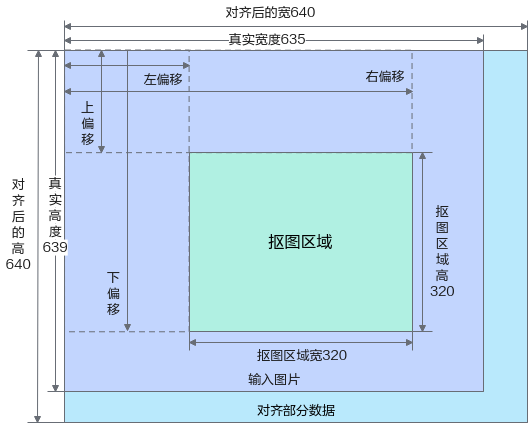
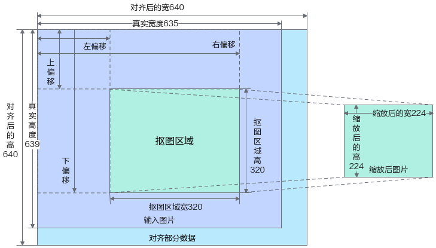
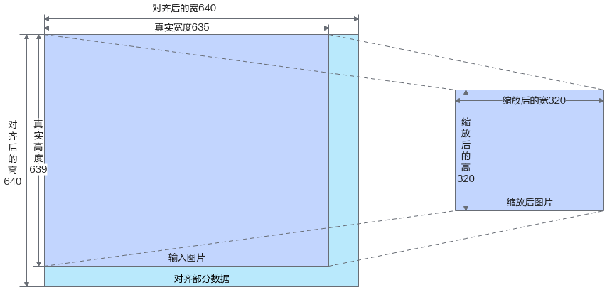

# API接口参考（C++）<a name="ZH-CN_TOPIC_0000001813361264"></a>

## 使用须知<a name="ZH-CN_TOPIC_0000001813361156"></a>

> [!NOTICE] 须知 
>-   本章节开放的类，请遵循同一个类实例在单一线程中使用的原则，请勿将同一个类实例在不同的线程中使用。
>-   请注意输入为STL容器或webjson参数的函数，应基于性能和实际业务需求限制容器长度，以防止可能出现的内存问题。
>-   传入接口内的JSON相关内容中请勿包含注释，否则会引起解析失败。
>-   若JSON相关内容中单个object存在key值相同键值对，接口将默认保留最后一组键值对作为解析结果。
>-   C++接口中存在由编译器生成的接口，例如默认构造函数，默认析构函数以及赋值构造函数等接口，不在本文作详细说明。
>-   部分接口以及数据结构是由protobuf生成。需注意protobuf会自动生成protobuf内部自定义的类以及数据结构，请用户不要使用protobuf内部自定义的类和数据结构。

**接口管理规范<a name="section125481420139"></a>**

-   标记有宏 SDK\_AVAILABLE\_FOR\_OUT 的接口，表示对用户开放。
-   标记有宏 SDK\_AVAILABLE\_FOR\_IN 的接口，表示内部使用，请用户不要使用。
-   标记有宏 SDK\_UNAVAILABLE\_FOR\_OTHER 的接口，表示为隐藏，用户无法使用。
-   标记有宏 SDK\_DEPRECATED\_FOR 的接口，表示在未来版本会弃用，建议使用替代接口。


## 高级API头文件列表说明<a name="ZH-CN_TOPIC_0000001813200620"></a>

**表 1**  头文件列表

|头文件名称|所在目录|用途|
|--|--|--|
|MxBase.h|MxBase/|MxBase头文件。|
|AscendStream.h|MxBase/Asynchron|定义AscendStream类，用于异步流程控制。|
|HiddenAttr.h|MxBase/Common|声明__attribute__相关的宏，用于标记接口属性，当前主要用于标记废弃接口、使得在编译阶段出现接口已废弃的告警提示。|
|Version.h|MxBase/Common|声明返回Vision SDK版本信息的接口，Vision SDK版本信息主要包括当前Vision SDK版本号、主版本号、从版本号、小版本号。|
|ConfigUtil.h|MxBase/ConfigUtil|定义ConfigData类和ConfigUtil类用于后处理模块和日志模块。具体来说，ConfigUtil类用于将配置文件读取到ConfigData对象当中，ConfigData对象定义了如添加JSON文件键值对、加载Label文件到std::vector对象、根据索引返回标签名等接口，供后处理模块和日志模块调用。|
|DataType.h|MxBase/CV/Core|定义目标检测相关数据结构，具体包含：DetectBox结构体、RoiBox结构体、IOUMethod枚举类、TrackFlag枚举类。|
|Huangarian.h|MxBase/CV/MultipleObjectTracking|定义匈牙利算法相关数据结构和接口，用于二分图匹配。|
|KalmanTracker.h|MxBase/CV/MultipleObjectTracking|定义卡尔曼滤波相关数据结构和接口，用于跟踪检测目标。|
|Nms.h|MxBase/CV/ObjectDetection/Nms|定义非极大值抑制算法相关接口，用于去除冗余目标框。|
|SimilarityTransform.h|MxBase/CV/WarpAffine|定义SimilarityTransform类，用于计算相似变换。|
|WarpAffine.h|MxBase/CV/WarpAffine|定义WarpAffine类，用于计算仿射变换。|
|DeviceManager.h|MxBase/DeviceManager|定义DeviceManager类，其中包括设备初始化、返回设备数量、返回当前设备、设置运行设备等相关接口。|
|DvppWrapper.h|MxBase/DvppWrapper|定义了DvppWrapper类，该类会根据芯片的不同调用不同的接口进行实例化，DvppWrapper类封装了图像变换相关的操作。|
|DvppWrapperDataType.h|MxBase/DvppWrapper|主要定义了图像处理相关的数据结构以及用于图片参数校验的常量。该头文件将于2025年12月退出。|
|Color.h|MxBase/E2eInfer/Color|定义了Color结构体。|
|Dim.h|MxBase/E2eInfer/Dim|定义了Dim结构体。|
|GlobalInit.h|MxBase/E2eInfer/GlobalInit|声明了初始化与去初始化接口。|
|Image.h|MxBase/E2eInfer/Image|定义了Image类，该类作为图片的数据结构，包含获取图片属性、将图片转为Tensor对象等接口。|
|ImageProcessor.h|MxBase/E2eInfer/ImageProcessor|定义了ImageProcessor类，提供编码、解码、切片、缩放、抠图、贴图等常用接口，ImageProcessor类底层调用了DvppWrapper类中的接口。|
|Model.h|MxBase/E2eInfer/Model|定义了Model类，提供高性能推理，返回输入输出Tensor格式等接口。|
|Point.h|MxBase/E2eInfer/Point|定义了Point结构体用于表示点。|
|Rect.h|MxBase/E2eInfer/Rect|定义了Rect结构体用于表示矩形。|
|Size.h|MxBase/E2eInfer/Size|定义了Size结构体用于表示尺寸。|
|Tensor.h|MxBase/E2eInfer/Tensor|定义了Tensor类，提供返回Tensor数据类型、返回字节大小、返回Tensor当前设备ID等接口。|
|TensorFeatures.h|MxBase/E2eInfer/Tensor|定义了Tensor特征提取类算法。|
|TensorFusion.h|MxBase/E2eInfer/TensorOperation|定义了Tensor融合方法，提供背景替换、动效透明度贴图和字幕透明度贴图等功能。|
|TensorWarping.h|MxBase/E2eInfer/TensorOperation|定义了Tensor图像变形处理方法，提供旋转、仿射变换等功能。|
|PerElementOperations.h|MxBase/E2eInfer/TensorOperation/MatricesOperation|定义了Tensor按元素处理方法，提供计算Tensor加、减、乘、除等功能。|
|MatrixReductions.h|MxBase/E2eInfer/TensorOperation/MatricesOperation|定义了Tensor归约方法，提供Tensor归约、求和等功能。|
|CoreOperationsOnTensors.h|MxBase/E2eInfer/TensorOperation/MatricesOperation|定义了Tensor核心处理方法，提供Tensor裁剪、扩展、水平堆叠和垂直堆叠等功能。|
|VideoDecoder.h|MxBase/E2eInfer/VideoDecoder|定义了VideoDecoder类，提供回调式、非阻塞视频解码接口，VideoDecoder类底层调用了DvppWrapper类中的接口。|
|VideoEncoder.h|MxBase/E2eInfer/VideoEncoder|定义了VideoEncoder类，提供回调式、非阻塞视频编码接口，VideoEncoder类底层调用了DvppWrapper类中的接口。|
|DataType.h|MxBase/E2eInfer|定义图像处理相关枚举类。|
|ErrorCode.h|MxBase/ErrorCode|定义错误码相关的字符串数组。|
|ErrorCodes.h|MxBase/ErrorCode|定义错误码相关的枚举类。|
|ErrorCodeThirdParty.h|MxBase/ErrorCode|定义第三方错误码相关的枚举类。|
|Log.h|MxBase/Log|定义Log类，主要提供了Debug、Info、Warn、Error等接口用于记录不同级别的日志信息。|
|FastMath.h|MxBase/Maths|定义了FastMath类，主要提供了Sigmoid、Softmax函数计算的接口。|
|MathFunction.h|MxBase/Maths|定义了LineRegressionFit类，主要提供了线性回归函数计算的接口。|
|NpySort.h|MxBase/Maths|定义了NpySort，主要提供快排算法接口。|
|MemoryHelper.h|MxBase/MemoryHelper|定义了MemoryData类和MemoryHelper类，主要提供内存申请、释放、拷贝等接口。|
|ModelDataType.h|MxBase/ModelInfer|定义了模型相关的数据结构。|
|ModelInferenceProcessor.h|MxBase/ModelInfer|定义了ModelInferenceProcessor类，主要提供模型推理相关接口，其功能与MxBase/E2eInfer/Model/Model.h相似。|
|ModelPostProcessorBase.h|MxBase/ModelPostProcessors/ModelPostProcessorBase|定义了ModelPostProcessorBase类，该类为MxBase/ModelPostProcessors目录下的基类。|
|ObjectPostDataType.h|MxBase/ModelPostProcessors/ModelPostProcessorBase|定义了目标后处理相关的数据结构。|
|ObjectPostProcessorBase.h|MxBase/ModelPostProcessors/ModelPostProcessorBase|定义了ObjectPostProcessorBase类，该类继承ModelPostProcessorBase类，已标识为弃用。|
|Resnet50PostProcess.h|MxBase/postprocess/include/ClassPostProcessors|定义了Resnet50PostProcess类，该类继承ClassPostProcessBase类。|
|HigherHRnetPostProcess.h|MxBase/postprocess/include/KeypointPostProcessors|定义了HigherHRnetPostProcess类，该类继承KeypointPostProcessBase类。|
|OpenPosePostProcess.h|MxBase/postprocess/include/KeypointPostProcessors|定义了OpenPosePostProcess类，该类继承KeypointPostProcessBase类。|
|FasterRcnnPostProcess.h|MxBase/postprocess/include/ObjectPostProcessors|定义了FasterRcnnPostProcess类，该类继承ObjectPostProcessBase类。|
|MaskRcnnMindsporePost.h|MxBase/postprocess/include/ObjectPostProcessors|定义了MaskRcnnMindsporePost类，该类继承ObjectPostProcessBase类。|
|RetinaNetPostProcess.h|MxBase/postprocess/include/ObjectPostProcessors|定义了RetinaNetPostProcess类，该类继承ObjectPostProcessBase类。|
|SsdMobilenetFpnMindsporePost.h|MxBase/postprocess/include/ObjectPostProcessors|定义了SsdMobilenetFpnMindsporePost类，该类继承ObjectPostProcessBase类。|
|SsdMobilenetv1FpnPostProcess.h|MxBase/postprocess/include/ObjectPostProcessors|定义了SsdMobilenetv1FpnPostProcess类，该类继承ObjectPostProcessBase类。|
|Ssdvgg16PostProcess.h|MxBase/postprocess/include/ObjectPostProcessors|定义了Ssdvgg16PostProcess类，该类继承ObjectPostProcessBase类。|
|Yolov3PostProcess.h|MxBase/postprocess/include/ObjectPostProcessors|定义了Yolov3PostProcess类，该类继承ObjectPostProcessBase类。|
|Deeplabv3Post.h|MxBase/postprocess/include/SegmentPostProcessors|定义了Deeplabv3Post类，该类继承SemanticSegPostProcessBase类。|
|UNetMindSporePostProcess.h|MxBase/postprocess/include/SegmentPostProcessors|定义了UNetMindSporePostProcess类，该类继承SemanticSegPostProcessBase类。|
|CrnnPostProcess.h|MxBase/postprocess/include/TextGenerationPostProcessors|定义了CrnnPostProcess类，该类继承TextGenerationPostProcessBase类。|
|TransformerPostProcess.h|MxBase/postprocess/include/TextGenerationPostProcessors|定义了TransformerPostProcess类，该类继承TextGenerationPostProcessBase类。|
|CtpnPostProcess.h|MxBase/postprocess/include/TextObjectPostProcessors|定义了CtpnPostProcess类，该类继承TextObjectPostProcessBase类。|
|PSENetPostProcess.h|MxBase/postprocess/include/TextObjectPostProcessors|定义了PSENetPostProcess类，该类继承TextObjectPostProcessBase类。|
|ClassPostProcessBase.h|MxBase/PostProcessBases|定义了ClassPostProcessBase类，该类继承PostProcessBase类，主要提供Process接口。|
|ImagePostProcessBase.h|MxBase/PostProcessBases|定义了ImagePostProcessBase类，该类继承PostProcessBase类，主要提供设置裁剪感兴趣区域的接口。|
|KeypointPostProcessBase.h|MxBase/PostProcessBases|定义了KeypointPostProcessBase类，该类继承PostProcessBase类，主要提供关键点检测任务相关的后处理接口。|
|ObjectPostProcessBase.h|MxBase/PostProcessBases|定义了ObjectPostProcessBase类，该类继承PostProcessBase类，主要提供目标检测任务相关的后处理接口。|
|PostProcessBase.h|MxBase/PostProcessBases|定义PostProcessBase类，该类为其余后处理类的基类。|
|PostProcessDataType.h|MxBase/PostProcessBases|定义了目标检测、图片缩放、图片裁剪等任务相关的数据结构。|
|SemanticSegPostProcessBase.h|MxBase/PostProcessBases|定义了SemanticSegPostProcessBase类，该类继承PostProcessBase类，主要提供语义分割任务相关的后处理接口。|
|TextGenerationPostProcessBase.h|MxBase/PostProcessBases|定义了TextGenerationPostProcessBase类，该类继承PostProcessBase类，主要提供文本生成任务相关的后处理接口。|
|TextObjectPostProcessBase.h|MxBase/PostProcessBases|定义了TextObjectPostProcessBase类，该类继承PostProcessBase类，主要提供文本对象任务相关的后处理接口。|
|TensorBase.h|MxBase/Tensor/TensorBase|定义TensorBase类。|
|TensorDataType.h|MxBase/Tensor/TensorBase|定义TensorDataType枚举类，该类对象为TensorBase类的成员变量。|


## 数据结构及枚举类型<a name="ZH-CN_TOPIC_0000001860120105"></a>

### 通用数据结构<a name="ZH-CN_TOPIC_0000001860000553"></a>

#### AppGlobalCfg<a name="ZH-CN_TOPIC_0000001813361048"></a>

**功能<a name="section10512122571315"></a>**

全局应用配置，支持配置DVPP资源池中VPC通道的数量。

**结构定义<a name="section1112110895714"></a>**

```
struct AppGlobalCfg {
    uint32_t vpcChnNum = DEFAULT_VPC_CHN_NUM;
};
```

**参数说明<a name="section12737185913386"></a>**

|参数名|说明|
|--|--|
|vpcChnNum|VPC通道资源池大小。默认值为DEFAULT_VPC_CHN_NUM = 48。取值范围为[1, 128]。|


#### AppGlobalCfgExtra<a name="ZH-CN_TOPIC_0000001962617713"></a>

**功能<a name="section10512122571315"></a>**

全局应用配置，支持配置DVPP资源池中VPC、JPEGD、PNGD及JPEGE通道的数量。

**结构定义<a name="section1112110895714"></a>**

```
struct AppGlobalCfgExtra {
    uint32_t vpcChnNum = DEFAULT_VPC_CHN_NUM;
    uint32_t jpegdChnNum = DEFAULT_JPEGD_CHN_NUM;
    uint32_t pngdChnNum = DEFAULT_PNGD_CHN_NUM;
    uint32_t jpegeChnNum = DEFAULT_JPEGE_CHN_NUM;
    virtual ~AppGlobalCfgExtra() = default;
};
```

**参数说明<a name="section12737185913386"></a>**

|参数名|说明|
|--|--|
|vpcChnNum|VPC通道资源池大小。默认值为DEFAULT_VPC_CHN_NUM = 48。取值范围为[1, 128]。|
|jpegdChnNum|JPEGD通道资源池大小。默认值为DEFAULT_JPEGD_CHN_NUM = 24。取值范围为[1, 64]。|
|pngdChnNum|PNGD通道资源池大小。默认值为DEFAULT_PNGD_CHN_NUM = 24。取值范围为[1, 64]。|
|jpegeChnNum|JPEGE通道资源池大小。默认值为DEFAULT_JPEGE_CHN_NUM = 24。取值范围为[1, 48]。|


#### AspectRatioPostImageInfo<a name="ZH-CN_TOPIC_0000001813360756"></a>

**功能<a name="section10512122571315"></a>**

继承了PostImageInfo类，并增加了图片缩放相关属性。

**结构定义<a name="section17413113111138"></a>**

```
struct AspectRatioPostImageInfo : PostImageInfo {
    enum ResizeType {
        RESIZER_STRETCHING = 0,
        RESIZER_TF_KEEP_ASPECT_RATIO,
        RESIZER_MS_KEEP_ASPECT_RATIO,
        RESIZER_ONLY_PADDING,
        RESIZER_KEEP_ASPECT_RATIO_LONG,
        RESIZER_KEEP_ASPECT_RATIO_SHORT,
        RESIZER_RESCALE,
        RESIZER_RESCALE_DOUBLE,
        RESIZER_MS_YOLOV4
    };
    float keepAspectRatioScaling = 0;
    ResizeType resizeType;
};
```

**参数说明<a name="section4796123101414"></a>**

|参数名|说明|
|--|--|
|keepAspectRatioScaling|图片缩放比例。|
|resizeType|图片缩放方式。<li>RESIZER_STRETCHING ：拉伸缩放。<li>RESIZER_TF_KEEP_ASPECT_RATIO ：对应FastRCNN缩放方式。<li>RESIZER_MS_KEEP_ASPECT_RATIO：等比缩放。<li>RESIZER_ONLY_PADDING：按原始长宽进行填充。<li>RESIZER_KEEP_ASPECT_RATIO_LONG：按长边比例缩放。<li>RESIZER_KEEP_ASPECT_RATIO_SHORT：按短边比例缩放。<li>RESIZER_RESCALE：按长宽缩放的较小比例拉伸缩放。<li>RESIZER_RESCALE_DOUBLE：按长宽缩放的较小比例拉伸缩放两次。<li>RESIZER_MS_YOLOV4：对应YOLOv4缩放方式。|


#### AttributeInfo<a name="ZH-CN_TOPIC_0000001813201596"></a>

**功能<a name="section10512122571315"></a>**

分类任务的分类信息。

**结构定义<a name="section17413113111138"></a>**

```
class AttributeInfo {
public:
    int attrId;
    std::string attrName;
    std::string attrValue;
    float confidence;
};
```

**参数说明<a name="section4796123101414"></a>**

|参数名|说明|
|--|--|
|attrId|属性ID。|
|attrName|属性名。|
|attrValue|属性值。|
|confidence|属性置信度。|


#### BaseTensor<a name="ZH-CN_TOPIC_0000001813201188"></a>

**功能<a name="section10512122571315"></a>**

定义一个张量数据的结构。

**结构定义<a name="section17413113111138"></a>**

```
struct BaseTensor { 
     void* buf; 
     std::vector<int> shape; 
     size_t size; 
 }
```

**参数说明<a name="section4796123101414"></a>**

|参数名|说明|
|--|--|
|buf|张量的数据。|
|shape|张量的形状。|
|size|张量数据对应内存大小，单位为Byte。size大小应与实际内存大小一致，否则可能会导致程序出现coredump情况。|


#### BlurConfig<a name="ZH-CN_TOPIC_0000001912210446"></a>

**功能<a name="section10512122571315"></a>**

用于配置腐蚀操作的结构体。

**结构定义<a name="section1112110895714"></a>**

```
struct BlurConfig {
    Size kernelSize = Size(3, 3);
    MorphShape morphShape = MorphShape::MORPH_RECT;
    std::pair<int, int> anchor = std::make_pair(-1, -1);
    uint32_t iterations = 1;
    BorderType borderType = BorderType::BORDER_REPLICATE;
    std::vector<double> borderValue;
};
```

**参数说明<a name="section12737185913386"></a>**

|参数名|说明|
|--|--|
|kernelSize|卷积核尺寸，kernelSize的宽和高取值范围为[3,9]，且卷积核宽高相同。默认值为3*3。|
|morphShape|卷积形状，当前仅支持MORPH_RECT。MORPH_RECT的介绍可参见[MorphShape](#ZH-CN_TOPIC_0000001945079501)。|
|anchor|卷积核的锚点，默认值为（-1，-1），表示锚位于kernel中心位置，暂不支持配置。|
|iterations|腐蚀操作迭代次数，默认为1，取值范围为[1, 100]。|
|borderType|边界填充类型，当前仅支持BORDER_REPLICATE。BORDER_REPLICATE介绍可参见[BorderType](#ZH-CN_TOPIC_0000001813360804)。|
|borderValue|边界填充值，存放颜色分量的值，取值范围为[0,255]。预埋参数，暂不支持配置。|


#### BorderType<a id="ZH-CN_TOPIC_0000001813360804"></a>

**功能<a name="section2914243193712"></a>**

补边方式，用于图像处理“ImageProcessor”类的补边功能。

**结构定义<a name="section51263446379"></a>**

```
enum class BorderType {
    BORDER_CONSTANT = 0,
    BORDER_REPLICATE = 1,
    BORDER_REFLECT = 2,
    BORDER_REFLECT_101 = 3,
};
```

**参数说明<a name="section4327114413371"></a>**

|参数名|说明|
|--|--|
|BORDER_CONSTANT|添加有颜色的常数值边界。|
|BORDER_REPLICATE|重复最后一个元素。例如：aaaaaa|a*****h|hhhhhhh（其中*表示任意图像元素）。|
|BORDER_REFLECT|边界元素的镜像，镜像包括边界元素。例如：ba|abc*******fgh|hg（其中*表示任意图像元素）。|
|BORDER_REFLECT_101|边界元素的镜像，镜像不包括边界元素。例如：cb|abc****fgh|gf（其中*表示任意图像元素）。|


#### ClassInfo<a name="ZH-CN_TOPIC_0000001813361276"></a>

**功能<a name="section10512122571315"></a>**

分类任务的分类信息。

**结构定义<a name="section17413113111138"></a>**

```
class ClassInfo {
public:
    int classId;
    float confidence;
    std::string className;
};
```

**参数说明<a name="section4796123101414"></a>**

|参数名|说明|
|--|--|
|classId|类别的编号。|
|confidence|类别的置信度。|
|className|类别名称。|


#### CmpOp<a name="ZH-CN_TOPIC_0000001813201296"></a>

**功能<a name="section10512122571315"></a>**

张量比较类型。

**结构定义<a name="section1112110895714"></a>**

```
enum class CmpOp { 
     CMP_EQ = 0, 
     CMP_NE, 
     CMP_LT, 
     CMP_GT, 
     CMP_LE, 
     CMP_GE 
};
```

**参数说明<a name="section12737185913386"></a>**

|参数名|说明|
|--|--|
|CMP_EQ|相等操作，代表==。|
|CMP_NE|不相等操作，代表!=。|
|CMP_LT|小于操作，代表<。|
|CMP_GT|大于操作，代表>。|
|CMP_LE|小于等于操作，代表<=。|
|CMP_GE|大于等于操作，代表>=。|


#### Color<a name="ZH-CN_TOPIC_0000001813200808"></a>

**功能<a name="section27294561456"></a>**

色彩值，用于图像处理补边功能，描述三通道色彩的结构体。

**结构定义<a name="section189691056756"></a>**

```
struct Color {
    Color()
        : channel_zero(0), channel_one(0), channel_two(0) {};
    Color(const uint32_t inputRed, const uint32_t inputGreen, const uint32_t inputBlue)
        : channel_zero(inputRed), channel_one(inputGreen), channel_two(inputBlue) {};

    uint32_t channel_zero;
    uint32_t channel_one;
    uint32_t channel_two;
};
```

**参数说明<a name="section84013571513"></a>**

|参数名|说明|
|--|--|
|channel_zero，inputRed|0号通道取值，范围[0, 255]。例如：对于RGB_888格式图像，该通道为R；对于YUV格式图像，该通道为Y。|
|channel_one，inputGreen|1号通道取值，范围[0, 255]。例如：对于RGB_888格式图像，该通道为G；对于YUV格式图像，该通道为U。|
|channel_two，inputBlue|2号通道取值，范围[0, 255]。例如：对于RGB_888格式图像，该通道为B；对于YUV格式图像，该通道为V。|


#### ConfigMode<a name="ZH-CN_TOPIC_0000001983294113"></a>

**功能<a name="section10512122571315"></a>**

LoadConfiguration所使用的枚举类型，具体请参见[LoadConfiguration](#loadconfiguration)。

**结构定义<a name="section17413113111138"></a>**

```
enum ConfigMode {
    CONFIGJSON = 0,    // 对应 JSON 文件。
    CONFIGFILE,        // 对应 Normal 文件
    CONFIGPM,          // 对应 Pm 文件
    CONFIGCONTENT      // 对应 JSON content
};
```

**参数说明<a name="section4796123101414"></a>**

|参数名|说明|
|--|--|
|CONFIGJSON|配置为JSON文件。|
|CONFIGFILE|配置为普通文件。|
|CONFIGPM|配置为PM文件。|
|CONFIGCONTENT|配置为JSON内容。|


#### CoorDim<a name="ZH-CN_TOPIC_0000001813201416"></a>

**功能<a name="section10512122571315"></a>**

用于坐标的信息描述。

**结构定义<a name="section17413113111138"></a>**

```
struct TextObjectPostProcessBase::CoorDim {
    int i;
    int j;
    int k;
    int index;
    CoorDim(int i, int j, int k, int idx):i(i), j(j), k(k), index(idx){}
};

struct OcrPostProcessors::CoorDim {
    int i;
    int j;
    CoorDim(int i, int j):i(i), j(j){}
};
```

**参数说明<a name="section4796123101414"></a>**

|参数名|说明|
|--|--|
|i , j , k|坐标分量值。|
|index|坐标索引。|


#### CropResizePasteConfig<a name="ZH-CN_TOPIC_0000001813360696"></a>

**功能<a name="section10512122571315"></a>**

抠图坐标及贴图坐标。

**结构定义<a name="section17413113111138"></a>**

```
struct CropResizePasteConfig {
    // CROP CONFIG
    uint32_t cropLeft;
    uint32_t cropRight;
    uint32_t cropTop;
    uint32_t cropBottom;
    // PASTE CONFIG
    uint32_t pasteLeft;
    uint32_t pasteRight;
    uint32_t pasteTop;
    uint32_t pasteBottom;
    // RESIZE CONFIG
    uint32_t interpolation;
};
```

**参数说明<a name="section4796123101414"></a>**

|参数名|说明|
|--|--|
|cropLeft|抠图坐标左边。|
|cropRight|抠图坐标右边。|
|cropTop|抠图坐标上边。|
|cropBottom|抠图坐标下边。|
|pasteLeft|贴图坐标左边。|
|pasteRight|贴图坐标右边。|
|pasteTop|贴图坐标上边。|
|pasteBottom|贴图坐标下边。|
|interpolation|指定缩放算子，取值范围：<li>0：默认值，华为自研的最近邻插值算法。<li>1：业界通用的Bilinear算法，当前不支持。<li>2：业界通用的Nearest Neighbor算法，当前不支持。|


#### CropRoiBox<a name="ZH-CN_TOPIC_0000001860000865"></a>

**功能<a name="section10512122571315"></a>**

用于记录图像类任务中模型前处理中的感兴趣（Region of Interest，简称ROI）区域，提供给模型后处理的坐标还原使用。

**结构定义<a name="section17413113111138"></a>**

```
class CropRoiBox {
public:
    float x0;
    float y0;
    float x1;
    float y1;
};
```

**参数说明<a name="section4796123101414"></a>**

|参数名|说明|
|--|--|
|x0|ROI框左上角横坐标。|
|y0|ROI框左上角纵坐标。|
|x1|ROI框右下角横坐标。|
|y1|ROI框右下角纵坐标。|


#### CropRoiConfig<a name="ZH-CN_TOPIC_0000001813361244"></a>

**功能<a name="section10512122571315"></a>**

定义抠图的范围。

**结构定义<a name="section17413113111138"></a>**

```
struct CropRoiConfig {
    uint32_t x0;
    uint32_t x1;
    uint32_t y1;
    uint32_t y0;
};
```

**参数说明<a name="section15857125511310"></a>**

|参数名|说明|
|--|--|
|x0|左上角横坐标。|
|x1|右下角横坐标。|
|y1|右下角纵坐标。|
|y0|左上角纵坐标。|


#### CvtColorMode<a name="ZH-CN_TOPIC_0000001983442073"></a>

**功能<a name="section10512122571315"></a>**

定义色域转换的原始类型和目标类型。使用方式请参见[CvtColor](#cvtcolor)。

**结构定义<a name="section17413113111138"></a>**

```
enum class CvtColorMode {
    COLOR_YUVSP4202GRAY = 0,
    COLOR_YVUSP4202GRAY = 1,
    COLOR_YUVSP4202RGB = 2,
    COLOR_YVUSP4202RGB = 3,
    COLOR_YUVSP4202BGR = 4,
    COLOR_YVUSP4202BGR = 5,
    COLOR_RGB2GRAY = 6,
    COLOR_BGR2GRAY = 7,
    COLOR_BGR2RGB = 8,
    COLOR_RGB2BGR = 9,
    COLOR_RGB2RGBA = 10,
    COLOR_RGBA2GRAY = 11,
    COLOR_RGBA2RGB = 12,
    COLOR_GRAY2RGB = 13,
    COLOR_RGBA2mRGBA = 14,
    COLOR_BGR2YUVSP420 = 15,
    COLOR_RGB2YUVSP420 = 16,
    COLOR_RGB2YVUSP420 = 17,
    COLOR_BGR2YVUSP420 = 18
};
```

**参数说明<a name="section15857125511310"></a>**

无


#### DataFormat<a name="ZH-CN_TOPIC_0000001860000733"></a>

**功能<a name="section10512122571315"></a>**

数据排布格式描述。

**结构定义<a name="section17413113111138"></a>**

```
enum DataFormat {
    NCHW = 0,
    NHWC = 1
};
```

**参数说明<a name="section4796123101414"></a>**

|参数名|说明|
|--|--|
|NCHW|数据按NCHW排布。|
|NHWC|数据按NHWC排布。|


#### DecodeH26xInfo<a name="ZH-CN_TOPIC_0000001860000909"></a>

**功能<a name="section10512122571315"></a>**

解码H.264或H.265的相关信息结构体。

**结构定义<a name="section17413113111138"></a>**

```
struct DecodeH26xInfo {
    DecodeH26xInfo(uint32_t i, uint32_t i1, DecodeCallBackFunction pFunction, void *pVoid): channelId(i), frameId(i1), callbackFunc(pFunction), userData(pVoid) {}
    uint32_t channelId = 0;
    uint32_t frameId = 0;
    DecodeCallBackFunction callbackFunc = nullptr;
    void* userData = nullptr;
    bool userMalloc = false;
};
```

**参数说明<a name="section4796123101414"></a>**

|参数名|说明|
|--|--|
|channelId|视频路ID。|
|frameId|帧ID。|
|callbackFunc|Callback函数。|
|userData|用户自定义数据。|
|userMalloc|数据内存是否由用户申请。|


#### DetectBox<a name="ZH-CN_TOPIC_0000001813361008"></a>

**功能<a name="section10512122571315"></a>**

定义获取推理结果使用的结构体。

**结构定义<a name="section17413113111138"></a>**

```
struct DetectBox {
    float prob;
    int classID;
    float x;
    float y;
    float width;
    float height;
    std::string className;
    void *maskPtr;
};
```

**参数说明<a name="section4796123101414"></a>**

|参数名|说明|
|--|--|
|prob|类别的置信度。|
|classID|类别的编号。|
|x|目标的横坐标。|
|y|目标的纵坐标。|
|width|目标的宽度，从横坐标**x**处开始计算。|
|height|目标的高度，从纵坐标**y**处开始计算。|
|className|类别名。|
|maskPtr|实例分割需要使用的掩码。|


#### DeviceContext<a name="ZH-CN_TOPIC_0000001860120829"></a>

**功能<a name="section10512122571315"></a>**

设备内容设置。

**结构定义<a name="section17413113111138"></a>**

```
struct DeviceContext {
    enum DeviceStatus {
        IDLE = 0,  // idle status
        USING      // running status
    } devStatus = IDLE;
    int32_t devId = DEFAULT_VALUE; // DEFAULT_VALUE = 0
};
```

**参数说明<a name="section4796123101414"></a>**

|参数名|说明|
|--|--|
|devStatus|设备状态，默认为IDLE闲置。|
|devId|设备ID。|


#### Dim<a name="ZH-CN_TOPIC_0000001860000393"></a>

**功能<a name="section5394830111912"></a>**

补边值，用于图像处理“ImageProcessor”的补边功能，描述左、右、上、下四个方向补边的像素个数。

**结构定义<a name="section1755318308192"></a>**

```
struct Dim {
    Dim()
        : left(0), right(0), top(0), bottom(0) {}; 
    Dim(const uint32_t inputDim)
        : left(inputDim), right(inputDim), top(inputDim), bottom(inputDim) {}; 
    Dim(const uint32_t inputLeft, const uint32_t inputRight, const uint32_t inputTop, const uint32_t inputBottom)
        : left(inputLeft), right(inputRight), top(inputTop), bottom(inputBottom) {};
    uint32_t left;
    uint32_t right;
    uint32_t top;
    uint32_t bottom;
};
```

**参数说明<a name="section289115317191"></a>**

|参数名|说明|
|--|--|
|left，inputLeft|左侧补边像素数量。|
|right，inputRight|右侧补边像素数量。|
|top，inputTop|上方补边像素数量。|
|bottom，inputBottom|下方补边像素数量。|
|inputDim|左、右、上、下补边像素数量。仅在使用Dim(const uint32_t inputDim)构造函数时，将左、右、上、下补边像素数量设为与inputDim相同的值。|


#### DvppDataInfo<a name="ZH-CN_TOPIC_0000001813200396"></a>

**功能<a name="section10512122571315"></a>**

DVPP实体数据定义。

**结构定义<a name="section17413113111138"></a>**

```
struct DvppDataInfo {
    uint32_t width = 0;                                    
    uint32_t height = 0;                                  
    uint32_t widthStride = 0;                              
    uint32_t heightStride = 0;                             
    MxbasePixelFormat format = MXBASE_PIXEL_FORMAT_YUV_SEMIPLANAR_420;  
    uint32_t frameId = 0;                                  
    uint32_t channelId = 0;                                
    uint32_t dataSize = 0;
    uint32_t outDataSize = 0;
    uint32_t dataType = 0;                                
    uint8_t* data = nullptr;                              
    uint8_t* outData = nullptr;
    uint32_t resizeWidth = 0;
    uint32_t resizeHeight = 0;
    std::string device = "host:0";
    uint32_t deviceId = 0; 
    void (*destory)(void *) = nullptr;        
};
```

**参数说明<a name="section4796123101414"></a>**

|参数名|说明|
|--|--|
|width|原始图像宽。|
|height|原始图像高。|
|widthStride|原始图像对齐后的宽。|
|heightStride|原始图像对齐后的高。|
|format|图像格式，默认值为MXBASE_PIXEL_FORMAT_YUV_SEMIPLANAR_420。<br>DVPP图像格式定义具体请参见[MxbasePixelFormat](#mxbasepixelformat)。|
|frameId|图像帧编号。|
|channelId|图像通道数编号。|
|dataSize|图像数据大小，单位为Byte。<br>dataSize大小需要和图像实际大小一致，否则可能会导致程序出现coredump情况。|
|outDataSize|输出图像数据大小，单位为Byte。<br>outDataSize大小需要和输出图像大小一致，否则可能会导致程序出现coredump情况。|
|dataType|图像的数据类型。|
|data|图像数据。|
|outData|预申请内存地址，主要用于存放视频解码后的图像数据。|
|resizeWidth|缩放宽，主要用于视频解码时的缩放操作。<br>目前仅支持Atlas 推理系列产品。<br>默认值为0，即不做缩放。取值范围：[10, 4096]。|
|resizeHeight|缩放高，主要用于视频解码时的缩放操作。<br>目前仅支持Atlas 推理系列产品。<br>默认值为0，即不做缩放。取值范围：[6, 4096]。|
|device|设备号。|
|deviceId|设备编号。|
|destory|回调函数，用于释放该DVPP数据。|


#### DvppImageInfo<a name="ZH-CN_TOPIC_0000001813201396"></a>

**功能<a name="section10512122571315"></a>**

DVPP图像信息描述。

**结构定义<a name="section17413113111138"></a>**

```
struct DvppImageInfo {
    enum PictureType {
        PIXEL_FORMAT_ANY = 0,
        PIXEL_FORMAT_JPEG = 1,
        PIXEL_FORMAT_PNG = 2
    };
    const void* data;
    uint32_t size;
    PictureType pictureType;
};
```

**参数说明<a name="section4796123101414"></a>**

|参数名|说明|
|--|--|
|data|图片数据的内存地址。|
|size|图片大小，单位为Byte。size大小需要和实际图片大小一致，否则可能会导致程序出现coredump情况。|
|pictureType|图片类型，为下列三者之一：<li>PIXEL_FORMAT_ANY = 0<li>PIXEL_FORMAT_JPEG = 1<li>PIXEL_FORMAT_PNG = 2|


#### DvppImageOutput<a name="ZH-CN_TOPIC_0000001860120681"></a>

**功能<a name="section10512122571315"></a>**

DVPP图像输出定义。

**结构定义<a name="section17413113111138"></a>**

```
struct DvppImageOutput { 
     uint32_t width; 
     uint32_t height; 
     int32_t components; 
     uint32_t widthStride;
     uint32_t heightStride;
     uint32_t outImgDatasize;
 }
```

**参数说明<a name="section4796123101414"></a>**

|参数名|说明|
|--|--|
|width|输出图像的宽度。|
|height|输出图像的高度。|
|components|输出图像的通道个数。|
|widthStride|输出对齐后的图像宽。|
|heightStride|输出对齐后的图像高。|
|outImgDatasize|输出图像的内存大小。|


#### DynamicInfo<a name="ZH-CN_TOPIC_0000001860121173"></a>

**功能<a name="section10512122571315"></a>**

模型支持的类型。

**结构定义<a name="section17413113111138"></a>**

```
struct DynamicInfo {
    DynamicType dynamicType = DYNAMIC_BATCH;
    size_t batchSize;
    ImageSize imageSize = {};
    std::vector<std::vector<uint32_t>> shape = {};
};
```

**参数说明<a name="section4796123101414"></a>**

|参数名|说明|
|--|--|
|dynamicType|动态类型描述。|
|batchSize|batch大小。|
|imageSize|图像大小。|
|shape|动态Batch的形状。|


#### DynamicType<a name="ZH-CN_TOPIC_0000001860001381"></a>

**功能<a name="section10512122571315"></a>**

动态类型描述。

**结构定义<a name="section17413113111138"></a>**

```
enum DynamicType {
    STATIC_BATCH = 0,
    DYNAMIC_BATCH = 1,
    DYNAMIC_HW = 2,
    DYNAMIC_DIMS = 3,
    DYNAMIC_SHAPE = 4
};
```

**参数说明<a name="section4796123101414"></a>**

|参数名|说明|
|--|--|
|STATIC_BATCH|静态batch|
|DYNAMIC_BATCH|动态batch|
|DYNAMIC_HW|动态分辨率|
|DYNAMIC_DIMS|动态维度|
|DYNAMIC_SHAPE|动态shape|


#### EncodeH26xInfo<a name="ZH-CN_TOPIC_0000001813360780"></a>

**功能<a name="section10512122571315"></a>**

视频编码回调传入数据。

**结构定义<a name="section17413113111138"></a>**

```
struct EncodeH26xInfo {    
    std::function<void(std::shared_ptr<uint8_t>, uint32_t)> func = {};
};
```

**参数说明<a name="section4796123101414"></a>**

|参数名|输入/输出|说明|
|--|--|--|
|func|输入|用于视频编码回调处理的函数对象。<br>函数对象的第一个参数std::shared_ptr<uint8_t>为输出的视频流数据（Host侧的数据），第二个参数uint32_t为视频流数据大小。|


#### HungarianHandle<a name="ZH-CN_TOPIC_0000001813360216"></a>

**功能<a name="section10512122571315"></a>**

匈牙利算法，一种在多项式时间内求解任务分配问题的组合优化算法。

**结构定义<a name="section17413113111138"></a>**

```
struct HungarianHandle {
    int rows;
    int cols;
    int max;
    int* resX;
    int* resY;
    bool transpose;
    std::shared_ptr<int> adjMat;
    std::shared_ptr<int> xMatch;
    std::shared_ptr<int> yMatch;
    std::shared_ptr<int> xValue;
    std::shared_ptr<int> yValue;
    std::shared_ptr<int> slack;
    std::shared_ptr<int> xVisit;
    std::shared_ptr<int> yVisit;
};
```

**参数说明<a name="section4796123101414"></a>**

|参数名|输入/输出|说明|
|--|--|--|
|rows|输入|匹配矩阵行。|
|cols|输入|匹配矩阵列。|
|max|输出|匹配矩阵行与列最大值。|
|resX|输出|点集**x**匹配结果。|
|resY|输出|点集**y**匹配结果。|
|transpose|输出|矩阵转置标识符。|
|adjMat|输入|权值矩阵。|
|xMatch|输出|点集**x**匹配值。|
|yMatch|输出|点集**y**匹配值。|
|xValue|输出|点集**x**顶标值。|
|yValue|输出|点集**y**值，默认为0。|
|slack|输出|slack数组。|
|xVisit|输出|点集**x**匹配标识符。|
|yVisit|输出|点集**y**匹配标识符。|


#### ImageConstrainInfo<a name="ZH-CN_TOPIC_0000001813360952"></a>

**功能<a name="section10512122571315"></a>**

图片对齐相关参数。

**结构定义<a name="section17413113111138"></a>**

```
struct ImageConstrainInfo {
    uint32_t minWidthStride;
    uint32_t maxWidthStride;
    uint32_t minHeightStride;
    uint32_t maxHeightStride;
    uint32_t widthStrideAlign;
    uint32_t heightStrideAlign;
    uint32_t widthAlign;
    uint32_t heightAlign;
    float ratio;
    uint32_t pixelBit;
};
```

**参数说明<a name="section4796123101414"></a>**

|参数名|说明|
|--|--|
|minWidthStride|宽对齐最小值。|
|maxWidthStride|宽对齐最大值。|
|minHeightStride|高对齐最小值。|
|maxHeightStride|高对齐最大值。|
|widthStrideAlign|宽对齐的对齐方式。|
|heightStrideAlign|高对齐的对齐方式。|
|widthAlign|宽对齐方式。|
|heightAlign|高对齐方式。|
|ratio|比例。|
|pixelBit|像素点数据。|


#### ImageFormat<a name="ZH-CN_TOPIC_0000001860120597"></a>

**功能<a name="section373011016377"></a>**

图像格式，用于描述解码后Image类的数据格式。

**结构定义<a name="section573241073718"></a>**

```
enum class ImageFormat {
    YUV_400 = 0,
    YUV_SP_420 = 1,
    YVU_SP_420 = 2,
    YUV_SP_422 = 3,
    YVU_SP_422 = 4,
    YUV_SP_444 = 5,
    YVU_SP_444 = 6,
    YUYV_PACKED_422 = 7,
    UYVY_PACKED_422 = 8,
    YVYU_PACKED_422 = 9,
    VYUY_PACKED_422 = 10,
    YUV_PACKED_444 = 11,
    RGB_888 = 12,
    BGR_888 = 13,
    ARGB_8888 = 14,
    ABGR_8888 = 15,
    RGBA_8888 = 16,
    BGRA_8888 = 17,
};
```

**参数说明<a name="section1774021073720"></a>**

|参数名|说明|
|--|--|
|YUV_400|YUV_400 的图像格式。|
|YUV_SP_420|YUV_SP_420 的图像格式。|
|YVU_SP_420|YVU_SP_420 的图像格式。|
|YUV_SP_422|YUV_SP_422 的图像格式。|
|YVU_SP_422|YVU_SP_422 的图像格式。|
|YUV_SP_444|YUV_SP_444 的图像格式。|
|YVU_SP_444|YVU_SP_444 的图像格式。|
|YUYV_PACKED_422|YUYV_PACKED_422 的图像格式。|
|UYVY_PACKED_422|UYVY_PACKED_422 的图像格式。|
|YVYU_PACKED_422|YVYU_PACKED_422 的图像格式。|
|VYUY_PACKED_422|VYUY_PACKED_422 的图像格式。|
|YUV_PACKED_444|YUV_PACKED_444 的图像格式。|
|RGB_888|RGB_888 的图像格式。|
|BGR_888|BGR_888 的图像格式。|
|ARGB_8888|ARGB_8888 的图像格式。|
|ABGR_8888|ABGR_8888 的图像格式。|
|RGBA_8888|RGBA_8888 的图像格式。|
|BGRA_8888|BGRA_8888 的图像格式。|


#### ImageFormatString<a name="ZH-CN_TOPIC_0000001843069358"></a>

**功能<a name="section373011016377"></a>**

用于ImageFormat枚举值与其相应字符串的映射。

**结构定义<a name="section8438769235"></a>**

```
static const std::map<ImageFormat, std::string> IMAGE_FORMAT_STRING = {
    {ImageFormat::YUV_400, "YUV_400"},
    {ImageFormat::YUV_SP_420, "YUV_SP_420"},
    {ImageFormat::YVU_SP_420, "YVU_SP_420"},
    {ImageFormat::YUV_SP_422, "YUV_SP_422"},
    {ImageFormat::YVU_SP_422, "YVU_SP_422"},
    {ImageFormat::YUV_SP_444, "YUV_SP_444"},
    {ImageFormat::YVU_SP_444, "YVU_SP_444"},
    {ImageFormat::YUYV_PACKED_422, "YUYV_PACKED_422"},
    {ImageFormat::UYVY_PACKED_422, "UYVY_PACKED_422"},
    {ImageFormat::YVYU_PACKED_422, "YVYU_PACKED_422"},
    {ImageFormat::VYUY_PACKED_422, "VYUY_PACKED_422"},
    {ImageFormat::YUV_PACKED_444, "YUV_PACKED_444"},
    {ImageFormat::RGB_888, "RGB_888"},
    {ImageFormat::BGR_888, "BGR_888"},
    {ImageFormat::ARGB_8888, "ARGB_8888"},
    {ImageFormat::ABGR_8888, "ABGR_8888"},
    {ImageFormat::RGBA_8888, "RGBA_8888"},
    {ImageFormat::BGRA_8888, "BGRA_8888"},
};
```

**参数说明<a name="section9107113819431"></a>**

|参数名|说明|
|--|--|
|ImageFormat::YUV_400, "YUV_400"|YUV_400的图像格式枚举值与其字符串的映射。|
|ImageFormat::YUV_SP_420, "YUV_SP_420"|YUV_SP_420的图像格式枚举值与其字符串的映射。|
|ImageFormat::YVU_SP_420, "YVU_SP_420"|YVU_SP_420的图像格式枚举值与其字符串的映射。|
|ImageFormat::YUV_SP_422, "YUV_SP_422"|YUV_SP_422的图像格式枚举值与其字符串的映射。|
|ImageFormat::YVU_SP_422, "YVU_SP_422"|YVU_SP_422的图像格式枚举值与其字符串的映射。|
|ImageFormat::YUV_SP_444, "YUV_SP_444"|YUV_SP_444的图像格式枚举值与其字符串的映射。|
|ImageFormat::YVU_SP_444, "YVU_SP_444"|YVU_SP_444的图像格式枚举值与其字符串的映射。|
|ImageFormat::YUYV_PACKED_422, "YUYV_PACKED_422"|YUYV_PACKED_422的图像格式枚举值与其字符串的映射。|
|ImageFormat::UYVY_PACKED_422, "UYVY_PACKED_422"|UYVY_PACKED_422的图像格式枚举值与其字符串的映射。|
|ImageFormat::YVYU_PACKED_422, "YVYU_PACKED_422"|YVYU_PACKED_422的图像格式枚举值与其字符串的映射。|
|ImageFormat::VYUY_PACKED_422, "VYUY_PACKED_422"|VYUY_PACKED_422的图像格式枚举值与其字符串的映射。|
|ImageFormat::YUV_PACKED_444, "YUV_PACKED_444"|YUV_PACKED_444的图像格式枚举值与其字符串的映射。|
|ImageFormat::RGB_888, "RGB_888"|RGB_888的图像格式枚举值与其字符串的映射。|
|ImageFormat::BGR_888, "BGR_888"|BGR_888的图像格式枚举值与其字符串的映射。|
|ImageFormat::ARGB_8888, "ARGB_8888"|ARGB_8888的图像格式枚举值与其字符串的映射。|
|ImageFormat::ABGR_8888, "ABGR_8888"|ABGR_8888的图像格式枚举值与其字符串的映射。|
|ImageFormat::RGBA_8888, "RGBA_8888"|RGBA_8888的图像格式枚举值与其字符串的映射。|
|ImageFormat::BGRA_8888, "BGRA_8888"|BGRA_8888的图像格式枚举值与其字符串的映射。|


#### ImagePreProcessInfo<a name="ZH-CN_TOPIC_0000001860000373"></a>

**功能<a name="section10512122571315"></a>**

用于记录图像类任务中模型前处理中的感兴趣（Region of Interest）区域，提供给模型后处理的坐标还原使用。

**结构定义<a name="section17413113111138"></a>**

```
class ImagePreProcessInfo {
public:
    ImagePreProcessInfo()
    {
        imageWidth = 0;
        imageHeight = 0;
        originalWidth = 0;
        originalHeight = 0;
        xRatio = 1.0;
        xBias = 0.0;
        yRatio = 1.0;
        yBias = 0.0;
        x0Valid = 0.0;
        y0Valid = 0.0;
        x1Valid = 0.0;
        y1Valid = 0.0;
    }
    ImagePreProcessInfo(uint32_t width, uint32_t height)
    {
        imageWidth = width;
        imageHeight = height;
        originalWidth = width;
        originalHeight = height;
        xRatio = 1.0;
        xBias = 0.0;
        yRatio = 1.0;
        yBias = 0.0;
        x0Valid = 0.0;
        y0Valid = 0.0;
        x1Valid = width;
        y1Valid = height;
    }
    ImagePreProcessInfo(uint32_t widthResize, uint32_t heightResize, uint32_t widthOriginal, uint32_t heightOriginal)
    {
        if (!((widthOriginal == 0) || (heightOriginal == 0))) {
            xRatio = widthResize / (float)widthOriginal;
            yRatio = heightResize / (float)heightOriginal;
        } else {
            xRatio = 1.0;
            yRatio = 1.0;
        }
        imageWidth = widthResize;
        imageHeight = heightResize;
        originalWidth = widthOriginal;
        originalHeight = heightOriginal;
        xBias = 0.0;
        yBias = 0.0;
        x0Valid = 0.0;
        y0Valid = 0.0;
        x1Valid = widthResize;
        y1Valid = heightResize;
    }
    ~ImagePreProcessInfo() {}
public:
    // image
    uint32_t imageWidth = 0;           // memoryWidth
    uint32_t imageHeight = 0;          // memoryHeight
    uint32_t originalWidth = 0;           // originalWidth
    uint32_t originalHeight = 0;          // originalHeight

    // mapping parameters
    float xRatio = 1.0;
    float xBias = 0.0;
    float yRatio = 1.0;
    float yBias = 0.0;

    // valid region
    float x0Valid = 0.0;
    float y0Valid = 0.0;
    float x1Valid = 0.0;
    float y1Valid = 0.0;
};
```

**参数说明<a name="section4796123101414"></a>**

|参数名|说明|
|--|--|
|imageWidth|图像宽。|
|imageHeight|图像高。|
|originalWidth|原图宽。|
|originalHeight|原图高。|
|xRatio|x方向伸缩比。|
|xBias|x方向偏置。|
|yRatio|y方向伸缩比。|
|yBias|y方向偏置。|
|x0Valid|图像中有效区域的左上角横坐标。|
|y0Valid|图像中有效区域的左上角纵坐标。|
|x1Valid|图像中有效区域的右下角横坐标。|
|y1Valid|图像中有效区域的右下角纵坐标。|


#### ImageSize<a name="ZH-CN_TOPIC_0000001813201560"></a>

**功能<a name="section10512122571315"></a>**

图片尺寸信息。

**结构定义<a name="section17413113111138"></a>**

```
namespace MxBase{
struct ImageSize {
    size_t height;
    size_t width;
    ImageSize() = default;
    ImageSize(size_t height, size_t width)
    {
        this->width = width;
        this->height = height;
    }
}
}
```

```
namespace MxTools{
struct ImageSize {
    size_t height;
    size_t width;
    size_t area;
    ImageSize(int height, int width)
    {
        this->width = static_cast<size_t>(width);
        this->height = static_cast<size_t>(height);
        this->area = static_cast<size_t>(height * width);
    }
}
}
```

**参数说明<a name="section4796123101414"></a>**

|参数名|说明|
|--|--|
|height|图片的高。|
|width|图片的宽。|
|area|图片面积。|


#### Interpolation<a name="ZH-CN_TOPIC_0000001860000569"></a>

**功能<a name="section373011016377"></a>**

缩放方式，用于Resize类的缩放接口。

**结构定义<a name="section573241073718"></a>**

```
enum class Interpolation {
    HUAWEI_HIGH_ORDER_FILTER = 0,
    BILINEAR_SIMILAR_OPENCV = 1,
    NEAREST_NEIGHBOR_OPENCV = 2,
    BILINEAR_SIMILAR_TENSORFLOW = 3,
    NEAREST_NEIGHBOR_TENSORFLOW = 4,
};
```

**参数说明<a name="section1774021073720"></a>**

|参数名|说明|
|--|--|
|HUAWEI_HIGH_ORDER_FILTER|华为自研的高阶滤波算法（在Atlas 推理系列产品上，此选项等同于BILINEAR_SIMILAR_OPENCV）。|
|BILINEAR_SIMILAR_OPENCV|业界通用的Bilinear算法（与OpenCV算法的计算过程类似）。|
|NEAREST_NEIGHBOR_OPENCV|业界通用的Nearest Neighbor算法（与OpenCV算法的计算过程类似）。|
|BILINEAR_SIMILAR_TENSORFLOW|业界通用的Bilinear算法（与TensorFlow算法的计算过程类似，在Atlas 推理系列产品上，不支持此选项）。|
|NEAREST_NEIGHBOR_TENSORFLOW|业界通用的Nearest Neighbor算法（与TensorFlow算法的计算过程类似，在Atlas 推理系列产品上，不支持此选项）。|


#### IOUMethod<a name="ZH-CN_TOPIC_0000001860121157"></a>

**功能<a name="section10512122571315"></a>**

IOU计算方式。

**结构定义<a name="section17413113111138"></a>**

```
enum IOUMethod {
    MAX = 0,
    MIN = 1,
    UNION = 2,
    DIOU = 3
};
```

**参数说明<a name="section4796123101414"></a>**

|参数名|输入/输出|说明|
|--|--|--|
|MAX|输入|重叠区域除以两者中面积大的。|
|MIN|输入|重叠区域除以两者中面积小的。|
|UNION|输入|重叠区域除以两者面积并集。|
|DIOU|输入|重叠区域除以两者面积并集减去距离的交并比。|


#### JpegEncodeChnConfig<a name="ZH-CN_TOPIC_0000001951334572"></a>

**功能<a name="section7998347153217"></a>**

编码JPEG图像通道结构体。

**结构定义<a name="section76271568329"></a>**

```
struct JpegEncodeChnConfig {
    uint32_t maxPicWidth = MAX_HIMPI_VENC_PIC_WIDTH;
    uint32_t maxPicHeight = MAX_HIMPI_VENC_PIC_HEIGHT;
};
```

**参数说明<a name="section26813251204"></a>**

|参数名|说明|
|--|--|
|maxPicWidth|图片编码的通道宽度。|
|maxPicHeight|图片编码的通道高度。|


#### JpegDecodeChnConfig<a name="ZH-CN_TOPIC_0000001983453973"></a>

**功能<a name="section7998347153217"></a>**

解码JPEG图像通道结构体。

**结构定义<a name="section76271568329"></a>**

```
struct JpegDecodeChnConfig {};
```


#### KeyPointDetectionInfo<a name="ZH-CN_TOPIC_0000001813361188"></a>

**功能<a name="section10512122571315"></a>**

关键点检测信息。

**结构定义<a name="section1112110895714"></a>**

```
class KeyPointDetectionInfo {
public:
    std::map<int, std::vector<float>> keyPointMap;
    std::map<int, float> scoreMap;
    float score;
};
```

**参数说明<a name="section12737185913386"></a>**

|参数名|说明|
|--|--|
|keyPointMap|每个关键点的坐标等信息。|
|scoreMap|每个关键点对应的置信度。|
|score|整体置信度。|


#### KeyPointInfo<a name="ZH-CN_TOPIC_0000001860121261"></a>

**功能<a name="section10512122571315"></a>**

面部关键点（左/右眼、鼻尖、左/右嘴角）坐标信息。

**结构定义<a name="section17413113111138"></a>**

```
struct KeyPointInfo {
    float kPBefore[LANDMARK_LEN]; // LANDMARK_LEN = 10
};
```

**参数说明<a name="section4796123101414"></a>**

|参数名|输入/输出|说明|
|--|--|--|
|kPBefore|输入|关键点坐标数组。|


#### LogLevels<a name="ZH-CN_TOPIC_0000001983433821"></a>

**功能<a name="section1616712539132"></a>**

对内使用枚举类，外部不可用。

**结构定义<a name="section85371253141316"></a>**

```
enum LogLevels {
    LOG_LEVEL_DEBUG = -1,
    LOG_LEVEL_INFO = 0,
    LOG_LEVEL_WARN = 1,
    LOG_LEVEL_ERROR = 2,
    LOG_LEVEL_FATAL = 3,
    LOG_LEVEL_NONE
};
```


#### MakeBorderConfig<a name="ZH-CN_TOPIC_0000001813201580"></a>

**功能<a name="section1616712539132"></a>**

用于在图像处理补边功能中定义具体的补边配置。可设置图像补边的左、右、上、下像素个数、补边颜色常数和补边类型。

**结构定义<a name="section85371253141316"></a>**

```
struct MakeBorderConfig {
    enum BorderType {
        BORDER_CONSTANT = 0,
        BORDER_REPLICATE,
        BORDER_REFLECT,
        BORDER_REFLECT_101
    };
    uint32_t left;
    uint32_t right;
    uint32_t top;
    uint32_t bottom;
    uint32_t channel_zero;
    uint32_t channel_one;
    uint32_t channel_two;
    BorderType borderType;
};

```

**参数说明<a name="section3932105317131"></a>**

|参数名|输入/输出|说明|
|--|--|--|
|left|输入|左侧补边像素数量。|
|right|输入|右侧补边像素数量。|
|top|输入|上方补边像素数量。|
|bottom|输入|下方补边像素数量。|
|channel_zero|输入|0号通道取值，范围[0, 255]。|
|channel_one|输入|1号通道取值，范围[0, 255]。|
|channel_two|输入|2号通道取值，范围[0, 255]。|
|borderType|输入|补边类型。<li>BORDER_CONSTANT：添加有颜色的常数值边界。<li>BORDER_REPLICATE：重复最后一个元素。举例：aaaaaa|a*****h|hhhhhhh（其中*表示任意图像元素）。<li>BORDER_REFLECT：边界元素的镜像，镜像包括边界元素。举例：ba|abc*******fgh|hg（其中\*表示任意图像元素）。<li>BORDER_REFLECT_101：边界元素的镜像，镜像不包括边界元素。举例：cb|abc****fgh|gf（其中*表示任意图像元素）。|


> [!NOTE] 说明 
>“channel\_zero“、“channel\_one“、“channel\_two“，依次对应各图像通道，例如：使用**RGB**时，“channel\_zero“对应**R**，“channel\_one“对应**G**通道，“channel\_two“对应**B**通道。


#### MemoryData<a name="ZH-CN_TOPIC_0000001813361408"></a>

**功能<a name="section10512122571315"></a>**

内存管理结构体。

**结构定义<a name="section17413113111138"></a>**

```
struct MemoryData {
    enum MemoryType {
        MEMORY_HOST = 0,
        MEMORY_DEVICE,
        MEMORY_DVPP,
        MEMORY_HOST_MALLOC,
        MEMORY_HOST_NEW
    };
    MemoryData() = default;
    MemoryData(size_t size, MemoryType type = MEMORY_HOST, int32_t deviceId = 0)
        : size(size), deviceId(deviceId), type(type) {}
    MemoryData(void* ptrData, size_t size, MemoryType type = MEMORY_HOST, int32_t deviceId = 0)
        : ptrData(ptrData), size(size), deviceId(deviceId), type(type) {}
    void* ptrData = nullptr;
    size_t size;
    int32_t deviceId;
    MemoryType type;
    APP_ERROR (*free)(void*) = nullptr;
};
```

**参数说明<a name="section4796123101414"></a>**

|参数名|输入/输出|说明|
|--|--|--|
|ptrData|输出|存放数据的内存地址。|
|size|输入|内存大小，单位为Byte。size值应与实际内存大小一致，否则可能导致出现coredump情况。|
|deviceId|输入|设备编号。|
|type|输入|申请的内存类型：<li>MEMORY_HOST对应Host侧。<li>MEMORY_DEVICE对应Device侧。<li>MEMORY_DVPP对应DVPP侧。<li>MEMORY_HOST_MALLOC对应malloc申请内存。<li>MEMORY_HOST_NEW对应new申请内存。|
|free|输出|ptrData指针释放函数。|
|MemoryData(size_t size, MemoryType type = MEMORY_HOST, size_t deviceId = 0)|-|定义结构体的形式一。|
|MemoryData(void* ptrData, size_t size, MemoryType type = MEMORY_HOST, size_t deviceId = 0)|-|定义结构体的形式二。|


#### ModelDataset<a name="ZH-CN_TOPIC_0000001860001365"></a>

**功能<a name="section10512122571315"></a>**

模型数据集定义。

**结构定义<a name="section17413113111138"></a>**

```
struct ModelDataset { 
    void* mdlDataPtr; 
    size_t dynamicBatchSize; 
}; 
```

**参数说明<a name="section4796123101414"></a>**

|参数名|输入/输出|说明|
|--|--|--|
|mdlDataPtr|输入|模型数据集数据的内存地址。|
|dynamicBatchSize|输入|模型推理时的批量大小。|


#### ModelDesc<a name="ZH-CN_TOPIC_0000001860000605"></a>

**功能<a name="section10512122571315"></a>**

模型描述信息定义。

**结构定义<a name="section17413113111138"></a>**

```
struct ModelDesc { 
    std::vector<TensorDesc> inputTensors; 
    std::vector<TensorDesc> outputTensors; 
    std::vector<size_t> batchSizes; 
    bool dynamicBatch; 
};
```

**参数说明<a name="section4796123101414"></a>**

|参数名|输入/输出|说明|
|--|--|--|
|inputTensors|输出|输入张量描述。|
|outputTensors|输出|输出张量描述。|
|batchSizes|输出|batch大小。|
|dynamicBatch|输出|是否为动态Batch。|


#### ModelLoadOptV2<a name="ZH-CN_TOPIC_0000001860120489"></a>

**功能<a name="section8599132192211"></a>**

支持多种推理模型输入方式，用户可通过该数据结构，选择其中一种方式输入推理模型。

> [!NOTICE] 须知 
> 请根据实际情况选择对应配置，如配置与实际输入存在差异，会在[Model](#ZH-CN_TOPIC_0000001860001177)处抛出异常，如未对该异常进行**catch**操作，则程序会发生**core dumped**。

**结构定义<a name="section332181182219"></a>**

```
struct ModelLoadOptV2 {
    enum ModelLoadType {
        LOAD_MODEL_FROM_FILE = 1,
        LOAD_MODEL_FROM_FILE_WITH_MEM,
        LOAD_MODEL_FROM_MEM,
        LOAD_MODEL_FROM_MEM_WITH_MEM
    };
    enum ModelType {
        MODEL_TYPE_OM = 0,
        MODEL_TYPE_MINDIR
    };
    ModelType modelType = MODEL_TYPE_OM;
    ModelLoadType loadType = LOAD_MODEL_FROM_FILE;
    std::string modelPath = "";
    void* modelPtr = nullptr;
    void* modelWorkPtr = nullptr;
    void* modelWeightPtr = nullptr;
    size_t modelSize = 0;
    size_t workSize = 0;
    size_t weightSize = 0;
};
```

**参数说明<a name="section384171762212"></a>**

|参数名|输入/输出|说明|
|--|--|--|
|modelType|输入|推理模型类型，支持情况参见如下。默认为MODEL_TYPE_OM。<li>MODEL_TYPE_OM<li>MODEL_TYPE_MINDIR（对于MindIR模型，仅支持静态Shape和动态Batch。）|
|loadType|输入|推理模型输入类型，可通过以下参数选定输入方式。默认为LOAD_MODEL_FROM_FILE。<li>LOAD_MODEL_FROM_FILE：从文件加载离线模型数据，由系统内部管理内存。<li>LOAD_MODEL_FROM_FILE_WITH_MEM：从文件加载离线模型数据，由用户自行管理模型运行的内存（包括工作内存和权值内存，工作内存用于模型执行过程中的临时数据，权值内存用于存放权值数据）。<li>LOAD_MODEL_FROM_MEM：从内存加载离线模型数据，由系统内部管理内存。<li>LOAD_MODEL_FROM_MEM_WITH_MEM：从内存加载离线模型数据，由用户自行管理模型运行的内存（包括工作内存和权值内存）。<li>当modelType为MODEL_TYPE_MINDIR时，仅支持LOAD_MODEL_FROM_FILE和LOAD_MODEL_FROM_MEM两种输入类型。|
|modelPath|输入|推理模型文件路径，仅在以下模式生效。默认为""，最大只支持至4GB大小的模型且建议模型属主为当前用户，模型文件的权限小于或等于640。<li>LOAD_MODEL_FROM_FILE<li>LOAD_MODEL_FROM_FILE_WITH_MEM|
|modelPtr|输入|推理模型所在内存地址指针，仅在以下模式生效。默认为nullptr，用户需根据实际情况输入内存地址。<li>LOAD_MODEL_FROM_MEM<li>LOAD_MODEL_FROM_MEM_WITH_MEM|
|modelWorkPtr|输入|推理模型所在工作内存地址指针，仅在以下模式生效。默认为nullptr，表示由系统管理内存。LOAD_MODEL_FROM_FILE_WITH_MEMLOAD_MODEL_FROM_MEM_WITH_MEM|
|modelWeightPtr|输入|推理模型权值内存地址指针，仅在以下模式生效。默认为nullptr，表示由系统管理内存。LOAD_MODEL_FROM_FILE_WITH_MEMLOAD_MODEL_FROM_MEM_WITH_MEM|
|modelSize|输入|推理模型数据长度，单位Byte，仅在以下模式生效。默认为0，最大只支持至4GB大小的模型。<li>LOAD_MODEL_FROM_MEM<li>LOAD_MODEL_FROM_MEM_WITH_MEM|
|workSize|输入|推理模型所在工作内存大小，单位Byte。默认为0，当modelWorkPtr为nullptr时该选项无效。|
|weightSize|输入|推理模型权值内存大小，单位Byte。默认为0，当modelWeightPtr为nullptr时该选项无效。|


#### MorphShape<a id="ZH-CN_TOPIC_0000001945079501"></a>

**功能<a name="section10512122571315"></a>**

用于描述腐蚀和形状的枚举类型。

**结构定义<a name="section1112110895714"></a>**

```
enum class MorphShape {
    MORPH_RECT =0,
    MORPH_CROSS = 1,
    MORPH_ELLIPSE = 2,
    MORPH_MAX = 100,
};
```

**参数说明<a name="section12737185913386"></a>**

|参数名|说明|
|--|--|
|MORPH_RECT|矩形。|
|MORPH_CROSS|交叉形。|
|MORPH_ELLIPSE|椭圆形。|
|MORPH_MAX|预埋参数。|


#### MxbaseDvppChannelMode<a name="ZH-CN_TOPIC_0000001860000805"></a>

**功能<a name="section10512122571315"></a>**

DvppWrapper初始化配置。

**结构定义<a name="section17413113111138"></a>**

```
enum MxbaseDvppChannelMode {
    MXBASE_DVPP_CHNMODE_DEFAULT = 0,  // default mode, contain VPC, JPEGD and JPEGE mode
    MXBASE_DVPP_CHNMODE_VPC = 1,
    MXBASE_DVPP_CHNMODE_JPEGD = 2,
    MXBASE_DVPP_CHNMODE_JPEGE = 3,
    MXBASE_DVPP_CHNMODE_PNGD = 4,
};
```

**参数说明<a name="section4796123101414"></a>**

|参数名|说明|
|--|--|
|MXBASE_DVPP_CHNMODE_DEFAULT|默认配置。（Atlas 推理系列产品，当前版本不支持。）|
|MXBASE_DVPP_CHNMODE_VPC|VPC图像处理。|
|MXBASE_DVPP_CHNMODE_JPEGD|JPEG图像解码。|
|MXBASE_DVPP_CHNMODE_JPEGE|JPEG图像编码。|
|MXBASE_DVPP_CHNMODE_PNGD|PNG解码。|


#### MxbasePixelFormat<a name="ZH-CN_TOPIC_0000001813201640"></a>

**功能<a name="section10512122571315"></a>**

描述图片格式。

**结构定义<a name="section17413113111138"></a>**

```
enum MxbasePixelFormat {
    MXBASE_PIXEL_FORMAT_YUV_400 = 0, // 0
    MXBASE_PIXEL_FORMAT_YUV_SEMIPLANAR_420 = 1, // 1
    MXBASE_PIXEL_FORMAT_YVU_SEMIPLANAR_420 = 2, // 2
    MXBASE_PIXEL_FORMAT_YUV_SEMIPLANAR_422 = 3, // 3
    MXBASE_PIXEL_FORMAT_YVU_SEMIPLANAR_422 = 4, // 4
    MXBASE_PIXEL_FORMAT_YUV_SEMIPLANAR_444 = 5, // 5
    MXBASE_PIXEL_FORMAT_YVU_SEMIPLANAR_444 = 6, // 6
    MXBASE_PIXEL_FORMAT_YUYV_PACKED_422 = 7, // 7
    MXBASE_PIXEL_FORMAT_UYVY_PACKED_422 = 8, // 8
    MXBASE_PIXEL_FORMAT_YVYU_PACKED_422 = 9, // 9
    MXBASE_PIXEL_FORMAT_VYUY_PACKED_422 = 10, // 10
    MXBASE_PIXEL_FORMAT_YUV_PACKED_444 = 11, // 11
    MXBASE_PIXEL_FORMAT_RGB_888 = 12, // 12
    MXBASE_PIXEL_FORMAT_BGR_888 = 13, // 13
    MXBASE_PIXEL_FORMAT_ARGB_8888 = 14, // 14
    MXBASE_PIXEL_FORMAT_ABGR_8888 = 15, // 15
    MXBASE_PIXEL_FORMAT_RGBA_8888 = 16, // 16
    MXBASE_PIXEL_FORMAT_BGRA_8888 = 17, // 17
    MXBASE_PIXEL_FORMAT_ANY = 100,
    MXBASE_PIXEL_FORMAT_JPEG = 101,
    MXBASE_PIXEL_FORMAT_PNG = 102,
    MXBASE_PIXEL_FORMAT_BOTTOM = 103,
};
```

**参数说明<a name="section4796123101414"></a>**

|参数名|说明|
|--|--|
|MXBASE_PIXEL_FORMAT_YUV_400|YUV_400的图像格式。|
|MXBASE_PIXEL_FORMAT_YUV_SEMIPLANAR_420|YUV_SP_420的图像格式。|
|MXBASE_PIXEL_FORMAT_YVU_SEMIPLANAR_420|YVU_SP_420的图像格式。|
|MXBASE_PIXEL_FORMAT_YUV_SEMIPLANAR_422|YUV_SP_422的图像格式。|
|MXBASE_PIXEL_FORMAT_YVU_SEMIPLANAR_422|YVU_SP_422的图像格式。|
|MXBASE_PIXEL_FORMAT_YUV_SEMIPLANAR_444|YUV_SP_444的图像格式。|
|MXBASE_PIXEL_FORMAT_YVU_SEMIPLANAR_444|YVU_SP_444的图像格式。|
|MXBASE_PIXEL_FORMAT_YUYV_PACKED_422|YUYV_PACKED_422的图像格式。|
|MXBASE_PIXEL_FORMAT_UYVY_PACKED_422|UYVY_PACKED_422的图像格式。|
|MXBASE_PIXEL_FORMAT_YVYU_PACKED_422|YVYU_PACKED_422的图像格式。|
|MXBASE_PIXEL_FORMAT_VYUY_PACKED_422|VYUY_PACKED_422的图像格式。|
|MXBASE_PIXEL_FORMAT_YUV_PACKED_444|YUV_PACKED_444的图像格式。|
|MXBASE_PIXEL_FORMAT_RGB_888|RGB_888的图像格式。|
|MXBASE_PIXEL_FORMAT_BGR_888|BGR_888的图像格式。|
|MXBASE_PIXEL_FORMAT_ARGB_8888|ARGB_8888的图像格式。|
|MXBASE_PIXEL_FORMAT_ABGR_8888|ABGR_8888的图像格式。|
|MXBASE_PIXEL_FORMAT_RGBA_8888|RGBA_8888的图像格式。|
|MXBASE_PIXEL_FORMAT_BGRA_8888|BGRA_8888的图像格式。|
|MXBASE_PIXEL_FORMAT_ANY|任意的图像格式。|
|MXBASE_PIXEL_FORMAT_JPEG|JPEG/JPG的图像格式。|
|MXBASE_PIXEL_FORMAT_PNG|PNG的图像格式。|
|MXBASE_PIXEL_FORMAT_BOTTOM|未定义型的图像格式。|


#### MxbaseStreamFormat<a name="ZH-CN_TOPIC_0000001813361032"></a>

**功能<a name="section10512122571315"></a>**

获取视频编码处理通道的描述信息：视频编码协议。

**结构定义<a name="section17413113111138"></a>**

```
enum MxbaseStreamFormat {
    MXBASE_STREAM_FORMAT_H265_MAIN_LEVEL = 0,
    MXBASE_STREAM_FORMAT_H264_BASELINE_LEVEL = 1,
    MXBASE_STREAM_FORMAT_H264_MAIN_LEVEL = 2,
    MXBASE_STREAM_FORMAT_H264_HIGH_LEVEL = 3,
};
```

**参数说明<a name="section4796123101414"></a>**

|参数名|说明|
|--|--|
|MXBASE_STREAM_FORMAT_H265_MAIN_LEVEL|H.265主流画质。|
|MXBASE_STREAM_FORMAT_H264_BASELINE_LEVEL|H.264基本画质。|
|MXBASE_STREAM_FORMAT_H264_MAIN_LEVEL|H.264主流画质。|
|MXBASE_STREAM_FORMAT_H264_HIGH_LEVEL|H.264高级画质。|


#### MxMemMallocPolicy<a name="ZH-CN_TOPIC_0000001983294117"></a>

**功能<a name="section190163833719"></a>**

[DeviceMallocFuncHookReg](#devicefreefunchookreg)使用的枚举类。

**结构定义<a name="section192529121384"></a>**

```
typedef enum MxMemMallocPolicy {
     MX_MEM_MALLOC_HUGE_FIRST,
     MX_MEM_MALLOC_HUGE_ONLY,
     MX_MEM_MALLOC_NORMAL_ONLY,
     MX_MEM_MALLOC_HUGE_FIRST_P2P,
     MX_MEM_MALLOC_HUGE_ONLY_P2P,
     MX_MEM_MALLOC_NORMAL_ONLY_P2P,
     MX_MEM_TYPE_LOW_BAND_WIDTH = 0x0100,
     MX_MEM_TYPE_HIGH_BAND_WIDTH = 0x1000,
 } MxMemMallocPolicy;
```

**参数说明<a name="section26051785172"></a>**

|参数名|说明|
|--|--|
|MX_MEM_MALLOC_HUGE_FIRST|当申请的内存小于等于1M时，即使使用该内存分配规则，也是申请普通页的内存。当申请的内存大于1M时，优先申请大页内存，如果大页内存不够，则使用普通页的内存。|
|MX_MEM_MALLOC_HUGE_ONLY|仅申请大页，如果大页内存不够，则返回错误。|
|MX_MEM_MALLOC_NORMAL_ONLY|仅申请普通页，如果普通页内存不够，则返回错误。|
|MX_MEM_MALLOC_HUGE_FIRST_P2P|仅Device之间内存复制场景下申请内存时使用该选项，表示优先申请大页内存，如果大页内存不够，则使用普通页的内存。|
|MX_MEM_MALLOC_HUGE_ONLY_P2P|仅Device之间内存复制场景下申请内存时使用该选项，仅申请大页内存，如果大页内存不够，则返回错误。|
|MX_MEM_MALLOC_NORMAL_ONLY_P2P|仅Device之间内存复制场景下申请内存时使用该选项，仅申请普通页的内存，如果普通页内存不够，则返回错误。|
|MX_MEM_TYPE_LOW_BAND_WIDTH = 0x0100|从带宽低的物理内存上申请内存。设置该选项无效，系统默认会根据硬件支持的内存类型选择。|
|MX_MEM_TYPE_HIGH_BAND_WIDTH = 0x1000|从带宽高的物理内存上申请内存。设置该选项无效，系统默认会根据硬件支持的内存类型选择。|


#### ObjectInfo<a name="ZH-CN_TOPIC_0000001813360708"></a>

**功能<a name="section10512122571315"></a>**

目标检测类任务的目标框信息。

**结构定义<a name="section17413113111138"></a>**

```
class SDK_AVAILABLE_FOR_OUT ObjectInfo {
public:
    ObjectInfo() = default;
    ObjectInfo(float x0_, float y0_, float x1_, float y1_, float confidence_, float classId_, std::string className_,
               std::vector<std::vector<uint8_t>> mask_) {
        x0 = x0_;
        y0 = y0_;
        x1 = x1_;
        y1 = y1_;
        confidence = confidence_;
        classId = classId_;
        className = className_;
        mask = mask_;
    }
public:
    float x0 = 0;
    float y0 = 0;
    float x1 = 0;
    float y1 = 0;
    float confidence = 0;
    float classId = 0;
    std::string className;
    std::vector<std::vector<uint8_t>> mask;
};
```

**参数说明<a name="section4796123101414"></a>**

|参数名|说明|
|--|--|
|x0|目标左上角横坐标。|
|y0|目标左上角纵坐标。|
|x1|目标右下角横坐标。|
|y1|目标右下角纵坐标。|
|confidence|类别的置信度。|
|classId|类别的编号。|
|className|类别名称。|
|mask|实例分割任务使用，目标框内的像素图。|


#### PaddingMode<a name="ZH-CN_TOPIC_0000001813361116"></a>

**功能<a name="section17391049643"></a>**

仿射变换和透射变换的补边方式，当前仅支持常量补边。

**结构定义<a name="section339154911420"></a>**

```
enum class PaddingMode { 
    PADDING_CONST = 0
};
```

**参数说明<a name="section03921649746"></a>**

|参数名|说明|
|--|--|
|PADDING_CONST|常量补边方式|


#### PngDecodeChnConfig<a name="ZH-CN_TOPIC_0000001951334576"></a>

**功能<a name="section19111183573110"></a>**

解码PNG图像通道结构体。

**结构定义<a name="section0722121473114"></a>**

```
struct PngDecodeChnConfig {}; 
```


#### Point<a name="ZH-CN_TOPIC_0000001813200892"></a>

**功能<a name="section373011016377"></a>**

坐标点，用于保存图像像素点位置的结构体。

**结构定义<a name="section573241073718"></a>**

```
struct Point {
    Point()
        : x(0), y(0) {};
    Point(const uint32_t inputX, const uint32_t inputY)
        : x(inputX), y(inputY) {};

    uint32_t x = 0;
    uint32_t y = 0;
};
```

**参数说明<a name="section1774021073720"></a>**

|参数名|说明|
|--|--|
|x，inputX|横坐标（以图像左上角为原点）。|
|y，inputY|纵坐标（以图像左上角为原点）。|


#### PortDirection<a name="ZH-CN_TOPIC_0000001983453977"></a>

**功能<a name="section1769202012176"></a>**

GenerateStaticPortsInfo所使用的枚举类，具体请参见[GenerateStaticPortsInfo](#ZH-CN_TOPIC_0000001860001333)。

**结构定义<a name="section83739717179"></a>**

```
typedef enum {
INPUT_PORT,
OUTPUT_PORT,
} PortDirection;
```


#### PortTypeDesc<a name="ZH-CN_TOPIC_0000001983294125"></a>

**功能<a name="section65261139692"></a>**

MxpiPortInfo所使用的枚举类，具体请参见[MxpiPortInfo](#mxpiportinfo)。

**结构定义<a name="section646710242912"></a>**

```
typedef enum {
    STATIC = GST_PAD_ALWAYS,
    DYNAMICS = GST_PAD_REQUEST
} PortTypeDesc;
```


#### PostImageInfo<a name="ZH-CN_TOPIC_0000001860120609"></a>

**功能<a name="section10512122571315"></a>**

定义后处理图片信息使用的结构体。

**结构定义<a name="section17413113111138"></a>**

```
struct PostImageInfo {
    uint32_t widthOriginal = 0;
    uint32_t heightOriginal = 0;
    uint32_t widthResize = 0;
    uint32_t heightResize = 0;
    float x0 = 0;
    float y0 = 0;
    float x1 = 0;
    float y1 = 0;
};
```

**参数说明<a name="section4796123101414"></a>**

|参数名|输入/输出|说明|
|--|--|--|
|widthOriginal|输入|原始图片宽度。|
|heightOriginal|输入|原始图片高度。|
|widthResize|输入|缩放后图片宽度。|
|heightResize|输入|缩放后图片高度。|
|x0|输入|左上角横坐标。|
|y0|输入|左上角纵坐标。|
|x1|输入|右下角横坐标。|
|y1|输入|右下角纵坐标。|


#### PostProcessorImageInfo<a name="ZH-CN_TOPIC_0000001860001021"></a>

**功能<a name="section10512122571315"></a>**

视频编码回调传入数据。

**结构定义<a name="section17413113111138"></a>**

```
struct PostProcessorImageInfo {
    std::vector<MxBase::PostImageInfo> postImageInfoVec;
    bool useMpPictureCrop = false;
};
```

**参数说明<a name="section4796123101414"></a>**

|参数名|输入/输出|说明|
|--|--|--|
|postImageInfoVec|输入|图片信息（包括原图和缩放宽高，目标框坐标）。|
|useMpPictureCrop|输入|是否还原坐标到目标框坐标上。|


#### PropertyType<a name="ZH-CN_TOPIC_0000001983453981"></a>

**功能<a name="section10512122571315"></a>**

ElementProperty所使用的枚举类型，具体请参见[ElementProperty](#elementproperty)。

**结构定义<a name="section17413113111138"></a>**

```
typedef enum {
    STRING = 0,
    INT,
    UINT,
    FLOAT,
    DOUBLE,
    LONG,
    ULONG
} PropertyType;
```


#### Rect<a name="ZH-CN_TOPIC_0000001860000537"></a>

**功能<a name="section373011016377"></a>**

矩形框结构体（抠图贴图），用来保存一个矩形框的左上角坐标和右下角坐标（图像的左上角坐标和右下角坐标）。

**结构定义<a name="section573241073718"></a>**

```
struct Rect {
    Rect()
        : x0(0), y0(0), x1(0), y1(0) {};
    Rect(const uint32_t leftTopX, const uint32_t leftTopY,
         const uint32_t rightBottomX, const uint32_t rightBottomY)
        : x0(leftTopX), y0(leftTopY), x1(rightBottomX), y1(rightBottomY) {};
    Rect(const Point leftTop, const Point rightBottom)
        : x0(leftTop.x), y0(leftTop.y), x1(rightBottom.x), y1(rightBottom.y) {};

    uint32_t x0 = 0;
    uint32_t y0 = 0;
    uint32_t x1 = 0;
    uint32_t y1 = 0;
};
```

**参数说明<a name="section1774021073720"></a>**

|参数名|说明|
|--|--|
|x0，leftTopX|矩形框左上角坐标的横坐标（以图像左上角为原点）。|
|y0，leftTopY|矩形框左上角坐标的纵坐标（以图像左上角为原点）。|
|x1，rightBottomX|矩形框右下角坐标的横坐标（以图像左上角为原点）。|
|y1，rightBottomY|矩形框右下角坐标的纵坐标（以图像左上角为原点）。|
|leftTop|矩形框左上角坐标点（Point结构体）。|
|rightBottom|矩形框右下角坐标点（Point结构体）。|


#### ReduceDim<a name="ZH-CN_TOPIC_0000001860120941"></a>

**功能<a name="section10512122571315"></a>**

用于描述规约轴的枚举类型。

**结构定义<a name="section1112110895714"></a>**

```
enum class ReduceDim{
    REDUCE_HEIGHT = 0,
    REDUCE_WIDTH = 1
};
```

**参数说明<a name="section12737185913386"></a>**

|参数名|说明|
|--|--|
|REDUCE_HEIGHT|用于描述规约高维度。|
|REDUCE_WIDTH|用于描述规约宽维度。|


#### ReduceType<a name="ZH-CN_TOPIC_0000001813200768"></a>

**功能<a name="section10512122571315"></a>**

用于描述规约操作的枚举类型。

**结构定义<a name="section1112110895714"></a>**

```
enum class ReduceType{
    REDUCE_SUM = 0,
    REDUCE_MEAN = 1,
    REDUCE_MAX = 2,
    REDUCE_MIN = 3
};
```

**参数说明<a name="section12737185913386"></a>**

|参数名|说明|
|--|--|
|REDUCE_SUM|用于描述求和规约操作。|
|REDUCE_MEAN|用于描述求平均规约操作。|
|REDUCE_MAX|用于描述求最大值规约操作。|
|REDUCE_MIN|用于描述求最小值规约操作。|


#### ResizeConfig<a name="ZH-CN_TOPIC_0000001860120845"></a>

**功能<a name="section10512122571315"></a>**

缩放的配置定义。

**结构定义<a name="section17413113111138"></a>**

```
struct ResizeConfig { 
     uint32_t height = 0; 
     uint32_t width = 0; 
     float scale_x = 0.f; 
     float scale_y = 0.f; 
     uint32_t interpolation = 0;
 }
```

**参数说明<a name="section4796123101414"></a>**

|参数名|输入/输出|说明|
|--|--|--|
|height|输入|缩放后的高度。|
|width|输入|缩放后的宽度。|
|scale_x|输入|横向缩放比例。|
|scale_y|输入|纵向缩放比例。|
|interpolation|输入|指定缩放算子，取值范围：0：默认值，华为自研的最近邻插值算法。1：业界通用的Bilinear算法，当前不支持。2：业界通用的Nearest Neighbor算法，当前不支持。|


#### ResizedImageInfo<a name="ZH-CN_TOPIC_0000001813201204"></a>

**功能<a name="section10512122571315"></a>**

用于记录图像类任务中模型前处理中的缩放方式，提供给模型后处理的坐标还原使用。

**结构定义<a name="section17413113111138"></a>**

```
class ResizedImageInfo {
public:
    
    ResizedImageInfo() {}
    ResizedImageInfo(uint32_t wResize, uint32_t hResize, uint32_t wOriginal, uint32_t hOriginal, ResizeType rType, float kARScaling) :
                     widthResize(wResize), heightResize(hResize), widthOriginal(wOriginal), heightOriginal(hOriginal), resizeType(rType),
                     keepAspectRatioScaling(kARScaling) {}
    uint32_t widthResize = 0;
    uint32_t heightResize = 0;
    uint32_t widthOriginal = 0;
    uint32_t heightOriginal = 0;
    ResizeType resizeType = RESIZER_STRETCHING;
    float keepAspectRatioScaling = 0;
};
```

**参数说明<a name="section4796123101414"></a>**

|参数名|说明|
|--|--|
|widthResize|缩放后图像宽，即模型的输入宽。|
|heightResize|缩放后图像高，即模型的输入高。|
|widthOriginal|缩放前图像宽。|
|heightOriginal|缩放前图像高。|
|resizeType|枚举类型ResizeType，代表图像的缩放方式。RESIZER_STRETCHING：拉伸缩放，默认缩放方式。RESIZER_TF_KEEP_ASPECT_RATIO：等比缩放，和TensorFlow框架FastRCNN模型缩放方式对应。RESIZER_MS_KEEP_ASPECT_RATIO：等比缩放，使图片等比缩放至在指定宽高的区域内面积最大化。|
|keepAspectRatioScaling|等比例缩放的缩放比例，等比缩放的缩放方式下生效。|


#### ResizeType<a name="ZH-CN_TOPIC_0000001813201544"></a>

**功能<a name="section1213210408325"></a>**

枚举类型ResizeType，代表图像的缩放方式。

**结构定义<a name="section12737185913386"></a>**

```
enum ResizeType {
    RESIZER_STRETCHING = 0,
    RESIZER_TF_KEEP_ASPECT_RATIO,
    RESIZER_MS_KEEP_ASPECT_RATIO,
    RESIZER_ONLY_PADDING,
    RESIZER_KEEP_ASPECT_RATIO_LONG,
    RESIZER_KEEP_ASPECT_RATIO_SHORT,
    RESIZER_RESCALE,
    RESIZER_RESCALE_DOUBLE,
    RESIZER_MS_YOLOV4,
};
```

**参数说明<a name="section65586373428"></a>**

|参数名|说明|
|--|--|
|RESIZER_STRETCHING|拉伸缩放。|
|RESIZER_TF_KEEP_ASPECT_RATIO|对应TensorFlow框架FastRCNN模型缩放方式。|
|RESIZER_MS_KEEP_ASPECT_RATIO|等比缩放。|
|RESIZER_ONLY_PADDING|按原始长宽进行填充。|
|RESIZER_KEEP_ASPECT_RATIO_LONG|按长边比例缩放。|
|RESIZER_KEEP_ASPECT_RATIO_SHORT|按短边比例缩放。|
|RESIZER_RESCALE|按长宽缩放的较小比例拉伸缩放。|
|RESIZER_RESCALE_DOUBLE|按长宽缩放的较小比例拉伸缩放两次。|
|RESIZER_MS_YOLOV4|对应YOLOv4模型缩放方式。|


#### RoiBox<a name="ZH-CN_TOPIC_0000001813361360"></a>

**功能<a name="section10512122571315"></a>**

定义裁剪框。

**结构定义<a name="section17413113111138"></a>**

```
struct RoiBox {
    float x0;
    float y0;
    float x1;
    float y1;
};
```

**参数说明<a name="section4796123101414"></a>**

|参数名|说明|
|--|--|
|x0|左上角横坐标。|
|y0|左上角纵坐标。|
|x1|右下角横坐标。|
|y1|右下角纵坐标。|


#### RotateAngle<a name="ZH-CN_TOPIC_0000001813360632"></a>

**功能<a name="section2029525134912"></a>**

用于描述旋转角度的枚举类型。

**结构定义<a name="section18640164984914"></a>**

```
enum class RotateAngle {
    ROTATE_90 = 90,
    ROTATE_180 = 180,
    ROTATE_270 = 270
};
```

**参数说明<a name="section7593125444820"></a>**

|参数名|说明|
|--|--|
|ROTATE_90|用于描述旋转90度。|
|ROTATE_180|用于描述旋转180度。|
|ROTATE_270|用于描述旋转270度。|


#### SemanticSegInfo<a name="ZH-CN_TOPIC_0000001860120201"></a>

**功能<a name="section10512122571315"></a>**

语义分割的信息。

**结构定义<a name="section17413113111138"></a>**

```
class SemanticSegInfo {
public:
    std::vector<std::vector<int>> pixels;
    std::vector<std::string> labelMap;
};
```

**参数说明<a name="section4796123101414"></a>**

|参数名|说明|
|--|--|
|pixels|图片中每个像素所属的类别ID。|
|labelMap|类别ID与类别名的映射关系。|


#### Size<a name="ZH-CN_TOPIC_0000001813201148"></a>

**功能<a name="section373011016377"></a>**

图像大小结构体（缩放），用来保存一个图像的高和宽。

**结构定义<a name="section573241073718"></a>**

```
struct Size {
    Size()
        : width(0), height(0) {};
    Size(const uint32_t inputWidth, const uint32_t inputHeight)
        : width(inputWidth), height(inputHeight) {};

    uint32_t width = 0;
    uint32_t height = 0;
};
```

**参数说明<a name="section1774021073720"></a>**

|参数名|说明|
|--|--|
|width，inputWidth|图像宽。|
|height，inputHeight|图像高。|


#### StreamFormat<a name="ZH-CN_TOPIC_0000001860120377"></a>

**功能<a name="section373011016377"></a>**

视频流数据格式，用于视频解码和视频编码。

**结构定义<a name="section573241073718"></a>**

```
enum class StreamFormat {
    H265_MAIN_LEVEL = 0,
    H264_BASELINE_LEVEL = 1,
    H264_MAIN_LEVEL = 2,
    H264_HIGH_LEVEL = 3,
};
```

**参数说明<a name="section1774021073720"></a>**

|参数名|说明|
|--|--|
|H265_MAIN_LEVEL|**H.265** 格式视频流，**主流画质**。|
|H264_BASELINE_LEVEL|**H.264** 格式视频流，**基本画质**。|
|H264_MAIN_LEVEL|**H.264** 格式视频流，**主流画质**。|
|H264_HIGH_LEVEL|**H.264** 格式视频流，**高级画质**。|


#### TensorArrangementType<a name="ZH-CN_TOPIC_0000001860120737"></a>

**功能<a name="section10512122571315"></a>**

描述张量的组织形式。

**结构定义<a name="section17413113111138"></a>**

```
enum TensorArrangementType {
    TYPE_NHWC = 0,
    TYPE_NCHW = 1,
    TYPE_NHW = 2,
    TYPE_NWH = 3
};
```

**参数说明<a name="section4796123101414"></a>**

|参数名|说明|
|--|--|
|TYPE_NHWC|以NHWC形式组织张量。|
|TYPE_NCHW|以NCHW形式组织张量。|
|TYPE_NHW|以NHW形式组织张量。|
|TYPE_NWH|以NWH形式组织张量。|


#### TensorDataType<a name="ZH-CN_TOPIC_0000001813360972"></a>

**功能<a name="section5946174314572"></a>**

TensorDataType枚举类。

**结构定义<a name="section3943415105816"></a>**

```
enum TensorDataType {
    TENSOR_DTYPE_UNDEFINED = -1,
    TENSOR_DTYPE_FLOAT32 = 0,
    TENSOR_DTYPE_FLOAT16 = 1,
    TENSOR_DTYPE_INT8 = 2,
    TENSOR_DTYPE_INT32 = 3,
    TENSOR_DTYPE_UINT8 = 4,
    TENSOR_DTYPE_INT16 = 6,
    TENSOR_DTYPE_UINT16 = 7,
    TENSOR_DTYPE_UINT32 = 8,
    TENSOR_DTYPE_INT64 = 9,
    TENSOR_DTYPE_UINT64 = 10,
    TENSOR_DTYPE_DOUBLE64 = 11,
    TENSOR_DTYPE_BOOL = 12
};
```

**参数说明<a name="section4796123101414"></a>**

|参数名|说明|
|--|--|
|TENSOR_DTYPE_UNDEFINED|未定义类型|
|TENSOR_DTYPE_FLOAT32|32位浮点型|
|TENSOR_DTYPE_FLOAT16|16位浮点型|
|TENSOR_DTYPE_INT8|8位整型|
|TENSOR_DTYPE_INT32|32位整型|
|TENSOR_DTYPE_UINT8|8位无符号整型|
|TENSOR_DTYPE_INT16|16位整型|
|TENSOR_DTYPE_UINT16|16位无符号整型|
|TENSOR_DTYPE_UINT32|32位无符号整型|
|TENSOR_DTYPE_INT64|64位整型|
|TENSOR_DTYPE_UINT64|64位无符号整型|
|TENSOR_DTYPE_DOUBLE64|64位双精度浮点型|
|TENSOR_DTYPE_BOOL|布尔型|


#### TensorDesc<a name="ZH-CN_TOPIC_0000001860000849"></a>

**功能<a name="section10512122571315"></a>**

张量描述信息定义。

**结构定义<a name="section17413113111138"></a>**

```
struct TensorDesc { 
    size_t tensorSize; 
    std::string tensorName; 
    std::vector<int64_t> tensorDims; 
};
```

**参数说明<a name="section4796123101414"></a>**

|参数名|输入/输出|说明|
|--|--|--|
|tensorSize|输出|张量的大小，单位为Byte。|
|tensorName|输出|张量名称。|
|tensorDims|输出|张量维度。|


#### TensorDType<a name="ZH-CN_TOPIC_0000001813360492"></a>

**功能<a name="section373011016377"></a>**

用于描述Tensor类的数据类型。

**结构定义<a name="section573241073718"></a>**

```
enum class TensorDType {
    UNDEFINED = -1,
    FLOAT32 = 0,
    FLOAT16 = 1,
    INT8 = 2,
    INT32 = 3,
    UINT8 = 4,
    INT16 = 6,
    UINT16 = 7,
    UINT32 = 8,
    INT64 = 9,
    UINT64 = 10,
    DOUBLE64 = 11,
    BOOL = 12
};
```

**参数说明<a name="section1774021073720"></a>**

|参数名|说明|
|--|--|
|UNDEFINED|未定义类型。|
|FLOAT32|32位浮点型。|
|FLOAT16|16位浮点型。|
|INT8|8位整型。|
|INT32|32位整型。|
|UINT8|8位无符号整型。|
|INT16|16位整型。|
|UINT16|16位无符号整型。|
|UINT32|32位无符号整型。|
|INT64|64位整型。|
|UINT64|64位无符号整型|
|DOUBLE64|64位双精度浮点型。|
|BOOL|布尔型。|


#### TextObjDetectInfo<a name="ZH-CN_TOPIC_0000001813201180"></a>

**功能<a name="section10512122571315"></a>**

定义检测框的四个坐标点和置信度。

**结构定义<a name="section17413113111138"></a>**

```
struct TextObjDetectInfo {
    float x0;
    float y0;
    float x1;
    float y1;
    float x2;
    float y2;
    float x3;
    float y3;
    float confidence;
};
```

**参数说明<a name="section4796123101414"></a>**

|参数名|说明|
|--|--|
|x0|检测框左下角横坐标。|
|y0|检测框左下角纵坐标。|
|x1|检测框右下角横坐标。|
|y1|检测框右下角纵坐标。|
|x2|检测框右上角横坐标。|
|y2|检测框右上角纵坐标。|
|x3|检测框左上角横坐标。|
|y3|检测框左上角纵坐标。|
|confidence|置信度。|


#### TextObjectInfo<a name="ZH-CN_TOPIC_0000001860000841"></a>

**功能<a name="section10512122571315"></a>**

文本框目标信息。

**结构定义<a name="section17413113111138"></a>**

```
class TextObjectInfo {
public:
    float x0;
    float y0;
    float x1;
    float y1;
    float x2;
    float y2;
    float x3;
    float y3;
    float confidence;
    std::string result;
};
```

**参数说明<a name="section4796123101414"></a>**

|参数名|说明|
|--|--|
|x0|文本目标框（四边形）的左下角横坐标。|
|y0|文本目标框（四边形）的左下角纵坐标。|
|x1|文本目标框（四边形）的右下角横坐标。|
|y1|文本目标框（四边形）的右下角纵坐标。|
|x2|文本目标框（四边形）的右上角横坐标。|
|y2|文本目标框（四边形）的右上角纵坐标。|
|x3|文本目标框（四边形）的左上角横坐标。|
|y3|文本目标框（四边形）的左上角纵坐标。|
|confidence|文本目标框的置信度。|
|result|文本目标框的文字识别结果。|


#### TextsInfo<a name="ZH-CN_TOPIC_0000001860121101"></a>

**功能<a name="section10512122571315"></a>**

文本信息。

**结构定义<a name="section17413113111138"></a>**

```
class TextsInfo {
public:
    std::vector<std::string> text;
};
```

**参数说明<a name="section4796123101414"></a>**

|参数名|说明|
|--|--|
|text|文本信息。|


#### ThresholdType<a name="ZH-CN_TOPIC_0000002012886925"></a>

**功能<a name="section1213210408325"></a>**

枚举类型ThresholdType，代表阈值分割的具体规则。

**结构定义<a name="section12737185913386"></a>**

```
enum class ThresholdType {
    THRESHOLD_BINARY = 0,
    THRESHOLD_BINARY_INV = 1,
};
```

**参数说明<a name="section65586373428"></a>**

|参数名|说明|
|--|--|
|THRESHOLD_BINARY|二值化。|
|THRESHOLD_BINARY_INV|反二值化。|


#### TrackFlag<a name="ZH-CN_TOPIC_0000001813200996"></a>

**功能<a name="section10512122571315"></a>**

目标检测跟踪的状态。

**结构定义<a name="section17413113111138"></a>**

```
enum TrackFlag {
    NEW_OBJECT = 0,
    TRACKED_OBJECT = 1,
    LOST_OBJECT = 2
};
```

**参数说明<a name="section4796123101414"></a>**

|参数名|说明|
|--|--|
|NEW_OBJECT|新目标。|
|TRACKED_OBJECT|正在跟踪。|
|LOST_OBJECT|遗失目标。|


#### VdecConfig<a name="ZH-CN_TOPIC_0000001813201036"></a>

**功能<a name="section10512122571315"></a>**

定义视频流解码使用的结构体。

**结构定义<a name="section17413113111138"></a>**

```
struct VdecConfig {
    uint32_t width = 0;
    uint32_t height = 0;
    MxbaseStreamFormat inputVideoFormat = MXBASE_STREAM_FORMAT_H264_MAIN_LEVEL;
    MxbasePixelFormat outputImageFormat = MXBASE_PIXEL_FORMAT_YUV_SEMIPLANAR_420;
    uint32_t channelId = 0;
    uint32_t deviceId  = 0;
    pthread_t threadId  = 0; 
    DecodeCallBackFunction callbackFunc = nullptr; 
    uint32_t outMode = 0;
    uint32_t videoChannel = 0;
    uint32_t skipInterval = 0;
    uint32_t cscMatrix = 0;
    void* userData = nullptr;
};
```

**参数说明<a name="section4796123101414"></a>**

|参数名|输入/输出|说明|
|--|--|--|
|width|输入|图像的宽度。|
|height|输入|图像的高度。|
|inputVideoFormat|输入|输入图像的格式。|
|outputImageFormat|输入|输出图像的格式。|
|channelId|输入|解码的通道编号。|
|deviceId|输入|设备编号。|
|threadId|输入|回调线程编号。|
|callbackFunc|输入|回调函数。结构为：<br>APP_ERROR (\*DecodeCallBackFunction)(std::shared_ptr\<void> **buffer**, DvppDataInfo& **dvppDataInfo**, void* **userData**)<li>buffer：解码后输出的数据。<li>dvppDataInfo：解码后输出的数据信息。<li>userData：用户定义获取数据指针。|
|outMode|输入|选择出帧模式。默认值为0，可取值为0或1。<li>0：由于解码过程中存在缓存帧，无法实时输出，因此VDEC需要在收到码流中的多帧数据后，才开始输出解码结果。<li>1：快速出帧模式，VDEC获取码流中的一帧数据后，就开始实时输出解码结果，只支持简单参考关系的H.264/H.265标准码流（无长期参考帧，无B帧）。|
|videoChannel|输入|预留参数。|
|skipInterval|输入|跳帧参数。|
|cscMatrix|输入|色域转换选项。当前仅支持Atlas 推理系列产品。<li>HI_CSC_MATRIX_BT601_WIDE = 0，基于BT601 wide标准的色域转换矩阵，各参数值参考如下。\# YUV转RGB：\# | R |   | 1.000  0.000   1.402 |   | Y - 0 |# | G | = | 1.000 -0.344  -0.714 | * | U - 128 | # | B |   | 1.000  1.772   0.000 |   | V - 128 |# RGB转YUV：# | Y |   |-0.5  |   |  0.299  0.587  0.114  |   | R |        # | U | = |127.5 | + | -0.168 -0.331  0.500  | * | G | # | V |   |127.5 |   |  0.500 -0.419  -0.081 |   | B |HI_CSC_MATRIX_BT601_NARROW =1，基于BT601 narrow标准的色域转换矩阵，各参数值参考如下。# YUV转RGB：# | R |   | 1.16438  0.00000   1.59602 |   | Y - 16 |# | G | = | 1.16438 -0.39176  -0.81297 | * | U - 128 | # | B |   | 1.16438  2.01723   0.00000 |   | V - 128 |# RGB转YUV：# | Y |   |16 |   |  0.25679  0.51564  0.10014 |   | R |        # | U | = |128| + | -0.14491 -0.29099  0.43922 | * | G | # | V |   |128|   |  0.42941 -0.36779 -0.07143 |   | B |HI_CSC_MATRIX_BT709_WIDE =2，基于BT709 wide标准的色域转换矩阵，各参数值参考如下。# YUV转RGB：# | R |   | 1.00000  0.00000   1.57480 |   | Y - 0 |# | G | = | 1.00000 -0.18732  -0.46812 | * | U - 128 | # | B |   | 1.00000  1.85560   0.00000 |   | V - 128 |# RGB转YUV：# | Y |   |0  |   |  0.21260  0.71520  0.07220 |   | R |        # | U | = |128| + | -0.11457 -0.38543  0.50000 | * | G | # | V |   |128|   |  0.50000 -0.45415 -0.04585 |   | B |<li>HI_CSC_MATRIX_BT709_NARROW =3，基于BT709 narrow标准的色域转换矩阵，各参数值参考如下。# YUV转RGB：# | R |   | 1.16438  0.00000   1.79274 |   | Y - 16 |# | G | = | 1.16438 -0.21325  -0.53291 | * | U - 128 | # | B |   | 1.16438  2.11240   0.00000 |   | V - 128 |# RGB转YUV：# | Y |   |16 |   |  0.18259  0.62825  0.06342 |   | R |        # | U | = |128| + | -0.09840 -0.33857  0.43922 | * | G | # | V |   |128|   |  0.42941 -0.39894 -0.04027 |   | B |HI_CSC_MATRIX_BT2020_WIDE =4，基于BT2020 wide标准的色域转换矩阵，各参数值参考如下。# YUV转RGB：# | R |   | 1.00000  0.00000   1.47460 |   | Y - 0 |# | G | = | 1.00000 -0.16455  -0.57135 | * | U - 128 | # | B |   | 1.00000  1.88140   0.00000 |   | V - 128 |# RGB转YUV：# | Y |   |0  |   |  0.26270  0.67800  0.05930 |   | R |        # | U | = |128| + | -0.13963 -0.36037  0.50000 | * | G | # | V |   |128|   |  0.50000 -0.45979 -0.04021 |   | B |<li>HI_CSC_MATRIX_BT2020_NARROW =5，基于BT2020 narrow标准的色域转换矩阵，各参数值参考如下。# YUV转RGB：# | R |   | 1.16438  0.00000   1.67868 |   | Y - 16 |# | G | = | 1.16438 -0.18733  -0.65042 | * | U - 128 | # | B |   | 1.16438  2.14177   0.00000 |   | V - 128 |# RGB转YUV：# | Y |   |16 |   |  0.22564  0.59558  0.05209 |   | R |        # | U | = |128| + | -0.11992 -0.31656  0.43922 | * | G | # | V |   |128|   |  0.42941 -0.40389 -0.03533 |   | B ||
|userData|输入|用户自定义数据。|


#### VencConfig<a name="ZH-CN_TOPIC_0000001813201660"></a>

**功能<a name="section10512122571315"></a>**

视频编码结构体。

**结构定义<a name="section17413113111138"></a>**

```
struct VencConfig {
    uint32_t maxPicWidth = MAX_VENC_WIDTH;
    uint32_t maxPicHeight = MAX_VENC_HEIGHT;
    uint32_t width = 0;
    uint32_t height = 0;
    // stream format reference acldvppStreamFormat
    MxbaseStreamFormat outputVideoFormat = MXBASE_STREAM_FORMAT_H264_MAIN_LEVEL;
    // output format reference acldvppPixelFormat
    MxbasePixelFormat inputImageFormat = MXBASE_PIXEL_FORMAT_YUV_SEMIPLANAR_420;
    uint32_t keyFrameInterval = 30;
    uint32_t deviceId  = 0;                                                         // device id
    uint32_t channelId = 0;
    pthread_t encoderThreadId = 0;
    bool stopEncoderThread = false;
    uint32_t srcRate = 0;
    uint32_t rcMode = 0;
    uint32_t shortTermStatsTime = 60;
    uint32_t longTermStatsTime = 120;
    uint32_t longTermMaxBitRate = 300;
    uint32_t longTermMinBitRate = 0;
    uint32_t maxBitRate = 0;
    uint32_t ipProp = 0;
    uint32_t sceneMode = 0;
    uint32_t displayRate = 30;
    uint32_t statsTime = HI_AENC_CHN_ATTR_STATS_TIME;
    uint32_t firstFrameStartQp = FIRST_FRAME_START_QP;
    std::vector<uint32_t> thresholdI = {0, 0, 0, 0, 0, 0, 0, 0, THRESHOLD_OF_ENCODE_RATE,
        THRESHOLD_OF_ENCODE_RATE, THRESHOLD_OF_ENCODE_RATE, THRESHOLD_OF_ENCODE_RATE, THRESHOLD_OF_ENCODE_RATE,
        THRESHOLD_OF_ENCODE_RATE, THRESHOLD_OF_ENCODE_RATE, THRESHOLD_OF_ENCODE_RATE};
    std::vector<uint32_t> thresholdP = {0, 0, 0, 0, 0, 0, 0, 0, THRESHOLD_OF_ENCODE_RATE,
        THRESHOLD_OF_ENCODE_RATE, THRESHOLD_OF_ENCODE_RATE, THRESHOLD_OF_ENCODE_RATE, THRESHOLD_OF_ENCODE_RATE,
        THRESHOLD_OF_ENCODE_RATE, THRESHOLD_OF_ENCODE_RATE, THRESHOLD_OF_ENCODE_RATE};
    std::vector<uint32_t> thresholdB  = {0, 0, 0, 0, 0, 0, 0, 0, THRESHOLD_OF_ENCODE_RATE,
        THRESHOLD_OF_ENCODE_RATE, THRESHOLD_OF_ENCODE_RATE, THRESHOLD_OF_ENCODE_RATE, THRESHOLD_OF_ENCODE_RATE,
        THRESHOLD_OF_ENCODE_RATE, THRESHOLD_OF_ENCODE_RATE, THRESHOLD_OF_ENCODE_RATE};
    uint32_t direction = 8;
    uint32_t rowQpDelta = 1;
    std::function<void(std::shared_ptr<uint8_t>, uint32_t)>* userData;
    std::function<void(std::shared_ptr<uint8_t>, uint32_t, void**)>* userDataWithInput;
    std::function<void(std::shared_ptr<uint8_t>, uint32_t, void**, void*)>* userDataWithInputFor310P;
};
```

**参数说明<a name="section4796123101414"></a>**

|参数名|输入/输出|说明|
|--|--|--|
|maxPicWidth|输入|设置最大预留的编码通道宽度，默认为MAX_VENC_WIDTH = 4096|
|maxPicHeight|输入|设置最大预留的编码通道高度，默认为MAX_VENC_HEIGHT = 4096|
|width|输入|输入宽度。|
|height|输入|输入高度。|
|outputVideoFormat|输入|输出码流格式。|
|inputImageFormat|输入|输入图片格式。|
|keyFrameInterval|输入|I帧间隔。|
|deviceId|输入|设备编号。|
|channelId|输入|解码通道ID。|
|encoderThreadId|输入|回调线程编号。|
|stopEncoderThread|输入|回调线程是否在运行的标记位。|
|srcRate|输入|输入码流帧率，单位fps。|
|rcMode|输入|指定码率控制模式。|
|shortTermStatsTime|输入|码率短期统计时间，单位为秒，默认值为“60”，取值范围：[1, 120]。该参数仅在Atlas 推理系列产品上，且“rcMode”为5时生效。|
|longTermStatsTime|输入|码率长期统计时间，单位为分钟，默认值为“120”，取值范围：[1, 1440]。该参数仅在Atlas 推理系列产品上，且“rcMode”为5时生效。|
|longTermMaxBitRate|输入|编码器输出长期最大码率，单位为kbps，默认值为“300”。取值范围：[2, maxBitRate]。该参数仅在Atlas 推理系列产品上，且“rcMode”为5时生效。|
|longTermMinBitRate|输入|编码器输出长期最小码率，单位为kbps，默认值为“0”。取值范围：[0, longTermMaxBitRate]。该参数仅在Atlas 推理系列产品上，且“rcMode”为5时生效。|
|maxBitRate|输入|输出码率，单位kbps。|
|ipProp|输入|一个GOP内单个I帧bit数和单个P帧bit数的比例。|
|sceneMode|输入|场景模式。默认值为0。<li>0：摄像机不运动或周期性连续运动的场景，支持H.264/H.265。<li>1：高码率下运动场景，支持H.265。<br>该参数仅在Atlas 推理系列产品上生效。<br>当输出视频格式设置为H.264并且sceneMode设置为1时，由于H.264不支持高码率下运动场景，sceneMode值将自动切换成0。|
|displayRate|输入|输出视频的播放帧率，默认值为“30”，取值范围[1, 120]。<br>该参数仅在Atlas 推理系列产品上生效。|
|statsTime|输入|码率统计时间，以秒为单位，默认值为“1”，取值范围：[1, 60]。<br>该参数仅在Atlas 推理系列产品上生效。|
|firstFrameStartQp|输入|设置第一帧的起始Qp值，默认值为“32”，取值范围：[0, 47]。<br>该参数仅在Atlas 推理系列产品上生效。|
|thresholdI|输入|I帧宏块级码率控制的Madi（用于度量当前帧的空域纹理复杂度）门限。取值范围：[0,255]。默认值为[0, 0, 0, 0, 0, 0, 0, 0, 255, 255, 255, 255, 255, 255, 255, 255]。<br>减方向的数值设置为“0”，表示关闭当前级；加方向的数值设置为“255”，表示关闭当前级。<br>该参数仅在Atlas 推理系列产品上生效。|
|thresholdP|输入|P帧宏块级码率控制的Madi（用于度量当前帧的空域纹理复杂度）门限。取值范围：[0,255]。默认值为：[0, 0, 0, 0, 0, 0, 0, 0, 255, 255, 255, 255, 255, 255, 255, 255]。<br>减方向的数值设置为“0”，表示关闭当前级；加方向的数值设置为“255”，表示关闭当前级。<br>该参数仅在Atlas 推理系列产品上生效。|
|thresholdB|输入|B帧宏块级码率控制的Madi（用于度量当前帧的空域纹理复杂度）门限。取值范围：[0,255]。默认值为[0, 0, 0, 0, 0, 0, 0, 0, 255, 255, 255, 255, 255, 255, 255, 255]。<br>减方向的数值设置为“0”，表示关闭当前级；加方向的数值设置为“255”，表示关闭当前级。<br>该参数仅在Atlas 推理系列产品上生效。|
|direction|输入|在基于纹理宏块级码率控制时，用于控制加减方向。默认值为“8”，取值范围：[0, 16]。<br>该参数仅在Atlas 推理系列产品上生效。|
|rowQpDelta|输入|行级码率控制调节幅度是一帧内行级调节的最大范围，其中行级以宏块行为单位。调节幅度越大，允许行级调整的QP范围越大，码率越平稳。<br>对于图像复杂度分布不均匀的场景，行级码率控制调节幅度设置过大会带来图像质量不均匀。<br>默认值为“1”，取值范围：[0, 10]，设置为“0”表示关闭基于行的宏块级码率控制。<br>该参数仅在Atlas 推理系列产品上生效。|
|userData|输入|用户自定义数据。|
|userDataWithInput|输入|用户自定义数据（待输入指针）。|
|userDataWithInputFor310P|输入|Atlas 推理系列产品上使用的用户自定义数据（待输入指针）|


#### VideoDecodeCallBack<a name="ZH-CN_TOPIC_0000001860000581"></a>

**功能<a name="section373011016377"></a>**

用于定义视频解码输入的回调函数，请勿在回调函数内实现过于复杂的操作，而是单纯使用用户自定义“userData“来接收视频解码回调结果，否则回调线程会发生卡住的现象，导致视频解码速度变慢。

**结构定义<a name="section573241073718"></a>**

```
typedef APP_ERROR (*VideoDecodeCallBack)(Image& decodedImage, uint32_t channelId,
                   uint32_t frameId, void* userData);
```

**参数说明<a name="section1774021073720"></a>**

|参数名|说明|
|--|--|
|decodedImage|解码后输出的图像类。|
|channelId|视频流索引，由VideoDecoder类的构造函数来设置。|
|frameId|视频帧索引，由VideoDecoder类的Decode函数来设置。|
|userData|用户自定义回调输入的数据类型（主要用来获取解码数据）。|


#### VideoDecodeConfig<a name="ZH-CN_TOPIC_0000001813360284"></a>

**功能<a name="section373011016377"></a>**

用于保存视频解码的参数。

**结构定义<a name="section573241073718"></a>**

```
struct VideoDecodeConfig {
    uint32_t width = 1920;
    uint32_t height = 1080;
    StreamFormat inputVideoFormat = StreamFormat::H264_MAIN_LEVEL;
    ImageFormat outputImageFormat = ImageFormat::YUV_SP_420;
    VideoDecodeCallBack callbackFunc = nullptr;
    uint32_t skipInterval = 0;
    uint32_t cscMatrix = 0;
};
```

**参数说明<a name="section1774021073720"></a>**

|参数名|说明|
|--|--|
|width|视频解码缓冲区的宽，取值范围：[128, 4096]，默认值：1920，必须为偶数并自动对齐到16的倍数。请用户根据实际的视频帧数据进行适当设置，需大于或等于实际的视频帧数据宽，否则会无解码输出，设置过大将会产生多余的内存资源开销。|
|height|视频解码缓冲区的高，取值范围：[128, 4096]，默认值：1080，必须为偶数。请用户根据实际的视频帧数据进行设置，需大于或等于实际的视频帧数据高，否则会无解码输出，设置过大将会产生多余的内存资源开销。|
|inputVideoFormat|输入的视频格式。<li>H.264格式视频支持h264_baseline_level、h264_main_level、h264_high_level三种格式。<li>H.265格式视频只支持h265_main_level格式，默认值：StreamFormat::H264_MAIN_LEVEL。|
|outputImageFormat|解码后输出的图像格式，默认值：ImageFormat::YUV_SP_420。<li>Atlas 200I/500 A2 推理产品支持YUV_SP_420、YVU_SP_420、RGB_888和BGR_888格式。<li>Atlas 推理系列产品支持YUV_SP_420、YVU_SP_420、RGB_888、BGR_888格式。<li>Atlas 800I A2推理产品支持YUV_SP_420、YVU_SP_420、RGB_888和BGR_888格式。|
|callbackFunc|解码完成后的回调函数，不能为空指针。|
|skipInterval|视频解码的跳帧参数，取值范围：[0, 250]，默认值：0。|
|cscMatrix|色域转换选项，默认值为0，（即HI_CSC_MATRIX_BT601_WIDE）。当前仅支持Atlas 推理系列产品。HI_CSC_MATRIX_BT601_WIDE = 0，基于BT601 wide标准的色域转换矩阵，各参数值参考如下。# YUV转RGB：# | R |   | 1.000  0.000   1.402 |   | Y - 0 |# | G | = | 1.000 -0.344  -0.714 | * | U - 128 | # | B |   | 1.000  1.772   0.000 |   | V - 128 |# RGB转YUV：# | Y |   |-0.5  |   |  0.299  0.587  0.114  |   | R |        # | U | = |127.5 | + | -0.168 -0.331  0.500  | * | G | # | V |   |127.5 |   |  0.500 -0.419  -0.081 |   | B |HI_CSC_MATRIX_BT601_NARROW =1，基于BT601 narrow标准的色域转换矩阵，各参数值参考如下。# YUV转RGB：# | R |   | 1.16438  0.00000   1.59602 |   | Y - 16 |# | G | = | 1.16438 -0.39176  -0.81297 | * | U - 128 | # | B |   | 1.16438  2.01723   0.00000 |   | V - 128 |# RGB转YUV：# | Y |   |16 |   |  0.25679  0.51564  0.10014 |   | R |        # | U | = |128| + | -0.14491 -0.29099  0.43922 | * | G | # | V |   |128|   |  0.42941 -0.36779 -0.07143 |   | B |HI_CSC_MATRIX_BT709_WIDE =2，基于BT709 wide标准的色域转换矩阵，各参数值参考如下。# YUV转RGB：# | R |   | 1.00000  0.00000   1.57480 |   | Y - 0 |# | G | = | 1.00000 -0.18732  -0.46812 | * | U - 128 | # | B |   | 1.00000  1.85560   0.00000 |   | V - 128 |# RGB转YUV：# | Y |   |0  |   |  0.21260  0.71520  0.07220 |   | R |        # | U | = |128| + | -0.11457 -0.38543  0.50000 | * | G | # | V |   |128|   |  0.50000 -0.45415 -0.04585 |   | B |HI_CSC_MATRIX_BT709_NARROW =3，基于BT709 narrow标准的色域转换矩阵，各参数值参考如下。# YUV转RGB：# | R |   | 1.16438  0.00000   1.79274 |   | Y - 16 |# | G | = | 1.16438 -0.21325  -0.53291 | * | U - 128 | # | B |   | 1.16438  2.11240   0.00000 |   | V - 128 |# RGB转YUV：# | Y |   |16 |   |  0.18259  0.62825  0.06342 |   | R |        # | U | = |128| + | -0.09840 -0.33857  0.43922 | * | G | # | V |   |128|   |  0.42941 -0.39894 -0.04027 |   | B |HI_CSC_MATRIX_BT2020_WIDE =4，基于BT2020 wide标准的色域转换矩阵，各参数值参考如下。# YUV转RGB：# | R |   | 1.00000  0.00000   1.47460 |   | Y - 0 |# | G | = | 1.00000 -0.16455  -0.57135 | * | U - 128 | # | B |   | 1.00000  1.88140   0.00000 |   | V - 128 |# RGB转YUV：# | Y |   |0  |   |  0.26270  0.67800  0.05930 |   | R |        # | U | = |128| + | -0.13963 -0.36037  0.50000 | * | G | # | V |   |128|   |  0.50000 -0.45979 -0.04021 |   | B |HI_CSC_MATRIX_BT2020_NARROW =5，基于BT2020 narrow标准的色域转换矩阵，各参数值参考如下。# YUV转RGB：# | R |   | 1.16438  0.00000   1.67868 |   | Y - 16 |# | G | = | 1.16438 -0.18733  -0.65042 | * | U - 128 | # | B |   | 1.16438  2.14177   0.00000 |   | V - 128 |# RGB转YUV：# | Y |   |16 |   |  0.22564  0.59558  0.05209 |   | R |        # | U | = |128| + | -0.11992 -0.31656  0.43922 | * | G | # | V |   |128|   |  0.42941 -0.40389 -0.03533 |   | B ||


#### VideoEncodeCallBack<a name="ZH-CN_TOPIC_0000001860000573"></a>

**功能<a name="section373011016377"></a>**

用于定义视频编码输入的回调函数。

请勿在回调函数内实现过于复杂的操作，而是单纯用用户自定义“userData“来接收视频编码回调结果，否则回调线程会发生卡住的现象，导致视频编码速度变慢。

**结构定义<a name="section573241073718"></a>**

```
typedef APP_ERROR (*VideoEncodeCallBack)(std::shared_ptr<uint8_t>& outDataPtr, uint32_t& outDataSize,
                                         uint32_t& channelId, uint32_t& frameId, void* userData);
```

**参数说明<a name="section1774021073720"></a>**

|参数名|说明|
|--|--|
|outDataPtr|编码后输出视频帧数据的内存地址。|
|outDataSize|编码后输出视频帧数据的内存大小。|
|channelId|视频流索引，由VideoEncoder类的构造函数来设置。|
|frameId|视频帧索引，由VideoEncoder类的Encode函数来设置。|
|userData|用户自定义回调输入的数据类型（主要用来获取编码数据）。|


#### VideoEncodeConfig<a name="ZH-CN_TOPIC_0000001813360840"></a>

**功能<a name="section373011016377"></a>**

用于保存视频编码的相关参数。

**结构定义<a name="section573241073718"></a>**

```
struct VideoEncodeConfig {
    uint32_t maxPicWidth = 4096;
    uint32_t maxPicHeight = 4096;
    uint32_t width = 1920;
    uint32_t height = 1080;
    StreamFormat outputVideoFormat = StreamFormat::H264_MAIN_LEVEL;
    ImageFormat inputImageFormat = ImageFormat::YUV_SP_420;
    VideoEncodeCallBack callbackFunc = nullptr;
    uint32_t keyFrameInterval = 30;
    uint32_t srcRate = 30;
    uint32_t rcMode = 0;
    uint32_t shortTermStatsTime = 60;
    uint32_t longTermStatsTime = 120;
    uint32_t longTermMaxBitRate = 300;
    uint32_t longTermMinBitRate = 0;
    uint32_t maxBitRate = 300;
    uint32_t ipProp = 70;
    uint32_t sceneMode = 0;
    uint32_t displayRate = 30;
    uint32_t statsTime = 1;
    uint32_t firstFrameStartQp = 32;
    std::vector<uint32_t> thresholdI = {0, 0, 0, 0, 0, 0, 0, 0, 255, 255, 255, 255, 255, 255, 255, 255};
    std::vector<uint32_t> thresholdP = {0, 0, 0, 0, 0, 0, 0, 0, 255, 255, 255, 255, 255, 255, 255, 255};
    std::vector<uint32_t> thresholdB  = {0, 0, 0, 0, 0, 0, 0, 0, 255, 255, 255, 255, 255, 255, 255, 255};
    uint32_t direction = 8;
    uint32_t rowQpDelta = 1;
};
```

**参数说明<a name="section1774021073720"></a>**

|参数名|说明|
|--|--|
|maxPicWidth|编码通道最大预留宽度，默认值：4096，单位为像素，取值范围：[128, 4096]，配置时需大于width，当前仅支持Atlas 推理系列产品。|
|maxPicHeight|编码通道最大预留高度，默认值：4096，单位为像素，取值范围：[128, 4096]，配置时需大于height，当前仅支持Atlas 推理系列产品。|
|width|编码后视频帧数据的宽，默认值：1920，必须与待编码图片的宽（originalSize）一致。<li>Atlas 200I/500 A2 推理产品，取值范围：[114, 8192]，输入的视频宽需要对齐2。<li>Atlas 推理系列产品，取值范围：[128, 4096]，输入的视频宽需要对齐2。视频编码的最大分辨率（宽 * 高）不能超过4096 * 2304。|
|height|编码后视频帧数据的高，默认值：1080，必须与待编码图片的高（originalSize）一致。<li>Atlas 200I/500 A2 推理产品，取值范围：[114, 8192]，输入的视频高需要对齐2。<li>Atlas 推理系列产品，取值范围：[128, 4096]，输入的视频高需要对齐2。视频编码的最大分辨率（宽 * 高）不能超过4096 * 2304。|
|outputVideoFormat|编码后输出的视频格式，默认值：StreamFormat::H264_MAIN_LEVEL。|
|inputImageFormat|输入的图像格式，默认值：ImageFormat::YUV_SP_420。<li>Atlas 200I/500 A2 推理产品支持YUV_SP_420、YVU_SP_420格式。<li>Atlas 推理系列产品支持YUV_SP_420、YVU_SP_420、RGB_888、BGR_888格式。|
|callbackFunc|编码完成后的回调函数，不能为空指针。|
|keyFrameInterval|视频I帧间隔大小，默认为30。<li>Atlas 200I/500 A2 推理产品，取值范围：[1, 65536]。<li>Atlas 推理系列产品，取值范围：[1, 65536]。|
|srcRate|输入码流帧率，单位fps，默认为30。<li>Atlas 200I/500 A2 推理产品，取值范围：[1, 240]。<li>Atlas 推理系列产品，取值范围：[1, 240]。|
|rcMode|指定码率控制模式。<br>对于Atlas 200I/500 A2 推理产品：<li>0：使用默认值，即VBR模式<li>1：VBR模式<li>2：CBR模式<br>对于Atlas 推理系列产品：<li>0或者1：CBR模式<li>2：VBR模式<li>3：AVBR模式<li>4：QVBR模式<li>5：CVBR模式|
|shortTermStatsTime|码率短期统计时间，单位为秒，默认值为60，取值范围：[1, 120]。该参数仅在Atlas 推理系列产品上，且rcMode为5时生效。|
|longTermStatsTime|码率长期统计时间，单位为分钟，默认值为120，取值范围：[1, 1440]。该参数仅在Atlas 推理系列产品上，且rcMode为5时生效。|
|longTermMaxBitRate|编码器输出长期最大码率，单位为kbps，默认值为300。取值范围：[2, maxBitRate]。该参数仅在Atlas 推理系列产品上，且rcMode为5时生效。|
|longTermMinBitRate|编码器输出长期最小码率，单位为kbps，默认值为0。取值范围：[0, longTermMaxBitRate]。该参数仅在Atlas 推理系列产品上，且rcMode为5时生效。|
|maxBitRate|输出码率，单位kbps，默认值为300。<li>Atlas 200I/500 A2 推理产品，取值范围：[2, 614400]。<li>Atlas 推理系列产品，取值范围：[2, 614400]。|
|ipProp|一个GOP内单个I帧bit数和单个P帧bit数的比例，默认值为70，取值范围[1, 100]。|
|sceneMode|场景模式。默认值为0。<li>0：摄像机不运动或周期性连续运动的场景，支持H.264/H.265。<li>1：高码率下运动场景，支持H.265。<br>该参数仅在Atlas 推理系列产品上生效。<br>当输出视频格式设置为H.264并且sceneMode设置为1时，由于H.264不支持高码率下运动场景，sceneMode值将自动切换成0。|
|displayRate|输出视频的播放帧率，默认值为30，取值范围[1, 120]。该参数仅在Atlas 推理系列产品上生效。|
|statsTime|码率统计时间，以秒为单位，默认值为1，取值范围：[1, 60]。该参数仅在Atlas 推理系列产品上生效。|
|firstFrameStartQp|设置第一帧的起始Qp值，默认值为32，取值范围：<li>CBR模式：[10, 51]<li>VBR：[24, 51]<li>AVBR：[24, 51]<li>QVBR：[16, 51]<li>CVBR：[20, 47]<br>该参数仅在Atlas 推理系列产品上生效。|
|thresholdI|I帧宏块级码率控制的Madi（用于度量当前帧的空域纹理复杂度）门限。取值范围：[0,255]。默认值为[0, 0, 0, 0, 0, 0, 0, 0, 255, 255, 255, 255, 255, 255, 255, 255]。<br>减方向的数值设置为0，表示关闭当前级；加方向的数值设置为255，表示关闭当前级。<br>该参数仅在Atlas 推理系列产品上生效。|
|thresholdP|P帧宏块级码率控制的Madi（用于度量当前帧的空域纹理复杂度）门限。取值范围：[0,255]。默认值为：[0, 0, 0, 0, 0, 0, 0, 0, 255, 255, 255, 255, 255, 255, 255, 255]。<br>减方向的数值设置为0，表示关闭当前级；加方向的数值设置为255，表示关闭当前级。<br>该参数仅在Atlas 推理系列产品上生效。|
|thresholdB|B帧宏块级码率控制的Madi（用于度量当前帧的空域纹理复杂度）门限。取值范围：[0,255]。默认值为[0, 0, 0, 0, 0, 0, 0, 0, 255, 255, 255, 255, 255, 255, 255, 255]。<br>减方向的数值设置为0，表示关闭当前级；加方向的数值设置为255，表示关闭当前级。<br>该参数仅在Atlas 推理系列产品上生效。|
|direction|在基于纹理宏块级码率控制时，用于控制加减方向。默认值为8，取值范围：[0, 16]。该参数仅在Atlas 推理系列产品上生效。|
|rowQpDelta|行级码率控制调节幅度是一帧内行级调节的最大范围，其中行级以宏块行为单位。调节幅度越大，允许行级调整的QP范围越大，码率越平稳。<br>对于图像复杂度分布不均匀的场景，行级码率控制调节幅度设置过大会带来图像质量不均匀。<br>默认值为1，取值范围：[0, 10]，设置为0表示关闭基于行的宏块级码率控制。<br>该参数仅在Atlas 推理系列产品上生效。|


**推荐配置<a name="section106092517497"></a>**

以下为视频采集场景下推荐的参数配置，可以保证较好的视频编码质量，其他场景下请根据实际应用对应调整。

|画质/分辨率|srcRate|keyFrameInterval|maxBitRate|
|--|--|--|--|
|4K3840 * 2160/4096 * 2160|25或30|50或60|H.264： 8000 ~ 12000<br>H.265： 8000 ~ 12000|
|2K2560 * 1440|25或30|50或60|H.264： 6000 ~ 10000<br>H.265： 6000 ~ 10000|
|1080P（蓝光）1920 * 1080|25或30|50或60|H.264： 2000~6000<br>H.265： 1000~4000|
|720P（高清）1280 * 720|25或30|50或60|H.264： 1000~3000<br>H.265： 800~2000|
|480P/D1_N（标清）854 * 480/720 * 480|25或30|50或60|H.264： 600~1400<br>H.265： 300~700|
|576P/D1   （标清）720 * 576|25或30|50或60|H.264： 600~1400<br>H.265： 300~700|
|270P（流畅）480 * 270|25或30|50或60|-|
|CIF P/N352 * 288/320 * 240|25或30|50或60|H.264： 250<br>H.265： 250|


#### VisionDataFormat<a name="ZH-CN_TOPIC_0000001813201100"></a>

**功能<a name="section373011016377"></a>**

图像数据格式排布形式。

**结构定义<a name="section573241073718"></a>**

```
enum class VisionDataFormat {
    NCHW = 0,
    NHWC = 1
};
```

**参数说明<a name="section1774021073720"></a>**

|参数名|说明|
|--|--|
|NCHW|图像数据按NCHW格式排布。|
|NHWC|图像数据按NHWC格式排布。|


#### WarpAffineMode<a name="ZH-CN_TOPIC_0000001813200516"></a>

**功能<a name="section10512122571315"></a>**

仿射变换的插值方式，当前仅支持线性插值。

**结构定义<a name="section1112110895714"></a>**

```
enum class WarpAffineMode { 
    INTER_LINEAR = 0
};
```

**参数说明<a name="section12737185913386"></a>**

|参数名|说明|
|--|--|
|INTER_LINEAR|线性插值方式|


#### WarpPerspectiveMode<a name="ZH-CN_TOPIC_0000001813201332"></a>

**功能<a name="section10512122571315"></a>**

透射变换的插值方式，当前仅支持线性插值。

**结构定义<a name="section1112110895714"></a>**

```
enum class WarpPerspectiveMode { 
    INTER_LINEAR = 0
};
```

**参数说明<a name="section12737185913386"></a>**

|参数名|说明|
|--|--|
|INTER_LINEAR|线性插值方式|


### 流程编排数据结构<a name="ZH-CN_TOPIC_0000001813361208"></a>

#### CropRoiBox<a name="ZH-CN_TOPIC_0000001813360636"></a>

**功能<a name="section373011016377"></a>**

裁剪框的定义。

**结构定义<a name="section573241073718"></a>**

```
struct CropRoiBox { 
    float x0; 
    float y0; 
    float x1; 
    float y1; 
}
```

**参数说明<a name="section1774021073720"></a>**

|参数名|输入/输出|说明|
|--|--|--|
|x0|输入|左上角横坐标。|
|y0|输入|左上角纵坐标。|
|x1|输入|右下角横坐标。|
|y1|输入|右下角纵坐标。|


#### ElementProperty<a name="ZH-CN_TOPIC_0000001860001093"></a>

**功能<a name="section67172962615"></a>**

插件配置参数模板，用户可通过重写插件[DefineProperties](#ZH-CN_TOPIC_0000001860121049)接口来定义插件配置参数。

**结构定义<a name="section187175922610"></a>**

```
template<class T>
struct ElementProperty { 
    PropertyType type; 
    std::string name; 
    std::string nickName; 
    std::string desc; 
    T defaultValue; 
    T min; 
    T max; 
}
```

**参数说明<a name="section107195912614"></a>**

|参数名|说明|
|--|--|
|type|数据类型，参考PropertyType。<br>```typedef enum {    STRING = 0,    INT,    UINT,    FLOAT,    DOUBLE,    LONG,    ULONG} PropertyType;```|
|name|配置选项名字。|
|nickname|配置选项昵称。|
|desc|配置选项描述。|
|defaultValue|默认值。|
|min|最小值。|
|max|最大值。|


#### ImageInfo<a name="ZH-CN_TOPIC_0000001813360836"></a>

**功能<a name="section13755153319269"></a>**

模型及图片宽高信息。

**结构定义<a name="section12755233202615"></a>**

```
struct ImageInfo {
    int modelWidth;
    int modelHeight;
    int imgWidth;
    int imgHeight;
};
```

**参数说明<a name="section19756173319262"></a>**

|参数名|说明|
|--|--|
|modelWidth|模型宽度。|
|modelHeight|模型高度。|
|imgWidth|图片宽度。|
|imgHeight|图片高度。|


#### InputParam<a name="ZH-CN_TOPIC_0000001860120729"></a>

**功能<a name="section13755153319269"></a>**

Buffer接口定义的数据结构，用于创建Buffer。

**结构定义<a name="section12755233202615"></a>**

```
struct InputParam { 
    std::string key; 
    int deviceId; 
    int dataSize; 
    void* ptrData; 
    MxpiFrameInfo mxpiFrameInfo; 
    MxpiVisionInfo mxpiVisionInfo; 
    MxpiMemoryType mxpiMemoryType;
    uint32_t dataType;
}
```

**参数说明<a name="section19756173319262"></a>**

|参数名|说明|
|--|--|
|key|在构建Buffer时，系统自动将ptrData和mxpiVisionInfo组装成一个MxpiVisionList，用key作为该MxpiVisionList的索引。下游插件可以通过该索引找到MxpiVisionList。通常情况下，插件名即为这个key值。|
|deviceId|设备编号。|
|dataSize|Buffer的内存大小，单位为Byte。内存大小需要和实际内存大小保持一致，否则可能会导致coredump。|
|ptrData|Buffer的内存地址。|
|mxpiFrameInfo|视频、图像帧信息，例如通道编号、帧编号等。|
|mxpiVisionInfo|视频、图像描述信息，例如图像格式、宽、高等。|
|mxpiMemoryType|Device内存类型。|
|dataType|数据类型。|


#### Metadata<a name="ZH-CN_TOPIC_0000001860000481"></a>

Metadata为插件生成的结构化数据，例如分类信息、目标信息。元数据依附在插件缓存上实现传递。

Metadata通过protobuf定义（对应MxpiDataType.pb.h、MxpiDumpData.pb.h以及MxpiOSDType.pb.h文件中的接口，该文件为protobuf自动生成文件，其中包含部分protobuf内部自定义的类，请用户不要使用。详细的proto文件参考[Metadata proto文件](../faq.md#依赖冲突类)），目前已经定义的数据结构如下：

**表 1**  MxpiDataType Metadata数据结构

|名称|功能|成员|
|--|--|--|
|MxpiFrame|存放视频/图像帧的描述信息和数据。|<li>MxpiFrameInfo frameInfo；<li>MxpiVisionList visionList；|
|MxpiFrameInfo|存放视频/图像帧的描述信息，例如通道编号、帧序。|<li>uint32 channelId;     //通道编号<li>uint32 frameId;       //帧序<li>bool isEos;            //是否为最后一帧|
|MxpiVisionList|视频/图像数据列表。|<li>repeated MxpiVision visionVec;|
|MxpiVision|视频/图像数据，包括视频/图像内存和描述信息。|<li>repeated MxpiMetaHeader headerVec；<li>MxpiVisionInfo visionInfo；<li>MxpiVisionData visionData；|
|MxpiMetaHeader|信息头，用于指示当前数据的依赖数据。通过dataSource找到依赖数据列表，通过memberId找到依赖数据在列表中的编号。|<li>string parentName;    //数据的信息来源<li>int32 memberId;     //数据的编号索引<li>string dataSource;   //数据的信息来源，意同parentName，推荐使用|
|MxpiMemoryType|数据类型枚举，类型包括Host内存、Device内存和DVPP内存。|<li>MXPI_MEMORY_HOST;    //Host内存<li>MXPI_MEMORY_DEVICE;  //Device内存<li>MXPI_MEMORY_DVPP;    //DVPP内存<li>MXPI_MEMORY_HOST_MALLOC;    //使用malloc申请内存<li>MXPI_MEMORY_HOST_NEW;    //使用new申请内存|
|MxpiDataType|数据类型，包括8位无符号整型类型和32位浮点类型。|<li>MXPI_DATA_TYPE_FLOAT32;<li>MXPI_DATA_TYPE_UINT8;|
|MxpiVisionInfo|视频/图像数据描述信息。例如图像格式、宽高。|<li>uint32 format;  //视频/图像格式<li>uint32 width;    //宽度<li>uint32 height;   //高度<li>uint32 widthAligned;      //对齐后宽度<li>uint32 heightAligned;     //对齐后高度<li>uint32 resizeType;         //图片缩放方式<li>float keepAspectRatioScaling;   //缩放比例<li>repeated MxpiVisionPreProcess preprocessInfo;      //图像前处理信息|
|MxpiVisionPreProcess|图像前处理信息。例如图像宽高、抠图坐标、贴图坐标。|<li>uint32 widthSrc;      //图片宽信息<li>uint32 heightSrc;     //图片高信息<li>uint32 cropLeft;       //抠图坐标左边<li>uint32 cropRight;     //抠图坐标右边<li>uint32 cropTop;       //抠图坐标上边<li>uint32 cropBottom; //抠图坐标下边<li>uint32 pasteLeft;       //贴图坐标左边<li>uint32 pasteRight;    //贴图坐标右边<li>uint32 pasteTop;       //贴图坐标上边<li>uint32 pasteBottom; //贴图坐标下边<li>uint32 interpolation;    //指定缩放算子<li>string elementName;   //插件名称|
|MxpiVisionData|视频/图像数据内容，其中dataPtr和freeFunc为指针的uint64数值，需将指针强转成该类型。|<li>uint64 dataPtr;  //内存指针数值<li>int32 dataSize;  //内存大小，需要和实际内存大小一致，否则可能会导致coredump<li>uint32 deviceId;     //Device编号<li>MxpiMemoryType memType;     //内存类型<li>uint64 freeFunc;    //内存销毁函数指针数值<li>bytes dataStr;       //bytes数据类型序列化成JSON时会自动进行base64编码<li>MxpiDataType dataType;    //标识数据类型<li>uint64 matPtr;    //数据指针|
|MxpiObjectList|检测目标列表。|<li>repeated MxpiObject objectVec；|
|MxpiObject|检测目标数据结构。|<li>repeated MxpiMetaHeader headerVec;<li>float x0; // 目标左上角坐标x值<li>float y0; // 目标左上角坐标y值<li>float x1; // 目标右下角坐标x值<li>float y1; // 目标右下角坐标y值<li>repeated MxpiClass classVec; //类别信息数据结构，内部的“MxpiMetaHeader”无效<li>MxpiImageMask imageMask; //图像语义分割数据信息|
|MxpiImageMaskList|图像语义分割数据列表。|<li>repeated MxpiImageMask imageMaskVec;|
|MxpiImageMask|图像语义分割数据信息。例如数据的类别、形状、数据类型。|<li>repeated MxpiMetaHeader headerVec; //语义分割数据信息头<li>repeated string className; //语义分割数据的类别信息<li>repeated int32 shape;          //语义分割数据的形状信息<li>int32 dataType;    //语义分割数据类型<li>bytes dataStr;      //语义分割数据的实际内存数据|
|MxpiClass|图像类别数据结构。|<li>repeated MxpiMetaHeader headerVec；<li>int32 classId;         //类别编号<li>string className;   //类别名称<li>float confidence;    //类别置信度|
|MxpiClassList|图像类别列表。| <li>repeated MxpiClass classVec;|
|MxpiAttributeList|目标属性列表。|<li>repeated MxpiAttribute attributeVec;|
|MxpiAttribute|目标属性。|<li>repeated MxpiMetaHeader headerVec;<li>int32 attrId;          //属性编号<li>string attrName;    //属性类型名称<li>string attrValue;    //属性结果<li>float confidence;   //属性置信度|
|MxpiTrackLetList|路径记录目标信息列表。|<li>repeated MxpiTrackLet trackLetVec;|
|MxpiTrackLet|路径记录目标信息。|<li>repeated MxpiMetaHeader headerVec;<li>uint32 trackId;<li>uint32 age;                  //目标“存活”帧数<li>uint32 hits;                  //目标被成功记录帧数<li>int32 trackFlag;             //路径记录状态|
|MxpiTensorPackageList|模型Tensor组合列表。|<li>repeated MxpiTensorPackage tensorPackageVec;|
|MxpiTensorPackage|模型Tensor组合数据结构。|<li>repeated MxpiMetaHeader headerVec;<li>repeated MxpiTensor tensorVec;|
|MxpiTensor|模型Tensor数据结构。|<li>uint64 tensorDataPtr;                      //内存指针数值<li>int32 tensorDataSize;                      //内存大小，需要和实际内存大小一致，否则可能会导致coredumpu<li>int32 deviceId;                            //Device编号<li>MxpiMemoryType memType;             //内存类型<li>uint64 freeFunc;                           //内存销毁函数指针<li>repeated int32 tensorShape;             //张量形状<li>bytes dataStr;                             //内存中的数据<li>int32 tensorDataType;                   //内存中张量的数据类型|
|MxpiFeatureVectorList|特征数据列表。|<li>repeated MxpiFeatureVector featureVec;|
|MxpiFeatureVector|特征数据结构。|<li>repeated MxpiMetaHeader headerVec;<li>repeated float featureValues;              //特征数据|
|MxpiPoseList|人体姿态估计数据列表。|<li>repeated MxpiPose poseVec;|
|MxpiPose|人体姿态估计数据信息。|<li>repeated MxpiMetaHeader headerVec;              //姿态估计数据头信息<li>repeated MxpiKeyPoint keyPointVec;//人体所有关键点数据集合<li>float score;    //姿态估计置信度|
|MxpiKeyPoint|人体关键点数据信息。|<li>float x;            //关键点横坐标<li>float y;            //关键点纵坐标<li>int32 name;    //关键点名称<li>float score;     //关键点置信度|
|MxpiKeyPointAndAngleList|目标关键点和角度列表。|<li>repeated MxpiKeyPointAndAngle keyPointAndAngleVec;|
|MxpiKeyPointAndAngle|目标关键点和角度。|<li>repeated MxpiMetaHeader headerVec;<li>repeated float keyPointsVec;        //目标五个关键点信息<li>float angleYaw;                      //偏航角<li>float anglePitch;                     //俯仰角<li>float angleRoll;                      //横滚角|
|MxpiTextObjectList|文本目标数据列表。|<li>repeated MxpiTextObject objectVec;|
|MxpiTextObject|文本目标数据信息。例如文本目标框坐标、置信度、检测文本。|<li>repeated MxpiMetaHeader headerVec; //文本目标数据头信息<li>float x0;    //文本目标框的左下角横坐标<li>float y0;    //文本目标框的左下角纵坐标<li>float x1;    //文本目标框的右下角横坐标<li>float y1;    //文本目标框的右下角纵坐标<li>float x2;    //文本目标框的右上角横坐标<li>float y2;    //文本目标框的右上角纵坐标<li>float x3;    //文本目标框的左上角横坐标<li>float y3;    //文本目标框的左上角纵坐标<li>float confidence; //文本目标框的置信度<li>string text;          //文本目标框的检测文本的信息|
|MxpiTextsInfoList|文本生成数据列表。|<li>repeated MxpiTextsInfo textsInfoVec;|
|MxpiTextsInfo|文本生成数据信息。|<li>repeated MxpiMetaHeader headerVec;   //文本生成数据头信息<li>repeated string text;    //文本生成的数据字符串|
|MxpiCustomDataList|自定义数据列表。|<li>repeated MxpiCustomData dataVec;|
|MxpiCustomData|自定义数据。|<li>repeated MxpiMetaHeader headerVec;<li>map<string, string> map;|


**表 2**  MxpiDumpData Metadata数据结构

|名称|功能|成员|
|--|--|--|
|MxpiDumpData|保存MxpiBuffer的内容。|<li>Buffer buffer；<li>repeated MetaData metaData；|
|Buffer|MxpiBuffer中的buffer数据。|<li>bytes bufferData|
|MetaData|MxpiBuffer中的metaData数据。|<li>string key;                //metaData的key值<li>string content;           //protobuf数据JSON序列化后的数据<li>string protoDataType;   //protobuf的数据类型|


**表 3**  MxpiOSDType Metadata数据结构<a id="table1090825717164"></a>

|名称|功能|成员|
|--|--|--|
|MxpiOsdInstancesList|存放目标或者分类信息Osd列表。|<li>repeated MxpiOsdInstances osdInstancesVec;|
|MxpiOsdInstances|存放Osd属性描述信息。|<li>repeated MxpiMetaHeader headerVec;<li>repeated MxpiOsdText osdTextVec; //文字描述<li>repeated MxpiOsdLine osdLineVec; //线条描述<li>repeated MxpiOsdRect osdRectVec; //矩形框描述<li>repeated MxpiOsdCircle osdCircleVec; //画圆描述|
|MxpiOsdText|存放文字属性描述信息。|<li>repeated MxpiMetaHeader headerVec;<li>string text; //要添加的文字内容<li>int32 x0; //添加文字原点坐标的X坐标<li>int32 y0; //添加文字原点坐标的Y坐标<li>int32 fontFace; //文字的字体类型<li>double fontScale; //文字的字体大小<li>bool bottomLeftOrigin; //取值为true，原点坐标为文字左上角坐标，false为左下角坐标<li>MxpiOsdParams osdParams; //Osd公有属性实例对象<li>bool fixedArea; //缩放后，Osd属性描述信息是否按照原图等比例缩放|
|MxpiOsdLine|存放线条属性描述信息。|<li>repeated MxpiMetaHeader headerVec;<li>int32 x0; //线条左上角X坐标<li>int32 y0; //线条左上角Y坐标<li>int32 x1; //线条右下角X坐标<li>int32 y1; //线条右下角Y坐标<li>MxpiOsdParams      osdParams; //Osd公有属性实例对象|
|MxpiOsdRect|存放矩形框属性描述信息。|<li>repeated MxpiMetaHeader headerVec;<li>int32 x0; //矩形框左上角X坐标<li>int32 y0; //矩形框左上角Y坐标<li>int32 x1; //矩形框右下角X坐标<li>int32 y1; //矩形框右下角Y坐标<li>MxpiOsdParams osdParams; //Osd公有属性实例对象<li>bool fixedArea; //缩放后，Osd属性描述信息是否按照原图等比例缩放|
|MxpiOsdCircle|存放画圆属性描述信息。|<li>repeated MxpiMetaHeader headerVec;<li>int32 x0; //画圆左上角X坐标<li>int32 y0; //画圆左上角Y坐标<li>int32 radius; //画圆的半径<li>MxpiOsdParams      osdParams; //缩放后，Osd属性描述信息是否按照原图等比例缩放|
|MxpiOsdParams|存放Osd公有属性描述信息。|<li>uint32 scalorB; //颜色B通道值，取值范围[0, 255]<li>uint32 scalorG; //颜色G通道值，取值范围[0, 255]<li>uint32 scalorR; //颜色R通道值，取值范围[0, 255]<li>int32 thickness; //粗细大小<li>int32 lineType; //线条类型<li>int32 shift; //缩小参数|


> [!NOTE] 说明 
>[表 MxpiOSDType Metadata数据结构](#table1090825717164)中的线条类型与字体类型，具体请参见插件参考[表 mxpi_object2osdInstances插件的属性](#mxpi_object2osdinstances.md#table20499122203916)。


#### MxGstBase<a name="ZH-CN_TOPIC_0000001860000881"></a>

**功能<a name="section13755153319269"></a>**

GStreamer插件类声明，用于存放类的属性信息。

**结构定义<a name="section12755233202615"></a>**

```
struct MxGstBase {
    GstElement element;
    guint padIdx;   
    guint flushStartNum;
    guint flushStopNum;
    std::vector<GstPad *> sinkPadVec;
    std::vector<GstPad *> srcPadVec;
    MxPluginBase* pluginInstance;
    std::unique_ptr<std::map<std::string, std::shared_ptr<void>>> configParam;
    std::vector<MxpiBuffer *> input;
    std::vector<MxpiBuffer *> inputQueue;
    std::mutex inputMutex_;
    std::mutex eventMutex_;
    std::condition_variable condition_;

};
```

**参数说明<a name="section19756173319262"></a>**

|参数名|说明|
|--|--|
|element|保存插件element数据。|
|padIdx|请求索引。|
|flushStartNum|flush开始次数。|
|flushStopNum|flush结束次数。|
|sinkPadVec|数组，用于保存插件输出pad。|
|srcPadVec|数组，用于保存插件输入pad。|
|pluginInstance|保存插件基类实例。|
|configParam|用于存储属性配置信息，在插件初始化时传入。|
|input|buffer数组。|
|inputQueue|输入队列。|
|inputMutex_|input操作锁。|
|eventMutex_|event操作锁。|
|condition_|input操作条件变量。|


#### MxGstBaseClass<a name="ZH-CN_TOPIC_0000001860001225"></a>

**功能<a name="section13755153319269"></a>**

GStreamer插件类的结构声明，用于存放类的继承关系以及类的方法。

**结构定义<a name="section12755233202615"></a>**

```
struct MxGstBaseClass {
    GstElementClass parentClass;    
    MxPluginBase* (* CreatePluginInstance)();
};
```

**参数说明<a name="section19756173319262"></a>**

|参数名|说明|
|--|--|
|parentClass|保存GstElementClass parentClass父类类型变量。|
|CreatePluginInstance|函数指针，用于获取插件实例。|


#### MxpiBuffer<a name="ZH-CN_TOPIC_0000001813201384"></a>

**功能<a name="section1291195619250"></a>**

插件之间传递的数据结构。

**结构定义<a name="section391335642510"></a>**

```
struct MxpiBuffer {  
    void* buffer; 
    void* reservedData;
}
```

**参数说明<a name="section59155563259"></a>**

|参数名|说明|
|--|--|
|buffer|内存地址。数据由上游插件进行输入，请勿手动设置内存数据。|
|reservedData|保留内存地址。|


#### MxpiErrorInfo<a name="ZH-CN_TOPIC_0000001860001277"></a>

**功能<a name="section13755153319269"></a>**

插件错误信息的结构声明，用于存放插件的错误码和描述信息。

**结构定义<a name="section12755233202615"></a>**

```
struct MxpiErrorInfo {
    APP_ERROR ret;
    std::string errorInfo;
};
```

**参数说明<a name="section19756173319262"></a>**

|参数名|说明|
|--|--|
|ret|错误码信息，请参考[APP_ERROR说明](#app_error说明)。|
|errorInfo|错误码对应的描述信息，请参考[APP_ERROR说明](#app_error说明)。|


#### MxpiPortInfo<a name="ZH-CN_TOPIC_0000001813200532"></a>

**功能<a name="section55311321202616"></a>**

插件配置端口定义模板，用户可通过重写插件[DefineInputPorts](#ZH-CN_TOPIC_000000186000038)和[DefineOutputPorts](#ZH-CN_TOPIC_0000001813361232)接口来定义输入/输出端口，默认的输入/输出端口相同。

**结构定义<a name="section175321121112614"></a>**

```
typedef struct {
    int portNum = 0;
    std::vector<std::vector<std::string>> portDesc;
    PortDirection direction;
    std::vector<PortTypeDesc> types;
} MxpiPortInfo;
```

**参数说明<a name="section95451214264"></a>**

|参数名|说明|
|--|--|
|portNum|插件的端口数量，默认值为0。|
|portDesc|端口描述，详情请参考[表 端口格式](../user_guide.md#插件框架开发)。|
|direction|定义端口输入或输出方向，枚举值：INPUT_PORT, OUTPUT_PORT。|
|types|端口类型[PortTypeDesc](#porttypedesc)，当前仅支持STATIC。|


#### MX\_PLUGIN\_GENERATE宏定义<a name="ZH-CN_TOPIC_0000001813361444"></a>

GstMxBaseClass类的具体实现以及插件初始化函数、插件类注册等框架类函数实现。

实现插件开发，需在cpp文件最后使用该宏向GStreamer框架注册插件。


#### MxClass<a name="ZH-CN_TOPIC_0000001813200400"></a>

**功能<a name="section373011016377"></a>**

Stream流中插件之间流转的分类数据信息。

**结构定义<a name="section573241073718"></a>**

```
struct MxClass { 
    std::vector<MxMetaHeader> headers;
    int32_t classId;
    std::string className;
    float confidence;
}
```

**参数说明<a name="section1774021073720"></a>**

|参数名|输入/输出|说明|
|--|--|--|
|headers|输入|分类数据头信息。|
|classId|输入|分类数据的类别ID。|
|className|输入|分类数据的类别名称。|
|confidence|输入|类别的置信度。|


#### MxClassList<a name="ZH-CN_TOPIC_0000001813360960"></a>

**功能<a name="section373011016377"></a>**

Stream流中插件之间流转的分类数据列表信息。

**结构定义<a name="section573241073718"></a>**

```
struct MxClassList { 
    std::vector<MxClass> classList;
}
```

**参数说明<a name="section1774021073720"></a>**

|参数名|输入/输出|说明|
|--|--|--|
|classList|输入|分类数据列表。|


#### MxDataType<a name="ZH-CN_TOPIC_0000001813360144"></a>

**功能<a name="section373011016377"></a>**

Stream流中插件之间流转数据的数据类型。

**结构定义<a name="section573241073718"></a>**

```
enum MxDataType { 
   UINT8 = 0,
   FLOAT32 = 1,
}
```

**参数说明<a name="section1774021073720"></a>**

|参数名|输入/输出|说明|
|--|--|--|
|UINT8|输入|8位无符号整型类型。|
|FLOAT32|输入|32位浮点类型。|


#### MxImageMask<a name="ZH-CN_TOPIC_0000001860120113"></a>

**功能<a name="section373011016377"></a>**

Stream流中插件之间流转的图像语义分割数据信息。

**结构定义<a name="section573241073718"></a>**

```
struct MxImageMask { 
    std::vector<MxMetaHeader> headers;
    std::vector<std::string> className;
    std::vector<int32_t> shape;
    int32_t dataType;
    std::string dataStr;
}
```

**参数说明<a name="section1774021073720"></a>**

|参数名|输入/输出|说明|
|--|--|--|
|headers|输入|语义分割数据信息头。|
|className|输入|语义分割数据的类别信息。|
|shape|输入|语义分割数据的形状信息。|
|dataType|输入|语义分割数据类型，参考[MxDataType](#mxdatatype)。|
|dataStr|输入|语义分割数据的实际内存数据。|


#### MxImageMaskList<a name="ZH-CN_TOPIC_0000001813201324"></a>

**功能<a name="section373011016377"></a>**

Stream流中插件之间流转的语义分割数据列表信息。

**结构定义<a name="section573241073718"></a>**

```
struct MxImageMaskList{ 
    std::vector<MxImageMask> imageMaskList;
}
```

**参数说明<a name="section1774021073720"></a>**

|参数名|输入/输出|说明|
|--|--|--|
|imageMaskList|输入|语义分割数据列表。|


#### MxKeyPoint<a name="ZH-CN_TOPIC_0000001860001065"></a>

**功能<a name="section4273145745418"></a>**

人体关键点数据信息。

**结构定义<a name="section527317577541"></a>**

```
struct MxKeyPoint{ 
    float x;
    float y;
    int32_t name;
    float score;
}
```

**参数说明<a name="section10273175725416"></a>**

|参数名|输入/输出|说明|
|--|--|--|
|x|输入|关键点横坐标。|
|y|输入|关键点纵坐标。|
|name|输入|关键点名称。|
|score|输入|关键点置信度。|


#### MxMetaHeader<a name="ZH-CN_TOPIC_0000001860121009"></a>

**功能<a name="section373011016377"></a>**

Stream流中插件之间流转数据的数据头的信息。

**结构定义<a name="section573241073718"></a>**

```
struct MxMetaHeader {
    std::string parentName;
    int32_t memberId;
    std::string dataSource;
}
```

**参数说明<a name="section1774021073720"></a>**

|参数名|输入/输出|说明|
|--|--|--|
|parentName|输入|数据的信息来源。|
|memberId|输入|数据的编号索引。|
|dataSource|输入|数据的信息来源，意同parentName，推荐使用。|


#### MxObject<a name="ZH-CN_TOPIC_0000001860000809"></a>

**功能<a name="section373011016377"></a>**

Stream流中插件之间流转的目标检测数据信息。

**结构定义<a name="section573241073718"></a>**

```
struct MxObject{ 
    std::vector<MxMetaHeader> headers;
    float x0;
    float y0;
    float x1;
    float y1;
    std::vector<MxClass> classList;
    MxImageMask imageMask;
}
```

**参数说明<a name="section1774021073720"></a>**

|参数名|输入/输出|说明|
|--|--|--|
|headers|输入|语义分割数据信息头。|
|x0|输入|目标框左上角横坐标。|
|y0|输入|目标框左上角纵坐标。|
|x1|输入|目标框右下角横坐标。|
|y1|输入|目标框右下角纵坐标。|
|classList|输入|目标框的所有目标信息。|
|imageMask|输入|目标框内的语义分割信息。|


#### MxObjectList<a name="ZH-CN_TOPIC_0000001860000677"></a>

**功能<a name="section373011016377"></a>**

Stream流中插件之间流转的目标检测数据列表信息。

**结构定义<a name="section573241073718"></a>**

```
struct MxObjectList{ 
    std::vector<MxObject> objectList;
}
```

**参数说明<a name="section1774021073720"></a>**

|参数名|输入/输出|说明|
|--|--|--|
|objectList|输入|目标检测列表信息。|


#### MxPose<a name="ZH-CN_TOPIC_0000001860000285"></a>

**功能<a name="section4273145745418"></a>**

人体姿态估计数据信息。

**结构定义<a name="section527317577541"></a>**

```
struct MxPose{ 
    std::vector<MxMetaHeader> headers;
    std::vector<MxKeyPoint> keyPoints;
    float score;
}
```

**参数说明<a name="section10273175725416"></a>**

|参数名|输入/输出|说明|
|--|--|--|
|headers|输入|姿态估计数据头信息。|
|keyPoints|输入|人体所有关键点数据集合。|
|score|输入|姿态估计置信度。|


#### MxPoseList<a name="ZH-CN_TOPIC_0000001813201272"></a>

**功能<a name="section4273145745418"></a>**

Stream流中插件之间流转的人体姿态估计数据列表信息。

**结构定义<a name="section527317577541"></a>**

```
struct MxPoseList{ 
    std::vector<MxPose> poseList;
}
```

**参数说明<a name="section10273175725416"></a>**

|参数名|输入/输出|说明|
|--|--|--|
|poseList|输入|人体姿态估计信息列表。|


#### MxstBufferAndMetadata<a name="ZH-CN_TOPIC_0000001813201032"></a>

**功能<a name="section913385013378"></a>**

推理业务输出给外部的多个键对应的protobuf信息及保留指针。

**结构定义<a name="section713515014375"></a>**

```
struct MxstBufferAndMetadata {
    std::map<std::string, std::shared_ptr<google::protobuf::Message>> mxpiProtobufMap;
    MxstBufferOutput *bufferOutput;
    void *reservedPtr = nullptr;
};
```

**参数说明<a name="section514465012374"></a>**

|参数名|输入/输出|说明|
|--|--|--|
|mxpiProtobufMap|输入|对应键输出的protobuf信息。|
|bufferOutput|输入|Stream接收的buffer数据结构定义。|
|reservedPtr|输入|保留指针数据。|


#### MxstBufferAndMetadataOutput<a name="ZH-CN_TOPIC_0000001813201168"></a>

**功能<a name="section913385013378"></a>**

Stream接收的buffer和元数据结构定义。

**结构定义<a name="section713515014375"></a>**

```
struct MxstBufferAndMetadataOutput {
    APP_ERROR errorCode = APP_ERR_OK;
    std::string errorMsg;
    std::shared_ptr<MxstBufferOutput> bufferOutput;
    std::vector<MxstMetadataOutput> metadataVec;
    void *reservedPtr = nullptr;

    MxstBufferAndMetadataOutput() = default;

    explicit MxstBufferAndMetadataOutput(APP_ERROR errorCode, const std::string& errorMsg = "")
        : errorCode(errorCode), errorMsg(std::move(errorMsg)) {}

    void SetErrorInfo(APP_ERROR errorCodeIn, const std::string& errorMsgIn)
    {
        errorCode = errorCodeIn;
        errorMsg = errorMsgIn;
    }
};
```

**参数说明<a name="section514465012374"></a>**

|参数名|输入/输出|说明|
|--|--|--|
|errorCode|输入|错误码。|
|errorMsg|输入|错误信息。|
|bufferOutput|输入|输出buffer对应的智能指针，内部数据结构为MxstBufferOutput。|
|metadataVec|输入|输出元数据的vector。|
|reservedPtr|输入|预留指针。|


#### MxstBufferInput<a name="ZH-CN_TOPIC_0000001860000793"></a>

**功能<a name="section913385013378"></a>**

Stream接收的数据结构定义。

**结构定义<a name="section713515014375"></a>**

```
 struct MxstBufferInput {
    MxTools::MxpiFrameInfo mxpiFrameInfo;
    MxTools::MxpiVisionInfo mxpiVisionInfo;
    int dataSize = 0;
    uint32_t *dataPtr = nullptr;
    void *reservedPtr = nullptr;
};
```

**参数说明<a name="section514465012374"></a>**

|参数名|输入/输出|说明|
|--|--|--|
|mxpiFrameInfo|输入|输入Frame数据。|
|mxpiVisionInfo|输入|输入图片数据。|
|dataSize|输入|图像数据大小。datasize大小需要和图像实际大小一致，否则可能会导致coredump。|
|dataPtr|输入|图像数据指针。|
|reservedPtr|输入|预留指针。|


#### MxstBufferOutput<a name="ZH-CN_TOPIC_0000001813200364"></a>

**功能<a name="section913385013378"></a>**

Stream接收的buffer数据结构定义。

**结构定义<a name="section713515014375"></a>**

```
struct MxstBufferOutput {
    APP_ERROR errorCode = APP_ERR_OK;
    std::string errorMsg;
    int dataSize = 0;
    uint32_t *dataPtr = nullptr;
    void *reservedPtr = nullptr;
    MxTools::MxpiFrameInfo mxpiFrameInfo;
    MxstBufferOutput() = default;
    explicit MxstBufferOutput(APP_ERROR errorCode, const std::string& errorMsg = "")
        : errorCode(errorCode), errorMsg(std::move(errorMsg)) {}
    MxstBufferOutput(const MxstBufferOutput&) = delete;
    MxstBufferOutput& operator=(const MxstBufferOutput&) = delete;
    void SetErrorInfo(APP_ERROR errorCodeIn, const std::string& errorMsgIn)
    {
        errorCode = errorCodeIn;
        errorMsg = errorMsgIn;
    }
    ~MxstBufferOutput()
    {
        if (dataPtr != nullptr) {
            free(dataPtr);
            dataPtr = nullptr;
        }
    }
};
```

**参数说明<a name="section514465012374"></a>**

|参数名|输入/输出|说明|
|--|--|--|
|errorCode|输入|错误码。|
|errorMsg|输入|错误信息。|
|dataSize|输入|输出buffer的数据大小。大小应与buffer实际的数据大小一致，否则可能导致coredump。|
|dataPtr|输入|输出buffer的数据指针。|
|mxpiFrameInfo|输入|输出buffer的基础信息。|
|reservedPtr|输入|预留指针。|


#### MxstDataInput<a name="ZH-CN_TOPIC_0000001860001493"></a>

**功能<a name="section519204243714"></a>**

Stream接收的数据结构定义。

**结构定义<a name="section32019422379"></a>**

```
struct MxstDataInput { 
    MxstServiceInfo serviceInfo; 
    int dataSize = 0; 
    uint32_t* dataPtr = nullptr; 
}
```

**参数说明<a name="section32764203718"></a>**

|参数名|输入/输出|说明|
|--|--|--|
|serviceInfo|输入|推理服务数据。|
|dataSize|输入|图像数据大小。该值需要和图像实际大小一致，否则可能导致coredump。|
|dataPtr|输入|图像数据指针。|


#### MxstDataOutput<a name="ZH-CN_TOPIC_0000001860001049"></a>

**功能<a name="section913385013378"></a>**

推理业务输出数据定义。

**结构定义<a name="section713515014375"></a>**

```
struct MxstDataOutput {
    APP_ERROR errorCode = APP_ERR_OK;
    int dataSize = 0;
    uint32_t *dataPtr = nullptr;
    MxstDataOutput() = default;
    MxstDataOutput(const MxstDataOutput&) = delete;
    MxstDataOutput& operator=(const MxstDataOutput&) = delete;
    ~MxstDataOutput()
    {
        if (dataPtr != nullptr) {
            free(dataPtr);
            dataPtr = nullptr;
        }
    }
};
```

**参数说明<a name="section514465012374"></a>**

|参数名|输入/输出|说明|
|--|--|--|
|errorCode|输出|输出错误码。|
|dataSize|输出|输出结果数据大小，单位为Byte。大小应与实际结果数据大小一致，否则可能导致coredump。|
|dataPtr|输出|输出结果数据指针。|


#### MxstFrameExternalInfo<a name="ZH-CN_TOPIC_0000001813200412"></a>

**功能<a name="section913385013378"></a>**

推理业务接收的外部信息。

**结构定义<a name="section713515014375"></a>**

```
struct MxstFrameExternalInfo {
    uint64_t uniqueId;
    int fragmentId;
    std::string customParam;
};
```

**参数说明<a name="section514465012374"></a>**

|参数名|输入/输出|说明|
|--|--|--|
|uniqueId|输入|数据唯一标识。|
|fragmentId|输入|分块ID。|
|customParam|输入|输出结果数据指针。|


#### MxstMetadataInput<a name="ZH-CN_TOPIC_0000001813200796"></a>

**功能<a name="section913385013378"></a>**

Stream接收的元数据结构定义。

**结构定义<a name="section713515014375"></a>**

```
struct MxstMetadataInput {
    std::string dataSource;
    std::shared_ptr<google::protobuf::Message> messagePtr;
    void *reservedPtr = nullptr;
};
```

**参数说明<a name="section514465012374"></a>**

|参数名|输入/输出|说明|
|--|--|--|
|dataSource|输入|挂载元数据时使用的dataSource，用于下游插件获取元数据。|
|messagePtr|输入|元数据对应的智能指针。|
|reservedPtr|输入|预留指针。|


#### MxstMetadataOutput<a name="ZH-CN_TOPIC_0000001860001089"></a>

**功能<a name="section913385013378"></a>**

Stream接收的buffer和元数据结构定义。

**结构定义<a name="section713515014375"></a>**

```
struct MxstMetadataOutput {
    APP_ERROR errorCode = APP_ERR_OK;
    std::string errorMsg;
    std::string dataType;
    std::shared_ptr<google::protobuf::Message> dataPtr;
    void *reservedPtr = nullptr;

    MxstMetadataOutput() = default;

    explicit MxstMetadataOutput(const std::string& dataType)
        : dataType(std::move(dataType)) {}

    explicit MxstMetadataOutput(APP_ERROR errorCode, const std::string& errorMsg = "")
        : errorCode(errorCode), errorMsg(std::move(errorMsg)) {}

    void SetErrorInfo(APP_ERROR errorCodeIn, const std::string& errorMsgIn)
    {
        errorCode = errorCodeIn;
        errorMsg = errorMsgIn;
    }
};
```

**参数说明<a name="section514465012374"></a>**

|参数名|输入/输出|说明|
|--|--|--|
|errorCode|输入|错误码。|
|errorMsg|输入|错误信息。|
|dataType|输入|元数据类型，即protobuf定义的message名称。|
|dataPtr|输入|输出元数据的智能指针。|
|reservedPtr|输入|预留指针。|


#### MxstProtobufAndBuffer<a name="ZH-CN_TOPIC_0000001860121069"></a>

**功能<a name="section913385013378"></a>**

推理业务输出给外部的多个键对应的protobuf信息。

**结构定义<a name="section713515014375"></a>**

```
struct MxstProtobufAndBuffer {
    std::map<std::string, std::shared_ptr<google::protobuf::Message>> mxpiProtobufMap;
    MxstDataOutput *dataOutput;
};
```

**参数说明<a name="section514465012374"></a>**

|参数名|输入/输出|说明|
|--|--|--|
|mxpiProtobufMap|输入|对应键输出的protobuf信息。|
|dataOutput|输入|推理业务输出数据定义。|


#### MxstProtobufIn<a name="ZH-CN_TOPIC_0000001813361128"></a>

**功能<a name="section913385013378"></a>**

推理业务接收的外部protobuf信息。

**结构定义<a name="section713515014375"></a>**

```
struct MxstProtobufIn {
    std::string key;
    std::shared_ptr<google::protobuf::Message> messagePtr;
};
```

**参数说明<a name="section514465012374"></a>**

|参数名|输入/输出|说明|
|--|--|--|
|key|输入|protobuf数据的key。|
|messagePtr|输入|输入protobuf数据智能指针。|


#### MxstProtobufOut<a name="ZH-CN_TOPIC_0000001860000737"></a>

**功能<a name="section913385013378"></a>**

推理业务输出给外部的protobuf信息。

**结构定义<a name="section713515014375"></a>**

```
struct MxstProtobufOut {
    APP_ERROR errorCode = APP_ERR_OK;
    std::string messageName;
    std::shared_ptr<google::protobuf::Message> messagePtr;
    MxstProtobufOut() = default;

    explicit MxstProtobufOut(APP_ERROR errorCode, const std::string& messageName = "")
        : errorCode(errorCode), messageName(std::move(messageName)) {}
};
```

**参数说明<a name="section514465012374"></a>**

|参数名|输入/输出|说明|
|--|--|--|
|errorCode|输入|输出错误码。|
|messageName|输入|输出结果protobuf数据的key。|
|messagePtr|输入|输出结果protobuf数据智能指针。|


#### MxstServiceInfo<a name="ZH-CN_TOPIC_0000001813360604"></a>

**功能<a name="section848202711379"></a>**

推理服务发送请求。

**结构定义<a name="section54837276378"></a>**

```
struct MxstServiceInfo { 
    int fragmentId; 
    std::string customParam; 
    std::vector<CropRoiBox> roiBoxs; 
}
```

**参数说明<a name="section550582773719"></a>**

|参数名|输入/输出|说明|
|--|--|--|
|fragmentId|输入|分块ID。|
|customParam|输入|自定义的参数。|
|roiBoxs|输入|裁剪框坐标数组。|


#### MxTensor<a name="ZH-CN_TOPIC_0000001860000425"></a>

**功能<a name="section373011016377"></a>**

Stream流中插件之间流转的张量数据信息。

**结构定义<a name="section573241073718"></a>**

```
struct MxTensor{ 
    uint64_t tensorDataPtr;
    int32_t tensorDataSize;
    uint32_t deviceId;
    MxBase::MemoryData::MemoryType memType;
    uint64_t freeFunc;
    std::vector<int32_t> tensorShape;
    std::string dataStr;
    int32_t tensorDataType;
}
```

**参数说明<a name="section1774021073720"></a>**

|参数名|输入/输出|说明|
|--|--|--|
|tensorDataPtr|输入|张量信息的数据指针。|
|tensorDataSize|输入|张量信息的数据量（以字节为单位）。|
|deviceId|输入|张量所在的设备号。|
|memType|输入|数据的内存类型，参考[MemoryData](#memorydata)。|
|freeFunc|输入|Tensor数据的释放函数的指针。|
|tensorShape|输入|张量的shape信息。|
|dataStr|输入|张量的实际内存数据。|
|tensorDatatype|输入|张量的数据类型，参考[MxDataType](#mxdatatype)。|


#### MxTensorPackage<a name="ZH-CN_TOPIC_0000001860120865"></a>

**功能<a name="section373011016377"></a>**

Stream流中插件之间流转的MxTensor包数据信息。（以batch维度组装MxTensor信息。）

**结构定义<a name="section573241073718"></a>**

```
struct MxTensorPackage{
    std::vector<MxMetaHeader> headers;
    std::vector<MxTensor> tensors;
}
```

**参数说明<a name="section1774021073720"></a>**

|参数名|输入/输出|说明|
|--|--|--|
|headers|输入|MxTensor张量包数据的数据头信息。|
|tensors|输入|MxTensor列表信息。|


#### MxTensorPackageList<a name="ZH-CN_TOPIC_0000001813200436"></a>

**功能<a name="section4273145745418"></a>**

Stream流中插件之间流转的张量包数据列表信息。

**结构定义<a name="section527317577541"></a>**

```
struct MxTensorPackageList{ 
    std::vector<MxTensorPackage> tensorPackageList;
}
```

**参数说明<a name="section10273175725416"></a>**

|参数名|输入/输出|说明|
|--|--|--|
|tensorPackageList|输入|张量包数据列表。|


#### MxTextObject<a name="ZH-CN_TOPIC_0000001860120617"></a>

**功能<a name="section4273145745418"></a>**

文本目标数据信息。

**结构定义<a name="section527317577541"></a>**

```
struct MxTextObject{
    std::vector<MxMetaHeader> headers;
    float x0;
    float y0;
    float x1;
    float y1;
    float x2;
    float y2;
    float x3;
    float y3;
    float confidence;
    std::string text;
}
```

**参数说明<a name="section10273175725416"></a>**

|参数名|输入/输出|说明|
|--|--|--|
|headers|输入|文本目标数据头信息。|
|x0|输入|文本目标框的左下角横坐标。|
|y0|输入|文本目标框的左下角纵坐标。|
|x1|输入|文本目标框的右下角横坐标。|
|y1|输入|文本目标框的右下角纵坐标。|
|x2|输入|文本目标框的右上角横坐标。|
|y2|输入|文本目标框的右上角纵坐标。|
|x3|输入|文本目标框的左上角横坐标。|
|y3|输入|文本目标框的左上角纵坐标。|
|confidence|输入|文本目标框的置信度。|
|text|输入|文本目标框的检测文本的信息。|


#### MxTextObjectList<a name="ZH-CN_TOPIC_0000001860120481"></a>

**功能<a name="section4273145745418"></a>**

Stream流中插件之间流转的文本目标数据列表信息。

**结构定义<a name="section527317577541"></a>**

```
struct MxTextObjectList { 
    std::vector<MxTextObject> textObjectList;
}
```

**参数说明<a name="section10273175725416"></a>**

|参数名|输入/输出|说明|
|--|--|--|
|textObjectList|输入|文本目标数据列表信息。|


#### MxTextsInfo<a name="ZH-CN_TOPIC_0000001860120321"></a>

**功能<a name="section4273145745418"></a>**

文本生成数据信息。

**结构定义<a name="section527317577541"></a>**

```
struct MxTextsInfo{ 
    std::vector<MxMetaHeader> headers;
    std::vector<std::string> text;
}
```

**参数说明<a name="section10273175725416"></a>**

|参数名|输入/输出|说明|
|--|--|--|
|headers|输入|文本生成数据头信息。|
|text|输入|文本生成的数据字符串。|


#### MxTextsInfoList<a name="ZH-CN_TOPIC_0000001860120805"></a>

**功能<a name="section4273145745418"></a>**

Stream流中插件之间流转的文本生成数据列表信息。

**结构定义<a name="section527317577541"></a>**

```
struct MxTextsInfoList{ 
    std::vector<MxTextsInfo> textsInfoList;
}
```

**参数说明<a name="section10273175725416"></a>**

|参数名|输入/输出|说明|
|--|--|--|
|textsInfoList|输入|文本生成数据列表信息。|


#### MxVision<a name="ZH-CN_TOPIC_0000001813360516"></a>

**功能<a name="section373011016377"></a>**

Stream流中插件之间流转的视觉数据信息。

**结构定义<a name="section573241073718"></a>**

```
struct MxVision { 
    std::vector<MxMetaHeader> headers;
    MxVisionInfo visionInfo;
    MxVisionData visionData;
}
```

**参数说明<a name="section1774021073720"></a>**

|参数名|输入/输出|说明|
|--|--|--|
|headers|输入|视觉数据头信息。|
|visionInfo|输入|视觉数据的形态信息。|
|visionData|输入|视觉数据的实际数据信息。|


#### MxVisionData<a name="ZH-CN_TOPIC_0000001813200780"></a>

**功能<a name="section373011016377"></a>**

Stream流中插件之间流转的视觉数据的数据信息。

**结构定义<a name="section573241073718"></a>**

```
struct MxVisionData {
    uint64_t dataPtr;
    int32_t dataSize;
    uint32_t deviceId;
    MxBase::MemoryData::MemoryType memType;
    uint32_t freeFunc;
    std::string dataStr;
    MxDataType dataType;
}
```

**参数说明<a name="section1774021073720"></a>**

|参数名|输入/输出|说明|
|--|--|--|
|dataPtr|输入|视频/图像数据内容。dataPtr需由视频/图像数据内容指针转换成uint64类型，不可直接构造。|
|dataSize|输入|数据量大小（以字节为单位）。|
|deviceId|输入|数据所在的设备号。|
|memType|输入|数据的内存类型，参考[MemoryData](#memorydata)。|
|freeFunc|输入|数据的对应释放函数。freeFunc需由数据的对应释放函数指针转换成uint32类型，不可直接构造。|
|dataStr|输入|视觉数据。|
|dataType|输入|数据类型。|


#### MxVisionInfo<a name="ZH-CN_TOPIC_0000001813200916"></a>

**功能<a name="section373011016377"></a>**

Stream流中插件之间流转的视觉数据的形态信息。

**结构定义<a name="section573241073718"></a>**

```
struct MxVisionInfo {
    uint32_t format;
    uint32_t width;
    uint32_t height;
    uint32_t widthAligned;
    uint32_t heightAligned;
    uint32_t resizeType;
    float keepAspectRatioScaling;
}
```

**参数说明<a name="section1774021073720"></a>**

|参数名|输入/输出|说明|
|--|--|--|
|format|输入|视觉数据的类型，参考[MxbasePixelFormat](#mxbasepixelformat)。|
|width|输入|数据的宽。|
|height|输入|数据的高。|
|widthAligned|输入|数据对齐后的宽。|
|heightAligned|输入|数据对齐后的高。|
|resizeType|输入|缩放类型，参考[ResizedImageInfo](#resizedimageinfo)中的resizeType字段。|
|keepAspectRatioScaling|输入|缩放比率。|


#### MxVisionList<a name="ZH-CN_TOPIC_0000001813360988"></a>

**功能<a name="section373011016377"></a>**

Stream流中插件之间流转的视觉数据列表。

**结构定义<a name="section573241073718"></a>**

```
struct MxVisionList { 
    std::vector<MxVision> visionList;
}
```

**参数说明<a name="section1774021073720"></a>**

|参数名|输入/输出|说明|
|--|--|--|
|visionList|输入|视觉数据列表。|


#### NetInfo<a name="ZH-CN_TOPIC_0000001813200480"></a>

**功能<a name="section13755153319269"></a>**

整个YOLOv3网络的属性。

**结构定义<a name="section12755233202615"></a>**

```
struct NetInfo {
    int anchorDim;
    int classNum;
    int bboxDim;
    int netWidth;
    int netHeight;
    std::vector<OutputLayer> outputLayers;
};
struct NetInfo {
    int anchorDim;
    int classNum;
    int bboxDim;
    int netWidth;
    int netHeight;
};
```

**参数说明<a name="section19756173319262"></a>**

|参数名|说明|
|--|--|
|anchorDim|先验框的个数。|
|classNum|模型可预测的类别数。|
|bboxDim|目标框的维度，一般为4。|
|netWidth|模型输入的宽。|
|netHeight|模型输入的高。|
|outputLayers|YOLOv3每个输出池所对应的信息（先验框的属性）。|


#### ObjDetectInfo<a name="ZH-CN_TOPIC_0000001813200604"></a>

**功能<a name="section13755153319269"></a>**

图片目标检测信息。

**结构定义<a name="section12755233202615"></a>**

```
struct ObjDetectInfo {
    float x0 = 0;
    float y0 = 0;
    float x1 = 0;
    float y1 = 0;
    float confidence = 0;
    float classId = 0;
    void *maskPtr;
};
struct ObjDetectInfo {
    float x0;
    float y0;
    float x1;
    float y1;
    float confidence;
    float classId;
};
```

**参数说明<a name="section19756173319262"></a>**

|参数名|说明|
|--|--|
|x0|左上角横坐标。|
|y0|左上角纵坐标。|
|x1|右下角横坐标。|
|y1|右下角纵坐标。|
|confidence|置信度。|
|classId|类ID。|
|maskPtr|实例分割需要使用的掩码。|


#### OutputLayer<a name="ZH-CN_TOPIC_0000001860120901"></a>

**功能<a name="section13755153319269"></a>**

YOLOv3每个输出池所对应的信息。包括宽高维度的网格数和先验框的大小。

**结构定义<a name="section12755233202615"></a>**

```
struct OutputLayer {
    int layerIdx;
    int width;
    int height;
    float anchors[6];
};
struct OutputLayer {
    size_t width;
    size_t height;
    float anchors[ANCHOR_NUM]; // ANCHOR_NUM = 6
};
```

**参数说明<a name="section19756173319262"></a>**

|参数名|说明|
|--|--|
|layerIdx|YOLOv3每个输出池的索引。|
|width|先验框在宽维度的网格数。|
|height|先验框在高维度的网格数。|
|anchors|先验框的大小。|


#### StreamState<a name="ZH-CN_TOPIC_0000001860120781"></a>

**功能<a name="section13751201710266"></a>**

定义Stream的生命周期状态枚举类型，内部使用。

**结构定义<a name="section14389532202618"></a>**

```
enum StreamState {
    STREAM_STATE_NORMAL = 0,
    STREAM_STATE_NEW,
    STREAM_STATE_BUILD_INPROGRESS,
    STREAM_STATE_BUILD_FAILED,
    STREAM_STATE_DESTROY,
};
```

**参数说明<a name="section558314472262"></a>**

|参数名|说明|
|--|--|
|STREAM_STATE_NORMAL|stream正常运行中。|
|STREAM_STATE_NEW|stream初始化。|
|STREAM_STATE_BUILD_INPROGRESS|stream构建中。|
|STREAM_STATE_BUILD_FAILED|stream构建失败。|
|STREAM_STATE_DESTROY|stream销毁。|


#### 插件状态枚举<a name="ZH-CN_TOPIC_0000001985205589"></a>

**功能<a name="section147519341455"></a>**

定义插件状态为同步模式或异步模式。

**结构定义<a name="section2702208154613"></a>**

```
enum {
    ASYNC = 0,
    SYNC = 1,
};
```

**参数说明<a name="section28856469471"></a>**

|参数名|说明|
|--|--|
|ASYNC|插件状态为异步模式。|
|SYNC|插件状态为同步模式。|


## 基础组件层<a name="ZH-CN_TOPIC_0000001813200804"></a>

### MemoryHelper<a name="ZH-CN_TOPIC_0000001860001069"></a>

#### 类说明<a name="ZH-CN_TOPIC_0000001860120945"></a>

该类负责Host侧和Device侧内存的管理：分配、初始化、移动和释放。

**支持的型号<a name="section1714913853014"></a>**

Atlas 200I/500 A2 推理产品

Atlas 推理系列产品

Atlas 800I A2推理产品


#### CheckDataSize<a name="ZH-CN_TOPIC_0000001813201088"></a>

**函数功能<a name="section2025855011"></a>**

检测MemoryData对象内存大小是否符合要求。内存大小不允许为0字节。

**函数原型<a name="section07944122118"></a>**

```
static APP_ERROR MemoryHelper::CheckDataSize(long size);
```

**参数说明<a name="section541915351819"></a>**

|参数名|输入/输出|说明|
|--|--|--|
|size|输入|MemoryData对象内存大小，检查范围为[1, 4294967296]，单位：字节。|


**返回参数说明<a name="section819710191484"></a>**

|数据结构|说明|
|--|--|
|APP_ERROR|程序执行返回的错误码，请参考[APP_ERROR说明](#app_error说明)。|


#### CheckDataSizeAllowZero<a name="ZH-CN_TOPIC_0000001860001485"></a>

**函数功能<a name="section2025855011"></a>**

检测MemoryData对象内存大小是否符合要求。内存大小允许为0字节。

**函数原型<a name="section07944122118"></a>**

```
static APP_ERROR MemoryHelper::CheckDataSizeAllowZero(long size);
```

**参数说明<a name="section541915351819"></a>**

|参数名|输入/输出|说明|
|--|--|--|
|size|输入|MemoryData对象内存大小，检查范围为[0, 4294967296]，单位：字节。|


**返回参数说明<a name="section819710191484"></a>**

|数据结构|说明|
|--|--|
|APP_ERROR|程序执行返回的错误码，请参考[APP_ERROR说明](#app_error说明)。|


#### MakeShared<a name="ZH-CN_TOPIC_0000001813201476"></a>

**函数功能<a name="section2025855011"></a>**

使用std::make\_shared创建对象，创建失败时返回空指针。

**函数原型<a name="section07944122118"></a>**

```
template<typename T, typename... Args>
static std::shared_ptr<T> MakeShared(Args && ... args);
```

**参数说明<a name="section541915351819"></a>**

|参数名|输入/输出|说明|
|--|--|--|
|T|输入|对象类名。|
|args|输入|创建的T对象构造函数参数。|


**返回参数说明<a name="section819710191484"></a>**

|数据结构|说明|
|--|--|
|std::shared_ptr|创建的指针对象。|


#### MxbsFree<a name="ZH-CN_TOPIC_0000001860121361"></a>

> [!NOTICE] 须知 
>当采用该API进行内存销毁时，需要确保待销毁的内存未被手动执行free等销毁函数，否则可能出现double free的情况。

**函数功能<a name="section2025855011"></a>**

释放指定内存。

**函数原型<a name="section07944122118"></a>**

```
static APP_ERROR MemoryHelper::MxbsFree(MemoryData& data);
```

**参数说明<a name="section541915351819"></a>**

|参数名|输入/输出|说明|
|--|--|--|
|data|输入|待释放的内存数据。|


**返回参数说明<a name="section819710191484"></a>**

|数据结构|说明|
|--|--|
|APP_ERROR|程序执行返回的错误码，请参考[APP_ERROR说明](#app_error说明)。|


#### MxbsMalloc<a name="ZH-CN_TOPIC_0000001860001297"></a>

**函数功能<a name="section2025855011"></a>**

内存分配函数，通过给MemoryData结构体type赋值，确定内存是Host、Device或者DVPP。通过MemoryData中size，指定内存大小。通过MemoryData中deviceId，指定Device内存ID。需要销毁申请的内存时，用户自行搭配[MxbsFree](#mxbsfree)函数进行销毁。

**函数原型<a name="section07944122118"></a>**

```
static APP_ERROR MemoryHelper::MxbsMalloc(MemoryData& data);
```

**参数说明<a name="section1212412201215"></a>**

|参数名|输入/输出|说明|
|--|--|--|
|data|输入|待分配的内存数据。其输入是内存的类型和大小，分别赋值到data.type ,  data.size，输出是分配的内存指针，赋值到data.ptrData。data.size取值范围为[1, 4294967296]。|


**返回参数说明<a name="section819710191484"></a>**

|数据结构|说明|
|--|--|
|APP_ERROR|程序执行返回的错误码，请参考[APP_ERROR说明](#app_error说明)。|


#### MxbsMallocAndCopy<a name="ZH-CN_TOPIC_0000001860000933"></a>

**函数功能<a name="section2025855011"></a>**

内存复制函数，根据MemoryData中指定的内存位置在Host侧和Device侧之间进行dest内存申请及复制。

**函数原型<a name="section07944122118"></a>**

```
static APP_ERROR MemoryHelper::MxbsMallocAndCopy(MemoryData& dest, const MemoryData& src);
```

**参数说明<a name="section541915351819"></a>**

|参数名|输入/输出|说明|
|--|--|--|
|dest|输入|待复制的目标内存。|
|src|输入|待复制的源内存。|


**返回参数说明<a name="section819710191484"></a>**

|数据结构|说明|
|--|--|
|APP_ERROR|程序执行返回的错误码，请参考[APP_ERROR说明](#app_error说明)。|


#### MxbsMemcpy<a name="ZH-CN_TOPIC_0000001860120073"></a>

**函数功能<a name="section2025855011"></a>**

内存复制函数，根据MemoryData中指定的内存位置在Host侧和Device侧之间进行复制。

> [!NOTE] 说明 
>由于Memcpy和系统函数重名，建议优先使用MxbsMemcpy函数。

**函数原型<a name="section07944122118"></a>**

```
static APP_ERROR MemoryHelper::MxbsMemcpy (MemoryData& dest, const MemoryData& src, size_t count);
```

**参数说明<a name="section541915351819"></a>**

|参数名|输入/输出|说明|
|--|--|--|
|dest|输入|待复制的目标内存。dest.ptrData不能为空指针。|
|src|输入|待复制的源内存。src.ptrData不能为空指针。|
|count|输入|复制的数据长度。长度的设置应参考目标内存及源内存长度，错误的设置可能会导致出现coredump情况。|


**返回参数说明<a name="section819710191484"></a>**

|数据结构|说明|
|--|--|
|APP_ERROR|程序执行返回的错误码，请参考[APP_ERROR说明](#app_error说明)。|


#### MxbsMemset<a name="ZH-CN_TOPIC_0000001860120977"></a>

**函数功能<a name="section2025855011"></a>**

内存设置函数。

> [!NOTE] 说明 
>由于Memset和系统函数重名，建议优先使用MxbsMemset函数。

**函数原型<a name="section07944122118"></a>**

```
static APP_ERROR MemoryHelper::MxbsMemset(MemoryData& data, int32_t value, size_t count);
static APP_ERROR MemoryHelper::MxbsMemset(MemoryData& data, int32_t value, size_t count, AscendStream &stream);
```

**参数说明<a name="section541915351819"></a>**

|参数名|输入/输出|说明|
|--|--|--|
|data|输入|待设置的内存数据。data.size取值范围为[1, 4294967296]。|
|value|输入|设置的值。|
|count|输入|设置的数据长度。长度不可大于内存实际长度，否则可能会导致出现coredump情况。|
|stream|输入|AscendStream类型，当参数值为AscendStream::DefaultStream()时，接口为同步操作，其他情况下，接口为异步操作。|


**返回参数说明<a name="section819710191484"></a>**

|数据结构|说明|
|--|--|
|APP_ERROR|程序执行返回的错误码，请参考[APP_ERROR说明](#app_error说明)。|


#### SetMaxDataSize<a name="ZH-CN_TOPIC_0000001860000889"></a>

**函数功能<a name="section2025855011"></a>**

设置MemoryData对象所允许的最大内存大小。

**函数原型<a name="section07944122118"></a>**

```
static APP_ERROR MemoryHelper::SetMaxDataSize(long size);
```

**参数说明<a name="section541915351819"></a>**

|参数名|输入/输出|说明|
|--|--|--|
|size|输入|最大内存大小，单位：字节。（限制范围：1 ≤ size ≤ 4294967296）|


**返回参数说明<a name="section819710191484"></a>**

|数据结构|说明|
|--|--|
|APP_ERROR|程序执行返回的错误码，请参考[APP_ERROR说明](#app_error说明)。|


### DvppWrapper<a name="ZH-CN_TOPIC_0000001813361376"></a>

#### 类说明<a name="ZH-CN_TOPIC_0000001813360980"></a>

该类封装DVPP基本的编码、解码、抠图和缩放功能，Atlas 推理系列产品支持异步推理。

预计2025年12月正式删除，该类为内部类，不再对外开放。

**支持的型号<a name="section1714913853014"></a>**

Atlas 200I/500 A2 推理产品

Atlas 推理系列产品


#### DeInit<a id="ZH-CN_TOPIC_0000001813200560"></a>

**函数功能<a name="section169698281559"></a>**

DVPP去初始化函数，用于完成相关资源的释放，必须与[Init](#ZH-CN_TOPIC_0000001813360900)接口搭配使用。

适用于除了视频解码、视频编码以外的其他功能（视频解码的去初始化须使用[DeInitVdec](#deinitvdec)，视频编码的去初始化须使用[DeInitVenc](#deinitvenc)）。

**函数原型<a name="section1235164015518"></a>**

```
APP_ERROR DvppWrapper::DeInit(void);
```

**返回参数说明<a name="section819710191484"></a>**

|数据结构|说明|
|--|--|
|APP_ERROR|程序执行返回的错误码，请参考[APP_ERROR说明](#app_error说明)。|


#### DeInitVdec<a name="ZH-CN_TOPIC_0000001813201608"></a>

**函数功能<a name="section2025855011"></a>**

DVPP视频解码去初始化函数，用于完成相关资源的释放，必须与[InitVdec](#initvdec)接口搭配使用。

**函数原型<a name="section07944122118"></a>**

```
APP_ERROR DvppWrapper::DeInitVdec();
```

**返回参数说明<a name="section819710191484"></a>**

|数据结构|说明|
|--|--|
|APP_ERROR|程序执行返回的错误码，请参考[APP_ERROR说明](#app_error说明)。|


#### DeInitVenc<a name="ZH-CN_TOPIC_0000001813360280"></a>

**函数功能<a name="section2025855011"></a>**

DVPP视频编码去初始化函数，用于完成相关资源的释放，必须与[InitVdec](#initvdec)接口搭配使用。

**函数原型<a name="section07944122118"></a>**

```
APP_ERROR DvppWrapper::DeInitVenc();
```

**返回参数说明<a name="section819710191484"></a>**

|数据结构|说明|
|--|--|
|APP_ERROR|程序执行返回的错误码，请参考[APP_ERROR说明](#app_error说明)。|


#### DvppPngDecode<a name="ZH-CN_TOPIC_0000001813361024"></a>

**函数功能<a name="section169698281559"></a>**

用于实现DVPP对PNG格式的解码，调用该接口前必须调用[Init](#ZH-CN_TOPIC_0000001813360900)接口来实现该功能的初始化。

该函数的输入参数约束请参见[Decode](#decode)。

**函数原型<a name="section1235164015518"></a>**

```
APP_ERROR DvppWrapper::DvppPngDecode(DvppDataInfo& inputDataInfo, DvppDataInfo& outputDataInfo);
```

```
APP_ERROR DvppWrapper::DvppPngDecode(const std::string& inputPicPath, DvppDataInfo& outputDataInfo);
```

**参数说明<a name="section42517421570"></a>**

|参数名|输入/输出|说明|
|--|--|--|
|inputDataInfo|输入|被解码的数据。|
|inputPicPath|输入|被解码的图片路径。|
|outputDataInfo|输出|解码后的输出数据。outputDataInfo.dataSize取值范围为[1, 4294967296]。|


**返回参数说明<a name="section18544854979"></a>**

|数据结构|说明|
|--|--|
|APP_ERROR|程序执行返回的错误码，请参考[APP_ERROR说明](#app_error说明)。|


#### DvppJpegEncode<a name="ZH-CN_TOPIC_0000001813360212"></a>

**函数功能<a name="section1169161914819"></a>**

用于实现DVPP对JPEG格式的编码，调用该接口前必须调用[Init](#ZH-CN_TOPIC_0000001813360900)接口来实现该功能的初始化。

-   输入数据的最大分辨率：8192 \* 8192。
-   输入数据的最小分辨率：32 \* 32。
-   输入数据格式：
    -   Atlas 200I/500 A2 推理产品支持YUV\_SP\_420、YVU\_SP\_420（nv12、nv21）。
    -   Atlas 推理系列产品支持YUV\_SP\_420、YVU\_SP\_420、RGB\_888、BGR\_888（nv12、nv21、rgb、bgr），其中RGB（BGR）图像格式分辨率不超过（4096 \* 4096）。

**函数原型<a name="section1017020191287"></a>**

```
APP_ERROR DvppWrapper::DvppJpegEncode(DvppDataInfo& inputDataInfo, DvppDataInfo& outputDataInfo, uint32_t encodeLevel);
```

```
APP_ERROR DvppWrapper::DvppJpegEncode(DvppDataInfo& inputDataInfo, std::string outputPicPath, std::string outputPicName, uint32_t encodeLevel);
```

**参数说明<a name="section818010191589"></a>**

|参数名|输入/输出|说明|
|--|--|--|
|inputDataInfo|输入|输入的待编码数据。|
|outputDataInfo|输出|编码后的输出。|
|outputPicPath|输入|生成的图片路径。|
|outputPicName|输入|生成的图片名称。最终生成的图片会自动生成.jpg后缀，若目标路径中已存在同名的.jpg格式的文件，生成的图片将覆盖原文件。|
|encodeLevel|输入|编码质量范围[0, 100]，其中level 0编码质量与level 100差不多，而在[1, 100]内数值越小输出图片质量越差。|


**返回参数说明<a name="section819710191484"></a>**

|数据结构|说明|
|--|--|
|APP_ERROR|程序执行返回的错误码，请参考[APP_ERROR说明](#app_error说明)。|


#### DvppJpegDecode<a name="ZH-CN_TOPIC_0000001813201156"></a>

**函数功能<a name="section169698281559"></a>**

用于实现DVPP对JPEG格式的解码，调用该接口前必须调用[Init](#ZH-CN_TOPIC_0000001813360900)接口来实现该功能的初始化。

**函数原型<a name="section1235164015518"></a>**

```
APP_ERROR DvppWrapper::DvppJpegDecode(DvppDataInfo& inputDataInfo, DvppDataInfo& outputDataInfo);
```

```
APP_ERROR DvppWrapper::DvppJpegDecode(const std::string& inputPicPath, DvppDataInfo& outputDataInfo);
```

**参数说明<a name="section42517421570"></a>**

|参数名|输入/输出|说明|
|--|--|--|
|inputDataInfo|输入|被解码的数据。|
|inputPicPath|输入|被解码的图片路径。|
|outputDataInfo|输出|解码后的输出数据。outputDataInfo.dataSize取值范围为[1, 4294967296]。|


**返回参数说明<a name="section18544854979"></a>**

|数据结构|说明|
|--|--|
|APP_ERROR|程序执行返回的错误码，请参考[APP_ERROR说明](#app_error说明)。|


#### DvppJpegDecodeWithAdaptation<a name="ZH-CN_TOPIC_0000001860000461"></a>

**函数功能<a name="section1465363519912"></a>**

用于Atlas 推理系列产品实现DVPP对JPEG格式的解码，调用该接口前必须调用[Init](#ZH-CN_TOPIC_0000001813360900)接口来实现该功能的初始化。像素格式为“HI\_PIXEL\_FORMAT\_UNKNOWN“。

**函数原型<a name="section1763115435910"></a>**

```
APP_ERROR DvppWrapper::DvppJpegDecodeWithAdaptation(DvppDataInfo& inputDataInfo, DvppDataInfo& outputDataInfo);
```

**参数说明<a name="section9212052297"></a>**

|参数名|输入/输出|说明|
|--|--|--|
|inputDataInfo|输入|被解码的数据。|
|outputDataInfo|输出|解码后的输出数据。outputDataInfo.dataSize取值范围为[1, 4294967296]。|


**返回参数说明<a name="section12881175911918"></a>**

|数据结构|说明|
|--|--|
|APP_ERROR|程序执行返回的错误码，请参考[APP_ERROR说明](#app_error说明)。|


#### DvppJpegConvertColor<a name="ZH-CN_TOPIC_0000001860000925"></a>

**函数功能<a name="section168644712105"></a>**

用于Atlas 推理系列产品实现DVPP对JPEG的bgr色域转换，调用该接口前必须调用[Init](#ZH-CN_TOPIC_0000001813360900)接口来实现该功能的初始化。

-   当前支持的输入数据的格式支持YUV\_SP\_420、YVU\_SP\_420、RGB\_888、BGR\_888。
-   输入数据的原图宽高大小范围：32 \* 6 \~ 4096 \* 4096。
-   输出数据的宽自动与16对齐，高与2对齐，因此宽高范围为：32 \* 6 \~ 4096 \* 4096。
-   输出数据宽高保持与输入数据一致。
-   请确保转换前的格式与转换后的格式不同。

**函数原型<a name="section11501616181016"></a>**

```
APP_ERROR DvppWrapper::DvppJpegConvertColor(DvppDataInfo& inputDataInfo, DvppDataInfo& outputDataInfo);
```

**参数说明<a name="section18622260105"></a>**

|参数名|输入/输出|说明|
|--|--|--|
|inputDataInfo|输入|被解码的数据。|
|outputDataInfo|输出|解码后的输出数据。|


**返回参数说明<a name="section1941233101010"></a>**

|数据结构|说明|
|--|--|
|APP_ERROR|程序执行返回的错误码，请参考[APP_ERROR说明](#app_error说明)。|


#### DvppJpegPredictDecSize<a name="ZH-CN_TOPIC_0000001860121365"></a>

**函数功能<a name="section17220194614814"></a>**

根据存放JPEG图片数据的内存预估JPEG图片解码后所需的输出内存的大小。

**函数原型<a name="section122211546089"></a>**

```
APP_ERROR DvppWrapper::DvppJpegPredictDecSize(const void *imageData, uint32_t dataSize, MxbasePixelFormat outputPixelFormat, uint32_t &decSize);
```

**参数说明<a name="section222684615817"></a>**

|参数名|输入/输出|说明|
|--|--|--|
|imageData|输入|Host上存放JPEG图片数据的内存地址，不能为Device侧内存地址。|
|dataSize|输入|内存大小，单位为Byte。|
|outputPixelFormat|输入|解码后的输出图片的格式。|
|decSize|输出|预估JPEG图片解码后所需的输出内存的大小，单位Byte。|


**返回参数说明<a name="section223724616815"></a>**

|数据结构|说明|
|--|--|
|APP_ERROR|程序执行返回的错误码，请参考[APP_ERROR说明](#app_error说明)。|


#### DvppVdec<a name="ZH-CN_TOPIC_0000001860121233"></a>

**函数功能<a name="section2025855011"></a>**

用于实现DVPP对H.264/H.265格式视频的解码，调用该接口前必须调用[InitVdec](#initvdec)接口来实现视频解码功能的初始化。

**函数原型<a name="section07944122118"></a>**

```
APP_ERROR DvppWrapper::DvppVdec(DvppDataInfo& inputDataInfo, void* userData);
```

**参数说明<a name="section541915351819"></a>**

|参数名|输入/输出|说明|
|--|--|--|
|inputDataInfo|输入|被解码的数据。<li>inputDataInfo.width取值范围为[128, 4096]。<li>inputDataInfo.height取值范围为[128, 4096]。<li>inputDataInfo.data不为空且inputDataInfo.dataSize不为0。|
|userData|输入|用户自定义数据。|


**返回参数说明<a name="section819710191484"></a>**

|数据结构|说明|
|--|--|
|APP_ERROR|程序执行返回的错误码，请参考[APP_ERROR说明](#app_error说明)。|


#### DvppVdecFlush<a name="ZH-CN_TOPIC_0000001860121341"></a>

**函数功能<a name="section734755564915"></a>**

发送完所有码流后，获取缓存数据并清空缓存队列，接口调用完成后将结束解码过程。

**函数原型<a name="section9514115544914"></a>**

```
APP_ERROR DvppWrapper::DvppVdecFlush();
```

**返回参数说明<a name="section9730155164919"></a>**

|数据结构|说明|
|--|--|
|APP_ERROR|程序执行返回的错误码，请参考[APP_ERROR说明](#app_error说明)。|


#### DvppVenc<a name="ZH-CN_TOPIC_0000001860001169"></a>

**函数功能<a name="section2025855011"></a>**

用于实现DVPP对H.264/H.265格式视频的编码，调用该接口前必须调用[InitVenc](#initvenc)接口来实现视频编码功能的初始化。

**函数原型<a name="section07944122118"></a>**

```
APP_ERROR DvppWrapper::DvppVenc(DvppDataInfo& inputDataInfo,std::function<void(std::shared_ptr<uint8_t>, uint32_t)>* handleFunc);
APP_ERROR DvppWrapper::DvppVenc(DvppDataInfo& inputDataInfo,std::function<void(std::shared_ptr<uint8_t>, uint32_t, void**)>* handleFunc); 
```

**参数说明<a name="section541915351819"></a>**

|参数名|输入/输出|说明|
|--|--|--|
|inputDataInfo|输入|被编码的数据。|
|handleFunc|输入|回调函数。|


**返回参数说明<a name="section819710191484"></a>**

|数据结构|说明|
|--|--|
|APP_ERROR|程序执行返回的错误码，请参考[APP_ERROR说明](#app_error说明)。|


#### DvppWrapper<a name="ZH-CN_TOPIC_0000001813200392"></a>

> [!NOTICE] 须知 
>如出现**因内存耗尽或设备不支持（设备为非Atlas 推理服务器系列产品、Atlas 200I/500 A2 推理产品、Atlas 推理系列产品），导致构造函数执行失败抛出**的异常时，请勿继续调用后续的成员函数。

**函数功能<a name="section15468105702315"></a>**

类构造函数，创建DvppWrapper对象（数字视觉预处理）。

**函数原型<a name="section184171330152512"></a>**

```
DvppWrapper::DvppWrapper();
```


#### \~DvppWrapper<a name="ZH-CN_TOPIC_0000001860121293"></a>

**函数功能<a name="section15468105702315"></a>**

DvppWrapper类的默认析构函数。

**函数原型<a name="section184171330152512"></a>**

```
virtual DvppWrapper::~DvppWrapper(){}
```


#### GetPictureDec<a name="ZH-CN_TOPIC_0000001813360196"></a>

**函数功能<a name="section17220194614814"></a>**

获取输入图像的宽、高和颜色通道个数。

**函数原型<a name="section122211546089"></a>**

```
APP_ERROR DvppWrapper::GetPictureDec(DvppImageInfo& imageInfo, DvppImageOutput& imageOutput);
```

**参数说明<a name="section222684615817"></a>**

|参数名|输入/输出|说明|
|--|--|--|
|imageInfo|输入|输入图片的格式、存放JPEG图片数据的内存的地址和内存大小（单位为Byte）。JPEG图片数据的内存地址要求为Host侧地址，不能为DVPP侧内存。|
|imageOutput|输出|图像的宽、高以及颜色通道个数。|


**返回参数说明<a name="section223724616815"></a>**

|数据结构|说明|
|--|--|
|APP_ERROR|程序执行返回的错误码，请参考[APP_ERROR说明](#app_error说明)。|


#### Init<a id="ZH-CN_TOPIC_0000001813360900"></a>

**函数功能<a name="section169698281559"></a>**

DVPP初始化函数，必须与[DeInit](#ZH-CN_TOPIC_0000001813200560)接口搭配使用。

适用于除了视频解码、视频编码以外的其他功能（视频解码的初始化须使用[InitVdec](#initvenc)，视频编码的初始化必须使用[InitVenc](#initvenc)）。初始化后必须调用对应功能的去初始化函数来释放资源。

**函数原型<a name="section1235164015518"></a>**

```
APP_ERROR DvppWrapper::Init(void);  //Atlas 200I/500 A2 推理产品环境下使用
```

```
APP_ERROR DvppWrapper::Init(MxbaseDvppChannelMode dvppChannelMode);  // Atlas 200I/500 A2 推理产品、Atlas 推理系列产品环境下通用
```

**参数说明<a name="section541915351819"></a>**

|参数名|输入/输出|说明|
|--|--|--|
|dvppChannelMode|输入|通道模式。<li>Atlas 200I/500 A2 推理产品环境下默认0。MXBASE_DVPP_CHNMODE_DEFAULT = 0    // 包含 VPC， JPEGD 、 JPEGE和PNG<li>Atlas 推理系列产品环境下，需要从以下参数中选取具体的通道模式：<br>MXBASE_DVPP_CHNMODE_VPC = 1  // 抠图、缩放<br>MXBASE_DVPP_CHNMODE_JPEGD  = 2 // 图像解码<br>MXBASE_DVPP_CHNMODE_JPEGE = 3 // 图像编码<br>MXBASE_DVPP_CHNMODE_PNGD = 4 // PNG解码|


**返回参数说明<a name="section819710191484"></a>**

|数据结构|说明|
|--|--|
|APP_ERROR|程序执行返回的错误码，请参考[APP_ERROR说明](#app_error说明)。|


#### InitJpegDecodeChannel<a name="ZH-CN_TOPIC_0000001860000509"></a>

**函数功能<a name="section1266813188345"></a>**

初始化JPEG图像通道，用于JPEG解码。

**函数原型<a name="section38891187349"></a>**

```
APP_ERROR DvppWrapper::InitJpegDecodeChannel(const JpegDecodeChnConfig& config);
```

**参数说明<a name="section15510119193412"></a>**

|参数名|输入/输出|说明|
|--|--|--|
|config|输入|通道配置参数。<br>对应数据结构参见如下（当前预留）。<br>struct JpegDecodeChnConfig {};|


**返回参数说明<a name="section18193350203413"></a>**

|数据结构|说明|
|--|--|
|APP_ERROR|程序执行返回的错误码，请参考[APP_ERROR说明](#app_error说明)。|


#### InitJpegEncodeChannel<a name="ZH-CN_TOPIC_0000001860120641"></a>

**函数功能<a name="section1266813188345"></a>**

初始化JPEG图像通道，用于JPEG编码。

**函数原型<a name="section38891187349"></a>**

```
APP_ERROR DvppWrapper::InitJpegEncodeChannel(const JpegEncodeChnConfig& config);
```

**参数说明<a name="section15510119193412"></a>**

|参数名|输入/输出|说明|
|--|--|--|
|config|输入|通道配置参数，取值范围为[32, 8192]，（即图像最大宽高为8192 * 8192）。仅对Atlas 推理系列产品生效。对于Atlas 200I/500 A2 推理产品，该配置无效。<br>当前仅支持配置图片编码的通道宽高（maxPicWidth、maxPicHeight），内部自动16对齐，当高小于宽时，高自动向上对齐到宽的长度，请根据实际编码场景图片预留适当的宽高。<br>对应数据结构参见如下。<br>```struct JpegEncodeChnConfig {    uint32_t maxPicWidth = MAX_HIMPI_VENC_PIC_WIDTH;    uint32_t maxPicHeight = MAX_HIMPI_VENC_PIC_HEIGHT;};```|


**返回参数说明<a name="section18193350203413"></a>**

|数据结构|说明|
|--|--|
|APP_ERROR|程序执行返回的错误码，请参考[APP_ERROR说明](#app_error说明)。|


#### InitPngDecodeChannel<a name="ZH-CN_TOPIC_0000001860000469"></a>

**函数功能<a name="section1266813188345"></a>**

初始化PNGD图像通道，用于PNG图片解码。

**函数原型<a name="section38891187349"></a>**

```
APP_ERROR DvppWrapper::InitPngDecodeChannel(const PngDecodeChnConfig& config);
```

**参数说明<a name="section15510119193412"></a>**

|参数名|输入/输出|说明|
|--|--|--|
|config|输入|通道配置参数。<br>对应数据结构参见如下（当前预留）。<br>struct PngDecodeChnConfig {};|


**返回参数说明<a name="section18193350203413"></a>**

|数据结构|说明|
|--|--|
|APP_ERROR|程序执行返回的错误码，请参考[APP_ERROR说明](#app_error说明)。|


#### InitVdec<a name="ZH-CN_TOPIC_0000001860000985"></a>

**函数功能<a name="section2025855011"></a>**

DVPP视频解码初始化函数，用于完成相关资源的申请，必须与[DeInitVdec](#deinitvdec)接口搭配使用。

> [!NOTE] 说明
>该接口会注册视频解码相关线程：
>-   对于Atlas 200I/500 A2 推理产品，线程命名为：“mx\_vdec\_acl“。
>-   对于Atlas 推理系列产品，线程命名为：“mx\_vdec\_himpi“。

**函数原型<a name="section07944122118"></a>**

```
APP_ERROR DvppWrapper::InitVdec(VdecConfig& vdecConfig);
```

**参数说明<a name="section541915351819"></a>**

|参数名|输入/输出|说明|
|--|--|--|
|vdecConfig|输入|视频解码的配置参数。|


**返回参数说明<a name="section819710191484"></a>**

|数据结构|说明|
|--|--|
|APP_ERROR|程序执行返回的错误码，请参考[APP_ERROR说明](#app_error说明)。|


#### InitVenc<a name="ZH-CN_TOPIC_0000001860121217"></a>

**函数功能<a name="section2025855011"></a>**

DVPP视频编码初始化函数，用于完成相关资源的申请，必须与[DeInitVenc](DeInitVenc.md)接口搭配使用。

> [!NOTE] 说明 
>该接口会注册视频编码相关线程：
>-   对于Atlas 200I/500 A2 推理产品，线程命名为：“mx\_venc\_acl“。
>-   对于Atlas 推理系列产品，线程命名为：“mx\_venc\_himpi“。

**函数原型<a name="section07944122118"></a>**

```
APP_ERROR DvppWrapper::InitVenc(VencConfig vencConfig);
```

**参数说明<a name="section541915351819"></a>**

|参数名|输入/输出|说明|
|--|--|--|
|vencConfig|输入|视频编码的配置参数。vencConfig.keyFrameInterval参数不能为0。|


**返回参数说明<a name="section819710191484"></a>**

|数据结构|说明|
|--|--|
|APP_ERROR|程序执行返回的错误码，请参考[APP_ERROR说明](#app_error说明)。|


#### InitVpcChannel<a name="ZH-CN_TOPIC_0000001860120357"></a>

**函数功能<a name="section1266813188345"></a>**

初始化VPC图像通道，用于图像处理功能（抠图、缩放、补边、抠图缩放、抠图贴图、色域转换）。

**函数原型<a name="section38891187349"></a>**

```
APP_ERROR DvppWrapper::InitVpcChannel(const VpcChnConfig& config);
```

**参数说明<a name="section15510119193412"></a>**

|参数名|输入/输出|说明|
|--|--|--|
|config|输入|通道配置参数。对应数据结构参见如下（当前预留）。struct VpcChnConfig {};|


**返回参数说明<a name="section18193350203413"></a>**

|数据结构|说明|
|--|--|
|APP_ERROR|程序执行返回的错误码，请参考[APP_ERROR说明](#app_error说明)。|


#### VpcBatchCrop<a name="ZH-CN_TOPIC_0000001813360240"></a>

**函数功能<a name="section148347121193"></a>**

用于实现批量抠图功能，调用该接口前必须调用[Init](#ZH-CN_TOPIC_0000001813360900)接口来实现该功能的初始化。

-   输入输出数据支持的图像格式参考如下。
    -   Atlas 200I/500 A2 推理产品支持YUV\_SP\_420、YVU\_SP\_420（nv12、nv21）。
    -   Atlas 推理系列产品支持YUV\_SP\_420、YVU\_SP\_420、RGB\_888、BGR\_888（nv12、nv21、rgb、bgr），其中RGB（BGR）图像格式分辨率不超过（4096 \* 4096）。

-   “inputDataInfo“的真实图片分辨率范围：18 \* 6 \~ 4096 \* 4096，其中YUV\_SP\_420和YVU\_SP\_420格式的分辨率为18 \* 6 \~ 8192 \* 8192。
-   抠图区域不超出输入图像区域，输入抠图坐标框“cropConfig“的四个值推荐均为偶数。除RGB、BGR以外，若包含奇数，则左上角坐标自动向下取偶数，右下角坐标自动向上取偶数。
-   抠图区域的最大分辨率为4096 \* 4096，最小分辨率为18 \* 6。例如：cropConfig\{1, 1, 1287, 1287\}，实际抠图宽高为：\(\(1287 + 1\) - \(1 - 1\)\)= 1288，对应的分辨率为1288 \* 1288。

**函数原型<a name="section1583417120914"></a>**

```
APP_ERROR DvppWrapper::VpcBatchCrop(DvppDataInfo& inputDataInfo, std::vector<DvppDataInfo>& outputDataInfoVec, std::vector<CropRoiConfig>& cropConfigVec, AscendStream& stream);
```

```
APP_ERROR DvppWrapper::VpcBatchCrop(DvppDataInfo& inputDataInfo, std::vector<DvppDataInfo>& outputDataInfoVec, std::vector<CropRoiConfig>& cropConfigVec);
```

```
APP_ERROR DvppWrapper::VpcBatchCrop(std::vector<DvppDataInfo>& inputDataInfoVec, std::vector<DvppDataInfo>& outputDataInfoVec, std::vector<CropRoiConfig>& cropConfigVec, AscendStream& stream);
```

```
APP_ERROR DvppWrapper::VpcBatchCrop(std::vector<DvppDataInfo>& inputDataInfoVec, std::vector<DvppDataInfo>& outputDataInfoVec, std::vector<CropRoiConfig>& cropConfigVec);
```

**参数说明<a name="section1284121211911"></a>**

|参数名|输入/输出|说明|
|--|--|--|
|inputDataInfo|输入|待抠图的数据。|
|inputDataInfoVec|输入|待抠图的一组数据。|
|outputDataInfoVec|输出|抠图后输出的一组数据。长度不为0。|
|cropConfigVec|输入|抠图配置组。长度要求与outputDataInfoVec一致。数组中单个配置要求和VpcCrop方法的cropConfig一致。具体请参见[CropRoiConfig](#croproiconfig)。|
|stream|输入|AscendStream类型，当不输入AscendStream& stream或者参数值为AscendStream::DefaultStream()时，接口为同步操作，其他情况下，接口为异步操作。|


**返回参数说明<a name="section2850111220915"></a>**

|数据结构|说明|
|--|--|
|APP_ERROR|程序执行返回的错误码，请参考[APP_ERROR说明](#app_error说明)。|


#### VpcBatchCropMN<a name="ZH-CN_TOPIC_0000001813361068"></a>

**函数功能<a name="section2810722154111"></a>**

用于实现图像处理批量抠图功能，调用该接口前必须调用[Init](#ZH-CN_TOPIC_0000001813360900)接口来实现该功能的初始化。

-   输入输出数据支持的图像格式参考如下。
    -   Atlas 200I/500 A2 推理产品支持YUV\_SP\_420、YVU\_SP\_420（nv12、nv21）。
    -   Atlas 推理系列产品支持YUV\_SP\_420、YVU\_SP\_420、RGB\_888、BGR\_888（nv12、nv21、rgb、bgr），其中RGB（BGR）图像格式分辨率不超过（4096 \* 4096）。

-   每一个输入数据的真实分辨率范围：18 \* 6 \~ 4096 \* 4096，其中YUV\_SP\_420和YVU\_SP\_420格式的分辨率为18 \* 6 \~ 8192 \* 8192。
-   抠图区域不超出输入图像区域，每个输入抠图坐标框的四个值推荐均为偶数。除RGB、BGR以外，若包含奇数，则左上角坐标自动向下取偶数，右下角坐标自动向上取偶数。
-   抠图区域的最大分辨率为4096 \* 4096，最小分辨率为18 \* 6。例如：cropConfig\{1, 1, 1287, 1287\}，实际抠图宽高为：\(\(1287 + 1\) - \(1 - 1\)\)= 1288，对应的分辨率为1288 \* 1288。

**函数原型<a name="section1896242211415"></a>**

```
APP_ERROR DvppWrapper::VpcBatchCropMN(std::vector<DvppDataInfo>& inputDataInfoVec, std::vector<DvppDataInfo>& outputDataInfoVec, std::vector<CropRoiConfig>& cropConfigVec, AscendStream& stream);
```

```
APP_ERROR DvppWrapper::VpcBatchCropMN(std::vector<DvppDataInfo>& inputDataInfoVec,  std::vector<DvppDataInfo>& outputDataInfoVec, std::vector<CropRoiConfig>& cropConfigVec);
```

**参数说明<a name="section91018239416"></a>**

|参数名|输入/输出|说明|
|--|--|--|
|inputDataInfoVec|输入|待抠图的一组数据。数组长度不超过12。|
|outputDataInfoVec|输出|抠图后输出的一组数据。长度不为0，长度为inputDataInfoVec与cropConfigVec的乘积。数组长度不超过256。|
|cropConfigVec|输入|抠图配置组。数组长度不超过256。具体请参见[CropRoiConfig](。|
|stream|输入|AscendStream类型，当不输入AscendStream& stream或者参数值为AscendStream::DefaultStream()时，接口为同步操作，其他情况下，接口为异步操作。|


**返回参数说明<a name="section1735233118596"></a>**

|数据结构|说明|
|--|--|
|APP_ERROR|程序执行返回的错误码，请参考[APP_ERROR说明](#app_error说明)。|


#### VpcBatchCropResize<a name="ZH-CN_TOPIC_0000001813360156"></a>

**函数功能<a name="section162499446914"></a>**

用于完成批量抠图和大小缩放，调用该接口前必须调用[Init](#ZH-CN_TOPIC_0000001813360900)接口来实现该功能的初始化。

-   输入输出数据支持的图像格式参考如下。
    -   Atlas 200I/500 A2 推理产品支持YUV\_SP\_420、YVU\_SP\_420（nv12、nv21）。
    -   Atlas 推理系列产品支持YUV\_SP\_420、YVU\_SP\_420、RGB\_888、BGR\_888（nv12、nv21、rgb、bgr），其中RGB（BGR）图像格式分辨率不超过（4096 \* 4096）。

-   输入数据的真实图片宽高大小范围：18 \* 6 \~ 4096 \* 4096，其中YUV\_SP\_420和YVU\_SP\_420格式的宽高可达到8192 \* 8192。
-   抠图区域的最小为10 \* 6，抠图区域不能超出输入数据的真实图像宽高，每个输入抠图坐标框的四个值推荐均为偶数。

    除RGB、BGR以外，若包含奇数，则左上角坐标自动向下取偶数，右下角坐标自动向上取偶数。例如：cropRect\{1, 1, 1287, 1287\} ，实际抠图宽高为：\(\(1287 + 1\) - \(1 - 1\)\)= 1288，对应的分辨率为1288 \* 1288。

-   缩放的范围为18 \* 6 \~ 4096 \* 4096，不能超出抠图区域的\[1/32, 16\]倍数区间。

**函数原型<a name="section124913441094"></a>**

```
APP_ERROR DvppWrapper::VpcBatchCropResize(DvppDataInfo& inputDataInfo, std::vector<DvppDataInfo>& outputDataInfoVec, std::vector<CropRoiConfig>& cropConfigVec, ResizeConfig& resizeConfig, AscendStream& stream);
```

```
APP_ERROR DvppWrapper::VpcBatchCropResize(DvppDataInfo& inputDataInfo, std::vector<DvppDataInfo>& outputDataInfoVec, std::vector<CropRoiConfig>& cropConfigVec, ResizeConfig& resizeConfig);
```

```
APP_ERROR DvppWrapper::VpcBatchCropResize(DvppDataInfo& inputDataInfo, std::vector<DvppDataInfo>& outputDataInfoVec, std::vector<CropRoiConfig>& cropConfigVec, std::vector<ResizeConfig>& resizeConfigVec, AscendStream& stream);
```

```
APP_ERROR DvppWrapper::VpcBatchCropResize(DvppDataInfo& inputDataInfo, std::vector<DvppDataInfo>& outputDataInfoVec, std::vector<CropRoiConfig>& cropConfigVec, std::vector<ResizeConfig>& resizeConfigVec);
```

```
APP_ERROR DvppWrapper::VpcBatchCropResize(std::vector<DvppDataInfo>& inputDataInfoVec, std::vector<DvppDataInfo>& outputDataInfoVec, std::vector<CropRoiConfig>& cropConfigVec, std::vector<ResizeConfig>& resizeConfigVec, AscendStream& stream);
```

```
APP_ERROR DvppWrapper::VpcBatchCropResize(std::vector<DvppDataInfo>& inputDataInfoVec, std::vector<DvppDataInfo>& outputDataInfoVec, std::vector<CropRoiConfig>& cropConfigVec, std::vector<ResizeConfig>& resizeConfigVec);
```

**参数说明<a name="section122527441292"></a>**

|参数名|输入/输出|说明|
|--|--|--|
|inputDataInfo|输入|待抠图缩放的数据。|
|inputDataInfoVec|输入|待抠图缩放的一组数据。长度要求与cropConfigVec一致。|
|cropConfigVec|输入|抠图配置组。长度不能为0。具体请参见[CropRoiConfig](#croproiconfig)。|
|resizeConfigVec|输入|缩放配置组。长度要求与cropConfigVec一致。|
|outputDataInfoVec|输出|抠图后的输出数据组。长度要求与cropConfigVec一致。数组中单个配置要求和VpcCrop方法的cropConfig一致。|
|stream|输入|[AscendStream](#ascendstream)类型，当不输入AscendStream& stream或者参数值为AscendStream::DefaultStream()时，接口为同步操作，其他情况下，接口为异步操作。|


**返回参数说明<a name="section12605442913"></a>**

|数据结构|说明|
|--|--|
|APP_ERROR|程序执行返回的错误码，请参考[APP_ERROR说明](#app_error说明)。|


#### VpcCrop<a name="ZH-CN_TOPIC_0000001813201552"></a>

**函数功能<a name="section17220194614814"></a>**

用于实现抠图功能，调用该接口前必须调用[Init](#ZH-CN_TOPIC_0000001813360900)接口来实现该功能的初始化。

-   输入输出数据支持的图像格式参考如下。
    -   Atlas 200I/500 A2 推理产品支持YUV\_SP\_420、YVU\_SP\_420（nv12、nv21）。
    -   Atlas 推理系列产品支持YUV\_SP\_420、YVU\_SP\_420、RGB\_888、BGR\_888（nv12、nv21、rgb、bgr），其中RGB（BGR）图像格式分辨率不超过（4096 \* 4096）。

-   “inputDataInfo“的真实图片分辨率范围：18 \* 6 \~ 4096 \* 4096，其中YUV\_SP\_420和YVU\_SP\_420格式的分辨率为18 \* 6 \~ 8192 \* 8192。
-   抠图区域不超出输入图像区域，输入抠图坐标框“cropConfig“的四个值推荐均为偶数。除RGB、BGR以外，若包含奇数，则左上角坐标自动向下取偶数，右下角坐标自动向上取偶数。
-   抠图区域的最大分辨率为4096 \* 4096，最小分辨率为18 \* 6。例如：cropConfig\{1, 1, 1287, 1287\}，实际抠图宽高为：\(\(1287 + 1\) - \(1 - 1\)\)= 1288，对应的分辨率为1288 \* 1288。

**函数原型<a name="section122211546089"></a>**

```
APP_ERROR DvppWrapper::VpcCrop(DvppDataInfo& inputDataInfo, DvppDataInfo& outputDataInfo, CropRoiConfig& cropConfig, AscendStream& stream);
```

```
APP_ERROR DvppWrapper::VpcCrop(DvppDataInfo& inputDataInfo, DvppDataInfo& outputDataInfo, CropRoiConfig& cropConfig);
```

**参数说明<a name="section222684615817"></a>**

|参数名|输入/输出|说明|
|--|--|--|
|inputDataInfo|输入|待抠图的数据。|
|outputDataInfo|输出|抠图后的数据。|
|cropConfig|输入|抠图配置。抠图配置约束：cropConfig.x1要大于cropConfig.x0，且不能超过图片宽度。抠图宽度最小为10，最大为图片宽度。cropConfig.y1要大于cropConfig.y0，且不能超过图片高度。抠图高度最小为6，最大为图片高度。|
|stream|输入|AscendStream类型，当不输入AscendStream& stream或者参数值为AscendStream::DefaultStream()时，接口为同步操作，其他情况下，接口为异步操作。|


**返回参数说明<a name="section223724616815"></a>**

|数据结构|说明|
|--|--|
|APP_ERROR|程序执行返回的错误码，请参考[APP_ERROR说明](#app_error说明)。|


#### VpcCropAndPaste<a name="ZH-CN_TOPIC_0000001860120817"></a>

**函数功能<a name="section17220194614814"></a>**

用于实现抠图并贴图功能，调用该接口前必须调用[Init](#ZH-CN_TOPIC_0000001813360900)接口来实现该功能的初始化。

-   输入输出数据支持的图像格式参考如下。
    -   Atlas 200I/500 A2 推理产品支持YUV\_SP\_420、YVU\_SP\_420（nv12、nv21）。
    -   Atlas 推理系列产品支持YUV\_SP\_420、YVU\_SP\_420、RGB\_888、BGR\_888（nv12、nv21、rgb、bgr），其中RGB（BGR）图像格式分辨率不超过（4096 \* 4096）。

-   输入数据的真实图片宽高大小范围：18 \* 6 \~ 4096 \* 4096，其中YUV\_SP\_420和YVU\_SP\_420格式的宽高可达到8192 \* 8192。
-   抠图宽高范围不能超过“inputDataInfo“的真实图片宽高，抠图区域的范围最小为：10 \* 6。输入抠图参数的四个值推荐均为偶数。除RGB、BGR以外，若包含奇数，则左上角坐标自动向下取偶数，右下角坐标自动向上取偶数。例如：cropRoi\{1, 1, 1287, 1287\} ，实际抠图宽高为：\(\(1287 + 1\) - \(1 - 1\)\)= 1288。
-   贴图区域的宽高范围不能超过“outputDataInfo“的真实图片宽高，贴图区域的范围最小为： 10 \* 6 ，最大为：4096 \* 4096。
-   输入**贴图参数**的四个值推荐均为偶数。除RGB、BGR以外，若包含奇数，则左上角坐标自动向下取偶数，右下角坐标自动向上取偶数。
-   在Atlas 200I/500 A2 推理产品环境下，贴图宽高不能超过抠图宽高的\[1/32, 16\]倍数区间。
-   输出的“outputDataInfo“宽自动与16对齐，高与2对齐，因此宽高范围为：32 \* 6 \~ 4096 \* 4096。

**函数原型<a name="section122211546089"></a>**

```
APP_ERROR DvppWrapper::VpcCropAndPaste(const DvppDataInfo& inputDataInfo, DvppDataInfo& outputDataInfo, CropRoiConfig& pasteRoi, CropRoiConfig& cropRoi, AscendStream& stream)
```

```
APP_ERROR DvppWrapper::VpcCropAndPaste(const DvppDataInfo& inputDataInfo, DvppDataInfo& outputDataInfo, CropRoiConfig& pasteRoi, CropRoiConfig& cropRoi);
```

**参数说明<a name="section222684615817"></a>**

|参数名|输入/输出|说明|
|--|--|--|
|inputDataInfo|输入|原始图片相关信息。|
|outputDataInfo|输出|返回贴图相关信息。|
|pasteRoi|输入|贴图区域。|
|cropRoi|输入|原始图片抠图区域。|
|stream|输入|[AscendStream](#ascendstream)类型，当不输入AscendStream& stream或者参数值为AscendStream::DefaultStream()时，接口为同步操作，其他情况下，接口为异步操作。|


**返回参数说明<a name="section223724616815"></a>**

|数据结构|说明|
|--|--|
|APP_ERROR|程序执行返回的错误码，请参考[APP_ERROR说明](#app_error说明)。|


#### VpcPadding<a name="ZH-CN_TOPIC_0000001860000965"></a>

**函数功能<a name="section9794141412560"></a>**

用于实现图像处理补边功能，调用该接口前必须调用[Init](#ZH-CN_TOPIC_0000001813360900)接口来实现该功能的初始化。

-   输入输出Image类支持的图像格式为YUV\_SP\_420、YVU\_SP\_420、RGB\_888、BGR\_888（nv12、nv21、rgb、bgr），其中RGB（BGR）图像格式分辨率不超过（4096 \* 4096）。
-   “inputImage“的真实图片分辨率范围：18 \* 6 \~ 4096 \* 4096。
-   当前接口仅支持“BORDER\_CONSTANT“补边方式，其余补边方式预留接口。YUV\_SP\_420和YVU\_SP\_420格式，补边尺寸建议为偶数，当补边尺寸为奇数时，会自动进行向上对齐。例如，用户输入补边尺寸为\(1, 1, 1, 1\)，将自动对齐到\(2, 2, 2, 2\)，上下左右各补2个像素点。当输入图片分辨率为4095 \* 4095，补边尺寸为\(1, 0, 1, 0\)时，由于自动对齐后的补边尺寸为4097 \* 4097，超出范围，因此会补边失败。
-   “outputImage“分辨率为18 \* 6 \~ 4096 \* 4096，宽自动与16对齐，高与2对齐，范围为\[32 \* 6 , 4096 \* 4096\]。

**函数原型<a name="section13966151435619"></a>**

```
APP_ERROR DvppWrapper::VpcPadding(DvppDataInfo &inputDataInfo, DvppDataInfo &outputDataInfo, MakeBorderConfig &makeBorderConfig);
```

**参数说明<a name="section14177171520569"></a>**

|参数名|输入/输出|说明|
|--|--|--|
|inputDataInfo|输入|待补边的数据。|
|outputDataInfo|输出|补边后的数据。|
|makeBorderConfig|输入|补边配置。YUV_SP_420和YVU_SP_420补边尺寸建议为偶数。|


**返回参数说明<a name="section14903204318"></a>**

|数据结构|说明|
|--|--|
|APP_ERROR|程序执行返回的错误码，请参考[APP_ERROR说明](#app_error说明)。|


#### VpcPictureConstrainInfoCheck<a name="ZH-CN_TOPIC_0000001813201588"></a>

**函数功能<a name="section17220194614814"></a>**

校验图片约束信息。

**函数原型<a name="section122211546089"></a>**

```
static APP_ERROR DvppWrapper::VpcPictureConstrainInfoCheck(const DvppDataInfo& inputDataInfo, AscendStream& stream);
static APP_ERROR DvppWrapper::VpcPictureConstrainInfoCheck(const DvppDataInfo& inputDataInfo);
```

**参数说明<a name="section222684615817"></a>**

|参数名|输入/输出|说明|
|--|--|--|
|inputDataInfo|输入|待校验的数据。|
|stream|输入|[AscendStream](#ascendstream)类型，用于记录任务中产生的错误码。当输入AscendStream& stream时，错误码记录到指定的stream中；当不输入AscendStream& stream时，错误码记录到defaultstream中。|


**返回参数说明<a name="section223724616815"></a>**

|数据结构|说明|
|--|--|
|APP_ERROR|程序执行返回的错误码，请参考[APP_ERROR说明](#app_error说明)。|


#### VpcResize<a name="ZH-CN_TOPIC_0000001813360428"></a>

**函数功能<a name="section515514918103"></a>**

用于完成图片的缩放，调用该接口前必须调用[Init](#ZH-CN_TOPIC_0000001813360900)接口来实现该功能的初始化。

-   输入输出数据支持的图像格式参考如下。
    -   Atlas 200I/500 A2 推理产品支持YUV\_SP\_420、YVU\_SP\_420（nv12、nv21）。
    -   Atlas 推理系列产品支持YUV\_SP\_420、YVU\_SP\_420、RGB\_888、BGR\_888（nv12、nv21、rgb、bgr），其中RGB（BGR）图像格式分辨率不超过（4096 \* 4096）。

-   “inputDataInfo“的真实图像分辨率范围：\[18 \* 6 , 4096 \* 4096\]，其中YUV\_SP\_420和YVU\_SP\_420格式的宽高可达到8192 \* 8192。
-   参数“resize“的最大分辨率：4096 \* 4096，最小分辨率：32 \* 6。
-   “outputImage“宽自动与16对齐，高与2对齐，因此宽高范围为：\[32 \* 6 , 4096 \* 4096\]。
-   缩放后图片的宽高不能超出真实图片的\[1/32 ,16\]倍数区间。

**函数原型<a name="section1115619971012"></a>**

```
APP_ERROR DvppWrapper::VpcResize(DvppDataInfo& inputDataInfo, DvppDataInfo& outputDataInfo, ResizeConfig& resizeConfig, AscendStream& stream);
```

```
APP_ERROR DvppWrapper::VpcResize(DvppDataInfo& inputDataInfo, DvppDataInfo& outputDataInfo, ResizeConfig& resizeConfig);
```

**参数说明<a name="section11618911019"></a>**

|参数名|输入/输出|说明|
|--|--|--|
|inputDataInfo|输入|原始图片相关信息。|
|outputDataInfo|输出|缩放后的数据。|
|resizeConfig|输入|缩放配置。|
|stream|输入|[AscendStream](#ascendstream)类型，当不输入AscendStream& stream或者参数值为AscendStream::DefaultStream()时，接口为同步操作，其他情况下，接口为异步操作。|


**返回参数说明<a name="section181701941017"></a>**

|数据结构|说明|
|--|--|
|APP_ERROR|程序执行返回的错误码，请参考[APP_ERROR说明](#app_error说明)。|


### ModelInferenceProcessor<a name="ZH-CN_TOPIC_0000001860000993"></a>

#### 类说明<a name="ZH-CN_TOPIC_0000001860121109"></a>

该类完成模型推理功能的处理。

该接口将于2025年12月退出，请使用[Model类](#ZH-CN_TOPIC_0000001860000893)。

**支持的型号<a name="section1714913853014"></a>**

Atlas 200I/500 A2 推理产品

Atlas 推理系列产品


#### DeInit<a id="ZH-CN_TOPIC_0000001860001393"></a>

**函数功能<a name="section7610194141111"></a>**

用于模型推理的去初始化，完成资源释放。与[Init](#ZH-CN_TOPIC_0000001813201632)配套使用。

**函数原型<a name="section561004117112"></a>**

```
APP_ERROR ModelInferenceProcessor::DeInit (void);
```

**返回参数说明<a name="section819710191484"></a>**

|数据结构|说明|
|--|--|
|APP_ERROR|程序执行返回的错误码，请参考[APP_ERROR说明](#app_error说明)。|


#### GetDataFormat<a name="ZH-CN_TOPIC_0000001860000213"></a>

**函数功能<a name="section24651312126"></a>**

用于获得数据格式。

**函数原型<a name="section1646613161212"></a>**

```
DataFormat ModelInferenceProcessor::GetDataFormat() const;
```

**返回参数说明<a name="section1947493201215"></a>**

|数据结构|说明|
|--|--|
|DataFormat|具体请参考[DataFormat](#dataformat)。|


#### GetDynamicBatch<a name="ZH-CN_TOPIC_0000001813360940"></a>

**函数功能<a name="section24651312126"></a>**

获取动态Batch。

**函数原型<a name="section1646613161212"></a>**

```
std::vector<int64_t> ModelInferenceProcessor::GetDynamicBatch() const;
```


#### GetDynamicGearInfo<a name="ZH-CN_TOPIC_0000001860121129"></a>

**函数功能<a name="section169698281559"></a>**

获得模型支持的动态输入档位信息，支持动态Batch、动态分辨率和分档动态维度模型。

**函数原型<a name="section1235164015518"></a>**

```
std::vector<std::vector<uint64_t>> ModelInferenceProcessor::GetDynamicGearInfo();
```

**返回参数说明<a name="section819710191484"></a>**

|数据结构|说明|
|--|--|
|std::vector<std::vector<uint64_t>>|模型支持的输入Tensor档位信息。<li>std::vector<std::vector<uint64_t>>为所有档位信息。<li>std::vector<uint64_t>为某一档的具体值。<br>返回数据结构为空，表示获取分档信息失败或者模型不属于函数功能中描述的三种模型之一，具体的原因可查看报错信息确认。<br>例如，模型为动态分辨率模型，std::vector<uint64_t>为某一档的高、宽值。|


#### GetDynamicImageSizes<a name="ZH-CN_TOPIC_0000001813200476"></a>

**函数功能<a name="section24651312126"></a>**

获取动态分辨率。

**函数原型<a name="section1646613161212"></a>**

```
const std::vector<ImageSize>& ModelInferenceProcessor::GetDynamicImageSizes() const;
```

**返回参数说明<a name="section1947493201215"></a>**

|数据结构|说明|
|--|--|
|ImageSize|具体请参考[ImageSize](#imagesize)。|


#### GetDynamicType<a name="ZH-CN_TOPIC_0000001860120841"></a>

**函数功能<a name="section24651312126"></a>**

用于获得数据动态类型，包括静态BatchSize，动态BatchSize以及ImageSize（分辨率）。

**函数原型<a name="section1646613161212"></a>**

```
DynamicType ModelInferenceProcessor::GetDynamicType() const;
```

**返回参数说明<a name="section1947493201215"></a>**

|数据结构|说明|
|--|--|
|DynamicType|具体请参考[DynamicType](#dynamictype)。|


#### GetInputDataType<a name="ZH-CN_TOPIC_0000001813361168"></a>

**函数功能<a name="section24651312126"></a>**

用于获得输入数据的类型。

**函数原型<a name="section1646613161212"></a>**

```
std::vector<TensorDataType> ModelInferenceProcessor::GetInputDataType() const;
```

**返回参数说明<a name="section1947493201215"></a>**

|数据结构|说明|
|--|--|
|std::vector<TensorDataType>|具体请参考[TensorDataType](#tensordatatype)。|


#### GetInputFormat<a name="ZH-CN_TOPIC_0000001813201572"></a>

**函数功能<a name="section24651312126"></a>**

用于获得输入数据的格式。

**函数原型<a name="section1646613161212"></a>**

```
std::vector<size_t> ModelInferenceProcessor::GetInputFormat() const;
```


#### GetInputShape<a name="ZH-CN_TOPIC_0000001813361120"></a>

**函数功能<a name="section24651312126"></a>**

获得输入张量的形状。

**函数原型<a name="section1646613161212"></a>**

```
std::vector<std::vector<int64_t>> ModelInferenceProcessor::GetInputShape() const;
```


#### GetModelDesc<a name="ZH-CN_TOPIC_0000001813361136"></a>

**函数功能<a name="section24651312126"></a>**

用于获得模型描述信息。

**函数原型<a name="section1646613161212"></a>**

```
const ModelDesc& ModelInferenceProcessor::GetModelDesc() const;
```

**返回参数说明<a name="section1947493201215"></a>**

|数据结构|说明|
|--|--|
|ModelDesc|具体请参考[ModelDesc](#modeldesc)。|


#### GetOutputDataType<a name="ZH-CN_TOPIC_0000001813360868"></a>

**函数功能<a name="section24651312126"></a>**

用于获得输出数据的类型。

**函数原型<a name="section1646613161212"></a>**

```
std::vector<TensorDataType> ModelInferenceProcessor::GetOutputDataType() const;
```

**返回参数说明<a name="section1947493201215"></a>**

|数据结构|说明|
|--|--|
|std::vector\<TensorDataType>|具体请参考TensorDataType。|


#### GetOutputFormat<a name="ZH-CN_TOPIC_0000001860000325"></a>

**函数功能<a name="section24651312126"></a>**

用于获得输出数据的格式。

**函数原型<a name="section1646613161212"></a>**

```
std::vector<size_t> ModelInferenceProcessor::GetOutputFormat() const;
```


#### GetOutputShape<a name="ZH-CN_TOPIC_0000001860120089"></a>

**函数功能<a name="section24651312126"></a>**

获得输出张量的形状。

**函数原型<a name="section1646613161212"></a>**

```
std::vector<std::vector<int64_t>> ModelInferenceProcessor::GetOutputShape() const;
```


#### Init<a id="ZH-CN_TOPIC_0000001813201632"></a>

**函数功能<a name="section1711102311115"></a>**

用于完成模型推理初始化。与[DeInit](#ZH-CN_TOPIC_0000001860001393)配套使用

**函数原型<a name="section1712172311116"></a>**

```
APP_ERROR ModelInferenceProcessor::Init (std::string modelPath, ModelDesc& modelDesc);
```

```
APP_ERROR ModelInferenceProcessor::Init (const std::string& modelPath);
```

**参数说明<a name="section2013923171117"></a>**

|参数名|输入/输出|说明|
|--|--|--|
|modelPath|输入|模型文件路径。路径上的模型要求属主为当前用户，权限不大于640。最大只支持至4GB大小的模型。|
|modelDesc|输出|模型描述信息。|


**返回参数说明<a name="section819710191484"></a>**

|数据结构|说明|
|--|--|
|APP_ERROR|程序执行返回的错误码，请参考[APP_ERROR说明](#app_error说明)。|


#### ModelInference<a name="ZH-CN_TOPIC_0000001813360316"></a>

**函数功能<a name="section24651312126"></a>**

用于执行模型推理。需要先执行[Init](#ZH-CN_TOPIC_0000001813201632)方法初始化模型。

**函数原型<a name="section1646613161212"></a>**

```
APP_ERROR ModelInferenceProcessor::ModelInference(std::vector<BaseTensor>& inputTensors, std::vector<BaseTensor>& outputTensors, size_t dynamicBatchSize = 0);
```

```
APP_ERROR ModelInferenceProcessor::ModelInference(std::vector<BaseTensor>& inputTensors, std::vector<BaseTensor>& outputTensors, DynamicInfo dynamicInfo);
```

```
APP_ERROR ModelInferenceProcessor::ModelInference(const std::vector<TensorBase>& inputTensors, std::vector<TensorBase>& outputTensors, DynamicInfo dynamicInfo);
```

**参数说明<a name="section546818301216"></a>**

|参数名|输入/输出|说明|
|--|--|--|
|inputTensors|输入|输入张量，模型推理的输入数据。|
|outputTensors|输出|输出张量，模型推理的输出数据。|
|dynamicBatchSize|输入|指定模型推理时的批量大小Batch。|
|dynamicInfo|输入|动态Batch的信息。|


**返回参数说明<a name="section1947493201215"></a>**

|数据结构|说明|
|--|--|
|APP_ERROR|程序执行返回的错误码，请参考[APP_ERROR说明](#app_error说明)。|


#### ModelInferenceProcessor<a name="ZH-CN_TOPIC_0000001860120869"></a>

> [!NOTICE] 须知
>如果使用堆申请内存方式创建ModelinferenceProcessor对象，在使用结束后，请务必释放ModelinferenceProcessor对象，防止出现不可预知的错误。
>如出现**因内存耗尽，导致构造函数执行失败抛出**的异常时，请勿继续调用后续的成员函数。

**函数功能<a name="section15468105702315"></a>**

类构造函数，创建模型推理对象。

**函数原型<a name="section184171330152512"></a>**

```
ModelInferenceProcessor::ModelInferenceProcessor();
```


#### \~ModelInferenceProcessor<a name="ZH-CN_TOPIC_0000001813361072"></a>

**函数功能<a name="section8216033135314"></a>**

ModelInferenceProcessor类的默认析构函数。

**函数原型<a name="section237753395314"></a>**

```
~ModelInferenceProcessor() = default;
```


### Nms<a name="ZH-CN_TOPIC_0000001860120129"></a>

#### 总体说明<a name="ZH-CN_TOPIC_0000001983391109"></a>

该类实现极大值抑制算法。

**支持的型号<a name="section1714913853014"></a>**

Atlas 200I/500 A2 推理产品

Atlas 推理系列产品


#### CalcIou<a name="ZH-CN_TOPIC_0000001813201072"></a>

**函数功能<a name="section24651312126"></a>**

计算IOU值。

**函数原型<a name="section1646613161212"></a>**

```
float CalcIou(DetectBox a, DetectBox b, IOUMethod method = UNION);
```

```
float CalcIou(ObjectInfo a, ObjectInfo b, IOUMethod method = UNION);
```

**参数说明<a name="section546818301216"></a>**

|参数名|输入/输出|说明|
|--|--|--|
|a|输入|DetectBox（中心点） / ObjectInfo（边角点）。|
|b|输入|DetectBox（中心点） / ObjectInfo（边角点）。|
|method|输入|IOU计算方式：<li>MAX 重叠区域除以两者中面积大的。<li>MIN 重叠区域除以两者中面积小的。<li>UNION 重叠区域除以两者面积并集。<li>DIOU 重叠区域除以两者面积并集减去距离的交并比。|


**返回参数说明<a name="section1947493201215"></a>**

|数据结构|说明|
|--|--|
|float|IOU值。|


#### FilterByIou<a name="ZH-CN_TOPIC_0000001860001505"></a>

**函数功能<a name="section24651312126"></a>**

根据 IOU 值过滤目标。

**函数原型<a name="section1646613161212"></a>**

```
void FilterByIou(std::vector<DetectBox> dets, std::vector<DetectBox>& sortBoxes, float iouThresh, IOUMethod method = UNION);
```

```
void FilterByIou(std::vector<ObjectInfo> dets, std::vector<ObjectInfo>& sortBoxes, float iouThresh, IOUMethod method = UNION);
```

**参数说明<a name="section546818301216"></a>**

|参数名|输入/输出|说明|
|--|--|--|
|dets|输入|待过滤 DetectBox（中心点） / ObjectInfo（边角点）。|
|sortBoxes|输出|排序过的数组。|
|iouThresh|输入|过滤阀值。|
|method|输入|IOU计算方式：<li>MAX 重叠区域除以两者中面积大的。<li>MIN 重叠区域除以两者中面积小的。<li>UNION 重叠区域除以两者面积并集。<li>DIOU 重叠区域除以两者面积并集减去距离的交并比。|


#### NmsSort<a name="ZH-CN_TOPIC_0000001813201448"></a>

**函数功能<a name="section24651312126"></a>**

根据置信度大小过滤重复目标。

**函数原型<a name="section1646613161212"></a>**

```
void NmsSort(std::vector<DetectBox>& detBoxes, float iouThresh, IOUMethod method = UNION);
```

```
void NmsSort(std::vector<ObjectInfo>& detBoxes, float iouThresh, IOUMethod method = UNION);
```

**参数说明<a name="section546818301216"></a>**

|参数名|输入/输出|说明|
|--|--|--|
|detBoxes|输出|待过滤DetectBox（中心点） / ObjectInfo（边角点）。输出过滤后的目标信息。|
|iouThresh|输入|过滤阀值。|
|method|输入|IOU计算方式：<li>MAX 重叠区域除以两者中面积大的。<li>MIN 重叠区域除以两者中面积小的。<li>UNION 重叠区域除以两者面积并集。<li>DIOU 重叠区域除以两者面积并集减去距离的交并比。|


#### NmsSortByArea<a name="ZH-CN_TOPIC_0000001813201140"></a>

**函数功能<a name="section24651312126"></a>**

根据面积大小过滤重复目标。

**函数原型<a name="section1646613161212"></a>**

```
void NmsSortByArea(std::vector<DetectBox>& detBoxes, const float iouThresh, const IOUMethod method = UNION);
```

```
void NmsSortByArea(std::vector<ObjectInfo>& detBoxes, const float iouThresh, const IOUMethod method = UNION);
```

**参数说明<a name="section546818301216"></a>**

|参数名|输入/输出|说明|
|--|--|--|
|detBoxes|输入/输出|待过滤DetectBox（中心点） / ObjectInfo（边角点）。输出过滤后的目标信息。|
|iouThresh|输入|过滤阀值。|
|method|输入|IOU计算方式：<li>MAX 重叠区域除以两者中面积大的。<li>MIN 重叠区域除以两者中面积小的。<li>UNION 重叠区域除以两者面积并集。<li>DIOU 重叠区域除以两者面积并集减去距离的交并比。|


### SimilarityTransform<a name="ZH-CN_TOPIC_0000001860120261"></a>

#### 类说明<a name="ZH-CN_TOPIC_0000001883546242"></a>

该类实现相似变换算法。

**支持的型号<a name="section1714913853014"></a>**

Atlas 200I/500 A2 推理产品

Atlas 推理系列产品


#### SimilarityTransform<a name="ZH-CN_TOPIC_0000001860120173"></a>

**函数功能<a name="section15468105702315"></a>**

类构造函数，创建相似变换类对象（图像变换的一种）。

**函数原型<a name="section184171330152512"></a>**

```
SimilarityTransform::SimilarityTransform();
```


#### \~SimilarityTransform<a name="ZH-CN_TOPIC_0000001813200816"></a>

**函数功能<a name="section8216033135314"></a>**

SimilarityTransform类的默认析构函数。

**函数原型<a name="section237753395314"></a>**

```
SimilarityTransform::~SimilarityTransform();
```


#### Transform<a name="ZH-CN_TOPIC_0000001813201316"></a>

**函数功能<a name="section24651312126"></a>**

计算仿射变换矩阵。

**函数原型<a name="section1646613161212"></a>**

```
cv::Mat SimilarityTransform::Transform(const std::vector<cv::Point2f> &srcPoint, const std::vector<cv::Point2f> &dstPoint) const
```

**参数说明<a name="section546818301216"></a>**

|参数名|输入/输出|说明|
|--|--|--|
|srcPoint|输入|转换前数组。向量中point个数不超过10000，坐标范围为[0，8192]。|
|dstPoint|输入|转换后数组。长度需要与srcPoint一致。向量中point个数不超过10000，坐标范围为[0，8192]。|


**返回参数说明<a name="section1947493201215"></a>**

|数据结构|说明|
|--|--|
|cv::Mat|返回仿射变换矩阵。|


### WarpAffine<a name="ZH-CN_TOPIC_0000001813200660"></a>

#### 类说明<a name="ZH-CN_TOPIC_0000001929544993"></a>

该类实现仿射变换算法。

**支持的型号<a name="section1714913853014"></a>**

Atlas 200I/500 A2 推理产品

Atlas 推理系列产品


#### Process<a name="ZH-CN_TOPIC_0000001813361284"></a>

**函数功能<a name="section24651312126"></a>**

进行仿射变换。

**函数原型<a name="section1646613161212"></a>**

```
APP_ERROR WarpAffine::Process(std::vector<MxBase::DvppDataInfo> &warpAffineDataInfoInputVec, std::vector<MxBase::DvppDataInfo> &warpAffineDataInfoOutputVec, std::vector<KeyPointInfo> &keyPointInfoVec, int picHeight, int picWidth);
```

**参数说明<a name="section546818301216"></a>**

|参数名|输入/输出|说明|
|--|--|--|
|warpAffineDataInfoInputVec|输入|变换前图片信息列表。|
|warpAffineDataInfoOutputVec|输出|变换后图片信息列表。需要与warpAffineDataInfoInputVec元素个数一致。warpAffineDataInfoOutputVec中的数据需要由用户自行释放。|
|keyPointInfoVec|输入|关键点参数列表，用于生成目标图片尺寸的坐标位置。需要与warpAffineDataInfoInputVec元素个数一致。|
|picHeight|输入|图片高度。取值范围[32, 8192]。|
|picWidth|输入|图片宽度。取值范围[32, 8192]。|


**返回参数说明<a name="section1947493201215"></a>**

|数据结构|说明|
|--|--|
|APP_ERROR|程序执行返回的错误码，请参考[APP_ERROR说明](#app_error说明)。|


#### WarpAffine<a name="ZH-CN_TOPIC_0000001813201576"></a>

**函数功能<a name="section15468105702315"></a>**

类构造函数，创建仿射变换类对象（图像变换的一种）。

**函数原型<a name="section184171330152512"></a>**

```
WarpAffine::WarpAffine();
```


#### \~WarpAffine<a name="ZH-CN_TOPIC_0000001860001313"></a>

**函数功能<a name="section8216033135314"></a>**

WarpAffine类的默认析构函数。

**函数原型<a name="section237753395314"></a>**

```
WarpAffine::~WarpAffine();
```


### Hungarian<a name="ZH-CN_TOPIC_0000001813201112"></a>

#### 总体说明<a name="ZH-CN_TOPIC_0000001929625361"></a>

该类实现匈牙利算法。

**支持的型号<a name="section1714913853014"></a>**

Atlas 200I/500 A2 推理产品

Atlas 推理系列产品


#### HungarianHandleInit<a name="ZH-CN_TOPIC_0000001813361380"></a>

**函数功能<a name="section24651312126"></a>**

初始化匈牙利算法匹配矩阵图。

**函数原型<a name="section1646613161212"></a>**

```
APP_ERROR HungarianHandleInit(HungarianHandle &handle, int row, int cols);
```

**参数说明<a name="section546818301216"></a>**

|参数名|输入/输出|说明|
|--|--|--|
|handle|输入|匈牙利算法专用结构体。|
|row|输入|匈牙利算法匹配矩阵行数。限定范围(0, 8192]。|
|cols|输入|匈牙利算法匹配矩阵列数。限定范围(0, 8192]。|


**返回参数说明<a name="section1947493201215"></a>**

|数据结构|说明|
|--|--|
|APP_ERROR|程序执行返回的错误码，请参考[APP_ERROR说明](#app_error说明)。|


#### HungarianSolve<a name="ZH-CN_TOPIC_0000001860120205"></a>

> [!NOTICE] 须知
>在调用HungarianSolve函数时，用户需保证已经使用HungarianHandleInit函数对相关参数进行了初始化，否则HungarianSolve函数无法正确执行。

**函数功能<a name="section24651312126"></a>**

执行匈牙利算法，解决二部图最小权值匹配问题，需要先执行[HungarianHandleInit](#hungarianhandleinit)方法。

**函数原型<a name="section1646613161212"></a>**

```
APP_ERROR HungarianSolve(HungarianHandle &handle, const std::vector<std::vector<int>> &cost, const int rows, const int cols);
```

**参数说明<a name="section546818301216"></a>**

|参数名|输入/输出|说明|
|--|--|--|
|handle|输入|匈牙利算法专用结构体。|
|cost|输入|权值矩阵。|
|rows|输入|匈牙利算法匹配矩阵行数。|
|cols|输入|匈牙利算法匹配矩阵列数。|


**返回参数说明<a name="section1947493201215"></a>**

|数据结构|说明|
|--|--|
|APP_ERROR|程序执行返回的错误码，请参考[APP_ERROR说明](#app_error说明)。|


### KalmanTracker<a name="ZH-CN_TOPIC_0000001860120213"></a>

#### 类说明<a name="ZH-CN_TOPIC_0000001883706174"></a>

该类实现基于卡尔曼滤波算法的目标跟踪。

**支持的型号<a name="section1714913853014"></a>**

Atlas 200I/500 A2 推理产品

Atlas 推理系列产品


#### CvKalmanInit<a name="ZH-CN_TOPIC_0000001860121249"></a>

**函数功能<a name="section24651312126"></a>**

初始化卡尔曼滤波器。

**函数原型<a name="section1646613161212"></a>**

```
void KalmanTracker::CvKalmanInit(const MxBase::DetectBox &initRect);
```

**参数说明<a name="section546818301216"></a>**

|参数名|输入/输出|说明|
|--|--|--|
|initRect|输入|坐标框。|


#### KalmanTracker<a name="ZH-CN_TOPIC_0000001860121065"></a>

**函数功能<a name="section15468105702315"></a>**

类构造函数，创建卡尔曼滤波器对象。

**函数原型<a name="section184171330152512"></a>**

```
KalmanTracker();
```


#### \~KalmanTracker<a name="ZH-CN_TOPIC_0000001813200584"></a>

**函数功能<a name="section8216033135314"></a>**

KalmanTracker类的默认析构函数。

**函数原型<a name="section237753395314"></a>**

```
~KalmanTracker();
```


#### Predict<a name="ZH-CN_TOPIC_0000001860000557"></a>

> [!NOTICE] 须知 
>在调用Predict函数时，用户需保证已经使用CvKalmanInit函数对相关参数进行了初始化，否则Predict函数无法正确执行。

**函数功能<a name="section24651312126"></a>**

使用卡尔曼滤波器对运动目标坐标框进行预测。需要先执行[CvKalmanInit](#cvkalmaninit)方法。

**函数原型<a name="section1646613161212"></a>**

```
MxBase::DetectBox KalmanTracker::Predict();
```

**返回参数说明<a name="section1947493201215"></a>**

|数据结构|说明|
|--|--|
|MxBase::DetectBox|坐标框。|


#### Update<a name="ZH-CN_TOPIC_0000001813361404"></a>

> [!NOTICE] 须知 
>在调用Update函数时，用户需保证已经使用CvKalmanInit函数对相关参数进行了初始化，否则Update函数无法正确执行。

**函数功能<a name="section24651312126"></a>**

更新卡尔曼滤波器。需要先执行[CvKalmanInit](#cvkalmaninit)方法。

**函数原型<a name="section1646613161212"></a>**

```
void KalmanTracker::Update(const MxBase::DetectBox &stateMat)
```

**参数说明<a name="section546818301216"></a>**

|参数名|输入/输出|说明|
|--|--|--|
|stateMat|输入|坐标框。|


### FastMath<a name="ZH-CN_TOPIC_0000001860000681"></a>

#### 类说明<a name="ZH-CN_TOPIC_0000001860000861"></a>

FastMath类在FastMath.h定义。

**支持的型号<a name="section1714913853014"></a>**

Atlas 200I/500 A2 推理产品

Atlas 推理系列产品


#### exp<a name="ZH-CN_TOPIC_0000001813360300"></a>

**函数功能<a name="section24651312126"></a>**

快速幂运算，单例模式。

**函数原型<a name="section1646613161212"></a>**

```
inline float fastmath::exp(const float x);
```

**参数说明<a name="section546818301216"></a>**

|参数名|输入/输出|说明|
|--|--|--|
|x|输入|指数。|


**返回参数说明<a name="section1947493201215"></a>**

|数据结构|说明|
|--|--|
|float|运算结果。|


#### FastMath<a name="ZH-CN_TOPIC_0000001813200608"></a>

**函数功能<a name="section15468105702315"></a>**

类构造函数，创建数学函数类对象。

**函数原型<a name="section184171330152512"></a>**

```
FastMath::FastMath();
```


#### \~FastMath<a name="ZH-CN_TOPIC_0000001860120133"></a>

**函数功能<a name="section8216033135314"></a>**

FastMath类的默认析构函数。

**函数原型<a name="section237753395314"></a>**

```
FastMath::~FastMath();
```


#### FExp<a name="ZH-CN_TOPIC_0000001860001245"></a>

**函数功能<a name="section24651312126"></a>**

快速幂运算。

**函数原型<a name="section7238162774016"></a>**

```
inline float FastMath::FExp(const float x);
```

**参数说明<a name="section16364152134520"></a>**

|参数名|输入/输出|说明|
|--|--|--|
|x|输入|指数。|


**返回参数说明<a name="section841314217465"></a>**

|数据结构|说明|
|--|--|
|float|运算结果。|


#### sigmoid<a name="ZH-CN_TOPIC_0000001813200980"></a>

**函数功能<a name="section24651312126"></a>**

快速sigmoid函数运算，单例模式。

**函数原型<a name="section1646613161212"></a>**

```
inline float fastmath::sigmoid(float x);
```

**参数说明<a name="section546818301216"></a>**

|参数名|输入/输出|说明|
|--|--|--|
|x|输入|指数。|


**返回参数说明<a name="section1947493201215"></a>**

|数据结构|说明|
|--|--|
|float|运算结果。|


#### Sigmoid<a name="ZH-CN_TOPIC_0000001860120589"></a>

**函数功能<a name="section24651312126"></a>**

快速Sigmoid函数运算。

**函数原型<a name="section138765436318"></a>**

```
inline float FastMath::Sigmoid(float x);
```

**参数说明<a name="section0841104418344"></a>**

|参数名|输入/输出|说明|
|--|--|--|
|x|输入|指数。|


**返回参数说明<a name="section087719397369"></a>**

|数据结构|说明|
|--|--|
|float|运算结果。|


#### sign<a name="ZH-CN_TOPIC_0000001813201636"></a>

**函数功能<a name="section24651312126"></a>**

符号函数，单例模式，根据输入数字的符号返回1或-1。

**函数原型<a name="section1646613161212"></a>**

```
inline float fastmath::sign(float x);
```

**参数说明<a name="section546818301216"></a>**

|参数名|输入/输出|说明|
|--|--|--|
|x|输入|待判断符号的数字。|


#### sign<a name="ZH-CN_TOPIC_0000001813360432"></a>

**函数功能<a name="section24651312126"></a>**

快速符号函数运算。

**函数原型<a name="section85131249445"></a>**

```
inline float FastMath::sign(float x);
```

**参数说明<a name="section136531811194410"></a>**

|参数名|输入/输出|说明|
|--|--|--|
|x|输入|float型。|


**返回参数说明<a name="section158962130486"></a>**

|数据结构|运算说明|
|--|--|
|float|运算结果。|


#### softmax<a name="ZH-CN_TOPIC_0000001813360504"></a>

**函数功能<a name="section24651312126"></a>**

快速softmax函数运算，单例模式。

**函数原型<a name="section1646613161212"></a>**

```
inline void fastmath::softmax(std::vector<float>& digits);
```

**参数说明<a name="section546818301216"></a>**

|参数名|输入/输出|说明|
|--|--|--|
|digits|输入/输出|float型的vector，原位进行softmax。|


#### Softmax<a name="ZH-CN_TOPIC_0000001860000905"></a>

**函数功能<a name="section24651312126"></a>**

快速归一化指数函数运算。

**函数原型<a name="section1694611556378"></a>**

```
void FastMath::Softmax(std::vector<float> &digits);
```

**参数说明<a name="section618082713916"></a>**

|参数名|输入/输出|说明|
|--|--|--|
|digits|输入/输出|float类型的vector，原位进行softmax。|


### ConfigData<a name="ZH-CN_TOPIC_0000001813200352"></a>

#### 类说明<a name="ZH-CN_TOPIC_0000001860000869"></a>

ConfigData接口在ConfigUtil.h中定义，当前为内部使用类，请用户不要使用。

**支持的型号<a name="section1714913853014"></a>**

Atlas 200I/500 A2 推理产品

Atlas 推理系列产品


#### ConfigData<a name="ZH-CN_TOPIC_0000001860000409"></a>

**函数功能<a name="section24651312126"></a>**

用于存储配置文件数据。

**函数原型<a name="section85131249445"></a>**

```
ConfigData::ConfigData();
```

```
ConfigData::ConfigData(const ConfigData &other);
```

**参数说明<a name="section136531811194410"></a>**

|参数名|输入/输出|说明|
|--|--|--|
|other|输入|复制传入的ConfigData（指针）。|


#### \~ConfigData<a name="ZH-CN_TOPIC_0000001813360832"></a>

**函数功能<a name="section8216033135314"></a>**

ConfigData类的默认析构函数。

**函数原型<a name="section237753395314"></a>**

```
ConfigData::~ConfigData();
```


#### GetCfgJson<a name="ZH-CN_TOPIC_0000001813200940"></a>

**函数功能<a name="section24651312126"></a>**

返回JSON数据。

**函数原型<a name="section85131249445"></a>**

```
std::string ConfigData::GetCfgJson();
```

**返回参数说明<a name="section158962130486"></a>**

|数据结构|说明|
|--|--|
|std::string|返回JSON数据字符串。|


#### GetClassName<a name="ZH-CN_TOPIC_0000001860120705"></a>

**函数功能<a name="section24651312126"></a>**

根据类别ID获取类别名。

**函数原型<a name="section85131249445"></a>**

```
std::string ConfigData::GetClassName(const size_t classId);
```

**参数说明<a name="section136531811194410"></a>**

|参数名|输入/输出|说明|
|--|--|--|
|classId|输入|类别ID。|


**返回参数说明<a name="section158962130486"></a>**

|数据结构|说明|
|--|--|
|std::string|返回类别名。|


#### GetFileValue<a name="ZH-CN_TOPIC_0000001860120301"></a>

**函数功能<a name="section24651312126"></a>**

根据输入的key获取对应的value。

**函数原型<a name="section85131249445"></a>**

```
template<typename T> APP_ERROR ConfigData::GetFileValue(const std::string &key, T &value) const;
```

```
template<typename T> APP_ERROR ConfigData::GetFileValue(const std::string &key, T &value, const T &min, const T &max) const;
```

**参数说明<a name="section136531811194410"></a>**

|参数名|输入/输出|说明|
|--|--|--|
|key|输入|关键字。|
|value|输出|关键字对应的值。|
|min|输入|限定的最小值（低于最小值取最小值）。|
|max|输入|限定的最大值（高于最大值取最大值）。|


**返回参数说明<a name="section158962130486"></a>**

|数据结构|说明|
|--|--|
|APP_ERROR|程序执行返回的错误码，请参考[APP_ERROR说明](#app_error说明)。|


#### GetFileValueWarn<a name="ZH-CN_TOPIC_0000001860000353"></a>

**函数功能<a name="section24651312126"></a>**

函数在GetFileValue基础上不返回错误码。

**函数原型<a name="section85131249445"></a>**

```
template<typename T> void ConfigData::GetFileValueWarn(const std::string &key, T &value) const;
```

```
template<typename T> void ConfigData::GetFileValueWarn(const std::string &key, T &value, const T &min, const T &max) const;
```

**参数说明<a name="section136531811194410"></a>**

|参数名|输入/输出|说明|
|--|--|--|
|key|输入|关键字。|
|value|输出|关键字对应的值。|
|min|输入|限定的最小值（低于最小值取最小值）。|
|max|输入|限定的最大值（高于最大值取最大值）。|


#### InitContent<a name="ZH-CN_TOPIC_0000001813201276"></a>

**函数功能<a name="section24651312126"></a>**

初始化Content。

**函数原型<a name="section85131249445"></a>**

```
APP_ERROR ConfigData::InitContent(const std::string &content);
```

**参数说明<a name="section136531811194410"></a>**

|参数名|输入/输出|说明|
|--|--|--|
|content|输入|string类型，配置信息。|


**返回参数说明<a name="section158962130486"></a>**

|数据结构|说明|
|--|--|
|APP_ERROR|程序执行返回的错误码，请参考[APP_ERROR说明](#app_error说明)。|


#### InitFile<a name="ZH-CN_TOPIC_0000001860120305"></a>

**函数功能<a name="section24651312126"></a>**

初始化File。

**函数原型<a name="section85131249445"></a>**

```
APP_ERROR ConfigData::InitFile(std::ifstream &inFile);
```

**参数说明<a name="section136531811194410"></a>**

|参数名|输入/输出|说明|
|--|--|--|
|inFile|输入|读取的文件。|


**返回参数说明<a name="section158962130486"></a>**

|数据结构|说明|
|--|--|
|APP_ERROR|程序执行返回的错误码，请参考[APP_ERROR说明](#app_error说明)。|


#### InitJson<a name="ZH-CN_TOPIC_0000001860121333"></a>

**函数功能<a name="section24651312126"></a>**

初始化JSON。

**函数原型<a name="section85131249445"></a>**

```
APP_ERROR ConfigData::InitJson(std::ifstream &inFile);
```

**参数说明<a name="section136531811194410"></a>**

|参数名|输入/输出|说明|
|--|--|--|
|inFile|输入|读取的文件。|


**返回参数说明<a name="section158962130486"></a>**

|数据结构|说明|
|--|--|
|APP_ERROR|程序执行返回的错误码，请参考[APP_ERROR说明](#app_error说明)。|


#### LoadLabels<a name="ZH-CN_TOPIC_0000001860120625"></a>

**函数功能<a name="section24651312126"></a>**

根据路径读取Labels数据。

**函数原型<a name="section85131249445"></a>**

```
APP_ERROR ConfigData::LoadLabels(const std::string &labelPath);
```

**参数说明<a name="section136531811194410"></a>**

|参数名|输入/输出|说明|
|--|--|--|
|labelPath|输入|Label数据文件的路径。|


**返回参数说明<a name="section158962130486"></a>**

|数据结构|说明|
|--|--|
|APP_ERROR|程序执行返回的错误码，请参考[APP_ERROR说明](#app_error说明)。|


#### operator=<a name="ZH-CN_TOPIC_0000001813361368"></a>

**函数功能<a name="section24651312126"></a>**

复制数据。

**函数原型<a name="section85131249445"></a>**

```
ConfigData &operator = (const ConfigData &other);
```

**参数说明<a name="section136531811194410"></a>**

|参数名|输入/输出|说明|
|--|--|--|
|other|输入|深度复制传入的ConfigData（非指针）。|


#### SetFileValue<a name="ZH-CN_TOPIC_0000001860120777"></a>

**函数功能<a name="section24651312126"></a>**

根据传入的key赋值对应的value（保存数据至File）。

**函数原型<a name="section85131249445"></a>**

```
template<typename T> APP_ERROR ConfigData::SetFileValue(const std::string &key, const T &value);
```

**参数说明<a name="section136531811194410"></a>**

|参数名|输入/输出|说明|
|--|--|--|
|key|输入|关键字。|
|value|输入|关键字对应的值。|


**返回参数说明<a name="section158962130486"></a>**

|数据结构|说明|
|--|--|
|APP_ERROR|程序执行返回的错误码，请参考[APP_ERROR说明](#app_error说明)。|


#### SetJsonValue<a name="ZH-CN_TOPIC_0000001860001289"></a>

**函数功能<a name="section24651312126"></a>**

根据传入的key赋值对应的value（保存数据）。

**函数原型<a name="section85131249445"></a>**

```
APP_ERROR ConfigData::SetJsonValue(const std::string &key, const std::string &value, int pos = -1);
```

**参数说明<a name="section136531811194410"></a>**

|参数名|输入/输出|说明|
|--|--|--|
|key|输入|关键字。|
|value|输入|关键字对应的值。|
|pos|输入|int型。|


**返回参数说明<a name="section158962130486"></a>**

|数据结构|说明|
|--|--|
|APP_ERROR|程序执行返回的错误码，请参考[APP_ERROR说明](#app_error说明)。|


### ConfigUtil<a name="ZH-CN_TOPIC_0000001860120745"></a>

#### 类说明<a name="ZH-CN_TOPIC_0000001813360416"></a>

ConfigUtil接口在ConfigUtil.h中定义，**当前为内部使用类，请用户不要使用**。

**支持的型号<a name="section1714913853014"></a>**

Atlas 200I/500 A2 推理产品

Atlas 推理系列产品


#### LoadConfiguration<a name="ZH-CN_TOPIC_0000001813200424"></a>

**函数功能<a name="section24651312126"></a>**

读取配置文件数据。

**函数原型<a name="section85131249445"></a>**

```
APP_ERROR ConfigUtil::LoadConfiguration(const std::string &config, ConfigData &data, ConfigMode mode = CONFIGJSON);
```

**参数说明<a name="section136531811194410"></a>**

|参数名|输入/输出|说明|
|--|--|--|
|config|输入|配置文件路径。|
|data|输出|从配置文件中获取参数数据。|
|mode|输入|文件类型，详见[ConfigMode](#configmode)。|


**返回参数说明<a name="section158962130486"></a>**

|数据结构|运算说明|
|--|--|
|APP_ERROR|程序执行返回的错误码，请参考[APP_ERROR说明](#app_error说明)。|


### DeviceManager<a name="ZH-CN_TOPIC_0000001860120713"></a>

#### 类说明<a name="ZH-CN_TOPIC_0000001813200632"></a>

DeviceManager接口在DeviceManager.h中定义，当前为内部使用类，请用户不要使用。

**支持的型号<a name="section1714913853014"></a>**

Atlas 200I/500 A2 推理产品

Atlas 推理系列产品

Atlas 800I A2推理产品


#### CheckDeviceId<a name="ZH-CN_TOPIC_0000001813361384"></a>

**函数功能<a name="section24651312126"></a>**

检查设备ID是否合法。

**函数原型<a name="section1646613161212"></a>**

```
APP_ERROR DeviceManager::CheckDeviceId(int32_t deviceId);
```

**参数说明<a name="section546818301216"></a>**

|参数名|输入/输出|说明|
|--|--|--|
|deviceId|输入|设备ID。|


**返回参数说明<a name="section1947493201215"></a>**

|数据结构|说明|
|--|--|
|APP_ERROR|程序执行返回的错误码，请参考[APP_ERROR说明](#app_error说明)。|


#### \~DeviceManager<a name="ZH-CN_TOPIC_0000001813201600"></a>

**函数功能<a name="section8216033135314"></a>**

DeviceManager类的默认析构函数。

**函数原型<a name="section237753395314"></a>**

```
virtual DeviceManager::~DeviceManager();
```


#### DestroyDevices<a name="ZH-CN_TOPIC_0000001860120197"></a>

**函数功能<a name="section24651312126"></a>**

释放所有设备资源。

**函数原型<a name="section1646613161212"></a>**

```
APP_ERROR DeviceManager::DestroyDevices();
```

**返回参数说明<a name="section1947493201215"></a>**

|数据结构|说明|
|--|--|
|APP_ERROR|程序执行返回的错误码，请参考[APP_ERROR说明](#app_error说明)。|


#### GetCurrentDevice<a name="ZH-CN_TOPIC_0000001860000825"></a>

**函数功能<a name="section24651312126"></a>**

获取最近使用的设备。

**函数原型<a name="section1646613161212"></a>**

```
APP_ERROR DeviceManager::GetCurrentDevice(DeviceContext& device);
```

**参数说明<a name="section546818301216"></a>**

|参数名|输入/输出|说明|
|--|--|--|
|device|输出|获取最近运行的设备。|


**返回参数说明<a name="section1947493201215"></a>**

|数据结构|说明|
|--|--|
|APP_ERROR|程序执行返回的错误码，请参考[APP_ERROR说明](#app_error说明)。|


#### GetDevicesCount<a name="ZH-CN_TOPIC_0000001860000741"></a>

**函数功能<a name="section24651312126"></a>**

获取设备数目。

**函数原型<a name="section1646613161212"></a>**

```
APP_ERROR DeviceManager::GetDevicesCount(uint32_t& deviceCount);
```

**参数说明<a name="section546818301216"></a>**

|参数名|输入/输出|说明|
|--|--|--|
|deviceCount|输出|设备数目。|


**返回参数说明<a name="section1947493201215"></a>**

|数据结构|说明|
|--|--|
|APP_ERROR|程序执行返回的错误码，请参考[APP_ERROR说明](#app_error说明)。|


#### GetInstance<a name="ZH-CN_TOPIC_0000001860001509"></a>

**函数功能<a name="section24651312126"></a>**

单例模式获取设备管理器。

**函数原型<a name="section1646613161212"></a>**

```
static DeviceManager *DeviceManager::GetInstance();
```

**返回参数说明<a name="section1947493201215"></a>**

|数据结构|说明|
|--|--|
|DeviceManager|设备管理器。|


#### GetSocName<a name="ZH-CN_TOPIC_0000001813360292"></a>

**函数功能<a name="section7841331026"></a>**

查询当前运行环境的芯片版本。

**函数原型<a name="section94011931922"></a>**

```
static std::string DeviceManager::GetSocName();
```

**返回参数说明<a name="section575811315210"></a>**

|数据结构|说明|
|--|--|
|string|返回芯片版本信息。<li>对于Atlas 推理系列产品，返回“310P”。<li>对于Atlas 200I/500 A2 推理产品，返回“310B”。<li>对于Atlas 800I A2推理产品，返回“Atlas 800I A2”。|


#### InitDevices<a name="ZH-CN_TOPIC_0000001860121029"></a>

**函数功能<a name="section24651312126"></a>**

初始化所有设备。

**函数原型<a name="section1646613161212"></a>**

```
APP_ERROR DeviceManager::InitDevices(std::string configFilePath = "");
```

**参数说明<a name="section546818301216"></a>**

|参数名|输入/输出|说明|
|--|--|--|
|configFilePath|输入|配置文件路径。|


**返回参数说明<a name="section1947493201215"></a>**

|数据结构|说明|
|--|--|
|APP_ERROR|程序执行返回的错误码，请参考[APP_ERROR说明](#app_error说明)。|


#### IsAscend310B<a name="ZH-CN_TOPIC_0000001860000777"></a>

**函数功能<a name="section24651312126"></a>**

判断是否使用Atlas 200I/500 A2 推理产品。

**函数原型<a name="section1646613161212"></a>**

```
static bool DeviceManager::IsAscend310B();
```

**返回参数说明<a name="section1947493201215"></a>**

|数据结构|说明|
|--|--|
|bool|判断是否使用Atlas 200I/500 A2 推理产品。|


#### IsAscend310P<a name="ZH-CN_TOPIC_0000001813201008"></a>

**函数功能<a name="section24651312126"></a>**

判断是否使用Atlas 推理系列产品。

**函数原型<a name="section1646613161212"></a>**

```
static bool DeviceManager::IsAscend310P();
```

**返回参数说明<a name="section1947493201215"></a>**

|数据结构|说明|
|--|--|
|bool|判断是否使用Atlas 推理系列产品。|


#### IsAtlas800IA2<a name="ZH-CN_TOPIC_0000001917347181"></a>

**函数功能<a name="section24651312126"></a>**

判断是否使用Atlas 800I A2推理产品。

**函数原型<a name="section1646613161212"></a>**

```
static bool DeviceManager::IsAtlas800IA2();
```

**返回参数说明<a name="section1947493201215"></a>**

|数据结构|说明|
|--|--|
|bool|判断是否使用Atlas 800I A2推理产品。|


#### IsInitDevices<a name="ZH-CN_TOPIC_0000001860000433"></a>

**函数功能<a name="section24651312126"></a>**

所有设备是否初始化。

**函数原型<a name="section1646613161212"></a>**

```
bool DeviceManager::IsInitDevices() const;
```

**返回参数说明<a name="section1947493201215"></a>**

|数据结构|说明|
|--|--|
|bool|所有设备是否初始化。|


#### SetDevice<a name="ZH-CN_TOPIC_0000001813200468"></a>

**函数功能<a name="section24651312126"></a>**

指定待使用的设备。

**函数原型<a name="section1646613161212"></a>**

```
APP_ERROR DeviceManager::SetDevice(DeviceContext device);
```

**参数说明<a name="section546818301216"></a>**

|参数名|输入/输出|说明|
|--|--|--|
|device|输入|待使用的设备。|


**返回参数说明<a name="section1947493201215"></a>**

|数据结构|说明|
|--|--|
|APP_ERROR|程序执行返回的错误码，请参考[APP_ERROR说明](#app_error说明)。|


### LineRegressionFit<a name="ZH-CN_TOPIC_0000001860120233"></a>

#### 类说明<a name="ZH-CN_TOPIC_0000001813360760"></a>

线性拟合类。

**支持的型号<a name="section1714913853014"></a>**

Atlas 200I/500 A2 推理产品

Atlas 推理系列产品


#### 公共参数<a name="ZH-CN_TOPIC_0000001813360752"></a>

|参数名|数据类型|参数说明|
|--|--|--|
|alpha_|double|斜率，默认值为0.0。|
|beta_|double|截距，默认值为0.0。|


#### LineRegressionFit<a name="ZH-CN_TOPIC_0000001860000473"></a>

**函数功能<a name="section15468105702315"></a>**

类构造函数，创建线性拟合类对象。

**函数原型<a name="section184171330152512"></a>**

```
LineRegressionFit::LineRegressionFit();
```


#### \~LineRegressionFit<a name="ZH-CN_TOPIC_0000001860121013"></a>

**函数功能<a name="section8216033135314"></a>**

LineRegressionFit类的默认析构函数。

**函数原型<a name="section237753395314"></a>**

```
LineRegressionFit::~LineRegressionFit();
```


#### LRFunction<a name="ZH-CN_TOPIC_0000001813361424"></a>

**函数功能<a name="section24651312126"></a>**

计算x横坐标值在拟合线性后斜率和截距条件下的纵坐标值。

**函数原型<a name="section1646613161212"></a>**

```
double LineRegressionFit::LRFunction(const float &x) const;
```

**参数说明<a name="section546818301216"></a>**

|参数名|输入/输出|说明|
|--|--|--|
|x|输入|横坐标值。|


#### SetAlphaAndBeta<a name="ZH-CN_TOPIC_0000001813201392"></a>

**函数功能<a name="section24651312126"></a>**

计算斜率和截距。

**函数原型<a name="section1646613161212"></a>**

```
void LineRegressionFit::SetAlphaAndBeta(const std::vector<float> &xVec, const std::vector<float> &yVec);
```

**参数说明<a name="section546818301216"></a>**

|参数名|输入/输出|说明|
|--|--|--|
|xVec|输入|横坐标数组。|
|yVec|输入|纵坐标数组。|


### NpySort<a name="ZH-CN_TOPIC_0000001860000729"></a>

#### 类说明<a name="ZH-CN_TOPIC_0000001813201052"></a>

numpy排序算法C++实现类。

**支持的型号<a name="section1714913853014"></a>**

Atlas 200I/500 A2 推理产品

Atlas 推理系列产品


#### GetSortIdx<a name="ZH-CN_TOPIC_0000001813200552"></a>

**函数功能<a name="section24651312126"></a>**

排序后的索引数组。

**函数原型<a name="section1646613161212"></a>**

```
std::vector<int> NpySort::GetSortIdx();
```


#### NpyArgHeapSort<a name="ZH-CN_TOPIC_0000001813201016"></a>

**函数功能<a name="section24651312126"></a>**

numpy堆排序。

**函数原型<a name="section1646613161212"></a>**

```
void NpySort::NpyArgHeapSort(int tosort, int n);
```

**参数说明<a name="section546818301216"></a>**

|参数名|输入/输出|说明|
|--|--|--|
|tosort|输入|待排序数组起始索引。|
|n|输入|待排序的元素个数。|


#### NpyArgQuickSort<a name="ZH-CN_TOPIC_0000001860120109"></a>

**函数功能<a name="section24651312126"></a>**

numpy快速排序。

**函数原型<a name="section1646613161212"></a>**

```
void NpySort::NpyArgQuickSort(bool reverse);
```

**参数说明<a name="section546818301216"></a>**

|参数名|输入/输出|说明|
|--|--|--|
|reverse|输入|是否倒序。|


#### NpySort<a name="ZH-CN_TOPIC_0000001860120613"></a>

**函数功能<a name="section24651312126"></a>**

numpy排序算法构造函数。

**函数原型<a name="section1646613161212"></a>**

```
explicit NpySort::NpySort() = default;
NpySort::NpySort(std::vector<float> preSortVec, std::vector<int> sortIdx);
```

**参数说明<a name="section546818301216"></a>**

|参数名|输入/输出|说明|
|--|--|--|
|preSortVec|输入|待排序数组，长度大于0。|
|sortIdx|输入|待排序索引数组。单个索引最小为0，最大为该数组长度-1。长度与待排序数组相同。|


#### \~NpySort<a name="ZH-CN_TOPIC_0000001813361036"></a>

**函数功能<a name="section8216033135314"></a>**

NpySort类的默认析构函数。

**函数原型<a name="section237753395314"></a>**

```
NpySort::~NpySort();
```


### TensorBase<a name="ZH-CN_TOPIC_0000001860000221"></a>

#### 类说明<a name="ZH-CN_TOPIC_0000001813201432"></a>

该类主要有TensorBase数据结构的构造方法和相关的功能接口。

该类即将废弃，预计2025年12月正式删除，请使用[Tensor类](#ZH-CN_TOPIC_0000001860000645)。

> [!NOTICE] 须知
>如出现**因内存耗尽，导致构造函数执行失败抛出**的异常时，请勿继续调用后续的成员函数。

**支持的型号<a name="section1714913853014"></a>**

Atlas 200I/500 A2 推理产品

Atlas 推理系列产品


#### BatchConcat<a name="ZH-CN_TOPIC_0000001813200380"></a>

**函数功能<a name="section24651312126"></a>**

将多batch的Tensor组合成一个Tensor。

**函数原型<a name="section1292794811171"></a>**

```
static APP_ERROR TensorBase::BatchConcat(const std::vector<TensorBase> &inputs, TensorBase &output);
```

**参数说明<a name="section546818301216"></a>**

|参数名|输入/输出|说明|
|--|--|--|
|inputs|输入|Tensor列表，列表大小不超过1024。|
|output|输出|组合后的Tensor对象。|


**返回参数说明<a name="section3288182915314"></a>**

|数据结构|说明|
|--|--|
|APP_ERROR|程序执行返回的错误码，请参考[APP_ERROR说明](#app_error说明)。|


#### BatchStack<a name="ZH-CN_TOPIC_0000001860001449"></a>

**函数功能<a name="section24651312126"></a>**

将多batch的Tensor组合成一个Tensor，相比于BatchConcat拓展了Tensor的维度。

**函数原型<a name="section1292794811171"></a>**

```
static APP_ERROR TensorBase::BatchStack(const std::vector<TensorBase> &inputs, TensorBase &output);
```

**参数说明<a name="section546818301216"></a>**

|参数名|输入/输出|说明|
|--|--|--|
|inputs|输入|Tensor列表，列表大小不超过1024。|
|output|输出|组合后的Tensor对象。|


**返回参数说明<a name="section3288182915314"></a>**

|数据结构|说明|
|--|--|
|APP_ERROR|程序执行返回的错误码，请参考[APP_ERROR说明](#app_error说明)。|


#### BatchVector<a name="ZH-CN_TOPIC_0000001813200920"></a>

**函数功能<a name="section24651312126"></a>**

合并batch组合成一个Tensor。该函数实际调用BatchConcat和BatchStack，实现组batch操作，通过keepDims参数控制具体调用函数。

**函数原型<a name="section1292794811171"></a>**

```
static APP_ERROR TensorBase::BatchVector(const std::vector<TensorBase> &inputs, TensorBase &output, const bool &keepDims = false);
```

**参数说明<a name="section546818301216"></a>**

|参数名|输入/输出|说明|
|--|--|--|
|inputs|输入|多batch模型，将TensorBase对象列表作为输入。列表大小不超过1024。|
|output|输出|组batch后输出一个TensorBase对象。|
|keepDims|输入|保持其多维特性的参数。<li>true即**保持**其维度特性函数内部调用函数BatchConcat实现。<li>false即**不保持**维度特性函数内部调用函数BatchStack实现。|


**返回参数说明<a name="section3288182915314"></a>**

|数据结构|说明|
|--|--|
|APP_ERROR|程序执行返回的错误码，请参考[APP_ERROR说明](#app_error说明)。|


#### CheckTensorValid<a name="ZH-CN_TOPIC_0000001860000713"></a>

**函数功能<a name="section24651312126"></a>**

用于查看Tensor对象是否合法。

**函数原型<a name="section1292794811171"></a>**

```
APP_ERROR TensorBase::CheckTensorValid() const;
```

**返回参数说明<a name="section11851132162515"></a>**

|数据结构|说明|
|--|--|
|APP_ERROR|程序执行返回的错误码，请参考[APP_ERROR说明](#app_error说明)。|


#### CreateTensorBase<a name="ZH-CN_TOPIC_0000001860000765"></a>

**函数功能<a name="section24651312126"></a>**

用来创建TensorBase对象，并根据传入参数不同，调用不同的构造函数。

**函数原型<a name="section1646613161212"></a>**

```
template<typename... Param>
static APP_ERROR TensorBase::CreateTensorBase(TensorBase &tensor, Param... params);
```

**参数说明<a name="section546818301216"></a>**

|参数名|输入/输出|说明|
|--|--|--|
|tensor|输出|TensorBase对象，用于接收构造的TensorBase对象。|
|params|输入|用于构造TensorBase的参数，具体参数可参考构造函数。|


**返回参数说明<a name="section1970125815612"></a>**

|数据结构|说明|
|--|--|
|APP_ERROR|程序执行返回的错误码，请参考[APP_ERROR说明](#app_error说明)。|


#### GetTensorType<a name="ZH-CN_TOPIC_0000001860121097"></a>

**函数功能<a name="section24651312126"></a>**

用于获取Tensor的内存类型。

**函数原型<a name="section1292794811171"></a>**

```
MemoryData::MemoryType TensorBase::GetTensorType() const;
```

**返回参数说明<a name="section546818301216"></a>**

|数据结构|说明|
|--|--|
|MemoryType|申请的内存类型：<br>● MEMORY_HOST：对应Host侧。<br>● MEMORY_DEVICE：对应Device侧。<br>● MEMORY_DVPP：对应DVPP侧。<br>● MEMORY_HOST_MALLOC：对应malloc申请内存。<br>● MEMORY_HOST_NEW：对应new申请内存。|


#### GetBuffer<a name="ZH-CN_TOPIC_0000001813201304"></a>

**函数功能<a name="section24651312126"></a>**

用于获取Tensor指针。

**函数原型<a name="section1292794811171"></a>**

```
void* TensorBase::GetBuffer() const;
```

```
APP_ERROR TensorBase::GetBuffer(void *&ptr, const std::vector<uint32_t> &indices) const;
```

```
template<typename T, typename... Ix>
APP_ERROR TensorBase::GetBuffer(T* &value, Ix... index) const;
```

**参数说明<a name="section116349329583"></a>**

|参数名|输入/输出|说明|
|--|--|--|
|ptr|输出|获取到的buffer指针。|
|indices|输入|传入的索引列表，待复制的源内存。|
|value|输出|获取到的buffer。|
|index|输入|传入的索引值。|


**返回参数说明<a name="section546818301216"></a>**

|数据结构|说明|
|--|--|
|void*|指针的首地址，即buffer指针。|
|APP_ERROR|程序执行返回的错误码，请参考[APP_ERROR说明](#app_error说明)。|


#### GetByteSize<a name="ZH-CN_TOPIC_0000001860120853"></a>

**函数功能<a name="section24651312126"></a>**

用于获取buffer字节数据量。

**函数原型<a name="section1292794811171"></a>**

```
size_t TensorBase::GetByteSize() const;
```

**返回参数说明<a name="section546818301216"></a>**

|数据结构|说明|
|--|--|
|size_t|返回具体数值。|


#### GetDataType<a name="ZH-CN_TOPIC_0000001813360420"></a>

**函数功能<a name="section24651312126"></a>**

用于获取内存中张量的数据类型。

**函数原型<a name="section1292794811171"></a>**

```
TensorDataType TensorBase::GetDataType() const;
```

**返回参数说明<a name="section546818301216"></a>**

|数据结构|说明|
|--|--|
|TensorDataType|请参考[TensorDataType](#tensordatatype)枚举说明。|


#### GetDataTypeSize<a name="ZH-CN_TOPIC_0000001860000293"></a>

**函数功能<a name="section24651312126"></a>**

用于获取Tensor的数据类型。根据TensorDataType的具体类型返回该类型字节长度。

**函数原型<a name="section1292794811171"></a>**

```
uint32_t TensorBase::GetDataTypeSize() const;
```

**返回参数说明<a name="section546818301216"></a>**

|数据结构|说明|
|--|--|
|uint32_t|Tensor的数据类型对应的字节长度。|


#### GetDesc<a name="ZH-CN_TOPIC_0000001813201336"></a>

**函数功能<a name="section24651312126"></a>**

用于获取详细信息。

**函数原型<a name="section1292794811171"></a>**

```
std::string TensorBase::GetDesc();
```

**返回参数说明<a name="section546818301216"></a>**

|数据结构|说明|
|--|--|
|std::string|返回详情信息。|


#### GetDeviceId<a name="ZH-CN_TOPIC_0000001860000853"></a>

**函数功能<a name="section24651312126"></a>**

用于获取Tensor的设备号。

**函数原型<a name="section1292794811171"></a>**

```
int32_t TensorBase::GetDeviceId() const;
```

**返回参数说明<a name="section546818301216"></a>**

|数据结构|说明|
|--|--|
|int32_t|返回设备号。|


#### GetIndices<a name="ZH-CN_TOPIC_0000001860000785"></a>

**函数功能<a name="section24651312126"></a>**

将一个新的元素加到向量的最后面。

**函数原型<a name="section1646613161212"></a>**

```
void TensorBase::GetIndices (std::vector<T>& indices, U value);
```

```
void TensorBase::GetIndices (std::vector<T>& indices, U value, Ix ... idxs);
```

```
void TensorBase::GetIndices (std::vector<T>& indices, std::vector<U> values);
```

**参数说明<a name="section15873387480"></a>**

|参数名|输入/输出|说明|
|--|--|--|
|indices|输入/输出|输入的向量。|
|value|输入|被添加到向量的值。|
|idxs|输入|被添加到向量的值。|


#### GetShape<a name="ZH-CN_TOPIC_0000001813200776"></a>

**函数功能<a name="section24651312126"></a>**

用于获取Tensor的形状。

**函数原型<a name="section1292794811171"></a>**

```
std::vector<uint32_t> TensorBase::GetShape() const;
```

**返回参数说明<a name="section546818301216"></a>**

|数据结构|说明|
|--|--|
|std::vector<uint32_t>|shape数组。|


#### GetSize<a name="ZH-CN_TOPIC_0000001813360724"></a>

**函数功能<a name="section24651312126"></a>**

用于获取张量数据对应内存大小。

size大小应与实际内存大小一致，否则可能会导致程序出现coredump情况。

**函数原型<a name="section1292794811171"></a>**

```
size_t TensorBase::GetSize() const;
```

**返回参数说明<a name="section546818301216"></a>**

|数据结构|说明|
|--|--|
|size_t|返回具体数值。|


#### GetStrides<a name="ZH-CN_TOPIC_0000001813360140"></a>

**函数功能<a name="section24651312126"></a>**

用于获取Tensor的步长。

**函数原型<a name="section1292794811171"></a>**

```
std::vector<uint32_t> TensorBase::GetStrides() const;
```

**返回参数说明<a name="section546818301216"></a>**

|参数名|说明|
|--|--|
|std::vector<uint32_t>|Tensor的步长数组。|


#### GetValidRoi<a name="ZH-CN_TOPIC_0000001813360192"></a>

**函数功能<a name="section188521159142312"></a>**

支持查询TensorBase的有效数据区域。

**函数原型<a name="section208561559102317"></a>**

```
Rect TensorBase::GetValidRoi() const;
```

**返回参数说明<a name="section20865125916236"></a>**

|数据结构|说明|
|--|--|
|Rect|返回TensorBase对象的有效数据区域，数据类型请参见[Rect](#rect)。|


#### GetValue<a name="ZH-CN_TOPIC_0000001860120533"></a>

**函数功能<a name="section24651312126"></a>**

获取Host侧的Tensor的buffer，首先判断Tensor是否在Host侧，然后在其中调用GetBuffer函数实现获取buffer的功能。

**函数原型<a name="section1292794811171"></a>**

```
template<typename T, typename... Ix>
APP_ERROR TensorBase::GetValue(T &value, Ix... index) const;
```

**参数说明<a name="section546818301216"></a>**

|参数名|输入/输出|说明|
|--|--|--|
|value|输出|获取到对应Tensor的buffer。|
|index|输入|待获取Tensor的索引。|


**返回参数说明<a name="section3288182915314"></a>**

|数据结构|说明|
|--|--|
|APP_ERROR|程序执行返回的错误码，请参考[APP_ERROR说明](#app_error说明)。|


#### IsDevice<a name="ZH-CN_TOPIC_0000001813200884"></a>

**函数功能<a name="section24651312126"></a>**

用于判断Tensor对象是否在Device侧。

**函数原型<a name="section1292794811171"></a>**

```
bool TensorBase::IsDevice() const;
```

**返回参数说明<a name="section546818301216"></a>**

|数据结构|说明|
|--|--|
|bool|true：在Device侧。false：不在Device侧。|


#### IsHost<a name="ZH-CN_TOPIC_0000001813361240"></a>

**函数功能<a name="section24651312126"></a>**

用于判断Tensor对象是否在Host侧。

**函数原型<a name="section1292794811171"></a>**

```
bool TensorBase::IsHost() const;
```

**返回参数说明<a name="section546818301216"></a>**

|数据结构|说明|
|--|--|
|bool|true：在Host侧。false：不在Host侧。|


#### operator=<a name="ZH-CN_TOPIC_0000001813201092"></a>

**函数功能<a name="section24651312126"></a>**

等号运算符重载，用于TensorBase对象之间的赋值。

**函数原型<a name="section1646613161212"></a>**

```
TensorBase& TensorBase::operator = (const TensorBase& other);
```

**参数说明<a name="section15873387480"></a>**

|参数名|输入/输出|说明|
|--|--|--|
|other|输入/输出|TensorBase对象。|


#### SetShape<a name="ZH-CN_TOPIC_0000001860121117"></a>

**函数功能<a name="section4228141121918"></a>**

设置TensorBase的形状。

**函数原型<a name="section123541112192"></a>**

```
APP_ERROR TensorBase::SetShape(std::vector<uint32_t> shape);
```

**参数说明<a name="section13248511151914"></a>**

|参数名|输入/输出|说明|
|--|--|--|
|shape|输入|shape向量中各维度要求为正整数且单个或各项乘积需小于536,870,912（512 * 1024 * 1024），否则函数将抛出异常。|


**返回参数说明<a name="section0283101181912"></a>**

|数据结构|说明|
|--|--|
|APP_ERROR|程序执行返回的错误码，请参考[APP_ERROR说明](#app_error说明)。|


#### SetValidRoi<a name="ZH-CN_TOPIC_0000001813360456"></a>

**函数功能<a name="section745818182313"></a>**

支持设置TensorBase的有效区域，仅支持NHWC（N=1）、HWC与HW维度的TensorBase对象设置，有效区域的宽高不能超过原始图片。

**函数原型<a name="section1513187230"></a>**

```
APP_ERROR TensorBase::SetValidRoi(Rect rect);
```

**参数说明<a name="section46619188232"></a>**

|参数名|输入/输出|说明|
|--|--|--|
|rect|输入|表示TensorBase对象的数据有效区域，数据类型请参见[Rect](#rect)。|


**返回参数说明<a name="section1310415180235"></a>**

|数据结构|说明|
|--|--|
|APP_ERROR|程序执行返回的错误码，请参考[APP_ERROR说明](#app_error说明)。|


#### TensorBase<a name="ZH-CN_TOPIC_0000001860000913"></a>

**函数功能<a name="section24651312126"></a>**

TensorBase的构造函数，用来创建TensorBase对象，根据传入的不同参数可选用不同的构造函数。

> [!NOTICE] 须知
>如出现**因内存耗尽，导致构造函数执行失败抛出**的异常时，请勿继续调用后续的成员函数。

**函数原型<a name="section1634719821819"></a>**

原型1：

```
TensorBase::TensorBase();
```

原型2：

```
TensorBase::TensorBase(const MemoryData &memoryData, const bool &isBorrowed, const std::vector<uint32_t> &shape, const TensorDataType &type);
```

原型3：

```
TensorBase::TensorBase(const std::vector<uint32_t> &shape, const TensorDataType &type, const MemoryData::MemoryType &bufferType, const int32_t &deviceId);
```

原型4：

```
TensorBase::TensorBase(const std::vector<uint32_t> &shape, const TensorDataType &type, const int32_t &deviceId);
```

原型5：

```
TensorBase::TensorBase(const std::vector<uint32_t> &shape, const TensorDataType &type);
```

原型6：

```
TensorBase::TensorBase(const std::vector<uint32_t> &shape);
```

原型7：

```
TensorBase::TensorBase(const TensorBase& tensor) = default;
```

**参数说明<a name="section546818301216"></a>**

> [!NOTE] 说明
>-   函数原型3、4、5、6只是预先设置了shape，但不会申请内存空间，需要调用[TensorBaseMalloc](#tensormalloc)才能申请对应内存空间。
>-   函数原型2使用场景：用户已在外部申请内存空间，构造Tensor对象的时候直接引用已申请的内存，需确保内存空间大小与Tensor对象的shape一致，同时可以选择外部申请的空间是Tensor对象内部自行释放还是用户外部释放。

|参数名|输入/输出|说明|
|--|--|--|
|memoryData|输入|用于构造TensorBase对象的参数，内存管理结构体，具体请参见[MemoryData](#memorydata)。|
|isBorrowed|输入|表示传入的MemoryData数据是否要Tensor主动释放。若为true，表示不需要主动释放，用户自行释放。若为false，用户不需要手动释放，Tensor析构时自动释放。|
|shape|输入|用于构造TensorBase对象的参数，张量的形状。|
|type|输入|用于构造TensorBase对象的参数，TensorDataType类型数据，具体请参见[TensorDataType](#tensordatatype0枚举说明。|
|bufferType|输入|用于构造TensorBase对象的参数，张量数据的内存类型。|
|deviceId|输入|用于构造TensorBase对象的参数，int类型数据，设备编号。|
|tensor|输入|TensorBase对象，用于构造TensorBase对象的参数。|


#### \~TensorBase<a name="ZH-CN_TOPIC_0000001813361392"></a>

**函数功能<a name="section8216033135314"></a>**

TensorBase类的默认析构函数。

**函数原型<a name="section237753395314"></a>**

```
virtual TensorBase::~TensorBase() = default;
```


#### TensorBaseCopy<a name="ZH-CN_TOPIC_0000001860000257"></a>

**函数功能<a name="section24651312126"></a>**

内存复制函数，根据MemoryData中指定的内存位置在Host侧和Device侧之间进行复制。

**函数原型<a name="section1292794811171"></a>**

```
static APP_ERROR TensorBase::TensorBaseCopy(TensorBase &dst, const TensorBase &src);
```

**参数说明<a name="section546818301216"></a>**

|参数名|输入/输出|说明|
|--|--|--|
|dst|输出|复制后的目标内存。|
|src|输入|待复制的源内存。|


**返回参数说明<a name="section1970125815612"></a>**

|数据结构|说明|
|--|--|
|APP_ERROR|程序执行返回的错误码，请参考[APP_ERROR说明](#app_error说明)。|


#### TensorBaseMalloc<a name="ZH-CN_TOPIC_0000001860000449"></a>

**函数功能<a name="section24651312126"></a>**

用于获取TensorBase对象的内存。

Tensor对象在析构时会自动释放内存，因此无需通过函数释放内存。

**函数原型<a name="section1292794811171"></a>**

```
static APP_ERROR TensorBase::TensorBaseMalloc(TensorBase &tensor);
```

**参数说明<a name="section546818301216"></a>**

|参数名|输入/输出|说明|
|--|--|--|
|tensor|输入|用来获取对应内存的Tensor数据。|


**返回参数说明<a name="section1970125815612"></a>**

|数据结构|说明|
|--|--|
|APP_ERROR|程序执行返回的错误码，请参考[APP_ERROR说明](#app_error说明)。|


#### ToDevice<a name="ZH-CN_TOPIC_0000001860000249"></a>

**函数功能<a name="section24651312126"></a>**

将Tensor对象部署到Device侧内存。

**函数原型<a name="section1292794811171"></a>**

```
APP_ERROR TensorBase::ToDevice(int32_t deviceId);
```

**参数说明<a name="section546818301216"></a>**

|参数名|输入/输出|说明|
|--|--|--|
|deviceId|输入|设备号。|


**返回参数说明<a name="section3288182915314"></a>**

|数据结构|说明|
|--|--|
|APP_ERROR|程序执行返回的错误码，请参考[APP_ERROR说明](#app_error说明)。|


#### ToDvpp<a name="ZH-CN_TOPIC_0000001860000505"></a>

**函数功能<a name="section24651312126"></a>**

将Tensor对象部署到DVPP内存中。

**函数原型<a name="section1292794811171"></a>**

```
APP_ERROR TensorBase::ToDvpp(int32_t deviceId);
```

**参数说明<a name="section546818301216"></a>**

|参数名|输入/输出|说明|
|--|--|--|
|deviceId|输入|设备号。|


**返回参数说明<a name="section3288182915314"></a>**

|数据结构|说明|
|--|--|
|APP_ERROR|程序执行返回的错误码，请参考[APP_ERROR说明](#app_error说明)。|


#### ToHost<a name="ZH-CN_TOPIC_0000001813200572"></a>

**函数功能<a name="section24651312126"></a>**

将Tensor对象部署到Host侧内存。

**函数原型<a name="section1292794811171"></a>**

```
APP_ERROR TensorBase::ToHost();
```

**返回参数说明<a name="section3288182915314"></a>**

|数据结构|说明|
|--|--|
|APP_ERROR|程序执行返回的错误码，请参考[APP_ERROR说明](#app_error说明)。|


### Version<a name="ZH-CN_TOPIC_0000001813360820"></a>

#### 总体说明<a name="ZH-CN_TOPIC_0000001860001077"></a>

**功能<a name="section2025855011"></a>**

获取Vision SDK的版本号。

**参数说明<a name="section267911118264"></a>**

|参数|说明|
|--|--|
|MINDX_SDK_VERSION|获取Vision SDK的版本号（uint64型）。调用后处理插件的[GetCurrentVersion](#getcurrentversion)接口获得该插件的版本号。|
|MINDX_SDK_MAJOR_VERSION|获取Vision SDK的大版本号（uint32型）。|
|MINDX_SDK_MINOR_VERSION|获取Vision SDK的中版本号（uint32型）。|
|MINDX_SDK_MICRO_VERSION|获取Vision SDK的小版本号（uint32型）。|


**支持的型号<a name="section1714913853014"></a>**

Atlas 200I/500 A2 推理产品

Atlas 推理系列产品

Atlas 800I A2推理产品


#### GetSDKVersion<a name="ZH-CN_TOPIC_0000001813360320"></a>

**函数功能<a name="section112181291550"></a>**

获取Vision SDK的版本号。

**函数原型<a name="section762181985512"></a>**

```
std::string GetSDKVersion();
```

**返回参数说明<a name="section1059854716551"></a>**

|数据结构|说明|
|--|--|
|std::string|返回Vision SDK的版本号，字符串类型保存。|


### Log<a name="ZH-CN_TOPIC_0000001860001005"></a>

#### 类说明<a name="ZH-CN_TOPIC_0000001813361420"></a>

Log接口在“Log.h“中定义。**该接口预计2025年12月正式删除，当前为内部使用接口，请用户不要使用**。

> [!NOTE] 说明
>在多进程场景中，单个进程的日志转储个数默认为50，总的转储个数限制为1000个。在进程数超过1000时，转储的日志会有丢失。
>关于日志配置的相关信息可参考[日志配置文件](../common_operations.md#日志配置文件)。

**支持的型号<a name="section1714913853014"></a>**

Atlas 200I/500 A2 推理产品

Atlas 推理系列产品

Atlas 800I A2推理产品

以下宏定义可以用于打印错误日志：

**表 1**  宏定义表格

|宏定义|说明|
|--|--|
|#define LogDebug VLOG_EVERY_N(MxBase::LOG_LEVEL_DEBUG, MxBase::Log::logFlowControlFrequency_)|LogDebug打印调试信息。|
|#define LogInfo LOG_EVERY_N(INFO, MxBase::Log::logFlowControlFrequency_)|LogInfo打印提示信息，打印关键步骤（例如初始化）的信息，与数据无关。|
|#define LogWarn LOG_EVERY_N(WARNING, MxBase::Log::logFlowControlFrequency_)|LogWarn打印警告信息，打印处理数据时的告警信息。|
|#define LogError LOG_EVERY_N(ERROR, MxBase::Log::logFlowControlFrequency_)|LogError打印错误信息，打印处理数据时的错误信息。|
|#define LogFatal LOG_EVERY_N(FATAL, MxBase::Log::logFlowControlFrequency_)|LogFatal打印致命信息，打印关键步骤（例如初始化）的错误信息。|
|#define FILELINE __FILE__, __FUNCTION__, __LINE__|描述当前文件，当前函数以及当前所在代码行。|


**参考样例<a name="section15136332142412"></a>**

```
LogDebug << "Begin to process MpDataSerialize(" << elementName_ << ").";
LogInfo << "Begin to initialize MpDataSerialize(" << elementName_ << ").";
LogWarn << "Input data is invalid, element (" << elementName_ <<") will not run normally.";
LogError << GetErrorInfo(ret, elementName_) << "Fail to initialize dvppWrapper_ object.";
LogFatal << GetErrorInfo(ret, elementName_) << "Invalid transfer mode.";
```


#### 公共参数<a name="ZH-CN_TOPIC_0000001860120393"></a>

|参数名|数据类型|参数说明|
|--|--|--|
|rotateDay_|int|日志转储时间。|
|rotateFileNumber_|int|日志转储数量。|
|logConfigPath_|string|日志配置文件路径。|
|logFlowControlFrequency_|int|日志打印频率，默认值为1。|
|showLog_|bool|日志屏显打印开关，默认值为true。|


#### Debug<a name="ZH-CN_TOPIC_0000001860121369"></a>

**函数功能<a name="section24651312126"></a>**

输出调试类信息。

**函数原型<a name="section1646613161212"></a>**

```
void Log::Debug(const std::string& file, const std::string& function, const int& line, std::string& msg);
```

**参数说明<a name="section546818301216"></a>**

|参数名|输入/输出|说明|
|--|--|--|
|file|输入|信息对应的文件。|
|function|输入|信息对应的函数。|
|line|输入|信息所在的行数。|
|msg|输入|信息内容。|


#### Deinit<a id="ZH-CN_TOPIC_0000001813200740"></a>

**函数功能<a name="section24651312126"></a>**

对已初始化的Log进行去初始化处理。与[Init](#ZH-CN_TOPIC_0000001860120249)配套使用。

**函数原型<a name="section1646613161212"></a>**

```
static APP_ERROR Log::Deinit();
```

**返回参数说明<a name="section1947493201215"></a>**

|数据结构|说明|
|--|--|
|APP_ERROR|程序执行返回的错误码，请参考[APP_ERROR说明](#app_error说明)。|


#### Error<a name="ZH-CN_TOPIC_0000001860120685"></a>

**函数功能<a name="section24651312126"></a>**

输出错误类信息。

**函数原型<a name="section1646613161212"></a>**

```
void Log::Error (const std::string& file, const std::string& function, const int& line, std::string& msg);
```

**参数说明<a name="section546818301216"></a>**

|参数名|输入/输出|说明|
|--|--|--|
|file|输入|信息对应的文件。|
|function|输入|信息对应的函数。|
|line|输入|信息所在的行数。|
|msg|输入|信息内容。|


#### Fatal<a name="ZH-CN_TOPIC_0000001813360356"></a>

> [!NOTICE] 须知
>在输出Fatal级别的日志后，会终止程序的运行，请谨慎使用。

**函数功能<a name="section24651312126"></a>**

输出致命类信息。

**函数原型<a name="section1646613161212"></a>**

```
void Log::Fatal(const std::string& file, const std::string& function, const int& line, std::string& msg);
```

**参数说明<a name="section546818301216"></a>**

|参数名|输入/输出|说明|
|--|--|--|
|file|输入|信息对应的文件。|
|function|输入|信息对应的函数。|
|line|输入|信息所在的行数。|
|msg|输入|信息内容。|


#### Flush<a name="ZH-CN_TOPIC_0000001813360264"></a>

**函数功能<a name="section24651312126"></a>**

清空显示的Log信息。

**函数原型<a name="section1646613161212"></a>**

```
void Log::Flush();
```


#### getLogger<a name="ZH-CN_TOPIC_0000001860120241"></a>

**函数功能<a name="section24651312126"></a>**

根据LoggerName获取Log，若不存在，则创建。

执行[Log::Deinit](#ZH-CN_TOPIC_0000001813200740)后，创建的Log将会释放。

**函数原型<a name="section1646613161212"></a>**

```
static Log& Log::getLogger(const std::string loggerName = DEFAULT_LOGGER); //DEFAULT_LOGGER = "DEFAULT_LOGGER"
```

**参数说明<a name="section546818301216"></a>**

|参数名|输入/输出|说明|
|--|--|--|
|loggerName|输入|Log的名字。|


**返回参数说明<a name="section1947493201215"></a>**

|数据结构|说明|
|--|--|
|Log|返回Log。|


#### Info<a name="ZH-CN_TOPIC_0000001860121229"></a>

**函数功能<a name="section24651312126"></a>**

输出消息类信息。

**函数原型<a name="section1646613161212"></a>**

```
void Log::Info (const std::string& file, const std::string& function, const int& line, std::string& msg);
```

**参数说明<a name="section546818301216"></a>**

|参数名|输入/输出|说明|
|--|--|--|
|file|输入|信息对应的文件。|
|function|输入|信息对应的函数。|
|line|输入|信息所在的行数。|
|msg|输入|信息内容。|


#### Init<a id="ZH-CN_TOPIC_0000001860120249"></a>

**函数功能<a name="section24651312126"></a>**

初始化Log。与[Init](#ZH-CN_TOPIC_0000001860120249)配套使用。

**函数原型<a name="section1646613161212"></a>**

```
static APP_ERROR Log::Init();
```

**返回参数说明<a name="section1947493201215"></a>**

|数据结构|说明|
|--|--|
|APP_ERROR|程序执行返回的错误码，请参考[APP_ERROR说明](#app_error说明)。|


#### InitWithoutCfg<a name="ZH-CN_TOPIC_0000001860120917"></a>

**函数功能<a name="section24651312126"></a>**

初始化Log时，不读取配置文件。

**函数原型<a name="section1646613161212"></a>**

```
static APP_ERROR Log::InitWithoutCfg();
```

**返回参数说明<a name="section1947493201215"></a>**

|数据结构|说明|
|--|--|
|APP_ERROR|程序执行返回的错误码，请参考[APP_ERROR说明](#app_error说明)。|


#### LogRotateByNumbers<a name="ZH-CN_TOPIC_0000001813201592"></a>

**函数功能<a name="section24651312126"></a>**

记录一定个数的数据。

**函数原型<a name="section1646613161212"></a>**

```
static void Log::LogRotateByNumbers(int fileNumbers);
```

**参数说明<a name="section546818301216"></a>**

|参数名|输入/输出|说明|
|--|--|--|
|fileNumbers|输入|设置记录文件数量，取值范围为大于0的整数。|


#### LogRotateByTime<a name="ZH-CN_TOPIC_0000001860120289"></a>

**函数功能<a name="section24651312126"></a>**

记录一定时间内的数据。

**函数原型<a name="section1646613161212"></a>**

```
static void Log::LogRotateByTime(int rotateDay);
```

**参数说明<a name="section546818301216"></a>**

|参数名|输入/输出|说明|
|--|--|--|
|rotateDay|输入|设置记录文件时长。|


#### SetLogParameters<a name="ZH-CN_TOPIC_0000001860120957"></a>

**函数功能<a name="section24651312126"></a>**

设置日志配置数据。

**函数原型<a name="section1646613161212"></a>**

```
static void Log::SetLogParameters(const ConfigData& configData);
```

**参数说明<a name="section546818301216"></a>**

|参数名|输入/输出|说明|
|--|--|--|
|configData|输出|配置数据。|


#### UpdateFileMode<a name="ZH-CN_TOPIC_0000001860001405"></a>

**函数功能<a name="section24651312126"></a>**

更新文件的模式。

**函数原型<a name="section1646613161212"></a>**

```
static void Log::UpdateFileMode();
```


#### Warn<a name="ZH-CN_TOPIC_0000001813360568"></a>

**函数功能<a name="section24651312126"></a>**

输出警告类信息。

**函数原型<a name="section1646613161212"></a>**

```
void Log::Warn (const std::string& file, const std::string& function, const int& line, std::string& msg);
```

**参数说明<a name="section546818301216"></a>**

|参数名|输入/输出|说明|
|--|--|--|
|file|输入|信息对应的文件。|
|function|输入|信息对应的函数。|
|line|输入|信息所在的行数。|
|msg|输入|信息内容。|


### ErrorCode<a name="ZH-CN_TOPIC_0000001813201132"></a>

#### 类说明<a name="ZH-CN_TOPIC_0000001813361400"></a>

根据错误码获取错误信息。

**支持的型号<a name="section1714913853014"></a>**

Atlas 200I/500 A2 推理产品

Atlas 推理系列产品

Atlas 800I A2推理产品


#### ConvertReturnCodeToLocal<a name="ZH-CN_TOPIC_0000001860121001"></a>

**函数功能<a name="section24651312126"></a>**

**函数内部使用**，将三方库返回错误码转换到本地错误码。

**函数原型<a name="section1646613161212"></a>**

```
APP_ERROR ConvertReturnCodeToLocal(ReturnCodeType type, int errorCode)
```

**参数说明<a name="section546818301216"></a>**

|参数名|输入/输出|说明|
|--|--|--|
|type|输入|返回码类型，类型参见如下。enum ReturnCodeType {    GST_FLOW_TYPE = 0,};|
|errorCode|输入|错误码。|


**返回参数说明<a name="section1947493201215"></a>**

|数据结构|说明|
|--|--|
|APP_ERROR|本地错误码。|


#### GetAppErrCodeInfo<a name="ZH-CN_TOPIC_0000001813200504"></a>

**函数功能<a name="section24651312126"></a>**

根据错误码获取对应错误信息。

**函数原型<a name="section1646613161212"></a>**

```
std::string GetAppErrCodeInfo(APP_ERROR err);
```

**参数说明<a name="section546818301216"></a>**

|参数名|输入/输出|说明|
|--|--|--|
|err|输入|错误码。|


**返回参数说明<a name="section1947493201215"></a>**

|数据结构|说明|
|--|--|
|std::string|错误码对应错误信息。|


#### GetErrorInfo<a name="ZH-CN_TOPIC_0000001813200360"></a>

**函数功能<a name="section24651312126"></a>**

根据错误码获取对应错误信息。

**函数原型<a name="section1646613161212"></a>**

```
std::string GetErrorInfo(const APP_ERROR err, std::string callingFuncName = "")
```

**参数说明<a name="section546818301216"></a>**

|参数名|输入/输出|说明|
|--|--|--|
|err|输入|APP_ERROR类型，错误码。|
|callingFuncName|输入|std::string类型，指定产生错误码的函数名。仅当错误码为CANN错误码时，才需要传入该参数，用于记录产生该错误码的CANN函数名，从而方便后续进行错误定位。|


**返回参数说明<a name="section1947493201215"></a>**

|数据结构|说明|
|--|--|
|std::string|错误码对应的错误相关信息，便于用户进行错误定位。错误码的说明请参见[APP_ERROR说明](#app_error说明)。|


#### APP\_ERROR说明<a name="ZH-CN_TOPIC_0000001813200972"></a>

**函数原型<a name="section19801918145819"></a>**

```
using APP_ERROR = int;
```

**APP\_ERROR说明<a name="section18071836205916"></a>**

APP\_ERROR类用于表示程序执行的返回码，其包括Vision SDK返回码、三方软件的错误码及部分CANN返回码。Vision SDK返回码用于表示Vision SDK接口执行的情况，常与GetErrorInfo接口配合使用、用于记录日志；CANN返回码用于表示CANN接口执行的情况，不推荐用户使用，其返回码含义详见《CANN  应用开发接口》的“返回码列表”章节。

全量APP\_ERROR返回码请参考“MxBase/ErrorCode/ErrorCode.h“文件。为了方便用户查阅Vision SDK返回码，下表展示了Vision SDK返回码，更多三方软件和CANN返回码请参见[Vision SDK 7.3.0 APP\_ERROR返回码.xlsx](../resource/Vision_SDK_7.3.0_APP_ERROR返回码.xlsx)。其中，返回信息用于解释返回码的具体含义。

**表 1** Vision SDK返回码列表

|返回码|返回码值|返回信息|
|--|--|--|
|APP_ERR_OK|0|"Success"|
|APP_ERR_ACL_FAILURE|-1|"ACL: general failure"|
|APP_ERR_ACL_ERR_BASE|0|"Success"|
|APP_ERR_ACL_INVALID_PARAM|1|"ACL: invalid parameter"|
|APP_ERR_ACL_BAD_ALLOC|2|"ACL: memory allocation fail"|
|APP_ERR_ACL_RT_FAILURE|3|"ACL: runtime failure"|
|APP_ERR_ACL_GE_FAILURE|4|"ACL: Graph Engine failure"|
|APP_ERR_ACL_OP_NOT_FOUND|5|"ACL: operator not found"|
|APP_ERR_ACL_OP_LOAD_FAILED|6|"ACL: fail to load operator"|
|APP_ERR_ACL_READ_MODEL_FAILURE|7|"ACL: fail to read model"|
|APP_ERR_ACL_PARSE_MODEL|8|"ACL: parse model failure"|
|APP_ERR_ACL_MODEL_MISSING_ATTR|9|"ACL: model missing attribute"|
|APP_ERR_ACL_DESERIALIZE_MODEL|10|"ACL: deserialize model failure"|
|APP_ERR_ACL_EVENT_NOT_READY|12|"ACL: event not ready"|
|APP_ERR_ACL_EVENT_COMPLETE|13|"ACL: event complete"|
|APP_ERR_ACL_UNSUPPORTED_DATA_TYPE|14|"ACL: unsupported data type"|
|APP_ERR_ACL_REPEAT_INITIALIZE|15|"ACL: repeat initialize"|
|APP_ERR_ACL_COMPILER_NOT_REGISTERED|16|"ACL: compiler not registered"|
|APP_ERR_ACL_IO|17|"ACL: IO failed"|
|APP_ERR_ACL_INVALID_FILE|18|"ACL: invalid file"|
|APP_ERR_ACL_INVALID_DUMP_CONFIG|19|"ACL: invalid dump config"|
|APP_ERR_ACL_INVALID_PROFILING_CONFIG|20|"ACL: invalid profiling config"|
|APP_ERR_ACL_OP_TYPE_NOT_MATCH|21|"ACL: operator type not match"|
|APP_ERR_ACL_OP_INPUT_NOT_MATCH|22|"ACL: operator input not match"|
|APP_ERR_ACL_OP_OUTPUT_NOT_MATCH|23|"ACL: operator output not match"|
|APP_ERR_ACL_OP_ATTR_NOT_MATCH|24|"ACL: operator attribute not match"|
|APP_ERR_ACL_API_NOT_SUPPORT|25|"ACL: API not supported"|
|APP_ERR_ACL_BAD_COPY|26|"ACL: memory copy fail"|
|APP_ERR_ACL_BAD_FREE|27|"ACL: memory free fail"|
|APP_ERR_COMM_BASE|1000|"Success"|
|APP_ERR_COMM_FAILURE|1001|"General Failed"|
|APP_ERR_COMM_INNER|1002|"Internal error"|
|APP_ERR_COMM_INVALID_POINTER|1003|"Invalid Pointer"|
|APP_ERR_COMM_INVALID_PARAM|1004|"Invalid parameter"|
|APP_ERR_COMM_UNREALIZED|1005|"Not implemented"|
|APP_ERR_COMM_OUT_OF_MEM|1006|"Out of memory"|
|APP_ERR_COMM_ALLOC_MEM|1007|"memory allocation error"|
|APP_ERR_COMM_FREE_MEM|1008|"free memory error"|
|APP_ERR_COMM_OUT_OF_RANGE|1009|"out of range"|
|APP_ERR_COMM_NO_PERMISSION|1010|"NO Permission "|
|APP_ERR_COMM_TIMEOUT|1011|"Timed out"|
|APP_ERR_COMM_NOT_INIT|1012|"Not initialized"|
|APP_ERR_COMM_INIT_FAIL|1013|"initialize failed"|
|APP_ERR_COMM_INPROGRESS|1014|"Operation now in progress "|
|APP_ERR_COMM_EXIST|1015|"Object, file or other resource already exist"|
|APP_ERR_COMM_NO_EXIST|1016|"Object, file or other resource doesn't exist"|
|APP_ERR_COMM_BUSY|1017|"Object, file or other resource is in use"|
|APP_ERR_COMM_FULL|1018|"No available Device or resource"|
|APP_ERR_COMM_OPEN_FAIL|1019|"Device, file or resource open failed"|
|APP_ERR_COMM_READ_FAIL|1020|"Device, file or resource read failed"|
|APP_ERR_COMM_WRITE_FAIL|1021|"Device, file or resource write failed"|
|APP_ERR_COMM_DESTORY_FAIL|1022|"Device, file or resource destroy failed"|
|APP_ERR_COMM_EXIT|1023|"Fail to exit"|
|APP_ERR_COMM_CONNECTION_CLOSE|1024|"Out of connection, Communication shutdown"|
|APP_ERR_COMM_CONNECTION_FAILURE|1025|"connection fail"|
|APP_ERR_COMM_STREAM_INVALID|1026|"ACL stream is null pointer"|
|APP_ERR_COMM_LOGGING_CONFIG_OPEN_FAIL|1027|"Logging config loading failed"|
|APP_ERR_COMM_SDK_HOME_NOSET|1028|"SDK_HOME not set"|
|APP_ERR_COMM_INVALID_PATH|1029|"Invalid path"|
|APP_ERR_COMM_REPEAT_INITIALIZE|1030|"Repeat initialize"|
|APP_ERR_DVPP_BASE|2000|"Success"|
|APP_ERR_DVPP_CROP_FAIL|2001|"DVPP: crop fail"|
|APP_ERR_DVPP_RESIZE_FAIL|2002|"DVPP: resize fail"|
|APP_ERR_DVPP_CROP_RESIZE_FAIL|2003|"DVPP: crop and resize fail"|
|APP_ERR_DVPP_CONVERT_FROMAT_FAIL|2004|"DVPP: convert image format fail"|
|APP_ERR_DVPP_VPC_FAIL|2005|"DVPP: VPC(crop, resize, convert format) fail"|
|APP_ERR_DVPP_JPEG_DECODE_FAIL|2006|"DVPP: decode jpeg or jpg fail"|
|APP_ERR_DVPP_JPEG_ENCODE_FAIL|2007|"DVPP: encode jpeg or jpg fail"|
|APP_ERR_DVPP_PNG_DECODE_FAIL|2008|"DVPP: encode png fail"|
|APP_ERR_DVPP_H26X_DECODE_FAIL|2009|"DVPP: decode H264 or H265 fail"|
|APP_ERR_DVPP_H26X_ENCODE_FAIL|2010|"DVPP: encode H264 or H265 fail"|
|APP_ERR_DVPP_HANDLE_NULL|2011|"DVPP: acldvppChannelDesc is nullptr"|
|APP_ERR_DVPP_PICDESC_FAIL|2012|"DVPP: fail to create or set acldvppCreatePicDesc"|
|APP_ERR_DVPP_CONFIG_FAIL|2013|"DVPP: fail to set dvpp configuration"|
|APP_ERR_DVPP_OBJ_FUNC_MISMATCH|2014|"DVPP: DvppCommon object mismatch the function"|
|APP_ERR_DEVICE_ID_MISMATCH|2015|"DVPP: DvppCommon object mismatch the function"|
|APP_ERR_MEMEROY_TYPE_MISMATCH|2016|"DVPP: mismatch the memory type"|
|APP_ERR_METADATA_IS_NULL|2017|"DVPP: metadata is null"|
|APP_ERR_PROTOBUF_NAME_MISMATCH|2018|"DVPP: VpcReSize mismatch the protobuf name"|
|APP_ERR_DVPP_INVALID_FORMAT|2019|"DVPP: mismatch the image format"|
|APP_ERR_DVPP_INVALID_IMAGE_WIDTH|2020|"DVPP: image width out of range"|
|APP_ERR_DVPP_INVALID_IMAGE_HEIGHT|2021|"DVPP: image height out of range"|
|APP_ERR_VDEC_CHANNEL_NUM_OUT_OF_RANGE|2022|"DVPP: vdec channel num out of range"|
|APP_ERR_DVPP_CROP_RESIZE_PASTE_FAIL|2023|"DVPP: resize and paste fail"|
|APP_ERR_INFER_BASE|3000|"Success"|
|APP_ERR_INFER_SET_INPUT_FAIL|3001|"Infer: set input fail"|
|APP_ERR_INFER_SET_OUTPUT_FAIL|3002|"Infer: set output fail"|
|APP_ERR_INFER_CREATE_OUTPUT_FAIL|3003|"Infer: create output fail"|
|APP_ERR_INFER_OP_SET_ATTR_FAIL|3004|"Infer: set op attribute fail"|
|APP_ERR_INFER_GET_OUTPUT_FAIL|3005|"Infer: get model output fail"|
|APP_ERR_INFER_FIND_MODEL_ID_FAIL|3006|"Infer: find model id fail"|
|APP_ERR_INFER_FIND_MODEL_DESC_FAIL|3007|"Infer: find model description fail"|
|APP_ERR_INFER_FIND_MODEL_MEM_FAIL|3008|"Infer: find model memory fail"|
|APP_ERR_INFER_FIND_MODEL_WEIGHT_FAIL|3009|"Infer: find model weight fail"|
|APP_ERR_INFER_DYNAMIC_IMAGE_SIZE_FAIL|3010|"Infer: In DYNAMIC_HW mode, only batchSize=1 is supported."|
|APP_ERR_COMMANDER_BASE|4000|"Success"|
|APP_ERR_COMMANDER_SPLIT_PARA_ERROR|4001|"Commander Splitter parameter error"|
|APP_ERR_COMMANDER_SPLIT_CONVERT_ERROR|4002|"Commander Splitter coordinate conversion error"|
|APP_ERR_COMMANDER_NO_AVAIL_SERVER_ERROR|4003|"Commander Splitter server is not available"|
|APP_ERR_COMMANDER_INFER_RESULT_ERROR|4004|"Commander subtask inference result error."|
|APP_ERR_QUEUE_BASE|5000|"Success"|
|APP_ERR_QUEUE_EMPTY|5001|"empty queue"|
|APP_ERR_QUEUE_STOPED|5002|"queue stopped"|
|APP_ERR_QUEUE_FULL|5003|"full queue"|
|APP_ERR_STREAM_BASE|6000|"Success"|
|APP_ERR_STREAM_EXIST|6001|"stream is exist"|
|APP_ERR_STREAM_NOT_EXIST|6002|"stream is not exist"|
|APP_ERR_STREAM_CHANGE_STATE_FAILED|6003|"stream change state fail"|
|APP_ERR_STREAM_CREATE_FAILED|6004|"stream create fail"|
|APP_ERR_STREAM_INVALID_CONFIG|6005|"stream invalid config"|
|APP_ERR_STREAM_INVALID_LINK|6006|"stream invalid link"|
|APP_ERR_STREAM_LINK_FAILED|6007|"stream link fail"|
|APP_ERR_STREAM_TRANS_MODE_NOT_MATCHED|6008|"stream trans mode not match"|
|APP_ERR_STREAM_TRANS_MODE_INVALID|6009|"stream trans mode invalid"|
|APP_ERR_STREAM_TIMEOUT|6010|"stream timeout"|
|APP_ERR_STREAM_ELEMENT_INVALID|6011|"stream element invalid"|
|APP_ERR_STREAM_ELEMENT_EXIST|6012|"stream element exist"|
|APP_ERR_STREAM_ELEMENT_NOT_EXIST|6013|"stream element not exist"|
|APP_ERR_ELEMENT_INVALID_FACTORY|6014|"element invalid factory"|
|APP_ERR_ELEMENT_INVALID_PROPERTIES|6015|"element invalid properties"|
|APP_ERR_ELEMENT_PAD_UNLINKED|6016|"element pad unlinked"|
|APP_ERR_PIPELINE_PROPERTY_CONFIG_ERROR|6017|"pipeline property config error"|
|APP_ERR_PLUGIN_TOOLKIT_BASE|7000|"Success"|
|APP_ERR_PLUGIN_TOOLKIT_CREATE_NODE_FAILED|7001|"plugin toolkit create node fail"|
|APP_ERR_PLUGIN_TOOLKIT_NODE_ALREADY_EXIST|7002|"plugin toolkit node already exist"|
|APP_ERR_PLUGIN_TOOLKIT_MESSAGE_NOT_MATCH|7003|"plugin toolkit message not match"|
|APP_ERR_PLUGIN_TOOLKIT_PARENT_NOT_MATCH|7004|"plugin toolkit parent not match"|
|APP_ERR_PLUGIN_TOOLKIT_NOT_INITIALIZED|7005|"plugin toolkit not initialized"|
|APP_ERR_PLUGIN_TOOLKIT_NODELIST_NOT_EXIST|7006|"plugin toolkit nodelist not exist"|
|APP_ERR_PLUGIN_TOOLKIT_NODE_NOT_EXIST|7007|"plugin toolkit node not exist"|
|APP_ERR_PLUGIN_TOOLKIT_INVALID_MEMBERID|7008|"plugin toolkit invalid memberid"|
|APP_ERR_PLUGIN_TOOLKIT_METADATA_BUFFER_IS_NULL|7009|"plugin toolkit metadata buffer is null"|
|APP_ERR_PLUGIN_TOOLKIT_METADATA_KEY_ALREADY_EXIST|7010|"plugin toolkit metadata key already exist"|
|APP_ERR_PLUGIN_TOOLKIT_METADATA_KEY_NOEXIST|7011|"plugin toolkit metadata key not exist"|
|APP_ERR_PLUGIN_TOOLKIT_METADATA_KEY_ERASE_FAIL|7012|"plugin toolkit metadata key erase fail"|
|APP_ERR_PLUGIN_TOOLKIT_METADATA_IS_NULL|7013|"plugin toolkit metadata is null"|
|APP_ERR_PLUGIN_TOOLKIT_METADATA_ADD_ERROR_INFO_FAIL|7014|"plugin toolkit metadata add error info fail"|
|APP_ERR_PLUGIN_TOOLKIT_METADATA_PLUGIN_NAME_KEY_ALREADY_EXIST|7015|"plugin toolkit metadata plugin name key is exist"|
|APP_ERR_PLUGIN_TOOLKIT_METADATA_ERROR_INFO_MAP_IS_NULL|7016|"plugin toolkit metadata error info map is null"|
|APP_ERR_PLUGIN_TOOLKIT_MESSAGE_TO_STRING_FAILED|7017|"plugin toolkit metadata failed to convert message to string"|
|APP_ERR_PLUGIN_TOOLKIT_FLOW_NOT_LINKED|7018|"plugin toolkit pad is not linked"|
|APP_ERR_PLUGIN_TOOLKIT_FLOW_FLUSHING|7019|"plugin toolkit pad is flushing"|
|APP_ERR_PLUGIN_TOOLKIT_FLOW_EOS|7020|"plugin toolkit pad is EOS"|
|APP_ERR_PLUGIN_TOOLKIT_FLOW_NOT_NEGOTIATED|7021|"plugin toolkit pad is not negotiated"|
|APP_ERR_PLUGIN_TOOLKIT_FLOW_ERROR|7022|"plugin toolkit some error occurred. Element generating this error should post an error message"|
|APP_ERR_PLUGIN_TOOLKIT_FLOW_NOT_SUPPORTED|7023|"plugin toolkit operation is not supported"|
|APP_ERR_PLUGIN_TOOLKIT_METADATA_KEY_EMPTY|7024|"the key cannot be empty"|
|APP_ERR_PLUGIN_TOOLKIT_METADATA_PLUGINNAME_EMPTY|7025|"the plugin name cannot be empty"|
|APP_ERR_DEVICE_MANAGER_BASE|9000|"Success"|
|APP_ERR_DEVICE_MANAGER_QUERY_DEVICE_ERROR|9001|"DeviceManager:query device count error"|
|APP_ERR_DEVICE_MANAGER_DESTROY_DEVICE_CHECK_ERROR|9002|"DeviceManager:all devices have been released,init or release again fail"|
|APP_ERR_OP_BASE|10000|"Success"|
|APP_ERR_OP_CREATE_TENSOR_FAIL|10001|"Fail to create tensor in operator"|
|APP_ERR_OP_BAD_FREE|10002|"Bad free in operator"|
|APP_ERR_OP_EXECUTE_FAIL|10003|"Fail to execute operator"|
|APP_ERR_OP_SYNACHRONIZE_STREAM_FAIL|10004|"Fail to synchronize stream in operator"|
|APP_ERR_SIZE_NOT_MATCH|10005|"Mismatched size in operator"|
|APP_ERR_MXPLUGINS_BASE|11000|"Success"|
|APP_ERR_MXPLUGINS_DEVICE_ID_MISMATCH|11001|"MxPlugins: mismatch the device id"|
|APP_ERR_MXPLUGINS_MEMEROY_TYPE_MISMATCH|11002|"MxPlugins: mismatch the memory type"|
|APP_ERR_MXPLUGINS_METADATA_IS_NULL|11003|"MxPlugins: metadata is null"|
|APP_ERR_MXPLUGINS_PROTOBUF_NAME_MISMATCH|11004|"MxPlugins: protobuf descriptor name mismatch"|


### 基础函数<a name="ZH-CN_TOPIC_0000001983227821"></a>

#### DvppAlignDown<a name="ZH-CN_TOPIC_0000001983236525"></a>

**函数功能<a name="section24651312126"></a>**

对内使用函数，外部不可用。

**函数原型<a name="section1646613161212"></a>**

```
inline uint32_t DvppAlignDown(uint32_t x, uint32_t align);
```


#### GetTensorDataTypeDesc<a name="ZH-CN_TOPIC_0000001860000265"></a>

**函数功能<a name="section24651312126"></a>**

获取张量的数据类型。

**函数原型<a name="section1646613161212"></a>**

```
std::string GetTensorDataTypeDesc(TensorDataType type);
```

**参数说明<a name="section15873387480"></a>**

|参数名|输入/输出|说明|
|--|--|--|
|type|输入|枚举值，范围在[-1, 12]，参考[TensorDataType](#tensordatatype)。|


**返回参数说明<a name="section1970125815612"></a>**

|数据结构|说明|
|--|--|
|std::string|返回的张量的数据。|


**支持的型号<a name="section1714913853014"></a>**

Atlas 200I/500 A2 推理产品

Atlas 推理系列产品

Atlas 800I A2推理产品


## 初始化和去初始化<a name="ZH-CN_TOPIC_0000001813200880"></a>

### 总体说明<a name="ZH-CN_TOPIC_0000001883563682"></a>

**支持的型号<a name="section1714913853014"></a>**

Atlas 200I/500 A2 推理产品

Atlas 推理系列产品

Atlas 800I A2推理产品


### MxInit<a name="ZH-CN_TOPIC_0000001813360396"></a>

**函数功能<a name="section169698281559"></a>**

全局初始化，申请Device资源与日志资源，Vision SDK接口全部执行完毕后，用户需调用MxDeInit\(\)接口对初始化的全局资源进行去初始化操作。相关使用流程请参考[初始化与去初始化](../user_guide.md#初始化与去初始化)。

-   对于Atlas 200I/500 A2 推理产品：使用MxInit\(\)。
-   对于Atlas 推理系列产品：可以使用MxInit的全部函数原型。调用MxInit\(\)后，在初次调用ImageProcessor类图像处理接口和TensorOperations的部分接口会初始化DVPP资源池，再次调用接口时不会进行初始化，会直接使用DVPP通道资源池，其中DVPP资源池大小可通过“globalCfg“或“globalCfgExtra“进行设置。第一次调用ImageProcessor和TensorOperations的部分接口时间会包含DVPP资源池初始化的时间，导致接口调用的总体时间增长。
-   对于Atlas 800I A2 推理服务器：可以使用MxInit的全部函数原型。调用MxInit\(\)后，可直接使用DVPP通道资源池，其中DVPP通道资源池大小可通过“globalCfg“或“globalCfgExtra“进行设置。

> [!NOTE] 说明 
>-   一个进程内只能调用一次MxInit接口。
>-   DVPP资源池所申请的底层通道资源为进程共享，多进程场景可能导致资源耗尽，请谨慎使用。
>-   DVPP资源池与VideoEncoder及VideoDecoder共享底层通道资源，极端场景可能导致资源耗尽，建议根据实际场景的需要进行资源池大小的初始化。
>-   该接口会注册监测日志数量和监测日志时间的线程，线程命名分别为“log\_filenum“和“log\_time“。

**函数原型<a name="section1235164015518"></a>**

```
APP_ERROR MxInit();
```

```
APP_ERROR MxInit(const AppGlobalCfg &globalCfg);
```

```
APP_ERROR MxInit(const AppGlobalCfgExtra &globalCfgExtra); 
```

**参数说明<a name="section2853321918"></a>**

|参数名|输入/输出|说明|
|--|--|--|
|globalCfg|输入|[AppGlobalCfg](#appglobalcfg)类型，应用全局配置。|
|globalCfgExtra|输入|[AppGlobalCfgExtra](#appglobalcfgextra)类型，应用全局配置。|


**返回参数说明<a name="section819710191484"></a>**

|数据结构|说明|
|--|--|
|APP_ERROR|程序执行返回的错误码，请参考[APP_ERROR说明](#app_error说明)。|


### MxInitFromConfig<a name="ZH-CN_TOPIC_0000001860121225"></a>

**函数功能<a name="section169698281559"></a>**

全局初始化，申请设备资源与日志资源并通过输入的预加载配置JSON文件进行算子预加载操作，配置文件编写规则参考如下，完整配置文件示例请参见[初始化算子预加载文件示例](../appendix.md#初始化算子预加载文件示例)。Vision SDK接口全部执行完毕后，用户需调用MxDeInit\(\)接口对初始化的全局资源进行去初始化操作。相关使用流程请参考[初始化与去初始化](../user_guide.md#初始化与去初始化)。

该接口不支持Atlas 800I A2推理产品。

-   预加载的算子配置，需包含以下字段。
    -   算子名称（name）
    -   算子预加载列表（preload\_list）
    -   算子类型（type），预留字段，暂不建议使用。

-   预加载列表中，需包含以下字段。
    -   算子输入形状（input\_shape）
    -   输入类型（input\_type）
    -   输出形状（output\_shape）
    -   输出类型（output\_type）

        若算子预加载时需要设置属性，还需包含以下字段。

        -   属性名称（attr\_name）
        -   属性数据类型（attr\_type）
        -   属性值（attr\_val）

-   各算子输入输出形状及数据类型限制条件参照[TensorOperations](#tensoroperations)中对应算子限制条件，各Tensor的形状与对应的类型数量应保持一致并用分号分割，Tensor中的各个维度用逗号分割。
-   调用MxInitFromConfig后，在初次调用ImageProcessor类图像处理接口和TensorOperations的部分接口会初始化DVPP资源池，再次调用接口时不会进行初始化，会直接使用DVPP通道资源池，其中DVPP资源池大小可通过“globalCfg“或“globalCfgExtra“进行设置。第一次调用ImageProcessor和TensorOperations的部分接口时间会包含DVPP资源池初始化的时间，导致接口调用的总体时间增长。

> [!NOTE] 说明
>-   一个进程内只能调用一次MxInitFromConfig接口。
>-   DVPP资源池所申请的底层通道资源为进程共享，多进程场景可能导致资源耗尽，请谨慎使用。
>-   DVPP资源池与VideoEncoder及VideoDecoder共享底层通道资源，极端场景可能导致资源耗尽，建议根据实际场景的需要进行资源池大小的初始化。
>-   该接口会注册监测日志数量和监测日志时间的线程，线程命名分别为“log\_filenum“和“log\_time“。

**函数原型<a name="section1235164015518"></a>**

```
APP_ERROR MxInitFromConfig(const std::string &configFile);
```

```
APP_ERROR MxInitFromConfig(const std::string &configFile, const AppGlobalCfg &globalCfg);
```

```
APP_ERROR MxInitFromConfig(const std::string &configFile, const AppGlobalCfgExtra &globalCfgExtra); 
```

**参数说明<a name="section2853321918"></a>**

|参数名|输入/输出|说明|
|--|--|--|
|configFile|输入|std::string类型，预加载配置JSON文件路径，JSON要求属主为当前用户且权限不大于640。|
|globalCfg|输入|AppGlobalCfg类型，应用全局配置。|
|globalCfgExtra|输入|AppGlobalCfgExtra类型，应用全局配置。|


**返回参数说明<a name="section819710191484"></a>**

|数据结构|说明|
|--|--|
|APP_ERROR|程序执行返回的错误码，请参考[APP_ERROR说明](#app_error说明)。|


### MxDeInit<a name="ZH-CN_TOPIC_0000001813361028"></a>

**函数功能<a name="section1432565411361"></a>**

全局去初始化，释放Log、Device等相关资源，需与全局初始化接口（[MxInit](#mxinit)或[MxInitFromConfig](#mxinitfromconfig)）配套使用。相关使用流程请参考[初始化与去初始化](../user_guide.md#初始化与去初始化)。

> [!NOTE] 说明
>-   涉及申请Device侧资源的类（[Tensor](#ZH-CN_TOPIC_0000001860000645)、[Model](#ZH-CN_TOPIC_0000001860000893)、[Image](#ZH-CN_TOPIC_0000001860001341)、[ImageProcessor](#ZH-CN_TOPIC_0000001813201028)、[VideoEncoder](#ZH-CN_TOPIC_0000001860001181)和[VideoDecoder](#ZH-CN_TOPIC_0000001860000857)）与MxDeInit的作用域冲突，因此，这些类的作用域不能大于或等于MxDeInit的作用域。
>-   执行完MxDeInit后，日志级别将会失效，且日志无法落盘。

**函数原型<a name="section15011354173612"></a>**

```
APP_ERROR MxDeInit();
```

**返回参数说明<a name="section2693254123618"></a>**

|数据结构|说明|
|--|--|
|APP_ERROR|程序执行返回的错误码，请参考[APP_ERROR说明](#app_error说明)。|


## 自定义内存资源池管理<a name="ZH-CN_TOPIC_0000001860120285"></a>

### 总体说明<a name="ZH-CN_TOPIC_0000001929562397"></a>

**支持的型号<a name="section1714913853014"></a>**

Atlas 200I/500 A2 推理产品

Atlas 推理系列产品


### DeviceFreeFuncHookReg<a name="ZH-CN_TOPIC_0000001813361140"></a>

**函数功能<a name="section1439125764912"></a>**

注册自定义内存管理接口-Device内存释放。需与DeviceMallocFuncHookReg接口成对使用，若不匹配，或只注册了其一，会使用默认方式，直接申请/释放内存。该功能仅支持Atlas 推理系列产品。

相关使用流程请参考[自定义内存资源池管理](../user_guide.md#自定义内存资源池管理)。

**函数原型<a name="section7977171713530"></a>**

```
APP_ERROR DeviceFreeFuncHookReg(g_deviceFreeFuncType pFun);
```

**参数说明<a name="section622542001517"></a>**

|参数名|输入/输出|说明|
|--|--|--|
|pFun|输入|Device内存释放的函数类型。传入的函数需和以下函数类型保持一致：<br>APP_ERROR (\*)(void*);<br>需要输入的参数依次为：dev_ptr：待释放内存的指针。|


**返回参数说明<a name="section92661820181518"></a>**

|数据结构|说明|
|--|--|
|APP_ERROR|程序执行返回的错误码，请参考[APP_ERROR说明](#app_error说明)。|


### DeviceMallocFuncHookReg<a name="ZH-CN_TOPIC_0000001813200992"></a>

**函数功能<a name="section1439125764912"></a>**

注册自定义内存管理接口-Device内存申请。需与DeviceFreeFuncHookReg接口成对使用，若不匹配，或只注册了其一，会使用默认方式，直接申请/释放内存。该功能仅支持Atlas 推理系列产品。

相关使用流程请参考[自定义内存资源池管理](zh-cn_topic_0000001680538301.md)。

**函数原型<a name="section7977171713530"></a>**

```
APP_ERROR DeviceMallocFuncHookReg(g_deviceMallocFuncType pFun);
```

**参数说明<a name="section622542001517"></a>**

|参数名|输入/输出|说明|
|--|--|--|
|pFun|输入|Device内存申请的函数类型。传入的函数需和以下函数类型保持一致：<br>APP_ERROR (*)(void**, unsigned int, MxMemMallocPolicy);<br>需要输入的参数依次为：<li>dev_ptr：“DVPP上已分配内存的指针”的指针。<li>Size：申请内存的大小，单位Byte。<li>Policy：内存分配规则，如果用户自定义Device内存分配函数中不涉及CANN底层Device内存的分配策略，可以传任意参数。<br>MxMemMallocPolicy结构定义请见[MxMemMallocPolicy](#mxmemmallocpolicy)。|


**返回参数说明<a name="section92661820181518"></a>**

|数据结构|说明|
|--|--|
|APP_ERROR|程序执行返回的错误码，请参考[APP_ERROR说明](#app_error说明)。|


### DVPPFreeFuncHookReg<a name="ZH-CN_TOPIC_0000001813200728"></a>

**函数功能<a name="section1439125764912"></a>**

注册自定义内存管理接口-DVPP内存释放。需与DVPPMallocFuncHookReg接口成对使用，若不匹配，或只注册了其一，会使用默认方式，直接申请/释放内存。该功能仅支持Atlas 推理系列产品。

相关使用流程请参考[自定义内存资源池管理](zh-cn_topic_0000001680538301.md)。

**函数原型<a name="section7977171713530"></a>**

```
APP_ERROR DVPPFreeFuncHookReg(g_dvppFreeFuncType pFun);
```

**参数说明<a name="section622542001517"></a>**

|参数名|输入/输出|说明|
|--|--|--|
|pFun|输入|DVPP内存释放的函数类型。传入的函数需和以下函数类型保持一致：<br>APP_ERROR (*)(void*);<br>需要输入的参数为：dev_ptr：待释放内存的指针|


**返回参数说明<a name="section92661820181518"></a>**

|数据结构|说明|
|--|--|
|APP_ERROR|程序执行返回的错误码，请参考[APP_ERROR说明](#app_error说明)。|


### DVPPMallocFuncHookReg<a name="ZH-CN_TOPIC_0000001860120821"></a>

**函数功能<a name="section1439125764912"></a>**

注册自定义内存管理接口DVPP内存申请。需与DVPPFreeFuncHookReg接口成对使用，若不匹配或只注册了其一，会使用默认方式，直接申请/释放内存。该功能仅支持Atlas 推理系列产品。

相关使用流程请参考[自定义内存资源池管理](zh-cn_topic_0000001680538301.md)。

**函数原型<a name="section7977171713530"></a>**

```
APP_ERROR DVPPMallocFuncHookReg(g_dvppMallocFuncType pFun);
```

**参数说明<a name="section622542001517"></a>**

|参数名|输入/输出|说明|
|--|--|--|
|pFun|输入|DVPP内存分配的函数类型。传入的函数需和以下函数类型保持一致：<br>APP_ERROR (*)(unsigned int, void**, unsigned long long);<br>需要输入的参数依次为：<li>dev_id：根据用户实际内存资源池配合使用。<li>dev_ptr：“DVPP上已分配内存的指针”的指针。<li>Size：申请内存的大小，单位Byte。|


**返回参数说明<a name="section92661820181518"></a>**

|数据结构|说明|
|--|--|
|APP_ERROR|程序执行返回的错误码，请参考[APP_ERROR说明](#app_error说明)。|


## 异步调用<a name="ZH-CN_TOPIC_0000001860120993"></a>

### AscendStream<a name="ZH-CN_TOPIC_0000001860121241"></a>

> [!NOTICE] 须知
>通过AscendStream创建的Stream，不能直接通过AscendCL接口进行操作，否则会导致异常。

#### 类说明<a name="ZH-CN_TOPIC_0000001879076882"></a>

该类用于异步流程控制。

相关使用流程请参考[异步调用](../user_guide.md#异步调用)。

**支持的型号<a name="section1714913853014"></a>**

Atlas 200I/500 A2 推理产品

Atlas 推理系列产品

Atlas 800I A2推理产品

-   对于Atlas 推理系列产品，同一设备（deviceId）Stream最大支持创建1020个。具体请参见《CANN 应用开发指南 \(C&C++\)》。
-   对于Atlas 200I/500 A2 推理产品，同一设备（deviceId），Stream创建个数推荐不超过256个。
-   对于Atlas 800I A2推理产品，同一设备（deviceId），Stream创建个数推荐不超过1024个。
-   AscendStream需显式调用DestroyAscendStream\(\)接口销毁资源，因此在右值使用场景下可能会存在未调用DestroyAscendStream接口所导致的资源泄漏，请用户谨慎使用该场景。
-   请勿使用赋值运算符。


#### 公共参数<a name="ZH-CN_TOPIC_0000001860121289"></a>

|参数名|数据类型|参数说明|
|--|--|--|
|stream|void*|Stream对应的指针，默认值为nullptr。|
|isDefault_|bool|声明当前创建的Stream是否为默认Stream，默认值为false（即非默认）。|


#### AddTensorRefPtr<a name="ZH-CN_TOPIC_0000001813360600"></a>

**函数功能<a name="section197703513314"></a>**

将输入Tensor挂载到AscendStream对象上，延长输入Tensor的生命周期。当调用[Synchronize](#synchronize)或者[DestroyAscendStream](#destroyascendstream)时，AscendStream对象会释放被挂载的Tensor。

**函数原型<a name="section87949351639"></a>**

```
APP_ERROR AscendStream::AddTensorRefPtr(const Tensor& inputTensor);
```

**参数说明<a name="section99451984307"></a>**

|参数名|输入/输出|说明|
|--|--|--|
|inputTensor|输入|Tensor类，需要挂载到AscendStream对象上的张量。|


**返回参数说明<a name="section597603818912"></a>**

|数据结构|说明|
|--|--|
|APP_ERROR|程序执行返回的错误码，请参考> [!NOTICE] 须知。|


#### AscendStream<a name="ZH-CN_TOPIC_0000001860121081"></a>

**函数功能<a name="section1636173374615"></a>**

AscendStream类的构造函数。

**函数原型<a name="section1353193314619"></a>**

原型1：

```
explicit AscendStream::AscendStream(int32_t deviceId = 0);
```

原型2：

```
explicit AscendStream::AscendStream(int32_t deviceId, AscendStream::FlagType flag); // 支持用户传入FlagType，构造快速流和异步流。构造失败时，会抛出std::runtime_error异常。
```

**参数说明<a name="section769716333462"></a>**

|参数名|输入/输出|说明|
|--|--|--|
|deviceId|输入|指定Stream对应的设备ID。|
|flag|输入|当前创建Stream的flag类型，数据结构如下：<br>```enum FlagType {        DEFAULT = 0,        FAST_LAUNCH = 1,        FAST_SYNC = 2,        LAUNCH_SYNC = 3,};```<br>数据结构说明：<li>DEFAULT：不构造快速流。<li>FAST_LAUNCH：FAST_LAUNCH模式，创建Stream时预申请系统内部资源，因此创建Stream的时长增加，下发任务的时长缩短。<li>FAST_SYNC：FAST_SYNC模式，在调用Synchronize接口时，会阻塞当前线程，主动查询任务的执行状态，一旦任务完成，立即返回。<li>LAUNCH_SYNC：同时设置FAST_LAUNCH和FAST_SYNC两种模式。默认为此配置。<br>对于Atlas 200I/500 A2 推理产品，只支持“DEFAULT”模式。|


#### \~AscendStream<a name="ZH-CN_TOPIC_0000001813360220"></a>

**函数功能<a name="section8216033135314"></a>**

AscendStream类的默认析构函数。

**函数原型<a name="section237753395314"></a>**

```
AscendStream::~AscendStream();
```


#### CreateAscendStream<a name="ZH-CN_TOPIC_0000001813201064"></a>

**函数功能<a name="section772117381798"></a>**

在当前进程或线程中创建一个Stream，同步接口。

> [!NOTE] 说明
>该接口会注册处理Stream上回调函数的线程，线程统一命名为“mx\_stream“。

**函数原型<a name="section88681382098"></a>**

```
APP_ERROR AscendStream::CreateAscendStream();
```

**返回参数说明<a name="section597603818912"></a>**

|数据结构|说明|
|--|--|
|APP_ERROR|程序执行返回的错误码，请参考[APP_ERROR说明](#app_error说明)。|


#### CreateChannel<a name="ZH-CN_TOPIC_0000001813360468"></a>

**函数功能<a name="section1925153813215"></a>**

创建一个Stream的通道，最多仅支持创建255个，如超出该限制将会出现异常。

**函数原型<a name="section278183972115"></a>**

```
APP_ERROR AscendStream::CreateChannel(); 
```

**返回参数说明<a name="section423511394216"></a>**

|数据结构|说明|
|--|--|
|APP_ERROR|程序执行返回的错误码，请参考[APP_ERROR说明](#app_error说明)。|


#### DestroyAscendStream<a name="ZH-CN_TOPIC_0000001860121125"></a>

**函数功能<a name="section1636173374615"></a>**

销毁一个Stream。

用户在创建Stream之后，必须在调用[MxDeInit\(\)](#mxdeinit)接口进行去初始化之前调用此接口，否则会有资源泄漏的风险。具体使用流程可参考[异步调用](#异步调用)。

**函数原型<a name="section1353193314619"></a>**

```
APP_ERROR AscendStream::DestroyAscendStream();
```

**返回参数说明<a name="section423511394216"></a>**

|数据结构|说明|
|--|--|
|APP_ERROR|程序执行返回的错误码，请参考[APP_ERROR说明](#app_error说明)。|


#### DefaultStream<a name="ZH-CN_TOPIC_0000001813361396"></a>

**函数功能<a name="section36081254171219"></a>**

在当前进程创建一个默认Stream，静态对象，不支持异步调用。使用前需初始化设备并调用[SetDevice](#setdeviceid)指定具体设备ID。

**函数原型<a name="section1275355471217"></a>**

```
static AscendStream &AscendStream::DefaultStream();
```

**返回参数说明<a name="section597603818912"></a>**

|数据结构|说明|
|--|--|
|AscendStream|返回AscendStream类。|


#### GetChannel<a name="ZH-CN_TOPIC_0000001860001329"></a>

**函数功能<a name="section1594913227154"></a>**

获取指定Stream的通道号。

**函数原型<a name="section4981237155"></a>**

```
APP_ERROR AscendStream::GetChannel(int* channelId); 
```

**参数说明<a name="section1735591921914"></a>**

|参数名|输入/输出|说明|
|--|--|--|
|channelId|输出|Stream对应的通道号指针。|


**返回参数说明<a name="section626932341512"></a>**

|数据结构|说明|
|--|--|
|APP_ERROR|程序执行返回的错误码，请参考[APP_ERROR说明](#app_error说明)。|


#### GetDeviceId<a name="ZH-CN_TOPIC_0000001813200932"></a>

**函数功能<a name="section19268741314"></a>**

获取Stream所在设备ID（deviceId）。

**函数原型<a name="section1225817713132"></a>**

```
int32_t AscendStream::GetDeviceId() const;
```

**返回参数说明<a name="section1645847151313"></a>**

|数据结构|说明|
|--|--|
|int32_t|Stream所在的设备ID。|


#### GetErrorCode<a name="ZH-CN_TOPIC_0000001860120097"></a>

**函数功能<a name="section197703513314"></a>**

获取并返回已记录的错误码，以pair（对）形式返回。

与[SetErrorCode](#seterrorcode)配合使用，需在调用[Synchronize](#synchronize)之后使用。

**函数原型<a name="section87949351639"></a>**

```
std::pair<APP_ERROR, APP_ERROR> AscendStream::GetErrorCode();
```

**返回参数说明<a name="section8915380317"></a>**

|数据结构|说明|
|--|--|
|std::pair<APP_ERROR, APP_ERROR>|返回已记录的错误码对，其中第一个字段为第一次记录的错误码，第二个字段为最后记录的错误码。|


#### LaunchCallBack<a name="ZH-CN_TOPIC_0000001813360808"></a>

**函数功能<a name="section197703513314"></a>**

提供异步回调功能。

需在调用[CreateAscendStream](#createascendstream)之后使用。

**函数原型<a name="section87949351639"></a>**

```
APP_ERROR AscendStream::LaunchCallBack(aclrtCallback fn, void* userData);
```

**参数说明<a name="section99451984307"></a>**

|参数名|输入/输出|说明|
|--|--|--|
|fn|输入|指定要增加的回调函数。回调函数的函数原型参见如下。typedef void (*aclrtCallback)(void *userData)|
|userData|输入|回调函数所需的参数。|


**返回参数说明<a name="section8915380317"></a>**

|数据结构|说明|
|--|--|
|APP_ERROR|程序执行返回的错误码，请参考[APP_ERROR说明](#app_error说明)。|


#### SetErrorCode<a name="ZH-CN_TOPIC_0000001813361100"></a>

**函数功能<a name="section197703513314"></a>**

记录异步任务中产生的错误码。

接口将会记录第一次以及最后一次产生的错误码，可通过[GetErrorCode](#geterrorcode)接口获取。

**函数原型<a name="section87949351639"></a>**

```
void AscendStream::SetErrorCode(APP_ERROR errCode);
```

**参数说明<a name="section99451984307"></a>**

|参数名|输入/输出|说明|
|--|--|--|
|errCode|输入|错误码，记录单次产生的错误码。|


#### Synchronize<a name="ZH-CN_TOPIC_0000001813201200"></a>

**函数功能<a name="section93948153517"></a>**

阻塞应用程序运行，直到指定Stream中的所有任务都完成，同步接口。

**函数原型<a name="section1567101514512"></a>**

```
APP_ERROR AscendStream::Synchronize() const;
```

**返回参数说明<a name="section1269414161511"></a>**

|数据结构|说明|
|--|--|
|APP_ERROR|程序执行返回的错误码，请参考[APP_ERROR说明](#app_error说明)。|


## 媒体数据处理<a name="ZH-CN_TOPIC_0000001813361436"></a>

### Image<a id="ZH-CN_TOPIC_0000001860001341"></a>

#### 类说明<a name="ZH-CN_TOPIC_0000001860001273"></a>

Image数据类，作为图像处理（包含图片编解码）的输入与输出的数据结构。默认用户构造输入数据在Host侧，数据在设备间的转移由ImageProcessor类来进行管理，用户无需进行内存数据的转移操作。图像类的校验会在ImageProcessor类进行。

>[!NOTE]说明
>Image类涉及申请Device侧资源，与MxDeInit的作用域冲突，因此，其作用域不能大于或等于MxDeInit的作用域。

**支持的型号<a name="section1714913853014"></a>**

Atlas 200I/500 A2 推理产品

Atlas 推理系列产品

Atlas 800I A2推理产品


#### ConvertToTensor<a name="ZH-CN_TOPIC_0000001860121189"></a>

**函数功能<a name="section203021843122012"></a>**

将DVPP侧Image类转换为Device侧Tensor类，或将Host侧Image转换为Host侧Tensor，转换后的Tensor类对象的数据类型为uint8。

-   若转换失败，则会返回空的Tensor实例。
-   若因内存不足或无法识别芯片等异常场景，导致Tensor类构造失败的话，则会抛出异常。

>[!NOTE] 说明
>-   “withStride“参数为“true“时，Tensor对象会保留Image对象的补边信息。为减少内存拷贝，提高运行效率，此时返回的Tensor对象与Image对象共享数据内存，同时在该场景下，Image对象的数据内存会与Tensor对象的数据内存相互影响，例如：在Image对象释放后，对应的Tensor对象中的数据将变为无效内存数据。
>-   ConvertToTensor\(\)为无参数接口时，返回的Tensor对象会保留Image对象的补边信息并存在batch维度（即NHWC，其中batch维度**N = 1**）。

**函数原型<a name="section13031438206"></a>**

```
Tensor Image::ConvertToTensor(bool withStride, bool formatNHWC);
Tensor Image::ConvertToTensor();
```

**参数说明<a name="section930524312204"></a>**

|参数名|输入/输出|说明|
|--|--|--|
|withStride|输入|bool类型，指定是否保留补边信息。若为true，则表示保留补边信息，与Image对象共享数据内存。若为false，表示不保留补边信息，不与Image对象共享数据内存。|
|formatNHWC|输入|bool类型，指定转换得到的Tensor是否有batch维度。若为true，则指定返回Tensor中存在batch维度。若为false，则指定返回Tensor中没有batch维度。|


**返回参数说明<a name="section5317543152013"></a>**

|数据结构|说明|
|--|--|
|Tensor|Tensor类，具体请参见[Tensor](#ZH-CN_TOPIC_0000001860000645)。|


#### DumpBuffer<a name="ZH-CN_TOPIC_0000001813360996"></a>

**函数功能<a name="section1553121415175"></a>**

将图像内存数据落盘到二进制文件，需要指定文件名称及具体路径。

**函数原型<a name="section147001314191713"></a>**

```
APP_ERROR Image::DumpBuffer(const std::string& filePath, bool forceOverwrite = false);
```

**参数说明<a name="section886911412170"></a>**

|参数名|输入/输出|说明|
|--|--|--|
|filePath|输入|落盘数据文件路径（包含文件名称），不支持软链接。|
|forceOverwrite|输入|保存时是否强制覆盖已有文件，默认为false，不覆盖。|


**返回参数说明<a name="section6914113421714"></a>**

|数据结构|说明|
|--|--|
|APP_ERROR|程序执行返回的错误码，请参考[APP_ERROR说明](#app_error说明)。|


#### GetData<a name="ZH-CN_TOPIC_0000001813201452"></a>

**函数功能<a name="section169698281559"></a>**

获取Image对象的内存数据指针。

**函数原型<a name="section1235164015518"></a>**

```
std::shared_ptr<uint8_t> Image::GetData() const;
```

**返回参数说明<a name="section819710191484"></a>**

|数据结构|说明|
|--|--|
|std::shared_ptr<uint8_t>|返回内存数据的智能指针。|


#### GetDataSize<a name="ZH-CN_TOPIC_0000001860121141"></a>

**函数功能<a name="section169698281559"></a>**

获取Image对象的内存数据大小。

**函数原型<a name="section1235164015518"></a>**

```
uint32_t Image::GetDataSize() const;
```

**返回参数说明<a name="section819710191484"></a>**

|数据结构|说明|
|--|--|
|uint32_t|返回内存数据的大小。|


#### GetDeviceId<a name="ZH-CN_TOPIC_0000001860001189"></a>

**函数功能<a name="section169698281559"></a>**

获取Image对象的deviceId。

**函数原型<a name="section1235164015518"></a>**

```
int32_t Image::GetDeviceId() const;
```

**返回参数说明<a name="section819710191484"></a>**

|数据结构|说明|
|--|--|
|int32_t|Image的设备号。|


#### GetFormat<a name="ZH-CN_TOPIC_0000001813360768"></a>

**函数功能<a name="section169698281559"></a>**

获取Image对象的图片类型。

**函数原型<a name="section1235164015518"></a>**

```
ImageFormat Image::GetFormat() const;
```

**返回参数说明<a name="section819710191484"></a>**

|数据结构|说明|
|--|--|
|ImageFormat|返回图片的类型，具体请参见[ImageFormat](#imageformat)。|


#### GetOriginalData<a name="ZH-CN_TOPIC_0000001813200668"></a>

**函数功能<a name="section19506950143213"></a>**

用于获取有效图片内存数据。

当前支持以下图像类型。

```
YUV_400 = 0,
RGB_888 = 12,
BGR_888 = 13,
ARGB_8888 = 14,
ABGR_8888 = 15,
RGBA_8888 = 16,
BGRA_8888 = 17,
```

**函数原型<a name="section070095073215"></a>**

```
std::shared_ptr<uint8_t> Image::GetOriginalData() const;
```

**返回参数说明<a name="section9890165018329"></a>**

|数据结构|说明|
|--|--|
|std::shared_ptr<uint8_t>|返回内存地址（智能指针）。|


#### GetOriginalSize<a name="ZH-CN_TOPIC_0000001860000397"></a>

**函数功能<a name="section169698281559"></a>**

获取Image对象的原始图片宽高。

**函数原型<a name="section1235164015518"></a>**

```
Size Image::GetOriginalSize() const;
```

**返回参数说明<a name="section819710191484"></a>**

|数据结构|说明|
|--|--|
|Size|返回图片的原始宽高。|


#### GetSize<a name="ZH-CN_TOPIC_0000001860001033"></a>

**函数功能<a name="section169698281559"></a>**

获取Image对象的图片对齐后的宽高（实际内存大小的宽高）。

**函数原型<a name="section1235164015518"></a>**

```
Size Image::GetSize() const;
```

**返回参数说明<a name="section819710191484"></a>**

|数据结构|说明|
|--|--|
|Size|返回图片对齐后的宽高，实际内存大小的宽高。|


#### Image<a name="ZH-CN_TOPIC_0000001860001257"></a>

**函数功能<a name="section169698281559"></a>**

Image类的构造函数，可支持以下方式进行创建。若因内存不足，或无法识别芯片等构造失败的场景，则会抛出异常。

-   创建空Image对象。
-   创建自定义内存数据的图片，图片格式类型默认为ImageFormat::YUV\_SP\_420，设备ID默认为Host侧（deviceId = -1）。
-   创建带对齐高、宽和有效高、宽，自定义内存数据的图片，使用时需满足以下条件。
    -   “deviceId“（设备ID）需为有效值，取值范围为\[-1,  _识别到的Device数_-1\]，否则接口会调用失败。
    -   “format“支持以下图片格式类型。

        ```
        YUV_400 = 0,
        RGB_888 = 12,
        BGR_888 = 13,
        ARGB_8888 = 14,
        ABGR_8888 = 15,
        RGBA_8888 = 16,
        BGRA_8888 = 17,
        ```

    -   “dataSize“需要与**有效宽高**或**对齐后宽高**一致，计算公式可参考：**dataSize = 宽 \* 高 \* 通道数**。

>[!NOTE]说明
>用户申请Host内存后，如需在Device侧构造Image对象，请参考如下操作进行。
>1.  在Host侧构造Image对象，“deviceId“为“-1“（与“imageData“内存位置一致，设置为Host侧）。
>2.  构造后的Image对象使用[ToDevice\(deviceId\)](#todevice)方法，将内存迁移至Device侧。

**函数原型<a name="section1235164015518"></a>**

```
Image::Image();
```

```
Image::Image(const std::shared_ptr<uint8_t> imageData, const uint32_t dataSize, const int32_t deviceId = -1, const Size imageSize = DEFAULT_IMAGE_SIZE, const ImageFormat format = ImageFormat::YUV_SP_420);
```

```
Image::Image(const std::shared_ptr<uint8_t> imageData, const uint32_t dataSize, const int32_t deviceId, const std::pair<Size, Size> imageSizeInfo, const ImageFormat format);
```

**参数说明<a name="section541915351819"></a>**

|参数名|输入/输出|说明|
|--|--|--|
|imageData|输入|用户构造的输入内存，该内存由用户管理申请和释放，不能为空指针（nullptr）。|
|dataSize|输入|用户输入内存的大小，需要与实际内存数据大小一致。|
|imageSize|输入|图像的宽高，默认为(0, 0)。若用户自申请Device侧的内存，请设置实际内存数据对应的图像高宽数据。|
|imageSizeInfo|输入|图像**有效宽高**与**对齐后宽高**的组合，有效宽、高应不超过对齐后的宽、高，输入方式参见如下。<br>```std::pair<Size, Size> imageSizeInfo(有效宽高，对齐后的宽高)```<br>有效宽、高取值范围为[6, 8192]。对齐后宽、高取值范围为[16, 8192]，其中宽为16的倍数、高为2的倍数。|
|format|输入|图片格式类型。|
|deviceId|输入|用户输入内存的设备ID。若用户自申请Device侧的内存，请输入对应的deviceId。取值范围：[-1, *识别到的Device数*-1]。该值需要与imageData为同一侧内存（Host侧为-1，Device侧为具体设备ID），否则后续业务存在风险和异常。|


#### \~Image<a name="ZH-CN_TOPIC_0000001813360676"></a>

**函数功能<a name="section169698281559"></a>**

Image类的默认析构函数。

**函数原型<a name="section1235164015518"></a>**

```
Image::~Image();
```


#### operator =<a name="ZH-CN_TOPIC_0000001860120181"></a>

**函数功能<a name="section169698281559"></a>**

Image类重载等号运算符，对成员变量进行深拷贝，对内存数据进行浅拷贝，引用计数加一。

**函数原型<a name="section1235164015518"></a>**

```
Image &operator = (const Image &img);
```

**参数说明<a name="section541915351819"></a>**

|参数名|输入/输出|说明|
|--|--|--|
|img|输入|输入的Image类。|


#### Serialize<a name="ZH-CN_TOPIC_0000001860001249"></a>

**函数功能<a name="section126232813356"></a>**

将图像内存数据及元数据序列化后落盘保存为文件。

**函数原型<a name="section164361728183518"></a>**

```
APP_ERROR Image::Serialize(const std::string& filePath, bool forceOverwrite = false);
```

**参数说明<a name="section161918287354"></a>**

|参数名|输入/输出|说明|
|--|--|--|
|filePath|输入|序列化后的数据文件保存路径（包括文件名称），不支持软链接。|
|forceOverwrite|输入|保存时是否强制覆盖已有文件，默认为false，不覆盖。|


**返回参数说明<a name="section15488347183512"></a>**

|数据结构|说明|
|--|--|
|APP_ERROR|程序执行返回的错误码，请参考[APP_ERROR说明](#app_error说明)。|


#### SetImageAlignedSize<a name="ZH-CN_TOPIC_0000001813361312"></a>

**函数功能<a name="section138383316241"></a>**

设置对齐后的图片宽高。

-   需根据[Image](#ZH-CN_TOPIC_0000001860001341)实际输入的图像数据进行设置，图像数据不可为空。
-   当前支持以下图像类型。

    ```
    YUV_400 = 0,
    RGB_888 = 12,
    BGR_888 = 13,
    ARGB_8888 = 14,
    ABGR_8888 = 15,
    RGBA_8888 = 16,
    BGRA_8888 = 17,
    ```

**函数原型<a name="section55384162419"></a>**

```
APP_ERROR Image::SetImageAlignedSize(const Size whSize);
```

**参数说明<a name="section14264134192413"></a>**

|参数名|输入/输出|说明|
|--|--|--|
|whSize|输入|对齐后的图片宽高，单位为像素，对齐后的宽、高取值范围为[16, 8192]且大于或等于有效宽、高。其中宽需为16的倍数，高需为2的倍数。|


**返回参数说明<a name="section9576111542917"></a>**

|数据结构|说明|
|--|--|
|APP_ERROR|程序执行返回的错误码，请参考[APP_ERROR说明](#app_error说明)。|


#### SetImageOriginalSize<a name="ZH-CN_TOPIC_0000001813201536"></a>

**函数功能<a name="section1443911346238"></a>**

设置有效图片数据的宽高。

需根据[Image](#ZH-CN_TOPIC_0000001860001341)实际输入的图像数据进行设置，图像数据不可为空。

**函数原型<a name="section137191634102319"></a>**

```
APP_ERROR Image::SetImageOriginalSize(const Size whSize);
```

**参数说明<a name="section149835162311"></a>**

|参数名|输入/输出|说明|
|--|--|--|
|whSize|输入|有效宽高，单位为像素，有效宽、高取值范围为[6, 8192]且不超过对齐后的宽、高。|


**返回参数说明<a name="section17957113802813"></a>**

|数据结构|说明|
|--|--|
|APP_ERROR|程序执行返回的错误码，请参考[APP_ERROR说明](#app_error说明)。|


#### TensorToImage<a name="ZH-CN_TOPIC_0000001813200484"></a>

**函数功能<a name="section181891346164817"></a>**

将Host侧Tensor类转换为Host侧Image类，或将Device侧Tensor类转换为DVPP侧Image类。

在转换过程中，会对Image的宽进行16向上对齐、对Image的高进行2向上对齐，转换后的Image类对象将存在补边区域。

转换后的Image类可调用成员函数[GetSize\(\)](#getsize)返回Size类对象查看补边后的宽、高，调用成员函数[GetOriginalSize\(\)](#getoriginalsize)返回Size类对象查看图片原始宽、高。

例如：

-   Tensor类对象对应的图片宽、高为500、499时，转换得到的Image类对象在补边后，通过GetOriginalSize\(\)可获得宽、高分别为500、499，通过GetSize\(\)可获得宽、高分别为512、500。
-   Tensor类对象对应的图片宽、高为512、500时，转换得到的Image类对象不需要补边，即转换后的Image类对象宽、高仍为512、500。

**函数原型<a name="section9190146174813"></a>**

```
static APP_ERROR Image::TensorToImage(const Tensor& inputTensor, Image& Image, const ImageFormat& imageFormat);
```

**参数说明<a name="section1319324614488"></a>**

|参数名|输入/输出|说明|
|--|--|--|
|inputTensor|输入|Tensor类，输入张量。输入需满足以下要求。<li>元素类型需为Uint8类型。<li>Tensor的维度需为2（YUV400格式时）、3、4。<li>Tensor的宽、高、通道数需与imageFormat相匹配。|
|Image|输出|Image类，输出图片，其内存分配在DVPP侧。|
|imageFormat|输入|[ImageFormat](#imageformat)类，指定图片的格式，需与inputTensor数据所对应的图片格式相匹配。|


**返回参数说明<a name="section142051846164817"></a>**

|数据结构|说明|
|--|--|
|APP_ERROR|程序执行返回的错误码，请参考[APP_ERROR说明](#app_error说明)。|


#### ToDevice<a name="ZH-CN_TOPIC_0000001860001337"></a>

**函数功能<a name="section169698281559"></a>**

将Image类内保存的图像内存数据转移到Device侧。

**函数原型<a name="section1235164015518"></a>**

```
APP_ERROR Image::ToDevice(const int32_t devId);
```

**参数说明<a name="section541915351819"></a>**

|参数名|输入/输出|说明|
|--|--|--|
|devId|输入|要转移到的设备ID。|


**返回参数说明<a name="section819710191484"></a>**

|数据结构|说明|
|--|--|
|APP_ERROR|程序执行返回的错误码，请参考[APP_ERROR说明](#app_error说明)。|


#### ToHost<a name="ZH-CN_TOPIC_0000001860120425"></a>

**函数功能<a name="section169698281559"></a>**

将Image类内保存的图像内存数据转移到Host侧。

**函数原型<a name="section1235164015518"></a>**

```
APP_ERROR Image::ToHost();
```

**返回参数说明<a name="section819710191484"></a>**

|数据结构|说明|
|--|--|
|APP_ERROR|程序执行返回的错误码，请参考[APP_ERROR说明](#app_error说明)。|


#### Unserialize<a name="ZH-CN_TOPIC_0000001860001157"></a>

**函数功能<a name="section126232813356"></a>**

将[Serialize](Serialize.md)中保存的落盘数据文件加载到内存中，需指定文件名称及具体路径。

**函数原型<a name="section164361728183518"></a>**

```
APP_ERROR Image::Unserialize(const std::string& filePath);
```

**参数说明<a name="section161918287354"></a>**

|参数名|输入/输出|说明|
|--|--|--|
|filePath|输入|落盘数据文件保存路径，输入文件大小支持范围为(0, 4GB]。|


**返回参数说明<a name="section15488347183512"></a>**

|数据结构|说明|
|--|--|
|APP_ERROR|程序执行返回的错误码，请参考[APP_ERROR说明](#app_error说明)。|


### ImageProcessor<a id="ZH-CN_TOPIC_0000001813201028"></a>

#### 类说明<a name="ZH-CN_TOPIC_0000001813200748"></a>

ImageProcessor类，作为图像处理类，主要开放图像编解码、缩放和抠图等接口。

ImageProcessor对象不支持在多线程中并发使用，如需多线程使用同一个ImageProcessor对象，用户需自行保证加锁互斥。

>[!NOTE]说明
>ImageProcessor类涉及申请Device侧资源，与MxDeInit的作用域冲突，因此，其作用域不能大于或等于MxDeInit的作用域。

**支持的型号<a name="section1714913853014"></a>**

Atlas 200I/500 A2 推理产品

Atlas 推理系列产品

Atlas 800I A2推理产品

**关于真实图片宽高与对齐后的图片宽高说明<a name="section142815332431"></a>**

如[图1](#fig529165917327)所示，由于硬件限制，ImageProcessor使用过程中存在部分限制，为了加快读写速度，图片长宽需要对齐到指定大小，但不影响有效区域（采用向右、向下填充无效数据的方式，对齐到指定大小）。

在对图片进行缩放等操作时，ImageProcessor将会以图片原始的高宽进行处理。

**图 1**  对齐宽高与真实宽高<a id="fig529165917327"></a>  


#### ConvertFormat<a name="ZH-CN_TOPIC_0000001813360148"></a>

**函数功能<a name="section154821722184412"></a>**

ImageProcessor类的色域转换接口，使用该接口申请的Image内存无需用户管理，由内部管理释放。当前接口仅能够在Atlas 推理系列产品和Atlas 800I A2推理产品环境上调用。

相关使用流程请参考[色域转换](../user_guide.md#色域转换)。

**函数原型<a name="section983552215444"></a>**

```
APP_ERROR ImageProcessor::ConvertFormat(const Image& inputImage, const ImageFormat  outputFormat, Image& outputImage);
```

**参数说明<a name="section02535230443"></a>**

|参数名|输入/输出|说明|
|--|--|--|
|inputImage|输入|输入转换前的Image类。Decode接口和其他VPC接口获取的Image类可以直接作为输入。<li>当前输入Image类的格式支持YUV_SP_420、YVU_SP_420、RGB_888、BGR_888。<li>输入Image类的原图宽高大小范围：32 * 6 ~ 4096 * 4096。|
|outputFormat|输入|色域转换的目标格式，支持YUV_SP_420、YVU_SP_420、RGB_888、BGR_888。<li>输出Image类的宽自动与16对齐，高与2对齐，因此宽高范围为：32 * 6 ~ 4096 * 4096。<li>输出Image类宽高保持与输入Image类一致。<li>请确保转换前的格式与转换后的格式不同。|
|outputImage|输出|转换输出Image图像。|


**返回参数说明<a name="section819710191484"></a>**

|数据结构|说明|
|--|--|
|APP_ERROR|程序执行返回的错误码，请参考[APP_ERROR说明](#app_error说明)。|


#### Crop<a name="ZH-CN_TOPIC_0000001860001037"></a>

**函数功能<a name="section169698281559"></a>**

ImageProcessor类的图像抠图接口，Atlas 推理系列产品和Atlas 800I A2推理产品支持异步执行，使用该接口申请的Image内存无需用户管理，由内部管理释放，抠图效果示意图请参见[图1](#fig04091399262)。

相关使用流程请参考[抠图](../user_guide.md#抠图)。

-   输入输出Image类支持的图像格式参考如下。
    -   Atlas 200I/500 A2 推理产品支持YUV\_SP\_420、YVU\_SP\_420（nv12、nv21）。
    -   Atlas 推理系列产品和Atlas 800I A2推理产品支持YUV\_SP\_420、YVU\_SP\_420、RGB\_888、BGR\_888（nv12、nv21、rgb、bgr），其中RGB（BGR）图像格式分辨率不超过（4096 \* 4096）。

-   “inputImage“的真实图片分辨率范围：18 \* 6 \~ 4096 \* 4096，其中YUV\_SP\_420和YVU\_SP\_420格式的分辨率为18 \* 6 \~ 8192 \* 8192。
-   抠图区域不超出输入图片区域，输入抠图坐标框“cropRect“的四个值推荐均为偶数。除RGB、BGR以外，若包含奇数，则左上角坐标自动向下取偶数，右下角坐标自动向上取偶数。
-   抠图区域的最大分辨率为4096 \* 4096，最小分辨率为18 \* 6。例如：cropRect\{1, 1, 1287, 1287\}，实际抠图宽高为：\(\(1287 + 1\) - \(1 - 1\)\)= 1288，对应的分辨率为1288 \* 1288。
-   输出“outputImageVec“中，各项图片的宽自动与16对齐，高与2对齐，范围为\[32 \* 6 , 4096 \* 4096\]。
-   批量输入图片的抠图场景，输入图片数量不超过12张，抠图配置参数“cropRectVec“长度不超过256，输出图片张数不超过256且应满足**输出图片张数 = 输入图片张数 \* 抠图配置参数“cropRectVec“长度**。

**图 1**  抠图<a id="fig04091399262"></a>  


**函数原型<a name="section1235164015518"></a>**

原型1：

```
APP_ERROR ImageProcessor::Crop(const Image& inputImage, const Rect& cropRect, Image& outputImage, AscendStream& stream = AscendStream::DefaultStream());
```

原型2：

```
APP_ERROR ImageProcessor::Crop(const Image& inputImage, const std::vector<Rect>& cropRectVec, std::vector<Image>& outputImageVec, AscendStream& stream = AscendStream::DefaultStream());
```

原型3：

```
APP_ERROR ImageProcessor::Crop(const std::vector<Image>& inputImageVec, const std::vector<Rect>& cropRectVec, std::vector<Image>& outputImageVec, AscendStream& stream = AscendStream::DefaultStream());
```

**参数说明<a name="section541915351819"></a>**

|参数名|输入/输出|说明|
|--|--|--|
|inputImage|输入|输入抠图前的Image类。Decode接口和其他VPC接口获取的Image类可以直接作为输入。若是用户自定义构造的Image类，则需要设置图像宽高。|
|inputImageVec|输入|输入抠图前的Image类列表（针对批量抠图场景）。|
|cropRect|输入|输入图像的抠图坐标框。|
|cropRectVec|输入|输入图像的抠图坐标框列表（针对批量抠图场景）。|
|outputImage|输出|输出抠图后的Image类。|
|outputImageVec|输出|输出抠图后的Image类列表（针对批量抠图场景）。|
|stream|输入|AscendStream类型，默认值为AscendStream::DefaultStream()。当参数值为默认值时，接口为同步操作，其他情况下，接口为异步操作。|


**返回参数说明<a name="section819710191484"></a>**

|数据结构|说明|
|--|--|
|APP_ERROR|程序执行返回的错误码，请参考[APP_ERROR说明](#app_error说明)。|


#### CropAndPaste<a name="ZH-CN_TOPIC_0000001860001153"></a>

**函数功能<a name="section169698281559"></a>**

ImageProcessor类的图像抠图并贴图接口，Atlas 推理系列产品和Atlas 800I A2推理产品支持异步执行，抠图贴图效果示意图请参见[图1](#fig4669111642918)。

相关使用流程请参考[抠图贴图](../user_guide.md#抠图贴图)。

输入输出Image类支持的图像格式参考如下。

-   Atlas 200I/500 A2 推理产品支持YUV\_SP\_420、YVU\_SP\_420（nv12、nv21）。
-   Atlas 推理系列产品和Atlas 800I A2推理产品支持YUV\_SP\_420、YVU\_SP\_420、RGB\_888、BGR\_888（nv12、nv21、rgb、bgr），其中RGB（BGR）图像格式分辨率不超过（4096 \* 4096）。

1.  从“inputImage“中抠取一块图像。
    -   输入Image类的真实图片宽高大小范围：18 \* 6 \~ 4096 \* 4096，其中YUV\_SP\_420和YVU\_SP\_420格式的宽高可达到8192 \* 8192。
    -   抠图宽高范围不能超过“inputImage“的真实图片宽高，抠图区域的范围最小为：10 \* 6。
    -   输入**抠图参数**的四个值推荐均为偶数。除RGB、BGR以外，若包含奇数，则左上角坐标自动向下取偶数，右下角坐标自动向上取偶数。例如：cropRect\{1, 1, 1287, 1287\}，实际抠图宽高为：\(\(1287 + 1\) - \(1 - 1\)\)= 1288。

2.  缩放至指定贴图区域的大小。
3.  将缩放后的图片贴到“pastedImage“的指定贴图区域。
    -   贴图宽高范围不能超过“pastedImage“的真实图片宽高，贴图区域的范围最小为： 10 \* 6 ，最大为：4096 \* 4096。
    -   输入**贴图参数**的四个值推荐均为偶数。除RGB、BGR以外，若包含奇数，则左上角坐标自动向下取偶数，右下角坐标自动向上取偶数。
    -   **贴图参数**左上角坐标的x会自动对齐到16的倍数。例如：
        -   pasteRect\{17, 17, 1287, 1287\} ，实际贴图宽高为：\(\(1287 + 1\) - \(17 - 1\)\)= 1272，对应的分辨率为1272 \* 1272。
        -   pasteRect\{18, 18, 1287, 1287\} ，实际贴图宽为：\(\(1287 + 1\) - 32\) = 1256，高为：\(\(1287 + 1\) - 18\) = 1270，对应的分辨率为1256 \* 1270。

    -   在Atlas 200I/500 A2 推理产品环境下，贴图宽高不能超过抠图宽高的\[1/32, 16\]倍数区间。
    -   在Atlas 推理系列产品和Atlas 800I A2推理产品环境下，贴图“rect“的实际宽需要与“16“对齐，否则会有无效数据做填充。在Atlas 200I/500 A2 推理产品环境下，贴图“rect“的右下角的“x“值推荐与“16“对齐。

4.  输出的“pastedImage“宽自动与16对齐，高与2对齐，因此宽高范围为：32 \* 6 \~ 4096 \* 4096。

**图 1**  抠图缩放贴图<a id="fig4669111642918"></a>  


**函数原型<a name="section1235164015518"></a>**

```
APP_ERROR ImageProcessor::CropAndPaste(const Image& inputImage, const std::pair<Rect, Rect>& cropPasteRect, Image& pastedImage, AscendStream& stream = AscendStream::DefaultStream());
```

**参数说明<a name="section541915351819"></a>**

|参数名|输入/输出|说明|
|--|--|--|
|inputImage|输入|输入抠图缩放前的Image类。Decode接口和其他VPC接口获取的Image类可以直接作为输入。若是用户自定义构造的Image类，则需要设置图像宽高和图像对齐后的宽高。|
|cropPasteRect|输入|输入图像的抠图缩放贴图参数。第一个Rect对应**抠图参数**，第二个Rect对应**缩放贴图参数**。|
|pastedImage|输入/输出|输出抠图后的Image类。|
|stream|输入|AscendStream类型，默认值为AscendStream::DefaultStream()。当参数值为默认值时，接口为同步操作，其他情况下，接口为异步操作。|


**返回参数说明<a name="section819710191484"></a>**

|数据结构|说明|
|--|--|
|APP_ERROR|程序执行返回的错误码，请参考[APP_ERROR说明](#app_error说明)。|


#### CropResize<a name="ZH-CN_TOPIC_0000001813361076"></a>

**函数功能<a name="section169698281559"></a>**

ImageProcessor类的图像抠图并缩放接口，Atlas 推理系列产品和Atlas 800I A2推理产品支持异步执行，使用该接口申请的Image内存无需用户管理，由内部管理释放，抠图缩放效果示意图请参见[图1](#fig12226163313285)。

相关使用流程请参考[抠图缩放](../user_guide.md#抠图缩放)。

-   输入输出Image类支持的图像格式参考如下。
    -   Atlas 200I/500 A2 推理产品支持YUV\_SP\_420、YVU\_SP\_420（nv12、nv21）。
    -   Atlas 推理系列产品和Atlas 800I A2推理产品支持YUV\_SP\_420、YVU\_SP\_420、RGB\_888、BGR\_888（nv12、nv21、rgb、bgr），其中RGB（BGR）图像格式分辨率不超过（4096 \* 4096）。

-   “inputImage“的真实图片宽高大小范围：18 \* 6 \~ 4096 \* 4096，其中YUV\_SP\_420和YVU\_SP\_420格式的宽高可达到8192 \* 8192。
-   抠图区域的最小为10 \* 6，抠图区域不能超出输入图片的真实图片宽高，输入“cropRect“的四个值推荐均为偶数。除RGB、BGR以外，若包含奇数，则左上角坐标自动向下取偶数，右下角坐标自动向上取偶数。
-   输出Image类的最大分辨率为4096 \* 4096，最小分辨率为18 \* 6。例如：cropRect\{1, 1, 1287, 1287\} ，实际抠图宽高为：\(\(1287 + 1\) - \(1 - 1\)\)= 1288，对应的分辨率为1288 \* 1288。
-   缩放的范围为18 \* 6 \~ 4096 \* 4096，不能超出抠图区域的\[1/32, 16\]倍数区间。
-   输出“outputImageVec“中，各项图片的宽自动与16对齐，高与2对齐，范围为\[32 \* 6 , 4096 \* 4096\]。

**图 1**  抠图缩放<a id="fig12226163313285"></a>  


**函数原型<a name="section1235164015518"></a>**

原型1：

```
APP_ERROR ImageProcessor::CropResize(const Image& inputImage, const std::vector<Rect>& cropRectVec, const Size& resize, std::vector<Image>& outputImageVec, AscendStream& stream = AscendStream::DefaultStream());
```

原型2：

```
APP_ERROR ImageProcessor::CropResize(const Image& inputImage, const std::vector<std::pair<Rect, Size>>& cropResizeVec, std::vector<Image>& outputImageVec, AscendStream& stream = AscendStream::DefaultStream());
```

原型3：

```
APP_ERROR ImageProcessor::CropResize(const std::vector<Image>& inputImageVec, const std::vector<std::pair<Rect, Size>>& cropResizeVec, std::vector<Image>& outputImageVec, AscendStream& stream = AscendStream::DefaultStream());
```

**参数说明<a name="section541915351819"></a>**

|参数名|输入/输出|说明|
|--|--|--|
|inputImage|输入|输入抠图缩放前的Image类。Decode接口和其他VPC接口获取的Image类可以直接作为输入。若是用户自定义构造的Image类，则需要设置图像宽高和图像对齐后的宽高。|
|inputImageVec|输入|输入抠图缩放前的Image类列表（针对批量抠图缩放场景）。Decode接口和其他VPC接口获取的Image类可以直接作为输入。若是用户自定义构造的Image类，则需要设置图像宽高和图像对齐后的宽高。|
|cropRectVec|输入|输入抠图参数列表，需要与输出图像列表的元素个数一致。|
|resize|输入|输入统一缩放宽高。|
|cropResizeVec|输入|输入图像的抠图缩放参数列表。Rect为抠图坐标框，Size为缩放宽高（针对批量抠图缩放场景）。|
|outputImageVec|输出|输出抠图后的Image类列表（针对批量抠图缩放场景）。|
|stream|输入|AscendStream类型，默认值为AscendStream::DefaultStream()。当参数值为默认值时，接口为同步操作，其他情况下，接口为异步操作。|


**返回参数说明<a name="section819710191484"></a>**

|数据结构|说明|
|--|--|
|APP_ERROR|程序执行返回的错误码，请参考[APP_ERROR说明](#app_error说明)。|


#### Decode<a name="ZH-CN_TOPIC_0000001813360748"></a>

**函数功能<a name="section169698281559"></a>**

ImageProcessor类的图片解码接口，使用该接口申请的Image内存无需用户管理，由内部管理释放。仅支持以Host侧申请的内存作为解码接口的输入。输入图片内存的数据类型目前支持**JPEG和PNG两种**格式。相关使用流程请参考[图片解码](../user_guide.md#图片解码)。

-   JPG/JPEG格式：
    -   JPG/JPEG输入图片的最大分辨率：8192 \* 8192，其中 RGB\_888, BGR\_888 格式只支持至 4096\*4096。
    -   JPG/JPEG输入图片的最小分辨率：32 \* 32。
    -   输出解码后的图片及“outputImage“的数据类型目前仅支持**YUV\_SP\_420**，**YVU\_SP\_420**两种图像格式，Atlas 推理系列产品和Atlas 800I A2推理产品额外支持**RGB\_888**，**BGR\_888**格式的解码。
    -   输出图片的宽。
        -   Atlas 200I/500 A2 推理产品对齐到128（即宽度为128的倍数），在对齐操作前，接口会向下2对齐操作，例如：图片原图宽为1023，在进行Decode接口解码处理后，通过[GetSize](#getsize)\(\)获得的值为1024，通过[GetOriginalSize](#getoriginalsize)\(\)获得的值为1022。
        -   Atlas 推理系列产品和Atlas 800I A2推理产品对齐到64（即宽度为64的倍数），**RGB\_888**，**BGR\_888**  格式对齐到16，解码接口自动对齐。

    -   输出图片的高：对齐到16（即高度为16的倍数），解码接口自动对齐。

        对于Atlas 200I/500 A2 推理产品，在对齐操作前，接口会向下2对齐操作，例如：图片原图高为683，在进行Decode接口解码处理后，通过GetSize\(\)获得的值为688，通过GetOriginalSize\(\)获得的值为682。

        >[!NOTE]说明 
        >JPG/JPEG输入图片格式约束：
        >-   只支持Huffman编码，码流的subsample为444/422/420/400/440。
        >-   不支持算术编码。
        >-   不支持渐进JPEG格式。
        >-   不支持JPEG2000格式。

-   PNG格式：
    -   PNG输入图片的最大分辨率：4096 \* 4096。
    -   PNG输入图片的最小分辨率：32 \* 32。
    -   输出图片的宽：对齐到128（即宽度为128的倍数），解码接口自动对齐。
    -   输出图片的高：对齐到16（即高度为16的倍数），解码接口自动对齐。

**函数原型<a name="section1235164015518"></a>**

```
APP_ERROR ImageProcessor::Decode(const std::shared_ptr<uint8_t> dataPtr, const uint32_t dataSize, Image& outputImage, const ImageFormat decodeFormat = ImageFormat::YUV_SP_420);
```

```
APP_ERROR ImageProcessor::Decode(const std::string inputPath, Image& outputImage, const ImageFormat decodeFormat = ImageFormat::YUV_SP_420);
```

**参数说明<a name="section541915351819"></a>**

|参数名|输入/输出|说明|
|--|--|--|
|dataPtr|输入|输入待解码图片数据的内存地址。解码前图像数据内存地址需要用户进行管理。|
|dataSize|输入|输入待解码图片数据的内存大小。需要与dataPtr的实际内存大小相符。<LI>用户提供的dataSize无法完整读取图片文件头信息，则会返回异常。<li>用户提供的dataSize大于文件头信息并且小于实际内存大小，则会根据dataSize进行部分解码。<li>用户提供的dataSize大于实际内存大小，则以图片文件结束符为准。|
|decodeFormat|输入|输入解码后图片的格式。<li>JPG/JPEG图片decodeFormat默认参数为YUV_SP_420，可自行设置该参数。<li>对于PNG图片，decodeFormat仅在输入图片通道是RGB/GRAY格式时，配置BGR_888会生效；其余情况设置该参数无效，将按PNG源格式进行解码，例如：<ul><li>PNG图片通道为RGB/GRAY格式，则解码输出图片格式为RGB_888。<li>PNG图片通道为RGBA/AGRAY格式，则解码输出图片格式为RGBA_8888。|
|inputPath|输入|输入待解码的图片路径。|
|outputImage|输出|输出解码后的Image类。图片宽高和对齐后的宽高会自动合入至outputImage内。|


**返回参数说明<a name="section819710191484"></a>**

|数据结构|说明|
|--|--|
|APP_ERROR|程序执行返回的错误码，请参考[APP_ERROR说明](#app_error说明)。|


#### Encode<a name="ZH-CN_TOPIC_0000001860001145"></a>

**函数功能<a name="section169698281559"></a>**

ImageProcessor类的图片编码接口，使用该接口申请的Image内存无需用户管理，由内部管理释放[图片编码](../user_guide.md#图片编码)。

相关使用流程请参考。

-   输入图像的最大分辨率：8192 \* 8192。
-   输入图像的最小分辨率：32 \* 32。
-   输入图像的真实宽、高均为偶数，若为奇数，则自动向上取偶数，编码出的图片自动补边1像素。
-   输入图像的宽：对于YUV420SP或RGB数据，对齐到16。
-   输入图像的高：与输入图片的高度相同的数值，或为输入图片的高度向上对齐到16的数值（最小为32）。
-   输入图像格式：
    -   Atlas 200I/500 A2 推理产品支持YUV\_SP\_420、YVU\_SP\_420（nv12、nv21）。
    -   Atlas 推理系列产品和Atlas 800I A2推理产品支持YUV\_SP\_420、YVU\_SP\_420、RGB\_888、BGR\_888（nv12、nv21、rgb、bgr），其中RGB（BGR）图像格式分辨率不超过（4096 \* 4096）。

-   输出图片格式：JPEG压缩格式的图片文件，例如\*.jpg。

**函数原型<a name="section1235164015518"></a>**

```
APP_ERROR ImageProcessor::Encode(const Image& inputImage, const std::string savePath, const uint32_t encodeLevel = 100);
```

```
APP_ERROR ImageProcessor::Encode(const Image& inputImage, std::shared_ptr<uint8_t>& outDataPtr, uint32_t& outDataSize, const uint32_t encodeLevel = 100);
```

**参数说明<a name="section541915351819"></a>**

|参数名|输入/输出|说明|
|--|--|--|
|inputImage|输入|输入编码前的Image类。Decode接口和其他VPC接口获取的Image类可以直接作为输入。若是用户自定义构造的Image类，则需要设置图像宽高。|
|encodeLevel|输入|默认为100，Atlas 200I/500 A2 推理产品、Atlas 推理系列产品和Atlas 800I A2推理产品的范围为[1, 100]。|
|savePath|输入|输入编码后保存的图片路径，文件后缀名限制为**jpg**。|
|outDataPtr|输出|输出编码后的图片内存数据地址。|
|outDataSize|输出|输出编码后的图片内存数据大小。|


**返回参数说明<a name="section819710191484"></a>**

|数据结构|说明|
|--|--|
|APP_ERROR|程序执行返回的错误码，请参考[APP_ERROR说明](#app_error说明)。|


#### ImageProcessor<a name="ZH-CN_TOPIC_0000001860001373"></a>

**函数功能<a name="section169698281559"></a>**

ImageProcessor类的构造函数。

若因内存不足，或无法识别芯片等构造失败的场景会抛出std::runtime\_error异常。

图像处理接口（解码除外）的输入Image类包含的内存数据均需要在Device侧，用户使用ImageProcessor类内的接口获取的Image对象内存数据已经在Device侧，并且无需用户管理释放。

**函数原型<a name="section1235164015518"></a>**

```
ImageProcessor::ImageProcessor(const int32_t deviceId = 0);
```

**参数说明<a name="section541915351819"></a>**

|参数名|输入/输出|说明|
|--|--|--|
|deviceId|输入|图像处理类部署的芯片，默认为0号芯片。取值范围：[0, 识别到的芯片个数 - 1]。|


#### \~ImageProcessor<a name="ZH-CN_TOPIC_0000001813361296"></a>

**函数功能<a name="section169698281559"></a>**

ImageProcessor类的默认析构函数。

**函数原型<a name="section1235164015518"></a>**

```
ImageProcessor::~ImageProcessor()
```


#### InitJpegDecodeChannel<a name="ZH-CN_TOPIC_0000001860121053"></a>

**函数功能<a name="section1266813188345"></a>**

初始化JPEGD图像通道，用于JPEG解码。

不支持Atlas 800I A2推理产品。

**函数原型<a name="section38891187349"></a>**

```
APP_ERROR ImageProcessor::InitJpegDecodeChannel(const JpegDecodeChnConfig& config = JPEG_DECODE_CHN_CONFIG);
```

**参数说明<a name="section15510119193412"></a>**

|参数名|输入/输出|说明|
|--|--|--|
|config|输入|通道配置参数，默认值为JPEG_DECODE_CHN_CONFIG。对应数据结构参见如下（当前预留）。struct JpegDecodeChnConfig {};|


**返回参数说明<a name="section18193350203413"></a>**

|数据结构|说明|
|--|--|
|APP_ERROR|程序执行返回的错误码，请参考[APP_ERROR说明](#app_error说明)。|


#### InitJpegEncodeChannel<a name="ZH-CN_TOPIC_0000001813361228"></a>

**函数功能<a name="section1266813188345"></a>**

初始化JPEGE图像通道，用于JPEG编码。

不支持Atlas 800I A2推理产品。

**函数原型<a name="section38891187349"></a>**

```
APP_ERROR ImageProcessor::InitJpegEncodeChannel(const JpegEncodeChnConfig& config = JPEG_ENCODE_CHN_CONFIG);
```

**参数说明<a name="section15510119193412"></a>**

|参数名|输入/输出|说明|
|--|--|--|
|config|输入|通道配置参数，取值范围为[32, 8192]，默认值为JPEG_ENCODE_CHN_CONFIG，（即图像最大宽高为8192 * 8192）。仅对Atlas 推理系列产品生效。对于Atlas 200I/500 A2 推理产品，该配置无效。当前仅支持配置图片编码的通道宽高（maxPicWidth、maxPicHeight），内部自动16对齐，当高小于宽时，高自动向上对齐到宽的长度，请根据实际编码场景图片预留适当的宽高。对应数据结构参见如下。struct JpegEncodeChnConfig {    uint32_t maxPicWidth = MAX_HIMPI_VENC_PIC_WIDTH;    uint32_t maxPicHeight = MAX_HIMPI_VENC_PIC_HEIGHT;};|


**返回参数说明<a name="section18193350203413"></a>**

|数据结构|说明|
|--|--|
|APP_ERROR|程序执行返回的错误码，请参考[APP_ERROR说明](#app_error说明)。|


#### InitPngDecodeChannel<a name="ZH-CN_TOPIC_0000001813200520"></a>

**函数功能<a name="section1266813188345"></a>**

初始化PNGD图像通道，用于PNG图片解码。

不支持Atlas 800I A2推理产品。

**函数原型<a name="section38891187349"></a>**

```
APP_ERROR ImageProcessor::InitPngDecodeChannel(const PngDecodeChnConfig& config = PNG_DECODE_CHN_CONFIG);
```

**参数说明<a name="section15510119193412"></a>**

|参数名|输入/输出|说明|
|--|--|--|
|config|输入|通道配置参数，默认值为PNG_DECODE_CHN_CONFIG。对应数据结构参见如下（当前预留）。struct PngDecodeChnConfig {};|


**返回参数说明<a name="section18193350203413"></a>**

|数据结构|说明|
|--|--|
|APP_ERROR|程序执行返回的错误码，请参考[APP_ERROR说明](#app_error说明)。|


#### InitVpcChannel<a name="ZH-CN_TOPIC_0000001813361044"></a>

**函数功能<a name="section1266813188345"></a>**

初始化VPC图像通道，用于图像处理功能（抠图、缩放、补边、抠图缩放、抠图贴图、色域转换）。

此接口在Atlas 推理系列产品和Atlas 800I A2推理产品上无需显示调用，VPC通道从资源池获取。

**函数原型<a name="section38891187349"></a>**

```
APP_ERROR ImageProcessor::InitVpcChannel(const VpcChnConfig& config = VPC_CHN_CONFIG);
```

**参数说明<a name="section15510119193412"></a>**

|参数名|输入/输出|说明|
|--|--|--|
|config|输入|通道配置参数，默认值为VPC_CHN_CONFIG。对应数据结构参见如下（当前预留）。struct VpcChnConfig {};|


**返回参数说明<a name="section18193350203413"></a>**

|数据结构|说明|
|--|--|
|APP_ERROR|程序执行返回的错误码，请参考[APP_ERROR说明](#app_error说明)。|


#### Padding<a name="ZH-CN_TOPIC_0000001813201540"></a>

**函数功能<a name="section104961723175016"></a>**

ImageProcessor类的图像补边接口，使用该接口申请的Image内存无需用户管理，由内部管理释放。

相关使用流程请参考[补边](../user_guide.md#补边)。

-   输入输出Image类支持的图像格式为YUV\_SP\_420、YVU\_SP\_420、RGB\_888、BGR\_888（nv12、nv21、rgb、bgr），其中RGB（BGR）图像格式分辨率不超过（4096 \* 4096）。
-   “inputImage“的真实图片分辨率范围：18 \* 6 \~ 4096 \* 4096。
-   当前接口仅支持“BORDER\_CONSTANT“补边方式，其余补边方式预留接口。YUV\_SP\_420和YVU\_SP\_420格式，补边尺寸建议为偶数，当补边尺寸为奇数时，会自动进行向上对齐。例如，用户输入补边尺寸为\(1, 1, 1, 1\)，将自动对齐到\(2, 2, 2, 2\)，上下左右各补2个像素点。当输入图片分辨率为4095 \* 4095，补边尺寸为\(1, 0, 1, 0\)时，由于自动对齐后的补边尺寸为4097 \* 4097，超出范围，因此会补边失败。
-   “outputImage“分辨率为18 \* 6 \~ 4096 \* 4096，宽自动与16对齐，高与2对齐，范围为\[32 \* 6 , 4096 \* 4096\]。

**函数原型<a name="section0818132385017"></a>**

```
APP_ERROR ImageProcessor::Padding(const Image& inputImage, Dim &padDim, const Color& color, const BorderType borderType, Image& outputImage);
```

**参数说明<a name="section2065132415011"></a>**

|参数名|输入/输出|说明|
|--|--|--|
|inputImage|输入|输入补边前的Image类。Decode接口和其他VPC接口获取的Image类可以直接作为输入。若是用户自定义构造的Image类，则需要设置图像宽高和图像对齐后的宽高。|
|padDim|输入|输入图像补边的尺寸。|
|color|输入|输入补边三通道颜色值，仅在borderType设置为BORDER_CONSTANT时有效。|
|borderType|输入|输入补边方式，具体实现请参见BorderType。|
|outputImage|输出|输出缩放后的Image类。|


**返回参数说明<a name="section819710191484"></a>**

|数据结构|说明|
|--|--|
|APP_ERROR|程序执行返回的错误码，请参考[APP_ERROR说明](#app_error说明)。|


#### Resize<a name="ZH-CN_TOPIC_0000001860001413"></a>

**函数功能<a name="section169698281559"></a>**

ImageProcessor类的图像缩放接口，Atlas 推理系列产品和Atlas 800I A2推理产品支持异步执行，使用该接口申请的Image内存无需用户管理，由内部管理释放，缩放效果示意图请参见[图1](#fig131811915276)。

相关使用流程请参考[缩放](../user_guide.md#缩放)。

-   输入输出Image类支持的图像格式参考如下。
    -   Atlas 200I/500 A2 推理产品支持YUV\_SP\_420、YVU\_SP\_420（nv12、nv21）。
    -   Atlas 推理系列产品和Atlas 800I A2推理产品支持YUV\_SP\_420、YVU\_SP\_420、RGB\_888、BGR\_888（nv12、nv21、rgb、bgr），其中RGB（BGR）图像格式分辨率不超过（4096 \* 4096）。

-   “inputImage“的真实图片分辨率范围\[18 \* 6 , 4096 \* 4096\]，其中YUV\_SP\_420和YVU\_SP\_420格式的宽高可达到8192 \* 8192。
-   参数“resize“的最大分辨率：4096 \* 4096，最小分辨率：32 \* 6。
-   “outputImage“宽自动与16对齐，高与2对齐，因此宽高范围为：32 \* 6 \~ 4096 \* 4096。
-   缩放后图片的宽高不能超出真实图片的\[1/32 ,16\]倍数区间。

**图 1**  缩放<a id="fig131811915276"></a>  


**函数原型<a name="section1235164015518"></a>**

```
APP_ERROR ImageProcessor::Resize(const Image& inputImage, const Size& resize, Image& outputImage, const Interpolation interpolation, AscendStream& stream = AscendStream::DefaultStream());
```

**参数说明<a name="section541915351819"></a>**

|参数名|输入/输出|说明|
|--|--|--|
|inputImage|输入|输入缩放前的Image类。Decode接口和其他VPC接口获取的Image类可以直接作为输入。若是用户自定义构造的Image类，则需要设置图像宽高和图像对齐后的宽高。|
|resize|输入|输入图像缩放的宽高。|
|interpolation|输入|输入图像的缩放方式，可选参数参见如下。HUAWEI_HIGH_ORDER_FILTER = 0BILINEAR_SIMILAR_OPENCV = 1NEAREST_NEIGHBOR_OPENCV = 2BILINEAR_SIMILAR_TENSORFLOW = 3NEAREST_NEIGHBOR_TENSORFLOW = 4Atlas 200I/500 A2 推理产品支持以下算法（默认为0）。0：华为自研的高滤波算法。1：业界通用的Bilinear算法（与OpenCV算法的计算精度接近）。2：业界通用的Nearest Neighbor算法（与OpenCV算法的计算精度接近）。3：业界通用的Bilinear算法（与TensorFlow框架的计算精度接近）。4：业界通用的Nearest Neighbor算法（与TensorFlow框架的计算精度接近）。Atlas 推理系列产品和Atlas 800I A2推理产品支持以下算法（同步执行时默认为0）。0、1：业界通用的Bilinear算法（与OpenCV算法的计算过程类似，当输入和输出图片格式都为RGB时，在[1/32, 512]的缩放范围内，与OpenCV算法的单个像素值最大差异为正负1）。2：业界通用的Nearest Neighbor算法（与OpenCV算法的计算过程类似。）|
|outputImage|输出|输出缩放后的Image类。|
|stream|输入|AscendStream类型，默认值为AscendStream::DefaultStream()。当参数值为默认值时，接口为同步操作，其他情况下，接口为异步操作。|


**返回参数说明<a name="section819710191484"></a>**

|数据结构|说明|
|--|--|
|APP_ERROR|程序执行返回的错误码，请参考[APP_ERROR说明](#app_error说明)。|


### Tensor<a id="ZH-CN_TOPIC_0000001860000645"></a>

#### 类说明<a name="ZH-CN_TOPIC_0000001813360860"></a>

Tensor数据类，作为模型推理的输入与输出的数据结构。

>[!NOTE]说明
>Tensor类涉及申请Device侧资源，与MxDeInit的作用域冲突，因此，其作用域不能大于或等于MxDeInit的作用域。

**支持的型号<a name="section1665412963811"></a>**

接口的硬件支持情况如[表1](#table56016237434)所示，标识的含义如下：

-   √：支持
-   x：不支持

**表 1**  接口的硬件支持情况<a id="table56016237434"></a>

|接口|Atlas 200I/500 A2 推理产品|Atlas 推理系列产品|Atlas 800I A2推理产品|
|--|--|--|--|
|BatchConcat|√|√|√|
|Clone|√|√|√|
|GetByteSize|√|√|√|
|GetData|√|√|√|
|GetDataType|√|√|√|
|GetDeviceId|√|√|√|
|GetMemoryType|√|√|√|
|GetReferRect|√|√|√|
|GetShape|√|√|√|
|GetValidRoi|√|√|√|
|IsEmpty|√|√|√|
|IsWithMargin|√|√|√|
|Malloc|√|√|√|
|operator =|√|√|√|
|operator **==**|√|√|√|
|SetShape|√|√|√|
|Tensor|√|√|√|
|~Tensor|√|√|√|
|TensorFree|√|√|√|
|TensorMalloc|√|√|√|
|ToDevice|√|√|√|
|ToDvpp|√|√|√|
|ToHost|√|√|√|
|SetReferRect|x|√|x|
|SetTensorValue|√|√|√|
|SetValidRoi|√|√|√|
|Transpose|√|√|√|


#### BatchConcat<a name="ZH-CN_TOPIC_0000001813200988"></a>

**函数功能<a name="section169698281559"></a>**

将多个Tensor进行组batch，按照batch维组装，默认输入的每个Tensor第一维为batch维，内存连续。

**函数原型<a name="section1235164015518"></a>**

```
friend APP_ERROR Tensor::BatchConcat(const std::vector<Tensor> &inputs, Tensor &output);
```

**参数说明<a name="section541915351819"></a>**

|参数名|输入/输出|说明|
|--|--|--|
|inputs|输入|待组batch的Tensor列表。|
|output|输出|组装好batch的Tensor。|


**返回参数说明<a name="section819710191484"></a>**

|数据结构|说明|
|--|--|
|APP_ERROR|程序执行返回的错误码，请参考[APP_ERROR说明](#app_error说明)。|


#### Clone<a name="ZH-CN_TOPIC_0000001813360740"></a>

**函数功能<a name="section14828941114217"></a>**

原型1：

将Tensor进行深拷贝，返回拷贝后得到的Tensor。

-   如果Tensor在Host侧，拷贝过程均为同步操作。
-   如果Tensor在DVPP或Device侧，则需根据“stream“参数传入决定同步或异步操作，Tensor所在的Device需与stream所在的Device一致。

原型2：

将Tensor进行指定区域深拷贝，将src的区域内容拷贝到被赋值张量的区域，要求：

-   src和被赋值Tensor均不能为空，被赋值Tensor的长宽尺寸为\[64, 4096\]，src的最大高度不超过“1048576“，src总尺寸（N\*H\*W\*C）不超过“67108864“。
-   src和被赋值Tensor包含相同高宽的引用区域（ReferRect），且均不为0，ReferRect宽度不超过“1920“。
-   src和被赋值Tensor数据类型支持uint8、float16，且类型需一致。
-   src和被赋值Tensor仅支持NHWC、HWC和HW形状的Tensor（通道数为1或3，N为1），两者维度和通道数均需相等。
-   src和被赋值Tensor需要在DVPP或Device侧。
-   src和被赋值所在的Device需与stream所在的Device一致。

**函数原型<a name="section18381541104216"></a>**

```
// 原型1
Tensor Tensor::Clone(AscendStream &stream=AscendStream::DefaultStream()) const;
// 原型2（仅Atlas 推理系列产品适用该原型）
APP_ERROR Tensor::Clone(const Tensor &src, AscendStream &stream = AscendStream::DefaultStream());
```

**参数说明<a name="section11842174184216"></a>**

|参数名|输入/输出|说明|
|--|--|--|
|src|输入|将src的引用指定区域赋值给执行该方法的张量的引用区域。|
|stream|输入|AscendStream类型，默认值为AscendStream::DefaultStream()。当参数值为默认值时，接口为同步操作，其他情况下，接口为异步操作。|


**返回参数说明<a name="section98681241194215"></a>**

原型1：

|数据结构|说明|
|--|--|
|Tensor|Tensor类，请参见[Tensor](#ZH-CN_TOPIC_0000001860000645)。|


原型2：

|数据结构|说明|
|--|--|
|APP_ERROR|程序执行返回的错误码，请参考[APP_ERROR说明](#app_error说明)。|


#### GetByteSize<a name="ZH-CN_TOPIC_0000001813201124"></a>

**函数功能<a name="section169698281559"></a>**

获得Tensor数据内存占用的字节量。

**函数原型<a name="section1235164015518"></a>**

```
size_t Tensor::GetByteSize() const;
```

**返回参数说明<a name="section541915351819"></a>**

|数据结构|说明|
|--|--|
|size_t|Tensor数据内存占用的字节量。|


#### GetData<a name="ZH-CN_TOPIC_0000001813360732"></a>

**函数功能<a name="section169698281559"></a>**

获得Tensor的内存数据。

**函数原型<a name="section1235164015518"></a>**

```
void* Tensor::GetData() const;
```

**返回参数说明<a name="section541915351819"></a>**

|数据结构|说明|
|--|--|
|void*|Tensor数据裸指针。|


#### GetDataType<a name="ZH-CN_TOPIC_0000001813200536"></a>

**函数功能<a name="section169698281559"></a>**

获得Tensor的数据类型。

**函数原型<a name="section1235164015518"></a>**

```
MxBase::TensorDType Tensor::GetDataType() const;
```

**返回参数说明<a name="section541915351819"></a>**

|数据结构|说明|
|--|--|
|MxBase::TensorDType|Tensor的数据类型，请参见[TensorDType](#tensordtype)。|


#### GetDeviceId<a name="ZH-CN_TOPIC_0000001813200720"></a>

**函数功能<a name="section169698281559"></a>**

获得Tensor数据所在的芯片的编号。

**函数原型<a name="section1235164015518"></a>**

```
int32_t Tensor::GetDeviceId() const;
```

**返回参数说明<a name="section541915351819"></a>**

|数据结构|说明|
|--|--|
|int32_t|Tensor数据所在的芯片的编号（-1代表在Host侧）。|


#### GetMemoryType<a name="ZH-CN_TOPIC_0000001860120177"></a>

**函数功能<a name="section9324716125212"></a>**

获得Tensor的内存类型。

**函数原型<a name="section54851916175215"></a>**

```
MemoryData::MemoryType Tensor::GetMemoryType() const;
```

**返回参数说明<a name="section8667131695217"></a>**

|数据结构|说明|
|--|--|
|MemoryData::MemoryType|MemoryType的数据类型，请参见[MemoryData](#memorydata)。|


#### GetReferRect<a name="ZH-CN_TOPIC_0000001860120457"></a>

**函数功能<a name="section1162112793019"></a>**

支持查询Tensor的引用区域。

**函数原型<a name="section863132703016"></a>**

```
Rect Tensor::GetReferRect() const;
```

**返回参数说明<a name="section106842719305"></a>**

|数据结构|说明|
|--|--|
|MxBase::Rect|Rect的数据类型，请参见[Rect](#rect)。|


#### GetShape<a name="ZH-CN_TOPIC_0000001860120549"></a>

**函数功能<a name="section169698281559"></a>**

获得Tensor的shape数据。

**函数原型<a name="section1235164015518"></a>**

```
std::vector<uint32_t> Tensor::GetShape() const;
```

**返回参数说明<a name="section541915351819"></a>**

|数据结构|说明|
|--|--|
|std::vector<uint32_t>|Tensor的shape数据。|


#### GetValidRoi<a name="ZH-CN_TOPIC_0000001860000521"></a>

**函数功能<a name="section1162112793019"></a>**

支持查询Tensor有效区域。

**函数原型<a name="section863132703016"></a>**

```
Rect Tensor::GetValidRoi() const;
```

**返回参数说明<a name="section106842719305"></a>**

|数据结构|说明|
|--|--|
|MxBase::Rect|Rect的数据类型，请参见[Rect](#rect)。|


#### IsEmpty<a name="ZH-CN_TOPIC_0000001813200876"></a>

**函数功能<a name="section76587414234"></a>**

判断Tensor是否为空。

**函数原型<a name="section146596414234"></a>**

```
bool Tensor::IsEmpty() const;
```

**返回参数说明<a name="section666013412230"></a>**

|数据结构|说明|
|--|--|
|bool|判断Tensor是否为空的结果，布尔类型。|


#### IsWithMargin<a name="ZH-CN_TOPIC_0000001813360324"></a>

**函数功能<a name="section11630141112917"></a>**

查询Tensor是否存在补边。

**函数原型<a name="section06317192916"></a>**

```
bool Tensor::IsWithMargin() const;
```

**返回参数说明<a name="section13634512292"></a>**

|数据结构|说明|
|--|--|
|bool|判断Tensor是否存在补边的结果，布尔类型。|


#### Malloc<a name="ZH-CN_TOPIC_0000002004830417"></a>

**函数功能<a name="section169698281559"></a>**

Tensor的内存申请接口，使用该接口申请的Tensor内存无需用户管理，由内部管理释放。

**函数原型<a name="section1235164015518"></a>**

```
APP_ERROR Tensor::Malloc();
```

**返回参数说明<a name="section819710191484"></a>**

|数据结构|说明|
|--|--|
|APP_ERROR|程序执行返回的错误码，请参考[APP_ERROR说明](#app_error说明)。|


#### operator =<a name="ZH-CN_TOPIC_0000001813200968"></a>

**函数功能<a name="section20951121410492"></a>**

Tensor类重载等号运算符，对成员变量进行深拷贝，对内存数据进行浅拷贝，引用计数加一。

**函数原型<a name="section201171615134920"></a>**

```
Tensor &operator=(const Tensor &other);
```

**参数说明<a name="section103156156498"></a>**

|参数名|输入/输出|说明|
|--|--|--|
|other|输入|输入的Tensor类。|


#### operator  **==**<a name="ZH-CN_TOPIC_0000001860120125"></a>

**函数功能<a name="section20951121410492"></a>**

Tensor类重载相等运算符，检查两个Tensor的内容是否相等。

**函数原型<a name="section201171615134920"></a>**

```
bool operator==(const Tensor &other);
```

**参数说明<a name="section103156156498"></a>**

|参数名|输入/输出|说明|
|--|--|--|
|other|输入|输入的Tensor类。|


#### SetShape<a name="ZH-CN_TOPIC_0000001860121329"></a>

**函数功能<a name="section1629214101955"></a>**

设置Tensor的形状（Shape）。

**函数原型<a name="section18497810551"></a>**

```
APP_ERROR Tensor::SetShape(std::vector<uint32_t> shape);
```

**参数说明<a name="section1171051015511"></a>**

|参数名|输入/输出|说明|
|--|--|--|
|shape|输入|Tensor的形状。shape所代表的元素个数需要与Tensor的原shape所代表的元素个数相同。shape向量中各维度要求为正整数且单个或各项乘积需小于536,870,912（512 * 1024 * 1024），否则函数将抛出异常。|


**返回参数说明<a name="section050310451367"></a>**

|数据结构|说明|
|--|--|
|APP_ERROR|程序执行返回的错误码，请参考[APP_ERROR说明](#app_error说明)。|


#### Tensor<a name="ZH-CN_TOPIC_0000001860120417"></a>

**函数功能<a name="section169698281559"></a>**

Tensor类的构造函数。

**函数原型<a name="section1235164015518"></a>**

```
Tensor::Tensor();   //默认构造函数。 构造失败时，会抛出std::runtime_error异常
```

```
Tensor::Tensor(const Tensor &other); // 支持拷贝构造
```

```
Tensor::Tensor(const std::vector<uint32_t> &shape, const MxBase::TensorDType &dataType, const int32_t &deviceId = -1);
//不传入内存，可搭配Malloc接口进行内存申请，申请的内存无需用户管理释放。 构造失败时，会抛出std::runtime_error异常
```

```
Tensor::Tensor(void* usrData,const std::vector<uint32_t> &shape, const MxBase::TensorDType &dataType, const int32_t &deviceId = -1);
//传入用户自己构造的数据内存，需要用户自身对此内存进行管理（保证内存数据的生命周期）。 构造失败时，会抛出std::runtime_error异常
```

```
Tensor::Tensor(const std::vector<uint32_t> &shape, const MxBase::TensorDType &dataType, const int32_t &deviceId, bool isDvpp);
```

```
Tensor::Tensor(void *usrData, const std::vector<uint32_t> &shape, const MxBase::TensorDType &dataType,const int32_t &deviceId, const bool isDvpp, const bool isBorrowed);
```

```
Tensor::Tensor(const Tensor &tensor, const Rect &rect); // 带引用区域的拷贝构造，可用于构造ROI区域（仅Atlas 推理系列产品适用该原型）
```

**参数说明<a name="section541915351819"></a>**

|参数名|输入/输出|说明|
|--|--|--|
|other|输入|已初始化的其它Tensor。|
|usrData|输入|用户构造的输入内存，该内存由用户管理申请和释放。|
|shape|输入|Tensor的shape属性。|
|dataType|输入|Tensor的数据类型，具体请参见TensorDType。|
|deviceId|输入|Tensor所在的设备ID，默认为-1，在Host侧。<li>当Tensor构造函数中使用isDVPP参数，此时deviceID无默认值，需根据实际情况输入。<li>如果传入用户指针usrData，该值需要与deviceId为同一侧内存（Host侧为-1，Device侧为具体设备ID），否则后续业务存在风险和异常。|
|isDvpp|输入|设置是否申请DVPP的内存，deviceId如果为-1，则申请Host侧内存，该参数设置无效。<br>如果传入用户指针usrData并且isDvpp设置为true，则需保证usrData指向的内存在Device侧，否则后续业务存在风险和异常。|
|isBorrowed|输入|设置是否将usrData指向的内存交由Tensor来释放，isBorrowed的值设为false，则由Tensor来释放usrData指向的内存，用户无需释放；isBorrowed的值设为true，则用户需要自行管理usrData指向的内存。<br>委托Tensor管理该内存，仅支持需要手动释放的内存，否则可能导致内存重复释放。|
|rect|输入|代表图片的引用区域坐标（x0, y0, x1, y1）左闭右开。<br>若采用Tensor(const Tensor &tensor, const Rect &rect)的方式进行构造，要求：tensor不能为空，仅支持NHWC、HWC和HW的tensor，通道数为1/3/4，batch维度为1。rect区域x0,y0需要分别小于x1,y1；x0, y0, x1,y1需要在tensor的宽高范围内。|
|tensor|输入|已初始化的其它Tensor。|


#### \~Tensor<a name="ZH-CN_TOPIC_0000001813200628"></a>

**函数功能<a name="section169698281559"></a>**

Tensor类的默认析构函数。

**函数原型<a name="section1235164015518"></a>**

```
Tensor::~Tensor();
```


#### TensorFree<a name="ZH-CN_TOPIC_0000001813361316"></a>

**函数功能<a name="section6318115516261"></a>**

释放Tensor数据。

**函数原型<a name="section731911555263"></a>**

```
static APP_ERROR Tensor::TensorFree(Tensor &tensor);
```

**参数说明<a name="section119316195276"></a>**

|参数名|输入/输出|说明|
|--|--|--|
|tensor|输入|待释放的Tensor类数据。|


**返回参数说明<a name="section14321175502614"></a>**

|数据结构|说明|
|--|--|
|APP_ERROR|程序执行返回的错误码，请参考[APP_ERROR说明](#app_error说明)。|


#### TensorMalloc<a name="ZH-CN_TOPIC_0000001860121133"></a>

**函数功能<a name="section169698281559"></a>**

Tensor的内存申请接口，使用该接口申请的Tensor内存无需用户管理，由内部管理释放。

该接口预计在2025年12月正式退出，推荐使用[Malloc](#malloc)。

**函数原型<a name="section1235164015518"></a>**

```
static APP_ERROR Tensor::TensorMalloc(Tensor &tensor);
```

**参数说明<a name="section541915351819"></a>**

|参数名|输入/输出|说明|
|--|--|--|
|tensor|输出|待申请内存的Tensor，使用不传入内存的构造函数进行构造。|


**返回参数说明<a name="section819710191484"></a>**

|数据结构|说明|
|--|--|
|APP_ERROR|程序执行返回的错误码，请参考[APP_ERROR说明](#app_error说明)。|


#### ToDevice<a name="ZH-CN_TOPIC_0000001813201380"></a>

**函数功能<a name="section169698281559"></a>**

将Tensor数据转移到Device侧。

-   如果原始的内存为用户通过构造函数传入，则该原始内存由用户自行管理释放。
-   若是通过[TensorMalloc](#tensormalloc)或者[Malloc](#malloc)申请的内存，则是将数据转移到Device侧，原始内存被自动释放。

**函数原型<a name="section1235164015518"></a>**

```
APP_ERROR Tensor::ToDevice(int32_t deviceId);
```

**参数说明<a name="section541915351819"></a>**

|参数名|输入/输出|说明|
|--|--|--|
|deviceId|输入|将Tensor转移到deviceId对应的设备。deviceId需为有效的设备ID。|


**返回参数说明<a name="section819710191484"></a>**

|数据结构|说明|
|--|--|
|APP_ERROR|程序执行返回的错误码，请参考[APP_ERROR说明](#app_error说明)。|


#### ToDvpp<a name="ZH-CN_TOPIC_0000001813360616"></a>

**函数功能<a name="section6972163110209"></a>**

将Tensor数据转移到DVPP侧。

-   如果原始的内存为用户通过构造函数传入，则该内存由用户自行管理释放。
-   若是通过[TensorMalloc](#tensormalloc)或者[Malloc](#malloc)申请的内存，则原始内存被自动释放，无需用户管理。
-   使用媒体数据处理功能，申请DVPP侧内存时存在一定约束，具体请参见《CANN 应用开发指南 \(C&C++\)》。

**函数原型<a name="section192051032152016"></a>**

```
APP_ERROR Tensor::ToDvpp(int32_t deviceId);
```

**参数说明<a name="section9576131116431"></a>**

|参数名|输入/输出|说明|
|--|--|--|
|deviceId|输入|将Tensor转移到deviceId对应的设备。deviceId需为有效的设备ID。|


**返回参数说明<a name="section7252659217"></a>**

|数据结构|说明|
|--|--|
|APP_ERROR|程序执行返回的错误码，请参考[APP_ERROR说明](#app_error说明)。|


#### ToHost<a name="ZH-CN_TOPIC_0000001813201048"></a>

**函数功能<a name="section169698281559"></a>**

将Tensor数据转移到Host侧。

-   如果原始的内存为用户通过构造函数传入，则该内存由用户自行管理释放。
-   若是通过[TensorMalloc](#tensormalloc)或者[Malloc](#malloc)申请的内存，则是将数据转移到Host侧，原始内存被自动释放，无需用户管理。

**函数原型<a name="section1235164015518"></a>**

```
APP_ERROR Tensor::ToHost();
```

**返回参数说明<a name="section819710191484"></a>**

|数据结构|说明|
|--|--|
|APP_ERROR|程序执行返回的错误码，请参考[APP_ERROR说明](#app_error说明)。|


#### SetReferRect<a name="ZH-CN_TOPIC_0000001813360184"></a>

**函数功能<a name="section1162112793019"></a>**

支持设置Tensor引用区域，支持NHWC（N=1）、HWC与HW维度，通道为1、3或4，引用区域的宽高不能超过原始图片。

当前仅支持Atlas 推理系列产品。

**函数原型<a name="section863132703016"></a>**

```
APP_ERROR Tensor::SetReferRect(Rect rect);
```

**参数说明<a name="section864112711305"></a>**

|参数名|输入/输出|说明|
|--|--|--|
|rect|输入|输入图像的坐标框，x0 < x1，y0 < y1。数据类型请参见Rect。|


**返回参数说明<a name="section106842719305"></a>**

|数据结构|说明|
|--|--|
|APP_ERROR|程序执行返回的错误码，请参考[APP_ERROR说明](#app_error说明)。|


#### SetTensorValue<a name="ZH-CN_TOPIC_0000001813361056"></a>

**函数功能<a name="section1234024054420"></a>**

设置Tensor的值，支持int32\_t、uint8\_t、float16、float32类型。

Tensor对象需在Device侧且数据类型与调用的SetTensorValue方法匹配。

Tensor所在的Device需与stream所在的Device一致。

**函数原型<a name="section113421340114416"></a>**

```
APP_ERROR Tensor::SetTensorValue(uint8_t value, AscendStream& stream = AscendStream::DefaultStream());
```

```
APP_ERROR Tensor::SetTensorValue(float value, bool IsFloat16 = false, AscendStream& stream = AscendStream::DefaultStream());
```

```
APP_ERROR Tensor::SetTensorValue(int32_t value, AscendStream& stream = AscendStream::DefaultStream());
```

**参数说明<a name="section5349114018449"></a>**

|参数名|输入/输出|说明|
|--|--|--|
|value|输入|int32_t、uint8_t、float类型，指定Tensor待设置的值。|
|isFloat16|输入|bool类型，默认为false。为true时表示设置Tensor元素为float16类型。为false时表示设置Tensor元素为float32类型。|
|stream|输入|AscendStream类型，默认值为AscendStream::DefaultStream()。当参数值为默认值时，接口为同步操作，其他情况下，接口为异步操作。|


**返回参数说明<a name="section11365124054419"></a>**

|数据结构|说明|
|--|--|
|APP_ERROR|程序执行返回的错误码，请参考[APP_ERROR说明](#app_error说明)。|


#### SetValidRoi<a name="ZH-CN_TOPIC_0000001860120877"></a>

**函数功能<a name="section8938113112296"></a>**

支持设置Tensor有效区域，支持NHWC（N=1）、HWC与HW维度，有效区域的宽高不能超过原始图片。

**函数原型<a name="section1493933114295"></a>**

```
APP_ERROR Tensor::SetValidRoi(Rect rect);
```

**参数说明<a name="section3941831152918"></a>**

|参数名|输入/输出|说明|
|--|--|--|
|rect|输入|输入图像的坐标框，数据类型请参见Rect。起始坐标(x0, y0)只能为(0, 0)。|


**返回参数说明<a name="section49498317296"></a>**

|数据结构|说明|
|--|--|
|APP_ERROR|程序执行返回的错误码，请参考[APP_ERROR说明](#app_error说明)。|


#### Transpose<a name="ZH-CN_TOPIC_0000001860000833"></a>

**函数功能<a name="section169698281559"></a>**

可通过指定的一组轴维度（axes），对输入的Tensor数据进行转置处理，如未指定具体轴维度，则默认对Tensor数据进行反序转置。

该功能支持对输出数据进行内存复用，用户可通过预先申请的内存（内存大小需与输入一致）传入输出数据。

功能仅支持在Host侧执行操作，如需处理Device侧Tensor数据，请先通过[ToHost](#tohost)接口，将Device侧数据转移到Host侧，再进行转置。

**函数原型<a name="section1235164015518"></a>**

```
friend APP_ERROR Tensor::Transpose(const Tensor &input, Tensor &output, std::vector<uint32_t> axes = {});
```

**参数说明<a name="section541915351819"></a>**

|参数名|输入/输出|说明|
|--|--|--|
|input|输入|待转置Tensor类。维度支持2维、3维、4维，数据类型支持float32、float16、uint8。|
|output|输出|转置后的Tensor类。|
|axes|输入|转置选项，默认值为空。如果未指定具体axes，则默认生成反序axes对input中的数据进行反序转置。例如：三维张量默认生成反序axes为{2, 1, 0} 。|


**返回参数说明<a name="section819710191484"></a>**

|数据结构|说明|
|--|--|
|APP_ERROR|程序执行返回的错误码，请参考[APP_ERROR说明](#app_error说明)。|


### TensorOperations<a name="ZH-CN_TOPIC_0000001813200576"></a>

#### 总体说明<a name="ZH-CN_TOPIC_0000001883775226"></a>

本章节部分接口调用的底层算子默认开启融合规则，以提升计算效率。算子所使用的融合规则均记录在接口执行目录的“fusion\_result.json”文件，该文件字段详细说明及融合规则开关配置可参考《CANN ATC离线模型编译工具用户指南》中的“--fusion\_switch\_file”章节。

相关使用流程请参考[张量运算](../user_guide.md#张量运算)。

-   在多线程场景下使用支持算子预加载的接口时，为保证资源的生命周期正确，请通过MxInitFromConfig对相关算子接口进行预加载，具体可参见[初始化算子预加载文件示例](../appendix.md#初始化算子预加载文件示例)。

**支持的型号<a name="section1714913853014"></a>**

接口的硬件支持情况如[表1](#table56016237434)所示，标识的含义如下：

-   √：支持
-   x：不支持

**表 1**  接口的硬件支持情况<a id="table56016237434"></a>

|接口|Atlas 200I/500 A2 推理产品|Atlas 推理系列产品|Atlas 800I A2推理产品|
|--|--|--|--|
|Abs|√|√|×|
|AbsDiff|√|√|×|
|AbsSum|×|√|×|
|Add|√|√|×|
|AddWeighted|√|√|×|
|BackgroundReplace|×|√|×|
|BatchSplit|√|√|×|
|BitwiseAnd|√|√|×|
|BitwiseNot|√|√|×|
|BitwiseOr|√|√|×|
|BitwiseXor|√|√|×|
|BlendImageCaption|×|√|×|
|BlendImages|×|√|×|
|Clip|√|√|×|
|Compare|√|√|×|
|ConvertTo|√|√|×|
|Crop|x|√|x|
|CropResize|x|√|x|
|CvtColor|√|√|√|
|Divide|√|√|×|
|Erode|×|√|×|
|Exp|√|√|×|
|Hstack|√|√|×|
|Log|√|√|×|
|Max|√|√|×|
|Merge|√|√|×|
|Min|√|√|×|
|MinMax|×|√|×|
|MinMaxLoc|×|√|×|
|Multiply|√|√|×|
|Pow|√|√|×|
|Reduce|√|√|×|
|Rescale|√|√|×|
|Resize|×|√|√|
|ResizePaste|×|√|×|
|Rotate|×|√|√|
|ScaleAdd|√|√|×|
|Sort|√|√|×|
|SortIdx|√|√|×|
|Split|√|√|×|
|Sqr|√|√|×|
|SqrSum|×|√|×|
|Sqrt|√|√|×|
|Subtract|√|√|×|
|Sum|×|√|×|
|Threshold|√|√|×|
|ThresholdBinary|√|√|×|
|Tile|×|√|×|
|Transpose|√|√|×|
|Vstack|√|√|×|
|WarpAffineHiper|×|√|×|
|WarpPerspective|×|√|×|


#### Abs<a name="ZH-CN_TOPIC_0000001860120265"></a>

**函数功能<a name="section1615134011392"></a>**

Tensor类的张量取绝对值运算，支持float16、float32、uint8。支持异步调用。不支持inplace操作。

当前支持Atlas 推理系列产品和Atlas 200I/500 A2 推理产品。

在Atlas 200I/500 A2 推理产品上，支持预加载（请参见[初始化算子预加载文件示例](../appendix.md#初始化算子预加载文件示例)。

使用时需满足以下条件：

-   接口中输入输出Tensor必须在Device或DVPP侧且各参数（stream及数据内存）需位于同一Device中。
-   同步场景下，数据内存所在Device需与初始化的Device一致。
-   各输入、输出参数对应Tensor形状（shape）相等、类型一致且不超过4维。
-   在Atlas 推理系列产品上，当输入Tensor数据类型为Float32或Float16，尺寸在480P（640\*480）以上，或者输入Tensor数据类型为uint8，尺寸在1080P（1920\*1080）以上时，Abs计算性能优于cv::abs在CPU上的性能。
-   在Atlas 200I/500 A2 推理产品上，当输入尺寸在720P（720\*1280）时，计算性能优于cv::abs在CPU上的性能。

**函数原型<a name="section86384814012"></a>**

```
APP_ERROR Abs(const Tensor &src, Tensor &dst, AscendStream& stream = AscendStream::DefaultStream());
```

**参数说明<a name="section185434614011"></a>**

|参数名|输入/输出|说明|
|--|--|--|
|src|输入|Tensor类，输入张量，支持float16、float32、uint8类型输入，数据内存必须在Device或DVPP侧。|
|dst|输出|Tensor类，输出张量，float16、float32、uint8类型。支持传入空Tensor，如果dst不为空，形状必须与src相同，需调用Tensor.Malloc()接口提前分配内存，数据内存必须在Device侧（与“src”同一个Device）或DVPP侧。|
|stream|输入|AscendStream类型，默认值为AscendStream::DefaultStream()。当参数值为默认值时，接口为同步操作，其他情况下，接口为异步操作。|


**返回参数说明<a name="section1250148104115"></a>**

|数据结构|说明|
|--|--|
|APP_ERROR|程序执行返回的错误码，请参考[APP_ERROR说明](#app_error说明)。|


#### AbsDiff<a name="ZH-CN_TOPIC_0000001813361348"></a>

**函数功能<a name="section1615134011392"></a>**

图像处理类算法，张量绝对差值计算AbsDiff，支持float16、float32、uint8。支持异步调用，支持预加载。不支持inplace操作。

当前支持Atlas 推理系列产品和Atlas 200I/500 A2 推理产品。

在Atlas 200I/500 A2 推理产品上，支持预加载（请参见[初始化算子预加载文件示例](../appendix.md#初始化算子预加载文件示例)。


使用时需满足以下条件：

-   接口中输入输出Tensor必须在Device或DVPP侧且各参数（stream及数据内存）需位于同一Device中。
-   同步场景下，数据内存所在Device需与初始化的Device一致。
-   请注意处理数据越界问题。
-   各输入、输出参数对应Tensor形状（shape）相等、类型一致且不超过4维。
-   在Atlas 推理系列产品上时，当输入Tensor数据类型为float32或float16，尺寸在480P（640\*480）以上，或者输入Tensor数据类型为uint8，尺寸在1080P（1920\*1080）以上时，AbsDiff计算性能优于cv::absdiff在CPU上的性能。
-   在Atlas 200I/500 A2 推理产品上，当输入尺寸在720P（720\*1280）时，计算性能优于cv::absdiff在CPU上的性能。

**函数原型<a name="section86384814012"></a>**

```
APP_ERROR AbsDiff(const Tensor &src1, const Tensor &src2, Tensor &dst, AscendStream& stream = AscendStream::DefaultStream());
```

**参数说明<a name="section185434614011"></a>**

|参数名|输入/输出|说明|
|--|--|--|
|src1|输入|Tensor类，输入张量，支持float16、float32、uint8类型输入，数据内存必须在Device或DVPP侧。|
|src2|输入|Tensor类，输入张量，支持float16、float32、uint8类型输入，数据内存必须在Device或DVPP侧。|
|dst|输出|Tensor类，输出张量，float16、float32、uint8类型。支持传入空Tensor，如果dst不为空，形状必须与src1/src2相同，需调用Tensor.Malloc()接口提前分配内存，数据内存必须在Device侧（与“src”同一个Device）或DVPP侧。|
|stream|输入|AscendStream类型，默认值为AscendStream::DefaultStream()。当参数值为默认值时，接口为同步操作，其他情况下，接口为异步操作。|


**返回参数说明<a name="section1250148104115"></a>**

|数据结构|说明|
|--|--|
|APP_ERROR|程序执行返回的错误码，请参考[APP_ERROR说明](#app_error说明)。|


#### AbsSum<a name="ZH-CN_TOPIC_0000001813201564"></a>

**函数功能<a name="section193421734962"></a>**

图像处理类算法，张量绝对值求和计算AbsSum，支持float32、uint8。支持异步调用。

当前仅支持Atlas 推理系列产品。

使用时需满足以下条件：

-   接口中的输入输出Tensor必须在Device或DVPP侧且各参数（stream及数据内存）需位于同一Device中。
-   同步场景下，数据内存所在Device需与初始化的Device一致。
-   请注意处理数据类型越界问题。
-   各输入、输出参数对应Tensor的通道数一致。输入Tensor仅支持HWC，支持的通道数为1或3。输出Tensor的数据类型均为float32。

**函数原型<a name="section1221952041519"></a>**

```
APP_ERROR AbsSum(const Tensor &src, Tensor &dst, AscendStream &stream = AscendStream::DefaultStream());
```

**参数说明<a name="section622542001517"></a>**

|参数名|输入/输出|说明|
|--|--|--|
|src|输入|Tensor类，输入张量，支持float32和uint8类型输入。|
|dst|输出|Tensor类，输出张量，仅支持float32类型输出，支持传入空Tensor，如果dst不为空Tensor，需要调用Tensor.Malloc()接口提前分配内存。输入Tensor形状为HWC，输出形状为C。例如输入Tensor为[16,16,3]，输出Tensor形状为[3]。|
|stream|输入|AscendStream类型，默认值为AscendStream::DefaultStream()。当参数值为默认值时，接口为同步操作，其他情况下，接口为异步操作。|


**返回参数说明<a name="section92661820181518"></a>**

|数据结构|说明|
|--|--|
|APP_ERROR|程序执行返回的错误码，请参考[APP_ERROR说明](#app_error说明)。|


#### Add<a name="ZH-CN_TOPIC_0000001860001205"></a>

**函数功能<a name="section1021382021512"></a>**

图像处理类算法，张量加法Add，支持float16、float32、uint8。支持异步调用。

当前支持Atlas 推理系列产品和Atlas 200I/500 A2 推理产品。

在Atlas 200I/500 A2 推理产品上，支持预加载（请参见[初始化算子预加载文件示例](../appendix.md#初始化算子预加载文件示例)。

使用时需满足以下条件：

-   接口中的输入输出Tensor必须在Device或DVPP侧且各参数（stream及数据内存）需位于同一Device中。
-   同步场景下，数据内存所在Device需与初始化的Device一致。
-   请注意处理数据类型越界问题。
-   各输入、输出参数对应Tensor的形状（Shape）相等、类型一致且不超过4维。
-   在Atlas 推理系列产品上，当输入尺寸在1080P（1920\*1080）以上，计算性能优于cv::add在CPU上的性能。
-   在Atlas 200I/500 A2 推理产品上，当输入尺寸在720P（720\*1280）时，计算性能优于cv::add在CPU上的性能。
-   在Atlas 推理系列产品上支持inplace操作，当支持inplace操作时，输入输出Tensor支持HW/HWC/NHWC，且支持输入输出Tensor的HW不同，但需要保证参与运算的ROI的shape相同。

    >[!NOTE] 说明
    >仅支持inplace的接口可以相互复用ROI，指定ROI区域请参见[Tensor](#tensor)。

**函数原型<a name="section1221952041519"></a>**

```
APP_ERROR Add(const Tensor &src1, const Tensor &src2, Tensor &dst, AscendStream &stream = AscendStream::DefaultStream());
```

**参数说明<a name="section622542001517"></a>**

|参数名|输入/输出|说明|
|--|--|--|
|src1|输入|Tensor类，加数，输入张量，支持float16、float32、uint8类型输入。|
|src2|输入|Tensor类，加数，输入张量，支持float16、float32、uint8类型输入。|
|dst|输出|Tensor类，输出张量，支持float16、float32、uint8类型输出，支持传入空Tensor，如果dst不为空Tensor，需要调用Tensor.Malloc()接口提前分配内存。|
|stream|输入|AscendStream类型，默认值为AscendStream::DefaultStream()。当参数值为默认值时，接口为同步操作，其他情况下，接口为异步操作。|


**返回参数说明<a name="section92661820181518"></a>**

|数据结构|说明|
|--|--|
|APP_ERROR|程序执行返回的错误码，请参考[APP_ERROR说明](#app_error说明)。|


#### AddWeighted<a name="ZH-CN_TOPIC_0000001813360336"></a>

**函数功能<a name="section1615134011392"></a>**

图像处理类，Tensor类的张量加权混合接口（即dst = alpha\*src1 + beta\*src2 + gamma），支持float16、float32、uint8，支持异步调用。不支持inplace操作。

当前支持Atlas 推理系列产品和Atlas 200I/500 A2 推理产品。

在Atlas 200I/500 A2 推理产品上，支持预加载（预加载时需要添加attr属性，示例请参见[初始化算子预加载文件示例](../appendix.md#初始化算子预加载文件示例))。

使用时需满足以下条件：

-   接口中输入输出Tensor必须在Device或DVPP侧且各参数（stream及数据内存）需位于同一Device中。
-   同步场景下，数据内存所在Device需与初始化的Device一致。
-   请注意处理数据越界问题。
-   各输入、输出参数对应Tensor形状（shape）相等、类型一致且不超过4维。

**函数原型<a name="section86384814012"></a>**

```
APP_ERROR AddWeighted(const Tensor &src1, float alpha, const Tensor &src2, float beta, float gamma, Tensor &dst,  AscendStream &stream = AscendStream::DefaultStream());
```

**参数说明<a name="section185434614011"></a>**

|参数名|输入/输出|说明|
|--|--|--|
|src1|输入|Tensor类，输入张量，支持float16、float32、uint8类型输入，数据内存必须在Device或DVPP侧。|
|alpha|输入|float类型，张量src1的系数。|
|src2|输入|Tensor类，输入张量，支持float16、float32、uint8类型输入，数据内存必须在Device或DVPP侧。|
|beta|输入|float类型，张量src2的系数。|
|gamma|输入|float类型，计算dst最后相加的值。|
|dst|输出|Tensor类，输出张量，float16、float32、uint8类型。支持传入空Tensor，如果dst不为空，形状必须与src1/src2相同，需调用Tensor.Malloc()接口提前分配内存，数据内存必须在Device侧（与“src”同一个Device）或DVPP侧。|
|stream|输入|AscendStream类型，默认值为AscendStream::DefaultStream()。当参数值为默认值时，接口为同步操作，其他情况下，接口为异步操作。|


**返回参数说明<a name="section1250148104115"></a>**

|数据结构|说明|
|--|--|
|APP_ERROR|程序执行返回的错误码，请参考[APP_ERROR说明](#app_error说明)。|


#### BackgroundReplace<a name="ZH-CN_TOPIC_0000001860001513"></a>

**函数功能<a name="section1615134011392"></a>**

背景替换接口，将输入的新的背景图片与已有图片进行融合，通过掩膜的方式将背景替换为新的背景（即dst = background\*（1-mask）+ replace\*mask）。支持异步调用。

当“background“和“dst“为同一个Tensor时，可以实现inplace替换。

当前仅支持Atlas 推理系列产品。

该接口需要依赖CANN 8.0.RC1或CANN 8.0.RC1以后的版本。

使用时需满足以下条件：

-   接口中输入输出Tensor的数据内存及stream需位于同一Device中。
-   同步场景下，输入输出Tensor数据内存所在Device需与初始化的Device一致。
-   各输入、输出的宽高可以不一致，计算时取最小的有效区域进行替换。有效区域为张量本身，如张量设置了引用区域，则有效区域为引用区域。

**函数原型<a name="section86384814012"></a>**

```
APP_ERROR BackgroundReplace(Tensor &background, const Tensor &replace, const Tensor &mask, Tensor &dst, AscendStream &stream = AscendStream::DefaultStream());
```

**参数说明<a name="section185434614011"></a>**

|参数名|输入/输出|说明|
|--|--|--|
|background|输入|Tensor类，输入张量，被替换的目标张量，支持float16、uint8类型，维度支持HW（二维）、HWC（三维）、其中“C”（通道数）为1或3，张量宽度支持[1,4096]，张量高度支持[1,4096]，数据内存必须在Device侧或DVPP侧。|
|replace|输入|Tensor类，输入张量，替换的张量，支持float16、uint8类型，维度支持HW（二维）、HWC（三维）、其中“C”（通道数）为1或3，张量宽度支持[1,4096]，张量高度支持[1,4096]，数据内存必须在Device侧或DVPP侧。数据类型和维度（包括C）必须和background一致。|
|mask|输入|Tensor类，输入张量，mask的张量，支持float16，维度支持HW（二维）、HWC（三维），当background和replace的C为1时，C支持1，当background和replace的C为3时，C支持1和3，张量宽度支持[1,4096]，张量高度支持[1,4096]，数据内存必须在Device侧或DVPP侧。|
|dst|输出|Tensor类，输出张量，替换的结果张量，支持float16、uint8类型，维度支持HW（二维）、HWC（三维）、其中“C”（通道数）为1或3，张量宽度支持[1,4096]，张量高度支持[1,4096]，数据内存必须在Device侧或DVPP侧。数据类型和维度（包括C）必须和background一致。如果不为空，需要调用Tensor.Malloc()接口提前分配内存。支持传入空tensor，输出tensor的数据类型、维度和background一致，宽度为background、mask、dst有效区域宽度的最小值，高度为background、mask、dst有效区域高度的最小值。|
|stream|输入|AscendStream类型，默认值为AscendStream::DefaultStream()。当参数值为默认值时，接口为同步操作，其他情况下，接口为异步操作。|


**返回参数说明<a name="section1250148104115"></a>**

|数据结构|说明|
|--|--|
|APP_ERROR|程序执行返回的错误码，请参考[APP_ERROR说明](#app_error说明)。|


#### BatchSplit<a name="ZH-CN_TOPIC_0000001813200548"></a>

**函数功能<a name="section1021382021512"></a>**

图像处理类算法，张量支持Batch拆分操作，支持float16、float32、uint8。支持异步调用，支持输入输出内存复用。

当前支持Atlas 推理系列产品和Atlas 200I/500 A2 推理产品。

使用时需满足以下条件：

-   接口中的各参数（stream及数据内存）需位于同一Device中。
-   同步场景下，数据内存所在Device需与初始化的Device一致。
-   各输入、输出参数对应Tensor的类型一致，输入Tensor的形状（Shape）为三维或者四维，如NWHC/NCHW/NHW。
-   输出不为空时需输出vector的大小等于输入Tensor的Batch大小，且输出vector中每个Tensor为输入Tensor去掉Batch维度后的结果，即将NWHC/NCHW/NHW拆分为N个WHC/CHW/HW。

**函数原型<a name="section1221952041519"></a>**

```
APP_ERROR BatchSplit(const Tensor &src, std::vector<Tensor> &dst, bool isReplace, AscendStream &stream = AscendStream::DefaultStream());
```

**参数说明<a name="section622542001517"></a>**

|参数名|输入/输出|说明|
|--|--|--|
|src|输入|Tensor类，输入张量。其中，Tensor支持float16、float32、uint8类型。维度支持三维或四维。|
|dst|输出|std::vector<Tensor>类，输出。支持float16、float32、uint8（需与“src”一致）。支持传入空vector，如果vector不为空，vector中的Tensor需要调用Tensor.Malloc()接口提前分配内存。|
|isReplace|输入|bool类型，当值为true时，输出dst会复用输入src的内存，两者的生命周期一致，因此需要用户自行保证。当值为false时，输出dst与输入src互不影响（各自的内存释放由各自的生命周期决定）。|
|stream|输入|AscendStream类型，默认值为AscendStream::DefaultStream()。当参数值为默认值时或当isReplace为true时，接口为同步操作。其余情况下，接口为异步操作。|


**返回参数说明<a name="section92661820181518"></a>**

|数据结构|说明|
|--|--|
|APP_ERROR|程序执行返回的错误码，请参考[APP_ERROR说明](#app_error说明)。|


#### BitwiseAnd<a name="ZH-CN_TOPIC_0000001813361148"></a>

**函数功能<a name="section545072352"></a>**

图像处理类算法，按位与BitwiseAnd，支持uint8。支持异步调用。不支持inplace操作。

当前支持Atlas 推理系列产品和Atlas 200I/500 A2 推理产品。

在Atlas 200I/500 A2 推理产品上，支持预加载（请参见[初始化算子预加载文件示例](../appendix.md#初始化算子预加载文件示例))。

使用时需满足以下条件：

-   接口中的输入输出Tensor必须在Device或DVPP侧且各参数（stream及数据内存）需位于同一Device中。
-   同步场景下，数据内存所在Device需与初始化的Device一致。
-   各输入、输出参数对应Tensor的形状（Shape）相等、类型一致且不超过4维。

**函数原型<a name="section1645111212516"></a>**

```
APP_ERROR BitwiseAnd(const Tensor &src1, const Tensor &src2, Tensor &dst, AscendStream& stream = AscendStream::DefaultStream());
```

**参数说明<a name="section15451821752"></a>**

|参数名|输入/输出|说明|
|--|--|--|
|src1|输入|Tensor类，输入张量，支持uint8类型输入。|
|src2|输入|Tensor类，输入张量，支持uint8类型输入。|
|dst|输出|Tensor类，输出张量，支持uint8类型输出，支持传入空Tensor，如果dst不为空Tensor，需要调用Tensor.Malloc()接口提前分配内存。|
|stream|输入|AscendStream类型，默认值为AscendStream::DefaultStream()。当参数值为默认值时，接口为同步操作，其他情况下，接口为异步操作。|


**返回参数说明<a name="section44515210517"></a>**

|数据结构|说明|
|--|--|
|APP_ERROR|程序执行返回的错误码，请参考[APP_ERROR说明](#app_error说明)。|


#### BitwiseNot<a name="ZH-CN_TOPIC_0000001813360232"></a>

**函数功能<a name="section1021382021512"></a>**

图像处理类算法，按位取反操作BitwiseNot，支持uint8。支持异步调用。不支持inplace操作。

当前支持Atlas 推理系列产品和Atlas 200I/500 A2 推理产品。

在Atlas 200I/500 A2 推理产品上，支持预加载（通过预加载“BitwiseXor”进行预加载，示例请参见[初始化算子预加载文件示例](../appendix.md#初始化算子预加载文件示例)）。

使用时需满足以下条件：

-   接口中输入输出Tensor必须在Device或DVPP侧且各参数（stream及数据内存）需位于同一Device中。
-   同步场景下，数据内存所在Device需与初始化的Device一致。
-   请注意处理数据越界问题。
-   各输入、输出参数对应Tensor形状（shape）相等、类型一致且不超过4维。

**函数原型<a name="section1221952041519"></a>**

```
APP_ERROR BitwiseNot(const Tensor &src, Tensor &dst, AscendStream& stream=AscendStream::DefaultStream());
```

**参数说明<a name="section622542001517"></a>**

|参数名|输入/输出|说明|
|--|--|--|
|src|输入|Tensor类，输入张量，支持uint8类型输入，数据内存必须在Device或DVPP侧。|
|dst|输出|Tensor类，输出张量，支持uint8类型，支持传入空Tensor，如果dst不为空，形状必须与“src”相同，需调用Tensor.Malloc()接口提前分配内存，数据内存必须在Device侧（与“src”同一个Device）或DVPP侧。|
|stream|输入|AscendStream类型，默认值为AscendStream::DefaultStream()。当参数值为默认值时，接口为同步操作，其他情况下，接口为异步操作。|


**返回参数说明<a name="section92661820181518"></a>**

|数据结构|说明|
|--|--|
|APP_ERROR|程序执行返回的错误码，请参考[APP_ERROR说明](#app_error说明)。|


#### BitwiseOr<a name="ZH-CN_TOPIC_0000001860000513"></a>

**函数功能<a name="section545072352"></a>**

图像处理类算法，按位或BitwiseOr，支持uint8。支持异步调用。不支持inplace操作。

当前支持Atlas 推理系列产品和Atlas 200I/500 A2 推理产品。

在Atlas 200I/500 A2 推理产品上，支持预加载（请参见[初始化算子预加载文件示例](../appendix.md#初始化算子预加载文件示例)）。

使用时需满足以下条件：

-   接口中的输入输出Tensor必须在Device或DVPP侧且各参数（stream及数据内存）需位于同一Device中。
-   同步场景下，数据内存所在Device需与初始化的Device一致。
-   各输入、输出参数对应Tensor的形状（Shape）相等、类型一致且不超过4维。

**函数原型<a name="section1645111212516"></a>**

```
APP_ERROR BitwiseOr(const Tensor &src1, const Tensor &src2, Tensor &dst, AscendStream& stream = AscendStream::DefaultStream());
```

**参数说明<a name="section15451821752"></a>**

|参数名|输入/输出|说明|
|--|--|--|
|src1|输入|Tensor类，输入张量，支持uint8类型输入。|
|src2|输入|Tensor类，输入张量，支持uint8类型输入。|
|dst|输出|Tensor类，输出张量，支持uint8类型输出，支持传入空Tensor，如果dst不为空Tensor，需要调用Tensor.Malloc()接口提前分配内存。|
|stream|输入|AscendStream类型，默认值为AscendStream::DefaultStream()。当参数值为默认值时，接口为同步操作，其他情况下，接口为异步操作。|


**返回参数说明<a name="section44515210517"></a>**

|数据结构|说明|
|--|--|
|APP_ERROR|程序执行返回的错误码，请参考[APP_ERROR说明](#app_error说明)。|


#### BitwiseXor<a name="ZH-CN_TOPIC_0000001813360948"></a>

**函数功能<a name="section545072352"></a>**

图像处理类算法，按位异或BitwiseXor，支持uint8。支持异步调用。不支持inplace操作。

当前支持Atlas 推理系列产品和Atlas 200I/500 A2 推理产品。

在Atlas 200I/500 A2 推理产品上，支持预加载（请参见[初始化算子预加载文件示例](../appendix.md#初始化算子预加载文件示例)）。

使用时需满足以下条件：

-   接口中的输入输出Tensor必须在Device或DVPP侧且各参数（stream及数据内存）需位于同一Device中。
-   同步场景下，数据内存所在Device需与初始化的Device一致。
-   各输入、输出参数对应Tensor的形状（Shape）相等、类型一致且不超过4维。

**函数原型<a name="section1645111212516"></a>**

```
APP_ERROR BitwiseXor(const Tensor &src1, const Tensor &src2, Tensor &dst, AscendStream& stream = AscendStream::DefaultStream());
```

**参数说明<a name="section15451821752"></a>**

|参数名|输入/输出|说明|
|--|--|--|
|src1|输入|Tensor类，输入张量，支持uint8类型输入。|
|src2|输入|Tensor类，输入张量，支持uint8类型输入。|
|dst|输出|Tensor类，输出张量，支持uint8类型输出，支持传入空Tensor，如果dst不为空Tensor，需要调用Tensor.Malloc()接口提前分配内存。|
|stream|输入|AscendStream类型，默认值为AscendStream::DefaultStream()。当参数值为默认值时，接口为同步操作，其他情况下，接口为异步操作。|


**返回参数说明<a name="section44515210517"></a>**

|数据结构|说明|
|--|--|
|APP_ERROR|程序执行返回的错误码，请参考[APP_ERROR说明](#app_error说明)。|


#### BlendImageCaption<a name="ZH-CN_TOPIC_0000001860120473"></a>

**函数功能<a name="section1615134011392"></a>**

将字幕、背景板、按照字幕透明度和背景板透明度贴到图像帧上。（即caption\*alpha/255 + \(1-alpha/255\)\*\(1-Opacity\)\*frame + captionBg\*Opacity\*\(1-alpha/255\)），支持异步调用。

当前仅支持Atlas 推理系列产品。

使用时需满足以下条件：

-   接口中输入输出Tensor的数据内存及stream需位于同一Device中。
-   同步场景下，输入输出Tensor数据内存所在Device需与初始化的Device一致。
-   贴图计算区域大小以caption张量为准，默认为其引用区域，若其未设置引用区域，则为caption全部张量大小作为计算区域。其余张量需要与其设置相同高宽的引用区域，若未设置引用区域，则全部张量大小视为计算区域。所有输入输出张量大小的计算区域需要具有相同的高宽，最大计算宽度为1920。

**函数原型<a name="section86384814012"></a>**

```
APP_ERROR BlendImageCaption(Tensor &frame, const Tensor &caption, const Tensor &captionAlpha, const Tensor &captionBg,  float captionBgOpacity, AscendStream &stream = AscendStream::DefaultStream());
```

**参数说明<a name="section185434614011"></a>**

|参数名|输入/输出|说明|
|--|--|--|
|frame|输入和输出|Tensor类，输入和输出张量，背景帧张量。高宽范围均在[64, 4096]，仅支持UINT8类型。支持NHWC（N为1）、HWC、HW，其中通道数需要与caption一致。数据内存必须在Device或DVPP侧，不支持传入空tensor。|
|caption|输入|Tensor类，输入张量，字幕张量。高宽范围均在[64, 4096]，仅支持UINT8类型。支持NHWC（N为1）、HWC、HW，通道数为1或3。数据内存必须在Device或DVPP侧，不支持传入空tensor。|
|captionAlpha|输入|Tensor类，输入张量，字幕图片mask的张量，高宽范围均在[64, 4096]，仅支持UINT8类型。支持NHWC（N为1）、HWC、HW，通道数为1。数据内存必须在Device或DVPP侧，不支持传入空tensor。|
|captionBg|输入|Tensor类，输入张量，字幕背景图张量，高宽范围均在[64, 4096]，仅支持UINT8类型。支持NHWC（N为1）、HWC、HW，其中通道数需要与caption一致。数据内存必须在Device或DVPP侧，不支持传入空tensor。|
|captionBgOpacity|输入|背景板透明度，范围[0,1]|
|stream|输入|AscendStream类型，默认值为AscendStream::DefaultStream()。当参数值为默认值时，接口为同步操作，其他情况下，接口为异步操作。|


**返回参数说明<a name="section1250148104115"></a>**

|数据结构|说明|
|--|--|
|APP_ERROR|程序执行返回的错误码，请参考[APP_ERROR说明](#app_error说明)。|


#### BlendImages<a name="ZH-CN_TOPIC_0000001860121377"></a>

**函数功能<a name="section1237823313184"></a>**

透明度贴图接口，将素材帧按照其透明度贴到背景帧上（即material\_rgb\*\(material\_alpha/255\) + \(1-material\_alpha/255\)\*frame）。支持异步调用。

当前仅支持Atlas 推理系列产品。

该接口需要依赖CANN 8.0.RC1或CANN 8.0.RC1以后的版本。

使用时需满足以下条件：

-   接口中输入输出Tensor必须在Device或DVPP侧且各参数（stream及数据内存）需位于同一Device中。
-   同步场景下，数据内存所在Device需与初始化的Device一致。
-   各输入、输出的宽高可以不一致，计算时取最小的有效区域进行替换。

**函数原型<a name="section156542465187"></a>**

```
APP_ERROR BlendImages(const Tensor &material, Tensor &frame, AscendStream& stream = AscendStream::DefaultStream());
```

**参数说明<a name="section622542001517"></a>**

|参数名|输入/输出|说明|
|--|--|--|
|material|输入|Tensor类，输入张量，素材帧张量，支持uint8类型，维度支持HWC（三维）、其中“C”（通道数）为“4”（即RGBA格式），张量宽度支持[1,4096]，张量高度支持[1,4096]，数据内存必须在Device侧或DVPP侧。不支持传入空Tensor。|
|frame|输入和输出|Tensor类，输入和输出张量，背景帧张量，支持uint8类型，维度支持HWC（三维），其中“C”（通道数）为3（即RGB格式），张量宽度支持[1,4096]，张量高度支持[1,4096]，数据内存必须在Device侧或DVPP侧。不支持传入空Tensor。|
|stream|输入|AscendStream类型，默认值为AscendStream::DefaultStream()。当参数值为默认值时，接口为同步操作；其他情况下，接口为异步操作。|


**返回参数说明<a name="section92661820181518"></a>**

|数据结构|说明|
|--|--|
|APP_ERROR|程序执行返回的错误码，请参考[APP_ERROR说明](#app_error说明)。|


#### Clip<a name="ZH-CN_TOPIC_0000001860001321"></a>

**函数功能<a name="section1021382021512"></a>**

图像处理类，Tensor类的张量裁剪接口，用于将张量中的元素限制在给定的最小值和最大值之间（小于最小值的元素将会被替换为最小值、大于最大值的元素将会被替换为最大值）。支持异步调用。不支持inplace操作。

当前支持Atlas 推理系列产品和Atlas 200I/500 A2 推理产品。

在Atlas 200I/500 A2 推理产品上，支持预加载（请参见[初始化算子预加载文件示例](../appendix.md#初始化算子预加载文件示例)）。

使用时需满足以下条件：

-   接口中的输入输出Tensor必须在Device或DVPP侧且各参数（stream及数据内存）需位于同一Device中。
-   同步场景下，数据内存所在Device需与初始化的Device一致。
-   各输入、输出参数对应Tensor的类型一致、形状（Shape）相等且不超过4维。

**函数原型<a name="section1221952041519"></a>**

```
APP_ERROR Clip(const Tensor &src, Tensor &dst, float minVal, float maxVal, AscendStream &stream = AscendStream::DefaultStream());
```

**参数说明<a name="section622542001517"></a>**

|参数名|输入/输出|说明|
|--|--|--|
|src|输入|Tensor类，支持float16、float32、uint8类型输入。|
|dst|输出|Tensor类，支持float16、float32、uint8类型输出，支持传入空Tensor，如果dst不为空Tensor，需要调用Tensor.Malloc()接口提前分配内存。|
|minVal|输入|float类型，张量中裁剪后的最小值，小于最小值的元素将会被替换为最小值。minVal需小于或等于maxVal。|
|maxVal|输入|float类型，张量中裁剪后的最大值，大于最大值的元素将会被替换为最大值。maxVal需大于或等于minVal。|
|stream|输入|AscendStream类型，默认值为AscendStream::DefaultStream()。当参数值为默认值时，接口为同步操作，其他情况下，接口为异步操作。|


**返回参数说明<a name="section92661820181518"></a>**

|数据结构|说明|
|--|--|
|APP_ERROR|程序执行返回的错误码，请参考[APP_ERROR说明](#app_error说明)。|


#### Compare<a name="ZH-CN_TOPIC_0000001813360644"></a>

**函数功能<a name="section1237823313184"></a>**

图像处理类算法，张量比较算法Compare，输入输出张量支持float16、float32、uint8。支持异步调用。不支持inplace操作。

当前支持Atlas 推理系列产品和Atlas 200I/500 A2 推理产品。

在Atlas 200I/500 A2 推理产品上，支持预加载（预加载时需要添加attr属性，示例请参见[初始化算子预加载文件示例](../appendix.md#初始化算子预加载文件示例)）。

使用时需满足以下条件：

-   接口中的输入输出Tensor必须在Device或DVPP侧且各参数（stream及数据内存）需位于同一Device中。
-   同步场景下，数据内存所在Device需与初始化的Device一致。
-   各输入、输出参数对应Tensor类型（type）、形状（shape）相等、类型一致且不超过4维。
-   在Atlas 推理系列产品上，当输入Tensor数据类型为float32，尺寸在480P（640\*480）以上，数据类型为uint8，尺寸在1080P（1920\*1080）以上，或数据类型为float16，尺寸在960\*540以上，Compare计算性能优于cv::compare在CPU上的性能。

-   在Atlas 200I/500 A2 推理产品上，当输入尺寸在720P（720\*1280）时，计算性能优于cv::compare在CPU上的性能。

**函数原型<a name="section156542465187"></a>**

```
APP_ERROR Compare(const Tensor &src1, const Tensor &src2, Tensor &dst, const CmpOp cmpOp = CmpOp::CMP_EQ, AscendStream& stream = AscendStream::DefaultStream());
```

**参数说明<a name="section622542001517"></a>**

参数说明

|参数名|输入/输出|说明|
|--|--|--|
|src1|输入|Tensor类，输入张量，支持float16、float32、uint8类型输入，数据内存必须在Device或DVPP侧。|
|src2|输入|Tensor类，输入张量，支持float16、float32、uint8类型输入，数据内存必须在Device或DVPP侧。|
|dst|输出|Tensor类，输出张量，当满足比较结果时，张量结果为255，否则为0，支持float16、float32、uint8类型输出，支持传入空Tensor，如果dst不为空Tensor，需要调用Tensor.Malloc()接口提前分配内存。|
|cmpOp|输入|枚举类值，对应张量比较的类型，仅支持等于、不等于、小于、大于、小于等于、大于等于。具体请参见CmpOp。enum class CmpOp {      CMP_EQ = 0,      CMP_NE,      CMP_LT,      CMP_GT,      CMP_LE,      CMP_GE };|
|stream|输入|AscendStream类型，默认值为AscendStream::DefaultStream()。当参数值为默认值时，接口为同步操作；其他情况下，接口为异步操作。|


**返回参数说明<a name="section92661820181518"></a>**

|数据结构|说明|
|--|--|
|APP_ERROR|程序执行返回的错误码，请参考[APP_ERROR说明](#app_error说明)。|


#### ConvertTo<a name="ZH-CN_TOPIC_0000001813361052"></a>

**函数功能<a name="section1021382021512"></a>**

将Tensor的值转换为指定类型，支持float32、float16、int8、int32、uint8、int16、uint16、uint32、int64、uint64、double64、bool类型的转换。支持异步调用。

当前支持Atlas 推理系列产品和Atlas 200I/500 A2 推理产品。

在Atlas 200I/500 A2 推理产品上，支持预加载（请参见[初始化算子预加载文件示例](../appendix.md#初始化算子预加载文件示例)）。

使用时需满足以下条件：

-   接口中的输入输出Tensor必须在Device或DVPP侧且各参数（stream及数据内存）需位于同一Device中。
-   同步场景下，数据内存所在Device需与初始化的Device一致。
-   在Atlas 推理系列产品上，src支持inplace操作。当src支持inplace操作时，输入输出Tensor支持HW/HWC/NHWC；支持u8和fp16/fp32类型的相互转换；输出Tensor不允许设置ROI且输出Tensor的Shape宽高与src的ROI宽高需要保持一致。

**函数原型<a name="section1221952041519"></a>**

```
APP_ERROR ConvertTo(const Tensor &src, Tensor &dst, const MxBase::TensorDType &dataType, AscendStream& stream = AscendStream::DefaultStream());
```

**参数说明<a name="section622542001517"></a>**

|参数名|输入/输出|说明|
|--|--|--|
|src|输入|Tensor类，输入张量。inplace操作时，src的ROI和dst的shape一致。非inplace操作时，src和dst的shape一致，|
|dst|输出|Tensor类，输出张量，支持传入空Tensor，如果dst不为空Tensor，需要调用Tensor.Malloc()接口提前分配内存。|
|dataType|输入|TensorDType类，指定转换的类型，需与dst的TensorDType属性相同。|
|stream|输入|AscendStream类型，默认值为AscendStream::DefaultStream()。当参数值为默认值时，接口为同步操作，其他情况下，接口为异步操作。|


**返回参数说明<a name="section92661820181518"></a>**

|数据结构|说明|
|--|--|
|APP_ERROR|程序执行返回的错误码，请参考[APP_ERROR说明](#app_error说明)。|


#### Crop<a name="ZH-CN_TOPIC_0000001860120881"></a>

**函数功能<a name="section1021382021512"></a>**

Tensor类的抠图接口，支持异步执行，使用该接口申请的Tensor内存无需用户管理，由内部管理释放。

相关使用流程请参考[抠图](zh-cn_topic_0000001622471349.md)。

当前仅支持Atlas 推理系列产品。

-   输入输出Tensor类支持的图像格式为YUV\_400、RGB\_888，输入分辨率不超过（4096 \* 4096）。
-   “inputTensor“的真实图片分辨率范围：10 \* 6 \~ 4096 \* 4096，输入图像格式为YUV\_400时，范围为18 \* 6 \~ 4096 \* 4096。
-   抠图区域不超出输入图片区域，抠图区域最大分辨率为4096 \* 4096。
    -   输入图像格式为“RGB\_888“时，抠图区域最小分辨率为10 \* 6。
    -   输入图像格式为“YUV\_400“时，抠图区域最小分辨率为18 \* 6。

-   输出“outputTensorVec“或者“outputTensor“中，若设置“keepMargin“为“true“, 输出图片的宽自动与16对齐，范围为：10 \* 6 \~ 4096 \* 4096。“keepMargin“参数默认值为“false“，即不保留Tensor中无效的边界区域，输出Tensor宽高与抠图宽高一致。
-   支持传入空vector，vector不能有空Tensor。如果输入Tensor设置了有效区域，则抠图的区域需要在有效区域内，否则会造成抠图失败。
-   批量抠图的场景，输入Tensor数量只支持一个，抠图配置参数“cropRectVec“长度不超过256，输出Tensor数不超过256且应满足**输出Tensor数 = 输入图片张数 \* 抠图配置参数“cropRectVec“长度**。

**函数原型<a name="section1221952041519"></a>**

原型1：

```
APP_ERROR Crop(const Tensor &inputTensor, const Rect &cropRect, Tensor &outputTensor, bool keepMargin = false, AscendStream& stream = AscendStream::DefaultStream());
```

原型2：

```
APP_ERROR Crop(const Tensor &inputTensor, const std::vector<Rect> &cropRectVec, std::vector<Tensor> &outputTensorVec, bool keepMargin = false, AscendStream& stream = AscendStream::DefaultStream());
```

**参数说明<a name="section622542001517"></a>**

|参数名|输入/输出|说明|
|--|--|--|
|inputTensor|输入|Tensor类，输入张量，不可为空，需在Device/DVPP侧分配内存，数据类型为UINT8。输入张量宽度范围为[10, 4096]，高度范围为[6, 4096]，若输入或输出张量格式包含YUV400时，宽度范围为[18, 4096]。|
|cropRect|输入|输入Tensor的抠图坐标框，不得超过输入张量的宽高范围。|
|cropRectVec|输入|输入Tensor的抠图坐标框列表（针对批量抠图场景）。|
|outputTensor|输出|输出抠图后的Tensor类。|
|outputTensorVec|输出|输出抠图后的Tensor类列表（针对批量抠图场景）。|
|keepMargin|输入|输出的outputTensor中是否保留Tensor中无效的边界区域。默认值为false，表示不保留Tensor中无效的边界区域，即输出Tensor宽高与抠图宽高一致。|
|stream|输入|输入用于异步执行的Stream，默认为AscendStream::DefaultStream()，表示创建一个默认流（即同步执行）。|


**返回参数说明<a name="section92661820181518"></a>**

|数据结构|说明|
|--|--|
|APP_ERROR|程序执行返回的错误码，请参考[APP_ERROR说明](#app_error说明)。|


#### CropResize<a name="ZH-CN_TOPIC_0000001813361304"></a>

**函数功能<a name="section169698281559"></a>**

Tensor类的抠图并缩放接口，支持异步执行，使用该接口申请的Tensor内存无需用户管理，由内部管理释放。

相关使用流程请参考[抠图缩放](zh-cn_topic_0000001572271650.md)。

当前仅支持Atlas 推理系列产品。

-   输入输出Tensor类支持的图像格式为YUV\_400、RGB\_888，其中输入分辨率不超过（4096 \* 4096）。
-   “inputTensor“的真实图片宽高大小范围：10 \* 6 \~ 4096 \* 4096，若输入或输出张量格式为YUV\_400时，宽度范围为\[18, 4096\]。
-   抠图区域不能超出输入图片的真实图片宽高，抠图区域最大分辨率为4096 \* 4096。
    -   输入图像格式为“RGB\_888“时，抠图区域最小分辨率为10 \* 6。
    -   输入图像格式为“YUV\_400“时，抠图区域最小分辨率为18 \* 6。

-   缩放的范围为10 \* 6 \~ 4096 \* 4096，当输入图像格式为YUV\_400时，最小分辨率为18 \* 6，缩放范围不能超出抠图区域的\[1/32, 16\]倍数区间。
-   抠图区域数量不能大于256，抠图区域数量、缩放范围数量、输出tensor数量三者必须相等。
-   输出“outputTensorVec“中，若设置“keepMargin“参数为“true“，输出Tensor的宽自动与16对齐。“keepMargin“参数默认值为“false“，不保留Tensor中无效的边界区域，即输出Tensor宽高与缩放参数一致。
-   支持传入空vector，vector不能有空Tensor。如果输入Tensor设置了有效区域，则抠图的区域需要在有效区域内，否则会造成抠图失败。

**函数原型<a name="section1235164015518"></a>**

```
APP_ERROR CropResize(const Tensor &inputTensor, const std::vector<Rect> &cropRectVec, const std::vector<Size> &sizeVec, std::vector<Tensor> &outputTensorVec, const Interpolation interpolation = Interpolation::BILINEAR_SIMILAR_OPENCV, bool keepMargin = false, AscendStream& stream = AscendStream::DefaultStream());
```

**参数说明<a name="section541915351819"></a>**

|参数名|输入/输出|说明|
|--|--|--|
|inputTensor|输入|Tensor类，输入张量，不可为空，需在Device/DVPP侧分配内存，数据类型为UINT8。输入张量宽度范围为[10, 4096]，高度范围为[6, 4096]，若输入或输出张量格式包含YUV400时，宽度范围为[18, 4096]。|
|cropRectVec|输入|输入抠图参数（Rect类）列表，需要与输出Tensor列表的元素个数一致。|
|sizeVec|输入|输入缩放参数（Size类）列表，需要与输出Tensor列表的元素个数一致。|
|outputTensorVec|输出|输出抠图并缩放后的Tensor类列表。|
|interpolation|输入|输入Tensor的缩放方式，可选参数参见如下。HUAWEI_HIGH_ORDER_FILTER = 0BILINEAR_SIMILAR_OPENCV = 1NEAREST_NEIGHBOR_OPENCV = 2Atlas 推理系列产品支持以下算法（默认为1）。0、1：业界通用的Bilinear算法（与OpenCV算法的计算过程类似，当输入和输出图片格式都为RGB时，在[1/32, 512]的缩放范围内，与OpenCV算法的单个像素值最大差异为正负1）。2：业界通用的Nearest Neighbor算法（与OpenCV算法的计算过程类似。）|
|keepMargin|输入|输出的outputTensor中是否保留Tensor中无效的边界区域。默认值为false，表示不保留Tensor中无效的边界区域，即输出Tensor宽高与缩放参数宽高一致。|
|stream|输入|输入用于异步执行的Stream，默认为AscendStream::DefaultStream()，表示创建一个默认流（即同步执行）。|


**返回参数说明<a name="section819710191484"></a>**

|数据结构|说明|
|--|--|
|APP_ERROR|程序执行返回的错误码，请参考[APP_ERROR说明](#app_error说明)。|


#### CvtColor<a name="ZH-CN_TOPIC_0000001813361252"></a>

**函数功能<a name="section1021382021512"></a>**

将Tensor的图像色域类型转换为指定的色域类型，支持以下类型间的转换。

“outputTensor“若设置“keepMargin“为“true“，输出宽度自动与16对齐。默认值为“false“，不保留Tensor中无效的边界区域。

相关使用流程请参考[色域转换](zh-cn_topic_0000001572112318.md)。

各产品支持的色域转换类型如[表1](#table166049126237)所示，标识的含义如下：

-   √：支持
-   x：不支持

**表 1**  色域转换类型<a ID="section1021382021512"></a>

|色域转换类型|Atlas 200I/500 A2 推理产品|Atlas 推理系列产品|Atlas 800I A2推理产品|
|--|--|--|--|
|YUVSP420（nv12）转YUV400（GRAY）|√|√|√|
|YVUSP420（nv21）转YUV400（GRAY）|x|√|√|
|YUVSP420（nv12）转RGB|x|√|√|
|YUVSP420（nv12）转BGR|x|√|√|
|YVUSP420（nv21）转RGB|x|√|√|
|YVUSP420（nv21）转BGR|x|√|√|
|RGB转YUVSP420（nv12）|x|√|√|
|RGB转YVUSP420（nv21）|x|√|√|
|BGR转YUVSP420（nv12）|x|√|√|
|BGR转YVUSP420（nv21）|x|√|√|
|RGB转YUV400（GRAY）|x|√|√|
|BGR转YUV400（GRAY）|x|√|√|
|BGR转RGB|x|√|√|
|RGB转BGR|x|√|√|
|RGB转RGBA|x|√|√|
|RGBA转YUV400（GRAY）|x|√|√|
|RGBA转RGB|x|√|√|
|GRAY转RGB|x|√|x|
|RGBA转mRGBA|x|√|x|


>[!NOTE]说明
>RGBA转mRGBA需要依赖CANN 8.0.RC1或CANN 8.0.RC1以后的版本

**函数原型<a name="section1221952041519"></a>**

```
APP_ERROR CvtColor(const Tensor &inputTensor, Tensor &outputTensor, const CvtColorMode &mode, bool keepMargin = false, AscendStream &stream = AscendStream::DefaultStream());
```

**参数说明<a name="section622542001517"></a>**

|参数名|输入/输出|说明|
|--|--|--|
|inputTensor|输入|Tensor类，输入张量，不可为空，需在Device/DVPP侧分配内存，数据类型为UINT8。形状为 {高，宽， 通道数} 的张量，通道数需要与输入格式一致。RGBA转mRGBA时只支持通道数为4。若inputTensor色域类型为YUVSP420或YVUSP420，设置输入张量形状时，高为图片显示高度的1.5倍。张量的高需要为3的倍数，宽为16的倍数，通道为1。inputTensor使用SetValidRoi接口设置有效区域时，其**y1**（对应张量的有效高度）需要为3的倍数，对应实际图片的有效高度为**y1**/3 * 2。输入张量宽度范围为[10, 4096]，高度范围为[6, 4096]，若输入或输出张量格式包含YUV400、YUVSP420、YVUSP420、GRAY时，宽度范围为[18, 4096]。如果是灰度图，支持形状为{高*宽}的张量。|
|outputTensor|输出|Tensor类，输出张量。若不为空，需在Device/DVPP侧分配内存且数据类型为UINT8。RGBA转mRGBA或GRAY转RGB时张量类型和输入Tensor一致。|
|mode|输入|枚举类值，对应色域转换的原始类型和目标类型。详见CvtColorMode。若mode色域类型为COLOR_BGR2YUVSP420、COLOR_RGB2YUVSP420、COLOR_RGB2YVUSP420或COLOR_BGR2YVUSP420：建议输入的RGBTensor宽高为偶数，否则输出图片的边缘可能存在异常数据。输出张量的高为输入张量高的1.5倍，例如，输入高为4096，输出的高则为6144，超过部分DVPP接口的限制，使用时需要注意是否满足后续业务需求。|
|keepMargin|输入|输出的outputTensor中是否保留Tensor中无效的边界区域。默认值为“false”，不保留Tensor中无效的边界区域。若设置“keepMargin”为“true”，输出宽度自动与16对齐，保留无效区域。当mode=COLOR_GRAY2RGB或mode=COLOR_RGBA2mRGBA时，该参数无效。|
|stream|输入|AscendStream类型，默认值为AscendStream::DefaultStream()。当参数值为默认值时，接口为同步操作，其他情况下，接口为异步操作。|


**返回参数说明<a name="section92661820181518"></a>**

|数据结构|说明|
|--|--|
|APP_ERROR|程序执行返回的错误码，请参考[APP_ERROR说明](#app_error说明)。|


#### Divide<a name="ZH-CN_TOPIC_0000001813200956"></a>

**函数功能<a name="section1021382021512"></a>**

图像处理类算法，张量除法Divide，支持float16、float32、uint8。支持异步调用，部分函数原型支持预加载。不支持inplace操作。

当前支持Atlas 推理系列产品和Atlas 200I/500 A2 推理产品。

在Atlas 200I/500 A2 推理产品上，支持预加载（请参见[初始化算子预加载文件示例](zh-cn_topic_0000001632889049.md)）。

使用时需满足以下条件：

-   接口中的输入输出Tensor必须在Device或DVPP侧且各参数（stream及数据内存）需位于同一Device中。
-   同步场景下，数据内存所在Device需与初始化的Device一致。
-   请注意处理数据类型越界问题。
-   在Atlas 推理系列产品上，该接口为饱和计算，当数据值超过数据类型范围时，不发生回绕；在Atlas 200I/500 A2 推理产品上，该接口为非饱和接口。
-   各输入、输出参数对应Tensor的形状（Shape）相等、不超过4维。允许src1和src2为不同数据类型，dst的数据类型以src1和src2中精度高的数据类型为准。
-   在Atlas 推理系列产品上，当输入尺寸在240P（320\*240）以上，计算性能优于cv::divide在CPU上的性能。
-   在Atlas 200I/500 A2 推理产品上，当输入尺寸在720P（720\*1280）时，计算性能优于cv::divide在CPU上的性能。

**函数原型<a name="section1221952041519"></a>**

原型1

```
APP_ERROR Divide(const Tensor &src1, const Tensor &src2, Tensor &dst, AscendStream &stream = AscendStream::DefaultStream());
```

原型2（Atlas 200I/500 A2 推理产品不适用该原型）：

```
APP_ERROR Divide(const Tensor &src1, const Tensor &src2, Tensor &dst, float scale, AscendStream& stream = AscendStream::DefaultStream());
```

**参数说明<a name="section622542001517"></a>**

|参数名|输入/输出|说明|
|--|--|--|
|src1|输入|Tensor类，被除数，输入张量，支持float16、float32、uint8类型输入。|
|src2|输入|Tensor类，除数，输入张量，支持float16、float32、uint8类型输入。src2内的元素不能为0。|
|dst|输出|Tensor类，输出张量，支持float16、float32、uint8类型输出，支持传入空Tensor，如果dst不为空Tensor，需要调用Tensor.Malloc()接口提前分配内存。|
|stream|输入|AscendStream类型，默认值为AscendStream::DefaultStream()。当参数值为默认值时，接口为同步操作，其他情况下，接口为异步操作。|
|scale|输入|float类型，输入标量，输入Tensor src1和标量相乘后结果再与src2相除。|


**返回参数说明<a name="section92661820181518"></a>**

|数据结构|说明|
|--|--|
|APP_ERROR|程序执行返回的错误码，请参考[APP_ERROR说明](#app_error说明)。|


#### Erode<a name="ZH-CN_TOPIC_0000001912179366"></a>

**函数功能<a name="section1021382021512"></a>**

图像处理类算法腐蚀Erode，腐蚀是形态学处理算法，常见用于图形处理，腐蚀操作可以用于消除噪点，同时消除部分边界值，支持float16、float32、uint8。支持异步调用，不支持预加载。不支持inplace操作。

当前支持Atlas 推理系列产品。

使用时需满足以下条件：

-   接口中的输入输出Tensor必须在Device或DVPP侧且各参数（stream及数据内存）需位于同一Device中。
-   同步场景下，数据内存所在Device需与初始化的Device一致。
-   各输入、输出参数对应Tensor的形状（Shape）相等、支持HW和HWC。
-   当输入尺寸在240P（320\*240）以上，计算性能优于cv::erode在CPU上的性能。

**函数原型<a name="section1221952041519"></a>**

```
APP_ERROR Erode(const Tensor& src, Tensor& dst, const BlurConfig& blurconfig, AscendStream& stream=AscendStream::DefaultStream());
```

**参数说明<a name="section622542001517"></a>**

|参数名|输入/输出|说明|
|--|--|--|
|src|输入|Tensor类，输入张量，需要腐蚀的张量，支持uint8、fp16、fp32数据类型，维度要求HWC（c=1, 3, 4）。张量宽度支持[64,4096]，张量高度支持[64,4096]。|
|dst|输出|Tensor类，输出张量，数据类型和形状与src保持一致。支持传入空Tensor，如果dst不为空Tensor，需要调用Tensor.Malloc()接口提前分配内存。|
|blurConfig|输入|腐蚀算法参数配置，具体请参见BlurConfig。|
|stream|输入|AscendStream类型，默认值为AscendStream::DefaultStream()。当参数值为默认值时，接口为同步操作，其他情况下，接口为异步操作。|


**返回参数说明<a name="section92661820181518"></a>**

|数据结构|说明|
|--|--|
|APP_ERROR|程序执行返回的错误码，请参考[APP_ERROR说明](#app_error说明)。|


#### Exp<a name="ZH-CN_TOPIC_0000001813201460"></a>

**函数功能<a name="section1615134011392"></a>**

图像处理类算法，张量自然指数算法Exp，支持float16、float32。支持异步调用。支持预加载（请参见[初始化算子预加载文件示例](zh-cn_topic_0000001632889049.md)）。不支持inplace操作。

当前支持Atlas 推理系列产品和Atlas 200I/500 A2 推理产品。

使用时需满足以下条件：

-   接口中的输入输出Tensor必须在Device或DVPP侧且各参数（stream及数据内存）需位于同一Device中。
-   同步场景下，数据内存所在Device需与初始化的Device一致。
-   各输入、输出参数对应Tensor的形状（Shape）相等、类型一致且不超过4维。
-   在Atlas 推理系列产品上，当Tensor尺寸在480P（640 \* 480）以上时，Exp计算性能优于cv::exp在CPU上的性能。
-   在Atlas 200I/500 A2 推理产品上，当输入尺寸在720P（720\*1280）时，计算性能优于cv::exp在CPU上的性能。

**函数原型<a name="section86384814012"></a>**

```
APP_ERROR Exp(const Tensor &src, Tensor &dst, AscendStream &stream = AscendStream::DefaultStream());
```

**参数说明<a name="section185434614011"></a>**

|参数名|输入/输出|说明|
|--|--|--|
|src|输入|Tensor类，输入张量，支持float16、float32类型输入。|
|dst|输出|Tensor类，输出张量，支持float16、float32类型输出，支持传入空Tensor，如果dst不为空Tensor，需要调用Tensor.Malloc()接口提前分配内存。|
|stream|输入|AscendStream类型，默认值为AscendStream::DefaultStream()。当参数值为默认值时，接口为同步操作，其他情况下，接口为异步操作。|


**返回参数说明<a name="section1250148104115"></a>**

|数据结构|说明|
|--|--|
|APP_ERROR|程序执行返回的错误码，请参考[APP_ERROR说明](#app_error说明)。|


#### Hstack<a name="ZH-CN_TOPIC_0000001813360672"></a>

**函数功能<a name="section1021382021512"></a>**

图像处理类算法，张量水平堆叠操作，支持float16、float32、uint8。支持异步调用，支持预加载（请参见[初始化算子预加载文件示例](zh-cn_topic_0000001632889049.md)）。

当前支持Atlas 推理系列产品和Atlas 200I/500 A2 推理产品。

使用时需满足以下条件：

-   接口中的输入输出Tensor必须在Device或DVPP侧且各参数（stream及数据内存）需位于同一Device中。
-   同步场景下，数据内存所在Device需与初始化的Device一致。
-   请注意处理数据类型越界问题。
-   各输入、输出参数对应Tensor的形状（shape）相等（除“W”维度）、类型一致且不超过4维。
-   各输入Tensor的宽度总和需小于等于Tensor类型的最大宽度（uint32类型最大值）。
-   输出Tensor不为空时需输出Tensor宽度等于各输入Tensor宽度总和。

**函数原型<a name="section1221952041519"></a>**

```
APP_ERROR Hstack(const std::vector <Tensor> &tv, Tensor &dst, AscendStream &stream = AscendStream::DefaultStream());
```

**参数说明<a name="section622542001517"></a>**

|参数名|输入/输出|说明|
|--|--|--|
|tv|输入|std::vector<Tensor>类，用于存储等待拼接的Tensor张量。其中，Tensor支持float16、float32、uint8类型，数据内存必须在Device侧或DVPP侧。维度支持HW（2维）、HWC（3维）、NHWC（4维）且“tv”张量长度大于1（至少传入2个Tensor），“tv”的长度以该vector能成功构造为准，“tv”中Tensor宽度的和不应超过Tensor类的最大宽度（uint32最大值）。|
|dst|输出|Tensor类，输出张量，拼接后的Tensor，支持float16、float32、uint8（需与“tv”一致），支持输入空Tensor，若“dst”不为空，形状必须与“tv”相同，“W”维度（宽度）需等于“tv”中所有Tensor“W”的总和，需调用Tensor.Malloc()接口提前分配内存，数据内存必须在Device侧（与“tv”同一个Device）或DVPP侧。|
|stream|输入|AscendStream类型，默认值为AscendStream::DefaultStream()。当参数值为默认值时，接口为同步操作，其他情况下，接口为异步操作。|


**返回参数说明<a name="section92661820181518"></a>**

|数据结构|说明|
|--|--|
|APP_ERROR|程序执行返回的错误码，请参考[APP_ERROR说明](#app_error说明)。|


#### Log<a name="ZH-CN_TOPIC_0000001860001209"></a>

**函数功能<a name="section1615134011392"></a>**

图像处理类算法，张量自然对数算法Log，支持float16、float32。支持异步调用。支持预加载（请参见[初始化算子预加载文件示例](zh-cn_topic_0000001632889049.md)）。不支持inplace操作。

当前支持Atlas 推理系列产品和Atlas 200I/500 A2 推理产品。

使用时需满足以下条件：

-   接口中的输入输出Tensor必须在Device或DVPP侧且各参数（stream及数据内存）需位于同一Device中。
-   同步场景下，数据内存所在Device需与初始化的Device一致。
-   各输入、输出参数对应Tensor的形状（Shape）相等、类型一致且不超过4维。
-   在Atlas 推理系列产品上，当Tensor尺寸在480P（640 \* 480）以上时，Log计算性能优于cv::log在CPU上的性能。
-   在Atlas 200I/500 A2 推理产品上，当输入尺寸在720P（720\*1280）时，计算性能优于cv::log在CPU上的性能。

**函数原型<a name="section86384814012"></a>**

```
APP_ERROR Log(const Tensor &src, Tensor &dst, AscendStream &stream = AscendStream::DefaultStream());
```

**参数说明<a name="section185434614011"></a>**

|参数名|输入/输出|说明|
|--|--|--|
|src|输入|Tensor类，输入张量，支持float16、float32类型输入。输入张量的元素值为0时，其对应的输出张量值元素为-inf。|
|dst|输出|Tensor类，输出张量，支持float16、float32类型输出，支持传入空Tensor，如果dst不为空Tensor，需要调用Tensor.Malloc()接口提前分配内存。|
|stream|输入|AscendStream类型，默认值为AscendStream::DefaultStream()。当参数值为默认值时，接口为同步操作，其他情况下，接口为异步操作。|


**返回参数说明<a name="section1250148104115"></a>**

|数据结构|说明|
|--|--|
|APP_ERROR|程序执行返回的错误码，请参考[APP_ERROR说明](#app_error说明)。|


#### Max<a name="ZH-CN_TOPIC_0000001860120369"></a>

**函数功能<a name="section1615134011392"></a>**

图像处理类算法，张量取较大值计算Max，提供对两个输入Tensor按元素比较并取较大值，支持float16、float32、uint8。支持异步调用。不支持inplace操作。

当前支持Atlas 推理系列产品和Atlas 200I/500 A2 推理产品。

在Atlas 200I/500 A2 推理产品上，支持预加载（请参见[初始化算子预加载文件示例](zh-cn_topic_0000001632889049.md)）。

使用时需满足以下条件：

-   接口中输入输出Tensor必须在Device或DVPP侧且各参数（stream及数据内存）需位于同一Device中。
-   同步场景下，数据内存所在Device需与初始化的Device一致。
-   各输入、输出参数对应Tensor形状（shape）相等、类型一致且不超过4维。
-   在Atlas 推理系列产品上，当输入Tensor数据类型为float32或float16，尺寸在480P（640\*480）以上，或者输入Tensor数据类型为uint8，尺寸在1080P（1920\*1080）以上时，Max计算性能优于cv::max在CPU上的性能。
-   在Atlas 200I/500 A2 推理产品上，当输入尺寸在720P（720\*1280）时，计算性能优于cv::max在CPU上的性能。

**函数原型<a name="section86384814012"></a>**

```
APP_ERROR Max(const Tensor &src1, const Tensor &src2, Tensor &dst, AscendStream& stream = AscendStream::DefaultStream());
```

**参数说明<a name="section185434614011"></a>**

|参数名|输入/输出|说明|
|--|--|--|
|src1|输入|Tensor类，输入张量，支持float16、float32、uint8类型输入，数据内存必须在Device或DVPP侧。|
|src2|输入|Tensor类，输入张量，支持float16、float32、uint8类型输入，数据内存必须在Device或DVPP侧。|
|dst|输出|Tensor类，输出张量，float16、float32、uint8类型。支持传入空Tensor，如果dst不为空，形状必须与src1/src2相同，需调用Tensor.Malloc()接口提前分配内存，数据内存必须在Device侧（与“src”同一个Device）或DVPP侧。|
|stream|输入|AscendStream类型，默认值为AscendStream::DefaultStream()。当参数值为默认值时，接口为同步操作，其他情况下，接口为异步操作。|


**返回参数说明<a name="section1250148104115"></a>**

|数据结构|说明|
|--|--|
|APP_ERROR|程序执行返回的错误码，请参考[APP_ERROR说明](#app_error说明)。|


#### Merge<a name="ZH-CN_TOPIC_0000001860121077"></a>

**函数功能<a name="section1021382021512"></a>**

图像处理类，Tensor类的图片通道合并接口，用于将多个图片合并为一个多通道的图片。支持异步调用。

当前支持Atlas 推理系列产品和Atlas 200I/500 A2 推理产品。

在Atlas 200I/500 A2 推理产品上，支持预加载（请参见[初始化算子预加载文件示例](zh-cn_topic_0000001632889049.md)）。

使用时需满足以下条件：

-   接口中的输入输出Tensor必须在Device或DVPP侧且各参数（stream及数据内存）需位于同一Device中。
-   同步场景下，数据内存所在Device需与初始化的Device一致。
-   各输入、输出参数对应Tensor的形状相等（最后一维除外）、类型一致。

**函数原型<a name="section1221952041519"></a>**

```
APP_ERROR Merge(const std::vector <Tensor> &tv, Tensor &dst, AscendStream& stream = AscendStream::DefaultStream());
```

**参数说明<a name="section622542001517"></a>**

|参数名|输入/输出|说明|
|--|--|--|
|tv|输入|std::vector <Tensor>类，用于存储等待合并的Tensor向量。其中，Tensor支持float16、float32、uint8类型。维度支持HWC（三维）、NHWC（四维）且tv向量长度大于1（至少传入2个Tensor）。|
|dst|输出|Tensor类，合并后的多通道Tensor，支持float16、float32、uint8类型，支持传入空Tensor，如果dst不为空Tensor，需要调用Tensor.Malloc()接口提前分配内存。dst中的C（通道数）为3或4，等于tv中的C数量总和。|
|stream|输入|AscendStream类型，默认值为AscendStream::DefaultStream()。当参数值为默认值时，接口为同步操作，其他情况下，接口为异步操作。|


**返回参数说明<a name="section92661820181518"></a>**

|数据结构|说明|
|--|--|
|APP_ERROR|程序执行返回的错误码，请参考[APP_ERROR说明](#app_error说明)。|


#### Min<a name="ZH-CN_TOPIC_0000001860120477"></a>

**函数功能<a name="section1615134011392"></a>**

图像处理类算法，张量取较小值计算Min，提供对两个输入Tensor按元素比较并取较小值，支持float16、float32、uint8。支持异步调用。不支持inplace操作。

当前支持Atlas 推理系列产品和Atlas 200I/500 A2 推理产品。

在Atlas 200I/500 A2 推理产品上，支持预加载（请参见[初始化算子预加载文件示例](zh-cn_topic_0000001632889049.md)）。

使用时需满足以下条件：

-   接口中输入输出Tensor必须在Device或DVPP侧且各参数（stream及数据内存）需位于同一Device中。
-   同步场景下，数据内存所在Device需与初始化的Device一致。
-   各输入、输出参数对应Tensor形状（shape）相等、类型一致且不超过4维。
-   在Atlas 推理系列产品上，当输入Tensor数据类型为float32或float16，尺寸在480P（640\*480）以上，或者输入Tensor数据类型为uint8，尺寸在1080P（1920\*1080）以上时，Min计算性能优于cv::min在CPU上的性能。
-   在Atlas 200I/500 A2 推理产品上，当输入尺寸在720P（720\*1280）时，计算性能优于cv::min在CPU上的性能。

**函数原型<a name="section86384814012"></a>**

```
APP_ERROR Min(const Tensor &src1, const Tensor &src2, Tensor &dst, AscendStream& stream = AscendStream::DefaultStream());
```

**参数说明<a name="section185434614011"></a>**

|参数名|输入/输出|说明|
|--|--|--|
|src1|输入|Tensor类，输入张量，支持float16、float32、uint8类型输入，数据内存必须在Device或DVPP侧。|
|src2|输入|Tensor类，输入张量，支持float16、float32、uint8类型输入，数据内存必须在Device或DVPP侧。|
|dst|输出|Tensor类，输出张量，float16、float32、uint8类型。支持传入空Tensor，如果dst不为空，形状必须与src1/src2相同，需调用Tensor.Malloc()接口提前分配内存，数据内存必须在Device侧（与“src”同一个Device）或DVPP侧。|
|stream|输入|AscendStream类型，默认值为AscendStream::DefaultStream()。当参数值为默认值时，接口为同步操作，其他情况下，接口为异步操作。|


**返回参数说明<a name="section1250148104115"></a>**

|数据结构|说明|
|--|--|
|APP_ERROR|程序执行返回的错误码，请参考[APP_ERROR说明](#app_error说明)。|


#### MinMax<a name="ZH-CN_TOPIC_0000001813360440"></a>

**函数功能<a name="section1021382021512"></a>**

图像处理类算法，求得输入张量的最小值和最大值，支持float16、float32、uint8。

当前仅支持Atlas 推理系列产品。

使用时需满足以下条件：

-   接口中的输入输出Tensor必须在Device或DVPP侧且各参数（stream及数据内存）需位于同一Device中。
-   同步场景下，数据内存所在Device需与初始化的Device一致。
-   输入Tensor需为2维或3维（通道数为1），输出Tensor为输入Tensor所有元素的最值（输出Tensor的维度为1维，元素个数为1）。

**函数原型<a name="section1221952041519"></a>**

```
APP_ERROR MinMax(const Tensor &src, Tensor &minVal, Tensor &maxVal, AscendStream &stream = AscendStream::DefaultStream());
```

**参数说明<a name="section622542001517"></a>**

|参数名|输入/输出|说明|
|--|--|--|
|src|输入|Tensor类，输入张量，支持float16、float32、uint8类型输入。|
|minVal|输出|Tensor类，最小值，输出张量，数据类型与src一致，支持传入空Tensor，如果minVal不为空Tensor，需要调用Tensor.Malloc()接口提前分配内存。|
|maxVal|输出|Tensor类，最大值，输出张量，数据类型与src一致，支持传入空Tensor，如果maxVal不为空Tensor，需要调用Tensor.Malloc()接口提前分配内存。|
|stream|输入|AscendStream类型，默认值为AscendStream::DefaultStream()。当参数值为默认值时，接口为同步操作，其他情况下，接口为异步操作。|


**返回参数说明<a name="section92661820181518"></a>**

|数据结构|说明|
|--|--|
|APP_ERROR|程序执行返回的错误码，请参考[APP_ERROR说明](#app_error说明)。|


#### MinMaxLoc<a name="ZH-CN_TOPIC_0000001813361256"></a>

**函数功能<a name="section193421734962"></a>**

图像处理类算法，张量求元素最大最小值及其位置索引算法MinMaxLoc，支持float16、float32、uint8。支持异步调用。

当前仅支持Atlas 推理系列产品。

使用时需满足以下条件：

-   接口中的输入输出Tensor必须在Device或DVPP侧且各参数（stream及数据内存）需位于同一Device中。
-   同步场景中，数据内存所在Device需与初始化的Device一致。
-   输入Tensor需为2维或3维（通道数为1），输出tensor需为1维，其中最值minVal、maxVal元素个数需为1，最值位置minLoc、maxLoc元素个数需为2。、

**函数原型<a name="section1221952041519"></a>**

```
APP_ERROR MinMaxLoc(const Tensor &src, Tensor &minVal, Tensor &maxVal, Tensor &minLoc, Tensor &maxLoc, AscendStream &stream = AscendStream::DefaultStream());
```

**参数说明<a name="section622542001517"></a>**

|参数名|输入/输出|说明|
|--|--|--|
|src|输入|Tensor类，输入张量，支持float16、float32、uint8类型输入。|
|minVal|输出|Tensor类，最小值，输出张量，数据类型与src一致，支持传入空Tensor，如果minVal不为空，需调用Tensor.Malloc()接口提前分配内存。|
|maxVal|输出|Tensor类，最大值，输出张量，数据类型与src一致，支持传入空Tensor，如果maxVal不为空，需调用Tensor.Malloc()接口提前分配内存。|
|minLoc|输出|Tensor类，最小值位置索引，数据类型为uint32，支持传入空Tensor，如果minLoc不为空，需调用Tensor.Malloc()接口提前分配内存。|
|maxLoc|输出|Tensor类，最大值位置索引，数据类型为uint32，支持传入空Tensor，如果maxLoc不为空，需调用Tensor.Malloc()接口提前分配内存。|
|stream|输入|AscendStream类型，默认值为“AscendStream::DefaultStream()”。当参数值为默认值时，接口为同步操作，其他情况下，接口为异步操作。|


**返回参数说明<a name="section92661820181518"></a>**

|数据结构|说明|
|--|--|
|APP_ERROR|程序执行返回的错误码，请参考[APP_ERROR说明](#app_error说明)。|


#### Multiply<a name="ZH-CN_TOPIC_0000001813360844"></a>

**函数功能<a name="section1021382021512"></a>**

图像处理类算法，张量乘法Multiply，支持float16、float32、uint8。支持异步调用。不支持inplace操作。

当前支持Atlas 推理系列产品和Atlas 200I/500 A2 推理产品。

在Atlas 200I/500 A2 推理产品上，支持预加载（在原型2预加载时需要添加attr属性，示例请参见[初始化算子预加载文件示例](zh-cn_topic_0000001632889049.md)）。

使用时需满足以下条件：

-   接口中的输入输出Tensor必须在Device或DVPP侧且各参数（stream及数据内存）需位于同一Device中。
-   同步场景下，数据内存所在Device需与初始化的Device一致。
-   请注意处理数据类型越界问题。
-   该接口为饱和计算，即当dst数据类型为uint8，数据值超过uint8最大值（或小于uint8最小值）时，dst值为255（或0），不发生回绕。
-   各输入、输出参数对应Tensor的形状（Shape）相等且不超过4维。
-   当调用原型1时，输入、输出各数据类型需保持一致；当调用原型2时，支持不同输入数据类型，输出dst数据类型与精度高的输入Tensor保持一致。
-   在Atlas 推理系列产品上：对于原型1，当输入尺寸在720P（1280\*720）以上，计算性能优于cv::multiply在CPU上的性能；对于原型2，当输入尺寸在480P（640\*480）以上，计算性能优于cv::multiply在CPU上的性能。
-   在Atlas 200I/500 A2 推理产品上，当输入尺寸在720P（720\*1280）时，计算性能优于cv::multiply在CPU上的性能。

**函数原型<a name="section1221952041519"></a>**

原型1：

```
APP_ERROR Multiply(const Tensor &src1, const Tensor &src2, Tensor &dst, AscendStream &stream = AscendStream::DefaultStream());
```

原型2：

```
APP_ERROR Multiply(const Tensor &src1, const Tensor &src2, Tensor &dst, double scale, AscendStream& stream = AscendStream::DefaultStream());
```

**参数说明<a name="section622542001517"></a>**

|参数名|输入/输出|说明|
|--|--|--|
|src1|输入|Tensor类，乘数，输入张量，支持float16、float32、uint8类型输入。|
|src2|输入|Tensor类，乘数，输入张量，支持float16、float32、uint8类型输入。|
|dst|输出|Tensor类，输出张量，支持float16、float32、uint8类型输出，支持传入空Tensor，如果dst不为空Tensor，需要调用Tensor.Malloc()接口提前分配内存。|
|scale|输入|double类型，输入标量，输入Tensor src1和src2相乘后的结果Tensor再与标量相乘。|
|stream|输入|AscendStream类型，默认值为AscendStream::DefaultStream()。当参数值为默认值时，接口为同步操作，其他情况下，接口为异步操作。|


**返回参数说明<a name="section92661820181518"></a>**

|数据结构|说明|
|--|--|
|APP_ERROR|程序执行返回的错误码，请参考[APP_ERROR说明](#app_error说明)。|


#### Pow<a name="ZH-CN_TOPIC_0000001813200652"></a>

**函数功能<a name="section1021382021512"></a>**

图像处理类算法，张量幂运算Pow，支持float16、float32、uint8。支持异步调用。不支持inplace操作。

当前支持Atlas 推理系列产品和Atlas 200I/500 A2 推理产品。

在Atlas 200I/500 A2 推理产品上，支持预加载（请参见[初始化算子预加载文件示例](zh-cn_topic_0000001632889049.md)）。

使用时需满足以下条件：

-   接口中的输入输出Tensor必须在Device或DVPP侧且各参数（stream及数据内存）需位于同一Device中。
-   同步场景下，数据内存所在Device需与初始化的Device一致。
-   请注意处理数据类型越界问题。
-   各输入、输出参数对应Tensor的形状（Shape）相等、类型一致且不超过4维。
-   在Atlas 推理系列产品上，当Tensor尺寸在480P（640 \* 480）以上，且指数数值大于等于3时，Pow计算性能优于cv::pow在CPU上的性能。
-   在Atlas 200I/500 A2 推理产品上，当输入尺寸在720P（720\*1280）时，计算性能优于cv::pow在CPU上的性能。

**函数原型<a name="section1221952041519"></a>**

```
APP_ERROR Pow(const Tensor &src1, const Tensor &src2, Tensor &dst, AscendStream& stream = AscendStream::DefaultStream());
```

**参数说明<a name="section622542001517"></a>**

|参数名|输入/输出|说明|
|--|--|--|
|src1|输入|Tensor类，基数，输入张量，支持float16、float32、uint8类型输入。|
|src2|输入|Tensor类，指数，输入张量，支持float16、float32、uint8类型输入。|
|dst|输出|Tensor类，输出张量，支持float16、float32、uint8类型输出，支持传入空Tensor，如果dst不为空Tensor，需要调用Tensor.Malloc()接口提前分配内存。|
|stream|输入|AscendStream类型，默认值为AscendStream::DefaultStream()。当参数值为默认值时，接口为同步操作，其他情况下，接口为异步操作。|


**返回参数说明<a name="section92661820181518"></a>**

|数据结构|说明|
|--|--|
|APP_ERROR|程序执行返回的错误码，请参考[APP_ERROR说明](#app_error说明)。|


#### Reduce<a name="ZH-CN_TOPIC_0000001860120149"></a>

**函数功能<a name="section1021382021512"></a>**

图像处理类算法，张量规约算法Reduce，支持float16、float32、uint8。支持异步调用，支持预加载（请参见[初始化算子预加载文件示例](zh-cn_topic_0000001632889049.md)）。不支持inplace操作。

当前支持Atlas 推理系列产品和Atlas 200I/500 A2 推理产品。

使用时需满足以下条件：

-   接口中的输入输出Tensor必须在Device或DVPP侧且各参数（stream及数据内存）需位于同一Device中。
-   同步场景下，数据内存所在Device需与初始化的Device一致。
-   请注意处理数据类型越界问题。
-   各输入、输出参数对应Tensor的类型一致且通道数一致，输入支持HW、NHWC和HWC，支持的通道数1\~4。
-   在Atlas 推理系列产品上，当输入Tensor数据类型为float32或float16，尺寸在480P（640\*480）以上时，Reduce计算性能优于cv::reduce在CPU上的性能。
-   在Atlas 200I/500 A2 推理产品上，当输入Tensor数据类型为float32或float16，尺寸在480P（480\*640）时，Reduce计算性能优于cv::reduce在CPU上的性能。

**函数原型<a name="section1221952041519"></a>**

```
APP_ERROR Reduce(const Tensor &src, Tensor &dst, const MxBase::ReduceDim &rDim, const MxBase::ReduceType &rType, AscendStream& stream = AscendStream::DefaultStream());
```

**参数说明<a name="section622542001517"></a>**

|参数名|输入/输出|说明|
|--|--|--|
|src|输入|Tensor类，输入张量，支持float16、float32、uint8类型输入，支持HW、HWC和NHWC维度输入，支持通道数为1~4。|
|dst|输出|Tensor类，输出张量，支持float16、float32、uint8类型输出，支持传入空Tensor，如果dst不为空Tensor，需要调用Tensor.Malloc()接口提前分配内存。输出形状为输入形状消除规约轴之后的结果。例如输入Tensor为[2,32,16,3]，规约轴为H，输出Tensor形状为[2,16,3]。|
|rDim|输入|ReduceDim枚举类型，规约轴，支持规约高或者宽维度。具体请参见ReduceDim。|
|rType|输入|ReduceType枚举类型，规约操作，支持求和、求平均、求最大值和求最小值。具体请参见ReduceType。|
|stream|输入|AscendStream类型，默认值为AscendStream::DefaultStream()。当参数值为默认值时，接口为同步操作；其他情况下，接口为异步操作。|


**返回参数说明<a name="section92661820181518"></a>**

|数据结构|说明|
|--|--|
|APP_ERROR|程序执行返回的错误码，请参考[APP_ERROR说明](#app_error说明)。|


#### Rescale<a name="ZH-CN_TOPIC_0000001813361352"></a>

**函数功能<a name="section1615134011392"></a>**

Tensor类的张量缩放加法运算（即dst=src \* scale + bias），支持float16、float32、uint8。支持异步调用。不支持inplace操作。

当前支持Atlas 推理系列产品和Atlas 200I/500 A2 推理产品。

在Atlas 200I/500 A2 推理产品上，支持预加载（预加载时需要添加attr属性，示例请参见[初始化算子预加载文件示例](zh-cn_topic_0000001632889049.md)）。

使用时需满足以下条件：

-   接口中输入输出Tensor必须在Device或DVPP侧且各参数（stream及数据内存）需位于同一Device中。
-   同步场景下，数据内存所在Device需与初始化的Device一致。
-   请注意处理数据越界问题。
-   各输入、输出参数对应Tensor形状（shape）相等、类型一致且不超过4维。

**函数原型<a name="section86384814012"></a>**

```
APP_ERROR Rescale(const Tensor &src, Tensor &dst, float scale, float bias, AscendStream& stream = AscendStream::DefaultStream());
```

**参数说明<a name="section185434614011"></a>**

|参数名|输入/输出|说明|
|--|--|--|
|src|输入|Tensor类，输入张量，支持float16、float32、uint8类型输入，数据内存必须在Device或DVPP侧。|
|dst|输出|Tensor类，输出张量，float16、float32、uint8类型。支持传入空Tensor，如果dst不为空，形状必须与src相同，需调用Tensor.Malloc()接口提前分配内存，数据内存必须在Device侧（与“src”同一个Device）或DVPP侧。|
|scale|输入|Float类型，缩放尺度参数，输入标量。|
|bias|输入|Float类型，计算dst最后相加的值。|
|stream|输入|AscendStream类型，默认值为AscendStream::DefaultStream()。当参数值为默认值时，接口为同步操作，其他情况下，接口为异步操作。|


**返回参数说明<a name="section1250148104115"></a>**

|数据结构|说明|
|--|--|
|APP_ERROR|程序执行返回的错误码，请参考[APP_ERROR说明](#app_error说明)。|


#### Resize<a name="ZH-CN_TOPIC_0000001813361448"></a>

**函数功能<a name="section169698281559"></a>**

Tensor类的缩放接口，支持异步执行，使用该接口申请的Tensor内存无需用户管理，由内部管理释放。

相关使用流程请参考[缩放](zh-cn_topic_0000001572112314.md)。

当前仅支持Atlas 推理系列产品和Atlas 800I A2 推理服务器。

-   输入输出Tensor类支持的图像格式为YUV\_400和RGB\_888，其中输入分辨率不超过（4096 \* 4096）。
-   Atlas 推理系列产品输入的Tensor的数据类型为uint8时，支持RGBA格式图片。
-   Atlas 800I A2 推理服务器不支持RGBA格式图片。
-   如果输入Tensor维度为HW、HWC（c=1, 3）时，支持设置有效区域，此时按有效区域进行缩放。有效区域的设置请参考[Tensor](Tensor-77.md)，输出Tensor不支持设置有效区域。

**函数原型<a name="section1235164015518"></a>**

```
APP_ERROR Resize(const Tensor &src, Tensor &dst, const Size &resize, const Interpolation interpolation = Interpolation::BILINEAR_SIMILAR_OPENCV, bool keepMargin = false, AscendStream& stream = AscendStream::DefaultStream());
```

**参数说明<a name="section541915351819"></a>**

|参数名|输入/输出|说明|
|--|--|--|
|src|输入|Tensor类，输入张量，不可为空，需在Device/DVPP侧分配内存，维度要求HW、HWC（c=1, 3, 4）。在Atlas 800I A2 推理服务器上，支持数据类型unit8；在Atlas 推理系列产品上，支持数据类型unit8和float16。真实分辨率范围：10 * 6 ~ 4096 * 4096。输入张量宽度范围为[10, 4096]，高度范围为[6, 4096]，若输入或输出张量格式为YUV400时，宽度范围为[18, 4096]。|
|dst|输出|Tensor类，输出张量，在Atlas 800I A2 推理服务器上，支持数据类型unit8；在Atlas 推理系列产品上，支持数据类型unit8和float16。支持传入空Tensor，如果不为空，形状必须与缩放后宽高相同，需要调用Tensor.Malloc()接口提前分配内存，数据内存必须在Device侧（与“src”同一个Device）或DVPP侧。|
|resize|输入|输入Tensor缩放的宽高。Size结构体说明请参见Size。最大分辨率：4096 * 4096，最小分辨率：10 * 6，输入图像格式为YUV_400时，最小分辨率为18 * 6。缩放后图片的宽高不能超出真实图片的[1/32 ,32]倍数区间。如果输入Tensor设置了有效区域，缩放后图片的宽高不能超出有效区域的[1/32 ,32]倍数区间。|
|interpolation|输入|输入Tensor的缩放方式，可选参数参见如下。HUAWEI_HIGH_ORDER_FILTER = 0BILINEAR_SIMILAR_OPENCV = 1NEAREST_NEIGHBOR_OPENCV = 2支持以下算法（默认为1）。0、1：业界通用的Bilinear算法（与OpenCV算法的计算过程类似，当输入和输出图片格式都为RGB时，在[1/32, 32]的缩放范围内，与OpenCV算法的单个像素值最大差异为正负1）。2：业界通用的Nearest Neighbor算法（与OpenCV算法的计算过程类似。）|
|keepMargin|输入|输出的dst中是否保留Tensor中无效的边界区域。默认值为false，表示不保留Tensor中无效的边界区域，即输出Tensor宽高与缩放参数宽高一致；若设置keepMargin为true，输出宽度自动与16对齐（在Atlas 推理系列产品上输入非RGBA格式图片时，该参数不生效）。|
|stream|输入|输入用于异步执行的Stream，默认为AscendStream::DefaultStream()，表示创建一个默认流（即同步执行）。|


**返回参数说明<a name="section819710191484"></a>**

|数据结构|说明|
|--|--|
|APP_ERROR|程序执行返回的错误码，请参考[APP_ERROR说明](#app_error说明)。|


#### ResizePaste<a name="ZH-CN_TOPIC_0000001860000989"></a>

**函数功能<a name="section1615134011392"></a>**

图像缩放贴图接口，支持异步执行，使用该接口申请的Tensor内存无需用户管理，由内部管理释放。支持隐式内存分配。如果预贴图的大小不一致，需要先进行缩放。

当前仅支持Atlas 推理系列产品。

-   输入输出Tensor类支持的图像格式参考如下。
-   只支持Atlas 推理系列产品，图像格式只支持YUV\_400、RGB\_888，其中输入分辨率不超过（4096 \* 4096）。
-   “background“的真实分辨率范围：\[16 \* 6 , 4096 \* 4096\]。
-   参数“PasteRects“的最大分辨率：4096 \* 4096，最小分辨率：10 \* 6。
-   “dst“若设置“keepMargin“为“true“，输出宽度自动与16对齐。若“dst“宽度为16对齐且内存为DVPP侧，则复用输入“background“内存。
-   缩放后图片的宽高不能超出真实图片的\[1/32 ,16\]倍数区间。
-   输入贴图数量“inputPics“和贴图区域“PasteRects“需一一对应，且最大值为“256“。
-   “inputPics“区域在结果图片中的宽为16对齐。
-   “keepMargin“控制的为输出结果“dst“是否保留Tensor中无效的边界区域，如果“dst“复用“background“，“background“也会根据“keepMargin“值判断是否保留无效边界区域。默认值为“false“。
-   输入图像格式为“YUV\_400“时，最小分辨率为18 \* 6。

**函数原型<a name="section86384814012"></a>**

```
APP_ERROR ResizePaste(const MxBase::Tensor &background, std::vector<MxBase::Tensor> &inputPics, std::vector<MxBase::Rect> &pasteRects, MxBase::Tensor &dst, bool keepMargin = false, MxBase::AscendStream &stream = MxBase::AscendStream::DefaultStream());
```

**参数说明<a name="section185434614011"></a>**

|参数名|输入/输出|说明|
|--|--|--|
|background|输入|Tensor类，输入张量，被贴图的目标张量，支持uint8类型输入，维度支持HW（2维）、HWC（3维）张量，张量宽度支持[16,4096]，高度支持[6,4096]，灰度支持[18,4096]，数据内存必须在Device侧或DVPP侧。|
|inputPics|输入|std::vector<Tensor>类，输入张量，贴在目标张量上的使用张量组，支持uint8类型输入，维度支持HW（2维）、HWC（3维）张量，张量宽度支持[10,4096]，高度支持[6,4096]，灰度支持[18,4096]，数据内存必须在Device侧或DVPP侧。|
|PasteRects|输入|std::vector<Rect>类，被贴图坐标框，坐标框宽会向上16对齐，对齐后坐标框宽高不能超过背景图片background范围。|
|dst|输出|Tensor类，输出张量，贴图结果张量，当keepMargin为true时结果自动16对齐。支持uint8类型输入，维度支持HW（2维）、HWC（3维）张量，张量宽度支持[10,4096]，高度支持[6,4096]，灰度支持[18,4096]，数据内存必须在Device侧或DVPP侧。若dst宽度为16对齐且内存为DVPP侧，则复用输入background内存。|
|keepMargin|输入|bool类，是否保留输出dst中无效边界区域。|
|stream|输入|AscendStream类型，默认值为AscendStream::DefaultStream()。当参数值为默认值时，接口为同步操作，其他情况下，接口为异步操作。|


**返回参数说明<a name="section1250148104115"></a>**

|数据结构|说明|
|--|--|
|APP_ERROR|程序执行返回的错误码，请参考[APP_ERROR说明](#app_error说明)。|


#### Rotate<a name="ZH-CN_TOPIC_0000001860001213"></a>

**函数功能<a name="section1021382021512"></a>**

图像处理类，Tensor类的图片旋转接口，可将图片旋转至指定的角度。支持异步调用。

当前仅支持Atlas 推理系列产品和Atlas 800I A2推理产品。

使用时需满足以下条件：

-   接口中的输入输出Tensor必须在Device或DVPP侧且各参数（stream及数据内存）需位于同一Device中。
-   同步场景下，数据内存所在Device需与初始化的Device一致。
-   各输入、输出参数对应Tensor的类型一致。

**函数原型<a name="section1221952041519"></a>**

```
APP_ERROR Rotate(const Tensor &src, Tensor &dst, const RotateAngle angle, AscendStream& stream = AscendStream::DefaultStream());
```

**参数说明<a name="section622542001517"></a>**

|参数名|输入/输出|说明|
|--|--|--|
|src|输入|Tensor类，输入张量，不可为空，输入为HWC（三维）或HW（二维）。对于Atlas 推理系列产品，支持float16、float32和uint8类型。对于Atlas 800I A2推理产品，输入张量宽度范围为[10, 4096]。输入图像格式为YUV_400时，宽度最小为18；高度范围为[10, 4096]。需要在Device/DVPP侧分配内存，支持uint8类型。|
|dst|输出|Tensor类，旋转后的结果，支持传入空Tensor。对于Atlas 推理系列产品，如果dst不为空Tensor，需要调用Tensor.Malloc()接口提前分配内存。支持float16、float32和uint8类型；对于Atlas 800I A2推理产品。如果dst不为空Tensor，则输入张量宽度范围为[10, 4096]，输入图像格式为YUV_400时，宽度最小为18；高度范围为[10, 4096]。需要在Device/DVPP侧分配内存，支持uint8类型。如果旋转角度为180度，形状（Shape）与src一致。如果旋转角度为90度或270度，形状（Shape）为src的HW通道转置后形状。|
|angle|输入|RotateAngle枚举类，指定顺时针旋转的角度，支持90度，180度，270度（ROTATE_90、ROTATE_180、ROTATE_270）。|
|stream|输入|AscendStream类型，默认值为AscendStream::DefaultStream()。当参数值为默认值时，接口为同步操作，其他情况下，接口为异步操作。|


**返回参数说明<a name="section92661820181518"></a>**

|数据结构|说明|
|--|--|
|APP_ERROR|程序执行返回的错误码，请参考[APP_ERROR说明](#app_error说明)。|


#### ScaleAdd<a name="ZH-CN_TOPIC_0000001813201356"></a>

**函数功能<a name="section1615134011392"></a>**

Tensor类的张量缩放加法运算（即dst=src1 \* scale + src2），支持float16、float32、uint8。支持异步调用。不支持inplace操作。

当前支持Atlas 推理系列产品和Atlas 200I/500 A2 推理产品。

在Atlas 200I/500 A2 推理产品上，支持预加载（预加载时需要添加attr属性，示例请参见[初始化算子预加载文件示例](zh-cn_topic_0000001632889049.md)）。

使用时需满足以下条件：

-   接口中输入输出Tensor必须在Device或DVPP侧且各参数（stream及数据内存）需位于同一Device中。
-   同步场景下，数据内存所在Device需与初始化的Device一致。
-   请注意处理数据越界问题。
-   各输入、输出参数对应Tensor形状（shape）相等、类型一致且不超过4维。
-   在Atlas 推理系列产品上，当输入Tensor数据类型为Float32或Float16，尺寸在480P（640\*480）以上，或者输入Tensor数据类型为uint8，尺寸在1080P（1920\*1080）以上时，ScaleAdd计算性能优于cv::scaleAdd在CPU上的性能。
-   在Atlas 200I/500 A2 推理产品上，当输入尺寸在720P（720\*1280）时，计算性能优于cv::scaleAdd在CPU上的性能。

**函数原型<a name="section86384814012"></a>**

```
APP_ERROR ScaleAdd(const Tensor &src1, float scale, const Tensor &src2, Tensor &dst, AscendStream& stream = AscendStream::DefaultStream());
```

**参数说明<a name="section185434614011"></a>**

|参数名|输入/输出|说明|
|--|--|--|
|src1|输入|Tensor类，输入张量，支持float16、float32、uint8类型输入，数据内存必须在Device或DVPP侧。|
|scale|输入|缩放尺度参数，输入标量，Float类型。|
|src2|输入|Tensor类，输入张量，支持float16、float32、uint8类型输入，数据内存必须在Device或DVPP侧。|
|dst|输出|Tensor类，输出张量，float16、float32、uint8类型。支持传入空Tensor，如果dst不为空，形状必须与src1/src2相同，需调用Tensor.Malloc()接口提前分配内存，数据内存必须在Device侧（与“src”同一个Device）或DVPP侧。|
|stream|输入|AscendStream类型，默认值为AscendStream::DefaultStream()。当参数值为默认值时，接口为同步操作，其他情况下，接口为异步操作。|


**返回参数说明<a name="section1250148104115"></a>**

|数据结构|说明|
|--|--|
|APP_ERROR|程序执行返回的错误码，请参考[APP_ERROR说明](#app_error说明)。|


#### Sort<a name="ZH-CN_TOPIC_0000001813201352"></a>

**函数功能<a name="section1021382021512"></a>**

图像处理类算法，张量排序算法Sort，输入输出张量支持float16、float32、uint8。支持异步调用。支持预加载（预加载时需要添加attr属性，示例请参见[初始化算子预加载文件示例](zh-cn_topic_0000001632889049.md)）。不支持inplace操作。

当前支持Atlas 推理系列产品和Atlas 200I/500 A2 推理产品。

使用时需满足以下条件：

-   接口中的输入输出Tensor必须在Device或DVPP侧且各参数（stream及数据内存）需位于同一Device中。
-   同步场景下，数据内存所在Device需与初始化的Device一致。
-   各输入、输出参数对应Tensor的类型一致，输入、输出仅支持HW。
-   在Atlas 推理系列产品上，当输入Tensor数据类型为float32或float16，尺寸在480P（640\*480）以上，或者输入Tensor数据类型为uint8，尺寸在1080P（1920\*1080）以上时，Sort计算性能优于cv::sort在CPU上的性能。
-   在Atlas 200I/500 A2 推理产品上，当输入尺寸在720P（720\*1280）时，计算性能优于cv::sort在CPU上的性能。

**函数原型<a name="section1221952041519"></a>**

```
APP_ERROR Sort(const Tensor &src, Tensor &dst, int axis, bool descending, AscendStream& stream = AscendStream::DefaultStream());
```

**参数说明<a name="section622542001517"></a>**

|参数名|输入/输出|说明|
|--|--|--|
|src|输入|Tensor类，输入张量，支持float16、float32、uint8类型输入，仅支持HW维度输入。|
|dst|输出|Tensor类，输出张量，张量内容指值排序结果，支持float16、float32、uint8类型输出，支持传入空Tensor，如果dst不为空Tensor，需要调用Tensor.Malloc()接口提前分配内存。|
|axis|输入|排序的指定维度，范围为[0, 1]，其中，0表示按高维度排序，1表示按宽维度排序。|
|descending|输入|升/降序选项，默认false为升序。|
|stream|输入|AscendStream类型，默认值为AscendStream::DefaultStream()。当参数值为默认值时，接口为同步操作；其他情况下，接口为异步操作。|


**返回参数说明<a name="section92661820181518"></a>**

|数据结构|说明|
|--|--|
|APP_ERROR|程序执行返回的错误码，请参考[APP_ERROR说明](#app_error说明)。|


#### SortIdx<a name="ZH-CN_TOPIC_0000001860121373"></a>

**函数功能<a name="section1021382021512"></a>**

图像处理类算法，张量排序索引算法SortIdx，输入张量支持float16、float32、uint8，输出张量仅支持int32。支持异步调用。支持预加载（预加载时需要添加attr属性，示例请参见[初始化算子预加载文件示例](zh-cn_topic_0000001632889049.md)）。不支持inplace操作。

当前支持Atlas 推理系列产品和Atlas 200I/500 A2 推理产品。

使用时需满足以下条件：

-   接口中的输入输出Tensor必须在Device或DVPP侧且各参数（stream及数据内存）需位于同一Device中。
-   同步场景下，数据内存所在Device需与初始化的Device一致。
-   各输入、输出参数对应Tensor的尺寸一致，输入、输出仅支持HW。
-   在Atlas 推理系列产品上，当输入Tensor数据类型为float32或float16，尺寸在480P（640\*480）以上，或者输入Tensor数据类型为uint8，尺寸在1080P（1920\*1080）以上时，SortIdx计算性能优于cv::sortIdx在CPU上的性能。
-   在Atlas 200I/500 A2 推理产品上，当输入尺寸在720P（720\*1280）时，计算性能优于cv::sortIdx在CPU上的性能。

**函数原型<a name="section1221952041519"></a>**

```
APP_ERROR SortIdx(const Tensor &src, Tensor &dstIdx, int axis, bool descending, AscendStream& stream = AscendStream::DefaultStream());
```

**参数说明<a name="section144801817182611"></a>**

|参数名|输入/输出|说明|
|--|--|--|
|src|输入|Tensor类，输入张量，支持float16、float32、uint8类型输入，仅支持HW维度输入。|
|dstIdx|输出|Tensor类，输出张量，张量内容指值排序后的索引序列结果，仅支持int32类型输出，支持传入空Tensor，如果dst不为空Tensor，需要调用Tensor.Malloc()接口提前分配内存。src中有相同值的情况下，dstIdx（排序结果索引值）在Atlas 200I/500 A2 推理产品上的排序结果和Atlas 推理系列产品相反：Atlas 200I/500 A2 推理产品的排序结果默认升序时为从大到小，降序时为从小到大。Atlas 推理系列产品的排序结果默认升序时为从小到大，降序时为从大到小。|
|axis|输入|排序的指定维度，范围为[0, 1]，其中，0表示按高维度排序，1表示按宽维度排序。|
|descending|输入|升/降序选项，默认false为升序。|
|stream|输入|AscendStream类型，默认值为AscendStream::DefaultStream()。当参数值为默认值时，接口为同步操作；其他情况下，接口为异步操作。|


**返回参数说明<a name="section92661820181518"></a>**

|数据结构|说明|
|--|--|
|APP_ERROR|程序执行返回的错误码，请参考[APP_ERROR说明](#app_error说明)。|


#### Split<a name="ZH-CN_TOPIC_0000001813360736"></a>

**函数功能<a name="section1021382021512"></a>**

图像处理类，Tensor类的图像通道拆分接口，用于将多通道图片拆分为单通道图片。支持异步调用。

当前支持Atlas 推理系列产品和Atlas 200I/500 A2 推理产品。

在Atlas 200I/500 A2 推理产品上，支持预加载（请参见[初始化算子预加载文件示例](zh-cn_topic_0000001632889049.md)）。

使用时需满足以下条件：

-   接口中的输入输出Tensor必须在Device或DVPP侧且各参数（stream及数据内存）需位于同一Device中。
-   同步场景下，数据内存所在Device需与初始化的Device一致。
-   各输入、输出参数对应Tensor的形状相等（最后一维除外）、类型一致。

**函数原型<a name="section1221952041519"></a>**

```
APP_ERROR Split(const Tensor &src, std::vector<Tensor> &tv, AscendStream &stream = AscendStream::DefaultStream());
```

**参数说明<a name="section622542001517"></a>**

|参数名|输入/输出|说明|
|--|--|--|
|src|输入|Tensor类，支持float16、float32、uint8类型输入。维度支持HWC（三维）、NHWC（四维），其中C（通道数）为3或4。|
|tv|输入/输出|std::vector<Tensor>类，用于存储拆分后的单通道Tensor，Tensor类的元素支持float16、float32、uint8类型，支持传入空vector，如果vector不为空，vector中的Tensor需要调用Tensor.Malloc()接口提前分配内存。tv的长度与src一致且C均为1。|
|stream|输入|AscendStream类型，默认值为AscendStream::DefaultStream()。当参数值为默认值时，接口为同步操作，其他情况下，接口为异步操作。|


**返回参数说明<a name="section92661820181518"></a>**

|数据结构|说明|
|--|--|
|APP_ERROR|程序执行返回的错误码，请参考[APP_ERROR说明](#app_error说明)。|


#### Sqr<a name="ZH-CN_TOPIC_0000001860120673"></a>

**函数功能<a name="section1615134011392"></a>**

图像处理类算法，张量平方计算Sqr，支持float16、float32、uint8。支持异步调用。不支持inplace操作。

当前支持Atlas 推理系列产品和Atlas 200I/500 A2 推理产品。

在Atlas 200I/500 A2 推理产品上，支持预加载（请参见[初始化算子预加载文件示例](zh-cn_topic_0000001632889049.md)）。

使用时需满足以下条件：

-   接口中的输入输出Tensor必须在Device或DVPP侧且各参数（stream及数据内存）需位于同一Device中。
-   同步场景下，数据内存所在Device需与初始化的Device一致。
-   请注意处理数据类型越界问题。
-   各输入、输出参数对应Tensor形状（Shape）相等、类型一致且不超过4维。
-   在Atlas 推理系列产品上，当输入尺寸在480P（640\*480）时，Sqr计算性能优于cv::pow\(src, 2, dst\)在CPU上的性能。
-   在Atlas 200I/500 A2 推理产品上，当输入尺寸在720P（720\*1280）时，计算性能优于cv::pow在CPU上的性能。

**函数原型<a name="section86384814012"></a>**

```
APP_ERROR Sqr(const Tensor &src, Tensor &dst, AscendStream& stream = AscendStream::DefaultStream());
```

**参数说明<a name="section185434614011"></a>**

|参数名|输入/输出|说明|
|--|--|--|
|src|输入|Tensor类，输入张量，支持float16、float32、uint8类型输入。|
|dst|输出|Tensor类，输出张量，支持float16、float32、uint8类型输出，支持传入空Tensor，如果dst不为空Tensor，需要调用Tensor.Malloc()接口提前分配内存。|
|stream|输入|AscendStream类型，默认值为AscendStream::DefaultStream()。当参数值为默认值时，接口为同步操作，其他情况下，接口为异步操作。|


**返回参数说明<a name="section1250148104115"></a>**

|数据结构|说明|
|--|--|
|APP_ERROR|程序执行返回的错误码，请参考[APP_ERROR说明](#app_error说明)。|


#### SqrSum<a name="ZH-CN_TOPIC_0000001860000609"></a>

**函数功能<a name="section193421734962"></a>**

图像处理类算法，张量平方求和计算SqrSum，支持float32、uint8。支持异步调用。

当前仅支持Atlas 推理系列产品。

使用时需满足以下条件：

-   接口中的输入输出Tensor必须在Device或DVPP侧且各参数（stream及数据内存）需位于同一Device中。
-   同步场景下，数据内存所在Device需与初始化的Device一致。
-   请注意处理数据类型越界问题。
-   各输入、输出参数对应Tensor的通道数一致。输入Tensor仅支持HWC，支持的通道数为1或3。输出Tensor的数据类型均为float32。

**函数原型<a name="section1221952041519"></a>**

```
APP_ERROR SqrSum(const Tensor &src, Tensor &dst, AscendStream &stream = AscendStream::DefaultStream());
```

**参数说明<a name="section622542001517"></a>**

|参数名|输入/输出|说明|
|--|--|--|
|src|输入|Tensor类，输入张量，支持float32和uint8类型输入。|
|dst|输出|Tensor类，输出张量，仅支持float32类型输出，支持传入空Tensor，如果dst不为空Tensor，需要调用Tensor.Malloc()接口提前分配内存。输入Tensor形状为HWC，输出形状为C。例如输入Tensor为[16,16,3]，输出Tensor形状为[3]。|
|stream|输入|AscendStream类型，默认值为AscendStream::DefaultStream()。当参数值为默认值时，接口为同步操作，其他情况下，接口为异步操作。|


**返回参数说明<a name="section92661820181518"></a>**

|数据结构|说明|
|--|--|
|APP_ERROR|程序执行返回的错误码，请参考[APP_ERROR说明](#app_error说明)。|


#### Sqrt<a name="ZH-CN_TOPIC_0000001860001517"></a>

**函数功能<a name="section1615134011392"></a>**

图像处理类算法，张量平方根算法Sqrt，支持float16、float32。支持异步调用。不支持inplace操作。

当前支持Atlas 推理系列产品和Atlas 200I/500 A2 推理产品。

在Atlas 200I/500 A2 推理产品上，支持预加载（请参见[初始化算子预加载文件示例](zh-cn_topic_0000001632889049.md)）。

使用时需满足以下条件：

-   接口中的输入输出Tensor必须在Device或DVPP侧且各参数（stream及数据内存）需位于同一Device中。
-   同步场景下，数据内存所在Device需与初始化的Device一致。
-   各输入、输出参数对应Tensor的形状（Shape）相等、类型一致且不超过4维，值不能为负数。
-   在Atlas 推理系列产品上，当Tensor尺寸在480P（640 \* 480）以上时，Sqrt计算性能优于cv::sqrt在CPU上的性能。
-   在Atlas 200I/500 A2 推理产品上，当输入尺寸在720P（720\*1280）时，计算性能优于cv::sqrt在CPU上的性能。

**函数原型<a name="section86384814012"></a>**

```
APP_ERROR Sqrt(const Tensor &src, Tensor &dst, AscendStream &stream = AscendStream::DefaultStream());
```

**参数说明<a name="section185434614011"></a>**

|参数名|输入/输出|说明|
|--|--|--|
|src|输入|Tensor类，输入张量，支持float16、float32类型输入。|
|dst|输出|Tensor类，输出张量，支持float16、float32类型输出，支持传入空Tensor，如果dst不为空Tensor，需要调用Tensor.Malloc()接口提前分配内存。|
|stream|输入|AscendStream类型，默认值为AscendStream::DefaultStream()。当参数值为默认值时，接口为同步操作，其他情况下，接口为异步操作。|


**返回参数说明<a name="section1250148104115"></a>**

|数据结构|说明|
|--|--|
|APP_ERROR|程序执行返回的错误码，请参考[APP_ERROR说明](#app_error说明)。|


#### Subtract<a name="ZH-CN_TOPIC_0000001813201464"></a>

**函数功能<a name="section1021382021512"></a>**

图像处理类算法，张量减法Subtract，支持float16、float32、uint8。支持异步调用。不支持inplace操作。

当前支持Atlas 推理系列产品和Atlas 200I/500 A2 推理产品。

在Atlas 200I/500 A2 推理产品上，支持预加载（请参见[初始化算子预加载文件示例](zh-cn_topic_0000001632889049.md)）。

使用时需满足以下条件：

-   接口中的输入输出Tensor必须在Device或DVPP侧且各参数（stream及数据内存）需位于同一Device中。
-   同步场景下，数据内存所在Device需与初始化的Device一致。
-   请注意处理数据类型越界问题。
-   各输入、输出参数对应Tensor的形状（Shape）相等、类型一致且不超过4维。
-   在Atlas 推理系列产品上，当输入Tensor数据类型为float32、float16，尺寸在1080P（1920\*1080）以上，计算性能优于cv::subtract在CPU上的性能。
-   在Atlas 200I/500 A2 推理产品上，当输入尺寸在720P（720\*1280）时，计算性能优于cv::subtract在CPU上的性能。

**函数原型<a name="section1221952041519"></a>**

```
APP_ERROR Subtract(const Tensor &src1, const Tensor &src2, Tensor &dst, AscendStream &stream = AscendStream::DefaultStream());
```

**参数说明<a name="section622542001517"></a>**

|参数名|输入/输出|说明|
|--|--|--|
|src1|输入|Tensor类，被减数，输入张量，支持float16、float32、uint8类型输入。|
|src2|输入|Tensor类，减数，输入张量，支持float16、float32、uint8类型输入。当类型为uint8时，src2对应位置的元素不能大于src1内的元素。|
|dst|输出|Tensor类，输出张量，支持float16、float32、uint8类型输出，支持传入空Tensor，如果dst不为空Tensor，需要调用Tensor.Malloc()接口提前分配内存。|
|stream|输入|AscendStream类型，默认值为AscendStream::DefaultStream()。当参数值为默认值时，接口为同步操作，其他情况下，接口为异步操作。|


**返回参数说明<a name="section92661820181518"></a>**

|数据结构|说明|
|--|--|
|APP_ERROR|程序执行返回的错误码，请参考[APP_ERROR说明](#app_error说明)。|


#### Sum<a name="ZH-CN_TOPIC_0000001813360236"></a>

**函数功能<a name="section1021382021512"></a>**

图像处理类算法，张量通道求和算法Sum，支持float16、float32、uint8。支持异步调用。不支持inplace操作。

当前仅支持Atlas 推理系列产品。

使用时需满足以下条件：

-   接口中的输入输出Tensor必须在Device或DVPP侧且各参数（stream及数据内存）需位于同一Device中。
-   同步场景下，数据内存所在Device需与初始化的Device一致。
-   请注意处理数据类型越界问题。
-   各输入、输出参数对应Tensor的类型一致且通道数一致，输入支持NHWC和HWC，支持的通道数1-4。
-   在Atlas 推理系列产品上，当输入Tensor数据类型为Float32，尺寸在480P（640\*480）以上，或者输入Tensor数据类型为Float16，尺寸在540P（960\*540）以上时，Sum计算性能优于cv::sum在CPU上的性能。

**函数原型<a name="section1221952041519"></a>**

```
APP_ERROR Sum(const Tensor &src, Tensor &dst, AscendStream& stream = AscendStream::DefaultStream());
```

**参数说明<a name="section622542001517"></a>**

|参数名|输入/输出|说明|
|--|--|--|
|src|输入|Tensor类，基数，输入张量，支持float16、float32、uint8类型输入。|
|dst|输出|Tensor类，输出张量，支持float16、float32、uint8类型输出，支持传入空Tensor，如果dst不为空Tensor，需要调用Tensor.Malloc()接口提前分配内存。输入Tensor形状为NHWC时，输出形状为NC；输入Tensor形状为HWC时，输出形状为C。例如输入Tensor为[2,16,16,3]，输出Tensor形状为[2,3]。|
|stream|输入|AscendStream类型，默认值为AscendStream::DefaultStream()。当参数值为默认值时，接口为同步操作；其他情况下，接口为异步操作。|


**返回参数说明<a name="section92661820181518"></a>**

|数据结构|说明|
|--|--|
|APP_ERROR|程序执行返回的错误码，请参考[APP_ERROR说明](#app_error说明)。|


#### Threshold<a name="ZH-CN_TOPIC_0000001976314432"></a>

**函数功能<a name="section1615134011392"></a>**

图像处理类，Tensor类的阈值处理接口，支持float16、float32、uint8。支持异步调用。不支持inplace操作。

当前支持Atlas 推理系列产品和Atlas 200I/500 A2 推理产品。

在Atlas 200I/500 A2 推理产品上，支持预加载（通过预加载“ThresholdBinary”进行预加载，预加载时需要添加attr属性，示例请参见[初始化算子预加载文件示例](zh-cn_topic_0000001632889049.md)）。

使用时需满足以下条件：

-   接口中输入输出Tensor必须在Device或DVPP侧且各参数（stream及数据内存）需位于同一Device中。
-   同步场景下，数据内存所在Device需与初始化的Device一致。
-   请注意处理数据越界问题。
-   在Atlas 推理系列产品上，该接口为饱和计算，当数据值超过数据类型范围时，不发生回绕；在Atlas 200I/500 A2 推理产品上，该接口为非饱和接口。
-   各输入、输出参数对应Tensor形状（shape）相等、类型一致且不超过4维。

**函数原型<a name="section86384814012"></a>**

```
APP_ERROR Threshold(const Tensor &src, Tensor &dst, float thresh, float maxVal, const ThresholdType &thresholdType = ThresholdType::THRESHOLD_BINARY, AscendStream &stream = AscendStream::DefaultStream());
```

**参数说明<a name="section185434614011"></a>**

|参数名|输入/输出|说明|
|--|--|--|
|src|输入|Tensor类，输入张量，支持float16、float32、uint8类型输入，数据内存必须在Device或DVPP侧。|
|dst|输出|Tensor类，输出张量，float16、float32、uint8类型。支持传入空Tensor，如果dst不为空，形状必须与src相同，需调用Tensor.Malloc()接口提前分配内存，数据内存必须在Device侧（与“src”同一个Device）或DVPP侧。|
|thresh|输入|float类型，src需要比较的阈值。|
|maxVal|输入|float类型，当src与阈值thresh比较后符合条件所设置的值。|
|thresholdType|输入|枚举类型ThresholdType，代表阈值分割的具体规则。当前支持二值化、反二值化（默认为二值化，即dst = maxVal (src>thresh) or 0 (src<= thresh)，反二值化仅支持Atlas 推理系列产品）。|
|stream|输入|AscendStream类型，默认值为AscendStream::DefaultStream()。当参数值为默认值时，接口为同步操作，其他情况下，接口为异步操作。|


**返回参数说明<a name="section1250148104115"></a>**

|数据结构|说明|
|--|--|
|APP_ERROR|程序执行返回的错误码，请参考[APP_ERROR说明](#app_error说明)。|


#### ThresholdBinary<a name="ZH-CN_TOPIC_0000001860001017"></a>

**函数功能<a name="section1615134011392"></a>**

图像处理类，Tensor类的二值化接口（即dst = maxVal \(src\>thresh\) or 0 \(src<= thresh \)），支持float16、float32、uint8。支持异步调用。

该接口预计在2025年9月正式退出，推荐使用[Threshold](Threshold.md)。

不支持inplace操作。

当前支持Atlas 推理系列产品和Atlas 200I/500 A2 推理产品。

在Atlas 200I/500 A2 推理产品上，支持预加载（预加载时需要添加attr属性，示例请参见[初始化算子预加载文件示例](zh-cn_topic_0000001632889049.md)）。

使用时需满足以下条件：

-   接口中输入输出Tensor必须在Device或DVPP侧且各参数（stream及数据内存）需位于同一Device中。
-   同步场景下，数据内存所在Device需与初始化的Device一致。
-   请注意处理数据越界问题。
-   在Atlas 推理系列产品上，该接口为饱和计算，当数据值超过数据类型范围时，不发生回绕；在Atlas 200I/500 A2 推理产品上，该接口为非饱和接口。
-   各输入、输出参数对应Tensor形状（shape）相等、类型一致且不超过4维。

**函数原型<a name="section86384814012"></a>**

```
APP_ERROR ThresholdBinary(const Tensor &src, Tensor &dst, float thresh, float maxVal, AscendStream &stream = AscendStream::DefaultStream());
```

**参数说明<a name="section185434614011"></a>**

|参数名|输入/输出|说明|
|--|--|--|
|src|输入|Tensor类，输入张量，支持float16、float32、uint8类型输入，数据内存必须在Device或DVPP侧。|
|dst|输出|Tensor类，输出张量，float16、float32、uint8类型。支持传入空Tensor，如果dst不为空，形状必须与src相同，需调用Tensor.Malloc()接口提前分配内存，数据内存必须在Device侧（与“src”同一个Device）或DVPP侧。|
|thresh|输入|float类型，src需要比较的阈值。|
|maxVal|输入|float类型，当src大于阈值thresh时所设置的值。|
|stream|输入|AscendStream类型，默认值为AscendStream::DefaultStream()。当参数值为默认值时，接口为同步操作，其他情况下，接口为异步操作。|


**返回参数说明<a name="section1250148104115"></a>**

|数据结构|说明|
|--|--|
|APP_ERROR|程序执行返回的错误码，请参考[APP_ERROR说明](#app_error说明)。|


#### Tile<a name="ZH-CN_TOPIC_0000001813201436"></a>

**函数功能<a name="section1021382021512"></a>**

图像处理类，Tensor类的张量扩展接口，基于输入张量扩展维度，返回新的张量。支持异步调用，支持预加载（请参见[初始化算子预加载文件示例](zh-cn_topic_0000001632889049.md)）。

当前仅支持Atlas 推理系列产品。

使用时需满足以下条件：

-   接口中的输入输出Tensor必须在Device或DVPP侧且各参数（stream及数据内存）需位于同一Device中。
-   同步场景下，数据内存所在Device需与初始化的Device一致。
-   各输入、输出参数对应Tensor的类型一致且不超过4维。

**函数原型<a name="section1221952041519"></a>**

```
APP_ERROR Tile(const Tensor &src, Tensor &dst, const std::vector<uint32_t> &multiples, AscendStream& stream = AscendStream::DefaultStream());
```

**参数说明<a name="section622542001517"></a>**

|参数名|输入/输出|说明|
|--|--|--|
|src|输入|Tensor类，支持float16、float32、uint8类型输入。|
|multiples|输入|std::vector <uint32_t>类，扩展倍数，其元素个数需与src维数一致。|
|dst|输出|Tensor类，支持float16、float32、uint8类型，支持传入空Tensor，如果dst不为空Tensor，需要调用Tensor.Malloc()接口提前分配内存。dst各维度形状（Shape）等于src对应维度形状乘各轴扩展倍数。src各轴与扩展倍数相乘后的形状必须与输出一致且扩展倍数不能为0。|
|stream|输入|AscendStream类型，默认值为AscendStream::DefaultStream()。当参数值为默认值时，接口为同步操作，其他情况下，接口为异步操作。|


**返回参数说明<a name="section92661820181518"></a>**

|数据结构|说明|
|--|--|
|APP_ERROR|程序执行返回的错误码，请参考[APP_ERROR说明](#app_error说明)。|


#### Transpose<a name="ZH-CN_TOPIC_0000001813360744"></a>

**函数功能<a name="section1021382021512"></a>**

图像处理类，Tensor类的张量多维转置接口，按照给定的axes维度排列方式进行转置。支持异步调用。

当前支持Atlas 推理系列产品和Atlas 200I/500 A2 推理产品。

在Atlas 200I/500 A2 推理产品上，支持预加载（请参见[初始化算子预加载文件示例](zh-cn_topic_0000001632889049.md)）。

使用时需满足以下条件：

-   接口中的输入输出Tensor必须在Device或DVPP侧且各参数（stream及数据内存）需位于同一Device中。
-   同步场景下，数据内存所在Device需与初始化的Device一致。
-   各输入、输出参数对应Tensor的类型一致且形状（Shape）不超过4维。

**函数原型<a name="section1221952041519"></a>**

```
APP_ERROR Transpose(const Tensor &src, Tensor &dst, std::vector<int> axes, AscendStream &stream = AscendStream::DefaultStream());
```

**参数说明<a name="section622542001517"></a>**

|参数名|输入/输出|说明|
|--|--|--|
|src|输入|Tensor类，支持float16、float32、uint8类型输入。|
|dst|输出|Tensor类，支持float16、float32、uint8类型输出，支持传入空Tensor，如果dst不为空Tensor，需要调用Tensor.Malloc()接口提前分配内存。形状（Shape）必须为src按照axes规定交换轴过后的形状。例如：src为{1, 480, 640, 3}，axes值为{0, 2, 1, 3}，dst形状必须为{1, 640, 480, 3}。|
|axes|输入|std::vector<int>类，指定转置操作维度的排列方式。axes长度必须与输入Tensor的维度一致，例如，src为4维，axes长度必须为4。axes中的元素必须包含[0, size-1]区间中的数且每个数只能出现一次。如传入空向量，则按照反序转置进行处理。|
|stream|输入|AscendStream类型，默认值为AscendStream::DefaultStream()。当参数值为默认值时，接口为同步操作，其他情况下，接口为异步操作。|


**返回参数说明<a name="section92661820181518"></a>**

|数据结构|说明|
|--|--|
|APP_ERROR|程序执行返回的错误码，请参考[APP_ERROR说明](#app_error说明)。|


#### Vstack<a name="ZH-CN_TOPIC_0000001813201516"></a>

**函数功能<a name="section1021382021512"></a>**

图像处理类算法，张量垂直堆叠操作，支持float16、float32、uint8。支持异步调用，支持预加载（请参见[初始化算子预加载文件示例](zh-cn_topic_0000001632889049.md)）。

当前支持Atlas 推理系列产品和Atlas 200I/500 A2 推理产品。

使用时需满足以下条件：

-   接口中的输入输出Tensor必须在Device或DVPP侧且各参数（stream及数据内存）需位于同一Device中。
-   同步场景下，数据内存所在Device需与初始化的Device一致。
-   请注意处理数据类型越界问题。
-   各输入、输出参数对应Tensor的形状（shape）相等（除“H”维度）、类型一致且不超过4维。
-   各输入Tensor的高度总和需小于等于Tensor类型的最大高度（uint32类型最大值）。
-   输出Tensor不为空时需输出Tensor高度等于各输入Tensor高度总和。

**函数原型<a name="section1221952041519"></a>**

```
APP_ERROR Vstack(const std::vector <Tensor> &tv, Tensor &dst, AscendStream &stream = AscendStream::DefaultStream());
```

**参数说明<a name="section622542001517"></a>**

|参数名|输入/输出|说明|
|--|--|--|
|tv|输入|std::vector<Tensor>类，用于存储等待拼接的Tensor张量。其中，Tensor支持float16、float32、uint8类型，数据内存必须在Device侧或DVPP侧。维度支持HW（2维）、HWC（3维）、NHWC（4维）且“tv”张量长度大于1（至少传入2个Tensor），“tv”的长度以该vector能成功构造为准，“tv”中Tensor高度的和不应超过Tensor类的最大高度（uint32最大值）。|
|dst|输出|Tensor类，输出张量，拼接后的Tensor，支持float16、float32、uint8（需与“tv”一致），支持输入空Tensor，若“dst”不为空，形状必须与“tv”相同，“H”维度（高度）需等于“tv”中所有Tensor“H”的总和，需调用Tensor.Malloc()接口提前分配内存，数据内存必须在Device侧（与“tv”同一个Device）或DVPP侧。|
|stream|输入|AscendStream类型，默认值为AscendStream::DefaultStream()。当参数值为默认值时，接口为同步操作，其他情况下，接口为异步操作。|


**返回参数说明<a name="section92661820181518"></a>**

|数据结构|说明|
|--|--|
|APP_ERROR|程序执行返回的错误码，请参考[APP_ERROR说明](#app_error说明)。|


#### WarpAffineHiper<a name="ZH-CN_TOPIC_0000001813201456"></a>

**函数功能<a name="section1615134011392"></a>**

仿射变换接口，将二维的图片进行缩放、平移、旋转。支持异步调用。

当前仅支持Atlas 推理系列产品。

使用时需满足以下条件：

-   接口中输入输出Tensor必须在Device或DVPP侧且各参数（stream及数据内存）需位于同一Device中。
-   同步场景下，数据内存所在Device需与初始化的Device一致。
-   输出张量支持为空Tensor（当为空Tensor时，默认输出shape与输入张量的shape一致）。
-   当输入Tensor数据类型为Float32或Uint8时，推荐尺寸为480P（640\*480），此时计算性能优于cv::warpAffine在CPU上的性能。

**函数原型<a name="section86384814012"></a>**

```
APP_ERROR WarpAffineHiper(const Tensor &src, Tensor &dst, const std::vector<std::vector<float>> transMatrix,const PaddingMode paddingMode, const float borderValue,const WarpAffineMode warpAffineMode, AscendStream& stream=AscendStream::DefaultStream());
```

**参数说明<a name="section185434614011"></a>**

|参数名|输入/输出|说明|
|--|--|--|
|src|输入|Tensor类，输入张量，需要仿射变换的张量，支持uint8、float16和float32类型，维度要求NHWC（四维），其中“N”（张量个数）为[1,16]，“C”（通道数）为[1,4]，张量宽度支持[32,2160]，张量高度支持[32,3840]，数据内存必须在Device侧或DVPP侧。不支持传入空Tensor。|
|dst|输出|Tensor类，输出张量。若为非空Tensor，需调用Tensor.Malloc()接口提前分配内存。维度要求NHWC（四维），要求数据类型、所在芯片ID、“N”（张量个数）和“C”（通道数）与输入张量一致，张量宽度支持[32,2160]，张量高度支持[32,3840]，数据内存必须在Device侧或DVPP侧。当为空Tensor时，默认输出shape与输入张量的shape一致。|
|transMatrix|输入|转换矩阵，size必须为2x3格式。接口内部会在第三行补充(0,0,1)形成3x3的矩阵，该矩阵行列式的值不能为0。|
|paddingMode|输入|枚举值类，对应补边模式，当前仅支持常量值（即PADDING_CONST）。具体请参见PaddingMode。|
|borderValue|输入|补边的值，范围为[0, 255]。|
|WarpAffineMode|输入|枚举值类，对应插值方式，当前仅支持双线性插值（即INTER_LINEAR）。具体请参见WarpAffineMode。|
|stream|输入|AscendStream类型，默认值为AscendStream::DefaultStream()。当参数值为默认值时，接口为同步操作，其他情况下，接口为异步操作。|


**返回参数说明<a name="section1250148104115"></a>**

|数据结构|说明|
|--|--|
|APP_ERROR|程序执行返回的错误码，请参考[APP_ERROR说明](#app_error说明)。|


> [!NOTE] 说明
>如果运行WarpAffineHiper接口出现“Synchronize stream execution failed”错误，请参考[运行WarpAffineHiper或WarpPerspective接口出现Synchronize stream execution failed错误](zh-cn_topic_0000001763335209.md)解决。


#### WarpPerspective<a name="ZH-CN_TOPIC_0000001860001117"></a>

**函数功能<a name="section1237823313184"></a>**

透视变换接口，将二维的图片投影到一个三维视平面上，然后再转换到二维坐标下。支持异步调用。

当前仅支持Atlas 推理系列产品。

使用时需满足以下条件：

-   接口中输入输出Tensor必须在Device或DVPP侧且各参数（stream及数据内存）需位于同一Device中。
-   同步场景下，数据内存所在Device需与初始化的Device一致。
-   输出张量宽度和张量高度以输入张量与转换矩阵计算的实际结果为准，输出张量支持为空Tensor（当为空Tensor时，默认输出shape与输入张量的shape一致）。
-   当输入Tensor数据类型为Float32或Uint8时，推荐尺寸为480P（640\*480），此时计算性能优于cv::warpPerspective在CPU上的性能。

**函数原型<a name="section156542465187"></a>**

```
APP_ERROR WarpPerspective(const Tensor &src, Tensor &dst, const std::vector<std::vector<float>> transMatrix, const PaddingMode paddingMode, const float borderValue, const WarpPerspectiveMode warpPerspectiveMode, AscendStream &stream = AscendStream::DefaultStream());
```

**参数说明<a name="section622542001517"></a>**

|参数名|输入/输出|说明|
|--|--|--|
|src|输入|Tensor类，输入张量，需要透视变换的张量，支持uint8、float16和float32类型，维度支持NHWC（四维），其中“N”（张量个数）为[1,16]，“C”（通道数）为[1,4]，张量宽度支持[32,2160]，张量高度支持[32,3840]，数据内存必须在Device侧或DVPP侧。不支持传入空Tensor。|
|dst|输出|Tensor类，输出张量。若为非空Tensor，需调用Tensor.Malloc()接口提前分配内存。维度支持NHWC（四维），其中“N”（张量个数）为[1,16]，“C”（通道数）为[1,4]，张量宽度和张量高度以输入张量与转换矩阵计算的实际结果为准，数据内存必须在Device侧或DVPP侧。要求数据类型、所在芯片ID、“N”（张量个数）和“C”（通道数）与输入张量一致。支持传入空Tensor（当为空Tensor时，默认输出shape与输入张量的shape一致）。|
|transMatrix|输入|转换矩阵，size必须为3x3格式。该矩阵行列式的值为0。|
|paddingMode|输入|枚举值类，对应补边模式，当前仅支持常量值（即PADDING_CONST）。具体请参见PaddingMode。|
|borderValue|输入|补边的值，范围为[0, 255]。|
|warpPerspectiveMode|输入|枚举值类，对应插值方式，当前仅支持双线性插值（即INTER_LINEAR）。具体请参见WarpPerspectiveMode。|
|stream|输入|AscendStream类型，默认值为AscendStream::DefaultStream()。当参数值为默认值时，接口为同步操作，其他情况下，接口为异步操作。|


**返回参数说明<a name="section92661820181518"></a>**

|数据结构|说明|
|--|--|
|APP_ERROR|程序执行返回的错误码，请参考[APP_ERROR说明](#app_error说明)。|


> [!NOTE] 说明
>如果运行WarpPerspective接口出现“Synchronize stream execution failed”错误，请参考[运行WarpAffineHiper或WarpPerspective接口出现Synchronize stream execution failed错误](zh-cn_topic_0000001763335209.md)解决。


### TensorFeatures<a name="ZH-CN_TOPIC_0000001813200888"></a>

#### Sift<a name="ZH-CN_TOPIC_0000001813360880"></a>

##### 类说明<a name="ZH-CN_TOPIC_0000001929733993"></a>

该类实现尺度不变特征变换，用于在图像中检测和提取具有尺度不变性和旋转不变性的特征点。

相关使用流程请参考[特征提取](zh-cn_topic_0000001583525324.md)。

**支持的型号<a name="section1714913853014"></a>**

Atlas 200I/500 A2 推理产品


##### DetectAndCompute<a name="ZH-CN_TOPIC_0000001860000845"></a>

**函数功能<a name="section19217121914509"></a>**

实现图像特征点的提取及计算。

**函数原型<a name="section639218195508"></a>**

```
APP_ERROR Sift::DetectAndCompute(Tensor _image, Rect _mask, std::vector<cv::KeyPoint> &keyPoints, cv::OutputArray descriptors, bool useProvidedKeyPoints);
```

**参数说明<a name="section155832019205019"></a>**

|**参数名**|**输入/输出**|**说明**|
|--|--|--|
|_image|输入|Tensor类，特征提取的输入图片。Tensor维度支持HWC（三维）。不可为空，第三维**C**（通道数）为1，仅支持单通道。支持1280 * 720输入图片尺寸。|
|_mask|输入|Rect类，输入图片掩码，用于限制需要计算特征的区域，针对该区域内的图像进行特征提取。_mask所表示的掩码矩形框需放置在图片内，Rect类对应的左上角坐标及右下角坐标需在图片有效范围内。|
|keyPoints|输入/输出|提取的特征点列表。|
|descriptors|输出|生成的**描述子**列表。|
|useProvidedKeyPoints|输入|是否提供特征点列表，即该函数仅进行**描述子**生成。参数为true时，接口将会根据keyPoints传入的特征点列表生成**描述子**列表。参数为false时，接口将会根据Sift算法提取特征点列表并根据列表生成**描述子**列表。|


**返回参数说明<a name="section1753013370501"></a>**

|数据结构|说明|
|--|--|
|APP_ERROR|程序执行返回的错误码，请参考[APP_ERROR说明](#app_error说明)。|


##### Init<a name="ZH-CN_TOPIC_0000001860000565"></a>

**函数功能<a name="section381142912369"></a>**

实现尺度空间构造的模型处理资源初始化。

**函数原型<a name="section39739298369"></a>**

```
APP_ERROR Sift::Init(int32_t deviceId = 0);
```

**参数说明<a name="section415453013617"></a>**

|**参数名**|**输入/输出**|**说明**|
|--|--|--|
|deviceId|输入|模型部署的芯片ID，默认为0。（目前仅支持0号芯片。）|


**返回参数说明<a name="section1928417508369"></a>**

|数据结构|说明|
|--|--|
|APP_ERROR|程序执行返回的错误码，请参考[APP_ERROR说明](#app_error说明)。|


##### Sift<a name="ZH-CN_TOPIC_0000001860000241"></a>

**函数功能<a name="section28041181193"></a>**

Sift类构造函数，作为图像尺度不变特征转换的实现类，主要开放特征点提取及计算接口。目前仅支持Atlas 200I A2 加速模块（20 TOPS，12GB）。

**函数原型<a name="section996619189196"></a>**

```
explicit Sift::Sift(int nFeatures = 0, int nOctaveLayers = 3, double contrastThreshold = 0.04, double edgeThreshold = 10, double sigma = 1.6, int descriptorType = CV_32F);// 构造失败时，会抛出std::runtime_error异常
```

**参数说明<a name="section31426196190"></a>**

|**参数名**|**输入/输出**|**说明**|
|--|--|--|
|nFeatures|输入|提取特征点的排位，即对提取特征点排序，返回最佳的前nFeatures位（包含并列情况）。默认值为0，表示提取全部特征点。特征点识别数量需以实际返回结果为准。|
|nOctaveLayers|输入|尺度空间每组图像中的中间层数。默认值为3，目前仅支持默认值，如配置其他参数构造将会失败并抛出std::runtime_error异常。**nOctaveLayers + 3**为高斯金字塔每组图像中所包含的层数。**nOctaveLayers + 2**为差分金字塔每组图像中所包含的层数。|
|contrastThreshold|输入|特征点过滤阈值。默认值为0.04，取值范围为[0.0, 20.0]。|
|edgeThreshold|输入|边缘效应过滤阈值。默认值为10，取值范围为[0.0, 1000.0]。|
|sigma|输入|初始模糊尺度，高斯金字塔第0层图像的高斯滤波系数。默认值为1.6，目前仅支持默认值，如配置其他参数构造将会失败并抛出std::runtime_error异常。|
|descriptorType|输入|特征描述符的数据类型。默认值为CV_32F，目前支持以下数据类型。CV_8UCV_32F|


### VideoEncoder<a id="ZH-CN_TOPIC_0000001860001181"></a>

#### 类说明<a name="ZH-CN_TOPIC_0000001860120117"></a>

VideoEncoder类，作为视频编码类，主要开放视频编码接口。

相关使用流程请参考[视频编码](zh-cn_topic_0000001571752952.md)。

**支持的型号<a name="section1714913853014"></a>**

Atlas 200I/500 A2 推理产品

Atlas 推理系列产品

> [!NOTE] 说明 
>-   VideoEncoder类涉及申请Device侧资源，与MxDeInit的作用域冲突，因此，其作用域不能大于或等于MxDeInit的作用域。
>-   编码器运行时可能会因为送帧频率过快、大于芯片处理速度等原因，导致某一帧编码失败。建议用户合理控制调用Encode接口的频率。如，当编码帧率为30fps时，调用Encode接口的间隔可以控制在33ms。
>-   当某一帧编码失败时，编码器会继续处理后续帧数据。用户可以通过回调函数中的帧ID等信息感知到该帧编码结果未获取。


#### Encode<a name="ZH-CN_TOPIC_0000001860121357"></a>

**函数功能<a name="section169698281559"></a>**

VideoEncoder的视频编码接口。

**函数原型<a name="section1235164015518"></a>**

```
APP_ERROR VideoEncoder::Encode(const Image &inputImage, const uint32_t frameId, void* userData);
```

**参数说明<a name="section541915351819"></a>**

|参数名|输入/输出|说明|
|--|--|--|
|inputImage|输入|输入编码前的Image类。|
|frameId|输入|输入视频帧索引。|
|userData|输入/输出|输入用户自定义数据（用于传入用户自定义回调函数内，主要用来获取编码结果）。|


**返回参数说明<a name="section819710191484"></a>**

|数据结构|说明|
|--|--|
|APP_ERROR|程序执行返回的错误码，请参考[APP_ERROR说明](#app_error说明)。|


#### VideoEncoder<a name="ZH-CN_TOPIC_0000001813360828"></a>

**函数功能<a name="section169698281559"></a>**

VideoEncoder类的构造函数。若因内存不足，或无法识别芯片等构造失败的场景会抛出**std::runtime\_error**异常。

**函数原型<a name="section1235164015518"></a>**

```
VideoEncoder::VideoEncoder(const VideoEncodeConfig& vEncodeConfig, const int32_t deviceId = 0, const uint32_t channelId = 0);
```

**参数说明<a name="section541915351819"></a>**

|参数名|输入/输出|说明|
|--|--|--|
|vEncodeConfig|输入|视频编码的参数（以结构体的形式传入）。结构体的参数说明请参见VideoEncodeConfig。|
|deviceId|输入|视频编码器部署的芯片，默认为0号芯片。取值范围：[0, 识别到的芯片个数 - 1]。|
|channelId|输入|视频编码器的视频流索引。Atlas 200I/500 A2 推理产品：只能构造一个VideoEncoder，因此用户无需设置channelId，重复构造会导致失败。Atlas 推理系列产品：取值范围：[0, 127]。|


#### \~VideoEncoder<a name="ZH-CN_TOPIC_0000001813361164"></a>

**函数功能<a name="section169698281559"></a>**

VideoEncoder类的默认析构函数。

**函数原型<a name="section1235164015518"></a>**

```
VideoEncoder::~VideoEncoder();
```


### VideoDecoder<a id="ZH-CN_TOPIC_0000001860000857"></a>

#### 类说明<a name="ZH-CN_TOPIC_0000001813361144"></a>

VideoDecoder类，作为视频解码类，主要开放视频解码接口。

在用户传入预申请解码内存场景下，需要先析构VideoDecoder类，再对预申请的内存进行释放（建议采用智能指针管理VideoDecoder，智能指针的reset方法便可以提前进行析构）。

相关使用流程请参考[视频解码](zh-cn_topic_0000001622232569.md)。

**支持的型号<a name="section1714913853014"></a>**

Atlas 200I/500 A2 推理产品

Atlas 推理系列产品

Atlas 800I A2推理产品

> [!NOTE] 说明
>VideoDecoder类涉及申请Device侧资源，与MxDeInit的作用域冲突，因此，其作用域不能大于或等于MxDeInit的作用域。


#### Decode<a name="ZH-CN_TOPIC_0000001813361000"></a>

**函数功能<a name="section169698281559"></a>**

VideoDecoder的视频解码接口。

一个实例化的解码器在首次调用Decode接口时，会判断是否为**预申请场景**。使用预申请场景时，用户需要在后续调用Decode接口进行预申请输出内存，防止接口调用失败。

**函数原型<a name="section1235164015518"></a>**

```
APP_ERROR VideoDecoder::Decode(const std::shared_ptr<uint8_t> data, const uint32_t dataSize, const uint32_t frameId, void* userData);
```

```
APP_ERROR VideoDecoder::Decode(const std::shared_ptr<uint8_t> data, const uint32_t dataSize, const uint32_t frameId, Image& preMallocData, void* userData);
```

**参数说明<a name="section541915351819"></a>**

|参数名|输入/输出|说明|
|--|--|--|
|data|输入|输入解码前的数据内存地址。|
|dataSize|输入|输入解码前的数据内存大小。|
|frameId|输入|输入解码前视频帧的帧ID，输出的帧顺序跟发帧顺序不一定一致。|
|userData|输入/输出|用户自定义数据（用于传入用户自定义回调函数内，主要用来获取解码结果）。|
|preMallocData|输入|用户需要使用预申请内存场景时需要通过申请好的内存地址，内存大小，图像宽高，设备ID及图像格式构造Image类。|


> [!NOTE] 说明
>“frameId“采用显示序进行输出与解码序（输出的帧顺序与发帧顺序一致）不同，其输出的帧顺序与发帧的顺序不一定一致，但与实际画面的显示一致。

**返回参数说明<a name="section819710191484"></a>**

|数据结构|说明|
|--|--|
|APP_ERROR|程序执行返回的错误码，请参考[APP_ERROR说明](#app_error说明)。|


#### Flush<a name="ZH-CN_TOPIC_0000001860001481"></a>

**函数功能<a name="section126620199453"></a>**

发送完所有码流后，获取缓存数据并清空缓存队列，接口调用完成后将结束解码过程。

由于视频解码内部通过异步实现，请使用该接口后保留一定等待时间，用于回调函数获取并处理缓存数据。

**函数原型<a name="section137342011458"></a>**

```
APP_ERROR VideoDecoder::Flush();
```

**返回参数说明<a name="section1339472020456"></a>**

|数据结构|说明|
|--|--|
|APP_ERROR|程序执行返回的错误码，请参考[APP_ERROR说明](#app_error说明)。|


#### VideoDecoder<a name="ZH-CN_TOPIC_0000001860001457"></a>

**函数功能<a name="section169698281559"></a>**

VideoDecoder类的构造函数。若因内存不足，或无法识别芯片等构造失败的场景会抛出std::runtime\_error异常。

**函数原型<a name="section1235164015518"></a>**

```
VideoDecoder::VideoDecoder(const VideoDecodeConfig& vDecodeConfig, const int32_t deviceId = 0, const uint32_t channelId = 0);
```

**参数说明<a name="section541915351819"></a>**

|参数名|输入/输出|说明|
|--|--|--|
|vDecodeConfig|输入|视频解码的参数（以结构体的形式传入）。|
|deviceId|输入|视频解码器部署的芯片，默认为0号芯片。取值范围：[0, 识别到的芯片个数-1]。|
|channelId|输入|视频解码器的视频流索引。Atlas 200I/500 A2 推理产品：取值范围：[0, 127]。若存在重复构造相同channelId的场景，则会构造失败。Atlas 推理系列产品：取值范围：[0, 255]。若存在重复构造相同channelId的场景，则会进行自动调整channelId。Atlas 800I A2推理产品：取值范围：[0, 255]。若存在重复构造相同channelId的场景，则会进行自动调整channelId。需注意，同时占用的视频解码的通道总数最多为32，超过限制时创建新的通道将失败。|


#### \~VideoDecoder<a name="ZH-CN_TOPIC_0000001813201484"></a>

**函数功能<a name="section169698281559"></a>**

VideoDecoder类的默认析构函数。

**函数原型<a name="section1235164015518"></a>**

```
VideoDecoder::~VideoDecoder()
```


## 模型推理<a name="ZH-CN_TOPIC_0000001813360784"></a>

### Model<a id="ZH-CN_TOPIC_0000001860000893"></a>

#### 类说明<a name="ZH-CN_TOPIC_0000001860000357"></a>

Model类，作为模型的抽象，持有模型推理的资源，并主要开放推理接口。支持使用ATC工具构建的动态Batch、动态分辨率和分档动态维度模型的推理。

相关使用流程请参考[模型推理](zh-cn_topic_0000001622432665.md)。

**支持的型号<a name="section1714913853014"></a>**

Atlas 200I/500 A2 推理产品

Atlas 推理系列产品

Atlas 800I A2推理产品

> [!NOTE] 说明
>-   Model类涉及流的创建，会影响Stream最大支持创建个数。
>-   Model类涉及申请Device侧资源，与MxDeInit的作用域冲突，因此，其作用域不能大于或等于MxDeInit的作用域。


#### Infer<a name="ZH-CN_TOPIC_0000001813360904"></a>

**函数功能<a name="section169698281559"></a>**

Model的推理接口，Atlas 推理系列产品支持异步推理。

Model推理提供对使用ATC工具构建的动态Batch、动态分辨率、动态维度模型的支持。

使用动态shape模型推理时，输入Tensor必须满足模型构建时的设置，若输入Tensor的“shape“不满足模型构建时的档位，会提示**设置动态Batch/分辨率/维度信息失败**。具体错误码请参见返回参数“APP\_ERROR“说明。

例如：动态Batch模型构建时设置Batch档位为“2,4,8“，输入“Batch“为“1“的Tensor，推理报错“Dynamic batch set failed, modelId = 1, index = 1, dynamicBatchSize = 1”。

> [!NOTE] 说明
>对于只加载一次的模型，内部相关联资源唯一，因此不能在多线程中并发推理。多线程使用时需要每个线程加载一次模型，再调用推理业务。

**函数原型<a name="section1235164015518"></a>**

```
APP_ERROR Model::Infer(std::vector<Tensor>& inputTensors, std::vector<Tensor>& outputTensors, AscendStream &stream = AscendStream::DefaultStream()); 
// 由用户构造outputTensors，自行使用Tensor.Malloc()申请输出的Tensor内存,自由度更高
```

```
std::vector<Tensor> Model::Infer(std::vector<Tensor>& inputTensors);
// 内部申请输出内存，并将推理的输出Tensor返回给用户
```

**参数说明<a name="section541915351819"></a>**

|参数名|输入/输出|说明|
|--|--|--|
|inputTensors|输入|模型需要的Tensor输入。|
|outputTensors|输出|模型的Tensor输出。|
|stream|输入|输入用于异步执行的Stream，默认为AscendStream::DefaultStream()，表示创建一个默认流（即同步执行）。|


**返回参数说明<a name="section819710191484"></a>**

|数据结构|说明|
|--|--|
|std::vector<Tensor>|模型的Tensor输出。|
|APP_ERROR|程序执行返回的错误码，请参考[APP_ERROR说明](#app_error说明)。|


#### GetDynamicGearInfo<a name="ZH-CN_TOPIC_0000001813201500"></a>

**函数功能<a name="section169698281559"></a>**

获得模型支持的动态输入档位信息，支持动态Batch、动态分辨率和分档动态维度模型。

**函数原型<a name="section1235164015518"></a>**

```
std::vector<std::vector<uint64_t>> Model::GetDynamicGearInfo();
```

**返回参数说明<a name="section819710191484"></a>**

|数据结构|说明|
|--|--|
|std::vector<std::vector<uint64_t>>|模型支持的输入Tensor档位信息。**std::vector<std::vector<uint64_t>>**为所有档位信息。**std::vector<uint64_t>**为某一档的具体值。返回数据结构为空，表示获取分档信息失败或者模型不属于函数功能中描述的三种模型之一，具体的原因可查看报错信息确认。例如，模型为动态分辨率模型，**std::vector<uint64_t>**为某一档的高、宽值。|


#### GetInputFormat<a name="ZH-CN_TOPIC_0000001813200636"></a>

**函数功能<a name="section169698281559"></a>**

获得模型输入的数据组织形式（NHWC或者NCHW）。

**函数原型<a name="section1235164015518"></a>**

```
MxBase::VisionDataFormat Model::GetInputFormat();
```

**返回参数说明<a name="section819710191484"></a>**

|数据结构|说明|
|--|--|
|MxBase::VisionDataFormat|模型的输入数据组织形式，具体请参见VisionDataFormat。|


#### GetInputTensorDataType<a name="ZH-CN_TOPIC_0000001813360164"></a>

**函数功能<a name="section169698281559"></a>**

获得模型输入的对应Tensor的数据类型信息。

**函数原型<a name="section1235164015518"></a>**

```
MxBase::TensorDType Model::GetInputTensorDataType(uint32_t index = 0);
```

**参数说明<a name="section541915351819"></a>**

|参数名|输入/输出|说明|
|--|--|--|
|index|输入|模型输入的索引（第index个输入）。|


**返回参数说明<a name="section819710191484"></a>**

|数据结构|说明|
|--|--|
|MxBase::TensorDType|Tensor的数据类型，具体请参见TensorDType。|


#### GetInputTensorNum<a name="ZH-CN_TOPIC_0000001860001501"></a>

**函数功能<a name="section169698281559"></a>**

获得模型的输入个数。

**函数原型<a name="section1235164015518"></a>**

```
uint32_t Model::GetInputTensorNum();
```

**返回参数说明<a name="section819710191484"></a>**

|数据结构|说明|
|--|--|
|uint32_t|模型的输入个数。|


#### GetInputTensorShape<a name="ZH-CN_TOPIC_0000001860121089"></a>

**函数功能<a name="section169698281559"></a>**

获得模型输入的对应Tensor的数据shape信息。

动态模型场景下对应的动态维度查询结果为-1。如果要使用查询的结果直接传入Tensor构造函数构造Tensor，需要将int64\_t数据转换为uint32\_t数据。

**函数原型<a name="section1235164015518"></a>**

```
std::vector<int64_t> Model::GetInputTensorShape(uint32_t index = 0);
```

**参数说明<a name="section541915351819"></a>**

|参数名|输入/输出|说明|
|--|--|--|
|index|输入|模型输入的索引（第index个输入）。|


**返回参数说明<a name="section819710191484"></a>**

|数据结构|说明|
|--|--|
|std::vector<int64_t>|对应输入的Tensor的shape信息。|


#### GetOutputTensorDataType<a name="ZH-CN_TOPIC_0000001860120989"></a>

**函数功能<a name="section169698281559"></a>**

获得模型输出的对应Tensor的数据类型信息。

**函数原型<a name="section1235164015518"></a>**

```
MxBase::TensorDType Model::GetOutputTensorDataType(uint32_t index = 0);
```

**参数说明<a name="section541915351819"></a>**

|参数名|输入/输出|说明|
|--|--|--|
|index|输入|模型输出的索引（第index个输出）。|


**返回参数说明<a name="section819710191484"></a>**

|数据结构|说明|
|--|--|
|MxBase::TensorDType|Tensor的数据类型，具体请参见TensorDType。|


#### GetOutputTensorNum<a name="ZH-CN_TOPIC_0000001813361172"></a>

**函数功能<a name="section169698281559"></a>**

获得模型的输出个数。

**函数原型<a name="section1235164015518"></a>**

```
uint32_t Model::GetOutputTensorNum();
```

**返回参数说明<a name="section819710191484"></a>**

|数据结构|说明|
|--|--|
|uint32_t|模型的输出个数。|


#### GetOutputTensorShape<a name="ZH-CN_TOPIC_0000001860120669"></a>

**函数功能<a name="section169698281559"></a>**

获得模型输出的对应Tensor的数据shape信息。查询的结果可直接传入Tensor构造函数用来构造Tensor。

**函数原型<a name="section1235164015518"></a>**

```
std::vector<uint32_t> Model::GetOutputTensorShape(uint32_t index = 0);
```

**参数说明<a name="section541915351819"></a>**

|参数名|输入/输出|说明|
|--|--|--|
|index|输入|模型输出的索引（第index个输出）。|


**返回参数说明<a name="section819710191484"></a>**

|数据结构|说明|
|--|--|
|std::vector\<uint32_t>|对应输出的Tensor的shape信息。|


#### Model<a id="ZH-CN_TOPIC_0000001860001177"></a>

**函数功能<a name="section169698281559"></a>**

Model类的构造函数。

**函数原型<a name="section1235164015518"></a>**

```
Model::Model(std::string &modelPath, const int32_t deviceId = 0); // 构造失败时，会抛出std::runtime_error异常
Model::Model(const Model&) = delete;   // 请勿拷贝构造
Model::Model &operate=(const Model&) = delete;  // 请勿赋值构造
Model::Model(ModelLoadOptV2 &mdlLoadOpt, const int32_t deviceId = 0);// 构造失败时，会抛出std::runtime_error异常
```

**参数说明<a name="section541915351819"></a>**

|参数名|输入/输出|说明|
|--|--|--|
|modelPath|输入|模型的路径。最大仅支持至**4G**的模型，建议模型属主为当前用户，模型文件的权限小于或等于640。（对于MindIR模型，仅支持静态Shape和动态Batch。）|
|deviceId|输入|模型部署的芯片，默认为0号芯片。（-1表示模型部署在Host侧，为保留字段，请勿使用。）|
|mdlLoadOpt|输入|选择以特定模型输入方式，输入推理模型。具体请参见ModelLoadOptV2。|


#### \~Model<a name="ZH-CN_TOPIC_0000001860000477"></a>

**函数功能<a name="section169698281559"></a>**

Model类的默认析构函数。

**函数原型<a name="section1235164015518"></a>**

```
Model::~Model();
```

## 模型后处理<a name="ZH-CN_TOPIC_0000001813200444"></a>

### 模型后处理类参考（tensorinfer框架）<a name="ZH-CN_TOPIC_0000001860120465"></a>

#### ImagePreProcessInfo<a name="ZH-CN_TOPIC_0000001813360796"></a>

##### 类说明<a name="ZH-CN_TOPIC_0000001813360620"></a>

用于记录图像类任务中模型前处理中的感兴趣（Region of Interest）区域，提供给模型后处理的坐标还原使用。

相关使用流程请参考[后处理](zh-cn_topic_0000002003776374.md)。

**支持的型号<a name="section1714913853014"></a>**

Atlas 200I/500 A2 推理产品

Atlas 推理系列产品

**公共参数<a name="section15673719507"></a>**

|参数名|数据类型|参数说明|
|--|--|--|
|imageWidth|uint32_t|图像宽度，默认值为0。|
|imageHeight|uint32_t|图像内存高度，默认值为0。|
|originalWidth|uint32_t|图像原始宽度，默认值为0。|
|originalHeight|uint32_t|图像原始高度，默认值为0。|
|xRatio|float|x缩放比例，默认值为1.0。|
|xBias|float|x偏移量，默认值为0.0。|
|yRatio|float|y缩放比例，默认值为1.0。|
|yBias|float|y偏移量，默认值为0.0。|
|x0Valid|float|目标框坐标，默认值为0.0。|
|y0Valid|float|目标框坐标，默认值为0.0。|
|x1Valid|float|目标框坐标，默认值为0.0。|
|y1Valid|float|目标框坐标，默认值为0.0。|


##### ImagePreProcessInfo<a name="ZH-CN_TOPIC_0000001813360884"></a>

**函数功能<a name="section4643194112619"></a>**

类构造函数。

**函数原型<a name="section4522626182712"></a>**

```
ImagePreProcessInfo::ImagePreProcessInfo();
```

```
ImagePreProcessInfo::ImagePreProcessInfo(uint32_t width, uint32_t height);
```

```
ImagePreProcessInfo::ImagePreProcessInfo(uint32_t widthResize, uint32_t heightResize, uint32_t widthOriginal, uint32_t heightOriginal);
```

**参数说明<a name="section12423142542810"></a>**

|参数名|输入/输出|说明|
|--|--|--|
|width|输入|图像宽。|
|height|输入|图像高。|
|widthResize|输入|缩放宽。|
|heightResize|输入|缩放高。|
|widthOriginal|输入|原图宽。|
|heightOriginal|输入|原图高。|


##### \~ImagePreProcessInfo<a name="ZH-CN_TOPIC_0000001813360700"></a>

**函数功能<a name="section8216033135314"></a>**

ImagePreProcessInfo类的默认析构函数。

**函数原型<a name="section237753395314"></a>**

```
ImagePreProcessInfo::~ImagePreProcessInfo() {}
```


#### PostProcessBase<a name="ZH-CN_TOPIC_0000001813360412"></a>

##### 类说明<a name="ZH-CN_TOPIC_0000001930284265"></a>

模型后处理基类。

**支持的型号<a name="section1714913853014"></a>**

Atlas 200I/500 A2 推理产品

Atlas 推理系列产品


##### CheckAndMoveTensors<a name="ZH-CN_TOPIC_0000001860120281"></a>

**函数功能<a name="section24651312126"></a>**

保护成员函数，调用IsValidTensors校验张量无误后将张量内存搬运至Host侧。

**函数原型<a name="section1646613161212"></a>**

```
APP_ERROR PostProcessBase::CheckAndMoveTensors(std::vector<TensorBase> &tensors);
```

**参数说明<a name="section2013923171117"></a>**

|参数名|输入/输出|说明|
|--|--|--|
|tensors|输入|输入张量。|


**返回参数说明<a name="section1947493201215"></a>**

|数据结构|说明|
|--|--|
|APP_ERROR|程序执行返回的错误码，请参考[APP_ERROR说明](#app_error说明)。|


##### DeInit<a name="ZH-CN_TOPIC_0000001813360268"></a>

**函数功能<a name="section7610194141111"></a>**

用于模型后处理的去初始化，完成资源释放。

**函数原型<a name="section1712172311116"></a>**

```
virtual APP_ERROR PostProcessBase::DeInit();
```

**返回参数说明<a name="section1947493201215"></a>**

|数据结构|说明|
|--|--|
|APP_ERROR|程序执行返回的错误码，请参考[APP_ERROR说明](#app_error说明)。|


##### GetBuffer<a name="ZH-CN_TOPIC_0000001813201024"></a>

**函数功能<a name="section24651312126"></a>**

保护成员函数，获取输入张量中的指定索引的指针。

**函数原型<a name="section1646613161212"></a>**

```
void* PostProcessBase::GetBuffer(const TensorBase& tensor, uint32_t index) const;
```

**参数说明<a name="section2013923171117"></a>**

|参数名|输入/输出|说明|
|--|--|--|
|tensors|输入|输入张量。|
|index|输入|待获取张量索引。|


**返回参数说明<a name="section1947493201215"></a>**

|数据结构|说明|
|--|--|
|void*|输入张量中的指定索引的指针。|


##### GetCurrentVersion<a name="ZH-CN_TOPIC_0000001813360608"></a>

**函数功能<a name="section24651312126"></a>**

返回当前使用的后处理so的整型版本号。（[postprocess](postprocess.md)中所有后处理子类都具备此接口。）

**函数原型<a name="section1646613161212"></a>**

```
virtual uint64_t PostProcessBase::GetCurrentVersion();
```

**返回参数说明<a name="section1947493201215"></a>**

|数据结构|说明|
|--|--|
|uint64_t|当前使用的后处理so的整型版本号。|


##### Init<a name="ZH-CN_TOPIC_0000001813200792"></a>

**函数功能<a name="section1711102311115"></a>**

用于完成模型后处理初始化。

> [!NOTICE] 须知
>若初始化失败，请勿继续调用后续的成员函数。

**函数原型<a name="section1712172311116"></a>**

```
virtual APP_ERROR PostProcessBase::Init(const std::map<std::string, std::string> &postConfig);
```

**参数说明<a name="section2013923171117"></a>**

|参数名|输入/输出|说明|
|--|--|--|
|postConfig|输入|配置参数。|


**返回参数说明<a name="section1947493201215"></a>**

|数据结构|说明|
|--|--|
|APP_ERROR|程序执行返回的错误码，请参考[APP_ERROR说明](#app_error说明)。|


##### JudgeResizeType<a name="ZH-CN_TOPIC_0000001860000689"></a>

**函数功能<a name="section7610194141111"></a>**

用于判断图片信息中resize类型是否合法。

**函数原型<a name="section126694191332"></a>**

```
bool PostProcessBase::JudgeResizeType(const ResizedImageInfo& resizedImageInfo);
```

**参数说明<a name="section7319143541"></a>**

|参数名|输入/输出|说明|
|--|--|--|
|resizedImageInfo|输入|输入的图片信息。|


**返回参数说明<a name="section2503528115416"></a>**

|数据结构|说明|
|--|--|
|bool|图片信息中包含的resize类型是否合法。|


##### LoadConfigData<a name="ZH-CN_TOPIC_0000001813201144"></a>

**函数功能<a name="section24651312126"></a>**

保护成员函数，用于初始化后处理的配置文件。

**函数原型<a name="section1646613161212"></a>**

```
APP_ERROR PostProcessBase::LoadConfigData(const std::map<std::string, std::string> &postConfig);
```

**参数说明<a name="section2013923171117"></a>**

|参数名|输入/输出|说明|
|--|--|--|
|postConfig|输入|配置参数。|


**返回参数说明<a name="section1947493201215"></a>**

|数据结构|说明|
|--|--|
|APP_ERROR|程序执行返回的错误码，请参考[APP_ERROR说明](#app_error说明)。|


##### operator=<a name="ZH-CN_TOPIC_0000001860120569"></a>

**函数功能<a name="section843913814591"></a>**

等号运算符重载，用于PostProcessBase对象之间的赋值。

**函数原型<a name="section9970183415010"></a>**

```
PostProcessBase& operator = (const PostProcessBase& other);
```

**参数说明<a name="section359885420120"></a>**

|参数名|输入/输出|说明|
|--|--|--|
|other|输入/输出|PostProcessBase对象。|


##### PostProcessBase<a name="ZH-CN_TOPIC_0000001860000901"></a>

**函数功能<a name="section41955565719"></a>**

类构造函数。

**函数原型<a name="section11525113545719"></a>**

```
PostProcessBase::PostProcessBase() = default;
```

```
PostProcessBase::PostProcessBase(const PostProcessBase& other) = default;
```

**参数说明<a name="section1333471316583"></a>**

|参数名|输入/输出|说明|
|--|--|--|
|other|输入/输出|PostProcessBase对象。|


##### \~PostProcessBase<a name="ZH-CN_TOPIC_0000001813360968"></a>

**函数功能<a name="section8216033135314"></a>**

PostProcessBase类的默认析构函数。

**函数原型<a name="section237753395314"></a>**

```
virtual PostProcessBase::~PostProcessBase() = default;
```


#### ImagePostProcessBase<a name="ZH-CN_TOPIC_0000001813200828"></a>

##### 类说明<a name="ZH-CN_TOPIC_0000001813200456"></a>

图像类任务后处理的基类，继承自[PostProcessBase](PostProcessBase.md)。

**支持的型号<a name="section1714913853014"></a>**

Atlas 200I/500 A2 推理产品

Atlas 推理系列产品


##### SetCropRoiBoxes<a name="ZH-CN_TOPIC_0000001860000977"></a>

**函数功能<a name="section1711102311115"></a>**

用于设置当前后处理的输入图像在原图中的位置。

**函数原型<a name="section1712172311116"></a>**

```
void ImagePostProcessBase::SetCropRoiBoxes(std::vector<MxBase::CropRoiBox> cropRoiBoxes);
```

**参数说明<a name="section2013923171117"></a>**

|参数名|输入/输出|说明|
|--|--|--|
|cropRoiBoxes|输入|当前后处理的输入图像（vector）在原图中的位置。|


#### ObjectPostProcessBase<a name="ZH-CN_TOPIC_0000001813360864"></a>

##### 类说明<a name="ZH-CN_TOPIC_0000001813360392"></a>

目标检测类任务后处理的基类，继承自[ImagePostProcessBase](ImagePostProcessBase.md)。

**支持的型号<a name="section1714913853014"></a>**

Atlas 200I/500 A2 推理产品

Atlas 推理系列产品


##### CoordinatesReduction<a name="ZH-CN_TOPIC_0000001860120921"></a>

**函数功能<a name="section24651312126"></a>**

保护成员函数，用于对坐标数据进行缩放。（该方法为内部调用方法，请用户不要使用。）

**函数原型<a name="section1646613161212"></a>**

```
void ObjectPostProcessBase::CoordinatesReduction(const uint32_t index, const ResizedImageInfo& resizedImageInfo, std::vector<ObjectInfo>& objInfos, bool normalizedFlag = true);
```

```
void ObjectPostProcessBase::CoordinatesReduction(std::vector<std::vector<ObjectInfo>> &objInfos, const std::vector<MxBase::ImagePreProcessInfo> &imagePreProcessInfos, bool normalizedFlag = true);
```

**参数说明<a name="section546818301216"></a>**

|参数名|输入/输出|说明|
|--|--|--|
|index|输入|指定切分向量的索引。|
|resizedImageInfo|输入|图片信息（包括原图和缩放后宽高）。|
|objInfos|输出|输出目标检测的坐标、类型、置信度等信息。|
|normalizedFlag|输入|是否进行标准化，可选。|
|imagePreProcessInfos|输入|图片前处理信息。|


##### DeInit<a name="ZH-CN_TOPIC_0000001860120253"></a>

**函数功能<a name="section7610194141111"></a>**

用于模型后处理的去初始化，完成资源释放。

**函数原型<a name="section1712172311116"></a>**

```
APP_ERROR ObjectPostProcessBase::DeInit() override;
```

**返回参数说明<a name="section1947493201215"></a>**

|数据结构|说明|
|--|--|
|APP_ERROR|程序执行返回的错误码，请参考[APP_ERROR说明](#app_error说明)。|


##### GetObjectConfigData<a name="ZH-CN_TOPIC_0000001813201056"></a>

**函数功能<a name="section24651312126"></a>**

保护成员函数，将从私有成员中获取原始的结果并调用GetSeparateScoreThresh\(\)进行分割。（该方法为内部调用方法，请用户不要使用。）

**函数原型<a name="section1646613161212"></a>**

```
APP_ERROR ObjectPostProcessBase::GetObjectConfigData();
```

**返回参数说明<a name="section13422135364213"></a>**

|数据结构|说明|
|--|--|
|APP_ERROR|程序执行返回的错误码，请参考[APP_ERROR说明](#app_error说明)。|


##### GetSeparateScoreThresh<a name="ZH-CN_TOPIC_0000001860121021"></a>

**函数功能<a name="section11222114817346"></a>**

获取字符分割后的分数阈值。

**函数原型<a name="section1646613161212"></a>**

```
APP_ERROR ObjectPostProcessBase::GetSeparateScoreThresh(std::string& strSeparateScoreThresh);
```

**参数说明<a name="section6421135304211"></a>**

|参数名|输入/输出|说明|
|--|--|--|
|strSeparateScoreThresh|输入|未分割的原始字符串。|


**返回参数说明<a name="section13422135364213"></a>**

|数据结构|说明|
|--|--|
|APP_ERROR|程序执行返回的错误码，请参考[APP_ERROR说明](#app_error说明)。|


##### Init<a name="ZH-CN_TOPIC_0000001813360552"></a>

**函数功能<a name="section1711102311115"></a>**

用于完成模型后处理初始化。

> [!NOTICE] 须知 
>若初始化失败，请勿继续调用后续的成员函数。

**函数原型<a name="section1712172311116"></a>**

```
APP_ERROR ObjectPostProcessBase::Init(const std::map<std::string, std::string> &postConfig) override;
```

**参数说明<a name="section2013923171117"></a>**

|参数名|输入/输出|说明|
|--|--|--|
|postConfig|输入|配置参数。|


**返回参数说明<a name="section1947493201215"></a>**

|数据结构|说明|
|--|--|
|APP_ERROR|程序执行返回的错误码，请参考[APP_ERROR说明](#app_error说明)。|


##### LogObjectInfos<a name="ZH-CN_TOPIC_0000001813200580"></a>

**函数功能<a name="section24651312126"></a>**

保护成员函数，仅用于debug，打印目标检测的坐标、置信度等信息。（该方法为内部调用方法，请用户不要使用。）

**函数原型<a name="section1646613161212"></a>**

```
void ObjectPostProcessBase::LogObjectInfos(const std::vector<std::vector<ObjectInfo>>& objectInfos);
```

**参数说明<a name="section546818301216"></a>**

|参数名|输入/输出|说明|
|--|--|--|
|objInfos|输入|目标检测的坐标、类型、置信度等信息。|


##### ObjectPostProcessBase<a name="ZH-CN_TOPIC_0000001860001121"></a>

**函数功能<a name="section1222620134615"></a>**

类构造函数。

**函数原型<a name="section18855175611465"></a>**

```
ObjectPostProcessBase::ObjectPostProcessBase() = default;
ObjectPostProcessBase::ObjectPostProcessBase(const ObjectPostProcessBase & other) = default;
```

**参数说明<a name="section02905452478"></a>**

|参数名|输入/输出|说明|
|--|--|--|
|other|输入/输出|ObjectPostProcessBase对象。|


##### \~ObjectPostProcessBase<a name="ZH-CN_TOPIC_0000001813201284"></a>

**函数功能<a name="section8216033135314"></a>**

ObjectPostProcessBase类的默认析构函数。

**函数原型<a name="section237753395314"></a>**

```
virtual ObjectPostProcessBase::~ObjectPostProcessBase() = default;
```


##### operator=<a name="ZH-CN_TOPIC_0000001813201012"></a>

**函数功能<a name="section14556101311497"></a>**

等号运算符重载，用于ObjectPostProcessBase对象之间的赋值。

**函数原型<a name="section18288115254912"></a>**

```
ObjectPostProcessBase& operator = (const ObjectPostProcessBase & other);
```

**参数说明<a name="section0718161935213"></a>**

|参数名|输入/输出|说明|
|--|--|--|
|other|输入/输出|ObjectPostProcessBase对象。|


##### Process<a name="ZH-CN_TOPIC_0000001813360628"></a>

**函数功能<a name="section24651312126"></a>**

接受模型推理输出张量，输出目标检测结果。后续执行时，需要先执行[Init](Init-120.md)方法。

**函数原型<a name="section1646613161212"></a>**

```
virtual APP_ERROR ObjectPostProcessBase::Process(const std::vector<TensorBase>& tensors, std::vector<std::vector<ObjectInfo>>& objectInfos, const std::vector<ResizedImageInfo>& resizedImageInfos = {}, const std::map<std::string, std::shared_ptr<void>> &configParamMap = {});
```

**参数说明<a name="section546818301216"></a>**

|参数名|输入/输出|说明|
|--|--|--|
|tensors|输入|模型后处理的输入张量。|
|objectInfos|输出|输出目标检测的坐标、类型、置信度等信息。|
|resizedImageInfos|输入|图片信息（包括原图和缩放后宽高）。|
|configParamMap|输入|其他配置参数，可选。|


**返回参数说明<a name="section1947493201215"></a>**

|数据结构|说明|
|--|--|
|APP_ERROR|程序执行返回的错误码，请参考[APP_ERROR说明](#app_error说明)。|


##### ResizeReduction<a name="ZH-CN_TOPIC_0000001813201224"></a>

**函数功能<a name="section24651312126"></a>**

保护成员函数，用于对目标检测数据进行缩放。（该方法为内部调用方法，请用户不要使用。）

**函数原型<a name="section1646613161212"></a>**

```
void ObjectPostProcessBase::ResizeReduction(const ResizedImageInfo& resizedImageInfo, const int imgWidth, const int imgHeight, std::vector<ObjectInfo>& objInfos);
```

**参数说明<a name="section546818301216"></a>**

|参数名|输入/输出|说明|
|--|--|--|
|resizedImageInfo|输入|图片信息（包括原图和缩放后的宽高）。|
|imgWidth|输入|图片宽度。|
|imgHeight|输入|图片高度。|
|objInfos|输出|输出目标检测的坐标、类型、置信度等信息。|


#### ClassPostProcessBase<a name="ZH-CN_TOPIC_0000001860000665"></a>

##### 类说明<a name="ZH-CN_TOPIC_0000001884165548"></a>

分类模型后处理基类。

**支持的型号<a name="section1714913853014"></a>**

Atlas 200I/500 A2 推理产品

Atlas 推理系列产品


##### ClassPostProcessBase<a name="ZH-CN_TOPIC_0000001860121205"></a>

**函数功能<a name="section81441245125413"></a>**

类构造函数。

**函数原型<a name="section940914501514"></a>**

```
ClassPostProcessBase::ClassPostProcessBase() = default;
ClassPostProcessBase::ClassPostProcessBase(const ClassPostProcessBase &other) = default;
```

**参数说明<a name="section859643010816"></a>**

|参数名|输入/输出|说明|
|--|--|--|
|other|输入/输出|ClassPostProcessBase对象。|


##### \~ClassPostProcessBase<a name="ZH-CN_TOPIC_0000001860000929"></a>

**函数功能<a name="section8216033135314"></a>**

ClassPostProcessBase类的默认析构函数。

**函数原型<a name="section237753395314"></a>**

```
virtual ClassPostProcessBase::~ClassPostProcessBase() = default;
```


##### Init<a name="ZH-CN_TOPIC_0000001813201080"></a>

**函数功能<a name="section1711102311115"></a>**

用于完成模型后处理初始化。

> [!NOTICE] 须知 
>若初始化失败，请勿继续调用后续的成员函数。

**函数原型<a name="section1712172311116"></a>**

```
APP_ERROR ClassPostProcessBase::Init(const std::map<std::string, std::string> &postConfig) override;
```

**参数说明<a name="section2013923171117"></a>**

|参数名|输入/输出|说明|
|--|--|--|
|postConfig|输入|配置参数。|


**返回参数说明<a name="section1947493201215"></a>**

|数据结构|说明|
|--|--|
|APP_ERROR|程序执行返回的错误码，请参考[APP_ERROR说明](#app_error说明)。|


##### DeInit<a name="ZH-CN_TOPIC_0000001860000921"></a>

**函数功能<a name="section7610194141111"></a>**

用于模型后处理的去初始化，完成资源释放。

**函数原型<a name="section1712172311116"></a>**

```
APP_ERROR ClassPostProcessBase::DeInit() override;
```

**返回参数说明<a name="section1947493201215"></a>**

|数据结构|说明|
|--|--|
|APP_ERROR|程序执行返回的错误码，请参考[APP_ERROR说明](#app_error说明)。|


##### operator=<a name="ZH-CN_TOPIC_0000001860120545"></a>

**函数功能<a name="section2062513025715"></a>**

等号运算符重载，用于ClassPostProcessBase对象之间的赋值。

**函数原型<a name="section6110644111713"></a>**

```
ClassPostProcessBase& operator=(const ClassPostProcessBase &other);
```

**参数说明<a name="section11755152821810"></a>**

|参数名|输入/输出|说明|
|--|--|--|
|other|输入/输出|ClassPostProcessBase对象。|


##### Process<a name="ZH-CN_TOPIC_0000001860120345"></a>

**函数功能<a name="section24651312126"></a>**

接受模型推理输出张量，输出分类结果。

**函数原型<a name="section1646613161212"></a>**

```
virtual APP_ERROR ClassPostProcessBase::Process(const std::vector<TensorBase>& tensors, std::vector<std::vector<ClassInfo>> &classInfos, const std::map<std::string, std::shared_ptr<void>> &configParamMap = {});
```

**参数说明<a name="section6421135304211"></a>**

|参数名|输入/输出|说明|
|--|--|--|
|tensors|输入|模型后处理的输入张量。|
|classInfos|输出|输出分类结果。|
|configParamMap|输入|其他配置参数，可选。|


**返回参数说明<a name="section13422135364213"></a>**

|数据结构|说明|
|--|--|
|APP_ERROR|程序执行返回的错误码，请参考[APP_ERROR说明](#app_error说明)。|


#### SemanticSegPostProcessBase<a name="ZH-CN_TOPIC_0000001813201288"></a>

##### 类说明<a name="ZH-CN_TOPIC_0000001813360776"></a>

语义分割类任务后处理的基类，继承自[ImagePostProcessBase](ImagePostProcessBase.md)。

**支持的型号<a name="section1714913853014"></a>**

Atlas 200I/500 A2 推理产品

Atlas 推理系列产品


##### CoordinatesReduction<a name="ZH-CN_TOPIC_0000001813360188"></a>

**函数功能<a name="section47570517289"></a>**

保护成员函数，根据图片信息，输出降维后的语义分割信息。（该方法为内部调用方法，请用户不要使用。）

**函数原型<a name="section26133612525"></a>**

```
void SemanticSegPostProcessBase::CoordinatesReduction(const ResizedImageInfo& resizedImageInfo, SemanticSegInfo& semanticSegInfos);
```

**参数说明<a name="section37071635175212"></a>**

|参数名|输入/输出|说明|
|--|--|--|
|resizedImageInfo|输入|图片信息。图片原始宽高和缩放宽高不能大于8192，缩放比例范围[1/32, 16]。|
|semanticSegInfos|输出|语义分割像素值，类别映射表等信息。|


##### DeInit<a name="ZH-CN_TOPIC_0000001860001357"></a>

**函数功能<a name="section7610194141111"></a>**

用于模型后处理的去初始化，完成资源释放。

**函数原型<a name="section1712172311116"></a>**

```
APP_ERROR SemanticSegPostProcessBase::DeInit() override;
```

**返回参数说明<a name="section1947493201215"></a>**

|数据结构|说明|
|--|--|
|APP_ERROR|程序执行返回的错误码，请参考[APP_ERROR说明](#app_error说明)。|


##### GetSemanticSegConfigData<a name="ZH-CN_TOPIC_0000001860121041"></a>

**函数功能<a name="section15676115317541"></a>**

保护成员函数，将配置信息写入类别映射表中。（该方法为内部调用方法，请用户不要使用。）

**函数原型<a name="section2082182119558"></a>**

```
APP_ERROR SemanticSegPostProcessBase::GetSemanticSegConfigData();
```

**返回参数说明<a name="section568363935513"></a>**

|数据结构|说明|
|--|--|
|APP_ERROR|程序执行返回的错误码，请参考[APP_ERROR说明](#app_error说明)。|


##### Init<a name="ZH-CN_TOPIC_0000001813360588"></a>

**函数功能<a name="section1711102311115"></a>**

用于完成模型后处理初始化。

> [!NOTICE] 须知 
>若初始化失败，请勿继续调用后续的成员函数。

**函数原型<a name="section1712172311116"></a>**

```
APP_ERROR SemanticSegPostProcessBase::Init(const std::map<std::string, std::string> &postConfig) override;
```

**参数说明<a name="section2013923171117"></a>**

|参数名|输入/输出|说明|
|--|--|--|
|postConfig|输入|配置参数。|


**返回参数说明<a name="section1947493201215"></a>**

|数据结构|说明|
|--|--|
|APP_ERROR|程序执行返回的错误码，请参考[APP_ERROR说明](#app_error说明)。|


##### operator=<a name="ZH-CN_TOPIC_0000001813201472"></a>

**函数功能<a name="section348181110209"></a>**

等号运算符重载，用于SemanticSegPostProcessBase对象之间的赋值。

**函数原型<a name="section326413324209"></a>**

```
SemanticSegPostProcessBase& operator=(const SemanticSegPostProcessBase& other);
```

**参数说明<a name="section7389155462111"></a>**

|参数名|输入/输出|说明|
|--|--|--|
|other|输入/输出|SemanticSegPostProcessBase对象。|


##### Process<a name="ZH-CN_TOPIC_0000001860120825"></a>

**函数功能<a name="section24651312126"></a>**

接受模型推理输出张量，输出语义分割结果。后续执行时，需要先执行[Init](Init-135.md)方法。

**函数原型<a name="section1646613161212"></a>**

```
virtual APP_ERROR SemanticSegPostProcessBase::Process(const std::vector<TensorBase>& tensors, std::vector<SemanticSegInfo>& semanticSegInfos, const std::vector<ResizedImageInfo>& resizedImageInfos = {}, const std::map<std::string, std::shared_ptr<void>> &configParamMap = {});
```

**参数说明<a name="section546818301216"></a>**

|参数名|输入/输出|说明|
|--|--|--|
|tensors|输入|模型后处理的输入张量。|
|semanticSegInfos|输出|输出语义分割像素值，类别映射表等信息。|
|resizedImageInfos|输入|图片信息（包括原图和缩放后宽高）。|
|configParamMap|输入|其他配置参数，可选。|


**返回参数说明<a name="section1947493201215"></a>**

|数据结构|说明|
|--|--|
|APP_ERROR|程序执行返回的错误码，请参考[APP_ERROR说明](#app_error说明)。|


##### SemanticSegPostProcessBase<a name="ZH-CN_TOPIC_0000001860120449"></a>

**函数功能<a name="section348181110209"></a>**

类构造函数。

**函数原型<a name="section326413324209"></a>**

```
SemanticSegPostProcessBase::SemanticSegPostProcessBase() = default;
```

```
SemanticSegPostProcessBase::SemanticSegPostProcessBase(const SemanticSegPostProcessBase& other) = default;
```

**参数说明<a name="section7389155462111"></a>**

|参数名|输入/输出|说明|
|--|--|--|
|other|输入/输出|SemanticSegPostProcessBase对象。|


##### \~SemanticSegPostProcessBase<a name="ZH-CN_TOPIC_0000001813200648"></a>

**函数功能<a name="section8216033135314"></a>**

SemanticSegPostProcessBase类的默认析构函数。

**函数原型<a name="section237753395314"></a>**

```
virtual SemanticSegPostProcessBase::~SemanticSegPostProcessBase() = default;
```


#### TextGenerationPostProcessBase<a name="ZH-CN_TOPIC_0000001860120753"></a>

##### 类说明<a name="ZH-CN_TOPIC_0000001884325448"></a>

文本生成类模型后处理基类。

**支持的型号<a name="section1714913853014"></a>**

Atlas 200I/500 A2 推理产品

Atlas 推理系列产品


##### DeInit<a name="ZH-CN_TOPIC_0000001813361268"></a>

**函数功能<a name="section7610194141111"></a>**

用于模型后处理的去初始化，完成资源释放。

**函数原型<a name="section1712172311116"></a>**

```
APP_ERROR TextGenerationPostProcessBase::DeInit() override;
```

**返回参数说明<a name="section1947493201215"></a>**

|数据结构|说明|
|--|--|
|APP_ERROR|程序执行返回的错误码，请参考[APP_ERROR说明](#app_error说明)。|


##### Init<a name="ZH-CN_TOPIC_0000001860120565"></a>

**函数功能<a name="section1711102311115"></a>**

用于完成模型后处理初始化。

> [!NOTICE] 须知 
>若初始化失败，请勿继续调用后续的成员函数。

**函数原型<a name="section1712172311116"></a>**

```
APP_ERROR TextGenerationPostProcessBase::Init(const std::map<std::string, std::string> &postConfig) override;
```

**参数说明<a name="section2013923171117"></a>**

|参数名|输入/输出|说明|
|--|--|--|
|postConfig|输入|配置参数。|


**返回参数说明<a name="section1947493201215"></a>**

|数据结构|说明|
|--|--|
|APP_ERROR|程序执行返回的错误码，请参考[APP_ERROR说明](#app_error说明)。|


##### operator=<a name="ZH-CN_TOPIC_0000001860001401"></a>

**函数功能<a name="section1711102311115"></a>**

等号运算符重载，用于TextGenerationPostProcessBase对象之间的赋值。

**函数原型<a name="section1712172311116"></a>**

```
TextGenerationPostProcessBase& operator = (const TextGenerationPostProcessBase& other);
```

**参数说明<a name="section2013923171117"></a>**

|参数名|输入/输出|说明|
|--|--|--|
|other|输入/输出|TextGenerationPostProcessBase对象。|


##### Process<a name="ZH-CN_TOPIC_0000001813360928"></a>

**函数功能<a name="section24651312126"></a>**

接受模型推理输出张量，输出文本生成结果。后续执行时，需要先执行[Init](Init-142.md)方法。

**函数原型<a name="section1646613161212"></a>**

```
virtual APP_ERROR TextGenerationPostProcessBase::Process(const std::vector<TensorBase>& tensors, std::vector<TextsInfo>& textsInfos, const std::map<std::string, std::shared_ptr<void>> &configParamMap = {});
```

**参数说明<a name="section6421135304211"></a>**

|参数名|输入/输出|说明|
|--|--|--|
|tensors|输入|模型后处理的输入张量。|
|textsInfos|输出|输出文本生成结果。|
|configParamMap|输入|其他配置参数，可选。|


**返回参数说明<a name="section13422135364213"></a>**

|数据结构|说明|
|--|--|
|APP_ERROR|程序执行返回的错误码，请参考[APP_ERROR说明](#app_error说明)。|


##### TextGenerationPostProcessBase<a name="ZH-CN_TOPIC_0000001860120429"></a>

**函数功能<a name="section1711102311115"></a>**

类构造函数。

**函数原型<a name="section1712172311116"></a>**

```
TextGenerationPostProcessBase::TextGenerationPostProcessBase() = default;
```

```
TextGenerationPostProcessBase::TextGenerationPostProcessBase(const TextGenerationPostProcessBase& other) = default;
```

**参数说明<a name="section2013923171117"></a>**

|参数名|输入/输出|说明|
|--|--|--|
|other|输入/输出|TextGenerationPostProcessBase对象。|


##### \~TextGenerationPostProcessBase<a name="ZH-CN_TOPIC_0000001813200788"></a>

**函数功能<a name="section8216033135314"></a>**

TextGenerationPostProcessBase类的默认析构函数。

**函数原型<a name="section237753395314"></a>**

```
virtual TextGenerationPostProcessBase::~TextGenerationPostProcessBase() = default;
```


#### TextObjectPostProcessBase<a name="ZH-CN_TOPIC_0000001813360224"></a>

##### 类说明<a name="ZH-CN_TOPIC_0000001813201268"></a>

文本目标检测类任务后处理的基类，继承自[ImagePostProcessBase](ImagePostProcessBase.md)。

**支持的型号<a name="section1714913853014"></a>**

Atlas 200I/500 A2 推理产品

Atlas 推理系列产品


##### DeInit<a name="ZH-CN_TOPIC_0000001860000413"></a>

**函数功能<a name="section7610194141111"></a>**

用于模型后处理的去初始化，完成资源释放。

**函数原型<a name="section1712172311116"></a>**

```
APP_ERROR TextObjectPostProcessBase::DeInit() override;
```

**返回参数说明<a name="section1947493201215"></a>**

|数据结构|说明|
|--|--|
|APP_ERROR|程序执行返回的错误码，请参考[APP_ERROR说明](#app_error说明)。|


##### FixCoords<a name="ZH-CN_TOPIC_0000001860120101"></a>

**函数功能<a name="section24651312126"></a>**

保护成员函数，用于对坐标数据进行修复。该方法为内部调用方法，请用户不要使用。

**函数原型<a name="section1646613161212"></a>**

```
void TextObjectPostProcessBase::FixCoords(uint32_t scrData, float &desData);
```

**参数说明<a name="section546818301216"></a>**

|参数名|输入/输出|说明|
|--|--|--|
|scrData|输入|原始坐标数据。|
|desData|输出|被修复的坐标数据。|


##### Init<a name="ZH-CN_TOPIC_0000001860001345"></a>

**函数功能<a name="section1711102311115"></a>**

用于完成模型后处理初始化。

> [!NOTICE] 须知 
>若初始化失败，请勿继续调用后续的成员函数。

**函数原型<a name="section1712172311116"></a>**

```
APP_ERROR TextObjectPostProcessBase::Init(const std::map<std::string, std::string> &postConfig) override;
```

**参数说明<a name="section2013923171117"></a>**

|参数名|输入/输出|说明|
|--|--|--|
|postConfig|输入|配置参数。|


**返回参数说明<a name="section1947493201215"></a>**

|数据结构|说明|
|--|--|
|APP_ERROR|程序执行返回的错误码，请参考[APP_ERROR说明](#app_error说明)。|


##### operator =<a name="ZH-CN_TOPIC_0000001813360480"></a>

**函数功能<a name="section1711102311115"></a>**

等号运算符重载，用于TextObjectPostProcessBase对象之间的赋值。

**函数原型<a name="section1712172311116"></a>**

```
TextObjectPostProcessBase& operator= (const TextObjectPostProcessBase& other);
```

**参数说明<a name="section2013923171117"></a>**

|参数名|输入/输出|说明|
|--|--|--|
|other|输入/输出|TextObjectPostProcessBase对象。|


##### Process<a name="ZH-CN_TOPIC_0000001813361344"></a>

**函数功能<a name="section24651312126"></a>**

接受模型推理输出张量，输出目标检测结果。后续执行时，需要先执行[Init](Init-149.md)方法。

**函数原型<a name="section1646613161212"></a>**

```
virtual APP_ERROR TextObjectPostProcessBase::Process(const std::vector<TensorBase>& tensors, std::vector<std::vector<TextObjectInfo>> &textObjectInfos, const std::vector<ResizedImageInfo>& resizedImageInfos = {}, const std::map<std::string, std::shared_ptr<void>> &configParamMap = {});
```

**参数说明<a name="section546818301216"></a>**

|参数名|输入/输出|说明|
|--|--|--|
|tensors|输入|模型后处理的输入张量。|
|textObjectInfos|输出|输出文本目标框的坐标、置信度等信息。|
|resizedImageInfos|输入|图片信息（包括原图和缩放后宽高）。|
|configParamMap|输入|其他配置参数，可选。|


**返回参数说明<a name="section1947493201215"></a>**

|数据结构|说明|
|--|--|
|APP_ERROR|程序执行返回的错误码，请参考[APP_ERROR说明](#app_error说明)。|


##### ResizeReduction<a name="ZH-CN_TOPIC_0000001860000981"></a>

**函数功能<a name="section24651312126"></a>**

保护成员函数，用于对输入的图片信息进行缩放。该方法为内部调用方法，请用户不要使用。

**函数原型<a name="section1646613161212"></a>**

```
void TextObjectPostProcessBase::ResizeReduction(const ResizedImageInfo &resizedImageInfo, TextObjectInfo &textObjInfo);
```

**参数说明<a name="section546818301216"></a>**

|参数名|输入/输出|说明|
|--|--|--|
|textObjectInfo|输出|输出文本目标框的坐标等信息。|
|resizedImageInfo|输入|图片信息。|


##### TextObjectPostProcessBase<a name="ZH-CN_TOPIC_0000001860120633"></a>

**函数功能<a name="section1711102311115"></a>**

类构造函数。

**函数原型<a name="section1712172311116"></a>**

```
TextObjectPostProcessBase::TextObjectPostProcessBase() = default;
```

```
TextObjectPostProcessBase::TextObjectPostProcessBase(const TextObjectPostProcessBase& other) = default;
```

**参数说明<a name="section2013923171117"></a>**

|参数名|输入/输出|说明|
|--|--|--|
|other|输入/输出|TextObjectPostProcessBase对象。|


##### \~TextObjectPostProcessBase<a name="ZH-CN_TOPIC_0000001813201160"></a>

**函数功能<a name="section8216033135314"></a>**

TextObjectPostProcessBase类的默认析构函数。

**函数原型<a name="section237753395314"></a>**

```
virtual TextObjectPostProcessBase::~TextObjectPostProcessBase() = default;
```


#### KeypointPostProcessBase<a name="ZH-CN_TOPIC_0000001813361124"></a>

##### 类说明<a name="ZH-CN_TOPIC_0000001930164621"></a>

关键点检测类模型后处理基类。

**支持的型号<a name="section1714913853014"></a>**

Atlas 200I/500 A2 推理产品

Atlas 推理系列产品


##### DeInit<a name="ZH-CN_TOPIC_0000001860120309"></a>

**函数功能<a name="section7610194141111"></a>**

用于模型后处理的去初始化，完成资源释放。

**函数原型<a name="section1712172311116"></a>**

```
APP_ERROR KeypointPostProcessBase::DeInit() override;
```

**返回参数说明<a name="section1947493201215"></a>**

|数据结构|说明|
|--|--|
|APP_ERROR|程序执行返回的错误码，请参考[APP_ERROR说明](#app_error说明)。|


##### GetSeparateScoreThresh<a name="ZH-CN_TOPIC_0000001813361204"></a>

**函数功能<a name="section24651312126"></a>**

保护成员函数，将原始结果分割为float向量类型。该方法为内部调用方法，请用户不要使用。

**函数原型<a name="section1646613161212"></a>**

```
APP_ERROR KeypointPostProcessBase::GetSeparateScoreThresh(std::string& strSeparateScoreThresh);
```

**参数说明<a name="section6421135304211"></a>**

|参数名|输入/输出|说明|
|--|--|--|
|strSeparateScoreThresh|输入|未分割的原始字符串。|


**返回参数说明<a name="section13422135364213"></a>**

|数据结构|说明|
|--|--|
|APP_ERROR|程序执行返回的错误码，请参考[APP_ERROR说明](#app_error说明)。|


##### Init<a name="ZH-CN_TOPIC_0000001813201524"></a>

**函数功能<a name="section1711102311115"></a>**

用于完成模型后处理初始化。

> [!NOTICE] 须知 
>若初始化失败，请勿继续调用后续的成员函数。

**函数原型<a name="section1712172311116"></a>**

```
APP_ERROR KeypointPostProcessBase::Init(const std::map<std::string, std::string> &postConfig) override;
```

**参数说明<a name="section2013923171117"></a>**

|参数名|输入/输出|说明|
|--|--|--|
|postConfig|输入|配置参数。|


**返回参数说明<a name="section1947493201215"></a>**

|数据结构|说明|
|--|--|
|APP_ERROR|程序执行返回的错误码，请参考[APP_ERROR说明](#app_error说明)。|


##### KeypointPostProcessBase<a name="ZH-CN_TOPIC_0000001813200948"></a>

**函数功能<a name="section1624405252515"></a>**

类构造函数。

**函数原型<a name="section1131142252610"></a>**

```
KeypointPostProcessBase::KeypointPostProcessBase() = default;
KeypointPostProcessBase::KeypointPostProcessBase(const KeypointPostProcessBase &other) = default;
```

**参数说明<a name="section1569681833115"></a>**

|参数|输入/输出|说明|
|--|--|--|
|other|输入/输出|KeypointPostProcessBase对象。|


##### \~KeypointPostProcessBase<a name="ZH-CN_TOPIC_0000001860000445"></a>

**函数功能<a name="section8216033135314"></a>**

KeypointPostProcessBase类的默认析构函数。

**函数原型<a name="section237753395314"></a>**

```
virtual KeypointPostProcessBase::~KeypointPostProcessBase() = default;
```


##### LogKeyPointInfos<a name="ZH-CN_TOPIC_0000001860000821"></a>

**函数功能<a name="section24651312126"></a>**

保护成员函数，仅用于debug，打印图片关键点。该方法为内部调用方法，请用户不要使用。

**函数原型<a name="section1646613161212"></a>**

```
void KeypointPostProcessBase::LogKeyPointInfos(const std::vector<std::vector<KeyPointDetectionInfo>>& keyPointInfos);
```

**参数说明<a name="section6421135304211"></a>**

|参数名|输入/输出|说明|
|--|--|--|
|keyPointInfos|输入|图片关键点向量。|


##### operator=<a name="ZH-CN_TOPIC_0000001860000585"></a>

**函数功能<a name="section85355033512"></a>**

等号运算符重载，用于KeypointPostProcessBase对象间的赋值。

**函数原型<a name="section1818417537363"></a>**

```
KeypointPostProcessBase& operator = (const KeypointPostProcessBase &other);
```

**参数说明<a name="section186581313193814"></a>**

|参数|输入/输出|说明|
|--|--|--|
|other|输入/输出|KeypointPostProcessBase对象。|


##### Process<a name="ZH-CN_TOPIC_0000001813361388"></a>

**函数功能<a name="section24651312126"></a>**

接受模型推理输出张量，输出关键点结果。后续执行时，需要先执行[Init](Init-158.md)方法。

**函数原型<a name="section1646613161212"></a>**

```
virtual APP_ERROR KeypointPostProcessBase::Process(const std::vector<TensorBase>& tensors, std::vector<std::vector<KeyPointDetectionInfo>>& keyPointInfos, const std::vector<ResizedImageInfo>& resizedImageInfos = {}, const std::map<std::string, std::shared_ptr<void>> &configParamMap = {});
```

**参数说明<a name="section6421135304211"></a>**

|参数名|输入/输出|说明|
|--|--|--|
|tensors|输入|模型后处理的输入张量。|
|keyPointInfos|输出|输出关键点结果。|
|resizedImageInfos|输入|图片信息（包括原图和缩放后宽高）。|
|configParamMap|输入|其他配置参数，可选。|


**返回参数说明<a name="section13422135364213"></a>**

|数据结构|说明|
|--|--|
|APP_ERROR|程序执行返回的错误码，请参考[APP_ERROR说明](#app_error说明)。|


#### postprocess<a name="ZH-CN_TOPIC_0000001860001081"></a>

##### 类说明<a name="ZH-CN_TOPIC_0000001930284269"></a>

**支持的型号<a name="section1714913853014"></a>**

Atlas 200I/500 A2 推理产品

Atlas 推理系列产品


##### CrnnPostProcess<a name="ZH-CN_TOPIC_0000001813201648"></a>

CrnnPostProcess模型后处理类，继承自文本生成后处理基类[TextGenerationPostProcessBase](TextGenerationPostProcessBase.md)。

重载了TextGenerationPostProcessBase的Init\(\)、DeInit\(\)和Process\(\)接口，具体描述请参见[TextGenerationPostProcessBase](TextGenerationPostProcessBase.md)。

重载了PostProcessBase的[GetCurrentVersion](GetCurrentVersion.md)接口，用以获取当前后处理so的版本号，重载了赋值运算符“=”。

实现了**std::shared\_ptr<MxBase::CrnnPostProcess\> GetTextGenerationInstance\(\)**方法用于获取该类的智能指针实例。


##### CtpnPostProcess<a name="ZH-CN_TOPIC_0000001860000437"></a>

CtpnPostProcess模型后处理类，继承自文本生成后处理基类[TextObjectPostProcessBase](TextObjectPostProcessBase.md)。

重载了TextObjectPostProcessBase的Init\(\)、DeInit\(\)和Process\(\)接口，具体描述请参见[TextObjectPostProcessBase](TextObjectPostProcessBase.md)。

重载了PostProcessBase的[GetCurrentVersion](GetCurrentVersion.md)接口，用以获取当前后处理so的版本号，重载了赋值运算符“=”。

实现了**std::shared\_ptr<MxBase::CtpnPostProcess\> GetTextObjectInstance\(\)**方法用于获取该类的智能指针实例。


##### Deeplabv3Post<a name="ZH-CN_TOPIC_0000001860000313"></a>

Deeplabv3Post模型后处理类，继承自语义分割后处理基类[SemanticSegPostProcessBase](SemanticSegPostProcessBase.md)。

重载了SemanticSegPostProcessBase的Init\(\)、DeInit\(\)和Process\(\)接口，具体描述请参见[SemanticSegPostProcessBase](SemanticSegPostProcessBase.md)。

重载了PostProcessBase的[GetCurrentVersion](GetCurrentVersion.md)接口，用以获取当前后处理so的版本号，重载了赋值运算符“=”。

实现了**std::shared\_ptr<MxBase::Deeplabv3Post\> GetSemanticSegInstance\(\)**方法用于获取该类的智能指针实例。


##### FasterRcnnPostProcess<a name="ZH-CN_TOPIC_0000001860000493"></a>

FasterRcnnPostProcess模型后处理类，继承自目标检测后处理基类[ObjectPostProcessBase](ObjectPostProcessBase.md)。

重载了ObjectPostProcessBase的Init\(\)、DeInit\(\)和Process\(\)接口，具体描述请参见[ObjectPostProcessBase](ObjectPostProcessBase.md)。

重载了PostProcessBase的[GetCurrentVersion](GetCurrentVersion.md)接口，用以获取当前后处理so的版本号，重载了赋值运算符“=”。

实现了**std::shared\_ptr<MxBase::FasterRcnnPostProcess\> GetObjectInstance\(\)**方法用于获取该类的智能指针实例。


##### HigherHRnetPostProcess<a name="ZH-CN_TOPIC_0000001860121113"></a>

HigherHRnetPostProcess模型后处理类，继承自关键点后处理基类[KeypointPostProcessBase](KeypointPostProcessBase.md)。

重载了KeypointPostProcessBase的Init\(\)、DeInit\(\)和Process\(\)接口，具体描述请参见[KeypointPostProcessBase](KeypointPostProcessBase.md)。

重载了PostProcessBase的[GetCurrentVersion](GetCurrentVersion.md)接口，用以获取当前后处理so的版本号，重载了赋值运算符“=”。

实现了**std::shared\_ptr<MxBase::HigherHRnetPostProcess\> GetKeypointInstance\(\)**方法用于获取该类的智能指针实例。


##### MaskRcnnMindsporePost<a name="ZH-CN_TOPIC_0000001813361428"></a>

MaskRcnnMindsporePost模型后处理类，继承自目标检测后处理基类[ObjectPostProcessBase](ObjectPostProcessBase.md)。

重载了ObjectPostProcessBase的Init\(\)、DeInit\(\)和Process\(\)接口，具体描述请参见[ObjectPostProcessBase](ObjectPostProcessBase.md)，重载了赋值运算符“=”。

实现了**std::shared\_ptr<MxBase::MaskRcnnMindsporePost\> GetObjectInstance\(\)**方法用于获取该类的智能指针实例。


##### OpenPosePostProcess<a name="ZH-CN_TOPIC_0000001860120761"></a>

OpenPosePostProcess模型后处理类，继承自关键点后处理基类[KeypointPostProcessBase](KeypointPostProcessBase.md)。

重载了KeypointPostProcessBase的Init\(\)、DeInit\(\)和Process\(\)接口，具体描述请参见[KeypointPostProcessBase](KeypointPostProcessBase.md)。

重载了PostProcessBase的[GetCurrentVersion](GetCurrentVersion.md)接口，用以获取当前后处理so的版本号，重载了赋值运算符“=”。

实现了**std::shared\_ptr<MxBase::OpenPosePostProcess\> GetKeypointInstance\(\)**方法用于获取该类的智能指针实例。


##### PSENetPostProcess<a name="ZH-CN_TOPIC_0000001860121197"></a>

PSENetPostProcess模型后处理类，继承自文本生成后处理基类[TextObjectPostProcessBase](TextObjectPostProcessBase.md)。

重载了TextObjectPostProcessBase的Init\(\)、DeInit\(\)和Process\(\)接口，具体描述请参见[TextObjectPostProcessBase](TextObjectPostProcessBase.md)。

重载了PostProcessBase的[GetCurrentVersion](GetCurrentVersion.md)接口，用以获取当前后处理so的版本号，重载了赋值运算符“=”。

实现了**std::shared\_ptr<MxBase::PSENetPostProcess\> GetTextObjectInstance\(\)**方法用于获取该类的智能指针实例。


##### Resnet50PostProcess<a name="ZH-CN_TOPIC_0000001860001309"></a>

Resnet50PostProcess模型后处理类，继承自分类任务后处理基类[ClassPostProcessBase](ClassPostProcessBase.md)。

重载了ClassPostProcessBase的Init\(\)、DeInit\(\)和Process\(\)接口，具体描述请参见[ClassPostProcessBase](ClassPostProcessBase.md)。

重载了PostProcessBase的[GetCurrentVersion](GetCurrentVersion.md)接口，用以获取当前后处理so的版本号，重载了赋值运算符“=”。

实现了**std::shared\_ptr<MxBase::Resnet50PostProcess\> GetClassInstance\(\)**方法用于获取该类的智能指针实例。


##### RetinaNetPostProcess<a name="ZH-CN_TOPIC_0000001813200496"></a>

RetinaNetPostProcess模型后处理类，继承自目标检测后处理基类[ObjectPostProcessBase](ObjectPostProcessBase.md)。

重载了ObjectPostProcessBase的Init\(\)、DeInit\(\)和Process\(\)接口，具体描述请参见[ObjectPostProcessBase](ObjectPostProcessBase.md)。重载了赋值运算符“=”。

实现了**std::shared\_ptr<MxBase::RetinaNetPostProcess\> GetObjectInstance\(\)**方法用于获取该类的智能指针实例。


##### SsdMobilenetFpnMindsporePost<a name="ZH-CN_TOPIC_0000001860120717"></a>

SsdMobilenetFpnMindsporePost模型后处理类，继承自目标检测后处理基类[ObjectPostProcessBase](ObjectPostProcessBase.md)。

重载了ObjectPostProcessBase的Init\(\)、DeInit\(\)和Process\(\)接口，具体描述请参见[ObjectPostProcessBase](ObjectPostProcessBase.md)。

重载了PostProcessBase的[GetCurrentVersion](GetCurrentVersion.md)接口，用以获取当前后处理so的版本号。重载了赋值运算符“=”。

实现了**std::shared\_ptr<MxBase::SsdMobilenetFpnMindsporePost\> GetObjectInstance\(\)**方法用于获取该类的智能指针实例。


##### SsdMobilenetv1FpnPostProcess<a name="ZH-CN_TOPIC_0000001860120397"></a>

SsdMobilenetv1FpnPostProcess模型后处理类，继承自目标检测后处理基类[ObjectPostProcessBase](ObjectPostProcessBase.md)。

重载了ObjectPostProcessBase的Init\(\)、DeInit\(\)和Process\(\)接口，具体描述请参见[ObjectPostProcessBase](ObjectPostProcessBase.md)。

重载了PostProcessBase的[GetCurrentVersion](GetCurrentVersion.md)接口，用以获取当前后处理so的版本号，重载了赋值运算符“=”。

实现了**std::shared\_ptr<MxBase::SsdMobilenetv1FpnPostProcess\> GetObjectInstance\(\)**方法用于获取该类的智能指针实例。


##### Ssdvgg16PostProcess<a name="ZH-CN_TOPIC_0000001860001465"></a>

Ssdvgg16PostProcess模型后处理类，继承自目标检测后处理基类[ObjectPostProcessBase](ObjectPostProcessBase.md)。

重载了ObjectPostProcessBase的Init\(\)、DeInit\(\)和Process\(\)接口，具体描述请参见[ObjectPostProcessBase](ObjectPostProcessBase.md)。

重载了PostProcessBase的[GetCurrentVersion](GetCurrentVersion.md)接口，用以获取当前后处理so的版本号，重载了赋值运算符“=”。

实现了**std::shared\_ptr<MxBase::Ssdvgg16PostProcess\> GetObjectInstance\(\)**方法用于获取该类的智能指针实例。


##### TransformerPostProcess<a name="ZH-CN_TOPIC_0000001860120257"></a>

TransformerPostProcess模型后处理类，继承自文本生成后处理基类[TextGenerationPostProcessBase](TextGenerationPostProcessBase.md)。

重载了TextGenerationPostProcessBase的Init\(\)、DeInit\(\)和Process\(\)接口，具体描述请参见[TextGenerationPostProcessBase](TextGenerationPostProcessBase.md)。

重载了PostProcessBase的[GetCurrentVersion](GetCurrentVersion.md)接口，用以获取当前后处理so的版本号，重载了赋值运算符“=”。

实现了**std::shared\_ptr<MxBase::TransformerPostProcess\> GetTextGenerationInstance\(\)**方法用于获取该类的智能指针实例。


##### UNetMindSporePostProcess<a name="ZH-CN_TOPIC_0000001860120645"></a>

UNetMindSporePostProcess模型后处理类，继承自语义分割后处理基类[SemanticSegPostProcessBase](SemanticSegPostProcessBase.md)。

重载了SemanticSegPostProcessBase的Init\(\)、DeInit\(\)和Process\(\)接口，具体描述请参见[SemanticSegPostProcessBase](SemanticSegPostProcessBase.md)。

重载了PostProcessBase的[GetCurrentVersion](GetCurrentVersion.md)接口，用以获取当前后处理so的版本号，重载了赋值运算符“=”。

实现了**std::shared\_ptr<MxBase::UNetMindSporePostProcess\> GetSemanticSegInstance\(\)**方法用于获取该类的智能指针实例。


##### Yolov3PostProcess<a name="ZH-CN_TOPIC_0000001860000749"></a>

YOLOv3模型后处理类，继承自目标检测后处理基类[ObjectPostProcessBase](ObjectPostProcessBase.md)。

重载了ObjectPostProcessBase中的Init\(\)、DeInit\(\)和Process\(\)接口，具体描述请参见[ObjectPostProcessBase](ObjectPostProcessBase.md)。

重载了PostProcessBase的[GetCurrentVersion](GetCurrentVersion.md)接口，用以获取当前后处理so的版本号，重载了赋值运算符“=”。

实现了**std::shared\_ptr<MxBase::Yolov3PostProcess\> GetObjectInstance\(\)**方法用于获取该类的智能指针实例。


### 模型后处理类参考（modelinfer框架）<a name="ZH-CN_TOPIC_0000001860120693"></a>

#### ModelPostProcessorBase<a name="ZH-CN_TOPIC_0000001860001293"></a>

##### 类说明<a name="ZH-CN_TOPIC_0000001860000389"></a>

该类用于实现推理后处理，用户需要继承该类并实现Init、DeInit、Process等虚函数。

相关使用流程请参考[后处理](zh-cn_topic_0000002003776374.md)。

即将废弃，预计2025年12月正式删除，请使用[tensorinfer](模型后处理类参考（tensorinfer框架）.md)框架模型后处理类。

**支持的型号<a name="section1714913853014"></a>**

Atlas 200I/500 A2 推理产品

Atlas 推理系列产品


##### CheckModelCompatibility<a name="ZH-CN_TOPIC_0000001860000337"></a>

**函数功能<a name="section24651312126"></a>**

保护成员函数，该接口由Init\(\)调用，用于对所读取模型的输出形状进行校验。

**函数原型<a name="section1646613161212"></a>**

```
APP_ERROR ModelPostProcessorBase::CheckModelCompatibility();
```

**返回参数说明<a name="section1947493201215"></a>**

|数据结构|说明|
|--|--|
|APP_ERROR|程序执行返回的错误码，请参考[APP_ERROR说明](#app_error说明)。|


##### DeInit<a name="ZH-CN_TOPIC_0000001860000377"></a>

**函数功能<a name="section7610194141111"></a>**

用于模型后处理的去初始化，完成资源释放。

**函数原型<a name="section1712172311116"></a>**

```
virtual APP_ERROR ModelPostProcessorBase::DeInit() = 0;
```

**返回参数说明<a name="section1947493201215"></a>**

|数据结构|说明|
|--|--|
|APP_ERROR|程序执行返回的错误码，请参考[APP_ERROR说明](#app_error说明)。|


##### GetLabelName<a name="ZH-CN_TOPIC_0000001860121273"></a>

**函数功能<a name="section24651312126"></a>**

根据索引获取类名称。

**函数原型<a name="section1646613161212"></a>**

```
std::string ModelPostProcessorBase::GetLabelName(int index);
```

**参数说明<a name="section546818301216"></a>**

|参数名|输入/输出|说明|
|--|--|--|
|index|输入|类索引。|


**返回参数说明<a name="section1947493201215"></a>**

|数据结构|说明|
|--|--|
|std::string|类名称。|


##### GetModelTensorsShape<a name="ZH-CN_TOPIC_0000001813360964"></a>

**函数功能<a name="section24651312126"></a>**

保护成员函数，该接口由Init\(\)调用，用于获取模型的输入输出张量形状。

**函数原型<a name="section1646613161212"></a>**

```
APP_ERROR ModelPostProcessorBase::GetModelTensorsShape(MxBase::ModelDesc modelDesc);
```

**参数说明<a name="section546818301216"></a>**

|参数名|输入/输出|说明|
|--|--|--|
|modelDesc|输入|模型基本信息结构体。|


**返回参数说明<a name="section1947493201215"></a>**

|数据结构|说明|
|--|--|
|APP_ERROR|程序执行返回的错误码，请参考[APP_ERROR说明](#app_error说明)。|


##### Init<a name="ZH-CN_TOPIC_0000001813360792"></a>

**函数功能<a name="section1711102311115"></a>**

用于完成模型后处理初始化。

> [!NOTICE] 须知 
>若初始化失败，请勿继续调用后续的成员函数。

**函数原型<a name="section1712172311116"></a>**

```
virtual APP_ERROR ModelPostProcessorBase::Init(const std::string& configPath, const std::string& labelPath, MxBase::ModelDesc modelDesc) = 0;
```

**参数说明<a name="section2013923171117"></a>**

|参数名|输入/输出|说明|
|--|--|--|
|configPath|输入|配置文件路径。|
|labelPath|输入|标签文件路径。|
|modelDesc|输出|模型描述信息。|


**返回参数说明<a name="section1947493201215"></a>**

|数据结构|说明|
|--|--|
|APP_ERROR|程序执行返回的错误码，请参考[APP_ERROR说明](#app_error说明)。|


##### LoadConfigDataAndLabelMap<a name="ZH-CN_TOPIC_0000001860000877"></a>

**函数功能<a name="section24651312126"></a>**

保护成员函数，该接口由Init\(\)调用，用于实现配置参数的获取。

**函数原型<a name="section1646613161212"></a>**

```
APP_ERROR ModelPostProcessorBase::LoadConfigDataAndLabelMap(const std::string& configPath, const std::string& labelPath);
```

**参数说明<a name="section546818301216"></a>**

|参数名|输入/输出|说明|
|--|--|--|
|configPath|输入|配置文件路径。|
|labelPath|输入|标签文件路径。|


**返回参数说明<a name="section1947493201215"></a>**

|数据结构|说明|
|--|--|
|APP_ERROR|程序执行返回的错误码，请参考[APP_ERROR说明](#app_error说明)。|


##### MemoryDataToHost<a name="ZH-CN_TOPIC_0000001860000529"></a>

**函数功能<a name="section24651312126"></a>**

把数据从Device侧拷贝到Host侧用于后处理。

**函数原型<a name="section1646613161212"></a>**

```
APP_ERROR ModelPostProcessorBase::MemoryDataToHost(const int index, const std::vector<std::vector<MxBase::BaseTensor>>& tensors,std::vector<std::shared_ptr<void>>& featLayerData);
```

**参数说明<a name="section546818301216"></a>**

|参数名|输入/输出|说明|
|--|--|--|
|index|输入|输出池索引。|
|tensors|输入|输出Tensor数组。|
|featLayerData|输出|输出特征数据数组。|


**返回参数说明<a name="section1947493201215"></a>**

|数据结构|说明|
|--|--|
|APP_ERROR|程序执行返回的错误码，请参考[APP_ERROR说明](#app_error说明)。|


##### \~ModelPostProcessorBase<a name="ZH-CN_TOPIC_0000001813200472"></a>

**函数功能<a name="section24651312126"></a>**

ModelPostProcessorBase类的默认析构函数。

**函数原型<a name="section1646613161212"></a>**

```
virtual ModelPostProcessorBase::~ModelPostProcessorBase() = default;
```


##### Process<a name="ZH-CN_TOPIC_0000001860121345"></a>

**函数功能<a name="section24651312126"></a>**

用于推理后处理，获取目标、类型等信息。

**函数原型<a name="section1646613161212"></a>**

```
virtual APP_ERROR ModelPostProcessorBase::Process(std::vector<std::shared_ptr<void>>& featLayerData);
```

**参数说明<a name="section546818301216"></a>**

|参数名|输入/输出|说明|
|--|--|--|
|featLayerData|输入|特征数据数组。|


**返回参数说明<a name="section1947493201215"></a>**

|数据结构|说明|
|--|--|
|APP_ERROR|程序执行返回的错误码，请参考[APP_ERROR说明](#app_error说明)。|


#### ObjectPostProcessorBase<a name="ZH-CN_TOPIC_0000001860001497"></a>

##### 类说明<a name="ZH-CN_TOPIC_0000001813360512"></a>

该类继承了[ModelPostProcessorBase](ModelPostProcessorBase.md)用于目标检测推理后处理，用户可以根据需要继承该类并选择性实现Init、DeInit、Process等虚函数。

相关使用流程请参考[后处理](zh-cn_topic_0000002003776374.md)。

该类即将废弃，预计2025年12月正式删除，请使用[tensorinfer](模型后处理类参考（tensorinfer框架）.md)框架模型后处理类。

**支持的型号<a name="section1714913853014"></a>**

Atlas 200I/500 A2 推理产品

Atlas 推理系列产品


##### CoordinatesReduction<a name="ZH-CN_TOPIC_0000001860120497"></a>

**函数功能<a name="section24651312126"></a>**

保护成员函数，用于对坐标数据进行缩放。该方法为内部调用方法，请用户不要使用。

**函数原型<a name="section1646613161212"></a>**

```
void ObjectPostProcessorBase::CoordinatesReduction(ImageInfo& imgInfo, std::vector<ObjDetectInfo>& objInfos);
```

**参数说明<a name="section546818301216"></a>**

|参数名|输入/输出|说明|
|--|--|--|
|objInfos|输出|输出目标检测的坐标、类型、置信度等信息。|
|imageInfo|输入|图片信息（包括原图和缩放后的宽高）。|


##### DeInit<a name="ZH-CN_TOPIC_0000001860000385"></a>

**函数功能<a name="section7610194141111"></a>**

用于模型后处理的去初始化，完成资源释放。

**函数原型<a name="section1712172311116"></a>**

```
APP_ERROR ObjectPostProcessorBase::DeInit() override;
```

**返回参数说明<a name="section1947493201215"></a>**

|数据结构|说明|
|--|--|
|APP_ERROR|程序执行返回的错误码，请参考[APP_ERROR说明](#app_error说明)。|


##### GetSeparateScoreThresh<a name="ZH-CN_TOPIC_0000001860121337"></a>

**函数功能<a name="section24651312126"></a>**

保护成员函数，将原始结果分割为float向量类型。该方法为内部调用方法，请用户不要使用。

**函数原型<a name="section1646613161212"></a>**

```
APP_ERROR ObjectPostProcessorBase::GetSeparateScoreThresh(std::string& strSeparateScoreThresh);
```

**参数说明<a name="section6421135304211"></a>**

|参数名|输入/输出|说明|
|--|--|--|
|strSeparateScoreThresh|输入|未分割的原始字符串。|


**返回参数说明<a name="section13422135364213"></a>**

|数据结构|说明|
|--|--|
|APP_ERROR|程序执行返回的错误码，请参考[APP_ERROR说明](#app_error说明)。|


##### Init<a name="ZH-CN_TOPIC_0000001860000341"></a>

**函数功能<a name="section1711102311115"></a>**

用于完成模型后处理初始化。

**函数原型<a name="section1712172311116"></a>**

```
APP_ERROR ObjectPostProcessorBase::Init(const std::string& configPath, const std::string& labelPath, MxBase::ModelDesc modelDesc) override;
```

**参数说明<a name="section2013923171117"></a>**

|参数名|输入/输出|说明|
|--|--|--|
|configPath|输入|配置文件路径。|
|labelPath|输入|标签文件路径。|
|modelDesc|输出|模型描述信息。|


**返回参数说明<a name="section1947493201215"></a>**

|数据结构|说明|
|--|--|
|APP_ERROR|程序执行返回的错误码，请参考[APP_ERROR说明](#app_error说明)。|


##### NmsSort<a name="ZH-CN_TOPIC_0000001813200712"></a>

**函数功能<a name="section24651312126"></a>**

保护成员函数，根据置信度大小过滤重复目标。该方法为内部调用方法，请用户不要使用。

**函数原型<a name="section1646613161212"></a>**

```
void ObjectPostProcessorBase::NmsSort(std::vector<ObjDetectInfo>& objInfos, float iouThresh, IOUMethod method = UNION);
```

**参数说明<a name="section6421135304211"></a>**

|参数名|输入/输出|说明|
|--|--|--|
|objInfos|输出|待过滤的目标边角点。|
|iouThresh|输入|过滤阀值。|
|method|输入|IOU计算方式：MAX 重叠区域除以两者中面积大的。MIN 重叠区域除以两者中面积小的。UNION 重叠区域除以两者面积并集。DIOU 重叠区域除以两者面积并集减去距离的交并比。|


##### ObjectDetectionOutput<a name="ZH-CN_TOPIC_0000001813360304"></a>

**函数功能<a name="section3312745143911"></a>**

保护成员函数，由Process\(\)调用，用于对模型输出进行目标处理，如去重、排序、筛选等。该方法为内部调用方法，请用户不要使用。

**函数原型<a name="section1646613161212"></a>**

```
virtual void ObjectPostProcessorBase::ObjectDetectionOutput(std::vector<std::shared_ptr<void>>& featLayerData,
                                       std::vector<ObjDetectInfo>& objInfos, ImageInfo& imgInfo);
```

**参数说明<a name="section546818301216"></a>**

|参数名|输入/输出|说明|
|--|--|--|
|featLayerData|输入|输出特征数据数组。|
|objInfos|输出|输出对象坐标、类型、置信度等信息。|
|imgInfo|输入|图片信息。|


##### Process<a name="ZH-CN_TOPIC_0000001860121301"></a>

**函数功能<a name="section24651312126"></a>**

从输出数据中获取检测目标的信息。

**函数原型<a name="section1646613161212"></a>**

```
virtual APP_ERROR ObjectPostProcessorBase::Process(std::vector<std::shared_ptr<void>>& featLayerData, std::vector<ObjDetectInfo>& objInfos,const bool useMpPictureCrop, MxBase::PostImageInfo postImageInfo);
```

**参数说明<a name="section546818301216"></a>**

|参数名|输入/输出|说明|
|--|--|--|
|featLayerData|输入|输出特征数据数组。|
|objInfos|输出|输出对象坐标、类型、置信度等信息。输出单个对象的坐标范围为[0, 8192]，类型不能小于0。|
|useMpPictureCrop|输入|是否还原坐标到目标框坐标上。|
|postImageInfo|输入|图片信息（包括原图和缩放宽高，目标框坐标）。原图和缩放宽高均不能超过8192，目标框坐标范围为[0, 8192]。|


**返回参数说明<a name="section1947493201215"></a>**

|数据结构|说明|
|--|--|
|APP_ERROR|程序执行返回的错误码，请参考[APP_ERROR说明](#app_error说明)。|


##### SetAspectRatioImageInfo<a name="ZH-CN_TOPIC_0000001860000533"></a>

**函数功能<a name="section24651312126"></a>**

设置后处理图像信息。

**函数原型<a name="section1646613161212"></a>**

```
void ObjectPostProcessorBase::SetAspectRatioImageInfo(const MxBase::AspectRatioPostImageInfo& postProcessorImageInfo);
```

**参数说明<a name="section546818301216"></a>**

|参数名|输入/输出|说明|
|--|--|--|
|postProcessorImageInfo|输入|后处理图像信息。|


## 流程编排<a name="ZH-CN_TOPIC_0000001860001173"></a>

### 流程编排头文件列表<a name="ZH-CN_TOPIC_0000001860120433"></a>

**表 1**  流程编排头文件列表

|头文件名称|所在目录|用途|
|--|--|--|
|DataHelper.h|MxStream/DataType|定义数据读取方法。|
|DataType.h|MxStream/DataType|定义流程编排的pipeline文件中解析stream内容、deviceId的键及默认超时时间。|
|StateInfo.h|MxStream/DataType|定义stream构建状态枚举值。|
|PacketDataType.h|MxStream/Packet|定义发送接收packet接口的数据结构。|
|Packet.h|MxStream/Packet|定义数据模板类，作为Stream流中的数据承载体，可以作为Stream流的输入数据和接收的数据。|
|FunctionalStream.h|MxStream/Stream|定义多输入多输出流程的实体类。|
|PluginNode.h|MxStream/Stream|定义插件节点类，用于创建流程所需的插件。|
|SequentialStream.h|MxStream/Stream|定义单向顺序流程的实体类。|
|Stream.h|MxStream/Stream|定义流程的抽象类。|
|MxsmDataType.h|MxStream/StreamManager|定义stream发送接收数据及元数据的数据结构。|
|MxStreamManager.h|MxStream/StreamManager|定义流程的基本管理类。|
|ObjectPostDataType.h|MxPlugins/ModelPostProcessors/ModelPostProcessorBase|定义目标后处理相关的数据结构。|
|MxpiObjectPostProcessorBase.h|MxPlugins/ModelPostProcessors/ModelPostProcessorBase|定义目标检测推理后处理基类。|
|MxpiModelPostProcessorBase.h|MxPlugins/ModelPostProcessors/ModelPostProcessorBase|定义推理后处理基类。|
|MxGstBase.h|MxTools/PluginToolkit/base|定义插件初始化和注册功能的相关基础数据结构和方法|
|MxpiBufferDump.h|MxTools/PluginToolkit/base|定义插件数据下载类。|
|MxPluginBase.h|MxTools/PluginToolkit/base|定义插件基类。|
|MxPluginGenerator.h|MxTools/PluginToolkit/base|定义插件生成和注册宏定义。|
|MxpiBufferManager.h|MxTools/PluginToolkit/buffer|定义用于创建自定义插件时插件数据管理。|
|MxpiMetadataManager.h|MxTools/PluginToolkit/metadata|定义用于创建自定义插件时插件元数据管理。|
|MxpiDataTypeConverter.h|MxTools/PluginToolkit/MxpiDataTypeWrapper|定义模型后处理使用的数据结构转换为protobuf数据结构功能。|
|MxpiDataTypeDeleter.h|MxTools/PluginToolkit/MxpiDataTypeWrapper|定义智能指针删除器。|
|MxImagePostProcessorBase.h|MxTools/PluginToolkit/PostProcessPluginBases|定义图像后处理基类。|
|MxModelPostProcessorBase.h|MxTools/PluginToolkit/PostProcessPluginBases|定义模型后处理基类。|
|MxpiDataType.pb.h|MxTools/Proto|由Google Protobuf根据message数据结构自动生成，原型请参见Google Protobuf数据结构定义文件（MxpiDataType.proto）。|
|MxpiDataTypeConverter.h|MxTools/Proto|定义模型后处理使用的数据结构转换为protobuf数据结构功能。|
|MxpiDataTypeDeleter.h|MxTools/Proto|定义智能指针删除器。|
|MxpiDumpData.pb.h|MxTools/Proto|由Google Protobuf根据message数据结构自动生成，原型请参见Google Protobuf数据结构定义文件（MxpiDumpData.proto）。|
|MxpiOSDType.pb.h|MxTools/Proto|由Google Protobuf根据message数据结构自动生成，原型请参见OSD Protobuf 数据结构定义文件（MxpiOSDType.proto）。|


### 流程管理<a name="ZH-CN_TOPIC_0000001813201440"></a>

#### MxStreamManager<a name="ZH-CN_TOPIC_0000001860120973"></a>

##### 类说明<a name="ZH-CN_TOPIC_0000001813201232"></a>

该类用于推理流管理。

**公共参数<a name="section8248123635110"></a>**

|参数名|数据类型|参数说明|
|--|--|--|
|rotateTimeFlag_|std::atomic\<bool>|日志按时间转储开关，默认值为true。|
|rotateNumberFlag_|std::atomic\<bool>|日志按数量转储开关，默认值为true。|
|dynamicFlag_|std::atomic\<bool>|日志按配置文件配置开关，默认值为true。|
|performanceStatisticsFlag_|std::atomic\<bool>|性能统计日志开关，默认值为true。|


**支持的型号<a name="section1714913853014"></a>**

Atlas 200I/500 A2 推理产品

Atlas 推理系列产品


##### CreateMultipleStreams<a name="ZH-CN_TOPIC_0000001860120649"></a>

**函数功能<a name="section53191347143811"></a>**

根据指定的配置创建多个Stream，需与DestroyAllStreams搭配使用。

请勿在一个进程中重复调用CreateMultipleStreams和DestroyAllStreams。

**函数原型<a name="section2320154723820"></a>**

```
APP_ERROR MxStreamManager::CreateMultipleStreams (const std::string& streamsConfig) ;
```

**参数说明<a name="section13321047173811"></a>**

|参数名|输入/输出|说明|
|--|--|--|
|streamsConfig|输入|pipeline配置文件内容。pipeline字符串长度限制10M。子pipeline数量限制最大256个，单个pipeline中，插件及pipeline配置项的个数限制最大5120个。|


**返回参数说明<a name="section2325114733811"></a>**

|数据结构|说明|
|--|--|
|APP_ERROR|程序执行返回的错误码，请参考[APP_ERROR说明](#app_error说明)。|


##### CreateMultipleStreamsFromFile<a name="ZH-CN_TOPIC_0000001813200800"></a>

**函数功能<a name="section53191347143811"></a>**

根据指定的配置文件创建多个Stream。需与DestroyAllStreams搭配使用。

请勿在一个进程中重复调用CreateMultipleStreamsFromFile和DestroyAllStreams。

**函数原型<a name="section2320154723820"></a>**

```
APP_ERROR MxStreamManager::CreateMultipleStreamsFromFile(const std::string& streamsFilePath);
```

**参数说明<a name="section13321047173811"></a>**

|参数名|输入/输出|说明|
|--|--|--|
|streamsFilePath|输入|pipeline配置文件。pipeline字符串长度限制10M。子pipeline数量限制最大256个，单个pipeline中，插件及pipeline配置项的个数限制最大5120个。|


**返回参数说明<a name="section2325114733811"></a>**

|数据结构|说明|
|--|--|
|APP_ERROR|程序执行返回的错误码，请参考[APP_ERROR说明](#app_error说明)。|


##### DestroyAllStreams<a name="ZH-CN_TOPIC_0000001813200644"></a>

**函数功能<a name="section136080582386"></a>**

销毁所有的流数据。该接口会销毁GStreamer创建的流，同时销毁底层芯片资源，单个Stream进程内只能调用一次（注意与StopStream接口区别使用）。

**函数原型<a name="section13608175817383"></a>**

```
APP_ERROR MxStreamManager::DestroyAllStreams();
```

**返回参数说明<a name="section14179143220303"></a>**

|数据结构|说明|
|--|--|
|APP_ERROR|程序执行返回的错误码，请参考[APP_ERROR说明](#app_error说明)。|


##### GetMultiResultWithUniqueId<a name="ZH-CN_TOPIC_0000001860120697"></a>

**函数功能<a name="section155284363917"></a>**

获得Stream上的多个输出元件的结果\(appsink\)。阻塞式，不同uniqueId支持多线程并发，支持多输出。使用uniqueId确保多线程场景下能正确获取结果。

该接口需要与[SendMultiDataWithUniqueId](#sendmultidatawithuniqueid)接口配套使用，否则会有数据堆积的风险。

**函数原型<a name="section8553204314391"></a>**

```
std::vector<MxstDataOutput*> MxStreamManager::GetMultiResultWithUniqueId(const std::string& streamName, uint64_t uniqueId, unsigned int timeOutInMs = DELAY_TIME);
```

**参数说明<a name="section17553843103920"></a>**

|参数名|输入/输出|说明|
|--|--|--|
|streamName|输入|流的名称。|
|uniqueId|输入|发送数据后返回的编号（由SendMultiDataWithUniqueId接口返回），通过该编号获取对应的结果。|
|timeOutInMs|输入|最长等待时间，单位毫秒，默认为3000ms（3秒）。|


**返回参数说明<a name="section8559204313393"></a>**

|数据结构|说明|
|--|--|
|std::vector<MxstDataOutput*>|推理服务输出数据MxstDataOutput，该内存需要进行delete操作。|


##### GetMultiResultWithUniqueIdSP<a name="ZH-CN_TOPIC_0000001813200684"></a>

**函数功能<a name="section155284363917"></a>**

获得Stream上的多个输出元件的结果\(appsink\)。阻塞式，不同uniqueId支持多线程并发，支持多输出。使用uniqueId确保多线程场景下能正确获取结果。

**函数原型<a name="section8553204314391"></a>**

```
std::vector<std::shared_ptr<MxstDataOutput>> MxStreamManager::GetMultiResultWithUniqueIdSP(const std::string& streamName, uint64_t uniqueId, uint32_t timeOutMs = DELAY_TIME);
```

**参数说明<a name="section17553843103920"></a>**

|参数名|输入/输出|说明|
|--|--|--|
|streamName|输入|流的名称。|
|uniqueId|输入|发送数据后返回的编号（由SendDataWithUniqueId接口返回），通过该编号获取对应的结果。|
|timeOutMs|输入|最长等待时间，单位毫秒，默认为3000ms（3秒）。|


**返回参数说明<a name="section8559204313393"></a>**

|数据结构|说明|
|--|--|
|std::vector<std::shared_ptr<MxstDataOutput>>|推理服务输出数据MxstDataOutput。|


##### GetPacket<a name="ZH-CN_TOPIC_0000001813360564"></a>

**函数功能<a name="section155284363917"></a>**

模板函数，在指定的业务流中，向指定的元件索取数据。内存不足时函数内部会抛出异常。不支持多线程并发。

-   若指定元件为**appsink**插件，则接收数据为Packet<std::shared\_ptr<MxstBufferOutput\>\>。
-   若指定其他元件，则获得相应的Meta数据，支持Packet<std::shared\_ptr<**MxVisionList**\>\>，Packet<std::shared\_ptr<**MxTensorPackageList**\>\>，Packet<std::shared\_ptr<**MxObjectList**\>\>，Packet<std::shared\_ptr<**MxImageMaskList**\>\>，Packet<std::shared\_ptr<**MxClassList**\>\>，Packet<std::shared\_ptr<**MxPoseList**\>\>，Packet<std::shared\_ptr<**MxTextObjectList**\>\>，Packet<std::shared\_ptr<**MxTextsInfoList**\>\>。

**函数原型<a name="section8553204314391"></a>**

```
template <class T>
APP_ERROR MxStreamManager::GetPacket(Packet<T>& packet, const std::string& streamName, const std::string& outElement, const uint32_t& msTimeOut = DELAY_TIME)
```

**参数说明<a name="section17553843103920"></a>**

|参数名|输入/输出|说明|
|--|--|--|
|packet|输出|指定元件输出的数据。|
|streamName|输入|流名称。|
|outElement|输入|元件名称。|
|msTimeOut|输入|最长等待时间，单位毫秒，默认为3000ms（3秒）。|


**返回参数说明<a name="section8559204313393"></a>**

|数据结构|说明|
|--|--|
|APP_ERROR|程序执行返回的错误码，请参考[APP_ERROR说明](#app_error说明)。|


##### GetProtobuf<a name="ZH-CN_TOPIC_0000001813360372"></a>

**函数功能<a name="section155284363917"></a>**

获得Stream上的输出元件的protobuf结果给appsink，appsink阻塞式获取队列中的数据，若队列中数据为空，则阻塞，不支持多线程并发。

该接口需要与[SendProtobuf](#sendprotobuf)接口配套使用，否则会有数据堆积的风险。

**函数原型<a name="section8553204314391"></a>**

```
std::vector<MxstProtobufOut> MxStreamManager::GetProtobuf(const std::string& streamName, int outPluginId, const std::vector<std::string>& keyVec);
```

**参数说明<a name="section17553843103920"></a>**

|参数名|输入/输出|说明|
|--|--|--|
|streamName|输入|流的名称。|
|outPluginId|输入|目标输出插件ID，即appsrc元件的编号。|
|keyVec|输入|发送要获取的protobuf的key，通过该key获取对应的protobuf结果。内存由智能指针管理，不需要释放内存。|


**返回参数说明<a name="section8559204313393"></a>**

|数据结构|说明|
|--|--|
|std::vector\<MxstProtobufOut>|推理服务输出数据列表请参见MxstProtobufOut。|


##### GetResult<a name="ZH-CN_TOPIC_0000001860000277"></a>

**函数功能<a name="section1890782118393"></a>**

获得Stream上的输出元件的结果（appsink）。阻塞式，不支持多线程并发。

该接口需要与[SendData](#senddata)接口配套使用，否则会有数据堆积的风险。

**函数原型<a name="section1590852113911"></a>**

```
MxstDataOutput* MxStreamManager::GetResult(const std::string& streamName, int outPluginId,const uint32_t& msTimeOut = DELAY_TIME);
```

```
MxstBufferAndMetadataOutput MxStreamManager::GetResult(const std::string& streamName, const std::string& elementName,const std::vector<std::string>& dataSourceVec, const uint32_t& msTimeOut = DELAY_TIME);
```

**参数说明<a name="section1310753016114"></a>**

|参数名|输入/输出|说明|
|--|--|--|
|streamName|输入|流的名称。|
|outPluginId|输入|流上的输出插件ID，即appsink元件的编号。|
|msTimeOut|输入|最长等待时间，单位毫秒，默认为3000ms（3秒）。|
|elementName|输入|流上的输出元件名称。|
|dataSourceVec|输入|元数据对应的dataSource，用于获取指定元数据。|


**返回参数说明<a name="section209142214395"></a>**

|数据结构|说明|
|--|--|
|MxstDataOutput|推理服务输出数据MxstDataOutput，该内存需要进行delete操作。|
|MxstBufferAndMetadataOutput|获取buffer和元数据MxstBufferAndMetadataOutput。|


##### GetResultSP<a name="ZH-CN_TOPIC_0000001813201236"></a>

**函数功能<a name="section1890782118393"></a>**

获得Stream上的输出元件的结果（appsink）。阻塞式，不支持多线程并发。

**函数原型<a name="section167235126217"></a>**

```
std::shared_ptr<MxstDataOutput> MxStreamManager::GetResultSP(const std::string& streamName, int outPluginId,const uint32_t& msTimeOut = DELAY_TIME);
```

**参数说明<a name="section1258654210550"></a>**

|参数名|输入/输出|说明|
|--|--|--|
|streamName|输入|流的名称。|
|outPluginId|输入|流上的输出插件ID，即appsink元件的编号。|
|msTimeOut|输入|最长等待时间，单位毫秒，默认为3000ms（3秒）。|


**返回参数说明<a name="section209142214395"></a>**

|数据结构|说明|
|--|--|
|std::shared_ptr<MxstDataOutput>|推理服务输出数据请参见MxstDataOutput。|


##### GetResultWithUniqueId<a name="ZH-CN_TOPIC_0000001860121057"></a>

**函数功能<a name="section155284363917"></a>**

获得Stream上的输出元件的结果\(appsink\)。阻塞式，不同uniqueId支持多线程并发。

该接口需要与[SendDataWithUniqueId](#senddatawithuniqueid)接口配套使用，否则会有数据堆积的风险。

**函数原型<a name="section8553204314391"></a>**

```
MxstDataOutput* MxStreamManager::GetResultWithUniqueId(const std::string& streamName, uint64_t uniqueId, unsigned int timeOutInMs = DELAY_TIME);
```

**参数说明<a name="section17553843103920"></a>**

|参数名|输入/输出|说明|
|--|--|--|
|streamName|输入|流的名称。|
|uniqueId|输入|发送数据后返回的编号（由SendDataWithUniqueId接口返回），通过该编号获取对应的结果。|
|timeOutInMs|输入|最长等待时间，单位毫秒，默认为3000ms（3秒）。|


**返回参数说明<a name="section8559204313393"></a>**

|数据结构|说明|
|--|--|
|MxstDataOutput|推理服务输出数据MxstDataOutput，该内存需要进行delete操作。|


##### GetResultWithUniqueIdSP<a name="ZH-CN_TOPIC_0000001860120077"></a>

**函数功能<a name="section155284363917"></a>**

获得Stream上的输出元件的结果\(appsink\)。阻塞式，不同uniqueId支持多线程并发。

**函数原型<a name="section8553204314391"></a>**

```
std::shared_ptr<MxstDataOutput> MxStreamManager::GetResultWithUniqueIdSP(const std::string& streamName, uint64_t uniqueId, uint32_t timeOutMs = DELAY_TIME);
```

**参数说明<a name="section17553843103920"></a>**

|参数名|输入/输出|说明|
|--|--|--|
|streamName|输入|流的名称。|
|uniqueId|输入|发送数据后返回的编号（由SendDataWithUniqueId接口返回），通过该编号获取对应的结果。|
|timeOutMs|输入|最长等待时间，单位毫秒，默认为3000ms（3秒）。|


**返回参数说明<a name="section8559204313393"></a>**

|数据结构|说明|
|--|--|
|std::shared_ptr<MxstDataOutput>|推理服务输出数据请参见MxstDataOutput。|


##### InitManager<a name="ZH-CN_TOPIC_0000001813361092"></a>

**函数功能<a name="section2096063573817"></a>**

初始化一个StreamManager。

**函数原型<a name="section15960103517389"></a>**

```
APP_ERROR MxStreamManager::InitManager (
    const std::vector<std::string>& argStrings = std::vector<std::string> ( ));
```

```
APP_ERROR MxStreamManager::InitManager (const MxBase::AppGlobalCfgExtra &globalCfgExtra,
    const std::vector<std::string>& argStrings = std::vector<std::string>());
```

**参数说明<a name="section1496233519383"></a>**

|参数名|输入/输出|说明|
|--|--|--|
|argStrings|输入|StreamManager初始化参数，当前为空。|
|globalCfgExtra|输入|AppGlobalCfgExtra类型，应用全局配置。|


**返回参数说明<a name="section5967183543820"></a>**

|数据结构|说明|
|--|--|
|APP_ERROR|程序执行返回的错误码，请参考[APP_ERROR说明](#app_error说明)。|


##### MxStreamManager<a name="ZH-CN_TOPIC_0000001813200372"></a>

> [!NOTICE] 须知 
>如果使用堆申请内存方式创建MxStreamManager对象，在使用结束后，请务必释放MxStreamManager对象，否则会出现不可预知的错误。
>如出现**因内存耗尽，导致构造函数执行失败抛出**的异常时，请勿继续调用后续的成员函数。

**函数功能<a name="section3644135311811"></a>**

该类用于对流程的基本管理：加载流程配置、创建流程、向流程上发送数据、获得执行结果。

**函数原型<a name="section187220495350"></a>**

```
MxStreamManager::MxStreamManager();
```


##### \~MxStreamManager<a name="ZH-CN_TOPIC_0000001813361216"></a>

**函数功能<a name="section8216033135314"></a>**

\~MxStreamManager类的默认析构函数。

**函数原型<a name="section237753395314"></a>**

```
MxStreamManager::~MxStreamManager();
```


##### SendData<a name="ZH-CN_TOPIC_0000001813360908"></a>

**函数功能<a name="section1534391019397"></a>**

向指定Stream上的输入元件发送数据\(appsrc\)。阻塞式，不支持多线程并发。

该接口需要与[GetResult](#getresult)接口配套使用，否则会有数据堆积的风险。

**函数原型<a name="section13431510193913"></a>**

```
APP_ERROR MxStreamManager::SendData(const std::string& streamName, int inPluginId, MxstDataInput& dataBuffer);
```

```
APP_ERROR MxStreamManager::SendData(const std::string& streamName, const std::string& elementName, MxstDataInput& dataBuffer);
```

```
APP_ERROR MxStreamManager::SendData(const std::string& streamName, const std::string& elementName, std::vector<MxstMetadataInput>& metadataVec, MxstBufferInput& bufferInput);
```

**参数说明<a name="section4569102214564"></a>**

|参数名|输入/输出|说明|
|--|--|--|
|streamName|输入|流的名称。|
|inPluginId|输入|目标输入插件ID，即appsrc元件的编号。（appsrc的编号指第几个appsrc元件。）|
|elementName|输入|输入插件的名称，只支持appsrc当作输入插件。|
|dataBuffer|输入|待发送的数据MxstDataInput。dataBuffer.dataSize应等于待发送数据内存大小，且在[1, 4294967296]范围内，dataBuffer.dataPtr需要进行delete操作。|
|metadataVec|输入|发送的protobuf数据列表请参见MxstMetadataInput。|
|bufferInput|输入|待发送的数据，数据类型为MxstBufferInput。bufferInput.dataSize应该等于待发送数据内存大小，且在[1, 4294967296]范围内，bufferInput.dataPtr需要进行delete操作。|


**返回参数说明<a name="section93514107390"></a>**

|数据结构|说明|
|--|--|
|APP_ERROR|程序执行返回的错误码，请参考[APP_ERROR说明](#app_error说明)。|


##### SendDataWithUniqueId<a name="ZH-CN_TOPIC_0000001813201196"></a>

**函数功能<a name="section11173373915"></a>**

向指定Stream上的输入元件发送数据\(appsrc\)。阻塞式，不同uniqueId支持多线程并发。

该接口需要与[GetResultWithUniqueId](#getresultwithuniqueid)接口配套使用，否则会有数据堆积的风险。

**函数原型<a name="section61133314399"></a>**

```
APP_ERROR MxStreamManager::SendDataWithUniqueId(const std::string& streamName, const std::string& elementName, MxstDataInput& dataBuffer, uint64_t& uniqueId);
```

```
APP_ERROR MxStreamManager::SendDataWithUniqueId(const std::string& streamName, int inPluginId, MxstDataInput& dataBuffer, uint64_t& uniqueId);
```

**参数说明<a name="section4136961103"></a>**

|参数名|输入/输出|说明|
|--|--|--|
|streamName|输入|流的名称。|
|elementName|输入|输入插件的名称，只支持appsrc当作输入插件。|
|inPluginId|输入|目标输入插件ID，即appsrc元件的编号。（appsrc的编号指第几个appsrc元件）|
|dataBuffer|输入|待发送的数据，dataBuffer.dataSize应该等于待发送数据内存大小，且在[1, 4294967296]范围内，dataBuffer.dataPtr需要进行delete操作。|
|uniqueId|输出|发送数据后返回的编号，通过该编号获取对应的结果（调用GetResultWithUniqueId）。|


**返回参数说明<a name="section1193335394"></a>**

|数据结构|说明|
|--|--|
|APP_ERROR|程序执行返回的错误码，请参考[APP_ERROR说明](#app_error说明)。|


##### SendMultiDataWithUniqueId<a name="ZH-CN_TOPIC_0000001813360200"></a>

**函数功能<a name="section11173373915"></a>**

向指定Stream上的输入元件发送数据\(appsrc\)。阻塞式，不同uniqueId支持多线程并发，支持多输入。

该接口需要与[GetMultiResultWithUniqueId](GetMultiResultWithUniqueId.md)接口配套使用，否则会有数据堆积的风险。

**函数原型<a name="section1690254616316"></a>**

```
APP_ERROR MxStreamManager::SendMultiDataWithUniqueId(const std::string& streamName, std::vector<int> inPluginIdVec, std::vector<MxstDataInput>& dataBufferVec, uint64_t& uniqueId);
```

**参数说明<a name="section799054614546"></a>**

|参数名|输入/输出|说明|
|--|--|--|
|streamName|输入|流的名称。|
|inPluginVec|输入|目标输入插件ID，即appsrc元件的编号。（appsrc的编号指第几个appsrc元件）|
|dataBufferVec|输入|待发送的数据，dataBuffer.dataSize应该等于待发送数据内存大小，且在[1, 4294967296]范围内，dataBuffer.dataPtr需要进行delete操作。|
|uniqueId|输出|发送数据后返回的编号，通过该编号获取对应的结果（调用GetMultiResultWithUniqueId）。|


**返回参数说明<a name="section1193335394"></a>**

|数据结构|说明|
|--|--|
|APP_ERROR|程序执行返回的错误码，请参考[APP_ERROR说明](#app_error说明)。|


##### SendPacket<a name="ZH-CN_TOPIC_0000001860120733"></a>

**函数功能<a name="section155284363917"></a>**

模板函数，向指定Stream上的输入元件发送数据（appsrc）。内存不足时函数内部会抛出异常。不支持多线程并发。

目前支持输入的数据包括：

-   Packet<MxstDataInput\>
-   Packet<MxVisionList\>
-   Packet<MxTensorPackageList\>
-   Packet<MxObjectList\>
-   Packet<MxClassList\>
-   Packet<MxImageMaskList\>
-   Packet<MxPoseList\>
-   Packet<MxTextObjectList\>
-   Packet<MxTextsInfoList\>

**函数原型<a name="section8553204314391"></a>**

```
template <class T>
APP_ERROR MxStreamManager::SendPacket(Packet<T>& packet, const std::string& streamName, const std::string& elementName)
```

**参数说明<a name="section17553843103920"></a>**

|参数名|输入/输出|说明|
|--|--|--|
|packet|输入|输入的Packet数据。|
|streamName|输入|流名称。|
|elementName|输入|元件名称。|


**返回参数说明<a name="section8559204313393"></a>**

|数据结构|说明|
|--|--|
|APP_ERROR|程序执行返回的错误码，请参考[APP_ERROR说明](#app_error说明)。|


##### SendProtobuf<a name="ZH-CN_TOPIC_0000001813200840"></a>

**函数功能<a name="section155284363917"></a>**

向指定Stream上的输入元件发送protobuf数据给appsrc原生插件，不支持多线程并发。

该接口需要与[GetProtobuf](GetProtobuf.md)接口配套使用，否则会有数据堆积的风险。

**函数原型<a name="section8553204314391"></a>**

```
APP_ERROR MxStreamManager::SendProtobuf(const std::string& streamName, int inPluginId, std::vector<MxstProtobufIn>& protoVec);
```

```
APP_ERROR MxStreamManager::SendProtobuf(const std::string& streamName, const std::string& elementName, std::vector<MxstProtobufIn>& protoVec);
```

**参数说明<a name="section1850664221210"></a>**

|参数名|输入/输出|说明|
|--|--|--|
|streamName|输入|流的名称。|
|inPluginId|输入|目标输入插件ID，即appsrc元件的编号。|
|elementName|输入|输入插件的名称，只支持appsrc当作输入插件。|
|protoVec|输入|发送的protobuf数据列表请参见MxstProtobufIn。|


**返回参数说明<a name="section8559204313393"></a>**

|数据结构|说明|
|--|--|
|APP_ERROR|程序执行返回的错误码，请参考[APP_ERROR说明](#app_error说明)。|


##### SetElementProperty<a name="ZH-CN_TOPIC_0000001813360848"></a>

**函数功能<a name="section155284363917"></a>**

设置元件属性，目前支持设置的元件有mxpi\_channelselector、mxpi\_channelosdcoordsconverter、mxpi\_channelimagesstitcher、mxpi\_rtspsrc、mxpi\_object2osdinstances、mxpi\_class2osdinstances、mxpi\_bufferstablizer、mxpi\_skipframe。

**函数原型<a name="section8553204314391"></a>**

```
APP_ERROR MxStreamManager::SetElementProperty(const std::string& streamName, const std::string& elementName,const std::string& propertyName,const std::string& propertyValue);
```

**参数说明<a name="section17553843103920"></a>**

|参数名|输入/输出|说明|
|--|--|--|
|streamName|输入|流的名称。|
|elementName|输入|元件的名称。|
|propertyName|输入|元件的属性。|
|propertyValue|输入|元件的属性值。|


**返回参数说明<a name="section8559204313393"></a>**

|数据结构|说明|
|--|--|
|APP_ERROR|程序执行返回的错误码，请参考[APP_ERROR说明](#app_error说明)。|


##### StopStream<a name="ZH-CN_TOPIC_0000001860000629"></a>

**函数功能<a name="section155284363917"></a>**

销毁指定的stream对象。

在销毁流的过程中会直接停止所有插件的运行，因此需要用户确保已完成文件或结果的保存。

**函数原型<a name="section8553204314391"></a>**

```
APP_ERROR MxStreamManager::StopStream(const std::string& streamName);
```

**参数说明<a name="section17553843103920"></a>**

|参数名|输入/输出|说明|
|--|--|--|
|streamName|输入|流的名称。|


**返回参数说明<a name="section8559204313393"></a>**

|数据结构|说明|
|--|--|
|APP_ERROR|程序执行返回的错误码，请参考[APP_ERROR说明](#app_error说明)。|


#### Packet<a name="ZH-CN_TOPIC_0000001860000485"></a>

##### 类说明<a name="ZH-CN_TOPIC_0000001813201108"></a>

数据模板类，作为Stream流中的数据承载体，可以作为Stream流的输入数据和接收的数据。

**支持的型号<a name="section1714913853014"></a>**

Atlas 200I/500 A2 推理产品

Atlas 推理系列产品


##### GetItem<a name="ZH-CN_TOPIC_0000001860120897"></a>

**函数功能<a name="section155284363917"></a>**

从Packet中获取真实的模板所承载的数据。

**函数原型<a name="section8553204314391"></a>**

```
T GetItem()
```

**返回参数说明<a name="section17553843103920"></a>**

|参数名|说明|
|--|--|
|T|Packet数据模板所承载的真实数据的数据类型。|


##### Packet<a name="ZH-CN_TOPIC_0000001813360592"></a>

**函数功能<a name="section155284363917"></a>**

Packet的构造函数。

**函数原型<a name="section8553204314391"></a>**

```
Packet() = default;
Packet(T item)
```

**参数说明<a name="section17553843103920"></a>**

|参数名|输入/输出|说明|
|--|--|--|
|item|输入|Packet数据模板所承载的真实数据。|


##### SetItem<a name="ZH-CN_TOPIC_0000001860000253"></a>

**函数功能<a name="section155284363917"></a>**

支持设置Packet所要承载的数据。

**函数原型<a name="section8553204314391"></a>**

```
void SetItem(T& item)
```

**参数说明<a name="section17553843103920"></a>**

|参数名|输入/输出|说明|
|--|--|--|
|item|输入|Packet数据模板所承载的真实数据。|


#### PluginNode<a name="ZH-CN_TOPIC_0000001860120445"></a>

##### 类说明<a name="ZH-CN_TOPIC_0000001813201060"></a>

插件节点类，用于创建流程所需的插件。

> [!NOTICE] 须知
>如出现**因内存耗尽，导致构造函数执行失败抛出**的异常时，请勿继续调用后续的成员函数。

**支持的型号<a name="section1714913853014"></a>**

Atlas 200I/500 A2 推理产品

Atlas 推理系列产品


##### Factory<a name="ZH-CN_TOPIC_0000001813201212"></a>

**函数功能<a name="section155284363917"></a>**

获取插件工厂名。

**函数原型<a name="section8553204314391"></a>**

```
std::string PluginNode::Factory() const;
```

**返回参数说明<a name="section8559204313393"></a>**

|数据结构|说明|
|--|--|
|std::string|创建插件的工厂名称。|


##### operator\(\)<a name="ZH-CN_TOPIC_0000001860120185"></a>

**函数功能<a name="section155284363917"></a>**

设置前向插件节点。

**函数原型<a name="section8553204314391"></a>**

```
PluginNode& PluginNode::operator()(PluginNode& preNode);

template<typename... Args>
PluginNode& PluginNode::operator()(PluginNode& preNode, Args&... args)
{
    operator()(preNode);
    operator()(args...);
    return *this;
}

PluginNode& PluginNode::operator()(std::vector<PluginNode>& preNodeList);
```

**参数说明<a name="section17553843103920"></a>**

|参数名|输入/输出|说明|
|--|--|--|
|preNode|输入|前向插件类对象。|
|args|输入|（可选）根据用户需要输入。|
|preNodeList|输入|前向插件类对象列表。|


**返回参数说明<a name="section8559204313393"></a>**

|数据结构|说明|
|--|--|
|PluginNode|返回插件节点本身。|


##### PluginId<a name="ZH-CN_TOPIC_0000001860001001"></a>

**函数功能<a name="section155284363917"></a>**

获取由系统自动生成的插件ID。

**函数原型<a name="section8553204314391"></a>**

```
int PluginNode::PluginId() const;
```

**返回参数说明<a name="section8559204313393"></a>**

|数据结构|说明|
|--|--|
|int|插件ID。|


##### PluginName<a name="ZH-CN_TOPIC_0000001860000709"></a>

**函数功能<a name="section155284363917"></a>**

获取插件名。

**函数原型<a name="section8553204314391"></a>**

```
std::string PluginNode::PluginName() const;
```

**返回参数说明<a name="section8559204313393"></a>**

|数据结构|说明|
|--|--|
|std::string|插件名。|


##### PluginNode<a name="ZH-CN_TOPIC_0000001813200820"></a>

**函数功能<a name="section155284363917"></a>**

插件节点构造函数。

**函数原型<a name="section8553204314391"></a>**

```
PluginNode::PluginNode(const std::string& factory, const std::map<std::string, std::string>& props = std::map<std::string, std::string>(), const std::string& name = "");
PluginNode::PluginNode(const PluginNode &);
PluginNode::PluginNode(const PluginNode &&);
```

**参数说明<a name="section17553843103920"></a>**

|参数名|输入/输出|说明|
|--|--|--|
|factory|输入|创建插件的工厂名称。|
|props|输入|插件属性配置项，默认为空。|
|name|输入|插件名。默认为空时，会根据factory自动生成插件名。|
|PluginNode|输入|拷贝构造入参。|


##### \~PluginNode<a name="ZH-CN_TOPIC_0000001860121005"></a>

**函数功能<a name="section8216033135314"></a>**

PluginNode类的默认析构函数。

**函数原型<a name="section237753395314"></a>**

```
PluginNode::~PluginNode();
```


##### Properties<a name="ZH-CN_TOPIC_0000001813200428"></a>

**函数功能<a name="section155284363917"></a>**

获取插件属性配置项。

**函数原型<a name="section8553204314391"></a>**

```
std::map<std::string, std::string> PluginNode::Properties() const;
```

**返回参数说明<a name="section8559204313393"></a>**

|数据结构|说明|
|--|--|
|std::map<std::string, std::string>|属性配置项。|


##### ToJson<a name="ZH-CN_TOPIC_0000001813200756"></a>

**函数功能<a name="section155284363917"></a>**

插件对象转JSON对象。

**函数原型<a name="section8553204314391"></a>**

```
std::string PluginNode::ToJson() const;
```

**返回参数说明<a name="section8559204313393"></a>**

|数据结构|说明|
|--|--|
|std::string|插件JSON对象字符串。|


#### FunctionalStream<a name="ZH-CN_TOPIC_0000001860000953"></a>

##### 类说明<a name="ZH-CN_TOPIC_0000001860000621"></a>

该类为多输入多输出流程的实体类。操作方法：构建流程、继承Stream类。

可使用[Stream](Stream.md)类公共方法。

> [!NOTICE] 须知
>-   如出现**因内存耗尽，导致构造函数执行失败抛出**的异常时，请勿继续调用后续的成员函数。
>-   在析构销毁流的过程中会直接停止所有插件的运行，因此需要用户确保已完成文件或结果的保存。

**支持的型号<a name="section1714913853014"></a>**

Atlas 200I/500 A2 推理产品

Atlas 推理系列产品


##### Build<a name="ZH-CN_TOPIC_0000001860000941"></a>

**函数功能<a name="section155284363917"></a>**

根据FunctionalStream构造函数中的inputs和outputs，构建多输入多输出流程。构建流程时，会根据插件的上下游关系进行递归操作，最大递归次数为4096，单个pipeline中，插件及pipeline配置项的个数限制最大5120个。

构建请合理设置插件及其输入输出。

需与Stream::Stop搭配使用，请勿在一个进程中重复调用Build与Stop。

**函数原型<a name="section8553204314391"></a>**

```
APP_ERROR FunctionalStream::Build();
```

**返回参数说明<a name="section8559204313393"></a>**

|数据结构|说明|
|--|--|
|APP_ERROR|程序执行返回的错误码，请参考[APP_ERROR说明](#app_error说明)。|


##### FunctionalStream<a name="ZH-CN_TOPIC_0000001860000361"></a>

**函数功能<a name="section155284363917"></a>**

构造函数，创建多输入多输出流程对象。

**函数原型<a name="section8553204314391"></a>**

```
FunctionalStream::FunctionalStream(const std::string& name, const std::vector<PluginNode>& inputs, const std::vector<PluginNode>& outputs);
FunctionalStream::FunctionalStream(const std::string& name);
```

**参数说明<a name="section17553843103920"></a>**

|参数名|输入/输出|说明|
|--|--|--|
|name|输入|流程名称。|
|inputs|输入|多输入插件列表。|
|outputs|输出|多输出插件列表。|


##### \~FunctionalStream<a name="ZH-CN_TOPIC_0000001860001237"></a>

**函数功能<a name="section8216033135314"></a>**

FunctionalStream类的默认析构函数。

**函数原型<a name="section237753395314"></a>**

```
FunctionalStream::~FunctionalStream();
```


#### SequentialStream<a name="ZH-CN_TOPIC_0000001860120513"></a>

##### 类说明<a name="ZH-CN_TOPIC_0000001860001109"></a>

该类为单向顺序流程的实体类。操作方法：添加插件、构建流程、继承Stream类。

可使用[Stream](Stream.md)类公共方法。

> [!NOTICE] 须知 
>-   如出现**因内存耗尽，导致构造函数执行失败抛出**的异常时，请勿继续调用后续的成员函数。
>-   在析构销毁流的过程中会直接停止所有插件的运行，因此需要用户确保已完成文件或结果的保存。

**支持的型号<a name="section1714913853014"></a>**

Atlas 200I/500 A2 推理产品

Atlas 推理系列产品


##### Add<a name="ZH-CN_TOPIC_0000001813200704"></a>

**函数功能<a name="section155284363917"></a>**

添加插件。

**函数原型<a name="section8553204314391"></a>**

```
APP_ERROR SequentialStream::Add(const PluginNode &pluginNode);
```

**参数说明<a name="section17553843103920"></a>**

|参数名|输入/输出|说明|
|--|--|--|
|pluginNode|输入|插件对象。|


**返回参数说明<a name="section8559204313393"></a>**

|数据结构|说明|
|--|--|
|APP_ERROR|程序执行返回的错误码，请参考[APP_ERROR说明](#app_error说明)。|


##### Build<a name="ZH-CN_TOPIC_0000001860120757"></a>

**函数功能<a name="section155284363917"></a>**

根据[Add](Add-188.md)方法顺序添加的插件，构建单向顺序流程。

需与Stream::Stop搭配使用，请勿在一个进程中重复调用Build与Stop。

单个pipeline中，插件及pipeline配置项的个数限制最大5120个。

**函数原型<a name="section8553204314391"></a>**

```
APP_ERROR SequentialStream::Build();
```

**返回参数说明<a name="section8559204313393"></a>**

|数据结构|说明|
|--|--|
|APP_ERROR|程序执行返回的错误码，请参考[APP_ERROR说明](#app_error说明)。|


##### SequentialStream<a name="ZH-CN_TOPIC_0000001813360160"></a>

**函数功能<a name="section155284363917"></a>**

构造函数，创建单向顺序流程对象。

**函数原型<a name="section8553204314391"></a>**

```
SequentialStream::SequentialStream(const std::string &name);
```

**参数说明<a name="section17553843103920"></a>**

|参数名|输入/输出|说明|
|--|--|--|
|name|输入|流程名称。|


##### \~SequentialStream<a name="ZH-CN_TOPIC_0000001813360788"></a>

**函数功能<a name="section8216033135314"></a>**

SequentialStream类的默认析构函数。

**函数原型<a name="section237753395314"></a>**

```
SequentialStream::~SequentialStream();
```


#### Stream<a name="ZH-CN_TOPIC_0000001813360584"></a>

##### 类说明<a name="ZH-CN_TOPIC_0000001813360328"></a>

该类为流程的抽象类。操作方法：设置DeviceId、设置插件属性值、获取流程的JSON数据、向流程上发送数据、获得执行结果。

> [!NOTICE] 须知 
>-   如果使用堆申请内存方式创建MxStreamManager对象，在使用结束后，请务必释放MxStreamManager对象，否则会出现不可预知的错误。
>-   如出现**因内存耗尽，导致构造函数执行失败抛出**的异常时，请勿继续调用后续的成员函数。
>-   在析构销毁流的过程中会直接停止所有插件的运行，因此需要用户确保已完成文件或结果的保存。

**支持的型号<a name="section1714913853014"></a>**

Atlas 200I/500 A2 推理产品

Atlas 推理系列产品


##### Build<a name="ZH-CN_TOPIC_0000001860120789"></a>

**函数功能<a name="section155284363917"></a>**

为纯虚函数，由其子类[SequentialStream](SequentialStream.md)和[FunctionalStream](FunctionalStream.md)实现。

**函数原型<a name="section8553204314391"></a>**

```
virtual APP_ERROR Stream::Build();
```

**返回参数说明<a name="section8559204313393"></a>**

|数据结构|说明|
|--|--|
|APP_ERROR|程序执行返回的错误码，请参考[APP_ERROR说明](#app_error说明)。|


##### GetMultiResultWithUniqueId<a name="ZH-CN_TOPIC_0000001813360272"></a>

**函数功能<a name="section155284363917"></a>**

获得Stream上的多个输出元件的结果\(appsink\)。阻塞式，支持多线程并发，支持多输出。

**函数原型<a name="section8553204314391"></a>**

```
std::vector<MxstDataOutput*> Stream::GetMultiResultWithUniqueId(uint64_t uniqueId, uint32_t timeOutMs = DELAY_TIME);
```

**参数说明<a name="section17553843103920"></a>**

|参数名|输入/输出|说明|
|--|--|--|
|uniqueId|输入|发送数据后返回的编号，通过该编号获取对应的结果。|
|timeOutMs|输入|等待结果的时间，默认为3s。|


**返回参数说明<a name="section8559204313393"></a>**

|数据结构|说明|
|--|--|
|std::vector<MxstDataOutput*>|推理服务输出数据MxstDataOutput，该返回指针指向的内存需要通过delete命令删除。|


##### GetResult<a name="ZH-CN_TOPIC_0000001860000837"></a>

**函数功能<a name="section155284363917"></a>**

向指定的输出插件\(appsink\)获取结果。

**函数原型<a name="section8553204314391"></a>**

```
MxstBufferAndMetadataOutput Stream::GetResult(const std::string& elementName, const std::vector<std::string>& dataSourceVec, const uint32_t& msTimeOut = DELAY_TIME);
```

**参数说明<a name="section17553843103920"></a>**

|参数名|输入/输出|说明|
|--|--|--|
|elementName|输入|输入appsink输出插件名称。|
|dataSourceVec|输入|元数据对应的dataSource，用于获取指定元数据。|
|msTimeOut|输入|超时时间（单位ms），默认为3s。|


**返回参数说明<a name="section8559204313393"></a>**

|数据结构|说明|
|--|--|
|MxstBufferAndMetadataOutput|获取buffer和元数据。|


##### SendData<a name="ZH-CN_TOPIC_0000001860000601"></a>

**函数功能<a name="section155284363917"></a>**

向指定的输入插件\(appsrc\)发送数据。

**函数原型<a name="section8553204314391"></a>**

```
APP_ERROR Stream::SendData(const std::string& elementName, std::vector<MxstMetadataInput>& metadataVec, MxstBufferInput& dataBuffer);
```

**参数说明<a name="section17553843103920"></a>**

|参数名|输入/输出|说明|
|--|--|--|
|elementName|输入|appsrc输入插件名称。|
|metadataVec|输入|发送的protobuf数据列表见MxstMetadataInput。|
|dataBuffer|输入|待发送的数据，数据类型为MxstBufferInput，bufferInput.dataSize应该等于待发送数据内存大小，且在[1, 4294967296]范围内，bufferInput.dataPtr需要delete。|


**返回参数说明<a name="section8559204313393"></a>**

|数据结构|说明|
|--|--|
|APP_ERROR|程序执行返回的错误码，请参考[APP_ERROR说明](#app_error说明)。|


##### SendMultiDataWithUniqueId<a name="ZH-CN_TOPIC_0000001813360624"></a>

**函数功能<a name="section155284363917"></a>**

向指定的多个输入插件\(appsrc0，appsrc1, ...\)发送数据。

**函数原型<a name="section8553204314391"></a>**

```
APP_ERROR Stream::SendMultiDataWithUniqueId(std::vector<int> inPluginIdVec, std::vector<MxstDataInput>& dataInputVec, uint64_t& uniqueId);
```

**参数说明<a name="section17553843103920"></a>**

|参数名|输入/输出|说明|
|--|--|--|
|inPluginIdVec|输入|目标输入插件ID，即appsrc元件的编号。（appsrc的编号指第几个appsrc元件）|
|dataInputVec|输入|待发送的数据，dataBuffer.dataSize应该等于待发送数据内存大小，且在[1, 4294967296]范围内，dataBuffer.dataPtr需要delete。|
|uniqueId|输出|发送数据后返回的编号，通过该编号获取对应的结果。|


**返回参数说明<a name="section8559204313393"></a>**

|数据结构|说明|
|--|--|
|APP_ERROR|程序执行返回的错误码，请参考[APP_ERROR说明](#app_error说明)。|


##### SetDeviceId<a name="ZH-CN_TOPIC_0000001813200832"></a>

**函数功能<a name="section155284363917"></a>**

设置DeviceId。

**函数原型<a name="section8553204314391"></a>**

```
void Stream::SetDeviceId(const std::string& deviceId);
```

**参数说明<a name="section17553843103920"></a>**

|参数名|输入/输出|说明|
|--|--|--|
|deviceId|输入|待设定的设备ID。|


##### SetElementProperty<a name="ZH-CN_TOPIC_0000001813360576"></a>

**函数功能<a name="section155284363917"></a>**

设置插件属性值。

**函数原型<a name="section8553204314391"></a>**

```
APP_ERROR Stream::SetElementProperty(const std::string& elementName, const std::string& propertyName, const std::string& propertyValue);
```

**参数说明<a name="section17553843103920"></a>**

|参数名|输入/输出|说明|
|--|--|--|
|elementName|输入|插件名称。|
|propertyName|输入|属性名称。|
|propertyValue|输入|属性值。|


**返回参数说明<a name="section8559204313393"></a>**

|数据结构|说明|
|--|--|
|APP_ERROR|程序执行返回的错误码，请参考[APP_ERROR说明](#app_error说明)。|


##### Start<a name="ZH-CN_TOPIC_0000001813360660"></a>

**函数功能<a name="section121251846134818"></a>**

启动流程

**函数原型<a name="section1812414418513"></a>**

```
APP_ERROR Stream::Start();
```

**返回参数说明<a name="section3433185435419"></a>**

|数据结构|说明|
|--|--|
|APP_ERROR|程序执行返回的错误码，请参考[APP_ERROR说明](#app_error说明)。|


##### Stop<a name="ZH-CN_TOPIC_0000001813360612"></a>

**函数功能<a name="section121251846134818"></a>**

停止流程。

在停止流的过程中会直接停止所有插件的运行，因此需要用户确保已完成文件或结果的保存。

**函数原型<a name="section1812414418513"></a>**

```
APP_ERROR Stream::Stop();
```

**返回参数说明<a name="section3433185435419"></a>**

|数据结构|说明|
|--|--|
|APP_ERROR|程序执行返回的错误码，请参考[APP_ERROR说明](#app_error说明)。|


##### Stream<a name="ZH-CN_TOPIC_0000001860120849"></a>

**函数功能<a name="section155284363917"></a>**

构造函数，流程对象基类。

**函数原型<a name="section8553204314391"></a>**

```
explicit Stream::Stream(const std::string& pipelinePath);
```

```
Stream::Stream(const std::string& pipelinePath, const std::string& streamName);
```

**参数说明<a name="section850024311310"></a>**

|参数名|输入/输出|说明|
|--|--|--|
|pipelinePath|输入|流程配置文件路径。|
|streamName|输入|流程对象名。|


##### \~Stream<a name="ZH-CN_TOPIC_0000001813200376"></a>

**函数功能<a name="section8216033135314"></a>**

Stream类的默认析构函数。

**函数原型<a name="section237753395314"></a>**

```
virtual Stream::~Stream();
```


##### ToJson<a name="ZH-CN_TOPIC_0000001813200448"></a>

**函数功能<a name="section155284363917"></a>**

获取流程的JSON数据。

**函数原型<a name="section8553204314391"></a>**

```
std::string Stream::ToJson() const;
```

**返回参数说明<a name="section8559204313393"></a>**

|数据结构|说明|
|--|--|
|std::string|流程的JSON数据字符串。|


#### DataHelper<a name="ZH-CN_TOPIC_0000001813360244"></a>

##### 类说明<a name="ZH-CN_TOPIC_0000001929562393"></a>

该类用于从本地读取文件和图像数据。

**支持的型号<a name="section1714913853014"></a>**

Atlas 200I/500 A2 推理产品

Atlas 推理系列产品


##### ReadFile<a name="ZH-CN_TOPIC_0000001860000873"></a>

**函数功能<a name="section155284363917"></a>**

读取文件内容。

**函数原型<a name="section8553204314391"></a>**

```
static std::string DataHelper::ReadFile(const std::string& filePath);
```

**参数说明<a name="section17553843103920"></a>**

|参数名|输入/输出|说明|
|--|--|--|
|filePath|输入|文件路径。|


**返回参数说明<a name="section8559204313393"></a>**

|数据结构|说明|
|--|--|
|std::string|文件内容。|


##### ReadImage<a name="ZH-CN_TOPIC_0000001813360476"></a>

**函数功能<a name="section155284363917"></a>**

图片文件转存至MxstBufferInput对象。读取图片文件的大小范围为\[1B, 4GB\]，默认为1GB，其中最大值可以通过Vision SDK的配置文件“sdk.conf“里面的“malloc\_max\_data\_size“字段进行配置，“malloc\_max\_data\_size“字段代表了Vision SDK支持分配的内存大小的最大值，请根据实际情况进行合理设置。读取成功后，获取的数据需要用户手动进行**free**释放。

**函数原型<a name="section8553204314391"></a>**

```
static MxstBufferInput DataHelper::ReadImage(const std::string& imagePath);
```

**参数说明<a name="section17553843103920"></a>**

|参数名|输入/输出|说明|
|--|--|--|
|imagePath|输入|图片文件路径。|


**返回参数说明<a name="section8559204313393"></a>**

|数据结构|说明|
|--|--|
|MxstBufferInput|Stream对象的输入数据结构。|


### 插件开发<a name="ZH-CN_TOPIC_0000001860000745"></a>

#### MxPluginBase<a name="ZH-CN_TOPIC_0000001813201404"></a>

##### 类说明<a name="ZH-CN_TOPIC_0000001860121317"></a>

插件基类，用户开发自定义插件需要继承该类，实现以下方法。

> [!NOTICE] 须知
>如出现**因内存耗尽，导致构造函数执行失败抛出**的异常时，请勿继续调用后续的成员函数。

**支持的型号<a name="section1714913853014"></a>**

Atlas 200I/500 A2 推理产品

Atlas 推理系列产品


##### 公共参数<a name="ZH-CN_TOPIC_0000001813360436"></a>

|参数名|数据类型|参数说明|
|--|--|--|
|pluginName_|string|插件名称|
|streamName_|string|流名称|
|elementName_|string|插件元素名称|
|dataSource_|string|数据源，默认值为auto。|
|srcPadNum_|size_t|输入端口数量|
|sinkPadNum_|size_t|输出端口数量|
|deviceId_|int|设备ID|
|status_|int|同步异步标识，默认值为0(async)。|
|dataSourceKeys_|std::vector\<std::string>|数据源键|
|outputDataKeys_|std::vector\<std::string>|输出数据键|
|elementDynamicImageSize_|std::map\<std::string, std::vector\<ImageSize>>|模型动态输入大小|
|useDevice_|bool|是否使用NPU开关，默认值为true。|


##### ConfigParamLock<a name="ZH-CN_TOPIC_0000001813201368"></a>

**函数功能<a name="section8693175352817"></a>**

修改插件属性前，加锁。

**函数原型<a name="section56941953202819"></a>**

```
void MxPluginBase::ConfigParamLock();
```


##### ConfigParamUnlock<a name="ZH-CN_TOPIC_0000001813361104"></a>

**函数功能<a name="section8693175352817"></a>**

修改插件属性后，解锁。

**函数原型<a name="section56941953202819"></a>**

```
void MxPluginBase::ConfigParamUnlock();
```


##### DeInit<a name="ZH-CN_TOPIC_0000001860121269"></a>

**函数功能<a name="section477113915277"></a>**

资源释放接口。用户自定义插件需要重写该方法，并在该方法中释放自己申请的资源。与[Init](Init-209.md)配套使用。

**函数原型<a name="section7771153992716"></a>**

```
virtual APP_ERROR MxPluginBase::DeInit() = 0;
```

**返回参数说明<a name="section1277112392270"></a>**

|数据结构|说明|
|--|--|
|APP_ERROR|程序执行返回的错误码，请参考[APP_ERROR说明](#app_error说明)。|


##### MxPluginBase<a name="ZH-CN_TOPIC_0000001860001221"></a>

**函数功能<a name="section1838119303278"></a>**

构造函数。

**函数原型<a name="section12381113012712"></a>**

```
MxPluginBase::MxPluginBase();
```

```
MxPluginBase::MxPluginBase(const MxPluginBase &) = delete;
```

```
MxPluginBase::MxPluginBase(const MxPluginBase &&) = delete;
```


##### \~MxPluginBase<a name="ZH-CN_TOPIC_0000001813360172"></a>

**函数功能<a name="section8216033135314"></a>**

MxPluginBase类的默认析构函数。

**函数原型<a name="section237753395314"></a>**

```
virtual MxPluginBase::~MxPluginBase();
```


##### operator=<a name="ZH-CN_TOPIC_0000001813201216"></a>

**函数功能<a name="section1838119303278"></a>**

运算符重载。

**函数原型<a name="section12381113012712"></a>**

```
MxPluginBase& operator=(const MxPluginBase &) = delete;
```

```
MxPluginBase& operator=(const MxPluginBase &&) = delete;
```


##### Init<a name="ZH-CN_TOPIC_0000001813200356"></a>

**函数功能<a name="section1838119303278"></a>**

插件初始化方法。用户自定义插件需要重写该方法，在该方法中申请资源。与[DeInit](DeInit-205.md)配套使用。

> [!NOTICE] 须知
>若初始化失败，请勿继续调用后续的成员函数。

**函数原型<a name="section12381113012712"></a>**

```
virtual APP_ERROR MxPluginBase::Init(std::map<std::string, std::shared_ptr<void>>& configParamMap) = 0;
```

**参数说明<a name="section7384133017276"></a>**

|参数名|说明|
|--|--|
|configParamMap|配置参数，串流后，配置文件的参数将通过该变量传入。|


**返回参数说明<a name="section143881330152711"></a>**

|数据结构|说明|
|--|--|
|APP_ERROR|程序执行返回的错误码，请参考[APP_ERROR说明](#app_error说明)。|


##### Process<a name="ZH-CN_TOPIC_0000001860001269"></a>

**函数功能<a name="section208321850122715"></a>**

插件执行方法。用户自定义插件需要重写该方法，并在该方法中实现插件的功能。

**函数原型<a name="section12832950152710"></a>**

```
virtual APP_ERROR MxPluginBase::Process(std::vector<MxpiBuffer *>& mxpiBuffer) = 0;
```

**参数说明<a name="section383312506279"></a>**

|参数名|说明|
|--|--|
|mxpiBuffer|上一个插件传入的数据。该数据结构的成员数据由上游插件进行输入，请勿手动设置内存数据。|


**返回参数说明<a name="section10834115092712"></a>**

|数据结构|说明|
|--|--|
|APP_ERROR|程序执行返回的错误码，请参考[APP_ERROR说明](#app_error说明)。|


##### DefineInputPorts<a id="ZH-CN_TOPIC_0000001860000381"></a>

**函数功能<a name="section15304191315288"></a>**

定义输入接口的数量和类型。

**函数原型<a name="section2030531314282"></a>**

```
static MxpiPortInfo MxPluginBase::DefineInputPorts();
```

**返回参数说明<a name="section2306413152814"></a>**

|数据结构|说明|
|--|--|
|MxpiPortInfo|请参考MxpiPortInfo。|


##### DefineOutputPorts<a id="ZH-CN_TOPIC_0000001813361232"></a>

**函数功能<a name="section15304191315288"></a>**

定义输出接口的数量和类型。

**函数原型<a name="section2030531314282"></a>**

```
static MxpiPortInfo MxPluginBase::DefineOutputPorts();
```

**返回参数说明<a name="section2306413152814"></a>**

|数据结构|说明|
|--|--|
|MxpiPortInfo|请参考MxpiPortInfo。|


##### DefineProperties<a id="ZH-CN_TOPIC_0000001860121049"></a>

**函数功能<a name="section15304191315288"></a>**

定义配置属性。

**函数原型<a name="section2030531314282"></a>**

```
static std::vector<std::shared_ptr<void>> MxPluginBase::DefineProperties();
```

**返回参数说明<a name="section2306413152814"></a>**

|数据结构|说明|
|--|--|
|ElementProperty|请参考ElementProperty。|


##### DestroyExtraBuffers<a name="ZH-CN_TOPIC_0000001860001369"></a>

**函数功能<a name="section1185681152816"></a>**

删除多输入端口插件中未被发送的多余buffer。

**函数原型<a name="section18561711288"></a>**

```
void MxPluginBase::DestroyExtraBuffers(std::vector<MxTools::MxpiBuffer *> &mxpiBuffer, size_t exceptPort);
```

**参数说明<a name="section17857111192817"></a>**

|参数名|说明|
|--|--|
|mxpiBuffer|上一个插件传入的数据。该数据结构的成员数据由上游插件进行输入，请勿手动设置内存数据。|
|exceptPort|除此端口索引以外的buffer都会被摧毁。|


##### DoDump<a name="ZH-CN_TOPIC_0000001860120145"></a>

**函数功能<a name="section1185681152816"></a>**

获取buffer中指定数据。

**函数原型<a name="section18561711288"></a>**

```
std::string MxPluginBase::DoDump(MxTools::MxpiBuffer& mxpiBuffer, const std::vector<std::string>& filterKeys = std::vector<std::string>(),
                   const std::vector<std::string>& requiredKeys = std::vector<std::string>()) const;
```

**参数说明<a name="section17857111192817"></a>**

|参数名|说明|
|--|--|
|mxpiBuffer|buffer数据。该数据结构的成员数据由上游插件进行输入，请勿手动设置内存数据。|
|filterKeys|过滤指定key值数据。|
|requiredKeys|获取指定key值数据。|


**返回参数说明<a name="section88601118281"></a>**

|数据结构|说明|
|--|--|
|std::string|从buffer中获取到的数据。|


##### DoLoad<a name="ZH-CN_TOPIC_0000001813201372"></a>

**函数功能<a name="section8693175352817"></a>**

加载插件数据。（请用户不要使用）

**函数原型<a name="section56941953202819"></a>**

```
SDK_AVAILABLE_FOR_IN MxTools::MxpiBuffer* MxPluginBase::DoLoad(MxTools::MxpiBuffer& mxpiBuffer);
```

**参数说明<a name="section169417533282"></a>**

|参数名|输入/输出|说明|
|--|--|--|
|mxpiBuffer|输入|所要加载的数据。该数据结构的成员数据由上游插件进行输入，请勿手动设置内存数据。|


##### GenerateDynamicInputPortsInfo<a name="ZH-CN_TOPIC_0000001813201320"></a>

**函数功能<a name="section1185681152816"></a>**

生成动态输入端口的信息（包括端口数量和端口格式）。动态端口根据配置文件中用户指定的数量动态创建，每个动态端口的格式相同。

**函数原型<a name="section18561711288"></a>**

```
static void MxPluginBase::GenerateDynamicInputPortsInfo(const std::vector<std::vector<std::string>>& portsDesc, MxpiPortInfo& inputPortInfo);
```

**参数说明<a name="section17857111192817"></a>**

|参数名|说明|
|--|--|
|portsDesc|端口配置信息，只允许注册一种类型的动态端口。例如{{"metadata/class"}}表示注册一个类型输入端口，端口支持“class”格式。vector容器的size范围为：[1, 1024]。|
|inputPortInfo|输出参数，包含输入端口信息。inputPortInfo.portNum范围为：[0, 1024]。|


##### GenerateDynamicOutputPortsInfo<a name="ZH-CN_TOPIC_0000001860001137"></a>

**函数功能<a name="section1185681152816"></a>**

生成作为输出端口的动态端口信息。

**函数原型<a name="section18561711288"></a>**

```
static void MxPluginBase::GenerateDynamicOutputPortsInfo(const std::vector<std::vector<std::string>>& portsDesc, MxpiPortInfo& outputPortInfo);
```

**参数说明<a name="section17857111192817"></a>**

|参数名|说明|
|--|--|
|portsDesc|端口配置信息，只允许注册一种类型的动态端口。例如{{"image/jpeg"}}表示注册一个类型输出端口，端口支持“jpeg”格式。|
|outputPortInfo|输出参数，包含输出端口信息。|


##### GenerateDynamicPortsInfo<a name="ZH-CN_TOPIC_0000001860120157"></a>

当前为内部使用接口，请用户不要使用。


##### GenerateStaticInputPortsInfo<a name="ZH-CN_TOPIC_0000001813360852"></a>

**函数功能<a name="section1185681152816"></a>**

生成静态输入端口的信息（包括端口数量和端口格式）。元件创建时静态端口自动创建并且端口必须连接，否则Stream创建失败。

**函数原型<a name="section18561711288"></a>**

```
static void MxPluginBase::GenerateStaticInputPortsInfo(const std::vector<std::vector<std::string>>& portsDesc, MxpiPortInfo& inputPortInfo);
```

**参数说明<a name="section17857111192817"></a>**

|参数名|说明|
|--|--|
|portsDesc|端口配置信息。例如{{"metadata/object","metadata/class"}，{"image/jpeg"}}表示注册两个输入端口，第一个端口支持两种格式“object”和“class”，第二个端口支持“jpeg”格式。|
|inputPortInfo|输出参数，包含输入端口信息。|


##### GenerateStaticOutputPortsInfo<a name="ZH-CN_TOPIC_0000001860001281"></a>

**函数功能<a name="section1185681152816"></a>**

生成静态输出端口的信息（包括端口数量和端口格式）。元件创建时静态端口自动创建并且端口必须连接，否则Stream创建失败。

**函数原型<a name="section18561711288"></a>**

```
static void MxPluginBase::GenerateStaticOutputPortsInfo(const std::vector<std::vector<std::string>>& portsDesc, MxpiPortInfo& outputPortInfo);
```

**参数说明<a name="section17857111192817"></a>**

|参数名|说明|
|--|--|
|portsDesc|端口配置信息。例如{{"metadata/object","metadata/class"}，{"metadata/attribute"}}表示注册两个输出端口，第一个端口支持两种格式“object”和“class”，第二个端口支持“attribute”格式。|
|outputPortInfo|输出参数，包含输出端口信息。|


##### GenerateStaticPortsInfo<a id="ZH-CN_TOPIC_0000001860001333"></a>

**函数功能<a name="section1185681152816"></a>**

生成静态端口信息，该端口可以是输入或输出端口

**函数原型<a name="section18561711288"></a>**

```
static void MxPluginBase::GenerateStaticPortsInfo(PortDirection direction, const std::vector<std::vector<std::string>>& portsDesc, MxpiPortInfo& portInfo);
```

**参数说明<a name="section17857111192817"></a>**

|参数名|说明|
|--|--|
|direction|声明输入或输出端口。详见PortDirection。|
|portsDesc|端口描述信息。vector容器的size范围为：[1, 1024]。|
|portInfo|端口信息，请参见MxpiPortInfo。portInfo.portNum范围为：[0, 1024]。|


##### GetElementNameWithObjectAddr<a name="ZH-CN_TOPIC_0000001860000345"></a>

**函数功能<a name="section8693175352817"></a>**

获得对象地址以及元素名称。

**函数原型<a name="section56941953202819"></a>**

```
SDK_AVAILABLE_FOR_IN std::string MxPluginBase::GetElementNameWithObjectAddr();
```

**返回参数说明<a name="section26961753162819"></a>**

|数据结构|说明|
|--|--|
|std::string|对象地址以及元素名称的字符串。|


##### RunProcess<a name="ZH-CN_TOPIC_0000001813201152"></a>

**函数功能<a name="section208321850122715"></a>**

调用Process函数前的通用步骤。检查上游传递的buffer是否有错误信息，以及元数据是否存在，如果有错误信息或者元数据不存在时，跳过执行此插件的Process直接透传上游buffer给下游插件。目前需要分别通过在Init时设置类成员“doPreErrorCheck\_“和“doPreMetaDataCheck\_“为“true“开启。

**函数原型<a name="section12832950152710"></a>**

```
virtual APP_ERROR MxPluginBase::RunProcess(std::vector<MxpiBuffer*>& mxpiBuffer);
```

**参数说明<a name="section383312506279"></a>**

|参数名|说明|
|--|--|
|mxpiBuffer|上一个插件传入的数据。该数据结构的成员数据由上游插件进行输入，请勿手动设置内存数据。|


**返回参数说明<a name="section10834115092712"></a>**

|数据结构|说明|
|--|--|
|APP_ERROR|程序执行返回的错误码，请参考[APP_ERROR说明](#app_error说明)。|


##### SendData<a name="ZH-CN_TOPIC_0000001813201444"></a>

**函数功能<a name="section1185681152816"></a>**

数据发送方法。可以在Process中调用该方法，将数据发送给下一个插件。

**函数原型<a name="section18561711288"></a>**

```
APP_ERROR MxPluginBase::SendData(int index, MxpiBuffer& mxpiBuffer);
```

**参数说明<a name="section17857111192817"></a>**

|参数名|说明|
|--|--|
|index|指定输出端口编号。|
|mxpiBuffer|发送给下一个插件的数据。该数据结构的成员数据需合理设置（如GstBuffer），请勿直接手动设置内存数据。|


> [!NOTICE] 须知 
>mxpiBuffer必须使用堆内存（且必须用new申请内存），否则会导致应用崩溃。该接口会释放mxpiBuffer对应的堆内存，接口返回后用户无需释放内存，否则会导致应用崩溃。

**返回参数说明<a name="section88601118281"></a>**

|数据结构|说明|
|--|--|
|APP_ERROR|程序执行返回的错误码，请参考[APP_ERROR说明](#app_error说明)。|


##### SendDataToAllPorts<a name="ZH-CN_TOPIC_0000001813360892"></a>

**函数功能<a name="section8693175352817"></a>**

数据发送方法。将数据传送给所有输出端口。（请用户不要使用）

**函数原型<a name="section56941953202819"></a>**

```
SDK_AVAILABLE_FOR_IN APP_ERROR MxPluginBase::SendDataToAllPorts (MxpiBuffer& mxpiBuffer);
```

**参数说明<a name="section169417533282"></a>**

|参数名|输入/输出|说明|
|--|--|--|
|mxpiBuffer|输入|所要传送的数据。该数据结构的成员数据需合理设置（如GstBuffer），请勿直接手动设置内存数据。|


**返回参数说明<a name="section26961753162819"></a>**

|数据结构|说明|
|--|--|
|APP_ERROR|程序执行返回的错误码，请参考[APP_ERROR说明](#app_error说明)。|


##### SendMxpiErrorInfo<a name="ZH-CN_TOPIC_0000001860001409"></a>

**函数功能<a name="section1185681152816"></a>**

向下游插件传递错误信息。

**函数原型<a name="section18561711288"></a>**

```
APP_ERROR MxPluginBase::SendMxpiErrorInfo(MxpiBuffer &buffer, const std::string& pluginName, APP_ERROR errorCode, const std::string& errorText);
```

**参数说明<a name="section17857111192817"></a>**

|参数名|说明|
|--|--|
|buffer|buffer数据。|
|pluginName|插件名称。|
|errorCode|错误码。|
|errorText|错误信息。|


**返回参数说明<a name="section88601118281"></a>**

|数据结构|说明|
|--|--|
|std::string|获取到的数据。|


##### SetElementInstance<a name="ZH-CN_TOPIC_0000001813201512"></a>

**函数功能<a name="section1185681152816"></a>**

设置插件对象。

**函数原型<a name="section18561711288"></a>**

```
void MxPluginBase::SetElementInstance(void* elementInstance);
```

**参数说明<a name="section17857111192817"></a>**

|参数名|说明|
|--|--|
|elementInstance|传入的插件对象。|


##### SetOutputDataKeys<a name="ZH-CN_TOPIC_0000001813360180"></a>

**函数功能<a name="section1185681152816"></a>**

设置插件对外输出的Metadata key。

**函数原型<a name="section18561711288"></a>**

```
virtual APP_ERROR MxPluginBase::SetOutputDataKeys();
```

**返回参数说明<a name="section26961753162819"></a>**

|数据结构|说明|
|--|--|
|APP_ERROR|程序执行返回的错误码，请参考[APP_ERROR说明](#app_error说明)。|


#### MxpiBufferManager<a name="ZH-CN_TOPIC_0000001860000229"></a>

##### 类说明<a name="ZH-CN_TOPIC_0000001813201496"></a>

定义插件的Buffer管理器，用于创建自定义插件时使用。

**支持的型号<a name="section1714913853014"></a>**

Atlas 200I/500 A2 推理产品

Atlas 推理系列产品


##### AddData<a name="ZH-CN_TOPIC_0000001813361184"></a>

**函数功能<a name="section13151101309"></a>**

在Buffer上挂载Metadata。为内部使用接口，请用户不要使用。

**函数原型<a name="section71512011304"></a>**

```
static APP_ERROR MxpiBufferManager::AddData(const InputParam& inputParam, void* buffer);
```

**参数说明<a name="section1215260133015"></a>**

|参数名|说明|
|--|--|
|inputParam|Buffer接口定义的数据结构，请参考InputParam。inputParam.dataSize取值范围为[1, 4294967296]。|
|buffer|void*类型的数据结构。|


**返回参数说明<a name="section1915518011304"></a>**

|数据结构|说明|
|--|--|
|APP_ERROR|程序执行返回的错误码，请参考[APP_ERROR说明](#app_error说明)。|


##### CreateDeviceBuffer<a name="ZH-CN_TOPIC_0000001813361196"></a>

**函数功能<a name="section17141646291"></a>**

用于创建MxpiBuffer（插件之间传输的数据结构），接口根据用户指定内存大小和DeviceId，申请相应大小的Device内存。将Device内存数据、内存大小、DeviceId放在Metadata中。

**函数原型<a name="section47155432913"></a>**

```
static MxpiBuffer* MxpiBufferManager::CreateDeviceBuffer(const InputParam& inputParam);
```

**参数说明<a name="section11715184192916"></a>**

|参数名|说明|
|--|--|
|inputParam|Buffer接口定义的数据结构，请参考InputParam。inputParam结构体中的key不能传入保留字段“ReserveMetadataGraph”、“ReservedVisionList”和“ErrorInfo”。|


**返回参数说明<a name="section1271712417290"></a>**

|数据结构|说明|
|--|--|
|MxpiBuffer*|插件之间传递的数据结构，请参考MxpiBuffer。|


##### CreateDeviceBufferAndCopyData<a name="ZH-CN_TOPIC_0000001813361192"></a>

**函数功能<a name="section15851725102911"></a>**

用于创建MxpiBuffer（插件之间传输的数据结构），接口根据用户指定内存大小和DeviceId，申请相应大小的Device内存，将用户传入的内存数据拷贝到Device内存并将Device内存数据、内存大小、DeviceId放在Metadata中。

**函数原型<a name="section145863254292"></a>**

```
static MxpiBuffer* MxpiBufferManager::CreateDeviceBufferAndCopyData(const InputParam& inputParam);
```

**参数说明<a name="section1586172512292"></a>**

|参数名|说明|
|--|--|
|inputParam|Buffer接口定义的数据结构，请参考InputParam。inputParam.dataSize取值范围为[1, 4294967296]。inputParam结构体中的key不能传入保留字段“ReserveMetadataGraph”、“ReservedVisionList”和“ErrorInfo”。|


**返回参数说明<a name="section115891925192913"></a>**

|数据结构|说明|
|--|--|
|MxpiBuffer*|插件之间传递的数据结构，请参考MxpiBuffer。|


##### CreateDeviceBufferWithMemory<a name="ZH-CN_TOPIC_0000001813200824"></a>

**函数功能<a name="section8693175352817"></a>**

用于创建MxpiBuffer（插件之间传输的数据结构），用户传入内存地址，内存大小、DeviceId和Device type。将Device内存数据、内存大小、DeviceId，Device type放在Metadata中。

**函数原型<a name="section56941953202819"></a>**

```
static MxpiBuffer* MxpiBufferManager::CreateDeviceBufferWithMemory(const InputParam& inputParam);
```

**参数说明<a name="section169417533282"></a>**

|参数名|说明|
|--|--|
|inputParam|Buffer接口定义的数据结构，请参考InputParam。inputParam.dataSize取值范围为[1, 4294967296]。inputParam结构体中的key不能传入保留字段“ReserveMetadataGraph”、“ReservedVisionList”和“ErrorInfo”。|


**返回参数说明<a name="section26961753162819"></a>**

|数据结构|说明|
|--|--|
|MxpiBuffer*|插件之间传递的数据结构，请参考MxpiBuffer。|


##### CreateHostBuffer<a name="ZH-CN_TOPIC_0000001860120505"></a>

**函数功能<a name="section8693175352817"></a>**

用于创建MxpiBuffer（插件之间传输的数据结构），接口根据用户指定内存大小，申请相应大小的Host内存。将Host内存数据、内存大小放在Metadata中。

**函数原型<a name="section56941953202819"></a>**

```
static MxpiBuffer* MxpiBufferManager::CreateHostBuffer(const InputParam& inputParam);
```

**参数说明<a name="section169417533282"></a>**

|参数名|说明|
|--|--|
|inputParam|Buffer接口定义的数据结构，请参考InputParam。inputParam.dataSize取值范围为[1, 4294967296]。inputParam结构体中的key不能传入保留字段“ReserveMetadataGraph”、“ReservedVisionList”和“ErrorInfo”。|


**返回参数说明<a name="section26961753162819"></a>**

|数据结构|说明|
|--|--|
|MxpiBuffer*|插件之间传递的数据结构，请参考MxpiBuffer。|


##### CreateHostBufferAndCopyData<a name="ZH-CN_TOPIC_0000001813200524"></a>

**函数功能<a name="section22951516299"></a>**

用于创建MxpiBuffer（插件之间传输的数据结构），接口根据用户指定内存大小，申请相应大小的Host内存，将用户传入的内存数据拷贝到Host内存并将Host内存数据、内存大小放在Metadata中。

**函数原型<a name="section83081514296"></a>**

```
static MxpiBuffer* MxpiBufferManager::CreateHostBufferAndCopyData(const InputParam& inputParam);
```

**参数说明<a name="section1530111542911"></a>**

|参数名|说明|
|--|--|
|inputParam|Buffer接口定义的数据结构，请参考InputParam。inputParam.dataSize取值范围为[1, 4294967296]。inputParam结构体中的key不能传入保留字段“ReserveMetadataGraph”、“ReservedVisionList”和“ErrorInfo”。inputParam.dataSize应小于inputParam.ptrData的内存大小，否则存在内存越界。|


**返回参数说明<a name="section433015112916"></a>**

|数据结构|说明|
|--|--|
|MxpiBuffer*|插件之间传递的数据结构，请参考MxpiBuffer。|


##### CreateHostBufferWithMemory<a name="ZH-CN_TOPIC_0000001813361236"></a>

**函数功能<a name="section8693175352817"></a>**

用于创建一个buffer，该buffer带有已存在的内存，给定的数据规模以及设备ID和类型。（请用户不要使用）

**函数原型<a name="section56941953202819"></a>**

```
SDK_AVAILABLE_FOR_IN static MxpiBuffer* MxpiBufferManager::CreateHostBufferWithMemory(const InputParam& inputParam);
```

**参数说明<a name="section169417533282"></a>**

|参数名|输入/输出|说明|
|--|--|--|
|inputParam|输入|Buffer接口定义的数据结构，请参考InputParam。inputParam.dataSize取值范围为[1, 4294967296]。inputParam结构体中的key不能传入保留字段“ReserveMetadataGraph”、“ReservedVisionList”和“ErrorInfo”。|


**返回参数说明<a name="section26961753162819"></a>**

|数据结构|说明|
|--|--|
|MxpiBuffer*|插件之间传递的数据结构，请参考MxpiBuffer。|


##### DestroyBuffer<a name="ZH-CN_TOPIC_0000001813361324"></a>

**函数功能<a name="section13151101309"></a>**

销毁MxpiBuffer。

**函数原型<a name="section71512011304"></a>**

```
static APP_ERROR MxpiBufferManager::DestroyBuffer(MxpiBuffer* mxpiBuffer);
```

**参数说明<a name="section1215260133015"></a>**

|参数名|说明|
|--|--|
|mxpiBuffer|插件之间传递的数据结构，请参考MxpiBuffer。该数据结构的成员数据由上游插件进行输入，请勿手动设置内存数据。|


**返回参数说明<a name="section1915518011304"></a>**

|数据结构|说明|
|--|--|
|APP_ERROR|程序执行返回的错误码，请参考[APP_ERROR说明](#app_error说明)。|


##### GetDeviceDataInfo<a name="ZH-CN_TOPIC_0000001860000269"></a>

**函数功能<a name="section158721845132919"></a>**

用于从MxpiBuffer中获取Device内存相关信息。

**函数原型<a name="section98721458297"></a>**

```
static MxpiFrame MxpiBufferManager::GetDeviceDataInfo(MxpiBuffer& mxpiBuffer);
```

**参数说明<a name="section128736456290"></a>**

|参数名|说明|
|--|--|
|mxpiBuffer|插件之间传递的数据结构，请参考MxpiBuffer。该数据结构的成员数据由上游插件进行输入，请勿手动设置内存数据。|


**返回参数说明<a name="section387534513299"></a>**

|数据结构|说明|
|--|--|
|MxpiFrame|用于存放视频和图像帧，包含帧信息，数据信息，请参考表1。|


##### GetHostDataInfo<a name="ZH-CN_TOPIC_0000001860001201"></a>

**函数功能<a name="section1523293372916"></a>**

用于从MxpiBuffer中获取Host内存相关信息。

**函数原型<a name="section123203310295"></a>**

```
static MxpiFrame MxpiBufferManager::GetHostDataInfo(MxpiBuffer& mxpiBuffer);
```

**参数说明<a name="section923253372910"></a>**

|参数名|说明|
|--|--|
|mxpiBuffer|插件之间传递的数据结构，请参考MxpiBuffer。该数据结构的成员数据由上游插件进行输入，请勿手动设置内存数据。|


**返回参数说明<a name="section1923413362920"></a>**

|数据结构|说明|
|--|--|
|MxpiFrame|用于存放视频和图像帧，包含帧信息，数据信息，请参考表1。|


##### MxpiBufferManager<a name="ZH-CN_TOPIC_0000001813201548"></a>

**函数功能<a name="section15468105702315"></a>**

类构造函数，创建MxpiBufferManager对象（插件Buffer管理器）。

**函数原型<a name="section184171330152512"></a>**

```
MxpiBufferManager::MxpiBufferManager();
```


##### \~MxpiBufferManager<a name="ZH-CN_TOPIC_0000001860120161"></a>

**函数功能<a name="section8216033135314"></a>**

MxpiBufferManager类的默认析构函数。

**函数原型<a name="section237753395314"></a>**

```
MxpiBufferManager::~MxpiBufferManager();
```


#### MxpiMetadataManager<a name="ZH-CN_TOPIC_0000001813360256"></a>

##### 类说明<a name="ZH-CN_TOPIC_0000001860121161"></a>

定义插件的Metadata管理器，用于存放对Buffer或Metadata操作后的数据。

> [!NOTICE] 须知 
>如出现**因内存耗尽，导致构造函数执行失败抛出**的异常时，请勿继续调用后续的成员函数。

**支持的型号<a name="section1714913853014"></a>**

Atlas 200I/500 A2 推理产品

Atlas 推理系列产品


##### AddErrorInfo<a name="ZH-CN_TOPIC_0000001813200700"></a>

**函数功能<a name="section194862533120"></a>**

以插件名为键将插件的错误信息加到Metadata中。

**函数原型<a name="section44882563116"></a>**

```
APP_ERROR MxpiMetadataManager::AddErrorInfo(const std::string pluginName, MxpiErrorInfo errorInfo);
```

**参数说明<a name="section1048172573118"></a>**

|参数名|说明|
|--|--|
|pluginName|插件的名称。|
|errorInfo|插件的错误信息，请参考MxpiErrorInfo。|


**返回参数说明<a name="section2736133444412"></a>**

|数据结构|说明|
|--|--|
|APP_ERROR|程序执行返回的错误码，请参考[APP_ERROR说明](#app_error说明)。|


##### AddMetadata<a name="ZH-CN_TOPIC_0000001813360448"></a>

**函数功能<a name="section1615181973017"></a>**

往MxpiBuffer中挂载Metadata，实现插件之间的结构化数据传递。

**函数原型<a name="section2151919193019"></a>**

```
APP_ERROR MxpiMetadataManager::AddMetadata(const std::string& key, std::shared_ptr<void> metadata);
```

**参数说明<a name="section191528198305"></a>**

|参数名|说明|
|--|--|
|key|要挂载到Buffer上的Metadata的键名。|
|metadata|要挂载到Buffer上的Metadata数据。|


**返回参数说明<a name="section01542197306"></a>**

|数据结构|说明|
|--|--|
|APP_ERROR|程序执行返回的错误码，请参考[APP_ERROR说明](#app_error说明)。|


##### AddProtoMetadata<a name="ZH-CN_TOPIC_0000001860121297"></a>

**函数功能<a name="section51742328300"></a>**

往MxpiBuffer中挂载Proto Metadata，将数据添加到序列化插件中。

> [!NOTICE] 须知 
>调用此接口前请确保metadata指针指向的内容已经准备完毕，不再修改。

**函数原型<a name="section11751232153019"></a>**

```
APP_ERROR MxpiMetadataManager::AddProtoMetadata(const std::string& key, std::shared_ptr<void> metadata);
```

**参数说明<a name="section1217673243013"></a>**

|参数名|说明|
|--|--|
|key|要挂载到Buffer上的Proto Metadata的键名。“ReserveMetadataGraph”和“ReservedVisionList”为保留字段，不允许传入。|
|metadata|要挂载到Buffer上的Proto Metadata数据。metadata必须是protobuf message类型的智能指针，否则可能导致程序异常。|


**返回参数说明<a name="section14179143220303"></a>**

|数据结构|说明|
|--|--|
|APP_ERROR|程序执行返回的错误码，请参考[APP_ERROR说明](#app_error说明)。|


##### CopyMetadata<a name="ZH-CN_TOPIC_0000001813200568"></a>

**函数功能<a name="section1673215193112"></a>**

将Buffer中全部Metadata数据拷贝并覆盖到targetMxpiBuffer中。

**函数原型<a name="section2738150311"></a>**

```
APP_ERROR MxpiMetadataManager::CopyMetadata(MxpiBuffer& targetMxpiBuffer);
```

**参数说明<a name="section16741015123110"></a>**

|参数名|说明|
|--|--|
|targetMxpiBuffer|保存拷贝数据的MxpiBuffer，请参考MxpiBuffer。|


**返回参数说明<a name="section1577161533112"></a>**

|数据结构|说明|
|--|--|
|APP_ERROR|程序执行返回的错误码，请参考[APP_ERROR说明](#app_error说明)。|


##### GetAllMetaData<a name="ZH-CN_TOPIC_0000001813361064"></a>

**函数功能<a name="section18563154153015"></a>**

从MxpiBuffer获取所有的Metadata。

**函数原型<a name="section1656418419304"></a>**

```
std::map<std::string, std::shared_ptr<void>> MxpiMetadataManager::GetAllMetaData();
```

**返回参数说明<a name="section1256719419305"></a>**

|数据结构|说明|
|--|--|
|std::map<std::string, std::shared_ptr<void>>|Metadata数据的智能指针map。|


##### GetErrorInfo<a name="ZH-CN_TOPIC_0000001860001473"></a>

**函数功能<a name="section194862533120"></a>**

从Metadata中获取所有插件的错误信息。

**函数原型<a name="section44882563116"></a>**

```
std::shared_ptr<std::map<std::string, MxpiErrorInfo>> MxpiMetadataManager::GetErrorInfo();
```

**返回参数说明<a name="section19501252319"></a>**

|数据结构|说明|
|--|--|
|std::shared_ptr<std::map<std::string, MxpiErrorInfo>>|以map的形式返回所有插件名的错误码信息。|


##### GetMetadata<a name="ZH-CN_TOPIC_0000001813361224"></a>

**函数功能<a name="section18563154153015"></a>**

从MxpiBuffer获取Key对应的Metadata。此方法需要配套插件开发用，不可单独调用。

**函数原型<a name="section1656418419304"></a>**

```
std::shared_ptr<void> MxpiMetadataManager::GetMetadata(const std::string& key);
```

**参数说明<a name="section05651141113010"></a>**

|参数名|说明|
|--|--|
|key|要挂载到Buffer上的Metadata的键名。|


**返回参数说明<a name="section1256719419305"></a>**

|数据结构|说明|
|--|--|
|shared_ptr<void>|存放Metadata数据的智能指针。|


##### GetMetadataGraphInstance<a name="ZH-CN_TOPIC_0000001813201240"></a>

**函数功能<a name="section194862533120"></a>**

从Proto Metadata中获取序列化数据。内部接口，请用户不要使用。

**函数原型<a name="section44882563116"></a>**

```
std::shared_ptr<MxpiMetadataGraph> MxpiMetadataManager::GetMetadataGraphInstance();
```

**返回参数说明<a name="section19501252319"></a>**

|数据结构|说明|
|--|--|
|shared_ptr<void>|存放序列化插件数据的智能指针。|


##### GetMetadataWithType<a name="ZH-CN_TOPIC_0000001860000625"></a>

**函数功能<a name="section18563154153015"></a>**

从MxpiBuffer获取Key对应的Metadata，同时进行元数据类型的校验。如果类型不匹配，打印错误并返回空指针。此方法需要配套插件开发用，不可单独调用。

**函数原型<a name="section1656418419304"></a>**

```
std::shared_ptr<void> MxpiMetadataManager::GetMetadataWithType(const std::string& key, std::string type);
```

**参数说明<a name="section05651141113010"></a>**

|参数名|说明|
|--|--|
|key|要挂载到Buffer上的Metadata的键名。|
|type|待校验的protobuf类型名，如“MxpiVisionList”。|


**返回参数说明<a name="section1256719419305"></a>**

|数据结构|说明|
|--|--|
|shared_ptr<void>|存放Metadata数据的智能指针。|


##### MxpiMetadataManager<a name="ZH-CN_TOPIC_0000001860001053"></a>

**函数功能<a name="section194862533120"></a>**

构造函数，通过Buffer构造MxpiMetadataManager实例。

**函数原型<a name="section44882563116"></a>**

```
explicit MxpiMetadataManager::MxpiMetadataManager(MxpiBuffer& mxpiBuffer);
```

**参数说明<a name="section1048172573118"></a>**

|参数名|说明|
|--|--|
|mxpiBuffer|保存拷贝数据的MxpiBuffer，请参考MxpiBuffer。该数据结构的成员数据由上游插件进行输入，请勿手动设置内存数据。|


**返回参数说明<a name="section19501252319"></a>**

|数据结构|说明|
|--|--|
|APP_ERROR|程序执行返回的错误码，请参考[APP_ERROR说明](#app_error说明)。|


##### \~MxpiMetadataManager<a name="ZH-CN_TOPIC_0000001860000549"></a>

**函数功能<a name="section8216033135314"></a>**

MxpiMetadataManager类的默认析构函数。

**函数原型<a name="section237753395314"></a>**

```
MxpiMetadataManager::~MxpiMetadataManager();
```


##### RemoveMetadata<a name="ZH-CN_TOPIC_0000001813201488"></a>

**函数功能<a name="section193317536302"></a>**

从MxpiBuffer删除Key对应的Metadata。

**函数原型<a name="section16331153173011"></a>**

```
APP_ERROR MxpiMetadataManager::RemoveMetadata(const std::string& key);
```

**参数说明<a name="section1933105314308"></a>**

|参数名|说明|
|--|--|
|key|要挂载到Buffer上的Metadata的键名。|


**返回参数说明<a name="section113585319301"></a>**

|数据结构|说明|
|--|--|
|APP_ERROR|程序执行返回的错误码，请参考[APP_ERROR说明](#app_error说明)。|


##### RemoveProtoMetadata<a name="ZH-CN_TOPIC_0000001860120225"></a>

**函数功能<a name="section6884193113"></a>**

从MxpiBuffer删除Key对应的Proto Metadata。

**函数原型<a name="section296420311"></a>**

```
APP_ERROR MxpiMetadataManager::RemoveProtoMetadata(const std::string& key);
```

**参数说明<a name="section191148318"></a>**

|参数名|说明|
|--|--|
|key|要挂载到Buffer上的Proto Metadata的键名。|


**返回参数说明<a name="section21117423111"></a>**

|数据结构|说明|
|--|--|
|APP_ERROR|程序执行返回的错误码，请参考[APP_ERROR说明](#app_error说明)。|


#### MxGstBase<a name="ZH-CN_TOPIC_0000001813360692"></a>

MxGstBaseGetType接口在MxGstBase.h中定义，当前为内部使用接口，请用户不要使用。

**支持的型号<a name="section1714913853014"></a>**

Atlas 200I/500 A2 推理产品

Atlas 推理系列产品


#### MxpiModelPostProcessorBase<a name="ZH-CN_TOPIC_0000001860121245"></a>

##### 类说明<a name="ZH-CN_TOPIC_0000001860000401"></a>

该类用于实现推理后处理，用户需要继承该类并实现Init、DeInit、Process等虚函数。

**支持的型号<a name="section1714913853014"></a>**

Atlas 200I/500 A2 推理产品

Atlas 推理系列产品


##### DeInit<a name="ZH-CN_TOPIC_0000001813200772"></a>

**函数功能<a name="section7610194141111"></a>**

用于模型后处理的去初始化，完成资源释放。与[Init](Init-223.md)搭配使用。

**函数原型<a name="section1712172311116"></a>**

```
virtual APP_ERROR MxpiModelPostProcessorBase::DeInit() = 0;
```

**返回参数说明<a name="section1947493201215"></a>**

|数据结构|说明|
|--|--|
|APP_ERROR|程序执行返回的错误码，请参考[APP_ERROR说明](#app_error说明)。|


##### GetModelTensorsShape<a name="ZH-CN_TOPIC_0000001813360444"></a>

**函数功能<a name="section24651312126"></a>**

保护成员函数，该接口由Init\(\)调用，用于获取模型的输入输出张量形状。该方法为内部调用方法，请用户不要使用。

**函数原型<a name="section1646613161212"></a>**

```
void MxpiModelPostProcessorBase::GetModelTensorsShape(MxBase::ModelDesc modelDesc);
```

**参数说明<a name="section546818301216"></a>**

|参数名|输入/输出|说明|
|--|--|--|
|modelDesc|输入|模型基本信息结构体。|


**返回参数说明<a name="section1947493201215"></a>**

|数据结构|说明|
|--|--|
|APP_ERROR|程序执行返回的错误码，请参考[APP_ERROR说明](#app_error说明)。|


##### Init<a name="ZH-CN_TOPIC_0000001813360400"></a>

**函数功能<a name="section1711102311115"></a>**

用于完成模型后处理初始化。与[DeInit](DeInit-221.md)搭配使用。

**函数原型<a name="section1712172311116"></a>**

```
virtual APP_ERROR MxpiModelPostProcessorBase::Init(const std::string& configPath, const std::string& labelPath,
                                                   MxBase::ModelDesc modelDesc) = 0;
```

**参数说明<a name="section2013923171117"></a>**

|参数名|输入/输出|说明|
|--|--|--|
|configPath|输入|配置文件路径。|
|labelPath|输入|标签文件路径。|
|modelDesc|输出|模型描述信息。|


**返回参数说明<a name="section1947493201215"></a>**

|数据结构|说明|
|--|--|
|APP_ERROR|程序执行返回的错误码，请参考[APP_ERROR说明](#app_error说明)。|


##### IsDescValid<a name="ZH-CN_TOPIC_0000001860120529"></a>

**函数功能<a name="section24651312126"></a>**

保护成员函数，由process\(\)调用，用于校验descriptor元素名称是否有效。该方法为内部调用方法，请用户不要使用。

**函数原型<a name="section1646613161212"></a>**

```
APP_ERROR MxpiModelPostProcessorBase::IsDescValid(const google::protobuf::Descriptor* desc, std::string elementName);
```

**参数说明<a name="section546818301216"></a>**

|参数名|输入/输出|说明|
|--|--|--|
|desc|输入|待检查元素名称的Descriptor指针。|
|elementName|输入|元素名称。|


**返回参数说明<a name="section1947493201215"></a>**

|数据结构|说明|
|--|--|
|APP_ERROR|程序执行返回的错误码，请参考[APP_ERROR说明](#app_error说明)。|


##### LoadConfigDataAndLabelMap<a name="ZH-CN_TOPIC_0000001860120889"></a>

**函数功能<a name="section24651312126"></a>**

保护成员函数，该接口由Init\(\)调用，用于实现配置参数获取。该方法为内部调用方法，请用户不要使用。

**函数原型<a name="section1646613161212"></a>**

```
APP_ERROR MxpiModelPostProcessorBase::LoadConfigDataAndLabelMap(const std::string& configPath, const std::string& labelPath);
```

**参数说明<a name="section546818301216"></a>**

|参数名|输入/输出|说明|
|--|--|--|
|configPath|输入|配置文件路径。|
|labelPath|输入|标签文件路径。|


**返回参数说明<a name="section1947493201215"></a>**

|数据结构|说明|
|--|--|
|APP_ERROR|程序执行返回的错误码，请参考[APP_ERROR说明](#app_error说明)。|


##### MemoryDataToHost<a name="ZH-CN_TOPIC_0000001813200896"></a>

**函数功能<a name="section24651312126"></a>**

保护成员函数，把数据从Device侧拷贝到Host侧用于后处理。该方法为内部调用方法，请用户不要使用。

**函数原型<a name="section1646613161212"></a>**

```
APP_ERROR MxpiModelPostProcessorBase::MemoryDataToHost(const int index, const std::vector<std::vector<MxBase::BaseTensor>>& tensors, std::vector<std::shared_ptr<void>>& featLayerData);
```

**参数说明<a name="section546818301216"></a>**

|参数名|输入/输出|说明|
|--|--|--|
|index|输入|输出池索引。|
|tensors|输入|输出Tensor数组。|
|featLayerData|输出|输出特征数据数组。|


**返回参数说明<a name="section1947493201215"></a>**

|数据结构|说明|
|--|--|
|APP_ERROR|程序执行返回的错误码，请参考[APP_ERROR说明](#app_error说明)。|


##### \~MxpiModelPostProcessorBase<a name="ZH-CN_TOPIC_0000001860120509"></a>

**函数功能<a name="section24651312126"></a>**

MxpiModelPostProcessorBase类的默认析构函数。

**函数原型<a name="section1646613161212"></a>**

```
virtual ~MxpiModelPostProcessorBase() = default;
```


##### Process<a name="ZH-CN_TOPIC_0000001813360524"></a>

**函数功能<a name="section24651312126"></a>**

用于推理后处理。

**函数原型<a name="section1646613161212"></a>**

```
virtual APP_ERROR MxpiModelPostProcessorBase::Process(std::shared_ptr<void>& metaDataPtr, MxBase::PostProcessorImageInfo postProcessorImageInfo, std::vector<MxTools::MxpiMetaHeader>& headerVec, std::vector<std::vector<MxBase::BaseTensor>>& tensors) = 0;
```

**参数说明<a name="section546818301216"></a>**

|参数名|输入/输出|说明|
|--|--|--|
|metaDataPtr|输出|推理模型后处理输出结果对应数据结构指针（该数据结构通过protobuf定义，例如MxpiObjectList），向下游插件传输数据指针。|
|postProcessorImageInfo|输入|图片信息（包括原图和缩放宽高，目标框坐标）。|
|headerVec|输入|模型推理输出数据所依赖的上游数据信息。|
|tensors|输入|模型推理输出Tensor。|


**返回参数说明<a name="section1947493201215"></a>**

|数据结构|说明|
|--|--|
|APP_ERROR|程序执行返回的错误码，请参考[APP_ERROR说明](#app_error说明)。|


##### SetAspectRatioImageInfo<a name="ZH-CN_TOPIC_0000001813201656"></a>

**函数功能<a name="section24651312126"></a>**

设置后处理图像信息。

**函数原型<a name="section1646613161212"></a>**

```
virtual void MxpiModelPostProcessorBase::SetAspectRatioImageInfo(const std::vector<MxBase::AspectRatioPostImageInfo>& postProcessorImageInfoVec);
```

**参数说明<a name="section546818301216"></a>**

|参数名|输入/输出|说明|
|--|--|--|
|postProcessorImageInfoVec|输入|后处理图像信息集合。|


##### SetOutputTensorShapes<a name="ZH-CN_TOPIC_0000001860001165"></a>

**函数功能<a name="section24651312126"></a>**

设置输出Tensor的形状。

**函数原型<a name="section1646613161212"></a>**

```
void MxpiModelPostProcessorBase::SetOutputTensorShapes(const std::vector<MxBase::TensorDesc>& outputTensors);
```

**参数说明<a name="section546818301216"></a>**

|参数名|输入/输出|说明|
|--|--|--|
|outputTensors|输入|输出Tensor的形状集合。|


#### MxpiObjectPostProcessorBase<a name="ZH-CN_TOPIC_0000001860000541"></a>

##### 类说明<a name="ZH-CN_TOPIC_0000001860121313"></a>

该类继承了[ModelPostProcessorBase](#modelpostprocessorbase)用于目标检测推理后处理，用户可以根据需要继承该类并选择性实现Init、DeInit、Process等虚函数。

**支持的型号<a name="section1714913853014"></a>**

Atlas 200I/500 A2 推理产品

Atlas 推理系列产品


##### DeInit<a name="ZH-CN_TOPIC_0000001860120605"></a>

**函数功能<a name="section7610194141111"></a>**

用于模型后处理的去初始化，完成资源释放。与[Init](Init-231.md)搭配使用。

**函数原型<a name="section1712172311116"></a>**

```
APP_ERROR MxpiObjectPostProcessorBase::DeInit() override;
```

**返回参数说明<a name="section1947493201215"></a>**

|数据结构|说明|
|--|--|
|APP_ERROR|程序执行返回的错误码，请参考[APP_ERROR说明](#app_error说明)。|


##### Init<a name="ZH-CN_TOPIC_0000001860001197"></a>

**函数功能<a name="section1711102311115"></a>**

用于完成模型后处理初始化。与[DeInit](DeInit-230.md)搭配使用。

**函数原型<a name="section1712172311116"></a>**

```
APP_ERROR MxpiObjectPostProcessorBase::Init(const std::string& configPath, const std::string& labelPath, MxBase::ModelDesc modelDesc) override;
```

**参数说明<a name="section2013923171117"></a>**

|参数名|输入/输出|说明|
|--|--|--|
|configPath|输入|配置文件路径。|
|labelPath|输入|标签文件路径。|
|modelDesc|输出|模型描述信息。|


**返回参数说明<a name="section1947493201215"></a>**

|数据结构|说明|
|--|--|
|APP_ERROR|程序执行返回的错误码，请参考[APP_ERROR说明](#app_error说明)。|


##### Process<a name="ZH-CN_TOPIC_0000001860120925"></a>

**函数功能<a name="section24651312126"></a>**

用于推理后处理。

**函数原型<a name="section1646613161212"></a>**

```
APP_ERROR MxpiObjectPostProcessorBase::Process(std::shared_ptr<void>& metaDataPtr, MxBase::PostProcessorImageInfo postProcessorImageInfo, std::vector<MxTools::MxpiMetaHeader>& headerVec, std::vector<std::vector<MxBase::BaseTensor>>& tensors, MxBase::ObjectPostProcessorBase& postProcessorInstance_);
```

**参数说明<a name="section546818301216"></a>**

|参数名|输入/输出|说明|
|--|--|--|
|metaDataPtr|输出|推理模型后处理输出结果对应数据结构指针（该数据结构通过protobuf定义，例如MxpiObjectList），向下游插件传输数据指针。|
|postProcessorImageInfo|输入|图片信息（包括原图和缩放宽高，目标框坐标）。|
|headerVec|输入|模型推理输出数据所依赖的上游数据信息。|
|tensors|输入|模型推理输出Tensor。|
|postProcessorInstance_|输入|后处理对象。|


**返回参数说明<a name="section1947493201215"></a>**

|数据结构|说明|
|--|--|
|APP_ERROR|程序执行返回的错误码，请参考[APP_ERROR说明](#app_error说明)。|


##### SetAspectRatioImageInfo<a name="ZH-CN_TOPIC_0000001813360712"></a>

**函数功能<a name="section24651312126"></a>**

设置后处理图像信息。

**函数原型<a name="section1646613161212"></a>**

```
void MxpiObjectPostProcessorBase::SetAspectRatioImageInfo(const std::vector<MxBase::AspectRatioPostImageInfo>& postProcessorImageInfoVec) override;
```

**参数说明<a name="section546818301216"></a>**

|参数名|输入/输出|说明|
|--|--|--|
|postProcessorImageInfoVec|输入|后处理图像信息集合。|


#### MxpiBufferDump<a name="ZH-CN_TOPIC_0000001813360484"></a>

##### 类说明<a name="ZH-CN_TOPIC_0000001813200852"></a>

该类完成插件数据下载。

**支持的型号<a name="section1714913853014"></a>**

Atlas 200I/500 A2 推理产品

Atlas 推理系列产品


##### DoDump<a name="ZH-CN_TOPIC_0000001860120437"></a>

**函数功能<a name="section24651312126"></a>**

获取/过滤指定插件数据并保存到文件。

**函数原型<a name="section1646613161212"></a>**

```
static std::string MxpiBufferDump::DoDump(MxTools::MxpiBuffer& mxpiBuffer,
        const std::vector<std::string>& filterKeys = std::vector<std::string>(),
        const std::vector<std::string>& requiredKeys = std::vector<std::string>());
```

**参数说明<a name="section546818301216"></a>**

|参数名|输入/输出|说明|
|--|--|--|
|mxpiBuffer|输入|插件数据。该数据结构的成员数据由上游插件进行输入，请勿手动设置内存数据。|
|filterKeys|输入|导出时过滤std::vector中对应keys的内容。当配置了requiredKeys时，此属性无效。|
|requiredKeys|输入|导出时获取std::vector中对应keys的内容。|


**返回参数说明<a name="section1947493201215"></a>**

|数据结构|说明|
|--|--|
|std::string|获取/过滤指定插件后数据。|


##### DoLoad<a name="ZH-CN_TOPIC_0000001860121353"></a>

**函数功能<a name="section24651312126"></a>**

加载指定数据结构或文件。

**函数原型<a name="section1646613161212"></a>**

```
static MxTools::MxpiBuffer* MxpiBufferDump::DoLoad(MxTools::MxpiBuffer& mxpiBuffer, int deviceId = 0);
static MxTools::MxpiBuffer* MxpiBufferDump::DoLoad(const std::string& filePath, int deviceId = 0);
```

**参数说明<a name="section546818301216"></a>**

|参数名|输入/输出|说明|
|--|--|--|
|mxpiBuffer|输入|要加载的插件数据。该数据结构的成员数据由上游插件进行输入，请勿手动设置内存数据。|
|filePath|输入|要加载的文件。|
|deviceId|输入|设备ID。|


**返回参数说明<a name="section1947493201215"></a>**

|数据结构|说明|
|--|--|
|MxTools::MxpiBuffer|加载生成的数据。|


#### MxModelPostProcessorBase<a name="ZH-CN_TOPIC_0000001860121017"></a>

##### 类说明<a name="ZH-CN_TOPIC_0000001813360704"></a>

后处理插件基类。

**支持的型号<a name="section1714913853014"></a>**

Atlas 200I/500 A2 推理产品

Atlas 推理系列产品


##### CheckPostProcessLibPath<a name="ZH-CN_TOPIC_0000001813200664"></a>

**函数功能<a name="section208321850122715"></a>**

保护成员函数，用于校验后处理插件依赖类库是否存在，被OpenPostProcessLib\(\)调用。该方法为内部调用方法，请用户不要使用。

**函数原型<a name="section12832950152710"></a>**

```
bool MxModelPostProcessorBase::CheckPostProcessLibPath(std::string &filePath);
```

**参数说明<a name="section383312506279"></a>**

|参数名|说明|
|--|--|
|filePath|依赖类库文件路径。|


**返回参数说明<a name="section10834115092712"></a>**

|数据结构|说明|
|--|--|
|bool|校验是否成功。|


##### CheckPyPostProcessLibPath<a name="ZH-CN_TOPIC_0000001860120909"></a>

**函数功能<a name="section208321850122715"></a>**

保护成员函数，用于校验后处理插件依赖类库是否存在。该方法为内部调用方法，请用户不要使用。

**函数原型<a name="section12832950152710"></a>**

```
APP_ERROR MxModelPostProcessorBase::CheckPyPostProcessLibPath(std::string &pyDir);
```

**参数说明<a name="section383312506279"></a>**

|参数名|说明|
|--|--|
|pyDir|Python依赖类库文件路径。|


**返回参数说明<a name="section10834115092712"></a>**

|数据结构|说明|
|--|--|
|APP_ERROR|程序执行返回的错误码，请参考[APP_ERROR说明](#app_error说明)。|


##### ConstructTensor<a name="ZH-CN_TOPIC_0000001813360360"></a>

**函数功能<a name="section208321850122715"></a>**

保护成员函数，用于构建张量并存储到向量中。该方法为内部调用方法，请用户不要使用。

**函数原型<a name="section12832950152710"></a>**

```
APP_ERROR MxModelPostProcessorBase::ConstructTensor(std::shared_ptr<MxTools::MxpiTensorPackageList>& tensorPackageList, std::vector<MxBase::TensorBase>& tensors);
```

**参数说明<a name="section383312506279"></a>**

|参数名|说明|
|--|--|
|tensorPackageList|原始张量列表指针。|
|tensors|张量向量，用于存储生成的张量。|


**返回参数说明<a name="section10834115092712"></a>**

|数据结构|说明|
|--|--|
|APP_ERROR|程序执行返回的错误码，请参考[APP_ERROR说明](#app_error说明)。|


##### DefineInputPorts<a name="ZH-CN_TOPIC_0000001813360652"></a>

**函数功能<a name="section15304191315288"></a>**

定义输入接口的数量和类型。

**函数原型<a name="section2030531314282"></a>**

```
static MxTools::MxpiPortInfo MxModelPostProcessorBase::DefineInputPorts();
```

**返回参数说明<a name="section2306413152814"></a>**

|数据结构|说明|
|--|--|
|MxpiPortInfo|请参考MxpiPortInfo。|


##### DefineOutputPorts<a name="ZH-CN_TOPIC_0000001860001437"></a>

**函数功能<a name="section15304191315288"></a>**

定义输出接口的数量和类型。

**函数原型<a name="section2030531314282"></a>**

```
static MxTools::MxpiPortInfo MxModelPostProcessorBase::DefineOutputPorts();
```

**返回参数说明<a name="section2306413152814"></a>**

|数据结构|说明|
|--|--|
|MxpiPortInfo|请参考MxpiPortInfo。|


##### DefineProperties<a name="ZH-CN_TOPIC_0000001860000653"></a>

**函数功能<a name="section15304191315288"></a>**

定义配置属性。

**函数原型<a name="section2030531314282"></a>**

```
static std::vector<std::shared_ptr<void>> MxModelPostProcessorBase::DefineProperties();
```

**返回参数说明<a name="section2306413152814"></a>**

|数据结构|说明|
|--|--|
|std::vector<std::shared_ptr<void>>|属性。|


##### DeInit<a name="ZH-CN_TOPIC_0000001813360560"></a>

**函数功能<a name="section477113915277"></a>**

资源释放接口。与[Init](Init-242.md)搭配使用。

**函数原型<a name="section7771153992716"></a>**

```
APP_ERROR MxModelPostProcessorBase::DeInit() override;
```

**返回参数说明<a name="section1277112392270"></a>**

|数据结构|说明|
|--|--|
|APP_ERROR|程序执行返回的错误码，请参考[APP_ERROR说明](#app_error说明)。|


##### Init<a name="ZH-CN_TOPIC_0000001860120965"></a>

**函数功能<a name="section1838119303278"></a>**

后处理基类插件初始化方法。与[DeInit](DeInit-241.md)搭配使用。

**函数原型<a name="section12381113012712"></a>**

```
APP_ERROR MxModelPostProcessorBase::Init(std::map<std::string, std::shared_ptr<void>>& configParamMap) override;
```

**参数说明<a name="section7384133017276"></a>**

|参数名|说明|
|--|--|
|configParamMap|配置参数，串流后，配置文件的参数将通过该变量传入。configParamMap中的值要求从配置文件中读取或为字符串类型，若不满足上述条件可能出现异常的情况导致程序终止。|


**返回参数说明<a name="section143881330152711"></a>**

|数据结构|说明|
|--|--|
|APP_ERROR|程序执行返回的错误码，请参考[APP_ERROR说明](#app_error说明)。|


##### InitConfig<a name="ZH-CN_TOPIC_0000001860000673"></a>

**函数功能<a name="section208321850122715"></a>**

保护成员函数，用于初始化配置项至成员变量。该方法为内部调用方法，请用户不要使用。

**函数原型<a name="section12832950152710"></a>**

```
APP_ERROR MxModelPostProcessorBase::InitConfig(std::map<std::string, std::shared_ptr<void>> &configParamMap);
```

**参数说明<a name="section383312506279"></a>**

|参数名|说明|
|--|--|
|configParamMap|配置参数、串流后，配置文件的参数将通过该变量传入。|


**返回参数说明<a name="section10834115092712"></a>**

|数据结构|说明|
|--|--|
|APP_ERROR|程序执行返回的错误码，请参考[APP_ERROR说明](#app_error说明)。|


##### InitPostProcessInstance<a name="ZH-CN_TOPIC_0000001860120553"></a>

**函数功能<a name="section208321850122715"></a>**

保护成员函数，用于初始化后处理实例。该方法为内部调用方法，请用户不要使用。

**函数原型<a name="section12832950152710"></a>**

```
template<typename T>
APP_ERROR MxModelPostProcessorBase::InitPostProcessInstance(std::map<std::string, std::shared_ptr<void>> &configParamMap, std::string getInstanceName);
```

**参数说明<a name="section383312506279"></a>**

|参数名|说明|
|--|--|
|configParamMap|配置参数、串流后，配置文件的参数将通过该变量传入。|
|getInstanceName|实例名称。|


**返回参数说明<a name="section10834115092712"></a>**

|数据结构|说明|
|--|--|
|APP_ERROR|程序执行返回的错误码，请参考[APP_ERROR说明](#app_error说明)。|


##### OpenPostProcessLib<a name="ZH-CN_TOPIC_0000001860121045"></a>

**函数功能<a name="section208321850122715"></a>**

保护成员函数，用于校验和加载后处理插件依赖类库。内部调用方法，请用户不要使用。

**函数原型<a name="section12832950152710"></a>**

```
APP_ERROR MxModelPostProcessorBase::OpenPostProcessLib(std::map<std::string, std::shared_ptr<void>>& configParamMap);
```

**参数说明<a name="section383312506279"></a>**

|参数名|说明|
|--|--|
|configParamMap|配置参数、串流后，配置文件的参数将通过该变量传入。|


**返回参数说明<a name="section10834115092712"></a>**

|数据结构|说明|
|--|--|
|APP_ERROR|程序执行返回的错误码，请参考[APP_ERROR说明](#app_error说明)。|


##### Process<a name="ZH-CN_TOPIC_0000001860000593"></a>

**函数功能<a name="section208321850122715"></a>**

后处理基类插件执行方法。

**函数原型<a name="section12832950152710"></a>**

```
APP_ERROR MxModelPostProcessorBase::Process(std::vector<MxTools::MxpiBuffer *>& mxpiBuffer) override;
```

**参数说明<a name="section383312506279"></a>**

|参数名|说明|
|--|--|
|mxpiBuffer|上一个插件传入的数据。该数据结构的成员数据由上游插件进行输入，请勿手动设置内存数据。|


**返回参数说明<a name="section10834115092712"></a>**

|数据结构|说明|
|--|--|
|APP_ERROR|程序执行返回的错误码，请参考[APP_ERROR说明](#app_error说明)。|


#### MxImagePostProcessorBase<a name="ZH-CN_TOPIC_0000001813360688"></a>

##### 类说明<a name="ZH-CN_TOPIC_0000001813201620"></a>

图像后处理插件基类MxImagePostProcessorBase，继承于[MxModelPostProcessorBase](#mxmodelpostprocessorbase)。

**支持的型号<a name="section1714913853014"></a>**

Atlas 200I/500 A2 推理产品

Atlas 推理系列产品


##### DeInit<a name="ZH-CN_TOPIC_0000001860000561"></a>

**函数功能<a name="section477113915277"></a>**

资源释放接口。与[Init](Init-248.md)搭配使用。

**函数原型<a name="section7771153992716"></a>**

```
APP_ERROR MxImagePostProcessorBase::DeInit() override;
```

**返回参数说明<a name="section1277112392270"></a>**

|数据结构|说明|
|--|--|
|APP_ERROR|程序执行返回的错误码，请参考[APP_ERROR说明](#app_error说明)。|


##### DefineInputPorts<a name="ZH-CN_TOPIC_0000001860120333"></a>

**函数功能<a name="section15304191315288"></a>**

定义输入接口的数量和类型。

**函数原型<a name="section2030531314282"></a>**

```
static MxpiPortInfo MxImagePostProcessorBase::DefineInputPorts();
```

**返回参数说明<a name="section2306413152814"></a>**

|数据结构|说明|
|--|--|
|MxpiPortInfo|请参考MxpiPortInfo。|


##### DefineProperties<a name="ZH-CN_TOPIC_0000001813200856"></a>

**函数功能<a name="section15304191315288"></a>**

定义配置属性。

**函数原型<a name="section2030531314282"></a>**

```
static std::vector<std::shared_ptr<void>> MxImagePostProcessorBase::DefineProperties();
```

**返回参数说明<a name="section2306413152814"></a>**

|数据结构|说明|
|--|--|
|std::vector<std::shared_ptr<void>>|属性。|


##### Init<a name="ZH-CN_TOPIC_0000001860120997"></a>

**函数功能<a name="section1838119303278"></a>**

图像后处理基类插件初始化方法。与[DeInit](DeInit-245.md)搭配使用。

**函数原型<a name="section12381113012712"></a>**

```
APP_ERROR MxImagePostProcessorBase::Init(std::map<std::string, std::shared_ptr<void>>& configParamMap) override;
```

**参数说明<a name="section7384133017276"></a>**

|参数名|说明|
|--|--|
|configParamMap|配置参数，串流后，配置文件的参数将通过该变量传入。configParamMap中的值要求从配置文件中读取或为字符串类型，若不满足上述条件可能出现异常的情况导致程序终止。|


##### Process<a name="ZH-CN_TOPIC_0000001813201228"></a>

**函数功能<a name="section208321850122715"></a>**

图像后处理基类插件执行方法。

**函数原型<a name="section12832950152710"></a>**

```
APP_ERROR MxImagePostProcessorBase::Process(std::vector<MxTools::MxpiBuffer *>& mxpiBuffer) override;
```

**参数说明<a name="section383312506279"></a>**

|参数名|说明|
|--|--|
|mxpiBuffer|上一个插件传入的数据。该数据结构的成员数据由上游插件进行输入，请勿手动设置内存数据。|


**返回参数说明<a name="section10834115092712"></a>**

|数据结构|说明|
|--|--|
|APP_ERROR|程序执行返回的错误码，请参考[APP_ERROR说明](#app_error说明)。|


### 其他接口<a name="ZH-CN_TOPIC_0000001813360556"></a>

#### MxpiDataTypeDeleter<a name="ZH-CN_TOPIC_0000001860120561"></a>

##### 总体说明<a name="ZH-CN_TOPIC_0000001883723570"></a>

**支持的型号<a name="section1714913853014"></a>**

Atlas 200I/500 A2 推理产品

Atlas 推理系列产品


##### g\_deleteFuncMxpiVisionList<a name="ZH-CN_TOPIC_0000001813201312"></a>

**函数功能<a name="section194862533120"></a>**

智能指针删除器，智能指针类型MxpiVisionList。

**该方法为内部使用接口，请用户不要使用**。

**函数原型<a name="section44882563116"></a>**

```
auto g_deleteFuncMxpiVisionList = [](MxpiVisionList* mxpiVisionList);
```

**参数说明<a name="section1048172573118"></a>**

|参数名|说明|
|--|--|
|mxpiVisionList|mxpiVisionList指针。|


##### g\_deleteFuncMxpiTensorPackageList<a name="ZH-CN_TOPIC_0000001813200744"></a>

**函数功能<a name="section194862533120"></a>**

智能指针删除器，智能指针类型MxpiTensorPackageList。

**该方法为内部使用接口，请用户不要使用**。

**函数原型<a name="section44882563116"></a>**

```
auto g_deleteFuncMxpiTensorPackageList = [](MxpiTensorPackageList* mxpiTensorPackageList);
```

**参数说明<a name="section1048172573118"></a>**

|参数名|说明|
|--|--|
|mxpiTensorPackageList|MxpiTensorPackageList指针。|


##### MatPtrDeleter<a name="ZH-CN_TOPIC_0000001860001125"></a>

**函数功能<a name="section194862533120"></a>**

原始指针删除器，指针类型为cv::Mat。**该方法为内部使用接口，请用户不要使用。**

**函数原型<a name="section44882563116"></a>**

```
bool MatPtrDeleter(uint64_t dataptr, uint64_t matptr);
```

**参数说明<a name="section1048172573118"></a>**

|参数名|说明|
|--|--|
|dataptr|matptr -> data指针。dataptr需由图像数据内容指针转换成uint64类型，不可直接构造。|
|matptr|matptr指针。matptr需由cv::Mat指针转换为uint64类型，不可直接构造。|


##### SetDeviceID<a name="ZH-CN_TOPIC_0000001813360680"></a>

**函数功能<a name="section194862533120"></a>**

设置指定的设备内容。**该方法为内部使用接口，请用户不要使用。**

**函数原型<a name="section44882563116"></a>**

```
SetDeviceID(MxBase::DeviceManager *deviceManager, MxBase::DeviceContext deviceContext, bool curDeviceIsOk);
```

**参数说明<a name="section1048172573118"></a>**

|参数名|说明|
|--|--|
|deviceManager|MxBase::DeviceManager指针。|
|deviceContext|设备内容。|
|curDeviceIsOk|当前设备的状态。|


#### MxpiDataTypeConverter<a name="ZH-CN_TOPIC_0000001860120585"></a>

##### 总体说明<a name="ZH-CN_TOPIC_0000001929642781"></a>

**支持的型号<a name="section1714913853014"></a>**

Atlas 200I/500 A2 推理产品

Atlas 推理系列产品


##### ConstructProtobuf<a name="ZH-CN_TOPIC_0000001860000669"></a>

**函数功能<a name="section194862533120"></a>**

将模型后处理使用的数据结构转换为protobuf数据结构，写入元数据用以插件间通讯。根据入参数据类型选择重载函数。

**函数原型<a name="section44882563116"></a>**

```
std::shared_ptr<MxTools::MxpiObjectList> ConstructProtobuf(
    const std::vector<std::vector<MxBase::ObjectInfo>> &objectInfos, std::string dataSource);
```

```
std::shared_ptr<MxTools::MxpiClassList> ConstructProtobuf(
    const std::vector<std::vector<MxBase::ClassInfo>>& classInfos,std::string dataSource);
```

```
std::shared_ptr<MxTools::MxpiImageMaskList> ConstructProtobuf(
    const std::vector<MxBase::SemanticSegInfo> &semanticSegInfos, std::string dataSource);
```

```
std::shared_ptr<MxTools::MxpiTextsInfoList> ConstructProtobuf(
    const std::vector<MxBase::TextsInfo>& textsInfo, std::string dataSource);
```

```
std::shared_ptr<MxTools::MxpiTextObjectList> ConstructProtobuf(
    const std::vector<std::vector<MxBase::TextObjectInfo>>& textObjectInfos, std::string dataSource);
```

```
std::shared_ptr<MxTools::MxpiPoseList> ConstructProtobuf(
    const std::vector<std::vector<MxBase::KeyPointDetectionInfo>>& keyPointInfos, std::string dataSource);
```

**参数说明<a name="section1048172573118"></a>**

|参数名|说明|
|--|--|
|objectInfos|目标检测结果。|
|classInfos|分类结果。|
|semanticSegInfos|语义分割结果。|
|textsInfo|文本生成结果。|
|textObjectInfos|文本框检测结果。|
|keyPointInfos|关键点检测结果。|
|dataSource|上游插件的名称。|


**返回参数说明<a name="section19501252319"></a>**

|数据结构|说明|
|--|--|
|std::shared_ptr\<MxTools::MxpiObjectList>|与入参类型对应protobuf的智能指针。|
|std::shared_ptr\<MxTools::MxpiClassList>|
|std::shared_ptr\<MxTools::MxpiImageMaskList>|
|std::shared_ptr\<MxTools::MxpiTextsInfoList>|
|std::shared_ptr\<MxTools::MxpiTextObjectList>|


##### ConstrutImagePreProcessInfo<a name="ZH-CN_TOPIC_0000001860001453"></a>

**函数功能<a name="section194862533120"></a>**

组装图片前处理的信息。

**函数原型<a name="section44882563116"></a>**

```
APP_ERROR ConstrutImagePreProcessInfo(MxTools::MxpiVisionInfo& visionInfo, MxBase::ImagePreProcessInfo& positionInfo);
```

**参数说明<a name="section1048172573118"></a>**

|参数名|说明|
|--|--|
|visionInfo|图片信息。|
|positionInfo|图片前处理信息。|


**返回参数说明<a name="section19501252319"></a>**

|数据结构|说明|
|--|--|
|APP_ERROR|程序执行返回的错误码，请参考[APP_ERROR说明](#app_error说明)。|


##### StackMxpiVisionPreProcess<a name="ZH-CN_TOPIC_0000001860000641"></a>

**函数功能<a name="section194862533120"></a>**

图片前处理的Protobuf信息赋值。

**函数原型<a name="section44882563116"></a>**

```
void StackMxpiVisionPreProcess(MxpiVisionInfo &dstMxpiVisionInfo,
    const MxpiVisionInfo &srcMxpiVisionInfo,
    const MxBase::CropResizePasteConfig &cropResizePasteConfig,
    const std::string& elementName = "");
```

**参数说明<a name="section1048172573118"></a>**

|参数名|说明|
|--|--|
|dstMxpiVisionInfo|已存放“前处理信息”的结构体。|
|srcMxpiVisionInfo|未存入“前处理信息”的结构体。|
|cropResizePasteConfig|抠图缩放信息。|
|elementName|插件名称。|


#### GetCurVersion<a name="ZH-CN_TOPIC_0000001860120661"></a>

**函数说明<a name="section14497194418610"></a>**

返回当前插件的版本号。

**函数原型<a name="section178837161573"></a>**

```
uint32_t GetCurVersion()
```

**返回参数说明<a name="section095211422720"></a>**

|数据结构|说明|
|--|--|
|uint32_t|当前插件的版本号。|


