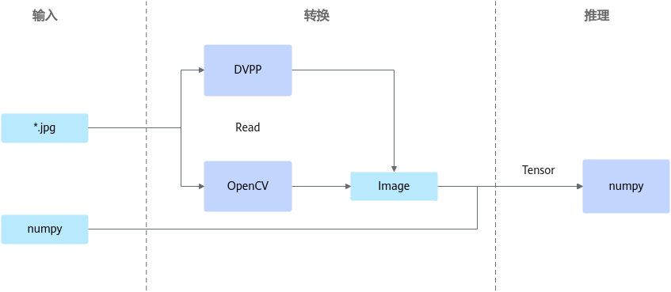

# API接口参考（Python）<a name="ZH-CN_TOPIC_0000001860120329"></a>

## 使用须知<a name="ZH-CN_TOPIC_0000001813200964"></a>

> [!NOTICE] 须知
>-   本章节开放的类，请遵循同一个类实例在单一线程中使用的原则，请勿将同一个类实例在不同的线程中使用。
>-   请注意输入为集合数据类型的函数，应基于性能和实际业务需求限制长度，以防止可能出现的内存问题。
>-   传入接口内的JSON相关内容中请勿包含注释，否则会引起解析失败。
>-   若JSON相关内容中单个object存在key值相同键值对，接口将默认保留最后一组键值对作为解析结果。
>-   使用Python数据结构以及方法前，请确保已导入正确的模块。
>-   本章节中重载函数（如[SendData](#senddata)）或函数中有默认值（如[get\_result](#get_result)）时，函数中的参数名仅是为了方便描述参数含义而定义，实际函数的入参定义为\*args，请用户传参时不要指定参数名。

**Python推理数据流程图<a name="section191744017012"></a>**

**图 1**  推理数据流图<a name="fig1839111481406"></a>  



## 依赖列表说明<a name="ZH-CN_TOPIC_0000001813201084"></a>

**表 1**  依赖列表

|依赖名称|用途|
|--|--|
|Tensor|与Numpy数据转换，Host/Device转换，Python模型推理的输入输出统一结构。|
|Image|是DVPP输入输出统一结构，能转换为Tensor。|
|Model|用于模型加载推理|
|ImageProcessor|图像处理类，主要开放图像编解码、缩放和抠贴图等接口。|
|VideoDecoder|视频解码类，主要开放视频解码接口。|
|dvpp|含DVPP图像解码读取和缩放功能，即将废弃，建议使用ImageProcessor类。|
|log|用于不同级别的日志打印。|
|post|包含多种模型后处理类（ResNet-50、YoloV3等）。|


依赖使用方法如下：

```
from mindx.sdk import base
from mindx.sdk.base import Image, Model, ImageProcessor, Size, post
```


## Python枚举类型及数据类<a name="ZH-CN_TOPIC_0000001860120217"></a>

### 通用枚举类型/数据类<a name="ZH-CN_TOPIC_0000001813200736"></a>

#### 总体说明<a name="ZH-CN_TOPIC_0000001852384876"></a>

本章节数据类仅展示其属性，相关函数不予以全部展示。

本章节的数据类由swig生成，某些数据类型仅展示了部分业务相关接口，具体请参考base.py、post.py、log.py和dvpp.py。需要注意的是，swig框架会自动生成SwigPyIterator等对内使用类和函数，建议不要使用。


#### 基本数据枚举类型<a name="ZH-CN_TOPIC_0000001813360152"></a>

**表 1**  数据格式枚举类型

|数据类型|说明|
|--|--|
|base.undefined|未定义类型。|
|base.int8|int8类型。|
|base.uint8|uint8类型。|
|base.int16|int16类型。|
|base.uint16|uint16类型。|
|base.int32|int32类型。|
|base.uint32|uint32类型。|
|base.int64|int64类型。|
|base.uint64|uint64类型。|
|base.float16|float16类型。|
|base.float32|float32类型。|
|base.double|double类型。|
|base.bool|bool类型。|


#### AttributeInfo类<a name="ZH-CN_TOPIC_0000001813201412"></a>

**表 1**  AttributeInfo类属性说明

|属性名|类型|说明|
|--|--|--|
|attrId|int|属性ID。|
|attrName|str|属性名。|
|attrValue|str|属性值。|
|confidence|float|置信度。|


> [!NOTE] 说明 
>该类重写了\_\_str\_\_和\_\_repr\_\_方法，用于展示对象信息，建议用户不要直接调用。


#### borderType补边方式枚举类型<a name="ZH-CN_TOPIC_0000001860001061"></a>

**表 1**  补边方式格式类型

|参数名|说明|
|--|--|
|base.border_constant|添加有颜色的常数值边界。|
|base.border_replicate|重复最后一个元素。例如：aaaaaa|a*****h|hhhhhhh（其中*表示任意图像元素）。|
|base.border_reflect|边界元素的镜像，镜像包括边界元素。例如：ba|abc*******fgh|hg（其中*表示任意图像元素）。|
|base.border_reflect_101|边界元素的镜像，镜像不包括边界元素。例如：cb|abc****fgh|gf（其中*表示任意图像元素）。|


#### BufferInput类<a name="ZH-CN_TOPIC_0000001813200488"></a>

**表 1**  BufferInput类属性说明

|属性名|类型|说明|
|--|--|--|
|data|str|图片数据。|
|frame_info|str|帧信息。|
|vision_info|str|图片信息。|


#### BufferOutput类<a name="ZH-CN_TOPIC_0000001813200784"></a>

|属性名|类型|说明|
|--|--|--|
|error_code|int|错误码。|
|error_msg|str|错误信息。|
|data|str|输出结果。|
|get_byte_data()|函数，返回byte类型数据|该函数用来返回二进制数据，也可以返回正常的推理结果。|


#### ClassInfo类<a name="ZH-CN_TOPIC_0000001860121213"></a>

**表 1**  ClassInfo类属性说明

|属性名|类型|说明|
|--|--|--|
|classId|int|类ID。|
|className|str|类名。|
|confidence|float|置信度。|


> [!NOTE] 说明 
>该类重写了\_\_str\_\_和\_\_repr\_\_方法，用于展示对象信息，建议用户不要直接调用。


#### Color类<a name="ZH-CN_TOPIC_0000001813361012"></a>

|参数|类型|说明|
|--|--|--|
|channel_zero|int|0通道取值，范围[0, 255]。|
|channel_one|int|1通道取值，范围[0, 255]。|
|channel_two|int|2通道取值，范围[0, 255]。|


#### CropRoiBox类<a name="ZH-CN_TOPIC_0000002513840185"></a>

|属性名|类型|说明|
|--|--|--|
|x0|float|左上角横坐标。|
|y0|float|左上角纵坐标。|
|x1|float|右下角横坐标。|
|y1|float|右下角纵坐标。|


#### DataOutput类<a name="ZH-CN_TOPIC_0000001813200676"></a>

|属性名|类型|说明|
|--|--|--|
|error_code|int|错误码。|
|error_msg|str|错误信息。|
|buffer_output|BufferOutput|一般类型的输出结果。|
|metadata_list|List[MetadataOutput]|protobuf类型的输出结果。|
|set_error_info(int, str)|函数，无返回值|设置错误信息。|


#### Dim类<a name="ZH-CN_TOPIC_0000001813360312"></a>

|参数|类型|说明|
|--|--|--|
|left|int|左侧补边像素数量。|
|right|int|右侧补边像素数量。|
|top|int|上方补边像素数量。|
|bottom|int|下方补边像素数量。|


#### dtype类<a name="ZH-CN_TOPIC_0000001860001389"></a>

|属性名|对应类型|
|--|--|
|dtype.int8|int8类型。|
|dtype.uint8|uint8类型。|
|dtype.int16|int16类型。|
|dtype.uint16|uint16类型。|
|dtype.int32|int32类型。|
|dtype.uint32|uint32类型。|
|dtype.int64|int64类型。|
|dtype.uint64|uint64类型。|
|dtype.float16|float16类型。|
|dtype.float32|float32类型。|
|dtype.double|double类型。|
|dtype.bool|bool类型。|
|dtype.undefined|未定义类型。|


#### KeyPointDetectionInfo类<a name="ZH-CN_TOPIC_0000001860000701"></a>

**表 1**  KeyPointDetectionInfo类属性说明

|属性名|类型|说明|
|--|--|--|
|keyPointMap|dict|每个关键点的坐标等信息。|
|scoreMap|dict|每个关键点对应的置信度。|
|score|float|整体置信度。|


> [!NOTE] 说明
>该类重写了\_\_str\_\_和\_\_repr\_\_方法，用于展示对象信息，建议用户不要直接调用。


#### image.format类<a name="ZH-CN_TOPIC_0000001813360340"></a>

**表 1**  image.format类属性说明

|属性名|类型|
|--|--|
|image.format.nv12|NV12格式类型。|
|image.format.nv21|NV21格式类型。|
|image.format.bgr|BGR888格式类型。|
|image.format.rgb|RGB888格式类型。|


#### image\_format图片格式枚举类型<a name="ZH-CN_TOPIC_0000001860001233"></a>

**表 1**  图像格式类型

|内存类型|说明|
|--|--|
|base.yuv_400|YUV_400 的图像格式。|
|base.nv12|YUV_SP_420 的图像格式。|
|base.nv21|YVU_SP_420 的图像格式。|
|base.yuv_sp_422|YUV_SP_422 的图像格式。|
|base.yvu_sp_422|YVU_SP_422 的图像格式。|
|base.yuv_sp_444|YUV_SP_444 的图像格式。|
|base.yvu_sp_444|YVU_SP_444 的图像格式。|
|base.yuyv_packed_422|YUYV_PACKED_422 的图像格式。|
|base.uyvy_packed_422|UYVY_PACKED_422 的图像格式。|
|base.yvyu_packed_422|YVYU_PACKED_422 的图像格式。|
|base.vyuy_packed_422|VYUY_PACKED_422 的图像格式。|
|base.yuv_packed_444|YUV_PACKED_444 的图像格式。|
|base.bgr|BGR_888的图像格式。|
|base.rgb|RGB_888的图像格式。|
|base.argb|ARGB_8888 的图像格式。|
|base.abgr|ABGR_8888 的图像格式。|
|base.rgba|RGBA_8888 的图像格式。|
|base.bgra|BGRA_8888 的图像格式。|


#### interpolation缩放方式格式枚举类型<a name="ZH-CN_TOPIC_0000001860000945"></a>

**表 1**  缩放方式格式类型

|参数名|说明|
|--|--|
|base.huaweiu_high_order_filter|华为自研的高阶滤波算法（在Atlas 推理系列产品上，此选项等同于BILINEAR_SIMILAR_OPENCV）。|
|base.bilinear_similar_opencv|业界通用的Bilinear算法（与OpenCV算法的计算过程类似）。|
|base.nearest_neighbor_opencv|业界通用的Nearest Neighbor算法（与OpenCV算法的计算过程类似）。|
|base.bilinear_similar_tensorflow|业界通用的Bilinear算法（与TensorFlow算法的计算过程类似，在Atlas 推理系列产品上，不支持此选项）。|
|base.nearestneighbor_tensorflow|业界通用的Nearest Neighbor算法（与TensorFlow算法的计算过程类似，在Atlas 推理系列产品上，不支持此选项）。|


#### MetadataInput类<a name="ZH-CN_TOPIC_0000001860001301"></a>

|属性名|类型|说明|
|--|--|--|
|data_source|str|源字段。|
|data_type|str|protobuf数据类型。|
|serialized_metadata|str|protobuf数据的序列化表示。|


#### MetadataOutput类<a name="ZH-CN_TOPIC_0000001813361248"></a>

|属性名|类型|说明|
|--|--|--|
|error_code|int|错误码。|
|error_msg|str|错误信息。|
|data_type|str|protobuf数据类型。|
|serialized_metadata|str|protobuf数据的序列化表示。|
|set_error_info(int, str)|函数，无返回值|设置错误信息。|
|get_byte_data()|函数，返回byte类型数据|该函数用于返回byte类型的protobuf数据序列化表示。|


#### ModelLoadOptV2类<a name="ZH-CN_TOPIC_0000001860120521"></a>

> [!NOTICE] 须知
>请根据实际情况选择对应配置，如配置与实际输入存在差异，会在[Model](#model)处抛出**RuntimeError**。

**表 1**  模型加载选项

|属性名|类型|说明|
|--|--|--|
|modelType|ModelType枚举类型|推理模型类型，支持情况参见如下。（默认为base.model_type_om。）<li>base.model_type_om<li>base.model_type_mindir（对于MindIR模型，仅支持静态Shape和动态Batch。）|
|loadType|ModelLoadType枚举类型|推理模型输入类型，可通过以下参数选定输入方式。（默认为base.load_model_from_file。）<li>base.load_model_from_file：从文件加载离线模型数据，由系统内部管理内存。<li>base.load_model_from_file_with_mem：从文件加载离线模型数据，由用户自行管理模型运行的内存（包括工作内存和权值内存，工作内存用于模型执行过程中的临时数据，权值内存用于存放权值数据）。<li>base.load_model_from_mem：从内存加载离线模型数据，由系统内部管理内存。<li>base.load_model_from_mem_with_mem：从内存加载离线模型数据，由用户自行管理模型运行的内存（包括工作内存和权值内存）。<li>当modelType为base.model_type_mindir时，仅支持base.load_model_from_file和base.load_model_from_mem两种输入类型。|
|modelPath|str|推理模型文件路径，仅在以下模式生效。（默认为""，最大只支持至4GB大小的模型且要求模型属主为当前用户，模型文件的权限应小于或等于640。）<li>base.load_model_from_file<li>base.load_model_from_file_with_mem|
|modelPtr|int|推理模型所在内存地址，仅在以下模式生效。（默认为0，用户需根据实际情况输入内存地址。）<li>base.load_model_from_mem<li>base.load_model_from_mem_with_mem|
|modelSize|int|推理模型数据长度，单位Byte，仅在以下模式生效。（默认为0，最大只支持至4GB大小的模型。）<li>base.load_model_from_mem<li>base.load_model_from_mem_with_mem|
|modelWorkPtr|int|推理模型所在工作内存地址，仅在以下模式生效。（默认为0，表示由系统管理内存。）<li>base.load_model_from_file_with_mem<li>base.load_model_from_mem_with_mem|
|modelWeightPtr|int|推理模型权值内存地址，仅在以下模式生效。（默认为0，表示由系统管理内存。）<li>base.load_model_from_file_with_mem<li>base.load_model_from_mem_with_mem|
|workSize|int|推理模型所在工作内存大小，单位Byte。（默认为0，当modelWorkPtr为0时无效。）|
|weightSize|int|推理模型权值内存大小，单位Byte。（默认为0，当modelWeightPtr为0时无效。）|


#### ModelLoadType模型加载方式枚举类型<a name="ZH-CN_TOPIC_0000001813361212"></a>

**表 1**  模型加载方式

|参数名|说明|
|--|--|
|base.load_model_from_file|从文件加载离线模型数据，由系统内部管理内存。|
|base.load_model_from_mem|从内存加载离线模型数据，由系统内部管理内存。|
|base.load_model_from_file_with_mem|从文件加载离线模型数据，由用户自行管理模型运行的内存。|
|base.load_model_from_mem_with_mem|从内存加载离线模型数据，由用户自行管理模型运行的内存。|


#### ModelType模型枚举类型<a name="ZH-CN_TOPIC_0000001813200752"></a>

**表 1**  模型类型

|参数名|说明|
|--|--|
|base.model_type_om|OM模型。|
|base.model_type_mindir|MindIR模型。（对于MindIR模型，仅支持静态Shape和动态Batch。）|


#### MxDataInput类<a name="ZH-CN_TOPIC_0000001860001433"></a>

|属性名|类型|说明|
|--|--|--|
|data|str|图片数据。|
|fragmentId|int|分块ID。|
|customParam|str|自定义的参数。|
|roiBoxs|List[float]|裁剪框坐标数组，[x0,y0,x1,x1]。|


#### MxDataOutput类<a name="ZH-CN_TOPIC_0000001813200588"></a>

|属性名|类型|说明|
|--|--|--|
|errorCode|int|返回的错误码，0为成功。|
|dataSize|int|数据大小。|
|data|str|推理结果。|


#### visionDataFormat图像数据格式排布枚举类型<a name="ZH-CN_TOPIC_0000001813360548"></a>

**表 1**  图像数据格式排布形式

|排布形式|说明|
|--|--|
|NCHW|图像数据按NCHW格式排布。|
|NHWC|图像数据按NHWC格式排布。|


#### StreamFormat视频流数据格式枚举类型<a name="ZH-CN_TOPIC_0000001860000261"></a>

**表 1**  视频流数据格式类型

|参数名|说明|
|--|--|
|base.h265_main_level|**H.265** 格式视频流，**主流画质**。|
|base.h264_baseline_level|**H.264** 格式视频流，**基本画质**。|
|base.h264_main_level|**H.264** 格式视频流，**主流画质**。|
|base.h264_high_level|**H.264** 格式视频流，**高级画质**。|


#### ObjectInfo类<a name="ZH-CN_TOPIC_0000001813360912"></a>

**表 1**  ObjectInfo类属性说明

|属性名|类型|说明|
|--|--|--|
|classId|float|类ID。|
|className|str|类名。|
|confidence|float|置信度。|
|mask|list|mask列表。|
|x0|float|左上角x坐标。|
|x1|float|右下角x坐标。|
|y0|float|左上角y坐标。|
|y1|float|右下角y坐标。|


> [!NOTE] 说明 
>该类重写了\_\_str\_\_和\_\_repr\_\_方法，用于展示对象信息，建议用户不要直接调用。


#### Point类<a name="ZH-CN_TOPIC_0000001860120541"></a>

|参数|类型|说明|
|--|--|--|
|x|int|横坐标（以图像左上角为原点）。|
|y|int|纵坐标（以图像左上角为原点）。|


#### Rect类<a name="ZH-CN_TOPIC_0000001860001141"></a>

|参数|类型|说明|
|--|--|--|
|x0|int|矩形框左上角坐标的**横坐标**。|
|y0|int|矩形框左上角坐标的**纵坐标**。|
|x1|int|矩形框右下角坐标的**横坐标**。|
|y1|int|矩形框右下角坐标的**纵坐标**。|


#### ResizedImageInfo类<a name="ZH-CN_TOPIC_0000001860001101"></a>

**表 1**  ResizedImageInfo类属性说明

|属性名|类型|说明|
|--|--|--|
|heightOriginal|int|原图的高度。|
|heightResize|int|resize后的高度。|
|resizeType|ResizeType|resize类型。|
|widthOriginal|int|原图的宽度。|
|widthResize|int|resize后的宽度。|
|keepAspectRatioScaling|float|缩放比例。|


> [!NOTE] 说明 
>该类重写了\_\_str\_\_和\_\_repr\_\_方法，用于展示对象信息，建议用户不要直接调用。


#### ResizeType类<a name="ZH-CN_TOPIC_0000001860121169"></a>

**表 1**  ResizeType类属性说明

|属性名|类型|说明|
|--|--|--|
|RESIZER_MS_KEEP_ASPECT_RATIO|ResizeType 枚举类型。|基于MindSpore的等比率缩放。|
|RESIZER_STRETCHING|ResizeType 枚举类型。|拉伸缩放。|
|RESIZER_TF_KEEP_ASPECT_RATIO|ResizeType 枚举类型。|基于TensorFlow的等比率缩放。|


#### Resize缩放枚举类型<a name="ZH-CN_TOPIC_0000001813361340"></a>

**表 1**  Resize参数类型说明

|参数类型|说明|
|--|--|
|base.resize_ms_keep_ratio|ResizeType.RESIZER_MS_KEEP_ASPECT_RATIO。|
|base.resize_stretching|ResizeType.RESIZER_STRETCHING。|
|base.resize_tf_keep_ratio|ResizeType.RESIZER_TF_KEEP_ASPECT_RATIO。|


#### SemanticSegInfo类<a name="ZH-CN_TOPIC_0000001860000297"></a>

**表 1**  SemanticSegInfo类属性说明

|属性名|类型|说明|
|--|--|--|
|pixels|list|像素集。|
|labelMap|list|标签映射。|


> [!NOTE] 说明
>该类重写了\_\_str\_\_和\_\_repr\_\_方法，用于展示对象信息，建议用户不要直接调用。


#### Size类<a name="ZH-CN_TOPIC_0000001813360500"></a>

|参数|类型|说明|
|--|--|--|
|width|int|图像宽。|
|height|int|图像高。|


#### TextObjectInfo类<a name="ZH-CN_TOPIC_0000001860121121"></a>

**表 1**  TextObjectInfo类属性说明

|属性名|类型|说明|
|--|--|--|
|confidence|float|置信度。|
|result|str|结果。|
|x0|float|第一检测点的x坐标。|
|x1|float|第二检测点的x坐标。|
|x2|float|第三检测点的x坐标。|
|x3|float|第四检测点的x坐标。|
|y0|float|第一检测点的y坐标。|
|y1|float|第二检测点的y坐标。|
|y2|float|第三检测点的y坐标。|
|y3|float|第四检测点的y坐标。|


> [!NOTE] 说明 
>该类重写了\_\_str\_\_和\_\_repr\_\_方法，用于展示对象信息，建议用户不要直接调用。


#### TextsInfo类<a name="ZH-CN_TOPIC_0000001860120453"></a>

**表 1**  TextsInfo类属性说明

|属性名|类型|说明|
|--|--|--|
|text|数组|text内容。|


> [!NOTE] 说明 
>该类重写了\_\_str\_\_和\_\_repr\_\_方法，用于展示对象信息，建议用户不要直接调用。


#### type类<a name="ZH-CN_TOPIC_0000001860001045"></a>

**表 1**  type类属性说明

|属性名|类型|
|--|--|
|type.memory_host|Host侧内存类型。|
|type.memory_device|Device侧内存类型。|
|type.memory_dvpp|DVPP内存类型。|


#### VideoDecodeConfig类<a name="ZH-CN_TOPIC_0000001860121153"></a>

**表 1**  保存视频解码的类

|参数名|类型|说明|
|--|--|--|
|width|int|视频解码缓冲区的宽，取值范围：[128, 4096]，默认值：1920，必须为偶数。并且会自动对齐到16（向上对齐）。<br>请用户根据实际的视频帧数据进行适当设置，需大于或等于实际的视频帧数据宽，否则会无解码输出，设置过大将会产生多余的内存资源开销。|
|height|int|视频解码缓冲区的高，取值范围：[128, 4096]，默认值：1080，必须输入偶数。<br>请用户根据实际的视频帧数据进行适当设置，需大于或等于实际的视频帧数据高，否则会无解码输出，设置过大将会产生多余的内存资源开销。|
|inputVideoFormat|StreamFormat枚举类|输入的视频格式，H.264格式视频支持base.h264_baseline_level、base.h264_main_level、base.h264_high_level三种格式，H.265格式视频只支持base.h265_main_level格式。默认值为：base.h264_main_level。|
|outputImageFormat|image_format枚举类|解码后输出的图像格式，默认值为：base.nv12。<li>Atlas 200I/500 A2 推理产品环境只支持base.nv12、base.nv21、base.rgb和base.bgr四种格式。<li>Atlas 推理系列产品环境只支持base.nv12、base.nv21、base.rgb和base.bgr四种格式|
|skipInterval|int|视频解码的跳帧参数，取值范围：[0, 250]，默认值：0。|


#### VideoEncodeConfig类<a name="ZH-CN_TOPIC_0000001813201616"></a>

|参数名|类型|说明|
|--|--|--|
|width|int|编码后视频帧数据的宽，默认值：1920，必须与待编码图片的宽（original_width）一致。<li>Atlas 200I/500 A2 推理产品，取值范围：[114, 8192]，输入的视频宽需要对齐2。<li>Atlas 推理系列产品，取值范围：[128, 4096]，输入的视频宽需要对齐2。视频编码的最大分辨率（宽 * 高）不能超过4096 * 2304。|
|height|int|编码后视频帧数据的高，默认值：1080，必须与待编码图片的高（original_height）一致。<li>Atlas 200I/500 A2 推理产品，取值范围：[114, 8192]，输入的视频高需要对齐2。<li>Atlas 推理系列产品，取值范围：[128, 4096]，输入的视频高需要对齐2。视频编码的最大分辨率（宽 * 高）不能超过4096 * 2304。|
|outputVideoFormat|StreamFormat枚举类|编码后输出的视频格式，H.264格式视频支持base.h264_baseline_level、base.h264_main_level和base.h264_high_level三种格式，H.265格式视频只支持base.h265_main_level格式。默认值为base.h264_main_level。|
|inputImageFormat|image_format枚举类|输入的图像格式，只支持base.nv12、base.nv21两种格式，默认值为：base.nv12。|
|keyFrameInterval|int|视频I帧间隔大小，默认为30。<li>Atlas 200I/500 A2 推理产品，取值范围：[1, 65536]。<li>Atlas 推理系列产品，取值范围：[1, 65536]。|
|srcRate|int|输入码流帧率，单位fps，默认为30。Atlas 200I/500 A2 推理产品，取值范围：[1, 240]。Atlas 推理系列产品，取值范围：[1, 240]。|
|rcMode|int|对于Atlas 200I/500 A2 推理产品：<li>0：使用默认值，即VBR模式<li>1：VBR模式<li>2：CBR模式<br>对于Atlas 推理系列产品：<li>0或者1：CBR模式<li>2：VBR模式<li>3：AVBR模式<li>4：QVBR模式<li>5：CVBR模式|
|shortTermStatsTime|int|码率短期统计时间，单位为秒，默认值为60，取值范围：[1, 120]。该参数仅在Atlas 推理系列产品上，且rcMode为5时生效。|
|longTermStatsTime|int|码率长期统计时间，单位为分钟，默认值为120，取值范围：[1, 1440]。该参数仅在Atlas 推理系列产品上，且rcMode为5时生效。|
|longTermMaxBitRate|int|编码器输出长期最大码率，单位为kbps，默认值为300。取值范围：[2, maxBitRate]。该参数仅在Atlas 推理系列产品上，且rcMode为5时生效。|
|longTermMinBitRate|int|编码器输出长期最小码率，单位为kbps，默认值为0。取值范围：[0, longTermMaxBitRate]。该参数仅在Atlas 推理系列产品上，且rcMode为5时生效。|
|maxBitRate|int|输出码率，单位kbps，默认值为300。<li>Atlas 200I/500 A2 推理产品，取值范围：[2, 614400]。<li>Atlas 推理系列产品，取值范围：[2, 614400]。|
|ipProp|int|一个GOP内单个I帧bit数和单个P帧bit数的比例，默认值为70，取值范围[1, 100]。|
|sceneMode|int|场景模式。默认值为0。<li>0：摄像机不运动或周期性连续运动的场景，支持H.264/H.265。<li>1：高码率下运动场景，支持H.265。<br>该参数仅在Atlas 推理系列产品上生效。当输出视频格式设置为H.264并且sceneMode设置为1时，由于H.264不支持高码率下运动场景，sceneMode值将自动切换成0。|
|displayRate|int|输出视频的播放帧率，默认值为30，取值范围[1, 120]。该参数仅在Atlas 推理系列产品上生效。|
|statsTime|int|码率统计时间，以秒为单位，默认值为1，取值范围：[1, 60]。该参数仅在Atlas 推理系列产品上生效。|
|firstFrameStartQp|int|设置第一帧的起始Qp值，默认值为32，取值范围：[0, 47]。该参数仅在Atlas 推理系列产品上生效。|
|SetThresholdI|func|用于设置I帧宏块级码率控制的Madi（用于度量当前帧的空域纹理复杂度）门限。参数说明请参见SetThresholdI参数说明。该参数仅在Atlas 推理系列产品上生效。|
|SetThresholdP|func|用于设置P帧宏块级码率控制的Madi（用于度量当前帧的空域纹理复杂度）门限。参数说明请参见SetThresholdP参数说明。该参数仅在Atlas 推理系列产品上生效。|
|SetThresholdB|func|用于设置B帧宏块级码率控制的Madi（用于度量当前帧的空域纹理复杂度）门限。参数说明请参见SetThresholdB参数说明。该参数仅在Atlas 推理系列产品上生效。|
|direction|int|在基于纹理宏块级码率控制时，用于控制加减方向。默认值为8，取值范围：[0, 16]。该参数仅在Atlas 推理系列产品上生效。|
|rowQpDelta|int|行级码率控制调节幅度是一帧内行级调节的最大范围，其中行级以宏块行为单位。调节幅度越大，允许行级调整的QP范围越大，码率越平稳。对于图像复杂度分布不均匀的场景，行级码率控制调节幅度设置过大会带来图像质量不均匀。默认值为1，取值范围：[0, 10]，设置为0表示关闭基于行的宏块级码率控制。该参数仅在Atlas 推理系列产品上生效。|


**SetThresholdI参数说明<a name="section11435162211470"></a>**

|参数名|类型|说明|
|--|--|--|
|threshold_i|list|list中值的取值范围：[0,255]。如果不通过此函数设置thresholdI的值，thresholdI默认值为[0, 0, 0, 0, 0, 0, 0, 0, 255, 255, 255, 255, 255, 255, 255, 255]。<be>减方向的数值设置为0，表示关闭当前级；加方向的数值设置为255，表示关闭当前级。|


**SetThresholdP参数说明<a name="section5799848184713"></a>**

|参数名|类型|说明|
|--|--|--|
|threshold_p|list|list中值的取值范围：[0,255]。如果不通过此函数设置thresholdP的值，thresholdP默认值为[0, 0, 0, 0, 0, 0, 0, 0, 255, 255, 255, 255, 255, 255, 255, 255]。<br>减方向的数值设置为0，表示关闭当前级；加方向的数值设置为255，表示关闭当前级。|


**SetThresholdB参数说明<a name="section1569265414717"></a>**

|参数名|类型|说明|
|--|--|--|
|threshold_b|list|list中值的取值范围：[0,255]。如果不通过此函数设置thresholdB的值，thresholdB默认值为[0, 0, 0, 0, 0, 0, 0, 0, 255, 255, 255, 255, 255, 255, 255, 255]。<br>减方向的数值设置为0，表示关闭当前级；加方向的数值设置为255，表示关闭当前级。|


**推荐配置<a name="section106092517497"></a>**

以下为视频采集场景下推荐的参数配置，可以保证较好的视频编码质量，其他场景下请根据实际应用对应调整。

|画质/分辨率|srcRate|keyFrameInterval|maxBitRate|
|--|--|--|--|
|4K3840 * 2160/4096 * 2160|25或30|50或60|H.264： 8000 ~ 12000<br>H.265： 8000 ~ 12000|
|2K2560 * 1440|25或30|50或60|H.264： 6000 ~ 10000<br>H.265： 6000 ~ 10000|
|1080P（蓝光）1920 * 1080|25或30|50或60|H.264： 2000~6000<br>H.265： 1000~4000|
|720P（高清）1280 * 720|25或30|50或60|H.264： 1000~3000<br>H.265： 800~2000|
|480P/D1_N（标清）854 * 480/720 * 480|25或30|50或60|H.264： 600~1400<br>H.265： 300~700|
|576P/D1   （标清）720 * 576|25或30|50或60|H.264： 600~1400<br>H.265： 300~700|
|270P（流畅）480 * 270|25或30|50或60|-|
|CIF P/N352 * 288/320 * 240|25或30|50或60|H.264： 250<br>H.265： 250|


#### AppGlobalCfgExtra类<a name="ZH-CN_TOPIC_0000002164133849"></a>

|属性名|类型|说明|
|--|--|--|
|vpcChnNum|int|VPC通道资源池大小。默认值为“DEFAULT_VPC_CHN_NUM = 48”。取值范围为[1, 128]。|
|jpegdChnNum|int|JPEGD通道资源池大小。默认值为“DEFAULT_JPEGD_CHN_NUM = 24”。取值范围为[1, 64]。|
|pngdChnNum|int|PNGD通道资源池大小。默认值为“DEFAULT_JPEGD_CHN_NUM = 24”。取值范围为[1, 64]。|
|jpegeChnNum|int|JPEGE通道资源池大小。默认值为“DEFAULT_JPEGE_CHN_NUM = 24”。取值范围为[1, 48]。|


#### cvt\_color\_mode色域转换枚举类型<a name="ZH-CN_TOPIC_0000002287916997"></a>

**表 1**  色域转换类型

|数据类型|说明|
|--|--|
|base.color_yuvsp4202gray|色域空间由YUVsp420转换为灰度图。|
|base.color_yvusp4202gray|色域空间由YVUSP420转换为灰度图。|
|base.color_yuvsp4202rgb|色域空间由YUVsp420转换为RGB。|
|base.color_yvusp4202rgb|色域空间由YVUSP420转换为RGB。|
|base.color_yuvsp4202bgr|色域空间由YUVsp420转换为BGR。|
|base.color_yvusp4202bgr|色域空间由YVUSP420转换为BGR。|
|base.color_rgb2gray|色域空间由RGB转换为灰度图。|
|base.color_bgr2gray|色域空间由BGR转换为灰度图。|
|base.color_bgr2rgb|色域空间由BGR转换为RGB。|
|base.color_rgb2bgr|色域空间由RGB转换为BGR。|
|base.color_rgb2rgba|色域空间由RGB转换为RGBA。|
|base.color_rgba2gray|色域空间由RGBA转换为灰度图。|
|base.color_rgba2rgb|色域空间由RGBA转换为RGB。|
|base.color_gray2rgb|色域空间由灰度图转换为RGB。|
|base.color_rgba2mrgba|色域空间由RGBA转换为mRGBA。|
|base.color_bgr2yuvsp420|色域空间由BGR转换为YUVsp420。|
|base.color_rgb2yuvsp420|色域空间由RGB转换为YUVsp420。|
|base.color_rgb2yvusp420|色域空间由RGB转换为YVUSP420。|
|base.color_bgr2yvusp420|色域空间由BGR转换为YVUSP420。|


### 流程编排数据类<a name="ZH-CN_TOPIC_0000001813201220"></a>

#### 总体说明<a name="ZH-CN_TOPIC_0000001897710465"></a>

本章节的数据类由swig生成，某些数据类型仅展示了部分业务相关接口，具体请参考“StreamManagerApi.py”和“stream.py”。需要注意的是，swig框架会自动生成SwigPyIterator等对内使用类和函数，建议不要使用。


#### RoiBox<a name="ZH-CN_TOPIC_0000001860121105"></a>

**功能<a name="section114991545192618"></a>**

裁剪框的定义。

**结构定义<a name="section25001045122620"></a>**

```
class RoiBox:
    def __init__(self):
        self.x0 = None
        self.y0 = None
        self.x1 = None
        self.y1 = None
```

**参数说明<a name="section750144552616"></a>**

|参数名|类型|说明|
|--|--|--|
|x0|float|左上角横坐标。|
|y0|float|左上角纵坐标。|
|x1|float|右下角横坐标。|
|y1|float|右下角纵坐标。|


#### RoiBoxVector<a name="ZH-CN_TOPIC_0000001860120365"></a>

**功能<a name="section114991545192618"></a>**

RoiBox的Vector类，实现了Vector的通用操作。

**结构定义<a name="section25001045122620"></a>**

由swig生成，仅展示部分业务相关接口，具体请参考“StreamManagerApi.py“。

```
class RoiBoxVector:
    def push_back(self, x):
        pass
    def pop_back(self):
        pass
    def pop(self):
        pass
    ...
```


#### MxDataInput<a name="ZH-CN_TOPIC_0000001813361332"></a>

**功能<a name="section11948154152710"></a>**

Stream接收的数据结构定义。

**结构定义<a name="section39491416276"></a>**

```
class MxDataInput :
    def __init__(self):
        self.data = None
        self.fragmentId = None
        self.customParam = None
        self.roiBoxs = list()  # list
```

**参数说明<a name="section696418462715"></a>**

|参数名|类型|说明|
|--|--|--|
|data|bytes|图像数据。|
|fragmentId|int|分块ID，保留参数。|
|customParam|bytes|自定义的参数，保留参数。|
|roiBoxs|RoiBoxVector|裁剪框坐标数组。|


#### MxDataOutput<a name="ZH-CN_TOPIC_0000001813201184"></a>

**功能<a name="section311231782712"></a>**

推理业务输出数据定义。

**结构定义<a name="section12113617142717"></a>**

```
class MxDataOutput:
    def __init__(self):
        self.errorCode = None
        self.data = None
```

**参数说明<a name="section5116121714275"></a>**

|参数名|类型|说明|
|--|--|--|
|errorCode|int|输出错误码。|
|data|bytes|输出结果数据。|


#### MxProtobufIn<a name="ZH-CN_TOPIC_0000001860121305"></a>

**功能<a name="section311231782712"></a>**

推理业务输入protobuf数据定义。

**结构定义<a name="section12113617142717"></a>**

```
class MxProtobufIn:
    def __init__(self):
        self.key= None
        self.type= None
        self.protobuf= None
```

**参数说明<a name="section5116121714275"></a>**

|参数名|类型|说明|
|--|--|--|
|key|bytes|输入protobuf的key。|
|type|bytes|输入protobuf数据的类型。|
|protobuf|bytes|输入protobuf的value数据，需要反序列化为与类型对应的数据。|


#### MxProtobufOut<a name="ZH-CN_TOPIC_0000001813201300"></a>

**功能<a name="section311231782712"></a>**

推理业务输出数据定义。

**结构定义<a name="section12113617142717"></a>**

```
class MxProtobufOut:
    def __init__(self):
        self.errorCode = None
        self.messageName= None
        self.messageBuf= None
```

**参数说明<a name="section5116121714275"></a>**

|参数名|类型|说明|
|--|--|--|
|errorCode|int|输出错误码。|
|messageName|bytes|输出protobuf数据的key。|
|messageBuf|bytes|输出protobuf数据的value，需要反序列化为与类型对应的数据。|


#### MxDataInputExt<a name="ZH-CN_TOPIC_0000001860120081"></a>

**功能<a name="section311231782712"></a>**

推理业务输出数据定义。

**结构定义<a name="section12113617142717"></a>**

```
class MxDataInputExt :
    def __init__(self):
        self.data = None
        self.fragmentId = None
        self.customParam = None
        self.roiBoxs = list()  # list
        self.mxpiFrameInfo = None
        self.mxpiVisionInfo = None
```

**参数说明<a name="section5116121714275"></a>**

|参数名|类型|说明|
|--|--|--|
|data|bytes|图像数据。|
|fragmentId|int|分块ID，保留参数。|
|customParam|bytes|自定义的参数，保留参数。|
|roiBoxs|RoiBoxVector|裁剪框坐标数组。|
|mxpiFrameInfo|bytes|图片的frame信息序列化成字符串。|
|mxpiVisionInfo|bytes|图片信息序列化成字符串。|


#### MxMetadataInput<a name="ZH-CN_TOPIC_0000001813201004"></a>

**功能<a name="section311231782712"></a>**

Stream接收的元数据的数据定义。

**结构定义<a name="section12113617142717"></a>**

```
class MxMetadataInput:
    def __init__(self):
        self.datasource = None
        self.dataType = None
        self.serializedMetadata = None
```

**参数说明<a name="section20488184215103"></a>**

|参数名|类型|说明|
|--|--|--|
|datasource|bytes|挂载元数据时使用的dataSource，用于下游插件获取元数据。|
|dataType|bytes|元数据的数据类型。|
|serializedMetadata|bytes|序列化的元数据。|


#### MxMetadataOutput<a name="ZH-CN_TOPIC_0000001813201424"></a>

**功能<a name="section1098591013192"></a>**

Stream输出的元数据的数据定义。

**结构定义<a name="section1660131611196"></a>**

```
class MxMetadataOutput:
    def __init__(self):
        self.errorCode = None
        self.errorMsg = None
        self.dataType= None
        self.serializedMetadata = None
    def SetErrorInfo(self, errorCodeIn, errorMsgIn):
        pass
```

**参数说明<a name="section1652151917197"></a>**

|参数名|类型|说明|
|--|--|--|
|errorCode|int|输出错误码。|
|errorMsg|bytes|输出错误信息。|
|dataType|bytes|元数据的数据类型。|
|serializedMetadata|bytes|序列化的元数据。|


#### MxBufferAndMetadataOutput<a name="ZH-CN_TOPIC_0000001813200420"></a>

**功能<a name="section1423145113246"></a>**

推理业务输出数据及元数据。

**结构定义<a name="section448013119256"></a>**

由swig生成，仅展示部分业务相关接口，具体请参考“StreamManagerApi.py“。

```
class MxBufferAndMetadataOutput:
    def __init__(self):
        self.errorCode = None
        self.errorMsg = None
        self.bufferOutput = None
        self.metadataVec = list()
    def SetErrorInfo(self, errorCodeIn, errorMsgIn):
        pass
```

**参数说明<a name="section13443442152510"></a>**

|参数名|类型|说明|
|--|--|--|
|errorCode|int|输出错误码。|
|errorMsg|bytes|输出错误信息。|
|bufferOutput|MxBufferOutput|输出结果数据。|
|metadataVec|MetadataOutputVector|输出元数据信息。|


#### StringVector<a name="ZH-CN_TOPIC_0000001813361176"></a>

**功能<a name="section1449719416261"></a>**

用于存放String的向量类型，实现了Vector的通用操作。

**结构定义<a name="section52301621132618"></a>**

由swig生成，仅展示部分业务相关接口，具体请参考“StreamManagerApi.py“。

```
 class StringVector:
    def pop(self):
        pass
    def append(self, x):
        pass
    def size(self):
        pass
    ...  
```


#### InProtobufVector<a name="ZH-CN_TOPIC_0000001860120937"></a>

**功能<a name="section73031855142619"></a>**

用于存放MxProtobufIn的向量类型，实现了Vector的通用操作。

**结构定义<a name="section931714615272"></a>**

由swig生成，仅展示部分业务相关接口，具体请参考“StreamManagerApi.py“。

```
class InProtobufVector:
    def pop(self):
        pass
    def append(self, x):
        pass
    def size(self):
        pass
    ...  
```


#### OutProtobufVector<a name="ZH-CN_TOPIC_0000001813201628"></a>

**功能<a name="section199931328192713"></a>**

用于存放MxProtobufOut的向量类型，实现了Vector的通用操作。

**结构定义<a name="section1175154013272"></a>**

由swig生成，仅展示部分业务相关接口，具体请参考“StreamManagerApi.py“。

```
class OutProtobufVector:
    def pop(self):
        pass
    def append(self, x):
        pass
    def size(self):
        pass
    ...  
```


#### MetadataInputVector<a name="ZH-CN_TOPIC_0000001813201328"></a>

**功能<a name="section10976596285"></a>**

用于存放MxMetadataInput的向量类型，实现了Vector的通用操作。

**结构定义<a name="section28182992811"></a>**

由swig生成，仅展示部分业务相关接口，具体请参考“StreamManagerApi.py“。

```
class MetadataInputVector:
    def pop(self):
        pass
    def append(self, x):
        pass
    def size(self):
        pass
    ...  
```


#### MetadataOutputVector<a name="ZH-CN_TOPIC_0000001860000305"></a>

**功能<a name="section1847416915301"></a>**

用于存放MxMetadataOutput的向量类型，实现了Vector的通用操作。

**结构定义<a name="section9474169163019"></a>**

由swig生成，仅展示部分业务相关接口，具体请参考“StreamManagerApi.py“。

```
class MetadataOutputVector:
    def pop(self):
        pass
    def append(self, x):
        pass
    def size(self):
        pass
    ...
```


#### MxBufferInput<a name="ZH-CN_TOPIC_0000001860120769"></a>

**功能<a name="section311231782712"></a>**

Stream接收的数据定义。

**结构定义<a name="section12113617142717"></a>**

```
class MxBufferInput:
    def __init__(self):
        self.data = None
        self.mxpiFrameInfo = None
        self.mxpiVisionInfo = None
```

**参数说明<a name="section20488184215103"></a>**

|参数名|类型|说明|
|--|--|--|
|data|bytes|输入的数据。|
|mxpiFrameInfo|bytes|输入Frame数据。|
|mxpiVisionInfo|bytes|输入图片数据。|


#### MxBufferOutput<a name="ZH-CN_TOPIC_0000001860001025"></a>

**功能<a name="section742917324152"></a>**

Stream输出的数据定义。

**结构定义<a name="section44279405158"></a>**

```
class MxBufferOutput:
    def __init__(self):
        self.errorCode = None
        self.errorMsg= None
        self.data = None
    def SetErrorInfo(self, errorCodeIn, errorMsgIn):
        pass
```

**参数说明<a name="section198533448155"></a>**

|参数名|类型|说明|
|--|--|--|
|errorCode|int|输出的错误码。|
|errorMsg|bytes|输出的错误信息。|
|data|bytes|输出的数据。|


### 内部辅助数据类<a name="ZH-CN_TOPIC_0000002164132269"></a>

下表所列数据类型皆由swig生成，用于辅助映射C++标准库中的数据结构，不建议用户直接使用，具体请参考base.py、post.py及stream.py。

|数据类型|功能|定义文件|
|--|--|--|
|SwigPyIterator|辅助映射c++ 中STL迭代器|base.py、post.py、stream.py|
|RectVector|辅助映射c++中std::vector\<Rect>|base.py|
|ImageVector|辅助映射c++中std::vector\<Image>|base.py|
|RectPair|辅助映射c++中std::pair\<Rect, Rect>|base.py|
|RectSizePair|辅助映射c++中std::pair\<Rect, Size>|base.py|
|RectSizePairVector|辅助映射c++中std::vector\<std::pair<Rect, Size>>|base.py|
|TensorVector|辅助映射c++中std::vector\<Tensor>|base.py、post.py|
|Uint32Vector|辅助映射c++中std::vector\<uint32_t>|base.py|
|Uint32VectorVector|辅助映射c++中std::vector\<vector<uint32_t>>|base.py|
|IntVector|辅助映射c++中std::vector\<int>|base.py|
|IntVectorVector|辅助映射c++中std::vector\<vector\<int>>|base.py|
|StringVector|辅助映射c++中std::vector\<std::string>|base.py、stream.py|
|SizePair|辅助映射c++中std::pair\<MxBase::Size, MxBase::Size>|base.py|
|StringMap|辅助映射c++中std::map\<std::string, std::string>|base.py、post.py、stream.py|
|IntFloatMap|辅助映射c++中std::map\<int, float>|base.py|
|FloatVector|辅助映射c++中std::vector\<float>|base.py|
|IntFloatVectorMap|辅助映射c++中std::map\<int, vector\<float>>|base.py|
|Uint8Vector|辅助映射c++中std::vector\<uint8_t>|base.py|
|Uint8VectorVector|辅助映射c++中std::vector\<vector<uint8_t>>|base.py|
|ResizedImageInfoVector|辅助映射c++中std::vector\<ResizedImageInfo>|post.py|
|ObjectInfoVector|辅助映射c++中std::vector\<ObjectInfo>|post.py|
|ClassInfoVector|辅助映射c++中std::vector\<ClassInfo>|post.py|
|TextsInfoVector|辅助映射c++中std::vector\<TextsInfo>|post.py|
|TextObjectInfoVector|辅助映射c++中std::vector\<TextObjectInfo>|post.py|
|KeyPointDetectionInfoVector|辅助映射c++中std::vector\<PyBase::KeyPointDetectionInfo>|post.py|
|SemanticSegInfoVector|辅助映射c++中std::vector\<PyBase::SemanticSegInfo>|post.py|
|ObjectInfoVecVector|辅助映射c++中std::vector\<vector\<PyBase::ObjectInfo>>|post.py|
|ClassInfoVecVector|辅助映射c++中std::vector\<vector\<PyBase::ClassInfo>>|post.py|
|TextObjectInfoVecVector|辅助映射c++中std::vector\<vector\<PyBase::TextObjectInfo>>|post.py|
|KeyPointDetectionInfoVecVector|辅助映射c++中std::vector\<vector\<PyBase::KeyPointDetectionInfo>>|post.py|
|CropRoiBoxVector|辅助映射c++中std::vector\<PyStream::CropRoiBox>|stream.py|
|MxDataInputVector|辅助映射c++中std::vector\<PyStream::MxDataInput>|stream.py|
|MxDataOutputVector|辅助映射c++中std::vector\<PyStream::MxDataOutput>|stream.py|
|MetadataInputVector|辅助映射c++中std::vector\<PyStream::MetadataInput>|stream.py|
|MetadataOutputVector|辅助映射c++中std::vector\<PyStream::MetadataOutput>|stream.py|
|PluginNodeVector|辅助映射c++中std::vector\<PyStream::PluginNode>|stream.py|


下表所列类为回调辅助类，不建议用户直接使用，具体请参考base.py。

|数据类型|功能|定义文件|
|--|--|--|
|VdecCallBackerHelperVdecCallBackerAux|VdecCallBacker回调辅助类|base.py|
|VencCallBackerHelperVencCallBackerAux|VencCallBackerr回调辅助类|base.py|


## 初始化和去初始化<a name="ZH-CN_TOPIC_0000001860000797"></a>

### 总体说明<a name="ZH-CN_TOPIC_0000001884339454"></a>

**支持的型号<a name="section1714913853014"></a>**

Atlas 200I/500 A2 推理产品

Atlas 推理系列产品


### mx\_init<a name="ZH-CN_TOPIC_0000001860000217"></a>

**函数功能<a name="section169698281559"></a>**

全局初始化，申请设备资源与日志资源。

一个进程内只能调用一次mx\_init接口，且要与全局去初始化接口（mx\_deinit）配对使用。

对于Atlas 推理系列产品和Atlas 800I A2 推理服务器，可以使用mx\_init的全部函数原型，对于Atlas 200I/500 A2 推理产品：使用mx\_init\(\)。

相关使用流程请参考[初始化与去初始化](../user_guide.md#初始化与去初始化)。

**函数原型<a name="section1248311218283"></a>**

```
mx_init()
```

```
mx_init(config: AppGlobalCfgExtra)
```

**输入参数说明<a name="section1240595711710"></a>**

|参数名|类型|说明|
|--|--|--|
|config|AppGlobalCfgExtra|AppGlobalCfgExtra类型，应用全局配置。|


**返回参数说明<a name="section34928557275"></a>**

|数据结构|说明|
|--|--|
|int|程序执行返回的错误码。|


### mx\_deinit<a name="ZH-CN_TOPIC_0000001813200432"></a>

**函数功能<a name="section1432565411361"></a>**

全局去初始化，释放Log、Device等相关资源，需与全局初始化接口（[mx\_init\(\)](mx_init.md)）配套使用。

> [!NOTE] 说明
>-   涉及申请Device侧资源的类（[Tensor](Tensor-259.md)、[Model](Model-290.md)、[Image](Image-262.md)、[ImageProcessor](ImageProcessor-267.md)、[VideoEncoder](VideoEncoder-280.md)和[VideoDecoder](VideoDecoder-273.md)）与mx\_deinit\(\)的作用域冲突，因此，这些类的作用域不能大于或等于mx\_deinit\(\)的作用域。
>-   执行完mx\_deinit\(\)后，日志级别将会失效，且日志无法落盘。

**函数原型<a name="section997114918358"></a>**

```
mx_deinit()
```

**返回参数说明<a name="section34928557275"></a>**

|数据结构|说明|
|--|--|
|int|程序执行返回的错误码。|


## 媒体数据处理<a name="ZH-CN_TOPIC_0000001860120721"></a>

### Tensor<a name="ZH-CN_TOPIC_0000001813201172"></a>

#### 类说明<a name="ZH-CN_TOPIC_0000001884339458"></a>

Tensor数据类，作为模型推理的输入与输出的数据结构。

**支持的型号<a name="section1714913853014"></a>**

Atlas 200I/500 A2 推理产品

Atlas 推理系列产品


#### Tensor<a name="ZH-CN_TOPIC_0000001860120189"></a>

> [!NOTICE] 须知
>多个Tensor对象按batch维进行concat操作时请使用base.batch\_concat\(\)函数，具体使用方式请参见[batch\_concat\(inputs\)](#batch_concat)。

**函数功能<a name="section848202711379"></a>**

numpy数组转换为Tensor。

Tensor数据结构接收了作为参数（buffer）传进来的一段缓冲区内存地址，因此在**使用numpy数组进行数据预处理并转为Tensor**时，要注意预处理的过程中是否对内存进行修改。

例如：transpose\(\)函数作用是调换数组的索引值，但是**该函数实际未对数据内存地址进行重新排列**，仅在获取numpy数组时返回转换后的值。如将该numpy数组转为Tensor，实际获得的是未经重新排列的Tensor。（即numpy数组为transpose\(\)转置后数组，Tensor为transpose\(\)转置前数组。）

如需使用例如transpose\(\)等不改变内存排列的函数，可以在transpose\(\)处理后使用如**numpy.ascontiguousarray\(\)**等接口来重新排列内存数据，使得转换后的Tensor对象数据和期望得到的转置后数组一致**。**

**函数原型<a name="section05269812456"></a>**

```
Tensor(buffer: ndarray)
```

**输入参数说明<a name="section550582773719"></a>**

|参数名|类型|说明|
|--|--|--|
|buffer|numpy数组|待转换为Tensor的numpy数组。|


**返回参数说明<a name="section5672104693618"></a>**

Tensor对象。


#### to\_device<a name="ZH-CN_TOPIC_0000001813361112"></a>

**函数功能<a name="section848202711379"></a>**

移动Tensor到Device内存中。

**函数原型<a name="section1989013333504"></a>**

```
to_device(deviceId: int)
```

**输入参数说明<a name="section550582773719"></a>**

|参数名|类型|说明|
|--|--|--|
|deviceId|int|Device设备的ID号。|


**抛异常接口<a name="section549713524306"></a>**

分配Tensor内存失败及拷贝到Device侧失败，抛出Runtime异常。


#### to\_host<a name="ZH-CN_TOPIC_0000001813360536"></a>

**函数功能<a name="section848202711379"></a>**

移动Tensor到Host内存中。

**函数原型<a name="section556225913508"></a>**

```
to_host()
```

**抛异常接口<a name="section549713524306"></a>**

分配Tensor内存失败及拷贝到Host侧失败，抛出Runtime异常。


#### Tensor类的属性列表<a name="ZH-CN_TOPIC_0000001860120485"></a>

|属性名|说明|备注|
|--|--|--|
|device|Tensor所在Device的ID|-1表示运行在Host侧，1表示设备号1，2表示设备号2，以此类推。|
|dtype|Tensor数据类型|base.dtype数据类型。|
|shape|Tensor的维度信息|返回的是list数据类型。|


#### set\_tensor\_value<a name="ZH-CN_TOPIC_0000002311422001"></a>

**函数功能<a name="section114117322353"></a>**

设置Tensor的值，支持dtype.int32、dtype.uint8、dtype.float16、dtype.float32类型。

-   请注意数据类型与数据范围。
-   Tensor对象需在Device侧且数据类型与调用的set\_tensor\_value的方法匹配。

**函数原型<a name="section165101681683"></a>**

```
set_tensor_value(value: float, dataType: dtype)
```

**输入参数说明<a name="section77242025381"></a>**

|参数名|类型|说明|
|--|--|--|
|value|float|需要设置的值，不可为空。|
|dataType|dtype枚举类型|dataType: dtype转换类型，不可为空，支持的输入有：dtype.float16,dtype.float32,dtype.uint8,dtype.int32。|


**返回参数说明<a name="section396462851513"></a>**

返回进行张量设置值后的Tensor类数据。


### Image<a name="ZH-CN_TOPIC_0000001813201280"></a>

#### 类说明<a name="ZH-CN_TOPIC_0000001930194813"></a>

作为图像处理类，主要开放图像编解码、缩放和抠图等接口。

**支持的型号<a name="section1714913853014"></a>**

Atlas 200I/500 A2 推理产品

Atlas 推理系列产品


#### Image<a name="ZH-CN_TOPIC_0000001813361440"></a>

**函数功能<a name="section848202711379"></a>**

-   构造一个空的Image对象。
-   从Host侧的numpy的ndarray转为Image对象。

**函数原型<a name="section1762108194818"></a>**

```
Image()
```

```
Image(b: ndarray, format: image_format, imageSizeInfo: Tuple = DEFAULT_IMAGE_SIZE_INFO)
```

**输入参数说明<a name="section550582773719"></a>**

|参数名|类型|说明|
|--|--|--|
|b|ndarray|构造Image的numpy数组，各元素类型为np.uint8且形状为3维，依次表示图片的HWC（高、宽、通道数）。|
|format|image_format|图像色域格式，支持以下色域类型。<li>base.yuv_400<li>base.rgb<li>base.bgr<li>base.rgba<li>base.bgra<li>base.argb<li>base.abgr<br>b（输入ndarray）形状中的通道数（C）需要与色域类型一致，各色域类型对应通道数参见如下。<li>yuv_400为1。<li>bgr、rgb为3。<li>rgba、bgra、argb、abgr为4。|
|imageSizeInfo|Tuple(Size, Size)|图像**有效宽高**与**对齐后宽高**的组合，有效宽、高应不超过对齐后的宽、高，输入方式参见如下。<br>tuple(有效宽高，对齐后的宽高)<li>有效宽、高取值范围为[6, 8192]。<li>对齐后宽、高取值范围为[16, 8192]，其中宽为16的倍数、高为2的倍数。<li>b（输入ndarray）形状中的高宽需要与有效宽高和对齐宽高其中之一保持一致。<li>默认值为DEFAULT_IMAGE_SIZE_INFO，其中**有效宽高**与**对齐后宽高**均为(0, 0)，若该参数为默认值，则自动根据b的形状获取有效宽高和对齐宽高。|


> [!NOTE] 说明 
>-   从opencv读取图片转换的ndarray，若形状为WHC（宽，高，通道数），需要进行转置为HWC（高，宽，通道数）之后进行构造。
>-   从get\_tensor/to\_tensor/get\_original\_tensor接口获取的tensor，转换为ndarray后，形状为NHWC（个数，高，宽，通道数）或NHW（个数，高，宽），需要根据实际情况截取或扩展到HWC之后进行构造。

**返回参数说明<a name="section64217334514"></a>**

Image对象。


#### to\_tensor<a name="ZH-CN_TOPIC_0000001813360364"></a>

**函数功能<a name="section848202711379"></a>**

将Image对象转换为Tensor类对象。

**函数原型<a name="section9965162815117"></a>**

```
to_tensor()
```

**返回参数说明<a name="section5672104693618"></a>**

返回Tensor。


#### get\_tensor<a name="ZH-CN_TOPIC_0000001813201208"></a>

**函数功能<a name="section848202711379"></a>**

获取Tensor类对象。

**函数原型<a name="section789616471512"></a>**

```
get_tensor()
```

**返回参数说明<a name="section5672104693618"></a>**

返回Tensor。


#### get\_original\_tensor<a name="ZH-CN_TOPIC_0000001860000365"></a>

**函数功能<a name="section848202711379"></a>**

获取图片有效范围的Tensor类对象。

支持以下图片色域类型。

-   base.yuv\_400
-   base.rgb
-   base.bgr
-   base.rgba
-   base.bgra
-   base.argb
-   base.abgr

如需将图片转换为ndarray时，请将图片在Host侧通过该接口转为Tensor，再转为ndarray。

**函数原型<a name="section1286211556580"></a>**

```
get_original_tensor()
```

**返回参数说明<a name="section5672104693618"></a>**

返回Tensor。


#### to\_device<a name="ZH-CN_TOPIC_0000001860000725"></a>

**函数功能<a name="section848202711379"></a>**

搬移image到Device内存中。

**函数原型<a name="section141018176521"></a>**

```
to_device(deviceId: int)
```

**输入参数说明<a name="section550582773719"></a>**

|参数名|类型|说明|
|--|--|--|
|deviceId|int|Device设备的ID号。|


**抛异常接口<a name="section549713524306"></a>**

调用Tensor的to\_device函数失败，抛出Runtime异常。


#### to\_host<a name="ZH-CN_TOPIC_0000001860120413"></a>

**函数功能<a name="section848202711379"></a>**

搬移image到Host内存中。

**函数原型<a name="section122249477523"></a>**

```
to_host()
```

**抛异常接口<a name="section549713524306"></a>**

调用Tensor的to\_host函数失败，抛出Runtime异常。


#### serialize<a name="ZH-CN_TOPIC_0000001860000661"></a>

**函数功能<a name="section13576112742113"></a>**

将图像内存数据及元数据序列化后落盘保存为文件。

**函数原型<a name="section7858727122114"></a>**

```
serialize(filePath: str, forceOverwrite: bool = False);
```

**输入参数说明<a name="section113210280217"></a>**

|参数名|类型|说明|
|--|--|--|
|filePath|str|序列化后的数据文件保存路径（包括文件名称），不支持软链接。|
|forceOverwrite|bool|保存时是否强制覆盖已有文件，默认为False，不覆盖。|


#### unserialize<a name="ZH-CN_TOPIC_0000001860121033"></a>

**函数功能<a name="section864313219"></a>**

将[serialize](#serialize)中保存的落盘数据文件加载到内存中，需指定文件名称及具体路径。

**函数原型<a name="section41725315215"></a>**

```
unserialize(filePath: str);
```

**输入参数说明<a name="section18354231162112"></a>**

|参数名|类型|说明|
|--|--|--|
|filePath|str|落盘数据文件保存路径，输入文件大小支持范围为(0, 4GB]。|


#### dump\_buffer<a name="ZH-CN_TOPIC_0000001860001353"></a>

**函数功能<a name="section1744610256215"></a>**

将图像内存数据落盘到二进制文件，需要指定文件名称及具体路径。

**函数原型<a name="section17618122519219"></a>**

```
dump_buffer(filePath: str, forceOverwrite: bool = False);
```

**输入参数说明<a name="section1579682519219"></a>**

|参数名|类型|说明|
|--|--|--|
|filePath|str|落盘数据文件路径（包含文件名称），不支持软链接。|
|forceOverwrite|bool|保存时是否强制覆盖已有文件，默认为False，不覆盖。|


#### Image类的属性列表<a name="ZH-CN_TOPIC_0000001813360404"></a>

|属性名|说明|
|--|--|
|device|Image所在Device的ID。|
|height|返回Image类对齐后的高。|
|width|返回Image类对齐后的宽。|
|original_height|返回Image类的原始高。|
|original_width|返回Image类的原始宽。|
|format|返回图像的格式。|


### ImageProcessor<a name="ZH-CN_TOPIC_0000001860120493"></a>

#### 类说明<a name="ZH-CN_TOPIC_0000001813200680"></a>

作为图像处理类，主要开放图像编解码、缩放和抠图等接口。

**支持的型号<a name="section1714913853014"></a>**

Atlas 200I/500 A2 推理产品

Atlas 推理系列产品


#### convert\_format<a name="ZH-CN_TOPIC_0000002159448172"></a>

**函数功能<a name="section154821722184412"></a>**

ImageProcessor类的色域转换接口，使用该接口申请的Image内存无需用户管理，由内部管理释放。当前接口仅能够在Atlas 推理系列产品和Atlas 800I A2推理产品环境上调用。

**函数原型<a name="section983552215444"></a>**

```
convert_format(inputImage: Image, outputFormat: image_format)
```

**参数说明<a name="section02535230443"></a>**

|参数名|类型|说明|
|--|--|--|
|inputImage|Image类|输入转换前的Image类。decode接口和其他VPC接口获取的Image类可以直接作为输入。<li>输入图片宽高范围应该在32 * 6 ~ 4096 * 4096之间。<li>当前输入Image类的格式支持YUV_SP_420、YVU_SP_420、RGB_888、BGR_888。|
|outputFormat|image_format枚举类|色域转换的目标格式，支持YUV_SP_420、YVU_SP_420、RGB_888、BGR_888四种格式对应的枚举类。<li>输出Image类的宽自动与16对齐，高与2对齐，因此宽高范围为：32 * 6 ~ 4096 * 4096。<li>输出Image类宽高保持与输入Image类一致。<li>请确保转换前的格式与转换后的格式不同。|


**返回参数说明<a name="section819710191484"></a>**

返回转换输出Image对象。


#### crop<a name="ZH-CN_TOPIC_0000001860120601"></a>

**函数功能<a name="section2093910419288"></a>**

ImageProcessor类的图像抠图接口，输入输出格式、分辨率范围、对齐方式请参见[Crop](#crop)。

接口使用流程请参考[抠图](../user_guide.md#抠图)。

**函数原型<a name="section6932125602011"></a>**

```
crop(inputImage: Image, cropRectVec: List)
```

**输入参数说明<a name="section17515845162814"></a>**

|参数名|类型|说明|
|--|--|--|
|inputImage|Image类|输入抠图前的Image类。|
|cropRectVec|List[Rect]|输入图像的抠图坐标框列表。|


**返回参数说明<a name="section8858848122818"></a>**

返回抠图后的Image类列表List\[Image\]。

**抛异常接口<a name="section549713524306"></a>**

抠图失败，抛出Runtime异常。


#### crop<a name="ZH-CN_TOPIC_0000001813200812"></a>

**函数功能<a name="section2093910419288"></a>**

ImageProcessor类的图像抠图接口，输入输出格式、分辨率范围、对齐方式请参见[Crop](#crop)。

接口使用流程请参考[抠图](../user_guide.md#抠图)。

**函数原型<a name="section73361416142113"></a>**

```
crop(inputImageVec: List, cropRectVec: List)
```

**输入参数说明<a name="section17515845162814"></a>**

|参数名|类型|说明|
|--|--|--|
|inputImageVec|List[Image]|输入抠图前的Image类列表。|
|cropRectVec|List[Rect]|输入图像的抠图坐标框列表。|


**返回参数说明<a name="section8858848122818"></a>**

返回抠图后的Image类列表List\[Image\]。

**抛异常接口<a name="section549713524306"></a>**

抠图失败，抛出Runtime异常。


#### crop\_paste<a name="ZH-CN_TOPIC_0000001860121253"></a>

**函数功能<a name="section2093910419288"></a>**

ImageProcessor类的图像抠图并贴图接口。接口使用流程请参考[抠图贴图](../user_guide.md#抠图贴图)。

1.  从“inputImage“中抠取一块图像，缩放至指定贴图区域的大小。
2.  将抠图后的图片贴到“pastedImage“的指定贴图区域。输入输出格式、分辨率范围、对齐方式请参见[CropAndPaste](api_C++.md#cropandpaste)。

**函数原型<a name="section16327853162119"></a>**

```
crop_paste(inputImage: Image, cropPasteRect: Tuple, pastedImage: Image)
```

**输入参数说明<a name="section17515845162814"></a>**

|参数名|类型|说明|
|--|--|--|
|inputImage|Image类|输入抠图前的Image类。|
|cropPasteRect|Tuple(Rect, Rect)|输入图像的抠图参数。第一个Rect对应抠图参数，第二个Rect对应贴图参数。|
|pastedImage|Image类|被贴图的Image类。|


**抛异常接口<a name="section549713524306"></a>**

抠图并贴图失败，抛出Runtime异常。


#### crop\_resize<a name="ZH-CN_TOPIC_0000001860000577"></a>

**函数功能<a name="section2093910419288"></a>**

ImageProcessor类的图像抠图并缩放接口，输入输出格式、分辨率范围、对齐方式请参见[CropResize](#crop_resize)。

接口使用流程请参考[抠图缩放](../user_guide.md#抠图缩放)。

**函数原型<a name="section4959183082120"></a>**

```
crop_resize(inputImage: Image, cropResizeVec: List)
```

**输入参数说明<a name="section17515845162814"></a>**

|参数名|类型|说明|
|--|--|--|
|inputImage|Image类|输入抠图缩放前的Image类。|
|cropResizeVec|List[tuple(Rect, Size)]|输入图像的抠图缩放参数列表。Rect为抠图坐标框，Size为缩放宽高。|


**返回参数说明<a name="section8858848122818"></a>**

返回抠图缩放后的Image类列表List\[Image\]。

**抛异常接口<a name="section549713524306"></a>**

抠图缩放失败，抛出Runtime异常。


#### decode<a name="ZH-CN_TOPIC_0000001860120797"></a>

**函数功能<a name="section2093910419288"></a>**

ImageProcessor类的图片解码接口，输入输出格式、分辨率范围、对齐方式请参见[Decode](#decode)。

接口使用流程请参考[图片解码](../user_guide.md#图片解码)。

**函数原型<a name="section98901726191917"></a>**

```
decode(inputPath: str, decodeFormat: image_format)
```

**输入参数说明<a name="section17515845162814"></a>**

|参数名|类型|说明|
|--|--|--|
|inputPath|str|输入待解码的图片路径。|
|decodeFormat|image_format枚举类|输入解码后图片的格式。（PNG格式解码无需设置。）|


**返回参数说明<a name="section8858848122818"></a>**

返回解码后的Image类。

**抛异常接口<a name="section549713524306"></a>**

图片路径错误、解码格式错误、解码失败，抛出Runtime异常。


#### decode\_bytes<a name="ZH-CN_TOPIC_0000002277137254"></a>

**函数功能<a name="section159164212323"></a>**

ImageProcessor类的图片解码接口，输入输出格式、分辨率范围、对齐方式请参见[Decode](#decode)。

接口使用流程请参考[图片解码](../user_guide.md#图片解码)。

**函数原型<a name="section1725920229332"></a>**

```
decode_bytes(data: bytes, dataSize: int, decodeFormat: image_format)
```

**输入参数说明<a name="section17864351155"></a>**

|参数名|类型|说明|
|--|--|--|
|data|bytes|输入解码前的二进制数据。|
|dataSize|int|二进制数据有效长度。需与输入数据长度保持一致。|
|decodeFormat|image_format枚举类|输入解码后图片的格式（PNG格式解码时无需设置），默认为base.nv12。|


**返回参数说明<a name="section890820125118"></a>**

返回解码后的image类。

**抛异常接口<a name="section1326252395115"></a>**

数据类型或长度不匹配、解码格式错误、解码失败，抛出Runtime异常。


#### encode<a name="ZH-CN_TOPIC_0000001813360380"></a>

**函数功能<a name="section2093910419288"></a>**

ImageProcessor类的图片编码接口，输入输出格式、分辨率范围、对齐方式请参见[Encode](#encode)。

接口使用流程请参考[图片编码](../user_guide.md#图片编码)。

**函数原型<a name="section791311523196"></a>**

```
encode(inputImage: Image, savePath: str, encodeLevel: int)
```

**输入参数说明<a name="section17515845162814"></a>**

|参数名|类型|说明|
|--|--|--|
|inputImage|Image类|输入编码前的Image类。|
|savePath|str|输入编码后保存的图片路径，文件后缀名限制为 **jpg**，编码后图片保存至该路径下。|
|encodeLevel|int|默认为100，Atlas 200I/500 A2 推理产品、Atlas 推理系列产品的范围为[1, 100]。|


**抛异常接口<a name="section549713524306"></a>**

图片路径错误、编码级别错误、编码失败，抛出Runtime异常。


#### encode\_bytes<a name="ZH-CN_TOPIC_0000002311713809"></a>

**函数功能<a name="section13111132314521"></a>**

ImageProcessor类的图片编码接口，输入输出格式、分辨率范围、对齐方式请参见[Encode](#encode)。

接口使用流程请参考[图片编码](../user_guide.md#图片编码)。

**函数原型<a name="section79431156185216"></a>**

```
encode_bytes(inputImage: Image, encodeLevel: int)
```

**输入参数说明<a name="section14630514125312"></a>**

|参数名|类型|说明|
|--|--|--|
|inputImage|Image|输入编码前的Image类。|
|encodeLevel|int|默认为“100”，Atlas 200I/500 A2 推理产品、Atlas 推理系列产品的范围为[1,100]。|


**返回参数说明<a name="section9115185205911"></a>**

编码后的二进制bytes数据。

**抛异常接口<a name="section17419261600"></a>**

编码级别错误、编码失败，抛出Runtime异常。


#### ImageProcessor<a name="ZH-CN_TOPIC_0000001813361288"></a>

**函数功能<a name="section848202711379"></a>**

ImageProcessor类的构造函数，若因内存不足，或无法识别芯片等构造失败的场景会抛出Runtime异常。

**函数原型<a name="section675535813187"></a>**

```
ImageProcessor(deviceId: int = 0)
```

**输入参数说明<a name="section550582773719"></a>**

|参数名|类型|说明|
|--|--|--|
|deviceId|int|图像处理类部署的芯片，默认为0号芯片。取值范围：[0, 识别到的芯片个数 - 1]|


**返回参数说明<a name="section5672104693618"></a>**

ImageProcessor对象。


#### padding<a name="ZH-CN_TOPIC_0000001860120245"></a>

**函数功能<a name="section173601208156"></a>**

ImageProcessor类的图像处理补边接口，输入输出格式、分辨率范围请参见[Padding](#padding)。

接口使用流程请参考[补边](../user_guide.md#补边)。

**函数原型<a name="section10614139162016"></a>**

```
padding(inputImage: Image, padDim: Dim, color: Color, borderType: borderType)
```

**输入参数说明<a name="section1567110205151"></a>**

|参数名|类型|说明|
|--|--|--|
|inputImage|Image类|输入补边前的Image类。|
|padDim|Dim类|输入图像补边的尺寸。|
|color|Color类|输入补边三通道颜色，仅在borderType设置为BORDER_CONSTANT时有效。|
|borderType|borderType参数枚举类|输入补边方式。具体请参见borderType补边方式枚举类型。|


**返回参数说明<a name="section209784209154"></a>**

返回补边后的Image类。

**抛异常接口<a name="section13001924121518"></a>**

补边失败，抛出Runtime异常。


#### resize<a name="ZH-CN_TOPIC_0000001860120949"></a>

**函数功能<a name="section2093910419288"></a>**

ImageProcessor类的图像缩放接口，输入输出格式、分辨率范围、对齐方式请参见[Resize](#resize)。

接口使用流程请参考[缩放](../user_guide.md#缩放)。

**函数原型<a name="section1844421942016"></a>**

```
resize(inputImage: Image, resize: Size, interpolation: interpolation)
```

**输入参数说明<a name="section17515845162814"></a>**

|参数名|类型|说明|
|--|--|--|
|inputImage|Image类|输入缩放前的Image类。|
|resize|Size类|输入图像缩放的宽高。|
|interpolation|interpolation参数枚举类|输入图像的缩放方式，默认为HUAWEI_HIGH_ORDER_FILTER。|


**返回参数说明<a name="section8858848122818"></a>**

返回缩放后的Image类。

**抛异常接口<a name="section549713524306"></a>**

缩放失败，抛出Runtime异常。


### VdecCallBacker<a name="ZH-CN_TOPIC_0000001860000973"></a>

#### 类说明<a name="ZH-CN_TOPIC_0000001860120353"></a>

视频解码绑定回调函数类，用于绑定用户自定义的回调函数。

**支持的型号<a name="section1714913853014"></a>**

Atlas 200I/500 A2 推理产品

Atlas 推理系列产品


#### 回调函数格式<a name="ZH-CN_TOPIC_0000001813361060"></a>

**函数功能<a name="section169698281559"></a>**

回调函数用于接收VideoDecoder解码后的数据（如Image数据、frameId等）并在回调函数内实现自定义处理功能。

用户如需实现自定义处理功能，建议进行简单的操作，如数据保存、列表写入（append），降低函数处理耗时，防止解码线程阻塞，导致视频解码速度变慢。

**函数原型<a name="section1235164015518"></a>**

```
def callback_func(decodedImage: Image, channelId: int, frameId: int) -> None
```

**输入参数说明<a name="section17515845162814"></a>**

**callback\_func**为函数名称，用户可自定义，与**registerVdecCallBack**注册的函数名一致即可。

|参数名|类型|说明|
|--|--|--|
|decodedImage|Image类|解码后输出的图像类。|
|channelId|int|视频流索引，在VideoDecoder类初始化设置。|
|frameId|int|视频帧索引，由VideoDecoder类的decode函数来设置。|


> [!NOTICE] 须知 
>在回调函数中抛异常会触发C++侧抛出异常，引起程序coredump，建议在回调中捕获异常并处理。


#### VdecCallBacker<a name="ZH-CN_TOPIC_0000001860000329"></a>

**函数功能<a name="section848202711379"></a>**

VdecCallBacker的构造函数。

**函数原型<a name="section6638457182516"></a>**

```
VdecCallBacker()
```

**返回参数说明<a name="section5672104693618"></a>**

VdecCallBacker对象。


#### registerVdecCallBack<a name="ZH-CN_TOPIC_0000001860120637"></a>

**函数功能<a name="section2093910419288"></a>**

将用户自定义的回调函数注册，以便解码后在回调函数中实现自定义操作。

**函数原型<a name="section526163922216"></a>**

```
registerVdecCallBack(callback_func: Callable)
```

**输入参数说明<a name="section17515845162814"></a>**

|参数名|类型|说明|
|--|--|--|
|callback_func|Python定义的函数名|需传入按指定格式定义的函数，否则将抛出异常。|


**抛异常接口<a name="section549713524306"></a>**

未按指定格式传入定义的回调函数，将抛出TypeError异常或Runtime异常。


### VideoDecoder<a name="ZH-CN_TOPIC_0000001860120573"></a>

#### 类说明<a name="ZH-CN_TOPIC_0000001860120385"></a>

视频解码类，用于提供视频解码接口。

接口使用流程请参考[视频解码](zh-cn_topic_0000001623653350.md)。

-   为确保资源正确回收，建议在函数或类的成员方法中定义和运行VideoDecoder。若在全局作用域中定义VideoDecoder，则需要在程序结束时使用del函数删除构造的VideoDecoder对象。

**支持的型号<a name="section1714913853014"></a>**

Atlas 200I/500 A2 推理产品

Atlas 推理系列产品


#### decode<a name="ZH-CN_TOPIC_0000001860001009"></a>

**函数功能<a name="section2093910419288"></a>**

VideoDecoder的视频解码接口。

**函数原型<a name="section1250155132614"></a>**

```
decode(inputData: buffer, frameId: int)
```

**输入参数说明<a name="section17515845162814"></a>**

|参数名|类型|说明|
|--|--|--|
|inputData|二进制数据类型|传入视频帧二进制数据。|
|frameId|int|输入解码前视频帧的帧ID。|


**返回参数说明<a name="section8858848122818"></a>**

无。（默认解码方式为非实时出帧，解码过程中存在缓存帧，Vdec需要在收到码流中的多帧数据后，才开始输出解码结果。）

**抛异常接口<a name="section549713524306"></a>**

解码失败，抛出Runtime异常。


#### VideoDecoder<a name="ZH-CN_TOPIC_0000001813360348"></a>

**函数功能<a name="section169698281559"></a>**

VideoDecoder类的构造函数。

若因内存不足，pyVdecCallBacker未注册回调函数，或无法识别芯片等构造失败的场景会抛出“std::runtime\_error”异常。

**函数原型<a name="section13524132862613"></a>**

```
VideoDecoder(pyVdecConfig: VideoDecodeConfig, pyVdecCallBacker: VdecCallBacker, deviceId: int, channelId: int)
```

**输入参数说明<a name="section49385322282"></a>**

|参数名|类型|说明|
|--|--|--|
|pyVdecConfig|VideoDecodeConfig类|视频解码的参数。|
|pyVdecCallBacker|VdecCallBacker类|绑定回调函数的VdecCallBacker类。（须先注册回调函数，否则构造VideoDecoder会抛出异常。）|
|deviceId|int|视频解码器部署的芯片，默认为0号芯片。取值范围：[0, 识别到的芯片个数 - 1]。|
|channelId|int|视频解码器的视频流索引。Atlas 200I/500 A2 推理产品：取值范围：[0, 127]。若存在重复构造相同channelId的场景，则会构造失败。Atlas 推理系列产品：取值范围：[0, 255]。若存在重复构造相同channelId的场景，则会进行自动调整channelId。|


**返回参数说明<a name="section726365285"></a>**

VideoDecoder对象。


### VencCallBacker<a name="ZH-CN_TOPIC_0000001860120293"></a>

#### 类说明<a name="ZH-CN_TOPIC_0000001860121025"></a>

视频编码绑定回调函数类，用于绑定用户自定义的回调函数。

**支持的型号<a name="section1714913853014"></a>**

Atlas 200I/500 A2 推理产品

Atlas 推理系列产品


#### 回调函数格式<a name="ZH-CN_TOPIC_0000001813200508"></a>

**说明<a name="section169698281559"></a>**

回调函数用于接收VideoEncoder编码后的数据（如视频帧数据、ByteSize、frameId等）并在回调函数内实现自定义处理功能。

用户如需实现自定义处理功能，建议进行简单的操作，如数据保存、列表写入（append），降低函数处理耗时，防止编码线程阻塞，导致视频编码速度变慢。

**函数原型<a name="section1235164015518"></a>**

```
def callback_func(pyBytes: bytes, outDataSize: int, channelId: int, frameId: int) -> None
```

**输入参数说明<a name="section17515845162814"></a>**

**callback\_func**为函数名称，用户可自定义，与**registerVencCallBack**注册的函数名一致即可。

|参数名|类型|说明|
|--|--|--|
|pyBytes|bytes|编码后输出视频帧字节数据。|
|outDataSize|int|编码后输出视频帧数据的内存大小。|
|channelId|int|视频流索引，在VideoEncoder类初始化设置。|
|frameId|int|视频帧索引，由VideoEncoder类的encode函数来设置。|


> [!NOTICE] 须知 
>在回调函数中抛异常会触发C++侧抛出异常，引起程序coredump，建议在回调中捕获异常并处理。


#### VencCallBacker<a name="ZH-CN_TOPIC_0000001813200868"></a>

**函数功能<a name="section848202711379"></a>**

VencCallBacker的构造函数。

**函数原型<a name="section19908855142713"></a>**

```
VencCallBacker()
```

**返回参数说明<a name="section5672104693618"></a>**

VencCallBacker对象。


#### registerVencCallBack<a name="ZH-CN_TOPIC_0000001813360580"></a>

**函数功能<a name="section2093910419288"></a>**

将用户自定义的回调函数注册，以便编码后在回调函数中实现自定义操作。

**函数原型<a name="section43831693285"></a>**

```
registerVencCallBack(callback_func: Callable)
```

**输入参数说明<a name="section17515845162814"></a>**

|参数名|类型|说明|
|--|--|--|
|callback_func|Python定义的函数名|需传入按指定格式定义的函数，否则将抛出异常。|


**抛异常接口<a name="section549713524306"></a>**

未按指定格式传入定义的回调函数，将抛出TypeError异常或Runtime异常。


### VideoEncoder<a name="ZH-CN_TOPIC_0000001813360488"></a>

#### 类说明<a name="ZH-CN_TOPIC_0000001813200500"></a>

VideoEncoder类，作为视频编码类，主要开放视频编码接口。

接口使用流程请参考[视频编码](../user_guide.md#视频编码)。

-   为确保资源正确回收，建议在函数或类的成员方法中定义和运行VideoEncoder。若在全局作用域中定义VideoEncoder，则需要在程序结束时使用del函数删除构造的VideoEncoder对象。

**支持的型号<a name="section1714913853014"></a>**

Atlas 200I/500 A2 推理产品

Atlas 推理系列产品

> [!NOTE] 说明 
>-   VideoEncoder类涉及申请Device侧资源，与mx\_deinit的作用域冲突，因此，其作用域不能大于或等于mx\_deinit的作用域。
>-   编码器运行时可能会因为送帧频率过快、大于芯片处理速度等原因，导致某一帧编码失败。建议用户合理控制调用Encode接口的频率。如，当编码帧率为30fps时，调用Encode接口的间隔可以控制在33ms。
>-   当某一帧编码失败时，编码器会继续处理后续帧数据。用户可以通过回调函数中的帧ID等信息感知到该帧编码结果未获取。


#### encode<a name="ZH-CN_TOPIC_0000001860120337"></a>

**函数功能<a name="section2093910419288"></a>**

VideoEncoder的视频编码接口。

**函数原型<a name="section1813105162819"></a>**

```
encode(inputImage: Image, frameId: int)
```

**输入参数说明<a name="section17515845162814"></a>**

|参数名|类型|说明|
|--|--|--|
|inputImage|Image类|输入编码前的Image类。|
|frameId|int|输入视频帧索引。|


**抛异常接口<a name="section549713524306"></a>**

编码失败，抛出Runtime异常。


#### VideoEncoder<a name="ZH-CN_TOPIC_0000001813201096"></a>

**函数功能<a name="section169698281559"></a>**

VideoEncoder类的构造函数。

若因内存不足，pyVencCallBacker未注册回调函数，或无法识别芯片等构造失败的场景会抛出“std::runtime\_error”异常。

**函数原型<a name="section109114342280"></a>**

```
VideoEncoder(pyVencConfig: VideoEncodeConfig, pyVencCallBacker: VencCallBacker, deviceId: int, channelId: int)
```

**输入参数说明<a name="section49385322282"></a>**

|参数名|类型|说明|
|--|--|--|
|pyVencConfig|VideoEncodeConfig类|视频编码的参数。结构体的参数说明请参见VideoEncodeConfig类。|
|pyVencCallBacker|VencCallBacker类|绑定回调函数的VencCallBacker类。（须先注册回调函数，否则构造VideoEncoder会抛出异常。）|
|deviceId|int|视频编码器部署的芯片，默认为0号芯片。取值范围：[0, 识别到的芯片个数 - 1]。|
|channelId|int|视频编码器的视频流索引。默认值为0。<li>Atlas 200I/500 A2 推理产品：只能实例化一个VideoEncoder，因此用户无需设置channelId。<li>Atlas 推理系列产品：取值范围：[0, 127]。|


**返回参数说明<a name="section726365285"></a>**

VideoEncoder对象。


### DeviceMemory<a name="ZH-CN_TOPIC_0000001860000525"></a>

#### 类说明<a name="ZH-CN_TOPIC_0000001813200464"></a>

从Device侧申请内存，获取内存指针地址的值。

**支持的型号<a name="section1714913853014"></a>**

Atlas 200I/500 A2 推理产品

Atlas 推理系列产品


#### DeviceMemory<a name="ZH-CN_TOPIC_0000001813201256"></a>

**函数功能<a name="section18561613564"></a>**

从Device侧申请内存。

**函数原型<a name="section197934915293"></a>**

```
DeviceMemory(size: int)
```

**输入参数说明<a name="section1320011141163"></a>**

|参数名|类型|说明|
|--|--|--|
|size|int|申请内存的大小，单位Byte。|


**返回参数说明<a name="section059318141568"></a>**

DeviceMemory对象。


#### get\_data<a name="ZH-CN_TOPIC_0000001860120093"></a>

**函数功能<a name="section18561613564"></a>**

获取对象中内存指针的值。

**函数原型<a name="section419092813294"></a>**

```
get_data()
```

**返回参数说明<a name="section059318141568"></a>**

|返回值|类型|说明|
|--|--|--|
|Output|int|返回对象内存指针中的值。|


### dvpp<a name="ZH-CN_TOPIC_0000001860001073"></a>

#### 模块说明<a name="ZH-CN_TOPIC_0000001813200764"></a>

dvpp模块预计于2025年12月退出，建议使用[ImageProcessor类](#imageprocessor)。

**支持的型号<a name="section1714913853014"></a>**

Atlas 200I/500 A2 推理产品

Atlas 推理系列产品


#### read\_image<a name="ZH-CN_TOPIC_0000001813200836"></a>

**函数功能<a name="section530412461331"></a>**

解码读取图片。

输入输出格式及对齐方式请参见[decode\(inputPath, decodeFormat\)](#decode)。

该接口预计2025年12月正式删除，请使用ImageProcessor类的图片解码[decode接口](#encode)。

**函数原型<a name="section4208195414298"></a>**

```
read_image(inputPath: str, deviceId: int, decodeFormat: image_format)
```

**输入参数说明<a name="section20177651103314"></a>**

|参数名|类型|说明|
|--|--|--|
|inputPath|str|图片路径。|
|deviceId|int|Device设备的ID号。|
|decodeFormat|image_format枚举类|输入图片的解码格式。|


**返回参数说明<a name="section17312155433315"></a>**

Image对象。

**抛异常接口<a name="section549713524306"></a>**

创建ImageProcessor失败、图片解码失败，抛出Runtime异常。


#### resize<a name="ZH-CN_TOPIC_0000001860120421"></a>

**函数功能<a name="section136651157153319"></a>**

图像缩放。输入输出范围及对齐方式请参见[resize\(inputImage, resize, interpolation\)](#resize)。

该接口预计2025年12月正式删除，请使用ImageProcessor类的图像缩放[resize接口](#resize)。

**函数原型<a name="section134505152307"></a>**

```
resize(inputImage: Image, resize: Size, interpolation: interpolation)
```

**输入参数说明<a name="section1752911011344"></a>**

|参数名|类型|说明|
|--|--|--|
|inputImage|Image类|输入缩放前的Image类。|
|resize|Size类|输入图像缩放的宽高。|
|interpolation|interpolation参数枚举类|输入图像的缩放方式，默认为HUAWEI_HIGH_ORDER_FILTER 。|


**返回参数说明<a name="section8881352346"></a>**

Image对象。

**抛异常接口<a name="section549713524306"></a>**

创建ImageProcessor失败、图片缩放失败，抛出Runtime异常。


### TensorOperations<a name="ZH-CN_TOPIC_0000002254020894"></a>

#### 总体说明<a name="ZH-CN_TOPIC_0000002254023074"></a>

本章节作为张量处理接口的主目录，主要开放色域转换、裁剪、张量类型转换等接口。

**支持的型号<a name="section1714913853014"></a>**

接口的硬件支持情况如[表1](#table56016237434)所示，标识的含义如下：

-   √：支持
-   x：不支持

**表 1**  接口的硬件支持情况<a id="table56016237434"></a>

|接口|Atlas 200I/500 A2 推理产品|Atlas 推理系列产品|Atlas 800I A2推理产品|
|--|--|--|--|
|clip|√|√|x|
|convert_to|√|√|x|
|cvt_color|√|√|√|
|transpose_operator|√|√|x|
|divide|√|√|x|
|multiply|√|√|x|
|subtract|√|√|x|
|add|√|√|x|
|min_operator|√|√|x|
|max_operator|√|√|x|


#### clip<a name="ZH-CN_TOPIC_0000002253919992"></a>

**函数功能<a name="section581113337449"></a>**

图像处理类，Tensor类的张量裁剪接口，用于将张量中的元素限制在给定的最小值和最大值之间（小于最小值的元素将会被替换为最小值、大于最大值的元素将会被替换为最大值）。

当前支持Atlas 推理系列产品和Atlas 200I/500 A2 推理产品。

-   接口中的输入输出Tensor必须在Device侧。
-   输入参数对应Tensor的形状（Shape）不超过4维。

**函数原型<a name="section373951414312"></a>**

```
clip(inputTensor: Tensor, minVal: float, maxVal: float)
```

**参数说明<a name="section14991853194416"></a>**

|参数名|输入/输出|说明|
|--|--|--|
|inputTensor|输入|Tensor类，支持dtype.float16、dtype.float32、dtype.uint8类型输入。|
|minVal|输入|float类型，张量中裁剪后的最小值，小于最小值的元素将会被替换为最小值。“minVal”需小于或等于“maxVal”。|
|maxVal|输入|float类型，张量中裁剪后的最大值，大于最大值的元素将会被替换为最大值。“maxVal”需大于或等于“minVal”。|


**返回参数说明<a name="section1548214278509"></a>**

返回裁剪后的Tensor类数据。


#### convert\_to<a name="ZH-CN_TOPIC_0000002288480289"></a>

**函数功能<a name="section9667183115215"></a>**

将Tensor的值转换为指定类型，支持dtype.float32、dtype.float16、dtype.int8、dtype.int32、dtype.uint8、dtype.int16、dtype.uint16、dtype.uint32、dtype.int64、dtype.uint64、dtype.double、dtype.bool类型的转换。

当前支持Atlas 推理系列产品和Atlas 200I/500 A2 推理产品。

-   接口中的输入输出Tensor必须在Device侧。

**函数原型<a name="section11112154114217"></a>**

```
convert_to(inputTensor: Tensor, dataType: dtype)
```

**参数说明<a name="section467210137221"></a>**

|参数名|输入/输出|说明|
|--|--|--|
|inputTensor|输入|Tensor类，输入张量。|
|dataType|输入|dtype类，指定转换的类型。|


**返回参数说明<a name="section3618133710241"></a>**

返回类型转换后的Tensor类数据。


#### cvt\_color<a name="ZH-CN_TOPIC_0000002288553333"></a>

**函数功能<a name="section19783301259"></a>**

将Tensor的图像色域类型转换为指定的色域类型，支持以下类型间的转换。

若设置“keepMargin”为“true”，输出宽度自动与16对齐。默认值为“false”，不保留Tensor中无效的边界区域。各产品支持的色域转换类型如[表1 色域转换类型](#table399416321366)所示，标识的含义如下：

-   √：支持
-   x：不支持

    **表 1**  色域转换类型<a id="table399416321366"></a>

|色域转换类型|Atlas 200I/500 A2 推理产品|Atlas 推理系列产品|Atlas 800I A2推理产品|
|--|--|--|--|
|YUVSP420（nv12）转YUV400（GRAY）|√|√|√|
|YVUSP420（nv21）转YUV400（GRAY）|x|√|√|
|YUVSP420（nv12）转RGB|x|√|√|
|YUVSP420（nv12）转BGR|x|√|√|
|YVUSP420（nv21）转RGB|x|√|√|
|YVUSP420（nv21）转BGR|x|√|√|
|RGB转YUVSP420（nv12）|x|√|√|
|RGB转YVUSP420（nv21）|x|√|√|
|BGR转YUVSP420（nv12）|x|√|√|
|BGR转YVUSP420（nv21）|x|√|√|
|RGB转YUV400（GRAY）|x|√|√|
|BGR转YUV400（GRAY）|x|√|√|
|BGR转RGB|x|√|√|
|RGB转BGR|x|√|√|
|RGB转RGBA|x|√|√|
|RGBA转YUV400（GRAY）|x|√|√|
|RGBA转RGB|x|√|√|
|GRAY转RGB|x|√|x|
|RGB转mRGBA|x|√|x|


> [!NOTE] 说明 
>RGBA转mRGBA需要依赖CANN 8.0.RC1或CANN 8.0.RC1以后的版本。

**函数原型<a name="section142732485530"></a>**

```
cvt_color(inputTensor: Tensor, cvtColorMode: cvt_color_mode, keepMargin = False)
```

**参数说明<a name="section622542001517"></a>**

|参数名|输入/输出|说明|
|--|--|--|
|inputTensor|输入|Tensor类，输入张量，不可为空，需在Device侧分配内存，数据类型为dtype.uint8。<li>形状为 {高，宽， 通道数} 的张量，通道数需要与输入格式一致。RGBA转mRGBA时只支持通道数为4。<li>若inputTensor色域类型为base.yuv_400或base.nv12，设置输入张量形状时，高为图片显示高度的1.5倍。张量的高需要为3的倍数，宽为16的倍数，通道为1。<li>输入张量宽度范围为[10, 4096]，高度范围为[6, 4096]，若输入或输出张量格式包含YUV400、YUVSP420、YVUSP420、GRAY时，宽度范围为[18, 4096]。<li>如果是灰度图，支持形状为{高*宽}的张量。|
|cvtColorMode|输入|枚举类值，对应色域转换的原始类型和目标类型。若**“cvtColorMode”**色域类型为“base.color_bgr2yuvsp420”、“base.color_rgb2yuvsp420”、“base.color_rgb2yvusp420”或base.color_bgr2yvusp420：<li>建议输入的RGB Tensor宽高为偶数，否则输出图片的边缘可能存在异常数据。<li>输出张量的高为输入张量高的1.5倍。例如，输入高为4096，输出的高则为6144，超过部分DVPP接口的限制，使用时需要注意是否满足后续业务需求。|
|keepMargin|输入|输出的张量中是否保留Tensor中无效的边界区域，默认为False，不保留Tensor中无效的边界区域。若设置“keepMargin”为“true”，输出宽度自动与16对齐，保留无效区域。<br>当cvtColorMode=base.color_gray2rgb或cvtColorMode=base.color_rgba2mrgba时，该参数无效。|


**返回参数说明<a name="section92661820181518"></a>**

返回色域转换后的Tensor类数据。


#### transpose\_operator<a name="ZH-CN_TOPIC_0000002288584117"></a>

**函数功能<a name="section1399611428289"></a>**

可通过指定的一组轴维度（axes），对输入的Tensor数据进行转置处理，如未指定具体轴维度，则默认对Tensor数据进行反序转置。

功能仅支持在Device侧的Tensor数据。

-   输入参数对应Tensor的形状（Shape）不超过4维。

**函数原型<a name="section0669166133016"></a>**

```
transpose_operator(input: Tensor, axes: List[int])
```

**输入参数说明<a name="section13965143953020"></a>**

|参数名|类型|说明|
|--|--|--|
|input|Tensor类|待转置Tensor类。维度支持2维、3维、4维，数据类型支持base.dtype.float32、base.dtype.float16、base.dtype.uint8，具体请参见Tensor类的属性列表。|
|axes|List[int]|转置选项，长度必须与输入Tensor的维度一致。如传入空列表，则按照反序转置进行处理。若不为空列表则axes中的元素必须包含[0, size-1]区间中的数且每个数只能出现一次，其中size为输入Tensor的维度。|


**返回参数说明<a name="section22881624164217"></a>**

返回转置后的Tensor类数据。


#### divide<a name="ZH-CN_TOPIC_0000002267926132"></a>

**函数功能<a name="section18278357151518"></a>**

图像处理类算法，张量除法divide，支持dtype.float16、dtype.float32、dtype.uint8。

当前支持Atlas 推理系列产品和Atlas 200I/500 A2 推理产品。

-   接口中的输入输出Tensor必须在Device侧。
-   输入参数对应Tensor的形状（Shape）相等且不超过4维。

-   scale参数仅支持在Atlas 推理系列产品下传入。支持不同输入数据类型，输出数据类型与精度高的输入Tensor保持一致。
-   请注意处理数据类型越界问题。

**函数原型<a name="section7182916101818"></a>**

```
divide(inputTensor1: Tensor, inputTensor2: Tensor, scale)
```

**输入参数说明<a name="section761414248192"></a>**

|参数名|类型|说明|
|--|--|--|
|inputTensor1|Tensor类|被除数，输入张量，支持dtype.float16、dtype.float32、dtype.uint8类型输入。|
|inputTensor2|Tensor类|除数，输入张量，支持dtype.float16、dtype.float32、dtype.uint8类型输入。|
|scale|float|可选参数，表示被除数被缩放的倍数（该参数仅支持在Atlas 推理系列产品下使用）。|


**返回参数说明<a name="section02231335132519"></a>**

返回相除后的Tensor类数据。


#### multiply<a name="ZH-CN_TOPIC_0000002302637117"></a>

**函数功能<a name="section7372218338"></a>**

图像处理类算法，张量乘法multiply，支持dtype.float16、dtype.float32、dtype.uint8。

当前支持Atlas 推理系列产品和Atlas 200I/500 A2 推理产品。

-   接口中的输入输出Tensor必须在Device侧。
-   输入参数对应Tensor的形状（Shape）相等且不超过4维。
-   当不传入scale时，输入参数的各数据类型需保持一致；若传入，支持不同输入数据类型，输出数据类型与精度高的输入Tensor保持一致。
-   请注意处理数据类型越界问题。

**函数原型<a name="section74003459493"></a>**

```
multiply(inputTensor1: Tensor, inputTensor2: Tensor, scale)
```

**输入参数说明<a name="section192870225014"></a>**

|参数名|类型|说明|
|--|--|--|
|inputTensor1|Tensor类|乘数，输入张量，支持dtype.float16、dtype.float32、dtype.uint8类型输入。|
|inputTensor2|Tensor类|乘数，输入张量，支持dtype.float16、dtype.float32、dtype.uint8类型输入。|
|scale|float|可选参数，表示结果被缩放的倍数。|


**返回参数说明<a name="section20653159085"></a>**

返回相乘后的Tensor类数据。


#### subtract<a name="ZH-CN_TOPIC_0000002268206994"></a>

**函数功能<a name="section6566183218168"></a>**

图像处理类算法，张量减法subtract，支持dtype.float16、dtype.float32、dtype.uint8。

当前支持Atlas 推理系列产品和Atlas 200I/500 A2 推理产品。

-   接口中的输入输出Tensor必须在Device侧。
-   输入参数对应Tensor的形状（Shape）相等且不超过4维。
-   请注意处理数据类型越界问题。

**函数原型<a name="section1372410286522"></a>**

```
subtract(inputTensor1: Tensor, inputTensor2: Tensor,)
```

**输入参数说明<a name="section832420504523"></a>**

|参数名|类型|说明|
|--|--|--|
|inputTensor1|Tensor类|被减数，输入张量，支持dtype.float16、dtype.float32、dtype.uint8类型输入。|
|inputTensor2|Tensor类|减数，输入张量，支持dtype.float16、dtype.float32、dtype.uint8类型输入。|


**返回参数说明<a name="section5564112918537"></a>**

返回相减后的Tensor类数据。


#### add<a name="ZH-CN_TOPIC_0000002268880908"></a>

**函数功能<a name="section1966074420254"></a>**

图像处理类算法，张量加法add，支持dtype.float16、dtype.float32、dtype.uint8。

当前支持Atlas 推理系列产品和Atlas 200I/500 A2 推理产品。

-   接口中的输入输出Tensor必须在Device侧。
-   输入参数对应Tensor的形状（Shape）相等且不超过4维。
-   请注意处理数据类型越界问题。

**函数原型<a name="section27682813263"></a>**

```
add(inputTensor1: Tensor, inputTensor2: Tensor,)
```

**输入参数说明<a name="section997313471267"></a>**

|参数名|类型|说明|
|--|--|--|
|inputTensor1|Tensor类|加数，输入张量，支持dtype.float16、dtype.float32、dtype.uint8类型输入。|
|inputTensor2|Tensor类|加数，输入张量，支持dtype.float16、dtype.float32、dtype.uint8类型输入。|


**返回参数说明<a name="section84053267275"></a>**

返回相加后的Tensor类数据。


#### min\_operator<a name="ZH-CN_TOPIC_0000002311348953"></a>

**函数功能<a name="section184816507913"></a>**

图像处理类算法，张量取较小值计算min\_operator，对两个输入Tensor按元素比较并取较小值，支持dtype.float16、dtype.float32、dtype.uint8类型。

-   当前支持Atlas 推理系列产品和Atlas 200I/500 A2 推理产品。
-   接口中的输入Tensor必须在Device侧。
-   输入参数对应Tensor的类型和形状（Shape）一致且不超过4维。

**函数原型<a name="section1810165112113"></a>**

```
min_operator(inputTensor1: Tensor, inputTensor2: Tensor,)
```

**输入参数说明<a name="section6818122141219"></a>**

|参数名|类型|说明|
|--|--|--|
|inputTensor1|Tensor类|输入张量，支持dtype.float16、dtype.float32、dtype.uint8类型输入。|
|inputTensor2|Tensor类|输入张量，支持dtype.float16、dtype.float32、dtype.uint8类型输入。|


**返回参数说明<a name="section1075778171614"></a>**

返回进行逐项取较小值后的Tensor类数据。


#### max\_operator<a name="ZH-CN_TOPIC_0000002276779316"></a>

**函数功能<a name="section84779478168"></a>**

图像处理类算法，张量取较大值计算max\_operator，对两个输入Tensor按元素比较并取较大值，支持dtype.float16、dtype.float32、dtype.uint8类型。

-   当前支持Atlas 推理系列产品和Atlas 200I/500 A2 推理产品。
-   接口中的输入Tensor必须在Device侧。
-   输入参数对应Tensor的类型和形状（Shape）一致且形状不超过4维。

**函数原型<a name="section13555354143117"></a>**

```
max_operator(inputTensor1: Tensor, inputTensor2: Tensor,)
```

**输入参数说明<a name="section13834810153218"></a>**

|参数名|类型|说明|
|--|--|--|
|inputTensor1|Tensor类|输入张量，支持dtype.float16、dtype.float32、dtype.uint8类型输入。|
|inputTensor2|Tensor类|输入张量，支持dtype.float16、dtype.float32、dtype.uint8类型输入。|


**返回参数说明<a name="section10261838123217"></a>**

返回进行逐项取较大值后的Tensor类数据。


### batch\_concat<a name="ZH-CN_TOPIC_0000001860120409"></a>

**函数功能<a name="section994133019374"></a>**

将多个Tensor进行组batch，按照第0维组装，内存连续。

**函数原型<a name="section1177414517116"></a>**

```
batch_concat(inputs: List)
```

**输入参数说明<a name="section16611632173711"></a>**

|参数名|类型|说明|
|--|--|--|
|inputs|List[base.Tensor]|Tensor列表。|


**返回参数说明<a name="section173905354373"></a>**

Tensor对象。

**抛异常接口<a name="section549713524306"></a>**

传入Tensor异常、组Tensor后输出的Tensor异常，抛出Runtime异常。

**支持的型号<a name="section1714913853014"></a>**

Atlas 200I/500 A2 推理产品

Atlas 推理系列产品


### bytes\_to\_ptr<a name="ZH-CN_TOPIC_0000001860120405"></a>

**函数功能<a name="section18561613564"></a>**

将二进制数据转换成指针地址值。

**函数原型<a name="section220615283319"></a>**

```
bytes_to_ptr(data: buffer)
```

**输入参数说明<a name="section1320011141163"></a>**

|参数名|类型|说明|
|--|--|--|
|data|二进制数据类型|传二进制数据。|


**返回参数说明<a name="section059318141568"></a>**

返回指针地址值。

**支持的型号<a name="section1714913853014"></a>**

Atlas 200I/500 A2 推理产品

Atlas 推理系列产品


### image<a name="ZH-CN_TOPIC_0000001860001185"></a>

**函数功能<a name="section530412461331"></a>**

解码读取图片。

输入输出格式及对齐方式请参见[decode\(inputPath, decodeFormat\)](#decode)。

**函数原型<a name="section988144414307"></a>**

```
image(inputPath: str, deviceId: int, decodeFormat: image_format)
```

**输入参数说明<a name="section20177651103314"></a>**

|参数名|类型|说明|
|--|--|--|
|inputPath|str|图片路径。|
|deviceId|int|Device设备的ID号。|
|decodeFormat|image_format枚举类|输入图片的解码格式。|


**返回参数说明<a name="section17312155433315"></a>**

Image对象。

**抛异常接口<a name="section4863121922410"></a>**

创建ImageProcessor失败、图片解码失败，抛出Runtime异常。

**支持的型号<a name="section1714913853014"></a>**

Atlas 200I/500 A2 推理产品

Atlas 推理系列产品


### resize\_info<a name="ZH-CN_TOPIC_0000001860000465"></a>

**函数功能<a name="section61276320318"></a>**

设置缩放信息。

**函数原型<a name="section426218183119"></a>**

```
resize_info(image: Image, resize_height: int, resize_width: int, resize_type: ResizeType)
```

**输入参数说明<a name="section1434513333"></a>**

|参数名|类型|说明|
|--|--|--|
|image|Image对象|图像信息。|
|resize_height|int|缩放高度。|
|resize_width|int|缩放宽度。|
|resize_type|ResizeType|缩放类型。|


**返回参数说明<a name="section172989202319"></a>**

ResizedImageInfo对象。

**支持的型号<a name="section1714913853014"></a>**

Atlas 200I/500 A2 推理产品

Atlas 推理系列产品


### transpose<a name="ZH-CN_TOPIC_0000001813200732"></a>

**函数功能<a name="section18561613564"></a>**

可通过指定的一组轴维度（axes），对输入的Tensor数据进行转置处理，如未指定具体轴维度，则默认对Tensor数据进行反序转置。

功能仅支持在Host侧执行操作，如需处理Device侧Tensor数据，请先通过[to\_host](#to_host)接口，将Device侧数据转移到Host侧，再进行转置。

**函数原型<a name="section480214718314"></a>**

```
transpose(input: Tensor, axes: List)
```

**输入参数说明<a name="section1320011141163"></a>**

|参数名|类型|说明|
|--|--|--|
|input|Tensor类|待转置Tensor类。维度支持2维、3维、4维，数据类型支持base.dtype.float32、base.dtype.float16、base.dtype.uint8，具体请参见Tensor类的属性列表。|
|axes|List[int]|转置选项，默认值为空。如果未指定具体axes，则默认生成反序axes对input中的数据进行反序转置。例如：三维张量默认生成反序axes为{2, 1, 0} 。|


**返回参数说明<a name="section059318141568"></a>**

返回转置后的Tensor类数据。

**支持的型号<a name="section1714913853014"></a>**

Atlas 200I/500 A2 推理产品

Atlas 推理系列产品


### tensor\_to\_image<a name="ZH-CN_TOPIC_0000002159288436"></a>

**函数功能<a name="section181891346164817"></a>**

将Host侧Tensor类转换为Host侧Image类，或将Device侧Tensor类转换为DVPP侧Image类。

当前接口仅能够在Atlas 推理系列产品和Atlas 800I A2推理产品环境上调用。

在转换过程中，会对Image的宽进行16向上对齐、对Image的高进行2向上对齐，转换后的Image类对象将存在补边区域。

转换后的Image类可通过类对象属性width和height查看补边后的宽、高，通过类对象属性original\_width和original\_height查看图片原始宽、高。

例如：

-   Tensor类对象对应的图片宽、高为500、499时，转换得到的Image类对象在补边后，通过Image类对象属性original\_width和original\_height可获得原始宽、高分别为500、499，通过Image类对象属性width和height可获得对齐后的宽、高分别为512、500。
-   Tensor类对象对应的图片宽、高为512、500时，转换得到的Image类对象不需要补边，即转换后的Image类对象的原始宽、高分别为512、500，Image类对象的对齐后的宽、高分别为512、500。

**函数原型<a name="section9190146174813"></a>**

```
tensor_to_image(tensor: Tensor, imageFormat: image_format) 
```

**参数说明<a name="section1319324614488"></a>**

|参数名|类型|说明|
|--|--|--|
|tensor|Tensor类|Tensor类，输入张量。输入需满足以下要求。<li>元素类型需为Uint8类型。<li>Tensor的维度需为2（YUV400格式时）、3、4。<li>Tensor的宽、高、通道数需与imageFormat相匹配。|
|imageFormat|image_format枚举类|指定图片的格式，需与inputTensor数据所对应的图片格式相匹配。|


**返回参数说明<a name="section142051846164817"></a>**

返回对应的Image对象。


## 模型推理<a name="ZH-CN_TOPIC_0000001813361080"></a>

### Model<a name="ZH-CN_TOPIC_0000001813201248"></a>

#### 总体说明<a name="ZH-CN_TOPIC_0000001933515953"></a>

该类主要用于模型推理。接口使用流程请参考[模型推理](../user_guide.md#模型推理)。

**支持的型号<a name="section1714913853014"></a>**

Atlas 200I/500 A2 推理产品

Atlas 推理系列产品


#### infer<a name="ZH-CN_TOPIC_0000001813200844"></a>

**函数功能<a name="section2093910419288"></a>**

通过输入多个Tensor对象进行模型推理。

**函数原型<a name="section1092014918333"></a>**

原型一：

```
infer(tensor: Tensor, args)
```

原型二：

```
infer(tensorList: List)
```

**输入参数说明<a name="section17515845162814"></a>**

原型一：

|参数名|类型|说明|
|--|--|--|
|tensor|Tensor对象|模型推理所需Tensor。如需输入多个Tensor，请使用”,”以分隔形式传入，最大传入Tensor数量为1024。|
|args|可变参数|


原型二：

|参数名|类型|说明|
|--|--|--|
|tensorList|List[base.Tensor]|Tensor列表。|


**返回参数说明<a name="section8858848122818"></a>**

返回模型推理输出的List\[base.Tensor\]。

**抛异常接口<a name="section549713524306"></a>**

参数校验失败，分配Tensor内存失败及推理失败，抛出Runtime异常。


#### input\_dtype<a name="ZH-CN_TOPIC_0000001813201344"></a>

**函数功能<a name="section2093910419288"></a>**

获得模型输入的对应Tensor的数据类型信息。

**函数原型<a name="section7218152503311"></a>**

```
input_dtype(index: int)
```

**输入参数说明<a name="section17515845162814"></a>**

|参数名|类型|说明|
|--|--|--|
|index|int|模型输入的索引（第index个输入）。|


**返回参数说明<a name="section8858848122818"></a>**

返回输入Tensor的数据类型，base.dtype类型。


#### input\_shape<a name="ZH-CN_TOPIC_0000001860120273"></a>

**函数功能<a name="section2093910419288"></a>**

获得模型输入的对应Tensor的数据shape信息。

**函数原型<a name="section433785413333"></a>**

```
input_shape(index: int)
```

**输入参数说明<a name="section17515845162814"></a>**

|参数名|类型|说明|
|--|--|--|
|index|int|模型输入的索引（第index个输入）。|


**返回参数说明<a name="section8858848122818"></a>**

返回对应输入的Tensor的shape信息，List\[int\]类型。


#### Model<a name="ZH-CN_TOPIC_0000001813200440"></a>

**函数功能<a name="section91391209286"></a>**

初始化模型。

**函数原型<a name="section1820741215324"></a>**

原型一：

```
Model(modelPath: str, deviceId: int = 0)
```

原型二：

```
Model(option: ModelLoadOptV2, deviceId: int)
```

**输入参数说明<a name="section49385322282"></a>**

原型一：

|参数名|类型|说明|
|--|--|--|
|modelPath|str|模型路径。|
|deviceId|int|模型部署的芯片ID，默认为0号芯片。（-1表示模型部署在Host侧，为保留字段，请勿使用。）|


原型二：

|参数名|类型|说明|
|--|--|--|
|option|ModelLoadOptV2数据类型|用户可通过参数选择模型输入方式，具体请参见[ModelLoadOptV2类](#modelloadoptv2类)。|
|deviceId|int|模型部署的芯片ID，默认为0号芯片。（-1表示模型部署在Host侧，为保留字段，请勿使用。）|


**返回参数说明<a name="section726365285"></a>**

模型对象


#### model\_gear<a name="ZH-CN_TOPIC_0000001813360276"></a>

**函数功能<a name="section2093910419288"></a>**

获得模型支持的动态输入档位信息，支持动态Batch、动态分辨率和分档动态维度模型。

**函数原型<a name="section1652810283342"></a>**

```
model_gear()
```

**返回参数说明<a name="section8858848122818"></a>**

返回模型支持的输入Tensor档位信息，List\[List\[int\]\]类型。

返回数据结构为空，表示获取分档信息失败或者模型不属于函数功能中描述的三种模型之一，具体的原因可查看报错信息确认。

例如，模型为动态分辨率模型，List\[int\]为某一档的高、宽值。


#### output\_dtype<a name="ZH-CN_TOPIC_0000001813201532"></a>

**函数功能<a name="section2093910419288"></a>**

获得模型输出的对应Tensor的数据类型信息。

**函数原型<a name="section49411839183311"></a>**

```
output_dtype(index: int)
```

**输入参数说明<a name="section17515845162814"></a>**

|参数名|类型|说明|
|--|--|--|
|index|int|模型输出的索引（第index个输出）。|


**返回参数说明<a name="section8858848122818"></a>**

返回输出Tensor的数据类型，base.dtype类型。


#### output\_shape<a name="ZH-CN_TOPIC_0000001813201192"></a>

**函数功能<a name="section2093910419288"></a>**

获得模型输出的对应Tensor的数据shape信息。

**函数原型<a name="section67371211103413"></a>**

```
output_shape(index: int)
```

**输入参数说明<a name="section17515845162814"></a>**

|参数名|类型|说明|
|--|--|--|
|index|int|模型输出的索引（第index个输出）。|


**返回参数说明<a name="section8858848122818"></a>**

返回对应输出的Tensor的shape信息，List\[int\]类型。


#### Model类的属性列表<a name="ZH-CN_TOPIC_0000001813200936"></a>

|属性名|说明|备注|
|--|--|--|
|input_format|获得模型输入的数据组织形式。|VisionDataFormat类型，NHWC或者NCHW。|
|input_num|获得模型的输入个数。|int类型。|
|output_num|获得模型的输出个数。|int类型。|


### model<a name="ZH-CN_TOPIC_0000001860120657"></a>

**函数功能<a name="section11668104793714"></a>**

加载模型。

**函数原型<a name="section1869911013018"></a>**

```
model(modelPath: str, deviceId: int)
```

**输入参数说明<a name="section1031505015374"></a>**

|参数名|类型|说明|
|--|--|--|
|modelPath|str|模型路径。|
|deviceId|int|加载的deviceId。|


**返回参数说明<a name="section844453163711"></a>**

Model对象。

**支持的型号<a name="section1714913853014"></a>**

Atlas 200I/500 A2 推理产品

Atlas 推理系列产品


## 模型后处理<a name="ZH-CN_TOPIC_0000001860001241"></a>

### 总体说明<a name="ZH-CN_TOPIC_0000001889156138"></a>

接口使用流程请参考[后处理](../user_guide.md#后处理)。

**支持的型号<a name="section1714913853014"></a>**

Atlas 200I/500 A2 推理产品

Atlas 推理系列产品


### 分类后处理<a name="ZH-CN_TOPIC_0000001813201340"></a>

基类ClassPostProcessBase。

**支持的模型后处理<a name="section59612133344"></a>**

|模型后处理|说明|
|--|--|
|Resnet50PostProcess|ResNet-50后处理。|


**构造函数<a name="section16472151743418"></a>**

```
Resnet50PostProcess(config_data, label_path)
```

```
Resnet50PostProcess(config_path, label_path)
```

**Resnet50PostProcess输入参数说明<a name="section156735209347"></a>**

|参数名|类型|说明|
|--|--|--|
|config_data|dict|配置数据。|
|label_path|str|标签路径。|
|config_path|str|配置路径。|


**Resnet50PostProcess输出参数说明<a name="section10473324153410"></a>**

Resnet50PostProcess对象。

**统一的后处理函数<a name="section146814288348"></a>**

```
process(tensor)
```

**后处理函数输入参数说明<a name="section151441331153417"></a>**

|参数名|类型|说明|
|--|--|--|
|tensor|List[base.Tensor]|Tensor列表。|


**后处理函数输出参数说明<a name="section2896183415344"></a>**

list\[list\[ClassInfo\]\]

**抛异常接口<a name="section549713524306"></a>**

传入Tensor失败，拷贝至Host失败，抛出Runtime异常。


### 目标检测后处理<a name="ZH-CN_TOPIC_0000001813201260"></a>

基类ObjectPostProcessBase。

**支持的模型后处理<a name="section7263172533516"></a>**

|模型后处理|说明|
|--|--|
|Yolov3PostProcess|YOLOv3后处理。|
|SsdMobilenetv1FpnPostProcess|SsdMobilenetv1Fpn后处理。|
|SsdMobilenetFpnMindsporePost|SsdMobilenetFpnMindSpore后处理。|
|Ssdvgg16PostProcess|Ssdvgg16后处理。|
|FasterRcnnPostProcess|FasterRcnn后处理。|
|MaskRcnnMindsporePost|MaskRcnnMindspore后处理。|


**统一的构造函数<a name="section199116282352"></a>**

```
postProcessName(config_data, label_path)
```

```
postProcessName(config_path, label_path)
```

例如：Yolov3PostProcess\(config\_data, label\_path\)，Yolov3PostProcess\(config\_path, label\_path\)。

**构造函数输入参数说明<a name="section1416753220354"></a>**

|参数名|类型|说明|
|--|--|--|
|config_data|dict|配置数据。|
|label_path|str|标签路径。|
|config_path|str|配置路径。|


**构造函数输出参数说明<a name="section215963533518"></a>**

对应后处理对象。

**统一的后处理函数<a name="section1754318507359"></a>**

```
process(tensor, params)
```

```
process(tensor, param)
```

**后处理函数输入参数说明<a name="section166320561356"></a>**

|参数名|类型|说明|
|--|--|--|
|tensor|List[base.Tensor]|Tensor列表。|
|params|List[base.ResizedImageInfo]|ResizedImageInfo列表。|
|param|base.ResizedImageInfo|ResizedImageInfo对象。|


**后处理函数输出参数说明<a name="section174554596351"></a>**

list\[list\[ObjectInfo\]\]

**抛异常接口<a name="section549713524306"></a>**

传入Tensor失败，拷贝至Host失败，抛出Runtime异常。


### 分割后处理<a name="ZH-CN_TOPIC_0000001813200952"></a>

基类SemanticSegPostProcessBase。

**支持的模型后处理<a name="section455111423614"></a>**

|模型后处理|说明|
|--|--|
|Deeplabv3Post|Deeplabv3后处理。|
|UNetMindSporePostProcess|UNet MindSpore后处理。|


**统一的构造函数<a name="section1634319713361"></a>**

```
postProcessName(config_data, label_path)
```

```
postProcessName(config_path, label_path)
```

例如：Deeplabv3Post \(config\_data, label\_path\)，Deeplabv3Post\(config\_path, label\_path\)。

**构造函数输入参数说明<a name="section20311131020366"></a>**

|参数名|类型|说明|
|--|--|--|
|config_data|dict|配置数据。|
|label_path|str|标签路径。|
|config_path|str|配置路径。|


**构造函数输出参数说明<a name="section125461319369"></a>**

对应的后处理对象。

**统一的后处理函数<a name="section32231820173618"></a>**

```
process(tensor, params)
```

```
process(tensor, param)
```

**后处理函数输入参数说明<a name="section102651624173614"></a>**

|参数名|类型|说明|
|--|--|--|
|tensor|List[base.Tensor]|Tensor列表。|
|params|List[base.ResizedImageInfo]|ResizedImageInfo列表。|
|param|base.ResizedImageInfo|ResizedImageInfo对象。|


**后处理函数输出参数说明<a name="section1382415274362"></a>**

list\[SemanticSegInfo\]

**抛异常接口<a name="section549713524306"></a>**

传入Tensor失败，拷贝至Host失败，抛出Runtime异常。


### 文本生成后处理<a name="ZH-CN_TOPIC_0000001813200564"></a>

基类TextGenerationPostProcessBase。

**支持的模型后处理<a name="section66071039123618"></a>**

|模型后处理|说明|
|--|--|
|CrnnPostProcess|Crnn后处理。|
|TransformerPostProcess|Transformer后处理。|


**统一的构造函数<a name="section1447064218364"></a>**

```
postProcessName(config_data, label_path)
```

```
postProcessName(config_path, label_path)
```

例如：CrnnPostProcess\(config\_data, label\_path\)，CrnnPostProcess\(config\_path, label\_path\)。

**构造函数输入参数说明<a name="section84373465364"></a>**

|参数名|类型|说明|
|--|--|--|
|config_data|dict|配置数据。|
|label_path|str|标签路径。|
|config_path|str|配置路径。|


**构造函数输出参数说明<a name="section1356035013614"></a>**

对应的后处理对象。

**统一的后处理函数<a name="section10877165373620"></a>**

```
process(tensor)
```

**后处理函数输入参数说明<a name="section173505883620"></a>**

|参数名|类型|说明|
|--|--|--|
|tensor|List[base.Tensor]|Tensor列表。|


**后处理函数输出参数说明<a name="section28389153712"></a>**

list\[TextsInfo\]

**抛异常接口<a name="section549713524306"></a>**

传入Tensor失败，拷贝至Host失败，抛出Runtime异常。


### 文本检测后处理<a name="ZH-CN_TOPIC_0000001860000597"></a>

基类TextObjectPostProcessBase。

**支持的模型后处理<a name="section17831649371"></a>**

|模型后处理|说明|
|--|--|
|CtpnPostProcess|Ctpn后处理。|
|PSENetPostProcess|PSEnet后处理。|


**统一的构造函数<a name="section1781273370"></a>**

```
postProcessName(config_data, label_path)
```

```
postProcessName(config_path, label_path)
```

例如：CtpnPostProcess \(config\_data, label\_path\)，CtpnPostProcess \(config\_path, label\_path\)。

**构造函数输入参数说明<a name="section94651163718"></a>**

|参数名|类型|说明|
|--|--|--|
|config_data|dict|配置数据。|
|label_path|str|标签路径。|
|config_path|str|配置路径。|


**构造函数输出参数说明<a name="section1064013142373"></a>**

对应的后处理对象。

**统一的后处理函数<a name="section19438201873718"></a>**

```
process(tensor, params)
```

```
process(tensor, param)
```

**后处理函数输入参数说明<a name="section46371221103717"></a>**

|参数名|类型|说明|
|--|--|--|
|tensor|List[base.Tensor]|Tensor列表。|
|params|List[base.ResizedImageInfo]|ResizedImageInfo列表。|
|param|base.ResizedImageInfo|ResizedImageInfo对象。|


**后处理函数输出参数说明<a name="section150972463713"></a>**

list\[list\[TextObjectInfo\]\]

**抛异常接口<a name="section549713524306"></a>**

传入Tensor失败，拷贝至Host失败，抛出Runtime异常。


### 关键点检测后处理<a name="ZH-CN_TOPIC_0000001813200540"></a>

基类KeypointPostProcessBase。

**支持的模型后处理<a name="section17831649371"></a>**

|模型后处理|说明|
|--|--|
|OpenPosePostProcess|OpenPose后处理。|
|HigherHRnetPostProcess|HigherHRnet后处理。|


**构造函数<a name="section16472151743418"></a>**

```
postProcessName(config_data, label_path)
```

```
postProcessName(config_path, label_path)
```

**构造函数输入参数说明<a name="section156735209347"></a>**

|参数名|类型|说明|
|--|--|--|
|config_data|dict|配置数据。|
|label_path|str|标签路径。|
|config_path|str|配置路径。|


**构造函数输出参数说明<a name="section154816911318"></a>**

对应的后处理对象。

**统一的后处理函数<a name="section2686183117485"></a>**

```
process(tensor, params)
```

```
process(tensor, param)
```

**后处理函数输入参数说明<a name="section1655373874818"></a>**

|参数名|类型|说明|
|--|--|--|
|tensor|List[base.Tensor]|Tensor列表。|
|params|List[base.ResizedImageInfo]|ResizedImageInfo列表。|
|param|base.ResizedImageInfo|ResizedImageInfo对象。|


**后处理函数输出参数说明<a name="section19211174324810"></a>**

list\[list\[KeyPointDetectionInfo\]\]

**抛异常接口<a name="section549713524306"></a>**

传入Tensor失败，拷贝至Host失败，抛出Runtime异常。


## 日志输出<a name="ZH-CN_TOPIC_0000001813360288"></a>

### log类函数集<a name="ZH-CN_TOPIC_0000001813360876"></a>

|函数名|参数类型|说明|
|--|--|--|
|debug(str)|String|打印Debug级日志。|
|info(str)|String|打印Info级日志。|
|warning(str)|String|打印Warning级日志。|
|error(str)|String|打印Error级日志。|
|fatal(str)|String|打印Fatal级日志。|
|init()|-|日志初始化。|


**支持的型号<a name="section1714913853014"></a>**

Atlas 200I/500 A2 推理产品

Atlas 推理系列产品


## 流程编排<a name="ZH-CN_TOPIC_0000001860000685"></a>

### 流程编排依赖列表<a name="ZH-CN_TOPIC_0000001860000897"></a>

**表 1**  依赖列表

|依赖名称|用途|
|--|--|
|StreamManagerApi|用于引入流程编排基础功能。|
|PluginNode|用于创建插件对象。|
|SequentialStream|用于创建队列式流对象。|
|FunctionalStream|用于创建函数式流对象。|


依赖使用方法如下：

```
from StreamManagerApi import *
from mindx.sdk import stream
from mindx.sdk.stream import PluginNode
```


### 流程管理<a name="ZH-CN_TOPIC_0000001860000233"></a>

#### StreamManagerApi<a name="ZH-CN_TOPIC_0000001813201420"></a>

##### 类说明<a name="ZH-CN_TOPIC_0000001860001113"></a>

该类用于对流程的基本管理：加载流程配置、创建流程、向流程上发送数据、获得执行结果。

```
streamManagerApi = StreamManagerApi()
```

**支持的型号<a name="section1714913853014"></a>**

Atlas 200I/500 A2 推理产品

Atlas 推理系列产品


##### CreateMultipleStreams<a name="ZH-CN_TOPIC_0000001860001133"></a>

**函数功能<a name="section1674172517282"></a>**

根据指定的配置创建多个Stream。需与DestroyAllStreams搭配使用。

请勿在一个进程中重复调用CreateMultipleStreams和DestroyAllStreams。

子pipeline数量限制最大256个，单个pipeline中，插件及pipeline配置项的个数限制最大5120个。

**函数原型<a name="section267442517284"></a>**

```
def CreateMultipleStreams(streamsConfig: bytes) -> int:
    pass
```

**输入参数说明<a name="section5675192514283"></a>**

|参数名|类型|说明|
|--|--|--|
|streamsConfig|bytes|pipeline配置文件内容。|


**返回参数说明<a name="section11678625202811"></a>**

|数据结构|说明|
|--|--|
|int|程序执行返回的错误码，请参考[APP_ERROR说明](./api_C++.md#app_error说明)。|


##### CreateMultipleStreamsFromFile<a name="ZH-CN_TOPIC_0000001860120153"></a>

**函数功能<a name="section53191347143811"></a>**

根据指定的配置文件创建多个Stream。需与DestroyAllStreams搭配使用。

请勿在一个进程中重复调用CreateMultipleStreamsFromFile和DestroyAllStreams。

子pipeline数量限制最大256个，单个pipeline中，插件及pipeline配置项的个数限制最大5120个。

**函数原型<a name="section2320154723820"></a>**

```
def CreateMultipleStreamsFromFile(streamsFilePath: bytes) -> int:
    pass
```

**输入参数说明<a name="section13321047173811"></a>**

|参数名|类型|说明|
|--|--|--|
|streamsFilePath|bytes|pipeline配置文件。|


**返回参数说明<a name="section2325114733811"></a>**

|数据结构|说明|
|--|--|
|int|程序执行返回的错误码，请参考[APP_ERROR说明](./api_C++.md#app_error说明)。|


##### DestroyAllStreams<a name="ZH-CN_TOPIC_0000001860120833"></a>

**函数功能<a name="section14218951202816"></a>**

销毁所有的流数据。该接口会销毁GStreamer创建的流，同时销毁底层芯片资源，单个Stream进程内只能调用一次（注意与StopStream接口区别使用）。

**函数原型<a name="section8219165132819"></a>**

```
def DestroyAllStreams() -> int:
    pass
```


##### GetProtobuf<a name="ZH-CN_TOPIC_0000001860000237"></a>

**函数功能<a name="section158460443303"></a>**

获得Stream上的输出元件（appsink）的protobuf数据，获取数据时是阻塞队列，若无数据则阻塞，使用接口需要安装4.25.1版本的protobuf，安装命令为**pip3 install protobuf-4.25.1**。

**函数原型<a name="section7847244123011"></a>**

```
def GetProtobuf(streamName: bytes, outPluginId: int, keyVec: list) -> list :
    pass
```

**输入参数说明<a name="section118481144163019"></a>**

|参数名|类型|说明|
|--|--|--|
|streamName|bytes|流的名称。|
|outPluginId|int|输出插件ID，即appsink元件的编号。|
|keyVec|bytes list|获取protobuf数据的key，通过key获取对应的protobuf数据。内存由智能指针管理，不需要释放内存。|


**返回参数说明<a name="section4856124411306"></a>**

|数据结构|说明|
|--|--|
|MxProtobufOut list|推理服务输出protobuf数据，需要将protobuf的value反序列化成输出对应的结构体，类型见[MxProtobufOut](#mxprotobufout)。|


##### GetResult<a name="ZH-CN_TOPIC_0000001813361160"></a>

**函数功能<a name="section11357148133020"></a>**

获得Stream上的输出元件的结果（appsink）。输出结果不支持多线程并发。

**函数原型<a name="section1035819813301"></a>**

```
def GetResult(streamName: bytes, outPluginId: int, msTimeOut: unsigned int) -> MxDataOutput :
    pass
```

```
def GetResult(streamName: bytes, elementName: bytes, dataSourceVec:StringVector, msTimeOut: unsigned int) -> MxDataOutput :
    pass
```

**输入参数说明<a name="section8609919104916"></a>**

|参数名|类型|说明|
|--|--|--|
|streamName|bytes|流的名称。|
|outPluginId|int|流上的输出插件ID，即appsink元件的编号。|
|elementName|bytes|输出元件名称。|
|dataSourceVec|StringVector|待获取的元数据的dataSource。|
|msTimeOut|unsigned int|超时时间（单位ms），默认为3s。|


##### GetResultWithUniqueId<a name="ZH-CN_TOPIC_0000001860121325"></a>

**函数功能<a name="section158460443303"></a>**

获得Stream上的输出元件的结果\(appsink\)。阻塞式，支持多线程并发。

**函数原型<a name="section7847244123011"></a>**

```
def GetResultWithUniqueId(streamName: bytes, uniqueId: unsigned long, timeOutInMs: unsigned int) -> MxDataOutput :
    pass
```

**输入参数说明<a name="section118481144163019"></a>**

|参数名|类型|说明|
|--|--|--|
|streamName|bytes|流的名称。|
|uniqueId|unsigned long|流上的输出插件ID，即appsink元件的编号。|
|timeOutInMs|int|获取结果的超时时间。|


**返回参数说明<a name="section4856124411306"></a>**

|数据结构|说明|
|--|--|
|MxstDataOutput|推理服务输出数据，类型见[MxDataOutput](#mxdataoutput)。|


##### InitManager<a name="ZH-CN_TOPIC_0000001860001429"></a>

**函数功能<a name="section138089462271"></a>**

初始化一个StreamManagerApi。

**函数原型<a name="section8808194642712"></a>**

```
def InitManager(argStrings: list) -> int:
    pass
```

**输入参数说明<a name="section1380944619274"></a>**

|参数名|类型|说明|
|--|--|--|
|argStrings|bytes list|StreamManager初始化参数，当前为空。|


**返回参数说明<a name="section34928557275"></a>**

|数据结构|说明|
|--|--|
|int|程序执行返回的错误码，请参考[APP_ERROR说明](./api_C++.md#app_error说明)。|


##### SendData<a name="ZH-CN_TOPIC_0000001860120121"></a>

**函数功能<a name="section12573194517294"></a>**

向指定Stream上的输入元件发送数据\(appsrc\)。阻塞式，不支持多线程并发。

**函数原型<a name="section1357484542911"></a>**

```
def SendData(streamName: bytes, inPluginId: int, dataInput: MxDataInput) -> int:
    pass
```

```
def SendData(streamName: bytes, elementName: bytes, dataInput: MxDataInput) -> int:
    pass
```

```
def SendData(streamName: bytes, elementName: bytes, metadataVec: MetadataInputVector, databuffer: MxBufferInput) -> int:
    pass
```

**输入参数说明<a name="section5285152074818"></a>**

|参数名|类型|说明|
|--|--|--|
|streamName|bytes|流的名称。|
|inPluginId|int|目标输入插件ID，即appsrc元件的编号。|
|dataInput|请参考MxDataInput|待发送的数据。|
|elementName|bytes|输入插件的名称，只支持appsrc当作输入插件。|
|databuffer|MxBufferInput|待发送的buffer数据。|
|metadataVec|MetadataInputVector|发送的元数据vector。|


输入示例：

```
metadata = MxMetadataInput()    
metadataVec = MetadataInputVector()
metadataVec.push_back(metadata)
```


##### SendDataWithUniqueId<a name="ZH-CN_TOPIC_0000001813360984"></a>

**函数功能<a name="section831412516304"></a>**

向指定Stream上的输入元件发送数据\(appsrc\)。阻塞式，支持多线程并发。

**函数原型<a name="section1831412256307"></a>**

```
def SendDataWithUniqueId(streamName: bytes, inPluginId: int, dataInput: MxDataInput) -> int:
    pass
```

```
def SendDataWithUniqueId(streamName: bytes, elementName: bytes, dataInput: MxDataInput) -> int:
    pass
```

**输入参数说明<a name="section153431965715"></a>**

|参数名|类型|说明|
|--|--|--|
|streamName|bytes|流的名称。|
|inPluginId|int|目标输入插件ID，即appsrc元件的编号。|
|elementName|bytes|输入插件的名称，只支持appsrc当作输入插件。|
|dataInput|请参考MxDataInput|待发送的数据。|


**返回参数说明<a name="section4856124411306"></a>**

|数据结构|说明|
|--|--|
|int|发送数据后返回的编号，通过该编号获取对应的结果（调用[GetResultWithUniqueId](#getresultwithuniqueid)），结果为-1表示发送失败。|


##### SendProtobuf<a name="ZH-CN_TOPIC_0000001860120933"></a>

**函数功能<a name="section158460443303"></a>**

发送protobuf数据给Stream的输入元件（appsrc），使用接口需要安装4.25.1版本的protobuf，安装命令为**pip3 install protobuf-4.25.1**。

**函数原型<a name="section7847244123011"></a>**

```
def SendProtobuf(streamName: bytes, inPluginId: int, protobufVec: list) -> int:
    pass
```

```
def SendProtobuf(streamName: bytes, elementName: bytes, protobufVec: list) -> int:
    pass
```

**输入参数说明<a name="section19222192514318"></a>**

|参数名|类型|说明|
|--|--|--|
|streamName|bytes|流的名称。|
|inPluginId|int|输入插件ID，即appsrc元件的编号。|
|protobufVec|MxProtobufIn list|发送的[MxProtobufIn](#mxprotobufin)列表，将protobuf的key、type、value发给mxStream，其中value是将protobuf序列化后的bytes。|
|elementName|bytes|输入插件的名称，只支持appsrc当作输入插件。|


**返回参数说明<a name="section4856124411306"></a>**

|数据结构|说明|
|--|--|
|int|程序执行返回的错误码，请参考[APP_ERROR说明](./api_C++.md#app_error说明)。|


##### StopStream<a name="ZH-CN_TOPIC_0000001860120809"></a>

**函数功能<a name="section1584813813497"></a>**

销毁所有流数据，该接口只销毁GStreamer创建的流，不会销毁底层芯片资源，单个进程内可多次调用。

**函数原型<a name="section47452134497"></a>**

```
def StopStream(streamName: bytes) -> int:
    pass
```

**输入参数说明<a name="section17386173418518"></a>**

|参数名|类型|说明|
|--|--|--|
|streamName|bytes|流的名称。|


**返回参数说明<a name="section768711300512"></a>**

|数据结构|说明|
|--|--|
|int|程序执行返回的错误码，请参考[APP_ERROR说明](./api_C++.md#app_error说明)。|


#### PluginNode<a name="ZH-CN_TOPIC_0000001860001193"></a>

##### 类说明<a name="ZH-CN_TOPIC_0000001930178633"></a>

插件节点类，用于创建流程所需的插件。

**支持的型号<a name="section1714913853014"></a>**

Atlas 200I/500 A2 推理产品

Atlas 推理系列产品


##### PluginNode<a name="ZH-CN_TOPIC_0000001813200544"></a>

**函数功能<a name="section62586547287"></a>**

创建插件对象。

**函数原型<a name="section1699864717387"></a>**

```
PluginNode(factory: str, props: Dict, name: str)
```

**输入参数说明<a name="section175551257172817"></a>**

|参数名|类型|说明|
|--|--|--|
|factory|str|插件类型。|
|props|Dict|属性字典。|
|name|str|定义名称。|


**返回参数说明<a name="section1353018192919"></a>**

插件对象。


##### plugin\_name<a name="ZH-CN_TOPIC_0000001813200904"></a>

**函数功能<a name="section5107751293"></a>**

获取插件名称。

**函数原型<a name="section158513023919"></a>**

```
plugin_name()
```

**返回参数说明<a name="section3682610152919"></a>**

返回插件名称。


##### factory<a name="ZH-CN_TOPIC_0000001860000693"></a>

**函数功能<a name="section16306214162915"></a>**

获取插件类型。

**函数原型<a name="section18882144733912"></a>**

```
factory()
```

**返回参数说明<a name="section1513832120290"></a>**

返回插件类型。


##### to\_json<a name="ZH-CN_TOPIC_0000001860120461"></a>

**函数功能<a name="section22741625122913"></a>**

获取插件的JSON字符串说明。

**函数原型<a name="section54101835104011"></a>**

```
to_json()
```

**返回参数说明<a name="section98181130172918"></a>**

返回插件的JSON字符串说明。


##### \_\_call\_\_<a name="ZH-CN_TOPIC_0000001860120361"></a>

**函数功能<a name="section237810349297"></a>**

允许插件之间以函数的方式进行连接。

**函数原型<a name="section757144173518"></a>**

```
__call__(*args)
```

**输入参数说明<a name="section176020376296"></a>**

一个或多个PluginNode。

**返回参数说明<a name="section528014363611"></a>**

返回对象本身。


#### SequentialStream<a name="ZH-CN_TOPIC_0000001860120857"></a>

##### 类说明<a name="ZH-CN_TOPIC_0000001930298273"></a>

该类为单向顺序流程的实体类。

**支持的型号<a name="section1714913853014"></a>**

Atlas 200I/500 A2 推理产品

Atlas 推理系列产品


##### SequentialStream<a name="ZH-CN_TOPIC_0000001813360452"></a>

**函数功能<a name="section13741846152915"></a>**

创建队列式流对象。

**函数原型<a name="section14722433155716"></a>**

```
SequentialStream(name: str)
```

**输入参数说明<a name="section102104509292"></a>**

|参数名|类型|说明|
|--|--|--|
|name|str|Stream名称。|


**返回参数说明<a name="section349145362913"></a>**

返回SequentialStream对象。


##### to\_json<a name="ZH-CN_TOPIC_0000001813201292"></a>

**函数功能<a name="section198202573295"></a>**

获取Stream的JSON字符串说明。

**函数原型<a name="section15771205111577"></a>**

```
to_json()
```

**返回参数说明<a name="section71391637305"></a>**

返回Stream的JSON字符串说明。


##### set\_device\_id<a name="ZH-CN_TOPIC_0000001860000757"></a>

**函数功能<a name="section7986113212303"></a>**

设置设备号。

**函数原型<a name="section148123645820"></a>**

```
set_device_id(deviceId: str)
```

**输入参数说明<a name="section79247355307"></a>**

|参数名|类型|说明|
|--|--|--|
|deviceId|str|设备号。|


##### add<a name="ZH-CN_TOPIC_0000001813360720"></a>

**函数功能<a name="section5586841153012"></a>**

添加插件。

**函数原型<a name="section12683151845919"></a>**

```
add(pluginNode: PluginNode)
```

**输入参数说明<a name="section5890144311307"></a>**

|参数名|类型|说明|
|--|--|--|
|pluginNode|PluginNode|插件节点。|


**抛异常接口<a name="section549713524306"></a>**

添加节点插件失败，抛出Runtime异常。


##### build<a name="ZH-CN_TOPIC_0000001860000633"></a>

**函数功能<a name="section159825283019"></a>**

加载已添加的插件。

需与stop\(\)搭配使用，请勿在一个进程中重复调用build与stop。

pipeline中，插件及pipeline配置项的个数限制最大5120个。

**函数原型<a name="section8571583599"></a>**

```
build()
```

**抛异常接口<a name="section549713524306"></a>**

抛出Runtime异常。


##### stop<a name="ZH-CN_TOPIC_0000001813360472"></a>

**函数功能<a name="section159825283019"></a>**

停止当前Stream。

**函数原型<a name="section674142411010"></a>**

```
stop()
```

**抛异常接口<a name="section549713524306"></a>**

抛出Runtime异常。


##### send<a name="ZH-CN_TOPIC_0000001860000405"></a>

**函数功能<a name="section2745113313"></a>**

发送数据并执行pipeline。

**函数原型<a name="section15173349415"></a>**

```
send(elementName: str, metadataVec: List, dataBuffer: BufferInput)
```

**输入参数说明<a name="section050515543112"></a>**

|参数名|类型|说明|
|--|--|--|
|elementName|str|带序号的插件名。|
|metadataVec|List[MetadataInput]|protobuf输入数据。|
|dataBuffer|BufferInput|一般图片输入数据。|


**抛异常接口<a name="section549713524306"></a>**

发送数据失败及转换指针内存数据到string失败，抛出Runtime异常。


##### get\_result<a name="ZH-CN_TOPIC_0000001813201164"></a>

**函数功能<a name="section08341012103110"></a>**

获取运行结果。

**函数原型<a name="section1688319914515"></a>**

```
get_result(element_name: str, data_source_list: List, timeout: int)
```

**输入参数说明<a name="section2138101583110"></a>**

|参数名|类型|说明|
|--|--|--|
|element_name|str|带序号的插件名。|
|data_source_list|List[str]|插件源字段。|
|timeout|int|最长等待时间，单位毫秒，默认为3000ms（3秒）。|


**返回参数说明<a name="section135431812318"></a>**

DataOutput对象。


##### send\_multi\_data\_with\_unique\_id<a name="ZH-CN_TOPIC_0000001813360544"></a>

**函数功能<a name="section16607112915416"></a>**

支持单线程或多线程发送数据，搭配[get\_multi\_result\_with\_unique\_id\(\)](#get_multi_result_with_unique_id)使用，可支持单输入、多输入。

**函数原型<a name="section53008571878"></a>**

```
send_multi_data_with_unique_id(inPluginNum: int, dataInputVec: List, uniqueId: int)
```

**输入参数说明<a name="section164645390419"></a>**

|参数名|类型|说明|
|--|--|--|
|inPluginNum|int|输入数据数量（多少个输入插件），取值范围为[1, 1024]。|
|dataInputVec|List[MxDataInput]|输入数据（list）。|
|uniqueId|int|唯一标识（默认为0）。|


##### get\_multi\_result\_with\_unique\_id<a name="ZH-CN_TOPIC_0000001813361152"></a>

**函数功能<a name="section141421057855"></a>**

支持单线程或多线程，使用unique\_id确保多线程场景下能正确获取结果。搭配[send\_multi\_data\_with\_unique\_id\(\)](#send_multi_data_with_unique_id)使用，可支持单输出、多输出。

**函数原型<a name="section1017219218915"></a>**

```
get_multi_result_with_unique_id(unique_id: int, timeout: int)
```

**输入参数说明<a name="section17924321969"></a>**

|参数名|类型|说明|
|--|--|--|
|unique_id|int|唯一标识符，使用发送时声明的变量。|
|timeout|int|最长等待时间，单位毫秒，默认为3000ms（3秒）。|


**返回参数说明<a name="section18901444184"></a>**

|返回值|类型|说明|
|--|--|--|
|Output|List[MxDataOutput]|推理结果，list的数量对应输出插件的数量。|


#### FunctionalStream<a name="ZH-CN_TOPIC_0000001860000789"></a>

##### 类说明<a name="ZH-CN_TOPIC_0000001884179554"></a>

该类为多输入多输出流程的实体类。

**支持的型号<a name="section1714913853014"></a>**

Atlas 200I/500 A2 推理产品

Atlas 推理系列产品


##### FunctionalStream<a name="ZH-CN_TOPIC_0000001860120501"></a>

**函数功能<a name="section5874202273118"></a>**

创建函数式流对象。

**函数原型<a name="section369813308107"></a>**

```
FunctionalStream(name: str)
```

**输入参数说明<a name="section19810132518312"></a>**

|参数名|类型|说明|
|--|--|--|
|name|str|Stream名称。|


**返回参数说明<a name="section2226152923113"></a>**

返回FunctionalStream对象。


##### FunctionalStream<a name="ZH-CN_TOPIC_0000001813360596"></a>

**函数功能<a name="section7298123211311"></a>**

创建FunctionalStream对象。

**函数原型<a name="section11146184911105"></a>**

```
FunctionalStream(name: str, inputs: List, outputs: List)
```

**输入参数说明<a name="section12511355312"></a>**

|参数名|类型|说明|
|--|--|--|
|name|str|Stream名称。|
|inputs|List[PluginNode]|Stream的输入节点，多输入。|
|outputs|List[PluginNode]|Stream的输出节点，多输出。|


**返回参数说明<a name="section937823819316"></a>**

返回FunctionalStream对象。


##### to\_json<a name="ZH-CN_TOPIC_0000001813200724"></a>

**函数功能<a name="section1526734213312"></a>**

获取Stream的JSON字符串说明。

**函数原型<a name="section1189116259112"></a>**

```
to_json()
```

**返回参数说明<a name="section18585114614311"></a>**

返回Stream的JSON字符串说明。


##### set\_device\_id<a name="ZH-CN_TOPIC_0000001813360308"></a>

**函数功能<a name="section777816496314"></a>**

设置设备号。

**函数原型<a name="section11294557161119"></a>**

```
set_device_id(deviceId: str)
```

**输入参数说明<a name="section9177165353111"></a>**

|参数名|类型|说明|
|--|--|--|
|deviceId|str|设备号。|


##### build<a name="ZH-CN_TOPIC_0000001813201120"></a>

**函数功能<a name="section18441125914318"></a>**

加载已添加的插件。构建流程时，会根据插件的上下游关系进行递归操作，最大递归次数为4096，请合理设置插件及其输入输出。pipeline中，插件及pipeline配置项的个数限制最大5120个。

需与stop\(\)搭配使用，请勿在一个进程中重复调用build与stop。

**函数原型<a name="section10981418161217"></a>**

```
build()
```

**抛异常接口<a name="section549713524306"></a>**

创建pipeline失败，抛出Runtime异常。


##### stop<a name="ZH-CN_TOPIC_0000001813360528"></a>

**函数功能<a name="section159825283019"></a>**

停止当前Stream。

**函数原型<a name="section108541034161218"></a>**

```
stop()
```

**抛异常接口<a name="section549713524306"></a>**

创建pipeline失败，抛出Runtime异常。


##### send<a name="ZH-CN_TOPIC_0000001860001217"></a>

**函数功能<a name="section425818238329"></a>**

发送数据并执行pipeline。

**函数原型<a name="section1307105101211"></a>**

```
send(elementName: str, metadataVec: List, dataBuffer: BufferInput)
```

**输入参数说明<a name="section1177832520322"></a>**

|参数名|类型|说明|
|--|--|--|
|elementName|str|带序号的插件名。|
|metadataVec|List[MetadataInput]|protobuf输入数据。|
|dataBuffer|BufferInput|一般图片输入数据。|


**抛异常接口<a name="section549713524306"></a>**

发送数据失败及转换指针内存数据到string失败，抛出Runtime异常。


##### get\_result<a name="ZH-CN_TOPIC_0000001813201264"></a>

**函数功能<a name="section573115369327"></a>**

获取运行结果。

**函数原型<a name="section1595312516134"></a>**

```
get_result(element_name: str, data_source_list: List, timeout: int)
```

**输入参数说明<a name="section183861339153215"></a>**

|参数名|类型|说明|
|--|--|--|
|element_name|str|带序号的插件名。|
|data_source_list|List[str]|插件源字段。|
|timeout|int|最长等待时间，单位毫秒，默认为3000ms（3秒）。|


**返回参数说明<a name="section748174283217"></a>**

DataOutput对象。


##### send\_multi\_data\_with\_unique\_id<a name="ZH-CN_TOPIC_0000001860120577"></a>

**函数功能<a name="section24752361394"></a>**

支持单线程或多线程发送数据，搭配[get\_multi\_result\_with\_unique\_id\(\)](#get_multi_result_with_unique_id)使用，可支持单输入、多输入。

**函数原型<a name="section55682278146"></a>**

```
send_multi_data_with_unique_id(inPluginNum: int, dataInputVec: List, uniqueId: int)
```

**输入参数说明<a name="section1790210189109"></a>**

|参数名|类型|说明|
|--|--|--|
|inPluginNum|int|输入数据数量（多少个输入插件），取值范围为[1, 1024]。|
|dataInputVec|List[MxDataInput]|输入数据（list）。|
|uniqueId|int|唯一标识（默认为0）。|


##### get\_multi\_result\_with\_unique\_id<a name="ZH-CN_TOPIC_0000001860000717"></a>

**函数功能<a name="section16766154401010"></a>**

支持单线程或多线程，使用unique\_id确保多线程场景下能正确获取结果。搭配[send\_multi\_data\_with\_unique\_id\(\)](#send_multi_data_with_unique_id)使用，可支持单输出、多输出。

**函数原型<a name="section5322923171515"></a>**

```
get_multi_result_with_unique_id(unique_id: int, timeout: int)
```

**输入参数说明<a name="section14972155041013"></a>**

|参数名|类型|说明|
|--|--|--|
|unique_id|int|唯一标识符，使用发送时声明的变量。|
|timeout|int|最长等待时间，单位毫秒，默认为3000ms（3秒）。|


**返回参数说明<a name="section499123418111"></a>**

|返回值|类型|说明|
|--|--|--|
|Output|List[MxDataOutput]|推理结果，list的数量对应输出插件的数量。|


### 其他接口<a name="ZH-CN_TOPIC_0000001813361364"></a>

#### MxpiOSDType\_pb2.py<a name="ZH-CN_TOPIC_0000001813200716"></a>

该头文件由Google ProtoBuf根据message数据结构自动生成，原型请参见[OSD Protobuf 数据结构定义文件（MxpiOSDType.proto）](../appendix.md#文件示例)。


#### MxpiDataType\_pb2.py<a name="ZH-CN_TOPIC_0000001813361416"></a>

该头文件由Google ProtoBuf根据message数据结构自动生成，原型请参见[Google Protobuf数据结构定义文件（MxpiDataType.proto）](../appendix.md#文件示例)。


