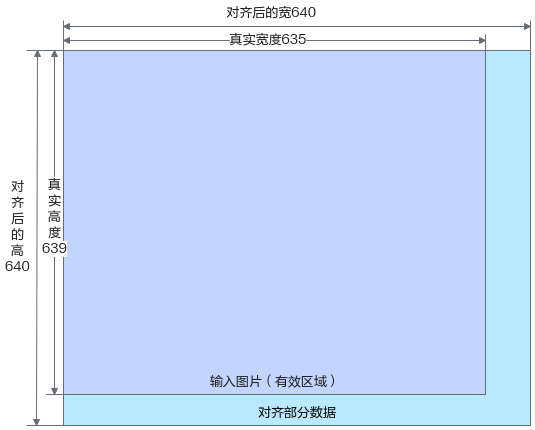
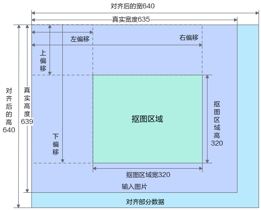
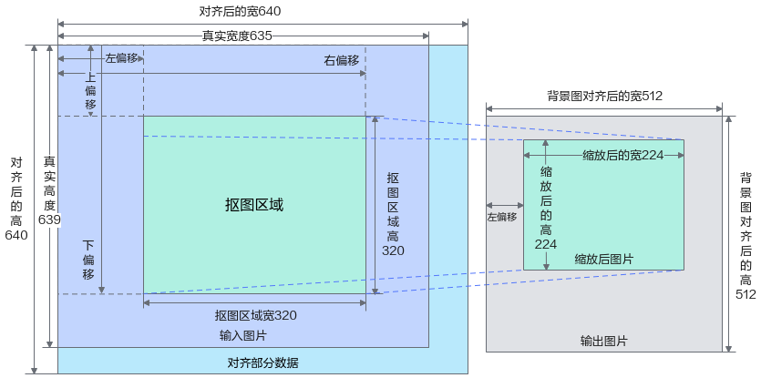
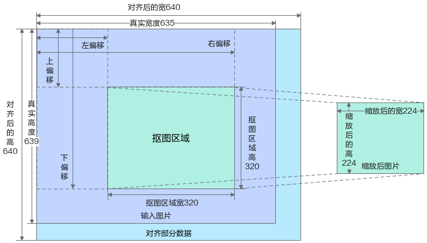
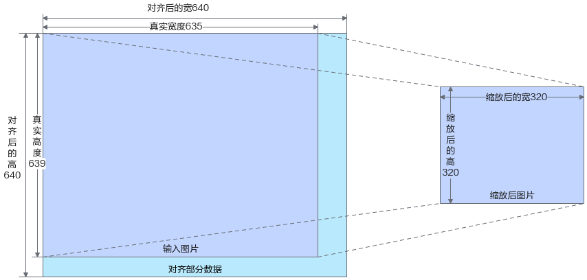

# 媒体数据处理<a name="ZH-CN_TOPIC_0000001813361436"></a>

## Image<a id="ZH-CN_TOPIC_0000001860001341"></a>

### 类说明<a name="ZH-CN_TOPIC_0000001860001273"></a>

Image数据类，作为图像处理（包含图片编解码）的输入与输出的数据结构。默认情况下，用户在Host侧构造输入数据，数据在设备间的转移由ImageProcessor类来进行管理，用户无需进行内存数据的转移操作。图像类的校验会在ImageProcessor类进行。

>[!NOTE]
>Image类涉及申请Device侧资源，与MxDeInit的作用域冲突，因此，其作用域不能大于或等于MxDeInit的作用域。

**支持的型号<a name="section1714913853014"></a>**

<term>Atlas 200I/500 A2 推理产品</term>

<term>Atlas 推理系列产品</term>

<term>Atlas 800I A2推理产品</term>

### ConvertToTensor<a name="ZH-CN_TOPIC_0000001860121189"></a>

**函数功能<a name="section203021843122012"></a>**

将DVPP侧Image类转换为Device侧Tensor类，或将Host侧Image转换为Host侧Tensor，转换后的Tensor类对象的数据类型为uint8。

- 若转换失败，则会返回空的Tensor实例。
- 若因内存不足或无法识别芯片等异常场景，导致Tensor类构造失败的话，则会抛出异常。

>[!NOTE]
>
>- “withStride”参数为“true”时，Tensor对象会保留Image对象的补边信息。为减少内存拷贝，提高运行效率，此时返回的Tensor对象与Image对象共享数据内存，同时在该场景下，Image对象的数据内存会与Tensor对象的数据内存相互影响，例如：在Image对象释放后，对应的Tensor对象中的数据将变为无效内存数据。
>- ConvertToTensor\(\)为无参数接口时，返回的Tensor对象会保留Image对象的补边信息并存在batch维度（即NHWC，其中batch维度**N = 1**）。

**函数原型<a name="section13031438206"></a>**

```cpp
Tensor Image::ConvertToTensor(bool withStride, bool formatNHWC);
Tensor Image::ConvertToTensor();
```

**参数说明<a name="section930524312204"></a>**

|参数名|输入/输出|说明|
|--|--|--|
|withStride|输入|bool类型，指定是否保留补边信息。若为true，则表示保留补边信息，与Image对象共享数据内存。若为false，表示不保留补边信息，不与Image对象共享数据内存。|
|formatNHWC|输入|bool类型，指定转换得到的Tensor是否有batch维度。若为true，则指定返回Tensor中存在batch维度。若为false，则指定返回Tensor中没有batch维度。|

**返回参数说明<a name="section5317543152013"></a>**

|数据结构|说明|
|--|--|
|Tensor|Tensor类，具体请参见[Tensor](#ZH-CN_TOPIC_0000001860000645)。|

### DumpBuffer<a name="ZH-CN_TOPIC_0000001813360996"></a>

**函数功能<a name="section1553121415175"></a>**

将图像内存数据落盘到二进制文件，需要指定文件名称及具体路径。

**函数原型<a name="section147001314191713"></a>**

```cpp
APP_ERROR Image::DumpBuffer(const std::string& filePath, bool forceOverwrite = false);
```

**参数说明<a name="section886911412170"></a>**

|参数名|输入/输出|说明|
|--|--|--|
|filePath|输入|落盘数据文件路径（包含文件名称），不支持软链接。|
|forceOverwrite|输入|保存时是否强制覆盖已有文件，默认为false，不覆盖。|

**返回参数说明<a name="section6914113421714"></a>**

|数据结构|说明|
|--|--|
|APP_ERROR|程序执行返回的错误码，请参考[APP_ERROR说明](./basic_component_layer.md#app_error说明)。|

### GetData<a name="ZH-CN_TOPIC_0000001813201452"></a>

**函数功能<a name="section169698281559"></a>**

获取Image对象的内存数据指针。

**函数原型<a name="section1235164015518"></a>**

```cpp
std::shared_ptr<uint8_t> Image::GetData() const;
```

**返回参数说明<a name="section819710191484"></a>**

|数据结构|说明|
|--|--|
|std::shared_ptr<uint8_t>|返回内存数据的智能指针。|

### GetDataSize<a name="ZH-CN_TOPIC_0000001860121141"></a>

**函数功能<a name="section169698281559"></a>**

获取Image对象的内存数据大小。

**函数原型<a name="section1235164015518"></a>**

```cpp
uint32_t Image::GetDataSize() const;
```

**返回参数说明<a name="section819710191484"></a>**

|数据结构|说明|
|--|--|
|uint32_t|返回内存数据的大小。|

### GetDeviceId<a name="ZH-CN_TOPIC_0000001860001189"></a>

**函数功能<a name="section169698281559"></a>**

获取Image对象的deviceId。

**函数原型<a name="section1235164015518"></a>**

```cpp
int32_t Image::GetDeviceId() const;
```

**返回参数说明<a name="section819710191484"></a>**

|数据结构|说明|
|--|--|
|int32_t|Image的设备号。|

### GetFormat<a name="ZH-CN_TOPIC_0000001813360768"></a>

**函数功能<a name="section169698281559"></a>**

获取Image对象的图片类型。

**函数原型<a name="section1235164015518"></a>**

```cpp
ImageFormat Image::GetFormat() const;
```

**返回参数说明<a name="section819710191484"></a>**

|数据结构|说明|
|--|--|
|ImageFormat|返回图片的类型，具体请参见[ImageFormat](./data_structures_and_enumeration_types.md#imageformat)。|

### GetOriginalData<a name="ZH-CN_TOPIC_0000001813200668"></a>

**函数功能<a name="section19506950143213"></a>**

用于获取有效图片内存数据。

当前支持以下图像类型。

```text
YUV_400 = 0,
RGB_888 = 12,
BGR_888 = 13,
ARGB_8888 = 14,
ABGR_8888 = 15,
RGBA_8888 = 16,
BGRA_8888 = 17,
```

**函数原型<a name="section070095073215"></a>**

```cpp
std::shared_ptr<uint8_t> Image::GetOriginalData() const;
```

**返回参数说明<a name="section9890165018329"></a>**

|数据结构|说明|
|--|--|
|std::shared_ptr<uint8_t>|返回内存地址（智能指针）。|

### GetOriginalSize<a name="ZH-CN_TOPIC_0000001860000397"></a>

**函数功能<a name="section169698281559"></a>**

获取Image对象的原始图片宽高。

**函数原型<a name="section1235164015518"></a>**

```cpp
Size Image::GetOriginalSize() const;
```

**返回参数说明<a name="section819710191484"></a>**

|数据结构|说明|
|--|--|
|Size|返回图片的原始宽高。|

### GetSize<a name="ZH-CN_TOPIC_0000001860001033"></a>

**函数功能<a name="section169698281559"></a>**

获取Image对象的图片对齐后的宽高（实际内存大小的宽高）。

**函数原型<a name="section1235164015518"></a>**

```cpp
Size Image::GetSize() const;
```

**返回参数说明<a name="section819710191484"></a>**

|数据结构|说明|
|--|--|
|Size|返回图片对齐后的宽高，实际内存大小的宽高。|

### Image<a name="ZH-CN_TOPIC_0000001860001257"></a>

**函数功能<a name="section169698281559"></a>**

Image类的构造函数，可支持以下方式进行创建。若因内存不足，或无法识别芯片等构造失败的场景，则会抛出异常。

- 创建空Image对象。
- 创建自定义内存数据的图片，图片格式类型默认为ImageFormat::YUV\_SP\_420，设备ID默认为Host侧（deviceId = -1）。
- 创建带对齐高、宽和有效高、宽，自定义内存数据的图片，使用时需满足以下条件。
    - “deviceId”（设备ID）需为有效值，取值范围为[-1,  识别到的Device数-1]，否则接口会调用失败。
    - “format”支持以下图片格式类型。

        ```text
        YUV_400 = 0,
        RGB_888 = 12,
        BGR_888 = 13,
        ARGB_8888 = 14,
        ABGR_8888 = 15,
        RGBA_8888 = 16,
        BGRA_8888 = 17,
        ```

    - “dataSize”需要与**有效宽高**或**对齐后宽高**一致，计算公式可参考：**dataSize = 宽 \* 高 \* 通道数**。

>[!NOTE]
>用户申请Host内存后，如需在Device侧构造Image对象，请参考如下操作进行。
>
>1. 在Host侧构造Image对象，“deviceId”为“-1”（与“imageData”内存位置一致，设置为Host侧）。
>2. 构造后的Image对象使用[ToDevice\(deviceId)](#todevice)方法，将内存迁移至Device侧。

**函数原型<a name="section1235164015518"></a>**

```cpp
Image::Image();
```

```cpp
Image::Image(const std::shared_ptr<uint8_t> imageData, const uint32_t dataSize, const int32_t deviceId = -1, const Size imageSize = DEFAULT_IMAGE_SIZE, const ImageFormat format = ImageFormat::YUV_SP_420);
```

```cpp
Image::Image(const std::shared_ptr<uint8_t> imageData, const uint32_t dataSize, const int32_t deviceId, const std::pair<Size, Size> imageSizeInfo, const ImageFormat format);
```

**参数说明<a name="section541915351819"></a>**

|参数名|输入/输出|说明|
|--|--|--|
|imageData|输入|用户构造的输入内存，该内存由用户管理申请和释放，不能为空指针（nullptr）。|
|dataSize|输入|用户输入内存的大小，需要与实际内存数据大小一致。|
|imageSize|输入|图像的宽高，默认为(0, 0)。若用户自申请Device侧的内存，请设置实际内存数据对应的图像高宽数据。|
|imageSizeInfo|输入|图像**有效宽高**与**对齐后宽高**的组合，有效宽、高应不超过对齐后的宽、高，输入方式参见如下。<br>```std::pair<Size, Size> imageSizeInfo(有效宽高，对齐后的宽高)```<br>有效宽、高取值范围为[6, 8192]。对齐后宽、高取值范围为[16, 8192]，其中宽为16的倍数、高为2的倍数。|
|format|输入|图片格式类型。|
|deviceId|输入|用户输入内存的设备ID。若用户自申请Device侧的内存，请输入对应的deviceId。取值范围：[-1, *识别到的Device数*-1]。该值需要与imageData为同一侧内存（Host侧为-1，Device侧为具体设备ID），否则后续业务存在风险和异常。|

### \~Image<a name="ZH-CN_TOPIC_0000001813360676"></a>

**函数功能<a name="section169698281559"></a>**

Image类的默认析构函数。

**函数原型<a name="section1235164015518"></a>**

```cpp
Image::~Image();
```

### operator =<a name="ZH-CN_TOPIC_0000001860120181"></a>

**函数功能<a name="section169698281559"></a>**

Image类重载等号运算符，对成员变量进行深拷贝，对内存数据进行浅拷贝，引用计数加一。

**函数原型<a name="section1235164015518"></a>**

```cpp
Image &operator = (const Image &img);
```

**参数说明<a name="section541915351819"></a>**

|参数名|输入/输出|说明|
|--|--|--|
|img|输入|输入的Image类。|

### Serialize<a name="ZH-CN_TOPIC_0000001860001249"></a>

**函数功能<a name="section126232813356"></a>**

将图像内存数据及元数据序列化后落盘保存为文件。

**函数原型<a name="section164361728183518"></a>**

```cpp
APP_ERROR Image::Serialize(const std::string& filePath, bool forceOverwrite = false);
```

**参数说明<a name="section161918287354"></a>**

|参数名|输入/输出|说明|
|--|--|--|
|filePath|输入|序列化后的数据文件保存路径（包括文件名称），不支持软链接。|
|forceOverwrite|输入|保存时是否强制覆盖已有文件，默认为false，不覆盖。|

**返回参数说明<a name="section15488347183512"></a>**

|数据结构|说明|
|--|--|
|APP_ERROR|程序执行返回的错误码，请参考[APP_ERROR说明](./basic_component_layer.md#app_error说明)。|

### SetImageAlignedSize<a name="ZH-CN_TOPIC_0000001813361312"></a>

**函数功能<a name="section138383316241"></a>**

设置对齐后的图片宽高。

- 需根据[Image](#ZH-CN_TOPIC_0000001860001341)实际输入的图像数据进行设置，图像数据不可为空。
- 当前支持以下图像类型。

    ```text
    YUV_400 = 0,
    RGB_888 = 12,
    BGR_888 = 13,
    ARGB_8888 = 14,
    ABGR_8888 = 15,
    RGBA_8888 = 16,
    BGRA_8888 = 17,
    ```

**函数原型<a name="section55384162419"></a>**

```cpp
APP_ERROR Image::SetImageAlignedSize(const Size whSize);
```

**参数说明<a name="section14264134192413"></a>**

|参数名|输入/输出|说明|
|--|--|--|
|whSize|输入|对齐后的图片宽高，单位为像素，对齐后的宽、高取值范围为[16, 8192]且大于或等于有效宽、高。其中宽需为16的倍数，高需为2的倍数。|

**返回参数说明<a name="section9576111542917"></a>**

|数据结构|说明|
|--|--|
|APP_ERROR|程序执行返回的错误码，请参考[APP_ERROR说明](./basic_component_layer.md#app_error说明)。|

### SetImageOriginalSize<a name="ZH-CN_TOPIC_0000001813201536"></a>

**函数功能<a name="section1443911346238"></a>**

设置有效图片数据的宽高。

需根据[Image](#ZH-CN_TOPIC_0000001860001341)实际输入的图像数据进行设置，图像数据不可为空。

**函数原型<a name="section137191634102319"></a>**

```cpp
APP_ERROR Image::SetImageOriginalSize(const Size whSize);
```

**参数说明<a name="section149835162311"></a>**

|参数名|输入/输出|说明|
|--|--|--|
|whSize|输入|有效宽高，单位为像素，有效宽、高取值范围为[6, 8192]且不超过对齐后的宽、高。|

**返回参数说明<a name="section17957113802813"></a>**

|数据结构|说明|
|--|--|
|APP_ERROR|程序执行返回的错误码，请参考[APP_ERROR说明](./basic_component_layer.md#app_error说明)。|

### TensorToImage<a name="ZH-CN_TOPIC_0000001813200484"></a>

**函数功能<a name="section181891346164817"></a>**

将Host侧Tensor类转换为Host侧Image类，或将Device侧Tensor类转换为DVPP侧Image类。

在转换过程中，会对Image的宽进行16向上对齐、对Image的高进行2向上对齐，转换后的Image类对象将存在补边区域。

转换后的Image类可调用成员函数[GetSize\(\)](#getsize)返回Size类对象查看补边后的宽、高，调用成员函数[GetOriginalSize\(\)](#getoriginalsize)返回Size类对象查看图片原始宽、高。

例如：

- Tensor类对象对应的图片宽、高为500、499时，转换得到的Image类对象在补边后，通过GetOriginalSize\(\)可获得宽、高分别为500、499，通过GetSize\(\)可获得宽、高分别为512、500。
- Tensor类对象对应的图片宽、高为512、500时，转换得到的Image类对象不需要补边，即转换后的Image类对象宽、高仍为512、500。

**函数原型<a name="section9190146174813"></a>**

```cpp
static APP_ERROR Image::TensorToImage(const Tensor& inputTensor, Image& Image, const ImageFormat& imageFormat);
```

**参数说明<a name="section1319324614488"></a>**

|参数名|输入/输出|说明|
|--|--|--|
|inputTensor|输入|Tensor类，输入张量。输入需满足以下要求。<li>元素类型需为Uint8类型。</li><li>Tensor的维度需为2（YUV400格式时）、3、4。</li><li>Tensor的宽、高、通道数需与imageFormat相匹配。</li>|
|Image|输出|Image类，输出图片，其内存分配在DVPP侧。|
|imageFormat|输入|[ImageFormat](./data_structures_and_enumeration_types.md#imageformat)类，指定图片的格式，需与inputTensor数据所对应的图片格式相匹配。|

**返回参数说明<a name="section142051846164817"></a>**

|数据结构|说明|
|--|--|
|APP_ERROR|程序执行返回的错误码，请参考[APP_ERROR说明](./basic_component_layer.md#app_error说明)。|

### ToDevice<a name="ZH-CN_TOPIC_0000001860001337"></a>

**函数功能<a name="section169698281559"></a>**

将Image类内保存的图像内存数据转移到Device侧。

**函数原型<a name="section1235164015518"></a>**

```cpp
APP_ERROR Image::ToDevice(const int32_t devId);
```

**参数说明<a name="section541915351819"></a>**

|参数名|输入/输出|说明|
|--|--|--|
|devId|输入|要转移到的设备ID。|

**返回参数说明<a name="section819710191484"></a>**

|数据结构|说明|
|--|--|
|APP_ERROR|程序执行返回的错误码，请参考[APP_ERROR说明](./basic_component_layer.md#app_error说明)。|

### ToHost<a name="ZH-CN_TOPIC_0000001860120425"></a>

**函数功能<a name="section169698281559"></a>**

将Image类内保存的图像内存数据转移到Host侧。

**函数原型<a name="section1235164015518"></a>**

```cpp
APP_ERROR Image::ToHost();
```

**返回参数说明<a name="section819710191484"></a>**

|数据结构|说明|
|--|--|
|APP_ERROR|程序执行返回的错误码，请参考[APP_ERROR说明](./basic_component_layer.md#app_error说明)。|

### Unserialize<a name="ZH-CN_TOPIC_0000001860001157"></a>

**函数功能<a name="section126232813356"></a>**

将[Serialize](#serialize)中保存的落盘数据文件加载到内存中，需指定文件名称及具体路径。

**函数原型<a name="section164361728183518"></a>**

```cpp
APP_ERROR Image::Unserialize(const std::string& filePath);
```

**参数说明<a name="section161918287354"></a>**

|参数名|输入/输出|说明|
|--|--|--|
|filePath|输入|落盘数据文件保存路径，输入文件大小支持范围为(0, 4GB]。|

**返回参数说明<a name="section15488347183512"></a>**

|数据结构|说明|
|--|--|
|APP_ERROR|程序执行返回的错误码，请参考[APP_ERROR说明](./basic_component_layer.md#app_error说明)。|

## ImageProcessor<a id="ZH-CN_TOPIC_0000001813201028"></a>

### 类说明<a name="ZH-CN_TOPIC_0000001813200748"></a>

ImageProcessor类，作为图像处理类，主要开放图像编解码、缩放和抠图等接口。

ImageProcessor对象不支持在多线程中并发使用，如需多线程使用同一个ImageProcessor对象，用户需自行保证加锁互斥。

>[!NOTE]
>ImageProcessor类涉及申请Device侧资源，与MxDeInit的作用域冲突，因此，其作用域不能大于或等于MxDeInit的作用域。

**支持的型号<a name="section1714913853014"></a>**

<term>Atlas 200I/500 A2 推理产品</term>

<term>Atlas 推理系列产品</term>

<term>Atlas 800I A2推理产品</term>

**关于真实图片宽高与对齐后的图片宽高说明<a name="section142815332431"></a>**

如[图1](#fig529165917327)所示，由于硬件限制，ImageProcessor使用过程中存在部分限制，为了加快读写速度，图片长宽需要对齐到指定大小，但不影响有效区域（采用向右、向下填充无效数据的方式，对齐到指定大小）。

在对图片进行缩放等操作时，ImageProcessor将会以图片原始的高宽进行处理。

**图 1**  对齐宽高与真实宽高<a id="fig529165917327"></a>


### ConvertFormat<a name="ZH-CN_TOPIC_0000001813360148"></a>

**函数功能<a name="section154821722184412"></a>**

ImageProcessor类的色域转换接口，使用该接口申请的Image内存无需用户管理，由内部管理释放。当前接口仅能够在<term>Atlas 推理系列产品</term>和<term>Atlas 800I A2推理产品</term>环境上调用。

相关使用流程请参考[色域转换](../../05.user_guide.md#色域转换)。

**函数原型<a name="section983552215444"></a>**

```cpp
APP_ERROR ImageProcessor::ConvertFormat(const Image& inputImage, const ImageFormat outputFormat, Image& outputImage);
```

**参数说明<a name="section02535230443"></a>**

|参数名|输入/输出|说明|
|--|--|--|
|inputImage|输入|输入转换前的Image类。Decode接口和其他VPC接口获取的Image类可以直接作为输入。<li>当前输入Image类的格式支持YUV_SP_420、YVU_SP_420、RGB_888、BGR_888。</li><li>输入Image类的原图宽高大小范围：32 \* 6 ~ 4096 \* 4096。</li>|
|outputFormat|输入|色域转换的目标格式，支持YUV_SP_420、YVU_SP_420、RGB_888、BGR_888。<li>输出Image类的宽自动与16对齐，高与2对齐，因此宽高范围为：32 \* 6 ~ 4096 \* 4096。</li><li>输出Image类宽高保持与输入Image类一致。</li><li>请确保转换前的格式与转换后的格式不同。</li>|
|outputImage|输出|转换输出Image图像。|

**返回参数说明<a name="section819710191484"></a>**

|数据结构|说明|
|--|--|
|APP_ERROR|程序执行返回的错误码，请参考[APP_ERROR说明](./basic_component_layer.md#app_error说明)。|

### Crop<a name="ZH-CN_TOPIC_0000001860001037"></a>

**函数功能<a name="section169698281559"></a>**

ImageProcessor类的图像抠图接口，<term>Atlas 推理系列产品</term>和<term>Atlas 800I A2推理产品</term>支持异步执行，使用该接口申请的Image内存无需用户管理，由内部管理释放，抠图效果示意图请参见[图1](#fig04091399262)。

相关使用流程请参考[抠图](../../05.user_guide.md#抠图)。

- 输入输出Image类支持的图像格式参考如下。
    - <term>Atlas 200I/500 A2 推理产品</term>支持YUV\_SP\_420、YVU\_SP\_420（nv12、nv21）。
    - <term>Atlas 推理系列产品</term>和<term>Atlas 800I A2推理产品</term>支持YUV\_SP\_420、YVU\_SP\_420、RGB\_888、BGR\_888（nv12、nv21、rgb、bgr），其中RGB（BGR）图像格式分辨率不超过（4096 \* 4096）。

- “inputImage”的真实图片分辨率范围：18 \* 6 \~ 4096 \* 4096，其中YUV\_SP\_420和YVU\_SP\_420格式的分辨率为18 \* 6 \~ 8192 \* 8192。
- 抠图区域不超出输入图片区域，输入抠图坐标框“cropRect”的四个值推荐均为偶数。除RGB、BGR以外，若包含奇数，则左上角坐标自动向下取偶数，右下角坐标自动向上取偶数。
- 抠图区域的最大分辨率为4096 \* 4096，最小分辨率为18 \* 6。例如：cropRect\{1, 1, 1287, 1287}，实际抠图宽高为：\(\(1287 + 1\) - \(1 - 1\)\)= 1288，对应的分辨率为1288 \* 1288。
- 输出“outputImageVec”中，各项图片的宽自动与16对齐，高与2对齐，范围为\[32 \* 6 , 4096 \* 4096\]。
- 批量输入图片的抠图场景，输入图片数量不超过12张，抠图配置参数“cropRectVec”长度不超过256，输出图片张数不超过256且应满足**输出图片张数 = 输入图片张数 \* 抠图配置参数“cropRectVec”长度**。

**图 1**  抠图<a id="fig04091399262"></a>


**函数原型<a name="section1235164015518"></a>**

原型1：

```cpp
APP_ERROR ImageProcessor::Crop(const Image& inputImage, const Rect& cropRect, Image& outputImage, AscendStream& stream = AscendStream::DefaultStream());
```

原型2：

```cpp
APP_ERROR ImageProcessor::Crop(const Image& inputImage, const std::vector<Rect>& cropRectVec, std::vector<Image>& outputImageVec, AscendStream& stream = AscendStream::DefaultStream());
```

原型3：

```cpp
APP_ERROR ImageProcessor::Crop(const std::vector<Image>& inputImageVec, const std::vector<Rect>& cropRectVec, std::vector<Image>& outputImageVec, AscendStream& stream = AscendStream::DefaultStream());
```

**参数说明<a name="section541915351819"></a>**

|参数名|输入/输出|说明|
|--|--|--|
|inputImage|输入|输入抠图前的Image类。Decode接口和其他VPC接口获取的Image类可以直接作为输入。若是用户自定义构造的Image类，则需要设置图像宽高。|
|inputImageVec|输入|输入抠图前的Image类列表（针对批量抠图场景）。|
|cropRect|输入|输入图像的抠图坐标框。|
|cropRectVec|输入|输入图像的抠图坐标框列表（针对批量抠图场景）。|
|outputImage|输出|输出抠图后的Image类。|
|outputImageVec|输出|输出抠图后的Image类列表（针对批量抠图场景）。|
|stream|输入|[AscendStream](./asynchronous_invocation.md#ascendstream)类型，默认值为AscendStream::DefaultStream()。当参数值为默认值时，接口为同步操作，其他情况下，接口为异步操作。|

**返回参数说明<a name="section819710191484"></a>**

|数据结构|说明|
|--|--|
|APP_ERROR|程序执行返回的错误码，请参考[APP_ERROR说明](./basic_component_layer.md#app_error说明)。|

### CropAndPaste<a name="ZH-CN_TOPIC_0000001860001153"></a>

**函数功能<a name="section169698281559"></a>**

ImageProcessor类的图像抠图并贴图接口，<term>Atlas 推理系列产品</term>和<term>Atlas 800I A2推理产品</term>支持异步执行，抠图贴图效果示意图请参见[图1](#fig4669111642918)。

相关使用流程请参考[抠图贴图](../../05.user_guide.md#抠图贴图)。

输入输出Image类支持的图像格式参考如下。

- <term>Atlas 200I/500 A2 推理产品</term>支持YUV\_SP\_420、YVU\_SP\_420（nv12、nv21）。
- <term>Atlas 推理系列产品</term>和<term>Atlas 800I A2推理产品</term>支持YUV\_SP\_420、YVU\_SP\_420、RGB\_888、BGR\_888（nv12、nv21、rgb、bgr），其中RGB（BGR）图像格式分辨率不超过（4096 \* 4096）。

1. 从“inputImage”中抠取一块图像。
    - 输入Image类的真实图片宽高大小范围：18 \* 6 \~ 4096 \* 4096，其中YUV\_SP\_420和YVU\_SP\_420格式的宽高可达到8192 \* 8192。
    - 抠图宽高范围不能超过“inputImage”的真实图片宽高，抠图区域的范围最小为：10 \* 6。
    - 输入**抠图参数**的四个值推荐均为偶数。除RGB、BGR以外，若包含奇数，则左上角坐标自动向下取偶数，右下角坐标自动向上取偶数。例如：cropRect\{1, 1, 1287, 1287}，实际抠图宽高为：\(\(1287 + 1\) - \(1 - 1\)\)= 1288。

2. 缩放至指定贴图区域的大小。
3. 将缩放后的图片贴到“pastedImage”的指定贴图区域。
    - 贴图宽高范围不能超过“pastedImage”的真实图片宽高，贴图区域的范围最小为： 10 \* 6 ，最大为：4096 \* 4096。
    - 输入**贴图参数**的四个值推荐均为偶数。除RGB、BGR以外，若包含奇数，则左上角坐标自动向下取偶数，右下角坐标自动向上取偶数。
    - **贴图参数**左上角坐标的x会自动对齐到16的倍数。例如：
        - pasteRect\{17, 17, 1287, 1287} ，实际贴图宽高为：\(\(1287 + 1\) - \(17 - 1\)\)= 1272，对应的分辨率为1272 \* 1272。
        - pasteRect\{18, 18, 1287, 1287} ，实际贴图宽为：\(\(1287 + 1\) - 32\) = 1256，高为：\(\(1287 + 1\) - 18\) = 1270，对应的分辨率为1256 \* 1270。

    - 在<term>Atlas 200I/500 A2 推理产品</term>环境下，贴图宽高不能超过抠图宽高的\[1/32, 16\]倍数区间。
    - 在<term>Atlas 推理系列产品</term>和<term>Atlas 800I A2推理产品</term>环境下，贴图“rect”的实际宽需要与“16”对齐，否则会有无效数据做填充。在<term>Atlas 200I/500 A2 推理产品</term>环境下，贴图“rect”的右下角的“x”值推荐与“16”对齐。

4. 输出的“pastedImage”宽自动与16对齐，高与2对齐，因此宽高范围为：32 \* 6 \~ 4096 \* 4096。

**图 1**  抠图缩放贴图<a id="fig4669111642918"></a>


**函数原型<a name="section1235164015518"></a>**

```cpp
APP_ERROR ImageProcessor::CropAndPaste(const Image& inputImage, const std::pair<Rect, Rect>& cropPasteRect, Image& pastedImage, AscendStream& stream = AscendStream::DefaultStream());
```

**参数说明<a name="section541915351819"></a>**

|参数名|输入/输出|说明|
|--|--|--|
|inputImage|输入|输入抠图缩放前的Image类。Decode接口和其他VPC接口获取的Image类可以直接作为输入。若是用户自定义构造的Image类，则需要设置图像宽高和图像对齐后的宽高。|
|cropPasteRect|输入|输入图像的抠图缩放贴图参数。第一个Rect对应**抠图参数**，第二个Rect对应**缩放贴图参数**。|
|pastedImage|输入/输出|输出抠图后的Image类。|
|stream|输入|[AscendStream](./asynchronous_invocation.md#ascendstream)类型，默认值为AscendStream::DefaultStream()。当参数值为默认值时，接口为同步操作，其他情况下，接口为异步操作。|

**返回参数说明<a name="section819710191484"></a>**

|数据结构|说明|
|--|--|
|APP_ERROR|程序执行返回的错误码，请参考[APP_ERROR说明](./basic_component_layer.md#app_error说明)。|

### CropResize<a name="ZH-CN_TOPIC_0000001813361076"></a>

**函数功能<a name="section169698281559"></a>**

ImageProcessor类的图像抠图并缩放接口，<term>Atlas 推理系列产品</term>和<term>Atlas 800I A2推理产品</term>支持异步执行，使用该接口申请的Image内存无需用户管理，由内部管理释放，抠图缩放效果示意图请参见[图1](#fig12226163313285)。

相关使用流程请参考[抠图缩放](../../05.user_guide.md#抠图缩放)。

- 输入输出Image类支持的图像格式参考如下。
    - <term>Atlas 200I/500 A2 推理产品</term>支持YUV\_SP\_420、YVU\_SP\_420（nv12、nv21）。
    - <term>Atlas 推理系列产品</term>和<term>Atlas 800I A2推理产品</term>支持YUV\_SP\_420、YVU\_SP\_420、RGB\_888、BGR\_888（nv12、nv21、rgb、bgr），其中RGB（BGR）图像格式分辨率不超过（4096 \* 4096）。

- “inputImage”的真实图片宽高大小范围：18 \* 6 \~ 4096 \* 4096，其中YUV\_SP\_420和YVU\_SP\_420格式的宽高可达到8192 \* 8192。
- 抠图区域的最小为10 \* 6，抠图区域不能超出输入图片的真实图片宽高，输入“cropRect”的四个值推荐均为偶数。除RGB、BGR以外，若包含奇数，则左上角坐标自动向下取偶数，右下角坐标自动向上取偶数。
- 输出Image类的最大分辨率为4096 \* 4096，最小分辨率为18 \* 6。例如：cropRect\{1, 1, 1287, 1287} ，实际抠图宽高为：\(\(1287 + 1\) - \(1 - 1\)\)= 1288，对应的分辨率为1288 \* 1288。
- 缩放的范围为18 \* 6 \~ 4096 \* 4096，不能超出抠图区域的\[1/32, 16\]倍数区间。
- 输出“outputImageVec”中，各项图片的宽自动与16对齐，高与2对齐，范围为\[32 \* 6 , 4096 \* 4096\]。

**图 1**  抠图缩放<a id="fig12226163313285"></a>


**函数原型<a name="section1235164015518"></a>**

原型1：

```cpp
APP_ERROR ImageProcessor::CropResize(const Image& inputImage, const std::vector<Rect>& cropRectVec, const Size& resize, std::vector<Image>& outputImageVec, AscendStream& stream = AscendStream::DefaultStream());
```

原型2：

```cpp
APP_ERROR ImageProcessor::CropResize(const Image& inputImage, const std::vector<std::pair<Rect, Size>>& cropResizeVec, std::vector<Image>& outputImageVec, AscendStream& stream = AscendStream::DefaultStream());
```

原型3：

```cpp
APP_ERROR ImageProcessor::CropResize(const std::vector<Image>& inputImageVec, const std::vector<std::pair<Rect, Size>>& cropResizeVec, std::vector<Image>& outputImageVec, AscendStream& stream = AscendStream::DefaultStream());
```

**参数说明<a name="section541915351819"></a>**

|参数名|输入/输出|说明|
|--|--|--|
|inputImage|输入|输入抠图缩放前的Image类。Decode接口和其他VPC接口获取的Image类可以直接作为输入。若是用户自定义构造的Image类，则需要设置图像宽高和图像对齐后的宽高。|
|inputImageVec|输入|输入抠图缩放前的Image类列表（针对批量抠图缩放场景）。Decode接口和其他VPC接口获取的Image类可以直接作为输入。若是用户自定义构造的Image类，则需要设置图像宽高和图像对齐后的宽高。|
|cropRectVec|输入|输入抠图参数列表，需要与输出图像列表的元素个数一致。|
|resize|输入|输入统一缩放宽高。|
|cropResizeVec|输入|输入图像的抠图缩放参数列表。Rect为抠图坐标框，Size为缩放宽高（针对批量抠图缩放场景）。|
|outputImageVec|输出|输出抠图后的Image类列表（针对批量抠图缩放场景）。|
|stream|输入|[AscendStream](./asynchronous_invocation.md#ascendstream)类型，默认值为AscendStream::DefaultStream()。当参数值为默认值时，接口为同步操作，其他情况下，接口为异步操作。|

**返回参数说明<a name="section819710191484"></a>**

|数据结构|说明|
|--|--|
|APP_ERROR|程序执行返回的错误码，请参考[APP_ERROR说明](./basic_component_layer.md#app_error说明)。|

### Decode<a id="ZH-CN_TOPIC_0000001813360748"></a>

**函数功能<a name="section169698281559"></a>**

ImageProcessor类的图片解码接口，使用该接口申请的Image内存无需用户管理，由内部管理释放。仅支持以Host侧申请的内存作为解码接口的输入。输入图片内存的数据类型目前支持**JPEG和PNG两种**格式。相关使用流程请参考[图片解码](../../05.user_guide.md#图片解码)。

- JPG/JPEG格式：
    - JPG/JPEG输入图片的最大分辨率：8192 \* 8192，其中 RGB\_888, BGR\_888 格式只支持至 4096\*4096。
    - JPG/JPEG输入图片的最小分辨率：32 \* 32。
    - 输出解码后的图片及“outputImage”的数据类型目前仅支持**YUV\_SP\_420**，**YVU\_SP\_420**两种图像格式，<term>Atlas 推理系列产品</term>和<term>Atlas 800I A2推理产品</term>额外支持**RGB\_888**，**BGR\_888**格式的解码。
    - 输出图片的宽。
        - <term>Atlas 200I/500 A2 推理产品</term>对齐到128（即宽度为128的倍数），在对齐操作前，接口会向下2对齐操作，例如：图片原图宽为1023，在进行Decode接口解码处理后，通过[GetSize](#getsize)\(\)获得的值为1024，通过[GetOriginalSize](#getoriginalsize)\(\)获得的值为1022。
        - <term>Atlas 推理系列产品</term>和<term>Atlas 800I A2推理产品</term>对齐到64（即宽度为64的倍数），**RGB\_888**，**BGR\_888**  格式对齐到16，解码接口自动对齐。

    - 输出图片的高：对齐到16（即高度为16的倍数），解码接口自动对齐。

        对于<term>Atlas 200I/500 A2 推理产品</term>，在对齐操作前，接口会向下2对齐操作，例如：图片原图高为683，在进行Decode接口解码处理后，通过GetSize\(\)获得的值为688，通过GetOriginalSize\(\)获得的值为682。

        >[!NOTE]
        >JPG/JPEG输入图片格式约束：
        >- 只支持Huffman编码，码流的subsample为444/422/420/400/440。
        >- 不支持算术编码。
        >- 不支持渐进JPEG格式。
        >- 不支持JPEG2000格式。

- PNG格式：
    - PNG输入图片的最大分辨率：4096 \* 4096。
    - PNG输入图片的最小分辨率：32 \* 32。
    - 输出图片的宽：对齐到128（即宽度为128的倍数），解码接口自动对齐。
    - 输出图片的高：对齐到16（即高度为16的倍数），解码接口自动对齐。

**函数原型<a name="section1235164015518"></a>**

```cpp
APP_ERROR ImageProcessor::Decode(const std::shared_ptr<uint8_t> dataPtr, const uint32_t dataSize, Image& outputImage, const ImageFormat decodeFormat = ImageFormat::YUV_SP_420);
```

```cpp
APP_ERROR ImageProcessor::Decode(const std::string inputPath, Image& outputImage, const ImageFormat decodeFormat = ImageFormat::YUV_SP_420);
```

**参数说明<a name="section541915351819"></a>**

|参数名|输入/输出|说明|
|--|--|--|
|dataPtr|输入|输入待解码图片数据的内存地址。解码前图像数据内存地址需要用户进行管理。|
|dataSize|输入|输入待解码图片数据的内存大小。需要与dataPtr的实际内存大小相符。<li>用户提供的dataSize无法完整读取图片文件头信息，则会返回异常。</li><li>用户提供的dataSize大于文件头信息并且小于实际内存大小，则会根据dataSize进行部分解码。</li><li>用户提供的dataSize大于实际内存大小，则以图片文件结束符为准。</li>|
|decodeFormat|输入|输入解码后图片的格式。<li>JPG/JPEG图片decodeFormat默认参数为YUV_SP_420，可自行设置该参数。</li><li>对于PNG图片，decodeFormat仅在输入图片通道是RGB/GRAY格式时，配置BGR_888会生效；其余情况设置该参数无效，将按PNG源格式进行解码，例如：<ul><li>PNG图片通道为RGB/GRAY格式，则解码输出图片格式为RGB_888。</li><li>PNG图片通道为RGBA/AGRAY格式，则解码输出图片格式为RGBA_8888。</li></ul></li>|
|inputPath|输入|输入待解码的图片路径。|
|outputImage|输出|输出解码后的Image类。图片宽高和对齐后的宽高会自动合入至outputImage内。|

**返回参数说明<a name="section819710191484"></a>**

|数据结构|说明|
|--|--|
|APP_ERROR|程序执行返回的错误码，请参考[APP_ERROR说明](./basic_component_layer.md#app_error说明)。|

### Encode<a name="ZH-CN_TOPIC_0000001860001145"></a>

**函数功能<a name="section169698281559"></a>**

ImageProcessor类的图片编码接口，使用该接口申请的Image内存无需用户管理，由内部管理释放[图片编码](../../05.user_guide.md#图片编码)。

相关使用流程请参考。

- 输入图像的最大分辨率：8192 \* 8192。
- 输入图像的最小分辨率：32 \* 32。
- 输入图像的真实宽、高均为偶数，若为奇数，则自动向上取偶数，编码出的图片自动补边1像素。
- 输入图像的宽：对于YUV420SP或RGB数据，对齐到16。
- 输入图像的高：与输入图片的高度相同的数值，或为输入图片的高度向上对齐到16的数值（最小为32）。
- 输入图像格式：
    - <term>Atlas 200I/500 A2 推理产品</term>支持YUV\_SP\_420、YVU\_SP\_420（nv12、nv21）。
    - <term>Atlas 推理系列产品</term>和<term>Atlas 800I A2推理产品</term>支持YUV\_SP\_420、YVU\_SP\_420、RGB\_888、BGR\_888（nv12、nv21、rgb、bgr），其中RGB（BGR）图像格式分辨率不超过（4096 \* 4096）。

- 输出图片格式：JPEG压缩格式的图片文件，例如\*.jpg。

**函数原型<a name="section1235164015518"></a>**

```cpp
APP_ERROR ImageProcessor::Encode(const Image& inputImage, const std::string savePath, const uint32_t encodeLevel = 100);
```

```cpp
APP_ERROR ImageProcessor::Encode(const Image& inputImage, std::shared_ptr<uint8_t>& outDataPtr, uint32_t& outDataSize, const uint32_t encodeLevel = 100);
```

**参数说明<a name="section541915351819"></a>**

|参数名|输入/输出|说明|
|--|--|--|
|inputImage|输入|输入编码前的Image类。Decode接口和其他VPC接口获取的Image类可以直接作为输入。若是用户自定义构造的Image类，则需要设置图像宽高。|
|encodeLevel|输入|默认为100，<term>Atlas 200I/500 A2 推理产品</term>、<term>Atlas 推理系列产品</term>和<term>Atlas 800I A2推理产品</term>的范围为[1, 100]。|
|savePath|输入|输入编码后保存的图片路径，文件后缀名限制为**jpg**。|
|outDataPtr|输出|输出编码后的图片内存数据地址。|
|outDataSize|输出|输出编码后的图片内存数据大小。|

**返回参数说明<a name="section819710191484"></a>**

|数据结构|说明|
|--|--|
|APP_ERROR|程序执行返回的错误码，请参考[APP_ERROR说明](./basic_component_layer.md#app_error说明)。|

### ImageProcessor<a name="ZH-CN_TOPIC_0000001860001373"></a>

**函数功能<a name="section169698281559"></a>**

ImageProcessor类的构造函数。

若因内存不足，或无法识别芯片等构造失败的场景会抛出std::runtime\_error异常。

图像处理接口（解码除外）的输入Image类包含的内存数据均需要在Device侧，用户使用ImageProcessor类内的接口获取的Image对象内存数据已经在Device侧，并且无需用户管理释放。

**函数原型<a name="section1235164015518"></a>**

```cpp
ImageProcessor::ImageProcessor(const int32_t deviceId = 0);
```

**参数说明<a name="section541915351819"></a>**

|参数名|输入/输出|说明|
|--|--|--|
|deviceId|输入|图像处理类部署的芯片，默认为0号芯片。取值范围：[0, 识别到的芯片个数 - 1]。|

### \~ImageProcessor<a name="ZH-CN_TOPIC_0000001813361296"></a>

**函数功能<a name="section169698281559"></a>**

ImageProcessor类的默认析构函数。

**函数原型<a name="section1235164015518"></a>**

```cpp
ImageProcessor::~ImageProcessor()
```

### InitJpegDecodeChannel<a name="ZH-CN_TOPIC_0000001860121053"></a>

**函数功能<a name="section1266813188345"></a>**

初始化JPEGD图像通道，用于JPEG解码。

不支持<term>Atlas 800I A2推理产品</term>。

**函数原型<a name="section38891187349"></a>**

```cpp
APP_ERROR ImageProcessor::InitJpegDecodeChannel(const JpegDecodeChnConfig& config = JPEG_DECODE_CHN_CONFIG);
```

**参数说明<a name="section15510119193412"></a>**

|参数名|输入/输出|说明|
|--|--|--|
|config|输入|通道配置参数，默认值为JPEG_DECODE_CHN_CONFIG。对应数据结构参见如下（当前预留）。struct JpegDecodeChnConfig {};|

**返回参数说明<a name="section18193350203413"></a>**

|数据结构|说明|
|--|--|
|APP_ERROR|程序执行返回的错误码，请参考[APP_ERROR说明](./basic_component_layer.md#app_error说明)。|

### InitJpegEncodeChannel<a name="ZH-CN_TOPIC_0000001813361228"></a>

**函数功能<a name="section1266813188345"></a>**

初始化JPEGE图像通道，用于JPEG编码。

不支持<term>Atlas 800I A2推理产品</term>。

**函数原型<a name="section38891187349"></a>**

```cpp
APP_ERROR ImageProcessor::InitJpegEncodeChannel(const JpegEncodeChnConfig& config = JPEG_ENCODE_CHN_CONFIG);
```

**参数说明<a name="section15510119193412"></a>**

|参数名|输入/输出|说明|
|--|--|--|
|config|输入|通道配置参数，取值范围为[32, 8192]，默认值为JPEG_ENCODE_CHN_CONFIG，（即图像最大宽高为8192 * 8192）。仅对<term>Atlas 推理系列产品</term>生效。对于<term>Atlas 200I/500 A2 推理产品</term>，该配置无效。当前仅支持配置图片编码的通道宽高（maxPicWidth、maxPicHeight），内部自动16对齐，当高小于宽时，高自动向上对齐到宽的长度，请根据实际编码场景图片预留适当的宽高。对应数据结构参见如下。struct JpegEncodeChnConfig {    uint32_t maxPicWidth = MAX_HIMPI_VENC_PIC_WIDTH;    uint32_t maxPicHeight = MAX_HIMPI_VENC_PIC_HEIGHT;};|

**返回参数说明<a name="section18193350203413"></a>**

|数据结构|说明|
|--|--|
|APP_ERROR|程序执行返回的错误码，请参考[APP_ERROR说明](./basic_component_layer.md#app_error说明)。|

### InitPngDecodeChannel<a name="ZH-CN_TOPIC_0000001813200520"></a>

**函数功能<a name="section1266813188345"></a>**

初始化PNGD图像通道，用于PNG图片解码。

不支持<term>Atlas 800I A2推理产品</term>。

**函数原型<a name="section38891187349"></a>**

```cpp
APP_ERROR ImageProcessor::InitPngDecodeChannel(const PngDecodeChnConfig& config = PNG_DECODE_CHN_CONFIG);
```

**参数说明<a name="section15510119193412"></a>**

|参数名|输入/输出|说明|
|--|--|--|
|config|输入|通道配置参数，默认值为PNG_DECODE_CHN_CONFIG。对应数据结构参见如下（当前预留）。struct PngDecodeChnConfig {};|

**返回参数说明<a name="section18193350203413"></a>**

|数据结构|说明|
|--|--|
|APP_ERROR|程序执行返回的错误码，请参考[APP_ERROR说明](./basic_component_layer.md#app_error说明)。|

### InitVpcChannel<a name="ZH-CN_TOPIC_0000001813361044"></a>

**函数功能<a name="section1266813188345"></a>**

初始化VPC图像通道，用于图像处理功能（抠图、缩放、补边、抠图缩放、抠图贴图、色域转换）。

此接口在<term>Atlas 推理系列产品</term>和<term>Atlas 800I A2推理产品</term>上无需显示调用，VPC通道从资源池获取。

**函数原型<a name="section38891187349"></a>**

```cpp
APP_ERROR ImageProcessor::InitVpcChannel(const VpcChnConfig& config = VPC_CHN_CONFIG);
```

**参数说明<a name="section15510119193412"></a>**

|参数名|输入/输出|说明|
|--|--|--|
|config|输入|通道配置参数，默认值为VPC_CHN_CONFIG。对应数据结构参见如下（当前预留）。struct VpcChnConfig {};|

**返回参数说明<a name="section18193350203413"></a>**

|数据结构|说明|
|--|--|
|APP_ERROR|程序执行返回的错误码，请参考[APP_ERROR说明](./basic_component_layer.md#app_error说明)。|

### Padding<a name="ZH-CN_TOPIC_0000001813201540"></a>

**函数功能<a name="section104961723175016"></a>**

ImageProcessor类的图像补边接口，使用该接口申请的Image内存无需用户管理，由内部管理释放。

相关使用流程请参考[补边](../../05.user_guide.md#补边)。

- 输入输出Image类支持的图像格式为YUV\_SP\_420、YVU\_SP\_420、RGB\_888、BGR\_888（nv12、nv21、rgb、bgr），其中RGB（BGR）图像格式分辨率不超过（4096 \* 4096）。
- “inputImage”的真实图片分辨率范围：18 \* 6 \~ 4096 \* 4096。
- 当前接口仅支持“BORDER\_CONSTANT”补边方式，其余补边方式预留接口。YUV\_SP\_420和YVU\_SP\_420格式，补边尺寸建议为偶数，当补边尺寸为奇数时，会自动进行向上对齐。例如，用户输入补边尺寸为\(1, 1, 1, 1\)，将自动对齐到\(2, 2, 2, 2\)，上下左右各补2个像素点。当输入图片分辨率为4095 \* 4095，补边尺寸为\(1, 0, 1, 0\)时，由于自动对齐后的补边尺寸为4097 \* 4097，超出范围，因此会补边失败。
- “outputImage”分辨率为18 \* 6 \~ 4096 \* 4096，宽自动与16对齐，高与2对齐，范围为\[32 \* 6 , 4096 \* 4096\]。

**函数原型<a name="section0818132385017"></a>**

```cpp
APP_ERROR ImageProcessor::Padding(const Image& inputImage, Dim &padDim, const Color& color, const BorderType borderType, Image& outputImage);
```

**参数说明<a name="section2065132415011"></a>**

|参数名|输入/输出|说明|
|--|--|--|
|inputImage|输入|输入补边前的Image类。Decode接口和其他VPC接口获取的Image类可以直接作为输入。若是用户自定义构造的Image类，则需要设置图像宽高和图像对齐后的宽高。|
|padDim|输入|输入图像补边的尺寸。|
|color|输入|输入补边三通道颜色值，仅在borderType设置为BORDER_CONSTANT时有效。|
|borderType|输入|输入补边方式，具体实现请参见BorderType。|
|outputImage|输出|输出补边后的Image类。|

**返回参数说明<a name="section819710191484"></a>**

|数据结构|说明|
|--|--|
|APP_ERROR|程序执行返回的错误码，请参考[APP_ERROR说明](./basic_component_layer.md#app_error说明)。|

### Resize<a name="ZH-CN_TOPIC_0000001860001413"></a>

**函数功能<a name="section169698281559"></a>**

ImageProcessor类的图像缩放接口，<term>Atlas 推理系列产品</term>和<term>Atlas 800I A2推理产品</term>支持异步执行，使用该接口申请的Image内存无需用户管理，由内部管理释放，缩放效果示意图请参见[图1](#fig131811915276)。

相关使用流程请参考[缩放](../../05.user_guide.md#缩放)。

- 输入输出Image类支持的图像格式参考如下。
    - <term>Atlas 200I/500 A2 推理产品</term>支持YUV\_SP\_420、YVU\_SP\_420（nv12、nv21）。
    - <term>Atlas 推理系列产品</term>和<term>Atlas 800I A2推理产品</term>支持YUV\_SP\_420、YVU\_SP\_420、RGB\_888、BGR\_888（nv12、nv21、rgb、bgr），其中RGB（BGR）图像格式分辨率不超过（4096 \* 4096）。

- “inputImage”的真实图片分辨率范围\[18 \* 6 , 4096 \* 4096\]，其中YUV\_SP\_420和YVU\_SP\_420格式的宽高可达到8192 \* 8192。
- 参数“resize”的最大分辨率：4096 \* 4096，最小分辨率：32 \* 6。
- “outputImage”宽自动与16对齐，高与2对齐，因此宽高范围为：32 \* 6 \~ 4096 \* 4096。
- 缩放后图片的宽高不能超出真实图片的\[1/32 ,16\]倍数区间。

**图 1**  缩放<a id="fig131811915276"></a>


**函数原型<a name="section1235164015518"></a>**

```cpp
APP_ERROR ImageProcessor::Resize(const Image& inputImage, const Size& resize, Image& outputImage, const Interpolation interpolation, AscendStream& stream = AscendStream::DefaultStream());
```

**参数说明<a name="section541915351819"></a>**

|参数名|输入/输出|说明|
|--|--|--|
|inputImage|输入|输入缩放前的Image类。Decode接口和其他VPC接口获取的Image类可以直接作为输入。若是用户自定义构造的Image类，则需要设置图像宽高和图像对齐后的宽高。|
|resize|输入|输入图像缩放的宽高。|
|interpolation|输入|输入图像的缩放方式，可选参数参见如下。HUAWEI_HIGH_ORDER_FILTER = 0BILINEAR_SIMILAR_OPENCV = 1NEAREST_NEIGHBOR_OPENCV = 2BILINEAR_SIMILAR_TENSORFLOW = 3NEAREST_NEIGHBOR_TENSORFLOW = 4<term>Atlas 200I/500 A2 推理产品</term>支持以下算法（默认为0）。0：华为自研的高滤波算法。1：业界通用的Bilinear算法（与OpenCV算法的计算精度接近）。2：业界通用的Nearest Neighbor算法（与OpenCV算法的计算精度接近）。3：业界通用的Bilinear算法（与TensorFlow框架的计算精度接近）。4：业界通用的Nearest Neighbor算法（与TensorFlow框架的计算精度接近）。<term>Atlas 推理系列产品</term>和<term>Atlas 800I A2推理产品</term>支持以下算法（同步执行时默认为0）。0、1：业界通用的Bilinear算法（与OpenCV算法的计算过程类似，当输入和输出图片格式都为RGB时，在[1/32, 512]的缩放范围内，与OpenCV算法的单个像素值最大差异为正负1）。2：业界通用的Nearest Neighbor算法（与OpenCV算法的计算过程类似。）|
|outputImage|输出|输出缩放后的Image类。|
|stream|输入|[AscendStream](./asynchronous_invocation.md#ascendstream)类型，默认值为AscendStream::DefaultStream()。当参数值为默认值时，接口为同步操作，其他情况下，接口为异步操作。|

**返回参数说明<a name="section819710191484"></a>**

|数据结构|说明|
|--|--|
|APP_ERROR|程序执行返回的错误码，请参考[APP_ERROR说明](./basic_component_layer.md#app_error说明)。|

## Tensor<a id="ZH-CN_TOPIC_0000001860000645"></a>

### 类说明<a name="ZH-CN_TOPIC_0000001813360860"></a>

Tensor数据类，作为模型推理的输入与输出的数据结构。

>[!NOTE]
>Tensor类涉及申请Device侧资源，与MxDeInit的作用域冲突，因此，其作用域不能大于或等于MxDeInit的作用域。

**支持的型号<a name="section1665412963811"></a>**

接口的硬件支持情况如[表1](#table56016237434)所示，标识的含义如下：

- √：支持
- x：不支持

**表 1**  接口的硬件支持情况<a id="table56016237434"></a>

|接口|<term>Atlas 200I/500 A2 推理产品</term>|<term>Atlas 推理系列产品</term>|<term>Atlas 800I A2推理产品</term>|
|--|--|--|--|
|BatchConcat|√|√|√|
|Clone|√|√|√|
|GetByteSize|√|√|√|
|GetData|√|√|√|
|GetDataType|√|√|√|
|GetDeviceId|√|√|√|
|GetMemoryType|√|√|√|
|GetReferRect|√|√|√|
|GetShape|√|√|√|
|GetValidRoi|√|√|√|
|IsEmpty|√|√|√|
|IsWithMargin|√|√|√|
|Malloc|√|√|√|
|operator =|√|√|√|
|operator **==**|√|√|√|
|SetShape|√|√|√|
|Tensor|√|√|√|
|~Tensor|√|√|√|
|TensorFree|√|√|√|
|TensorMalloc|√|√|√|
|ToDevice|√|√|√|
|ToDvpp|√|√|√|
|ToHost|√|√|√|
|SetReferRect|x|√|x|
|SetTensorValue|√|√|√|
|SetValidRoi|√|√|√|
|Transpose|√|√|√|

### BatchConcat<a name="ZH-CN_TOPIC_0000001813200988"></a>

**函数功能<a name="section169698281559"></a>**

将多个Tensor进行组batch，按照batch维组装，默认输入的每个Tensor第一维为batch维，内存连续。

**函数原型<a name="section1235164015518"></a>**

```cpp
friend APP_ERROR Tensor::BatchConcat(const std::vector<Tensor> &inputs, Tensor &output);
```

**参数说明<a name="section541915351819"></a>**

|参数名|输入/输出|说明|
|--|--|--|
|inputs|输入|待组batch的Tensor列表。|
|output|输出|组装好batch的Tensor。|

**返回参数说明<a name="section819710191484"></a>**

|数据结构|说明|
|--|--|
|APP_ERROR|程序执行返回的错误码，请参考[APP_ERROR说明](./basic_component_layer.md#app_error说明)。|

### Clone<a name="ZH-CN_TOPIC_0000001813360740"></a>

**函数功能<a name="section14828941114217"></a>**

原型1：

将Tensor进行深拷贝，返回拷贝后得到的Tensor。

- 如果Tensor在Host侧，拷贝过程均为同步操作。
- 如果Tensor在DVPP或Device侧，则需根据“stream”参数传入决定同步或异步操作，Tensor所在的Device需与stream所在的Device一致。

原型2：

将Tensor进行指定区域深拷贝，将src的区域内容拷贝到被赋值张量的区域，要求：

- src和被赋值Tensor均不能为空，被赋值Tensor的长宽尺寸为\[64, 4096\]，src的最大高度不超过“1048576”，src总尺寸（N\*H\*W\*C）不超过“67108864”。
- src和被赋值Tensor包含相同高宽的引用区域（ReferRect），且均不为0，ReferRect宽度不超过“1920”。
- src和被赋值Tensor数据类型支持uint8、float16，且类型需一致。
- src和被赋值Tensor仅支持NHWC、HWC和HW形状的Tensor（通道数为1或3，N为1），两者维度和通道数均需相等。
- src和被赋值Tensor需要在DVPP或Device侧。
- src和被赋值所在的Device需与stream所在的Device一致。

**函数原型<a name="section18381541104216"></a>**

```cpp
// 原型1
Tensor Tensor::Clone(AscendStream &stream=AscendStream::DefaultStream()) const;
// 原型2（仅Atlas 推理系列产品适用该原型）
APP_ERROR Tensor::Clone(const Tensor &src, AscendStream &stream = AscendStream::DefaultStream());
```

**参数说明<a name="section11842174184216"></a>**

|参数名|输入/输出|说明|
|--|--|--|
|src|输入|将src的引用指定区域赋值给执行该方法的张量的引用区域。|
|stream|输入|[AscendStream](./asynchronous_invocation.md#ascendstream)类型，默认值为AscendStream::DefaultStream()。当参数值为默认值时，接口为同步操作，其他情况下，接口为异步操作。|

**返回参数说明<a name="section98681241194215"></a>**

原型1：

|数据结构|说明|
|--|--|
|Tensor|Tensor类，请参见[Tensor](#ZH-CN_TOPIC_0000001860000645)。|

原型2：

|数据结构|说明|
|--|--|
|APP_ERROR|程序执行返回的错误码，请参考[APP_ERROR说明](./basic_component_layer.md#app_error说明)。|

### GetByteSize<a name="ZH-CN_TOPIC_0000001813201124"></a>

**函数功能<a name="section169698281559"></a>**

获得Tensor数据内存占用的字节量。

**函数原型<a name="section1235164015518"></a>**

```cpp
size_t Tensor::GetByteSize() const;
```

**返回参数说明<a name="section541915351819"></a>**

|数据结构|说明|
|--|--|
|size_t|Tensor数据内存占用的字节量。|

### GetData<a name="ZH-CN_TOPIC_0000001813360732"></a>

**函数功能<a name="section169698281559"></a>**

获得Tensor的内存数据。

**函数原型<a name="section1235164015518"></a>**

```cpp
void* Tensor::GetData() const;
```

**返回参数说明<a name="section541915351819"></a>**

|数据结构|说明|
|--|--|
|void*|Tensor数据裸指针。|

### GetDataType<a name="ZH-CN_TOPIC_0000001813200536"></a>

**函数功能<a name="section169698281559"></a>**

获得Tensor的数据类型。

**函数原型<a name="section1235164015518"></a>**

```cpp
MxBase::TensorDType Tensor::GetDataType() const;
```

**返回参数说明<a name="section541915351819"></a>**

|数据结构|说明|
|--|--|
|MxBase::TensorDType|Tensor的数据类型，请参见[TensorDType](./data_structures_and_enumeration_types.md#tensordtype)。|

### GetDeviceId<a name="ZH-CN_TOPIC_0000001813200720"></a>

**函数功能<a name="section169698281559"></a>**

获得Tensor数据所在的芯片的编号。

**函数原型<a name="section1235164015518"></a>**

```cpp
int32_t Tensor::GetDeviceId() const;
```

**返回参数说明<a name="section541915351819"></a>**

|数据结构|说明|
|--|--|
|int32_t|Tensor数据所在的芯片的编号（-1代表在Host侧）。|

### GetMemoryType<a name="ZH-CN_TOPIC_0000001860120177"></a>

**函数功能<a name="section9324716125212"></a>**

获得Tensor的内存类型。

**函数原型<a name="section54851916175215"></a>**

```cpp
MemoryData::MemoryType Tensor::GetMemoryType() const;
```

**返回参数说明<a name="section8667131695217"></a>**

|数据结构|说明|
|--|--|
|MemoryData::MemoryType|MemoryType的数据类型，请参见[MemoryData](./data_structures_and_enumeration_types.md#memorydata)。|

### GetReferRect<a name="ZH-CN_TOPIC_0000001860120457"></a>

**函数功能<a name="section1162112793019"></a>**

支持查询Tensor的引用区域。

**函数原型<a name="section863132703016"></a>**

```cpp
Rect Tensor::GetReferRect() const;
```

**返回参数说明<a name="section106842719305"></a>**

|数据结构|说明|
|--|--|
|MxBase::Rect|Rect的数据类型，请参见[Rect](./data_structures_and_enumeration_types.md#rect)。|

### GetShape<a name="ZH-CN_TOPIC_0000001860120549"></a>

**函数功能<a name="section169698281559"></a>**

获得Tensor的shape数据。

**函数原型<a name="section1235164015518"></a>**

```cpp
std::vector<uint32_t> Tensor::GetShape() const;
```

**返回参数说明<a name="section541915351819"></a>**

|数据结构|说明|
|--|--|
|std::vector<uint32_t>|Tensor的shape数据。|

### GetValidRoi<a name="ZH-CN_TOPIC_0000001860000521"></a>

**函数功能<a name="section1162112793019"></a>**

支持查询Tensor有效区域。

**函数原型<a name="section863132703016"></a>**

```cpp
Rect Tensor::GetValidRoi() const;
```

**返回参数说明<a name="section106842719305"></a>**

|数据结构|说明|
|--|--|
|MxBase::Rect|Rect的数据类型，请参见[Rect](./data_structures_and_enumeration_types.md#rect)。|

### IsEmpty<a name="ZH-CN_TOPIC_0000001813200876"></a>

**函数功能<a name="section76587414234"></a>**

判断Tensor是否为空。

**函数原型<a name="section146596414234"></a>**

```cpp
bool Tensor::IsEmpty() const;
```

**返回参数说明<a name="section666013412230"></a>**

|数据结构|说明|
|--|--|
|bool|判断Tensor是否为空的结果，布尔类型。|

### IsWithMargin<a name="ZH-CN_TOPIC_0000001813360324"></a>

**函数功能<a name="section11630141112917"></a>**

查询Tensor是否存在补边。

**函数原型<a name="section06317192916"></a>**

```cpp
bool Tensor::IsWithMargin() const;
```

**返回参数说明<a name="section13634512292"></a>**

|数据结构|说明|
|--|--|
|bool|判断Tensor是否存在补边的结果，布尔类型。|

### Malloc<a name="ZH-CN_TOPIC_0000002004830417"></a>

**函数功能<a name="section169698281559"></a>**

Tensor的内存申请接口，使用该接口申请的Tensor内存无需用户管理，由内部管理释放。

**函数原型<a name="section1235164015518"></a>**

```cpp
APP_ERROR Tensor::Malloc();
```

**返回参数说明<a name="section819710191484"></a>**

|数据结构|说明|
|--|--|
|APP_ERROR|程序执行返回的错误码，请参考[APP_ERROR说明](./basic_component_layer.md#app_error说明)。|

### operator =<a name="ZH-CN_TOPIC_0000001813200968"></a>

**函数功能<a name="section20951121410492"></a>**

Tensor类重载等号运算符，对成员变量进行深拷贝，对内存数据进行浅拷贝，引用计数加一。

**函数原型<a name="section201171615134920"></a>**

```cpp
Tensor &operator=(const Tensor &other);
```

**参数说明<a name="section103156156498"></a>**

|参数名|输入/输出|说明|
|--|--|--|
|other|输入|输入的Tensor类。|

### operator  **==**<a name="ZH-CN_TOPIC_0000001860120125"></a>

**函数功能<a name="section20951121410492"></a>**

Tensor类重载相等运算符，检查两个Tensor的内容是否相等。

**函数原型<a name="section201171615134920"></a>**

```cpp
bool operator==(const Tensor &other);
```

**参数说明<a name="section103156156498"></a>**

|参数名|输入/输出|说明|
|--|--|--|
|other|输入|输入的Tensor类。|

### SetShape<a name="ZH-CN_TOPIC_0000001860121329"></a>

**函数功能<a name="section1629214101955"></a>**

设置Tensor的形状（Shape）。

**函数原型<a name="section18497810551"></a>**

```cpp
APP_ERROR Tensor::SetShape(std::vector<uint32_t> shape);
```

**参数说明<a name="section1171051015511"></a>**

|参数名|输入/输出|说明|
|--|--|--|
|shape|输入|Tensor的形状。shape所代表的元素个数需要与Tensor的原shape所代表的元素个数相同。shape向量中各维度要求为正整数且单个或各项乘积需小于536,870,912（512 \* 1024 \* 1024），否则函数将抛出异常。|

**返回参数说明<a name="section050310451367"></a>**

|数据结构|说明|
|--|--|
|APP_ERROR|程序执行返回的错误码，请参考[APP_ERROR说明](./basic_component_layer.md#app_error说明)。|

### Tensor<a id="ZH-CN_TOPIC_0000001860120417"></a>

**函数功能<a name="section169698281559"></a>**

Tensor类的构造函数。

**函数原型<a name="section1235164015518"></a>**

```cpp
Tensor::Tensor();   //默认构造函数。 构造失败时，会抛出std::runtime_error异常
```

```cpp
Tensor::Tensor(const Tensor &other); // 支持拷贝构造
```

```cpp
Tensor::Tensor(const std::vector<uint32_t> &shape, const MxBase::TensorDType &dataType, const int32_t &deviceId = -1);
//不传入内存，可搭配Malloc接口进行内存申请，申请的内存无需用户管理释放。 构造失败时，会抛出std::runtime_error异常
```

```cpp
Tensor::Tensor(void* usrData,const std::vector<uint32_t> &shape, const MxBase::TensorDType &dataType, const int32_t &deviceId = -1);
//传入用户自己构造的数据内存，需要用户自身对此内存进行管理（保证内存数据的生命周期）。 构造失败时，会抛出std::runtime_error异常
```

```cpp
Tensor::Tensor(const std::vector<uint32_t> &shape, const MxBase::TensorDType &dataType, const int32_t &deviceId, bool isDvpp);
```

```cpp
Tensor::Tensor(void *usrData, const std::vector<uint32_t> &shape, const MxBase::TensorDType &dataType,const int32_t &deviceId, const bool isDvpp, const bool isBorrowed);
```

```cpp
Tensor::Tensor(const Tensor &tensor, const Rect &rect); // 带引用区域的拷贝构造，可用于构造ROI区域（仅Atlas 推理系列产品适用该原型）
```

**参数说明<a name="section541915351819"></a>**

|参数名|输入/输出|说明|
|--|--|--|
|other|输入|已初始化的其它Tensor。|
|usrData|输入|用户构造的输入内存，该内存由用户管理申请和释放。|
|shape|输入|Tensor的shape属性。|
|dataType|输入|Tensor的数据类型，具体请参见[TensorDType](./data_structures_and_enumeration_types.md#tensordtype)。|
|deviceId|输入|Tensor所在的设备ID，默认为-1，在Host侧。<li>当Tensor构造函数中使用isDVPP参数，此时deviceID无默认值，需根据实际情况输入。</li><li>如果传入用户指针usrData，该值需要与deviceId为同一侧内存（Host侧为-1，Device侧为具体设备ID），否则后续业务存在风险和异常。</li>|
|isDvpp|输入|设置是否申请DVPP的内存，deviceId如果为-1，则申请Host侧内存，该参数设置无效。<br>如果传入用户指针usrData并且isDvpp设置为true，则需保证usrData指向的内存在Device侧，否则后续业务存在风险和异常。|
|isBorrowed|输入|设置是否将usrData指向的内存交由Tensor来释放，isBorrowed的值设为false，则由Tensor来释放usrData指向的内存，用户无需释放；isBorrowed的值设为true，则用户需要自行管理usrData指向的内存。<br>委托Tensor管理该内存，仅支持需要手动释放的内存，否则可能导致内存重复释放。|
|rect|输入|代表图片的引用区域坐标（x0, y0, x1, y1）左闭右开。<br>若采用Tensor(const Tensor &tensor, const Rect &rect)的方式进行构造，要求：tensor不能为空，仅支持NHWC、HWC和HW的tensor，通道数为1/3/4，batch维度为1。rect区域x0,y0需要分别小于x1,y1；x0, y0, x1,y1需要在tensor的宽高范围内。|
|tensor|输入|已初始化的其它Tensor。|

### \~Tensor<a name="ZH-CN_TOPIC_0000001813200628"></a>

**函数功能<a name="section169698281559"></a>**

Tensor类的默认析构函数。

**函数原型<a name="section1235164015518"></a>**

```cpp
Tensor::~Tensor();
```

### TensorFree<a name="ZH-CN_TOPIC_0000001813361316"></a>

**函数功能<a name="section6318115516261"></a>**

释放Tensor数据。

**函数原型<a name="section731911555263"></a>**

```cpp
static APP_ERROR Tensor::TensorFree(Tensor &tensor);
```

**参数说明<a name="section119316195276"></a>**

|参数名|输入/输出|说明|
|--|--|--|
|tensor|输入|待释放的Tensor类数据。|

**返回参数说明<a name="section14321175502614"></a>**

|数据结构|说明|
|--|--|
|APP_ERROR|程序执行返回的错误码，请参考[APP_ERROR说明](./basic_component_layer.md#app_error说明)。|

### TensorMalloc<a name="ZH-CN_TOPIC_0000001860121133"></a>

**函数功能<a name="section169698281559"></a>**

Tensor的内存申请接口，使用该接口申请的Tensor内存无需用户管理，由内部管理释放。

该接口预计在2025年12月正式退出，推荐使用[Malloc](#malloc)。

**函数原型<a name="section1235164015518"></a>**

```cpp
static APP_ERROR Tensor::TensorMalloc(Tensor &tensor);
```

**参数说明<a name="section541915351819"></a>**

|参数名|输入/输出|说明|
|--|--|--|
|tensor|输出|待申请内存的Tensor，使用不传入内存的构造函数进行构造。|

**返回参数说明<a name="section819710191484"></a>**

|数据结构|说明|
|--|--|
|APP_ERROR|程序执行返回的错误码，请参考[APP_ERROR说明](./basic_component_layer.md#app_error说明)。|

### ToDevice<a name="ZH-CN_TOPIC_0000001813201380"></a>

**函数功能<a name="section169698281559"></a>**

将Tensor数据转移到Device侧。

- 如果原始的内存为用户通过构造函数传入，则该原始内存由用户自行管理释放。
- 若是通过[TensorMalloc](#tensormalloc)或者[Malloc](#malloc)申请的内存，则是将数据转移到Device侧，原始内存被自动释放。

**函数原型<a name="section1235164015518"></a>**

```cpp
APP_ERROR Tensor::ToDevice(int32_t deviceId);
```

**参数说明<a name="section541915351819"></a>**

|参数名|输入/输出|说明|
|--|--|--|
|deviceId|输入|将Tensor转移到deviceId对应的设备。deviceId需为有效的设备ID。|

**返回参数说明<a name="section819710191484"></a>**

|数据结构|说明|
|--|--|
|APP_ERROR|程序执行返回的错误码，请参考[APP_ERROR说明](./basic_component_layer.md#app_error说明)。|

### ToDvpp<a name="ZH-CN_TOPIC_0000001813360616"></a>

**函数功能<a name="section6972163110209"></a>**

将Tensor数据转移到DVPP侧。

- 如果原始的内存为用户通过构造函数传入，则该内存由用户自行管理释放。
- 若是通过[TensorMalloc](#tensormalloc)或者[Malloc](#malloc)申请的内存，则原始内存被自动释放，无需用户管理。
- 使用媒体数据处理功能，申请DVPP侧内存时存在一定约束，具体请参见《[CANN 应用开发指南 \(C&C++\)](https://www.hiascend.com/document/detail/zh/canncommercial/900/programug/acldevg/aclcppdevg_000006.html)》。

**函数原型<a name="section192051032152016"></a>**

```cpp
APP_ERROR Tensor::ToDvpp(int32_t deviceId);
```

**参数说明<a name="section9576131116431"></a>**

|参数名|输入/输出|说明|
|--|--|--|
|deviceId|输入|将Tensor转移到deviceId对应的设备。deviceId需为有效的设备ID。|

**返回参数说明<a name="section7252659217"></a>**

|数据结构|说明|
|--|--|
|APP_ERROR|程序执行返回的错误码，请参考[APP_ERROR说明](./basic_component_layer.md#app_error说明)。|

### ToHost<a name="ZH-CN_TOPIC_0000001813201048"></a>

**函数功能<a name="section169698281559"></a>**

将Tensor数据转移到Host侧。

- 如果原始的内存为用户通过构造函数传入，则该内存由用户自行管理释放。
- 若是通过[TensorMalloc](#tensormalloc)或者[Malloc](#malloc)申请的内存，则是将数据转移到Host侧，原始内存被自动释放，无需用户管理。

**函数原型<a name="section1235164015518"></a>**

```cpp
APP_ERROR Tensor::ToHost();
```

**返回参数说明<a name="section819710191484"></a>**

|数据结构|说明|
|--|--|
|APP_ERROR|程序执行返回的错误码，请参考[APP_ERROR说明](./basic_component_layer.md#app_error说明)。|

### SetReferRect<a name="ZH-CN_TOPIC_0000001813360184"></a>

**函数功能<a name="section1162112793019"></a>**

支持设置Tensor引用区域，支持NHWC（N=1）、HWC与HW维度，通道为1、3或4，引用区域的宽高不能超过原始图片。

当前仅支持<term>Atlas 推理系列产品</term>。

**函数原型<a name="section863132703016"></a>**

```cpp
APP_ERROR Tensor::SetReferRect(Rect rect);
```

**参数说明<a name="section864112711305"></a>**

|参数名|输入/输出|说明|
|--|--|--|
|rect|输入|输入图像的坐标框，x0 < x1，y0 < y1。数据类型请参见Rect。|

**返回参数说明<a name="section106842719305"></a>**

|数据结构|说明|
|--|--|
|APP_ERROR|程序执行返回的错误码，请参考[APP_ERROR说明](./basic_component_layer.md#app_error说明)。|

### SetTensorValue<a name="ZH-CN_TOPIC_0000001813361056"></a>

**函数功能<a name="section1234024054420"></a>**

设置Tensor的值，支持int32_t、uint8_t、float16、float32类型。

Tensor对象需在Device侧且数据类型与调用的SetTensorValue方法匹配。

Tensor所在的Device需与stream所在的Device一致。

**函数原型<a name="section113421340114416"></a>**

```cpp
APP_ERROR Tensor::SetTensorValue(uint8_t value, AscendStream& stream = AscendStream::DefaultStream());
```

```cpp
APP_ERROR Tensor::SetTensorValue(float value, bool IsFloat16 = false, AscendStream& stream = AscendStream::DefaultStream());
```

```cpp
APP_ERROR Tensor::SetTensorValue(int32_t value, AscendStream& stream = AscendStream::DefaultStream());
```

**参数说明<a name="section5349114018449"></a>**

|参数名|输入/输出|说明|
|--|--|--|
|value|输入|int32_t、uint8_t、float类型，指定Tensor待设置的值。|
|isFloat16|输入|bool类型，默认为false。为true时表示设置Tensor元素为float16类型。为false时表示设置Tensor元素为float32类型。|
|stream|输入|[AscendStream](./asynchronous_invocation.md#ascendstream)类型，默认值为AscendStream::DefaultStream()。当参数值为默认值时，接口为同步操作，其他情况下，接口为异步操作。|

**返回参数说明<a name="section11365124054419"></a>**

|数据结构|说明|
|--|--|
|APP_ERROR|程序执行返回的错误码，请参考[APP_ERROR说明](./basic_component_layer.md#app_error说明)。|

### SetValidRoi<a name="ZH-CN_TOPIC_0000001860120877"></a>

**函数功能<a name="section8938113112296"></a>**

支持设置Tensor有效区域，支持NHWC（N=1）、HWC与HW维度，有效区域的宽高不能超过原始图片。

**函数原型<a name="section1493933114295"></a>**

```cpp
APP_ERROR Tensor::SetValidRoi(Rect rect);
```

**参数说明<a name="section3941831152918"></a>**

|参数名|输入/输出|说明|
|--|--|--|
|rect|输入|输入图像的坐标框，数据类型请参见Rect。起始坐标(x0, y0)只能为(0, 0)。|

**返回参数说明<a name="section49498317296"></a>**

|数据结构|说明|
|--|--|
|APP_ERROR|程序执行返回的错误码，请参考[APP_ERROR说明](./basic_component_layer.md#app_error说明)。|

### Transpose<a name="ZH-CN_TOPIC_0000001860000833"></a>

**函数功能<a name="section169698281559"></a>**

可通过指定的一组轴维度（axes），对输入的Tensor数据进行转置处理，如未指定具体轴维度，则默认对Tensor数据进行反序转置。

该功能支持对输出数据进行内存复用，用户可通过预先申请的内存（内存大小需与输入一致）传入输出数据。

功能仅支持在Host侧执行操作，如需处理Device侧Tensor数据，请先通过[ToHost](#tohost)接口，将Device侧数据转移到Host侧，再进行转置。

**函数原型<a name="section1235164015518"></a>**

```cpp
friend APP_ERROR Tensor::Transpose(const Tensor &input, Tensor &output, std::vector<uint32_t> axes = {});
```

**参数说明<a name="section541915351819"></a>**

|参数名|输入/输出|说明|
|--|--|--|
|input|输入|待转置Tensor类。维度支持2维、3维、4维，数据类型支持float32、float16、uint8。|
|output|输出|转置后的Tensor类。|
|axes|输入|转置选项，默认值为空。如果未指定具体axes，则默认生成反序axes对input中的数据进行反序转置。例如：三维张量默认生成反序axes为{2, 1, 0} 。|

**返回参数说明<a name="section819710191484"></a>**

|数据结构|说明|
|--|--|
|APP_ERROR|程序执行返回的错误码，请参考[APP_ERROR说明](./basic_component_layer.md#app_error说明)。|

## TensorOperations<a name="ZH-CN_TOPIC_0000001813200576"></a>

### 总体说明<a name="ZH-CN_TOPIC_0000001883775226"></a>

本章节部分接口调用的底层算子默认开启融合规则，以提升计算效率。算子所使用的融合规则均记录在接口执行目录的“fusion\_result.json”文件，该文件字段详细说明及融合规则开关配置可参考《[CANN ATC离线模型编译工具用户指南](https://www.hiascend.com/document/detail/zh/canncommercial/900/devaids/atctool/atlasatc_16_0001.html)》中的“[--fusion\_switch\_file](https://www.hiascend.com/document/detail/zh/canncommercial/900/devaids/atctool/atlasatcparam_16_0053.html)”章节。

相关使用流程请参考[张量运算](../../05.user_guide.md#张量运算)。

- 在多线程场景下使用支持算子预加载的接口时，为保证资源的生命周期正确，请通过MxInitFromConfig对相关算子接口进行预加载，具体可参见[初始化算子预加载文件示例](../../09.appendix.md#初始化算子预加载文件示例)。

**支持的型号<a name="section1714913853014"></a>**

接口的硬件支持情况如[表1](#table56016237434)所示，标识的含义如下：

- √：支持
- x：不支持

**表 1**  接口的硬件支持情况<a id="table56016237434"></a>

|接口|<term>Atlas 200I/500 A2 推理产品</term>|<term>Atlas 推理系列产品</term>|<term>Atlas 800I A2推理产品</term>|
|--|--|--|--|
|Abs|√|√|×|
|AbsDiff|√|√|×|
|AbsSum|×|√|×|
|Add|√|√|×|
|AddWeighted|√|√|×|
|BackgroundReplace|×|√|×|
|BatchSplit|√|√|×|
|BitwiseAnd|√|√|×|
|BitwiseNot|√|√|×|
|BitwiseOr|√|√|×|
|BitwiseXor|√|√|×|
|BlendImageCaption|×|√|×|
|BlendImages|×|√|×|
|Clip|√|√|×|
|Compare|√|√|×|
|ConvertTo|√|√|×|
|Crop|x|√|x|
|CropResize|x|√|x|
|CvtColor|√|√|√|
|Divide|√|√|×|
|Erode|×|√|×|
|Exp|√|√|×|
|Hstack|√|√|×|
|Log|√|√|×|
|Max|√|√|×|
|Merge|√|√|×|
|Min|√|√|×|
|MinMax|×|√|×|
|MinMaxLoc|×|√|×|
|Multiply|√|√|×|
|Pow|√|√|×|
|Reduce|√|√|×|
|Rescale|√|√|×|
|Resize|×|√|√|
|ResizePaste|×|√|×|
|Rotate|×|√|√|
|ScaleAdd|√|√|×|
|Sort|√|√|×|
|SortIdx|√|√|×|
|Split|√|√|×|
|Sqr|√|√|×|
|SqrSum|×|√|×|
|Sqrt|√|√|×|
|Subtract|√|√|×|
|Sum|×|√|×|
|Threshold|√|√|×|
|ThresholdBinary|√|√|×|
|Tile|×|√|×|
|Transpose|√|√|×|
|Vstack|√|√|×|
|WarpAffineHiper|×|√|×|
|WarpPerspective|×|√|×|

### Abs<a name="ZH-CN_TOPIC_0000001860120265"></a>

**函数功能<a name="section1615134011392"></a>**

Tensor类的张量取绝对值运算，支持float16、float32、uint8。支持异步调用。不支持inplace操作。

当前支持<term>Atlas 推理系列产品</term>和<term>Atlas 200I/500 A2 推理产品</term>。

在<term>Atlas 200I/500 A2 推理产品</term>上，支持预加载（请参见[初始化算子预加载文件示例](../../09.appendix.md#初始化算子预加载文件示例)。

使用时需满足以下条件：

- 接口中输入输出Tensor必须在Device或DVPP侧且各参数（stream及数据内存）需位于同一Device中。
- 同步场景下，数据内存所在Device需与初始化的Device一致。
- 各输入、输出参数对应Tensor形状（shape）相等、类型一致且不超过4维。
- 在<term>Atlas 推理系列产品</term>上，当输入Tensor数据类型为Float32或Float16，尺寸在480P（640\*480）以上，或者输入Tensor数据类型为uint8，尺寸在1080P（1920\*1080）以上时，Abs计算性能优于cv::abs在CPU上的性能。
- 在<term>Atlas 200I/500 A2 推理产品</term>上，当输入尺寸在720P（720\*1280）时，计算性能优于cv::abs在CPU上的性能。

**函数原型<a name="section86384814012"></a>**

```cpp
APP_ERROR Abs(const Tensor &src, Tensor &dst, AscendStream& stream = AscendStream::DefaultStream());
```

**参数说明<a name="section185434614011"></a>**

|参数名|输入/输出|说明|
|--|--|--|
|src|输入|Tensor类，输入张量，支持float16、float32、uint8类型输入，数据内存必须在Device或DVPP侧。|
|dst|输出|Tensor类，输出张量，float16、float32、uint8类型。支持传入空Tensor，如果dst不为空，形状必须与src相同，需调用Tensor.Malloc()接口提前分配内存，数据内存必须在Device侧（与“src”同一个Device）或DVPP侧。|
|stream|输入|[AscendStream](./asynchronous_invocation.md#ascendstream)类型，默认值为AscendStream::DefaultStream()。当参数值为默认值时，接口为同步操作，其他情况下，接口为异步操作。|

**返回参数说明<a name="section1250148104115"></a>**

|数据结构|说明|
|--|--|
|APP_ERROR|程序执行返回的错误码，请参考[APP_ERROR说明](./basic_component_layer.md#app_error说明)。|

### AbsDiff<a name="ZH-CN_TOPIC_0000001813361348"></a>

**函数功能<a name="section1615134011392"></a>**

图像处理类算法，张量绝对差值计算AbsDiff，支持float16、float32、uint8。支持异步调用，支持预加载。不支持inplace操作。

当前支持<term>Atlas 推理系列产品</term>和<term>Atlas 200I/500 A2 推理产品</term>。

在<term>Atlas 200I/500 A2 推理产品</term>上，支持预加载（请参见[初始化算子预加载文件示例](../../09.appendix.md#初始化算子预加载文件示例)。

使用时需满足以下条件：

- 接口中输入输出Tensor必须在Device或DVPP侧且各参数（stream及数据内存）需位于同一Device中。
- 同步场景下，数据内存所在Device需与初始化的Device一致。
- 请注意处理数据越界问题。
- 各输入、输出参数对应Tensor形状（shape）相等、类型一致且不超过4维。
- 在<term>Atlas 推理系列产品</term>上时，当输入Tensor数据类型为float32或float16，尺寸在480P（640\*480）以上，或者输入Tensor数据类型为uint8，尺寸在1080P（1920\*1080）以上时，AbsDiff计算性能优于cv::absdiff在CPU上的性能。
- 在<term>Atlas 200I/500 A2 推理产品</term>上，当输入尺寸在720P（720\*1280）时，计算性能优于cv::absdiff在CPU上的性能。

**函数原型<a name="section86384814012"></a>**

```cpp
APP_ERROR AbsDiff(const Tensor &src1, const Tensor &src2, Tensor &dst, AscendStream& stream = AscendStream::DefaultStream());
```

**参数说明<a name="section185434614011"></a>**

|参数名|输入/输出|说明|
|--|--|--|
|src1|输入|Tensor类，输入张量，支持float16、float32、uint8类型输入，数据内存必须在Device或DVPP侧。|
|src2|输入|Tensor类，输入张量，支持float16、float32、uint8类型输入，数据内存必须在Device或DVPP侧。|
|dst|输出|Tensor类，输出张量，float16、float32、uint8类型。支持传入空Tensor，如果dst不为空，形状必须与src1/src2相同，需调用Tensor.Malloc()接口提前分配内存，数据内存必须在Device侧（与“src”同一个Device）或DVPP侧。|
|stream|输入|[AscendStream](./asynchronous_invocation.md#ascendstream)类型，默认值为AscendStream::DefaultStream()。当参数值为默认值时，接口为同步操作，其他情况下，接口为异步操作。|

**返回参数说明<a name="section1250148104115"></a>**

|数据结构|说明|
|--|--|
|APP_ERROR|程序执行返回的错误码，请参考[APP_ERROR说明](./basic_component_layer.md#app_error说明)。|

### AbsSum<a name="ZH-CN_TOPIC_0000001813201564"></a>

**函数功能<a name="section193421734962"></a>**

图像处理类算法，张量绝对值求和计算AbsSum，支持float32、uint8。支持异步调用。

当前仅支持<term>Atlas 推理系列产品</term>。

使用时需满足以下条件：

- 接口中的输入输出Tensor必须在Device或DVPP侧且各参数（stream及数据内存）需位于同一Device中。
- 同步场景下，数据内存所在Device需与初始化的Device一致。
- 请注意处理数据类型越界问题。
- 各输入、输出参数对应Tensor的通道数一致。输入Tensor仅支持HWC，支持的通道数为1或3。输出Tensor的数据类型均为float32。

**函数原型<a name="section1221952041519"></a>**

```cpp
APP_ERROR AbsSum(const Tensor &src, Tensor &dst, AscendStream &stream = AscendStream::DefaultStream());
```

**参数说明<a name="section622542001517"></a>**

|参数名|输入/输出|说明|
|--|--|--|
|src|输入|Tensor类，输入张量，支持float32和uint8类型输入。|
|dst|输出|Tensor类，输出张量，仅支持float32类型输出，支持传入空Tensor，如果dst不为空Tensor，需要调用Tensor.Malloc()接口提前分配内存。输入Tensor形状为HWC，输出形状为C。例如输入Tensor为[16,16,3]，输出Tensor形状为[3]。|
|stream|输入|[AscendStream](./asynchronous_invocation.md#ascendstream)类型，默认值为AscendStream::DefaultStream()。当参数值为默认值时，接口为同步操作，其他情况下，接口为异步操作。|

**返回参数说明<a name="section92661820181518"></a>**

|数据结构|说明|
|--|--|
|APP_ERROR|程序执行返回的错误码，请参考[APP_ERROR说明](./basic_component_layer.md#app_error说明)。|

### Add<a id="ZH-CN_TOPIC_0000001860001205"></a>

**函数功能<a name="section1021382021512"></a>**

图像处理类算法，张量加法Add，支持float16、float32、uint8。支持异步调用。

当前支持<term>Atlas 推理系列产品</term>和<term>Atlas 200I/500 A2 推理产品</term>。

在<term>Atlas 200I/500 A2 推理产品</term>上，支持预加载（请参见[初始化算子预加载文件示例](../../09.appendix.md#初始化算子预加载文件示例)。

使用时需满足以下条件：

- 接口中的输入输出Tensor必须在Device或DVPP侧且各参数（stream及数据内存）需位于同一Device中。
- 同步场景下，数据内存所在Device需与初始化的Device一致。
- 请注意处理数据类型越界问题。
- 各输入、输出参数对应Tensor的形状（Shape）相等、类型一致且不超过4维。
- 在<term>Atlas 推理系列产品</term>上，当输入尺寸在1080P（1920\*1080）以上，计算性能优于cv::add在CPU上的性能。
- 在<term>Atlas 200I/500 A2 推理产品</term>上，当输入尺寸在720P（720\*1280）时，计算性能优于cv::add在CPU上的性能。
- 在<term>Atlas 推理系列产品</term>上支持inplace操作，当支持inplace操作时，输入输出Tensor支持HW/HWC/NHWC，且支持输入输出Tensor的HW不同，但需要保证参与运算的ROI的shape相同。

    >[!NOTE]
    >仅支持inplace的接口可以相互复用ROI，指定ROI区域请参见[Tensor](#tensor)。

**函数原型<a name="section1221952041519"></a>**

```cpp
APP_ERROR Add(const Tensor &src1, const Tensor &src2, Tensor &dst, AscendStream &stream = AscendStream::DefaultStream());
```

**参数说明<a name="section622542001517"></a>**

|参数名|输入/输出|说明|
|--|--|--|
|src1|输入|Tensor类，加数，输入张量，支持float16、float32、uint8类型输入。|
|src2|输入|Tensor类，加数，输入张量，支持float16、float32、uint8类型输入。|
|dst|输出|Tensor类，输出张量，支持float16、float32、uint8类型输出，支持传入空Tensor，如果dst不为空Tensor，需要调用Tensor.Malloc()接口提前分配内存。|
|stream|输入|[AscendStream](./asynchronous_invocation.md#ascendstream)类型，默认值为AscendStream::DefaultStream()。当参数值为默认值时，接口为同步操作，其他情况下，接口为异步操作。|

**返回参数说明<a name="section92661820181518"></a>**

|数据结构|说明|
|--|--|
|APP_ERROR|程序执行返回的错误码，请参考[APP_ERROR说明](./basic_component_layer.md#app_error说明)。|

### AddWeighted<a name="ZH-CN_TOPIC_0000001813360336"></a>

**函数功能<a name="section1615134011392"></a>**

图像处理类，Tensor类的张量加权混合接口（即dst = alpha\*src1 + beta\*src2 + gamma），支持float16、float32、uint8，支持异步调用。不支持inplace操作。

当前支持<term>Atlas 推理系列产品</term>和<term>Atlas 200I/500 A2 推理产品</term>。

在<term>Atlas 200I/500 A2 推理产品</term>上，支持预加载（预加载时需要添加attr属性，示例请参见[初始化算子预加载文件示例](../../09.appendix.md#初始化算子预加载文件示例)）。

使用时需满足以下条件：

- 接口中输入输出Tensor必须在Device或DVPP侧且各参数（stream及数据内存）需位于同一Device中。
- 同步场景下，数据内存所在Device需与初始化的Device一致。
- 请注意处理数据越界问题。
- 各输入、输出参数对应Tensor形状（shape）相等、类型一致且不超过4维。

**函数原型<a name="section86384814012"></a>**

```cpp
APP_ERROR AddWeighted(const Tensor &src1, float alpha, const Tensor &src2, float beta, float gamma, Tensor &dst,  AscendStream &stream = AscendStream::DefaultStream());
```

**参数说明<a name="section185434614011"></a>**

|参数名|输入/输出|说明|
|--|--|--|
|src1|输入|Tensor类，输入张量，支持float16、float32、uint8类型输入，数据内存必须在Device或DVPP侧。|
|alpha|输入|float类型，张量src1的系数。|
|src2|输入|Tensor类，输入张量，支持float16、float32、uint8类型输入，数据内存必须在Device或DVPP侧。|
|beta|输入|float类型，张量src2的系数。|
|gamma|输入|float类型，计算dst最后相加的值。|
|dst|输出|Tensor类，输出张量，float16、float32、uint8类型。支持传入空Tensor，如果dst不为空，形状必须与src1/src2相同，需调用Tensor.Malloc()接口提前分配内存，数据内存必须在Device侧（与“src”同一个Device）或DVPP侧。|
|stream|输入|[AscendStream](./asynchronous_invocation.md#ascendstream)类型，默认值为AscendStream::DefaultStream()。当参数值为默认值时，接口为同步操作，其他情况下，接口为异步操作。|

**返回参数说明<a name="section1250148104115"></a>**

|数据结构|说明|
|--|--|
|APP_ERROR|程序执行返回的错误码，请参考[APP_ERROR说明](./basic_component_layer.md#app_error说明)。|

### BackgroundReplace<a name="ZH-CN_TOPIC_0000001860001513"></a>

**函数功能<a name="section1615134011392"></a>**

背景替换接口，将输入的新的背景图片与已有图片进行融合，通过掩膜的方式将背景替换为新的背景（即dst = background\*（1-mask）+ replace\*mask）。支持异步调用。

当“background”和“dst”为同一个Tensor时，可以实现inplace替换。

当前仅支持<term>Atlas 推理系列产品</term>。

该接口需要依赖CANN 8.0.RC1或CANN 8.0.RC1以后的版本。

使用时需满足以下条件：

- 接口中输入输出Tensor的数据内存及stream需位于同一Device中。
- 同步场景下，输入输出Tensor数据内存所在Device需与初始化的Device一致。
- 各输入、输出的宽高可以不一致，计算时取最小的有效区域进行替换。有效区域为张量本身，如张量设置了引用区域，则有效区域为引用区域。

**函数原型<a name="section86384814012"></a>**

```cpp
APP_ERROR BackgroundReplace(Tensor &background, const Tensor &replace, const Tensor &mask, Tensor &dst, AscendStream &stream = AscendStream::DefaultStream());
```

**参数说明<a name="section185434614011"></a>**

|参数名|输入/输出|说明|
|--|--|--|
|background|输入|Tensor类，输入张量，被替换的目标张量，支持float16、uint8类型，维度支持HW（二维）、HWC（三维）、其中“C”（通道数）为1或3，张量宽度支持[1,4096]，张量高度支持[1,4096]，数据内存必须在Device侧或DVPP侧。|
|replace|输入|Tensor类，输入张量，替换的张量，支持float16、uint8类型，维度支持HW（二维）、HWC（三维）、其中“C”（通道数）为1或3，张量宽度支持[1,4096]，张量高度支持[1,4096]，数据内存必须在Device侧或DVPP侧。数据类型和维度（包括C）必须和background一致。|
|mask|输入|Tensor类，输入张量，mask的张量，支持float16，维度支持HW（二维）、HWC（三维），当background和replace的C为1时，C支持1，当background和replace的C为3时，C支持1和3，张量宽度支持[1,4096]，张量高度支持[1,4096]，数据内存必须在Device侧或DVPP侧。|
|dst|输出|Tensor类，输出张量，替换的结果张量，支持float16、uint8类型，维度支持HW（二维）、HWC（三维）、其中“C”（通道数）为1或3，张量宽度支持[1,4096]，张量高度支持[1,4096]，数据内存必须在Device侧或DVPP侧。数据类型和维度（包括C）必须和background一致。如果不为空，需要调用Tensor.Malloc()接口提前分配内存。支持传入空tensor，输出tensor的数据类型、维度和background一致，宽度为background、mask、dst有效区域宽度的最小值，高度为background、mask、dst有效区域高度的最小值。|
|stream|输入|[AscendStream](./asynchronous_invocation.md#ascendstream)类型，默认值为AscendStream::DefaultStream()。当参数值为默认值时，接口为同步操作，其他情况下，接口为异步操作。|

**返回参数说明<a name="section1250148104115"></a>**

|数据结构|说明|
|--|--|
|APP_ERROR|程序执行返回的错误码，请参考[APP_ERROR说明](./basic_component_layer.md#app_error说明)。|

### BatchSplit<a name="ZH-CN_TOPIC_0000001813200548"></a>

**函数功能<a name="section1021382021512"></a>**

图像处理类算法，张量支持Batch拆分操作，支持float16、float32、uint8。支持异步调用，支持输入输出内存复用。

当前支持<term>Atlas 推理系列产品</term>和<term>Atlas 200I/500 A2 推理产品</term>。

使用时需满足以下条件：

- 接口中的各参数（stream及数据内存）需位于同一Device中。
- 同步场景下，数据内存所在Device需与初始化的Device一致。
- 各输入、输出参数对应Tensor的类型一致，输入Tensor的形状（Shape）为三维或者四维，如NWHC/NCHW/NHW。
- 输出不为空时需输出vector的大小等于输入Tensor的Batch大小，且输出vector中每个Tensor为输入Tensor去掉Batch维度后的结果，即将NWHC/NCHW/NHW拆分为N个WHC/CHW/HW。

**函数原型<a name="section1221952041519"></a>**

```cpp
APP_ERROR BatchSplit(const Tensor &src, std::vector<Tensor> &dst, bool isReplace, AscendStream &stream = AscendStream::DefaultStream());
```

**参数说明<a name="section622542001517"></a>**

|参数名|输入/输出|说明|
|--|--|--|
|src|输入|Tensor类，输入张量。其中，Tensor支持float16、float32、uint8类型。维度支持三维或四维。|
|dst|输出|std::vector\<Tensor>类，输出。支持float16、float32、uint8（需与“src”一致）。支持传入空vector，如果vector不为空，vector中的Tensor需要调用Tensor.Malloc()接口提前分配内存。|
|isReplace|输入|bool类型，当值为true时，输出dst会复用输入src的内存，两者的生命周期一致，因此需要用户自行保证。当值为false时，输出dst与输入src互不影响（各自的内存释放由各自的生命周期决定）。|
|stream|输入|[AscendStream](./asynchronous_invocation.md#ascendstream)类型，默认值为AscendStream::DefaultStream()。当参数值为默认值时或当isReplace为true时，接口为同步操作。其余情况下，接口为异步操作。|

**返回参数说明<a name="section92661820181518"></a>**

|数据结构|说明|
|--|--|
|APP_ERROR|程序执行返回的错误码，请参考[APP_ERROR说明](./basic_component_layer.md#app_error说明)。|

### BitwiseAnd<a name="ZH-CN_TOPIC_0000001813361148"></a>

**函数功能<a name="section545072352"></a>**

图像处理类算法，按位与BitwiseAnd，支持uint8。支持异步调用。不支持inplace操作。

当前支持<term>Atlas 推理系列产品</term>和<term>Atlas 200I/500 A2 推理产品</term>。

在<term>Atlas 200I/500 A2 推理产品</term>上，支持预加载（请参见[初始化算子预加载文件示例](../../09.appendix.md#初始化算子预加载文件示例))。

使用时需满足以下条件：

- 接口中的输入输出Tensor必须在Device或DVPP侧且各参数（stream及数据内存）需位于同一Device中。
- 同步场景下，数据内存所在Device需与初始化的Device一致。
- 各输入、输出参数对应Tensor的形状（Shape）相等、类型一致且不超过4维。

**函数原型<a name="section1645111212516"></a>**

```cpp
APP_ERROR BitwiseAnd(const Tensor &src1, const Tensor &src2, Tensor &dst, AscendStream& stream = AscendStream::DefaultStream());
```

**参数说明<a name="section15451821752"></a>**

|参数名|输入/输出|说明|
|--|--|--|
|src1|输入|Tensor类，输入张量，支持uint8类型输入。|
|src2|输入|Tensor类，输入张量，支持uint8类型输入。|
|dst|输出|Tensor类，输出张量，支持uint8类型输出，支持传入空Tensor，如果dst不为空Tensor，需要调用Tensor.Malloc()接口提前分配内存。|
|stream|输入|[AscendStream](./asynchronous_invocation.md#ascendstream)类型，默认值为AscendStream::DefaultStream()。当参数值为默认值时，接口为同步操作，其他情况下，接口为异步操作。|

**返回参数说明<a name="section44515210517"></a>**

|数据结构|说明|
|--|--|
|APP_ERROR|程序执行返回的错误码，请参考[APP_ERROR说明](./basic_component_layer.md#app_error说明)。|

### BitwiseNot<a name="ZH-CN_TOPIC_0000001813360232"></a>

**函数功能<a name="section1021382021512"></a>**

图像处理类算法，按位取反操作BitwiseNot，支持uint8。支持异步调用。不支持inplace操作。

当前支持<term>Atlas 推理系列产品</term>和<term>Atlas 200I/500 A2 推理产品</term>。

在<term>Atlas 200I/500 A2 推理产品</term>上，支持预加载（通过预加载“BitwiseXor”进行预加载，示例请参见[初始化算子预加载文件示例](../../09.appendix.md#初始化算子预加载文件示例)）。

使用时需满足以下条件：

- 接口中输入输出Tensor必须在Device或DVPP侧且各参数（stream及数据内存）需位于同一Device中。
- 同步场景下，数据内存所在Device需与初始化的Device一致。
- 请注意处理数据越界问题。
- 各输入、输出参数对应Tensor形状（shape）相等、类型一致且不超过4维。

**函数原型<a name="section1221952041519"></a>**

```cpp
APP_ERROR BitwiseNot(const Tensor &src, Tensor &dst, AscendStream& stream=AscendStream::DefaultStream());
```

**参数说明<a name="section622542001517"></a>**

|参数名|输入/输出|说明|
|--|--|--|
|src|输入|Tensor类，输入张量，支持uint8类型输入，数据内存必须在Device或DVPP侧。|
|dst|输出|Tensor类，输出张量，支持uint8类型，支持传入空Tensor，如果dst不为空，形状必须与“src”相同，需调用Tensor.Malloc()接口提前分配内存，数据内存必须在Device侧（与“src”同一个Device）或DVPP侧。|
|stream|输入|[AscendStream](./asynchronous_invocation.md#ascendstream)类型，默认值为AscendStream::DefaultStream()。当参数值为默认值时，接口为同步操作，其他情况下，接口为异步操作。|

**返回参数说明<a name="section92661820181518"></a>**

|数据结构|说明|
|--|--|
|APP_ERROR|程序执行返回的错误码，请参考[APP_ERROR说明](./basic_component_layer.md#app_error说明)。|

### BitwiseOr<a name="ZH-CN_TOPIC_0000001860000513"></a>

**函数功能<a name="section545072352"></a>**

图像处理类算法，按位或BitwiseOr，支持uint8。支持异步调用。不支持inplace操作。

当前支持<term>Atlas 推理系列产品</term>和<term>Atlas 200I/500 A2 推理产品</term>。

在<term>Atlas 200I/500 A2 推理产品</term>上，支持预加载（请参见[初始化算子预加载文件示例](../../09.appendix.md#初始化算子预加载文件示例)）。

使用时需满足以下条件：

- 接口中的输入输出Tensor必须在Device或DVPP侧且各参数（stream及数据内存）需位于同一Device中。
- 同步场景下，数据内存所在Device需与初始化的Device一致。
- 各输入、输出参数对应Tensor的形状（Shape）相等、类型一致且不超过4维。

**函数原型<a name="section1645111212516"></a>**

```cpp
APP_ERROR BitwiseOr(const Tensor &src1, const Tensor &src2, Tensor &dst, AscendStream& stream = AscendStream::DefaultStream());
```

**参数说明<a name="section15451821752"></a>**

|参数名|输入/输出|说明|
|--|--|--|
|src1|输入|Tensor类，输入张量，支持uint8类型输入。|
|src2|输入|Tensor类，输入张量，支持uint8类型输入。|
|dst|输出|Tensor类，输出张量，支持uint8类型输出，支持传入空Tensor，如果dst不为空Tensor，需要调用Tensor.Malloc()接口提前分配内存。|
|stream|输入|[AscendStream](./asynchronous_invocation.md#ascendstream)类型，默认值为AscendStream::DefaultStream()。当参数值为默认值时，接口为同步操作，其他情况下，接口为异步操作。|

**返回参数说明<a name="section44515210517"></a>**

|数据结构|说明|
|--|--|
|APP_ERROR|程序执行返回的错误码，请参考[APP_ERROR说明](./basic_component_layer.md#app_error说明)。|

### BitwiseXor<a name="ZH-CN_TOPIC_0000001813360948"></a>

**函数功能<a name="section545072352"></a>**

图像处理类算法，按位异或BitwiseXor，支持uint8。支持异步调用。不支持inplace操作。

当前支持<term>Atlas 推理系列产品</term>和<term>Atlas 200I/500 A2 推理产品</term>。

在<term>Atlas 200I/500 A2 推理产品</term>上，支持预加载（请参见[初始化算子预加载文件示例](../../09.appendix.md#初始化算子预加载文件示例)）。

使用时需满足以下条件：

- 接口中的输入输出Tensor必须在Device或DVPP侧且各参数（stream及数据内存）需位于同一Device中。
- 同步场景下，数据内存所在Device需与初始化的Device一致。
- 各输入、输出参数对应Tensor的形状（Shape）相等、类型一致且不超过4维。

**函数原型<a name="section1645111212516"></a>**

```cpp
APP_ERROR BitwiseXor(const Tensor &src1, const Tensor &src2, Tensor &dst, AscendStream& stream = AscendStream::DefaultStream());
```

**参数说明<a name="section15451821752"></a>**

|参数名|输入/输出|说明|
|--|--|--|
|src1|输入|Tensor类，输入张量，支持uint8类型输入。|
|src2|输入|Tensor类，输入张量，支持uint8类型输入。|
|dst|输出|Tensor类，输出张量，支持uint8类型输出，支持传入空Tensor，如果dst不为空Tensor，需要调用Tensor.Malloc()接口提前分配内存。|
|stream|输入|[AscendStream](./asynchronous_invocation.md#ascendstream)类型，默认值为AscendStream::DefaultStream()。当参数值为默认值时，接口为同步操作，其他情况下，接口为异步操作。|

**返回参数说明<a name="section44515210517"></a>**

|数据结构|说明|
|--|--|
|APP_ERROR|程序执行返回的错误码，请参考[APP_ERROR说明](./basic_component_layer.md#app_error说明)。|

### BlendImageCaption<a name="ZH-CN_TOPIC_0000001860120473"></a>

**函数功能<a name="section1615134011392"></a>**

将字幕、背景板、按照字幕透明度和背景板透明度贴到图像帧上。（即caption\*alpha/255 + \(1-alpha/255\)\*\(1-Opacity\)\*frame + captionBg\*Opacity\*\(1-alpha/255\)），支持异步调用。

当前仅支持<term>Atlas 推理系列产品</term>。

使用时需满足以下条件：

- 接口中输入输出Tensor的数据内存及stream需位于同一Device中。
- 同步场景下，输入输出Tensor数据内存所在Device需与初始化的Device一致。
- 贴图计算区域大小以caption张量为准，默认为其引用区域，若其未设置引用区域，则为caption全部张量大小作为计算区域。其余张量需要与其设置相同高宽的引用区域，若未设置引用区域，则全部张量大小视为计算区域。所有输入输出张量大小的计算区域需要具有相同的高宽，最大计算宽度为1920。

**函数原型<a name="section86384814012"></a>**

```cpp
APP_ERROR BlendImageCaption(Tensor &frame, const Tensor &caption, const Tensor &captionAlpha, const Tensor &captionBg,  float captionBgOpacity, AscendStream &stream = AscendStream::DefaultStream());
```

**参数说明<a name="section185434614011"></a>**

|参数名|输入/输出|说明|
|--|--|--|
|frame|输入和输出|Tensor类，输入和输出张量，背景帧张量。高宽范围均在[64, 4096]，仅支持UINT8类型。支持NHWC（N为1）、HWC、HW，其中通道数需要与caption一致。数据内存必须在Device或DVPP侧，不支持传入空tensor。|
|caption|输入|Tensor类，输入张量，字幕张量。高宽范围均在[64, 4096]，仅支持UINT8类型。支持NHWC（N为1）、HWC、HW，通道数为1或3。数据内存必须在Device或DVPP侧，不支持传入空tensor。|
|captionAlpha|输入|Tensor类，输入张量，字幕图片mask的张量，高宽范围均在[64, 4096]，仅支持UINT8类型。支持NHWC（N为1）、HWC、HW，通道数为1。数据内存必须在Device或DVPP侧，不支持传入空tensor。|
|captionBg|输入|Tensor类，输入张量，字幕背景图张量，高宽范围均在[64, 4096]，仅支持UINT8类型。支持NHWC（N为1）、HWC、HW，其中通道数需要与caption一致。数据内存必须在Device或DVPP侧，不支持传入空tensor。|
|captionBgOpacity|输入|背景板透明度，范围[0,1]|
|stream|输入|[AscendStream](./asynchronous_invocation.md#ascendstream)类型，默认值为AscendStream::DefaultStream()。当参数值为默认值时，接口为同步操作，其他情况下，接口为异步操作。|

**返回参数说明<a name="section1250148104115"></a>**

|数据结构|说明|
|--|--|
|APP_ERROR|程序执行返回的错误码，请参考[APP_ERROR说明](./basic_component_layer.md#app_error说明)。|

### BlendImages<a name="ZH-CN_TOPIC_0000001860121377"></a>

**函数功能<a name="section1237823313184"></a>**

透明度贴图接口，将素材帧按照其透明度贴到背景帧上（即material\_rgb\*\(material\_alpha/255\) + \(1-material\_alpha/255\)\*frame）。支持异步调用。

当前仅支持<term>Atlas 推理系列产品</term>。

该接口需要依赖CANN 8.0.RC1或CANN 8.0.RC1以后的版本。

使用时需满足以下条件：

- 接口中输入输出Tensor必须在Device或DVPP侧且各参数（stream及数据内存）需位于同一Device中。
- 同步场景下，数据内存所在Device需与初始化的Device一致。
- 各输入、输出的宽高可以不一致，计算时取最小的有效区域进行替换。

**函数原型<a name="section156542465187"></a>**

```cpp
APP_ERROR BlendImages(const Tensor &material, Tensor &frame, AscendStream& stream = AscendStream::DefaultStream());
```

**参数说明<a name="section622542001517"></a>**

|参数名|输入/输出|说明|
|--|--|--|
|material|输入|Tensor类，输入张量，素材帧张量，支持uint8类型，维度支持HWC（三维）、其中“C”（通道数）为“4”（即RGBA格式），张量宽度支持[1,4096]，张量高度支持[1,4096]，数据内存必须在Device侧或DVPP侧。不支持传入空Tensor。|
|frame|输入和输出|Tensor类，输入和输出张量，背景帧张量，支持uint8类型，维度支持HWC（三维），其中“C”（通道数）为3（即RGB格式），张量宽度支持[1,4096]，张量高度支持[1,4096]，数据内存必须在Device侧或DVPP侧。不支持传入空Tensor。|
|stream|输入|[AscendStream](./asynchronous_invocation.md#ascendstream)类型，默认值为AscendStream::DefaultStream()。当参数值为默认值时，接口为同步操作；其他情况下，接口为异步操作。|

**返回参数说明<a name="section92661820181518"></a>**

|数据结构|说明|
|--|--|
|APP_ERROR|程序执行返回的错误码，请参考[APP_ERROR说明](./basic_component_layer.md#app_error说明)。|

### Clip<a name="ZH-CN_TOPIC_0000001860001321"></a>

**函数功能<a name="section1021382021512"></a>**

图像处理类，Tensor类的张量裁剪接口，用于将张量中的元素限制在给定的最小值和最大值之间（小于最小值的元素将会被替换为最小值、大于最大值的元素将会被替换为最大值）。支持异步调用。不支持inplace操作。

当前支持<term>Atlas 推理系列产品</term>和<term>Atlas 200I/500 A2 推理产品</term>。

在<term>Atlas 200I/500 A2 推理产品</term>上，支持预加载（请参见[初始化算子预加载文件示例](../../09.appendix.md#初始化算子预加载文件示例)）。

使用时需满足以下条件：

- 接口中的输入输出Tensor必须在Device或DVPP侧且各参数（stream及数据内存）需位于同一Device中。
- 同步场景下，数据内存所在Device需与初始化的Device一致。
- 各输入、输出参数对应Tensor的类型一致、形状（Shape）相等且不超过4维。

**函数原型<a name="section1221952041519"></a>**

```cpp
APP_ERROR Clip(const Tensor &src, Tensor &dst, float minVal, float maxVal, AscendStream &stream = AscendStream::DefaultStream());
```

**参数说明<a name="section622542001517"></a>**

|参数名|输入/输出|说明|
|--|--|--|
|src|输入|Tensor类，支持float16、float32、uint8类型输入。|
|dst|输出|Tensor类，支持float16、float32、uint8类型输出，支持传入空Tensor，如果dst不为空Tensor，需要调用Tensor.Malloc()接口提前分配内存。|
|minVal|输入|float类型，张量中裁剪后的最小值，小于最小值的元素将会被替换为最小值。minVal需小于或等于maxVal。|
|maxVal|输入|float类型，张量中裁剪后的最大值，大于最大值的元素将会被替换为最大值。maxVal需大于或等于minVal。|
|stream|输入|[AscendStream](./asynchronous_invocation.md#ascendstream)类型，默认值为AscendStream::DefaultStream()。当参数值为默认值时，接口为同步操作，其他情况下，接口为异步操作。|

**返回参数说明<a name="section92661820181518"></a>**

|数据结构|说明|
|--|--|
|APP_ERROR|程序执行返回的错误码，请参考[APP_ERROR说明](./basic_component_layer.md#app_error说明)。|

### Compare<a name="ZH-CN_TOPIC_0000001813360644"></a>

**函数功能<a name="section1237823313184"></a>**

图像处理类算法，张量比较算法Compare，输入输出张量支持float16、float32、uint8。支持异步调用。不支持inplace操作。

当前支持<term>Atlas 推理系列产品</term>和<term>Atlas 200I/500 A2 推理产品</term>。

在<term>Atlas 200I/500 A2 推理产品</term>上，支持预加载（预加载时需要添加attr属性，示例请参见[初始化算子预加载文件示例](../../09.appendix.md#初始化算子预加载文件示例)）。

使用时需满足以下条件：

- 接口中的输入输出Tensor必须在Device或DVPP侧且各参数（stream及数据内存）需位于同一Device中。
- 同步场景下，数据内存所在Device需与初始化的Device一致。
- 各输入、输出参数对应Tensor类型（type）、形状（shape）相等、类型一致且不超过4维。
- 在<term>Atlas 推理系列产品</term>上，当输入Tensor数据类型为float32，尺寸在480P（640\*480）以上，数据类型为uint8，尺寸在1080P（1920\*1080）以上，或数据类型为float16，尺寸在960\*540以上，Compare计算性能优于cv::compare在CPU上的性能。

- 在<term>Atlas 200I/500 A2 推理产品</term>上，当输入尺寸在720P（720\*1280）时，计算性能优于cv::compare在CPU上的性能。

**函数原型<a name="section156542465187"></a>**

```cpp
APP_ERROR Compare(const Tensor &src1, const Tensor &src2, Tensor &dst, const CmpOp cmpOp = CmpOp::CMP_EQ, AscendStream& stream = AscendStream::DefaultStream());
```

**参数说明<a name="section622542001517"></a>**

参数说明

|参数名|输入/输出|说明|
|--|--|--|
|src1|输入|Tensor类，输入张量，支持float16、float32、uint8类型输入，数据内存必须在Device或DVPP侧。|
|src2|输入|Tensor类，输入张量，支持float16、float32、uint8类型输入，数据内存必须在Device或DVPP侧。|
|dst|输出|Tensor类，输出张量，当满足比较结果时，张量结果为255，否则为0，支持float16、float32、uint8类型输出，支持传入空Tensor，如果dst不为空Tensor，需要调用Tensor.Malloc()接口提前分配内存。|
|cmpOp|输入|枚举类值，对应张量比较的类型，仅支持等于、不等于、小于、大于、小于等于、大于等于。具体请参见CmpOp。enum class CmpOp {      CMP_EQ = 0,      CMP_NE,      CMP_LT,      CMP_GT,      CMP_LE,      CMP_GE };|
|stream|输入|[AscendStream](./asynchronous_invocation.md#ascendstream)类型，默认值为AscendStream::DefaultStream()。当参数值为默认值时，接口为同步操作；其他情况下，接口为异步操作。|

**返回参数说明<a name="section92661820181518"></a>**

|数据结构|说明|
|--|--|
|APP_ERROR|程序执行返回的错误码，请参考[APP_ERROR说明](./basic_component_layer.md#app_error说明)。|

### ConvertTo<a name="ZH-CN_TOPIC_0000001813361052"></a>

**函数功能<a name="section1021382021512"></a>**

将Tensor的值转换为指定类型，支持float32、float16、int8、int32、uint8、int16、uint16、uint32、int64、uint64、double64、bool类型的转换。支持异步调用。

当前支持<term>Atlas 推理系列产品</term>和<term>Atlas 200I/500 A2 推理产品</term>。

在<term>Atlas 200I/500 A2 推理产品</term>上，支持预加载（请参见[初始化算子预加载文件示例](../../09.appendix.md#初始化算子预加载文件示例)）。

使用时需满足以下条件：

- 接口中的输入输出Tensor必须在Device或DVPP侧且各参数（stream及数据内存）需位于同一Device中。
- 同步场景下，数据内存所在Device需与初始化的Device一致。
- 在<term>Atlas 推理系列产品</term>上，src支持inplace操作。当src支持inplace操作时，输入输出Tensor支持HW/HWC/NHWC；支持u8和fp16/fp32类型的相互转换；输出Tensor不允许设置ROI且输出Tensor的Shape宽高与src的ROI宽高需要保持一致。

**函数原型<a name="section1221952041519"></a>**

```cpp
APP_ERROR ConvertTo(const Tensor &src, Tensor &dst, const MxBase::TensorDType &dataType, AscendStream& stream = AscendStream::DefaultStream());
```

**参数说明<a name="section622542001517"></a>**

|参数名|输入/输出|说明|
|--|--|--|
|src|输入|Tensor类，输入张量。inplace操作时，src的ROI和dst的shape一致。非inplace操作时，src和dst的shape一致，|
|dst|输出|Tensor类，输出张量，支持传入空Tensor，如果dst不为空Tensor，需要调用Tensor.Malloc()接口提前分配内存。|
|dataType|输入|TensorDType类，指定转换的类型，需与dst的TensorDType属性相同。|
|stream|输入|[AscendStream](./asynchronous_invocation.md#ascendstream)类型，默认值为AscendStream::DefaultStream()。当参数值为默认值时，接口为同步操作，其他情况下，接口为异步操作。|

**返回参数说明<a name="section92661820181518"></a>**

|数据结构|说明|
|--|--|
|APP_ERROR|程序执行返回的错误码，请参考[APP_ERROR说明](./basic_component_layer.md#app_error说明)。|

### Crop<a id="ZH-CN_TOPIC_0000001860120881"></a>

**函数功能<a name="section1021382021512"></a>**

Tensor类的抠图接口，支持异步执行，使用该接口申请的Tensor内存无需用户管理，由内部管理释放。

相关使用流程请参考[抠图](../../05.user_guide.md#ZH-CN_TOPIC_0000001622471349)。

当前仅支持<term>Atlas 推理系列产品</term>。

- 输入输出Tensor类支持的图像格式为YUV\_400、RGB\_888，输入分辨率不超过（4096 \* 4096）。
- “inputTensor”的真实图片分辨率范围：10 \* 6 \~ 4096 \* 4096，输入图像格式为YUV\_400时，范围为18 \* 6 \~ 4096 \* 4096。
- 抠图区域不超出输入图片区域，抠图区域最大分辨率为4096 \* 4096。
    - 输入图像格式为“RGB\_888”时，抠图区域最小分辨率为10 \* 6。
    - 输入图像格式为“YUV\_400”时，抠图区域最小分辨率为18 \* 6。

- 输出“outputTensorVec”或者“outputTensor”中，若设置“keepMargin”为“true”, 输出图片的宽自动与16对齐，范围为：10 \* 6 \~ 4096 \* 4096。“keepMargin”参数默认值为“false”，即不保留Tensor中无效的边界区域，输出Tensor宽高与抠图宽高一致。
- 支持传入空vector，vector不能有空Tensor。如果输入Tensor设置了有效区域，则抠图的区域需要在有效区域内，否则会造成抠图失败。
- 批量抠图的场景，输入Tensor数量只支持一个，抠图配置参数“cropRectVec”长度不超过256，输出Tensor数不超过256且应满足**输出Tensor数 = 输入图片张数 \* 抠图配置参数“cropRectVec”长度**。

**函数原型<a name="section1221952041519"></a>**

原型1：

```cpp
APP_ERROR Crop(const Tensor &inputTensor, const Rect &cropRect, Tensor &outputTensor, bool keepMargin = false, AscendStream& stream = AscendStream::DefaultStream());
```

原型2：

```cpp
APP_ERROR Crop(const Tensor &inputTensor, const std::vector<Rect> &cropRectVec, std::vector<Tensor> &outputTensorVec, bool keepMargin = false, AscendStream& stream = AscendStream::DefaultStream());
```

**参数说明<a name="section622542001517"></a>**

|参数名|输入/输出|说明|
|--|--|--|
|inputTensor|输入|Tensor类，输入张量，不可为空，需在Device/DVPP侧分配内存，数据类型为UINT8。输入张量宽度范围为[10, 4096]，高度范围为[6, 4096]，若输入或输出张量格式包含YUV400时，宽度范围为[18, 4096]。|
|cropRect|输入|输入Tensor的抠图坐标框，不得超过输入张量的宽高范围。|
|cropRectVec|输入|输入Tensor的抠图坐标框列表（针对批量抠图场景）。|
|outputTensor|输出|输出抠图后的Tensor类。|
|outputTensorVec|输出|输出抠图后的Tensor类列表（针对批量抠图场景）。|
|keepMargin|输入|输出的outputTensor中是否保留Tensor中无效的边界区域。默认值为false，表示不保留Tensor中无效的边界区域，即输出Tensor宽高与抠图宽高一致。|
|stream|输入|输入用于异步执行的Stream，默认为AscendStream::DefaultStream()，表示创建一个默认流（即同步执行）。|

**返回参数说明<a name="section92661820181518"></a>**

|数据结构|说明|
|--|--|
|APP_ERROR|程序执行返回的错误码，请参考[APP_ERROR说明](./basic_component_layer.md#app_error说明)。|

### CropResize<a id="ZH-CN_TOPIC_0000001813361304"></a>

**函数功能<a name="section169698281559"></a>**

Tensor类的抠图并缩放接口，支持异步执行，使用该接口申请的Tensor内存无需用户管理，由内部管理释放。

相关使用流程请参考[抠图缩放](../../05.user_guide.md#ZH-CN_TOPIC_0000001572271650)。

当前仅支持<term>Atlas 推理系列产品</term>。

- 输入输出Tensor类支持的图像格式为YUV\_400、RGB\_888，其中输入分辨率不超过（4096 \* 4096）。
- “inputTensor”的真实图片宽高大小范围：10 \* 6 \~ 4096 \* 4096，若输入或输出张量格式为YUV\_400时，宽度范围为\[18, 4096\]。
- 抠图区域不能超出输入图片的真实图片宽高，抠图区域最大分辨率为4096 \* 4096。
    - 输入图像格式为“RGB\_888”时，抠图区域最小分辨率为10 \* 6。
    - 输入图像格式为“YUV\_400”时，抠图区域最小分辨率为18 \* 6。

- 缩放的范围为10 \* 6 \~ 4096 \* 4096，当输入图像格式为YUV\_400时，最小分辨率为18 \* 6，缩放范围不能超出抠图区域的\[1/32, 16\]倍数区间。
- 抠图区域数量不能大于256，抠图区域数量、缩放范围数量、输出tensor数量三者必须相等。
- 输出“outputTensorVec”中，若设置“keepMargin”参数为“true”，输出Tensor的宽自动与16对齐。“keepMargin”参数默认值为“false”，不保留Tensor中无效的边界区域，即输出Tensor宽高与缩放参数一致。
- 支持传入空vector，vector不能有空Tensor。如果输入Tensor设置了有效区域，则抠图的区域需要在有效区域内，否则会造成抠图失败。

**函数原型<a name="section1235164015518"></a>**

```cpp
APP_ERROR CropResize(const Tensor &inputTensor, const std::vector<Rect> &cropRectVec, const std::vector<Size> &sizeVec, std::vector<Tensor> &outputTensorVec, const Interpolation interpolation = Interpolation::BILINEAR_SIMILAR_OPENCV, bool keepMargin = false, AscendStream& stream = AscendStream::DefaultStream());
```

**参数说明<a name="section541915351819"></a>**

|参数名|输入/输出|说明|
|--|--|--|
|inputTensor|输入|Tensor类，输入张量，不可为空，需在Device/DVPP侧分配内存，数据类型为UINT8。输入张量宽度范围为[10, 4096]，高度范围为[6, 4096]，若输入或输出张量格式包含YUV400时，宽度范围为[18, 4096]。|
|cropRectVec|输入|输入抠图参数（Rect类）列表，需要与输出Tensor列表的元素个数一致。|
|sizeVec|输入|输入缩放参数（Size类）列表，需要与输出Tensor列表的元素个数一致。|
|outputTensorVec|输出|输出抠图并缩放后的Tensor类列表。|
|interpolation|输入|输入Tensor的缩放方式，可选参数参见如下。HUAWEI_HIGH_ORDER_FILTER = 0BILINEAR_SIMILAR_OPENCV = 1NEAREST_NEIGHBOR_OPENCV = 2<term>Atlas 推理系列产品</term>支持以下算法（默认为1）。0、1：业界通用的Bilinear算法（与OpenCV算法的计算过程类似，当输入和输出图片格式都为RGB时，在[1/32, 512]的缩放范围内，与OpenCV算法的单个像素值最大差异为正负1）。2：业界通用的Nearest Neighbor算法（与OpenCV算法的计算过程类似。）|
|keepMargin|输入|输出的outputTensor中是否保留Tensor中无效的边界区域。默认值为false，表示不保留Tensor中无效的边界区域，即输出Tensor宽高与缩放参数宽高一致。|
|stream|输入|输入用于异步执行的Stream，默认为AscendStream::DefaultStream()，表示创建一个默认流（即同步执行）。|

**返回参数说明<a name="section819710191484"></a>**

|数据结构|说明|
|--|--|
|APP_ERROR|程序执行返回的错误码，请参考[APP_ERROR说明](./basic_component_layer.md#app_error说明)。|

### CvtColor<a name="ZH-CN_TOPIC_0000001813361252"></a>

**函数功能<a name="section1021382021512"></a>**

将Tensor的图像色域类型转换为指定的色域类型，支持以下类型间的转换。

“outputTensor”若设置“keepMargin”为“true”，输出宽度自动与16对齐。默认值为“false”，不保留Tensor中无效的边界区域。

相关使用流程请参考[色域转换](../../05.user_guide.md#ZH-CN_TOPIC_0000001572112318)。

各产品支持的色域转换类型如[表1](#table166049126237)所示，标识的含义如下：

- √：支持
- x：不支持

**表 1**  色域转换类型<a id="table166049126237"></a>

|色域转换类型|<term>Atlas 200I/500 A2 推理产品</term>|<term>Atlas 推理系列产品</term>|<term>Atlas 800I A2推理产品</term>|
|--|--|--|--|
|YUVSP420（nv12）转YUV400（GRAY）|√|√|√|
|YVUSP420（nv21）转YUV400（GRAY）|x|√|√|
|YUVSP420（nv12）转RGB|x|√|√|
|YUVSP420（nv12）转BGR|x|√|√|
|YVUSP420（nv21）转RGB|x|√|√|
|YVUSP420（nv21）转BGR|x|√|√|
|RGB转YUVSP420（nv12）|x|√|√|
|RGB转YVUSP420（nv21）|x|√|√|
|BGR转YUVSP420（nv12）|x|√|√|
|BGR转YVUSP420（nv21）|x|√|√|
|RGB转YUV400（GRAY）|x|√|√|
|BGR转YUV400（GRAY）|x|√|√|
|BGR转RGB|x|√|√|
|RGB转BGR|x|√|√|
|RGB转RGBA|x|√|√|
|RGBA转YUV400（GRAY）|x|√|√|
|RGBA转RGB|x|√|√|
|GRAY转RGB|x|√|x|
|RGBA转mRGBA|x|√|x|

>[!NOTE]
>RGBA转mRGBA需要依赖CANN 8.0.RC1或CANN 8.0.RC1以后的版本

**函数原型<a name="section1221952041519"></a>**

```cpp
APP_ERROR CvtColor(const Tensor &inputTensor, Tensor &outputTensor, const CvtColorMode &mode, bool keepMargin = false, AscendStream &stream = AscendStream::DefaultStream());
```

**参数说明<a name="section622542001517"></a>**

|参数名|输入/输出|说明|
|--|--|--|
|inputTensor|输入|Tensor类，输入张量，不可为空，需在Device/DVPP侧分配内存，数据类型为UINT8。形状为 {高，宽， 通道数} 的张量，通道数需要与输入格式一致。RGBA转mRGBA时只支持通道数为4。若inputTensor色域类型为YUVSP420或YVUSP420，设置输入张量形状时，高为图片显示高度的1.5倍。张量的高需要为3的倍数，宽为16的倍数，通道为1。inputTensor使用SetValidRoi接口设置有效区域时，其**y1**（对应张量的有效高度）需要为3的倍数，对应实际图片的有效高度为**y1**/3 \* 2。输入张量宽度范围为[10, 4096]，高度范围为[6, 4096]，若输入或输出张量格式包含YUV400、YUVSP420、YVUSP420、GRAY时，宽度范围为[18, 4096]。如果是灰度图，支持形状为{高*宽}的张量。|
|outputTensor|输出|Tensor类，输出张量。若不为空，需在Device/DVPP侧分配内存且数据类型为UINT8。RGBA转mRGBA或GRAY转RGB时张量类型和输入Tensor一致。|
|mode|输入|枚举类值，对应色域转换的原始类型和目标类型。详见CvtColorMode。若mode色域类型为COLOR_BGR2YUVSP420、COLOR_RGB2YUVSP420、COLOR_RGB2YVUSP420或COLOR_BGR2YVUSP420：建议输入的RGBTensor宽高为偶数，否则输出图片的边缘可能存在异常数据。输出张量的高为输入张量高的1.5倍，例如，输入高为4096，输出的高则为6144，超过部分DVPP接口的限制，使用时需要注意是否满足后续业务需求。|
|keepMargin|输入|输出的outputTensor中是否保留Tensor中无效的边界区域。默认值为“false”，不保留Tensor中无效的边界区域。若设置“keepMargin”为“true”，输出宽度自动与16对齐，保留无效区域。当mode=COLOR_GRAY2RGB或mode=COLOR_RGBA2mRGBA时，该参数无效。|
|stream|输入|[AscendStream](./asynchronous_invocation.md#ascendstream)类型，默认值为AscendStream::DefaultStream()。当参数值为默认值时，接口为同步操作，其他情况下，接口为异步操作。|

**返回参数说明<a name="section92661820181518"></a>**

|数据结构|说明|
|--|--|
|APP_ERROR|程序执行返回的错误码，请参考[APP_ERROR说明](./basic_component_layer.md#app_error说明)。|

### Divide<a name="ZH-CN_TOPIC_0000001813200956"></a>

**函数功能<a name="section1021382021512"></a>**

图像处理类算法，张量除法Divide，支持float16、float32、uint8。支持异步调用，部分函数原型支持预加载。不支持inplace操作。

当前支持<term>Atlas 推理系列产品</term>和<term>Atlas 200I/500 A2 推理产品</term>。

在<term>Atlas 200I/500 A2 推理产品</term>上，支持预加载（请参见[初始化算子预加载文件示例](../../09.appendix.md#初始化算子预加载文件示例)）。

使用时需满足以下条件：

- 接口中的输入输出Tensor必须在Device或DVPP侧且各参数（stream及数据内存）需位于同一Device中。
- 同步场景下，数据内存所在Device需与初始化的Device一致。
- 请注意处理数据类型越界问题。
- 在<term>Atlas 推理系列产品</term>上，该接口为饱和计算，当数据值超过数据类型范围时，不发生回绕；在<term>Atlas 200I/500 A2 推理产品</term>上，该接口为非饱和接口。
- 各输入、输出参数对应Tensor的形状（Shape）相等、不超过4维。允许src1和src2为不同数据类型，dst的数据类型以src1和src2中精度高的数据类型为准。
- 在<term>Atlas 推理系列产品</term>上，当输入尺寸在240P（320\*240）以上，计算性能优于cv::divide在CPU上的性能。
- 在<term>Atlas 200I/500 A2 推理产品</term>上，当输入尺寸在720P（720\*1280）时，计算性能优于cv::divide在CPU上的性能。

**函数原型<a name="section1221952041519"></a>**

原型1

```cpp
APP_ERROR Divide(const Tensor &src1, const Tensor &src2, Tensor &dst, AscendStream &stream = AscendStream::DefaultStream());
```

原型2（<term>Atlas 200I/500 A2 推理产品</term>不适用该原型）：

```cpp
APP_ERROR Divide(const Tensor &src1, const Tensor &src2, Tensor &dst, float scale, AscendStream& stream = AscendStream::DefaultStream());
```

**参数说明<a name="section622542001517"></a>**

|参数名|输入/输出|说明|
|--|--|--|
|src1|输入|Tensor类，被除数，输入张量，支持float16、float32、uint8类型输入。|
|src2|输入|Tensor类，除数，输入张量，支持float16、float32、uint8类型输入。src2内的元素不能为0。|
|dst|输出|Tensor类，输出张量，支持float16、float32、uint8类型输出，支持传入空Tensor，如果dst不为空Tensor，需要调用Tensor.Malloc()接口提前分配内存。|
|stream|输入|[AscendStream](./asynchronous_invocation.md#ascendstream)类型，默认值为AscendStream::DefaultStream()。当参数值为默认值时，接口为同步操作，其他情况下，接口为异步操作。|
|scale|输入|float类型，输入标量，输入Tensor src1和标量相乘后结果再与src2相除。|

**返回参数说明<a name="section92661820181518"></a>**

|数据结构|说明|
|--|--|
|APP_ERROR|程序执行返回的错误码，请参考[APP_ERROR说明](./basic_component_layer.md#app_error说明)。|

### Erode<a name="ZH-CN_TOPIC_0000001912179366"></a>

**函数功能<a name="section1021382021512"></a>**

图像处理类算法腐蚀Erode，腐蚀是形态学处理算法，常见用于图形处理，腐蚀操作可以用于消除噪点，同时消除部分边界值，支持float16、float32、uint8。支持异步调用，不支持预加载。不支持inplace操作。

当前支持<term>Atlas 推理系列产品</term>。

使用时需满足以下条件：

- 接口中的输入输出Tensor必须在Device或DVPP侧且各参数（stream及数据内存）需位于同一Device中。
- 同步场景下，数据内存所在Device需与初始化的Device一致。
- 各输入、输出参数对应Tensor的形状（Shape）相等、支持HW和HWC。
- 当输入尺寸在240P（320\*240）以上，计算性能优于cv::erode在CPU上的性能。

**函数原型<a name="section1221952041519"></a>**

```cpp
APP_ERROR Erode(const Tensor& src, Tensor& dst, const BlurConfig& blurconfig, AscendStream& stream=AscendStream::DefaultStream());
```

**参数说明<a name="section622542001517"></a>**

|参数名|输入/输出|说明|
|--|--|--|
|src|输入|Tensor类，输入张量，需要腐蚀的张量，支持uint8、fp16、fp32数据类型，维度要求HWC（c=1, 3, 4）。张量宽度支持[64,4096]，张量高度支持[64,4096]。|
|dst|输出|Tensor类，输出张量，数据类型和形状与src保持一致。支持传入空Tensor，如果dst不为空Tensor，需要调用Tensor.Malloc()接口提前分配内存。|
|blurConfig|输入|腐蚀算法参数配置，具体请参见BlurConfig。|
|stream|输入|[AscendStream](./asynchronous_invocation.md#ascendstream)类型，默认值为AscendStream::DefaultStream()。当参数值为默认值时，接口为同步操作，其他情况下，接口为异步操作。|

**返回参数说明<a name="section92661820181518"></a>**

|数据结构|说明|
|--|--|
|APP_ERROR|程序执行返回的错误码，请参考[APP_ERROR说明](./basic_component_layer.md#app_error说明)。|

### Exp<a name="ZH-CN_TOPIC_0000001813201460"></a>

**函数功能<a name="section1615134011392"></a>**

图像处理类算法，张量自然指数算法Exp，支持float16、float32。支持异步调用。支持预加载（请参见[初始化算子预加载文件示例](../../09.appendix.md#初始化算子预加载文件示例)）。不支持inplace操作。

当前支持<term>Atlas 推理系列产品</term>和<term>Atlas 200I/500 A2 推理产品</term>。

使用时需满足以下条件：

- 接口中的输入输出Tensor必须在Device或DVPP侧且各参数（stream及数据内存）需位于同一Device中。
- 同步场景下，数据内存所在Device需与初始化的Device一致。
- 各输入、输出参数对应Tensor的形状（Shape）相等、类型一致且不超过4维。
- 在<term>Atlas 推理系列产品</term>上，当Tensor尺寸在480P（640 \* 480）以上时，Exp计算性能优于cv::exp在CPU上的性能。
- 在<term>Atlas 200I/500 A2 推理产品</term>上，当输入尺寸在720P（720\*1280）时，计算性能优于cv::exp在CPU上的性能。

**函数原型<a name="section86384814012"></a>**

```cpp
APP_ERROR Exp(const Tensor &src, Tensor &dst, AscendStream &stream = AscendStream::DefaultStream());
```

**参数说明<a name="section185434614011"></a>**

|参数名|输入/输出|说明|
|--|--|--|
|src|输入|Tensor类，输入张量，支持float16、float32类型输入。|
|dst|输出|Tensor类，输出张量，支持float16、float32类型输出，支持传入空Tensor，如果dst不为空Tensor，需要调用Tensor.Malloc()接口提前分配内存。|
|stream|输入|[AscendStream](./asynchronous_invocation.md#ascendstream)类型，默认值为AscendStream::DefaultStream()。当参数值为默认值时，接口为同步操作，其他情况下，接口为异步操作。|

**返回参数说明<a name="section1250148104115"></a>**

|数据结构|说明|
|--|--|
|APP_ERROR|程序执行返回的错误码，请参考[APP_ERROR说明](./basic_component_layer.md#app_error说明)。|

### Hstack<a name="ZH-CN_TOPIC_0000001813360672"></a>

**函数功能<a name="section1021382021512"></a>**

图像处理类算法，张量水平堆叠操作，支持float16、float32、uint8。支持异步调用，支持预加载（请参见[初始化算子预加载文件示例](../../09.appendix.md#初始化算子预加载文件示例)）。

当前支持<term>Atlas 推理系列产品</term>和<term>Atlas 200I/500 A2 推理产品</term>。

使用时需满足以下条件：

- 接口中的输入输出Tensor必须在Device或DVPP侧且各参数（stream及数据内存）需位于同一Device中。
- 同步场景下，数据内存所在Device需与初始化的Device一致。
- 请注意处理数据类型越界问题。
- 各输入、输出参数对应Tensor的形状（shape）相等（除“W”维度）、类型一致且不超过4维。
- 各输入Tensor的宽度总和需小于等于Tensor类型的最大宽度（uint32类型最大值）。
- 输出Tensor不为空时需输出Tensor宽度等于各输入Tensor宽度总和。

**函数原型<a name="section1221952041519"></a>**

```cpp
APP_ERROR Hstack(const std::vector <Tensor> &tv, Tensor &dst, AscendStream &stream = AscendStream::DefaultStream());
```

**参数说明<a name="section622542001517"></a>**

|参数名|输入/输出|说明|
|--|--|--|
|tv|输入|std::vector\<Tensor>类，用于存储等待拼接的Tensor张量。其中，Tensor支持float16、float32、uint8类型，数据内存必须在Device侧或DVPP侧。维度支持HW（2维）、HWC（3维）、NHWC（4维）且“tv”张量长度大于1（至少传入2个Tensor），“tv”的长度以该vector能成功构造为准，“tv”中Tensor宽度的和不应超过Tensor类的最大宽度（uint32最大值）。|
|dst|输出|Tensor类，输出张量，拼接后的Tensor，支持float16、float32、uint8（需与“tv”一致），支持输入空Tensor，若“dst”不为空，形状必须与“tv”相同，“W”维度（宽度）需等于“tv”中所有Tensor“W”的总和，需调用Tensor.Malloc()接口提前分配内存，数据内存必须在Device侧（与“tv”同一个Device）或DVPP侧。|
|stream|输入|[AscendStream](./asynchronous_invocation.md#ascendstream)类型，默认值为AscendStream::DefaultStream()。当参数值为默认值时，接口为同步操作，其他情况下，接口为异步操作。|

**返回参数说明<a name="section92661820181518"></a>**

|数据结构|说明|
|--|--|
|APP_ERROR|程序执行返回的错误码，请参考[APP_ERROR说明](./basic_component_layer.md#app_error说明)。|

### Log<a name="ZH-CN_TOPIC_0000001860001209"></a>

**函数功能<a name="section1615134011392"></a>**

图像处理类算法，张量自然对数算法Log，支持float16、float32。支持异步调用。支持预加载（请参见[初始化算子预加载文件示例](../../09.appendix.md#初始化算子预加载文件示例)）。不支持inplace操作。

当前支持<term>Atlas 推理系列产品</term>和<term>Atlas 200I/500 A2 推理产品</term>。

使用时需满足以下条件：

- 接口中的输入输出Tensor必须在Device或DVPP侧且各参数（stream及数据内存）需位于同一Device中。
- 同步场景下，数据内存所在Device需与初始化的Device一致。
- 各输入、输出参数对应Tensor的形状（Shape）相等、类型一致且不超过4维。
- 在<term>Atlas 推理系列产品</term>上，当Tensor尺寸在480P（640 \* 480）以上时，Log计算性能优于cv::log在CPU上的性能。
- 在<term>Atlas 200I/500 A2 推理产品</term>上，当输入尺寸在720P（720\*1280）时，计算性能优于cv::log在CPU上的性能。

**函数原型<a name="section86384814012"></a>**

```cpp
APP_ERROR Log(const Tensor &src, Tensor &dst, AscendStream &stream = AscendStream::DefaultStream());
```

**参数说明<a name="section185434614011"></a>**

|参数名|输入/输出|说明|
|--|--|--|
|src|输入|Tensor类，输入张量，支持float16、float32类型输入。输入张量的元素值为0时，其对应的输出张量值元素为-inf。|
|dst|输出|Tensor类，输出张量，支持float16、float32类型输出，支持传入空Tensor，如果dst不为空Tensor，需要调用Tensor.Malloc()接口提前分配内存。|
|stream|输入|[AscendStream](./asynchronous_invocation.md#ascendstream)类型，默认值为AscendStream::DefaultStream()。当参数值为默认值时，接口为同步操作，其他情况下，接口为异步操作。|

**返回参数说明<a name="section1250148104115"></a>**

|数据结构|说明|
|--|--|
|APP_ERROR|程序执行返回的错误码，请参考[APP_ERROR说明](./basic_component_layer.md#app_error说明)。|

### Max<a name="ZH-CN_TOPIC_0000001860120369"></a>

**函数功能<a name="section1615134011392"></a>**

图像处理类算法，张量取较大值计算Max，提供对两个输入Tensor按元素比较并取较大值，支持float16、float32、uint8。支持异步调用。不支持inplace操作。

当前支持<term>Atlas 推理系列产品</term>和<term>Atlas 200I/500 A2 推理产品</term>。

在<term>Atlas 200I/500 A2 推理产品</term>上，支持预加载（请参见[初始化算子预加载文件示例](../../09.appendix.md#初始化算子预加载文件示例)）。

使用时需满足以下条件：

- 接口中输入输出Tensor必须在Device或DVPP侧且各参数（stream及数据内存）需位于同一Device中。
- 同步场景下，数据内存所在Device需与初始化的Device一致。
- 各输入、输出参数对应Tensor形状（shape）相等、类型一致且不超过4维。
- 在<term>Atlas 推理系列产品</term>上，当输入Tensor数据类型为float32或float16，尺寸在480P（640\*480）以上，或者输入Tensor数据类型为uint8，尺寸在1080P（1920\*1080）以上时，Max计算性能优于cv::max在CPU上的性能。
- 在<term>Atlas 200I/500 A2 推理产品</term>上，当输入尺寸在720P（720\*1280）时，计算性能优于cv::max在CPU上的性能。

**函数原型<a name="section86384814012"></a>**

```cpp
APP_ERROR Max(const Tensor &src1, const Tensor &src2, Tensor &dst, AscendStream& stream = AscendStream::DefaultStream());
```

**参数说明<a name="section185434614011"></a>**

|参数名|输入/输出|说明|
|--|--|--|
|src1|输入|Tensor类，输入张量，支持float16、float32、uint8类型输入，数据内存必须在Device或DVPP侧。|
|src2|输入|Tensor类，输入张量，支持float16、float32、uint8类型输入，数据内存必须在Device或DVPP侧。|
|dst|输出|Tensor类，输出张量，float16、float32、uint8类型。支持传入空Tensor，如果dst不为空，形状必须与src1/src2相同，需调用Tensor.Malloc()接口提前分配内存，数据内存必须在Device侧（与“src”同一个Device）或DVPP侧。|
|stream|输入|[AscendStream](./asynchronous_invocation.md#ascendstream)类型，默认值为AscendStream::DefaultStream()。当参数值为默认值时，接口为同步操作，其他情况下，接口为异步操作。|

**返回参数说明<a name="section1250148104115"></a>**

|数据结构|说明|
|--|--|
|APP_ERROR|程序执行返回的错误码，请参考[APP_ERROR说明](./basic_component_layer.md#app_error说明)。|

### Merge<a name="ZH-CN_TOPIC_0000001860121077"></a>

**函数功能<a name="section1021382021512"></a>**

图像处理类，Tensor类的图片通道合并接口，用于将多个图片合并为一个多通道的图片。支持异步调用。

当前支持<term>Atlas 推理系列产品</term>和<term>Atlas 200I/500 A2 推理产品</term>。

在<term>Atlas 200I/500 A2 推理产品</term>上，支持预加载（请参见[初始化算子预加载文件示例](../../09.appendix.md#初始化算子预加载文件示例)）。

使用时需满足以下条件：

- 接口中的输入输出Tensor必须在Device或DVPP侧且各参数（stream及数据内存）需位于同一Device中。
- 同步场景下，数据内存所在Device需与初始化的Device一致。
- 各输入、输出参数对应Tensor的形状相等（最后一维除外）、类型一致。

**函数原型<a name="section1221952041519"></a>**

```cpp
APP_ERROR Merge(const std::vector <Tensor> &tv, Tensor &dst, AscendStream& stream = AscendStream::DefaultStream());
```

**参数说明<a name="section622542001517"></a>**

|参数名|输入/输出|说明|
|--|--|--|
|tv|输入|std::vector \<Tensor>类，用于存储等待合并的Tensor向量。其中，Tensor支持float16、float32、uint8类型。维度支持HWC（三维）、NHWC（四维）且tv向量长度大于1（至少传入2个Tensor）。|
|dst|输出|Tensor类，合并后的多通道Tensor，支持float16、float32、uint8类型，支持传入空Tensor，如果dst不为空Tensor，需要调用Tensor.Malloc()接口提前分配内存。dst中的C（通道数）为3或4，等于tv中的C数量总和。|
|stream|输入|[AscendStream](./asynchronous_invocation.md#ascendstream)类型，默认值为AscendStream::DefaultStream()。当参数值为默认值时，接口为同步操作，其他情况下，接口为异步操作。|

**返回参数说明<a name="section92661820181518"></a>**

|数据结构|说明|
|--|--|
|APP_ERROR|程序执行返回的错误码，请参考[APP_ERROR说明](./basic_component_layer.md#app_error说明)。|

### Min<a name="ZH-CN_TOPIC_0000001860120477"></a>

**函数功能<a name="section1615134011392"></a>**

图像处理类算法，张量取较小值计算Min，提供对两个输入Tensor按元素比较并取较小值，支持float16、float32、uint8。支持异步调用。不支持inplace操作。

当前支持<term>Atlas 推理系列产品</term>和<term>Atlas 200I/500 A2 推理产品</term>。

在<term>Atlas 200I/500 A2 推理产品</term>上，支持预加载（请参见[初始化算子预加载文件示例](../../09.appendix.md#初始化算子预加载文件示例)）。

使用时需满足以下条件：

- 接口中输入输出Tensor必须在Device或DVPP侧且各参数（stream及数据内存）需位于同一Device中。
- 同步场景下，数据内存所在Device需与初始化的Device一致。
- 各输入、输出参数对应Tensor形状（shape）相等、类型一致且不超过4维。
- 在<term>Atlas 推理系列产品</term>上，当输入Tensor数据类型为float32或float16，尺寸在480P（640\*480）以上，或者输入Tensor数据类型为uint8，尺寸在1080P（1920\*1080）以上时，Min计算性能优于cv::min在CPU上的性能。
- 在<term>Atlas 200I/500 A2 推理产品</term>上，当输入尺寸在720P（720\*1280）时，计算性能优于cv::min在CPU上的性能。

**函数原型<a name="section86384814012"></a>**

```cpp
APP_ERROR Min(const Tensor &src1, const Tensor &src2, Tensor &dst, AscendStream& stream = AscendStream::DefaultStream());
```

**参数说明<a name="section185434614011"></a>**

|参数名|输入/输出|说明|
|--|--|--|
|src1|输入|Tensor类，输入张量，支持float16、float32、uint8类型输入，数据内存必须在Device或DVPP侧。|
|src2|输入|Tensor类，输入张量，支持float16、float32、uint8类型输入，数据内存必须在Device或DVPP侧。|
|dst|输出|Tensor类，输出张量，float16、float32、uint8类型。支持传入空Tensor，如果dst不为空，形状必须与src1/src2相同，需调用Tensor.Malloc()接口提前分配内存，数据内存必须在Device侧（与“src”同一个Device）或DVPP侧。|
|stream|输入|[AscendStream](./asynchronous_invocation.md#ascendstream)类型，默认值为AscendStream::DefaultStream()。当参数值为默认值时，接口为同步操作，其他情况下，接口为异步操作。|

**返回参数说明<a name="section1250148104115"></a>**

|数据结构|说明|
|--|--|
|APP_ERROR|程序执行返回的错误码，请参考[APP_ERROR说明](./basic_component_layer.md#app_error说明)。|

### MinMax<a name="ZH-CN_TOPIC_0000001813360440"></a>

**函数功能<a name="section1021382021512"></a>**

图像处理类算法，求得输入张量的最小值和最大值，支持float16、float32、uint8。

当前仅支持<term>Atlas 推理系列产品</term>。

使用时需满足以下条件：

- 接口中的输入输出Tensor必须在Device或DVPP侧且各参数（stream及数据内存）需位于同一Device中。
- 同步场景下，数据内存所在Device需与初始化的Device一致。
- 输入Tensor需为2维或3维（通道数为1），输出Tensor为输入Tensor所有元素的最值（输出Tensor的维度为1维，元素个数为1）。

**函数原型<a name="section1221952041519"></a>**

```cpp
APP_ERROR MinMax(const Tensor &src, Tensor &minVal, Tensor &maxVal, AscendStream &stream = AscendStream::DefaultStream());
```

**参数说明<a name="section622542001517"></a>**

|参数名|输入/输出|说明|
|--|--|--|
|src|输入|Tensor类，输入张量，支持float16、float32、uint8类型输入。|
|minVal|输出|Tensor类，最小值，输出张量，数据类型与src一致，支持传入空Tensor，如果minVal不为空Tensor，需要调用Tensor.Malloc()接口提前分配内存。|
|maxVal|输出|Tensor类，最大值，输出张量，数据类型与src一致，支持传入空Tensor，如果maxVal不为空Tensor，需要调用Tensor.Malloc()接口提前分配内存。|
|stream|输入|[AscendStream](./asynchronous_invocation.md#ascendstream)类型，默认值为AscendStream::DefaultStream()。当参数值为默认值时，接口为同步操作，其他情况下，接口为异步操作。|

**返回参数说明<a name="section92661820181518"></a>**

|数据结构|说明|
|--|--|
|APP_ERROR|程序执行返回的错误码，请参考[APP_ERROR说明](./basic_component_layer.md#app_error说明)。|

### MinMaxLoc<a name="ZH-CN_TOPIC_0000001813361256"></a>

**函数功能<a name="section193421734962"></a>**

图像处理类算法，张量求元素最大最小值及其位置索引算法MinMaxLoc，支持float16、float32、uint8。支持异步调用。

当前仅支持<term>Atlas 推理系列产品</term>。

使用时需满足以下条件：

- 接口中的输入输出Tensor必须在Device或DVPP侧且各参数（stream及数据内存）需位于同一Device中。
- 同步场景中，数据内存所在Device需与初始化的Device一致。
- 输入Tensor需为2维或3维（通道数为1），输出tensor需为1维，其中最值minVal、maxVal元素个数需为1，最值位置minLoc、maxLoc元素个数需为2。、

**函数原型<a name="section1221952041519"></a>**

```cpp
APP_ERROR MinMaxLoc(const Tensor &src, Tensor &minVal, Tensor &maxVal, Tensor &minLoc, Tensor &maxLoc, AscendStream &stream = AscendStream::DefaultStream());
```

**参数说明<a name="section622542001517"></a>**

|参数名|输入/输出|说明|
|--|--|--|
|src|输入|Tensor类，输入张量，支持float16、float32、uint8类型输入。|
|minVal|输出|Tensor类，最小值，输出张量，数据类型与src一致，支持传入空Tensor，如果minVal不为空，需调用Tensor.Malloc()接口提前分配内存。|
|maxVal|输出|Tensor类，最大值，输出张量，数据类型与src一致，支持传入空Tensor，如果maxVal不为空，需调用Tensor.Malloc()接口提前分配内存。|
|minLoc|输出|Tensor类，最小值位置索引，数据类型为uint32，支持传入空Tensor，如果minLoc不为空，需调用Tensor.Malloc()接口提前分配内存。|
|maxLoc|输出|Tensor类，最大值位置索引，数据类型为uint32，支持传入空Tensor，如果maxLoc不为空，需调用Tensor.Malloc()接口提前分配内存。|
|stream|输入|[AscendStream](./asynchronous_invocation.md#ascendstream)类型，默认值为“AscendStream::DefaultStream()”。当参数值为默认值时，接口为同步操作，其他情况下，接口为异步操作。|

**返回参数说明<a name="section92661820181518"></a>**

|数据结构|说明|
|--|--|
|APP_ERROR|程序执行返回的错误码，请参考[APP_ERROR说明](./basic_component_layer.md#app_error说明)。|

### Multiply<a name="ZH-CN_TOPIC_0000001813360844"></a>

**函数功能<a name="section1021382021512"></a>**

图像处理类算法，张量乘法Multiply，支持float16、float32、uint8。支持异步调用。不支持inplace操作。

当前支持<term>Atlas 推理系列产品</term>和<term>Atlas 200I/500 A2 推理产品</term>。

在<term>Atlas 200I/500 A2 推理产品</term>上，支持预加载（在原型2预加载时需要添加attr属性，示例请参见[初始化算子预加载文件示例](../../09.appendix.md#初始化算子预加载文件示例)）。

使用时需满足以下条件：

- 接口中的输入输出Tensor必须在Device或DVPP侧且各参数（stream及数据内存）需位于同一Device中。
- 同步场景下，数据内存所在Device需与初始化的Device一致。
- 请注意处理数据类型越界问题。
- 该接口为饱和计算，即当dst数据类型为uint8，数据值超过uint8最大值（或小于uint8最小值）时，dst值为255（或0），不发生回绕。
- 各输入、输出参数对应Tensor的形状（Shape）相等且不超过4维。
- 当调用原型1时，输入、输出各数据类型需保持一致；当调用原型2时，支持不同输入数据类型，输出dst数据类型与精度高的输入Tensor保持一致。
- 在<term>Atlas 推理系列产品</term>上：对于原型1，当输入尺寸在720P（1280\*720）以上，计算性能优于cv::multiply在CPU上的性能；对于原型2，当输入尺寸在480P（640\*480）以上，计算性能优于cv::multiply在CPU上的性能。
- 在<term>Atlas 200I/500 A2 推理产品</term>上，当输入尺寸在720P（720\*1280）时，计算性能优于cv::multiply在CPU上的性能。

**函数原型<a name="section1221952041519"></a>**

原型1：

```cpp
APP_ERROR Multiply(const Tensor &src1, const Tensor &src2, Tensor &dst, AscendStream &stream = AscendStream::DefaultStream());
```

原型2：

```cpp
APP_ERROR Multiply(const Tensor &src1, const Tensor &src2, Tensor &dst, double scale, AscendStream& stream = AscendStream::DefaultStream());
```

**参数说明<a name="section622542001517"></a>**

|参数名|输入/输出|说明|
|--|--|--|
|src1|输入|Tensor类，乘数，输入张量，支持float16、float32、uint8类型输入。|
|src2|输入|Tensor类，乘数，输入张量，支持float16、float32、uint8类型输入。|
|dst|输出|Tensor类，输出张量，支持float16、float32、uint8类型输出，支持传入空Tensor，如果dst不为空Tensor，需要调用Tensor.Malloc()接口提前分配内存。|
|scale|输入|double类型，输入标量，输入Tensor src1和src2相乘后的结果Tensor再与标量相乘。|
|stream|输入|[AscendStream](./asynchronous_invocation.md#ascendstream)类型，默认值为AscendStream::DefaultStream()。当参数值为默认值时，接口为同步操作，其他情况下，接口为异步操作。|

**返回参数说明<a name="section92661820181518"></a>**

|数据结构|说明|
|--|--|
|APP_ERROR|程序执行返回的错误码，请参考[APP_ERROR说明](./basic_component_layer.md#app_error说明)。|

### Pow<a name="ZH-CN_TOPIC_0000001813200652"></a>

**函数功能<a name="section1021382021512"></a>**

图像处理类算法，张量幂运算Pow，支持float16、float32、uint8。支持异步调用。不支持inplace操作。

当前支持<term>Atlas 推理系列产品</term>和<term>Atlas 200I/500 A2 推理产品</term>。

在<term>Atlas 200I/500 A2 推理产品</term>上，支持预加载（请参见[初始化算子预加载文件示例](../../09.appendix.md#初始化算子预加载文件示例)）。

使用时需满足以下条件：

- 接口中的输入输出Tensor必须在Device或DVPP侧且各参数（stream及数据内存）需位于同一Device中。
- 同步场景下，数据内存所在Device需与初始化的Device一致。
- 请注意处理数据类型越界问题。
- 各输入、输出参数对应Tensor的形状（Shape）相等、类型一致且不超过4维。
- 在<term>Atlas 推理系列产品</term>上，当Tensor尺寸在480P（640 \* 480）以上，且指数数值大于等于3时，Pow计算性能优于cv::pow在CPU上的性能。
- 在<term>Atlas 200I/500 A2 推理产品</term>上，当输入尺寸在720P（720\*1280）时，计算性能优于cv::pow在CPU上的性能。

**函数原型<a name="section1221952041519"></a>**

```cpp
APP_ERROR Pow(const Tensor &src1, const Tensor &src2, Tensor &dst, AscendStream& stream = AscendStream::DefaultStream());
```

**参数说明<a name="section622542001517"></a>**

|参数名|输入/输出|说明|
|--|--|--|
|src1|输入|Tensor类，基数，输入张量，支持float16、float32、uint8类型输入。|
|src2|输入|Tensor类，指数，输入张量，支持float16、float32、uint8类型输入。|
|dst|输出|Tensor类，输出张量，支持float16、float32、uint8类型输出，支持传入空Tensor，如果dst不为空Tensor，需要调用Tensor.Malloc()接口提前分配内存。|
|stream|输入|[AscendStream](./asynchronous_invocation.md#ascendstream)类型，默认值为AscendStream::DefaultStream()。当参数值为默认值时，接口为同步操作，其他情况下，接口为异步操作。|

**返回参数说明<a name="section92661820181518"></a>**

|数据结构|说明|
|--|--|
|APP_ERROR|程序执行返回的错误码，请参考[APP_ERROR说明](./basic_component_layer.md#app_error说明)。|

### Reduce<a name="ZH-CN_TOPIC_0000001860120149"></a>

**函数功能<a name="section1021382021512"></a>**

图像处理类算法，张量规约算法Reduce，支持float16、float32、uint8。支持异步调用，支持预加载（请参见[初始化算子预加载文件示例](../../09.appendix.md#初始化算子预加载文件示例)）。不支持inplace操作。

当前支持<term>Atlas 推理系列产品</term>和<term>Atlas 200I/500 A2 推理产品</term>。

使用时需满足以下条件：

- 接口中的输入输出Tensor必须在Device或DVPP侧且各参数（stream及数据内存）需位于同一Device中。
- 同步场景下，数据内存所在Device需与初始化的Device一致。
- 请注意处理数据类型越界问题。
- 各输入、输出参数对应Tensor的类型一致且通道数一致，输入支持HW、NHWC和HWC，支持的通道数1\~4。
- 在<term>Atlas 推理系列产品</term>上，当输入Tensor数据类型为float32或float16，尺寸在480P（640\*480）以上时，Reduce计算性能优于cv::reduce在CPU上的性能。
- 在<term>Atlas 200I/500 A2 推理产品</term>上，当输入Tensor数据类型为float32或float16，尺寸在480P（480\*640）时，Reduce计算性能优于cv::reduce在CPU上的性能。

**函数原型<a name="section1221952041519"></a>**

```cpp
APP_ERROR Reduce(const Tensor &src, Tensor &dst, const MxBase::ReduceDim &rDim, const MxBase::ReduceType &rType, AscendStream& stream = AscendStream::DefaultStream());
```

**参数说明<a name="section622542001517"></a>**

|参数名|输入/输出|说明|
|--|--|--|
|src|输入|Tensor类，输入张量，支持float16、float32、uint8类型输入，支持HW、HWC和NHWC维度输入，支持通道数为1~4。|
|dst|输出|Tensor类，输出张量，支持float16、float32、uint8类型输出，支持传入空Tensor，如果dst不为空Tensor，需要调用Tensor.Malloc()接口提前分配内存。输出形状为输入形状消除规约轴之后的结果。例如输入Tensor为[2,32,16,3]，规约轴为H，输出Tensor形状为[2,16,3]。|
|rDim|输入|ReduceDim枚举类型，规约轴，支持规约高或者宽维度。具体请参见ReduceDim。|
|rType|输入|ReduceType枚举类型，规约操作，支持求和、求平均、求最大值和求最小值。具体请参见ReduceType。|
|stream|输入|[AscendStream](./asynchronous_invocation.md#ascendstream)类型，默认值为AscendStream::DefaultStream()。当参数值为默认值时，接口为同步操作；其他情况下，接口为异步操作。|

**返回参数说明<a name="section92661820181518"></a>**

|数据结构|说明|
|--|--|
|APP_ERROR|程序执行返回的错误码，请参考[APP_ERROR说明](./basic_component_layer.md#app_error说明)。|

### Rescale<a name="ZH-CN_TOPIC_0000001813361352"></a>

**函数功能<a name="section1615134011392"></a>**

Tensor类的张量缩放加法运算（即dst=src \* scale + bias），支持float16、float32、uint8。支持异步调用。不支持inplace操作。

当前支持<term>Atlas 推理系列产品</term>和<term>Atlas 200I/500 A2 推理产品</term>。

在<term>Atlas 200I/500 A2 推理产品</term>上，支持预加载（预加载时需要添加attr属性，示例请参见[初始化算子预加载文件示例](../../09.appendix.md#初始化算子预加载文件示例)）。

使用时需满足以下条件：

- 接口中输入输出Tensor必须在Device或DVPP侧且各参数（stream及数据内存）需位于同一Device中。
- 同步场景下，数据内存所在Device需与初始化的Device一致。
- 请注意处理数据越界问题。
- 各输入、输出参数对应Tensor形状（shape）相等、类型一致且不超过4维。

**函数原型<a name="section86384814012"></a>**

```cpp
APP_ERROR Rescale(const Tensor &src, Tensor &dst, float scale, float bias, AscendStream& stream = AscendStream::DefaultStream());
```

**参数说明<a name="section185434614011"></a>**

|参数名|输入/输出|说明|
|--|--|--|
|src|输入|Tensor类，输入张量，支持float16、float32、uint8类型输入，数据内存必须在Device或DVPP侧。|
|dst|输出|Tensor类，输出张量，float16、float32、uint8类型。支持传入空Tensor，如果dst不为空，形状必须与src相同，需调用Tensor.Malloc()接口提前分配内存，数据内存必须在Device侧（与“src”同一个Device）或DVPP侧。|
|scale|输入|Float类型，缩放尺度参数，输入标量。|
|bias|输入|Float类型，计算dst最后相加的值。|
|stream|输入|[AscendStream](./asynchronous_invocation.md#ascendstream)类型，默认值为AscendStream::DefaultStream()。当参数值为默认值时，接口为同步操作，其他情况下，接口为异步操作。|

**返回参数说明<a name="section1250148104115"></a>**

|数据结构|说明|
|--|--|
|APP_ERROR|程序执行返回的错误码，请参考[APP_ERROR说明](./basic_component_layer.md#app_error说明)。|

### Resize<a id="ZH-CN_TOPIC_0000001813361448"></a>

**函数功能<a name="section169698281559"></a>**

Tensor类的缩放接口，支持异步执行，使用该接口申请的Tensor内存无需用户管理，由内部管理释放。

相关使用流程请参考[缩放](../../05.user_guide.md#ZH-CN_TOPIC_0000001622550905)。

当前仅支持<term>Atlas 推理系列产品</term>和Atlas 800I A2 推理服务器。

- 输入输出Tensor类支持的图像格式为YUV\_400和RGB\_888，其中输入分辨率不超过（4096 \* 4096）。
- <term>Atlas 推理系列产品</term>输入的Tensor的数据类型为uint8时，支持RGBA格式图片。
- Atlas 800I A2 推理服务器不支持RGBA格式图片。
- 如果输入Tensor维度为HW、HWC（c=1, 3）时，支持设置有效区域，此时按有效区域进行缩放。有效区域的设置请参考[Tensor](#ZH-CN_TOPIC_0000001860120417)，输出Tensor不支持设置有效区域。

**函数原型<a name="section1235164015518"></a>**

```cpp
APP_ERROR Resize(const Tensor &src, Tensor &dst, const Size &resize, const Interpolation interpolation = Interpolation::BILINEAR_SIMILAR_OPENCV, bool keepMargin = false, AscendStream& stream = AscendStream::DefaultStream());
```

**参数说明<a name="section541915351819"></a>**

|参数名|输入/输出|说明|
|--|--|--|
|src|输入|Tensor类，输入张量，不可为空，需在Device/DVPP侧分配内存，维度要求HW、HWC（c=1, 3, 4）。在Atlas 800I A2 推理服务器上，支持数据类型uint8；在<term>Atlas 推理系列产品</term>上，支持数据类型uint8和float16。真实分辨率范围：10 \* 6 ~ 4096 \* 4096。输入张量宽度范围为[10, 4096]，高度范围为[6, 4096]，若输入或输出张量格式为YUV400时，宽度范围为[18, 4096]。|
|dst|输出|Tensor类，输出张量，在Atlas 800I A2 推理服务器上，支持数据类型uint8；在<term>Atlas 推理系列产品</term>上，支持数据类型uint8和float16。支持传入空Tensor，如果不为空，形状必须与缩放后宽高相同，需要调用Tensor.Malloc()接口提前分配内存，数据内存必须在Device侧（与“src”同一个Device）或DVPP侧。|
|resize|输入|输入Tensor缩放的宽高。Size结构体说明请参见Size。最大分辨率：4096 \* 4096，最小分辨率：10 \* 6，输入图像格式为YUV_400时，最小分辨率为18 \* 6。缩放后图片的宽高不能超出真实图片的[1/32 ,32]倍数区间。如果输入Tensor设置了有效区域，缩放后图片的宽高不能超出有效区域的[1/32 ,32]倍数区间。|
|interpolation|输入|输入Tensor的缩放方式，可选参数参见如下。HUAWEI_HIGH_ORDER_FILTER = 0BILINEAR_SIMILAR_OPENCV = 1NEAREST_NEIGHBOR_OPENCV = 2支持以下算法（默认为1）。0、1：业界通用的Bilinear算法（与OpenCV算法的计算过程类似，当输入和输出图片格式都为RGB时，在[1/32, 32]的缩放范围内，与OpenCV算法的单个像素值最大差异为正负1）。2：业界通用的Nearest Neighbor算法（与OpenCV算法的计算过程类似。）|
|keepMargin|输入|输出的dst中是否保留Tensor中无效的边界区域。默认值为false，表示不保留Tensor中无效的边界区域，即输出Tensor宽高与缩放参数宽高一致；若设置keepMargin为true，输出宽度自动与16对齐（在<term>Atlas 推理系列产品</term>上输入非RGBA格式图片时，该参数不生效）。|
|stream|输入|输入用于异步执行的Stream，默认为AscendStream::DefaultStream()，表示创建一个默认流（即同步执行）。|

**返回参数说明<a name="section819710191484"></a>**

|数据结构|说明|
|--|--|
|APP_ERROR|程序执行返回的错误码，请参考[APP_ERROR说明](./basic_component_layer.md#app_error说明)。|

### ResizePaste<a name="ZH-CN_TOPIC_0000001860000989"></a>

**函数功能<a name="section1615134011392"></a>**

图像缩放贴图接口，支持异步执行，使用该接口申请的Tensor内存无需用户管理，由内部管理释放。支持隐式内存分配。如果预贴图的大小不一致，需要先进行缩放。

当前仅支持<term>Atlas 推理系列产品</term>。

- 输入输出Tensor类支持的图像格式参考如下。
- 只支持<term>Atlas 推理系列产品</term>，图像格式只支持YUV\_400、RGB\_888，其中输入分辨率不超过（4096 \* 4096）。
- “background”的真实分辨率范围：\[16 \* 6 , 4096 \* 4096\]。
- 参数“PasteRects”的最大分辨率：4096 \* 4096，最小分辨率：10 \* 6。
- “dst”若设置“keepMargin”为“true”，输出宽度自动与16对齐。若“dst”宽度为16对齐且内存为DVPP侧，则复用输入“background”内存。
- 缩放后图片的宽高不能超出真实图片的\[1/32 ,16\]倍数区间。
- 输入贴图数量“inputPics”和贴图区域“PasteRects”需一一对应，且最大值为“256”。
- “inputPics”区域在结果图片中的宽为16对齐。
- “keepMargin”控制的为输出结果“dst”是否保留Tensor中无效的边界区域，如果“dst”复用“background”，“background”也会根据“keepMargin”值判断是否保留无效边界区域。默认值为“false”。
- 输入图像格式为“YUV\_400”时，最小分辨率为18 \* 6。

**函数原型<a name="section86384814012"></a>**

```cpp
APP_ERROR ResizePaste(const MxBase::Tensor &background, std::vector<MxBase::Tensor> &inputPics, std::vector<MxBase::Rect> &pasteRects, MxBase::Tensor &dst, bool keepMargin = false, MxBase::AscendStream &stream = MxBase::AscendStream::DefaultStream());
```

**参数说明<a name="section185434614011"></a>**

|参数名|输入/输出|说明|
|--|--|--|
|background|输入|Tensor类，输入张量，被贴图的目标张量，支持uint8类型输入，维度支持HW（2维）、HWC（3维）张量，张量宽度支持[16,4096]，高度支持[6,4096]，灰度支持[18,4096]，数据内存必须在Device侧或DVPP侧。|
|inputPics|输入|std::vector\<Tensor>类，输入张量，贴在目标张量上的使用张量组，支持uint8类型输入，维度支持HW（2维）、HWC（3维）张量，张量宽度支持[10,4096]，高度支持[6,4096]，灰度支持[18,4096]，数据内存必须在Device侧或DVPP侧。|
|PasteRects|输入|std::vector\<Rect>类，被贴图坐标框，坐标框宽会向上16对齐，对齐后坐标框宽高不能超过背景图片background范围。|
|dst|输出|Tensor类，输出张量，贴图结果张量，当keepMargin为true时结果自动16对齐。支持uint8类型输入，维度支持HW（2维）、HWC（3维）张量，张量宽度支持[10,4096]，高度支持[6,4096]，灰度支持[18,4096]，数据内存必须在Device侧或DVPP侧。若dst宽度为16对齐且内存为DVPP侧，则复用输入background内存。|
|keepMargin|输入|bool类，是否保留输出dst中无效边界区域。|
|stream|输入|[AscendStream](./asynchronous_invocation.md#ascendstream)类型，默认值为AscendStream::DefaultStream()。当参数值为默认值时，接口为同步操作，其他情况下，接口为异步操作。|

**返回参数说明<a name="section1250148104115"></a>**

|数据结构|说明|
|--|--|
|APP_ERROR|程序执行返回的错误码，请参考[APP_ERROR说明](./basic_component_layer.md#app_error说明)。|

### Rotate<a name="ZH-CN_TOPIC_0000001860001213"></a>

**函数功能<a name="section1021382021512"></a>**

图像处理类，Tensor类的图片旋转接口，可将图片旋转至指定的角度。支持异步调用。

当前仅支持<term>Atlas 推理系列产品</term>和<term>Atlas 800I A2推理产品</term>。

使用时需满足以下条件：

- 接口中的输入输出Tensor必须在Device或DVPP侧且各参数（stream及数据内存）需位于同一Device中。
- 同步场景下，数据内存所在Device需与初始化的Device一致。
- 各输入、输出参数对应Tensor的类型一致。

**函数原型<a name="section1221952041519"></a>**

```cpp
APP_ERROR Rotate(const Tensor &src, Tensor &dst, const RotateAngle angle, AscendStream& stream = AscendStream::DefaultStream());
```

**参数说明<a name="section622542001517"></a>**

|参数名|输入/输出|说明|
|--|--|--|
|src|输入|Tensor类，输入张量，不可为空，输入为HWC（三维）或HW（二维）。对于<term>Atlas 推理系列产品</term>，支持float16、float32和uint8类型。对于<term>Atlas 800I A2推理产品</term>，输入张量宽度范围为[10, 4096]。输入图像格式为YUV_400时，宽度最小为18；高度范围为[10, 4096]。需要在Device/DVPP侧分配内存，支持uint8类型。|
|dst|输出|Tensor类，旋转后的结果，支持传入空Tensor。对于<term>Atlas 推理系列产品</term>，如果dst不为空Tensor，需要调用Tensor.Malloc()接口提前分配内存。支持float16、float32和uint8类型；对于<term>Atlas 800I A2推理产品</term>。如果dst不为空Tensor，则输入张量宽度范围为[10, 4096]，输入图像格式为YUV_400时，宽度最小为18；高度范围为[10, 4096]。需要在Device/DVPP侧分配内存，支持uint8类型。如果旋转角度为180度，形状（Shape）与src一致。如果旋转角度为90度或270度，形状（Shape）为src的HW通道转置后形状。|
|angle|输入|RotateAngle枚举类，指定顺时针旋转的角度，支持90度，180度，270度（ROTATE_90、ROTATE_180、ROTATE_270）。|
|stream|输入|[AscendStream](./asynchronous_invocation.md#ascendstream)类型，默认值为AscendStream::DefaultStream()。当参数值为默认值时，接口为同步操作，其他情况下，接口为异步操作。|

**返回参数说明<a name="section92661820181518"></a>**

|数据结构|说明|
|--|--|
|APP_ERROR|程序执行返回的错误码，请参考[APP_ERROR说明](./basic_component_layer.md#app_error说明)。|

### ScaleAdd<a name="ZH-CN_TOPIC_0000001813201356"></a>

**函数功能<a name="section1615134011392"></a>**

Tensor类的张量缩放加法运算（即dst=src1 \* scale + src2），支持float16、float32、uint8。支持异步调用。不支持inplace操作。

当前支持<term>Atlas 推理系列产品</term>和<term>Atlas 200I/500 A2 推理产品</term>。

在<term>Atlas 200I/500 A2 推理产品</term>上，支持预加载（预加载时需要添加attr属性，示例请参见[初始化算子预加载文件示例](../../09.appendix.md#初始化算子预加载文件示例)）。

使用时需满足以下条件：

- 接口中输入输出Tensor必须在Device或DVPP侧且各参数（stream及数据内存）需位于同一Device中。
- 同步场景下，数据内存所在Device需与初始化的Device一致。
- 请注意处理数据越界问题。
- 各输入、输出参数对应Tensor形状（shape）相等、类型一致且不超过4维。
- 在<term>Atlas 推理系列产品</term>上，当输入Tensor数据类型为Float32或Float16，尺寸在480P（640\*480）以上，或者输入Tensor数据类型为uint8，尺寸在1080P（1920\*1080）以上时，ScaleAdd计算性能优于cv::scaleAdd在CPU上的性能。
- 在<term>Atlas 200I/500 A2 推理产品</term>上，当输入尺寸在720P（720\*1280）时，计算性能优于cv::scaleAdd在CPU上的性能。

**函数原型<a name="section86384814012"></a>**

```cpp
APP_ERROR ScaleAdd(const Tensor &src1, float scale, const Tensor &src2, Tensor &dst, AscendStream& stream = AscendStream::DefaultStream());
```

**参数说明<a name="section185434614011"></a>**

|参数名|输入/输出|说明|
|--|--|--|
|src1|输入|Tensor类，输入张量，支持float16、float32、uint8类型输入，数据内存必须在Device或DVPP侧。|
|scale|输入|缩放尺度参数，输入标量，Float类型。|
|src2|输入|Tensor类，输入张量，支持float16、float32、uint8类型输入，数据内存必须在Device或DVPP侧。|
|dst|输出|Tensor类，输出张量，float16、float32、uint8类型。支持传入空Tensor，如果dst不为空，形状必须与src1/src2相同，需调用Tensor.Malloc()接口提前分配内存，数据内存必须在Device侧（与“src”同一个Device）或DVPP侧。|
|stream|输入|[AscendStream](./asynchronous_invocation.md#ascendstream)类型，默认值为AscendStream::DefaultStream()。当参数值为默认值时，接口为同步操作，其他情况下，接口为异步操作。|

**返回参数说明<a name="section1250148104115"></a>**

|数据结构|说明|
|--|--|
|APP_ERROR|程序执行返回的错误码，请参考[APP_ERROR说明](./basic_component_layer.md#app_error说明)。|

### Sort<a name="ZH-CN_TOPIC_0000001813201352"></a>

**函数功能<a name="section1021382021512"></a>**

图像处理类算法，张量排序算法Sort，输入输出张量支持float16、float32、uint8。支持异步调用。支持预加载（预加载时需要添加attr属性，示例请参见[初始化算子预加载文件示例](../../09.appendix.md#初始化算子预加载文件示例)）。不支持inplace操作。

当前支持<term>Atlas 推理系列产品</term>和<term>Atlas 200I/500 A2 推理产品</term>。

使用时需满足以下条件：

- 接口中的输入输出Tensor必须在Device或DVPP侧且各参数（stream及数据内存）需位于同一Device中。
- 同步场景下，数据内存所在Device需与初始化的Device一致。
- 各输入、输出参数对应Tensor的类型一致，输入、输出仅支持HW。
- 在<term>Atlas 推理系列产品</term>上，当输入Tensor数据类型为float32或float16，尺寸在480P（640\*480）以上，或者输入Tensor数据类型为uint8，尺寸在1080P（1920\*1080）以上时，Sort计算性能优于cv::sort在CPU上的性能。
- 在<term>Atlas 200I/500 A2 推理产品</term>上，当输入尺寸在720P（720\*1280）时，计算性能优于cv::sort在CPU上的性能。

**函数原型<a name="section1221952041519"></a>**

```cpp
APP_ERROR Sort(const Tensor &src, Tensor &dst, int axis, bool descending, AscendStream& stream = AscendStream::DefaultStream());
```

**参数说明<a name="section622542001517"></a>**

|参数名|输入/输出|说明|
|--|--|--|
|src|输入|Tensor类，输入张量，支持float16、float32、uint8类型输入，仅支持HW维度输入。|
|dst|输出|Tensor类，输出张量，张量内容指值排序结果，支持float16、float32、uint8类型输出，支持传入空Tensor，如果dst不为空Tensor，需要调用Tensor.Malloc()接口提前分配内存。|
|axis|输入|排序的指定维度，范围为[0, 1]，其中，0表示按高维度排序，1表示按宽维度排序。|
|descending|输入|升/降序选项，默认false为升序。|
|stream|输入|[AscendStream](./asynchronous_invocation.md#ascendstream)类型，默认值为AscendStream::DefaultStream()。当参数值为默认值时，接口为同步操作；其他情况下，接口为异步操作。|

**返回参数说明<a name="section92661820181518"></a>**

|数据结构|说明|
|--|--|
|APP_ERROR|程序执行返回的错误码，请参考[APP_ERROR说明](./basic_component_layer.md#app_error说明)。|

### SortIdx<a name="ZH-CN_TOPIC_0000001860121373"></a>

**函数功能<a name="section1021382021512"></a>**

图像处理类算法，张量排序索引算法SortIdx，输入张量支持float16、float32、uint8，输出张量仅支持int32。支持异步调用。支持预加载（预加载时需要添加attr属性，示例请参见[初始化算子预加载文件示例](../../09.appendix.md#初始化算子预加载文件示例)）。不支持inplace操作。

当前支持<term>Atlas 推理系列产品</term>和<term>Atlas 200I/500 A2 推理产品</term>。

使用时需满足以下条件：

- 接口中的输入输出Tensor必须在Device或DVPP侧且各参数（stream及数据内存）需位于同一Device中。
- 同步场景下，数据内存所在Device需与初始化的Device一致。
- 各输入、输出参数对应Tensor的尺寸一致，输入、输出仅支持HW。
- 在<term>Atlas 推理系列产品</term>上，当输入Tensor数据类型为float32或float16，尺寸在480P（640\*480）以上，或者输入Tensor数据类型为uint8，尺寸在1080P（1920\*1080）以上时，SortIdx计算性能优于cv::sortIdx在CPU上的性能。
- 在<term>Atlas 200I/500 A2 推理产品</term>上，当输入尺寸在720P（720\*1280）时，计算性能优于cv::sortIdx在CPU上的性能。

**函数原型<a name="section1221952041519"></a>**

```cpp
APP_ERROR SortIdx(const Tensor &src, Tensor &dstIdx, int axis, bool descending, AscendStream& stream = AscendStream::DefaultStream());
```

**参数说明<a name="section144801817182611"></a>**

|参数名|输入/输出|说明|
|--|--|--|
|src|输入|Tensor类，输入张量，支持float16、float32、uint8类型输入，仅支持HW维度输入。|
|dstIdx|输出|Tensor类，输出张量，张量内容指值排序后的索引序列结果，仅支持int32类型输出，支持传入空Tensor，如果dst不为空Tensor，需要调用Tensor.Malloc()接口提前分配内存。src中有相同值的情况下，dstIdx（排序结果索引值）在<term>Atlas 200I/500 A2 推理产品</term>上的排序结果和<term>Atlas 推理系列产品</term>相反：<term>Atlas 200I/500 A2 推理产品</term>的排序结果默认升序时为从大到小，降序时为从小到大。<term>Atlas 推理系列产品</term>的排序结果默认升序时为从小到大，降序时为从大到小。|
|axis|输入|排序的指定维度，范围为[0, 1]，其中，0表示按高维度排序，1表示按宽维度排序。|
|descending|输入|升/降序选项，默认false为升序。|
|stream|输入|[AscendStream](./asynchronous_invocation.md#ascendstream)类型，默认值为AscendStream::DefaultStream()。当参数值为默认值时，接口为同步操作；其他情况下，接口为异步操作。|

**返回参数说明<a name="section92661820181518"></a>**

|数据结构|说明|
|--|--|
|APP_ERROR|程序执行返回的错误码，请参考[APP_ERROR说明](./basic_component_layer.md#app_error说明)。|

### Split<a name="ZH-CN_TOPIC_0000001813360736"></a>

**函数功能<a name="section1021382021512"></a>**

图像处理类，Tensor类的图像通道拆分接口，用于将多通道图片拆分为单通道图片。支持异步调用。

当前支持<term>Atlas 推理系列产品</term>和<term>Atlas 200I/500 A2 推理产品</term>。

在<term>Atlas 200I/500 A2 推理产品</term>上，支持预加载（请参见[初始化算子预加载文件示例](../../09.appendix.md#初始化算子预加载文件示例)）。

使用时需满足以下条件：

- 接口中的输入输出Tensor必须在Device或DVPP侧且各参数（stream及数据内存）需位于同一Device中。
- 同步场景下，数据内存所在Device需与初始化的Device一致。
- 各输入、输出参数对应Tensor的形状相等（最后一维除外）、类型一致。

**函数原型<a name="section1221952041519"></a>**

```cpp
APP_ERROR Split(const Tensor &src, std::vector<Tensor> &tv, AscendStream &stream = AscendStream::DefaultStream());
```

**参数说明<a name="section622542001517"></a>**

|参数名|输入/输出|说明|
|--|--|--|
|src|输入|Tensor类，支持float16、float32、uint8类型输入。维度支持HWC（三维）、NHWC（四维），其中C（通道数）为3或4。|
|tv|输入/输出|std::vector\<Tensor>类，用于存储拆分后的单通道Tensor，Tensor类的元素支持float16、float32、uint8类型，支持传入空vector，如果vector不为空，vector中的Tensor需要调用Tensor.Malloc()接口提前分配内存。tv的长度与src一致且C均为1。|
|stream|输入|[AscendStream](./asynchronous_invocation.md#ascendstream)类型，默认值为AscendStream::DefaultStream()。当参数值为默认值时，接口为同步操作，其他情况下，接口为异步操作。|

**返回参数说明<a name="section92661820181518"></a>**

|数据结构|说明|
|--|--|
|APP_ERROR|程序执行返回的错误码，请参考[APP_ERROR说明](./basic_component_layer.md#app_error说明)。|

### Sqr<a name="ZH-CN_TOPIC_0000001860120673"></a>

**函数功能<a name="section1615134011392"></a>**

图像处理类算法，张量平方计算Sqr，支持float16、float32、uint8。支持异步调用。不支持inplace操作。

当前支持<term>Atlas 推理系列产品</term>和<term>Atlas 200I/500 A2 推理产品</term>。

在<term>Atlas 200I/500 A2 推理产品</term>上，支持预加载（请参见[初始化算子预加载文件示例](../../09.appendix.md#初始化算子预加载文件示例)）。

使用时需满足以下条件：

- 接口中的输入输出Tensor必须在Device或DVPP侧且各参数（stream及数据内存）需位于同一Device中。
- 同步场景下，数据内存所在Device需与初始化的Device一致。
- 请注意处理数据类型越界问题。
- 各输入、输出参数对应Tensor形状（Shape）相等、类型一致且不超过4维。
- 在<term>Atlas 推理系列产品</term>上，当输入尺寸在480P（640\*480）时，Sqr计算性能优于cv::pow\(src, 2, dst\)在CPU上的性能。
- 在<term>Atlas 200I/500 A2 推理产品</term>上，当输入尺寸在720P（720\*1280）时，计算性能优于cv::pow在CPU上的性能。

**函数原型<a name="section86384814012"></a>**

```cpp
APP_ERROR Sqr(const Tensor &src, Tensor &dst, AscendStream& stream = AscendStream::DefaultStream());
```

**参数说明<a name="section185434614011"></a>**

|参数名|输入/输出|说明|
|--|--|--|
|src|输入|Tensor类，输入张量，支持float16、float32、uint8类型输入。|
|dst|输出|Tensor类，输出张量，支持float16、float32、uint8类型输出，支持传入空Tensor，如果dst不为空Tensor，需要调用Tensor.Malloc()接口提前分配内存。|
|stream|输入|[AscendStream](./asynchronous_invocation.md#ascendstream)类型，默认值为AscendStream::DefaultStream()。当参数值为默认值时，接口为同步操作，其他情况下，接口为异步操作。|

**返回参数说明<a name="section1250148104115"></a>**

|数据结构|说明|
|--|--|
|APP_ERROR|程序执行返回的错误码，请参考[APP_ERROR说明](./basic_component_layer.md#app_error说明)。|

### SqrSum<a name="ZH-CN_TOPIC_0000001860000609"></a>

**函数功能<a name="section193421734962"></a>**

图像处理类算法，张量平方求和计算SqrSum，支持float32、uint8。支持异步调用。

当前仅支持<term>Atlas 推理系列产品</term>。

使用时需满足以下条件：

- 接口中的输入输出Tensor必须在Device或DVPP侧且各参数（stream及数据内存）需位于同一Device中。
- 同步场景下，数据内存所在Device需与初始化的Device一致。
- 请注意处理数据类型越界问题。
- 各输入、输出参数对应Tensor的通道数一致。输入Tensor仅支持HWC，支持的通道数为1或3。输出Tensor的数据类型均为float32。

**函数原型<a name="section1221952041519"></a>**

```cpp
APP_ERROR SqrSum(const Tensor &src, Tensor &dst, AscendStream &stream = AscendStream::DefaultStream());
```

**参数说明<a name="section622542001517"></a>**

|参数名|输入/输出|说明|
|--|--|--|
|src|输入|Tensor类，输入张量，支持float32和uint8类型输入。|
|dst|输出|Tensor类，输出张量，仅支持float32类型输出，支持传入空Tensor，如果dst不为空Tensor，需要调用Tensor.Malloc()接口提前分配内存。输入Tensor形状为HWC，输出形状为C。例如输入Tensor为[16,16,3]，输出Tensor形状为[3]。|
|stream|输入|[AscendStream](./asynchronous_invocation.md#ascendstream)类型，默认值为AscendStream::DefaultStream()。当参数值为默认值时，接口为同步操作，其他情况下，接口为异步操作。|

**返回参数说明<a name="section92661820181518"></a>**

|数据结构|说明|
|--|--|
|APP_ERROR|程序执行返回的错误码，请参考[APP_ERROR说明](./basic_component_layer.md#app_error说明)。|

### Sqrt<a name="ZH-CN_TOPIC_0000001860001517"></a>

**函数功能<a name="section1615134011392"></a>**

图像处理类算法，张量平方根算法Sqrt，支持float16、float32。支持异步调用。不支持inplace操作。

当前支持<term>Atlas 推理系列产品</term>和<term>Atlas 200I/500 A2 推理产品</term>。

在<term>Atlas 200I/500 A2 推理产品</term>上，支持预加载（请参见[初始化算子预加载文件示例](../../09.appendix.md#初始化算子预加载文件示例)）。

使用时需满足以下条件：

- 接口中的输入输出Tensor必须在Device或DVPP侧且各参数（stream及数据内存）需位于同一Device中。
- 同步场景下，数据内存所在Device需与初始化的Device一致。
- 各输入、输出参数对应Tensor的形状（Shape）相等、类型一致且不超过4维，值不能为负数。
- 在<term>Atlas 推理系列产品</term>上，当Tensor尺寸在480P（640 \* 480）以上时，Sqrt计算性能优于cv::sqrt在CPU上的性能。
- 在<term>Atlas 200I/500 A2 推理产品</term>上，当输入尺寸在720P（720\*1280）时，计算性能优于cv::sqrt在CPU上的性能。

**函数原型<a name="section86384814012"></a>**

```cpp
APP_ERROR Sqrt(const Tensor &src, Tensor &dst, AscendStream &stream = AscendStream::DefaultStream());
```

**参数说明<a name="section185434614011"></a>**

|参数名|输入/输出|说明|
|--|--|--|
|src|输入|Tensor类，输入张量，支持float16、float32类型输入。|
|dst|输出|Tensor类，输出张量，支持float16、float32类型输出，支持传入空Tensor，如果dst不为空Tensor，需要调用Tensor.Malloc()接口提前分配内存。|
|stream|输入|[AscendStream](./asynchronous_invocation.md#ascendstream)类型，默认值为AscendStream::DefaultStream()。当参数值为默认值时，接口为同步操作，其他情况下，接口为异步操作。|

**返回参数说明<a name="section1250148104115"></a>**

|数据结构|说明|
|--|--|
|APP_ERROR|程序执行返回的错误码，请参考[APP_ERROR说明](./basic_component_layer.md#app_error说明)。|

### Subtract<a name="ZH-CN_TOPIC_0000001813201464"></a>

**函数功能<a name="section1021382021512"></a>**

图像处理类算法，张量减法Subtract，支持float16、float32、uint8。支持异步调用。不支持inplace操作。

当前支持<term>Atlas 推理系列产品</term>和<term>Atlas 200I/500 A2 推理产品</term>。

在<term>Atlas 200I/500 A2 推理产品</term>上，支持预加载（请参见[初始化算子预加载文件示例](../../09.appendix.md#初始化算子预加载文件示例)）。

使用时需满足以下条件：

- 接口中的输入输出Tensor必须在Device或DVPP侧且各参数（stream及数据内存）需位于同一Device中。
- 同步场景下，数据内存所在Device需与初始化的Device一致。
- 请注意处理数据类型越界问题。
- 各输入、输出参数对应Tensor的形状（Shape）相等、类型一致且不超过4维。
- 在<term>Atlas 推理系列产品</term>上，当输入Tensor数据类型为float32、float16，尺寸在1080P（1920\*1080）以上，计算性能优于cv::subtract在CPU上的性能。
- 在<term>Atlas 200I/500 A2 推理产品</term>上，当输入尺寸在720P（720\*1280）时，计算性能优于cv::subtract在CPU上的性能。

**函数原型<a name="section1221952041519"></a>**

```cpp
APP_ERROR Subtract(const Tensor &src1, const Tensor &src2, Tensor &dst, AscendStream &stream = AscendStream::DefaultStream());
```

**参数说明<a name="section622542001517"></a>**

|参数名|输入/输出|说明|
|--|--|--|
|src1|输入|Tensor类，被减数，输入张量，支持float16、float32、uint8类型输入。|
|src2|输入|Tensor类，减数，输入张量，支持float16、float32、uint8类型输入。当类型为uint8时，src2对应位置的元素不能大于src1内的元素。|
|dst|输出|Tensor类，输出张量，支持float16、float32、uint8类型输出，支持传入空Tensor，如果dst不为空Tensor，需要调用Tensor.Malloc()接口提前分配内存。|
|stream|输入|[AscendStream](./asynchronous_invocation.md#ascendstream)类型，默认值为AscendStream::DefaultStream()。当参数值为默认值时，接口为同步操作，其他情况下，接口为异步操作。|

**返回参数说明<a name="section92661820181518"></a>**

|数据结构|说明|
|--|--|
|APP_ERROR|程序执行返回的错误码，请参考[APP_ERROR说明](./basic_component_layer.md#app_error说明)。|

### Sum<a name="ZH-CN_TOPIC_0000001813360236"></a>

**函数功能<a name="section1021382021512"></a>**

图像处理类算法，张量通道求和算法Sum，支持float16、float32、uint8。支持异步调用。不支持inplace操作。

当前仅支持<term>Atlas 推理系列产品</term>。

使用时需满足以下条件：

- 接口中的输入输出Tensor必须在Device或DVPP侧且各参数（stream及数据内存）需位于同一Device中。
- 同步场景下，数据内存所在Device需与初始化的Device一致。
- 请注意处理数据类型越界问题。
- 各输入、输出参数对应Tensor的类型一致且通道数一致，输入支持NHWC和HWC，支持的通道数1-4。
- 在<term>Atlas 推理系列产品</term>上，当输入Tensor数据类型为Float32，尺寸在480P（640\*480）以上，或者输入Tensor数据类型为Float16，尺寸在540P（960\*540）以上时，Sum计算性能优于cv::sum在CPU上的性能。

**函数原型<a name="section1221952041519"></a>**

```cpp
APP_ERROR Sum(const Tensor &src, Tensor &dst, AscendStream& stream = AscendStream::DefaultStream());
```

**参数说明<a name="section622542001517"></a>**

|参数名|输入/输出|说明|
|--|--|--|
|src|输入|Tensor类，基数，输入张量，支持float16、float32、uint8类型输入。|
|dst|输出|Tensor类，输出张量，支持float16、float32、uint8类型输出，支持传入空Tensor，如果dst不为空Tensor，需要调用Tensor.Malloc()接口提前分配内存。输入Tensor形状为NHWC时，输出形状为NC；输入Tensor形状为HWC时，输出形状为C。例如输入Tensor为[2,16,16,3]，输出Tensor形状为[2,3]。|
|stream|输入|[AscendStream](./asynchronous_invocation.md#ascendstream)类型，默认值为AscendStream::DefaultStream()。当参数值为默认值时，接口为同步操作；其他情况下，接口为异步操作。|

**返回参数说明<a name="section92661820181518"></a>**

|数据结构|说明|
|--|--|
|APP_ERROR|程序执行返回的错误码，请参考[APP_ERROR说明](./basic_component_layer.md#app_error说明)。|

### Threshold<a name="ZH-CN_TOPIC_0000001976314432"></a>

**函数功能<a name="section1615134011392"></a>**

图像处理类，Tensor类的阈值处理接口，支持float16、float32、uint8。支持异步调用。不支持inplace操作。

当前支持<term>Atlas 推理系列产品</term>和<term>Atlas 200I/500 A2 推理产品</term>。

在<term>Atlas 200I/500 A2 推理产品</term>上，支持预加载（通过预加载“ThresholdBinary”进行预加载，预加载时需要添加attr属性，示例请参见[初始化算子预加载文件示例](../../09.appendix.md#初始化算子预加载文件示例)）。

使用时需满足以下条件：

- 接口中输入输出Tensor必须在Device或DVPP侧且各参数（stream及数据内存）需位于同一Device中。
- 同步场景下，数据内存所在Device需与初始化的Device一致。
- 请注意处理数据越界问题。
- 在<term>Atlas 推理系列产品</term>上，该接口为饱和计算，当数据值超过数据类型范围时，不发生回绕；在<term>Atlas 200I/500 A2 推理产品</term>上，该接口为非饱和接口。
- 各输入、输出参数对应Tensor形状（shape）相等、类型一致且不超过4维。

**函数原型<a name="section86384814012"></a>**

```cpp
APP_ERROR Threshold(const Tensor &src, Tensor &dst, float thresh, float maxVal, const ThresholdType &thresholdType = ThresholdType::THRESHOLD_BINARY, AscendStream &stream = AscendStream::DefaultStream());
```

**参数说明<a name="section185434614011"></a>**

|参数名|输入/输出|说明|
|--|--|--|
|src|输入|Tensor类，输入张量，支持float16、float32、uint8类型输入，数据内存必须在Device或DVPP侧。|
|dst|输出|Tensor类，输出张量，float16、float32、uint8类型。支持传入空Tensor，如果dst不为空，形状必须与src相同，需调用Tensor.Malloc()接口提前分配内存，数据内存必须在Device侧（与“src”同一个Device）或DVPP侧。|
|thresh|输入|float类型，src需要比较的阈值。|
|maxVal|输入|float类型，当src与阈值thresh比较后符合条件所设置的值。|
|thresholdType|输入|枚举类型ThresholdType，代表阈值分割的具体规则。当前支持二值化、反二值化（默认为二值化，即dst = maxVal (src>thresh) or 0 (src<= thresh)，反二值化仅支持<term>Atlas 推理系列产品</term>）。|
|stream|输入|[AscendStream](./asynchronous_invocation.md#ascendstream)类型，默认值为AscendStream::DefaultStream()。当参数值为默认值时，接口为同步操作，其他情况下，接口为异步操作。|

**返回参数说明<a name="section1250148104115"></a>**

|数据结构|说明|
|--|--|
|APP_ERROR|程序执行返回的错误码，请参考[APP_ERROR说明](./basic_component_layer.md#app_error说明)。|

### ThresholdBinary<a name="ZH-CN_TOPIC_0000001860001017"></a>

**函数功能<a name="section1615134011392"></a>**

图像处理类，Tensor类的二值化接口（即dst = maxVal \(src\>thresh\) or 0 \(src<= thresh \)），支持float16、float32、uint8。支持异步调用。

该接口预计在2025年9月正式退出，推荐使用[Threshold](#threshold)。

不支持inplace操作。

当前支持<term>Atlas 推理系列产品</term>和<term>Atlas 200I/500 A2 推理产品</term>。

在<term>Atlas 200I/500 A2 推理产品</term>上，支持预加载（预加载时需要添加attr属性，示例请参见[初始化算子预加载文件示例](../../09.appendix.md#初始化算子预加载文件示例)）。

使用时需满足以下条件：

- 接口中输入输出Tensor必须在Device或DVPP侧且各参数（stream及数据内存）需位于同一Device中。
- 同步场景下，数据内存所在Device需与初始化的Device一致。
- 请注意处理数据越界问题。
- 在<term>Atlas 推理系列产品</term>上，该接口为饱和计算，当数据值超过数据类型范围时，不发生回绕；在<term>Atlas 200I/500 A2 推理产品</term>上，该接口为非饱和接口。
- 各输入、输出参数对应Tensor形状（shape）相等、类型一致且不超过4维。

**函数原型<a name="section86384814012"></a>**

```cpp
APP_ERROR ThresholdBinary(const Tensor &src, Tensor &dst, float thresh, float maxVal, AscendStream &stream = AscendStream::DefaultStream());
```

**参数说明<a name="section185434614011"></a>**

|参数名|输入/输出|说明|
|--|--|--|
|src|输入|Tensor类，输入张量，支持float16、float32、uint8类型输入，数据内存必须在Device或DVPP侧。|
|dst|输出|Tensor类，输出张量，float16、float32、uint8类型。支持传入空Tensor，如果dst不为空，形状必须与src相同，需调用Tensor.Malloc()接口提前分配内存，数据内存必须在Device侧（与“src”同一个Device）或DVPP侧。|
|thresh|输入|float类型，src需要比较的阈值。|
|maxVal|输入|float类型，当src大于阈值thresh时所设置的值。|
|stream|输入|[AscendStream](./asynchronous_invocation.md#ascendstream)类型，默认值为AscendStream::DefaultStream()。当参数值为默认值时，接口为同步操作，其他情况下，接口为异步操作。|

**返回参数说明<a name="section1250148104115"></a>**

|数据结构|说明|
|--|--|
|APP_ERROR|程序执行返回的错误码，请参考[APP_ERROR说明](./basic_component_layer.md#app_error说明)。|

### Tile<a name="ZH-CN_TOPIC_0000001813201436"></a>

**函数功能<a name="section1021382021512"></a>**

图像处理类，Tensor类的张量扩展接口，基于输入张量扩展维度，返回新的张量。支持异步调用，支持预加载（请参见[初始化算子预加载文件示例](../../09.appendix.md#初始化算子预加载文件示例)）。

当前仅支持<term>Atlas 推理系列产品</term>。

使用时需满足以下条件：

- 接口中的输入输出Tensor必须在Device或DVPP侧且各参数（stream及数据内存）需位于同一Device中。
- 同步场景下，数据内存所在Device需与初始化的Device一致。
- 各输入、输出参数对应Tensor的类型一致且不超过4维。

**函数原型<a name="section1221952041519"></a>**

```cpp
APP_ERROR Tile(const Tensor &src, Tensor &dst, const std::vector<uint32_t> &multiples, AscendStream& stream = AscendStream::DefaultStream());
```

**参数说明<a name="section622542001517"></a>**

|参数名|输入/输出|说明|
|--|--|--|
|src|输入|Tensor类，支持float16、float32、uint8类型输入。|
|multiples|输入|std::vector <uint32_t>类，扩展倍数，其元素个数需与src维数一致。|
|dst|输出|Tensor类，支持float16、float32、uint8类型，支持传入空Tensor，如果dst不为空Tensor，需要调用Tensor.Malloc()接口提前分配内存。dst各维度形状（Shape）等于src对应维度形状乘各轴扩展倍数。src各轴与扩展倍数相乘后的形状必须与输出一致且扩展倍数不能为0。|
|stream|输入|[AscendStream](./asynchronous_invocation.md#ascendstream)类型，默认值为AscendStream::DefaultStream()。当参数值为默认值时，接口为同步操作，其他情况下，接口为异步操作。|

**返回参数说明<a name="section92661820181518"></a>**

|数据结构|说明|
|--|--|
|APP_ERROR|程序执行返回的错误码，请参考[APP_ERROR说明](./basic_component_layer.md#app_error说明)。|

### Transpose<a name="ZH-CN_TOPIC_0000001813360744"></a>

**函数功能<a name="section1021382021512"></a>**

图像处理类，Tensor类的张量多维转置接口，按照给定的axes维度排列方式进行转置。支持异步调用。

当前支持<term>Atlas 推理系列产品</term>和<term>Atlas 200I/500 A2 推理产品</term>。

在<term>Atlas 200I/500 A2 推理产品</term>上，支持预加载（请参见[初始化算子预加载文件示例](../../09.appendix.md#初始化算子预加载文件示例)）。

使用时需满足以下条件：

- 接口中的输入输出Tensor必须在Device或DVPP侧且各参数（stream及数据内存）需位于同一Device中。
- 同步场景下，数据内存所在Device需与初始化的Device一致。
- 各输入、输出参数对应Tensor的类型一致且形状（Shape）不超过4维。

**函数原型<a name="section1221952041519"></a>**

```cpp
APP_ERROR Transpose(const Tensor &src, Tensor &dst, std::vector<int> axes, AscendStream &stream = AscendStream::DefaultStream());
```

**参数说明<a name="section622542001517"></a>**

|参数名|输入/输出|说明|
|--|--|--|
|src|输入|Tensor类，支持float16、float32、uint8类型输入。|
|dst|输出|Tensor类，支持float16、float32、uint8类型输出，支持传入空Tensor，如果dst不为空Tensor，需要调用Tensor.Malloc()接口提前分配内存。形状（Shape）必须为src按照axes规定交换轴过后的形状。例如：src为{1, 480, 640, 3}，axes值为{0, 2, 1, 3}，dst形状必须为{1, 640, 480, 3}。|
|axes|输入|std::vector\<int>类，指定转置操作维度的排列方式。axes长度必须与输入Tensor的维度一致，例如，src为4维，axes长度必须为4。axes中的元素必须包含[0, size-1]区间中的数且每个数只能出现一次。如传入空向量，则按照反序转置进行处理。|
|stream|输入|[AscendStream](./asynchronous_invocation.md#ascendstream)类型，默认值为AscendStream::DefaultStream()。当参数值为默认值时，接口为同步操作，其他情况下，接口为异步操作。|

**返回参数说明<a name="section92661820181518"></a>**

|数据结构|说明|
|--|--|
|APP_ERROR|程序执行返回的错误码，请参考[APP_ERROR说明](./basic_component_layer.md#app_error说明)。|

### Vstack<a name="ZH-CN_TOPIC_0000001813201516"></a>

**函数功能<a name="section1021382021512"></a>**

图像处理类算法，张量垂直堆叠操作，支持float16、float32、uint8。支持异步调用，支持预加载（请参见[初始化算子预加载文件示例](../../09.appendix.md#初始化算子预加载文件示例)）。

当前支持<term>Atlas 推理系列产品</term>和<term>Atlas 200I/500 A2 推理产品</term>。

使用时需满足以下条件：

- 接口中的输入输出Tensor必须在Device或DVPP侧且各参数（stream及数据内存）需位于同一Device中。
- 同步场景下，数据内存所在Device需与初始化的Device一致。
- 请注意处理数据类型越界问题。
- 各输入、输出参数对应Tensor的形状（shape）相等（除“H”维度）、类型一致且不超过4维。
- 各输入Tensor的高度总和需小于等于Tensor类型的最大高度（uint32类型最大值）。
- 输出Tensor不为空时需输出Tensor高度等于各输入Tensor高度总和。

**函数原型<a name="section1221952041519"></a>**

```cpp
APP_ERROR Vstack(const std::vector <Tensor> &tv, Tensor &dst, AscendStream &stream = AscendStream::DefaultStream());
```

**参数说明<a name="section622542001517"></a>**

|参数名|输入/输出|说明|
|--|--|--|
|tv|输入|std::vector\<Tensor>类，用于存储等待拼接的Tensor张量。其中，Tensor支持float16、float32、uint8类型，数据内存必须在Device侧或DVPP侧。维度支持HW（2维）、HWC（3维）、NHWC（4维）且“tv”张量长度大于1（至少传入2个Tensor），“tv”的长度以该vector能成功构造为准，“tv”中Tensor高度的和不应超过Tensor类的最大高度（uint32最大值）。|
|dst|输出|Tensor类，输出张量，拼接后的Tensor，支持float16、float32、uint8（需与“tv”一致），支持输入空Tensor，若“dst”不为空，形状必须与“tv”相同，“H”维度（高度）需等于“tv”中所有Tensor“H”的总和，需调用Tensor.Malloc()接口提前分配内存，数据内存必须在Device侧（与“tv”同一个Device）或DVPP侧。|
|stream|输入|[AscendStream](./asynchronous_invocation.md#ascendstream)类型，默认值为AscendStream::DefaultStream()。当参数值为默认值时，接口为同步操作，其他情况下，接口为异步操作。|

**返回参数说明<a name="section92661820181518"></a>**

|数据结构|说明|
|--|--|
|APP_ERROR|程序执行返回的错误码，请参考[APP_ERROR说明](./basic_component_layer.md#app_error说明)。|

### WarpAffineHiper<a name="ZH-CN_TOPIC_0000001813201456"></a>

**函数功能<a name="section1615134011392"></a>**

仿射变换接口，将二维的图片进行缩放、平移、旋转。支持异步调用。

当前仅支持<term>Atlas 推理系列产品</term>。

使用时需满足以下条件：

- 接口中输入输出Tensor必须在Device或DVPP侧且各参数（stream及数据内存）需位于同一Device中。
- 同步场景下，数据内存所在Device需与初始化的Device一致。
- 输出张量支持为空Tensor（当为空Tensor时，默认输出shape与输入张量的shape一致）。
- 当输入Tensor数据类型为Float32或Uint8时，推荐尺寸为480P（640\*480），此时计算性能优于cv::warpAffine在CPU上的性能。

**函数原型<a name="section86384814012"></a>**

```cpp
APP_ERROR WarpAffineHiper(const Tensor &src, Tensor &dst, const std::vector<std::vector<float>> transMatrix,const PaddingMode paddingMode, const float borderValue,const WarpAffineMode warpAffineMode, AscendStream& stream=AscendStream::DefaultStream());
```

**参数说明<a name="section185434614011"></a>**

|参数名|输入/输出|说明|
|--|--|--|
|src|输入|Tensor类，输入张量，需要仿射变换的张量，支持uint8、float16和float32类型，维度要求NHWC（四维），其中“N”（张量个数）为[1,16]，“C”（通道数）为[1,4]，张量宽度支持[32,2160]，张量高度支持[32,3840]，数据内存必须在Device侧或DVPP侧。不支持传入空Tensor。|
|dst|输出|Tensor类，输出张量。若为非空Tensor，需调用Tensor.Malloc()接口提前分配内存。维度要求NHWC（四维），要求数据类型、所在芯片ID、“N”（张量个数）和“C”（通道数）与输入张量一致，张量宽度支持[32,2160]，张量高度支持[32,3840]，数据内存必须在Device侧或DVPP侧。当为空Tensor时，默认输出shape与输入张量的shape一致。|
|transMatrix|输入|转换矩阵，size必须为2x3格式。接口内部会在第三行补充(0,0,1)形成3x3的矩阵，该矩阵行列式的值不能为0。|
|paddingMode|输入|枚举值类，对应补边模式，当前仅支持常量值（即PADDING_CONST）。具体请参见PaddingMode。|
|borderValue|输入|补边的值，范围为[0, 255]。|
|WarpAffineMode|输入|枚举值类，对应插值方式，当前仅支持双线性插值（即INTER_LINEAR）。具体请参见WarpAffineMode。|
|stream|输入|[AscendStream](./asynchronous_invocation.md#ascendstream)类型，默认值为AscendStream::DefaultStream()。当参数值为默认值时，接口为同步操作，其他情况下，接口为异步操作。|

**返回参数说明<a name="section1250148104115"></a>**

|数据结构|说明|
|--|--|
|APP_ERROR|程序执行返回的错误码，请参考[APP_ERROR说明](./basic_component_layer.md#app_error说明)。|

> [!NOTE]
>如果运行WarpAffineHiper接口出现“Synchronize stream execution failed”错误，请参考[运行WarpAffineHiper或WarpPerspective接口出现Synchronize stream execution failed错误](../../07.faq.md#运行warpaffinehiper或warpperspective接口出现synchronize-stream-execution-failed错误)解决。

### WarpPerspective<a name="ZH-CN_TOPIC_0000001860001117"></a>

**函数功能<a name="section1237823313184"></a>**

透视变换接口，将二维的图片投影到一个三维视平面上，然后再转换到二维坐标下。支持异步调用。

当前仅支持<term>Atlas 推理系列产品</term>。

使用时需满足以下条件：

- 接口中输入输出Tensor必须在Device或DVPP侧且各参数（stream及数据内存）需位于同一Device中。
- 同步场景下，数据内存所在Device需与初始化的Device一致。
- 输出张量宽度和张量高度以输入张量与转换矩阵计算的实际结果为准，输出张量支持为空Tensor（当为空Tensor时，默认输出shape与输入张量的shape一致）。
- 当输入Tensor数据类型为Float32或Uint8时，推荐尺寸为480P（640\*480），此时计算性能优于cv::warpPerspective在CPU上的性能。

**函数原型<a name="section156542465187"></a>**

```cpp
APP_ERROR WarpPerspective(const Tensor &src, Tensor &dst, const std::vector<std::vector<float>> transMatrix, const PaddingMode paddingMode, const float borderValue, const WarpPerspectiveMode warpPerspectiveMode, AscendStream &stream = AscendStream::DefaultStream());
```

**参数说明<a name="section622542001517"></a>**

|参数名|输入/输出|说明|
|--|--|--|
|src|输入|Tensor类，输入张量，需要透视变换的张量，支持uint8、float16和float32类型，维度支持NHWC（四维），其中“N”（张量个数）为[1,16]，“C”（通道数）为[1,4]，张量宽度支持[32,2160]，张量高度支持[32,3840]，数据内存必须在Device侧或DVPP侧。不支持传入空Tensor。|
|dst|输出|Tensor类，输出张量。若为非空Tensor，需调用Tensor.Malloc()接口提前分配内存。维度支持NHWC（四维），其中“N”（张量个数）为[1,16]，“C”（通道数）为[1,4]，张量宽度和张量高度以输入张量与转换矩阵计算的实际结果为准，数据内存必须在Device侧或DVPP侧。要求数据类型、所在芯片ID、“N”（张量个数）和“C”（通道数）与输入张量一致。支持传入空Tensor（当为空Tensor时，默认输出shape与输入张量的shape一致）。|
|transMatrix|输入|转换矩阵，size必须为3x3格式。该矩阵行列式的值为0。|
|paddingMode|输入|枚举值类，对应补边模式，当前仅支持常量值（即PADDING_CONST）。具体请参见PaddingMode。|
|borderValue|输入|补边的值，范围为[0, 255]。|
|warpPerspectiveMode|输入|枚举值类，对应插值方式，当前仅支持双线性插值（即INTER_LINEAR）。具体请参见WarpPerspectiveMode。|
|stream|输入|[AscendStream](./asynchronous_invocation.md#ascendstream)类型，默认值为AscendStream::DefaultStream()。当参数值为默认值时，接口为同步操作，其他情况下，接口为异步操作。|

**返回参数说明<a name="section92661820181518"></a>**

|数据结构|说明|
|--|--|
|APP_ERROR|程序执行返回的错误码，请参考[APP_ERROR说明](./basic_component_layer.md#app_error说明)。|

> [!NOTE]
>如果运行WarpPerspective接口出现“Synchronize stream execution failed”错误，请参考[运行WarpAffineHiper或WarpPerspective接口出现Synchronize stream execution failed错误](../../07.faq.md#运行warpaffinehiper或warpperspective接口出现synchronize-stream-execution-failed错误)解决。

## TensorFeatures<a name="ZH-CN_TOPIC_0000001813200888"></a>

### Sift<a name="ZH-CN_TOPIC_0000001813360880"></a>

#### 类说明<a name="ZH-CN_TOPIC_0000001929733993"></a>

该类实现尺度不变特征变换，用于在图像中检测和提取具有尺度不变性和旋转不变性的特征点。

相关使用流程请参考[特征提取](../../05.user_guide.md#特征提取)。

**支持的型号<a name="section1714913853014"></a>**

<term>Atlas 200I/500 A2 推理产品</term>

#### DetectAndCompute<a name="ZH-CN_TOPIC_0000001860000845"></a>

**函数功能<a name="section19217121914509"></a>**

实现图像特征点的提取及计算。

**函数原型<a name="section639218195508"></a>**

```cpp
APP_ERROR Sift::DetectAndCompute(Tensor _image, Rect _mask, std::vector<cv::KeyPoint> &keyPoints, cv::OutputArray descriptors, bool useProvidedKeyPoints);
```

**参数说明<a name="section155832019205019"></a>**

|**参数名**|**输入/输出**|**说明**|
|--|--|--|
|_image|输入|Tensor类，特征提取的输入图片。Tensor维度支持HWC（三维）。不可为空，第三维**C**（通道数）为1，仅支持单通道。支持1280 * 720输入图片尺寸。|
|_mask|输入|Rect类，输入图片掩码，用于限制需要计算特征的区域，针对该区域内的图像进行特征提取。_mask所表示的掩码矩形框需放置在图片内，Rect类对应的左上角坐标及右下角坐标需在图片有效范围内。|
|keyPoints|输入/输出|提取的特征点列表。|
|descriptors|输出|生成的**描述子**列表。|
|useProvidedKeyPoints|输入|是否提供特征点列表，即该函数仅进行**描述子**生成。参数为true时，接口将会根据keyPoints传入的特征点列表生成**描述子**列表。参数为false时，接口将会根据Sift算法提取特征点列表并根据列表生成**描述子**列表。|

**返回参数说明<a name="section1753013370501"></a>**

|数据结构|说明|
|--|--|
|APP_ERROR|程序执行返回的错误码，请参考[APP_ERROR说明](./basic_component_layer.md#app_error说明)。|

#### Init<a name="ZH-CN_TOPIC_0000001860000565"></a>

**函数功能<a name="section381142912369"></a>**

实现尺度空间构造的模型处理资源初始化。

**函数原型<a name="section39739298369"></a>**

```cpp
APP_ERROR Sift::Init(int32_t deviceId = 0);
```

**参数说明<a name="section415453013617"></a>**

|**参数名**|**输入/输出**|**说明**|
|--|--|--|
|deviceId|输入|模型部署的芯片ID，默认为0。（目前仅支持0号芯片。）|

**返回参数说明<a name="section1928417508369"></a>**

|数据结构|说明|
|--|--|
|APP_ERROR|程序执行返回的错误码，请参考[APP_ERROR说明](./basic_component_layer.md#app_error说明)。|

#### Sift<a name="ZH-CN_TOPIC_0000001860000241"></a>

**函数功能<a name="section28041181193"></a>**

Sift类构造函数，作为图像尺度不变特征转换的实现类，主要开放特征点提取及计算接口。目前仅支持Atlas 200I A2 加速模块（20 TOPS，12GB）。

**函数原型<a name="section996619189196"></a>**

```cpp
explicit Sift::Sift(int nFeatures = 0, int nOctaveLayers = 3, double contrastThreshold = 0.04, double edgeThreshold = 10, double sigma = 1.6, int descriptorType = CV_32F);// 构造失败时，会抛出std::runtime_error异常
```

**参数说明<a name="section31426196190"></a>**

|**参数名**|**输入/输出**|**说明**|
|--|--|--|
|nFeatures|输入|提取特征点的排位，即对提取特征点排序，返回最佳的前nFeatures位（包含并列情况）。默认值为0，表示提取全部特征点。特征点识别数量需以实际返回结果为准。|
|nOctaveLayers|输入|尺度空间每组图像中的中间层数。默认值为3，目前仅支持默认值，如配置其他参数构造将会失败并抛出std::runtime_error异常。**nOctaveLayers + 3**为高斯金字塔每组图像中所包含的层数。**nOctaveLayers + 2**为差分金字塔每组图像中所包含的层数。|
|contrastThreshold|输入|特征点过滤阈值。默认值为0.04，取值范围为[0.0, 20.0]。|
|edgeThreshold|输入|边缘效应过滤阈值。默认值为10，取值范围为[0.0, 1000.0]。|
|sigma|输入|初始模糊尺度，高斯金字塔第0层图像的高斯滤波系数。默认值为1.6，目前仅支持默认值，如配置其他参数构造将会失败并抛出std::runtime_error异常。|
|descriptorType|输入|特征描述符的数据类型。默认值为CV_32F，目前支持以下数据类型。<br>CV_8U<br>CV_32F|

## VideoEncoder<a id="ZH-CN_TOPIC_0000001860001181"></a>

### 类说明<a name="ZH-CN_TOPIC_0000001860120117"></a>

VideoEncoder类，作为视频编码类，主要开放视频编码接口。

相关使用流程请参考[视频编码](../../05.user_guide.md#ZH-CN_TOPIC_0000001571752952)。

**支持的型号<a name="section1714913853014"></a>**

<term>Atlas 200I/500 A2 推理产品</term>

<term>Atlas 推理系列产品</term>

> [!NOTE]
>
>- VideoEncoder类涉及申请Device侧资源，与MxDeInit的作用域冲突，因此，其作用域不能大于或等于MxDeInit的作用域。
>- 编码器运行时可能会因为送帧频率过快、大于芯片处理速度等原因，导致某一帧编码失败。建议用户合理控制调用Encode接口的频率。如，当编码帧率为30fps时，调用Encode接口的间隔可以控制在33ms。
>- 当某一帧编码失败时，编码器会继续处理后续帧数据。用户可以通过回调函数中的帧ID等信息感知到该帧编码结果未获取。

### Encode<a name="ZH-CN_TOPIC_0000001860121357"></a>

**函数功能<a name="section169698281559"></a>**

VideoEncoder的视频编码接口。

**函数原型<a name="section1235164015518"></a>**

```cpp
APP_ERROR VideoEncoder::Encode(const Image &inputImage, const uint32_t frameId, void* userData);
```

**参数说明<a name="section541915351819"></a>**

|参数名|输入/输出|说明|
|--|--|--|
|inputImage|输入|输入编码前的Image类。|
|frameId|输入|输入视频帧索引。|
|userData|输入/输出|输入用户自定义数据（用于传入用户自定义回调函数内，主要用来获取编码结果）。|

**返回参数说明<a name="section819710191484"></a>**

|数据结构|说明|
|--|--|
|APP_ERROR|程序执行返回的错误码，请参考[APP_ERROR说明](./basic_component_layer.md#app_error说明)。|

### VideoEncoder<a name="ZH-CN_TOPIC_0000001813360828"></a>

**函数功能<a name="section169698281559"></a>**

VideoEncoder类的构造函数。若因内存不足，或无法识别芯片等构造失败的场景会抛出**std::runtime\_error**异常。

**函数原型<a name="section1235164015518"></a>**

```cpp
VideoEncoder::VideoEncoder(const VideoEncodeConfig& vEncodeConfig, const int32_t deviceId = 0, const uint32_t channelId = 0);
```

**参数说明<a name="section541915351819"></a>**

|参数名|输入/输出|说明|
|--|--|--|
|vEncodeConfig|输入|视频编码的参数（以结构体的形式传入）。结构体的参数说明请参见VideoEncodeConfig。|
|deviceId|输入|视频编码器部署的芯片，默认为0号芯片。取值范围：[0, 识别到的芯片个数 - 1]。|
|channelId|输入|视频编码器的视频流索引。<term>Atlas 200I/500 A2 推理产品</term>：只能构造一个VideoEncoder，因此用户无需设置channelId，重复构造会导致失败。<term>Atlas 推理系列产品</term>：取值范围：[0, 127]。|

### \~VideoEncoder<a name="ZH-CN_TOPIC_0000001813361164"></a>

**函数功能<a name="section169698281559"></a>**

VideoEncoder类的默认析构函数。

**函数原型<a name="section1235164015518"></a>**

```cpp
VideoEncoder::~VideoEncoder();
```

## VideoDecoder<a id="ZH-CN_TOPIC_0000001860000857"></a>

### 类说明<a name="ZH-CN_TOPIC_0000001813361144"></a>

VideoDecoder类，作为视频解码类，主要开放视频解码接口。

在用户传入预申请解码内存场景下，需要先析构VideoDecoder类，再对预申请的内存进行释放（建议采用智能指针管理VideoDecoder，智能指针的reset方法便可以提前进行析构）。

相关使用流程请参考[视频解码](../../05.user_guide.md#ZH-CN_TOPIC_0000001622232569)。

**支持的型号<a name="section1714913853014"></a>**

<term>Atlas 200I/500 A2 推理产品</term>

<term>Atlas 推理系列产品</term>

<term>Atlas 800I A2推理产品</term>

> [!NOTE]
>VideoDecoder类涉及申请Device侧资源，与MxDeInit的作用域冲突，因此，其作用域不能大于或等于MxDeInit的作用域。

### Decode<a name="ZH-CN_TOPIC_0000001813361000"></a>

**函数功能<a name="section169698281559"></a>**

VideoDecoder的视频解码接口。

一个实例化的解码器在首次调用Decode接口时，会判断是否为**预申请场景**。使用预申请场景时，用户需要在后续调用Decode接口进行预申请输出内存，防止接口调用失败。

**函数原型<a name="section1235164015518"></a>**

```cpp
APP_ERROR VideoDecoder::Decode(const std::shared_ptr<uint8_t> data, const uint32_t dataSize, const uint32_t frameId, void* userData);
```

```cpp
APP_ERROR VideoDecoder::Decode(const std::shared_ptr<uint8_t> data, const uint32_t dataSize, const uint32_t frameId, Image& preMallocData, void* userData);
```

**参数说明<a name="section541915351819"></a>**

|参数名|输入/输出|说明|
|--|--|--|
|data|输入|输入解码前的数据内存地址。|
|dataSize|输入|输入解码前的数据内存大小。|
|frameId|输入|输入解码前视频帧的帧ID，输出的帧顺序跟发帧顺序不一定一致。|
|userData|输入/输出|用户自定义数据（用于传入用户自定义回调函数内，主要用来获取解码结果）。|
|preMallocData|输入|用户需要使用预申请内存场景时需要通过申请好的内存地址，内存大小，图像宽高，设备ID及图像格式构造Image类。|

> [!NOTE]
>“frameId”采用显示序进行输出与解码序（输出的帧顺序与发帧顺序一致）不同，其输出的帧顺序与发帧的顺序不一定一致，但与实际画面的显示一致。

**返回参数说明<a name="section819710191484"></a>**

|数据结构|说明|
|--|--|
|APP_ERROR|程序执行返回的错误码，请参考[APP_ERROR说明](./basic_component_layer.md#app_error说明)。|

### Flush<a name="ZH-CN_TOPIC_0000001860001481"></a>

**函数功能<a name="section126620199453"></a>**

发送完所有码流后，获取缓存数据并清空缓存队列，接口调用完成后将结束解码过程。

由于视频解码内部通过异步实现，请使用该接口后保留一定等待时间，用于回调函数获取并处理缓存数据。

**函数原型<a name="section137342011458"></a>**

```cpp
APP_ERROR VideoDecoder::Flush();
```

**返回参数说明<a name="section1339472020456"></a>**

|数据结构|说明|
|--|--|
|APP_ERROR|程序执行返回的错误码，请参考[APP_ERROR说明](./basic_component_layer.md#app_error说明)。|

### VideoDecoder<a name="ZH-CN_TOPIC_0000001860001457"></a>

**函数功能<a name="section169698281559"></a>**

VideoDecoder类的构造函数。若因内存不足，或无法识别芯片等构造失败的场景会抛出std::runtime\_error异常。

**函数原型<a name="section1235164015518"></a>**

```cpp
VideoDecoder::VideoDecoder(const VideoDecodeConfig& vDecodeConfig, const int32_t deviceId = 0, const uint32_t channelId = 0);
```

**参数说明<a name="section541915351819"></a>**

|参数名|输入/输出|说明|
|--|--|--|
|vDecodeConfig|输入|视频解码的参数（以结构体的形式传入）。|
|deviceId|输入|视频解码器部署的芯片，默认为0号芯片。取值范围：[0, 识别到的芯片个数-1]。|
|channelId|输入|视频解码器的视频流索引。<term>Atlas 200I/500 A2 推理产品</term>：取值范围：[0, 127]。若存在重复构造相同channelId的场景，则会构造失败。<term>Atlas 推理系列产品</term>：取值范围：[0, 255]。若存在重复构造相同channelId的场景，则会进行自动调整channelId。<term>Atlas 800I A2推理产品</term>：取值范围：[0, 255]。若存在重复构造相同channelId的场景，则会进行自动调整channelId。需注意，同时占用的视频解码的通道总数最多为32，超过限制时创建新的通道将失败。|

### \~VideoDecoder<a name="ZH-CN_TOPIC_0000001813201484"></a>

**函数功能<a name="section169698281559"></a>**

VideoDecoder类的默认析构函数。

**函数原型<a name="section1235164015518"></a>**

```cpp
VideoDecoder::~VideoDecoder();
```
