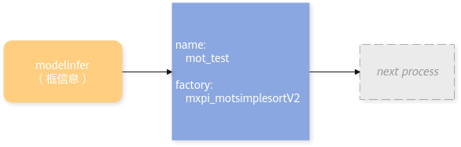
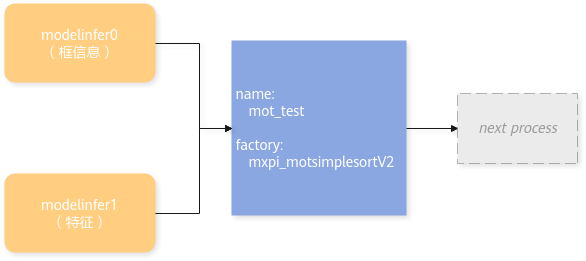

# 智能视频分析（IVA）插件

## mxpi\_motsimplesort

>[!NOTE]
>即将废弃，请使用mxpi\_motsimplesortV2插件。

<table><tbody><tr id="row114791296282"><th class="firstcol" valign="top" width="20%" id="mcps1.1.3.1.1">
功能描述

</th>
<td class="cellrowborder" valign="top" width="80%" headers="mcps1.1.3.1.1 ">
实现多目标（包括机动车，非人目标以及人）路径记录功能。

</td>
</tr>
<tr id="row164790916286"><th class="firstcol" valign="top" width="20%" id="mcps1.1.3.2.1">
<strong id="b174181428135914">约束限制</strong>

</th>
<td class="cellrowborder" valign="top" width="80%" headers="mcps1.1.3.2.1 ">
无

</td>
</tr>
<tr id="row18479892282"><th class="firstcol" valign="top" width="20%" id="mcps1.1.3.3.1">
<strong id="b18401125491520">插件基类（factory）</strong>

</th>
<td class="cellrowborder" valign="top" width="80%" headers="mcps1.1.3.3.1 ">
mxpi_motsimplesort

</td>
</tr>
<tr id="row847969172819"><th class="firstcol" valign="top" width="20%" id="mcps1.1.3.4.1">
<strong id="b3654124811594">输入和输出</strong>

</th>
<td class="cellrowborder" valign="top" width="80%" headers="mcps1.1.3.4.1 "><ul id="ul99267145310"><li>静态输入：buffer（数据类型“MxpiBuffer”）、动态输入：metadata（数据类型“MxpiObjectList”）。</li><li>静态输出：buffer（数据类型“MxpiBuffer”）、metadata（数据类型“MxpiTrackLetList”）。</li></ul>
</td>
</tr>
<tr id="row318725534213"><th class="firstcol" valign="top" width="20%" id="mcps1.1.3.5.1">
<strong id="b198801451175919">属性</strong>

</th>
<td class="cellrowborder" valign="top" width="80%" headers="mcps1.1.3.5.1 ">
请参见<a href="#table20974551943811">表1</a>。

</td>
</tr>
</tbody>
</table>

**表 1**  mxpi\_motsimplesort插件的属性

|属性名|描述|是否为必选项|是否可修改|
|--|--|--|--|
|dataSourceDetection|模型检测后的目标框数据的对应索引（通常情况下为上游元件名称）。|是|是|
|dataSourceFeature|特征提取后的目标特征数据的对应索引（通常情况下为上游元件名称）。|否|是|
|trackThreshold|路径记录对象属于同一目标概率阈值，大于该阈值认为是同一对象（默认值：0.5，取值范围：[0, 1.0]）。|否|是|
|lostThreshold|路径记录目标丢失帧数阈值，帧数大于该阈值认为行程目标已丢失（默认值：5，取值范围：[0, 10]）。|否|是|

## mxpi\_motsimplesortV2

<table><tbody><tr id="row114791296282"><th class="firstcol" valign="top" width="20%" id="mcps1.1.3.1.1">
功能描述

</th>
<td class="cellrowborder" valign="top" width="80%" headers="mcps1.1.3.1.1 ">
实现多目标（包括机动车，非人目标以及人）路径记录功能。相比较前一个版本的差别为：

<ul id="ul837225104915"><li>V2版本对插件的输入端口做了调整：只使用物体的框信息做MOT时，只用连接一个输入端口。在此基础上，若还使用物体的特征信息做MOT，则连接两个输入端口。</li><li>dataSource实现自动配置。</li></ul>
</td>
</tr>
<tr id="row88376102448"><th class="firstcol" valign="top" width="20%" id="mcps1.1.3.2.1">
同步/异步（status）

</th>
<td class="cellrowborder" valign="top" width="80%" headers="mcps1.1.3.2.1 ">
同步

</td>
</tr>
<tr id="row164790916286"><th class="firstcol" valign="top" width="20%" id="mcps1.1.3.3.1">
<strong id="b174181428135914">约束限制</strong>

</th>
<td class="cellrowborder" valign="top" width="80%" headers="mcps1.1.3.3.1 ">
无

</td>
</tr>
<tr id="row18479892282"><th class="firstcol" valign="top" width="20%" id="mcps1.1.3.4.1">
<strong id="b18401125491520">插件基类（factory）</strong>

</th>
<td class="cellrowborder" valign="top" width="80%" headers="mcps1.1.3.4.1 ">
mxpi_motsimplesortV2

</td>
</tr>
<tr id="row847969172819"><th class="firstcol" valign="top" width="20%" id="mcps1.1.3.5.1">
<strong id="b3654124811594">输入和输出</strong>

</th>
<td class="cellrowborder" valign="top" width="80%" headers="mcps1.1.3.5.1 "><ul id="ul223912433115"><li>输入：buffer（数据类型“MxpiBuffer”）、metadata（数据类型“MxpiObjectList”）。</li><li>输出：buffer（数据类型“MxpiBuffer”）、metadata（数据类型“MxpiTrackLetList”）。</li></ul>
</td>
</tr>
<tr id="row15141821151716"><th class="firstcol" valign="top" width="20%" id="mcps1.1.3.6.1">
端口格式（caps）

</th>
<td class="cellrowborder" valign="top" width="80%" headers="mcps1.1.3.6.1 "><ul id="ul13233826183118"><li>静态输入：{"ANY"}、动态输入：{"ANY"}。</li><li>静态输出：{"ANY"}。</li></ul>
</td>
</tr>
<tr id="row318725534213"><th class="firstcol" valign="top" width="20%" id="mcps1.1.3.7.1">
<strong id="b198801451175919">属性</strong>

</th>
<td class="cellrowborder" valign="top" width="80%" headers="mcps1.1.3.7.1 ">
请参见<a href="#table20974551943812">表1</a>。

</td>
</tr>
</tbody>
</table>

**表 1**  mxpi\_motsimplesortV2插件的属性

|属性名|描述|是否为必选项|是否可修改|
|--|--|--|--|
|dataSourceDetection|模型检测后的目标框数据的对应索引（默认为上游插件对应输出端口的key值）。|否|是|
|dataSourceFeature|特征提取后的目标特征数据的对应索引（默认为上游插件对应输出端口的key值）。|否|是|
|trackThreshold|路径记录对象属于同一目标概率阈值，大于该阈值认为是同一对象（默认值：0.5，取值范围：[0, 1.0]）。|否|是|
|lostThreshold|路径记录目标丢失帧数阈值，帧数大于该阈值认为行程目标已丢失（默认值：5，取值范围：[0, 10]）。|否|是|

**示例**

- 只使用物体的bounding box（框信息）做MOT，常见使用场景：对视频中的车进行动向记录。

- 同时使用物体的bounding box（框信息）和物体的特征做MOT，常见使用场景：对视频中的人或目标进行动向记录。

## mxpi\_facealignment

<table><tbody><tr id="row114791296282"><th class="firstcol" valign="top" width="20%" id="mcps1.1.3.1.1">
功能描述

</th>
<td class="cellrowborder" valign="top" width="80%" headers="mcps1.1.3.1.1 ">
目标对齐插件，可用于矫正检测出的目标图像。输入目标图像的关键点信息和需要对齐的目标图像，输出对齐后的目标图像。

</td>
</tr>
<tr id="row2010491232414"><th class="firstcol" valign="top" width="20%" id="mcps1.1.3.2.1">
同步/异步（status）

</th>
<td class="cellrowborder" valign="top" width="80%" headers="mcps1.1.3.2.1 ">
同步

</td>
</tr>
<tr id="row164790916286"><th class="firstcol" valign="top" width="20%" id="mcps1.1.3.3.1">
<strong id="b174181428135914">约束限制</strong>

</th>
<td class="cellrowborder" valign="top" width="80%" headers="mcps1.1.3.3.1 "><ul id="ul98721247161920"><li>输入端口0为目标图像数据。</li><li>输入端口1为目标关键点数据。</li></ul>
</td>
</tr>
<tr id="row18479892282"><th class="firstcol" valign="top" width="20%" id="mcps1.1.3.4.1">
<strong id="b18401125491520">插件基类（factory）</strong>

</th>
<td class="cellrowborder" valign="top" width="80%" headers="mcps1.1.3.4.1 ">
mxpi_facealignment

</td>
</tr>
<tr id="row847969172819"><th class="firstcol" valign="top" width="20%" id="mcps1.1.3.5.1">
<strong id="b3654124811594">输入和输出</strong>

</th>
<td class="cellrowborder" valign="top" width="80%" headers="mcps1.1.3.5.1 "><ul id="ul12599145703615"><li>输入：buffer（数据类型“MxpiBuffer”）。</li><li>输出：buffer（数据类型“MxpiBuffer”）。</li></ul>
</td>
</tr>
<tr id="row318725534213"><th class="firstcol" valign="top" width="20%" id="mcps1.1.3.6.1">
<strong id="b198801451175919">属性</strong>

</th>
<td class="cellrowborder" valign="top" width="80%" headers="mcps1.1.3.6.1 ">
请参见<a href="#table20974551943813">表1</a>。

</td>
</tr>
</tbody>
</table>

**表 1**  mxpi\_facealignment插件的属性

|属性名|描述|是否为必选项|是否可修改|
|--|--|--|--|
|deviceId|使用的昇腾AI处理器的芯片编号，无需设置，统一由stream_config字段中的deviceId属性设置。|否|是|
|dataSourceImage|目标图像输入数据对应索引，默认为上游插件对应输出端口的key值。|否|是|
|dataSourceKeyPoint|目标关键点输入数据对应索引，默认为上游插件对应输出端口的key值。|否|是|
|afterFaceAlignmentHeight|目标对齐后的图像高度，默认为112，取值范围为[32, 8192]。|否|是|
|afterFaceAlignmentWidth|目标对齐后的图像宽度，默认为112，取值范围为[32, 8192]。|否|是|

> [!NOTE]
>请注意“afterFaceAlignmentHeight”与“afterFaceAlignmentWidth”属性值与输入图片的元数据的一致性，否则会由于参数不一致而产生错误信息，导致对齐结果获取失败。同时OpenCV要求高度和宽度需要为**2**的倍数。

## mxpi\_qualitydetection

<table><tbody><tr id="row114791296282"><th class="firstcol" valign="top" width="20%" id="mcps1.1.3.1.1">
功能描述

</th>
<td class="cellrowborder" valign="top" width="80%" headers="mcps1.1.3.1.1 ">
视频质量诊断插件，可用于对视频解码之后的图像进行质量分析检测，对异常的场景进行日志告警。

支持的检测场景有：

<ul id="ul1480863003013"><li>视频亮度异常检测</li><li>视频遮挡异常检测</li><li>视频模糊异常检测</li><li>视频雪花噪声异常检测</li><li>视频偏色异常检测</li><li>视频条纹噪声检测</li><li>视频信号丢失异常检测</li><li>视频冻结异常检测</li><li>视频抖动异常检测</li><li>视频画面突变异常检测</li><li>PTZ云台运动异常检测</li></ul>
</td>
</tr>
<tr id="row164790916286"><th class="firstcol" valign="top" width="20%" id="mcps1.1.3.2.1">
<strong id="b174181428135914">约束限制</strong>

</th>
<td class="cellrowborder" valign="top" width="80%" headers="mcps1.1.3.2.1 ">
该插件仅支持在视频解码插件（mxpi_videodecoder）之后进行配置。

</td>
</tr>
<tr id="row18479892282"><th class="firstcol" valign="top" width="20%" id="mcps1.1.3.3.1">
<strong id="b18401125491520">插件基类（factory）</strong>

</th>
<td class="cellrowborder" valign="top" width="80%" headers="mcps1.1.3.3.1 ">
mxpi_qualitydetection

</td>
</tr>
<tr id="row847969172819"><th class="firstcol" valign="top" width="20%" id="mcps1.1.3.4.1">
<strong id="b3654124811594">输入和输出</strong>

</th>
<td class="cellrowborder" valign="top" width="80%" headers="mcps1.1.3.4.1 "><ul id="ul149166103714"><li>输入：buffer（数据类型“MxpiBuffer”）、metadata（数据类型“MxpiVisionList”）。</li><li>输出：buffer（数据类型“MxpiBuffer”）、metadata（数据类型“MxpiVisionList”）。</li></ul>
</td>
</tr>
<tr id="row126130153510"><th class="firstcol" valign="top" width="20%" id="mcps1.1.3.5.1">
端口格式（caps）

</th>
<td class="cellrowborder" valign="top" width="80%" headers="mcps1.1.3.5.1 "><ul id="ul182788816374"><li>静态输入：{ "image/yuv", "metadata/object" }。</li><li>静态输出：{ "ANY" }。</li></ul>
</td>
</tr>
<tr id="row318725534213"><th class="firstcol" valign="top" width="20%" id="mcps1.1.3.6.1">
<strong id="b198801451175919">属性</strong>

</th>
<td class="cellrowborder" valign="top" width="80%" headers="mcps1.1.3.6.1 ">
请参见<a href="#table20974551943814">表1</a>。

</td>
</tr>
</tbody>
</table>

**表 1**  mxpi\_qualitydetection插件的属性

|属性名|描述|是否为必选项|是否可修改|
|--|--|--|--|
|dataSource|输入数据对应索引（通常情况下为上游元件名称），默认为上游插件对应输出端口的key值。|否|是|
|qualityDetectionConfigContent|质量检测算法属性配置内容，具体属性介绍参考[表2](#table209745519)。|否|是|
|qualityDetectionConfigPath|质量检测算法属性配置文件路径（该属性与qualityDetectionConfigContent须至少配置一项，qualityDetectionConfigContent优先级大于该属性），具体参数介绍参考[表2](#table209745519)。|否|是|

**表 2**  质量检测算法参数介绍

|属性名|描述|默认值|
|--|--|--|
|FRAME_LIST_LEN|插件存放视频帧队列长度。|20|
|BRIGHTNESS_SWITCH|视频亮度检测算法开关。|false|
|BRIGHTNESS_FRAME_INTERVAL|视频亮度检测帧间隔。输入必须是正整数并且小于FRAME_LIST_LEN。当输入小数时自动会向下取整。|10|
|BRIGHTNESS_THRESHOLD|视频亮度检测算法阈值。|1|
|OCCLUSION_SWITCH|视频遮挡检测算法开关。|false|
|OCCLUSION_FRAME_INTERVAL|视频遮挡检测帧间隔。输入必须是正整数并且小于FRAME_LIST_LEN。当输入小数时自动会向下取整。|10|
|OCCLUSION_THRESHOLD|视频遮挡检测算法阈值。|0.32|
|BLUR_SWITCH|视频模糊检测算法开关。|false|
|BLUR_FRAME_INTERVAL|视频模糊检测帧间隔。输入必须是正整数并且小于FRAME_LIST_LEN。当输入小数时自动会向下取整。|10|
|BLUR_THRESHOLD|视频模糊检测算法阈值。|2000|
|NOISE_SWITCH|视频噪声检测算法开关。|false|
|NOISE_FRAME_INTERVAL|视频噪声检测帧间隔。输入必须是正整数并且小于FRAME_LIST_LEN。当输入小数时自动会向下取整。|10|
|NOISE_THRESHOLD|视频噪声检测算法阈值。|0.005|
|COLOR_CAST_SWITCH|视频偏色检测算法开关。|false|
|COLOR_CAST_FRAME_INTERVAL|视频偏色检测帧间隔。输入必须是正整数并且小于FRAME_LIST_LEN。当输入小数时自动会向下取整。|10|
|COLOR_CAST_THRESHOLD|视频偏色检测算法阈值。|1.5|
|STRIPE_SWITCH|视频条纹检测算法开关。|false|
|STRIPE_FRAME_INTERVAL|视频条纹检测帧间隔。输入必须是正整数并且小于FRAME_LIST_LEN。当输入小数时自动会向下取整。|10|
|STRIPE_THRESHOLD|视频条纹检测算法阈值。|0.0015|
|DARK_SWITCH|视频黑屏检测算法开关。|false|
|DARK_FRAME_INTERVAL|视频黑屏检测帧间隔。输入必须是正整数并且小于FRAME_LIST_LEN。当输入小数时自动会向下取整。|10|
|DARK_THRESHOLD|视频黑屏检测算法阈值。|0.72|
|VIDEO_FREEZE_SWITCH|视频冻结检测算法开关。|false|
|VIDEO_FREEZE_FRAME_INTERVAL|视频冻结检测帧间隔。输入必须是正整数并且小于FRAME_LIST_LEN。当输入小数时自动会向下取整。|10|
|VIDEO_FREEZE_THRESHOLD|视频冻结检测算法阈值。|0.1|
|VIEW_SHAKE_SWITCH|视频抖动检测算法开关。|false|
|VIEW_SHAKE_FRAME_INTERVAL|视频抖动检测帧间隔。输入必须是正整数并且小于FRAME_LIST_LEN。当输入小数时自动会向下取整。|10|
|VIEW_SHAKE_THRESHOLD|视频抖动检测算法阈值。|20|
|SCENE_MUTATION_SWITCH|视频突变检测算法开关。|false|
|SCENE_MUTATION_FRAME_INTERVAL|视频突变检测帧间隔。输入必须是正整数并且小于FRAME_LIST_LEN。当输入小数时自动会向下取整。|10|
|SCENE_MUTATION_THRESHOLD|视频突变检测算法阈值。|0.5|
|PTZ_MOVEMENT_SWITCH|PTZ云台运动检测算法开关。|false|
|PTZ_MOVEMENT_FRAME_INTERVAL|PTZ云台运动检测帧间隔。输入必须是大于1的正整数并且小于FRAME_LIST_LEN。当输入小数时自动会向下取整。|10|
|PTZ_MOVEMENT_THRESHOLD|PTZ云台运动检测算法阈值。|0.95|
