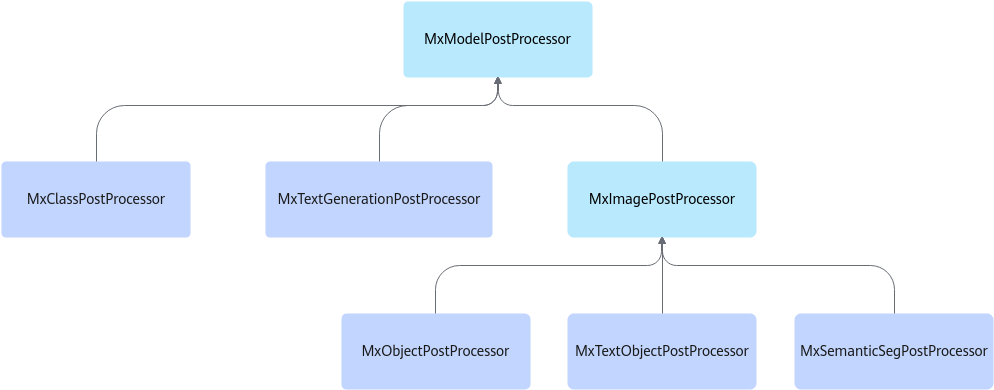

# 模型后处理插件<a name="ZH-CN_TOPIC_0000001928189305"></a>

## 后处理插件基类<a name="ZH-CN_TOPIC_0000001882230528"></a>

模型后处理插件用于对模型推理的输出张量进行后处理并将对应结果写入元数据。由于不同推理任务类型的后处理所需要的输入，以及输出类型都不相同，因此需要采用不同的后处理插件。为了易于复用，Vision SDK已将部分接口和成员提取到后处理基类中。对于每类任务，如目标检测任务，采用动态加载后处理so的方法，实现支持各种模型（如YOLOv3，FasterRCNN，SsdVgg-16等模型）的多态性。

<a name="table15610151945314"></a>
<table><tbody><tr id="row1961141911539"><th class="firstcol" valign="top" width="20%" id="mcps1.1.3.1.1"><p id="p1611141920539"><a name="p1611141920539"></a><a name="p1611141920539"></a>功能描述</p>
</th>
<td class="cellrowborder" valign="top" width="80%" headers="mcps1.1.3.1.1 "><p id="p65901649161110"><a name="p65901649161110"></a><a name="p65901649161110"></a>用于对模型推理的输出张量进行后处理。</p>
</td>
</tr>
<tr id="row1661181917531"><th class="firstcol" valign="top" width="20%" id="mcps1.1.3.2.1"><p id="p14611101935317"><a name="p14611101935317"></a><a name="p14611101935317"></a>约束限制</p>
</th>
<td class="cellrowborder" valign="top" width="80%" headers="mcps1.1.3.2.1 "><p id="p152495510114"><a name="p152495510114"></a><a name="p152495510114"></a>后处理插件当前需要连接在mxpi_tensorinfer推理插件之后使用，只接受MxpiTensorPackageList作为元数据输入。</p>
<p id="p117075411110"><a name="p117075411110"></a><a name="p117075411110"></a>父类不生成插件，子类继承父类生成插件。</p>
</td>
</tr>
<tr id="row15611101955315"><th class="firstcol" valign="top" width="20%" id="mcps1.1.3.3.1"><p id="p41748405414"><a name="p41748405414"></a><a name="p41748405414"></a>父类类名</p>
</th>
<td class="cellrowborder" valign="top" width="80%" headers="mcps1.1.3.3.1 "><p id="p16117198532"><a name="p16117198532"></a><a name="p16117198532"></a>MxModelPostProcessorBase，MxImagePostProcessorBase（图像后处理基类，继承自MxModelPostProcessorBase）。</p>
</td>
</tr>
<tr id="row15611171905313"><th class="firstcol" valign="top" width="20%" id="mcps1.1.3.4.1"><p id="p13611519125311"><a name="p13611519125311"></a><a name="p13611519125311"></a>输入和输出</p>
</th>
<td class="cellrowborder" valign="top" width="80%" headers="mcps1.1.3.4.1 "><a name="ul1371774872712"></a><a name="ul1371774872712"></a><ul id="ul1371774872712"><li>输入：buffer（数据类型“MxpiBuffer”）、metadata（数据类型“MxpiTensorPackageList”）。</li><li>输出：buffer（数据类型“MxpiBuffer”）、metadata（数据类型“MxpiObjectList”，“MxpiClassList”，“MxpiImageMaskList”，“MxpiTextObjectList”等）。</li></ul>
</td>
</tr>
<tr id="row3450191919435"><th class="firstcol" valign="top" width="20%" id="mcps1.1.3.5.1"><p id="p09131511379"><a name="p09131511379"></a><a name="p09131511379"></a>端口格式（caps）</p>
</th>
<td class="cellrowborder" valign="top" width="80%" headers="mcps1.1.3.5.1 "><a name="ul5439151112715"></a><a name="ul5439151112715"></a><ul id="ul5439151112715"><li>静态输入：{"metadata/tensor"}。</li><li>静态输出：子类重写。</li></ul>
</td>
</tr>
<tr id="row17611191910533"><th class="firstcol" valign="top" width="20%" id="mcps1.1.3.6.1"><p id="p16611131911532"><a name="p16611131911532"></a><a name="p16611131911532"></a>属性</p>
</th>
<td class="cellrowborder" valign="top" width="80%" headers="mcps1.1.3.6.1 "><p id="p19611161975316"><a name="p19611161975316"></a><a name="p19611161975316"></a>请参见<a href="#table59552521422118">表1</a>。</p>
</td>
</tr>
</tbody>
</table>

**表 1**  MxModelPostProcessorBase（及MxImagePostProcessorBase）的属性<a id="table59552521422118"></a>

|属性名|描述|是否为必选项|是否可修改|
|--|--|--|--|
|deviceId|使用的Ascend设备的芯片编号，无需设置，统一由stream_config字段中的deviceId属性设置。|否|是|
|postProcessLibPath|后处理动态链接库so文件路径。如果不指定，则不进行后处理，直接将模型推理结果写入元数据MxpiTensorPackageList并将内存拷贝到outputDeviceId指定位置。|否|是|
|labelPath|后处理类别标签路径。|否|是|
|dataSource|输入数据对应索引（通常情况下为上游元件名称），默认为上游插件对应输出端口的key值。|否|是|
|postProcessConfigPath|后处理配置文件路径。|是|是|
|postProcessConfigContent|后处理配置。|否|是|
|dataSourceResize|仅在继承MxImagePostProcessorBase（图像后处理基类）的子类插件中拥有该属性。该属性用于指示是否需要先将模型后处理中的坐标映射回缩放前的图片。在默认情况下，如果不设置该属性，则从推理插件前一个插件获取。如果获取不到，则不会进行坐标的缩放还原。|否|是|
|dataSourceRoiBoxes|仅在继承MxImagePostProcessorBase（图像后处理基类）的子类插件中拥有该属性。该属性用于指示是否需要先将模型推理的坐标映射回抠图前的原图上。在默认情况下，如果不设置该属性，则不映射到原图上。如需要映射，则输入对应的抠图插件名称。|否|是|
|funcLanguage|设置成后处理插件的开发语言，比如C++或Python。|否|是|
|className|后处理类的名称。|是|是|
|pythonModule|加载的后处理module名称，与Python或so内的module名称统一。|是|是|
|dataSourceImage|内部调试中，请勿使用。|否|否|

**表 2**  Python后处理的属性<a id="table1178742619507"></a>

|属性名|描述|是否为必选项|是否可修改|
|--|--|--|--|
|funcLanguage|设置成后处理插件的开发语言，比如C++或Python。|否|是|
|postProcessLibPath|后处理动态链接库so文件目录，该目录下存在后处理的Python文件或so。|是|是|
|className|后处理类的名称。|是|是|
|pythonModule|加载的后处理module名称，与Python或so内的module名称统一。|是|是|
|labelPath|后处理类别标签路径。|否|是|
|dataSource|输入数据对应索引（通常情况下为上游元件名称）。|是|是|
|postProcessConfigPath|后处理配置文件路径。|是|是|
|deviceId|使用的Ascend设备的芯片编号，无需设置，统一由stream_config字段中的deviceId属性设置。|否|是|
|dataSourceResize|仅在继承MxImagePostProcessorBase（图像后处理基类）的子类插件中拥有该属性。该属性用于指示是否需要先将模型后处理中的坐标映射回缩放前的图片。不设置该属性的默认情况下从推理插件前一个插件获取。如果获取不到，则不会进行坐标的缩放还原。|否|是|
|dataSourceRoiBoxes|仅在继承MxImagePostProcessorBase（图像后处理基类）的子类插件中拥有该属性。是否需要先将模型推理的坐标映射回抠图前的原图上。不设置该属性的默认情况下不映射到原图上。如需要映射，则输入对应的抠图插件名称。|否|是|

**图 1**  后处理插件类继承关系图<a name="fig84191822174214"></a>


## mxpi\_objectpostprocessor<a name="ZH-CN_TOPIC_0000001882390452"></a>

<a name="table15610151945314"></a>
<table><tbody><tr id="row1961141911539"><th class="firstcol" valign="top" width="20%" id="mcps1.1.3.1.1"><p id="p1611141920539"><a name="p1611141920539"></a><a name="p1611141920539"></a>功能描述</p>
</th>
<td class="cellrowborder" valign="top" width="80%" headers="mcps1.1.3.1.1 "><p id="p65901649161110"><a name="p65901649161110"></a><a name="p65901649161110"></a>继承图像后处理基类，用于对目标检测模型推理的输出张量进行后处理。</p>
</td>
</tr>
<tr id="row1661181917531"><th class="firstcol" valign="top" width="20%" id="mcps1.1.3.2.1"><p id="p14611101935317"><a name="p14611101935317"></a><a name="p14611101935317"></a>约束限制</p>
</th>
<td class="cellrowborder" valign="top" width="80%" headers="mcps1.1.3.2.1 "><p id="p152495510114"><a name="p152495510114"></a><a name="p152495510114"></a>目前其上游只能连接mxpi_tensorinfer推理插件，只接受MxpiTensorPackageList作为元数据输入。调用mxBase仓的分类基类Process接口实现通讯，接受ObjectInfo数据类型的返回。</p>
</td>
</tr>
<tr id="row15611101955315"><th class="firstcol" valign="top" width="20%" id="mcps1.1.3.3.1"><p id="p5996114714144"><a name="p5996114714144"></a><a name="p5996114714144"></a>插件基类（factory）</p>
</th>
<td class="cellrowborder" valign="top" width="80%" headers="mcps1.1.3.3.1 "><p id="p0575174311912"><a name="p0575174311912"></a><a name="p0575174311912"></a>mxpi_objectpostprocessor</p>
</td>
</tr>
<tr id="row15611171905313"><th class="firstcol" valign="top" width="20%" id="mcps1.1.3.4.1"><p id="p13611519125311"><a name="p13611519125311"></a><a name="p13611519125311"></a>输入和输出</p>
</th>
<td class="cellrowborder" valign="top" width="80%" headers="mcps1.1.3.4.1 "><a name="ul3442104113019"></a><a name="ul3442104113019"></a><ul id="ul3442104113019"><li>输入：buffer（数据类型“MxpiBuffer”）、metadata（数据类型“MxpiTensorPackageList”）。</li><li>输出：buffer（数据类型“MxpiBuffer”）、metadata（数据类型“MxpiObjectList”）。</li></ul>
</td>
</tr>
<tr id="row3450191919435"><th class="firstcol" valign="top" width="20%" id="mcps1.1.3.5.1"><p id="p09131511379"><a name="p09131511379"></a><a name="p09131511379"></a>端口格式（caps）</p>
</th>
<td class="cellrowborder" valign="top" width="80%" headers="mcps1.1.3.5.1 "><a name="ul224811643018"></a><a name="ul224811643018"></a><ul id="ul224811643018"><li>静态输入：{"metadata/tensor"}。</li><li>静态输出：{"metadata/object"}。</li></ul>
</td>
</tr>
<tr id="row17611191910533"><th class="firstcol" valign="top" width="20%" id="mcps1.1.3.6.1"><p id="p16611131911532"><a name="p16611131911532"></a><a name="p16611131911532"></a>属性</p>
</th>
<td class="cellrowborder" valign="top" width="80%" headers="mcps1.1.3.6.1 "><p id="p19611161975316"><a name="p19611161975316"></a><a name="p19611161975316"></a>请参见<a href="#table59552521422118">表1</a>和<a href="#table1178742619507">表2</a>。</p>
</td>
</tr>
</tbody>
</table>

Python后处理插件pipeline样例：

```json
"mxpi_objectpostprocessor0": {
            "props": {
                "funcLanguage":"python",
                "postProcessConfigPath": "../models/yolov3/yolov3_tf_bs1_fp16.cfg",
                "labelPath": "../models/yolov3/yolov3.names",
                "postProcessLibPath": "../../../python",
                "className":"Yolov3PostProcess",
                "pythonModule":"postprocess.post"
            },
            "factory": "mxpi_objectpostprocessor",
            "next": "mxpi_dataserialize0"
        },
```

C++后处理插件pipeline样例：

```json
"mxpi_objectpostprocessor0": {
 "props": {
                "dataSource": "mxpi_tensorinfer0",
                "funcLanguage":"c++",
                "postProcessConfigPath": "../models/yolov3/yolov3_tf_bs1_fp16.cfg",
                "labelPath": "../models/yolov3/yolov3.names",
                "postProcessLibPath": "../../../lib/modelpostprocessors/libyolov3postprocess.so"
        },
        "factory": "mxpi_objectpostprocessor",
        "next": "mxpi_dataserialize0"
},
```

## mxpi\_classpostprocessor<a name="ZH-CN_TOPIC_0000001928269717"></a>

<a name="table15610151945314"></a>
<table><tbody><tr id="row1961141911539"><th class="firstcol" valign="top" width="20%" id="mcps1.1.3.1.1"><p id="p1611141920539"><a name="p1611141920539"></a><a name="p1611141920539"></a>功能描述</p>
</th>
<td class="cellrowborder" valign="top" width="80%" headers="mcps1.1.3.1.1 "><p id="p65901649161110"><a name="p65901649161110"></a><a name="p65901649161110"></a>继承模型后处理基类，用于对分类模型推理的输出张量进行后处理。</p>
</td>
</tr>
<tr id="row1661181917531"><th class="firstcol" valign="top" width="20%" id="mcps1.1.3.2.1"><p id="p14611101935317"><a name="p14611101935317"></a><a name="p14611101935317"></a>约束限制</p>
</th>
<td class="cellrowborder" valign="top" width="80%" headers="mcps1.1.3.2.1 "><p id="p152495510114"><a name="p152495510114"></a><a name="p152495510114"></a>目前其上游只能连接mxpi_tensorinfer推理插件，只接受MxpiTensorPackageList作为元数据输入。</p>
<p id="p16931055182520"><a name="p16931055182520"></a><a name="p16931055182520"></a>调用mxBase仓的目标检测基类Process接口实现通讯，接受ClassInfo数据类型的返回。</p>
</td>
</tr>
<tr id="row15611101955315"><th class="firstcol" valign="top" width="20%" id="mcps1.1.3.3.1"><p id="p5996114714144"><a name="p5996114714144"></a><a name="p5996114714144"></a>插件基类（factory）</p>
</th>
<td class="cellrowborder" valign="top" width="80%" headers="mcps1.1.3.3.1 "><p id="p0575174311912"><a name="p0575174311912"></a><a name="p0575174311912"></a>mxpi_classpostprocessor</p>
</td>
</tr>
<tr id="row15611171905313"><th class="firstcol" valign="top" width="20%" id="mcps1.1.3.4.1"><p id="p13611519125311"><a name="p13611519125311"></a><a name="p13611519125311"></a>输入和输出</p>
</th>
<td class="cellrowborder" valign="top" width="80%" headers="mcps1.1.3.4.1 "><a name="ul142521613113013"></a><a name="ul142521613113013"></a><ul id="ul142521613113013"><li>输入：buffer（数据类型“MxpiBuffer”）、metadata（数据类型“MxpiTensorPackageList”）。</li><li>输出：buffer（数据类型“MxpiBuffer”）、metadata（数据类型“MxpiClassList”）。</li></ul>
</td>
</tr>
<tr id="row3450191919435"><th class="firstcol" valign="top" width="20%" id="mcps1.1.3.5.1"><p id="p09131511379"><a name="p09131511379"></a><a name="p09131511379"></a>端口格式（caps）</p>
</th>
<td class="cellrowborder" valign="top" width="80%" headers="mcps1.1.3.5.1 "><a name="ul15171111583011"></a><a name="ul15171111583011"></a><ul id="ul15171111583011"><li>静态输入：{"metadata/tensor"}。</li><li>静态输出：{"metadata/class"}。</li></ul>
</td>
</tr>
<tr id="row17611191910533"><th class="firstcol" valign="top" width="20%" id="mcps1.1.3.6.1"><p id="p16611131911532"><a name="p16611131911532"></a><a name="p16611131911532"></a>属性</p>
</th>
<td class="cellrowborder" valign="top" width="80%" headers="mcps1.1.3.6.1 "><p id="p19611161975316"><a name="p19611161975316"></a><a name="p19611161975316"></a>请参见<a href="#table59552521422118">表1</a>和<a href="#table1178742619507">表2</a>。</p>
</td>
</tr>
</tbody>
</table>

Python后处理插件pipeline样例：

```json
"mxpi_classpostprocessor0": {
        "props": {
                "funcLanguage":"python",
                "postProcessConfigPath": "../models/resnet50/resnet50_aipp_tf.cfg",
                "labelPath": "../models/resnet50/resnet50_clsidx_to_labels.names",
                "postProcessLibPath": "../../../python",
                "className":"Resnet50PostProcess",
                "pythonModule":"postprocess.post"
        },
        "factory": "mxpi_classpostprocessor",
        "next": "mxpi_dataserialize0"
},
```

C++后处理插件pipeline样例：

```json
"mxpi_classpostprocessor0": {
        "props": {
                "dataSource": "mxpi_tensorinfer0",
                "funcLanguage":"c++",
  "postProcessConfigPath": "../models/resnet50/resnet50_aipp_tf.cfg",
  "labelPath": "../models/resnet50/resnet50_clsidx_to_labels.names",
  "postProcessLibPath": "../../../lib/modelpostprocessors/libresnet50postprocess.so"
        },
        "factory": "mxpi_classpostprocessor",
        "next": "mxpi_dataserialize0"
},
```

## mxpi\_semanticsegpostprocessor<a name="ZH-CN_TOPIC_0000001928189309"></a>

<a name="table15610151945314"></a>
<table><tbody><tr id="row1961141911539"><th class="firstcol" valign="top" width="20%" id="mcps1.1.3.1.1"><p id="p1611141920539"><a name="p1611141920539"></a><a name="p1611141920539"></a>功能描述</p>
</th>
<td class="cellrowborder" valign="top" width="80%" headers="mcps1.1.3.1.1 "><p id="p65901649161110"><a name="p65901649161110"></a><a name="p65901649161110"></a>继承图像后处理基类，用于对语义分割模型推理的输出张量进行后处理。</p>
</td>
</tr>
<tr id="row1661181917531"><th class="firstcol" valign="top" width="20%" id="mcps1.1.3.2.1"><p id="p14611101935317"><a name="p14611101935317"></a><a name="p14611101935317"></a>约束限制</p>
</th>
<td class="cellrowborder" valign="top" width="80%" headers="mcps1.1.3.2.1 "><p id="p874212451648"><a name="p874212451648"></a><a name="p874212451648"></a>目前其上游只能连接mxpi_tensorinfer推理插件，只接受MxpiTensorPackageList作为元数据输入。</p>
<p id="p152495510114"><a name="p152495510114"></a><a name="p152495510114"></a>调用mxBase仓的目标检测基类Process接口实现通讯，接受SemanticSegInfo数据类型的返回。</p>
</td>
</tr>
<tr id="row15611101955315"><th class="firstcol" valign="top" width="20%" id="mcps1.1.3.3.1"><p id="p5996114714144"><a name="p5996114714144"></a><a name="p5996114714144"></a>插件基类（factory）</p>
</th>
<td class="cellrowborder" valign="top" width="80%" headers="mcps1.1.3.3.1 "><p id="p0575174311912"><a name="p0575174311912"></a><a name="p0575174311912"></a>mxpi_semanticsegpostprocessor</p>
</td>
</tr>
<tr id="row15611171905313"><th class="firstcol" valign="top" width="20%" id="mcps1.1.3.4.1"><p id="p13611519125311"><a name="p13611519125311"></a><a name="p13611519125311"></a>输入和输出</p>
</th>
<td class="cellrowborder" valign="top" width="80%" headers="mcps1.1.3.4.1 "><a name="ul95821819163018"></a><a name="ul95821819163018"></a><ul id="ul95821819163018"><li>输入：buffer（数据类型“MxpiBuffer”）、metadata（数据类型“MxpiTensorPackageList”）。</li><li>输出：buffer（数据类型“MxpiBuffer”）、metadata（数据类型“MxpiImageMaskList”）。</li></ul>
</td>
</tr>
<tr id="row3450191919435"><th class="firstcol" valign="top" width="20%" id="mcps1.1.3.5.1"><p id="p09131511379"><a name="p09131511379"></a><a name="p09131511379"></a>端口格式（caps）</p>
</th>
<td class="cellrowborder" valign="top" width="80%" headers="mcps1.1.3.5.1 "><a name="ul66331621173016"></a><a name="ul66331621173016"></a><ul id="ul66331621173016"><li>静态输入：{"metadata/tensor"}。</li><li>静态输出：{"metadata/semanticseg"}。</li></ul>
</td>
</tr>
<tr id="row17611191910533"><th class="firstcol" valign="top" width="20%" id="mcps1.1.3.6.1"><p id="p16611131911532"><a name="p16611131911532"></a><a name="p16611131911532"></a>属性</p>
</th>
<td class="cellrowborder" valign="top" width="80%" headers="mcps1.1.3.6.1 "><p id="p19611161975316"><a name="p19611161975316"></a><a name="p19611161975316"></a>请参见<a href="#table59552521422118">表1</a>和<a href="#table1178742619507">表2</a>。</p>
</td>
</tr>
</tbody>
</table>

Python后处理插件pipeline样例：

```json
"mxpi_semanticsegpostprocessor0": {
 "props": {
  "dataSource": "mxpi_tensorinfer0",
                "funcLanguage":"python",
  "postProcessConfigPath": "../models/deeplabv3/deeplabv3.cfg",
  "labelPath": "../models/deeplabv3/deeplabv3.names",
  "postProcessLibPath": "../../../python",
                "className":"Deeplabv3Post",
                "pythonModule":"postprocess.post"
  },
 "factory": "mxpi_semanticsegpostprocessor",
 "next": "mxpi_dataserialize0"
},
```

C++后处理插件pipeline样例：

```json
"mxpi_semanticsegpostprocessor0": {
    "props": {
        "dataSource": "mxpi_tensorinfer0",
                "funcLanguage":"c++",
        "postProcessConfigPath": "../models/deeplabv3/deeplabv3.cfg",
        "labelPath": "../models/deeplabv3/deeplabv3.names",
        "postProcessLibPath": "../../../lib/modelpostprocessors/libdeeplabv3postprocess.so"
        },
    "factory": "mxpi_semanticsegpostprocessor",
    "next": "mxpi_dataserialize0"
},
```

## mxpi\_textgenerationpostprocessor<a name="ZH-CN_TOPIC_0000001882230532"></a>

<a name="table15610151945314"></a>
<table><tbody><tr id="row1961141911539"><th class="firstcol" valign="top" width="20%" id="mcps1.1.3.1.1"><p id="p1611141920539"><a name="p1611141920539"></a><a name="p1611141920539"></a>功能描述</p>
</th>
<td class="cellrowborder" valign="top" width="80%" headers="mcps1.1.3.1.1 "><p id="p65901649161110"><a name="p65901649161110"></a><a name="p65901649161110"></a>继承模型后处理基类，用于对文本生成（以及翻译，文字识别，语音识别等）模型推理的输出张量进行后处理。</p>
</td>
</tr>
<tr id="row1661181917531"><th class="firstcol" valign="top" width="20%" id="mcps1.1.3.2.1"><p id="p14611101935317"><a name="p14611101935317"></a><a name="p14611101935317"></a>约束限制</p>
</th>
<td class="cellrowborder" valign="top" width="80%" headers="mcps1.1.3.2.1 "><p id="p152495510114"><a name="p152495510114"></a><a name="p152495510114"></a>目前其上游只能连接mxpi_tensorinfer推理插件，只接受MxpiTensorPackageList作为元数据输入。调用mxBase仓的目标检测基类Process接口实现通讯，接受TextsInfo数据类型的返回。</p>
</td>
</tr>
<tr id="row15611101955315"><th class="firstcol" valign="top" width="20%" id="mcps1.1.3.3.1"><p id="p5996114714144"><a name="p5996114714144"></a><a name="p5996114714144"></a>插件基类（factory）</p>
</th>
<td class="cellrowborder" valign="top" width="80%" headers="mcps1.1.3.3.1 "><p id="p0575174311912"><a name="p0575174311912"></a><a name="p0575174311912"></a>mxpi_textgenerationpostprocessor</p>
</td>
</tr>
<tr id="row15611171905313"><th class="firstcol" valign="top" width="20%" id="mcps1.1.3.4.1"><p id="p13611519125311"><a name="p13611519125311"></a><a name="p13611519125311"></a>输入和输出</p>
</th>
<td class="cellrowborder" valign="top" width="80%" headers="mcps1.1.3.4.1 "><a name="ul1720112372301"></a><a name="ul1720112372301"></a><ul id="ul1720112372301"><li>输入：buffer（数据类型“MxpiBuffer”）、metadata（数据类型“MxpiTensorPackageList”）。</li><li>输出：buffer（数据类型“MxpiBuffer”）、metadata（数据类型“MxpiTextsInfoList”）。</li></ul>
</td>
</tr>
<tr id="row3450191919435"><th class="firstcol" valign="top" width="20%" id="mcps1.1.3.5.1"><p id="p09131511379"><a name="p09131511379"></a><a name="p09131511379"></a>端口格式（caps）</p>
</th>
<td class="cellrowborder" valign="top" width="80%" headers="mcps1.1.3.5.1 "><a name="ul89902038193010"></a><a name="ul89902038193010"></a><ul id="ul89902038193010"><li>静态输入：{"metadata/tensor"}。</li><li>静态输出：{"metadata/text"}。</li></ul>
</td>
</tr>
<tr id="row17611191910533"><th class="firstcol" valign="top" width="20%" id="mcps1.1.3.6.1"><p id="p16611131911532"><a name="p16611131911532"></a><a name="p16611131911532"></a>属性</p>
</th>
<td class="cellrowborder" valign="top" width="80%" headers="mcps1.1.3.6.1 "><p id="p19611161975316"><a name="p19611161975316"></a><a name="p19611161975316"></a>请参见<a href="#table59552521422118">表1</a>和<a href="#table1178742619507">表2</a>。</p>
</td>
</tr>
</tbody>
</table>

Python后处理插件pipeline样例：

```json
"mxpi_textgenerationpostprocessor0": {
 "props": {
  "dataSource": "mxpi_tensorinfer0",
                "funcLanguage":"python",
  "postProcessConfigPath": "../models/crnnms/crnn.cfg",
  "labelPath": "../models/crnnms/crnn.names",
  "postProcessLibPath": "../../../python",
                "className":"CrnnPostProcess",
                "pythonModule":"postprocess.post"
 },
 "factory": "mxpi_textgenerationpostprocessor",
 "next": "mxpi_dataserialize0"
},
```

C++后处理插件pipeline样例：

```json
"mxpi_textgenerationpostprocessor0": {
 "props": {
  "dataSource": "mxpi_tensorinfer0",
                "funcLanguage":"c++",
  "postProcessConfigPath": "../models/crnnms/crnn.cfg",
  "labelPath": "../models/crnnms/crnn.names",
  "postProcessLibPath": "../../../lib/modelpostprocessors/libcrnnpostprocess.so"
 },
 "factory": "mxpi_textgenerationpostprocessor",
 "next": "mxpi_dataserialize0"
},
```

## mxpi\_textobjectpostprocessor<a name="ZH-CN_TOPIC_0000001882390456"></a>

<a name="table15610151945314"></a>
<table><tbody><tr id="row1961141911539"><th class="firstcol" valign="top" width="20%" id="mcps1.1.3.1.1"><p id="p1611141920539"><a name="p1611141920539"></a><a name="p1611141920539"></a>功能描述</p>
</th>
<td class="cellrowborder" valign="top" width="80%" headers="mcps1.1.3.1.1 "><p id="p65901649161110"><a name="p65901649161110"></a><a name="p65901649161110"></a>继承图像后处理基类，用于对文本目标框检测模型推理的输出张量进行后处理。</p>
</td>
</tr>
<tr id="row1661181917531"><th class="firstcol" valign="top" width="20%" id="mcps1.1.3.2.1"><p id="p14611101935317"><a name="p14611101935317"></a><a name="p14611101935317"></a>约束限制</p>
</th>
<td class="cellrowborder" valign="top" width="80%" headers="mcps1.1.3.2.1 "><p id="p152495510114"><a name="p152495510114"></a><a name="p152495510114"></a>目前其上游只能连接mxpi_tensorinfer推理插件，只接受MxpiTensorPackageList作为元数据输入。调用mxBase仓的目标检测基类Process接口实现通讯，接受TextObjectInfo数据类型的返回。</p>
</td>
</tr>
<tr id="row15611101955315"><th class="firstcol" valign="top" width="20%" id="mcps1.1.3.3.1"><p id="p5996114714144"><a name="p5996114714144"></a><a name="p5996114714144"></a>插件基类（factory）</p>
</th>
<td class="cellrowborder" valign="top" width="80%" headers="mcps1.1.3.3.1 "><p id="p0575174311912"><a name="p0575174311912"></a><a name="p0575174311912"></a>mxpi_textobjectpostprocessor</p>
</td>
</tr>
<tr id="row15611171905313"><th class="firstcol" valign="top" width="20%" id="mcps1.1.3.4.1"><p id="p13611519125311"><a name="p13611519125311"></a><a name="p13611519125311"></a>输入和输出</p>
</th>
<td class="cellrowborder" valign="top" width="80%" headers="mcps1.1.3.4.1 "><a name="ul2017465143014"></a><a name="ul2017465143014"></a><ul id="ul2017465143014"><li>输入：buffer（数据类型“MxpiBuffer”）、metadata（数据类型“MxpiTensorPackageList”）。</li><li>输出：buffer（数据类型“MxpiBuffer”）、metadata（数据类型“MxpiTextObjectList”）。</li></ul>
</td>
</tr>
<tr id="row3450191919435"><th class="firstcol" valign="top" width="20%" id="mcps1.1.3.5.1"><p id="p09131511379"><a name="p09131511379"></a><a name="p09131511379"></a>端口格式（caps）</p>
</th>
<td class="cellrowborder" valign="top" width="80%" headers="mcps1.1.3.5.1 "><a name="ul51831353133015"></a><a name="ul51831353133015"></a><ul id="ul51831353133015"><li>静态输入：{"metadata/tensor"}。</li><li>静态输出：{"metadata/textobject"}。</li></ul>
</td>
</tr>
<tr id="row17611191910533"><th class="firstcol" valign="top" width="20%" id="mcps1.1.3.6.1"><p id="p16611131911532"><a name="p16611131911532"></a><a name="p16611131911532"></a>属性</p>
</th>
<td class="cellrowborder" valign="top" width="80%" headers="mcps1.1.3.6.1 "><p id="p19611161975316"><a name="p19611161975316"></a><a name="p19611161975316"></a>请参见<a href="#table59552521422118">表1</a>和<a href="#table1178742619507">表2</a>。</p>
</td>
</tr>
</tbody>
</table>

Python后处理插件pipeline样例：

```json
"mxpi_textobjectpostprocessor0": {
 "props": {
  "dataSource": "mxpi_tensorinfer0",
                "funcLanguage":"python",
  "postProcessConfigPath": "../models/ctpn_ms_cv/ctpn_mindspore.cfg",
  "postProcessLibPath": "../../../python",
  "labelPath": "../models/ctpn_ms_cv/ctpn.names",
                "className":"CtpnPostProcess",
                "pythonModule":"postprocess.post"
 },
 "factory": "mxpi_textobjectpostprocessor",
 "next": "mxpi_dataserialize0"
},
```

C++后处理插件pipeline样例：

```json
"mxpi_textobjectpostprocessor0": {
 "props": {
  "dataSource": "mxpi_tensorinfer0",
                "funcLanguage":"c++",
  "postProcessConfigPath": "../models/ctpn_ms_cv/ctpn_mindspore.cfg",
  "postProcessLibPath": "../../../lib/modelpostprocessors/libctpnpostprocess.so",
  "labelPath": "../models/ctpn_ms_cv/ctpn.names"
 },
 "factory": "mxpi_textobjectpostprocessor",
 "next": "mxpi_dataserialize0"
},
```

## mxpi\_keypointpostprocessor<a name="ZH-CN_TOPIC_0000001928269721"></a>

<a name="table15610151945314"></a>
<table><tbody><tr id="row1961141911539"><th class="firstcol" valign="top" width="20%" id="mcps1.1.3.1.1"><p id="p1611141920539"><a name="p1611141920539"></a><a name="p1611141920539"></a>功能描述</p>
</th>
<td class="cellrowborder" valign="top" width="80%" headers="mcps1.1.3.1.1 "><p id="p65901649161110"><a name="p65901649161110"></a><a name="p65901649161110"></a>继承图像后处理基类，用于对姿态检测模型推理的输出张量进行后处理。</p>
</td>
</tr>
<tr id="row1661181917531"><th class="firstcol" valign="top" width="20%" id="mcps1.1.3.2.1"><p id="p14611101935317"><a name="p14611101935317"></a><a name="p14611101935317"></a>约束限制</p>
</th>
<td class="cellrowborder" valign="top" width="80%" headers="mcps1.1.3.2.1 "><p id="p152495510114"><a name="p152495510114"></a><a name="p152495510114"></a>目前其上游只能连接mxpi_tensorinfer推理插件，只接受MxpiTensorPackageList作为元数据输入。调用mxBase仓的目标检测基类Process接口实现通讯，接受KeyPointInfo数据类型的返回。</p>
</td>
</tr>
<tr id="row15611101955315"><th class="firstcol" valign="top" width="20%" id="mcps1.1.3.3.1"><p id="p5996114714144"><a name="p5996114714144"></a><a name="p5996114714144"></a>插件基类（factory）</p>
</th>
<td class="cellrowborder" valign="top" width="80%" headers="mcps1.1.3.3.1 "><p id="p139796208462"><a name="p139796208462"></a><a name="p139796208462"></a>mxpi_keypointpostprocessor</p>
</td>
</tr>
<tr id="row15611171905313"><th class="firstcol" valign="top" width="20%" id="mcps1.1.3.4.1"><p id="p13611519125311"><a name="p13611519125311"></a><a name="p13611519125311"></a>输入和输出</p>
</th>
<td class="cellrowborder" valign="top" width="80%" headers="mcps1.1.3.4.1 "><a name="ul11525523117"></a><a name="ul11525523117"></a><ul id="ul11525523117"><li>输入：buffer（数据类型“MxpiBuffer”）、metadata（数据类型“MxpiTensorPackageList”）。</li><li>输出：buffer（数据类型“MxpiBuffer”）、metadata（数据类型“MxpiPoseList”）。</li></ul>
</td>
</tr>
<tr id="row3450191919435"><th class="firstcol" valign="top" width="20%" id="mcps1.1.3.5.1"><p id="p09131511379"><a name="p09131511379"></a><a name="p09131511379"></a>端口格式（caps）</p>
</th>
<td class="cellrowborder" valign="top" width="80%" headers="mcps1.1.3.5.1 "><a name="ul91441793118"></a><a name="ul91441793118"></a><ul id="ul91441793118"><li>静态输入：{"metadata/tensor"}。</li><li>静态输出：{"metadata/keypoint"}。</li></ul>
</td>
</tr>
<tr id="row17611191910533"><th class="firstcol" valign="top" width="20%" id="mcps1.1.3.6.1"><p id="p16611131911532"><a name="p16611131911532"></a><a name="p16611131911532"></a>属性</p>
</th>
<td class="cellrowborder" valign="top" width="80%" headers="mcps1.1.3.6.1 "><p id="p19611161975316"><a name="p19611161975316"></a><a name="p19611161975316"></a>请参见<a href="#table59552521422118">表1</a>和<a href="#table1178742619507">表2</a>。</p>
</td>
</tr>
</tbody>
</table>

Python后处理插件pipeline样例：

```json
"mxpi_keypointpostprocessor0": {
            "props": {
                "funcLanguage":"python",
                "postProcessConfigPath": "../models/openpose/openpose.cfg",
                "labelPath": "../models/openpose/coco.names",
                "postProcessLibPath": "../../../python",
                "className":"OpenPosePostProcess",
                "pythonModule":"postprocess.post"
            },
            "factory": "mxpi_keypointpostprocessor",
            "next": "mxpi_dataserialize0"
        },
```

C++后处理插件pipeline样例：

```json
   "mxpi_keypointpostprocessor0": {
        "props": {
            "dataSource": "mxpi_tensorinfer0",
            "postProcessConfigPath": "../models/openpose/openpose.cfg",
            "labelPath": "../models/openpose/coco.names",
            "postProcessLibPath": "libopenposepostprocess.so"
        },
        "factory": "mxpi_keypointpostprocessor",
        "next": "mxpi_dataserialize0"
    },
```
