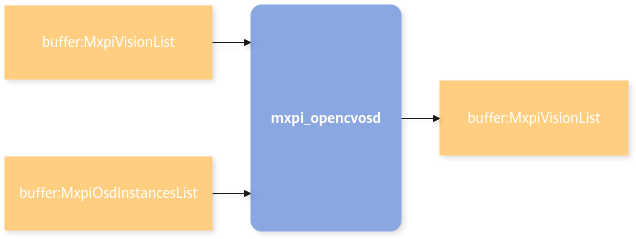
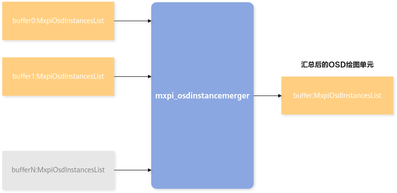
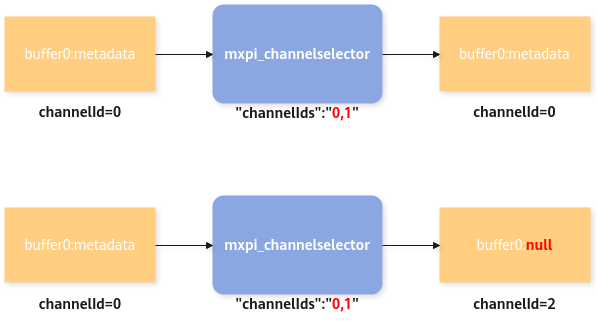
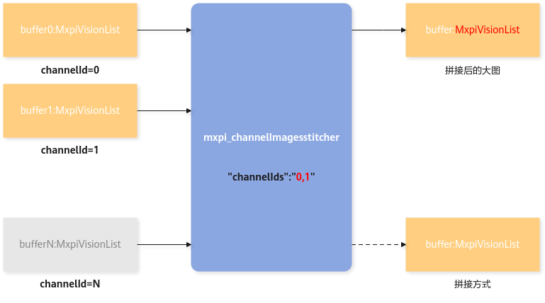
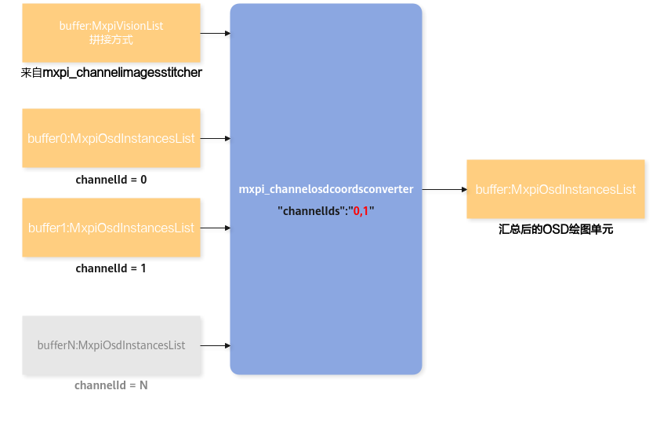

# 屏幕展示（OSD）插件<a name="ZH-CN_TOPIC_0000001928189321"></a>

## 简介<a name="ZH-CN_TOPIC_0000001882230544"></a>

OSD基础功能相关插件。

主要实现在图片上绘制基本单元，如画框、画线、画圆、写字等功能，涉及目标框转绘图，分类转绘图，拼图以及坐标转换等插件。

## mxpi\_opencvosd<a name="ZH-CN_TOPIC_0000001882390468"></a>

使用mxpi\_opencvosd插件前，需要使用osd相关的模型文件，请执行Vision SDK软件包安装目录下operators/opencvosd/generate\_osd\_om.sh脚本生成所需模型文件。支持单个pipeline创建多个mxpi\_opencvosd实例。

>[!NOTICE]
>
>- 确保当前用户ATC相关环境变量已设置正确，可以正常使用ATC工具。
>- 用户需具备ASCEND\_OPP\_PATH目录写权限。root用户默认ASCEND\_OPP\_PATH路径为：“/usr/local/Ascend/cann/opp”；普通用户默认ASCEND\_OPP\_PATH路径为：“$HOME/Ascend/cann/opp”。

<a name="table17383121414181"></a>
<table><tbody><tr id="row143841714171819"><th class="firstcol" valign="top" width="20%" id="mcps1.1.3.1.1"><p id="p64681418313"><a name="p64681418313"></a><a name="p64681418313"></a>功能描述</p>
</th>
<td class="cellrowborder" valign="top" width="80%" headers="mcps1.1.3.1.1 "><p id="p438451481817"><a name="p438451481817"></a><a name="p438451481817"></a>调用OSD基础功能在图片上绘制基本单元，如画框、写字、画线、画圆等。</p>
</td>
</tr>
<tr id="row5320113744419"><th class="firstcol" valign="top" width="20%" id="mcps1.1.3.2.1"><p id="p96181743163715"><a name="p96181743163715"></a><a name="p96181743163715"></a>同步/异步（status）</p>
</th>
<td class="cellrowborder" valign="top" width="80%" headers="mcps1.1.3.2.1 "><p id="p961844318372"><a name="p961844318372"></a><a name="p961844318372"></a>同步</p>
</td>
</tr>
<tr id="row838401412185"><th class="firstcol" valign="top" width="20%" id="mcps1.1.3.3.1"><p id="p6384214161814"><a name="p6384214161814"></a><a name="p6384214161814"></a><strong id="b13384814171818"><a name="b13384814171818"></a><a name="b13384814171818"></a>约束限制</strong></p>
</th>
<td class="cellrowborder" valign="top" width="80%" headers="mcps1.1.3.3.1 "><a name="ul1156955417114"></a><a name="ul1156955417114"></a><ul id="ul1156955417114"><li>MxpiOsdInstancesList中的osd参数需符合OpenCV接口限制。</li><li>每个输入buffer中的MxpiVisionList与MxpiOsdInstancesList长度一致。</li></ul>
</td>
</tr>
<tr id="row183841814121810"><th class="firstcol" valign="top" width="20%" id="mcps1.1.3.4.1"><p id="p6384181413189"><a name="p6384181413189"></a><a name="p6384181413189"></a><strong id="b12384171417185"><a name="b12384171417185"></a><a name="b12384171417185"></a>插件基类（factory）</strong></p>
</th>
<td class="cellrowborder" valign="top" width="80%" headers="mcps1.1.3.4.1 "><p id="p738414146187"><a name="p738414146187"></a><a name="p738414146187"></a>mxpi_opencvosd</p>
</td>
</tr>
<tr id="row6384101411810"><th class="firstcol" valign="top" width="20%" id="mcps1.1.3.5.1"><p id="p14384201471817"><a name="p14384201471817"></a><a name="p14384201471817"></a><strong id="b163841014121818"><a name="b163841014121818"></a><a name="b163841014121818"></a>输入和输出</strong></p>
</th>
<td class="cellrowborder" valign="top" width="80%" headers="mcps1.1.3.5.1 "><a name="ul35121357193712"></a><a name="ul35121357193712"></a><ul id="ul35121357193712"><li>输入：buffer（数据类型“MxpiBuffer”）、metadata（数据类型“MxpiVisionList”）、metadata（数据类型“MxpiOsdInstancesList”）。</li><li>输出：buffer（数据类型“MxpiBuffer”）、metadata（数据类型“MxpiVisionList”）。</li></ul>
</td>
</tr>
<tr id="row19248352143918"><th class="firstcol" valign="top" width="20%" id="mcps1.1.3.6.1"><p id="p09131511379"><a name="p09131511379"></a><a name="p09131511379"></a>端口格式（caps）</p>
</th>
<td class="cellrowborder" valign="top" width="80%" headers="mcps1.1.3.6.1 "><a name="ul162610599377"></a><a name="ul162610599377"></a><ul id="ul162610599377"><li>静态双输入：{"image/yuv"}，{"metadata/osd"}。</li><li>静态输出：{"image/yuv"}。</li></ul>
</td>
</tr>
<tr id="row1384714151814"><th class="firstcol" valign="top" width="20%" id="mcps1.1.3.7.1"><p id="p438451415186"><a name="p438451415186"></a><a name="p438451415186"></a><strong id="b1384151415187"><a name="b1384151415187"></a><a name="b1384151415187"></a>属性</strong></p>
</th>
<td class="cellrowborder" valign="top" width="80%" headers="mcps1.1.3.7.1 "><p id="p1938441420189"><a name="p1938441420189"></a><a name="p1938441420189"></a>请参见<a href="#table20974551943816">表1</a>。</p>
</td>
</tr>
</tbody>
</table>

**表 1**  mxpi\_opencvosd插件的属性<a id="table20974551943816"></a>

|属性名|描述|是否为必选项|是否可修改|
|--|--|--|--|
|dataSourceImage|输入端口0的buffer索引名称（默认为上游插件对应输出端口0的元数据的key）。|否|是|
|dataSourceOsd|输入端口1的buffer索引名称（默认为上游插件对应输出端口1的元数据的key）。|否|是|

**示例<a name="section164149183335"></a>**

调用OSD基础功能buffer（MxpiOsdInstancesList）在输入图片上（MxpiVisionList）绘制基本单元，如画框、写字、画线、画圆等，并且输出buffer给下游插件。



pipeline样例：

```json
"mxpi_opencvosd0":{
    "props":{
  "dataSourceImage":"mxpi_channelimagesstitcher0_0",
  "dataSourceOsd":"mxpi_channelosdcoordsconverter0"
    },
    "factory":"mxpi_opencvosd",
    "next":"queue10"
},
```

## mxpi\_object2osdinstances<a name="ZH-CN_TOPIC_0000001928269733"></a>

<a name="table8498152216394"></a>
<table><tbody><tr id="row849872253911"><th class="firstcol" valign="top" width="20%" id="mcps1.1.3.1.1"><p id="p14991522113916"><a name="p14991522113916"></a><a name="p14991522113916"></a>功能描述</p>
</th>
<td class="cellrowborder" valign="top" width="80%" headers="mcps1.1.3.1.1 "><p id="p1149992203918"><a name="p1149992203918"></a><a name="p1149992203918"></a>目标框转绘图单元插件。将MxpiObjectList转换为用于osd绘图的MxpiOsdInstancesList。</p>
</td>
</tr>
<tr id="row777710471441"><th class="firstcol" valign="top" width="20%" id="mcps1.1.3.2.1"><p id="p96181743163715"><a name="p96181743163715"></a><a name="p96181743163715"></a>同步/异步（status）</p>
</th>
<td class="cellrowborder" valign="top" width="80%" headers="mcps1.1.3.2.1 "><p id="p961844318372"><a name="p961844318372"></a><a name="p961844318372"></a>异步</p>
</td>
</tr>
<tr id="row174997222398"><th class="firstcol" valign="top" width="20%" id="mcps1.1.3.3.1"><p id="p4499192243919"><a name="p4499192243919"></a><a name="p4499192243919"></a><strong id="b18499922183917"><a name="b18499922183917"></a><a name="b18499922183917"></a>约束限制</strong></p>
</th>
<td class="cellrowborder" valign="top" width="80%" headers="mcps1.1.3.3.1 "><p id="p1849914229397"><a name="p1849914229397"></a><a name="p1849914229397"></a>-</p>
</td>
</tr>
<tr id="row14499022103919"><th class="firstcol" valign="top" width="20%" id="mcps1.1.3.4.1"><p id="p114991922183920"><a name="p114991922183920"></a><a name="p114991922183920"></a><strong id="b9499142283918"><a name="b9499142283918"></a><a name="b9499142283918"></a>插件基类（factory）</strong></p>
</th>
<td class="cellrowborder" valign="top" width="80%" headers="mcps1.1.3.4.1 "><p id="p1549982211396"><a name="p1549982211396"></a><a name="p1549982211396"></a>mxpi_object2osdinstances</p>
</td>
</tr>
<tr id="row16499172215392"><th class="firstcol" valign="top" width="20%" id="mcps1.1.3.5.1"><p id="p114991022133917"><a name="p114991022133917"></a><a name="p114991022133917"></a><strong id="b64991922113914"><a name="b64991922113914"></a><a name="b64991922113914"></a>输入和输出</strong></p>
</th>
<td class="cellrowborder" valign="top" width="80%" headers="mcps1.1.3.5.1 "><a name="ul22004111385"></a><a name="ul22004111385"></a><ul id="ul22004111385"><li>输入：buffer（数据类型“MxpiBuffer”）、metadata（数据类型“MxpiObjectList”）。</li><li>输出：buffer（数据类型“MxpiBuffer”）、metadata（数据类型“MxpiOsdInstancesList”）。</li></ul>
</td>
</tr>
<tr id="row8499102213393"><th class="firstcol" valign="top" width="20%" id="mcps1.1.3.6.1"><p id="p17499112283916"><a name="p17499112283916"></a><a name="p17499112283916"></a>端口格式（caps）</p>
</th>
<td class="cellrowborder" valign="top" width="80%" headers="mcps1.1.3.6.1 "><a name="ul6885138389"></a><a name="ul6885138389"></a><ul id="ul6885138389"><li>静态输入：{"metadata/object"}。</li><li>静态输出：{"metadata/osd"}。</li></ul>
</td>
</tr>
<tr id="row14993224399"><th class="firstcol" valign="top" width="20%" id="mcps1.1.3.7.1"><p id="p8499122293919"><a name="p8499122293919"></a><a name="p8499122293919"></a><strong id="b184991922153917"><a name="b184991922153917"></a><a name="b184991922153917"></a>属性</strong></p>
</th>
<td class="cellrowborder" valign="top" width="80%" headers="mcps1.1.3.7.1 "><p id="p1949952212391"><a name="p1949952212391"></a><a name="p1949952212391"></a>请参见<a href="#table20499122203914">表1</a>。</p>
</td>
</tr>
</tbody>
</table>

**表 1**  mxpi\_object2osdInstances插件的属性<a id="table20499122203914"></a>

|属性名|描述|是否为必选项|是否可修改|
|--|--|--|--|
|dataSource|输入数据对应索引名称（默认为上游插件对应输出端口的元数据的key）。|否|是|
|colorMap|给目标类别设置颜色，"R1,G1,B1|R2,G2,B2|R3,G3,B3|..."。配置示范：255,255,255|0,0,0|128,128,128……。类别ID大于已设置颜色的数量时，均使用最后一个颜色。或者不填写此属性，使用默认颜色表。|否|是|
|rectThickness|目标框的粗细。默认值为1，取值范围[0, 100]的整型。|否|是|
|rectLineType|目标框线条的类型。与OpenCV的线体类型枚举值对应，具体和fontLineType设置一致，请参见[表 设置pipeline的属性说明](#table20499122203913)。|否|是|
|fontFace|字体的类型。与OpenCV的字体类型枚举值对应，请参见[表 设置pipeline的属性说明](#table20499122203913)。|否|是|
|fontScale|字体的大小。默认值为1.0，取值范围[0.0, 100.0]的double型。|否|是|
|fontThickness|字体的粗细。默认值为1，取值范围[1, 100]的整型。|否|是|
|fontLineType|字体的线条类型。与OpenCV的线体类型枚举值对应，请参见[表 设置pipeline的属性说明](#table20499122203913)。|否|是|
|createText|是否显示目标检测模型的分类结果文本，布尔型，1：是，0：否，默认值为1|否|是|

**表 2**  设置pipeline的属性说明<a id="table20499122203913"></a>

|属性名|描述|取值大小|
|--|--|--|
|fontFace|FONT_HERSHEY_SIMPLEX（正常尺寸无衬线字体）。|0（默认）|
| |FONT_HERSHEY_PLAIN（小尺寸无衬线字体）。|1|
| |FONT_HERSHEY_DUPLEX（正常尺寸无衬线字体，比FONT_HERSHEY_SIMPLEX更复杂）。|2|
| |FONT_HERSHEY_COMPLEX（正常尺寸衬线字体）。|3|
| |FONT_HERSHEY_TRIPLEX（正常尺寸衬线字体，比FONT_HERSHEY_COMPLEX更复杂）。|4|
| |FONT_HERSHEY_COMPLEX_SMALL（正常尺寸衬线字体的较小版本）。|5|
| |FONT_HERSHEY_SCRIPT_SIMPLEX（手写体字体）。|6|
| |FONT_HERSHEY_SCRIPT_COMPLEX（FONT_HERSHEY_SCRIPT_SIMPLEX的复杂变体）。|7|
| |FONT_ITALIC（斜体字标志）。|16|
|fontLineType|LINE_4（4连通线）。|4|
| |LINE_8（8连通线）。|8（默认）|
| |LINE_AA（抗锯齿线）。|16|

pipeline样例：

```json
"mxpi_object2osdinstances0":{
    "props":{
  "colorMap":"100,100,100|200,200,200|0,128,255|255,128,0",
  "fontFace":"16",
  "fontScale":"0.5",
  "fontThickness":"2",
  "fontLineType":"16",
  "rectThickness":"2",
  "rectLineType":"16"
    },
    "factory":"mxpi_object2osdinstances",
    "next":"queue5"
},
```

## mxpi\_class2osdinstances<a name="ZH-CN_TOPIC_0000001928189325"></a>

<a name="table8498152216394"></a>
<table><tbody><tr id="row849872253911"><th class="firstcol" valign="top" width="20%" id="mcps1.1.3.1.1"><p id="p14991522113916"><a name="p14991522113916"></a><a name="p14991522113916"></a>功能描述</p>
</th>
<td class="cellrowborder" valign="top" width="80%" headers="mcps1.1.3.1.1 "><p id="p1149992203918"><a name="p1149992203918"></a><a name="p1149992203918"></a>分类结果转绘图单元插件。将MxpiClassList转换为用于osd绘图的MxpiOsdInstancesList。MxpiVisionList提供子图的坐标信息，不使用动态端口时，直接从buffer中获取MxpiVisionList。</p>
</td>
</tr>
<tr id="row833283452916"><th class="firstcol" valign="top" width="20%" id="mcps1.1.3.2.1"><p id="p163331334142917"><a name="p163331334142917"></a><a name="p163331334142917"></a>同步或异步</p>
</th>
<td class="cellrowborder" valign="top" width="80%" headers="mcps1.1.3.2.1 "><p id="p133331342295"><a name="p133331342295"></a><a name="p133331342295"></a>同步</p>
</td>
</tr>
<tr id="row174997222398"><th class="firstcol" valign="top" width="20%" id="mcps1.1.3.3.1"><p id="p4499192243919"><a name="p4499192243919"></a><a name="p4499192243919"></a><strong id="b18499922183917"><a name="b18499922183917"></a><a name="b18499922183917"></a>约束限制</strong></p>
</th>
<td class="cellrowborder" valign="top" width="80%" headers="mcps1.1.3.3.1 "><p id="p1849914229397"><a name="p1849914229397"></a><a name="p1849914229397"></a>-</p>
</td>
</tr>
<tr id="row14499022103919"><th class="firstcol" valign="top" width="20%" id="mcps1.1.3.4.1"><p id="p114991922183920"><a name="p114991922183920"></a><a name="p114991922183920"></a><strong id="b9499142283918"><a name="b9499142283918"></a><a name="b9499142283918"></a>插件基类（factory）</strong></p>
</th>
<td class="cellrowborder" valign="top" width="80%" headers="mcps1.1.3.4.1 "><p id="p1549982211396"><a name="p1549982211396"></a><a name="p1549982211396"></a>mxpi_class2osdinstances</p>
</td>
</tr>
<tr id="row16499172215392"><th class="firstcol" valign="top" width="20%" id="mcps1.1.3.5.1"><p id="p114991022133917"><a name="p114991022133917"></a><a name="p114991022133917"></a><strong id="b64991922113914"><a name="b64991922113914"></a><a name="b64991922113914"></a>输入和输出</strong></p>
</th>
<td class="cellrowborder" valign="top" width="80%" headers="mcps1.1.3.5.1 "><a name="ul122233663816"></a><a name="ul122233663816"></a><ul id="ul122233663816"><li>输入：<a name="ul1629664983812"></a><a name="ul1629664983812"></a><ul id="ul1629664983812"><li>buffer（数据类型“MxpiBuffer”）、metadata（数据类型“MxpiClassList”）。</li><li>buffer（数据类型“MxpiBuffer”）、metadata（数据类型“MxpiVisionList”）。</li></ul>
</li><li>输出：<a name="ul1980255283810"></a><a name="ul1980255283810"></a><ul id="ul1980255283810"><li>buffer（数据类型“MxpiBuffer”）、metadata（数据类型“MxpiOsdInstancesList”）。</li></ul>
</li></ul>
</td>
</tr>
<tr id="row8499102213393"><th class="firstcol" valign="top" width="20%" id="mcps1.1.3.6.1"><p id="p17499112283916"><a name="p17499112283916"></a><a name="p17499112283916"></a>端口格式（caps）</p>
</th>
<td class="cellrowborder" valign="top" width="80%" headers="mcps1.1.3.6.1 "><a name="ul1861458183811"></a><a name="ul1861458183811"></a><ul id="ul1861458183811"><li>静态输入：{"metadata/class"}，动态输入：{"image/yuv"}。</li><li>静态输出：{"metadata/osd"}。</li></ul>
</td>
</tr>
<tr id="row14993224399"><th class="firstcol" valign="top" width="20%" id="mcps1.1.3.7.1"><p id="p8499122293919"><a name="p8499122293919"></a><a name="p8499122293919"></a><strong id="b184991922153917"><a name="b184991922153917"></a><a name="b184991922153917"></a>属性</strong></p>
</th>
<td class="cellrowborder" valign="top" width="80%" headers="mcps1.1.3.7.1 "><p id="p1949952212391"><a name="p1949952212391"></a><a name="p1949952212391"></a>请参见<a href="#table20499122203915">表1</a></p>
</td>
</tr>
</tbody>
</table>

**表 1**  mxpi\_class2osdinstances插件的属性<a id="table20499122203915"></a>

|属性名|描述|是否为必选项|是否可修改|
|--|--|--|--|
|dataSourceClass|分类结果对应索引名称（默认为上游插件对应输出端口的元数据的key）。|否|是|
|dataSourceImage|图片对应索引名称（默认为上游插件对应输出端口的元数据的key）。|否|是|
|topK|显示分类结果的前K个，0~100，默认为1。|否|是|
|position|分类结果文字相对于图像的位置。可选以下五种之一，默认为LEFT_TOP_IN：LEFT_TOP_OUT：图像的左上角外部。LEFT_TOP_IN：图像的左上角内部。LEFT_BOTTOM_IN：图像的左下角内部。RIGHT_TOP_IN：图像的右上角内部。RIGHT_BOTTOM_IN：图像的右下角内部。|否|是|
|fontFace|字体的类型。与OpenCV的字体类型枚举值对应，请参见[表 设置pipeline的属性说明](#table20499122203913)。|否|是|
|fontScale|字体的大小。默认值为1.0，取值范围[0.0, 100.0]的double型。|否|是|
|fontThickness|字体的粗细。默认值为1，取值范围[1, 100]的整型。|否|是|
|fontLineType|字体的线条类型。与OpenCV的线体类型枚举值对应，请参见[表 设置pipeline的属性说明](#table20499122203913)。|否|是|
|createRect|是否为分类结果文字创建矩形边界，布尔型，1：是，0：否，默认值为1。|否|是|
|colorMap|矩形边界的颜色，"R1,G1,B1|R2,G2,B2|R3,G3,B3|..."。配置示范：255,255,255|0,0,0|128,128,128……。类别ID大于最后所设置的最后一个颜色时均使用最后一个颜色。或者不填写此属性，使用默认颜色表。|否|是|
|rectThickness|矩形边界的粗细。默认值为1，取值范围[-1, 100]的整型。当设为-1时，颜色会填充此矩形。|否|是|
|rectLineType|矩形边界线条的类型。与OpenCV的线体类型枚举值对应，具体和fontLineType设置一致，请参见[表 设置pipeline的属性说明](#table20499122203913)。|否|是|

pipeline样例：

```json
"mxpi_class2osdinstances0":{
    "props":{
 "colorMap":"100,100,100|200,200,200|0,128,255|255,128,0",
 "fontFace":"1",
 "fontScale":"0.8",
 "fontThickness":"1",
 "fontLineType":"8",
 "rectThickness":"2",
 "rectLineType":"8",
 "position":"LEFT_TOP_IN",
 "topK":"3",
 "createRect":"1"
    },
    "factory":"mxpi_class2osdinstances",
    "next":"tee1"
},
```

## mxpi\_osdinstancemerger<a name="ZH-CN_TOPIC_0000001882230548"></a>

<a name="table8498152216394"></a>
<table><tbody><tr id="row849872253911"><th class="firstcol" valign="top" width="20.02%" id="mcps1.1.3.1.1"><p id="p14991522113916"><a name="p14991522113916"></a><a name="p14991522113916"></a>功能描述</p>
</th>
<td class="cellrowborder" valign="top" width="79.97999999999999%" headers="mcps1.1.3.1.1 "><p id="p1149992203918"><a name="p1149992203918"></a><a name="p1149992203918"></a>将来自多个输入端口的绘图单元汇总</p>
</td>
</tr>
<tr id="row1324101117459"><th class="firstcol" valign="top" width="20.02%" id="mcps1.1.3.2.1"><p id="p96181743163715"><a name="p96181743163715"></a><a name="p96181743163715"></a>同步/异步（status）</p>
</th>
<td class="cellrowborder" valign="top" width="79.97999999999999%" headers="mcps1.1.3.2.1 "><p id="p961844318372"><a name="p961844318372"></a><a name="p961844318372"></a>同步</p>
</td>
</tr>
<tr id="row174997222398"><th class="firstcol" valign="top" width="20.02%" id="mcps1.1.3.3.1"><p id="p4499192243919"><a name="p4499192243919"></a><a name="p4499192243919"></a><strong id="b18499922183917"><a name="b18499922183917"></a><a name="b18499922183917"></a>约束限制</strong></p>
</th>
<td class="cellrowborder" valign="top" width="79.97999999999999%" headers="mcps1.1.3.3.1 "><p id="p1849914229397"><a name="p1849914229397"></a><a name="p1849914229397"></a>-</p>
</td>
</tr>
<tr id="row14499022103919"><th class="firstcol" valign="top" width="20.02%" id="mcps1.1.3.4.1"><p id="p114991922183920"><a name="p114991922183920"></a><a name="p114991922183920"></a><strong id="b9499142283918"><a name="b9499142283918"></a><a name="b9499142283918"></a>插件基类（factory）</strong></p>
</th>
<td class="cellrowborder" valign="top" width="79.97999999999999%" headers="mcps1.1.3.4.1 "><p id="p1549982211396"><a name="p1549982211396"></a><a name="p1549982211396"></a>mxpi_osdinstancemerger</p>
</td>
</tr>
<tr id="row16499172215392"><th class="firstcol" valign="top" width="20.02%" id="mcps1.1.3.5.1"><p id="p114991022133917"><a name="p114991022133917"></a><a name="p114991022133917"></a><strong id="b64991922113914"><a name="b64991922113914"></a><a name="b64991922113914"></a>输入和输出</strong></p>
</th>
<td class="cellrowborder" valign="top" width="79.97999999999999%" headers="mcps1.1.3.5.1 "><a name="ul15348151214398"></a><a name="ul15348151214398"></a><ul id="ul15348151214398"><li>输入：buffer（数据类型“MxpiBuffer”）、metadata（数据类型“MxpiOsdInstancesList”），动态输入数。</li><li>输出：buffer（数据类型“MxpiBuffer”）、metadata（数据类型“MxpiOsdInstancesList”）。</li></ul>
</td>
</tr>
<tr id="row8499102213393"><th class="firstcol" valign="top" width="20.02%" id="mcps1.1.3.6.1"><p id="p17499112283916"><a name="p17499112283916"></a><a name="p17499112283916"></a>端口格式（caps）</p>
</th>
<td class="cellrowborder" valign="top" width="79.97999999999999%" headers="mcps1.1.3.6.1 "><a name="ul74431973919"></a><a name="ul74431973919"></a><ul id="ul74431973919"><li>动态输入：{"metadata/osd"}。</li><li>静态输出：{"metadata/osd"}。</li></ul>
</td>
</tr>
<tr id="row14993224399"><th class="firstcol" valign="top" width="20.02%" id="mcps1.1.3.7.1"><p id="p8499122293919"><a name="p8499122293919"></a><a name="p8499122293919"></a><strong id="b184991922153917"><a name="b184991922153917"></a><a name="b184991922153917"></a>属性</strong></p>
</th>
<td class="cellrowborder" valign="top" width="79.97999999999999%" headers="mcps1.1.3.7.1 "><p id="p1949952212391"><a name="p1949952212391"></a><a name="p1949952212391"></a>请参见<a href="#table20499122203916">表1</a>。</p>
</td>
</tr>
</tbody>
</table>

**表 1**  mxpi\_osdinstancemerger插件的属性<a id="table20499122203916"></a>

|属性名|描述|是否为必选项|是否可修改|
|--|--|--|--|
|dataSourceList|输入数据对应索引名称，用“,”分割，长度需与输入端口数一致（默认为上游插件对应输出端口的挂载元数据的key）。|否|是|



pipeline样例：

```json
"mxpi_osdinstancemerger0":{
    "props":{
    "dataSourceList":"mxpi_class2osdinstances0,mxpi_object2osdinstances0"
    },
    "factory":"mxpi_osdinstancemerger",
    "next":"queue20"
},
```

## mxpi\_channelselector<a name="ZH-CN_TOPIC_0000001882390472"></a>

<a name="table146616514112"></a>
<table><tbody><tr id="row966118591111"><th class="firstcol" valign="top" width="20%" id="mcps1.1.3.1.1"><p id="p7661253114"><a name="p7661253114"></a><a name="p7661253114"></a>功能描述</p>
</th>
<td class="cellrowborder" valign="top" width="80%" headers="mcps1.1.3.1.1 "><p id="p204733192088"><a name="p204733192088"></a><a name="p204733192088"></a>透传指定通道ID的buffer，过滤其他通道的buffer，清空除帧信息外的元数据。</p>
</td>
</tr>
<tr id="row37511930114512"><th class="firstcol" valign="top" width="20%" id="mcps1.1.3.2.1"><p id="p96181743163715"><a name="p96181743163715"></a><a name="p96181743163715"></a>同步/异步（status）</p>
</th>
<td class="cellrowborder" valign="top" width="80%" headers="mcps1.1.3.2.1 "><p id="p961844318372"><a name="p961844318372"></a><a name="p961844318372"></a>异步</p>
</td>
</tr>
<tr id="row1466120513112"><th class="firstcol" valign="top" width="20%" id="mcps1.1.3.3.1"><p id="p146611953116"><a name="p146611953116"></a><a name="p146611953116"></a><strong id="b16611059113"><a name="b16611059113"></a><a name="b16611059113"></a>约束限制</strong></p>
</th>
<td class="cellrowborder" valign="top" width="80%" headers="mcps1.1.3.3.1 "><p id="p9661251114"><a name="p9661251114"></a><a name="p9661251114"></a>channelIds输入的通道ID不能为空。</p>
</td>
</tr>
<tr id="row566114541119"><th class="firstcol" valign="top" width="20%" id="mcps1.1.3.4.1"><p id="p18661185151115"><a name="p18661185151115"></a><a name="p18661185151115"></a><strong id="b11661125151118"><a name="b11661125151118"></a><a name="b11661125151118"></a>插件基类（factory）</strong></p>
</th>
<td class="cellrowborder" valign="top" width="80%" headers="mcps1.1.3.4.1 "><p id="p20661175161115"><a name="p20661175161115"></a><a name="p20661175161115"></a>mxpi_channelselector</p>
</td>
</tr>
<tr id="row7661452110"><th class="firstcol" valign="top" width="20%" id="mcps1.1.3.5.1"><p id="p166115141111"><a name="p166115141111"></a><a name="p166115141111"></a><strong id="b26611655119"><a name="b26611655119"></a><a name="b26611655119"></a>输入和输出</strong></p>
</th>
<td class="cellrowborder" valign="top" width="80%" headers="mcps1.1.3.5.1 "><a name="ul09712299396"></a><a name="ul09712299396"></a><ul id="ul09712299396"><li>单输入：buffer（数据类型“MxpiBuffer”）。</li><li>单输出：buffer（数据类型“MxpiBuffer”）。</li></ul>
</td>
</tr>
<tr id="row17661155181115"><th class="firstcol" valign="top" width="20%" id="mcps1.1.3.6.1"><p id="p176618531116"><a name="p176618531116"></a><a name="p176618531116"></a>端口格式（caps）</p>
</th>
<td class="cellrowborder" valign="top" width="80%" headers="mcps1.1.3.6.1 "><a name="ul5339142815397"></a><a name="ul5339142815397"></a><ul id="ul5339142815397"><li>静态输入：{"ANY"}。</li><li>静态输出：{"ANY"}。</li></ul>
</td>
</tr>
<tr id="row12661452117"><th class="firstcol" valign="top" width="20%" id="mcps1.1.3.7.1"><p id="p36624561113"><a name="p36624561113"></a><a name="p36624561113"></a><strong id="b19662145121119"><a name="b19662145121119"></a><a name="b19662145121119"></a>属性</strong></p>
</th>
<td class="cellrowborder" valign="top" width="80%" headers="mcps1.1.3.7.1 "><p id="p146621154119"><a name="p146621154119"></a><a name="p146621154119"></a>请参见<a href="#table15662756115">表1</a>。</p>
</td>
</tr>
</tbody>
</table>

**表 1**  mxpi\_channelselector插件的属性<a id="table15662756115"></a>

|属性名|描述|是否为必选项|是否可修改|
|--|--|--|--|
|channelIds|输入的通道ID，以逗号分隔，通道ID不可重复。示例如："channelIds":"0,1"。|是|是|

**示例<a name="section81611030163111"></a>**

输入来自不同通道的buffer，输出用户指定通道的buffer，并过滤其他通道的buffer及元数据。



pipeline样例：

```json
"mxpi_channelselector0":{
    "props":{
                "channelIds":"0,1"
     },
     "factory":"mxpi_channelselector",
     "next":"queue4"
},
```

## mxpi\_channelimagesstitcher<a name="ZH-CN_TOPIC_0000001928269737"></a>

<a name="table17383121414181"></a>
<table><tbody><tr id="row143841714171819"><th class="firstcol" valign="top" width="20%" id="mcps1.1.3.1.1"><p id="p64681418313"><a name="p64681418313"></a><a name="p64681418313"></a>功能描述</p>
</th>
<td class="cellrowborder" valign="top" width="80%" headers="mcps1.1.3.1.1 "><p id="p6224584158"><a name="p6224584158"></a><a name="p6224584158"></a>将多路图片拼成一个大图，同时动态输出每路图片的前处理信息，提供给坐标组装插件。</p>
</td>
</tr>
<tr id="row185464084513"><th class="firstcol" valign="top" width="20%" id="mcps1.1.3.2.1"><p id="p96181743163715"><a name="p96181743163715"></a><a name="p96181743163715"></a>同步/异步（status）</p>
</th>
<td class="cellrowborder" valign="top" width="80%" headers="mcps1.1.3.2.1 "><p id="p961844318372"><a name="p961844318372"></a><a name="p961844318372"></a>同步</p>
</td>
</tr>
<tr id="row838401412185"><th class="firstcol" valign="top" width="20%" id="mcps1.1.3.3.1"><p id="p6384214161814"><a name="p6384214161814"></a><a name="p6384214161814"></a><strong id="b13384814171818"><a name="b13384814171818"></a><a name="b13384814171818"></a>约束限制</strong></p>
</th>
<td class="cellrowborder" valign="top" width="80%" headers="mcps1.1.3.3.1 "><a name="ul1553512571511"></a><a name="ul1553512571511"></a><ul id="ul1553512571511"><li>channelIds输入的通道ID不能为空。</li><li>各个通道的图片宽高必须一致。</li><li>输出图片信息的宽，默认值为1920，取值范围[32, 4096]的整型。</li><li>输出图片信息的高，默认值为1080，取值范围[32, 4096]的整型。</li></ul>
</td>
</tr>
<tr id="row183841814121810"><th class="firstcol" valign="top" width="20%" id="mcps1.1.3.4.1"><p id="p6384181413189"><a name="p6384181413189"></a><a name="p6384181413189"></a><strong id="b12384171417185"><a name="b12384171417185"></a><a name="b12384171417185"></a>插件基类（factory）</strong></p>
</th>
<td class="cellrowborder" valign="top" width="80%" headers="mcps1.1.3.4.1 "><p id="p738414146187"><a name="p738414146187"></a><a name="p738414146187"></a>mxpi_channelimagesstitcher</p>
</td>
</tr>
<tr id="row6384101411810"><th class="firstcol" valign="top" width="20%" id="mcps1.1.3.5.1"><p id="p14384201471817"><a name="p14384201471817"></a><a name="p14384201471817"></a><strong id="b163841014121818"><a name="b163841014121818"></a><a name="b163841014121818"></a>输入和输出</strong></p>
</th>
<td class="cellrowborder" valign="top" width="80%" headers="mcps1.1.3.5.1 "><a name="ul145851237143917"></a><a name="ul145851237143917"></a><ul id="ul145851237143917"><li>输入：buffer（数据类型“MxpiBuffer”）、metadata（数据类型“MxpiVisionList”）。</li><li>输出：buffer（数据类型“MxpiBuffer”）、metadata（数据类型“MxpiVisionList”）。</li></ul>
</td>
</tr>
<tr id="row19248352143918"><th class="firstcol" valign="top" width="20%" id="mcps1.1.3.6.1"><p id="p09131511379"><a name="p09131511379"></a><a name="p09131511379"></a>端口格式（caps）</p>
</th>
<td class="cellrowborder" valign="top" width="80%" headers="mcps1.1.3.6.1 "><a name="ul16534114493915"></a><a name="ul16534114493915"></a><ul id="ul16534114493915"><li>动态输入：{“image/yuv”}。</li><li>静态输出：{“image/yuv”}，动态输出{“metadata/stitch-info”}。</li></ul>
</td>
</tr>
<tr id="row1384714151814"><th class="firstcol" valign="top" width="20%" id="mcps1.1.3.7.1"><p id="p438451415186"><a name="p438451415186"></a><a name="p438451415186"></a><strong id="b1384151415187"><a name="b1384151415187"></a><a name="b1384151415187"></a>属性</strong></p>
</th>
<td class="cellrowborder" valign="top" width="80%" headers="mcps1.1.3.7.1 "><p id="p1938441420189"><a name="p1938441420189"></a><a name="p1938441420189"></a>请参见<a href="#table20974551943817">表1</a>。</p>
</td>
</tr>
</tbody>
</table>

**表 1**  mxpi\_channelImagesstitcher插件的属性<a id="table20974551943817"></a>

|属性名|描述|是否为必选项|是否可修改|
|--|--|--|--|
|dataSource|输入数据对应索引，可配置多个，但必须与输入端口数量相同。默认为上游插件对应输出端口的key值。|否|是|
|channelIds|输入的通道ID，以逗号分隔，通道ID不可重复。示例如："channelIds":"0,1"。|是|是|
|outputWidth|输出图片信息的宽，默认值为1920，取值范围[32, 4096]的整型。|是|是|
|outputHeight|输出图片信息的高，默认值为1080，取值范围[32, 4096]的整型。|是|是|
|RGBValue|设置背景颜色值，依次输入R,G,B值，例如：'255,255,255'，默认为空即不执行padding颜色设置，使用DVPP默认背景色。|是|是|

**示例<a name="section242311118345"></a>**

输入的多路通道buffer1\~N，通过用户指定的通道并过滤其他通道的buffer，将输入图片拼接成一个大图并输出，同时动态输出每路图片的前处理信息，提供给坐标组装插件。



pipeline样例：

```json
"mxpi_channelimagesstitcher0":{
    "props":{
         "channelIds":"0,1",
         "outputWidth": "1920",
         "outputHeight": "1080",
         "RGBValue": "255,255,255"
    },
    "factory":"mxpi_channelimagesstitcher",
    "next":["queue8","queue9"]
},
```

## mxpi\_channelosdcoordsconverter<a name="ZH-CN_TOPIC_0000001928189329"></a>

<a name="table17383121414181"></a>
<table><tbody><tr id="row143841714171819"><th class="firstcol" valign="top" width="20%" id="mcps1.1.3.1.1"><p id="p64681418313"><a name="p64681418313"></a><a name="p64681418313"></a>功能描述</p>
</th>
<td class="cellrowborder" valign="top" width="80%" headers="mcps1.1.3.1.1 "><p id="p438451481817"><a name="p438451481817"></a><a name="p438451481817"></a>多路通道坐标转换插件。接收来自各路通道的绘图单元和拼接信息（坐标偏移）。输出汇总后的坐标转换结果。</p>
</td>
</tr>
<tr id="row16758144964514"><th class="firstcol" valign="top" width="20%" id="mcps1.1.3.2.1"><p id="p96181743163715"><a name="p96181743163715"></a><a name="p96181743163715"></a>同步/异步（status）</p>
</th>
<td class="cellrowborder" valign="top" width="80%" headers="mcps1.1.3.2.1 "><p id="p961844318372"><a name="p961844318372"></a><a name="p961844318372"></a>同步</p>
</td>
</tr>
<tr id="row838401412185"><th class="firstcol" valign="top" width="20%" id="mcps1.1.3.3.1"><p id="p6384214161814"><a name="p6384214161814"></a><a name="p6384214161814"></a><strong id="b13384814171818"><a name="b13384814171818"></a><a name="b13384814171818"></a>约束限制</strong></p>
</th>
<td class="cellrowborder" valign="top" width="80%" headers="mcps1.1.3.3.1 "><p id="p39465425012"><a name="p39465425012"></a><a name="p39465425012"></a>channelIds输入的通道ID不能为空，且必须与mxpi_channelimagesstitcher所设置的channelIds一致。</p>
</td>
</tr>
<tr id="row183841814121810"><th class="firstcol" valign="top" width="20%" id="mcps1.1.3.4.1"><p id="p6384181413189"><a name="p6384181413189"></a><a name="p6384181413189"></a><strong id="b12384171417185"><a name="b12384171417185"></a><a name="b12384171417185"></a>插件基类（factory）</strong></p>
</th>
<td class="cellrowborder" valign="top" width="80%" headers="mcps1.1.3.4.1 "><p id="p738414146187"><a name="p738414146187"></a><a name="p738414146187"></a>mxpi_channelosdcoordsconverter</p>
</td>
</tr>
<tr id="row6384101411810"><th class="firstcol" valign="top" width="20%" id="mcps1.1.3.5.1"><p id="p14384201471817"><a name="p14384201471817"></a><a name="p14384201471817"></a><strong id="b163841014121818"><a name="b163841014121818"></a><a name="b163841014121818"></a>输入和输出</strong></p>
</th>
<td class="cellrowborder" valign="top" width="80%" headers="mcps1.1.3.5.1 "><a name="ul1474810074016"></a><a name="ul1474810074016"></a><ul id="ul1474810074016"><li>输入：buffer（数据类型“MxpiBuffer”）、metadata（数据类型“MxpiVisionList”，“MxpiOsdInstancesList”）。</li><li>输出：buffer（数据类型“MxpiBuffer”）、metadata（数据类型“MxpiOsdInstancesList”）。</li></ul>
</td>
</tr>
<tr id="row19248352143918"><th class="firstcol" valign="top" width="20%" id="mcps1.1.3.6.1"><p id="p09131511379"><a name="p09131511379"></a><a name="p09131511379"></a>端口格式（caps）</p>
</th>
<td class="cellrowborder" valign="top" width="80%" headers="mcps1.1.3.6.1 "><a name="ul104181327408"></a><a name="ul104181327408"></a><ul id="ul104181327408"><li>静态输入{“metadata/stitch-info”}，动态输入：{“metadata/osd”}。</li><li>动态输出：{“metadata/osd”}。</li></ul>
</td>
</tr>
<tr id="row1384714151814"><th class="firstcol" valign="top" width="20%" id="mcps1.1.3.7.1"><p id="p438451415186"><a name="p438451415186"></a><a name="p438451415186"></a><strong id="b1384151415187"><a name="b1384151415187"></a><a name="b1384151415187"></a>属性</strong></p>
</th>
<td class="cellrowborder" valign="top" width="80%" headers="mcps1.1.3.7.1 "><p id="p1938441420189"><a name="p1938441420189"></a><a name="p1938441420189"></a>请参见<a href="#table20974551943818">表1</a>。</p>
</td>
</tr>
</tbody>
</table>

**表 1**  mxpi\_channelosdcoordsconverter插件的属性<a id="table20974551943818"></a>

|属性名|描述|是否为必选项|是否可修改|
|--|--|--|--|
|dataSourceStitchInfo|OSD拼图插件的图片拼接信息作为输入数据对应索引，默认为上游插件对应输出端口的key值。|否|是|
|dataSourceOsds|OSD绘图单元输入数据对应索引，可配置多个，但必须与动态输入端口数量相同。默认为上游插件对应输出端口的key值。|否|是|
|channelIds|输入的通道ID，以逗号分隔，通道ID不可重复。示例如："channelIds":"0,1"|是|是|
|enableFixedArea|是否使OSD实例中的fixedArea参数（图片缩放时，实例不跟随缩放）生效。<br>布尔型，默认为1。<br>0：是<br>1：否|否|是|

**示例<a name="section690014283015"></a>**

输入多通道的绘图单元buffer（MxpiOsdInstancesList）1\~N以及来自上游插件的拼接信息（MxpiVisionList），输出指定通道汇总后的OSD绘图单元buffer，过滤其他通道的buffer。



pipeline样例：

```json
"mxpi_channelosdcoordsconverter0":{
    "props":{
        "dataSource":"mxpi_channelimagesstitcher0_1",
                "channelIds":"0,1"
    },
    "factory":"mxpi_channelosdcoordsconverter",
    "next":"mxpi_aicpuosd0:1"
},
```

## mxpi\_bufferstablizer<a name="ZH-CN_TOPIC_0000001882230552"></a>

<a name="table146616514112"></a>
<table><tbody><tr id="row966118591111"><th class="firstcol" valign="top" width="20%" id="mcps1.1.3.1.1"><p id="p7661253114"><a name="p7661253114"></a><a name="p7661253114"></a>功能描述</p>
</th>
<td class="cellrowborder" valign="top" width="80%" headers="mcps1.1.3.1.1 "><p id="p20991622486"><a name="p20991622486"></a><a name="p20991622486"></a>当设定时间没有buffer输入时，此插件会自动发送空buffer，直到重新有buffer输入为止。</p>
<div class="note" id="note2074919271391"><a name="note2074919271391"></a><a name="note2074919271391"></a><span class="notetitle"> 说明： </span><div class="notebody"><p id="p1774915274397"><a name="p1774915274397"></a><a name="p1774915274397"></a>将此插件接在视频解码插件后，可以在某路视频断流时维持业务流继续运行。</p>
</div></div>
</td>
</tr>
<tr id="row1084464874611"><th class="firstcol" valign="top" width="20%" id="mcps1.1.3.2.1"><p id="p96181743163715"><a name="p96181743163715"></a><a name="p96181743163715"></a>同步/异步（status）</p>
</th>
<td class="cellrowborder" valign="top" width="80%" headers="mcps1.1.3.2.1 "><p id="p961844318372"><a name="p961844318372"></a><a name="p961844318372"></a>异步</p>
</td>
</tr>
<tr id="row1466120513112"><th class="firstcol" valign="top" width="20%" id="mcps1.1.3.3.1"><p id="p146611953116"><a name="p146611953116"></a><a name="p146611953116"></a><strong id="b16611059113"><a name="b16611059113"></a><a name="b16611059113"></a>约束限制</strong></p>
</th>
<td class="cellrowborder" valign="top" width="80%" headers="mcps1.1.3.3.1 "><p id="p16991322982"><a name="p16991322982"></a><a name="p16991322982"></a>无</p>
</td>
</tr>
<tr id="row566114541119"><th class="firstcol" valign="top" width="20%" id="mcps1.1.3.4.1"><p id="p18661185151115"><a name="p18661185151115"></a><a name="p18661185151115"></a><strong id="b11661125151118"><a name="b11661125151118"></a><a name="b11661125151118"></a>插件基类（factory）</strong></p>
</th>
<td class="cellrowborder" valign="top" width="80%" headers="mcps1.1.3.4.1 "><p id="p1599022687"><a name="p1599022687"></a><a name="p1599022687"></a>mxpi_bufferstablizer</p>
</td>
</tr>
<tr id="row7661452110"><th class="firstcol" valign="top" width="20%" id="mcps1.1.3.5.1"><p id="p166115141111"><a name="p166115141111"></a><a name="p166115141111"></a><strong id="b26611655119"><a name="b26611655119"></a><a name="b26611655119"></a>输入和输出</strong></p>
</th>
<td class="cellrowborder" valign="top" width="80%" headers="mcps1.1.3.5.1 "><a name="ul18918621114013"></a><a name="ul18918621114013"></a><ul id="ul18918621114013"><li>输入：buffer（数据类型“MxpiBuffer”）。</li><li>输出：buffer（数据类型“MxpiBuffer”）。</li></ul>
</td>
</tr>
<tr id="row17661155181115"><th class="firstcol" valign="top" width="20%" id="mcps1.1.3.6.1"><p id="p176618531116"><a name="p176618531116"></a><a name="p176618531116"></a>端口格式（caps）</p>
</th>
<td class="cellrowborder" valign="top" width="80%" headers="mcps1.1.3.6.1 "><a name="ul19693141912405"></a><a name="ul19693141912405"></a><ul id="ul19693141912405"><li>静态输入：{"ANY"}。</li><li>静态输出：{"ANY"}。</li></ul>
</td>
</tr>
<tr id="row12661452117"><th class="firstcol" valign="top" width="20%" id="mcps1.1.3.7.1"><p id="p36624561113"><a name="p36624561113"></a><a name="p36624561113"></a><strong id="b19662145121119"><a name="b19662145121119"></a><a name="b19662145121119"></a>属性</strong></p>
</th>
<td class="cellrowborder" valign="top" width="80%" headers="mcps1.1.3.7.1 "><p id="p146621154119"><a name="p146621154119"></a><a name="p146621154119"></a>请参见<a href="#table20974551943819">表1</a></p>
</td>
</tr>
</tbody>
</table>

**表 1**  mxpi\_bufferstablizer插件的属性<a id="table20974551943819"></a>

|属性名|描述|是否为必选项|是否可修改|
|--|--|--|--|
|tolerance|容忍时间，单位毫秒，最小为1，默认为10000。当超过容忍时间后仍未收到输入buffer，此插件会进入自动发送空buffer模式。|是|是|
|frequency|自动发送空buffer模式中buffer的发送时间间距，单位毫秒，最小为1，默认为100。|是|是|
|allowDelay|退出自动发送空buffer模式后，是否销毁已被替代发送的buffer，布尔型，0：是，1：否，默认为0。|是|是|

pipeline样例：

```json
"mxpi_bufferstablizer0": {
 "props": {
  "tolerance": "10000",
  "frequency": "100",
  "allowDelay": "0"
 },
 "factory": "mxpi_bufferstablizer",
 "next": "queue400"
},
```
