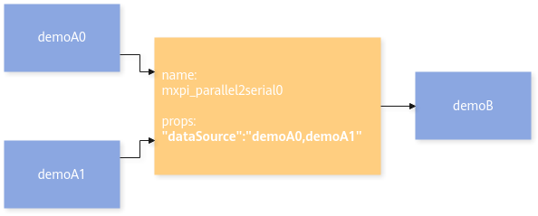
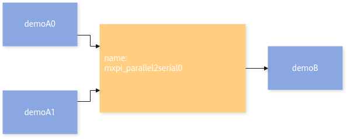
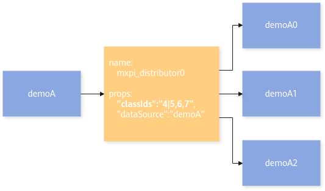
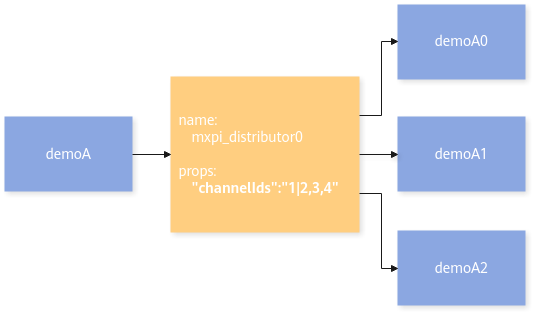
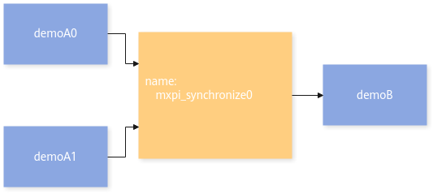
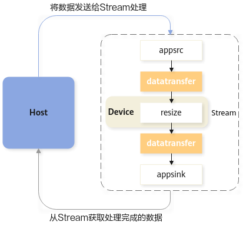
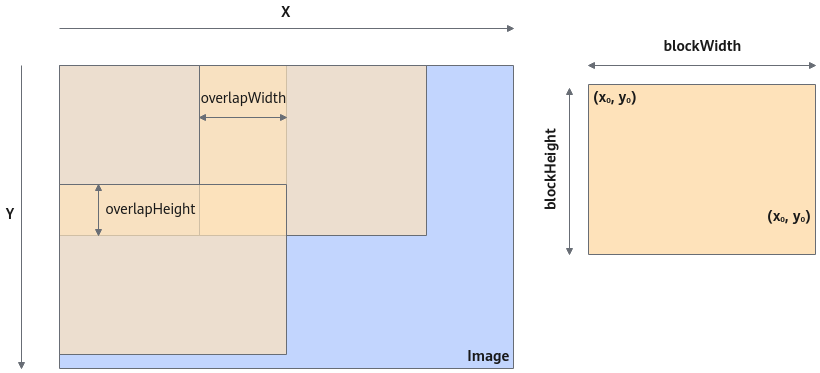
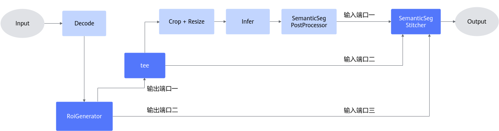

# 串流插件

## mxpi\_parallel2serial

<table><tbody><tr id="row79852351775"><th class="firstcol" valign="top" width="20%" id="mcps1.1.3.1.1">
功能描述

</th>
<td class="cellrowborder" valign="top" width="80%" headers="mcps1.1.3.1.1 ">
多个端口输入数据通过一个端口按顺序输出。

</td>
</tr>
<tr id="row19852351172"><th class="firstcol" valign="top" width="20%" id="mcps1.1.3.2.1">
<strong id="b174181428135914">约束限制</strong>

</th>
<td class="cellrowborder" valign="top" width="80%" headers="mcps1.1.3.2.1 ">
无

</td>
</tr>
<tr id="row1461714353714"><th class="firstcol" valign="top" width="20%" id="mcps1.1.3.3.1">
同步/异步（status）

</th>
<td class="cellrowborder" valign="top" width="80%" headers="mcps1.1.3.3.1 ">
支持同步和异步。

</td>
</tr>
<tr id="row19985435971"><th class="firstcol" valign="top" width="20%" id="mcps1.1.3.4.1">
<strong id="b1560116107168">插件基类（factory）</strong>

</th>
<td class="cellrowborder" valign="top" width="80%" headers="mcps1.1.3.4.1 ">
mxpi_parallel2serial

</td>
</tr>
<tr id="row144222111820"><th class="firstcol" valign="top" width="20%" id="mcps1.1.3.5.1">
<strong id="b280118513183">输入和输出</strong>

</th>
<td class="cellrowborder" valign="top" width="80%" headers="mcps1.1.3.5.1 "><ul id="ul633564421417"><li>动态输入：buffer（数据类型“MxpiBuffer”）、metadata。</li><li>静态输出：buffer（数据类型“MxpiBuffer”）、metadata。</li></ul>
</td>
</tr>
<tr id="row1412793419285"><th class="firstcol" valign="top" width="20%" id="mcps1.1.3.6.1">
<strong id="b6588164218284">属性</strong>

</th>
<td class="cellrowborder" valign="top" width="80%" headers="mcps1.1.3.6.1 ">
请参见<a href="#table199718291833113">表1</a>。

</td>
</tr>
</tbody>
</table>

**表 1**  mxpi\_parallel2serial插件的属性

|属性名|描述|是否为必填项|是否可修改|
|--|--|--|--|
|dataSource|输入数据对应索引（通常情况下为上游元件名称），可以配置多个，以逗号隔开。|否|是|
|removeParentData|删除原Buffer数据，默认为0。0：不删除原Buffer数据。1：删除原Buffer数据。|否|是|
|status|串行化插件的工作模式。0：异步（默认）。异步模式下，各路buffer到达后直接发送。1：同步。同步模式下，需全部输入的buffer都到齐后再一起发送（按端口顺序）。|否|是|

**示例**

- 配置dataSource属性，串行化插件会挂载元数据，并将数据按照接收的顺序发送给下游插件。

    

    假定串行化插件mxpi\_parallel2serial0接收数据的顺序为demoA0，demoA1。

    1. 串行化插件将以demoA0为key在demoA0传递的buffer上获取元数据。
    2. 以mxpi\_parallel2serial0为key挂载上一步骤中获取的元数据。
    3. 将buffer发送给下游插件demoB。
    4. demoA1数据重复以上步骤进行处理。

- 不配置dataSource属性，串行化插件仅会将数据按照接收的顺序发送给下游插件。

    

    假定串行化插件mxpi\_parallel2serial0接收数据的顺序为demoA0，demoA1，串行化插件将demoA0，demoA1获取到的buffer，依次发送给下游插件demoB。

## mxpi\_distributor

<table><tbody><tr id="row79852351775"><th class="firstcol" valign="top" width="20%" id="mcps1.1.3.1.1">
功能描述

</th>
<td class="cellrowborder" valign="top" width="80%" headers="mcps1.1.3.1.1 ">
向不同端口发送指定类别或通道的数据。用户可通过在配置文件中填写类别索引或通道索引，来选择发送需要输出的结果。

</td>
</tr>
<tr id="row3832195111380"><th class="firstcol" valign="top" width="20%" id="mcps1.1.3.2.1">
同步/异步（status）

</th>
<td class="cellrowborder" valign="top" width="80%" headers="mcps1.1.3.2.1 ">
异步

</td>
</tr>
<tr id="row19852351172"><th class="firstcol" valign="top" width="20%" id="mcps1.1.3.3.1">
<strong id="b174181428135914">约束限制</strong>

</th>
<td class="cellrowborder" valign="top" width="80%" headers="mcps1.1.3.3.1 ">
目前只支持根据channel id或class id进行分发。

</td>
</tr>
<tr id="row19985435971"><th class="firstcol" valign="top" width="20%" id="mcps1.1.3.4.1">
<strong id="b1560116107168">插件基类（factory）</strong>

</th>
<td class="cellrowborder" valign="top" width="80%" headers="mcps1.1.3.4.1 ">
mxpi_distributor

</td>
</tr>
<tr id="row144222111820"><th class="firstcol" valign="top" width="20%" id="mcps1.1.3.5.1">
<strong id="b280118513183">输入和输出</strong>

</th>
<td class="cellrowborder" valign="top" width="80%" headers="mcps1.1.3.5.1 "><ul id="ul9308855161411"><li>静态输入：buffer（数据类型“MxpiBuffer”）、metadata（数据类型“MxpiObjectList”或“MxpiClassList”或“MxpiObject”或“MxpiClass”）。</li><li>动态输出：buffer（数据类型“MxpiBuffer”）、metadata（数据类型“MxpiObjectList”或“MxpiClassList”或“MxpiObject”或“MxpiClass”）。</li></ul>
</td>
</tr>
<tr id="row1412793419285"><th class="firstcol" valign="top" width="20%" id="mcps1.1.3.6.1">
<strong id="b6588164218284">属性</strong>

</th>
<td class="cellrowborder" valign="top" width="80%" headers="mcps1.1.3.6.1 ">
请参见<a href="#table199718291833114">表1</a>。

</td>
</tr>
</tbody>
</table>

**表 1**  mxpi\_distributor插件的属性

|属性名|描述|是否为必填项|是否可修改|
|--|--|--|--|
|dataSource|输入数据对应索引，默认值为上游插件对应输出端口的元数据key。|否|是|
|classIds|指定需要输出的类别索引，以逗号隔开。此插件根据用户配置的类别，将不同类别的目标进行重组，以类别顺序通过不同输出端口分发给下游插件。下游插件依次通过目标分发插件名_id作为key来获取元数据（id为目标分发插件的输出端口号，从0开始，依次递增1）。|是|是|
|distributeAll|当某个端口没有目标数据时，是否往下发数据。支持配置yes，no两种方式，默认值为no。|否（根据class id分发进行配合使用）|是|
|channelIds|指定需要输出的通道索引，以逗号隔开。此插件根据用户配置的通道，buffer以通道索引的顺序通过不同输出端口分发给下游插件。|是|是|

> [!NOTE]
>
>- mxpi\_distributor插件一般与queue插件配合使用，即mxpi\_distributor插件的每个输出端口连接queue插件。
>- 当根据channel id来进行分发时，必须配置channelIds属性。当根据class id来进行分发时，必须配置classIds和dataSource属性。
>- 分发插件支持每个输出端口包含多种类别（或通道）的数据，每个输出端口中的索引采用竖线（|）进行区分。具体可参考[示例](#section7282155517359)。

**示例**

- 只配置classIds属性和dataSource属性，分发插件将按照目标索引（class id）的顺序，依次向下游插件发送带有该类别元数据的buffer。

    

    假定分发插件mxpi\_distributor0接收到demoA插件的buffer，然后将以demoA作为key获取元数据，将元数据按照类别进行重组。

    - 以mxpi\_distributor0\_0为key挂载类别为**4**和**5**的元数据，并将buffer发送给demoA0插件。
    - 以mxpi\_distributor0\_1为key挂载类别为**6**的元数据，并将buffer发送给demoA1插件。
    - 以mxpi\_distributor0\_2为key挂载类别为**7**的元数据，并将buffer发送给demoA2插件。

- 只配置channelIds属性，分发插件将按照通道标识（channel id）的顺序，依次向下游插件发送buffer。

    

    假定分发插件mxpi\_distributor0接收到demoA插件的buffer。

    - 将通道索引为**1**或**2**的buffer发送给demoA0插件。
    - 将通道索引为**3**的buffer发送给demoA1插件。
    - 将通道索引为**4**的buffer发送给demoA2插件。

## mxpi\_synchronize

<table><tbody><tr id="row79852351775"><th class="firstcol" valign="top" width="20.02%" id="mcps1.1.3.1.1">
功能描述

</th>
<td class="cellrowborder" valign="top" width="79.97999999999999%" headers="mcps1.1.3.1.1 ">
等待所有输入端口都有数据后才往输出端口推送数据。

</td>
</tr>
<tr id="row122830198394"><th class="firstcol" valign="top" width="20.02%" id="mcps1.1.3.2.1">
同步/异步（status）

</th>
<td class="cellrowborder" valign="top" width="79.97999999999999%" headers="mcps1.1.3.2.1 ">
同步

</td>
</tr>
<tr id="row19852351172"><th class="firstcol" valign="top" width="20.02%" id="mcps1.1.3.3.1">
<strong id="b174181428135914">约束限制</strong>

</th>
<td class="cellrowborder" valign="top" width="79.97999999999999%" headers="mcps1.1.3.3.1 ">
无

</td>
</tr>
<tr id="row19985435971"><th class="firstcol" valign="top" width="20.02%" id="mcps1.1.3.4.1">
<strong id="b1560116107168">插件基类（factory）</strong>

</th>
<td class="cellrowborder" valign="top" width="79.97999999999999%" headers="mcps1.1.3.4.1 ">
mxpi_synchronize

</td>
</tr>
<tr id="row144222111820"><th class="firstcol" valign="top" width="20.02%" id="mcps1.1.3.5.1">
<strong id="b280118513183">输入和输出</strong>

</th>
<td class="cellrowborder" valign="top" width="79.97999999999999%" headers="mcps1.1.3.5.1 "><ul id="ul1015111117154"><li>动态输入：buffer（数据类型“MxpiBuffer”）。</li><li>静态输出：buffer（数据类型“MxpiBuffer”）。</li></ul>
</td>
</tr>
<tr id="row1412793419285"><th class="firstcol" valign="top" width="20.02%" id="mcps1.1.3.6.1">
<strong id="b6588164218284">属性</strong>

</th>
<td class="cellrowborder" valign="top" width="79.97999999999999%" headers="mcps1.1.3.6.1 ">
无

</td>
</tr>
</tbody>
</table>

**表 1**  mxpi\_synchronize插件的属性

|属性名|描述|是否为必填项|是否可修改|
|--|--|--|--|
|config|默认配置参数|否|是|

**示例**

输入的buffer为相同时（元数据无影响），等待所有输入端口接收到数据，然后向下游插件发送数据。

假定同步等待插件mxpi\_synchronize0接收数据的顺序为demoA0，demoA0，demoA1，demoA0，demoA0...，那么同步等待插件将在接收到第三个数据demoA1时，此时所有端口才都有数据，才会向下游插件demoB发送buffer。

## queue

<table><tbody><tr id="row1961141911539"><th class="firstcol" valign="top" width="20%" id="mcps1.1.3.1.1">
功能描述

</th>
<td class="cellrowborder" valign="top" width="80%" headers="mcps1.1.3.1.1 ">
GStreamer原生插件。在此插件输出时为后续处理过程另创建一个线程，用于将输入数据与输出数据解耦，并创建缓存队列，存储尚未输出到下游插件的数据。

</td>
</tr>
<tr id="row1661181917531"><th class="firstcol" valign="top" width="20%" id="mcps1.1.3.2.1">
约束限制

</th>
<td class="cellrowborder" valign="top" width="80%" headers="mcps1.1.3.2.1 ">
默认的缓存队列数据存储上限需低于200个Buffer且低于10MB大小，存储时限为1秒。

</td>
</tr>
<tr id="row15611101955315"><th class="firstcol" valign="top" width="20%" id="mcps1.1.3.3.1">
插件基类（factory）

</th>
<td class="cellrowborder" valign="top" width="80%" headers="mcps1.1.3.3.1 ">
queue

</td>
</tr>
<tr id="row15611171905313"><th class="firstcol" valign="top" width="20%" id="mcps1.1.3.4.1">
输入和输出

</th>
<td class="cellrowborder" valign="top" width="80%" headers="mcps1.1.3.4.1 "><ul id="ul4897415141520"><li>输入：buffer、metadata。</li><li>输出：buffer、metadata。</li></ul>
</td>
</tr>
<tr id="row17611191910533"><th class="firstcol" valign="top" width="20%" id="mcps1.1.3.5.1">
属性

</th>
<td class="cellrowborder" valign="top" width="80%" headers="mcps1.1.3.5.1 ">
请参见<a href="#table55731131242">表1</a>。

</td>
</tr>
</tbody>
</table>

**表 1**  queue插件的属性

|属性名|描述|是否为必选项|是否可修改|
|--|--|--|--|
|current-level-buffers|当前队列中的Buffer数量，默认为0。|否|否|
|current-level-bytes|当前队列中的总数据，默认为0。|否|否|
|current-level-time|当前队列中的总数据（以ns为单位），默认为0。|否|否|
|flush-on-eos|收到EOS事件时，丢弃所有数据，或立即将EOS事件继续传送，默认为false。|否|否|
|leaky|queue的泄露位置，默认为不泄露(0)，可选值{0,1,2}，1为新数据泄漏，2为老数据泄漏。|否|是|
|max-size-buffers|队列中的最大Buffer数，默认为200。|否|是|
|max-size-bytes|队列中的最大数据量，默认为10485760。|否|否|
|max-size-time|队列中的最大数据量（以ns为单位），默认为1000000000。|否|否|
|min-threshold-buffers|队列中允许读取的最小Buffer数，默认为0。|否|否|
|min-threshold-bytes|队列中允许读取的最小数据量，默认为0。|否|否|
|min-threshold-time|队列中允许读取的最小数据量（以ns为单位），默认为0。|否|否|
|silent|不释放queue信号，默认为false。|否|否|

## tee

<table><tbody><tr id="row1961141911539"><th class="firstcol" valign="top" width="20.04%" id="mcps1.1.3.1.1">
功能描述

</th>
<td class="cellrowborder" valign="top" width="79.96%" headers="mcps1.1.3.1.1 ">
GStreamer原生插件，对单个输入数据分发多次。

</td>
</tr>
<tr id="row1661181917531"><th class="firstcol" valign="top" width="20.04%" id="mcps1.1.3.2.1">
约束限制

</th>
<td class="cellrowborder" valign="top" width="79.96%" headers="mcps1.1.3.2.1 ">
无

</td>
</tr>
<tr id="row15611101955315"><th class="firstcol" valign="top" width="20.04%" id="mcps1.1.3.3.1">
插件基类（factory）

</th>
<td class="cellrowborder" valign="top" width="79.96%" headers="mcps1.1.3.3.1 ">
tee

</td>
</tr>
<tr id="row15611171905313"><th class="firstcol" valign="top" width="20.04%" id="mcps1.1.3.4.1">
输入和输出

</th>
<td class="cellrowborder" valign="top" width="79.96%" headers="mcps1.1.3.4.1 "><ul id="ul889283117151"><li>输入：buffer、metadata。</li><li>输出：buffer、metadata。</li></ul>
</td>
</tr>
<tr id="row17611191910533"><th class="firstcol" valign="top" width="20.04%" id="mcps1.1.3.5.1">
属性

</th>
<td class="cellrowborder" valign="top" width="79.96%" headers="mcps1.1.3.5.1 ">
请参见<a href="#table41711615102715">表1</a>。

</td>
</tr>
</tbody>
</table>

> [!NOTE]
>
>- tee插件一般与queue插件配合使用，即tee插件的每个输出端口连接queue插件。
>- tee插件通过浅拷贝对同一个buffer进行多路分发，需要保证该buffer经过多分支处理后，能在同一个appsink端口输出，以防出现coredump问题。

**表 1**  tee插件的属性

|属性名|描述|是否为必选项|是否可修改|
|--|--|--|--|
|allow-not-linked|允许输出端口不被连接，默认为false。|否|否|
|has-chain|是否使用push模式，默认为true。|否|否|
|last-message|描述当前状态的信息，默认为Null。|否|否|
|num-src-pads|srcpad的数量。|否|否|
|pull-mode|pull模式下的行为，默认为0。|否|否|
|silent|不生成last-message事件，默认为true。|否|否|

## mxpi\_datatransfer

<table><tbody><tr id="row79852351775"><th class="firstcol" valign="top" width="20%" id="mcps1.1.3.1.1">
功能描述

</th>
<td class="cellrowborder" valign="top" width="80%" headers="mcps1.1.3.1.1 ">
在Device（内存）和Host（CPU内存）之间转移内存数据。

</td>
</tr>
<tr id="row48311110406"><th class="firstcol" valign="top" width="20%" id="mcps1.1.3.2.1">
同步/异步（status）

</th>
<td class="cellrowborder" valign="top" width="80%" headers="mcps1.1.3.2.1 ">
异步

</td>
</tr>
<tr id="row19852351172"><th class="firstcol" valign="top" width="20%" id="mcps1.1.3.3.1">
<strong id="b174181428135914">约束限制</strong>

</th>
<td class="cellrowborder" valign="top" width="80%" headers="mcps1.1.3.3.1 ">
仅支持MxpiVisionList和MxpiTensorPackageList两种数据格式。

</td>
</tr>
<tr id="row19985435971"><th class="firstcol" valign="top" width="20%" id="mcps1.1.3.4.1">
<strong id="b1560116107168">插件基类（factory）</strong>

</th>
<td class="cellrowborder" valign="top" width="80%" headers="mcps1.1.3.4.1 ">
mxpi_datatransfer

</td>
</tr>
<tr id="row144222111820"><th class="firstcol" valign="top" width="20%" id="mcps1.1.3.5.1">
<strong id="b280118513183">输入和输出</strong>

</th>
<td class="cellrowborder" valign="top" width="80%" headers="mcps1.1.3.5.1 "><ul id="ul3154194612157"><li>静态输入：metadata（数据类型“MxpiVisionList”和“MxpiTensorPackageList”）。</li><li>静态输出：metadata（数据类型“MxpiVisionList”和“MxpiTensorPackageList”）。</li></ul>
</td>
</tr>
<tr id="row1412793419285"><th class="firstcol" valign="top" width="20%" id="mcps1.1.3.6.1">
<strong id="b6588164218284">属性</strong>

</th>
<td class="cellrowborder" valign="top" width="80%" headers="mcps1.1.3.6.1 ">
请参见<a href="#table199718291833115">表1</a>。

</td>
</tr>
</tbody>
</table>

**表 1**  mxpi\_datatransfer插件的属性

|属性名|描述|是否为必填项|是否可修改|
|--|--|--|--|
|dataSource|输入数据对应索引（通常情况下为上游元件名称），可以配置多个，以逗号隔开。默认值为上游插件对应输出端口的元数据key。|否|是|
|transferMode|设置数据转移模式：auto：默认值，自动模式，自动将内存搬移到另外一种内存中。d2h：device2host，将Device内存搬移到Host。h2d：host2device，将Host内存搬移到Device。|否|是|
|removeSourceData|是否清除输入数据的内存：yes：默认值，删除数据。no：保留数据。|否|是|

>[!NOTE]
>默认情况下，该插件只能用于单分支Stream的业务，否则可能导致其他分支数据处理异常。如需在多分支Stream场景，请将“removeSourceData”设置为“no”。

**示例**

通常情况下，外部数据发送到Stream中或者Stream的数据往外发送时需要用该插件。

如上图所示，以缩放图像数据为例。用户可以将解码后的数据（Host内存）发送给Stream，通过该插件就可以将数据转移到Device侧，缩放插件正常运行，输出结果经过该插件转移后缩放后图像数据被转移至Host，用户获取到该数据就可以在Host侧正常访问。如图所示的案例中，发送数据和接收结果需要用“SendProtobuf\(\)”和“GetProtobuf\(\)”接口实现，具体请参见[图 SendProtobuf/GetProtobuf数据流图](../../user_guide.md#业务集成)。

## mxpi\_nmsoverlapedroiV2

<table><tbody><tr id="row114791296282"><th class="firstcol" valign="top" width="20%" id="mcps1.1.3.1.1">
功能描述

</th>
<td class="cellrowborder" valign="top" width="80%" headers="mcps1.1.3.1.1 ">
用于过滤分块后重叠区域重复目标。相比较前一个版本的差别为：<ul id="ul37263615101"><li>V2版本对插件的输入端口做了调整由单输入改成双输入。</li><li>对部分属性名进行规范整改，将原来的dataSource改成dataSourceDetection，blockName改成dataSourceBlock，并且dataSourceDetection和dataSourceBlock可自动配置。</li></ul>

</td>
</tr>
<tr id="row164790916286"><th class="firstcol" valign="top" width="20%" id="mcps1.1.3.2.1">
<strong id="b174181428135914">约束限制</strong>

</th>
<td class="cellrowborder" valign="top" width="80%" headers="mcps1.1.3.2.1 ">
端口0输入分块信息数据，端口1输入检测出来的目标框数据。

</td>
</tr>
<tr id="row18479892282"><th class="firstcol" valign="top" width="20%" id="mcps1.1.3.3.1">
<strong id="b18401125491520">插件基类（factory）</strong>

</th>
<td class="cellrowborder" valign="top" width="80%" headers="mcps1.1.3.3.1 ">
mxpi_nmsoverlapedroiV2

</td>
</tr>
<tr id="row847969172819"><th class="firstcol" valign="top" width="20%" id="mcps1.1.3.4.1">
<strong id="b3654124811594">输入和输出</strong>

</th>
<td class="cellrowborder" valign="top" width="80%" headers="mcps1.1.3.4.1 "><ul id="ul1626515141610"><li>输入：metadata（数据类型“MxpiObjectList”）。</li><li>输出：metadata（数据类型“MxpiObjectList”）。</li></ul>
</td>
</tr>
<tr id="row19248352143918"><th class="firstcol" valign="top" width="20%" id="mcps1.1.3.5.1">
端口格式（caps）

</th>
<td class="cellrowborder" valign="top" width="80%" headers="mcps1.1.3.5.1 "><ul id="ul206474177163"><li>静态输入：{"metadata/object"}。</li><li>静态输出：{"metadata/object"}。</li></ul>
</td>
</tr>
<tr id="row318725534213"><th class="firstcol" valign="top" width="20%" id="mcps1.1.3.6.1">
<strong id="b198801451175919">属性</strong>

</th>
<td class="cellrowborder" valign="top" width="80%" headers="mcps1.1.3.6.1 ">
请参见<a href="#table2097455194381">表1</a>。

</td>
</tr>
</tbody>
</table>

**表 1**  mxpi\_nmsoverlapedroiV2插件的属性

|属性名|描述|是否为必选项|是否可修改|
|--|--|--|--|
|dataSourceDetection|获取目标检测后物体bounding box（框信息）的索引（默认为上游插件对应输出端口的key值）。|否|是|
|dataSourceBlock|获取背景划分块的bounding box（分块框信息）的索引（默认为上游插件对应输出端口的key值）。|否|是|
|nmsThreshold|设置NMS计算阈值，默认值0.45，取值范围[0, 1]。|否|是|

## mxpi\_roigenerator

>[!NOTICE]
>当分块个数过多时，可能导致输入数据过大，无法申请内存。

<table><tbody><tr id="row114791296282"><th class="firstcol" valign="top" width="20%" id="mcps1.1.3.1.1">
功能描述

</th>
<td class="cellrowborder" valign="top" width="80%" headers="mcps1.1.3.1.1 ">
支持用户输入分块的个数、大小、overlap等参数，自动生成图像分块的目标框。

</td>
</tr>
<tr id="row178567416406"><th class="firstcol" valign="top" width="20%" id="mcps1.1.3.2.1">
同步/异步（status）

</th>
<td class="cellrowborder" valign="top" width="80%" headers="mcps1.1.3.2.1 ">
异步

</td>
</tr>
<tr id="row164790916286"><th class="firstcol" valign="top" width="20%" id="mcps1.1.3.3.1">
<strong id="b174181428135914">约束限制</strong>

</th>
<td class="cellrowborder" valign="top" width="80%" headers="mcps1.1.3.3.1 ">
分块个数最大支持256个。

</td>
</tr>
<tr id="row18479892282"><th class="firstcol" valign="top" width="20%" id="mcps1.1.3.4.1">
<strong id="b18401125491520">插件基类（factory）</strong>

</th>
<td class="cellrowborder" valign="top" width="80%" headers="mcps1.1.3.4.1 ">
mxpi_roigenerator

</td>
</tr>
<tr id="row847969172819"><th class="firstcol" valign="top" width="20%" id="mcps1.1.3.5.1">
<strong id="b3654124811594">输入和输出</strong>

</th>
<td class="cellrowborder" valign="top" width="80%" headers="mcps1.1.3.5.1 "><ul id="ul529615315161"><li>输入：解码后的图片，buffer（数据类型“MxpiBuffer”）。</li><li>输出：<ul id="ul1896085813616"><li>端口一：图像分块区域，metadata（数据类型MxpiObjectList）。</li><li>端口二（可选）：图像合并的目标框，metadata（数据类型MxpiObjectList），该端口接图像合并插件（mxpi_semanticsegstitcher）。</li></ul>
</li></ul>
</td>
</tr>
<tr id="row19248352143918"><th class="firstcol" valign="top" width="20%" id="mcps1.1.3.6.1">
端口格式（caps）

</th>
<td class="cellrowborder" valign="top" width="80%" headers="mcps1.1.3.6.1 "><ul id="ul5113102521612"><li>静态输入：{"metadata/yuv"}。</li><li>静态输出：{"metadata/object"}。</li><li>动态输出：{"metadata/object/roi-info"}。</li></ul>
</td>
</tr>
<tr id="row318725534213"><th class="firstcol" valign="top" width="20%" id="mcps1.1.3.7.1">
<strong id="b198801451175919">属性</strong>

</th>
<td class="cellrowborder" valign="top" width="80%" headers="mcps1.1.3.7.1 ">
请参见<u id="u14380111812383"><a href="#table2097455194382">表mxpi_roigenerator插件的属性</a></u>。

</td>
</tr>
</tbody>
</table>

**表 1**  mxpi\_roigenerator插件的属性

|属性名|描述|是否为必选项|是否可修改|
|--|--|--|--|
|splitType|设置分块的方式，支持Size_Block，Num_Block，Custom三个可选参数，默认值为Size_Block。Size_Block：通过分块大小对图像进行分割。Num_Block：通过设置分块个数对图像进行分割。Custom：用户自定义图像分块区间以及合并区间。|否|是|
|blockHeight|当splitType为Size_Block时使用，设置分块图像的高，取值范围32~8192，默认值为512。|否|是|
|blockWidth|当splitType为Size_Block时使用，设置分块图像的宽，取值范围32~8192，默认值为512。|否|是|
|chessboardHeight|当splitType为Num_Block时使用，设置分块y轴方向块的个数，取值范围1~256，默认值为1。|否|是|
|chessboardWidth|当splitType为Num_Block时使用，设置分块x轴方向的个数，取值范围1~256，默认值为1。|否|是|
|overlapHeight|设置分块之间重叠区域，设置y轴方向上的重叠区域，取值范围0~8192，默认值为0。|否|是|
|overlapWidth|设置分块之间重叠区域，设置x轴方向上的重叠区域，取值范围0~8192，默认值为0。|否|是|
|cropRoi|当splitType为Custom时使用，用户自定义分块的坐标框（x0,y0,x1,y1）。每个坐标框以“&#124;”间隔。使用示例：“0,0,512,512&#124;512,0,1024,512”。|否|是|
|mergeRoi|当splitType为Custom时使用，用户自定义每个分块合并的区间，使用绝对坐标，需要与cropRoi对应，使用示例：“20,20,400,400&#124;530,20,800,400”。|否|是|

**图 1**  参数示意图

## mxpi\_semanticsegstitcher

<table><tbody><tr id="row114791296282"><th class="firstcol" valign="top" width="20%" id="mcps1.1.3.1.1">
功能描述

</th>
<td class="cellrowborder" valign="top" width="80%" headers="mcps1.1.3.1.1 ">
对语义分割推理结果的图像进行合并。

</td>
</tr>
<tr id="row35326334114"><th class="firstcol" valign="top" width="20%" id="mcps1.1.3.2.1">
同步/异步（status）

</th>
<td class="cellrowborder" valign="top" width="80%" headers="mcps1.1.3.2.1 ">
同步

</td>
</tr>
<tr id="row164790916286"><th class="firstcol" valign="top" width="20%" id="mcps1.1.3.3.1">
<strong id="b174181428135914">约束限制</strong>

</th>
<td class="cellrowborder" valign="top" width="80%" headers="mcps1.1.3.3.1 ">
需要与mxpi_roigenerator插件配套使用。

</td>
</tr>
<tr id="row18479892282"><th class="firstcol" valign="top" width="20%" id="mcps1.1.3.4.1">
<strong id="b18401125491520">插件基类（factory）</strong>

</th>
<td class="cellrowborder" valign="top" width="80%" headers="mcps1.1.3.4.1 ">
mxpi_semanticsegstitcher

</td>
</tr>
<tr id="row847969172819"><th class="firstcol" valign="top" width="20%" id="mcps1.1.3.5.1">
<strong id="b3654124811594">输入和输出</strong>

</th>
<td class="cellrowborder" valign="top" width="80%" headers="mcps1.1.3.5.1 "><ul id="ul0918165012160"><li>输入：三个输入端口。<ul id="ul2431827124517"><li>端口一：接收语义分割模型的推理结果，metadata（数据类型MxpiImageMaskList）。</li><li>端口二：接收mxpi_roigenerator分块时生成的分块目标框数据，metadata（数据类型MxpiObjectList）。</li><li>端口三：接收mxpi_roigenerator生成的图像合并的目标区域，metadata（数据类型MxpiObjectList）。</li></ul>
</li><li>输出：metadata（数据类型“MxpiImageMaskList”）。</li></ul>
</td>
</tr>
<tr id="row19248352143918"><th class="firstcol" valign="top" width="20%" id="mcps1.1.3.6.1">
端口格式（caps）

</th>
<td class="cellrowborder" valign="top" width="80%" headers="mcps1.1.3.6.1 "><ul id="ul4271054171617"><li>静态输入：<ul id="ul148501530184617"><li>端口一：{"metadata/semanticseg"}。</li><li>端口二：{"metadata/object"}。</li><li>端口三：{"metadata/object/roi-info"}。</li></ul>
</li><li>静态输出：{"metadata/semanticseg"}。</li></ul>
</td>
</tr>
<tr id="row318725534213"><th class="firstcol" valign="top" width="20%" id="mcps1.1.3.7.1">
<strong id="b198801451175919">属性</strong>

</th>
<td class="cellrowborder" valign="top" width="80%" headers="mcps1.1.3.7.1 ">
请参见<u id="u487182365913"><a href="#table2097455194383">表mxpi_semanticsegstitcher插件的属性</a></u>。

</td>
</tr>
</tbody>
</table>

**表 1**  mxpi\_semanticsegstitcher插件的属性

|属性名|描述|是否为必选项|是否可修改|
|--|--|--|--|
|dataSourceSemanticSeg|语义分割模型推理结果对应的索引，默认情况下可通过插件连接情况自动获得。|否|是|
|dataSourceCropRoi|分块目标框数据对应的索引，默认情况下可通过插件连接情况自动获得。|否|是|
|dataSourceMergeRoi|图像合并的目标区域，默认情况下可通过插件连接情况自动获得。|否|是|

**图 1**  典型应用流程图

## mxpi\_objectselector

<table><tbody><tr id="row114791296282"><th class="firstcol" valign="top" width="20%" id="mcps1.1.3.1.1">
功能描述

</th>
<td class="cellrowborder" valign="top" width="80%" headers="mcps1.1.3.1.1 ">
用于多级推理时，根据面积最大最小、面积上下限、置信度阈值对后处理结果进行选择过滤。

</td>
</tr>
<tr id="row164790916286"><th class="firstcol" valign="top" width="20%" id="mcps1.1.3.2.1">
<strong id="b174181428135914">约束限制</strong>

</th>
<td class="cellrowborder" valign="top" width="80%" headers="mcps1.1.3.2.1 ">
接收后处理插件mxpi_objectportprocessors输出的目标框数据。

</td>
</tr>
<tr id="row18479892282"><th class="firstcol" valign="top" width="20%" id="mcps1.1.3.3.1">
<strong id="b18401125491520">插件基类（factory）</strong>

</th>
<td class="cellrowborder" valign="top" width="80%" headers="mcps1.1.3.3.1 ">
mxpi_objectselector

</td>
</tr>
<tr id="row847969172819"><th class="firstcol" valign="top" width="20%" id="mcps1.1.3.4.1">
<strong id="b3654124811594">输入和输出</strong>

</th>
<td class="cellrowborder" valign="top" width="80%" headers="mcps1.1.3.4.1 "><ul id="ul468630141712"><li>输入：metadata（数据类型“MxpiObjectList”）。</li><li>输出：metadata（数据类型“MxpiObjectList”）。</li></ul>
</td>
</tr>
<tr id="row19248352143918"><th class="firstcol" valign="top" width="20%" id="mcps1.1.3.5.1">
端口格式（caps）

</th>
<td class="cellrowborder" valign="top" width="80%" headers="mcps1.1.3.5.1 "><ul id="ul5746535178"><li>静态输入：{"metadata/object"}。</li><li>静态输出：{"metadata/object"}。</li></ul>
</td>
</tr>
<tr id="row318725534213"><th class="firstcol" valign="top" width="20%" id="mcps1.1.3.6.1">
<strong id="b198801451175919">属性</strong>

</th>
<td class="cellrowborder" valign="top" width="80%" headers="mcps1.1.3.6.1 ">
请参见<a href="#table2097455194384">表1</a>

</td>
</tr>
</tbody>
</table>

>[!NOTE]
>
>- 参数均需要赋值，当都配置为0时，默认不进行过滤。
>- 目标框面积需要同时满足：MinArea < 目标框面积 < MaxArea。
>- 过滤顺序是先对目标框进行面积上下限、置信度过滤，然后从过滤后剩下的目标框中选择最大或最小的N个目标框，不能同时选择最大最小。

**表 1**  mxpi\_objectselector插件的属性

|属性名|描述|是否为必选项|是否可修改|
|--|--|--|--|
|dataSource|输入数据对应索引（通常情况下为上游元件名称），可以配置多个，以逗号隔开。默认值为上游插件对应输出端口的元数据key。|否|是|
|FirstDetectionFilter|设置目标框选择条件，格式为map，字段释义如下：Type：Area目前只支持面积选择。TopN：选择最大的N个目标框，为0时关闭选择。BottomN：选择最小的N个目标框，为0时关闭选择。MinArea：目标框面积下限，为0时关闭选择。MaxArea：目标框面积上限，为0时关闭选择。ConfThresh：目标框置信度大于该阈值，保留目标框，默认值为0。|是|是|

## mxpi\_skipframe

<table><tbody><tr id="row114791296282"><th class="firstcol" valign="top" width="20%" id="mcps1.1.3.1.1">
功能描述

</th>
<td class="cellrowborder" valign="top" width="80%" headers="mcps1.1.3.1.1 ">
对数据进行跳帧。

</td>
</tr>
<tr id="row1653111714416"><th class="firstcol" valign="top" width="20%" id="mcps1.1.3.2.1">
同步/异步（status）

</th>
<td class="cellrowborder" valign="top" width="80%" headers="mcps1.1.3.2.1 ">
异步

</td>
</tr>
<tr id="row164790916286"><th class="firstcol" valign="top" width="20%" id="mcps1.1.3.3.1">
<strong id="b174181428135914">约束限制</strong>

</th>
<td class="cellrowborder" valign="top" width="80%" headers="mcps1.1.3.3.1 ">
无

</td>
</tr>
<tr id="row18479892282"><th class="firstcol" valign="top" width="20%" id="mcps1.1.3.4.1">
<strong id="b18401125491520">插件基类（factory）</strong>

</th>
<td class="cellrowborder" valign="top" width="80%" headers="mcps1.1.3.4.1 ">
mxpi_skipframe

</td>
</tr>
<tr id="row847969172819"><th class="firstcol" valign="top" width="20%" id="mcps1.1.3.5.1">
<strong id="b3654124811594">输入和输出</strong>

</th>
<td class="cellrowborder" valign="top" width="80%" headers="mcps1.1.3.5.1 "><ul id="ul3450510101719"><li>输入：buffer（数据类型“MxpiBuffer”）。</li><li>输出：buffer（数据类型“MxpiBuffer”）。</li></ul>
</td>
</tr>
<tr id="row19248352143918"><th class="firstcol" valign="top" width="20%" id="mcps1.1.3.6.1">
端口格式（caps）

</th>
<td class="cellrowborder" valign="top" width="80%" headers="mcps1.1.3.6.1 "><ul id="ul87601123172"><li>静态输入：{“ANY”}。</li><li>静态输出：{“ANY”}。</li></ul>
</td>
</tr>
<tr id="row318725534213"><th class="firstcol" valign="top" width="20%" id="mcps1.1.3.7.1">
<strong id="b198801451175919">属性</strong>

</th>
<td class="cellrowborder" valign="top" width="80%" headers="mcps1.1.3.7.1 ">
请参见<a href="#table2097455194384">表1</a>。

</td>
</tr>
</tbody>
</table>

**表 1**  mxpi\_skipframe插件的属性

|属性名|描述|是否为必选项|是否可修改|
|--|--|--|--|
|frameNum|跳过的帧数，取值范围为[0, 100]。默认值为0。|否|是|
