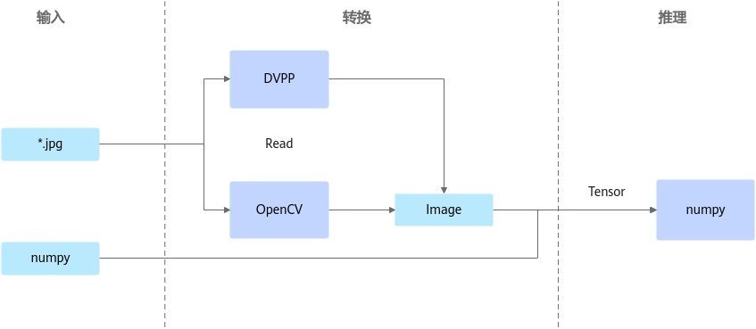

# API接口参考（Python）

## 使用须知

> [!NOTICE]
>
>- 本章节开放的类，请遵循同一个类实例在单一线程中使用的原则，请勿将同一个类实例在不同的线程中使用。
>- 请注意输入为集合数据类型的函数，应基于性能和实际业务需求限制长度，以防止可能出现的内存问题。
>- 传入接口内的JSON相关内容中请勿包含注释，否则会引起解析失败。
>- 若JSON相关内容中单个object存在key值相同键值对，接口将默认保留最后一组键值对作为解析结果。
>- 使用Python数据结构以及方法前，请确保已导入正确的模块。
>- 本章节中重载函数（如[SendData](./process_orchestration.md#senddata)）或函数中有默认值（如[get\_result](./process_orchestration.md#ZH-CN_TOPIC_0000001813201264)）时，函数中的参数名仅是为了方便描述参数含义而定义，实际函数的入参定义为\*args，请用户传参时不要指定参数名。

**Python推理数据流程图**

**图 1**  推理数据流图

