# 附录<a name="ZH-CN_TOPIC_0000001738930454"></a>

## 模型支持参考<a name="ZH-CN_TOPIC_0000001572832230"></a>

### 模型支持列表<a name="ZH-CN_TOPIC_0000001623351257"></a>

**表 1**  模型支持列表

|模型种类|模型框架|使用后处理动态库|获取途径|
|--|--|--|--|
|YOLOv3|TensorFlow|<li>（tensorinfer框架）modelpostprocessors/libyolov3postprocess.so<li>（modelinfer框架）libMpYOLOv3PostProcessor.so|<li>[模型代码获取地址](https://ascend-repo-modelzoo.obs.cn-east-2.myhuaweicloud.com/c-version/YoloV3_for_TensorFlow/zh/1.6/s/YoloV3_for_TensorFlow_1.6_code.zip)<li>[模型文件获取地址](https://ascend-repo-modelzoo.obs.cn-east-2.myhuaweicloud.com/c-version/YoloV3_for_TensorFlow/zh/1.6/m/YOLOv3_TensorFlow_1.6_model.zip)|
|ResNet-50|TensorFlow|<li>（tensorinfer框架）modelpostprocessors/libresnet50postprocess.so<li>（modelinfer框架）libresnet50postprocessor.so|<li>[模型代码获取地址](https://ascend-repo-modelzoo.obs.cn-east-2.myhuaweicloud.com/c-version/ResNet50_for_TensorFlow/zh/1.7/s/ResNet50_for_TensorFlow_1.7_code.zip)<li>[模型文件获取地址](https://ascend-repo-modelzoo.obs.cn-east-2.myhuaweicloud.com/c-version/ResNet50_for_TensorFlow/zh/1.7/m/ResNet50_for_TensorFlow_1.7_model.zip)|
|Faster Rcnn|TensorFlow|<li>（tensorinfer框架）modelpostprocessors/libfasterrcnnpostprocess.so<li>（modelinfer框架）libfasterrcnnpostprocessor.so|模型文件获取地址:https://obs-9be7.obs.cn-east-2.myhuaweicloud.com/turing/resourcecenter/model/ATC Faster R-CNN ResNet 50(FP16) from TensorFlow - Ascend 310/zh/1.1/fasterrcnn-resnet50-fpn_fp16.zip|
|Faster Rcnn|MindSpore|<li>（tensorinfer框架）modelpostprocessors/libfasterrcnnpostprocess.so|<li>[模型代码获取地址](https://ascend-repo-modelzoo.obs.cn-east-2.myhuaweicloud.com/c-version/Faster%20R-CNN%20for%20MindSpore/zh/1.6/s/FasterRCNN_for_MindSpore_1.6_code.zip)<li>[模型文件获取地址](https://ascend-repo-modelzoo.obs.cn-east-2.myhuaweicloud.com/c-version/Faster%20R-CNN%20for%20MindSpore/zh/1.6/m/FasterRCNN_for_MindSpore_1.6_model.zip)|
|YOLOv4|PyTorch|<li>（tensorinfer框架）modelpostprocessors/libyolov3postprocess.so|<li>[模型文件获取地址](https://ascend-repo-modelzoo.obs.cn-east-2.myhuaweicloud.com/script/Yolov4_for_PyTorch/zh/1.1/Yolov4_for_PyTorch.zip)|
|SSD-VGG16|Caffe|<li>（tensorinfer框架）modelpostprocessors/libssdvgg16postprocess.so<li>（modelinfer框架）libssdvggpostprocessor.so|无|
|SSD MobileNet v1 FPN|TensorFlow|<li>（tensorinfer框架）modelpostprocessors/libssdmobilenetv1fpnpostprocess.so<li>（modelinfer框架）libssdmobilenetfpnpostprocessor.so|无|
|CRNN|TensorFlow|<li>（tensorinfer框架）modelpostprocessors/libcrnnpostprocess.so<li>（modelinfer框架）libcrnnpostprocessor.so|无|
|YOLOv5|PyTorch|<li>（tensorinfer框架）modelpostprocessors/libyolov3postprocess.so<li>（modelinfer框架）libMpYOLOv5PostProcessor.so|无|
|FasterRCNN-FPN/CascadeRCNN-FPN|PyTorch|<li>（tensorinfer框架）modelpostprocessors/libfasterrcnnpostprocess.so|无|
|ResNet-18|TensorFlow|<li>（tensorinfer框架）modelpostprocessors/libresnet50postprocess.so|无|
|CTPN|TensorFlow|<li>（tensorinfer框架）modelpostprocessors/libctpnpostprocess.so（modelinfer框架）libMpCtpnPostProcessor.so|模型文件获取地址:https://ascend-repo-modelzoo.obs.myhuaweicloud.com/model/ATC CTPN(FP16) from TensorFlow - Ascend310/zh/1.1/ATC CTPN(FP16) from TensorFlow - Ascend310.zip|
|CTPN|MindSpore|<li>（tensorinfer框架）modelpostprocessors/libctpnpostprocess.so（modelinfer框架）libMpCtpnPostProcessor.so|<li>[模型代码获取地址](https://obs-9be7.obs.cn-east-2.myhuaweicloud.com/turing/resourcecenter/modelCVersion/CTPN%20for%20MindSpore/zh/1.1/s/CTPN_for_MindSpore_1.1_code.zip)<li>[模型文件获取地址](https://obs-9be7.obs.cn-east-2.myhuaweicloud.com/turing/resourcecenter/modelCVersion/CTPN%20for%20MindSpore/zh/1.1/m/CTPN_for_MindSpore_1.1_model.zip)|
|DeepLabv3|MindSpore|<li>（tensorinfer框架）modelpostprocessors/libdeeplabv3post.so|<li>[模型代码获取地址](https://ascend-repo-modelzoo.obs.cn-east-2.myhuaweicloud.com/c-version/DeepLabv3_for_MindSpore/zh/1.5/s/DeepLabv3_for_MindSpore_1.5_code.zip)<li>[模型文件获取地址](https://ascend-repo-modelzoo.obs.cn-east-2.myhuaweicloud.com/c-version/DeepLabv3_for_MindSpore/zh/1.5/m/DeepLabv3_for_MindSpore_1.5_model.zip)|
|BERT-Base (Uncased)|TensorFlow|<li>（tensorinfer框架）modelpostprocessors/libresnet50postprocess.so|<li>[模型文件获取地址](https://obs-9be7.obs.cn-east-2.myhuaweicloud.com/turing/resourcecenter/model/BERT-Base(Uncased)/zh/1.1/ATC_BERT_Base_Uncased_from_Tensorflow_Ascend310.zip)|
|DeepLabv3+|PyTorch|<li>（tensorinfer框架）modelpostprocessors/libdeeplabv3post.so|<li>[模型文件获取地址](https://ascend-repo-modelzoo.obs.cn-east-2.myhuaweicloud.com/c-version/DeepLabv3%2B_for_Pytorch/zh/1.2/m/DeepLabv3plus_for_Pytorch_1.2_model.zip)|
|U-Net|MindSpore|<li>（tensorinfer框架）modelpostprocessors/libunetmindsporepostprocess.so|<li>[模型文件获取地址](https://obs-9be7.obs.cn-east-2.myhuaweicloud.com/turing/resourcecenter/modelCVersion/U-Net%20Medical%20for%20MindSpore/zh/1.3/m/UNet_Medical_for_MindSpore_1.3_model.zip)|
|Mask R-CNN|PyTorch|<li>（tensorinfer框架）modelpostprocessors/libmaskrcnnmindsporepost.so|模型文件获取地址:https://obs-9be7.obs.cn-east-2.myhuaweicloud.com/turing/resourcecenter/model/ATC Mask R-CNN (FP16) from Pytorch - Ascend310/zh/1.1/Mask_RCNN.zip|
|FaceNet|TensorFlow|无需后处理。|模型文件获取地址:https://ascend-repo-modelzoo.obs.myhuaweicloud.com/model/ATC Facenet(FP16) from TensorFlow - Ascend310/zh/1.1/ATC Facenet(FP16) from TensorFlow - Ascend310.zip|
|SSD MobileNet v1 FPN|MindSpore|<li>（tensorinfer框架）modelpostprocessors/libSsdMobilenetFpn_MindsporePost.so|<li>[模型代码获取地址](https://ascend-repo-modelzoo.obs.cn-east-2.myhuaweicloud.com/c-version/SSD_MobilenetV1_FPN_for_MindSpore/zh/1.2/s/SSD_MobilenetV1_FPN_for_MindSpore_1.2_code.zip)<li>[模型文件获取地址](https://ascend-repo-modelzoo.obs.cn-east-2.myhuaweicloud.com/c-version/SSD_MobilenetV1_FPN_for_MindSpore/zh/1.2/m/SSD_MobilenetV1_FPN_for_MindSpore_1.2_model.zip)|
|OpenPose|TensorFlow|<li>（tensorinfer框架）modelpostprocessors/libopenposepostprocess.so|无|
|UNet++|MindSpore|<li>（tensorinfer框架）modelpostprocessors/libunetmindsporepostprocess.so|无|
|RetinaNet|TensorFlow|<li>（tensorinfer框架）modelpostprocessors/libretinanetpostprocess.so|模型文件获取地址:https://ascend-repo-modelzoo.obs.cn-east-2.myhuaweicloud.com/model/ATC RetinaNet(FP16) from TensorFlow - Ascend310/zh/1.1/ATC RetinaNet(FP16) from TensorFlow - Ascend310.zip|
|HigherHRnet|PyTorch|<li>（tensorinfer框架）modelpostprocessors/libhigherhrnetpostprocess.so|<li>[模型文件获取地址](https://ascend-repo-modelzoo.obs.cn-east-2.myhuaweicloud.com/model/22.1.30/ATC%20HigherHRNet%28FP16%29%20from%20Pytorch%20-%20Ascend310.zip)|
|YoloV7Detection|PyTorch|无|无|
|PPYOLOEPlusDetection|Paddle|无|无|


### 模型后处理配置参数<a name="ZH-CN_TOPIC_0000001623630801"></a>

本章节介绍各个模型所需要的配置参数。

**表 1**  YOLOv3模型后处理配置参数（yolov3\_tf\_bs1\_fp16.cfg）

|参数名|描述|默认值|取值区间|
|--|--|--|--|
|CLASS_NUM|类别数量。|80|无|
|BIASES_NUM|anchor宽高的数量（18表示9个anchor，每个对应一对宽高值）。|18|[0, 100]|
|BIASES|每两个数组成一个anchor的宽高值，例如10、13表示第一个anchor的宽、高值。|10，13，16，30，33，23，30，61，62，45，59，119，116，90，156，198，373，326|无|
|SCORE_THRESH|目标是否为某种类别物体的阈值，大于阈值即认为是该目标。|0.3|[0.0, 1.0]|
|OBJECTNESS_THRESH|是否为目标的阈值，大于阈值即认为是目标。|0.3|[0.0, 1.0]|
|IOU_THRESH|两个框的IOU阈值，超过阈值即认为同一个框。|0.45|[0.0, 1.0]|
|YOLO_TYPE|表示输出Tensor的个数，3表示有三个feature map输出。|3|[0, 16]|
|ANCHOR_DIM|每个feature map对应的anchor框数量。|3|[0, 16]|
|MODEL_TYPE|数据排布格式，0表示NHWC，1表示NCHW，2表示NCHWC。|0|无|
|FRAMEWORK|String类型，可选值有MindSpore，PyTorch，TensorFlow和Caffe。|TensorFlow|无|
|SEPARATE_SCORE_THRESH|各个类别对应的阈值。|CLASS_NUM（数量）个SCORE_THRESH（阈值），以逗号为分隔符。（阈值数量等于CLASS_NUM。）|无|


**表 2**  ResNet-50模型后处理配置参数（resnet50\_aipp\_tf.cfg）

|参数名|描述|默认值|取值区间|
|--|--|--|--|
|CLASS_NUM|类别数量。|1001|[0, 2000]|
|SOFTMAX|布尔型，是否需要在后处理中做softmax计算。|false|无|
|TOP_K|前K个可能性最大的类。|1|[0, 16]|


**表 3**  FasterRcnn模型后处理配置参数（faster\_rcnn\_uncut.cfg）

|参数名|描述|默认值|取值区间|
|--|--|--|--|
|CLASS_NUM|类别数量。|91|[0, 1000]|
|SCORE_THRESH|目标是否为某种类别物体的阈值，大于阈值即认为是该目标。|0.5|[0.0, 1.0]|
|IOU_THRESH|两个框的IOU阈值，超过阈值即认为同一个框。|0.45|[0.0, 1.0]|
|SEPARATE_SCORE_THRESH|各个类别对应的阈值。|CLASS_NUM（数量）个SCORE_THRESH（阈值），以逗号为分隔符。（阈值数量等于CLASS_NUM。）|无|
|MODEL_TYPE|可选以下三个值：0：original1：nms_cut（模型未做非极大值抑制）2：FPN|0|无|
|FRAMEWORK|可选以下三个值：TensorFlowMindSporePyTorch|TensorFlow|无|
|NMS_FINISHED|modelinfer框架特有的属性值，为布尔值：false：模型本身不存在NMS算子，需后处理进行NMS操作。true：模型本身存在NMS算子，不需后处理进行NMS操作。|true|无|

  **注**：“MODEL_TYPE”和“FRAMEWORK”参数配套说明如下：<li>orginal配套TensorFlow框架。  <li>nms_cut配套TensorFlow或MindSpore框架。<li>FPN配套PyTorch框架。


**表 4**  ssd\_vgg模型后处理配置参数（ssd\_vgg16\_caffe\_release.cfg）

|参数名|描述|默认值|
|--|--|--|
|CLASS_NUM|类别数量。|5|
|SCORE_THRESH|目标阈值。|0.4|
|SEPARATE_SCORE_THRESH|各个类别对应的阈值。|CLASS_NUM（数量）个SCORE_THRESH（阈值），以逗号为分隔符。（阈值数量等于CLASS_NUM。）|


**表 5**  Ssd-Mobilenet-v1-Fpn模型后处理配置参数（ssd\_mobilenetv1\_fpn.cfg）

|参数名|描述|默认值|
|--|--|--|
|CLASS_NUM|类别数量。|3|
|SCORE_THRESH|目标是否为某种类别物体的阈值，大于阈值即认为是该目标。|0.5|
|SEPARATE_SCORE_THRESH|各个类别对应的阈值。|CLASS_NUM（数量）个SCORE_THRESH（阈值），以逗号为分隔符。（阈值数量等于CLASS_NUM。）|


**表 6**  CRNN模型后处理配置参数（crnn\_ssh\_2.cfg）

|参数名|描述|默认值|取值区间|
|--|--|--|--|
|CLASS_NUM|类别数量。|0|[0, 10000]|
|OBJECT_NUM|可检测的字符数上限。|0|[0, 1000]|
|BLANK_INDEX|空白符的索引值。|0|[0, 10000]|
|WITH_ARGMAX|模型backbone是否已经做了argmax。|false|无|


**表 7** **modelinfer框架**ResNet特征模型后处理配置参数（resnet\_feature\_caffe\_release.cfg）

|参数名|描述|默认值|
|--|--|--|
|ACTIVATION_FUNCTION|用来激活模型输出数据的激活函数。|None|


**表 8** **modelinfer框架**ResNet多分类属性模型后处理配置参数（resnet\_attribute\_caffe\_release.cfg）

|参数名|描述|默认值|
|--|--|--|
|ATTRIBUTE_NUM|模型输出属性的数量。|5|
|ACTIVATION_FUNCTION|激活函数的类型，目前仅支持sigmoid函数。|无|
|ATTRIBUTE_INDEX|模型输出属性的索引。请确保索引的数量与ATTRIBUTE_NUM值相等。|无|


**表 9** **modelinfer框架**ResNet二分类属性模型后处理配置参数（resnet\_attribute\_caffe\_release.cfg）

|参数名|描述|默认值|
|--|--|--|
|CLASS_NUM|类别数量。|5|


**表 10** **modelinfer框架**YOLOv4模型后处理配置参数（yolov4\_pt\_bs1\_fp16.cfg）

|参数名|描述|默认值|
|--|--|--|
|CLASS_NUM|类别数量。|80|
|BIASES_NUM|anchor宽高的数量（18表示9个anchor，每个对应一对宽高值）|18|
|BIASES|每两个数组成一个anchor的宽高值，例如10、13表示第一个anchor的宽、高值。|10，13，16，30，33，23，30，61，62，45，59，119，116，90，156，198，373，326|
|SCORE_THRESH|目标是否为某种类别物体的阈值，大于阈值即认为是该目标。|0.3|
|OBJECTNESS_THRESH|是否为目标的阈值，大于阈值即认为是目标。|0.3|
|IOU_THRESH|两个框的IOU阈值，超过阈值即认为同一个框。|0.45|
|YOLO_TYPE|表示输出Tensor的个数，3表示有三个feature map输出。|3|
|ANCHOR_DIM|每个feature map对应的anchor框数量。|3|
|MODEL_TYPE|数据排布格式，0表示NHWC，1表示NCHW。|0|
|FRAMEWORK_TYPE|模型框架，0表示PyTorch，1表示MindSpore。|0|
|SEPARATE_SCORE_THRESH|各个类别对应的阈值。|CLASS_NUM（数量）个SCORE_THRESH（阈值），以逗号为分隔符。（阈值数量等于CLASS_NUM。）|


**表 11**  YOLOv4模型后处理配置参数（yolov4\_pt\_bs1\_fp16.cfg）

|参数名|描述|默认值|
|--|--|--|
|CLASS_NUM|类别数量。|80|
|BIASES_NUM|anchor宽高的数量（18表示9个anchor，每个对应一对宽高值）。|18|
|BIASES|每两个数组成一个anchor的宽高值，例如10、13表示第一个anchor的宽、高值。|10，13，16，30，33，23，30，61，62，45，59，119，116，90，156，198，373，326|
|SCORE_THRESH|目标是否为某种类别物体的阈值，大于阈值即认为是该目标。|0.3|
|OBJECTNESS_THRESH|是否为目标的阈值，大于阈值即认为是目标。|0.3|
|IOU_THRESH|两个框的IOU阈值，超过阈值即认为同一个框。|0.45|
|YOLO_TYPE|表示输出Tensor的个数，3表示有三个feature map输出。|3|
|ANCHOR_DIM|每个feature map对应的anchor框数量。|3|
|MODEL_TYPE|数据排布格式，0表示NHWC，1表示NCHW，2表示NCHWC。|0|
|FRAMEWORK|String类型，可选值有MindSpore，PyTorch，TensorFlow和Caffe。|MindSpore|
|SEPARATE_SCORE_THRESH|各个类别对应的阈值。|CLASS_NUM（数量）个SCORE_THRESH（阈值），以逗号为分隔符。（阈值数量等于CLASS_NUM。）|
|YOLO_VERSION|使用的yolo模型版本。|（必选）YOLO_VERSION=4|


**表 12**  YOLOv5模型后处理配置参数（yolov5\_pt\_bs1\_fp32.cfg）

|参数名|描述|默认值|取值空间|
|--|--|--|--|
|CLASS_NUM|类别数量。|80|[0, 1000]|
|BIASES_NUM|anchor宽高的数量（18表示9个anchor，每个对应一对宽高值）。|18|[0, 1000]|
|BIASES|每两个数组成一个anchor的宽高值，例如10、13表示第一个anchor的宽、高值。|10，13，16，30，33，23，30，61，62，45，59，119，116，90，156，198，373，326|无|
|SCORE_THRESH|目标是否为某种类别物体的阈值，大于阈值即认为是该目标。|0.3|[0.0, 1.0]|
|OBJECTNESS_THRESH|是否为目标的阈值，大于阈值即认为是目标。|0.3|[0.0, 1.0]|
|IOU_THRESH|两个框的IOU阈值，超过阈值即认为同一个框。|0.45|[0.0, 1.0]|
|YOLO_TYPE|表示输出Tensor的个数，3表示有三个feature map输出。|3|[0, 1000]|
|ANCHOR_DIM|每个feature map对应的anchor框数量。|3|[0, 1000]|
|MODEL_TYPE|数据排布格式，0表示NHWC，1表示NCHW，2表示NCHWC（当前仅支持的PyTorch框架模型）。|2|[0, 1000]|
|FRAMEWORK|String类型，可选值有MindSpore，PyTorch，TensorFlow和Caffe。|PyTorch|无|
|SEPARATE_SCORE_THRESH|各个类别对应的阈值。|CLASS_NUM（数量）个SCORE_THRESH（阈值），以逗号为分隔符。（阈值数量等于CLASS_NUM。）|无|
|YOLO_VERSION|使用的yolo模型版本。|（必选）YOLO_VERSION=5|无|


**表 13** **modelinfer框架**FasterRCNN-Fpn/CascadeRCNN-Fpn模型后处理配置参数（fasterrcnn.cfg或cascadercnn.cfg）

|参数名|描述|默认值|
|--|--|--|
|SCORE_THRESH|目标是否为某种类别物体的阈值，大于阈值即认为是该目标，实验使用0.3。|0.5|
|FPN_SWITCH|FPN开关，这两个模型均要设为true。|false|


**表 14**  DeepLabV3+（TensorFlow）模型后处理配置参数（deeplabv3.cfg）

|参数名|描述|默认值|
|--|--|--|
|CLASS_NUM|类别数量。|21|
|FRAMEWORK_TYPE|深度学习框架类型选择。|TensorFlow框架选择0|


**表 15**  CTPN模型后处理配置参数（ctpn\_tf.cfg）

|参数名|描述|默认值|取值区间|
|--|--|--|--|
|IS_ORIENTED|是否进行检测框倾斜。|false|无|
|BOX_IOU_THRESH|检测小框的iou阈值。|0.7|[0.0, 1.0]|
|TEXT_IOU_THRESH|最终文本框的iou阈值。|0.2|[0.0, 1.0]|
|TEXT_PROPOSALS_MIN_SCORE|检测小框的最小分数过滤。|0.7|[0.0, 1.0]|
|LINE_MIN_SCORE|最终文本框的最小分数过滤。|0.9|[0.0, 1.0]|
|IS_MINDSPORE|是否为MindSpore框架。|false|无|


**表 16**  CTPN模型后处理配置参数（ctpn\_mindspore.cfg）

|参数名|描述|默认值|取值区间|
|--|--|--|--|
|IS_ORIENTED|是否进行检测框倾斜。|false|无|
|BOX_IOU_THRESH|检测小框的iou阈值。|0.7|[0.0, 1.0]|
|TEXT_IOU_THRESH|最终文本框的iou阈值。|0.2|[0.0, 1.0]|
|TEXT_PROPOSALS_MIN_SCORE|检测小框的最小分数过滤。|0.7|[0.0, 1.0]|
|LINE_MIN_SCORE|最终文本框的最小分数过滤。|0.9|[0.0, 1.0]|
|IS_MINDSPORE|是否为MindSpore框架。|true|无|


**表 17**  ResNet-18模型后处理配置参数（resnet18\_aipp\_tf.cfg）

|参数名|描述|默认值|
|--|--|--|
|CLASS_NUM|类别数量。|2|


**表 18**  DeepLabv3（MindSpore）模型后处理配置参数（deeplabv3.cfg）

|参数名|描述|默认值|
|--|--|--|
|CLASS_NUM|类别数量。|21|
|MODEL_TYPE|模型推理输出数据的排布格式，0表示NHWC，1表示NCHW。|1|
|FRAMEWORK_TYPE|深度学习框架类型选择。|MindSpore框架选择2|


**表 19**  BERT-Base（Uncased）模型后处理配置参数（bert.cfg）

|参数名|描述|默认值|
|--|--|--|
|CLASS_NUM|类别数量。|2|
|CHECK_MODEL|检查模型兼容性。|false|


**表 20**  DeepLabV3+（PyTorch）模型后处理配置参数（deeplabv3.cfg）

|参数名|描述|默认值|
|--|--|--|
|CLASS_NUM|类别数量。|21|
|CHECK_MODEL|检查模型兼容性。|true|
|MODEL_TYPE|模型推理输出数据的排布格式，0表示NHWC，1表示NCHW。|1|
|FRAMEWORK_TYPE|深度学习框架类型选择。|PyTorch框架选择1|


**表 21**  U-Net模型后处理配置参数（unet\_simple.cfg）

|参数名|描述|默认值|
|--|--|--|
|CLASS_NUM|类别数量。|2|
|POST_TYPE|模型后处理方式，0表示对模型logits输出（NHWC型）做argmax，1表示对模型argmax输出结果（NHW型）透传。|1|
|RESIZE_TYPE|对像素图做插值还原的方式，暂只支持两种方式：0：不做插值还原。1：最邻近插值还原。|1|


**表 22**  Mask R-CNN模型后处理配置参数（mask\_rcnn\_2017.cfg）

|参数名|描述|默认值|取值区间|
|--|--|--|--|
|CLASS_NUM|推理类别总数，背景不计算在内。|80|[0, 100]|
|SCORE_THRESH|置信度得分阈值，可根据业务场景调整。|0.7|[0.0, 1.0]|
|IOU_THRESH|IOU阈值，可根据业务场景调整。|0.5|[0.0, 1.0]|
|RPN_MAX_NUM|Region Proposal Network最大个数。|1000|[0, 1000]|
|MAX_PER_IMG|按置信度排序，每张图预测框的最大值。|128|[0, 150]|
|MASK_THREAD_BINARY|输入RCNN的掩码阈值。|0.5|[0.0, 1.0]|
|MASK_SHAPE_SIZE|mask_rcnn中掩码的形状，只支持单参数表示正方形。|28|[0, 100]|
|MODEL_TYPE|可选以下两个值。0：MindSpore1：PyTorch|0|无|
|SEPARATE_SCORE_THRESH|各个类别对应的阈值。|CLASS_NUM（数量）个SCORE_THRESH（阈值），以逗号为分隔符。（阈值数量等于CLASS_NUM。）|无|


**表 23**  Ssd\_Mobilenet\_v1\_Fpn\_for\_MindSpore模型后处理配置参数（ssd\_mobilenetv1\_fpn.cfg）

|参数名|描述|默认值|取值区间|
|--|--|--|--|
|CLASS_NUM|类别数量。|81|[0, 100]|
|SCORE_THRESH|目标是否为某种类别物体的阈值，大于阈值即认为是该目标。|0.5|[0.0, 1.0]|
|IOU_THRESH|目标重合程度的阈值，大于阈值即认为两个目标框对应同一个目标。|0.6|[0.0, 1.0]|
|SEPARATE_SCORE_THRESH|各个类别对应的阈值。|CLASS_NUM（数量）个SCORE_THRESH（阈值），以逗号为分隔符。（阈值数量等于CLASS_NUM。）|无|


**表 24**  OpenPose模型后处理配置参数（openpose.cfg）

|参数名|描述|默认值|取值区间|
|--|--|--|--|
|KEYPOINT_NUM|关键点个数，加上背景（背景算一个）。|19|[0, 100]|
|FILTER_SIZE|高斯滤波核的长（或宽）。|25|[0, 100]|
|SIGMA|高斯滤波核的方差。|3|[0, 10]|


**表 25**  HigherHRnet模型后处理配置参数（higherhrnet.cfg）

|参数名|描述|默认值|取值区间|
|--|--|--|--|
|KEYPOINT_NUM|关键点个数。|17|[0, 20]|
|SCORE_THRESH|关键点阈值。|0.1|[0.0, 1.0]|


**表 26**  Unet++模型后处理配置参数（unet\_nested.cfg）

|参数名|描述|默认值|取值区间|
|--|--|--|--|
|CLASS_NUM|类别数量。|3|无|
|POST_TYPE|模型后处理方式，0表示对模型logits输出（NHWC型）做argmax，1表示对模型argmax输出结果（NHW型）透传。|1|[0, 16]|
|RESIZE_TYPE|对像素图做插值还原的方式，暂只支持两种方式：0：不做插值还原。1：最邻近插值还原。|1|[0, 16]|


**表 27**  RetinaNet模型后处理配置参数（retinanet\_tf.cfg）

|参数名|描述|默认值|取值区间|
|--|--|--|--|
|CLASS_NUM|代表数据集类别数量（默认COCO数据集是80类）。|80|[0, 100]|
|MODEL_TYPE|代表模型类别，目前仅支持TensorFlow模型。|0|[0, 100]|
|SCORE_THRESH|代表分数阈值。|0.5|[0.0, 1.0]|


### 模型结构<a name="ZH-CN_TOPIC_0000001572991558"></a>

**YOLOv3<a name="section13653550195113"></a>**

-   可接受的模型与YOLOv3具有类似的输出张量。一般有三个输出张量（YOLOv3-Tiny只有两个，配置参数“YOLO\_TYPE“需设为“2“），分别是8倍，16倍与32倍降采样后的特征层。
-   每个输出张量的第一维与模型所支持的最大batchsize相同，按照NHWC或NCHW，输出张量形状略有差异，**W**与**H**分别等于模型输入宽高除以8，16，32，**C**等于先验框个数**anchorDim=3 \* \(边框坐标4 + 边框置信度1 + 类别数80\)**  。
-   配置参数**MODEL\_TYPE = 0**时，采取NHWC，**MODEL\_TYPE = 1**时，采取NCHW。

**图 1**  NHWC型<a name="fig1666415352916"></a>  
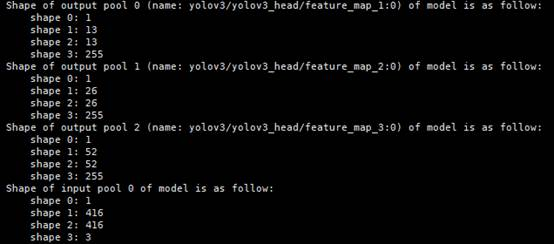

**图 2**  NCHW型<a name="fig19740181610299"></a>  
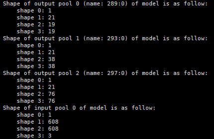

**FasterRCNN<a name="section8778113595219"></a>**

-   支持两种结构的模型，原生FasterRCNN模型，以及对模型中NMS（非最大值抑制）进行裁剪后的模型。
-   配置参数**NMS\_FINISHED = 0**时，采取后者，**NMS\_FINISHED = 1**时采取前者。

-   原生模型：

    有四个输出张量，分别为目标数，置信度，坐标框和类别ID。

    **图 3**  FasterRCNN原生模型<a name="fig1461617317100"></a>  
    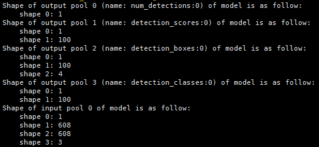

-   裁剪NMS后：

    有三个输出张量，分别为目标数，每种类别目标可能的坐标框，每种类别目标框的置信度。

    **图 4**  FasterRCNN裁剪NMS后<a name="fig1783811544103"></a>  
    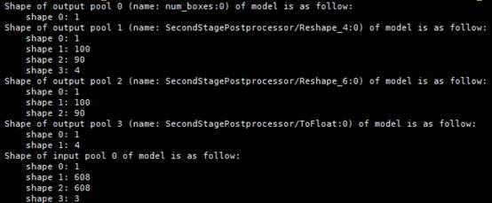

**SSD MobileNet v1 FPN<a name="section787313413429"></a>**

SSD MobileNet v1 FPN与FasterRCNN原生模型类似，有四个输出张量，分别为目标数，置信度，坐标框和类别ID。

**图 5**  SSD MobileNet v1 FPN<a name="fig197942278123"></a>  
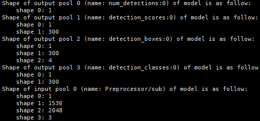

**SSD-VGG16<a name="section101571017533"></a>**

SSD-VGG16有两个输出张量，第一个输出张量是目标数，第二个输出张量的为目标框的信息\[batch, keep\_top\_k, 8\]，其中的“8“表示batchID、label（classID）、score（类别概率）、xmin、ymin、xmax、ymax、null。

**图 6**  SSD-VGG16<a name="fig016271914131"></a>  
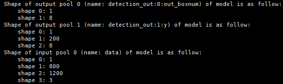

**CRNN<a name="section7941129175313"></a>**

CRNN的输出张量仅一个，第一维是batchsize，第二维即其所能检测的目标数上限，代表其识别到的每个目标的类别ID（包含占位符）。

**图 7**  CRNN<a name="fig129891738191317"></a>  
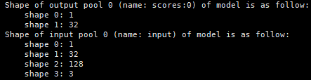

**ResNet-50<a name="section353521918531"></a>**

ResNet-50仅需一个输出张量，第一维是batchsize，第二维与类别数一致，为模型特征层softmax之后的结果。第二个输出张量为概率最大的类别对应的类别ID。

**图 8**  ResNet-50<a name="fig823115912135"></a>  
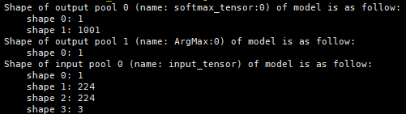

**YOLOv4<a name="section427237202510"></a>**

YOLOv4与YOLOv3模型类似，有三个输出张量，分别是8倍，16倍与32倍降采样后的特征层。

**图 9**  YOLOv4<a name="fig56725491146"></a>  
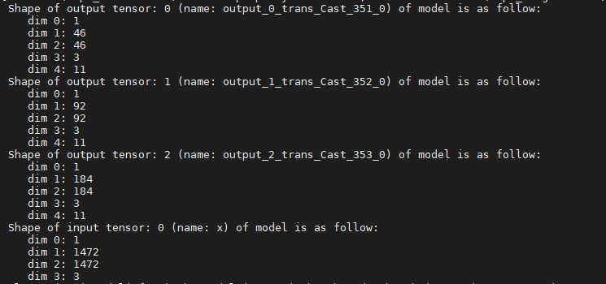

**YOLOv5<a name="section20338144813343"></a>**

-   YOLOv5有三个输出张量，分别是8倍，16倍与32倍降采样后的特征层。
-   输出张量按照N\(C0\)HW\(C1\)的形式排布，**W**与**H**分别等于模型输入宽高除以8、16、32，**C**等于先验框个数**anchorDim=3 \* \(边框坐标4 + 边框置信度1 + 类别数80\)**  。

**图 10**  YOLOv5<a name="fig03024524168"></a>  
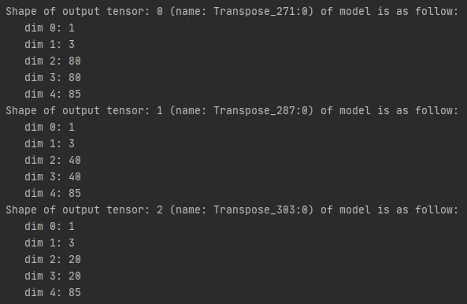

**FasterRCNN-Fpn/CascadeRCNN-Fpn<a name="section5707131631517"></a>**

模型有两个输出张量，分别是5 \* 100的预测框和置信度（x0, y0, x1, y1,confidence）\(其中坐标为左上和右下的检测框的坐标\)，1 \* 100是每个类别的分值。输入为固定size的RGB图片：3 \* 1216 \* 1216 。

**图 11**  FasterRCNN-Fpn/CascadeRCNN-Fpn<a name="fig419105215199"></a>  
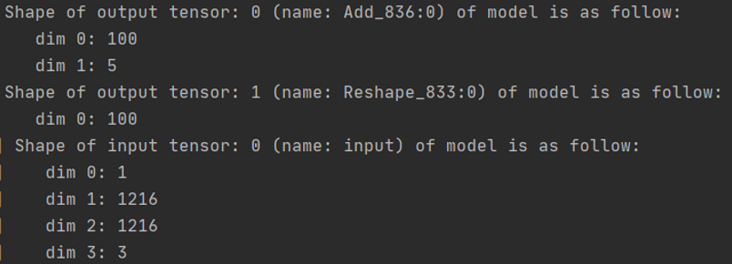

**CTPN（TensorFlow）<a name="section11949125515198"></a>**

CTPN（TensorFlow）模型有两个输出张量，分别是38 \* 67 \* 40的预测小框，相当于38 \* 67 \* 4的每个像素点生成10个小框，38 \* 67 \* 20的预测分数，相当于38 \* 67 \* 2的每个像素点生成10个预测分数。输入为固定size的RGB图片：3 \* 608 \* 1072 。

**图 12**  CTPN（TensorFlow）<a name="fig5622143619231"></a>  
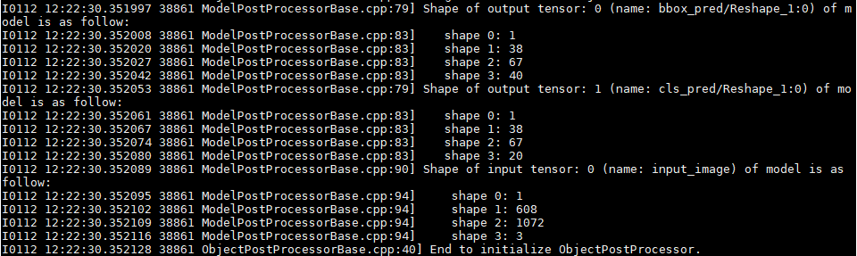

**CTPN（MindSpore）<a name="section147492135510"></a>**

CTPN（MindSpore）模型有两个输出张量，分别是1000个预测小框，5个维度分别是四个坐标和分数，另一个1000是每个小框的类别，分别为1、0，表示前景还是后景。输入则是固定size的RGB图片：3 \* 576 \* 960 。

**图 13**  CTPN（MindSpore）<a name="fig7742047172315"></a>  
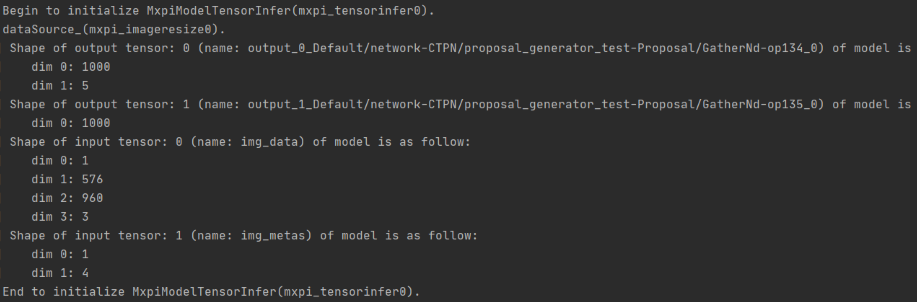

**ResNet-18+<a name="section191365812013"></a>**

ResNet-18+模型输入是1 \* 408 \* 64 \* 3大小的张量。输出是1 \* 2的张量，表示每个样本的分类概率。

**图 14**  ResNet-18+<a name="fig12954152142317"></a>  
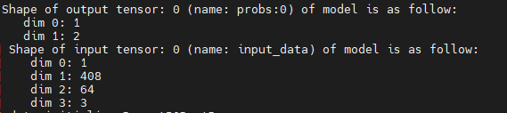

**BERT-Base（Uncased）<a name="section250019414337"></a>**

BERT-Base（Uncased）模型输入有三个张量，shape都是1 \* 128。1表示batchsize，128表示句长。

模型输出有一个张量，1 \* 2，表示每个分类类别的概率。

**图 15**  BERT-Base（Uncased）<a name="fig922116590237"></a>  
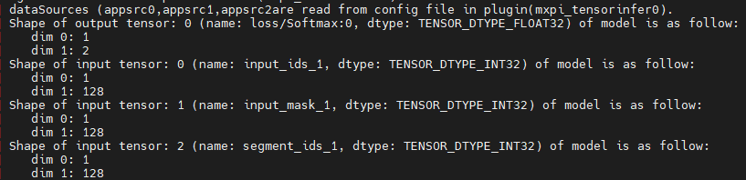

**DeeplabV3+（TensorFlow）<a name="section1482117147407"></a>**

DeeplabV3+（TensorFlow）模型输出有一个张量，是1 \* 513 \* 513 \* 21的NHWC排布方式，物理含义相当于每个像素点的分类概率。原始输入图片是动态shape的RGB图片。模型输入是1 \* 513 \* 513 \* 3的张量。

**图 16**  DeeplabV3+（TensorFlow）<a name="fig49538547249"></a>  
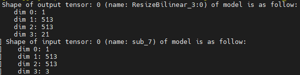

**DeepLabV3（MindSpore）<a name="section19860743260"></a>**

DeepLabV3（MindSpore）模型输入是NHWC排布的，输出以NCHW排布。

**图 17**  DeepLabV3（MindSpore）<a name="fig2826102772515"></a>  
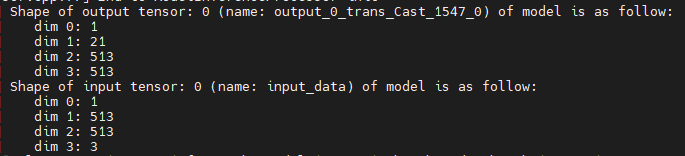

**DeepLabV3（PyTorch）<a name="section851312481518"></a>**

DeepLabV3（PyTorch）模型输入以NHWC排布，输出为NCHW排布。

**图 18**  DeepLabV3（PyTorch）<a name="fig7412238265"></a>  


**Unet（MindSpore）<a name="section2093112376289"></a>**

Unet（MindSpore）模型输出Tensor为NCHW，其中N为1，C为2，作为Vision SDK后处理输入。

1.  在C通道上进行argmax，得到最大概率值的索引值，生成数值为0和1的二维数组。
2.  判断模型输出Tensor的HW是否与输入原图尺寸一致，若一致则直接输出argmax后的二维数组，否则进行最近邻插值到输入图片尺寸。

**图 19**  Unet（MindSpore）<a name="fig762171720335"></a>  
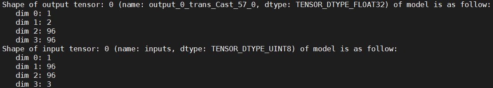

**Mask R-CNN（TensorFlow）<a name="section7757192631614"></a>**

Mask R-CNN（TensorFlow）模型输入张量为4维NHWC（1 \* 480 \* 640 \* 3）排布格式。

-   N为批数量。
-   H为输入图像的高度（480）。
-   W为输入图像的宽度（640）。

Mask R-CNN（TensorFlow）模型输出张量有5个（tensor\[0\]\~tensor\[4\]）。

-   tensor\[0\]的维度为1维（1），第一维长度为1，代表模型检测出的目标的个数。
-   tensor\[1\]的维度为2维（1 \* 100），第一维长度为1，代表批数量。第二维长度为100，代表前top100个目标的置信度分数。
-   tensor\[2\]的维度为3维（1 \* 100 \* 4）, 第一维长度为1，代表批数量。第二维长度为100，代表前top100个目标框。第三维长度为4，代表目标框的四个顶点坐标\(x0, y0, x1, y1\)。
-   tensor\[3\]的维度为4维（1 \* 100 \* 33 \* 33），第一维长度为1，代表批数量。第二维长度为100，代表前top100个目标框。第三维和第四维代表一张33 \* 33大小的掩码图。
-   tensor\[4\]的维度为2维（1 \* 100）, 第一维长度为1，代表批数量。第二维长度为100，代表前top100目标的分类类别。

**图 20**  Mask R-CNN（TensorFlow）<a name="fig8496112412335"></a>  
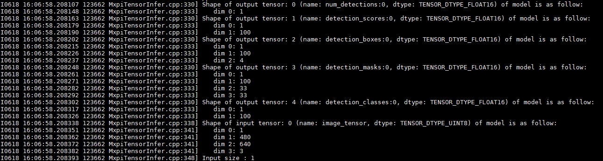

**FaceNet（TensorFlow）<a name="section13541164355316"></a>**

FaceNet（TensorFlow）输入张量的形状为NHWC（1\*160\*160\*3），数据类型为UINT8。

-   N为批数量。
-   H代表输入图像的高度160。
-   W代表输入图像的宽度160。
-   C代表图像的通道数。

输出张量为目标图像对应的特征向量，形状为1 \* 512，第一维代表批数量，第二维为特征向量的长度512，数据类型为FLOAT32。

**图 21**  FaceNet（TensorFlow）<a name="fig1732941510353"></a>  
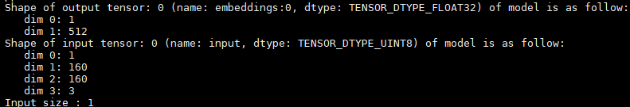

**SSD MobileNet v1 FPN（MindSpore）<a name="section17877174815468"></a>**

SSD MobileNet v1 FPN（MindSpore）有2个输出张量，分别为坐标框和置信度。

**图 22**  SSD MobileNet v1 FPN（MindSpore）<a name="fig44734202375"></a>  
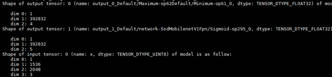

**OpenPose<a name="section5824173217177"></a>**

OpenPose输出张量为\[batch, outputHeight, outputWidth, channel\]，“outputHeight“表示输出图像的高，“outputWidth“表示输出图像的宽，“channel“由两部分组成，前1/3为heat mat，后2/3为paf mat。此模型输出为\[1, 54, 46, 57\]。

**图 23**  OpenPose<a name="fig13423533912"></a>  
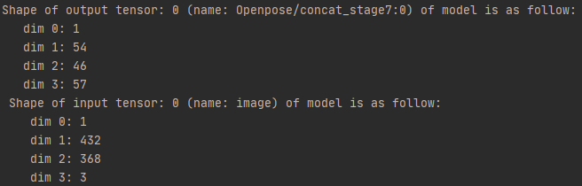

**Unet++（MindSpore）<a name="section8137927820"></a>**

Unet++（MindSpore）模型后处理有一个NCHW的输入Tensor，为模型进行argmax操作之后经过aipp处理后输入给后处理模块；有一个NHW的输出Tensor，由于模型已经做了argmax，C通道已经计算在Tensor HW对应的值。

**图 24**  Unet++（MindSpore）<a name="fig10364143519403"></a>  
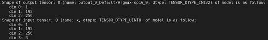


## 安装依赖参考<a name="ZH-CN_TOPIC_0000001928758541"></a>

### 安装7.3.0版本gcc<a name="ZH-CN_TOPIC_0000001562637676"></a>

由于gcc为基础工具，多用户安装容易引发冲突，因此以下步骤建议在root用户下执行。

1.  下载gcc-7.3.0.tar.gz，下载地址为[https://mirrors.tuna.tsinghua.edu.cn/gnu/gcc/gcc-7.3.0/gcc-7.3.0.tar.gz](https://mirrors.tuna.tsinghua.edu.cn/gnu/gcc/gcc-7.3.0/gcc-7.3.0.tar.gz)。
2.  安装gcc时会占用大量临时空间，所以先执行下面的命令清空“/tmp“目录：

    ```
    rm -rf /tmp/*
    ```

3.  安装依赖（以CentOS和Ubuntu系统为例）。
    -   CentOS执行如下命令安装。

        ```
        yum install bzip2    
        ```

    -   Ubuntu执行如下命令安装。

        ```
        apt-get install bzip2    
        ```

4.  编译安装gcc。
    1.  进入“gcc-7.3.0.tar.gz“源码包所在目录，解压源码包，命令为：

        ```
        tar -zxvf gcc-7.3.0.tar.gz --no-same-owner
        ```

    2.  进入解压后的文件夹，执行如下命令下载gcc依赖包：

        ```
        cd gcc-7.3.0
        ./contrib/download_prerequisites
        ```

        如果执行上述命令报错，需要执行如下命令在“gcc-7.3.0/“文件夹下面下载好以下依赖包：

        ```
        wget http://gcc.gnu.org/pub/gcc/infrastructure/gmp-6.1.0.tar.bz2
        wget http://gcc.gnu.org/pub/gcc/infrastructure/mpfr-3.1.4.tar.bz2
        wget http://gcc.gnu.org/pub/gcc/infrastructure/mpc-1.0.3.tar.gz
        wget http://gcc.gnu.org/pub/gcc/infrastructure/isl-0.16.1.tar.bz2
        ```

        下载好上述依赖包后，重新执行以下命令：

        ```
        ./contrib/download_prerequisites
        ```

        如果上述命令校验失败，需要确保依赖包为一次性下载成功，无重复下载现象。

    3.  <a name="zh-cn_topic_0000001437545921_zh-cn_topic_0000001270446049_zh-cn_topic_0000001079598586_li08961810135613"></a>执行配置命令。

        ```
        ./configure --enable-languages=c,c++ --disable-multilib --with-system-zlib --prefix=/usr/local/gcc7.3.0
        ```

        >[!NOTE] 说明
        >其中“--prefix“参数用于指定gcc7.3.0安装路径，用户可自行配置，但注意不要配置为“/usr/local“及“/usr“，因为会与系统使用软件源默认安装的gcc相冲突，导致系统原始gcc编译环境被破坏。示例指定为“/usr/local/gcc7.3.0“。

    4.  进行编译。

        ```
        make -j15    # 通过grep -w processor /proc/cpuinfo|wc -l查看cpu数，示例为15，用户可自行设置相应参数。
        ```

    5.  进行安装。

        ```
        make install
        ```

5.  配置环境变量（请在实际需要时再进行配置）。

    ```
    export LD_LIBRARY_PATH=/usr/local/gcc7.3.0/lib64:${LD_LIBRARY_PATH}
    export CC=/usr/local/gcc7.3.0/bin/gcc
    export CXX=/usr/local/gcc7.3.0/bin/g++
    export PATH=/usr/local/gcc7.3.0/bin:${PATH}
    ```

    其中“/usr/local/gcc7.3.0”为上文“步骤4  3.执行配置命令“中配置的gcc7.3.0安装路径，请根据实际情况替换。


### 安装Python依赖<a name="ZH-CN_TOPIC_0000001613116793"></a>

**介绍<a name="section3239124244910"></a>**

目前Vision SDK开发套件包依赖Python，如环境中未配置，可参考本章节步骤安装依赖（以root用户安装Python 3.9.2为例）。

**操作步骤<a name="section16295535165519"></a>**

1.  安装Python 3.9.2依赖库。以Ubuntu操作系统为例：

    ```
    apt-get install -y build-essential gcc g++ make cmake zlib1g zlib1g-dev libsqlite3-dev openssl libssl-dev libffi-dev unzip pciutils net-tools libblas-dev gfortran libblas3 libopenblas-dev
    ```

2.  下载Python 3.9.2源码安装包。

    ```
    wget https://www.python.org/ftp/python/3.9.2/Python-3.9.2.tgz
    ```

3.  解压Python 3.9.2安装包。

    ```
    tar -zxvf Python-3.9.2.tgz --no-same-owner
    ```

4.  编译安装Python 3.9.2。

    ```
    cd Python-3.9.2 && ./configure --prefix=/usr/local/python3.9.2 --enable-shared && make -j8 && make install
    ```

5.  拷贝libpython3.9.so.1.0到系统路径。

    ```
    cp /usr/local/python3.9.2/lib/libpython3.9.so.1.0 /usr/lib
    ```

6.  设置环境变量。

    ```
    export LD_LIBRARY_PATH=/usr/local/python3.9.2/lib:$LD_LIBRARY_PATH
    export PATH=/usr/local/python3.9.2/bin:$PATH
    ```

>[!NOTE] 说明
>若源码方式安装完Python 3.9.2后，使用yum命令出现“No module named 'dnf'”报错，请删除“LD\_LIBRARY\_PATH“环境变量中的Python路径，使用系统的Python路径。


## 文件示例<a name="ZH-CN_TOPIC_0000001882799304"></a>

### 初始化算子预加载文件示例<a name="ZH-CN_TOPIC_0000001632889049"></a>

初始化算子预加载文件需与MxInitFromConfig接口配合使用。

```
{
  "Operations": [
    {
      "name": "Multiply",
      "preload_list": [
        {
          "input_shape": "1,3,16,16;1,3,16,16",
          "input_type": "float;float",
          "output_shape": "1,3,16,16",
          "output_type": "float"
        },
        {
          "input_shape": "1,3,16,16;1,3,16,16",
          "input_type": "float16;float16",
          "output_shape": "1,3,16,16",
          "output_type": "float16"
        },
        {
          "input_shape": "1,3,16,16;1,3,16,16",
          "input_type": "uint8;uint8",
          "output_shape": "1,3,16,16",
          "output_type": "uint8"
        },
        {
          "input_shape": "1, 3, 16, 16; 1, 3, 16, 16",
          "input_type": "float;uint8",
          "output_shape": "1, 3, 16, 16",
          "output_type": "float",
          "attr_name": "scale",
          "attr_type": "double",
          "attr_val": "1.5f"
        }
      ]
    },
    {
      "name": "Divide",
      "preload_list": [
        {
          "input_shape": "1,3,16,16;1,3,16,16",
          "input_type": "float;float",
          "output_shape": "1,3,16,16",
          "output_type": "float"
        },
        {
          "input_shape": "1,3,16,16;1,3,16,16",
          "input_type": "float16;float16",
          "output_shape": "1,3,16,16",
          "output_type": "float16"
        },
        {
          "input_shape": "1,3,16,16;1,3,16,16",
          "input_type": "uint8;uint8",
          "output_shape": "1,3,16,16",
          "output_type": "uint8"
        }
      ]
    },
    {
      "name": "Tile",
      "preload_list": [
        {
          "input_shape": "1,16,16,1",
          "input_type": "float",
          "output_shape": "1,16,16,3",
          "output_type": "float"
        }
      ]
    },
    {
      "name": "Abs",
      "preload_list": [
        {
          "input_shape": "1,3,16,16",
          "input_type": "float",
          "output_shape": "1,3,16,16",
          "output_type": "float"
        },
        {
          "input_shape": "1,3,16,16",
          "input_type": "float16",
          "output_shape": "1,3,16,16",
          "output_type": "float16"
        },
        {
          "input_shape": "1,3,16,16",
          "input_type": "uint8",
          "output_shape": "1,3,16,16",
          "output_type": "uint8"
        }
      ]
    },
    {
      "name": "AbsDiff",
      "preload_list": [
        {
          "input_shape": "480, 640;480, 640",
          "input_type": "float;float",
          "output_shape": "480, 640",
          "output_type": "float"
        }
      ]
    },
    {
      "name": "Log",
      "preload_list": [
        {
          "input_shape": "480, 640",
          "input_type": "float",
          "output_shape": "480, 640",
          "output_type": "float"
        }
      ]
    },
    {
      "name": "Pow",
      "preload_list": [
        {
          "input_shape": "1,3,16,16;1,3,16,16",
          "input_type": "float;float",
          "output_shape": "1,3,16,16",
          "output_type": "float"
        }
      ]
    },
    {
      "name": "Sqrt",
      "preload_list": [
        {
          "input_shape": "1,3,16,16",
          "input_type": "float",
          "output_shape": "1,3,16,16",
          "output_type": "float"
        }
      ]
    },
    {
      "name": "Hstack",
      "preload_list": [
        {
          "input_shape": "10, 10;10, 10",
          "input_type": "uint8;uint8",
          "output_shape": "10, 20",
          "output_type": "uint8"
        }
      ]
    },
    {
      "name": "Vstack",
      "preload_list": [
        {
          "input_shape": "10, 10;10, 10",
          "input_type": "uint8;uint8",
          "output_shape": "20, 10",
          "output_type": "uint8"
        }
      ]
    },
    {
      "name": "ScaleAdd",
      "preload_list": [
        {
          "input_shape": "1,3,16,16;1,3,16,16",
          "input_type": "float;float",
          "output_shape": "1,3,16,16",
          "output_type": "float",
          "attr_name": "scale",
          "attr_type": "float",
          "attr_val": "2.0"
        }
      ]
    },
    {
      "name": "Min",
      "preload_list": [
        {
          "input_shape": "480, 640;480, 640",
          "input_type": "float;float",
          "output_shape": "480, 640",
          "output_type": "float"
        }
      ]
    },
    {
      "name": "Max",
      "preload_list": [
        {
          "input_shape": "480, 640;480, 640",
          "input_type": "float;float",
          "output_shape": "480, 640",
          "output_type": "float"
        }
      ]
    },
    {
      "name": "Sort",
      "preload_list": [
        {
          "input_shape": "2,3",
          "input_type": "float",
          "output_shape": "2,3",
          "output_type": "float",
          "attr_name": "axis;descending",
          "attr_type": "int;bool",
          "attr_val": "0;true"
        },
        {
          "input_shape": "2,3",
          "input_type": "float16",
          "output_shape": "2,3",
          "output_type": "float16",
          "attr_name": "axis;descending",
          "attr_type": "int;bool",
          "attr_val": "0;true"
        },
        {
          "input_shape": "2,3",
          "input_type": "uint8",
          "output_shape": "2,3",
          "output_type": "uint8",
          "attr_name": "axis;descending",
          "attr_type": "int;bool",
          "attr_val": "0;true"
        }
      ]
    },
    {
      "name": "SortIdx",
      "preload_list": [
        {
          "input_shape": "2,3",
          "input_type": "float",
          "output_shape": "2,3",
          "output_type": "int32",
          "attr_name": "axis;descending",
          "attr_type": "int;bool",
          "attr_val": "0;true"
        },
        {
          "input_shape": "2,3",
          "input_type": "float16",
          "output_shape": "2,3",
          "output_type": "int32",
          "attr_name": "axis;descending",
          "attr_type": "int;bool",
          "attr_val": "0;true"
        },
        {
          "input_shape": "2,3",
          "input_type": "uint8",
          "output_shape": "2,3",
          "output_type": "int32",
          "attr_name": "axis;descending",
          "attr_type": "int;bool",
          "attr_val": "0;true"
        }
      ]
    },
    {
      "name": "Split",
      "preload_list": [
        {
          "input_shape": "16,16,3",
          "input_type": "float",
          "output_shape": "16,16,1;16,16,1;16,16,1",
          "output_type": "float;float;float"
        }
      ]
    },
    {
      "name": "Merge",
      "preload_list": [
        {
          "input_shape": "16,16,1;16,16,2",
          "input_type": "float;float",
          "output_shape": "16,16,3",
          "output_type": "float"
        }
      ]
    },
    {
      "name": "Transpose",
      "preload_list": [
        {
          "input_shape": "2,3,2",
          "input_type": "uint8",
          "output_shape": "2,3,2",
          "output_type": "uint8"
        }
      ]
    },
    {
      "name": "Add",
      "preload_list": [
        {
          "input_shape": "1,3,16,16;1,3,16,16",
          "input_type": "float;float",
          "output_shape": "1,3,16,16",
          "output_type": "float"
        },
        {
          "input_shape": "1,3,16,16;1,3,16,16",
          "input_type": "float16;float16",
          "output_shape": "1,3,16,16",
          "output_type": "float16"
        },
        {
          "input_shape": "1,3,16,16;1,3,16,16",
          "input_type": "uint8;uint8",
          "output_shape": "1,3,16,16",
          "output_type": "uint8"
        }
      ]
    },
    {
      "name": "BitwiseAnd",
      "preload_list": [
        {
          "input_shape": "1,3,16,16;1,3,16,16",
          "input_type": "uint8;uint8",
          "output_shape": "1,3,16,16",
          "output_type": "uint8"
        }
      ]
    },
    {
      "name": "Reduce",
      "preload_list": [
        {
          "input_shape": "1, 640, 480, 1",
          "input_type": "uint8",
          "output_shape": "1, 480, 1",
          "output_type": "uint8"
        }
      ]
    },
    {
      "name": "BitwiseXor",
      "preload_list": [
        {
          "input_shape": "1,3,16,16;1,3,16,16",
          "input_type": "uint8;uint8",
          "output_shape": "1,3,16,16",
          "output_type": "uint8"
        }
      ]
    },
    {
      "name": "BitwiseOr",
      "preload_list": [
        {
          "input_shape": "1,3,16,16;1,3,16,16",
          "input_type": "uint8;uint8",
          "output_shape": "1,3,16,16",
          "output_type": "uint8"
        }
      ]
    },
    {
      "name": "Clip",
      "preload_list": [
        {
          "input_shape": "1,16,16,3",
          "input_type": "float",
          "output_shape": "1,16,16,3",
          "output_type": "float"
        },
        {
          "input_shape": "1,16,16,3",
          "input_type": "float16",
          "output_shape": "1,16,16,3",
          "output_type": "float16"
        },
        {
          "input_shape": "1,16,16,3",
          "input_type": "uint8",
          "output_shape": "1,16,16,3",
          "output_type": "uint8"
        }
      ]
    },
    {
      "name": "ConvertTo",
      "preload_list": [
        {
          "input_shape": "3, 3, 1",
          "input_type": "uint8",
          "output_shape": "3, 3, 1",
          "output_type": "uint32"
        }
      ]
    },
    {
      "name": "Exp",
      "preload_list": [
        {
          "input_shape": "2,3,2",
          "input_type": "float",
          "output_shape": "2,3,2",
          "output_type": "float"
        },
        {
          "input_shape": "2,3,2",
          "input_type": "float16",
          "output_shape": "2,3,2",
          "output_type": "float16"
        }
      ]
    },
    {
      "name": "Subtract",
      "preload_list": [
        {
          "input_shape": "1,3,16,16;1,3,16,16",
          "input_type": "float;float",
          "output_shape": "1,3,16,16",
          "output_type": "float"
        },
        {
          "input_shape": "1,3,16,16;1,3,16,16",
          "input_type": "float16;float16",
          "output_shape": "1,3,16,16",
          "output_type": "float16"
        },
        {
          "input_shape": "1,3,16,16;1,3,16,16",
          "input_type": "uint8;uint8",
          "output_shape": "1,3,16,16",
          "output_type": "uint8"
        }
      ]
    },
    {
      "name": "Sqr",
      "preload_list": [
        {
          "input_shape": "2,16,16,4",
          "input_type": "uint8",
          "output_shape": "2,16,16,4",
          "output_type": "uint8"
        }
      ]
    },
    {
      "name": "Compare",
      "preload_list": [
        {
          "input_shape": "1,3,16,16;1,3,16,16",
          "input_type": "uint8;uint8",
          "output_shape": "1,3,16,16",
          "output_type": "uint8",
          "attr_name": "operation",
          "attr_type": "string",
          "attr_val": "eq"
        },
        {
          "input_shape": "1,3,16,16;1,3,16,16",
          "input_type": "float16;float16",
          "output_shape": "1,3,16,16",
          "output_type": "float16",
          "attr_name": "operation",
          "attr_type": "string",
          "attr_val": "eq"
        },
        {
          "input_shape": "1,3,16,16;1,3,16,16",
          "input_type": "float;float",
          "output_shape": "1,3,16,16",
          "output_type": "float",
          "attr_name": "operation",
          "attr_type": "string",
          "attr_val": "eq"
        }
      ]
    },
    {
      "name": "AddWeighted",
      "preload_list": [
        {
          "input_shape": "1,3,16,16;1,3,16,16",
          "input_type": "uint8;uint8",
          "output_shape": "1,3,16,16",
          "output_type": "uint8",
          "attr_name": "alpha;beta;gamma",
          "attr_type": "float;float;float",
          "attr_val": "1.2;1.0;1.1"
        },
        {
          "input_shape": "1,3,16,16;1,3,16,16",
          "input_type": "float16;float16",
          "output_shape": "1,3,16,16",
          "output_type": "float16",
          "attr_name": "alpha;beta;gamma",
          "attr_type": "float;float;float",
          "attr_val": "1.2;1.0;1.1"
        },
        {
          "input_shape": "1,3,16,16;1,3,16,16",
          "input_type": "float;float",
          "output_shape": "1,3,16,16",
          "output_type": "float",
          "attr_name": "alpha;beta;gamma",
          "attr_type": "float;float;float",
          "attr_val": "1.2;1.0;1.1"
        }
      ]
    },
    {
      "name": "ThresholdBinary",
      "preload_list": [
        {
          "input_shape": "1,3,16,16",
          "input_type": "uint8",
          "output_shape": "1,3,16,16",
          "output_type": "uint8",
          "attr_name": "thresh;maxVal",
          "attr_type": "float;float",
          "attr_val": "20.0;30.0"
        },
        {
          "input_shape": "1,3,16,16",
          "input_type": "float16",
          "output_shape": "1,3,16,16",
          "output_type": "float16",
          "attr_name": "thresh;maxVal",
          "attr_type": "float;float",
          "attr_val": "20.0;30.0"
        },
        {
          "input_shape": "1,3,16,16",
          "input_type": "float",
          "output_shape": "1,3,16,16",
          "output_type": "float",
          "attr_name": "thresh;maxVal",
          "attr_type": "float;float",
          "attr_val": "20.0;30.0"
        }
      ]
    }
  ]}
```


### Metadata proto文件<a name="ZH-CN_TOPIC_0000001562796948"></a>

>[!NOTE] 说明
>“opensource/bin/“目录下的protoc为Google Protobuf的编译工具，若用户在插件中使用了自定义的数据结构，protoc可以将其.proto文件生成相应的接口代码。

**Google Protobuf数据结构定义文件（MxpiDumpData.proto）<a name="section8884551018"></a>**

```
syntax = "proto3";

package MxTools;

message MxpiDumpData
{
    Buffer buffer = 1;
    repeated MetaData metaData = 2;
}

message Buffer
{
    bytes bufferData = 1;
}

message MetaData
{
    string key = 1;
    string content = 2;
    string protoDataType = 3;
}
```

**Google Protobuf数据结构定义文件（MxpiDataType.proto）<a name="section152207571336"></a>**

```
syntax = "proto3";

package MxTools;

// 用于存放视频和图像帧，包含帧信息，数据信息。
message MxpiFrame
{
    MxpiFrameInfo frameInfo = 1;
    MxpiVisionList visionList = 2;   // 为了和VPC统一，使用list。
}

message MxpiFrameInfo                // 帧信息
{
    uint32 channelId = 1;
    uint32 frameId = 2;
    bool isEos = 3;
}

message MxpiVisionList               // 视频、图像数据列表
{
    repeated MxpiVision visionVec = 1;
}

message MxpiVision                         // 视频、图像数据结构
{
    repeated MxpiMetaHeader headerVec = 1; //存放插件信息的vector
    MxpiVisionInfo visionInfo = 2;
    MxpiVisionData visionData = 3;
}

message MxpiMetaHeader               // 数据结构头，用于序列化
{
    string parentName = 1;           //此变量在后续版本中将会被弃用，请使用“dataSource”
    int32 memberId = 2;              //MxpiVisionList中对应存放的MxpiVision索引
    string dataSource = 3;           //依赖数据的索引名，通过该索引获取依赖的元数据
}

enum MxpiMemoryType {
    MXPI_MEMORY_HOST = 0;
    MXPI_MEMORY_DEVICE = 1;
    MXPI_MEMORY_DVPP = 2;
    MXPI_MEMORY_HOST_MALLOC = 3;
    MXPI_MEMORY_HOST_NEW = 4;
}

enum MxpiDataType {                   // 数据类型，包括8位无符号整型类型和32位浮点类型
    MXPI_DATA_TYPE_UINT8 = 0;
    MXPI_DATA_TYPE_FLOAT32 = 1;
}
message MxpiVisionInfo                // 视频、图像描述信息
{
    uint32 format = 1;                //描述图像的格式，具体请参见DvppWrapper.h的MxbasePixelFormat
    uint32 width = 2;
    uint32 height = 3;
    uint32 widthAligned = 4;
    uint32 heightAligned = 5;
    uint32 resizeType = 6;            //描述缩放类型，具体请参见MxPluginsUtils.h的RESIZETYPE
    float keepAspectRatioScaling = 7; //缩放比例，取值在[1/32, 16]
    repeated MxpiVisionPreProcess preprocessInfo = 8;
}

message MxpiVisionPreProcess          // 图像前处理信息。例如图像宽高、抠图坐标、贴图坐标
{
    uint32 widthSrc = 1;
    uint32 heightSrc = 2;
    uint32 cropLeft = 3;
    uint32 cropRight = 4;
    uint32 cropTop = 5;
    uint32 cropBottom = 6;

    uint32 pasteLeft = 7;
    uint32 pasteRight = 8;
    uint32 pasteTop = 9;
    uint32 pasteBottom = 10;

    uint32 interpolation = 11;
    string elementName = 12;
}
message MxpiVisionData              // 视频、图像数据内容
{
    uint64 dataPtr = 1;             // 视频、图像内存指针
    int32 dataSize = 2;
    uint32 deviceId = 3;
    MxpiMemoryType memType = 4;
    uint64 freeFunc = 5;            // 视频、图像内存销毁函数
    bytes dataStr = 6;              // bytes数据类型 序列化成JSON时会自动进行base64编码
    MxpiDataType dataType = 7;      
    uint64 matPtr = 8;              
}
message MxpiObjectList               // 目标列表
{
    repeated MxpiObject objectVec = 1;
}

message MxpiObject                  // 目标数据结构
{
    repeated MxpiMetaHeader headerVec = 1;
    float x0 = 2;
    float y0 = 3;
    float x1 = 4;
    float y1 = 5;
    repeated MxpiClass classVec = 6; // 类别信息数据结构，此处“MxpiMetaHeader”无效
    MxpiImageMask imageMask = 7;    // 图像语义分割数据信息
}

message MxpiImageMaskList            // 图像语义分割数据列表
{
    repeated MxpiImageMask imageMaskVec = 1;
}

message MxpiImageMask                // 图像语义分割数据信息。例如数据的类别、形状、数据类型
{
    repeated MxpiMetaHeader headerVec = 1;
    repeated string className = 2;
    repeated int32 shape = 3;
    int32 dataType = 4;
    bytes dataStr = 5;
}
message MxpiClass                   // 类别信息数据结构
{
    repeated MxpiMetaHeader headerVec = 1;
    int32 classId = 2;
    string className = 3;
    float confidence = 4;
}

message MxpiClassList              // 类别信息列表
{
    repeated MxpiClass classVec = 1;
}

message MxpiAttributeList         // 属性信息列表
{
    repeated MxpiAttribute attributeVec = 1;
}

message MxpiAttribute            // 属性信息数据结构
{
    repeated MxpiMetaHeader headerVec = 1;
    int32 attrId = 2;
    string attrName = 3;
    string attrValue = 4;
    float confidence = 5;
}

message MxpiTrackLetList            
{
    repeated MxpiTrackLet trackLetVec = 1;
}

message MxpiTrackLet                
{
    repeated MxpiMetaHeader headerVec = 1;
    uint32 trackId = 2;
    uint32 age = 3;                 // 目标“存活”帧数
    uint32 hits = 4;                // 目标被成功匹配帧数
    int32 trackFlag = 5;            // 状态
}

message MxpiTensorPackageList  // 模型Tensor组合列表
{
    repeated MxpiTensorPackage tensorPackageVec = 1;
}

message MxpiTensorPackage   // 模型Tensor组合数据结构
{
    repeated MxpiMetaHeader headerVec = 1;
    repeated MxpiTensor tensorVec = 2;
}

message MxpiTensor       // 模型Tensor数据结构
{
    uint64 tensorDataPtr = 1;             // Tensor内存指针
    int32 tensorDataSize = 2;
    uint32 deviceId = 3;
    MxpiMemoryType memType = 4;
    uint64 freeFunc = 5;            // Tensor内存销毁函数
    repeated int32 tensorShape = 6;       // Tensor维度
    bytes dataStr = 7;
    int32 tensorDataType = 8;
}

message MxpiFeatureVectorList   // 特征向量列表
{
    repeated MxpiFeatureVector featureVec = 1;
}

message MxpiFeatureVector    // 特征向量数据结构
{
    repeated MxpiMetaHeader headerVec = 1;
    repeated float featureValues = 2;
}

message MxpiPoseList                        // 人体姿态估计数据列表
{
    repeated MxpiPose poseVec = 1;
}

message MxpiPose                            // 人体姿态估计数据信息
{
    repeated MxpiMetaHeader headerVec = 1;
    repeated MxpiKeyPoint keyPointVec = 2;
    float score = 3;
}

message MxpiKeyPoint                       // 人体关键点数据信息
{
    float x = 1;
    float y = 2;
    int32 name = 3;
    float score = 4;
}
message MxpiKeyPointAndAngleList          // 关键点和角度信息列表
{
    repeated MxpiKeyPointAndAngle keyPointAndAngleVec = 1;
}

message MxpiKeyPointAndAngle
{
    repeated MxpiMetaHeader headerVec = 1;
    repeated float keyPointsVec = 2;        // 目标对应的五个关键点信息
    float angleYaw = 3;                     // 偏航角
    float anglePitch = 4;                   // 俯仰角
    float angleRoll = 5;                    // 横滚角
}
message MxpiTextObjectList                                 // 文本目标数据列表
{
    repeated MxpiTextObject objectVec = 1;
}

message MxpiTextObject                                     // 文本目标数据信息。例如文本目标框坐标、置信度、检测文本
{
    repeated MxpiMetaHeader headerVec = 1;
    float x0 = 2;
    float y0 = 3;
    float x1 = 4;
    float y1 = 5;
    float x2 = 6;
    float y2 = 7;
    float x3 = 8;
    float y3 = 9;
    float confidence = 10;
    string text = 11;
}

message MxpiTextsInfoList                                    // 文本生成数据列表
{
    repeated MxpiTextsInfo textsInfoVec = 1;
}

message MxpiTextsInfo                                         // 文本生成数据信息
{
    repeated MxpiMetaHeader headerVec = 1;
    repeated string text = 2;
}
message MxpiCustomDataList
{
    repeated MxpiCustomData dataVec = 1;
}
message MxpiCustomData
{
    repeated MxpiMetaHeader headerVec = 1;
    map<string, string> map = 2;
}
```

**OSD Protobuf 数据结构定义文件（MxpiOSDType.proto）<a name="section133241512131416"></a>**

```
syntax = "proto3";
 
package MxTools;
 
import "MxpiDataType.proto";
 
message MxpiOsdInstancesList                    //目标或者分类信息Osd列表
{
    repeated MxpiOsdInstances osdInstancesVec = 1;
}
 
message MxpiOsdInstances                       //Osd属性描述信息数据结构
{
    repeated MxpiMetaHeader headerVec = 1;
    repeated MxpiOsdText osdTextVec = 2;        //文字描述
    repeated MxpiOsdLine osdLineVec = 3;        //线条描述
    repeated MxpiOsdRect osdRectVec = 4;        //矩形框描述
    repeated MxpiOsdCircle osdCircleVec = 5;      //画圆描述
}
 
message MxpiOsdText                          //文字属性数据结构
{
    repeated MxpiMetaHeader headerVec = 1;
    string text = 2;                             //要添加的文字内容
    int32 x0 = 3;                               //添加文字原点坐标的X坐标
    int32 y0 = 4;                               //添加文字原点坐标的Y坐标
    int32 fontFace = 5;                          //文字的字体类型
    double fontScale = 6;                        //文字的字体大小
    bool bottomLeftOrigin = 7;          //取值为true，原点坐标为文字左上角坐标，false为左下角坐标
    MxpiOsdParams osdParams = 8;     //Osd公有属性实例对象
    bool fixedArea = 9;                //缩放后，Osd属性描述信息是否按照原图等比例缩放
}
 
message MxpiOsdLine                             //线条属性数据结构
{
    repeated MxpiMetaHeader headerVec = 1;
    int32 x0 = 2;                      //线条左上角X坐标
    int32 y0 = 3;                       //线条左上角Y坐标
    int32 x1 = 4;                      //线条右下角X坐标
    int32 y1 = 5;                      //线条右下角Y坐标
    MxpiOsdParams osdParams = 6;     //Osd公有属性实例对象
}
 
message MxpiOsdRect                   //矩形框属性数据结构
{
    repeated MxpiMetaHeader headerVec = 1;
    int32 x0 = 2;                        //矩形框左上角X坐标
    int32 y0 = 3;                        //矩形框左上角Y坐标
    int32 x1 = 4;                        //矩形框右下角X坐标
    int32 y1 = 5;                        //矩形框右下角Y坐标
    MxpiOsdParams osdParams = 6;       //Osd公有属性实例对象
    bool fixedArea = 7;                  //缩放后，Osd属性描述信息是否按照原图等比例缩放
}
 
message MxpiOsdCircle                           //画圆属性数据结构
{
    repeated MxpiMetaHeader headerVec = 1;
    int32 x0 = 2;                       //画圆左上角X坐标
    int32 y0 = 3;                       //画圆左上角Y坐标
    int32 radius = 4;                    //画圆的半径
    MxpiOsdParams osdParams = 5;      //Osd公有属性实例对象
}
 
message MxpiOsdParams               //Osd公有属性数据结构
{
    uint32 scalorB = 1;                //颜色B通道值，取值范围0-255
    uint32 scalorG = 2;                //颜色G通道值，取值范围0-255
    uint32 scalorR = 3;                //颜色R通道值，取值范围0-255
    int32 thickness = 4;               //粗细大小
    int32 lineType = 5;                //线条类型
    int32 shift = 6;                    //缩放参数
}
```


## 软件中包含的公网地址<a name="ZH-CN_TOPIC_0000001664165872"></a>

Vision SDK的安装包中的网址support.huawei.com和www.huawei.com为华为企业产品支持网站，安装结束后会被清除，并不会访问，不会造成风险。

Vision SDK编译的开源软件中会存在公开网址和邮箱地址，SDK本身不会访问，不会造成风险。

OSD算子编译生成的libcust\_aicpu\_kernels.so文件，链接了开源三方库，其中包含公网地址（https://github.com、https://developers.google.com），SDK本身不会访问，不会造成风险。

更多公网地址和邮箱地址请参见[MindSDK 7.3.0 Vision SDK公网地址.xlsx](./resource/MindSDK%207.3.0%20Vision%20SDK公网地址.xlsx)。


## 环境变量说明<a name="ZH-CN_TOPIC_0000002062009368"></a>

以下环境变量会在程序安装或运行时使用，请确保有效。

**表 1**  环境变量

|环境变量名|说明|
|--|--|
|PATH|可执行程序的文件路径。|
|LD_LIBRARY_PATH|动态链接库路径。|
|PYTHONPATH|Python模块文件的默认搜索路径。|
|HOME|当前用户的家目录。|
|PWD|当前系统路径。|
|TMPDIR|临时文件路径。|
|GST_PLUGIN_PATH|用于指定GStreamer查找插件库文件的路径。|
|MX_SDK_HOME|Vision SDK安装目录，请确保路径有效性。|
|ASCEND_HOME_PATH|CANN相关资源路径，请确保路径有效性。|
|ASCEND_HOME|CANN安装目录，请确保路径有效性。|
|ASCEND_VERSION|CANN版本号，请勿随意改动。|
|ASCEND_CUSTOM_OPP_PATH|AscendC算子部署路径，请勿随意改动。|
|GIO_MODULE_DIR|libgiognutls.so所在的文件夹路径，拉流插件启动加密传输功能时使用。|
|GST_PLUGIN_SCANNER|用于指定GStreamer插件扫描器（gst-plugin-scanner）的路径。|


## 修订记录<a name="ZH-CN_TOPIC_0000001557430028"></a>

|发布日期|修订记录|
|--|--|
|2024-12-30|第一次正式发布|


