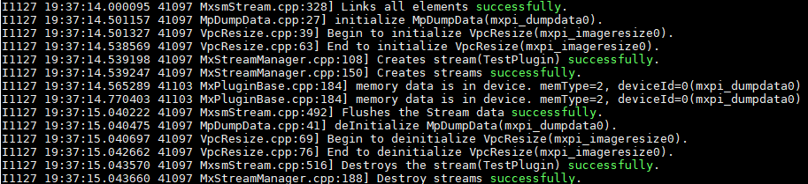
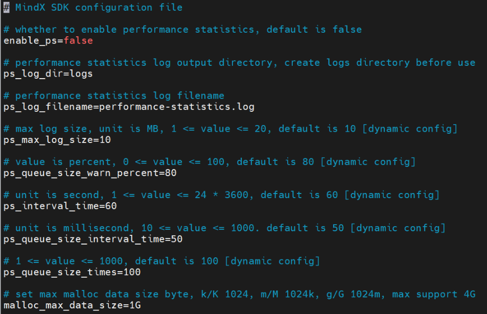
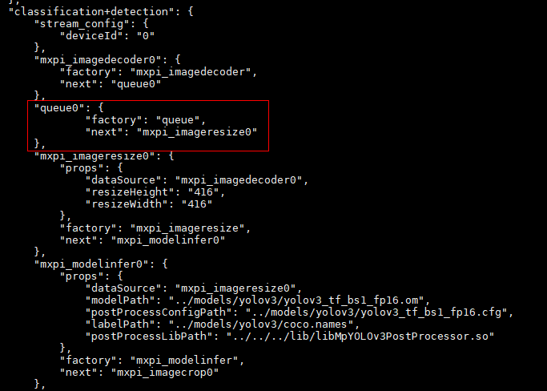
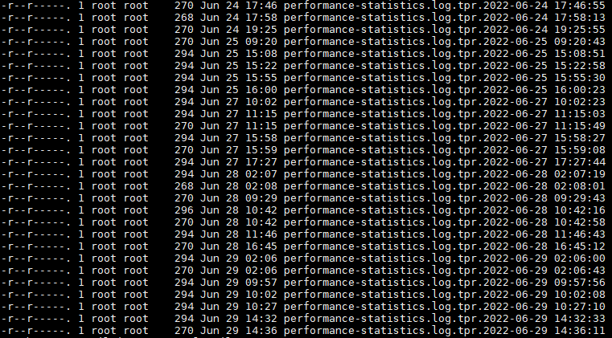
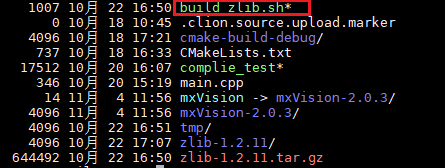
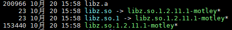
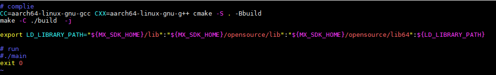

# 常用操作<a name="ZH-CN_TOPIC_0000001557589308"></a>

## 辅助工具<a name="ZH-CN_TOPIC_0000001608150677"></a>

### 一键式信息收集工具<a name="ZH-CN_TOPIC_0000001632419589"></a>

#### 工具介绍<a name="ZH-CN_TOPIC_0000001632818965"></a>

一键式信息收集工具用于快速收集Vision SDK问题，定位所依赖的相关信息，避免用户反复收集确认日志。主要包括芯片信息（版本和日志）、操作系统版本信息、环境变量、网络信息以及Vision SDK信息（版本、配置文件、日志、第三方库版本）等。

一键式信息收集工具由“sdk\_info\_collector.sh”和“sdk\_info\_collector.py”两个文件组成，为芯片日志和Vision SDK日志的信息收集提供了可配置的参数，请参见[表1](#table017215513195)，其他的信息都默认收集。

**表 1**  参数介绍
<a id="table017215513195"></a>

|参数|说明|
|--|--|
|--help\|-h\|-H|查看帮助信息。|
|--version\|-v\|-V|查看版本信息。|
|-p\|-P|必须设置的Vision SDK的日志存放目录，该目录下的日志文件数量不超过1500个。<br>-p *logs_path* \| -P *logs_path*：*logs_path*必须是绝对路径的形式。|
|-x\|-X|可配置的芯片日志收集参数。<li>默认不收集芯片信息。</li><li>-x *n* \| -X *n*：收集指定*n*号芯片的日志信息，*n*必须是整数。</li><li>-x *n1*,*n2*,*n3* \| -X *n1*,*n2*,*n3*：收集指定*n1*，*n2*，*n3*号芯片的日志信息，*n1*，*n2*，*n3*必须是整数。</li><li>-x -1 \| -X -1：收集所有芯片的日志信息。</li>|
|-r\|-R|可配置的Vision SDK日志天数收集参数。<li>默认收集所有日志信息。</li><li>-r *x*d \| -R *x*d：收集*x*天内的日志信息，x必须是三位以内整数（包含三位），取值范围：[1, 365]。</li><li>-r full \| -R full：收集每天的日志信息。</li>|
|-t\|-T|可配置的Vision SDK日志级别收集参数。<li>默认收集所有日志信息。</li><li>-t d \| -T d：收集调试（debug）日志及以上级别的日志信息。</li><li>-t i \| -T i：收集正常（info）日志及以上级别的日志信息。</li><li>-t w \| -T w：收集警告（warn）日志及以上级别的日志信息。</li><li>-t e \| -T e：收集错误（error）日志及以上级别的日志信息。</li><li>-t f \| -T f：收集致命（fatal）日志信息。</li><li>-t full \| -T full：收集所有级别的日志信息。</li>|


#### 工具使用<a name="ZH-CN_TOPIC_0000001582659042"></a>

1.  跳转到信息收集工具所在的目录。

    ```bash
    cd ${MX_SDK_HOME}/bin
    ```

    MX\_SDK\_HOME为Vision SDK软件包安装目录，请确保**MX\_SDK\_HOME**为有效的环境变量。

2.  执行“sdk\_info\_collector.sh”。

    以下为三种一键式信息采集的方式，用户可以根据实际情况来使用。

    -   采用默认参数，默认收集Vision SDK所有日志信息，不收集芯片日志。

        ```bash
        bash sdk_info_collector.sh -p logs_path
        ```

        **表 1**  命令参数说明（采用默认参数）

        |参数|说明|
        |--|--|
        |-p logs_path|收集指定目录logs_path中存放的Vision SDK日志信息。<br>logs_path仅支持绝对路径，且路径最后不能带/。|


    -   指定参数收集，具体参数说明请参见[表2](#table169243573344)。

        ```bash
        bash sdk_info_collector.sh -p logs_path -r 3d -t w -x 6
        ```

        **表 2**  命令参数说明（使用指定参数收集）
        <a id="table169243573344"></a>

        |参数|说明|
        |--|--|
        |-p logs_path|收集指定目录“logs_path”中存放的Vision SDK日志信息。|
        |-r 3d|收集最近3天内的Vision SDK日志信息。|
        |-t w|收集警告日志及以上级别的Vision SDK日志信息。|
        |-r 3d -t w|收集最近3天内的警告日志及以上级别的Vision SDK日志信息。|
        |-x 6|收集编号为“6”的芯片日志信息。|
        |-x 0,2,5|收集编号为“0”，“2”，“5”的芯片日志信息。|


        命令示例：

        ```bash
        bash sdk_info_collector.sh -p logs_path -r 3d -t w -x 0,2,5
        ```

    -   全量收集。

        ```bash
        bash sdk_info_collector.sh -p logs_path -r full -t full -x -1
        ```

        **表 3**  命令参数说明

        |参数|说明|
        |--|--|
        |-p logs_path|收集指定目录“logs_path”中存放的Vision SDK日志信息。|
        |-r full|收集每天的Vision SDK日志信息。|
        |-t full|收集所有级别的Vision SDK日志信息。|
        |-r full -t full|收集所有的Vision SDK日志信息。|
        |-x -1|收集所有的芯片日志信息。|


3.  获取结果。

    运行一键式信息收集工具的结果存放在“$\{MX\_SDK\_HOME\}/bin”目录下，以“mindx\_sdk\_info\__年月日_\__时分秒_.tar.gz”格式命名的文件中。


### 单插件测试工具<a name="ZH-CN_TOPIC_0000001582818986"></a>

#### 工具使用<a name="ZH-CN_TOPIC_0000001632659597"></a>

**工具介绍<a name="section139891517592"></a>**

单插件测试工具可以根据待测试插件的配置，自动添加Load与Dump数据，生成待测插件的pipeline文件，并对待测插件进行串流测试。

**使用方法<a name="section162015357595"></a>**

1.  在“$\{MX\_SDK\_HOME\}/toolkit/TestPlugin/config/config.py”文件中，配置待测插件属性。

    config.py文件大小限制为100M，具体说明可参考$\{MX\_SDK\_HOME\}/toolkit/TestPlugin/config/\_\_init\_\_.py。

    ```bash
        "factory": "mxpi_pluginname",       # 插件类型
        "plugin_name": "mxpi_pluginname0",  # 插件名称
        "props": {                          # 插件属性
            "dataSource": "mxpi_parentName0",
            "resizeHeight": "416",
            "resizeWidth": "416"
        }
    ```

2.  在“$\{MX\_SDK\_HOME\}/toolkit/TestPlugin/config/config.py”文件“load”参数中，配置插件的数据输入文件。若插件为多输入，可以配置多个数据输入文件。

    数据输入文件中的内容必须是待测插件的输入数据。

    ```bash
        "load": [                           # load插件的输入文件名，一个输入文件对应一个load插件
            "input/pluginname0.json"
        ]
    ```

3.  在“$\{MX\_SDK\_HOME\}/toolkit/TestPlugin/config/config.py”文件“dump”参数中，若插件为多输出，可以配置多个数据输出文件。

    ```bash
        "dump": [                           # dump插件的输出文件名，一个输出文件对应一个dump插件
            "pluginname0-output.json"
        ]
    ```

4.  运行单插件测试工具，生成待测插件的pipeline文件，并对待测插件进行串流测试。

    执行**run.sh**脚本，会在pipeline目录下生成待测插件的pipeline文件，并对待测插件进行串流测试，生成“dump”参数中配置的数据输出文件（其最终执行文件为main.py）。

    ```bash
    chmod +x run.sh && ./run.sh
    ```


#### 单插件测试样例<a name="ZH-CN_TOPIC_0000001632579037"></a>

1.  在“$\{MX\_SDK\_HOME\}/toolkit/TestPlugin/config/config.py”配置文件中配置待测插件mxpi\_imageresize的配置信息。配置信息如下：

    -   如果待测插件是多输入插件，“load”配置项可以配置多个输入文件。
    -   如果待测插件是多输出插件，“dump”配置项可以配置多个输出文件。

    ```bash
    PipelineConfig = {
        "stream_config": {
            "deviceId": "0"
        },
        "factory": "mxpi_imageresize",      # 插件名称
        "props": {                          # 插件属性
            "dataSource": "mxpi_imagedecoder0",
            "resizeHeight": "416",
            "resizeWidth": "416"
        },
        "load": [                           # load插件的输入文件名，一个输入文件对应一个load插件
            "input/imageresize0.json"
        ],
        "dump": [                           # dump插件的输出文件名，一个输出文件对应一个dump插件
            "imageresize0-output.json"
        ]
    }
    ```

2.  创建待测插件的数据输入文件“input/imageresize0.json”。

    ```cpp
    {
        "buffer": {
        },
        "metaData": [{
            "key": "ExternalObjects",
            "protoDataType": "MxpiObjectList"
        },
        {
            "key": "ReservedFrameInfo",
            "protoDataType": "MxpiFrameInfo"
        },
        {
            "key": "ReservedVisionList",
            "content": "mxpi_imagedecoder0"
        },
        {
            "key": "mxpi_imagedecoder0",
            "content": "{\"visionVec\":[{\"visionInfo\":{\"format\":1,\"width\":512,\"height\":512,\"widthAligned\":512,\"heightAligned\":512},\"visionData\":{\"dataPtr\":\"17695267880960\",\"dataSize\":393216,\"memType\":\"MXPI_MEMORY_DVPP\"}}]}",
            "visionData": [{
                "dataPtr": "17695267880960",  // 对应MxpiVisionData的dataPtr的地址
                "content": "vLu6ury9vr68vLy8" // 存在Device侧的图像数据，经过base64编码后的值
            }],
            "protoDataType": "MxpiVisionList"
        }]
    }
    ```

3.  运行单插件测试工具，生成待测插件的pipeline文件，并对待测插件进行串流测试。命令如下：

    ```bash
    chmod +x run.sh && ./run.sh
    ```

4.  检测单插件测试工具生成了pipeline文件。执行命令如下：

    ```bash
    cat pipeline/mxpi_imageresize0.pipeline
    ```

    ```bash
    {
        "TestPlugin": {
            "stream_config": {
                "deviceId": "0"
            },
            "mxpi_imageresize0": {
                "factory": "mxpi_imageresize",
                "next": [
                    "mxpi_dumpdata0"
                ],
                "props": {
                    "dataSource": "mxpi_imagedecoder0",
                    "resizeHeight": "416",
                    "resizeWidth": "416"
                }
            },
            "filesrc0": {
                "factory": "filesrc",
                "next": "mxpi_loaddata0",
                "props": {
                    "location": "input/imageresize0.json",
                    "blocksize": "40960000"
                }
            },
            "mxpi_loaddata0": {
                "factory": "mxpi_loaddata",
                "next": "mxpi_imageresize0:0"
            },
            "mxpi_dumpdata0": {
                "factory": "mxpi_dumpdata",
                "next": "fakesink0",
                "props": {
                    "location": "imageresize0-output.json"
                }
            },
            "fakesink0": {
                "factory": "fakesink"
            }
        }
    }
    ```

5.  检测单插件测试工具生成了待测插件的输出文件“imageresize0-output.json”。
6.  检测串流结果，串流成功后，会显示如[图1](#fig19206155665719)所示的成功日志。

    **图 1**  成功日志<a id="fig19206155665719"></a>  
    


### 插件信息搜集工具<a name="ZH-CN_TOPIC_0000001582339870"></a>

#### 工具使用<a name="ZH-CN_TOPIC_0000001632818969"></a>

**工具介绍<a name="section10603142820"></a>**

插件信息收集工具用于快速搜集所有插件信息。

该工具收集的插件包含GStreamer原生插件，例如clocksync，rtpisacdepay，rtpisacpay，rtpldacpay，av1parse，vp9parse，rtpst2022-1-fecenc和rtpst2022-1-fecdec。GStreamer原生插件会随着其版本变化而有所不同。

**使用方法<a name="section14715122911215"></a>**

1.  设置程序所需环境变量。

    ```bash
    . ${MX_SDK_HOME}/set_env.sh
    ```

2.  执行程序。

    进入到执行程序所在“bin”目录，执行如下命令。

    ```bash
    ./InspectAllPlugins
    ```

3.  获取结果。

    程序输出结果保存在“AllPluginsInfo.json”文件。


### 插件性能统计工具<a name="ZH-CN_TOPIC_0000001582659050"></a>

#### 工具介绍<a name="ZH-CN_TOPIC_0000001582818990"></a>

插件性能统计工具，可以快速测试分析Vision SDK的推理性能（所有性能统计数据涉及的时间单位都是微秒）。性能统计指标请见[表1](#table59867101265)。

**图 1** Vision SDK推理简易流程图<a name="fig92701022161517"></a>  


**表 1**  性能统计指标
<a id="table59867101265"></a>

|性能|介绍|
|--|--|
|端到端耗时|从appsrc输入插件的srcpad输出数据（t1时刻）开始计时统计，到appsink输出插件的sinkpad接收数据（t4时刻）结束计时统计。<br>端到端耗时 = 结束时间（t4） - 开始时间（t1）|
|单插件耗时|统计单个插件（只涉及SDK开发的插件，即插件名以mxpi_开头，不包含GStreamer插件）的耗时。<br>如mxpi_modelinfer插件的耗时，从这个插件sinkpad（t2时刻）开始计时，到这个插件srcpad（t3时刻）结束计时。<br>单插件耗时 = 结束时间（t3） - 开始时间（t2）|
|模型推理耗时|模型推理只在模型插件中存在，因此在模型推理插件内部会统计模型推理耗时。|
|后处理耗时|后处理只在modelinfer框架模型推理插件中存在，因此在modelinfer框架模型推理插件内部会统计后处理耗时。|
|吞吐率|appsink输出插件每次从sinkpad接收一次数据，做一次统计。|
|队列长度|每隔“ps_queue_size_interval_time”时间，获取一次队列的当前长度，获取“ps_queue_size_times”次数后，做一次队列长度的统计。|


#### 配置项介绍<a name="ZH-CN_TOPIC_0000001582499650"></a>

插件性能统计功能新增了Vision SDK的配置文件“$\{MX\_SDK\_HOME\}/config/sdk.conf”。如[图1](#fig1570512818326)所示，配置项注释中如果注明了“\[dynamic config\]”，说明这个配置项是动态可配置。（如果配置项的值小于最小值，则会设置成最小值。如果配置项的值大于最大值，则会设置成最大值。）配置项说明请参见[表1](#table1181963343413)。

>[!NOTICE] 须知 
>**队列长度统计的时间间隔 \* 队列长度统计次数**需小于推理总时间，如未生成.queue日志，可通过降低时间间隔（ps\_queue\_size\_interval\_time）或统计次数（ps\_queue\_size\_times）的方式进行调试。

**图 1**  SDK配置文件示例<a id="fig1570512818326"></a>  



**表 1**  配置项说明
<a id="table1181963343413"></a>

|配置项|说明|
|--|--|
|enable_ps|性能统计开关，默认为“false”。|
|ps_log_dir|性能统计日志目录，请在使用工具前配置到具体目录。|
|ps_log_filename|性能统计日志文件名。端到端日志文件会添加后缀.e2e。单插件、模型推理、后处理的日志文件会添加后缀.plugin。吞吐率日志文件会添加后缀.tpr。队列长度日志文件会添加后缀.queue。|
|ps_max_log_size|性能统计日志文件最大长度，日志文件大小超过这个值，将切换新的日志文件，单位MB，默认为10，取值范围为[1, 20]。|
|ps_queue_size_warn_percent|队列长度告警值百分比。当队列当前长度达到了队列总长度的告警值，将会打印告警日志，默认为80，取值范围为[1, 100]。|
|ps_interval_time|性能统计时间间隔，端到端、单插件、模型推理、后处理的性能统计时间间隔，默认为60，取值范围为[1, 24*3600]。|
|ps_queue_size_interval_time|队列长度统计的时间间隔，默认为50，取值范围为[10, 1000]。|
|ps_queue_size_times|队列长度统计次数，默认为100，取值范围为[1, 1000]。|
|malloc_max_data_size|设置申请内存的上限字节数，默认为1GByte，最大可支持至4GByte。|


#### 使用步骤<a name="ZH-CN_TOPIC_0000001632659601"></a>

1.  开启性能统计开关，在“$\{MX\_SDK\_HOME\}/config/sdk.conf”配置文件中，设置“enable\_ps”为“true”，开启性能统计开关。
2.  调整性能统计时间间隔，默认值为60秒，统计时间偏长，调整“ps\_interval\_time”为“6”，每隔6秒，进行一次性能统计。
3.  Pipeline文件中，加入队列插件。如果pipeline中未使用队列插件，将不会统计队列长度。

    **图 1**  Pipeline文件添加队列插件<a name="fig1837421311381"></a>  
    

4.  启动Vision SDK服务。


#### 观测结果<a name="ZH-CN_TOPIC_0000001632579041"></a>

1.  观察性能统计日志文件的生成。

    查看“ps\_log\_dir”配置项设置的目录下，是否生成插件性能统计日志。

    当配置项**ps\_interval\_time=6**时，程序会在启动**6**秒后，生成端到端日志文件、单插件日志文件、吞吐率日志文件。

    当配置项**ps\_queue\_size\_interval\_time=50**、**ps\_queue\_size\_times=100**时，程序会在启动<b>50 × 100毫秒（即5秒）</b>后，生成队列长度日志文件。如下图：

    

    **表 1**  文件类型解释

    |文件名|文件类型|
    |--|--|
    |performance—statistics.log.e2e.20210329-183958.877032|端到端日志文件。|
    |performance—statistics.log.plugin.20210329-183958.877905|单插件日志文件。|
    |performance—statistics.log.queue.20210329-183957.893092|队列长度日志文件。|
    |performance—statistics.log.tpr.20210329-183958.883263|吞吐率日志文件。|


2.  观察端到端日志文件。

    以下为端到端日志文件的示例内容。

    ```bash
    {"average":"45138","frequency":"3","maxTime":"73058","minTime":"30511","streamName":"classification+detection","totalTime":"135416","type":"e2e","updateTime":"2021-03-29 20:13:59.717927"}
    ```

    **表 2**  日志参数解释

    |参数|介绍|
    |--|--|
    |average|端到端平均耗时。单位：微秒。|
    |frequency|端到端统计次数。|
    |maxTime|最大的一次端到端耗时。单位：微秒。|
    |minTime|最小的一次端到端耗时。单位：微秒。|
    |streamName|pipeline中的“streamName”。|
    |totalTime|端到端总耗时。单位：微秒。|
    |type|统计类型，端到端类型为e2e。|
    |updateTime|本次统计的当前时间。|


3.  观察单插件日志文件。

    以下为单插件日志文件的示例内容。

    ```bash
    {"average":"18546","elementName":"mxpi_modelinfer0","factory":"mxpi_modelinfer","frequency":"3","maxTime":"18608","minTime":"18493","streamName":"classification+detection","totalTime":"55638","type":"plugin","updateTime":"2021-03-29 20:13:59.720010"}
    ```

    **表 3**  日志参数解释

    |参数|介绍|
    |--|--|
    |average|统计的单个插件平均耗时。单位：微秒。|
    |elementName|插件元件名称。|
    |factory|插件类型。|
    |frequency|插件处理的推理次数。|
    |maxTime|最大的一次耗时。单位：微秒。|
    |minTime|最小的一次耗时。单位：微秒。|
    |streamName|pipeline中的“streamName”。|
    |totalTime|单插件总耗时。单位：微秒。|
    |type|统计类型，单插件统计类型为“plugin”，模型推理统计类型为“modelInference”，后处理统计类型为“postProcessor”。|
    |updateTime|本次统计的当前时间。|


4.  观察吞吐率日志文件。

    以下为吞吐率日志文件的示例内容。

    ```bash
    {"streamName":"classification+detection","throughput":3,"throughputRate":0.5,"type":"throughputRate","updateTime":"2021-03-29 20:13:59.721819"}
    ```

    **表 4**  日志参数解释

    |参数|介绍|
    |--|--|
    |streamName|pipeline中的“streamName”。|
    |throughput|吞吐量。|
    |throughputRate|吞吐率。|
    |type|统计类型，吞吐率统计类型为“throughputRate”。|
    |updateTime|本次统计的当前时间。|


5.  观察队列长度日志文件。

    以下为队列长度日志文件的示例内容。

    队列长度的数据一直显示为0，即使在推理过程中，统计到的队列长度依然为0。说明在推理过程中，数据留在队列中的时间非常短，很快就被下游插件取走，导致统计队列长度时，获取到的队列长度为0。只有当推理过程中，出现阻塞现象，数据留在队列中才会出现队列长度不为0的情况。

    ```bash
    {"curSize":0,"elementName":"queue0","intervalTime":50000,"maxSize":0,"maxSizeBuffers":200,"recentSize":[0,0,0,0,0,0,0,0,0,0,0,0,0,0,0,0,0,0,0,0,0,0,0,0,0,0,0,0,0,0,0,0,0,0,0,0,0,0,0,0,0,0,0,0,0,0,0,0,0,0,0,0,0,0,0,0,0,0,0,0,0,0,0,0,0,0,0,0,0,0,0,0,0,0,0,0,0,0,0,0,0,0,0,0,0,0,0,0,0,0,0,0,0,0,0,0,0,0,0,0],"streamName":"classification+detection","type":"queueSize","updateTime":"2021-03-29 20:14:45.953312"}
    ```

    **表 5**  日志参数解释

    |参数|介绍|
    |--|--|
    |curSize|当前的队列长度，即“recentSize”列表中的最后一个值。|
    |elementName|插件元件名称。|
    |intervalTime|统计间隔时间，即与配置项“ps_queue_size_interval_time”含义相同。|
    |maxSize|统计的这段时间内，最大的队列长度，即“recentSize”列表中的最大值。|
    |maxSizeBuffers|队列总长度。|
    |recentSize|每隔“ps_queue_size_interval_time”毫秒，统计“ps_queue_size_times”次数的队列长度数据列表。|
    |streamName|pipeline中的“streamName”。|
    |type|统计类型，队列长度统计类型为“queueSize”。|
    |updateTime|本次统计的当前时间。|


## StreamServer推理服务<a name="ZH-CN_TOPIC_0000001557588784"></a>

### 简介<a name="ZH-CN_TOPIC_0000001622362633"></a>

StreamServer是基于Vision SDK实现的推理服务器，以RESTful接口对外提供视觉推理服务。

StreamServer依赖Flask框架，用户在启动StreamServer前需手动安装Flask。

StreamServer推理服务并不是一个完备的系统，不能用于生产部署，需要通过组件集成方式与用户其他系统配合才能形成一个完整的推理服务系统。用户需要考虑部署环境的安全性、可靠性与可用性，建议用户参考业界常用的Web部署方案对StreamServer推理服务进行集成部署，不建议单独使用该推理服务，同时建议用户在HTTPS服务器前部署Nginx用于增强流量控制等网络服务功能、抵御泛洪攻击等网络攻击方式。推荐设置可以参考[StreamServer安全加固](#streamserver安全加固)

>[!NOTE] 说明 
>-   Flask建议使用2.2.5版本。推荐使用包管理工具pip3安装，安装指令可参考：pip3 install Flask==2.2.5。
>-   配置Nginx之后，StreamServer仅记录与Nginx反向代理端口相关的网络服务信息，因此需结合StreamServer日志和Nginx日志分析业务相关问题。

**版本特性<a name="section594042811177"></a>**

-   支持pipeline推理服务。
-   支持单模型推理服务，支持自动组Batch。
-   支持请求流控。


### 服务配置<a name="ZH-CN_TOPIC_0000001622443085"></a>

#### 服务配置项<a name="ZH-CN_TOPIC_0000001622243021"></a>

>[!NOTICE] 须知 
>-   建议操作系统低权限的用户使用该推理服务。不建议root用户使用该服务。
>-   侦听IP固定为127.0.0.1

|配置项|描述|是否必选|是否可修改|
|--|--|--|--|
|server_name|推理服务名称，run包安装后原始配置文件中默认为“StreamServer”。请勿包含敏感信息。<br>如果该配置项的值为空，则采用默认值。|否|是|
|infer_config_repo|推理配置文件仓库的存储目录，run包安装后原始配置文件中默认为当前目录下的“inferConfigRepository”文件夹，推理服务会递归扫描此目录下面的所有推理配置文件（JSON文件），针对每一个配置文件，推理服务会尝试拉起该服务，如果硬件资源耗尽，会出现服务拉起失败的情况。<br>推理服务对“inferConfigRepository”文件夹的层次深度做了限制，包含自身文件夹在内，最大层次为10层，最大文件及文件夹个数为100个，如果不满足上述条件，将无法启动推理服务器。<br>如果该配置项的值为空，则采用默认值。|否|是|
|request_cache_size|每个推理服务请求缓冲区的大小，run包安装后原始配置文件中默认为“120”，设置范围 [1,1000]。<br>设置超出上（下）限时，将读取上（下）限的值。<br>如果该配置项的值为空，则采用默认值。|否|是|
|max_request_rate|客户端请求速率限制，run包安装后原始配置文件中默认为每秒钟20次请求，设置范围 [1,30]。<br>设置超出上（下）限时，将读取上（下）限的值。<br>如果该配置项的值为空，则采用默认值。|否|是|
|max_content_length|客户端请求报文大小限制，run包安装后原始配置文件中默认报文大小和请求头大小之和小于20480KB=20MB，设置时以KB为单位，设置范围 [1,51200]。<br>设置超出上（下）限时，将读取上（下）限的值。建议在HTTPS服务器前部署Nginx用于增强流量控制的功能。<br>如果该配置项的值为空，则采用默认值。|否|是|
|port|推理服务侦听的端口号，范围为[1025, 65535]，run包安装后原始配置文件中默认为“8080”。设置超出上（下）限时，将读取上（下）限的值。<br>如果该配置项的值为空，则采用默认值。|否|是|
|log_dir|StreamServer推理服务的日志路径，该路径为相对路径，默认为logs。其绝对路径为用户主目录下的“/log/mindxsdk”与“log_dir”的拼接路径。该配置项不能为空。|否|是|
|max_log_size|日志文件size最大值，单位为MB，run包安装后原始配置文件中默认值为“10”，设置范围[1,20]。设置超出上（下）限时，将读取上（下）限的值。该配置项不能为空。|否|是|
|rotate_file_number|日志文件回滚个数，run包安装后原始配置文件中默认值为“50”，设置范围[1, 500]。设置超出上（下）限时，将读取上（下）限的值。该配置项不能为空。|否|是|


#### 样例配置文件<a name="ZH-CN_TOPIC_0000001622522665"></a>

样例配置文件存储在“$\{MX\_SDK\_HOME\}/config/streamserver.conf”，配置项如下：

>[!NOTE] 说明 
>-   “streamserver.conf”文件路径、“configRepository”目录的路径、pipeline文件路径、om文件路径、模型配置等相关路径如果设置的是**相对路径**，则上述所有相对路径需要相对于推理服务进程的启动路径进行设置。
>-   “streamserver.conf”配置文件每行需小于1000个字符，整个文件需小于100行，否则读取失败。
>-   请勿在一个配置文件中设置多个相同的配置项，如果存在多个相同的配置项，解析配置文件会失败。
>-   log\_dir、max\_log\_size和rotate\_file\_number为新增配置项，由于版本升级时不会覆盖原有配置文件，因此可能导致配置文件中缺少上述配置项。该情况下，上述配置项采用默认值。

```bash
# inference server name, defalut StreamServer
server_name=StreamServer

# Inference configuration repository directory path, default ./inferConfigRepository
infer_config_repo=./inferConfigRepository

# request cache size, default 120, range [1,1000]
request_cache_size=120

# The maximum request rate of the client per second, the default is 20 requests per second, range [1,30]
max_request_rate=20

# The maximum sum length of content with its request head, set this number in KB. The default is 20MB = 20480KB, range [1, 51200](KB)
max_content_length=20480

# The port that the service is listening on, range [1025, 65535], default is 8080
port=8080

# log output directory for streamserver, create logs directory before use
log_dir=logs

# max log size, unit is MB, max_log_size must be an integer, default is 10. 1 <= value <= 20
max_log_size=10

# rotate file number of log switch: 50 (default, For each log level). 1 <= value <= 500
rotate_file_number=50
```


### 推理配置文件<a name="ZH-CN_TOPIC_0000001571763392"></a>

#### 推理配置项目<a name="ZH-CN_TOPIC_0000001571604060"></a>

>[!NOTICE] 须知 
>一个推理配置文件只支持一个推理服务项目的配置，如果进行了多个配置，将以最后一个为准。

**表 1**  推理配置服务项

|推理服务配置项目|描述|数据类型|是否必选|是否可修改|
|--|--|--|--|--|
|inferType|推理类型，可选项为{streams, models}，其中“streams”为pipeline推理服务，“models”为模型推理服务。|字符串|是|是|
|name|Stream名称或者是模型名称，其中Stream名称为pipeline文件当中指定的推理流名称。<br>限定字符集为{0-9, a-z, A-Z, +, -, _}，请勿使用限定字符集以外的其他字符。name字符串将会用于组成推理服务RESTful接口的URI，推理服务对URI的长度做了限制，请参见[RESTful接口](#ZH-CN_TOPIC_0000001622362645)，合理设置“name”字符串的长度。<br>请注意，若设置的该项为Stream的名称，请确保该文件中此配置项的名称与实际pipeline文件中的名称一致。否则即使成功拉起服务，在实际处理请求时也会找不到对应的推理流。|字符串|是|是|
|path|pipeline文件或om模型文件路径，可以为相对路径，也可以为绝对路径，如果是相对路径，需要相对于推理服务StreamServer拉起的路径。注意推理服务进程需要有该配置路径的访问权限。OM模型最大限制为4096MB，建议用户合理分配内存资源|字符串|是|是|
|deviceId|运行该推理服务的设备ID，需要提前确认硬件资源，在安装了Ascend设备的环境上执行**npu-smi info**命令查看硬件资源。<br>取值范围为[0, 1024]，且不可超出当前环境所配置的设置ID的范围。当前配置文件为stream类型的配置文件时，该配置项不生效，实际执行的“deviceId”以该配置文件中指定的pipeline中的deviceId为准。|整型|是|是|
|timeoutMs|推理超时时间，单位毫秒，默认为3000ms。取值范围为[1, 100000]毫秒。|正整数|否|是|
|inputs|输入张量配置项。当前配置文件为stream类型的配置文件时，该配置项不生效，实际的输入张量配置由该配置文件中指定的pipeline中的输入配置为准。|Tensor|是|是|
|outputs|输出张量配置项。当前配置文件为stream类型的配置文件时，该配置项不生效，实际的输出张量配置由该配置文件中指定的pipeline中的输出配置为准。|Tensor|是|是|
|dynamicBatching|单模型推理是否支持动态Batching的配置。|dynamicBatching|否|是|


**表 2**  张量配置项
<a id="table28738108720"></a>

|**张量配置项**|描述|数据类型|是否必选|是否可修改|
|--|--|--|--|--|
|name|张量名称。字符集限制为{0-9,a-z,A-Z,+,-,_}，不允许使用限定字符集合以外的其它字符。name字符串长度取值区间为[1, 100]。|字符串|是|是|
|id|张量ID，从0开始计数，如果是stream推理类型，对应pipeline的输入输出插件的ID（对应appsrcX/appsinkX）范围限定为[0, 10000]。|整型|是|是|
|dataType|张量数据类型。限定为[表3](#table71671981883)中已经定义的数据类型。|字符串|是|是|
|format|张量数据格式。限定为[表4](#table189742104109)中已经定义的数据格式。|字符串|是|是|
|shape|张量形状（维度）。张量形状的维度大小范围为(0, 10000]，所有维度的乘积的取值范围为(0, *max_content_length*)，其中“max_content_length”为“streamserver.conf”配置文件当中定义的请求体的最大长度。|整型数组|是|是|
|data|base64编码的待推理数据字符串。（仅在推理请求时需要填写，配置文件不填写。）|字符串|否|是|


**表 3**  张量数据类型
<a id="table71671981883"></a>

|张量数据类型|描述|
|--|--|
|FLOAT32|32位浮点型。|
|FLOAT16|16位浮点型。|
|INT8|8位有符号整型。|
|INT32|32位有符号整型。|
|UINT8|8位无符号整型。|
|UINT16|16位无符号整型。|
|UINT32|32位无符号整型。|
|INT64|64位有符号整型。|
|UINT64|64位无符号整型。|
|DOUBLE64|64位双精度浮点型。|
|BOOL|布尔类型。|
|STRING|字符串类型。|
|BINARY|二进制类型。|


**表 4**  张量数据格式
<a id="table189742104109"></a>

|**张量数据格式**|描述|
|--|--|
|FORMAT_NONE|无格式|
|FORMAT_NHWC|NHWC型|
|FORMAT_NCWH|NCWH型|


**表 5**  动态Batch配置项

|动态Batch配置项|数据类型|是否必选|是否可修改|描述|
|--|--|--|--|--|
|preferredBatchSize|整型数组|是|是|om模型支持的Batch档位。|
|waitingTime|整型|否|是|多Batch模型场景下，形成一组Batch的最大等待时间，超过此时间则结束等待自动完成推理，默认为5000ms，范围为[1, 50000]。|
|dynamicStrategy|字符串|否|是|动态Batch推理情形下，选取合适batchsize所采用的策略。默认为“Nearest”。<li>“Nearest”策略：选取与缓存图片数量差值的绝对值最接近的batchsize（绝对值相等取较大者）。<li>“Upper”策略：取大于或等于缓存图片数量的最小batchsize。<li>“Lower”策略：取小于或等于缓存图片数量的最大batchsize。|
|singleBatchInfer|整型|否|是|单Batch推理开关，布尔型。<li>0：自动根据模型的第一维，选择单Batch或多Batch推理。（默认为0。）<li>1：无论模型的第一维是否为1，都只会进行单Batch推理。|
> 注：其中waitingTime、dynamicStrategy、singleBatchInfer字段与mxpi_tensorinfer插件的配置含义相同。


#### Stream推理配置文件<a name="ZH-CN_TOPIC_0000001571922964"></a>

>[!NOTICE] 须知 
>当前版本的推理服务针对Stream推理使用的是**MxStreamManager**类的**SendMultiDataWithUniqueId**和**GetMultiResultWithUniqueId**接口发送和获取数据的，请在该文档的相关章节参考这2个接口的描述信息，该套接口暂时不支持从中间插件输入数据和获取结果，请用户按照上述要求配置pipeline文件。建议用户使用C++、Python接口的**SendMultiDataWithUniqueId**和**GetMultiResultWithUniqueId**对pipeline文件进行调试和测试，确保结果符合预期后，再将该pipeline文件部署到推理服务。

参考$\{MX\_SDK\_HOME\}/samples/mxVision/streamserver/inferConfigRepository/PipelineSample/PipelineConfig.json，针对具体的pipeline信息修改以下模板文件，其中\{MX\_SDK\_HOME\}为Vision SDK安装目录。

>[!NOTE] 说明 
>推理配置项当中的shape向量，如果某一维度为-1，仅代表该维度是可变的维度，客户端实际发送的请求必须要指明各个维度的实际值，不能使用-1代表。

```bash
{
    "PipelineSample": {
        "inferType": "streams",
        "name": "classification+detection",
        "path": "../pipeline/Sample.pipeline",
        "deviceId": 1,
        "timeoutMs": 3000,
        "inputs": [{
            "name": "appsrc0",
            "id": 0,
            "dataType": "BINARY",
            "format": "FORMAT_NONE",
            "shape": [-1]
        }],
        "outputs": [{
            "name": "appsink0",
            "id": 0,
            "dataType": "STRING",
            "format": "FORMAT_NONE",
            "shape": [-1]
        }]
    }
}
```


#### model推理配置文件<a name="ZH-CN_TOPIC_0000001572082900"></a>

参考“./inferConfigRepository/ModelSample/ModelConfig.json”，针对具体的模型信息修改以下模板文件。

```bash
{
	"ModelSample": {
		"inferType": "models",
		"name": "resnet50",
		"path": "../models/resnet50/resnet50.om",
		"deviceId": 1,
                "timeoutMs": 3000,
		"dynamicBatching": {
			"preferredBatchSize": [1, 2, 4, 8],
			"waitingTime": 100,
			"dynamicStrategy": "Nearest",
			"singleBatchInfer": 0
		},
		"inputs": [{
			"name": "Placeholder",
			"id": 0,
			"dataType": "UINT8",
			"format": "FORMAT_NHWC",
			"shape": [-1, 224, 224, 3]
		}],
		"outputs": [{
			"name": "fp32_vars/dense/BiasAdd:0",
			"id": 0,
			"dataType": "FLOAT32",
			"format": "FORMAT_NONE",
			"shape": [-1, 1001]
		}]
	}
}
```


### 准备模型及对应的推理配置文件<a name="ZH-CN_TOPIC_0000001622362641"></a>

#### Stream推理<a name="ZH-CN_TOPIC_0000001622443089"></a>

**准备pipeline和模型<a name="section51081252164114"></a>**

**获取模型**

1.  下载模型，以[**YOLOv3**](https://ascend-repo-modelzoo.obs.cn-east-2.myhuaweicloud.com/c-version/YoloV3_for_TensorFlow/zh/1.6/m/YOLOv3_TensorFlow_1.6_model.zip)（版本1.6，TensorFlow框架）和[**ResNet-50**](https://ascend-repo-modelzoo.obs.cn-east-2.myhuaweicloud.com/c-version/ResNet50_for_TensorFlow/zh/1.7/m/ResNet50_for_TensorFlow_1.7_model.zip)（版本1.7，TensorFlow框架）模型为例下载对应的模型。
2.  解压并将其中的pb模型放置到“\$\{MX\_SDK\_HOME\}/sample/mxVision/models/yolov3”和“$\{MX\_SDK\_HOME\}/sample/mxVision/models/resnet50”目录下。
3.  参见《CANN ATC离线模型编译工具用户指南》进行模型转换，得到om模型。模型和模型相关文件权限设置要求不大于“640”。

**准备pipeline**

样例pipeline位于“$\{MX\_SDK\_HOME\}/sample/mxVision/pipeline/”下。当用户需要修改pipeline配置文件中业务流的元件的属性，或创建一个全新的业务流时，可参考上述路径下的pipeline配置文件（以图像处理“Sample.pipeline”为例和[表 pipeline配置文件说明](./user_guide.md#流程编排)）。

**准备Stream推理配置文件<a name="section129231338144612"></a>**

参考样例推理配置文件存储目录“$\{MX\_SDK\_HOME\}/sample/mxVision/streamserver/inferConfigRepository/PipelineSample/PipelineConfig.json”，为Stream准备推理配置文件。


#### 单模型推理<a name="ZH-CN_TOPIC_0000001571763396"></a>

**准备om模型<a name="section8675155734717"></a>**

获取模型，并执行模型转换，得到om离线模型，模型转换具体操作请参见《CANN ATC离线模型编译工具用户指南》。

**准备模型推理配置文件<a name="section6251123474812"></a>**

参考样例推理配置文件存储目录“./inferConfigRepository/ModelSample/ModelConfig.json”，为模型准备推理配置文件。

>[!NOTE] 说明 
>在启动服务前，请检查推理服务配置文件存储目录“./inferConfigRepository”下的所有单模型和Streams的推理配置文件，确保所有配置文件及其包含的pipeline文件所需的模型、参数等文件已存放至对应的路径下。（若实际业务暂不需要相关的默认推理配置文件，请将默认的配置文件移除。）


### StreamServer启动与停止命令<a name="ZH-CN_TOPIC_0000001572082904"></a>

1.  设置Vision SDK和CANN的环境变量。
    1.  执行CANN环境变量配置脚本，使环境变量生效。具体执行路径，请以实际安装为准。

        ```bash
        . /usr/local/Ascend/cann/set_env.sh
        ```

    2.  设置Vision SDK的环境变量。

        ```bash
        source ${MX_SDK_HOME}/set_env.sh
        ```

2.  启动命令，启动时将会调用“_$\{MX\_SDK\_HOME\}_/samples/mxVision/streamserver/streamserverSourceCode”目录下的“main.py”。

    ```bash
    bash run.sh
    ```

    >[!NOTE] 说明 
    >-   脚本执行文件所在路径为“$MX\_SDK\_HOME/samples/mxVision/streamserver”。

3.  停止命令。

    StreamServer进程注册了“SIGINT”信号，因此可以通过以下其中一种方式来停止StreamServer进程。

    -   命令行输入“Ctrl+C”组合键。
    -   命令行输入**kill** **-SIGINT** <i>\$\{PID\}</i>命令，其中<i>\$\{PID\}</i>为StreamServer进程号。若用户执行了进程挂起等操作，请用户自行恢复后再输入**kill** **-SIGINT** <i>\$\{PID\}</i>命令终止进程。

    >[!NOTE] 说明 
    >-   StreamServer推理服务只是一个组件，不是一个完备的系统，需要集成到用户的系统当中使用。针对推理服务的启动、停止、异常情况下的重新启动等功能需要用户进行控制。StreamServer推理服务没有重新启动的机制，重启功能需要由用户的系统来进行控制。
    >-   StreamServer进程号可通过命令行输入**netstat -tlnp**，找到与StreamServer配置文件中port参数相同端口的python3程序的$\{PID\}获取。


### RESTful接口<a id="ZH-CN_TOPIC_0000001622362645"></a>

#### 推理请求URI<a name="ZH-CN_TOPIC_0000001622443093"></a>

>[!NOTICE] 须知 
>-   推理服务的URI路径限定的字符集合为字母、数字、符号（+、-、\_、/），URI路径长度限制为\[3, 255\]。如不符合上述条件的URI会被识别为非法URI。服务端将返回非法URI的错误码给客户端。
>-   请勿在整个URI中拼接参数以及非法字符，否则可能被视为非法URI的错误返回给客户端。
>-   请勿将敏感信息写入URI。
>-   支持OPTIONS和HEAD请求，OPTIONS和HEAD请求采用Flask框架默认支持的功能。

-   推理流推理请求接口POST v2/streams/_$\{STREAM\_NAME\}_/infer

    其中<i>$\{STREAM\_NAME\}</i>为推理流名称。

-   单模型推理请求接口POST v2/models/_$\{MODEL\_NAME\}_/infer

    其中<i>$\{MODEL\_NAME\}</i>为模型名称。

    推理请求的请求体要求存在键“inputs”，其对应的值必须为一个列表，参考[请求配置项](#请求配置项)中推理请求JSON字段，“inputs”对应列表单个张量说明请参照[推理配置项目](#推理配置项目)中[表 张量配置项](#table28738108720)，推理请求需要填写表中最后一项参数“data”。

    推理响应参考[请求配置项](#请求配置项)中推理响应JSON字段，参数说明如下：

    **表 1**  推理请求响应字段

    |字段名称|描述|数据类型|
    |--|--|--|
    |isSuccess|推理是否成功|布尔值|
    |errorCode|错误码|整型|
    |errorMsg|错误消息|字符串|
    |outputs|输出张量|Tensor|


    >[!NOTE] 说明 
    >-   <i>\$\{MODEL\_NAME\}</i>和<i>\$\{STREAM\_NAME\}</i>限制为字符串形式，字符集合为字母、数字、符号（+-\_）的组合。
    >-   POST请求“content\_type”需要设置为“application/json”。


#### 信息查询URI<a name="ZH-CN_TOPIC_0000001622243029"></a>

>[!NOTE] 说明 
>支持OPTIONS和HEAD请求，OPTIONS和HEAD请求采用Flask框架默认支持的功能。

-   查询推理服务器信息。

    ```bash
    GET /v2
    ```

    或

    ```bash
    GET /v2/
    ```

    |响应字段|描述|数据类型|
    |--|--|--|
    |serverName|推理服务名称。|字符串|


    返回样例：

    ```bash
    {'errorCode': 0, 'errorMsg': 'Succeeded!', 'isSuccess': true, 'outputs': [{'server_name': 'StreamServer'}]}
    ```

-   查询推理服务器是否在运行。

    ```bash
    GET /v2/live
    ```

    或

    ```bash
    GET /v2/live/
    ```

    |响应字段|描述|数据类型|
    |--|--|--|
    |isLive|推理服务是否在运行。|布尔值|


    返回样例：

    ```bash
    {'errorCode': 0, 'errorMsg': 'Succeeded!', 'isSuccess': true, 'outputs': [{'isLive': True}]}
    ```

-   查询推理服务器是否已经准备好接受推理请求。

    ```bash
    GET /v2/ready
    ```

    或

    ```bash
    GET /v2/ready/
    ```

    |响应字段|描述|数据类型|
    |--|--|--|
    |isReady|推理服务是否已经准备好接受推理请求。|布尔值|


-   查询某个模型或者Stream是否已经准备好接受推理请求。

    GET v2/streams/$\{STREAM\_NAME\}/ready

    GET v2/models/$\{MODEL\_NAME\}/ready

    |响应字段|描述|数据类型|
    |--|--|--|
    |isReady|模型或者Stream是否已经准备好接受推理请求。|布尔值|


    返回样例：

    ```bash
    {'errorCode': 0, 'errorMsg': 'Succeeded!', 'isSuccess': true, 'outputs': [{'isReady': True}]}
    ```

    >[!NOTE] 说明 
    ><i>\$\{MODEL\_NAME\}</i>和<i>\$\{STREAM\_NAME\}</i>限制为字符串形式，字符集合为字母、数字、符号（+-\_）的组合。

-   查询某个模型或者Stream的配置信息。

    GET v2/streams/$\{STREAM\_NAME\}/config

    GET v2/models/$\{MODEL\_NAME\}/config

    |响应字段|描述|数据类型|
    |--|--|--|
    |streamsConfig/modelsConfig|模型或者Stream的推理配置信息。|JSON字符串|


    返回样例：

    ```bash
    {'errorCode': 0, 'errorMsg': 'Succeeded!', 'isSuccess': true, 'outputs': [{'ModelSample': {'deviceId': 1, 'dynamicBatching': {'dynamicStrategy': 'Nearest', 'preferredBatchSize': [1, 2, 4, 8], 'singleBatchInfer': 0, 'waitingTime': 100}, 'inferType': 'models', 'inputs': [{'dataType': 'UINT8', 'format': 'FORMAT_NHWC', 'id': 0, 'name': 'Placeholder', 'shape': [-1, 224, 224, 3]}], 'name': 'resnet50', 'outputs': [{'dataType': 'FLOAT32', 'format': 'FORMAT_NONE', 'id': 0, 'name': 'fp32_vars/dense/BiasAdd:0', 'shape': [-1, 1001]}], 'timeoutMs': 3000}}]}
    ```

    >[!NOTE] 说明 
    ><i>\$\{MODEL\_NAME\}</i>和<i>\$\{STREAM\_NAME\}</i>限制为字符串形式，字符集合为字母、数字、符号（+-\_）的组合。


#### 请求配置项<a name="ZH-CN_TOPIC_0000001622522673"></a>

>[!NOTE] 说明 
>支持OPTIONS和HEAD请求，OPTIONS和HEAD请求采用Flask框架默认支持的功能。

-   推理请求JSON字段样例，请根据实际模型或pipeline配置文件填写。该样例中输入数据类型为“BINARY”，传入格式为“FORMAT\_NONE”，其中“binary\_data”字段为客户端读取的二进制形式的图片数据。

    ```bash
    {
        "inputs": [{
            "name": "appsrc0",
            "id": 0,
            "dataType": "BINARY",
            "format": "FORMAT_NONE",
            "shape": [len(binary_data)],   
            "data": base64.b64encode(binary_data).decode()
        }]
    }
    ```

-   推理响应JSON字段样例。该样例中数据输出格式为“STRING”。其中*result*为服务端返回的二进制形式的输出结果，长度为“-1”代表可变维度。“data”为base64编码的推理结果字符串。

    ```bash
    {
        "isSuccess": true,
        "errorCode": 0,
        "errorMsg": "Succeeded!",
        "outputs": [{
            "name": "appsink0",
            "dataType": "STRING",
            "format": "FORMAT_NONE",
            "shape": [len(result)],    
            "data": base64.b64encode(result).decode()
        }]
    }
    ```


#### 响应错误码与错误消息<a name="ZH-CN_TOPIC_0000001571763400"></a>

**HTTP错误码<a name="section11806161994918"></a>**

|HTTP错误码|含义|
|--|--|
|200|请求成功。|
|201|资源成功创建。|
|202|创建任务执行成功。|
|206|部分成功。|
|400|请求非法，客户端侧发生错误并返回错误消息。|
|401|无效的用户请求。|
|403|服务端拒绝请求。|
|404|访问请求资源不存在。|
|405|不支持的操作。|
|408|请求超时。|
|409|请求资源的状态之间存在冲突。|
|413|请求实体过大。|
|500|服务端内部错误。|
|501|所请求的功能当前尚未实现。|
|502|网关错误。|
|503|服务不可用。|
|504|网关超时。|


**推理服务错误码与错误消息<a name="section10291736124910"></a>**

|错误码|错误码变量名|错误消息|
|--|--|--|
|0|SUCCESS|Inference succeeded!|
|1|INFER_FAILED|Inference failed!|
|2|INVALID_URI|Invalid uri, format is incorrect!|
|3|TARGET_NOT_EXISTS|Illegal request, requested stream or model does not exist!|
|4|INVALID_BODY|Illegal request, the request body is invalid!|
|5|CACHE_FULL|Request Cache is full!|
|6|MODEL_INPUT_FAILED|Send input to model failed!|
|7|MODEL_OUTPUT_FAILED|Get output from model failed!|
|8|RATE_EXCEEDED|Maximum request rate exceeded!|
|9|ILLEGAL_CONTENT|Illegal content type! expected application/json|
|10|LARGE_CONTENT|The length of the content with its request head has exceeded!|
|11|INTERNAL_ERROR|The server has encountered an internal error!|
|12|UNSUPPORTED_METHOD|Options request or head request is not allowed!|


### StreamServer安全加固<a name="ZH-CN_TOPIC_0000001572082912"></a>
### Nginx网关<a name="ZH-CN_TOPIC_0000002463250302"></a>

StreamServer监听至127.0.0.1且MIS和公网、局域网隔离需由用户保证。MIS需要通过组件集成方式与用户的其他系统配合才能形成一个完整的推理服务系统，如可使用开源软件Nginx进行保障，用户可参照Nginx官方文档进行Nginx的部署。建议专门创建Nginx运行用户而不要使用root用户启动Nginx。建议开启Nginx的日志功能，用于记录正常的访问日志和错误请求日志。为了防止日志文件过大，需要定时对日志文件进行切割压缩。如果切割压缩后文件仍然过大，可以将切割压缩过的日志文件转储到其它地方。

> [!NOTE] 说明
>-   请及时更新Nginx补丁或升级版本，使用最新最稳定的安全版本。
>-   建议Web应用目录及文件属主只能为root或Nginx运行用户，且只允许属主可读写执行。
>-   建议Nginx根目录只能由root或Nginx运行用户修改，Nginx根目录的所有父级目录的修改权限不能赋予除root和Nginx运行用户的其他普通用户。
>-   建议Nginx日志文件属主只能为Nginx运行用户，且只允许属主可读写。

**操作步骤<a name="section1363491315542"></a>**

1.  安装Nginx。可以使用源码进行安装，也可以使用包管理安装。如在Ubuntu操作系统下可执行下面命令进行安装。安装完成后，需要确保Nginx目录和文件为启动用户修改（权限不高于550）并确保Nginx日志为启动账户修改（权限640），确保Nginx process ID（PID）文件为启动用户修改（权限640）。

    ```
    apt install nginx
    ```

    安装完成后，需要确保Nginx目录和文件为启动用户修改（权限不高于550）并确保Nginx日志为启动账户修改（权限640），确保Nginx process ID（PID）文件为启动用户修改（权限640）。

    > [!NOTE] 说明
    >建议使用非root用户启动Nginx。如果要使用root用户启动Nginx，则需要创建专门执行Nginx的用户，可使用如下命令创建：
    >1.  **创建用户**
    >    使用以下命令创建一个名为nginx-user的用户，该用户没有登录权限
    >    ```
    >    sudo useradd -r -s /sbin/nologin nginx-user
    >    ```
    >2.  **修改Nginx配置文件**
    >    在Nginx配置文件（通常是/etc/nginx/nginx.conf）的最顶部，添加或修改user指令，如下所示
    >    ```
    >    user nginx-user;
    >    ```
    >3.  **设置文件和目录权限**
    >    确保Nginx需要访问的文件和目录对nginx-user用户可读可写。例如，对于日志目录和缓存目录，可使用以下命令设置权限
    >    ```
    >    sudo chown -R nginx-user:nginx-user /path/to/log/nginx
    >    ```

2.  设置Nginx配置文件，配置文件要求权限不高于440。Nginx参考配置如下：

    -   访问控制加固

        IP白名单配置

        ```
            # 限制只有特定IP可以访问API(示例IP)
            location / {
                allow 192.168.1.0/24;
                allow 10.0.0.0/8;
                deny all;
            }
        ```

    -   速率限制防护

        请求频率限制

        ```
            # 定义限制策略
            limit_req_zone global zone=req_zone:100m rate=60r/m;
            
            server {
                # 应用速率限制
                location / {
                    limit_req zone=api burst=20 nodelay;
                    limit_req_status 429;
                }
            }
        ```

        并发连接限制

        ```
            # 限制单个IP的并发连接数
            limit_conn_zone $binary_remote_addr zone=conn_limit_per_ip:10m;
            
            server {
                limit_conn conn_limit_per_ip 10;
            }
        ```

    -   SSL/TLS安全加固

        强化SSL配置

        ```
            server {
                listen 10.0.0.0:8001 ssl;
                
                # 使用强加密套件
                ssl_protocols TLSv1.2 TLSv1.3;
                ssl_ciphers "ECDHE-ECDSA-AES256-GCM-SHA384:ECDHE-ECDSA-AES128-GCM-SHA256:ECDHE-RSA-AES256-GCM-SHA384:ECDHE-RSA-AES128-GCM-SHA256 !aNULL !eNULL !LOW !3DES !MD5 !EXP !PSK !SRP !DSS !RC4";
                ssl_prefer_server_ciphers on;
                
                # 启用HSTS
                add_header Strict-Transport-Security "max-age=31536000; includeSubDomains; preload";
                
                # 防止协议降级
                ssl_stapling on;
                ssl_stapling_verify on;
            }
        ```

    -   请求内容安全控制

        请求大小限制

        ```
            server {
                # 限制客户端请求体大小
                client_max_body_size 50M;
                
                # 限制请求头大小
                large_client_header_buffers 200 8k;
            }
        ```

        超时控制

        ```
            server {
                # 设置各种超时时间防止资源耗尽
                client_body_timeout 120s;
                client_header_timeout 120s;
                keepalive_timeout 65s;
                keepalive_requests 200;
                send_timeout 120s;
            }
        ```

    -   安全头设置

        添加安全相关HTTP头

        ```
            server {
                # 防止点击劫持
                add_header X-Frame-Options "SAMEORIGIN" always;
                
                # 防止XSS攻击
                add_header X-XSS-Protection "1; mode=block" always;
                
                # 禁止 MIME 类型嗅探
                add_header X-Content-Type-Options "nosniff" always;
                
                # 控制referrer信息
                add_header Referrer-Policy "no-referrer-when-downgrade" always;
                
                # 内容安全策略
                add_header Content-Security-Policy "default-src 'self' http: https: data: blob: 'unsafe-inline'" always;
            }
        ```

    -   日志和监控

        详细日志记录

        ```
            # 自定义日志格式记录安全相关信息
            log_format security_log '$remote_addr - $remote_user [$time_local] "$request" '
                                   '$status $body_bytes_sent "$http_referer" '
                                   '"$http_user_agent" "$http_x_forwarded_for" '
                                   '$request_time $upstream_response_time';
            
            access_log $HOME/log/nginx/security.log security_log;
            error_log $HOME/log/nginx/error.log warn;
        ```

        异常请求监控

        ```
            # 记录可疑请求
            location ~* (\.php|\.asp|\.exe|\.sh|\.bash) {
                access_log $HOME/log/nginx/suspicious.log;
                return 403;
            }
        ```

    -   隐藏服务器信息

        ```
            server {
                # 隐藏nginx版本信息
                server_tokens off;
                
                # 自定义错误页面
                error_page 403 /error/403.html;
                error_page 404 /error/404.html;
                error_page 500 502 503 504 /error/50x.html;
            }
        ```

    -   上游服务保护

        ```
            location / {
                # 请以实际MIS监听端口为准
                proxy_pass http://127.0.0.1:8000;
                
                # 隐藏真实客户端IP
                proxy_hide_header X-Powered-By;
                
                # Nginx 先完整读请求体
                proxy_request_buffering on;
        
                # 设置代理超时
                proxy_connect_timeout 30s;
                proxy_send_timeout 30s;
                proxy_read_timeout 30s;
                
                # 限制后端重试次数
                proxy_next_upstream error timeout invalid_header http_500 http_502 http_503;
                proxy_next_upstream_tries 2;
        
                # 指定 X-Real-IP 和 X-Forwarded-For
                proxy_set_header Host $host;
                proxy_set_header X-Real-IP $remote_addr;
                proxy_set_header X-Forwarded-For $remote_addr;
                proxy_set_header X-Forwarded-Proto $scheme;
            }
        ```

    -   降低CSRF攻击风险

        ```
            server {
                add_header Strict-Transport-Security "max-age=31536000; includeSubDomains; preload";
                add_header X-Frame-Options "DENY";
                add_header Content-Security-Policy "default-src 'self'; frame-ancestors 'none';";
                proxy_read_timeout 900;
                proxy_connect_timeout 60;
                proxy_send_timeout 60;
                limit_req zone=req_zone burst=20 nodelay;
                limit_conn north_conn_zone 512;
            }
            location / {
              limit_except GET POST HEAD {
                 deny all;
              add_header X-Powered-By '';
              allow 10.0.0.0; # 允许的IP地址
              deny all;       # 拒绝其他所有IP
            }
        ```

    -   增强SSL/TLS连接的安全性

        使用至少2048位的Diffie-Hellman（DHE）参数，可通过生成一个DHE参数文件并在Nginx配置中引用它来实现。

        -   **生成DHE参数文件**

            使用OpenSSL生成一个2048位的DHE参数文件

            ```
            openssl dhparam -out /path/to/dhparam.pem 2048
            ```

        -   **在Nginx配置中引用DHE参数文件**

            在Nginx配置文件中，添加ssl\_dhparam指令来引用生成的DHE参数文件。例如：

            ```
            ssl_dhparam /path/to/dhparam.pem; 
            ```

    **Nginx配置文件示例**

    设置Nginx配置文件，配置文件要求权限不高于440，默认路径为: /etc/nginx/nginx.conf，access\_log与error\_log需配置相应路径。

    ```
    # 如果以root用户启动Nginx，则需要指定工作用户；如果以非root用户启动Nginx，则无需配置工作用户
    user nginx-user;
    
    worker_processes 1;
    worker_cpu_affinity 0001;
    worker_rlimit_nofile 4096;
    events {
        worker_connections 512;
    }
    http {
    port_in_redirect off;
    server_tokens off;
    autoindex off;
    log_format  main  '$remote_addr - $remote_user [$time_local] "$request" '
                          '$status $body_bytes_sent "$http_referer" '
                          '"$http_user_agent" "$http_x_forwarded_for" "$request_time"';
          
    access_log /path/log/nginx/access.log main;
    error_log /path/log/nginx/error.log info;
    limit_req_zone global zone=req_zone:100m rate=60r/m;
    limit_conn_zone global zone=north_conn_zone:100m;
    # HTTPS请求
      server {
      listen 10.0.0.0:8001 ssl; # 反向代理的服务端ip及端口（示例），必须配置为真实远端ip，不建议设置为空
      server_name localhost;
      
      add_header Referrer-Policy "no-referrer";
      add_header X-XSS-Protection "1; mode=block";
      add_header X-Frame-Options DENY;
      add_header X-Content-Type-Options nosniff;
      add_header Strict-Transport-Security "max-age=31536000; includeSubDomains; preload";
      add_header Content-Security-Policy "default-src 'self'; frame-ancestors 'none';";
      add_header Cache-control "no-cache, no-store, must-revalidate";
      add_header Pragma no-cache;
      add_header Expires 0;
      ssl_stapling on;
      ssl_stapling_verify on;
      ssl_session_tickets off;
      ssl_certificate     ${path_of_server_crt_1}; # 服务端证书路径，需要用户自行配置(权限400)
      ssl_certificate_key ${path_of_server_key_1}; # 服务端私钥路径，需要用户自行配置，私钥不能明文配置(权限400)
      ssl_client_certificate ${path_of_ca_crt_1}; # 根ca证书路径，需要用户自行配置(权限400)
      send_timeout 60;
      limit_req zone=req_zone burst=20 nodelay;
      limit_conn north_conn_zone 512;
      keepalive_timeout  60;
      proxy_read_timeout 900;
      proxy_connect_timeout   60;
      proxy_send_timeout      60;
      client_header_timeout   60;
      client_body_timeout 10;
      client_header_buffer_size  8k; # 高并发与长上下文场景按需增加
      large_client_header_buffers 200 8k; # 高并发与长上下文场景按需增加
      client_body_buffer_size 50m; # 高并发与长上下文场景按需增加
      client_max_body_size 50m; # 高并发与长上下文场景按需增加
      ssl_protocols TLSv1.2 TLSv1.3;
      ssl_ciphers "ECDHE-ECDSA-AES256-GCM-SHA384:ECDHE-ECDSA-AES128-GCM-SHA256:ECDHE-RSA-AES256-GCM-SHA384:ECDHE-RSA-AES128-GCM-SHA256 !aNULL !eNULL !LOW !3DES !MD5 !EXP !PSK !SRP !DSS !RC4"; 
      ssl_dhparam /path/to/dhparam.pem; # 配置为实际DHE参数文件路径
      
      ssl_verify_client on;
      ssl_verify_depth 9; 
      ssl_session_timeout 10s;
      ssl_session_cache shared:SSL:10m;
      location / {
        limit_except GET POST HEAD {
           deny all;
        }
        dav_methods off;
        add_header X-Powered-By '';
        proxy_pass http://127.0.0.1:8000; # 需要设置为MIS提供推理服务的ip及端口
        allow 10.0.0.0; #需要设置允许访问的远端实际ip
        deny all;
        proxy_set_header Host 127.0.0.1;
        proxy_set_header X-Real-IP $remote_addr;
        proxy_set_header X-Forwarded-For $remote_addr;
        proxy_set_header X-Forwarded-Proto $scheme;
      }
      }
    }
    ```

3.  若要定制Nginx的出错信息，需要使用error\_page指令来定义特定HTTP状态码的自定义错误页面。添加自定义错误页面步骤如下：
    1.  **创建自定义错误页面文件**：

        首先，创建HTML文件，这些文件将作为自定义错误页面。例如，创建一个名为404.html的文件用于404错误，一个名为500.html的文件用于500错误等。这些文件可以包含自定义HTML内容。

    2.  **配置error\_page指令**

        在Nginx配置文件中，使用error\_page指令来关联HTTP状态码和对应的自定义错误页面。例如：

        ```
        error_page 404 /404.html;
        error_page 500 502 503 504 /50x.html; 
        ```

    3.  **确保错误页面可访问**

        确保Nginx能够访问到这些自定义错误页面文件。通常，这些文件应该放在Nginx的html目录下，或者其他正确位置。

    4.  **完整配置示例**

        ```
        http {
            # ... 其他配置 ...
            # 定义自定义错误页面
            error_page 404 /404.html;
            error_page 500 502 503 504 /50x.html;
            server {
                 listen 10.0.0.08001 ssl;
                 server_name localhost;
                 # ... 其他配置 ...
                 # 确保Nginx知道在哪里找到错误页面
                 root /path/to/your/html;
                 # ... 其他配置 ...
            }
         } 
        ```

4.  启动Nginx，使用**-c**命令传入配置文件路径。$\{path\_of\_nginx\_bin\}为已安装的Nginx的二进制路径，不同环境或者安装方式生成的路径可能不同。

    ```
    ${path_of_nginx_bin} -c ${path_of_nginx_config_file} # Nginx配置文件
    ```

## 交叉编译操作说明<a name="ZH-CN_TOPIC_0000001613276721"></a>

### 准备工作<a name="ZH-CN_TOPIC_0000001613396373"></a>

-   在Ubuntu  18.04  x86\_64系统上安装ARM版本的CANN开发套件包，详情请参见[安装NPU驱动固件和CANN](installation_guide.md#安装npu驱动固件和cann)。
-   在Ubuntu  18.04  x86\_64系统上安装ARM版本的Vision SDK软件包，详情请参见[安装Vision SDK](installation_guide.md#安装vision-sdk)。
-   执行如下命令安装交叉编译工具链：

    ```bash
    sudo apt-get install g++-aarch64-linux-gnu
    ```

-   下载zlib源码并编译。
    1.  下载zlib的gz包（此处以v1.2.11版本为例）。下载链接：[链接](https://github.com/madler/zlib/releases)。
    2.  解压并编译zlib源码。

        ```bash
        tar -zxvf zlib-1.2.11.tar.gz --no-same-owner
        ```

        将“build\_zlib.sh”脚本拷贝到同级目录并执行如下命令进行编译，“build\_zlib.sh”脚本详情请参见[build\_zlib脚本代码](#build_zlib脚本代码)。

        ```bash
        bash build_zlib.sh
        ```

        

    3.  编译完成后，将生成文件拷贝至Vision SDK安装目录的“opensource”下。

        ```bash
        cp -r tmp/zlib/* ${MX_SDK_HOME}/opensource
        ll ${MX_SDK_HOME}/opensource/lib
        ```

        


### 交叉编译sample样例程序<a name="ZH-CN_TOPIC_0000001562956564"></a>

1.  进入到“_$\{MX\_SDK\_HOME\}_/samples/mxVision/C++”目录。

    ```bash
    cd ${MX_SDK_HOME}/samples/mxVision/C++
    ```

    修改当前目录下的“CMakeLists.txt”文件，在“link\_directories”处添加CANN的链接库路径。

    >[!NOTE] 说明 
    >*MX\_SDK\_HOME*为Vision SDK安装目录，具体命令请以实际路径执行。

2.  修改当前目录下的“run.sh”文件，在“cmake”前面加上交叉编译工具，并删除掉下面的执行语句，如下图所示。

    

3.  执行脚本进行交叉编译，如生成main可执行程序，则说明编译成功。

    ```bash
    bash run.sh
    ```

    


### build\_zlib脚本代码<a name="ZH-CN_TOPIC_0000001562637680"></a>

```bash
#!/bin/bash
# Simple log helper functions
info() { echo -e "\033[1;34m[INFO ][Depend  ] $1\033[1;37m" ; }
warn() { echo >&2 -e "\033[1;31m[WARN ][Depend  ] $1\033[1;37m" ; }
# Build
fileName="zlib-1.2.11"
packageFQDN="zlib@1.2.11-h2"
packageName="zlib"
cd "$fileName" || {
  warn "cd to ./opensource/$fileName failed"
  exit 254
}
info "Building dependency $packageFQDN."
chmod u+x configure
export LDFLAGS="-Wl,-z,noexecstack,-z,relro,-z,now,-s"
export CFLAGS="-fPIE -fstack-protector-all -fPIC -Wall -D_GLIBCXX_USE_CXX11_ABI=0" 
export CPPFLAGS="-fPIE -fstack-protector-all -fPIC -Wall -D_GLIBCXX_USE_CXX11_ABI=0" 
export CC=aarch64-linux-gnu-gcc
./configure \
  --prefix="$(pwd)/../tmp/$packageName" \
  --shared || {
  warn "Building $packageFQDN failed during autogen"
  exit 254
}
make -s -j || {
  warn "Building $packageFQDN failed during make"
  exit 254
}
make install -j || {
  warn "Building $packageFQDN failed during make install"
  exit 254
}
cd ..
info "Build $packageFQDN done."
```


## 日志配置文件<a name="ZH-CN_TOPIC_0000001613556349"></a>

日志框架基于glog实现，提供配置文件设置日志基本参数。

日志配置文件（logging.conf）存放在$\{MX\_SDK\_HOME\}/config路径下，其中MX\_SDK\_HOME为Vision SDK软件包安装目录，请确保MX\_SDK\_HOME为有效的环境变量。

**日志配置文件（logging.conf）<a name="section745984019479"></a>**

```bash
# MindX SDK configuration file

# Program name
# 项目工程名称，任意指定
program_name=mindx_sdk

# log output directory, create logs directory before use
# 日志输出文件夹，若是绝对路径，则会输出在该绝对路径下，该绝对路径只能设置在用户主目录下。若非绝对路径，则会输出在用户主目录下的/log/mindxsdk与log_dir的拼接路径下。
log_dir=logs

# log file basefile
# 日志文件名前缀
base_filename=mxsdk.log.

# time to buffer the log in seconds，0 means write to file immediately
# 设置日志输出的周期（以秒为单位），0表示立即输出
logbufsecs=0

# will output to file, where level >= global_level,default is 0
# Log level: -1-debug，0-info
# 输出级别大于等于该数值的日志到文件，默认为0
global_level=0

# will output to stderr, where level >= console_level,default is 2
# Log level: -1-debug，0-info, 1-warn, 2-error, 3-fatal
# 输出级别大于等于该数值的日志到stderr，默认为2
console_level=2

# max log size, unit is MB, max_log_size must be an integer, default is 10. 1 <= value <= 20
# 日志文件size最大值，单位为MB，max_log_size的值必须为大于等于1的正整数，默认值为10
max_log_size=10

# rotate time of log switch: 7 days(default), 1<= value <= 1000
# 日志文件天数回滚开关：默认值7天
# 日志文件天数回滚基于单一进程进行统计（只统计当前进程的日志）；
rotate_day=7

# rotate file number of log switch: 50 (default, For each log level). 1 <= value <= 500
# 日志文件个数回滚开关：默认值50个（日志各个级别）
# 日志文件个数回滚基于单一进程进行统计（只统计当前进程的日志）；
# 只有在程序正常退出时，才能保证日志文件的数量和rotate_file_number的值一致，用户异常退出程序时，实际日志数量可能会超过rotate_file_number。
rotate_file_number=50

# frequency of printing each log, frequency value must be an integer, default value is 1. 1 <= value <= 10000
# 每条日志的打印频率，参数值必须为整型，默认值为1，参数值填写范围在1~10000之间。
flow_control_frequency=1
```


