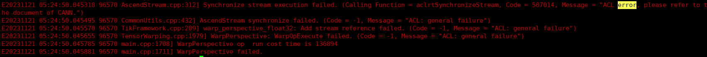

# FAQ<a name="ZH-CN_TOPIC_0000001557749016"></a>

## 运行类<a name="ZH-CN_TOPIC_0000002254947228"></a>

### 使用Vision SDK时，出现can not find the element factory : mxpi\_xxxpostprocessor报错<a name="ZH-CN_TOPIC_0000001572935180"></a>

**问题现象<a name="section8865183210361"></a>**

使用Vision SDK时，出现“can not find the element factory : mxpi\_xxxpostprocessor”。

在“/mxVision-_\{version\}_/opensource/bin”路径下执行<b>./gst-inspect-1.0 mxpi\_xxxpostprocessor\(插件名\)</b>检查插件，发现插件能够正常加载，但运行时仍然报同样的错误信息。

**原因分析<a name="section733583916362"></a>**

GStreamer的历史缓存没有清除。

**解决方案<a name="section13327194411364"></a>**

1.  确认环境已安装python3.9。
2.  执行**rm \~/.cache/gstreamer-1.0/registry.**_\{arch\}_**.bin**（其中<i>\{arch\}</i>根据实际运行环境选择“x86\_64”或者“aarch64”）来清除GStreamer的历史缓存，再运行程序即可。


### 尝试打印Device侧的Tensor、Image内存数据时，发生coredump<a name="ZH-CN_TOPIC_0000001636784841"></a>

**问题现象<a name="section115745318719"></a>**

当Tensor、Image类数据在Device侧时，尝试调用GetData\(\)接口返回指针并打印指针所指向的数据时，出现coredump提示。

**原因分析<a name="section15740631711"></a>**

Device侧地址空间与Host侧地址空间相互独立，Host侧无法直接访问Device侧数据，具体请参见《CANN 应用开发指南 \(C&C++\)》。

**解决方案<a name="section39205314714"></a>**

请先使用Tensor.ToHost\(\)或Image.ToHost\(\)，将Device侧Tensor类或Image类数据转移到Host侧后，再次尝试打印数据操作。


### 运行WarpAffineHiper或WarpPerspective接口出现Synchronize stream execution failed错误<a name="ZH-CN_TOPIC_0000001763335209"></a>

**问题现象<a name="section1718213411102"></a>**

运行WarpAffineHiper或WarpPerspective接口，出现Synchronize stream execution failed. \(Calling Function = aclrtSynchronizeStream, Code = 507014, Message = "ACL error, please refer to the document of CANN."\)的错误（错误码507014）。



**原因分析<a name="section1979911561113"></a>**

输入shape过大或使用转换矩阵的计算量过大，导致aicore执行超时。

**解决方案<a name="section1430592116116"></a>**

使用数据切分方式拆分shape或改变转换矩阵以减少数据量。


## 依赖冲突类<a name="ZH-CN_TOPIC_0000002289547469"></a>

### 系统命令yum、cmake不可用<a name="ZH-CN_TOPIC_0000001573254700"></a>

**问题现象<a name="section8865183210361"></a>**

安装Vision SDK软件包导入环境变量后导致系统命令yum、cmake不可用，报错提示与OPENSSL相关。

yum命令的报错提示如下：

```
ImportError: /lib64/libcurl.so.4: symbol SSLv3_client_method version OPENSSL_1_1_0 not defined in file libssl.so.1.1 with link time reference
ModuleNotFoundError: No module named '_conf'
```

cmake命令的报错提示如下：

```
symbol lookup error: /usr/lib64/libldap.so.2: undefined symbol: EVP_md2, version OPENSSL_3.0.0
```

**原因分析<a name="section733583916362"></a>**

导入Vision SDK环境变量后，“/mxVision-_\{version\}_/opensource/lib”的“libssl.so”或“libcrypto.so”，与**yum**、**cmake**所依赖的“libssl.so”、“libcrypto.so”冲突。（<i>\{version\}</i>为实际安装的Vision SDK软件版本号。）

**解决方案<a name="section13327194411364"></a>**

需要使用**yum**或者**cmake**命令时，将Vision SDK的“opensource/lib”相关路径从“LD\_LIBRARY\_PATH”环境变量中暂时移除。编译Vision SDK相关程序时，可在CMakeLists.txt中添加链接选项add\_link\_options\(-Wl,-rpath-link,$\{MX\_SDK\_HOME\}/opensource/lib\)指定链接路径，运行Vision SDK相关程序时再将“opensource/lib”相关路径增加至“LD\_LIBRARY\_PATH”环境变量中。


### x86\_64执行TensorOperations接口时发生coredump，堆栈信息最后发生在libffi.so中<a name="ZH-CN_TOPIC_0000002200104290"></a>

**问题现象<a name="section1718213411102"></a>**

在x86\_64架构设备上执行TensorOperations接口时发生coredump，打印堆栈信息发现最后执行在libffi.so中。

**原因分析<a name="section1979911561113"></a>**

用户程序中链接了libstreammanager.so，运行时优先加载了软件包中高版本的libffi。部分TensorOperations接口运行时会调用到Python的CAPI接口，但环境上的Python安装时依赖系统自带的低版本libffi，两个版本的libffi在x86\_64架构设备上存在冲突，造成coredump。

**解决方案<a name="section1430592116116"></a>**

1.  查看当前环境使用的Python，在对应lib路径下执行以下命令：

    ```
    find /path/to/python -name "_ctypes.cpython*so"
    ```

2.  使用ldd查看找到的so所依赖的libffi.so的路径：

    ```
    ldd /path/to/_ctypes.cpython*so
    ```

3.  执行以下命令，优先加载python依赖的libffi动态库：

    ```
    export LD_PRELOAD=/path/to/libffi.so
    ```


