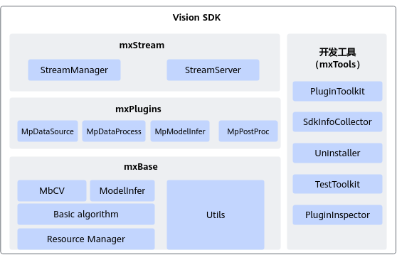

# 简介

## Vision SDK是什么

**产品背景**

计算机视觉（Computer Vision，以下简称“CV”）的发展是一个不断探索的过程，CV最初是为了实现计算机对数字图片的简单处理而产生的，研究内容主要包括图像处理、模式识别、机器学习、深度学习等方面。在智能视频分析（Intelligent Video Analytics，以下简称“IVA”）行业中，传统计算常见算法的应用领域有很多，例如目标识别、视频结构化、动作行为识别等。

随着硬件技术和算法的不断进步，视频与图像已逐渐成为全球互联网流量的主要组成部分。随着媒体服务的快速增长，AI图像算法基础的视频图像处理，逐渐成为计算流程中的成本壁垒和性能瓶颈。在此背景上，Vision SDK致力于视频图像处理算法加速，提升视频图像处理性能，降低CV应用的开发复杂度，加速CV应用开发部署。

**产品定义**

Vision SDK是MindSDK中面向图片和视频视觉分析的SDK，提供了基本的视频、图像智能分析能力及编程框架。

-   通过API接口方式开发：提供原生的推理API以及算子加速库，用户可通过调用API接口的方式开发应用。对于有固定应用开发流程的用户，建议采用此方式，借用Vision SDK提供算法加速能力构建CV应用。
-   通过流程编排方式开发：采用模块化的设计理念，将业务流程中的各个功能单元封装成独立的插件。用户可以用流程编排的方式，通过插件的串接快速构建业务，进行应用开发。此方式提供常用功能插件，具备流程编排能力，提供插件自定义开发功能。

**产品价值**

Vision SDK致力于简化昇腾芯片推理业务开发过程，降低使用昇腾芯片开发的门槛。

-   降本增效：将传统视频图像处理通过NPU加速，大幅度提升计算性能，降低成本。
-   极简易用：封装NPU算法加速能力，方便应用直接调用，简化应用开发难度。

**使用导引**

Vision SDK用户指南用于引导开发者基于现有模型，通过Vision SDK  API接口开发方式或流程编排方式实现目标识别、图像分类等功能。

通过用户指南，您可以了解到以下内容：

-   Vision SDK软件架构、基本概念以及各开发方式对应的使用流程。
-   如何使用Vision SDK  API接口进行应用开发，如何通过流程编排插件实现应用。

拥有C/C++、Python语言开发能力，对推理应用开发有一定了解的开发者，可以更好的理解该产品。

初次使用，建议先了解各开发方式具体流程，通过[快速入门](./quick_start.md)具体了解各开发方式的风格特点，选择适合实际业务和理解习惯的开发方式，再通过对应的章节学习、开发Vision SDK应用。

## 软件架构

Vision SDK软件架构如[图1](#fig17403112314618)所示，架构图中的关键模块介绍如[表1](#table126112418111)。

**图 1** Vision SDK软件架构  

**表 1**  架构图模块介绍

|模块|说明|
|--|--|
|mxStream|用于管理流程编排中的业务Stream。<li>StreamManager：负责Stream的构建和销毁，同时提供向其发送数据和获取结果的接口。</li><li>StreamServer：基于Vision SDK实现的推理服务器，以RESTful接口对外提供视觉推理服务。</li>|
|mxPlugins|基础功能插件，例如模型推理插件、模型后处理插件、视频编解码插件以及图像解码插件。为以流程编排方式进行快速构建应用提供基础能力。<li>MpDataSource：负责提供拉流，数据加载、数据序列化以及数据导出等功能。</li><li>MpDataProcess：负责提供数据处理，例如视频编解码，图像编解码，图像抠图、缩放、贴图以及旋转等功能。</li><li>MpModelInfer：负责提供模型推理相关功能。</li><li>MpPostProc：负责提供模型后处理相关功能。</li>|
|mxBase|昇腾芯片功能基础库：包括图像解码、裁剪缩放、模型推理、算子加速库等。是Vision SDK的基础底座，开放部分API供用户进行自定义应用开发。<li>MbCV：负责提供图像处理相关的常用基本功能，如加、减、抠图、缩放、通道拼接、通道拆分等。<li>ModelInfer：负责提供模型推理以及模型后处理相关功能。<li>Basic algorithm：负责提供NMS，仿射变换，匈牙利算法以及卡尔曼滤波算法等功能。<li>Resource Manager：负责提供资源初始化、资源去初始化、异步流程控制、设备管理、内存管理等功能。<li>Utils：负责提供日志模块、错误码、文件处理、字符串处理等相关功能。|
|mxTools|提供SDK相关工具。<li>PluginToolkit：用于插件开发的API。<li>SdkInfoCollector：一键式信息收集工具。主要收集Vision SDK日志和昇腾芯片日志，资源占用率等，用于问题定位。<li>Uninstaller：Vision SDK卸载工具。<li>TestToolkit：单插件测试工具。<li>PluginInspector：插件信息收集工具。收集环境中可用插件的信息。|

## 支持的硬件和操作系统

**表 1**  支持产品形态

<table>
<tr>
<th>产品系列</th>
<th>产品型号</th>
<th>操作系统版本（仅支持64位的操作系统）</th>
</tr>
<tr>
<td>Atlas 200I/500 A2 推理产品</td>
<td>Atlas 500 A2 智能小站</td>
<td><li>EulerOS 2.11<li>Ubuntu 22.04<li>openEuler 22.03<li>openEuler 24.03</td>
</tr>
<tr>
<td rowspan="5">Atlas 推理系列产品</td>
<td>Atlas 300I Pro 推理卡</td>
<td><li>Ubuntu 18.04.1<li>Ubuntu 18.04.5<li>Ubuntu 22.04<li>Ubuntu 24.04<li>CentOS 7.6<li>EulerOS 2.12<li>EulerOS 2.15<li>CTyunOS 23.01<li>openEuler 24.03<li>openEuler 24.03 LTS SP1<li>KylinOS V10 SP3 2403<li>KylinOS V11</td>
</tr>
<tr>
<td>Atlas 300I Duo 推理卡</td>
<td><li>Ubuntu 18.04.1<li>Ubuntu 18.04.5<li>Ubuntu 22.04<li>Ubuntu 24.04<li>CentOS 7.6<li>BCLinux 21.10<li>EulerOS 2.12<li>EulerOS 2.15<li>CTyunOS 23.01<li>openEuler 24.03<li>openEuler 24.03 LTS SP1<li>KylinOS V10 SP3 2403<li>KylinOS V11</td>
</tr>
<tr>
<td>Atlas 300V 视频解析卡</td>
<td><li>Ubuntu 18.04.1<li>Ubuntu 18.04.5<li>CentOS 7.6<li>EulerOS 2.12</td>
</tr>
<tr>
<td>Atlas 300V Pro 视频解析卡</td>
<td><li>Ubuntu 18.04.1<li>Ubuntu 18.04.5<li>Ubuntu 24.04<li>UOS V20<li>CentOS 7.6<li>EulerOS 2.12<li>EulerOS 2.15<li>CTyunOS 23.01<li>openEuler 24.03<li>openEuler 24.03 LTS SP1<li>KylinOS V10 SP3 2403<li>KylinOS V11</td>
</tr>
<tr>
<td>Atlas 200I SoC A1 核心板</td>
<td><li>CentOS 7.6<li>EulerOS 2.12</td>
</tr>
<tr>
<td>Atlas A2 推理系列产品</td>
<td>Atlas 800I A2 推理服务器</td>
<td><li>Ubuntu 22.04<li>Ubuntu 24.04 LTS<li>openEuler 24.03<li>BCLinux 21.10 U4<li>KylinOS V10 SP3 2403<li>KylinOS V11</td>
</tr>
</table>

