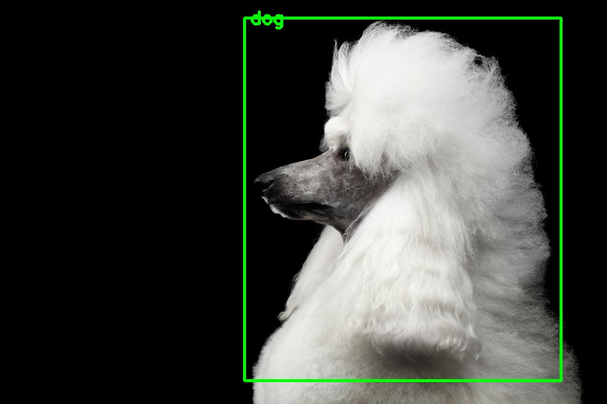
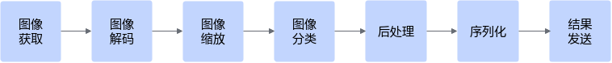

# 快速入门

Vision SDK 提供图像和视频处理加速能力，包括图像编解码和图像处理，也可以使用npu进行模型推理，搭建端到端的视频解决方案。本文将通过部署容器环境运行三个示例，帮助您快速上手Vision SDK开发与使用。

如需在宿主机安装，请参考[安装部署](./installation_guide.md)

## 前置条件

开始之前，请确认：

- **硬件**: 支持的硬件：
  - Atlas 300I 推理卡
  - Atlas 500 A2 智能小站
  - Atlas 300I Pro 推理卡
  - Atlas 300I Duo 推理卡
  - Atlas 300V 视频解析卡
  - Atlas 300V Pro 视频解析卡
  - Atlas 200I SoC A1 核心板
  - Atlas 800I A2推理产品
- **docker**: 已安装docker，且当前用户可运行容器

## 步骤1: 启动容器

1. **选择匹配版本**
   - 访问昇腾社区[VisionSDK镜像](https://www.hiascend.com/developer/ascendhub/detail/9e0edaf9488b447b951072c5c61ce8f1)
   - 根据当前硬件型号（如Atlas 800I A2推理服务器）选择对应的镜像版本，镜像基于CANN基础镜像制作，不需要额外安装CANN
   - 注意区分CPU架构（x86_64/aarch64）和昇腾芯片型号（Ascend310/910等）
2. **环境预检查**
   - 使用`npu-smi info`命令验证NPU驱动状态
   - 检查驱动版本与镜像CANN版本匹配性（参考[《固件与驱动》](https://www.hiascend.com/hardware/firmware-drivers/community)文档)
3. **镜像拉取示例**

```shell
docker pull swr.cn-south-1.myhuaweicloud.com/ascendhub/visionsdk:26.0.0-310p-ubuntu22.04-py3.11
docker tag swr.cn-south-1.myhuaweicloud.com/ascendhub/visionsdk:26.0.0-310p-ubuntu22.04-py3.11 visionsdk:26.0.0-310p-ubuntu22.04-py3.11
```
4. **启动容器**

```shell
docker run \
    --name vision_container \
    --device /dev/davinci0 \
    --device /dev/davinci_manager \
    --device /dev/devmm_svm \
    --device /dev/hisi_hdc \
    -v /usr/local/dcmi:/usr/local/dcmi \
    -v /usr/local/bin/npu-smi:/usr/local/bin/npu-smi \
    -v /usr/local/Ascend/driver/lib64/:/usr/local/Ascend/driver/lib64/ \
    -v /usr/local/Ascend/driver/version.info:/usr/local/Ascend/driver/version.info \
    -v /etc/ascend_install.info:/etc/ascend_install.info \
    -it visionsdk:26.0.0-310p-ubuntu22.04-py3.11 bash
```

## 步骤2: 执行用例

### 2.1 API接口开发方式（C++）

本章节介绍的样例适用于Atlas 推理系列产品和Atlas 200I/500 A2 推理产品。

**样例介绍**

下面以Atlas 推理系列产品为例，使用Vision SDK  C++接口开发图像目标检测应用进行演示，图像目标检测模型推理流程图如[图1](#pic-infer-stream)所示。样例使用TensorFlow框架中的YoloV3模型。关键步骤包括初始化资源、对输入图像进行预处理（如缩放和转换为Tensor格式）、使用YoloV3模型执行推理，并对模型输出进行后处理，识别出目标并通过OpenCV进行可视化。推理完成后，输出结果显示检测到的目标边界框及其类别标签。

**图 1**  目标检测模型推理流程图<a id="pic-infer-stream"></a>


**准备工作**


1. 获取样例代码。

    请访问[获取链接](https://mindx.sdk-6e12.obs.cn-north-4.myhuaweicloud.com/mindxsdk-referenceapps%20/mxVision/YoloV3Infer/YoloV3Infer.zip)，获取样例代码压缩包。

2. 解压样例代码压缩包，进入解压后的目录，命令参考如下。

    ```bash
    unzip YoloV3Infer.zip
    cd YoloV3Infer
    ```

    样例代码目录结构参考如下。

    ```text
    YoloV3Infer
    ├── model
    │ ├── yolov3.names                        # yolov3后处理标签文件
    │ ├── yolov3_tf_bs1_fp16.cfg            # yolov3后处理配置文件
    │ ├── aipp_yolov3_416_416.aippconfig  # yolov3 om模型aipp转换文件
    ├── main.cpp                  # 主程序文件
    ├── CMakeLists.txt
    ├── run.sh               # 运行程序的脚本，运行前建议使用dos2unix工具执行dos2unix run.sh命令，对脚本进行格式化处理
    ├── README.md
    ├── test.jpg                  # 测试用图片，需要用户自行准备
    ```

3. 准备用于推理的yolov3_tf_bs1_fp16.om模型。<a id="transfer-yolov3-tf"></a>

    下载[yolov3_tf.pb](https://gitee.com/link?target=https%3A%2F%2Fobs-9be7.obs.cn-east-2.myhuaweicloud.com%2F003_Atc_Models%2Fmodelzoo%2Fyolov3_tf.pb)，并放置于样例代码的./model/目录下。
    调用以下命令完成模型权重的转换：
    ```bash
    export TE_PARALLEL_COMPILER=1

    soc="Ascend"
    chip_version=$(npu-smi info | awk '{print $3}' | grep -m 1 310)

    # Execute, transform YOLOv3 model.
    atc --model=model/yolov3_tf.pb --framework=3 --output=model/yolov3_tf_bs1_fp16 --soc_version="$soc$chip_version" --insert_op_conf=./aipp_yolov3_416_416.aippconfig --input_shape="input:1,416,416,3" --out_nodes="yolov3/yolov3_head/Conv_6/BiasAdd:0;yolov3/yolov3_head/Conv_14/BiasAdd:0;yolov3/yolov3_head/Conv_22/BiasAdd:0"
    ```

4. 准备用于推理的图片数据。

    用户需使用自行获取的图片进行测试（请将获取的图片名称更名为“test.jpg”），以下图片为展示用途。

    **图 2**  test.jpg
    

>[!NOTE]
>若在openEuler系统上运行时，出现cmake不可用等问题可参考[系统命令yum、cmake不可用](faq.md#系统命令yumcmake不可用)解决。

**代码解析**

在该样例中，关键步骤与代码参考如下，不可以直接拷贝编译运行，完整样例代码请参考样例文件。

1. 初始化资源，配置模型相关变量，如模型路径、配置文件路径、标签路径等。

    ```cpp
    // 初始化资源和变量
    const uint32_t YOLOV3_RESIZE = 416; // 图片缩放大小

    std::string yolov3ModelPath = "./model/yolov3_tf_bs1_fp16.om"; // 模型路径（运行脚本run.sh后自动生成的.om模型文件，位于./model目录下）
    std::string yolov3ConfigPath = "./model/yolov3_tf_bs1_fp16.cfg"; // 后处理配置文件路径
    std::string yolov3LabelPath = "./model/yolov3.names"; // 后处理标签文件路径

    v2Param.deviceId = 0; // 配置
    v2Param.labelPath = yolov3LabelPath;
    v2Param.configPath = yolov3ConfigPath;
    v2Param.modelPath = yolov3ModelPath;
    APP_ERROR ret = MxBase::MxInit();
    ```

2. 对输入数据进行前处理。执行MxInit初始化资源，同时初始化ImageProcessor对象后，解码图片，得到Image对象，再进行相应的图片缩放，之后将其转化为推理所需要的数据格式（Tensor类型）。

    ```cpp
    // 前处理
    //构建图像处理类
    MxBase::ImageProcessor imageProcessor(deviceId);

    //构建解码后的图像类
    MxBase::Image decodedImage;
    //根据图像路径进行解码
    ret = imageProcessor.Decode(imgPath, decodedImage, ImageFormat::YUV_SP_420);

    MxBase::Image resizeImage;
    //缩放尺寸
    MxBase::Size resizeConfig(YOLOV3_RESIZE, YOLOV3_RESIZE);
    //执行缩放
    ret = imageProcessor.Resize(decodedImage, resizeConfig, resizeImage, MxBase::Interpolation::HUAWEI_HIGH_ORDER_FILTER);

    std::string path = "./resized_yolov3_416.jpg";
    //编码缩放后的图片，并输出到指定路径
    ret = imageProcessor.Encode(resizeImage, path);

    //转换Image对象为Tensor
    MxBase::Tensor tensorImg = resizeImage.ConvertToTensor();
    //设置Tensor所在设备编号
    ret = tensorImg.ToDevice(deviceId);
    ```

3. 构建模型类后，输入前处理构建的Tensor对象，执行Infer接口，之后得到模型输出结果yoloV3Outputs。

    ```cpp
    // 模型推理
    // 构建模型类
    MxBase::Model yoloV3(modelPath, deviceId);

    //构造Infer接口入参Batch Tensor
    std::vector<MxBase::Tensor> yoloV3Inputs = {tensorImg};
    //执行模型推理
    std::vector<MxBase::Tensor> yoloV3Outputs = yoloV3.Infer(yoloV3Inputs);
    ```

4. 对模型输出进行后处理。利用Vision SDK提供的后处理模块（也可自行开发），可得到目标检测框及其目标类别，并通过opencv将其在原图上呈现。

    ```cpp
    // 后处理
    //后处理原图信息
    MxBase::ImageInfo imageInfo;
    imageInfo.oriImagePath = argv[1];
    imageInfo.oriImage = decodedImage;
    //执行后处理函数
    ret = YoloV3PostProcess(imageInfo, v2Param.configPath, v2Param.labelPath, yoloV3Outputs);

    //YoloV3PostProcess后处理函数主要逻辑
    //创建后处理配置信息
    std::map<std::string, std::string> postConfig;
    postConfig.insert(pair<std::string, std::string>("postProcessConfigPath", yoloV3ConfigPath));
    postConfig.insert(pair<std::string, std::string>("labelPath", yoloV3LabelPath));

    //初始化后处理类
    MxBase::Yolov3PostProcess yolov3PostProcess;
    APP_ERROR ret = yolov3PostProcess.Init(postConfig);

    //后处理
    vector<MxBase::TensorBase> tensors;
    //依据模型推理结果构建目标检测信息，该信息为Vision SDK已实现后处理函数必备数据
    //若后处理函数为用户自定义，需按照实际情况构造
    vector<vector<MxBase::ObjectInfo>> objectInfos;
    auto shape = yoloV3Outputs[0].GetShape();
    MxBase::ResizedImageInfo imgInfo;
    //缩放前图像宽
    imgInfo.widthOriginal = imageInfo.oriImage.GetOriginalSize().width;
    //缩放前图像高
    imgInfo.heightOriginal = imageInfo.oriImage.GetOriginalSize().height;
    //缩放后图像宽
    imgInfo.widthResize = YOLOV3_RESIZE;
    //缩放后图像高
    imgInfo.heightResize = YOLOV3_RESIZE;
    //图像缩放方式
    imgInfo.resizeType = MxBase::RESIZER_STRETCHING;
    std::vector<MxBase::ResizedImageInfo> imageInfoVec = {};
    imageInfoVec.push_back(imgInfo);
    //执行后处理
    ret = yolov3PostProcess.Process(tensors, objectInfos, imageInfoVec);
    //利用opencv实现目标检测框可视化
    cv::putText(imgBgr, objectInfos[i][j].className, cv::Point(x0 + 10, y0 + 10), cv::FONT_HERSHEY_SIMPLEX, 1.0, cv::Scalar(0, 255,0), 4, 8);
       cv::rectangle(imgBgr, cv::Rect(x0, y0, x1 - x0, y1 - y0), cv::Scalar(0, 255, 0), 4);
    //模型后处理去初始化
    ret = yolov3PostProcess.DeInit();
    ```

5. 去初始化，释放资源。

    ```cpp
    // 去初始化
    ret = MxBase::MxDeInit();
    if (ret != APP_ERR_OK) {
        LogError << "MxDeInit failed, ret=" << ret << ".";
        return ret;
    }
    ```

**运行推理**

1. 运行推理

    ```bash
    mkdir build
    cd build
    cmake ..
    make -j4
    cd ..
    ./mxbasev2_sample test.jpg
    ```

    如返回如下信息，则表示运行成功。

    ```text
    yoloV3Outputs len=3
    ******YoloV3PostProcess******
    Size of objectInfos is 1
    objectInfo-0 ,Size:1
    *****objectInfo-0:0
    x0 is 410.738
    y0 is 27.4772
    x1 is 948.388
    y1 is 645.941
    confidence is 0.758505
    classId is 16
    className is dog
    ******YoloV3PostProcess end******
    ```

    推理完成后，在当前文件夹下生成“result.jpg”文件，图片结果如[图3](#pic-cpp-infer-result)所示，展示检测目标的坐标框及类别。

    **图 3**  result.jpg文件<a id="pic-cpp-infer-result"></a>
    

### 2.2 API接口开发方式（Python）

本章节介绍的样例适用于Atlas 推理系列产品和Atlas 200I/500 A2 推理产品。

**样例介绍**

下面以Atlas 推理系列产品为例，使用Vision SDK  Python接口开发图像分类应用进行演示，图像分类模型推理流程图如[图1](#pic-infer-python)所示。样例使用Caffe框架中的ResNet-50模型。工作流程包括初始化资源、对输入图像进行预处理（如缩放并转换为模型所需的格式）、使用ResNet-50模型执行推理，并对推理结果进行后处理，获取预测的类别标签和置信度。结果显示在图像上，并将带有预测标签和置信度的图像保存。

**图 1**  分类模型推理流程图<a id="pic-infer-python"></a>


**准备工作**

1. 请先完成Vision SDK安装部署后，再进行快速入门样例。

    **表 1**  环境要求软件依赖

    |软件依赖名称|推荐版本|获取链接|
    |--|--|--|
    |numpy|1.26.4|pip3 install numpy==1.26.4|
    |opencv-python|4.9.0.80|pip3 install opencv-python==4.9.0.80|
    |libgl1-meta-glx|-|ubuntu: apt-get install libgl1-mesa-glx 或者 centos: yum install mesa-libGL|

2. 获取样例代码。

    请访问[获取链接](https://mindx.sdk-6e12.obs.cn-north-4.myhuaweicloud.com/mindxsdk-referenceapps%20/mxVision/resnet50_sdk_python/resnet50_sdk_python_sample.zip)，获取样例代码压缩包。

3. 解压样例代码压缩包，进入解压后的目录，命令参考如下。

    ```bash
    unzip resnet50_sdk_python_sample.zip
    cd resnet50_sdk_python_sample
    ```

    样例代码目录结构参考如下。

    ```text
    |-- resnet50_sdk_python_sample
    |   |-- main.py         # python入口代码
    |   |-- README.md
    |   |-- run.sh          # 运行程序的脚本
    |   |-- data
    |   |   |-- test.jpg    # 测试使用的图片
    |   |-- model
    |   |   |-- resnet50.caffemodel
    |   |   |-- resnet50.prototxt
    |   |-- utils
    |   |   |-- resnet50.cfg
    |   |   |-- resnet50_clsidx_to_labels.names
    ```

 4. 完成模型转换

    参考以下命令完成caffemodel向om模型的转换
    ```bash
    export TE_PARALLEL_COMPILER=1

    soc="Ascend"
    chip_version=$(npu-smi info | awk '{print $3}' | grep -m 1 310)

    # Execute, transform model.
    atc --model=model/resnet50.prototxt --weight=model/resnet50.caffemodel --framework=0 --output=model/resnet50 --soc_version="$soc$chip_version"
    ```

4. 准备用于推理的图片数据。

    用户可使用样例中的“test.jpg”测试图片，也可获取其他图片进行测试（请将获取的图片名称更名为“test.jpg”）。

    **图 2**  test.jpg
    

**代码解析**

在该样例中，关键步骤与代码参考如下，不可以直接拷贝编译运行，完整样例代码请参考样例文件。

1. 在“main.py”文件中，引入样例所需的第三方库以及Vision SDK模型推理所需文件。

    ```python
    import numpy as np  # 用于对多维数组进行计算
    import cv2  # 图片处理三方库，用于对图片进行前后处理

    from mindx.sdk import Tensor  # Vision SDK 中的 Tensor 数据结构
    from mindx.sdk import base  # Vision SDK 推理接口
    from mindx.sdk.base import post  # post.Resnet50PostProcess 为 resnet50 后处理接口
    ```

    程序主要流程如下：

    ```python
    if __name__ == "__main__":
        base.mx_init()   # 初始化 Vision SDK 资源
        process()        # 程序主要逻辑
        base.mx_deinit() # 去初始化 Vision SDK 资源
    ```

2. 配置模型相关变量，如图片路径、模型路径、配置文件路径、标签路径等。

    ```python
    '''配置模型相关变量'''
    pic_path = 'data/test.jpg'  # 单张图片
    model_path = "model/resnet50.om"  # 模型路径
    device_id = 0  # 指定运算的Device
    config_path='utils/resnet50.cfg'  # 后处理配置文件
    label_path='utils/resnet50_clsidx_to_labels.names'  # 类别标签文件
    img_size = 256
    ```

3. 对输入数据进行前处理。先使用OpenCV读入图片，得到三维数组，再进行相应的图片裁剪、缩放、转换颜色空间等处理并将其转化为推理所需要的数据格式（Tensor类型）。

    ```python
    '''前处理'''
    img_bgr = cv2.imread(pic_path)
    img_rgb = img_bgr[:,:,::-1]
    img = cv2.resize(img_rgb, (img_size, img_size))  # 缩放到目标大小
    hw_off = (img_size - 224) // 2  # 对图片进行切分，取中间区域
    crop_img = img[hw_off:img_size - hw_off, hw_off:img_size - hw_off, :]
    img = crop_img.astype("float32")  # 转为 float32 数据类型
    img[:, :, 0] -= 104  # 常数 104,117,123 用于将图像转换到Caffe模型需要的颜色空间
    img[:, :, 1] -= 117
    img[:, :, 2] -= 123
    img = np.expand_dims(img, axis=0)  # 扩展第一维度，适应模型输入
    img = img.transpose([0, 3, 1, 2])  # 将 (batch,height,width,channels) 转为 (batch,channels,height,width)
    img = np.ascontiguousarray(img)  # 将内存连续排列
    img = Tensor(img) # 将numpy转为Tensor类
    ```

4. 使用model.infer()接口进行模型推理，得到模型输出结果。

    ```python
    '''模型推理'''
    model = base.model(modelPath=model_path, deviceId=device_id)  # 初始化 base.model 类
    output = model.infer([img])[0]  # 执行推理。输入数据类型：List[base.Tensor]， 返回模型推理输出的 List[base.Tensor]
    ```

5. 对模型输出进行后处理。利用Vision SDK提供的后处理模块，可得到预测类别及其置信度并将其在原图上呈现。

    ```python
    '''后处理'''
    postprocessor = post.Resnet50PostProcess(config_path=config_path, label_path=label_path)  # 获取后处理对象
    pred = postprocessor.process([output])[0][0]  # 利用Vision SDK接口进行后处理，pred：<ClassInfo classId=... confidence=... className=...>
    confidence = pred.confidence  # 获取类别置信度
    className = pred.className  # 获取类别名称
    print('{}: {}'.format(className, confidence))  # 打印出结果

    '''保存推理图片'''
    img_res = cv2.putText(img_bgr, f'{className}: {confidence:.2f}', (20, 20), cv2.FONT_HERSHEY_SIMPLEX, 1, (255, 255, 255), 1)  # 将预测的类别与置信度添加到图片
    cv2.imwrite('result.png', img_res)
    print('save infer result success')
    ```

**运行推理**

1. 运行推理。

    ```bash
    python main.py
    ```

    如返回如下信息，则表示运行成功。

    ```text
    Standard Poodle: 0.98583984375
    save infer result success
    ```

    推理完成后，在当前文件夹下生成“result.png”文件，图片结果如[图3](#pic-python-result)所示，展示图片的类别标签及其对应的置信度。

    **图 3**  result.png文件<a id="pic-python-result"></a>

    

### 2.3 流程编排开发方式

本章节介绍的样例适用于Atlas 推理系列产品和Atlas 200I/500 A2 推理产品。

**样例介绍**

下面以Atlas 推理系列产品为例，通过Vision SDK图像分类案例，介绍如何使用Vision SDK流程编排方式开发推理应用。样例使用YoloV3模型进行图像分类。过程包括创建pipeline配置文件，定义图像解码、缩放、推理和后处理等任务的顺序。使用`MxStreamManager`管理流程，数据被发送到流进行处理。pipeline输出分类结果，结果可以进一步处理或显示。

**准备工作**

1. 获取样例代码。

    请访问[获取链接](https://mindx.sdk-6e12.obs.cn-north-4.myhuaweicloud.com/mindxsdk-referenceapps%20/mxVision/pipelineSample/pipelineSample.zip)，获取样例代码压缩包。

2. 解压样例代码压缩包，进入解压后的目录，命令参考如下。

    ```bash
    unzip pipelineSample.zip
    cd pipelineSample
    ```

    样例代码目录结构参考如下。

    ```text
    |-- pipelineSample
    |   |-- data
    |   |   |-- dog1_1024_683.jpg            //测试图片
    |   |-- models                        //存放模型目录
    |   |   |-- yolov3_tf_bs1_fp16.cfg     //模型配置文件
    |   |   |-- aipp_yolov3_416_416.aippconfig  //yolov3 om模型aipp转换文件
    |   |   |-- yolov3.names   //模型输出类别名称文件
    |   |-- pipeline                     //存放pipeline文件
    |   |   |-- Sample.pipeline        //pipeline文件
    |   |-- src
    |   |   |-- CMakeLists.txt              //CMakeLists文件
    |   |   |-- main.cpp                    //主函数，图片分类功能的实现文件
    |   |-- README.md
    |   |-- run.sh                   //运行程序的脚本，运行前建议使用dos2unix工具执行dos2unix run.sh命令，对脚本进行格式化处理
    ```

3. 参考[获取模型](#transfer-yolov3-tf)准备用于推理的yolov3_tf_bs1_fp16.om模型。

4. 准备用于推理的图片数据。

    用户需使用自行获取的图片进行测试（请将获取的图片名称更名为与样例代码的图片名字一致，如dog1_1024_683.jpg），以下图片为展示用途。

    **图 1**  典型样本图片<a id="pic-infer-stream"></a>
    

**编排pipeline文件**

编排pipeline文件是使用Vision SDK开发应用最核心的任务，图像分类应用可拆解为一系列的业务流程，通过编辑pipeline文件，调用Vision SDK插件库完成推理业务，本文的pipeline文件内容以[图2](#pic-stream-workflow)中所示的业务流程进行样例配置编排。

**图 2**  业务流程编排<a id="pic-stream-workflow"></a>


样例如下所示。

```json
{
  "objectdetection": {                // 修改"objectdetection" 为当前业务推理流程的名称
    "stream_config": {
      "deviceId": "0"                // "deviceId" 表示要使用的芯片的ID号
    },
    "appsrc0": {                     // "appsrc0" 表示输入元件名称
      "props": {                     // "props"指元件属性
        "blocksize": "409600"        // 每个buffer读取的大小
      },
      "factory": "appsrc",           // "factory" 定义该元件类型
      "next": "mxpi_imagedecoder0"   // "next" 填写连接的下游元件--图像解码元件
    },
    "mxpi_imagedecoder0": {          // 图像解码元件名称，0表示编号，如果一个流程中要使用多个图像解码元件，可以依次按照0、1、2...命名
      "props": {
        "handleMethod": "ascend"     // 解码方法为ascend
      },
      "factory": "mxpi_imagedecoder",    // 使用图像解码插件
      "next": "mxpi_imageresize0"    // "next" 填写连接的下游元件--图像缩放元件
    },
    "mxpi_imageresize0": {           // 图像缩放元件名称
      "props": {
        "handleMethod": "ascend",    // 解码方法为ascend
        "resizeHeight": "416",       // 指定缩放后的高
        "resizeWidth": "416",        // 指定缩放后的宽
        "resizeType": "Resizer_Stretch"      // 缩放方式为拉伸缩放
      },
      "factory": "mxpi_imageresize",     // 使用图像缩放插件
      "next": "mxpi_tensorinfer0"     // "next" 填写连接的下游元件--模型推理元件
    },
    "mxpi_tensorinfer0": {                                   // 模型推理元件名称
      "props": {                                             // "props"指元件属性，可以加载指定目录中的文件
        "dataSource": "mxpi_imageresize0",              // "dataSource"填写连接的上游元件--图像缩放元件
        "modelPath": "../models/yolov3_tf_bs1_fp16.om",    // "modelPath" 属性定义了推理业务使用的模型，用户需要根据获取的模型修改文件名
        "waitingTime": "2000",                               // 多batch模型可容忍的等待组BATCH时间
        "outputDeviceId": "-1"                               // 内存拷贝到指定位置，设为-1则拷贝至Host侧
      },
      "factory": "mxpi_tensorinfer",                         // 使用模型推理插件
      "next": "mxpi_objectdetection0"                     // "next"填写连接的下游元件--模型后处理元件
    },
    "mxpi_objectdetection0": {                            // 模型后处理元件名称
      "props": {                                             // "props"指元件属性，可以加载指定目录中的文件
        "dataSource": "mxpi_tensorinfer0",                   // "dataSource"填写连接的上游元件--模型推理元件
        "postProcessConfigPath": "../models/yolov3_tf_bs1_fp16.cfg",//     "postProcessConfigPath" 指定模型后处理配置文件
        "labelPath": "../models/yolov3.names",    // "labelPath" 指定模型输出的类别名称文件
        "postProcessLibPath": "libyolov3postprocess.so"    // "postProcessLibPath" 指定模型后处理依赖的动态库
      },
      "factory": "mxpi_objectpostprocessor",                  // 使用模型后处理插件
      "next": "mxpi_dataserialize0"                          // "next" 填写连接的下游元件--序列化元件
    },
    "mxpi_dataserialize0": {                                 // 序列化元件名称
      "props": {
        "outputDataKeys": "mxpi_objectdetection0"         // "outputDataKeys" 指定需要输出的数据的索引
      },
      "factory": "mxpi_dataserialize",                       // 使用序列化插件
      "next": "appsink0"                                     // "next" 填写连接的下游元件--输出元件
    },
    "appsink0": {                                            // 输出元件名称
      "props": {
        "blocksize": "4096000"                               // 每个buffer读取的大小
      },
      "factory": "appsink"                                   // 使用输出插件
    }
  }
}
```

>[!NOTE]
>pipeline文件中的注释仅用于辅助理解，在编写pipeline文件时，请删除其中的注释文字，否则会导致文件解析失败。

在这段pipeline中，有以下关键概念：

- “next”属性值指明了元件之间的连接关系。
- 用户通过“appsrc0”元件向Stream发送数据，通过“appsink0”元件从Stream获取推理结果。
- “mxpi_objectdetection0”元件用于对模型推理的输出张量进行后处理，比如在上述样例中，模型后处理元件处理上游模型推理元件输出的一维张量，最终返回模型的识别结果（目标的坐标、类别及其对应的置信度）。
- “mxpi_dataserialize0”元件将推理结果组装成JSON字符串输出。

**代码解析**

“pipelineSample/src”目录中的“main.cpp”文件为应用程序源码。

在本样例中，关键步骤与代码参考如下，不可以直接拷贝编译运行，需要根据实际情况修改pipeline文件路径、输入图片路径、Stream名称，Stream名称需要与pipeline文件中的业务推理流程的名称匹配，如上述pipeline文件的业务推理流程的名称为“objectdetection”。完整样例代码请参考样例文件。

```cpp
int main(int argc, char* argv[])
 {
    // 1.解析pipeline文件
    std::string pipelineConfigPath = "../pipeline/Sample.pipeline";  // 修改pipeline文件路径
    std::string pipelineConfig = ReadPipeline(pipelineConfigPath);
    if (pipelineConfig == "") {
        LogError << "Read pipeline failed.";
        return APP_ERR_COMM_INIT_FAIL;
    }
    // 2.初始化stream manager
    MxStream::MxStreamManager mxStreamManager;
    APP_ERROR ret = mxStreamManager.InitManager();
    if (ret != APP_ERR_OK) {
        LogError << GetErrorInfo(ret) << "Failed to init Stream manager.";
        return ret;
    }
    // 3.创建stream
    ret = mxStreamManager.CreateMultipleStreams(pipelineConfig);
    if (ret != APP_ERR_OK) {
        LogError << GetErrorInfo(ret) << "Failed to create Stream.";
        mxStreamManager.DestroyAllStreams();
        return ret;
    }
    // 4.读取待推理图片
    MxStream::MxstDataInput dataBuffer;
    ret = ReadFile("../data/dog1_1024_683.jpg", dataBuffer);    // 修改输入图片路径
    if (ret != APP_ERR_OK) {
        LogError << GetErrorInfo(ret) << "Failed to read image file.";
        mxStreamManager.DestroyAllStreams();
        return ret;
    }
    std::string streamName = "objectdetection";    // 修改业务推理流程的名称
    int inPluginId = 0;
    // 5.发送待推理图片至stream
    ret = mxStreamManager.SendData(streamName, inPluginId, dataBuffer);
    if (ret != APP_ERR_OK) {
        LogError << GetErrorInfo(ret) << "Failed to send data to stream.";
        delete dataBuffer.dataPtr;
        dataBuffer.dataPtr = nullptr;
        mxStreamManager.DestroyAllStreams();
        return ret;
    }
    // 6.获取推理结果
    MxStream::MxstDataOutput* output = mxStreamManager.GetResult(streamName, inPluginId);
    if (output == nullptr) {
        LogError << "Failed to get pipeline output.";
        delete dataBuffer.dataPtr;
        dataBuffer.dataPtr = nullptr;
        mxStreamManager.DestroyAllStreams();
        return ret;
    }
    std::string result = std::string((char *)output->dataPtr, output->dataSize);
    std::cout << "Results:" << result << std::endl;
    // 7.销毁stream，并释放资源
    mxStreamManager.DestroyAllStreams();
    delete dataBuffer.dataPtr;
    dataBuffer.dataPtr = nullptr;
    delete output;
    return 0;
 }
```

**编译和运行应用**

1. 运行应用，执行编译脚本。

    ```bash
    cd src
    mkdir build
    cd build
    cmake ..
    make -j4
    cd ..
    ./main
    ```

    终端上屏显的结果如下，“classId”表示类别号、“className”表示类名称，“confidence”表示该分类的最大置信度：

    ```text
    Results:{
        "MxpiObject":[{"classVec":[{
            "classId":16,
            "className":"dog",
            "confidence":0.994434595,
            "headerVec":[]}],
        "x0":113.476166,
        "x1":882.497559,
        "y0":127.61911,
        "y1":595.543884
        }]
    }
    ```
