# 应用开发<a name="ZH-CN_TOPIC_0000001928718177"></a>

## 使用API接口方式开发（C++）<a name="ZH-CN_TOPIC_0000001557908320"></a>

### 开发流程<a name="ZH-CN_TOPIC_0000001557429504"></a>

**流程介绍<a name="section797113229405"></a>**

**图 1**  API开发流程<a name="fig151305368529"></a>  

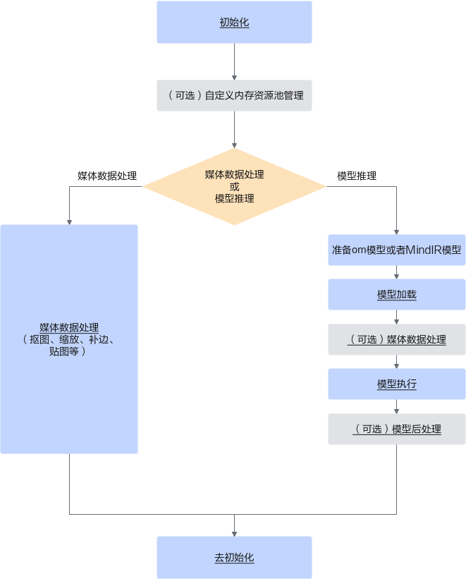

**关键步骤说明<a name="section211642319404"></a>**

1.  使用Vision SDK接口进行应用开发，需先进行初始化才能进行后续处理。
2.  媒体数据处理/模型推理。
    -   媒体数据处理功能，可实现图像编解码、抠图、缩放、补边、色域转换等操作。
    -   模型推理，可实现如目标识别，图像分类等应用，可参考以下几个步骤。
        1.  模型推理前，需准备合适的om模型或者MindIR模型，也可通过模型转换，将其他预训练模型转换为om模型。
        2.  模型加载，将准备好的模型通过文件或内存方式加载到系统中。
        3.  （可选）媒体数据处理，模型推理前，可对输入的媒体数据进行处理，如图片解码、抠图、缩放、补边等操作。
        4.  模型执行，使用模型实现图片分类、目标识别等功能。
        5.  （可选）模型后处理，对模型推理输出的数据进行后处理操作，此处根据用户的实际需求来处理推理结果，如整理为可理解阅读的具体结果。模型后处理支持通过三种方式进行：
            -   （推荐）自行选择模型后处理方式。
            -   通过调用Vision SDK接口进行。
            -   在已有模型的基础上进行二次开发。

3.  调用MxDeInit\(\)接口进行去初始化。在整体应用流程完成后还需进行去初始化，否则可能会导致后续系统内部资源初始化出错，进而导致其它业务异常。


### 初始化与去初始化<a name="ZH-CN_TOPIC_0000001572072484"></a>

**功能介绍<a name="section107671142161812"></a>**

-   Vision SDK应用开发初始化接口，在代码调用相关接口之前，需调用全局初始化函数[MxInit\(\)](./api/api_C++.md#mxinit)申请设备资源和日志资源。
-   如果应用开发涉及算子调用接口，可选用[MxInitFromConfig\(\)](./api/api_C++.md#mxinitfromconfig)接口进行全局初始化，输入算子配置文件加载设备资源和日志资源的同时预加载涉及的算子，提高算子调用接口的执行效率。
-   如需配置全局变量（如调整VPC通道资源池数量），可调用[MxInit\(const AppGlobalCfg &globalCfg\)](./api/api_C++.md#mxinit)接口，通过传入配置参数进行调整。

**Vision SDK接口全部执行完毕后**，用户需调用MxDeInit\(\)接口对初始化的全局资源进行去初始化操作。

API接口的说明请参见[API接口参考（C++）](./api/api_C++.md)。

**示例代码<a name="section9831144471811"></a>**

以下为各初始化方法的代码示例，不可以直接拷贝编译运行，仅供参考。

-   全局初始化，加载设备资源和日志资源。

    ```
    APP_ERROR ret = MxInit();
    {
    // 执行全局初始化后即可正常调用Vision SDK接口
    ...
    // Vision SDK接口全部执行完毕后，调用去初始化接口释放全局资源
    }
    ret = MxDeInit();
    ```

-   包含算子预加载全局初始化，加载设备资源和日志资源的同时预加载涉及的算子。

    ```
    // 用户根据需求配置算子预加载配置文件
    std::string ConfigPath = "op.json";
    // 将文件路径传入接口进行全局初始化
    APP_ERROR ret = MxInitFromConfig(ConfigPath);
    {
    // 执行全局初始化后即可正常调用Vision SDK接口
    ...
    // Vision SDK接口全部执行完毕后，调用去初始化接口释放全局资源
    }
    ret = MxDeInit();
    ```

-   全局初始化，加载全局变量。

    ```
    AppGlobalCfg globalCfg;
    
    APP_ERROR ret = MxInit(globalCfg);
    {
    // 执行全局初始化后即可正常调用Vision SDK接口
    ...
    // Vision SDK接口全部执行完毕后，调用去初始化接口释放全局资源
    }
    ret = MxDeInit();
    ```


### 自定义内存资源池管理<a name="ZH-CN_TOPIC_0000001680538301"></a>

**功能介绍<a name="section186581619394"></a>**

Vision SDK支持用户自己管理内存资源（DVPP与Device侧）。用户在调用涉及到内存资源相关的接口前，通过注册函数传入自定义的内存管理申请/释放函数，注册后用户可以通过自定义的接口从用户的内存资源池中申请/释放资源。该功能仅支持Atlas 推理系列产品。

注册函数必须成对使用，如果用户只注册了申请/释放函数其一，会使用默认方式，直接申请/释放内存。

相关接口说明请参考[自定义内存资源池管理](自定义内存资源池管理-65.md)。

**示例代码<a name="section206018434020"></a>**

以下分别为DVPP和Device侧注册函数的代码示例，不可以直接拷贝编译运行，仅供参考。

DVPP

```
APP_ERROR userCustomizedDVPPMallocFunc(unsigned int deviceID, void** buffer, unsigned long long size) {
     LogInfo << "user customized DVPP Malloc func called" ;
     // 此处添加用户自定义DVPP资源申请函数
     return APP_ERR_OK;
}

APP_ERROR userCustomizedDVPPFreeFunc(void* buffer) {
     LogInfo << "user customized DVPP Free func called" ;
     // 此处添加用户自定义DVPP资源释放函数
     return APP_ERR_OK;
 }
int main(){
     MxBase::MxInit();
    {  
     APP_ERROR ret = MxBase::DVPPMallocFuncHookReg(userCustomizedDVPPMallocFunc);
     if (ret != APP_ERR_OK) {
         std::cout << "registerTest failed, dvpp malloc registered failed" << std::endl;
     } else {
         std::cout << "registerTest success, dvpp malloc registered success" << std::endl;
     }

     ret = MxBase::DVPPFreeFuncHookReg(userCustomizedDVPPFreeFunc);
     if (ret != APP_ERR_OK) {
         std::cout << "registerTest failed, dvpp free registered failed" << std::endl;
     } else {
         std::cout << "registerTest success, dvpp free registered success" << std::endl;
     }
     }
     MxBase::MxDeInit();
 }
```

Device

```
APP_ERROR userCustomizedDeviceMallocFunc(void** buffer, unsigned int size, MxBase::MxMemMallocPolicy policy) {
     LogInfo << "user customized Device Malloc func called" ;
     // user customized Device Malloc function definition
     return APP_ERR_OK;
}

APP_ERROR userCustomizedDeviceFreeFunc(void* buffer) {
     LogInfo << "user customized Device Free func called" ;
     // user customized Device Free function definition
     return APP_ERR_OK;
 }
int main() {
     MxBase::MxInit();
     {
     APP_ERROR ret = MxBase::DeviceMallocFuncHookReg(userCustomizedDeviceMallocFunc);
     if (ret != APP_ERR_OK) {
         std::cout << "registerTest failed, device malloc registered failed" << std::endl;
     } else {
         std::cout << "registerTest success, device malloc registered success" << std::endl;
     }

     ret = MxBase::DeviceFreeFuncHookReg(userCustomizedDeviceFreeFunc);
     if (ret != APP_ERR_OK) {
         std::cout << "registerTest failed, device free registered failed" << std::endl;
     } else {
         std::cout << "registerTest success, device free registered success" << std::endl;
     }
     }
     MxBase::MxDeInit();
}
```


### 异步调用<a name="ZH-CN_TOPIC_0000001572231644"></a>

**功能介绍<a name="section1573679583"></a>**

Vision SDK默认采用同步执行模式，部分接口已支持用户通过申请AscendStream异步执行，具体接口异步支持情况请参见[API接口参考（C++）](API接口参考（C++）.md)。

相关接口说明请参考[异步调用](异步调用-67.md)。

**接口调用流程<a name="section4944189145812"></a>**

-   用户通过自定义AscendStream类构造需要的Stream实例传入异步接口，通过接口传入Stream并在异步接口上执行，同一Stream串行指定接口任务后可通过调用Synchronize\(\)接口阻塞应用程序或线程运行，直到该Stream中的所有任务全部完成。
-   支持多Stream异步执行，每个Stream内接口顺序执行，如果用户使用多Stream异步执行或异步执行结果需传入不支持异步接口情况，需要用户执行Synchronize\(\)接口，在适当位置执行同步Stream操作，保证结果已正确返回供后续使用。
-   对于异步调用进行媒体数据处理时，需要调用Synchronize\(\)接口使异步任务完成才能归还使用的通道，避免资源池被耗尽。

**图 1**  Stream异步模式接口调用流程（以Resize操作为例）<a name="fig154761815133314"></a>  
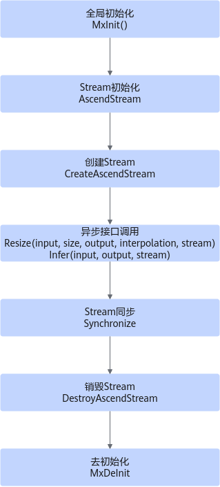

Vision SDK提供AscendStream类进行Stream管理，关键步骤说明如下：

1.  调用MxInit\(\)接口进行全局初始化。
2.  初始化Stream。

    用户通过向构造函数传入“deviceId“指定要创建Stream的设备，支持的“deviceId“根据用户环境存在差异。

3.  创建Stream。

    与Stream初始化绑定使用，在使用Stream前需要调用CreateAscendStream\(\)成员函数完成Stream创建。

4.  调用异步接口。
    -   支持异步的接口传入指定Stream，同一Stream中接口按顺序串行执行。
    -   指定不同Stream的接口之间并行执行。

5.  同步Stream。

    如需保证异步执行结果在作为下一个接口入参时已执行完成，可调用Synchronize\(\)成员函数显式同步Stream。

6.  销毁Stream。

    用户在业务流程完成或Stream结束时，需调用DestroyAscendStream\(\)成员函数销毁Stream，否则可能会造成Stream耗尽的情况。

7.  调用MxDeInit\(\)接口对初始化的全局资源进行去初始化。

**示例代码<a name="section194195101582"></a>**

以图像异步缩放和yoloV3模型异步推理为例，提供关键步骤的代码示例，不可以直接拷贝编译运行，仅供参考。

```
// 初始化
MxInit();
{
        // 用户创建目标deviceId的stream
        AscendStream stream(deviceId);
        stream.CreateAscendStream();
        // 创建图像解码类实例
        ImageProcessor imageProcessor(deviceId);
        // 解码后的Image类实例
        Image decodedImage;
        // 根据图像路径进行解码
        APP_ERROR ret = imageProcessor.Decode(imagePath, decodedImage);
        // 缩放后的图像类实例
        Image resizedImage;
        // 异步调用缩放接口
        ret = imageProcessor.Resize(decodedImage, Size(416, 416), resizedImage, Interpolation::HUAWEI_HIGH_ORDER_FILTER, stream);
        // 调用同步接口，可以显式保证调用后续接口时缩放已完成
        stream.Synchronize();
        // 将 Image 类转换为 Tensor 类
        Tensor tensorImg = resizedImage.ConvertToTensor();
        // yoloV3模型推理
        string yoloPath = "./model/yolov3_tf_bs1_fp16.om";
        Model yoloV3(yoloPath, deviceId);
        // 构造推理输入输出 (单batch)
        vector<Tensor> yoloV3Inputs = {tensorImg};
        vector<Tensor> yoloV3Outputs = {};
        // 开始异步推理
        ret = yoloV3.Infer(yoloV3Inputs, yoloV3Outputs, stream);
        // 调用同步接口，可以显式保证调用后续接口时缩放已完成
        // 用户也可选择同步前在该stream串行其他异步接口
        stream.Synchronize();
        // 调用DestroyAscendStream销毁stream
        stream.DestroyAscendStream();
}
//去初始化
MxDeInit();
```


### 媒体数据处理<a name="ZH-CN_TOPIC_0000001607908297"></a>

#### 视频编码<a name="ZH-CN_TOPIC_0000001571752952"></a>

**功能介绍<a name="section1573679583"></a>**

通过构造VideoEncoder类实例可实现视频编码功能，编码功能配置项及各项约束与支持情况请参考[VideoEncodeConfig](VideoEncodeConfig.md)中的数据结构说明。

视频编码支持自定义输出数据格式，通过自定义回调函数传入编码功能配置项，方便用户使用编码后的数据，详情可参考[VideoEncodeCallBack](VideoEncodeCallBack.md)。

视频编码的接口说明请参考[VideoEncoder](VideoEncoder.md)。

**接口调用流程<a name="section1894563532818"></a>**

首先根据需求定义需要的输出数据组合方式，根据组合方式参考VideoEncodeCallBack定义回调函数传入编码功能配置项，然后实例化VideoEncoder类，最后调用Encode成员函数完成编码，获取数据。

视频编码接口调用流程参考如下：

**图 1**  视频编码接口调用流程<a name="fig19671151793310"></a>  
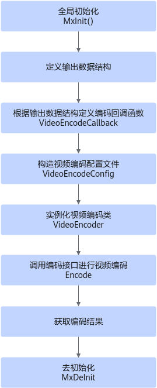

Vision SDK提供VideoEncoder类进行视频编码，关键步骤说明如下：

1.  调用MxInit\(\)接口进行全局初始化。
2.  定义输出数据组合形式。
    -   输出数据包含视频帧编码后得到的Image类数据、当前编码帧的“frameId“和通道“channelId“。
    -   根据需要选择获取以上哪些数据。

3.  定义输出回调函数。
    -   根据要获取的数据定义回调函数，在函数内组装自定义数据。
    -   回调函数输入参数固定为VideoEncodeCallBack形式，函数内可选择输出。
    -   请勿在回调函数内实现过于复杂的操作，建议使用自定义“userData”来接收视频编码回调结果，否则回调线程会发生卡住的现象，导致视频编码速度变慢。

4.  构造视频编码配置项。

    配置项及各项约束与支持情况请参考VideoEncodeConfig数据结构说明。

5.  实例化视频编码类。

    将配置好的VideoEncodeConfig传入构造函数接口，实例化视频编码类。

6.  调用MxDeInit\(\)接口对初始化的全局资源进行去初始化。

**示例代码<a name="section194195101582"></a>**

如下提供关键步骤的代码示例，不可以直接拷贝编译运行，仅供参考。

```
// 初始化
MxBase::MxInit();
{
    // 定义要接收的编码数据
    struct FrameImage {
        Image image;                 // 视频帧类对象
        uint32_t frameId = 0;        // 视频帧索引
        uint32_t channelId = 0;      // 视频处理通道资源索引
    };

    // 定义获取编码数据到自定义结构的回调函数
    APP_ERROR CallBackVenc(std::shared_ptr<uint8_t>& outDataPtr, uint32_t& outDataSize, uint32_t& channelId,
                           uint32_t& frameId, void* userData)
    {
        Image image(outDataPtr, outDataSize, -1, Size(1920, 1080));
        FrameImage* encodedVec = static_cast<FrameImage*>(userData);
        FrameImage frameImage;
        encodedVec.image = image;
        encodedVec.channelId = channelId;
        encodedVec.frameId = frameId;
        return APP_ERR_OK;
    }
    // 构造编码配置项
    MxBase::VideoEncodeConfig vEncodeConfig;
    VideoEncodeCallBack cPtr2 = CallBackVenc;
    vEncodeConfig.callbackFunc = cPtr2;
    vEncodeConfig.width = 1920;  // 输入宽度
    vEncodeConfig.height = 1080;  // 输入高度
    vEncodeConfig.keyFrameInterval = 1;  // I帧间隔
    vEncodeConfig.srcRate = 30;  // 输入码流帧率
    vEncodeConfig.maxBitRate = 30000;  // 输出码率
    vEncodeConfig.ipProp = 70;  // 输出码率
    vEncodeConfig.displayRate = 40;  // [1, 120] 输出视频的播放帧率
    vEncodeConfig.rcMode = 0;  // cbr 0或1, vbr 2, avbr 3, qvbr 4, cvbr 5 #指定码率控制模式
    vEncodeConfig.sceneMode = 0;  // 0 摄像机不运动或周期性连续运动的场景，支持h.264/h.265, 1, 高码率下运动场景，支持h.265
    vEncodeConfig.shortTermStatsTime = 40; // 码率短期统计时间，以秒为单位 取值范围：[1, 120]。rcMode=5时生效
    vEncodeConfig.longTermStatsTime = 240;  // 码率长期统计时间，默认为分钟。取值范围：[1, 1440]。rcMode=5时生效
    vEncodeConfig.longTermMaxBitRate = 200;  // 编码器输出长期最大码率，以kbps为单位。取值范围：[2, max_bit_rate]。rcMode=5时生效
    vEncodeConfig.longTermMinBitRate = 1;  // 编码器输出长期最小码率，以kbps为单位。取值范围：[0, long_term_max_bit_rate] 。rcMode=5时生效
    vEncodeConfig.statsTime = 1;  // [1, 60] 码率统计时间，以秒为单位，默认值为“1”，取值范围：[1, 60]
    vEncodeConfig.thresholdI = {0, 0, 0, 0, 3, 3, 5, 5, 8, 8, 8, 15, 15, 20, 25, 25}; // 长度 16，[0, 255]
    vEncodeConfig.thresholdP = {0, 0, 0, 0, 3, 3, 5, 5, 8, 8, 8, 15, 15, 20, 25, 25}; // 长度 16，[0, 255]
    vEncodeConfig.thresholdB = {0, 0, 0, 0, 3, 3, 5, 5, 8, 8, 8, 15, 15, 20, 25, 25}; // 长度 16，[0, 255]
    vEncodeConfig.direction = 8; // [0, 16] #在基于纹理宏块级码率控制时，用于控制加减方向
    vEncodeConfig.rowQpDelta = 1; // [0, 10] #行级码率控制调节幅度是一帧内行级调节的最大范围，其中行级以宏块行为单位。调节幅度越大，允许行级调整的QP范围越大，码率越平稳
    vEncodeConfig.firstFrameStartQp = 32;  // 设置第一帧的起始Qp值
    // 实例化编码类
    MxBase::VideoEncoder videoEncoder(vEncodeConfig, deviceId);
    // 执行编码操作
    FrameImage encodedFrame;

    for (size_t i = 0; i < inputFrameList.size(); i++) {
        ret = videoEncoder.Encode(image, frameId, &encodedFrame);
    }
}
// 去初始化
MxBase::MxDeInit();
```


#### 视频解码<a name="ZH-CN_TOPIC_0000001622232569"></a>

**功能介绍<a name="section1573679583"></a>**

通过构造VideoDecoder类实例可实现视频解码功能，解码功能配置项及各项约束与支持情况请参考[VideoDecodeConfig](VideoDecodeConfig.md)。

视频解码支持自定义输出数据格式，通过自定义回调函数传入解码功能配置项，方便用户解码后的数据，详情可参考[VideoDecodeCallBack](VideoDecodeCallBack.md)。

视频解码的接口说明请参考[VideoDecoder](VideoDecoder.md)。

**接口调用流程<a name="section1894563532818"></a>**

首先根据需求定义需要的输出数据组合方式，根据组合方式参考VideoDecodeCallBack定义回调函数传入解码功能配置项，然后实例化VideoDecoder类，最后调用Decode成员函数完成解码，获取数据。

视频解码接口调用流程参考如下：

**图 1**  视频解码接口调用流程<a name="fig2242233174115"></a>  
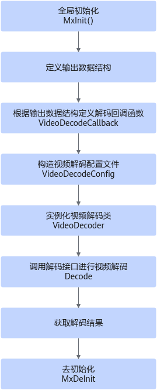

Vision SDK提供VideoDecoder类进行视频解码，关键步骤说明如下：

1.  调用MxInit\(\)接口进行全局初始化。
2.  定义输出数据组合形式。
    -   输出数据包含视频帧解码后得到的Image类数据、当前解码帧的“frameId“和通道“channelId“。
    -   可根据需要选择获取以上哪些数据。

3.  定义输出回调函数。
    -   根据要获取的数据定义回调函数，在函数内组装自定义数据。
    -   回调函数输入参数固定为VideoDecodeCallBack形式，函数内可选择输出。
    -   请勿在回调函数内实现过于复杂的操作，建议只进行自定义获取解码数据操作。

4.  构造视频解码配置项。

    配置项及各项约束与支持情况请参考VideoDecodeConfig数据结构说明。

5.  实例化视频解码类。

    将配置好的VideoDecodeConfig传入构造函数接口，实例化视频解码类。

6.  调用解码接口。
    -   一个实例化的解码器在首次调用Decode接口时，会判断是否为预申请场景。
    -   使用预申请场景时，需要在后续调用Decode接口进行预申请输出内存，防止接口调用失败。

7.  调用MxDeInit\(\)接口对初始化的全局资源进行去初始化。

**示例代码<a name="section194195101582"></a>**

如下提供关键步骤的代码示例，不可以直接拷贝编译运行，仅供参考。

```
// 初始化
MxBase::MxInit();
{
    // 定义要接收的解码数据
    struct FrameImage {
        Image image;                 // 视频帧类对象
        uint32_t frameId = 0;        // 视频帧索引
        uint32_t channelId = 0;      // 视频处理通道资源索引
    };

    //定义获取解码数据到自定义结构的回调函数
    APP_ERROR CallBackVdec(Image& decodedImage, uint32_t channelId, uint32_t frameId, void* userData)
    {
      FrameImage* decodedVec = static_cast<FrameImage*>(userData);
      decodedVec->image = decodedImage;
      decodedVec->channelId = channelId;
      decodedVec->frameId = frameId;
    }
    // 构造解码配置项
    MxBase::VideoDecodeConfig config;
    VideoDecodeCallBack cPtr = CallBackVdec;
    config.width = 1920;
    config.height = 1080;
    config.callbackFunc = cPtr;
    config.skipInterval = 0;
    config.inputVideoFormat = StreamFormat::H264_MAIN_LEVEL;
    config.outputImageFormat = ImageFormat::YUV_SP_420;
    // 实例化解码类
    MxBase::VideoDecoder videoDecoder(config, deviceId, channelId);
    // 执行解码操作
    ret = videoDecoder.Decode(dataPtr, dataSize, frameId, &decodedFrame); 
}
// 去初始化
MxBase::MxDeInit();
```


#### 通过接口进行图像处理（Image）<a name="ZH-CN_TOPIC_0000001571912540"></a>

##### 图片解码<a name="ZH-CN_TOPIC_0000001622471345"></a>

**功能介绍<a name="section16289143420588"></a>**

通过对输入图片数据进行解码处理，将本地图片或图片数据转换为Image类，用于后续前处理和推理业务，类型目前支持JPEG和PNG格式。

接口说明请参考[Decode](Decode.md)。

**接口调用流程<a name="section1192113160230"></a>**

用户需准备好本地待解码的图片文件或待解码的图片数据，初始化ImageProcessor类，构造输出的Image对象，通过调用ImageProcessor类的Decode接口解码结果。

图片解码调用流程参考如下：

**图 1**  图片解码接口调用流程<a name="fig874218457214"></a>  
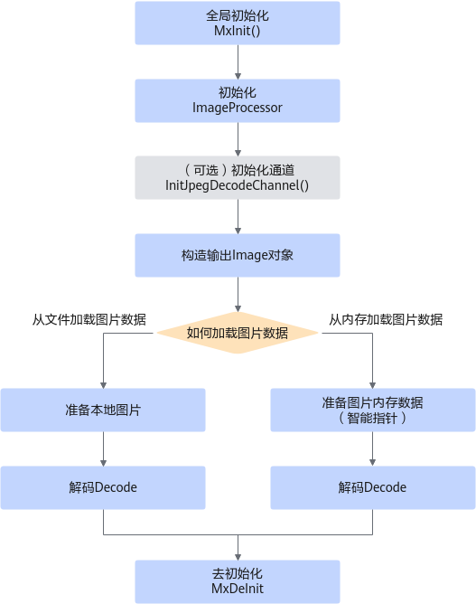

关键步骤说明如下：

1.  调用MxInit\(\)接口进行全局初始化。
2.  ImageProcessor构造及初始化。

    用户构造ImageProcessor对象，在构造完成后可以调用InitJpegDecodeChannel\(\)初始化通道，若不选择调用该接口，ImageProcessor将会在执行解码前自动进行通道初始化。

3.  构造输出的Image对象。

    使用构造函数Image\(\)存放待解码输出的图片对象。

4.  准备数据。

    根据业务需求选择**从文件加载图片**或**从内存加载图片数据**。

5.  调用Decode\(\)接口对图片进行解码。

    用户需根据输入的不同数据类型，调用对应的Decode接口。

6.  调用MxDeInit\(\)接口对初始化的全局资源进行去初始化。

**示例代码<a name="section72231936165818"></a>**

以下为功能特性关键步骤的代码示例，不可以直接拷贝编译运行，仅供参考。

```
//初始化
MxInit();
{
    //构造图像处理类
    ImageProcessor imageProcessor(deviceId);
    //（可选）初始化解码通道 
    imageProcessor.InitJpegDecodeChannel();
    //图像解码
    //解码后的图像类
    Image decodedImage;
    //根据图像路径进行解码
    std::string imagePath = "image_path";
    APP_ERROR ret = imageProcessor.Decode(imagePath, decodedImage, ImageFormat::YUV_SP_420);
    if (ret != APP_ERR_OK) {
        std::cout << "Decode failed." << std::endl;
    }
}
//去初始化
MxDeInit();
```


##### 图片编码<a name="ZH-CN_TOPIC_0000001622550901"></a>

**功能介绍<a name="section6233134318615"></a>**

将接口输出的Image对象编码为JPG格式的图片内存或保存到指定的图片路径。

接口说明请参考[Encode](Encode.md)。

**接口调用流程<a name="section37619358587"></a>**

用户需提前准备好待编码的Image对象，可以通过图片解码以及图像处理接口（抠图、缩放、补边等操作对应接口）输出，输出到本地图片或者内存中。

图片编码调用流程参考如下：

**图 1**  图片编码接口调用流程<a name="fig96239912221"></a>  
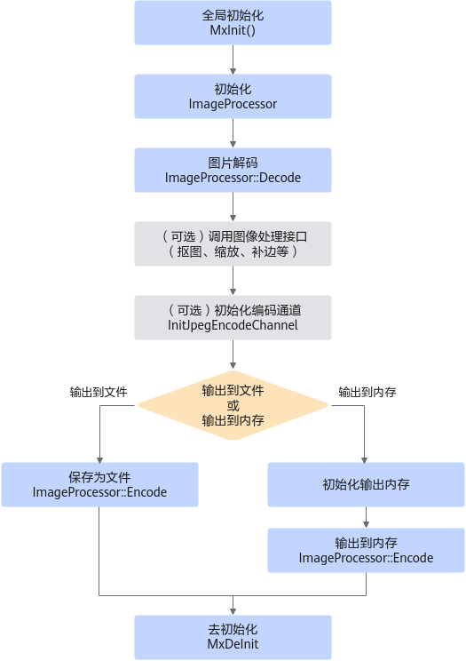

关键步骤说明如下：

1.  调用MxInit\(\)接口进行全局初始化。
2.  ImageProcessor构造及初始化。

    用户构造ImageProcessor对象，之后可以调用InitJpegEncodeChannel\(\)初始化通道，若不调用该接口，ImageProcessor会在执行编码前自动进行通道初始化。

3.  使用图片解码接口对输入图片进行解码。

    根据业务对图片进行解码，生成可编码的Image对象。后续可以通过图像处理接口对图片进行处理，生成最终需要编码的Image对象。

4.  调用Encode\(\)接口对输入图片进行编码。

    用户需根据实际业务情况输出图片数据，选择**输出到文件**或**输出到内存**。

5.  调用MxDeInit\(\)接口对初始化的全局资源进行去初始化。

**示例代码<a name="section72231936165818"></a>**

以下为功能特性关键步骤的代码示例，不可以直接拷贝编译运行，仅供参考。

```
//初始化
MxInit();
{
    //构造图像处理类
    ImageProcessor imageProcessor(deviceId);

    //图像解码/图像处理操作生成Image
    //解码后的图像类
    Image decodedImage;
    //根据图像路径进行解码
    APP_ERROR ret = imageProcessor.Decode(imagePath, decodedImage);
    if (ret != APP_ERR_OK) {
        std::cout << "Decode failed." << std::endl;
    }
    //图像处理操作后图像类
    Image resizedImage;
    //图像处理操作（缩放）
    ret = imageProcessor.Resize(decodedImage, Size(416, 416), resizedImage, Interpolation::HUAWEI_HIGH_ORDER_FILTER);
    if (ret != APP_ERR_OK) {
        std::cout << "Resize failed." << std::endl;
    }

    //（可选）初始化编码通道
    JpegEncodeChnConfig jpegEncodeChnConfig;
    JpegEncodeChnConfig.maxPicWidth = 4096;
    JpegEncodeChnConfig.maxPicHeight = 4096;
    imageProcessor.InitJpegEncodeChannel(jpegEncodeChnConfig);

    //图像编码
    ret = imageProcessor.Encode(resizedImage,"encode.jpg");
    if (ret != APP_ERR_OK) {
        std::cout << "Encode failed." << std::endl;
    }
}
//去初始化
MxDeInit();
```


##### 抠图<a name="ZH-CN_TOPIC_0000001572271646"></a>

**功能介绍<a name="section39768396167"></a>**

对输入的图像进行抠图操作，输出到Image对象中。

接口说明请参考[Crop](Crop.md)。

**接口调用流程<a name="section37619358587"></a>**

使用抠图接口前，用户需准备好被抠图的图片对象。

**图 1**  图像处理（抠图）接口调用流程<a name="fig137952594323"></a>  
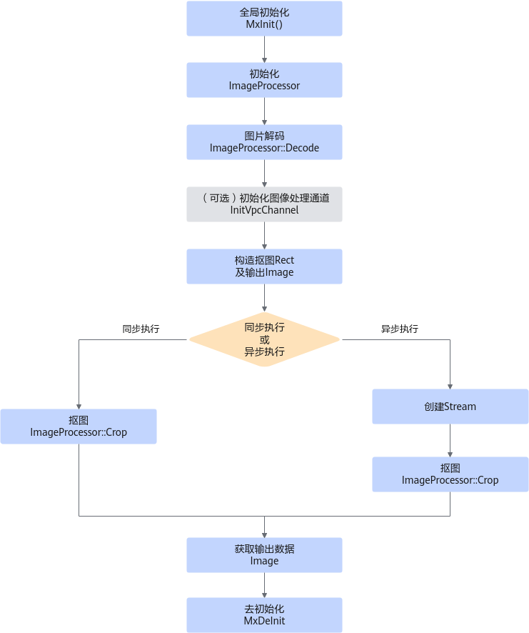

关键步骤说明如下：

1.  调用MxInit\(\)接口进行全局初始化。
2.  ImageProcessor初始化。

    用户构造ImageProcessor对象，之后可以调用InitVpcChannel\(\)初始化通道，若不调用该接口，ImageProcessor会在执行抠图前自动进行通道初始化。

3.  使用图片解码接口对输入图片进行解码。

    根据业务对图片进行解码，生成可抠图的Image对象。后续可以通过图像处理接口对图片进行处理，生成最终需要抠图的Image对象。

4.  构造抠图Rect以及输出Image。

    根据业务要求，选择一对多、一对一或多对多的抠图方式，构造对应的输入的Rect和输出的Image。

5.  选择执行方式进行抠图，请根据实际业务选择同步抠图方式或异步抠图方式。
    -   同步执行。

        不创建Stream，将输入图片及其他参数传入Crop\(\)接口，获取抠图结果。

    -   异步执行。
        1.  创建Stream，具体请参见[异步调用](异步调用.md)。
        2.  将输入图片、已创建的Stream及其他参数传入Crop\(\)接口，获取抠图结果。

6.  调用MxDeInit\(\)接口对初始化的全局资源进行去初始化。

**示例代码<a name="section72231936165818"></a>**

以下为功能特性关键步骤的代码示例，不可以直接拷贝编译运行，仅供参考。

```
//初始化
MxInit();
{
    //构造图像处理类
    ImageProcessor imageProcessor(deviceId);

    //（可选）初始化图像处理通道
    imageProcessor.InitVpcChannel();

    //图像解码操作生成Image
    //解码后的图像类
    Image decodedImage;
    //根据图像路径进行解码
    APP_ERROR ret = imageProcessor.Decode(imagePath, decodedImage);
    if (ret != APP_ERR_OK) {
        std::cout << "Decode failed." << std::endl;
    }

    //执行Crop
    //抠图图像类
    Image cropImage;
    //抠图坐标信息
    Rect cropRect {0, 0, 640, 512};
    //抠图操作
    ret = imageProcessor.Crop(decodedImage, cropRect, cropImage);
    if (ret != APP_ERR_OK) {
        std::cout << "Crop failed." << std::endl;
    }
}
//去初始化
MxDeInit();
```


##### 缩放<a name="ZH-CN_TOPIC_0000001572112314"></a>

**功能介绍<a name="section39768396167"></a>**

对输入的图像进行缩放操作，输出到Image对象中。

接口说明请参考[Resize](Resize.md)。

**接口调用流程<a name="section37619358587"></a>**

使用缩放接口前，用户需准备好被缩放的图片对象。

**图 1**  图像处理（缩放）接口调用流程<a name="fig202793229437"></a>  
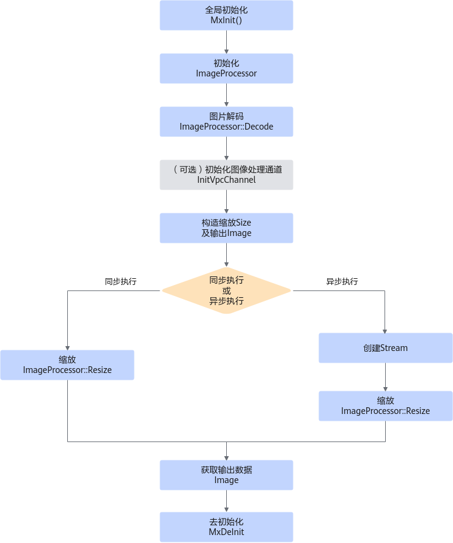

关键步骤说明如下：

1.  调用MxInit\(\)接口进行全局初始化。
2.  ImageProcessor初始化。

    用户构造ImageProcessor对象，之后可以调用InitVpcChannel\(\)初始化通道，若不调用该接口，ImageProcessor会在执行缩放前自动进行通道初始化。

3.  使用图片解码接口对输入图片进行解码。

    根据业务对图片进行解码，生成可缩放的Image对象。后续可以通过图像处理接口对图片进行处理，生成最终需要缩放的Image对象。

4.  构造缩放参数和输出Image。

    根据业务要求，构造对应的输入的Size和输出的Image。

5.  选择执行方式进行缩放，请根据实际业务选择同步缩放方式或异步缩放方式。
    -   同步执行。

        不创建Stream，将输入图片及其他参数传入Resize\(\)接口，获取缩放结果。

    -   异步执行。
        1.  创建Stream，具体请参见[异步调用](异步调用.md)。
        2.  将输入图片、已创建的Stream及其他参数传入Resize\(\)接口，获取缩放结果。

6.  调用MxDeInit\(\)接口对初始化的全局资源进行去初始化。

**示例代码<a name="section72231936165818"></a>**

以下为功能特性关键步骤的代码示例，不可以直接拷贝编译运行，仅供参考。

```
//初始化
MxInit();
{
    //构造图像处理类
    ImageProcessor imageProcessor(deviceId);

    //图像解码生成Image
    //解码后的图像类
    Image decodedImage;

    //根据图像路径进行解码
    APP_ERROR ret = imageProcessor.Decode(imagePath, decodedImage);
    if (ret != APP_ERR_OK) {
        std::cout << "Decode failed." << std::endl;
    }

    //（可选）初始化图像处理通道
    imageProcessor.InitVpcChannel();

    //执行缩放
    //缩放操作后图像类
    Image resizedImage;

    //缩放尺寸
    Size size(416, 416);

    //缩放操作
    ret = imageProcessor.Resize(decodedImage, size, resizedImage, Interpolation::HUAWEI_HIGH_ORDER_FILTER);
    if (ret != APP_ERR_OK) {
        std::cout << "Resize failed." << std::endl;
    }
}
//去初始化
MxDeInit();
```


##### 补边<a name="ZH-CN_TOPIC_0000001572431210"></a>

**功能介绍<a name="section39768396167"></a>**

对输入的图像进行补边操作，输出到Image对象中。

接口说明请参考[Padding](Padding.md)。

**接口调用流程<a name="section37619358587"></a>**

使用补边接口前，用户需准备好被补边的图片对象。

**图 1**  图像处理（补边）接口调用流程<a name="fig189901818553"></a>  
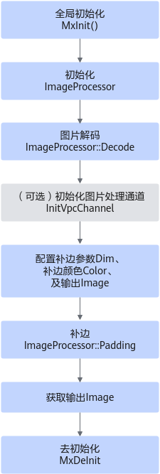

关键步骤说明如下：

1.  调用MxInit\(\)接口进行全局初始化。
2.  ImageProcessor初始化。

    用户构造ImageProcessor对象，之后可以调用InitVpcChannel\(\)初始化通道，若不调用该接口，ImageProcessor会在执行补边前自动进行通道初始化。

3.  使用图片解码接口对输入图片进行解码。

    根据业务对图片进行解码，生成可补边的Image对象。后续可以通过图像处理接口对图片进行处理，生成最终需要补边的Image对象。

4.  构造补边参数。

    根据业务要求，构造对应的输入的“padDim“（表示补边上下左右的像素值）、“Color“（补边颜色）和输出的Image。

5.  调用Padding\(\)接口对输入图像进行补边。
6.  调用MxDeInit\(\)接口对初始化的全局资源进行去初始化。

**示例代码<a name="section72231936165818"></a>**

以下为功能特性关键步骤的代码示例，不可以直接拷贝编译运行，仅供参考。

```
//初始化
MxInit();
{
    //构造图像处理类
    ImageProcessor imageProcessor(deviceId);

    //图像解码生成Image
    //解码后的图像类
    Image decodedImage;

    //根据图像路径进行解码
    APP_ERROR ret = imageProcessor.Decode(imagePath, decodedImage);
    if (ret != APP_ERR_OK) {
        std::cout << "Decode failed." << std::endl;
    }

    //（可选）初始化图像处理通道
    imageProcessor.InitVpcChannel();

    //执行补边
    //补边操作后图像类
    Image paddingImage;

    //构造补边参数
    Dim padDim(0, 0, 240, 240);
    Color color(0, 0, 0);

    // Padding操作
    ret = imageProcessor.Padding(decodedImage, padDim, color, BorderType::BORDER_CONSTANT, paddingImage);
    if (ret != APP_ERR_OK) {
        std::cout << "Padding failed." << std::endl;
    }
}
//去初始化
MxDeInit();
```


##### 抠图缩放<a name="ZH-CN_TOPIC_0000001572591142"></a>

**功能介绍<a name="section39768396167"></a>**

对输入的图像进行抠图并缩放操作，输出到Image对象中。

接口说明请参考[CropResize](CropResize.md)。

**接口调用流程<a name="section37619358587"></a>**

使用抠图缩放接口前，用户需准备好被抠图缩放的图片对象。

**图 1**  图像处理（抠图缩放）接口调用流程<a name="fig23991391455"></a>  
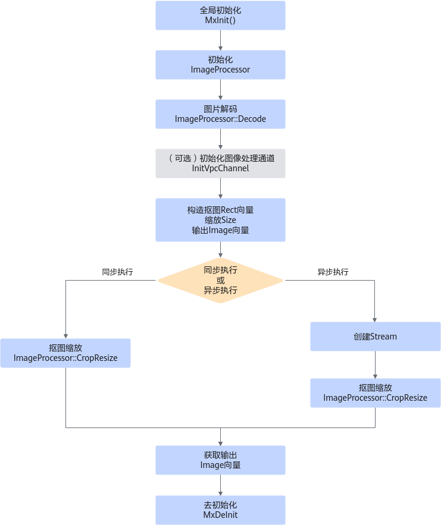

关键步骤说明如下：

1.  调用MxInit\(\)接口进行全局初始化。
2.  ImageProcessor初始化。

    用户构造ImageProcessor对象，之后可以调用InitVpcChannel\(\)初始化通道，若不调用该接口，ImageProcessor会在执行抠图缩放前自动进行通道初始化。

3.  使用图片解码接口对输入图片进行解码。

    根据业务对图片进行解码，生成可抠图缩放的Image对象。后续可以通过图片处理接口对图片进行处理，生成最终需要抠图缩放的Image对象。

4.  构造抠图缩放参数和输出Image。

    根据业务要求，选择单输入多抠图单缩放、单输入多抠图多缩放或多输入多抠图多缩放的方式，构造对应的输入的Rect、Size和输出的Image。

5.  调用CropResize\(\)接口对输入图片进行抠图缩放。
    -   同步执行。

        不创建Stream，将输入图片及其他参数传入接口，获取抠图缩放结果。

    -   异步执行。
        1.  创建Stream，具体请参见[异步调用](异步调用.md)。
        2.  将输入图片、已创建的Stream及其他参数传入接口，获取抠图缩放结果。

6.  调用MxDeInit\(\)接口对初始化的全局资源进行去初始化。

**示例代码<a name="section72231936165818"></a>**

以下为功能特性关键步骤的代码示例，不可以直接拷贝编译运行，仅供参考。

```
//初始化
MxInit();
{
    //构造图像处理类
    ImageProcessor imageProcessor(deviceId);

    //图像解码生成Image
    //解码后的图像类
    Image decodedImage;

    //根据图像路径进行解码
    APP_ERROR ret = imageProcessor.Decode(imagePath, decodedImage);
    if (ret != APP_ERR_OK) {
        std::cout << "Decode failed." << std::endl;
    }

    //（可选）初始化图像处理通道
    imageProcessor.InitVpcChannel();

    //执行抠图缩放
    //抠图缩放操作后图像类
    std::vector<Image> cropResizedImageVec(1);

    //抠图尺寸
    Rect rect(0, 0, 240, 240);
    std::vector<Rect> cropConfigVec = {rect};

    //缩放尺寸
    Size size(416, 416);

    //抠图缩放操作
    ret = imageProcessor.CropResize(decodedImage, cropConfigVec, size, cropResizedImageVec);
    if (ret != APP_ERR_OK) {
        std::cout << "CropResize failed." << std::endl;
    }
}
//去初始化
MxDeInit();
```


##### 抠图贴图<a name="ZH-CN_TOPIC_0000001622790889"></a>

**功能介绍<a name="section39768396167"></a>**

对输入的图像进行抠图并粘贴到背景图片中的操作，输出到Image对象中。

接口说明请参考[CropAndPaste](CropAndPaste.md)。

**接口调用流程<a name="section37619358587"></a>**

使用抠图贴图接口前，用户需准备好被抠图以及被粘贴的图片对象。

**图 1**  图像处理（抠图贴图）接口调用流程<a name="fig187871317171814"></a>  
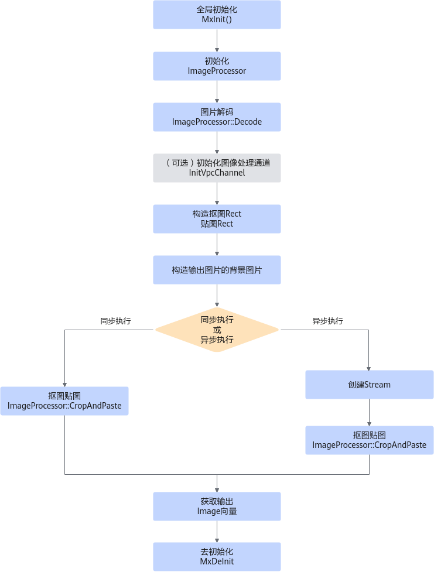

关键步骤说明如下：

1.  调用MxInit\(\)接口进行全局初始化。
2.  ImageProcessor初始化。

    用户构造ImageProcessor对象，之后可以调用InitVpcChannel\(\)初始化通道，若不调用该接口，ImageProcessor会在执行抠图并贴图前自动进行通道初始化。

3.  使用图片解码接口对输入图片进行解码。

    根据业务对图片进行解码，生成可抠图贴图的Image对象。后续可以通过图像处理接口对图片进行处理，生成最终需要抠图贴图的Image对象。

4.  构造抠图贴图参数和输出Image。
    1.  根据业务要求，设置被抠图片的矩阵并设置粘贴图片位置的矩阵，二者大小不一样时将自动进行缩放。
    2.  构造输出图片的背景图片，使用预申请内存的Image\(\)构造函数构造被粘贴图片或其他非空图片作为输出。

5.  调用CropAndPaste\(\)对输入图片进行抠图并将图片粘贴至指定位置。
    -   同步执行。

        不创建Stream，将输入图片及其他参数传入接口，获取抠图贴图结果。

    -   异步执行。
        1.  创建Stream，具体请参见[异步调用](异步调用.md)。
        2.  将输入图片、已创建的Stream及其他参数传入接口，获取抠图贴图结果。

6.  调用MxDeInit\(\)接口对初始化的全局资源进行去初始化。

**示例代码<a name="section72231936165818"></a>**

以下为功能特性关键步骤的代码示例，不可以直接拷贝编译运行，仅供参考。

```
//初始化
MxInit();
{
    //构造图像处理类
    ImageProcessor imageProcessor(deviceId);

    //图像解码生成Image
    //解码后的图像类
    Image decodedImage;

    //根据图像路径进行解码
    APP_ERROR ret = imageProcessor.Decode(imagePath, decodedImage);
    if (ret != APP_ERR_OK) {
        std::cout << "Decode failed." << std::endl;
    }

    //（可选）初始化图像处理通道
    imageProcessor.InitVpcChannel();

    //构造背景Image（也可以选择其他已有数据的Image对象）
    Size imageSize(640, 640);
    size_t dataSize = 640 * 640 * 3 / 2;
    MemoryData imgData(dataSize, MemoryData::MemoryType::MEMORY_DVPP, deviceId);
    if (MemoryHelper::MxbsMalloc(imgData) != APP_ERR_OK) { 
        std::cout << "Malloc failed." << std::endl;
    } 
    std::shared_ptr<uint8_t> pastedData((uint8_t*)imgData.ptrData, imgData.free);

    // 抠图贴图操作后图像类
    Image pastedImage(pastedData, dataSize, deviceId, imageSize);

    //执行抠图贴图
    //抠图和贴图尺寸
    Rect rectFrom(0, 0, 240, 240);
    Rect rectTo(0, 0, 480, 480);
    std::pair<Rect, Rect> cropPasteRect = {rectFrom, rectTo};

    //抠图贴图操作
    ret = imageProcessor.CropAndPaste(resizeImage, cropPasteRect, pastedImage) ;
    if (ret != APP_ERR_OK) {
        std::cout << "CropAndPaste failed." << std::endl;
    }
}
//去初始化
MxDeInit();
```


##### 色域转换<a name="ZH-CN_TOPIC_0000001622631273"></a>

**功能介绍<a name="section39768396167"></a>**

对输入的图像进行色域转换操作，输出到Image对象中。

接口说明请参考[ConvertFormat](ConvertFormat.md)。

**接口调用流程<a name="section37619358587"></a>**

使用色域转换接口前，用户需准备好被转换的图片对象。

**图 1**  图像处理（色域转换）接口调用流程<a name="fig4999313173115"></a>  
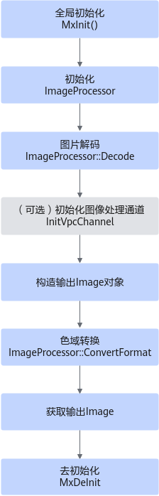

关键步骤说明如下：

1.  调用MxInit\(\)接口进行全局初始化。
2.  ImageProcessor初始化。

    用户构造ImageProcessor对象，之后可以调用InitVpcChannel\(\)初始化通道，若不调用该接口，ImageProcessor会在执行色域转换前自动进行通道初始化。

3.  使用图片解码接口对输入图片进行解码。

    根据业务对图片进行解码，生成可进行色域转换的Image对象。后续可以通过图像处理接口对图片进行处理，生成最终需要进行色域转换的Image对象。

4.  构造输出的Image对象。

    通过Image构造函数构造用于存放色域转换结果的Image对象。

5.  调用ConvertFormat\(\)对输入图片进行色域转换。
6.  调用MxDeInit\(\)接口对初始化的全局资源进行去初始化。

**示例代码<a name="section72231936165818"></a>**

以下为功能特性关键步骤的代码示例，不可以直接拷贝编译运行，仅供参考。

```
//初始化
MxInit();
{
    //构造图像处理类
    ImageProcessor imageProcessor(deviceId);

    //图像解码生成Image
    //解码后的图像类
    Image decodedImage;

    //根据图像路径进行解码
    APP_ERROR ret = imageProcessor.Decode(imagePath, decodedImage);
    if (ret != APP_ERR_OK) {
        std::cout << "Decode failed." << std::endl;
    }

    //（可选）初始化图像处理通道
    imageProcessor.InitVpcChannel();

    //执行色域转换
    //色域转换操作后图像类
    Image convertImage;

    //执行色域转换操作
    ret = imageProcessor.ConvertFormat(decodedImage, ImageFormat::RGB_888, convertImage);
    if (ret != APP_ERR_OK) {
        std::cout << "ConvertFormat failed." << std::endl;
    }
}
//去初始化
MxDeInit();
```


#### 通过张量方法进行图像处理（Tensor）<a name="ZH-CN_TOPIC_0000001622512221"></a>

##### 抠图<a name="ZH-CN_TOPIC_0000001622471349"></a>

**功能介绍<a name="section39768396167"></a>**

对输入的图像进行抠图操作，输出到Tensor对象中。

接口说明请参考[Crop](Crop-107.md)。

**接口调用流程<a name="section37619358587"></a>**

使用抠图接口前，用户需准备好被抠图的图片并转换到Tensor对象中。

**图 1**  张量方法（抠图）接口调用流程<a name="fig10248955195313"></a>  
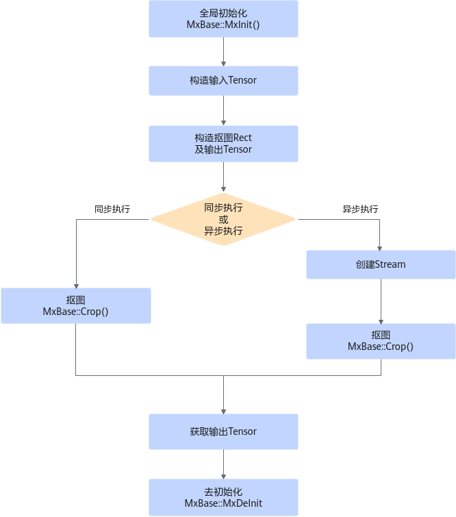

关键步骤说明如下：

1.  调用MxInit\(\)接口进行全局初始化。
2.  构造抠图Rect以及输出Tensor。

    根据业务要求，选择一对一或一对多的抠图方式，构造对应的输入的Rect和输出的Tensor。

3.  选择执行方式进行抠图，请根据实际业务选择同步抠图方式或异步抠图方式。
    -   同步执行。

        不创建Stream，将输入图片及其他参数传入Crop方法，获取抠图结果。

    -   异步执行。
        1.  创建Stream，具体请参见[异步调用](异步调用.md)。
        2.  将输入图片、已创建的Stream及其他参数传入Crop方法，获取抠图结果。

4.  调用MxDeInit\(\)接口对初始化的全局资源进行去初始化。

**示例代码<a name="section72231936165818"></a>**

以下为功能特性关键步骤的代码示例，不可以直接拷贝编译运行，仅供参考。

```
//初始化
MxBase::MxInit();
{
    // 读取图片
    std::string imgPath = "./test.jpg";
    cv::Mat imgData = cv::imread(imgPath, cv::IMREAD_UNCHANGED);
    std::vector<uint32_t> shape{600, 600, 3};

    // 构造输入tensor
    MxBase::Tensor input(imgData.data, shape, MxBase::TensorDType::UINT8, -1);
    input.ToDvpp(0);

    // 设置抠图区域
    MxBase::Rect rect(0, 0, 320, 320);

    // 构造输出tensor
    std::vector<uint32_t> dstShape = {320, 320, 3};
    MxBase::Tensor dst(dstShape, MxBase::TensorDType::UINT8, -1);
    dst.Malloc();
    dst.ToDevice(0);

    // 设置输出tensor是否保留无效边界
    bool keepMargin = true;

    // 执行抠图操作
    APP_ERROR ret = MxBase::Crop(input, rect, dst, keepMargin);
    if (ret != APP_ERR_OK) {
        std::cout << "Crop failed." << std::endl;
    }
}
//去初始化
MxBase::MxDeInit();
```


##### 缩放<a name="ZH-CN_TOPIC_0000001622550905"></a>

**功能介绍<a name="section39768396167"></a>**

对输入的图像进行缩放操作，输出到Tensor对象中。

接口说明请参考[Resize](Resize-110.md)。

**接口调用流程<a name="section37619358587"></a>**

使用缩放接口前，用户需准备好被缩放的图片并转换到Tensor对象中。

**图 1**  张量方法（缩放）接口调用流程<a name="fig12286572312"></a>  
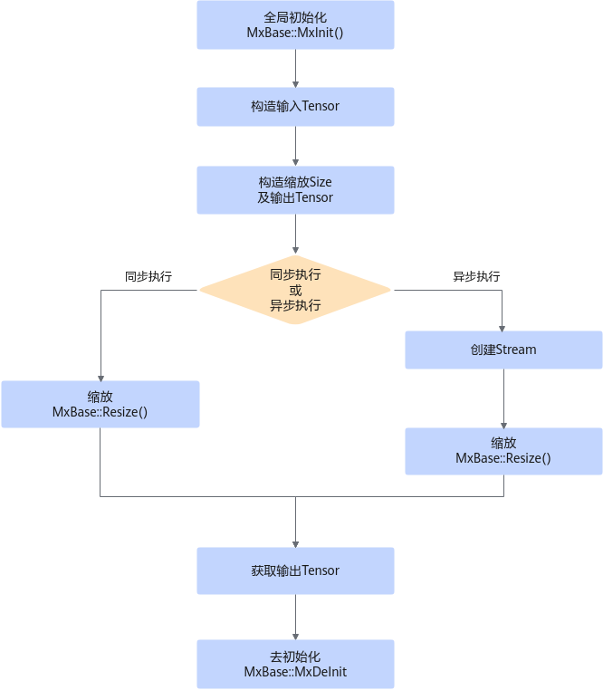

关键步骤说明如下：

1.  调用MxInit\(\)接口进行全局初始化。
2.  构造缩放参数和输出Tensor。

    根据业务要求，构造对应的输入Size和Tensor以及输出Tensor。

3.  选择执行方式进行缩放，请根据实际业务选择同步缩放方式或异步缩放方式。
    -   同步执行。

        不创建Stream，将输入图片及其他参数传入Resize方法，获取缩放结果。

    -   异步执行。
        1.  创建Stream，具体请参见[异步调用](异步调用.md)。
        2.  将输入图片、已创建的Stream及其他参数传入Resize方法，获取缩放结果。

4.  调用MxDeInit\(\)接口对初始化的全局资源进行去初始化。

**示例代码<a name="section72231936165818"></a>**

以下为功能特性关键步骤的代码示例，不可以直接拷贝编译运行，仅供参考。

```
//初始化
MxBase::MxInit();

{
    // 读取图片
    std::string imgPath = "./test.jpg";
    cv::Mat imgData = cv::imread(imgPath, cv::IMREAD_UNCHANGED);
    std::vector<uint32_t> shape{600, 600, 3};

    // 构造输入tensor
    MxBase::Tensor input(imgData.data, shape, MxBase::TensorDType::UINT8, -1);
    input.ToDvpp(0);

    // 设置缩放宽高
    MxBase::Size resize(289, 289);

    // 构造输出tensor
    std::vector<uint32_t> dstShape = {289, 304, 3};
    MxBase::Tensor dst(dstShape, MxBase::TensorDType::UINT8, -1);
    dst.Malloc();
    dst.ToDvpp(0);

    // 设置输出tensor是否保留输入tensor无效边界
    bool keepMargin = true;

    // 执行缩放操作
    APP_ERROR ret = MxBase::Resize(input, dst, resize, MxBase::Interpolation::BILINEAR_SIMILAR_OPENCV, keepMargin);
    if (ret != APP_ERR_OK) {
        std::cout << "Resize failed." << std::endl;
    }
}

// 去初始化
MxBase::MxDeInit();
```


##### 抠图缩放<a name="ZH-CN_TOPIC_0000001572271650"></a>

**功能介绍<a name="section39768396167"></a>**

对输入的图像进行抠图并缩放操作，输出到Tensor对象中。

接口说明请参考[CropResize](CropResize-108.md)。

**接口调用流程<a name="section37619358587"></a>**

使用抠图缩放接口前，用户需准备好被抠图缩放的图片，并转换到Tensor对象中。

**图 1**  张量方法（抠图缩放）接口调用流程<a name="fig3230143119910"></a>  
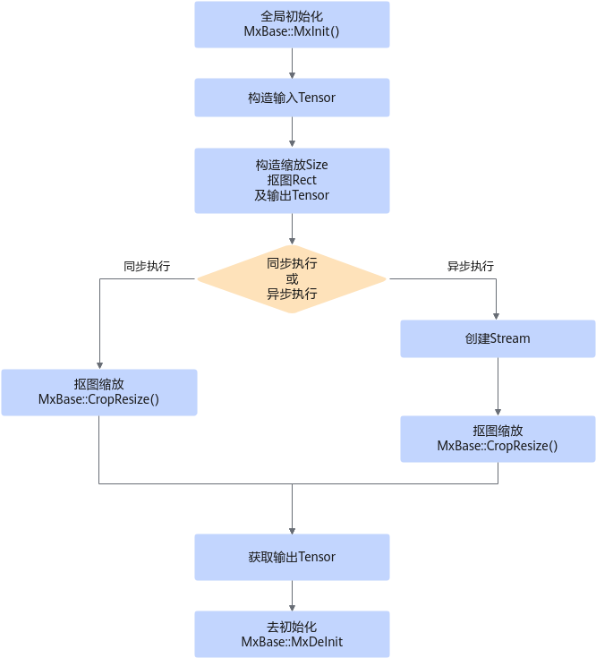

关键步骤说明如下：

1.  调用MxInit\(\)接口进行全局初始化。
2.  构造抠图缩放参数和输出Tensor。

    根据业务要求，构造对应的输入的Rect、Size和输出的Tensor。

3.  选择执行方式进行抠图缩放，请根据实际业务选择同步方式或异步方式。
    -   同步执行。

        不创建Stream，将输入图片及其他参数传入CropResize方法，获取抠图缩放结果。

    -   异步执行。
        1.  创建Stream，具体请参见[异步调用](异步调用.md)。
        2.  将输入图片、已创建的Stream及其他参数传入CropResize方法，获取抠图缩放结果。

4.  调用MxDeInit\(\)接口对初始化的全局资源进行去初始化。

**示例代码<a name="section72231936165818"></a>**

以下为功能特性关键步骤的代码示例，不可以直接拷贝编译运行，仅供参考。

```
//初始化
MxBase::MxInit();

{
    // 读取图片
    std::string imgPath = "./test.jpg";
    cv::Mat imgData = cv::imread(imgPath, cv::IMREAD_UNCHANGED);
    std::vector<uint32_t> shape{600, 600, 3};

    // 构造输入tensor
    MxBase::Tensor input(imgData.data, shape, MxBase::TensorDType::UINT8, -1);
    input.ToDvpp(0);

    // 设置抠图区域及缩放宽高
    MxBase::Rect rect(0, 0, 320, 320);
    std::vector<MxBase::Rect> cropRectVec = {rect};
    MxBase::Size size(480, 480);
    std::vector<MxBase::Size>sizeVec = {size};

    // 构造输出tensor
    std::vector<uint32_t> dstShape = {480, 480, 3};
    MxBase::Tensor dst(dstShape, MxBase::TensorDType::UINT8, -1);
    dst.Malloc();
    dst.ToDvpp(0);
    std::vector<MxBase::Tensor> outputTensorVec = {dst};

    // 执行抠图缩放操作
    APP_ERROR ret = MxBase::CropResize(input, cropRectVec, sizeVec, outputTensorVec, MxBase::Interpolation::BILINEAR_SIMILAR_OPENCV, true);
    if (ret != APP_ERR_OK) {
        std::cout << "CropResize failed." << std::endl;
    }
}

//去初始化
MxBase::MxDeInit();
```


##### 色域转换<a name="ZH-CN_TOPIC_0000001572112318"></a>

**功能介绍<a name="section39768396167"></a>**

对输入的图像进行色域转换操作，输出到Tensor对象中。

接口说明请参考[CvtColor](CvtColor.md)。

**接口调用流程<a name="section37619358587"></a>**

使用色域转换接口前，用户需准备好被转换的图片对象，并转换到Tensor对象中。

**图 1**  张量方法（色域转换）接口调用流程<a name="fig17713113114124"></a>  
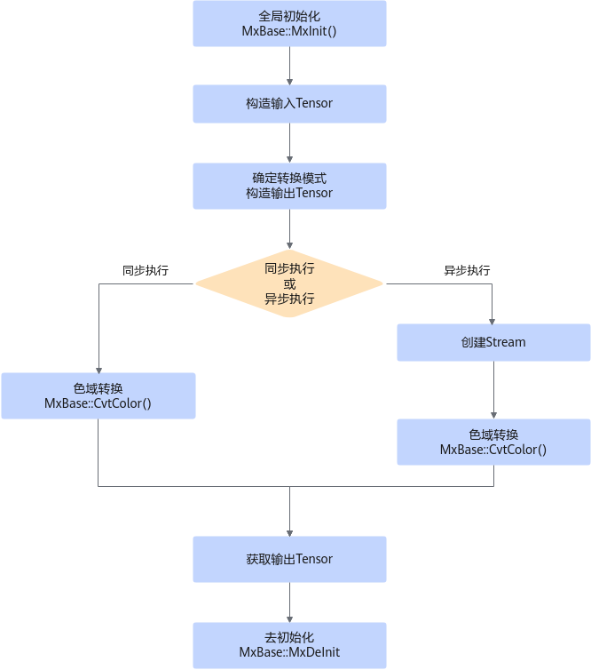

关键步骤说明如下：

1.  调用MxInit\(\)接口进行全局初始化。
2.  构造输出Tensor对象。

    根据业务要求，选择对应格式“CvtColorMode“，构造对应的输出Tensor。

3.  选择执行方式进行色域转换，请根据实际业务选择同步方式或异步方式。
    -   同步执行。

        不创建Stream，将输入图片及其他参数传入CvtColor方法，获取色域转换结果。

    -   异步执行。
        1.  创建Stream，具体请参见[异步调用](异步调用.md)。
        2.  将输入图片、已创建的Stream及其他参数传入CvtColor方法，获取色域转换结果。

4.  调用MxDeInit\(\)接口对初始化的全局资源进行去初始化。

**示例代码<a name="section72231936165818"></a>**

```
//初始化
MxBase::MxInit();
{
    // 读取图片
    std::string imgPath = "./test.jpg";
    cv::Mat imgData = cv::imread(imgPath);
    size_t originalWidth = image.cols;
    size_t originalHeight = image.rows;

    // 构造输入Tensor
    const std::vector<uint32_t> shape = {originalHeight, originalWidth, 3};
    MxBase::Tensor inputTensor((void*)imgData.data, shape, TensorDType::UINT8, -1);
    inputTensor.ToDevice(0);

    // 定义转换模式
    auto mode = MxBase::CvtColorMode::COLOR_BGR2RGB;

    // 定义输出Tensor
    MxBase::Tensor outputTensor;

    // 执行色域转换
    APP_ERROR ret = MxBase::CvtColor(inputTensor, outputTensor, mode, true);
    if (ret != APP_ERR_OK) {
        std::cout << "CvtColor failed." << std::endl;
    }
}
//去初始化
MxBase::MxDeInit();
```


##### 张量运算<a name="ZH-CN_TOPIC_0000001626436341"></a>

**功能介绍<a name="section1573679583"></a>**

使用Vision SDK张量运算功能，给定已赋值的输入张量并给输出张量分配好内存，调用张量运算接口执行相应运算并将计算结果值赋给输出张量。

相关接口说明请参考[TensorOperations](TensorOperations.md)。

**接口调用流程<a name="section1894563532818"></a>**

调用张量运算接口前，先创建好输入、输出张量，并分配好内存，同时，输入张量需要赋值。

输入输出数据类型必须保持一致。

对于四则运算和位运算，需保持输入、输出张量形状完全一致；对于张量转置、旋转、通道拆分、通道合并、裁剪和扩展接口，输入输出张量形状遵循相应的计算规范。

具体接口功能请参见[TensorOperations](TensorOperations.md)。

以Add为例，张量运算调用流程参考如下：

**图 1**  张量方法接口调用流程<a name="fig140011611259"></a>  
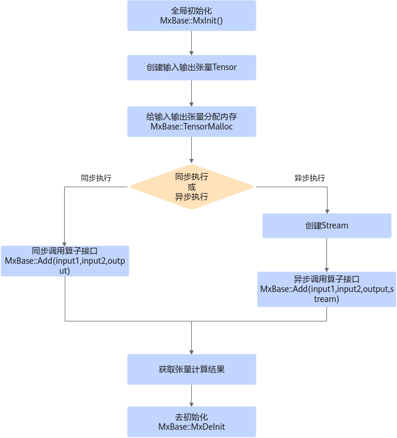

关键步骤说明如下：

1.  调用MxInit\(\)接口进行全局初始化。
2.  张量初始化和内存分配，用户需对输入输出进行初始化和内存分配。
    -   对于输入张量，需要创建好张量的数据，并传入张量形状、类型进行初始化，也可同时指定张量所在Device。
    -   对于输出张量，传入张量形状、类型进行初始化，也可同时指定张量所在Device，并调用Tensor.Malloc\(\)接口给张量分配内存。
    -   对于未在初始化时指定Device的张量，需在初始化后使用ToDevice\(int DeviceId\)方法将张量放在指定Device侧进行运算。

3.  选择执行方式进行张量计算，请根据实际业务选择同步调用算子接口或异步调用算子接口。
    -   同步执行。

        不创建Stream，将输入张量传入Add方法，获取张量相加计算结果。

    -   异步执行。
        1.  创建Stream，具体请参见[异步调用](异步调用.md)。
        2.  将输入张量、已创建的Stream及其他参数传入Add方法，获取张量相加计算结果。

4.  调用MxDeInit\(\)接口对初始化的全局资源进行去初始化。

**示例代码<a name="section15925161120452"></a>**

以下为以张量加法接口为例的功能特性关键步骤的代码示例，不可以直接拷贝编译运行，仅供参考。

-   同步调用。

    ```
    //初始化
    MxBase::MxInit();
    {
        // 1. 张量初始化
        // 1.1 用户创建输入张量的数据
        uint8_t input1[1][3][16][16];
        uint8_t input2[1][3][16][16];
        for (int i = 0; i < 1; i++) {
            for (int j = 0; j < 3; j++) {
                for (int k = 0; k < 16; k++) {
                    for (int l = 0; l < 16; l++) {
                        input1[i][j][k][l] = 8;
                        input2[i][j][k][l] = 2;
                    }
                }
            }
        }
        // 1.2 用户指定张量形状                                          
        std::vector<uint32_t> shape{1, 3, 16, 16};
        // 1.3 用户创建输入输出张量对象                            
        MxBase::Tensor tensor1(&input1[0][0][0][0], shape, MxBase::TensorDType::UINT8);
        MxBase::Tensor tensor2(&input2[0][0][0][0], shape, MxBase::TensorDType::UINT8);
        MxBase::Tensor tensor3(shape, MxBase::TensorDType::UINT8);
        tensor3.Malloc();
        tensor1.ToDevice(device_id);
        tensor2.ToDevice(device_id);
        tensor3.ToDevice(device_id);
        // 2. 调用算子接口，tensor3即为算子计算输出结果                
        APP_ERROR ret = MxBase::Add(tensor1, tensor2, tensor3);  
    }
    //去初始化
    MxBase::MxDeInit();
    ```

-   异步调用。

    ```
    //初始化
    MxBase::MxInit();
    {
        // 1. 创建流及线程注册
        // 1.1 创建流
        MxBase::AscendStream stream = AscendStream(deviceId);
        // 1.2 流的线程注册
        stream.CreateAscendStream();
        // 2. 张量初始化
        // 2.1 用户创建输入张量的数据
        uint8_t input1[1][3][16][16];
        uint8_t input2[1][3][16][16];
        for (int i = 0; i < 1; i++) {
            for (int j = 0; j < 3; j++) {
                for (int k = 0; k < 16; k++) {
                    for (int l = 0; l < 16; l++) {
                        input1[i][j][k][l] = 8;
                        input2[i][j][k][l] = 2;
                    }
                }
            }
        }
        // 2.2 用户指定张量形状                                          
        std::vector<uint32_t> shape{1, 3, 16, 16};
        // 2.3 用户创建输入输出张量对象                            
        MxBase::Tensor tensor1(&input1[0][0][0][0], shape, MxBase::TensorDType::UINT8);
        MxBase::Tensor tensor2(&input2[0][0][0][0], shape, MxBase::TensorDType::UINT8);
        MxBase::Tensor tensor3(shape, MxBase::TensorDType::UINT8);
        tensor3.Malloc();
        tensor1.ToDevice(device_id);
        tensor2.ToDevice(device_id);
        tensor3.ToDevice(device_id);
        // 3. 调用算子接口，tensor3即为算子计算输出结果                
        APP_ERROR ret = MxBase::Add(tensor1, tensor2, tensor3, stream);  
        // 4. 流的同步，获取计算结果
        stream.Synchronize();
        // 5. 流的销毁
        stream.DestroyAscendStream();
    }
    //去初始化
    MxBase::MxDeInit();
    ```


##### 特征提取<a name="ZH-CN_TOPIC_0000001583525324"></a>

**功能介绍<a name="section09373309102"></a>**

通过构造[Sift类](TensorFeatures.md)实例可实现对输入的图像进行特征提取。给定输入图片张量以及用于限制特征提取区域的掩模矩形框，调用特征提取接口执行相应的模型推理，输出提取的特征点列表及**描述子**列表。

使用Sift类进行特征点提取时，需要提前生成构建尺度空间的om模型，可按照如下步骤进行。

1.  设置CANN开发套件包的环境变量，本次步骤中$\{CANN\_INSTALL\_PATH\}以普通用户默认路径（“$HOME”）为例。

    ```
    . ${CANN_INSTALL_PATH}/ascend-toolkit/set_env.sh
    ```

2.  设置Vision SDK开发套件包的环境变量，其中$\{MX\_SDK\_HOME\}为Vision SDK安装目录。

    ```
    . ${MX_SDK_HOME}/set_env.sh
    ```

3.  进入Vision SDK安装目录。

    ```
    cd ${MX_SDK_HOME}
    ```

4.  创建并进入存放模型权重文件的目录“data“。

    ```
    mkdir data
    cd data
    ```

5.  执行“$\{MX\_SDK\_HOME\}/bin“目录下的“generate\_sift\_weights.py“创建模型所需的权重文件。

    ```
    python3 ../bin/generate_sift_weights.py
    ```

6.  进入Vision SDK安装目录下的“bin“文件。

    ```
    cd ${MX_SDK_HOME}/bin
    ```

7.  执行可执行文件“sift“创建om模型，支持传入芯片版本参数“soc\_version“。
8.  Atlas 200I A2 加速模块（20 TOPS，12GB）对应芯片版本名称为“Ascend310B\*“，其中“\*“可能根据芯片性能提升等级、芯片核数使用等级等因素会返回不同的值，具体类型可通过**npu-smi info**查询获取。

    ```
    ./sift soc_version
    ```

**接口调用流程<a name="section1790103113109"></a>**

**图 1**  特征提取接口调用流程<a name="fig4480162963818"></a>  
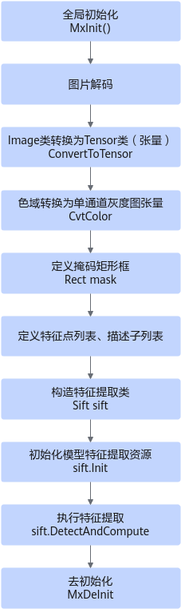

1.  调用MxInit\(\)接口进行全局初始化。
2.  调用特征提取接口前，需初始化ImageProcessor，调用ImageProcessor的图片解码接口得到输入图像Image，具体请参见[图片解码](图片解码.md)。
3.  调用Image类的ConvertToTensor接口将输入图像转化为张量。
4.  由于Sift的特征提取仅支持单通道图像，因此，需要调用Tensor类的CvtColor接口，将张量转化为单通道灰度图张量，数据排布格式为**HWC**，具体操作流程请参见[色域转换](色域转换-3.md)。
5.  定义输入的掩码矩形框，用于限制需要计算特征的区域，针对该区域内的图像进行特征提取。矩形框对应的左上角坐标及右下角坐标需在图片有效范围内。
6.  定义特征点列表及**描述子**列表，支持用户对特征点列表赋值，接口将使用用户定义的特征点直接生成**描述子**。
7.  构造特征提取类，并初始化模型提取资源。

    如需在构造特征提取类时调整参数值，请注意对异常情况进行处理，建议使用**try**/**catch**捕获异常。

8.  调用特征提取接口进行计算。
9.  调用MxDeInit\(\)接口对初始化的全局资源进行去初始化。

**示例代码<a name="section1726133116106"></a>**

以下为特征提取接口的功能特性关键步骤的代码示例，不可以直接拷贝编译运行，仅供参考。

```
// 初始化
MxBase::MxInit();

{
    // 构造图像处理类
    MxBase::ImageProcessor imageProcessor(deviceId);

    // 图像解码操作生成Image
    // 解码后的图像类
    MxBase::Image image;

    //根据图像路径进行解码
    APP_ERROR ret = imageProcessor.Decode(imagePath, image);
    if (ret != APP_ERR_OK) {
        return 0;
    }

    // 将图像转换为张量，且张量排布格式为HWC
    MxBase::Tensor tensor = image.ConvertToTensor(true, false);

    // 通过张量方法对图像进行色域转换
    // 定义色域转换类型
    auto mode = MxBase::CvtColorMode::COLOR_YUVSP4202GRAY;

    // 定义输出张量
    MxBase::Tensor imgTensor;

    // 执行色域转换
    MxBase::CvtColor(tensor, imgTensor, mode, true);
 
    // 定义掩码矩形框
    MxBase::Rect mask = MxBase::Rect(x0, x1, y0, y1);
 
    // 定义特征点列表
    vector<cv::KeyPoint> keyPoints;
 
    // 定义描述子列表
    cv::Mat descriptors;

    try {
        // 构造特征提取类
        Sift sift(nFeatures, nOctaveLayers, contrastThreshold, edgeThreshold, sigma, descriptorType);
 
        // 初始化模型特征提取资源
        sift.Init(deviceId);
 
        // 执行特征提取
        sift.DetectAndCompute(imgTensor, mask, keyPoints, descriptors, false);
    } 
    catch (runtime_error error) {
        return 0;
    }
}

// 去初始化
MxBase::MxDeInit();
```


### 模型推理<a name="ZH-CN_TOPIC_0000001622432665"></a>

**功能介绍<a name="section16289143420588"></a>**

使用Vision SDK模型推理功能通过给定输入和指定模型，进行推理获得输出结果，支持om格式和MindIR格式的模型推理，可使用ATC工具构建的动态Batch、动态分辨率和分档动态维度模型进行推理。

相关接口说明请参考[Model](Model.md)。

**接口调用流程<a name="section37619358587"></a>**

使用模型推理前，用户需准备好输入数据以及需要加载的模型，根据模型路径或者内存方式初始化Model类，通过调用Model类的Infer接口获取模型推理结果。输入数据必须和模型输入数据类型以及格式一致，如果用户自行申请输出数据内存，则输出数据类型和格式需和模型输出保持一致，模型输入输出信息可以通过Model类的相关接口进行查询。

模型推理调用流程参考如下：

**图 1**  模型推理接口调用流程<a name="fig18769152154012"></a>  
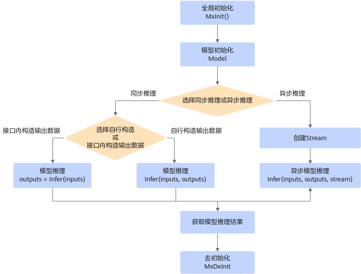

关键接口说明如下：

1.  调用MxInit\(\)接口进行全局初始化。
2.  模型初始化。

    用户需根据实际业务情况确认模型加载方式，可通过以下两种方式传入。

    -   从文件加载模型，可选择直接向Model接口传入模型路径，进行初始化。
    -   通过结构体ModelLoadOptV2中的“loadType“字段指定加载方式后，再传入Model接口，其中加载方式在模型方面区分从文件加载模型，还是从内存加载模型，在内存方面区分是由系统内部管理，还是由用户管理，具体可参见[ModelLoadOptV2](ModelLoadOptV2.md)。

3.  选择模型推理方式进行模型推理，请根据实际业务选择同步推理方式或异步推理方式。
    -   同步推理。

        需确认如何获取输出数据，选择通过Infer接口内构造输出数据或自行构造并接收模型推理输出数据。

    -   异步推理（当前仅支持Atlas 推理系列产品）。
        1.  创建Stream，具体请参见[异步调用](异步调用.md)。
        2.  用户需要自行构造并接收输出数据，传入已创建的Stream。

4.  调用MxDeInit\(\)接口对初始化的全局资源进行去初始化。

**示例代码<a name="section72231936165818"></a>**

以下为功能特性关键步骤的代码示例，不可以直接拷贝编译运行，仅供参考。

```
// 初始化
MxBase::MxInit();
{
    // 输入图像二进制数据， 需用户自行准备
    std::string filePath = "./test.bin";   
    // 读取输入数据到内存                                          
    void* dataPtr = ReadTensor(filePath);        
    // 输入数据类型，和模型输入数据类型一致                             
    auto dataType = MxBase::TensorDType::INT32;     
    // 构造输入shape，和模型输入shape一致                 
    std::vector<uint32_t> shape = {1, 128};       
    // 构造tensor                            
    MxBase::Tensor tensor(dataPtr, shape, dataType, 0);   
    // 构造模型输入           
    std::vector<MxBase::Tensor> inputs{tensor};
    // 模型路径，需用户自行指定                           
    std::string modelPath = "./test.om";    
    // 根据模型路径加载模型                                     
    MxBase::Model model(modelPath);           
    // 执行模型推理, outputs即为推理结果                                
    std::vector<MxBase::Tensor> outputs = model.Infer(inputs);  
}
//去初始化
MxBase::MxDeInit();
```

根据结构体ModelLoadOptV2方式初始化示例参考如下：

```
MxBase::ModelLoadOptV2 mdlLoadOpt;
mdlLoadOpt.loadType = ModelLoadOptV2::LOAD_MODEL_FROM_FILE;  // 指定模型加载方式
mdlLoadOpt.modelPath = modelPath;
MxBase::Model model(mdlLoadOpt);
```

**使用MindIR模型进行推理<a name="section112110173514"></a>**

使用MindIR模型进行推理与使用om模型推理流程一致，需要注意的是，使用MindIR模型进行推理前，需要用户自行安装MindSpore Lite软件包，并设置环境变量，具体步骤如下。

>[!NOTICE] 须知
>请关注MindSpore开源社区的漏洞，并及时修复。

1.  下载MindSpore Lite软件包。
    -   Linux-x86\_64版本：[获取链接](https://ms-release.obs.cn-north-4.myhuaweicloud.com/2.4.0/MindSpore/lite/release/linux/x86_64/cloud_fusion/python37/mindspore-lite-2.4.0-linux-x64.tar.gz)
    -   Linux-aarch64版本：[获取链接](https://ms-release.obs.cn-north-4.myhuaweicloud.com/2.4.0/MindSpore/lite/release/linux/aarch64/cloud_fusion/python37/mindspore-lite-2.4.0-linux-aarch64.tar.gz)

2.  将下载好的tar包传到运行Vision SDK业务所在的环境上。
3.  解压tar包。

    ```
    tar -zxvf mindspore-lite-2.4.0-linux-{arch}.tar.gz --no-same-owner
    ```

4.  设置环境变量。

    ARM服务器：

    ```
    export LD_LIBRARY_PATH={path}/runtime/lib:${LD_LIBRARY_PATH}
    export LD_LIBRARY_PATH={path}/tools/converter/lib:${LD_LIBRARY_PATH}
    ```

    x86\_64服务器：

    ```
    export LD_LIBRARY_PATH={path}/runtime/lib:${LD_LIBRARY_PATH}
    export LD_LIBRARY_PATH={path}/tools/converter/lib:${LD_LIBRARY_PATH}
    export LD_LIBRARY_PATH={path}/runtime/third_party/dnnl:${LD_LIBRARY_PATH}
    ```

    其中，_\{path\}_为MindSpore Lite软件包解压后的路径，请根据实际情况修改。

5.  确认环境变量设置结果。

    ```
    echo $LD_LIBRARY_PATH
    ```


### 后处理<a name="ZH-CN_TOPIC_0000002003776374"></a>

**功能介绍<a name="section1174011816497"></a>**

一般情况下，获取模型文件时，会带有后处理的代码文件，建议使用和模型训练时一致的后处理流程，从而保证推理结果符合预期。

对于不同的经典模型，Vision SDK封装了不同的后处理函数，可实现不同模型的后处理操作，将模型推理后的数据直接传入后处理接口，得到最终结果，极大地简化了使用过程。

相关接口说明请参考[模型后处理](模型后处理.md)。

**接口调用流程<a name="section198501026124916"></a>**

**图 1**  接口调用流程图<a name="fig102141350183912"></a>  
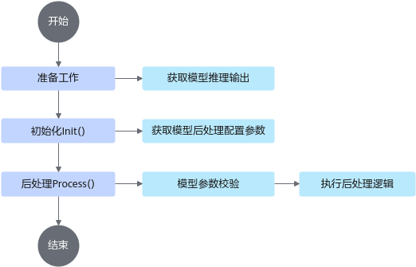

>[!NOTE] 说明
>在使用后处理功能时，需要将对应模型后处理的动态链接库文件（.so）在CMakeLists.txt文件中进行链接操作，以YoloV3为例：
>```
>target_link_libraries(main mxbase yolov3postprocess ...)
>```

**示例代码<a name="section10487144615502"></a>**

基于Vision SDK后处理函数（YoloV3）的示例如下，不可以直接拷贝编译运行，仅供参考：

```
// 1、初始化
// 步骤1：构造后处理 Init 的输入
std::map<std::string, std::string> postConfig;

postConfig.insert(pair<std::string, std::string>("postProcessConfigPath", yoloV3ConfigPath)); // 设置模型后处理配置文件路径
postConfig.insert(pair<std::string, std::string>("labelPath", yoloV3LabelPath)); // 设置标签文件路径

// 步骤2：执行后处理 Init
Yolov3PostProcess yolov3PostProcess;
yolov3PostProcess.Init(postConfig);

// 2、执行后处理
// 步骤1：根据YOLOV3推理结果构建后处理输入tensors
std::vector<TensorBase> tensors;
for (size_t i = 0; i < yoloV3Outputs.size(); i++) {
    MemoryData memoryData(yoloV3Outputs[i].GetData(), yoloV3Outputs[i].GetByteSize());
    TensorBase tensorBase(memoryData, true, yoloV3Outputs[i].GetShape(), TENSOR_DTYPE_INT32);
    tensors.push_back(tensorBase);
}
// 步骤2：创建后处理输出
std::vector<std::vector<ObjectInfo>> objectInfos;

// 步骤3：执行后处理 Process
yolov3PostProcess.Process(tensors, objectInfos, imagePreProcessInfos);
```


### 编译运行<a name="ZH-CN_TOPIC_0000001576498286"></a>

运行样例前，需设置Vision SDK环境变量。

```
source {Vision SDK安装目录}/mxVision/set_env.sh
```

**编译<a name="section12756153283416"></a>**

1.  文件准备，用户准备好源码文件“main.cpp“，以及“CMakeLists.txt“文件，“CMakeLists.txt“编写可参考如下内容：

    ```
    # CMake lowest version requirement
    cmake_minimum_required(VERSION 3.5.2)
    # project information
    project(MindX_SDK_Sample)
    set(MX_SDK_HOME $ENV{MX_SDK_HOME})
    if (NOT DEFINED ENV{MX_SDK_HOME})
    string(REGEX REPLACE "(.*)/(.*)/(.*)/(.*)" "\\1" MX_SDK_HOME  ${CMAKE_CURRENT_SOURCE_DIR})
    message(STATUS "set default MX_SDK_HOME: ${MX_SDK_HOME}")
    else ()
    message(STATUS "env MX_SDK_HOME: ${MX_SDK_HOME}")
    endif()
    # Compile options
    add_definitions(-D_GLIBCXX_USE_CXX11_ABI=0)
    add_definitions(-Dgoogle=mindxsdk_private)
    add_compile_options(-std=c++14 -fPIC -fstack-protector-all -Wall)
    set(CMAKE_RUNTIME_OUTPUT_DIRECTORY ${CMAKE_CURRENT_SOURCE_DIR})
    set(CMAKE_CXX_FLAGS_DEBUG "-g")
    set(CMAKE_EXE_LINKER_FLAGS "${CMAKE_EXE_LINKER_FLAGS} -Wl,-z,relro,-z,now,-z,noexecstack -s -pie")
    set(CMAKE_SKIP_RPATH TRUE)
    
    # add mxbase header path
    include_directories(
    ${MX_SDK_HOME}/include/
    ${MX_SDK_HOME}/opensource/include/
    ${MX_SDK_HOME}/opensource/opencv4/
    )
    
    # add mxbase lib path
    link_directories(
    ${MX_SDK_HOME}/lib/
    ${MX_SDK_HOME}/lib/modelpostprocessors/
    ${MX_SDK_HOME}/opensource/lib/
    ${MX_SDK_HOME}/opensource/lib64/
    )
    add_executable(main main.cpp)
    target_link_libraries(main glog mxbase opencv_world pthread mindxsdk_protobuf)
    install(TARGETS main DESTINATION ${CMAKE_RUNTIME_OUTPUT_DIRECTORY})
    ```

2.  CMake编译。
    1.  在“CMakeLists.txt“文件所在目录新建“build“目录。

        ```
        mkdir build
        ```

    2.  进入“build“目录。

        ```
        cd build
        ```

    3.  执行**cmake**命令。

        ```
        cmake ..
        ```

    4.  执行**make**命令生成可执行文件“main“。

        ```
        make -j
        ```

**运行<a name="section1446145103518"></a>**

执行编译生成的可执行文件即可运行程序。

```
./main
```

>[!NOTE] 说明
>-   若编译或运行时出现“undefined reference to symbol 'absl\_xxx', error adding symbols: DSO missing from command line”，请在编译可执行程序时加入链接选项-Wl,--no-as-needed -Wl,--copy-dt-needed-entries。


## 使用API接口方式开发（Python）<a name="ZH-CN_TOPIC_0000001671933225"></a>

### 开发流程<a name="ZH-CN_TOPIC_0000001623333616"></a>

**流程介绍<a name="section797113229405"></a>**

**图 1**  API开发流程<a name="fig151305368529"></a>  

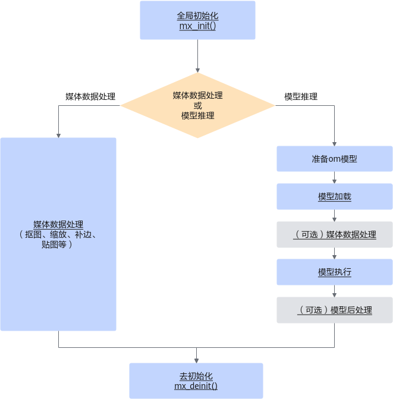

**关键步骤说明<a name="section211642319404"></a>**

1.  使用Vision SDK接口进行应用开发，需先进行初始化才能进行后续处理。
2.  媒体数据处理/模型推理。
    1.  媒体数据处理功能，可实现图像编解码、抠图、缩放、补边等操作。
    2.  模型推理，可实现如目标识别，图像分类等应用，可参考以下几个步骤。
        1.  模型推理前，需准备合适的om模型，也可通过模型转换，将其他预训练模型转换为om模型，具体请参见《CANN ATC离线模型编译工具用户指南》。
        2.  模型加载，将准备好的模型通过文件或内存方式加载到系统中。
        3.  媒体数据处理，模型推理前，可对输入的媒体数据进行处理，如图片解码、抠图、缩放、补边等操作。
        4.  模型执行，使用模型实现图片分类、目标识别等功能。
        5.  模型后处理，对模型推理输出的数据进行后处理操作，此处根据用户的实际需求来处理推理结果，如整理为可理解阅读的具体结果。模型后处理支持通过两种方式进行：
            -   （推荐）自行选择模型后处理方式。
            -   通过调用Vision SDK接口进行。

3.  调用mx\_deinit\(\)接口进行去初始化。


### 初始化与去初始化<a name="ZH-CN_TOPIC_0000001623493436"></a>

**功能介绍<a name="section107671142161812"></a>**

Vision SDK应用开发初始化接口，在代码调用相关接口之前，需调用全局初始化函数mx\_init\(\)申请设备资源和日志资源。

Vision SDK接口全部执行完毕后，用户需调用mx\_deinit\(\)接口对初始化的全局资源进行去初始化操作。

相关接口说明请参考[初始化和去初始化](初始化和去初始化-281.md)。

**示例代码<a name="section9831144471811"></a>**

以下为初始化和去初始化方法的代码示例，不可以直接拷贝运行，仅供参考。

全局初始化，加载设备资源和日志资源。程序执行完毕后需执行去初始化操作。

```
from mindx.sdk import base
# 执行全局初始化后即可正常调用Vision SDK接口
base.mx_init()
# 执行全局去初始化释放资源
base.mx_deinit()
```


### 媒体数据处理<a name="ZH-CN_TOPIC_0000001623813334"></a>

#### 图片解码<a name="ZH-CN_TOPIC_0000001623653342"></a>

**功能介绍<a name="section16289143420588"></a>**

通过对输入图片数据进行解码处理，将本地图片转换为Image类，用于后续前处理和推理业务，类型目前支持JPEG和PNG格式。

接口说明请参考[decode](decode.md)。

**接口调用流程<a name="section1192113160230"></a>**

用户需准备好本地待解码的图片文件，初始化ImageProcessor类，通过调用ImageProcessor类的decode接口解码返回输出的Image对象。

图片解码调用流程参考如下：

**图 1**  图片解码接口调用流程<a name="fig874218457214"></a>  

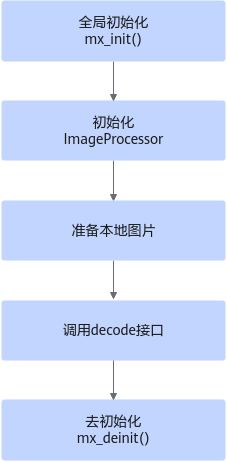

关键步骤说明如下：

1.  调用mx\_init\(\)接口进行全局初始化。
2.  ImageProcessor初始化。

    用户构造ImageProcessor对象，构造时需用户指定设备ID。

3.  调用decode接口对图片进行解码。

    用户需根据解码的不同需要，传入对应格式参数到decode接口。

4.  调用mx\_deinit\(\)接口进行去初始化。

**示例代码<a name="section72231936165818"></a>**

以下为功能特性关键步骤的代码示例，不可以直接拷贝运行，仅供参考。

```
from mindx.sdk import base  
from mindx.sdk.base import ImageProcessor, Image

def process():
    # 图像解码
    # 初始化ImageProcessor对象
    imageProcessor = ImageProcessor(device_id)
    image_path = "test_image.jpg"
    # 读取图片路径进行解码，解码格式为nv12（YUV_SP_420）
    decoded_image = imageProcessor.decode(image_path, base.nv12)

if __name__ == "__main__":
    base.mx_init()    # 资源初始化
    process()
    base.mx_deinit()  # 资源去初始化
```


#### 图片编码<a name="ZH-CN_TOPIC_0000001671813221"></a>

**功能介绍<a name="section6233134318615"></a>**

将接口输出的Image对象编码为JPG格式的图片保存到指定的图片路径。

接口说明请参考[encode](encode.md)。

**接口调用流程<a name="section37619358587"></a>**

用户可以通过调用图片解码以及图像处理接口（抠图、缩放、补边等操作对应接口），得到待编码的Image对象，通过调用ImageProcessor类的Encode接口输出到内存或者保存到本地。

图片编码调用流程参考如下：

**图 1**  图片编码接口调用流程<a name="fig96239912221"></a>  
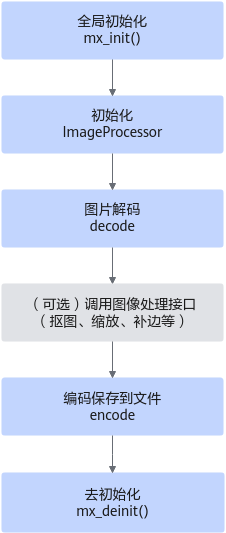

关键步骤说明如下：

1.  调用mx\_init\(\)接口进行全局初始化。
2.  ImageProcessor初始化。

    用户构造ImageProcessor对象，构造时需用户指定设备ID。

3.  使用图片解码接口对输入图片进行解码。

    根据业务对图片进行解码，生成可编码的Image对象。后续可以通过图像处理接口对图片进行处理，生成最终需要编码的Image对象。

4.  调用encode接口对输入图片进行编码。

    用户需根据实际业务情况输出图片数据，指定待输出的Image和输出路径。

5.  调用mx\_deinit\(\)接口进行去初始化。

**示例代码<a name="section72231936165818"></a>**

以下为功能特性关键步骤的代码示例，不可以直接拷贝运行，仅供参考。

```
from mindx.sdk import base  
from mindx.sdk.base import ImageProcessor, Rect, Image

def process():
    # 图像解码  
    # 初始化ImageProcessor对象  
    imageProcessor = ImageProcessor(device_id)  
    image_path = "image_data/test_image.jpg"  
    # 读取图片路径进行解码，解码格式为nv12（YUV_SP_420）  
    decoded_image = imageProcessor.decode(image_path, base.nv12)  
   
    # 图像处理操作（抠图）  
    crop_para = [Rect(300, 100, 550, 350)]  
    croped_images = imageProcessor.crop(decoded_image, crop_para)  

    # 图像编码 
    image_save_path = "croped_image.jpg"  
    imageProcessor.encode(croped_images[0], image_save_path) 

if __name__ == "__main__":
    base.mx_init()     # 资源初始化
    process()
    base.mx_deinit()   # 资源去初始化
```


#### 抠图<a name="ZH-CN_TOPIC_0000001671933229"></a>

**功能介绍<a name="section39768396167"></a>**

对输入的图像进行抠图操作，输出到Image对象中。

接口说明请参考[crop（单张抠图）](crop.md)或者[crop（批量抠图）](crop-294.md)。

**接口调用流程<a name="section37619358587"></a>**

使用抠图接口前，用户需准备好被抠图的图片对象。

**图 1**  图像处理（抠图）接口调用流程<a name="fig137952594323"></a>  
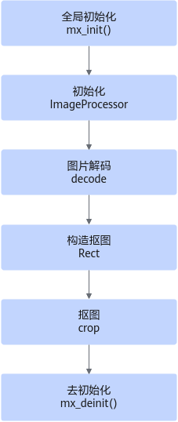

关键步骤说明如下：

1.  调用mx\_init\(\)接口进行全局初始化。
2.  ImageProcessor初始化。

    用户构造ImageProcessor对象，构造时需用户指定设备ID。

3.  使用图片解码接口对输入图片进行解码。

    根据业务对图片进行解码，生成可抠图的Image对象。后续可以通过图像处理接口对图片进行处理，生成最终需要抠图的Image对象。

4.  构造抠图Rect以及输出Image。

    根据业务要求，选择一对多、一对一或多对多的抠图方式，构造对应的输入Rect和输出Image。

5.  将输入图片及其他参数传入crop接口，获取抠图结果。
6.  调用mx\_deinit\(\)接口进行去初始化。

**示例代码<a name="section72231936165818"></a>**

以下为功能特性关键步骤的代码示例，不可以直接拷贝运行，仅供参考。

```
from mindx.sdk import base  
from mindx.sdk.base import ImageProcessor, Rect, Image

def process():
    # 图像解码  
    # 初始化ImageProcessor对象  
    imageProcessor = ImageProcessor(device_id)  
    image_path = "image_data/test_image.jpg"  
    # 读取图片路径进行解码，解码格式为nv12（YUV_SP_420）  
    decoded_image = imageProcessor.decode(image_path, base.nv12)  
    
    # 图像处理操作（抠图）  
    crop_para = [Rect(300, 100, 550, 350)]  
    croped_images = imageProcessor.crop(decoded_image, crop_para)

if __name__ == "__main__":
    base.mx_init()    # 资源初始化
    process()
    base.mx_deinit()  # 资源去初始化  
```


#### 缩放<a name="ZH-CN_TOPIC_0000001623333624"></a>

**功能介绍<a name="section39768396167"></a>**

对输入的图像进行缩放操作，输出到Image对象中。

接口说明请参考[resize](resize.md)。

**接口调用流程<a name="section37619358587"></a>**

使用缩放接口前，用户需准备好被缩放的图片对象。

**图 1**  图像处理（缩放）接口调用流程<a name="fig202793229437"></a>  
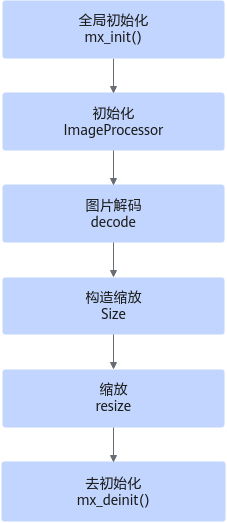

关键步骤说明如下：

1.  调用mx\_init\(\)接口进行全局初始化。
2.  ImageProcessor初始化。

    用户构造ImageProcessor对象，构造时需用户指定设备ID。

3.  使用图片解码接口对输入图片进行解码。

    根据业务对图片进行解码，生成可缩放的Image对象。后续可以通过图像处理接口对图片进行处理，生成最终需要缩放的Image对象。

4.  构造缩放参数和输出Image。

    根据业务要求，构造对应的输入Size和输出Image。

5.  将输入图片及其他参数传入resize接口，获取缩放结果。
6.  调用mx\_deinit\(\)接口进行去初始化。

**示例代码<a name="section72231936165818"></a>**

以下为功能特性关键步骤的代码示例，不可以直接拷贝运行，仅供参考。

```
from mindx.sdk import base  
from mindx.sdk.base import ImageProcessor, Size, Image

def process():
    # 图像解码  
    # 初始化ImageProcessor对象  
    imageProcessor = ImageProcessor(device_id)  
    image_path = "image_data/test_image.jpg"  
    # 读取图片路径进行解码，解码格式为nv12（YUV_SP_420）  
    decoded_image = imageProcessor.decode(image_path, base.nv12)  
    
    # 图像缩放  
    # 缩放尺寸  
    size_para = Size(224, 224)  
    # 将解码后的Image类按尺寸进行缩放，缩放方式为华为自研的高阶滤波算法（huaweiu_high_order_filter）
    resized_image = imageProcessor.resize(decoded_image, size_para, base.huaweiu_high_order_filter)

if __name__ == "__main__":
    base.mx_init()    # 资源初始化
    process()
    base.mx_deinit()  # 资源去初始化
```


#### 补边<a name="ZH-CN_TOPIC_0000001623493440"></a>

**功能介绍<a name="section39768396167"></a>**

对输入的图像进行补边操作，输出到Image对象中。

接口说明请参考[padding](padding.md)。

**接口调用流程<a name="section37619358587"></a>**

使用补边接口前，用户需准备好被补边的图片对象。

**图 1**  图像处理（补边）接口调用流程<a name="fig189901818553"></a>  
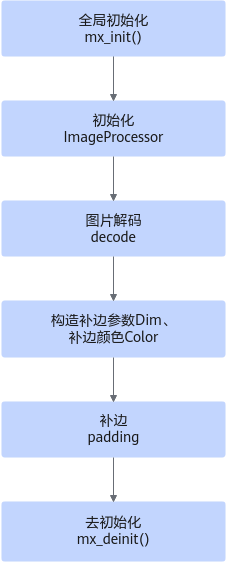

关键步骤说明如下：

1.  调用mx\_init\(\)接口进行全局初始化。
2.  ImageProcessor初始化。

    用户构造ImageProcessor对象，构造时需用户指定设备ID。

3.  使用图片解码接口对输入图片进行解码。

    根据业务对图片进行解码，生成可补边的Image对象。后续可以通过图像处理接口对图片进行处理，生成最终需要补边的Image对象。

4.  构造补边参数。

    根据业务要求，构造对应的输入的“padDim“（表示补边上下左右的像素值）、“color“（补边颜色）。

5.  调用padding接口对输入图像进行补边。
6.  调用mx\_deinit\(\)接口进行去初始化。

**示例代码<a name="section72231936165818"></a>**

以下为功能特性关键步骤的代码示例，不可以直接拷贝运行，仅供参考。

```
from mindx.sdk import base  
from mindx.sdk.base import ImageProcessor, Dim, Color, Image

def process():
    # 图像解码  
    # 初始化ImageProcessor对象  
    imageProcessor = ImageProcessor(device_id)  
    image_path = "image_data/test_image.jpg"  
    # 读取图片路径进行解码，解码格式为nv12（YUV_SP_420）  
    decoded_image = imageProcessor.decode(image_path, base.nv12)  
    
    # 图像补边  
    # 补边尺寸  
    dim_para = Dim(100, 100, 100, 100)  
    # 读取解码后的Image类按Dim进行补边，补边方式为重复最后一个元素  
    padded_image = imageProcessor.padding(decoded_image, dim_para, Color(0, 0, 0), base.border_replicate)  

if __name__ == "__main__":
    base.mx_init()   # 资源初始化
    process()
    base.mx_deinit() # 资源去初始化
```


#### 抠图缩放<a name="ZH-CN_TOPIC_0000001623813342"></a>

**功能介绍<a name="section39768396167"></a>**

对输入的图像进行抠图并缩放操作，输出到Image对象中。

接口说明请参考[crop\_resize](crop_resize.md)。

**接口调用流程<a name="section37619358587"></a>**

使用抠图缩放接口前，用户需准备好被抠图缩放的图片对象。

**图 1**  图像处理（抠图缩放）接口调用流程<a name="fig23991391455"></a>  
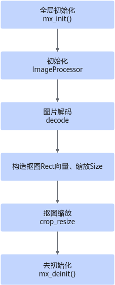

关键步骤说明如下：

1.  调用mx\_init\(\)接口进行全局初始化。
2.  ImageProcessor初始化。

    用户构造ImageProcessor对象，构造时需用户指定设备ID。

3.  使用图片解码接口对输入图片进行解码。

    根据业务对图片进行解码，生成可抠图缩放的Image对象。后续可以通过图片处理接口对图片进行处理，生成最终需要抠图缩放的Image对象。

4.  构造抠图缩放参数和输出Image。

    根据业务要求，选择单输入单抠图单缩放或单输入多抠图多缩放的方式，构造对应的输入的Rect、Size。

5.  调用crop\_resize接口对输入图片进行抠图缩放。
6.  调用mx\_deinit\(\)接口进行去初始化。

**示例代码<a name="section72231936165818"></a>**

以下为功能特性关键步骤的代码示例，不可以直接拷贝运行，仅供参考。

```
from mindx.sdk import base  
from mindx.sdk.base import ImageProcessor, Rect, Size, Image

def process():
    # 图像解码  
    # 初始化ImageProcessor对象  
    imageProcessor = ImageProcessor(device_id)  
    image_path = "test_image.jpg"
    # 读取图片路径进行解码，解码格式为nv12（YUV_SP_420）  
    decoded_image = imageProcessor.decode(image_path, base.nv12)  
    
    # 图像抠图并缩放  
    crop_resize_para = [(Rect(300, 100, 550, 350), Size(100, 100))]  
    crop_resize_image = imageProcessor.crop_resize(decoded_image, crop_resize_para)

if __name__ == "__main__":
    base.mx_init()    # 资源初始化
    process()
    base.mx_deinit()  # 资源去初始化
```


#### 抠图贴图<a name="ZH-CN_TOPIC_0000001672013337"></a>

**功能介绍<a name="section39768396167"></a>**

对输入的图像进行抠图并粘贴到背景图片中的操作，输出到Image对象中。

接口说明请参考[crop\_paste](crop_paste.md)。

**接口调用流程<a name="section37619358587"></a>**

使用抠图贴图接口前，用户需准备好被抠图以及被粘贴的图片对象。

**图 1**  图像处理（抠图贴图）接口调用流程<a name="fig187871317171814"></a>  
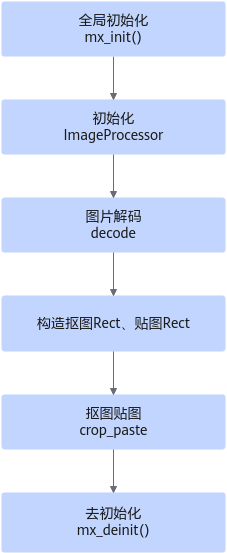

关键步骤说明如下：

1.  调用mx\_init\(\)接口进行全局初始化。
2.  ImageProcessor初始化。

    用户构造ImageProcessor对象，构造时需用户指定设备ID。

3.  使用图片解码接口对输入图片进行解码。

    根据业务对图片进行解码，生成可抠图贴图的Image对象。后续可以通过图像处理接口对图片进行处理，生成最终需要抠图贴图的Image对象。

4.  构造抠图贴图参数和输出Image。
    -   根据业务要求，设置被抠图片的矩阵并设置粘贴图片位置的矩阵，二者大小不一样时将自动进行缩放。
    -   构造输出图片的背景图片，使用Image构造函数构造被粘贴图片或其他非空图片作为输出。

5.  调用crop\_paste对输入图片进行抠图并将图片粘贴至指定位置。
6.  调用mx\_deinit\(\)接口进行去初始化。

**示例代码<a name="section72231936165818"></a>**

以下为功能特性关键步骤的代码示例，不可以直接拷贝运行，仅供参考。

```
from mindx.sdk import base  
from mindx.sdk.base import ImageProcessor, Rect, Image

def process():
    # 图像解码  
    # 初始化ImageProcessor对象  
    imageProcessor = ImageProcessor(device_id)  
    image_path = "image_data/test_image.jpg"  
    # 读取图片路径进行解码，解码格式为nv12（YUV_SP_420）  
    decoded_image = imageProcessor.decode(image_path, base.nv12)  
    
    # 图像抠图并贴图，paste_image为输出图片的背景图片，需用户自行构造  
    crop_paste_para = (Rect(300, 100, 550, 350), Rect(100, 100, 1500, 1500))  
    imageProcessor.crop_paste(decoded_image , crop_paste_para, paste_image)

if __name__ == "__main__":
    base.mx_init()    # 资源初始化
    process()
    base.mx_deinit()  # 资源去初始化
```


#### 视频编码<a name="ZH-CN_TOPIC_0000001672133249"></a>

**功能介绍<a name="section1573679583"></a>**

通过构造VideoEncoder类实例可实现视频编码功能，编码功能配置项及各项约束与支持情况请参考[VideoEncodeConfig类](VideoEncodeConfig类.md)。

视频编码支持自定义输出数据格式，通过自定义回调函数传入编码功能配置项，方便用户使用编码后的数据，详情可参考[VencCallBacker](VencCallBacker.md)。

视频编码接口说明请参考[VideoEncoder](VideoEncoder-305.md)。

**接口调用流程<a name="section1894563532818"></a>**

首先根据需求定义需要的输出数据组合方式，根据组合方式参考VencCallBacker定义回调函数传入编码功能配置项，然后实例化VideoEncoder类，最后调用encode成员函数完成编码，获取数据。

视频编码接口调用流程参考如下：

**图 1**  视频编码接口调用流程<a name="fig19671151793310"></a>  
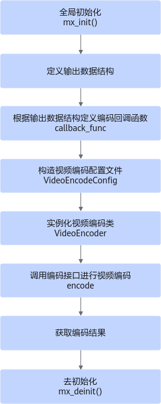

Vision SDK提供VideoEncoder类进行视频编码，关键步骤说明如下：

1.  调用mx\_init\(\)接口进行全局初始化。
2.  定义输出数据组合形式。
    -   输出数据包含视频帧编码后得到的Image类数据、当前编码帧的“frameId“和通道“channelId“。
    -   根据需要选择获取以上哪些数据。

3.  定义输出回调函数。
    -   根据要获取的数据定义回调函数，在函数内组装自定义数据。
    -   回调函数输入参数固定为callback\_func形式，函数内可选择输出。
    -   请勿在回调函数内实现过于复杂的操作，建议使用自定义“userData”来接收视频编码回调结果，否则回调线程会发生卡住的现象，导致视频编码速度变慢。

4.  构造视频编码配置项。

    配置项及各项约束与支持情况请参考VideoEncodeConfig数据结构说明。

5.  实例化视频编码类。

    将配置好的VideoEncodeConfig传入构造函数接口，实例化视频编码类。

6.  调用encode接口对视频进行编码。
7.  调用mx\_deinit\(\)接口进行去初始化。

**示例代码<a name="section194195101582"></a>**

如下提供关键步骤的代码示例，不可以直接拷贝运行，仅供参考。

```
import os
import numpy as np
import time
from mindx.sdk import base
from mindx.sdk.base import Image, ImageProcessor
from mindx.sdk.base import VideoEncoder, VideoEncodeConfig, VencCallBacker 

# 视频编码回调函数  
def venc_callback(pyChar, outDataSize, channelId, frameId):
    with open('video_save_data/output.h264', 'ab') as file:  
        file.write(pyChar)
  
def process():
    # 初始化VencCallBacker类并注册回调函数  
    vencCallBacker = VencCallBacker()  
    vencCallBacker.registerVencCallBack(venc_callback)  
    # 初始化VideoEncodeConfig  
    venc_conf = VideoEncodeConfig()  
    venc_conf.keyFrameInterval = 50  #I帧间隔。
    venc_conf.srcRate = 30  #输入码流帧率，单位fps。
    venc_conf.maxBitRate = 6000  #输出码率，单位kbps。
    venc_conf.ipProp = 30  #一个GOP内单个I帧bit数和单个P帧bit数的比例。
    venc_conf.rcMode = 0  #指定码率控制模式。 cbr 0或1, vbr 2, avbr 3, qvbr 4, cvbr 5
    venc_conf.sceneMode = 0  # 0 摄像机不运动或周期性连续运动的场景，支持h.264/h.265, 1, 高码率下运动场景，支持h.265
    venc_conf.displayRate = 30 #输出视频的播放帧率
    venc_conf.shortTermStatsTime = 40  # 码率短期统计时间，以秒为单位 取值范围：[1, 120]。rcMode=5时生效
    venc_conf.longTermStatsTime = 240  # 码率长期统计时间，默认为分钟。取值范围：[1, 1440]。rcMode=5时生效
    venc_conf.longTermMaxBitRate = 200  # 编码器输出长期最大码率，以kbps为单位。取值范围：[2, max_bit_rate]。rcMode=5时生效
    venc_conf.longTermMinBitRate = 1  # 编码器输出长期最小码率，以kbps为单位。取值范围：[0, long_term_max_bit_rate] 。rcMode=5时生效
    venc_conf.SetThresholdI(threshold_i=[0, 0, 0, 0, 3, 3, 5, 5, 8, 8, 8, 15, 15, 20, 25, 25])
    venc_conf.SetThresholdP(threshold_p=[0, 0, 0, 0, 3, 3, 5, 5, 8, 8, 8, 15, 15, 20, 25, 25])
    venc_conf.SetThresholdB(threshold_b=[0, 0, 0, 0, 3, 3, 5, 5, 8, 8, 8, 15, 15, 20, 25, 25])
    venc_conf.direction = 8 #在基于纹理宏块级码率控制时，用于控制加减方向。
    venc_conf.rowQpDelta = 1 #行级码率控制调节幅度是一帧内行级调节的最大范围，其中行级以宏块行为单位。调节幅度越大，允许行级调整的QP范围越大，码率越平稳。
    venc_conf.firstFrameStartQp = 32 #设置第一帧的起始Qp值
    # 初始化VideoEncoder  
    videoEncoder = VideoEncoder(venc_conf, vencCallBacker, device_id)  
    # 将编码后数据保存为本地视频，若视频文件已存在则删除  
    venc_save_path = os.path.join(save_path, 'output.h264')  
    video_encode_exists = os.path.exists(venc_save_path)  
    if video_encode_exists:  
        os.remove(venc_save_path)  
    # 从decoded_data_list中循环取Image类进行编码  
    for i, img in enumerate(decoded_data_list):  
        videoEncoder.encode(img, i) 

if __name__ == "__main__":
    base.mx_init()    # 资源初始化
    process()
    base.mx_deinit()  # 资源去初始化
```


#### 视频解码<a name="ZH-CN_TOPIC_0000001623653350"></a>

**功能介绍<a name="section1573679583"></a>**

通过构造VideoDecoder类实例可实现视频解码功能，解码功能配置项及各项约束与支持情况请参考[VideoDecodeConfig类](VideoDecodeConfig类.md)。

视频解码支持自定义输出数据格式，通过自定义回调函数传入解码功能配置项，方便用户解码后的数据，详情可参考[VencCallBacker](VencCallBacker.md)。

视频解码接口说明请参考[VideoDecoder](VideoDecoder-298.md)。

**接口调用流程<a name="section1894563532818"></a>**

首先根据需求定义需要的输出数据组合方式，根据组合方式参考VdecCallBacker定义回调函数传入解码功能配置项，然后实例化VideoDecoder类，最后调用decode成员函数完成解码，获取数据。

视频解码接口调用流程参考如下：

**图 1**  视频解码接口调用流程<a name="fig2242233174115"></a>  
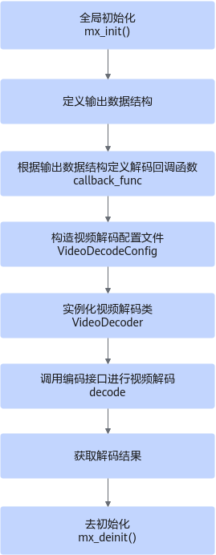

Vision SDK提供VideoDecoder类进行视频解码，关键步骤说明如下：

1.  调用mx\_init\(\)接口进行全局初始化。
2.  定义输出数据组合形式。
    -   输出数据包含视频帧解码后得到的Image类数据、当前解码帧的“frameId“和通道“channelId“。
    -   可根据需要选择获取以上哪些数据。

3.  定义输出回调函数。
    -   根据要获取的数据定义回调函数，在函数内组装自定义数据。
    -   回调函数输入参数固定为VideoDecodeCallBack形式，函数内可选择输出。
    -   请勿在回调函数内实现过于复杂的操作，建议只进行自定义获取解码数据操作。

4.  构造视频解码配置项。

    配置项及各项约束与支持情况请参考VideoDecodeConfig数据结构说明。

5.  实例化视频解码类。

    将配置好的VideoDecodeConfig传入构造函数接口，实例化视频解码类。

6.  调用decode接口对视频进行解码。
7.  调用mx\_deinit\(\)接口进行去初始化。

**示例代码<a name="section194195101582"></a>**

如下提供关键步骤的代码示例，不可以直接拷贝运行，仅供参考。

```
import os
import numpy as np
import time
from mindx.sdk import base
from mindx.sdk.base import Image, ImageProcessor
from mindx.sdk.base import VideoDecoder, VideoDecodeConfig, VdecCallBacker

decoded_data_list = []  
# 视频解码回调函数  
def vdec_callback(decodedImage, channelId, frameId):  
    # 解码完成的Image类存入列表中  
    decoded_data_list.append(decodedImage)    

def process():     
    # 初始化VdecCallBacker类并注册回调函数  
    vdecCallBacker = VdecCallBacker()  
    vdecCallBacker.registerVdecCallBack(vdec_callback)  
    # 初始化VideoDecodeConfig类并设置参数  
    vdecConfig = VideoDecodeConfig()  
    vdecConfig.skipInterval = 0  
    vdecConfig.inputVideoFormat = base.h264_main_level  
    vdecConfig.outputImageFormat = base.nv12  
    vdecConfig.width = 1920  
    vdecConfig.height = 1080  
    # 初始化VideoDecoder  
    videoDecoder = VideoDecoder(vdecConfig, vdecCallBacker, device_id, channel_id)  
    # 获取需解码视频帧文件名  
    srcDataList = ["frame-{}.data".format(i) for i in range(100)]  
    # 循环取帧解码  
    for i, fileName in enumerate(srcDataList):  
    # 读取视频帧数据存入file  
    file = np.fromfile(fileName, dtype='uint8')  
    # 视频帧数据解码  
    videoDecoder.decode(file, i) 

if __name__ == "__main__":
    base.mx_init()    # 资源初始化
    process()       
    base.mx_deinit()  # 资源去初始化
```


### 模型推理<a name="ZH-CN_TOPIC_0000001671813229"></a>

**功能介绍<a name="section16289143420588"></a>**

使用Vision SDK模型推理功能通过给定输入和指定模型，进行推理获得输出结果，支持om格式的模型推理，可使用ATC工具构建的动态Batch/动态分辨率和分档动态维度模型进行推理。模型推理输入为张量Tensor类型，由用户使用Vision SDK提供的接口构造使用。当前Vision SDK提供的Python接口只支持同步推理。

相关接口说明请参考[模型推理](模型推理-314.md)。

**接口调用流程<a name="section37619358587"></a>**

使用模型推理前，用户需准备好输入数据以及需要加载的模型，根据模型路径或者内存方式初始化Model类，通过调用Model类的infer接口获取模型推理结果。

模型推理调用流程参考如下：

**图 1**  模型推理接口调用流程<a name="fig18769152154012"></a>  
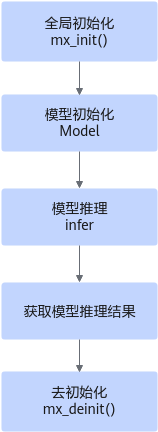

关键接口说明如下：

1.  调用mx\_init\(\)接口进行全局初始化。
2.  模型初始化。

    用户需根据实际业务情况确认模型加载方式，选择**从文件加载模型**或**从内存加载模型**。如果从内存加载，需要先将模型文件读取到内存，可通过以下两种方式传入。

    -   从文件加载模型，可选择直接向Model接口传入模型路径，进行初始化。
    -   通过结构体ModelLoadOptV2中的“loadType“字段指定加载方式后，再传入Model接口，其中加载方式在模型方面区分从文件加载模型，还是从内存加载模型，在内存方面区分是由系统内部管理，还是由用户管理，具体可参见[ModelLoadOptV2类](ModelLoadOptV2类.md)。

3.  调用infer接口获取模型推理结果。
4.  调用mx\_deinit\(\)接口进行去初始化。

**示例代码<a name="section72231936165818"></a>**

以下为功能特性关键步骤的代码示例，不可以直接拷贝运行，仅供参考。

```
import numpy as np 
from mindx.sdk import base 
from mindx.sdk.base import Tensor, Model

def process():
    # 模型推理  
    # 构造输入Tensor（以二进制输入为例）
    # 读取前处理好的numpy array二进制数据   
    input_array = np.load("preprocess_array.npy")  
    # 构造输入Tensor类并转移至device侧  
    input_tensor = Tensor(input_array)  
    input_tensor.to_device(device_id)  
    # 构造输入Tensor列表  
    input_tensors = [input_tensor]  
    # 模型路径  
    model_path = "resnet50_batchsize_1.om"  
    # 初始化Model类  
    model = Model(modelPath=model_path, deviceId=device_id)  
    # 执行推理  
    outputs = model.infer(input_tensors)

if __name__ == "__main__":
    base.mx_init()    # 资源初始化  
    process()
    base.mx_deinit()  # 资源去初始化
```


### 后处理<a name="ZH-CN_TOPIC_0000002039734705"></a>

**功能介绍<a name="section3385182613139"></a>**

一般情况下，获取模型文件时，会带有后处理的代码文件，建议使用和模型训练时一致的后处理流程，从而保证推理结果符合预期。

对于不同的经典模型，Vision SDK封装了不同的后处理函数，可实现不同模型的后处理操作，将模型推理后的数据直接传入后处理接口，得到最终结果，极大地简化了使用过程。

相关接口说明请参考[模型后处理](模型后处理-318.md)。

**接口调用流程图<a name="section163385506138"></a>**

以ResNet-50后处理为例：

**图 1**  接口调用流程图<a name="fig19153204117382"></a>  
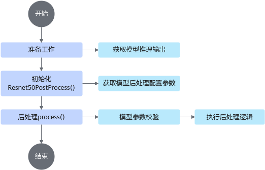

**示例代码<a name="section556019413166"></a>**

基于Vision SDK后处理函数（ResNet-50）的示例如下，不可以直接拷贝运行，仅供参考：

```
# 以Resnet50为例，模型输出为output
# 步骤1: 获取后处理对象，并加载配置信息和标签信息
postprocessor = post.Resnet50PostProcess(config_path=config_path, label_path=label_path) 

# 步骤2：将模型输出送入后处理接口process函数
pred = postprocessor.process([output])[0][0]  # pred：<ClassInfo classId=... confidence=... className=...>

# 步骤3：获取结果
confidence = pred.confidence  # 获取类别置信度
className = pred.className  # 获取类别名称
print('{}: {}'.format(className, confidence))  # 打印出结果  
```


### 运行样例<a name="ZH-CN_TOPIC_0000001673570265"></a>

运行样例前，需设置Vision SDK环境变量。

```
source {Vision SDK安装目录}/mxVision/set_env.sh
```

**运行样例<a name="section1446145103518"></a>**

根据用户需要准备好源码文件“main.py“，以及Python运行环境。

使用**python3**执行文件，命令参考如下。

```
python3 main.py
```


## 使用流程编排方式开发<a name="ZH-CN_TOPIC_0000001557588780"></a>

### 开发流程<a name="ZH-CN_TOPIC_0000001608308629"></a>

以流程编排方式开发推理应用，开发流程参考如[图1](#fig586995919228)。

**图 1**  流程编排<a name="fig586995919228"></a>  

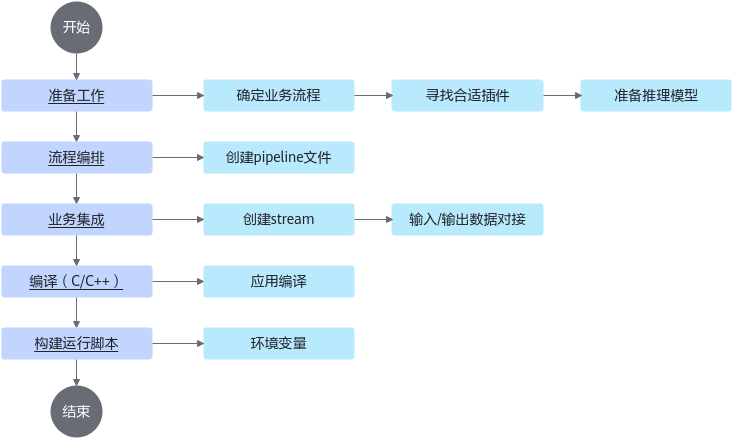

各环节关键步骤介绍：

1.  准备工作。
    1.  用户需参考典型业务流程，根据实际业务完成功能模块化、流程化的划分。
    2.  根据流程中的各模块功能，寻找合适的Vision SDK插件，可使用[Vision SDK插件库](准备工作.md#section1299611512482)中已提供的插件，也可开发自定义插件，具体请参见[（可选）插件开发](（可选）插件开发.md)。
    3.  根据流程中推理的需求，准备合适的模型，如模型未进行适配，还需进行模型转换，具体操作请参见《CANN ATC离线模型编译工具用户指南》。
    4.  对于模型输出的数据，用户可根据实际需求，选择对应的模型后处理整理输出例如置信度等可参考的结果。

2.  流程编排。
    1.  用户需了解业务流程如何通过流程编排中实现，数据结构在插件间传递的过程，具体请参见[业务流程实现介绍](流程编排.md#section1882202715507)。
    2.  通过编写pipeline文件将实际业务插件按照业务流程进行衔接，具体请参见[pipeline配置文件介绍](流程编排.md#section143202027115011)。
    3.  了解[多输入/输出插件的流程编排](流程编排.md#section12603126155320)使用与约束。
    4.  了解代码流程编排方式。

3.  业务集成。

    通过调用业务流管理的API（MxStreamManager），先进行初始化，再加载业务流配置文件（\*.pipeline），然后根据业务流配置文件中的StreamName往指定Stream获取输出数据（具体请参见[业务集成](业务集成.md)），最后销毁Stream。

4.  编译（仅C/C++涉及）。

    配置环境变量，编写“CMakeLists.txt“并执行编译。

5.  构建运行脚本。

    执行编译生成的可执行文件，运行验证应用。

>[!NOTE] 说明
>安装包中\{_vision安装路径_\}/samples/mxVision/下C++和python目录中包含流程编排方式的样例，执行步骤可参考对应目录下的README.md，其中编译和执行脚本为对应目录下的run.sh。执行前，run.sh脚本中的CANN相关环境变量请修改为CANN的实际安装路径。


### 准备工作<a name="ZH-CN_TOPIC_0000001608028277"></a>

**确定业务流程<a name="section276885194816"></a>**

根据业务的功能如目标检测、图像分类、属性识别等，将业务流程进行模块化，例如[图1](#fig963314539147)中的目标检测和图像分类串联业务，将流程依次划分为图片获取、图片解码、图像缩放、目标检测、图像裁剪、图像缩放、图像分类、序列化、结果发送。

**图 1**  典型推理业务流程<a name="fig963314539147"></a>  
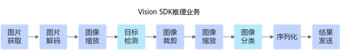

**寻找合适插件<a name="section1299611512482"></a>**

首先根据已有Vision SDK插件的功能描述和规格限制来匹配业务功能（Vision SDK插件列表请参见[表1](#table205997521332)，关于插件详细介绍及使用说明请参见[插件参考](插件参考.md)）。

当Vision SDK提供的插件无法满足功能需求时，用户可以参考[（可选）插件开发](（可选）插件开发.md)自定义插件。

**表 1**  插件列表

|插件类型|插件名称|功能简介|
|--|--|--|
|输入插件|appsrc|向Stream中发送数据，appsrc将数据发给下游元件。|
|mxpi_rtspsrc|接收外部调用接口的输入视频路径，对视频进行拉流，并将拉取的裸流存储到缓冲区（buffer）中，并发送到下游插件。|
|输出插件|mxpi_dataserialize|将Stream结果组装成JSON字符串输出。|
|appsink|从Stream中获取数据。|
|fakesink|一个吞噬任何数据的伪插件（黑洞插件），用于丢弃不需要的数据。|
|filesink|将输入的数据写入文件并存储到本地。|
|串流插件|mxpi_parallel2serial|多个端口输入数据通过一个端口按顺序输出。|
|mxpi_distributor|向不同端口发送指定类别或通道的数据。|
|mxpi_synchronize|等待所有输入端口都有数据后，再往输出端口推送数据。|
|queue|插件输出时，为后续处理过程创建一个新的线程，用于将输入数据与输出数据解耦并创建缓存队列，存储尚未输出到下游插件的数据。|
|tee|对单个输入数据分发多次。|
|mxpi_datatransfer|在Device与Host之间转移内存数据。|
|mxpi_nmsoverlapedroiV2|用于过滤分块后重叠区域重复目标。|
|mxpi_roigenerator|支持用户输入分块的个数、大小、overlap等参数，自动生成图像分块的目标框。|
|mxpi_semanticsegstitcher|对语义分割推理结果的图像进行合并。|
|mxpi_objectselector|用于多级推理时，根据面积最大最小、面积上下限、置信度阈值对后处理结果进行选择过滤。|
|mxpi_skipframe|对数据进行跳帧。|
|媒体数据处理插件|mxpi_imagedecoder|用于图像解码，支持JPG/JPEG/BMP格式。|
|mxpi_imageresize|图片缩放。对解码后的YUV、RGB格式的图像进行指定宽高的缩放。其中YUV_420既支持4k大小的图像，也支持8k大小的图像。其他类型的YUV图像，只支持4k大小的图像，如YUV422，YUV444等。RGB格式支持RGB888和BGR888。|
|mxpi_imagecrop|图像抠图。|
|mxpi_videodecoder|用于视频解码，当前只支持H.264/H.265格式。|
|mxpi_videoencoder|用于视频编码。|
|mxpi_imageencoder|用于图片编码。|
|mxpi_imagenormalize|用于图像归一化或标准化处理。|
|mxpi_opencvcentercrop|用于裁剪图片中心图片。|
|mxpi_warpperspective|透视变换插件，用于推理完后检测框是有角度的长方形，需要旋转成正长方形的场景，输出是各个检测框的抠图信息，抠的图是经过透视变换的。|
|mxpi_rotation|用于图片旋转。|
|推理插件|mxpi_modelinfer|目标分类或检测。（当前版本不再演进，请使用mxpi_tensorinfer插件。）|
|mxpi_tensorinfer|目标分类或检测。|
|模型后处理插件|mxpi_objectpostprocessor|继承图像后处理基类，用于对目标检测模型推理的输出张量进行后处理。|
|mxpi_classpostprocessor|继承模型后处理基类，用于对分类模型推理的输出张量进行后处理。|
|mxpi_semanticsegpostprocessor|继承图像后处理基类，用于对语义分割模型推理的输出张量进行后处理。|
|mxpi_textgenerationpostprocessor|继承模型后处理基类，用于对文本生成（以及翻译，文字识别，语音识别等）模型推理的输出张量进行后处理。|
|mxpi_textobjectpostprocessor|继承图像后处理基类，用于对文本目标框检测模型推理的输出张量进行后处理。|
|mxpi_keypointpostprocessor|继承图像后处理基类，用于对姿态检测模型推理的输出张量进行后处理。|
|智能视频分析（IVA）插件|mxpi_motsimplesort|实现多目标（包括机非人、目标）路径记录功能。（当前版本不再演进，请使用mxpi_motsimplesortV2）|
|mxpi_motsimplesortV2|实现多目标（包括机非人、目标）路径记录功能。|
|mxpi_facealignment|目标对齐插件，可用于矫正检测出的目标图像。|
|mxpi_qualitydetection|视频质量诊断插件，可用于对视频解码之后的图像进行质量分析检测，对异常的场景进行日志告警。|
|调试插件|mxpi_dumpdata|数据导出插件，用于导出上游插件的MxpiBuffer类型数据，以JSON格式输出。|
|mxpi_loaddata|数据加载插件，用于加载mxpi_dumpdata插件导出的文件，还原成MxpiBuffer，需要配合filesrc插件进行使用，filesrc作为mxpi_loaddata插件的上游插件读取文件内容后传给mxpi_loaddata。|
|屏幕展示插件|mxpi_opencvosd|调用OSD基础功能在图片上绘制基本单元，如画框、写字、画线、画圆等。|
|mxpi_object2osdinstances|目标框转绘图单元插件。|
|mxpi_class2osdinstances|分类结果转绘图单元插件。|
|mxpi_osdinstancemerger|将来自多个输入端口的绘图单元汇总。|
|mxpi_channelselector|透传指定通道ID的buffer，过滤其他通道的buffer，清空除帧信息外的元数据。|
|mxpi_channelimagesstitcher|将多路图片拼成一个大图，同时动态输出每路图片的前处理信息，提供给坐标组装插件。|
|mxpi_channelosdcoordsconverter|多路通道坐标转换插件。接收来自各路通道的绘图单元和拼接信息（坐标偏移）。输出汇总后的坐标转换结果。|
|mxpi_bufferstablizer|当设定时间没有buffer输入时，此插件会自动发送空buffer，直到重新有buffer输入为止。|


**准备推理模型<a name="section1531414527489"></a>**

1.  准备符合实际业务推理模型，参考《CANN ATC离线模型编译工具用户指南》将模型转换为om模型。
2.  准备模型后处理，可参见[模型支持参考](模型支持参考.md)使用Vision SDK提供的模型后处理。


### （可选）插件开发<a name="ZH-CN_TOPIC_0000001571594220"></a>

#### 插件开发步骤<a name="ZH-CN_TOPIC_0000001572519202"></a>

当现有插件无法满足业务需求时，用户可以基于Vision SDK提供的API开发新的插件。插件开发步骤依次为插件框架开发、插件输入数据获取、业务逻辑开发、输出结果发送、插件编译、插件调试，相关接口请参见[流程编排](流程编排-200.md)。

>[!NOTE] 说明
>插件开发过程中请避免使用静态变量，须保证多个插件实例间不会相互干扰。


#### 插件框架开发<a name="ZH-CN_TOPIC_0000001572679118"></a>

Vision SDK提供的插件框架，定义了如何生成标准插件，从而实现插件间的数据对接、插件属性设置。Vision SDK目前支持单输入、单输出、多输入、多输出插件。

1.  开发插件类。
    1.  继承“MxPluginBase.h“中的MxPluginBase基类，并自定义插件类名。
    2.  重写基类中的Init\(\)、DeInit\(\)、Process\(\)三个成员函数，参见[表1](#table1590842036)。
    3.  MxpluginBase中包含了“status\_“、“deviceId\_“、“dataSource\_“三个公共属性，参考[表2](#table350211521917)，公共属性可通过pipeline文件进行配置。

        **表 1**  成员函数说明

|成员函数|说明|
|--|--|
|Init()|该接口仅调用一次，用于实现配置参数获取、业务逻辑初始化（例如插件内可复用内存的申请）。|
|DeInit()|该接口仅调用一次，用于实现去初始化任务（例如内存释放）。|
|Process()|该接口由数据驱动，用于接收上游插件传入的数据，并在完成用户的业务处理逻辑后，向输出端口发送结果。|


        **表 2**  插件公共属性说明

|公共属性|说明|
|--|--|
|status_|该属性指定插件运行方式为同步执行或异步，int类型，取值范围[0, 1]，0为异步，1为同步，默认为0（异步执行），请用户根据实际情况设置。|
|deviceId_|该属性指定插件运行的芯片，int类型，默认与pipeline配置文件中开头的deviceId相同，请用户根据实际情况设置。|
|dataSource_|该属性指定插件处理数据的来源，string类型，默认为auto，用户可指定上游插件名称作为数据来源，请用户根据实际情况设置。|


2.  注册属性与获取属性值。

    属性用于提升插件的通用性，可通过修改pipeline配置文件中插件的属性来实现参数传递，进而达到适配业务的目的。

    1.  注册元件属性。

        用户重写DefineProperties函数，并按照如下方式注册自定义属性：

        ```
        std::vector<std::shared_ptr<void>> properties;
        std::shared_ptr<ElementProperty<string>> outputResizeHeight(new ElementProperty<string> {STRING, "resizeHeight", "resizeHeight", "the height of the resized output image",  640, 6, 4096});
        properties.push_back(parentNameSptr);
        return properties;
        ```

        其中ElementProperty为描述属性的结构体，内容和说明如下：

        ```
        template<class T>
        struct ElementProperty {
            PropertyType type;                     // 属性数据类型，可选STRING, INT, UINT, FLOAT, DOUBLE, LONG, ULONG。
            std::string name;                      // 属性名称，用于获取属性值（在获取属性值章节中介绍）。
            std::string nickName;                  // 属性别名，保留字段。
            std::string desc;                      // 属性描述，介绍该属性的功能。
            T defaultValue;                        // 属性默认值。
            T min;                                 // 属性最小值，按需填写，例如STRING类型数据无最小值，可填“NULL”。
            T max;                                 // 属性最大值，按需填写，同上。
        };
        ```

    2.  获取元件属性值。

        在“Init\(\)“函数中，插件对应的属性值将通过“configParamMap“入参传入，可通过属性名称获取。

        ```
        std::shared_ptr<string> outputResizeHeight = std::static_pointer_cast<string>(configParamMap["resizeHeight"]);
        std::string parentName = *outputResizeHeight.get();
        ```

3.  （可选）定义端口属性。

    插件的输入和输出端口分别用于接收输入数据和发送输出结果，插件支持注册多个输入/输出端口（参考[多输入/输出插件端口创建](#section422201881515)）。

    端口类型包括静态和动态两种（参考[动态端口创建](#section17322619161)）：静态端口为创建元件后必然生成的端口，端口必须有连接，否则Stream创建失败，动态端口数量可变，根据实际需要创建。

    通过重写DefineInputPorts与DefineOutputPorts函数，用户可以定义端口，以单输入静态端口为例，按照如下方式注册端口自定义属性：

    -   “DefineInputPorts“中，通过GenerateStaticInputPortsInfo\(\)接口构建静态输入端口信息MxpiPortInfo，Vision SDK获取“DefineInputPorts“的返回值用于创建端口。
    -   接口入参为一个二层vector，内层vector用于定义端口支持的数据格式（端口格式用于区分元件端口是否允许连接，目前已有端口格式请参考[表3](#table116995138149)），例如："image/jpeg"为JPEG图像解码前数据，用户可以给单个端口定义多个数据格式（以推理插件为例：\{"metadata/object", "metadata/class"\}）。
    -   接口外层vector用于区分端口数量，例如：\{\{"image/jpeg"\}, \{"metadata/object"\}\}表示创建两个端口，第一个为“jpeg”格式，第二个为“object”格式。

        >[!NOTE] 说明
        >自定义字符串只支持以英文字母开头，可使用字母，阿拉伯数字与下划线。建议使用"_一级类别_/_二级类别_"命名，例如"image/yuv"。

    -   同样的方式，在“DefineOutputPorts“定义输出端口。
        -   基类中：

            ```
            MxpiPortInfo MxPluginBase::DefineInputPorts()
            {
                MxpiPortInfo defaultInputPortInfo;
                std::vector<std::vector<std::string>> value = {{"ANY"}};
                GenerateStaticInputPortsInfo(value, defaultInputPortInfo);
                return defaultInputPortInfo;
            }
            ```

        -   推理插件中：

            ```
            MxpiPortInfo MpModelInfer::DefineInputPorts()
            {
                MxpiPortInfo inputPortInfo;
                std::vector<std::vector<std::string>> value = {{"image/yuv"}};
                GenerateStaticInputPortsInfo(value, inputPortInfo);
                return inputPortInfo;
            }
            ```

    目前已开发的插件所使用到的端口格式如[表3](#table116995138149)：

    **表 3**  端口格式

|端口|类型|
|--|--|
|原图|image/jpeg|
|视频|video/x-h264|
|解码图|image/yuvimage/rgb|
|目标框|metadata/object|
|图像类别|metadata/class|
|图像属性|metadata/attribute|
|图像特征|metadata/feature-vector|
|张量|metadata/tensor|
|绘图单元|metadata/osd|
|语义分割像素|metadata/semanticseg|
|纯文本|metadata/texts|
|目标关键点|metadata/keypoint|
|序列化结果|result/json-result|
|兼容任意|ANY，表示可以匹配任意格式数据，即这个端口可以与任意端口相连。|


    **表 4**  插件描述

|**插件**|**输入**|**输出**|**简述**|
|--|--|--|--|
|mxpi_imagedecoder|image/jpeg|image/yuv或image/rgb或metadata/object|图片解码，分块时支持metadata/object。|
|mxpi_videodecoder|video/x-h264|image/yuv或image/rgb|视频解码。|
|mxpi_imageresize|image/yuv或image/rgb或metadata/object|image/yuv或image/rgb|图片缩放。|
|mxpi_tensorinfer|metadata/tensor或image/yuv|metadata/tensor|张量推理。输入张量或者图片，输出张量。|
|mxpi_modelinfer|image/yuv|metadata/object或metadata/class或metadata/attribute或metadata/feature-vector或metadata/tensor|推理图片，不同模型后处理会得到不同结果：目标框、属性或特征。不使用后处理时，直接输出推理结果。|
|mxpi_imagecrop|metadata/objectbox|image/yuv或image/rgb|图片裁剪。|
|mxpi_dataserialize|ANY|result/json-result|序列化为JSON字符串。|


4.  插件框架构建与命名。

    插件源文件中，通过如下宏构建插件框架（其中“CustomPlugin”为用户自定义插件类名）。

    ```
    MX_PLUGIN_GENERATE(CustomPlugin)              // Register a custom plugin using macro.
    ```

    插件名称对应于pipeline配置文件中的“factory“参数，在插件“CMakeLists.txt“文件中通过以下方式注册（其中“mxpi\_customplugin”为插件名）。

    ```
    set(PLUGIN_NAME "mxpi_customplugin")
    add_compile_options("-DPLUGIN_NAME=${PLUGIN_NAME}")
    ```

**多输入/输出插件端口创建<a name="section422201881515"></a>**

插件开发支持用户添加多个输入端口或多个输出端口，多输入多输出插件开发需要增加如下步骤。

1.  选择数据的处理模式。

    -   同步处理：等待所有输入端口都收到上游发送的数据后调用插件的Process\(\)函数，即保证Process\(\)函数入参的vector中所有输入端口对应序号的数据都存在。
    -   异步处理：任意一个输入端口收到上游发送的数据就调用插件的Process\(\)函数，需判断Process\(\)函数入参的vector中的第几个编号存在数据。

    处理模式在pipeline中设置为配置参数“status“，“0“为异步，“1“为同步，默认为异步。

    **图 1**  通过status配置处理模式<a name="fig050521194418"></a>  
    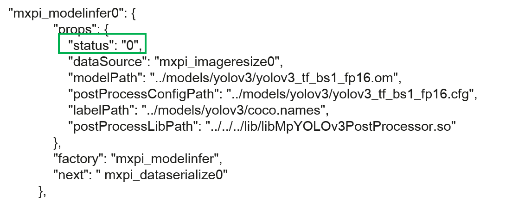

2.  修改插件输入接口DefineInputPorts函数的portNum，以推理插件为例，将输入设置成两端口。

    ```
    MxpiPortInfo MpModelInfer::DefineInputPorts()
    {
        MxpiPortInfo inputPortInfo;
        std::vector<std::vector<std::string>> value = {{"image/yuv"},{"image/yuv"}};
        GenerateStaticInputPortsInfo(value, inputPortInfo);
        return inputPortInfo;
    }
    ```

    修改插件输出接口DefineOutputPorts函数的portNum，以推理插件为例，将输出设置成两端口。

    ```
    MxpiPortInfo MpModelInfer::DefineOutputPorts()
    {
        MxpiPortInfo outputPortInfo;
        std::vector<std::vector<std::string>> value = {
            {"metadata/object", "metadata/class", "metadata/attribute", "metadata/feature-vector", "metadata/tensor"},
            {"metadata/object", "metadata/class", "metadata/attribute", "metadata/feature-vector", "metadata/tensor"}
        };
        GenerateStaticOutputPortsInfo(value, outputPortInfo);
        return outputPortInfo;
    }
    ```

3.  修改pipeline。
    -   含多输入端口的元件。

        **图 2**  多输入端口元件示例<a name="fig1912525812231"></a>  
        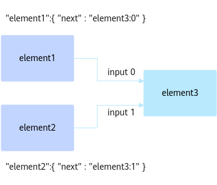

    -   含多输出端口的元件。

        **图 3**  多输出端口元件示例<a name="fig496644152615"></a>  
        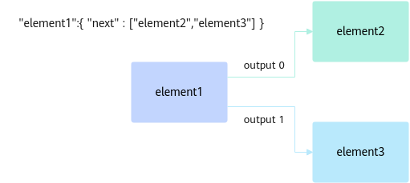

**动态端口创建<a name="section17322619161"></a>**

动态端口应用于可变输入或输出数据数量的场景，例如同步等待插件（mxpi\_synchronize），等待的输入数据个数可以由用户配置。动态端口的数量可变，用户可根据需要通过编辑pipeline配置文件创建。

如[图4](#fig2593443182313)所示，同步等待插件既可以创建两个也可以创建三个输入端口，图中右侧内容为pipeline配置文件对应内容。

**图 4**  动态端口元件使用示例<a name="fig2593443182313"></a>  
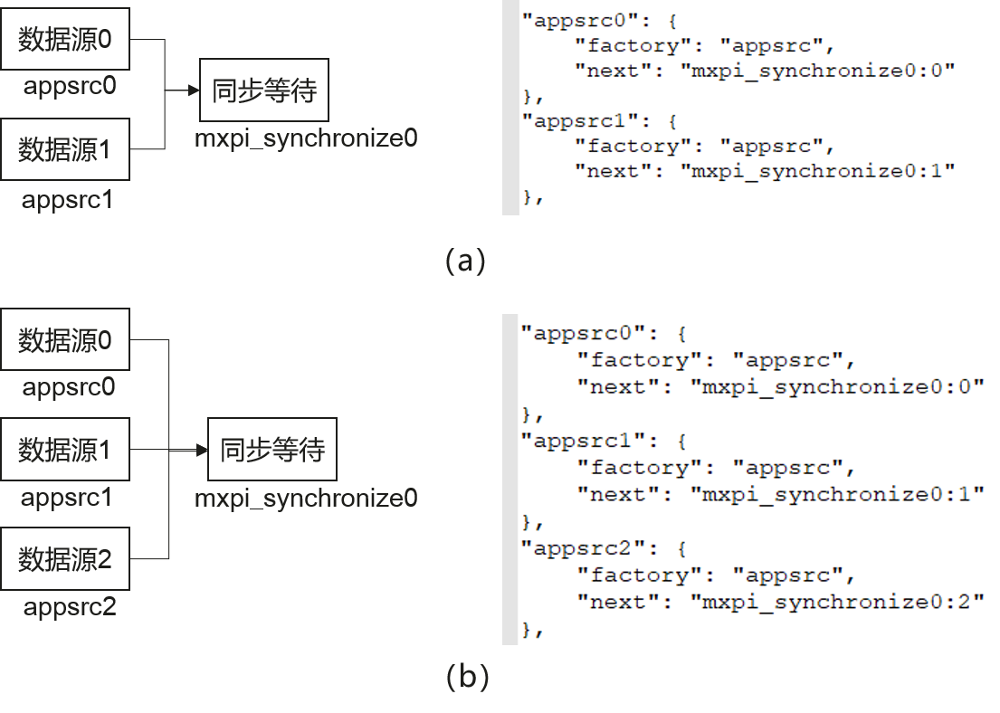


#### 自定义插件元数据<a name="ZH-CN_TOPIC_0000001623038865"></a>

在插件开发的过程中，现有的元数据（metadata）结构可能无法满足实际业务需求，此时，用户可通过MxpiCustomDataList和MxpiCustomData来自定义新的数据结构，其中MxpiCustomData包含map数据类型，可以通过添加（string类型）键值对的方式，添加自定义字段。

**创建自定义插件元数据<a name="section183728481077"></a>**

**图 1**  创建流程<a name="fig13340183962217"></a>  
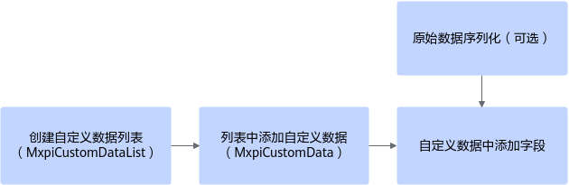

如[图1](#fig13340183962217)所示，自定义插件元数据可参考以下步骤创建和添加，创建的自定义数据列表数据将会通过插件输出。

1.  创建自定义数据列表，参考示例如下（以创建myDataList为例）。

    ```
    std::shared_ptr<MxTools::MxpiCustomDataList> myDataList = std::make_shared<MxTools::MxpiCustomDataList>();
    ```

2.  在自定义数据列表中添加自定义数据，参考示例如下。（其中，add\_datavec函数由protocol buffer编译生成。）

    ```
    MxTools::MxpiCustomData* arrayData = myDataList->add_datavec();
    ```

3.  通过mutable\_map添加map键值对，参考示例如下。（其中，mutable\_map函数由protobuf buffer编译生成。）

    ```
    (*arrayData->mutable_map())["myKey"] = "myValue" ;
    ```

    >[!NOTE] 说明
    >由于map的key与value只支持string类型。若数据不为string，则需要自行将数据序列化为string类型后，再添加数据。

**读取自定义插件元数据<a name="section24610342358"></a>**

**图 2**  读取流程<a name="fig6377192145715"></a>  


如[图2](#fig6377192145715)所示，下游插件可参考以下步骤对上游插件传递的自定义插件元数据进行读取，用户可对获取的数据进行业务处理。

1.  从上游插件中获取metadata并转换成MxpiCustomDataList类型，参考示例如下。

    ```
    auto metadata = mxpiMetadataManager.GetMetadataWithType("mxpi_CustomPlugin0", "MxpiCustomDataList");
    auto tmpDataList = std::static_pointer_cast<MxpiCustomDataList>(metadata);
    ```

2.  读取list中的元素，根据对应的key，获取value值，参考示例如下（以获取第一个元素值为例）。

    ```
    auto messageData = tmpDataList->datavec(0);
    auto data = (*(messageData.mutable_map()))["myKey"]; // myValue
    ```

    >[!NOTE] 说明
    >此时获取到的value值为string类型，用户需注意根据其对应的原始数据类型，对数据进行反序列化操作，还原为原始数据类型，再进行后续业务处理。


#### 输入数据获取<a name="ZH-CN_TOPIC_0000001622959297"></a>

插件之间传递的数据统一采用protobuf定义，具体的数据格式参考[Metadata](Metadata.md)和[Metadata proto文件](Metadata-proto文件.md)。相应的输入数据通过protobuf解析，输出结果通过protobuf组装。

Vision SDK通过插件的“Process\(\)“函数，将输入数据以入参（mxpiBuffer）形式传入，并通过“GetMetadata“接口提供给用户。

具体操作如下：

```
// Get the data from buffer
MxpiBuffer * buffer = mxpiBuffer[0];                 // 0为输入端口编号，当前版本固定为0。
MxpiMetadataManager mxpiMetadataManager(buffer);
std::shared_ptr<void> metadata = mxpiMetadataManager.GetMetadata(key);
std::shared_ptr<MxpiVisionList> srcVisionListSptr = std::static_pointer_cast<MxpiVisionList>(metadata);
```

其中，key为上游插件挂载输出结果时用的字符串（通常为上游元件名称，例如vpcresize0），将获取到的输入数据转换成相应的数据格式（通过查询上游插件的说明文档获取数据结构，例如MxpiVisionList）。

>[!NOTE] 说明
>自定义插件元数据获取及处理方式请参见[读取自定义插件元数据](自定义插件元数据.md#section24610342358)。


#### 业务逻辑开发<a name="ZH-CN_TOPIC_0000001572359642"></a>

用户在process接口中实现业务逻辑处理，根据需要使用[基础组件层](基础组件层.md)中提供的接口。


#### 输出结果发送<a name="ZH-CN_TOPIC_0000001622719209"></a>

1.  构建输出数据结构。

    插件之间传递的数据统一采用protobuf定义，根据API中提供的protobuf数据格式，选择合适的结构，具体的数据格式参考[Metadata](Metadata.md)和[Metadata proto文件](Metadata-proto文件.md)。无法匹配时，用户可自定义结构，但是必须遵守以下规则。

    数据结构内部为单个repeated变量，如下所示：

    ```
    message CustomDataList                      // 用户自定义数据类型。
    {    
        repeated CustomData dataVec = 1;
    }
    message CustomData                          // 用户自定义数据内容。
    {    
        repeated MxpiMetaHeader headerVec = 1;  // 用于描述数据之间的依赖关系，便于序列化插件组装数据。
        xxx;                                    // 用户自定义区域。
    }
    ```

    >[!NOTE] 说明
    >如需创建自定义插件元数据，添加新的数据结构，请参见[创建自定义插件元数据](自定义插件元数据.md#section183728481077)。

2.  发送数据。

    用户组装输出数据结构，然后通过调用“AddProtoMetadata\(\)“，将结果挂载至获取输入时对应的Buffer，最后通过“SendData\(\)“接口发送数据。

    ```
    MxpiMetadataManager mxpiMetadataManager(buffer);
    mxpiMetadataManager.AddProtoMetadata(metadataKey, std::static_pointer_cast<void>(customDataListSptr));   // customDataListSptr 为用户自定义数据结构的智能指针。
    SendData(0, buffer);                           // 0为输出端口编号，根据具体情况修改。
    ```

3.  异常输出。

    当业务逻辑出现异常时，同样需要将结果传递给下游，通过如下方式实现：

    1.  添加错误信息。

        将错误码和错误信息组装到MxpiErrorInfo数据结构中，并将错误信息添加到元数据（metadata）中。

        ```
        MxpiErrorInfo mxpiErrorInfo;
        mxpiErrorInfo.ret = ErrorCode;              // “ErrorCode”为对应的错误码。
        mxpiErrorInfo.errorInfo = "Image resize, failed.";
        MxpiMetadataManager mxpiMetadataManager(buffer);
        mxpiMetadataManager.AddErrorInfo(pluginName, mxpiErrorInfo);
        ```

    2.  发送错误信息。

        ```
        SendData(0, buffer);                        // 上一步操作已将错误信息挂载至buffer，执行该操作即可将错误信息发给下游插件。
        ```


#### 插件编译<a name="ZH-CN_TOPIC_0000001622878857"></a>

**CMakeLists.txt文件配置<a name="section192052717303"></a>**

主要用于设置插件名、添加生成插件动态库的目标文件以及链接相关的第三方库，每一个插件都有一个CMakeLists.txt文件与之对应。对于新增插件的CMakeLists.txt文件，用户只需修改生成的插件名和生成插件的目标文件即可，沿用原有插件的其他配置。以mxpi\_sampleplugin插件为例，示例操作如下：

```
set(PLUGIN_NAME "mxpi_sampleplugin")
set(TARGET_LIBRARY ${PLUGIN_NAME})

add_definitions(-D_GLIBCXX_USE_CXX11_ABI=0)
add_compile_options(-std=c++14 -fPIC -fstack-protector-all -pie -Wno-deprecated-declarations)
add_link_options(-Wl,-z,relro,-z,now,-z,noexecstack -s -pie)
add_compile_options("-DPLUGIN_NAME=${PLUGIN_NAME}")
add_definitions(-DENABLE_DVPP_INTERFACE)

include_directories(${CMAKE_CURRENT_BINARY_DIR})
add_library(${TARGET_LIBRARY} SHARED MxpiSamplePlugin.cpp)

target_link_libraries(${TARGET_LIBRARY} glib-2.0 gstreamer-1.0 gobject-2.0 gstbase-1.0 gmodule-2.0)
target_link_libraries(${TARGET_LIBRARY} mxpidatatype plugintoolkit mxbase mindxsdk_protobuf)

```

其中，“mxpi\_sampleplugin”和“MxpiSamplePlugin.cpp”分别代表生成的插件名和生成插件的目标文件。其他的配置沿用原有的插件。

**命令行编译<a name="section171871213308"></a>**

命令行编译主要根据“CMakeLists.txt“文件的配置，进行插件的编译和生成。

1.  新建“MxpiSamplePlugin“目录。

    ```
    cd {sdk_install_path}/samples/
    mkdir MxpiSamplePlugin
    ```

    >[!NOTE] 说明
    >_\{sdk\_install\_path\}_为Vision SDK软件包的安装路径。

2.  进入到“MxpiSamplePlugin“目录下。

    ```
    cd MxpiSamplePlugin
    ```

3.  将插件头文件、源文件和CMakeLists.txt文件存放至“MxpiSamplePlugin“目录。
4.  新建一个“build“文件夹，并跳转到“build“文件夹中。

    ```
    mkdir build
    cd build
    ```

5.  创建Makefile文件，避免污染项目的“CMakeLists.txt“。

    ```
    cmake ..
    ```

6.  根据生成的Makefile文件编译项目。

    ```
    make -j
    ```

7.  将生成插件的.so文件权限设置为“440“并拷贝至“plugins“目录下。

    ```
    chmod 440 libmxpi_sampleplugin.so
    cp libmxpi_sampleplugin.so ../../../lib/plugins/
    ```


### 流程编排<a name="ZH-CN_TOPIC_0000001557908324"></a>

**业务流程实现介绍<a name="section1882202715507"></a>**

通过pipeline配置文件，Stream manager可识别需要构建的Element以及Element之间的连接关系，并启动业务流程。Stream manager对外提供接口，用于向Stream发送数据和获取结果，帮助用户实现业务对接。

Plugin表示业务流程中的基础模块，通过Element的串接构建成一个Stream。Buffer用于内部挂载解码前后的视频、图像数据，是Element之间传递的数据结构，同时也允许用户挂载元数据（Metadata），用于存放结构化数据（如目标检测结果）或过程数据（如缩放后的图像）。

**图 1** Vision SDK业务流程相关基础单元<a name="fig7915847132817"></a>  
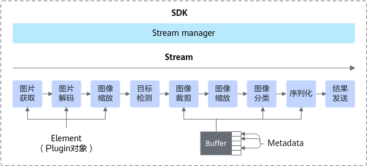

**表 1**  基础概念介绍

|名称|类名称|说明|描述|
|--|--|--|--|
|Stream|MxStream|业务流|完整的推理业务流，由插件串流组成。|
|Stream manager|MxStreamManager|业务流管理模块|负责创建和销毁Stream，同时提供向其发送数据和获取结果的接口。|
|Plugin|MxPlugin|功能插件|业务流程中的功能模块，构成业务流的基础单元。|
|Element|无|功能元件|由插件so实例化生成的对象，同一个插件so可以实例化多个对象，如图1中两个图像缩放元件。|
|Plugin Buffer|MxpiBuffer|插件缓存|插件之间传递的数据，其内容为非结构化数据，例如解码前后的视频、图像数据。|
|Plugin Metadata|MxpiMetadata|插件元数据|插件生成的结构化数据，例如分类信息、目标信息。元数据依附在插件缓存上实现传递。|


**数据流程介绍<a name="section3393173316139"></a>**

为了方便用户理解数据结构在插件间传递的过程，下面以一张图片作为输入，结合代码详细阐述这一数据传递过程。

**图 2**  数据结构传递流程图<a name="fig41452819472"></a>  
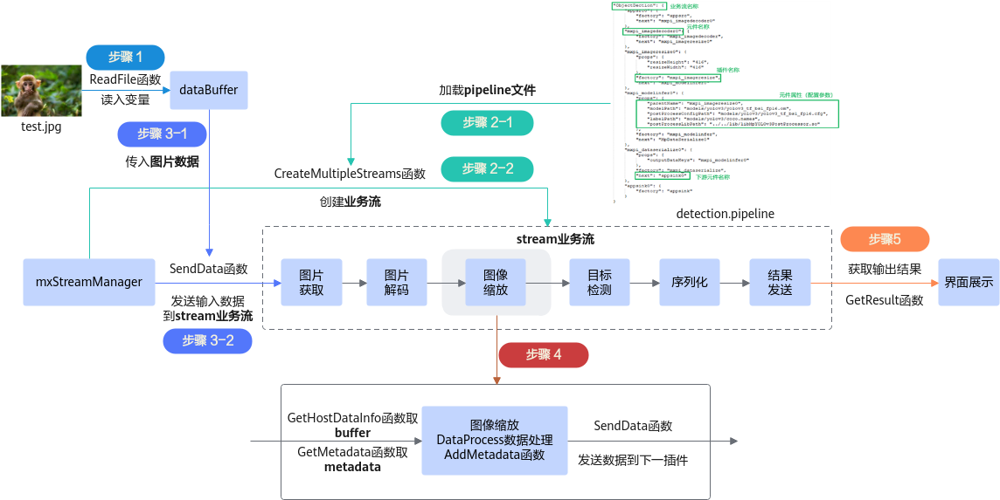

1.  新建一个存储输入图片的MxstDataInput变量，通过ReadFile函数读取图片数据到dataBuffer变量。

    ```
    MxStream::MxstDataInput dataBuffer;
    APP_ERROR ret = ReadFile("./test.jpg", dataBuffer);
    ```

2.  新建一个流管理的MxStreamManager对象并初始化，然后加载pipeline文件。

    ```
    MxStreamManager *mxStreamManager = new MxStream::MxStreamManager();
    ret = mxStreamManager->InitManager();
    string streamsConfig = "detection.pipeline"; //detection.pipeline文件中可以有一个或多个业务流
    APP_ERROR ret = mxStreamManager->CreateMultipleStreams(streamsConfig); //统一按照处理多个业务流的方式处理
    ```

3.  通过SendData函数传递输入数据到“图片获取”模块。

    ```
    ret = mxStreamManager->SendData(streamName, inPluginId, dataBuffer); //streamName是pipeline文件中业务流的名称；inPluginId为输入端口编号，对应输入元件的编号
    ```

4.  在各个插件的Process函数中处理数据流程。
    1.  接收上一个插件的buffer数据及挂载在buffer上的metadata数据。

        ```
        MxpiFrame inputMxpiFrame = GetHostDataInfo(*mxpiBuffer); //若数据在Device侧，则调用GetDeviceDataInfo函数
        MxpiMetadataManager mxpiMetadataManager(*mxpiBuffer); //新建一个Metadata管理器对象
        shared_ptr<void> metadata = mxpiMetadataManager.GetMetadata("keyName"); //根据key名称拿到挂载在buffer上的metadata数据，keyName通常为上一个插件的插件名
        ```

    2.  业务逻辑处理。

        ```
        DataProcess(inputMxpiFrame, metadata, outputMetadata); //插件内部实现的数据处理功能，如：解码，缩放，推理等
        mxpiMetadataManager.AddMetadata("keyName", outputMetadata); //挂载outputMetadata数据到buffer上，keyName通常为当前插件的插件名
        ```

    3.  发送buffer数据到下一个插件。

        ```
        SendData(inPlugin, *mxpiBuffer); //调用MxPluginBase的SendData方法将数据发送到下一个插件
        ```

5.  通过GetResult函数获取最后一个插件的输出结果。

    ```
    MxStream::MxstDataOutput* output = mxStreamManager->GetResult(streamName, outPluginId); //outPluginId为输出端口编号，对应输出元件的编号。
    ```

**pipeline配置文件介绍<a name="section143202027115011"></a>**

[图3](#fig10427101016573)、[图4](#fig64141219144)为推理业务流pipeline配置文件样例，包括业务流名称、Stream配置、元件名称、插件名称、元件属性、下游元件名称。

**图 3**  pipeline配置文件样例<a name="fig10427101016573"></a>  
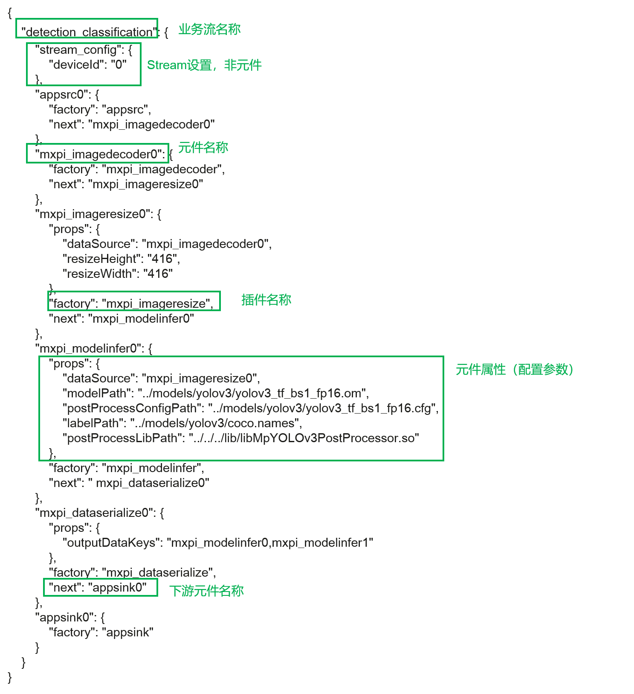

**图 4**  pipeline配置文件带nextMeta样例<a name="fig64141219144"></a>  
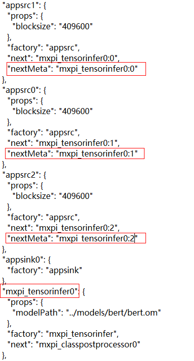

配置文件以JSON格式编写，用户必须指定业务流名称、元件名称和插件名称，并根据需要，补充元件属性和下游元件名称信息，否则创建流会失败、产生错误，具体参见[表2](#table429384316313)。

**表 2**  pipeline配置文件说明<a id="table429384316313"></a>


|名称|是否必选|描述|
|--|--|--|
|业务流名称（Stream）|必选|用于指定需要操作的Stream实体。例如Stream manager发送数据时，需要指定Stream名称。|
|Stream配置（Stream_config）|必选|设置Stream的配置参数。例如Device ID，即指定Stream运行在哪个设备上。|
|元件名称（Element）|必选|用于构建Stream中的插件实体，即插件的对象。与“下游元件名称”配合使用，用于定义元件间的连接关系。建议以插件基类名+序号命名，且保证Stream内名称唯一。“ReserveMetadataGraph”和“ReservedVisionList”为保留字段，不允许传入。|
|插件名称（Factory）|必选|用于构建元件。可通过插件参考获取。|
|元件属性（Props）|可选|用于根据业务特点修改相应的配置参数。例如图像缩放插件中，指定输出图像的宽高。具体请参见插件参考，每个属性都有默认值。|
|下游元件名称（Next）|必选（除Stream中最后的元件）|用于根据具体业务，确定下游元件的功能。本插件产生的数据将传递给下游元件。若存在多个下游插件时，用逗号分隔，冒号后面添加端口号，用中括号包含在一起。“ReserveMetadataGraph”和“ReservedVisionList”为保留字段，不允许传入。|
|下游元数据接收元件名称（nextMeta）|可选|主要针对多输入端口的插件进行设置，确定下游元数据接收元件的功能。本插件产生的元数据将传递给下游元件，若存在多个下游插件时，用逗号分隔，用中括号包含在一起，可在冒号后面添加端口号用于指定相同下游元件时的输入顺序，若不添加端口号将以默认顺序输入。|


其中，公共属性可直接在“props“属性内配置参数，具体配置说明请参见[表3](#table765814520329)。

**表 3**  插件公共属性配置说明

|名称|是否必选|描述|
|--|--|--|
|dataSource|可选（建议使用上游的nextMeta属性进行替换。）|插件process函数处理的数据来源，Stream上游的Vision SDK插件，不支持GStreamer原生插件。string类型，默认为auto。该值由一个或多个上游插件的nextMeta属性所指定。若上游插件未设置nextMeta到该插件时，该插件输入以该插件的dataSource属性为准，反之以nextMeta为准。|
|status|可选|指定插件为同步或异步执行。int类型，取值范围[0, 1]，0为异步，1为同步，默认为0（异步执行），请用户谨慎设置。|
|deviceId|可选|指定插件运行的Device侧设备ID。int类型，默认为0。目前单个Stream只支持在一个Device上运行，请通过Stream_config指定deviceId。|


>[!NOTE] 说明
>不论属性值的数据类型是否为字符串，属性值都以字符串方式填写。例如"resizeWidth": "2048"，而非"resizeWidth": 2048。

**多输入/输出插件的流程编排<a name="section12603126155320"></a>**

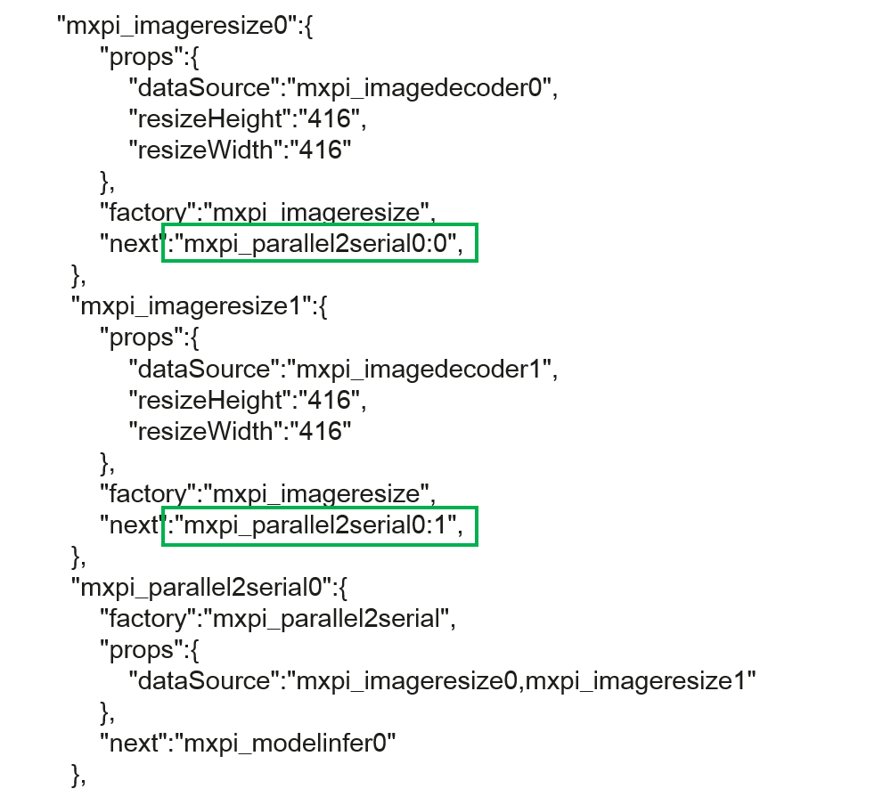

当元件包含多个输出端口时，在“next“对应的value（值）中通过“\[\]”指定的多个元件，通过“,”区分，如[图5](#fig1747816481573)所示。

**图 5**  多输出元件流程编排样例<a name="fig1747816481573"></a>  
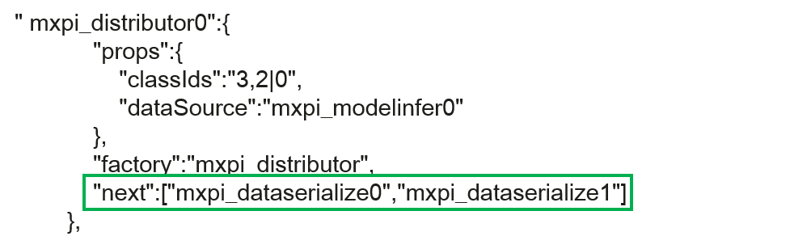

>[!NOTE] 说明
>“\[\]”中指定的元件序号与当前元件的输出端口一一对应，即“\[\]”中第一个元件与当前元件的第0号端口关联，第二个元件与当前的第1号端口关联，以此类推。

**批量设置deviceId<a name="section81021411113317"></a>**

pipeline配置文件中添加“stream\_config“字段对应的“deviceId“属性，默认为0，实现批量设置插件的Device ID，如[图6](#fig159501753101611)所示。

>[!NOTE] 说明
>每个Stream需要单独配置“stream\_config“。

**图 6**  批量设置Device ID<a name="fig159501753101611"></a>  
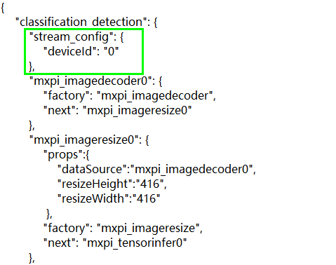

**代码流程编排介绍<a name="section5497153413296"></a>**

代码流程编排指通过类似深度学习框架构图的方式来创建Stream，避免编写复杂的pipeline文件，从而达到快速、高效实现流程编排的目的。关键功能参见如[表4](#table1932124616181)，编写样例请参见[图7](#fig1493221619372)。

**表 4**  功能说明

|名称|类名称|说明|描述|
|--|--|--|--|
|PluginNode|PluginNode|插件节点|用于定义插件，包括插件名、类型、属性等。|
|Stream|Stream|业务流|完整的推理业务流，由插件串流组成。|
|Sequential Stream|SequentialStream|顺序式业务流|该业务流主要处理顺序式的业务，即插件之间关系只有前后的顺序关系。|
|Functional Stream|FunctionalStream|函数式业务流|该业务流可处理复杂的如多输入多输出的流程关系。|


**图 7**  代码流程编排使用样例图<a name="fig1493221619372"></a>  
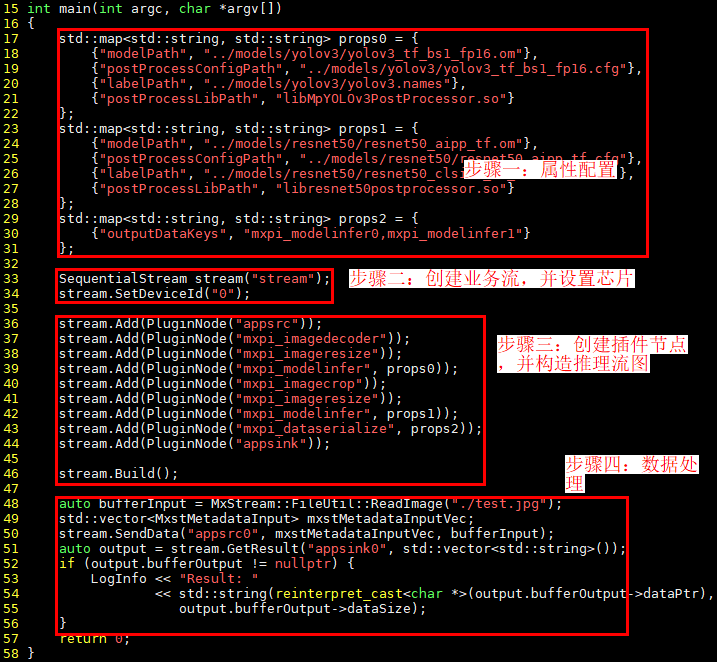

代码流程编排的使用主要分为四个步骤：

1.  属性配置。根据插件需要配置单独的属性，可选。
2.  创建业务流，并设置芯片。业务流用于后续插件的拼接以及数据处理。
3.  创建插件节点，并构造推理流图。
4.  数据处理。创建输入对象后，通过Stream的SendData、GetResult接口来传入数据和获取结果。


### 业务集成<a name="ZH-CN_TOPIC_0000001623533233"></a>

**SendData/GetResult数据流图<a name="section8643185116143"></a>**

用户使用SendData接口将图片数据发送给appsrc元件，inPluginId指定appsrc元件的编号，appsrc元件发送数据给pipeline中的其他元件处理，处理结果发送给appsink元件，用户使用GetResult接口获取appsink元件的数据，其中outPluginId指定appsink元件编号。

本套接口可以用于没有appsrc元件或appsink元件的场景（即不需要外部输入数据或调接口获取结果），例如将appsrc元件改成视频取流元件mxpi\_rtspsrc时，不需要通过SendData接口发送数据，输出结果可以用GetResult或GetResultSP接口获取。

>[!NOTE] 说明
>-   当多个线程同时调用SendData接口时，GetResult接口获取的结果顺序不确定。SendData接口支持多个appsrc输入元件，GetResult接口支持多个appsink输出元件。
>-   GetResultSP接口返回数据为智能指针类型，用户无需管理这部分内存，具体请参见[GetResultSP](GetResultSP.md)。

**图 1**  SendData/GetResult数据流图<a name="fig191432614521"></a>  
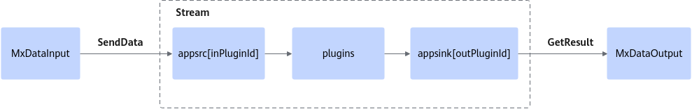

**SendDataWithUniqueId/GetResultWithUniqueId数据流图<a name="section203491026145719"></a>**

用户使用SendDataWithUniqueId接口将图片数据发送给appsrc元件，inPluginId（当前固定为“0“）指定appsrc元件的编号，返回整数uniqueId给用户，appsrc发送数据给pipeline处理，将处理结果以uniqueId为key保存在outputMap中，用户使用GetResultWithUniqueId或GetResultWithUniqueIdSP接口（**使用发送时获得的uniqueId作为入参**）取出与SendDataWithUniqueId对应的推理结果。

>[!NOTE] 说明
>-   SendDataWithUniqueId和GetResultWithUniqueId只支持Stream仅包含单个appsrc和单个appsink元件的场景。
>-   GetResultWithUniqueIdSP接口返回数据为智能指针类型，用户无需管理这部分内存，具体请参见[GetResultWithUniqueIdSP](GetResultWithUniqueIdSP.md)。

**图 2**  SendDataWithUniqueId/GetResultWithUniqueId数据流图<a name="fig7725315135310"></a>  
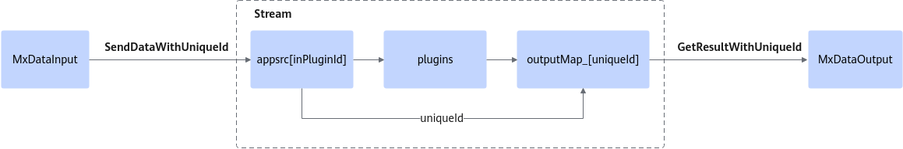

**SendMultiDataWithUniqueId/GetMultiResultWithUniqueId数据流图<a name="section570015319140"></a>**

用户使用SendMultiDataWithUniqueId接口将图片数据发送给appsrc元件，inPluginId（当前固定为“0“）指定appsrc元件的编号，返回整数uniqueId给用户，appsrc发送数据给pipeline处理，将处理结果以uniqueId为key保存在outputMap中，用户使用GetMultiResultWithUniqueId或GetMultiResultWithUniqueIdSP接口（**使用发送时获得的uniqueId作为入参**）取出与SendMultiDataWithUniqueId对应的推理结果。

>[!NOTE] 说明
>-   SendMultiDataWithUniqueId和GetMultiResultWithUniqueId只支持Stream仅包含单个appsrc和单个appsink元件的场景。
>-   GetMultiResultWithUniqueIdSP接口返回数据为智能指针类型，用户不需管理这部分内存。具体请参见[GetMultiResultWithUniqueIdSP](GetMultiResultWithUniqueIdSP.md)。
>-   暂仅支持C++接口。

**图 3**  SendMultiDataWithUniqueId/GetMultiResultWithUniqueId数据流图<a name="fig1579762813543"></a>  
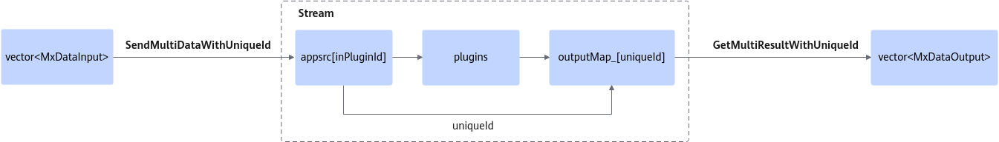

**SendProtobuf/GetProtobuf数据流图<a name="section496518720595"></a>**

用户使用接口SendProtobuf将protobuf数据和key（用于将protobuf数据挂载至元数据中，使用该数据的元件可以通过这个key获取数据）批量或单个发送给appsrc元件，inPluginId指定appsrc的编号，appsrc发送数据给其他元件处理。元件处理完数据后，以元件名为key将处理结果保存至元数据中，最后通过GetProtobuf接口从元数据中取出想要获取的元件结果，输入一组key，便能获取key对应的protobuf数据。

本套接口可以用于没有appsrc或appsink元件的场景（即不需要外部输入数据或调接口获取结果），例如将appsrc改成视频取流元件mxpi\_rtspsrc时，不需要通过SendProtobuf发送数据，输出结果可以用GetProtobuf获取。

>[!NOTE] 说明
>当多个线程同时调用SendProtobuf接口时，GetProtobuf获取的结果顺序不确定。SendProtobuf接口支持多个appsrc输入插件，GetProtobuf支持多个appsink输出元件。

**图 4**  SendProtobuf/GetProtobuf数据流图<a name="fig1117311918555"></a>  
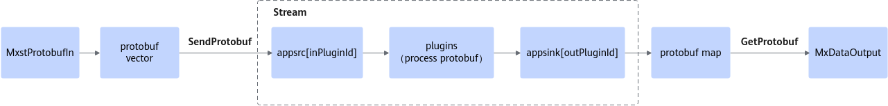

**接口对比表<a name="section373011016377"></a>**

|接口名称|输入数据类型|输出数据类型|输入和输出是否有序|是否支持多输入多输出|是否必须配对使用|使用场景|
|--|--|--|--|--|--|--|
|SendData/GetResult|图片|序列化输出结果、protobuf|否|是|否|支持单线程有序或多线程输出结果无序。|
|SendDataWithUniqueId/GetDataWithUniqueId|图片|序列化输出结果|是|否|是|支持输入输出有序的单线程或多线程。例如，创建推理服务，不同客户端并发向其发送请求。|
|SendMultiDataWithUniqueId/GetMultiResultWithUniqueId|多张图片|序列化输出结果|是|否|是|支持一次性输入多张图片并输入输出有序的单线程或多线程。例如，创建推理服务，不同客户端并发向其发送请求。|
|SendProtobuf/GetProtobuf|protobuf|protobuf|否|是|否|支持单线程有序或多线程输出结果无序。|


### 编译运行<a name="ZH-CN_TOPIC_0000001608148713"></a>

**设置环境变量<a name="section11970133015338"></a>**

编译运行样例前，需设置Vision SDK环境变量。

```
source {Vision SDK安装目录}/mxVision/set_env.sh
```

>[!NOTE] 说明
>set\_env.sh脚本中的\{GST\_PLUGIN\_PATH\}主要用于指定GStreamer查找插件库文件的路径；\{GST\_PLUGIN\_SCANNER\}环境变量主要用于指定GStreamer插件扫描器（gst-plugin-scanner）的路径。请确保\{GST\_PLUGIN\_PATH\}和\{GST\_PLUGIN\_SCANNER\}为有效的环境变量。

**编译（C/C++）<a name="section8283142415592"></a>**

执行编译，可参考软件包安装目录中“samples/C++“目录下的“CMakeLists.txt“。

**运行<a name="section133011537185911"></a>**

根据调试需求编写日志配置文件“logging.conf“，然后将插件动态库、模型文件（模型om文件和对应后处理库）、业务流配置文件打包后启动业务。


